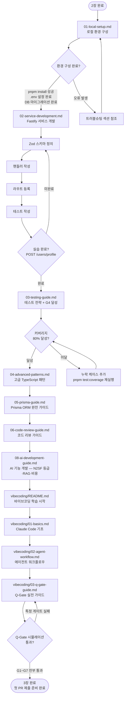

# 3장 — 개발 워크플로우

> **문서 ID**: ONBOARD-03-INDEX
> **버전**: 1.0.0 | **작성일**: 2026-04-11 | **작성자**: Implementer (Sonnet)
> **선행 학습**: `02-code-management.md` (2장)
> **대상**: 신규 백엔드 개발자, 풀스택 개발자

---

## 이 섹션에서 배우는 것

공공기관 SaaS 프레임워크에서 실제로 코드를 작성하고, 서비스를 개발하며, Claude Code와 협력하는 전체 개발 워크플로우를 배웁니다.

---

## 섹션 구조

```
03-development/
├── README.md                      ← 이 파일 (개요 + 학습 순서)
├── 01-local-setup.md              ← 로컬 개발 환경 구성
├── 02-service-development.md      ← Fastify 서비스 개발 패턴
├── 03-testing-guide.md            ← 테스트 전략 + Q-Gate G4 80% 달성
├── 04-advanced-patterns.md        ← 고급 TypeScript 패턴 (플러그인, Repository, Event, Circuit Breaker, Saga, CQRS)
├── 05-prisma-guide.md             ← Prisma ORM 완전 가이드 (CRUD, 관계, 마이그레이션, 트랜잭션, 성능)
├── 06-code-review-guide.md        ← 코드 리뷰 가이드 (7가지 체크리스트, CSAP 위반 TOP 5, Claude Code 셀프 리뷰)
├── 07-monorepo-navigation.md      ← 모노레포 탐색 — pnpm workspace, Turbo 캐싱, 패키지 의존성 그래프
├── 08-ai-development-guide.md     ← AI 기능 개발 가이드 (N2SF 등급, ai-service 호출, RAG, 테스트, 비용)
└── vibecoding/
    ├── README.md                  ← 바이브코딩 학습 경로
    ├── 01-basics.md               ← Claude Code 기초
    ├── 02-agent-workflow.md       ← 에이전트 워크플로우
    └── 03-q-gate-guide.md        ← Q-Gate 실전 가이드
```

---

## 학습 순서 플로우차트



---

## 각 파일 요약

### `01-local-setup.md` — 로컬 개발 환경 구성

**소요 시간**: 약 2~3시간 (초기 설정 포함)

다루는 내용:
- pnpm 모노레포 설치 및 빌드
- 개별 서비스 로컬 실행 방법
- `.env` 파일 설정 (`.env.example` 기반)
- Prisma 마이그레이션 및 시드 데이터
- 테스트 실행 방법
- 로컬 k3s 배포
- 개발 중 자주 쓰는 명령어 모음 (치트시트)

**선행 조건**: Git 클론 완료, Node.js 22 설치

---

### `02-service-development.md` — Fastify 서비스 개발

**소요 시간**: 약 4~6시간 (실습 포함)

다루는 내용:
- Fastify 서비스 표준 구조 이해
- 새 엔드포인트 추가하는 4단계 패턴
- Prisma ORM 사용법 (쿼리, 트랜잭션, 마이그레이션)
- Redis 캐시 패턴
- 감사 로그 추가 방법 (`auditLog()`)
- RBAC 권한 검사 추가
- 실습: `POST /users/profile` 엔드포인트 구현

**선행 조건**: `01-local-setup.md` 완료, TypeScript 기본 지식

---

### `03-testing-guide.md` — 테스트 전략과 Q-Gate G4 달성

**소요 시간**: 약 3~4시간

다루는 내용:
- 이 프로젝트의 테스트 전략 (단위 → 통합 → E2E 피라미드)
- Vitest 프레임워크 사용법
- 단위 테스트 작성법 (Zod 스키마, 순수 함수, 비즈니스 로직)
- Redis(ioredis), Prisma 모킹 패턴
- Fastify inject 방식 통합 테스트
- 커버리지 80% 달성 전략 (vitest.config.ts 설정 포함)
- `pnpm test`, `pnpm test:coverage` 명령어
- Q-Gate G4 실패 시 진단 및 해결 방법
- Claude Code로 테스트 생성 요청 프롬프트 예시
- TDD 사이클 (Red → Green → Refactor) 실습

**선행 조건**: `02-service-development.md` 완료, Vitest/Jest 기초 지식 권장

---

### `04-advanced-patterns.md` — 고급 TypeScript 패턴

**소요 시간**: 약 5~7시간 (실습 포함)

다루는 내용:
- Fastify 플러그인 패턴 (의존성 주입 대체, `fp()` 사용법)
- Repository 패턴 (Prisma DB 접근 추상화)
- Event-Driven 패턴 (event-bus `emit`/`on`, 와일드카드, DLQ)
- Circuit Breaker 패턴 (CLOSED/OPEN/HALF_OPEN 상태 전환)
- Saga 패턴 (분산 트랜잭션, 보상 트랜잭션 — 빌링 예시)
- CQRS 가벼운 적용 (읽기 쿼리/쓰기 커맨드 분리)
- 각 패턴의 안티패턴 (하지 말아야 할 것)

**선행 조건**: `02-service-development.md` 완료, TypeScript 클래스/인터페이스 이해

---

### `05-prisma-guide.md` — Prisma ORM 완전 가이드

**소요 시간**: 약 4~5시간 (실습 포함)

다루는 내용:
- Prisma ORM 개요 (Raw SQL 대비 장점, CSAP D-12 자동 준수)
- schema.prisma 파일 구조와 어노테이션 읽는 법
- auth-service 데이터 모델 ERD (Mermaid)
- 기본 CRUD 작업 (create/findUnique/findMany/update/delete)
- 관계 정의 및 쿼리 (1:N, 1:1, N:M, 관계 필터링)
- 마이그레이션 워크플로우 (`migrate dev` vs `migrate deploy`, 롤백)
- 트랜잭션 올바른 사용법 (`$transaction` 배열/인터랙티브 방식)
- 성능 최적화 (select 제한, include vs select, N+1 방지, Raw 쿼리)

**선행 조건**: `02-service-development.md` 완료, SQL 기초 지식

---

### `06-code-review-guide.md` — 코드 리뷰 가이드

**소요 시간**: 약 2시간 (숙지 + 실습)

다루는 내용:
- 코드 리뷰의 세 가지 목적 (버그 발견, 지식 공유, 팀 표준 유지)
- 리뷰 SLA (초기 응답 24시간, 완료 72시간)
- 리뷰어 7가지 체크리스트 (기능/보안/성능/테스트/에러처리/감사로그/Dead Code)
- 좋은 댓글 vs 나쁜 댓글 예시 (실제 코드 컨텍스트)
- 댓글 분류 — Blocker/Suggestion/Question/Nitpick
- 리뷰이의 역할 (댓글 해결, 반박, 감사)
- Claude Code로 셀프 리뷰하는 방법 (프롬프트 예시)
- Q-Gate G3 AgentShield 102 규칙 카테고리 이해
- 자주 발견되는 CSAP 위반 패턴 TOP 5
- PR 리뷰 전체 프로세스 플로우차트 (Mermaid)

**선행 조건**: `02-service-development.md` 완료, `07-security-compliance.md` 권장

---

### `08-ai-development-guide.md` — AI 기능 개발 가이드

**소요 시간**: 약 4~6시간 (실습 포함)

다루는 내용:
- AI 기능 개발의 특수성 (일반 API와의 차이, 5가지 핵심 원칙)
- N2SF 데이터 등급 체크가 왜 모든 로직보다 먼저 실행되어야 하는가
- ai-service 내부 Gateway를 통해 LLM을 호출하는 표준 패턴
- 직접 Anthropic SDK 사용이 금지된 이유 (규제 + 아키텍처)
- SSE 스트리밍 응답 처리 (프론트엔드 + 백엔드 프록시 패턴)
- RAG 구현 방법 (문서 수집 ingest + 질의 query + 고급 RAG)
- AI 기능 테스트 전략 (fetch 모킹, PII 마스킹 검증, 장애 테스트)
- 프롬프트 엔지니어링 팁 (공공기관 문서 특화)
- AI 요청 비용 모니터링 및 제어 전략 (캐시, Rate Limiting, 알림)
- Mermaid 시퀀스 다이어그램: AI 기능 개발 전체 흐름

**선행 조건**: `02-service-development.md` 완료, N2SF/CSAP 기초 지식

---

### `vibecoding/01-basics.md` — Claude Code 기초

**소요 시간**: 약 1~2시간

다루는 내용:
- Claude Code 설치와 첫 실행
- CLAUDE.md 읽기와 내재화
- 효과적인 프롬프트 작성법
- 파일 읽기/수정 요청 패턴
- 잘 동작하는 프롬프트 vs 안 되는 프롬프트 예시
- 초보자가 자주 하는 실수 목록

**선행 조건**: 없음 (언제든 학습 가능)

---

### `vibecoding/02-agent-workflow.md` — 에이전트 워크플로우

**소요 시간**: 약 2~3시간 (PDCA 실습 포함)

다루는 내용:
- `/pm` 커맨드로 PM 팀 구성
- Cascade 메서드 (LOW/MED/HIGH)
- 각 에이전트의 역할과 실제 프롬프트 예시
- 에이전트 간 파일 전달 규칙
- PDCA 사이클 따라하기 (단계별 실습)

**선행 조건**: `vibecoding/01-basics.md` 완료

---

### `07-monorepo-navigation.md` — 모노레포 탐색 완전 가이드

**소요 시간**: 약 2~3시간 (읽기 + 실습)

다루는 내용:
- 모노레포란 무엇인가 (도서관 비유로 쉽게 이해)
- 이 프로젝트의 pnpm workspace 전체 구조 트리
- pnpm workspace 동작 원리 (심볼릭 링크, 의존성 호이스팅)
- Turbo 캐싱 — 왜 두 번째 빌드가 빠른가 (해시 기반 캐시 원리)
- 서비스 간 로컬 패키지 의존성 설정법 (`workspace:*` 의미)
- 새 패키지에서 기존 패키지 import 방법 및 빌드 순서
- `--filter` 옵션으로 특정 패키지만 빌드하는 방법
- 패키지 간 순환 의존성 방지 규칙 (5계층 구조)
- 공통 설정 파일 위치 (tsconfig, eslint, prettier)
- Turbo DAG 시각화 명령어
- Mermaid 패키지 의존성 그래프 및 pnpm 동작 플로우차트

**선행 조건**: `02-service-development.md` 완료, TypeScript 기초 지식

---

### `vibecoding/03-q-gate-guide.md` — Q-Gate 실전 가이드

**소요 시간**: 약 2시간

다루는 내용:
- G1~G7 각 게이트 상세 설명과 통과 방법
- Q-Gate 실패 시 디버깅 방법
- 자동으로 통과하게 만드는 개발 습관

**선행 조건**: `vibecoding/02-agent-workflow.md` 완료

---

## 이 장 완료 기준

아래 항목을 모두 충족하면 3장 학습이 완료된 것입니다.

| 항목 | 확인 방법 |
|------|---------|
| 로컬에서 `pnpm dev` 실행 후 모든 서비스 정상 기동 | `curl http://localhost:3001/health` 응답 확인 |
| `POST /users/profile` 실습 엔드포인트 구현 완료 | `pnpm test` 통과 |
| 테스트 커버리지 80% 이상 달성 | `pnpm test:coverage` Coverage Report 확인 |
| Event-Driven 패턴 적용 코드 작성 | 이벤트 발행·구독 동작 확인 |
| Circuit Breaker 상태 전환 3단계 설명 가능 | 동료에게 설명해보기 |
| Prisma 마이그레이션 1회 직접 실행 | `migrate dev` 후 migration.sql 확인 |
| Claude Code 기초 명령어 5개 이상 사용 경험 | 직접 실습 |
| AI 핸들러에서 validateDataGrade() 최우선 호출 패턴 이해 | 코드 예시 설명 가능 |
| maskPII() 없는 AI 호출 코드의 위반 사항 지적 가능 | 동료에게 설명해보기 |
| PDCA 사이클 1회 직접 수행 | 에이전트 로그 확인 |
| Q-Gate G1~G7 개념 설명 가능 | 동료에게 설명해보기 |

---

## 변경 이력

| 버전 | 일자 | 내용 | 작성자 |
|------|------|------|--------|
| 1.0.0 | 2026-04-11 | 최초 작성 | Implementer (Sonnet) |
| 1.1.0 | 2026-04-12 | 04-advanced-patterns.md, 05-prisma-guide.md 추가 | Implementer (Sonnet) |
| 1.2.0 | 2026-04-12 | 07-monorepo-navigation.md 추가 — pnpm workspace + Turbo 캐싱 완전 가이드 | Implementer (Sonnet) |
| 1.3.0 | 2026-04-12 | 08-ai-development-guide.md 추가 — AI 기능 개발 완전 가이드 | Implementer (Sonnet) |
