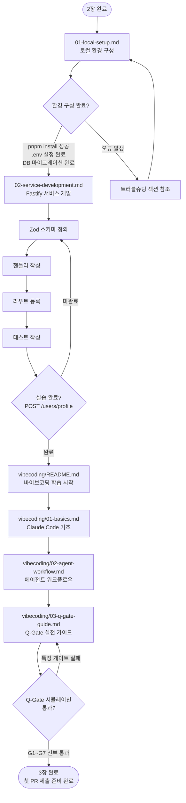

# 3장 — 개발 워크플로우

> **문서 ID**: ONBOARD-03-INDEX
> **버전**: 1.0.0 | **작성일**: 2026-04-11 | **작성자**: Implementer (Sonnet)
> **선행 학습**: `02-code-management.md` (2장)
> **대상**: 신규 백엔드 개발자, 풀스택 개발자

---

## 이 섹션에서 배우는 것

공공기관 SaaS 프레임워크에서 실제로 코드를 작성하고, 서비스를 개발하며, Claude Code와 협력하는 전체 개발 워크플로우를 배웁니다.

---

## 섹션 구조

```
03-development/
├── README.md                      ← 이 파일 (개요 + 학습 순서)
├── 01-local-setup.md              ← 로컬 개발 환경 구성
├── 02-service-development.md      ← Fastify 서비스 개발 패턴
└── vibecoding/
    ├── README.md                  ← 바이브코딩 학습 경로
    ├── 01-basics.md               ← Claude Code 기초
    ├── 02-agent-workflow.md       ← 에이전트 워크플로우
    └── 03-q-gate-guide.md        ← Q-Gate 실전 가이드
```

---

## 학습 순서 플로우차트



---

## 각 파일 요약

### `01-local-setup.md` — 로컬 개발 환경 구성

**소요 시간**: 약 2~3시간 (초기 설정 포함)

다루는 내용:
- pnpm 모노레포 설치 및 빌드
- 개별 서비스 로컬 실행 방법
- `.env` 파일 설정 (`.env.example` 기반)
- Prisma 마이그레이션 및 시드 데이터
- 테스트 실행 방법
- 로컬 k3s 배포
- 개발 중 자주 쓰는 명령어 모음 (치트시트)

**선행 조건**: Git 클론 완료, Node.js 22 설치

---

### `02-service-development.md` — Fastify 서비스 개발

**소요 시간**: 약 4~6시간 (실습 포함)

다루는 내용:
- Fastify 서비스 표준 구조 이해
- 새 엔드포인트 추가하는 4단계 패턴
- Prisma ORM 사용법 (쿼리, 트랜잭션, 마이그레이션)
- Redis 캐시 패턴
- 감사 로그 추가 방법 (`auditLog()`)
- RBAC 권한 검사 추가
- 실습: `POST /users/profile` 엔드포인트 구현

**선행 조건**: `01-local-setup.md` 완료, TypeScript 기본 지식

---

### `vibecoding/01-basics.md` — Claude Code 기초

**소요 시간**: 약 1~2시간

다루는 내용:
- Claude Code 설치와 첫 실행
- CLAUDE.md 읽기와 내재화
- 효과적인 프롬프트 작성법
- 파일 읽기/수정 요청 패턴
- 잘 동작하는 프롬프트 vs 안 되는 프롬프트 예시
- 초보자가 자주 하는 실수 목록

**선행 조건**: 없음 (언제든 학습 가능)

---

### `vibecoding/02-agent-workflow.md` — 에이전트 워크플로우

**소요 시간**: 약 2~3시간 (PDCA 실습 포함)

다루는 내용:
- `/pm` 커맨드로 PM 팀 구성
- Cascade 메서드 (LOW/MED/HIGH)
- 각 에이전트의 역할과 실제 프롬프트 예시
- 에이전트 간 파일 전달 규칙
- PDCA 사이클 따라하기 (단계별 실습)

**선행 조건**: `vibecoding/01-basics.md` 완료

---

### `vibecoding/03-q-gate-guide.md` — Q-Gate 실전 가이드

**소요 시간**: 약 2시간

다루는 내용:
- G1~G7 각 게이트 상세 설명과 통과 방법
- Q-Gate 실패 시 디버깅 방법
- 자동으로 통과하게 만드는 개발 습관

**선행 조건**: `vibecoding/02-agent-workflow.md` 완료

---

## 이 장 완료 기준

아래 항목을 모두 충족하면 3장 학습이 완료된 것입니다.

| 항목 | 확인 방법 |
|------|---------|
| 로컬에서 `pnpm dev` 실행 후 모든 서비스 정상 기동 | `curl http://localhost:3001/health` 응답 확인 |
| `POST /users/profile` 실습 엔드포인트 구현 완료 | `pnpm test` 통과 |
| Claude Code 기초 명령어 5개 이상 사용 경험 | 직접 실습 |
| PDCA 사이클 1회 직접 수행 | 에이전트 로그 확인 |
| Q-Gate G1~G7 개념 설명 가능 | 동료에게 설명해보기 |

---

## 변경 이력

| 버전 | 일자 | 내용 | 작성자 |
|------|------|------|--------|
| 1.0.0 | 2026-04-11 | 최초 작성 | Implementer (Sonnet) |
