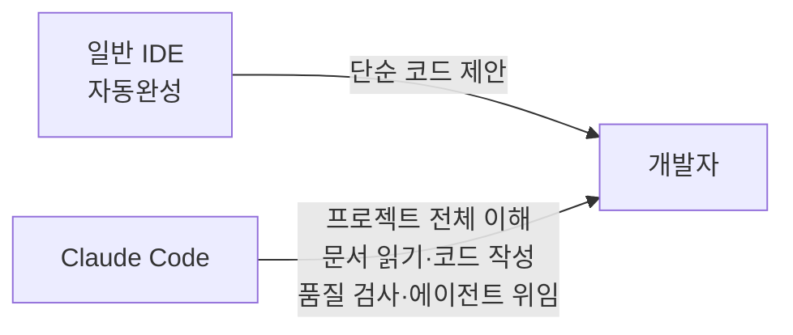
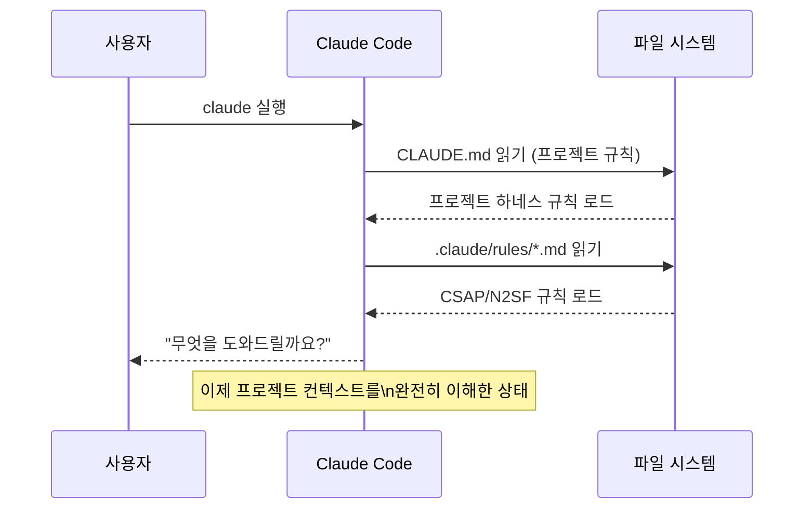
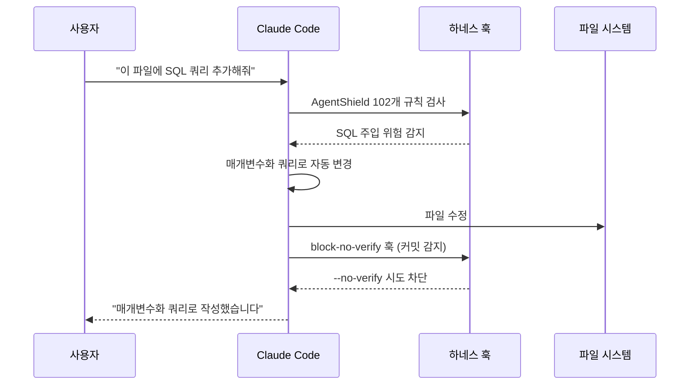

# Claude Code 기초

> **문서 ID**: ONBOARD-03-VC-01
> **버전**: 1.0.0 | **작성일**: 2026-04-11 | **작성자**: Implementer (Sonnet)
> **소요 시간**: 1~2시간
> **대상**: Claude Code를 처음 사용하는 모든 개발자

---

## 목차

1. [Claude Code란 무엇인가](#1-claude-code란-무엇인가)
2. [설치와 첫 실행](#2-설치와-첫-실행)
3. [CLAUDE.md 읽기와 이해](#3-claudemd-읽기와-이해)
4. [기본 사용 방법](#4-기본-사용-방법)
5. [파일 읽기와 수정 요청](#5-파일-읽기와-수정-요청)
6. [코드 생성 요청 패턴](#6-코드-생성-요청-패턴)
7. [잘 동작하는 프롬프트 vs 안 되는 프롬프트](#7-잘-동작하는-프롬프트-vs-안-되는-프롬프트)
8. [초보자가 자주 하는 실수](#8-초보자가-자주-하는-실수)
9. [변경 이력](#9-변경-이력)

---

## 1. Claude Code란 무엇인가

### 1.1 개념

Claude Code는 Anthropic이 개발한 AI 기반 터미널 개발 보조 도구입니다. 단순히 코드를 자동완성해 주는 도구가 아니라, 프로젝트 전체 컨텍스트를 이해하고 설계 문서를 읽어 코드를 작성하며 품질 검사까지 수행하는 에이전트형 개발 파트너입니다.



**Claude Code의 핵심 능력**:

| 능력 | 설명 |
|------|------|
| 200K 토큰 컨텍스트 | 대규모 코드베이스 전체를 한 번에 이해 |
| 도구 사용 | 파일 읽기/쓰기, bash 명령 실행, 코드 검색 |
| 에이전트 위임 | 복잡한 작업을 하위 에이전트에게 위임하여 병렬 처리 |
| 하네스 연동 | CLAUDE.md의 규칙을 세션 시작 시 자동으로 내재화 |

### 1.2 이 프로젝트에서의 역할

공공기관 SaaS 프레임워크에서 Claude Code는 ECC(Everything Claude Code) v1.9.0 하네스와 결합하여 동작합니다. 단독으로 사용하는 것이 아니라 5개 전문 에이전트가 협력하는 시스템입니다.

| 에이전트 | 역할 |
|---------|------|
| Implementer | Plan/Design 문서를 읽고 코드 작성 |
| Reviewer | 코드 품질, OWASP Top10 검사 |
| Auditor | CSAP 79항목, N2SF 6영역 감사 |
| Tester | 테스트 작성, 커버리지 80%+ 검증 |
| Refactorer | Dead code 제거, 구조 개선 |

### 1.3 Claude Code가 이 프로젝트에서 하는 일과 하지 않는 일

**하는 일**:
- 설계 문서(Plan/Design)를 읽고 그에 맞는 코드 생성
- CSAP D-12 보안 패턴 자동 적용
- 테스트 코드 작성
- 코드 품질 검사 및 피드백
- 감사 로그 자동 기록

**하지 않는 일**:
- 설계 문서 없이 임의로 코드 생성 (문서 없는 구현 = 감리 결함)
- C/S 등급 데이터를 외부 AI API에 전송
- git commit `--no-verify` 사용 (훅 우회 금지)
- 하드코딩된 시크릿 삽입

---

## 2. 설치와 첫 실행

### 2.1 Claude Code 설치

```bash
# Node.js 22+ 필수
node --version  # v22.x.x 확인

# Claude Code 전역 설치
npm install -g @anthropic-ai/claude-code

# 설치 확인
claude --version
# Claude Code v1.x.x
```

### 2.2 프로젝트 워크스페이스에서 실행

```bash
# 프로젝트 루트로 이동
cd /data/ai-saas

# Claude Code 실행 (대화형 모드)
claude

# 특정 작업을 지정하여 시작
claude "auth-service의 구조를 설명해줘"
```

### 2.3 첫 실행 시 일어나는 일

Claude Code를 처음 실행하면 다음 순서로 초기화됩니다.



Claude Code는 `CLAUDE.md`를 읽어 다음을 자동으로 내재화합니다:
- 절대 제약 사항 (하드코딩 금지, force push 금지 등)
- 에이전트 분업 원칙
- CSAP/N2SF 보안 규칙
- Dead code 정책

### 2.4 하네스 훅 동작

Claude Code는 작업 시 여러 훅(Hook)을 자동으로 실행합니다.



---

## 3. CLAUDE.md 읽기와 이해

### 3.1 CLAUDE.md가 중요한 이유

`CLAUDE.md`는 프로젝트의 "헌법"입니다. Claude Code는 세션을 시작할 때 이 파일을 읽어 모든 규칙을 내재화합니다. 따라서 개발자도 이 파일을 숙지해야 합니다.

```bash
# CLAUDE.md 읽기
cat /data/ai-saas/CLAUDE.md
```

### 3.2 CLAUDE.md 핵심 섹션 이해

**1. 절대 제약 (반드시 암기)**

```
- 구현 착수 전 Plan + Design 문서 완비 필수
- .env, secrets.* 파일 커밋 절대 금지
- git push --force 금지
- 외부 클라우드 서비스 사용 금지
- AI API에 C/S 등급 데이터 전송 절대 금지
- git commit --no-verify 금지
- 모든 문서는 한국어 전용
```

**2. 에이전트 분업 원칙**

5개 에이전트가 파일을 통해 결과물을 전달합니다. 에이전트를 건너뛰거나 순서를 바꾸면 안 됩니다.

**3. CSAP/N2SF 준수 규칙**

코드 변경 시 `.claude/rules/csap-compliance.md`의 내용이 자동으로 적용됩니다.

### 3.3 Claude Code에게 CLAUDE.md에 대해 물어보기

```
사용자: CLAUDE.md에서 가장 중요한 제약이 뭐야?

Claude Code: 이 프로젝트의 가장 중요한 절대 제약은 다음과 같습니다:

1. 구현 착수 전 Plan + Design 문서 완비 필수
   - docs/01-plan/ 와 docs/02-design/ 문서가 없으면 코드 작성 불가
   - 감리기준상 문서 없는 구현은 결함으로 처리됩니다

2. 시크릿 하드코딩 절대 금지
   - API 키, 비밀번호, 토큰 등은 반드시 환경 변수 사용
   - CSAP D-12 요건

3. AI API에 C/S 등급 데이터 전송 금지
   - N2SF N-05 요건
   - O등급 데이터도 PII 마스킹 후 AI Gateway를 통해서만 전송
```

---

## 4. 기본 사용 방법

### 4.1 대화형 모드

```bash
# 대화형 모드로 실행
claude

# 프롬프트 입력
> auth-service의 로그인 핸들러가 어떻게 동작하는지 설명해줘
```

### 4.2 단발성 명령

```bash
# 특정 작업을 바로 실행
claude "platform/services/auth-service/src/handlers/ 디렉토리의 파일 목록을 보여줘"
```

### 4.3 유용한 슬래시 커맨드

| 커맨드 | 설명 |
|--------|------|
| `/help` | 사용 가능한 모든 커맨드 목록 |
| `/compact` | 컨텍스트 압축 (50% 이상 사용 시 권장) |
| `/clear` | 대화 내역 초기화 |
| `/cost` | 현재 세션 토큰 사용량 확인 |
| `/memory` | 저장된 메모리 확인 |

---

## 5. 파일 읽기와 수정 요청

### 5.1 파일 읽기 요청

```
# 파일 내용 확인
"platform/services/auth-service/src/handlers/login.handler.ts 파일을 보여줘"

# 특정 함수 찾기
"auth-service에서 JWT를 서명하는 함수가 어디 있어?"

# 관련 파일들 찾기
"Zod 스키마를 사용하는 파일들을 찾아줘"
```

### 5.2 파일 수정 요청

```
# 명확한 수정 요청
"platform/services/auth-service/src/schemas/login.schema.ts에서
 email 필드의 최대 길이를 100자에서 255자로 변경해줘"

# 기능 추가 요청 (문서 기반)
"docs/02-design/features/SVC-AUTH-R2.design.md의 설계에 따라
 user-service에 프로필 업데이트 엔드포인트를 추가해줘"
```

### 5.3 파일 생성 요청

```
# 새 파일 생성
"platform/services/user-service/src/schemas/ 디렉토리에
 user-profile.schema.ts 파일을 만들어줘.
 표시이름(최대100자), 전화번호(010-XXXX-XXXX 형식), 부서(선택적) 필드를 포함해야 해."
```

---

## 6. 코드 생성 요청 패턴

### 6.1 좋은 코드 생성 요청의 구성 요소

효과적인 코드 생성 요청은 다음 4가지 요소를 포함합니다.

```
[컨텍스트]: 어떤 서비스/파일에 관한 것인지
[목표]: 무엇을 달성하고 싶은지
[제약]: 어떤 규칙/패턴을 따라야 하는지
[기준]: 완료 기준이 무엇인지
```

**예시**:

```
[컨텍스트] platform/services/user-service의 handlers/ 디렉토리에
[목표] 사용자 비밀번호 변경 엔드포인트를 추가해줘
[제약] CSAP D-12 입력 검증 필수, bcrypt 해시 사용, 감사 로그 기록
[기준] 기존 auth-service의 password-change.handler.ts 패턴을 따를 것
```

### 6.2 설계 문서 기반 요청 (권장)

이 프로젝트에서 가장 권장하는 방식입니다. Plan/Design 문서를 먼저 작성한 후 구현을 요청합니다.

```
"docs/02-design/features/SVC-USER-R10.design.md 파일을 읽고
 설계서의 §3 API 명세에 따라 user-service에 구현해줘.
 CSAP D-08, D-12 요건도 반드시 포함해줘."
```

Claude Code는 설계 문서를 읽어 요구사항을 정확히 파악한 후 코드를 생성합니다.

### 6.3 기존 코드 패턴 참조 요청

```
"platform/services/auth-service/src/handlers/login.handler.ts를
 참고해서 user-service에 비슷한 패턴으로 profile-update.handler.ts를 만들어줘"
```

---

## 7. 잘 동작하는 프롬프트 vs 안 되는 프롬프트

### 7.1 파일 위치 지정

```
# 안 되는 프롬프트
"로그인 파일 수정해줘"
# 문제: 어떤 서비스의 어떤 파일인지 불분명

# 잘 동작하는 프롬프트
"platform/services/auth-service/src/handlers/login.handler.ts를 수정해줘"
# 명확한 절대 경로 지정
```

### 7.2 요구사항의 구체성

```
# 안 되는 프롬프트
"사용자 관리 기능 만들어줘"
# 문제: 범위가 너무 넓고 모호

# 잘 동작하는 프롬프트
"user-service에 POST /users/profile 엔드포인트를 추가해줘.
 요청 바디: { displayName: string, department?: string }
 성공 시 200, 인증 없으면 401, 검증 실패 시 400 반환"
# 명확한 스펙 포함
```

### 7.3 제약 조건 명시

```
# 안 되는 프롬프트
"데이터베이스에서 사용자 목록 조회하는 코드 작성해줘"
# 문제: 보안 요건이 빠져 있음

# 잘 동작하는 프롬프트
"prisma를 사용해서 활성 사용자 목록을 조회하는 코드 작성해줘.
 - select로 id, email, role만 반환 (passwordHash 제외)
 - tenantId로 필터링 (테넌트 간 격리)
 - take 20 페이지네이션
 - CSAP D-08 요건 준수"
# 보안 요건 명시
```

### 7.4 에러 상황 디버깅

```
# 안 되는 프롬프트
"코드가 안 돼"
# 문제: 무엇이 안 되는지 전혀 정보 없음

# 잘 동작하는 프롬프트
"platform/services/auth-service를 실행하면 다음 에러가 발생해:
 Error: JWT_PRIVATE_KEY is not set
 .env 파일은 있고 JWT_PRIVATE_KEY 값도 설정했어.
 왜 이런 에러가 나는지 찾아줘"
# 에러 메시지 + 상황 설명 + 이미 시도한 것
```

### 7.5 코드 리뷰 요청

```
# 안 되는 프롬프트
"이 코드 괜찮아?"
# 문제: 어떤 관점에서 검토해야 하는지 불분명

# 잘 동작하는 프롬프트
"platform/services/auth-service/src/handlers/login.handler.ts를
 CSAP D-08(접근통제), D-12(입력검증) 관점에서 검토해줘.
 보안 취약점이 있으면 어떻게 수정해야 하는지도 알려줘"
# 검토 관점 명시
```

### 7.6 비교표

| 구분 | 안 되는 프롬프트 | 잘 동작하는 프롬프트 |
|------|--------------|-----------------|
| 위치 | "로그인 파일 수정" | "auth-service/src/handlers/login.handler.ts 수정" |
| 범위 | "사용자 기능 만들어줘" | "POST /users/profile 엔드포인트 추가" |
| 제약 | 제약 없음 | "CSAP D-12, select로 민감 필드 제외" |
| 에러 | "코드가 안 돼" | "에러 메시지 + 상황 + 시도한 것" |
| 참조 | 없음 | "login.handler.ts 패턴 참조" |

---

## 8. 초보자가 자주 하는 실수

### 8.1 실수 1: 설계 없이 바로 구현 요청

```
# 잘못된 방법
claude "사용자 알림 기능을 추가해줘"
# 문제: Plan/Design 문서 없이 구현하면 감리 결함

# 올바른 방법
# 1. 먼저 Plan 문서 작성
docs/01-plan/features/SVC-NOTIF-R1.plan.md

# 2. Design 문서 작성
docs/02-design/features/SVC-NOTIF-R1.design.md

# 3. 그 후 구현 요청
claude "docs/02-design/features/SVC-NOTIF-R1.design.md를 읽고 구현해줘"
```

### 8.2 실수 2: 한 번에 너무 많은 요청

```
# 잘못된 방법
"사용자 생성, 수정, 삭제 API를 모두 만들고 테스트도 작성하고
 CSAP 준수도 확인하고 문서도 작성해줘"
# 문제: 너무 많은 작업을 한 번에 요청하면 중간에 컨텍스트 초과 가능

# 올바른 방법
# 순서대로 요청
1. "사용자 생성 API 핸들러를 만들어줘"
2. "방금 만든 핸들러의 테스트를 작성해줘"
3. "CSAP D-12 관점에서 검토해줘"
```

### 8.3 실수 3: 잘못된 절대 경로 사용

```
# 잘못된 방법
"src/handlers/login.ts 수정해줘"
# 문제: 상대 경로는 어디서 보는지에 따라 달라짐

# 올바른 방법
"platform/services/auth-service/src/handlers/login.handler.ts 수정해줘"
# 항상 /data/ai-saas 기준의 상대 경로 또는 절대 경로 사용
```

### 8.4 실수 4: 훅 우회 시도

```
# 절대 금지
"git commit --no-verify로 커밋해줘"
# 하네스 규칙 위반, 자동으로 차단됨

# 올바른 방법
# 훅이 실패하면 그 원인을 먼저 해결
"린트 오류가 발생해서 커밋이 안 돼. 오류 내용이 뭔지 확인해줘"
```

### 8.5 실수 5: 민감 데이터를 AI에 전달

```
# 절대 금지
"이 데이터를 분석해줘: [주민등록번호, 연봉 정보 포함 실제 데이터]"
# N2SF C/S 등급 데이터는 AI에 전달 금지

# 올바른 방법
"개인정보가 포함된 데이터 처리 로직을 설계해줘 (실제 데이터는 포함하지 않음)"
```

### 8.6 실수 6: 컨텍스트 초과 무시

대화가 길어지면 컨텍스트 창이 꽉 찹니다. 이때 이전 내용을 기억하지 못할 수 있습니다.

```
# 확인 방법
/cost  # 현재 토큰 사용량 확인

# 50% 이상 사용 시
/compact  # 컨텍스트 압축

# 새 작업 시작 시
/clear  # 대화 초기화 후 새로 시작
```

### 8.7 실수 7: 에이전트 순서 건너뛰기

```
# 잘못된 방법
# Implementer → Tester 바로 진행 (Reviewer, Auditor 건너뜀)

# 올바른 방법
# 반드시 순서대로
Implementer → Reviewer → Auditor → Tester → Refactorer
```

---

## 9. 변경 이력

| 버전 | 일자 | 내용 | 작성자 |
|------|------|------|--------|
| 1.0.0 | 2026-04-11 | 최초 작성 | Implementer (Sonnet) |
