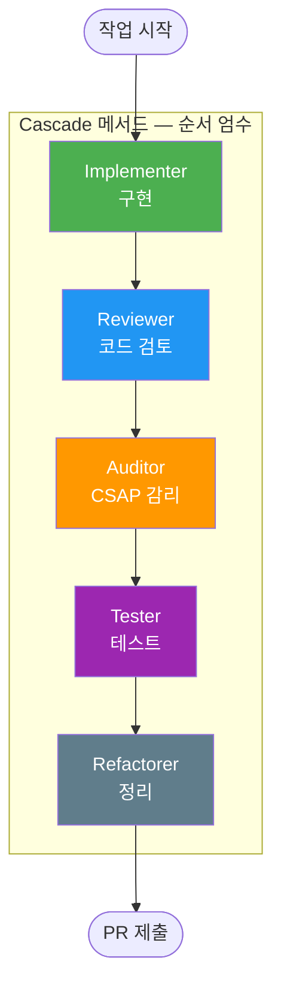
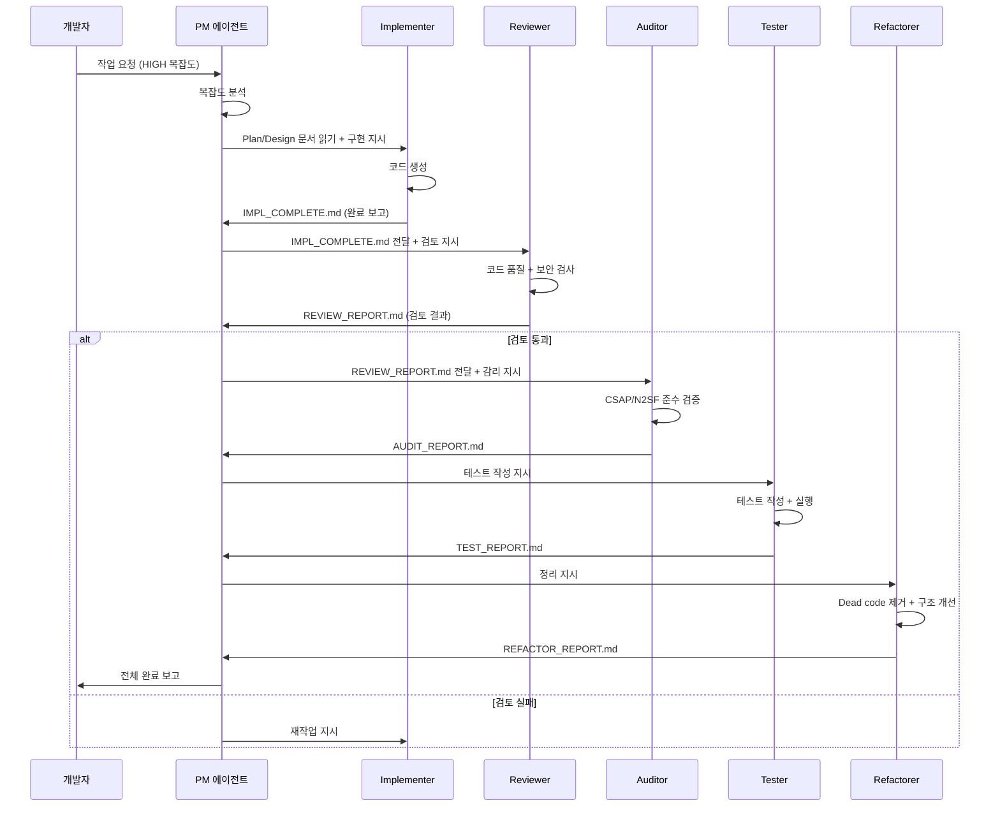
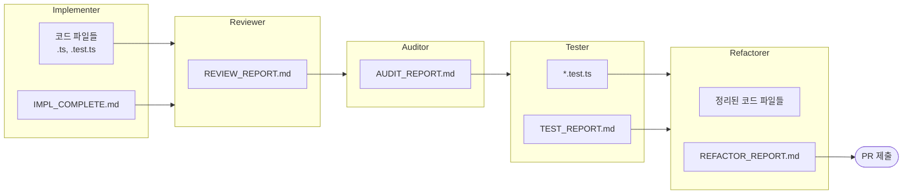
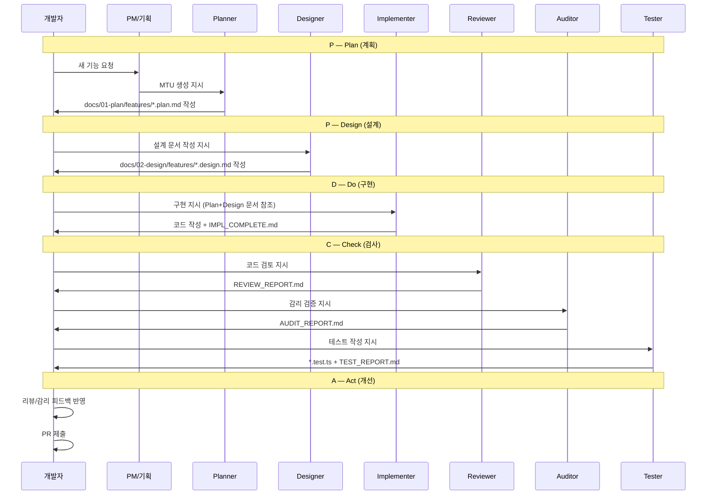

# 에이전트 워크플로우

> **문서 ID**: ONBOARD-03-VC-02
> **버전**: 1.0.0 | **작성일**: 2026-04-11 | **작성자**: Implementer (Sonnet)
> **선행 학습**: `vibecoding/01-basics.md`
> **소요 시간**: 2~3시간 (PDCA 실습 포함)

---

## 목차

1. [Cascade 메서드 이해](#1-cascade-메서드-이해)
2. [PM 에이전트로 팀 구성하기](#2-pm-에이전트로-팀-구성하기)
3. [각 에이전트의 역할 상세 설명](#3-각-에이전트의-역할-상세-설명)
4. [에이전트 간 파일 전달 규칙](#4-에이전트-간-파일-전달-규칙)
5. [PDCA 사이클 따라하기](#5-pdca-사이클-따라하기)
6. [에이전트 활용 실전 예시](#6-에이전트-활용-실전-예시)
7. [변경 이력](#7-변경-이력)

---

## 1. Cascade 메서드 이해

### 1.1 Cascade 메서드란

Cascade 메서드는 5개 전문 에이전트가 폭포(Cascade)처럼 순서대로 작업을 이어받아 처리하는 개발 방법론입니다. 각 에이전트는 이전 에이전트의 결과를 파일로 받아 자신의 역할을 수행한 후 다음 에이전트에게 파일로 전달합니다.



### 1.2 복잡도별 전략 (LOW/MED/HIGH)

작업의 복잡도에 따라 투입할 에이전트를 조정합니다.

| 복잡도 | 기준 | 투입 에이전트 | 예시 |
|--------|------|------------|------|
| LOW | 단순 버그 수정, 문자열 변경 | Implementer + Reviewer | 오타 수정, 설정값 변경 |
| MED | 새 엔드포인트, 기존 기능 수정 | Implementer + Reviewer + Auditor + Tester | 새 API 추가, 로직 변경 |
| HIGH | 새 서비스, 대규모 기능 | 전체 5개 에이전트 + PM | 새 마이크로서비스, PDCA 사이클 |

```mermaid
quadrantChart
  title 복잡도 vs 영향 범위
  x-axis 영향 범위 낮음 --> 영향 범위 높음
  y-axis 복잡도 낮음 --> 복잡도 높음
  quadrant-1 HIGH: 전체 에이전트
  quadrant-2 MED: 핵심 4개
  quadrant-3 LOW: 2개
  quadrant-4 MED: 핵심 4개
  오타 수정: [0.1, 0.1]
  설정값 변경: [0.2, 0.15]
  새 API 추가: [0.5, 0.5]
  로직 변경: [0.4, 0.6]
  새 서비스: [0.9, 0.9]
  대규모 리팩토링: [0.7, 0.8]
```

---

## 2. PM 에이전트로 팀 구성하기

### 2.1 PM 에이전트란

PM(Project Manager) 에이전트는 대규모 작업(HIGH 복잡도)을 5개 전문 에이전트에게 자동으로 분배하고 진행을 관리합니다.

### 2.2 PM 팀 구성 방법

```bash
# Claude Code 실행 후
claude

# PM 에이전트 호출
> /pm "MTU-N255 새 알림 서비스 구현"
```

또는 PM 에이전트를 직접 프롬프트로 호출합니다.

```
다음 작업을 PDCA 사이클로 진행해줘:

작업: user-service에 사용자 프로필 기능 추가 (MED 복잡도)

요구사항:
- docs/01-plan/features/SVC-USER-R10.plan.md 기반
- FR-U10.1: 프로필 조회 (GET /users/profile)
- FR-U10.2: 프로필 수정 (POST /users/profile)

Implementer → Reviewer → Auditor → Tester 순서로 진행해줘.
각 단계 결과를 IMPL_COMPLETE.md, REVIEW_REPORT.md, AUDIT_REPORT.md로 저장해줘.
```

### 2.3 자동 팀 구성 플로우



---

## 3. 각 에이전트의 역할 상세 설명

### 3.1 Implementer — 구현 전문가

**모델**: Claude Sonnet 4.6
**역할**: Plan/Design 문서를 읽고 코드를 작성합니다.

**Implementer가 하는 일**:
1. `docs/01-plan/` Plan 문서에서 요구사항 FR ID 확인
2. `docs/02-design/` Design 문서에서 API 명세, 데이터 모델 확인
3. 서비스 표준 구조에 맞게 코드 작성
4. CSAP D-12 보안 패턴 자동 적용 (Zod 검증, 매개변수화 쿼리)
5. 감사 로그 코드 포함
6. `IMPL_COMPLETE.md` 작성 (구현 범위, 변경 파일 목록)

**Implementer를 호출하는 실제 프롬프트 예시**:

```
Implementer 에이전트로서 다음을 구현해줘:

문서:
- Plan: docs/01-plan/features/SVC-USER-R10.plan.md
- Design: docs/02-design/features/SVC-USER-R10.design.md

구현 범위:
- POST /users/profile 핸들러 (platform/services/user-service/src/handlers/)
- Zod 스키마 (platform/services/user-service/src/schemas/)
- 라우트 등록 (platform/services/user-service/src/routes.ts)

제약:
- CSAP D-12: 모든 입력 Zod 검증 필수
- CSAP D-06: 감사 로그 필수
- CSAP D-08: RBAC 권한 검사 필수
- 기존 auth-service 패턴 참조

완료 후 IMPL_COMPLETE.md 작성해줘.
```

**Implementer 결과물**:
- 구현된 TypeScript 파일들
- `IMPL_COMPLETE.md` (구현 범위, 변경 파일 목록, 알려진 제약사항)

---

### 3.2 Reviewer — 코드 품질 전문가

**모델**: Claude Sonnet 4.6
**역할**: 구현된 코드의 품질과 보안을 검사합니다. 코드를 직접 수정하지 않고 보고서만 작성합니다.

**Reviewer가 검사하는 것**:

| 검사 항목 | 내용 |
|---------|------|
| 코드 품질 | 함수 크기 80줄 이하, 중첩 깊이 4단계 이하, Dead code |
| 보안 (OWASP Top 10) | SQL 주입, XSS, 인증 취약점, 민감 정보 노출 등 |
| CSAP D-12 | 모든 입력 Zod 검증 여부, 매개변수화 쿼리 사용 여부 |
| AgentShield 102규칙 | 하드코딩 시크릿, 안전하지 않은 함수 사용 등 |
| 문서 추적성 | FR ID 주석, Design Ref 주석 포함 여부 |

**Reviewer를 호출하는 실제 프롬프트 예시**:

```
Reviewer 에이전트로서 Implementer가 작성한 코드를 검토해줘.

검토 대상 (IMPL_COMPLETE.md 참조):
- platform/services/user-service/src/handlers/update-profile.handler.ts
- platform/services/user-service/src/schemas/user-profile.schema.ts

검토 기준:
1. CSAP D-12: 입력 검증 완전성
2. CSAP D-08: RBAC 권한 검사 적용 여부
3. CSAP D-06: 감사 로그 기록 여부
4. OWASP Top 10 취약점
5. AgentShield 102개 규칙 위반
6. Dead code 존재 여부

발견한 문제는 심각도(CRITICAL/HIGH/MEDIUM/LOW)와 수정 방법을 포함하여
REVIEW_REPORT.md에 작성해줘.
```

**Reviewer 결과물**:
- `REVIEW_REPORT.md` (발견된 문제 목록, 심각도, 수정 방법)
- 통과/불통과 판정

---

### 3.3 Auditor — CSAP/N2SF 감리 전문가

**모델**: Claude Opus 4.6 (복합 CSAP/N2SF 분석 필요)
**역할**: 코드와 문서가 CSAP, N2SF, 행안부 감리기준을 100% 준수하는지 검증합니다. 읽기 전용입니다.

**Auditor가 검증하는 것**:

| 검증 영역 | 항목 수 | 주요 내용 |
|---------|--------|---------|
| CSAP D-08 접근 통제 | 12개 | RBAC, 세션 관리, 계정 잠금 |
| CSAP D-09 암호화 | 4개 | AES-256 저장, TLS 1.3 전송 |
| CSAP D-06 침해사고 관리 | 5개 | 감사 로그, 로그 보존 1년 |
| CSAP D-12 개발 보안 | 10개 | 입력 검증, SQL 주입 방지 |
| N2SF AI 데이터 등급 | 6개 영역 | C/S 등급 데이터 AI 전송 금지 |
| 행안부 감리기준 | 추적성 매트릭스 | FR↔산출물↔테스트↔CSAP 4방향 |

**Auditor를 호출하는 실제 프롬프트 예시**:

```
Auditor 에이전트로서 CSAP/N2SF 준수를 검증해줘.

검토 대상:
- REVIEW_REPORT.md (Reviewer 통과 확인)
- platform/services/user-service/src/handlers/update-profile.handler.ts

검증 기준:
1. CSAP D-08: 모든 엔드포인트 인증/권한 검사 적용
2. CSAP D-09: 민감 데이터 암호화 여부
3. CSAP D-06: 감사 로그 append-only 구조
4. CSAP D-12: 입력 검증, SQL 주입 방지
5. N2SF: AI API 사용 시 데이터 등급 확인
6. 추적성 매트릭스: FR ID ↔ 코드 ↔ 테스트 추적 가능 여부

결과를 AUDIT_REPORT.md에 작성해줘.
CSAP 100% 달성 여부와 미달 항목을 명시해줘.
```

**Auditor 결과물**:
- `AUDIT_REPORT.md` (CSAP 79항목 준수 현황, N2SF 6영역 현황, 미달 항목)
- 통과/불통과 판정

---

### 3.4 Tester — 테스트 전문가

**모델**: Claude Sonnet 4.6
**역할**: 테스트 케이스를 작성하고 실행하여 커버리지 80% 이상을 달성합니다.

**Tester가 작성하는 테스트 유형**:

| 테스트 유형 | 도구 | 목적 |
|---------|------|------|
| 단위 테스트 | Vitest | 개별 함수/모듈 검증 |
| 통합 테스트 | Vitest + Fastify inject | API 엔드포인트 전체 흐름 |
| E2E 테스트 | Playwright | 브라우저 시나리오 |
| 보안 테스트 | 커스텀 | SQL 주입 시도, 권한 우회 시도 |

**Tester를 호출하는 실제 프롬프트 예시**:

```
Tester 에이전트로서 update-profile 기능의 테스트를 작성해줘.

테스트 대상:
- platform/services/user-service/src/handlers/update-profile.handler.ts

필수 테스트 케이스:
1. 정상 케이스: 유효한 요청으로 프로필 업데이트 성공
2. 인증 없음: 401 반환
3. 권한 없음: 403 반환
4. 잘못된 전화번호 형식: 400 반환
5. 빈 요청 바디: 400 반환
6. SQL 주입 시도: 400 또는 안전하게 처리됨을 확인
7. 감사 로그: 업데이트 성공 시 audit.jsonl에 기록됨

목표:
- 라인 커버리지 80% 이상
- 브랜치 커버리지 75% 이상

결과를 TEST_REPORT.md에 작성해줘.
```

**Tester 결과물**:
- 테스트 파일 (`*.test.ts`)
- `TEST_REPORT.md` (커버리지 결과, 통과/실패 항목)

---

### 3.5 Refactorer — 코드 정리 전문가

**모델**: Claude Haiku 4.5 (단순 정리, 최소 비용)
**역할**: Dead code 제거, 함수 분리, 구조 개선을 합니다. 기능을 변경하지 않습니다.

**Refactorer가 하는 일**:
- 미사용 import, 변수, 함수 제거
- 80줄 초과 함수 분리
- 중첩 깊이 4단계 초과 코드 리팩토링
- 중복 코드 추출 및 재사용
- 주석 처리된 코드 제거 (git 히스토리로 복구 가능)

**Refactorer를 호출하는 실제 프롬프트 예시**:

```
Refactorer 에이전트로서 update-profile 구현을 정리해줘.

대상:
- platform/services/user-service/src/handlers/update-profile.handler.ts

정리 기준:
1. Dead code: 미사용 import, 변수, 함수 제거
2. 함수 크기: 80줄 초과 시 분리
3. 중첩 깊이: 4단계 초과 코드 리팩토링
4. 중복: login.handler.ts와 중복되는 패턴 추출
5. 주석: 불필요한 주석 제거 (Design Ref, Plan SC는 유지)

주의: 기능 변경 없이 구조 개선만 할 것.
테스트가 여전히 통과하는지 확인할 것.

결과를 REFACTOR_REPORT.md에 작성해줘.
```

**Refactorer 결과물**:
- 정리된 TypeScript 파일들
- `REFACTOR_REPORT.md` (제거된 코드 목록, 구조 개선 내용)

---

## 4. 에이전트 간 파일 전달 규칙

에이전트 간 결과물은 직접 컨텍스트를 공유하지 않고 반드시 파일로 전달됩니다. 이는 에이전트 간 작업의 추적가능성을 보장하기 위한 규칙입니다.



**파일 전달 규칙 요약**:

| 에이전트 → | 다음 에이전트 | 전달 파일 |
|-----------|------------|---------|
| Implementer → | Reviewer | 구현 코드 파일 + `IMPL_COMPLETE.md` |
| Reviewer → | Auditor | `REVIEW_REPORT.md` |
| Auditor → | Tester | `AUDIT_REPORT.md` |
| Tester → | Refactorer | `*.test.ts` + `TEST_REPORT.md` |
| Refactorer → | PR 제출 | 최종 코드 + `REFACTOR_REPORT.md` |

---

## 5. PDCA 사이클 따라하기

PDCA(Plan-Do-Check-Act)는 이 프로젝트의 개발 사이클입니다. 단계별로 직접 실습해 보세요.

### 5.1 PDCA 7단계 시퀀스



### 5.2 실습: 간단한 PDCA 사이클 직접 실행

다음 단계를 직접 따라해 보세요. 예시로 "사용자 부서 조회" 기능을 추가합니다.

**Step 1: Plan 문서 작성 (Claude Code 도움 받기)**

```
다음 기능의 Plan 문서를 작성해줘:

기능명: 사용자 부서 조회
서비스: user-service
엔드포인트: GET /users/department

요구사항:
- 인증된 사용자가 자신의 부서 정보를 조회
- TENANT_ADMIN은 테넌트 내 모든 사용자의 부서 조회 가능
- 응답: { department: string | null }

docs/01-plan/features/SVC-USER-DEPT-R1.plan.md로 저장해줘.
행안부 감리기준 형식 따를 것.
```

**Step 2: Design 문서 작성**

```
docs/01-plan/features/SVC-USER-DEPT-R1.plan.md를 읽고
API 설계 문서를 작성해줘.

포함할 내용:
- API 명세 (엔드포인트, 요청/응답 형식)
- 시퀀스 다이어그램
- 데이터 모델
- 에러 케이스

docs/02-design/features/SVC-USER-DEPT-R1.design.md로 저장해줘.
```

**Step 3: Implementer 호출**

```
Implementer 에이전트로서 다음을 구현해줘:

Plan: docs/01-plan/features/SVC-USER-DEPT-R1.plan.md
Design: docs/02-design/features/SVC-USER-DEPT-R1.design.md

구현 위치: platform/services/user-service/src/

기존 user-service의 다른 핸들러 패턴을 참조해서
CSAP D-08, D-12 요건을 모두 포함해줘.

완료 후 IMPL_COMPLETE.md 작성해줘.
```

**Step 4: Reviewer 호출**

```
Reviewer 에이전트로서 IMPL_COMPLETE.md에 기록된 파일들을 검토해줘.

CSAP D-08, D-12, OWASP Top 10 기준으로 검토하고
REVIEW_REPORT.md에 결과 작성해줘.
```

**Step 5: 테스트 실행**

```bash
# 테스트 실행
pnpm --filter @public-saas/user-service test

# 커버리지 확인
pnpm --filter @public-saas/user-service test:coverage
```

**Step 6: PR 제출**

```bash
# 브랜치 생성
git checkout -b feat/SVC-USER-DEPT-R1-department-api

# 변경된 파일 스테이징
git add platform/services/user-service/src/
git add docs/01-plan/features/SVC-USER-DEPT-R1.plan.md
git add docs/02-design/features/SVC-USER-DEPT-R1.design.md

# 커밋 (Conventional Commits 형식)
git commit -m "feat(user): SVC-USER-DEPT-R1 사용자 부서 조회 API 추가"

# PR 생성
gh pr create --title "feat(user): SVC-USER-DEPT-R1 사용자 부서 조회 API" \
  --body "## Summary\n- GET /users/department 엔드포인트 추가\n- CSAP D-08, D-12 준수"
```

---

## 6. 에이전트 활용 실전 예시

### 6.1 버그 수정 (LOW 복잡도)

```
# 이슈: 로그인 시 tenantSlug 대소문자 구분으로 로그인 실패

# Implementer만 사용 (LOW 복잡도)
"platform/services/auth-service/src/handlers/login.handler.ts에서
 tenantSlug를 소문자로 변환 후 DB 조회하도록 수정해줘.
 Zod 스키마에서도 .toLowerCase()를 추가해줘."

# 수정 후 바로 테스트
pnpm --filter @public-saas/auth-service test
```

### 6.2 기존 기능 수정 (MED 복잡도)

```
# 이슈: 프로필 수정 시 변경 이력을 기록해야 함

# 1. Implementer 호출
"update-profile.handler.ts에 변경 이력 기록 로직을 추가해줘.
 변경 전/후 값을 UserProfileHistory 테이블에 저장하는 방식.
 prisma 스키마에 UserProfileHistory 모델도 추가해줘."

# 2. Reviewer 호출
"방금 수정한 update-profile.handler.ts와 스키마 변경을 검토해줘."

# 3. Tester 호출
"변경 이력 기록 테스트 케이스를 추가해줘."
```

### 6.3 새 서비스 추가 (HIGH 복잡도)

```
# Plan 문서부터 순서대로 진행
# 1. Plan 작성 → 2. Design 작성 → 3. Implementer → 4. Reviewer → 5. Auditor → 6. Tester → 7. Refactorer

"새 알림 서비스(notification-service)를 추가해야 해.
 다른 서비스 구조(auth-service)를 참조해서
 docs/01-plan/features/SVC-NOTIF-R1.plan.md를 먼저 작성해줘."
```

---

## 7. 변경 이력

| 버전 | 일자 | 내용 | 작성자 |
|------|------|------|--------|
| 1.0.0 | 2026-04-11 | 최초 작성 | Implementer (Sonnet) |
