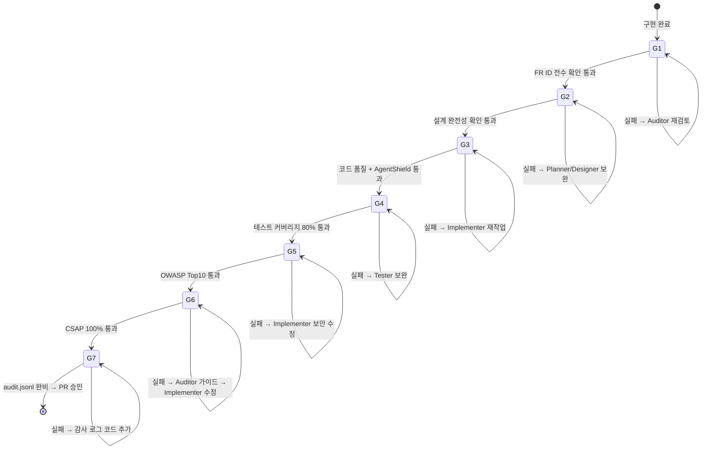

# Q-Gate 실전 가이드

> **문서 ID**: ONBOARD-03-VC-03
> **버전**: 1.0.0 | **작성일**: 2026-04-11 | **작성자**: Implementer (Sonnet)
> **선행 학습**: `vibecoding/02-agent-workflow.md`
> **소요 시간**: 2시간

---

## 목차

1. [Q-Gate 개요](#1-q-gate-개요)
2. [G1: FR ID 전수 확인](#2-g1-fr-id-전수-확인)
3. [G2: 설계 완전성 확인](#3-g2-설계-완전성-확인)
4. [G3: 코드 품질 + AgentShield 102규칙](#4-g3-코드-품질--agentshield-102규칙)
5. [G4: 테스트 커버리지 80%](#5-g4-테스트-커버리지-80)
6. [G5: OWASP Top10 통과](#6-g5-owasp-top10-통과)
7. [G6: CSAP 100% 달성](#7-g6-csap-100-달성)
8. [G7: audit.jsonl 기록 완비](#8-g7-auditjsonl-기록-완비)
9. [Q-Gate 실패 시 디버깅](#9-q-gate-실패-시-디버깅)
10. [자동으로 통과하게 만드는 습관](#10-자동으로-통과하게-만드는-습관)
11. [Q-Gate 시뮬레이션 실습](#11-q-gate-시뮬레이션-실습)
12. [변경 이력](#12-변경-이력)

---

## 1. Q-Gate 개요

### 1.1 Q-Gate란

Q-Gate(Quality Gate)는 코드가 배포되기 전에 반드시 통과해야 하는 7단계 품질 검사 관문입니다. 공공기관 CSAP 감리기준과 행안부 정보화사업 감리기준을 자동화한 것입니다.



### 1.2 게이트별 담당 에이전트

| 게이트 | 이름 | 담당 에이전트 | 실패 시 조치 |
|--------|------|------------|------------|
| G1 | FR ID 전수 | Auditor | Planner 재작업 |
| G2 | 설계 완전성 | Auditor | Designer 재작업 |
| G3 | 코드 품질 + 102규칙 | Reviewer | Implementer 재작업 |
| G4 | 테스트 커버리지 80% | Tester | Tester 보완 |
| G5 | OWASP Top10 | Reviewer | Implementer 보안 수정 |
| G6 | CSAP 100% | Auditor | Implementer 수정 후 재검증 |
| G7 | audit.jsonl 완비 | Auditor | 감사 로그 코드 추가 |

---

## 2. G1: FR ID 전수 확인

### 2.1 무엇을 확인하는가

모든 구현 코드에 요구사항 ID(FR ID)가 추적 가능하게 연결되어 있는지 확인합니다. 이는 행안부 정보화사업 감리기준의 추적성 매트릭스 요건입니다.

**FR ID 체계**:
- 기능 요구사항: `FR-{모듈}.{번호}` (예: `FR-AUTH.1`, `FR-U10.2`)
- 비기능 요구사항: `NFR-{번호}` (예: `NFR-1`)
- 인프라 요구사항: `INFR-{번호}` (예: `INFR-1`)

### 2.2 어떻게 확인하는가

```bash
# FR ID 주석이 없는 파일 탐지
grep -r "// Plan SC:" platform/services/ | wc -l    # 주석 있는 파일 수
grep -r "// Design Ref:" platform/services/ | wc -l  # 설계 참조 있는 파일 수

# 특정 FR ID가 코드에 반영되어 있는지 확인
grep -r "FR-AUTH.1" platform/services/auth-service/
```

### 2.3 G1 통과를 위한 코드 작성법

```typescript
// ✅ G1 통과: FR ID + Design Ref 주석 포함
// Design Ref: SVC-USER-R10 DESIGN §3.2 — 프로필 업데이트 API
// Plan SC: FR-U10.2 사용자 프로필 수정
// CSAP: D-08 접근 통제, D-06 감사 로그

export async function updateProfileHandler(
  request: FastifyRequest,
  reply: FastifyReply,
): Promise<void> {
  // FR-U10.2 구현: 인증된 사용자의 프로필 업데이트
  // ...
}

// ❌ G1 실패: FR ID 주석 없음
export async function updateProfileHandler(
  request: FastifyRequest,
  reply: FastifyReply,
): Promise<void> {
  // 아무 참조 없이 바로 구현
}
```

---

## 3. G2: 설계 완전성 확인

### 3.1 무엇을 확인하는가

`docs/02-design/` 의 설계 문서가 완전한지 확인합니다. 설계 문서가 없거나 불완전하면 구현 코드와 설계가 불일치합니다.

**설계 문서 필수 섹션**:
- Executive Summary (4-Perspective 테이블)
- Context Anchor (WHY/WHO/RISK/SUCCESS/SCOPE)
- API 명세 (엔드포인트, 요청/응답 스키마)
- 시퀀스 다이어그램
- 데이터 모델
- 에러 케이스
- 추적성 매트릭스

### 3.2 어떻게 확인하는가

```bash
# 설계 문서 존재 여부 확인
ls docs/02-design/features/

# Auditor 에이전트에게 확인 요청
"docs/02-design/features/SVC-USER-R10.design.md가 G2 기준을 충족하는지 검토해줘.
 필수 섹션이 모두 있는지, API 명세가 완전한지 확인해줘."
```

### 3.3 자주 빠뜨리는 섹션

| 빠뜨리기 쉬운 섹션 | 감리 시 지적 내용 |
|----------------|--------------|
| Context Anchor RISK | 위험 요소 미식별 |
| 추적성 매트릭스 | FR↔코드↔테스트 추적 불가 |
| 에러 케이스 | 예외 처리 설계 누락 |
| 변경 이력 | 이력 관리 미흡 |

---

## 4. G3: 코드 품질 + AgentShield 102규칙

### 4.1 무엇을 확인하는가

코드 품질 기준과 AgentShield의 102개 정적분석 규칙을 동시에 검사합니다.

**코드 품질 기준**:

| 기준 | 허용 범위 | 초과 시 |
|------|---------|--------|
| 함수 길이 | 80줄 이하 | 분리 필요 |
| 파일 길이 | 800줄 이하 | 분리 검토 |
| 중첩 깊이 | 4단계 이하 | 리팩토링 필요 |
| 줄 길이 | 120자 이하 | 줄 바꿈 |

**AgentShield 주요 규칙 예시**:

| 규칙 ID | 설명 | 예시 |
|--------|------|------|
| AS-001 | 하드코딩 시크릿 금지 | `const key = 'sk-...'` 차단 |
| AS-002 | SQL 직접 결합 금지 | `` `SELECT * WHERE id = '${id}'` `` 차단 |
| AS-003 | 에러 메시지 민감 정보 노출 | `{ error: e.stack }` 차단 |
| AS-010 | 미인증 엔드포인트 | auth 미들웨어 없는 라우트 |
| AS-025 | AES-128 사용 금지 | AES-256만 허용 |
| AS-030 | eval() 사용 금지 | 코드 인젝션 위험 |
| AS-050 | 무한 재귀 위험 | 탈출 조건 없는 재귀 |

### 4.2 어떻게 확인하는가

```bash
# ESLint로 코드 품질 검사
pnpm run lint

# TypeScript 타입 검사
pnpm typecheck

# Dead code 탐지
pnpm run audit:dead-code

# 보안 감사
pnpm run audit:security
```

### 4.3 자주 발생하는 G3 실패 원인과 해결법

**원인 1: 함수가 너무 김 (80줄 초과)**

```typescript
// ❌ G3 실패: 함수가 120줄
export async function createUserHandler(req, reply) {
  // ... 120줄의 코드
}

// ✅ G3 통과: 기능별로 분리
export async function createUserHandler(req, reply) {
  const input = await validateInput(req.body);   // 분리된 함수
  const user = await createUserRecord(input);     // 분리된 함수
  await sendWelcomeEmail(user);                   // 분리된 함수
  await logUserCreated(user, req.ip);             // 분리된 함수
  return reply.status(201).send({ success: true, data: user });
}
```

**원인 2: 미사용 import**

```typescript
// ❌ G3 실패: 미사용 import
import { z } from 'zod';
import { encrypt } from '../lib/crypto.js';  // 사용 안 함

// ✅ G3 통과: 사용하는 것만 import
import { z } from 'zod';
```

**원인 3: `any` 타입 남용**

```typescript
// ❌ G3 실패: any 타입
const user = (request as any).user;

// ✅ G3 통과: 타입 정의 사용
interface AuthenticatedUser {
  sub: string;
  email: string;
  permissions: string[];
}
const user = (request as FastifyRequest & { user: AuthenticatedUser }).user;
```

---

## 5. G4: 테스트 커버리지 80%

### 5.1 무엇을 확인하는가

전체 코드 라인 중 테스트가 실행하는 비율이 80% 이상이어야 합니다.

**커버리지 유형**:
- 라인 커버리지: 실행된 코드 줄 비율 (80% 이상 필수)
- 브랜치 커버리지: if/else, switch 분기 실행 비율 (75% 권장)
- 함수 커버리지: 테스트에서 호출된 함수 비율 (80% 이상 권장)

### 5.2 어떻게 확인하는가

```bash
# 커버리지 확인 (숫자로 출력)
pnpm --filter @public-saas/user-service test:coverage

# 결과 예시:
# File                           | % Stmts | % Branch | % Funcs | % Lines |
# -------------------------------|---------|----------|---------|---------|
# handlers/update-profile.ts    |   85.00 |    80.00 |   90.00 |   85.00 |
# schemas/user-profile.schema.ts|   95.00 |   100.00 |  100.00 |   95.00 |
# All files                     |   83.50 |    82.00 |   88.00 |   83.50 |

# HTML 보고서 생성 후 브라우저로 확인
open platform/services/user-service/coverage/index.html
```

### 5.3 80% 달성 방법

**커버리지를 높이는 테스트 패턴**:

```typescript
describe('updateProfileHandler', () => {
  // 정상 케이스 (happy path)
  it('유효한 요청으로 프로필 업데이트 성공', async () => { /* ... */ });

  // 에러 케이스 (모든 분기 커버)
  it('인증 토큰 없으면 401', async () => { /* ... */ });
  it('displayName이 100자 초과이면 400', async () => { /* ... */ });
  it('전화번호 형식이 잘못되면 400', async () => { /* ... */ });
  it('빈 바디이면 400', async () => { /* ... */ });

  // 경계값 테스트
  it('displayName이 정확히 100자이면 성공', async () => { /* ... */ });
  it('displayName이 1자이면 성공', async () => { /* ... */ });

  // DB 오류 케이스
  it('DB 오류 시 500 반환', async () => { /* ... */ });
});
```

**커버리지가 낮은 곳 찾기**:

```bash
# HTML 보고서에서 빨간색으로 표시된 줄이 미커버 코드
# 또는 istanbul 형식으로 확인
cat platform/services/user-service/coverage/lcov.info | grep -A2 "SF:"
```

---

## 6. G5: OWASP Top10 통과

### 6.1 무엇을 확인하는가

OWASP(Open Web Application Security Project) Top 10 취약점이 없는지 확인합니다.

| 순위 | 취약점 | 이 프로젝트에서 예방 방법 |
|------|------|----------------------|
| A01 | 접근 통제 오류 | RBAC 미들웨어 필수 적용 |
| A02 | 암호화 실패 | AES-256, bcrypt, TLS 1.3 |
| A03 | 주입 | Zod 검증 + Prisma 매개변수화 쿼리 |
| A04 | 안전하지 않은 설계 | Design 문서 기반 구현 |
| A05 | 보안 설정 오류 | 환경 변수, 시크릿 관리 |
| A06 | 취약한 구성 요소 | `pnpm audit` 자동 실행 |
| A07 | 인증 실패 | JWT + 세션 관리, 계정 잠금 |
| A08 | 무결성 실패 | 의존성 검사, 코드 서명 |
| A09 | 로깅/모니터링 부족 | 감사 로그, CSAP D-06 |
| A10 | SSRF | 허용 목록 기반 외부 요청 |

### 6.2 자주 발생하는 G5 실패 원인

**A03: SQL 주입**

```typescript
// ❌ G5 실패: SQL 직접 결합
const user = await prisma.$queryRaw`SELECT * FROM users WHERE email = '${email}'`;

// ✅ G5 통과: Prisma ORM 또는 매개변수화 쿼리
const user = await prisma.user.findUnique({ where: { email } });
// 또는
const user = await prisma.$queryRaw`SELECT * FROM users WHERE email = ${email}`;
```

**A01: 접근 통제 오류**

```typescript
// ❌ G5 실패: 인증 없는 엔드포인트
app.delete('/users/:userId', deleteUserHandler);  // 누구나 삭제 가능

// ✅ G5 통과: RBAC 검사 필수
app.delete(
  '/users/:userId',
  { preHandler: [requirePermission('users:delete')] },
  deleteUserHandler,
);
```

**A07: 인증 실패**

```typescript
// ❌ G5 실패: 짧은 JWT 만료, 블랙리스트 없음
const token = jwt.sign(payload, secret, { expiresIn: '30d' });

// ✅ G5 통과: 짧은 만료 + 로그아웃 시 블랙리스트
const accessToken = jwt.sign(payload, secret, { expiresIn: '15m' });  // 15분
// 로그아웃 시 Redis 블랙리스트에 등록
await redis.setex(`blacklist:${jti}`, 900, '1');
```

---

## 7. G6: CSAP 100% 달성

### 7.1 무엇을 확인하는가

CSAP(Cloud Security Assurance Program) 중/상 등급의 79개 통제항목 중 해당 Phase에 적용되는 항목이 100% 충족되는지 확인합니다.

**Phase별 주요 CSAP 항목**:

| 통제 영역 | 코드 작성 시 확인 항목 |
|---------|------------------|
| D-08 접근 통제 | 모든 API 인증/권한 검사, JWT 만료 15분, 세션 최대 3개 |
| D-09 암호화 | AES-256(저장), TLS 1.3(전송), bcrypt(비밀번호) |
| D-06 침해사고 관리 | 모든 민감 작업 감사 로그, 1년 보존, append-only |
| D-12 개발 보안 | 모든 입력 Zod 검증, SQL 주입 방지, XSS 방지 |

### 7.2 CSAP 체크리스트 (D-12 개발 보안 10개 항목)

```typescript
// D-12-01: 모든 사용자 입력에 검증 적용
const parsed = schema.safeParse(request.body);  // ✅

// D-12-02: SQL 직접 결합 금지
await prisma.user.findUnique({ where: { email } });  // ✅ Prisma ORM 사용

// D-12-03: XSS 방지 (HTML 렌더링 시)
import DOMPurify from 'dompurify';
const safe = DOMPurify.sanitize(userInput);  // ✅

// D-12-04: 에러 메시지에 민감 정보 노출 금지
return { error: 'Internal error', errorId };  // ✅ (스택 트레이스 제외)

// D-12-05: 하드코딩 시크릿 금지
const key = process.env['ENCRYPTION_KEY'];  // ✅ 환경 변수
if (!key) throw new Error('ENCRYPTION_KEY 누락');

// D-12-06: 취약한 암호화 알고리즘 금지
// MD5, SHA-1, DES → 사용 금지
// AES-256, bcrypt, SHA-256 → 허용

// D-12-07: 임시 파일 처리 시 보안
// 민감 데이터 임시 저장 후 즉시 삭제

// D-12-08: 안전하지 않은 역직렬화 방지
// JSON.parse() 사용 시 스키마 검증 필수

// D-12-09: 서드파티 라이브러리 취약점 검사
// pnpm audit -- 정기 실행

// D-12-10: 보안 헤더 설정
// helmet 플러그인 사용 (CSP, HSTS, X-Frame-Options 등)
```

### 7.3 G6 실패 시 자주 지적되는 항목

Auditor가 G6에서 가장 자주 실패로 판정하는 항목입니다.

1. **감사 로그 누락**: 사용자 삭제, 권한 변경 등 민감 작업에 감사 로그 없음
2. **RBAC 미적용**: 특정 엔드포인트에 권한 검사 미적용
3. **JWT 만료 시간 과다**: 15분 초과 설정
4. **세션 최대 개수 초과**: 동시 세션 3개 제한 미적용
5. **암호화 키 환경 변수 누락 검사**: `process.env.KEY`가 없을 때 예외 처리 없음

---

## 8. G7: audit.jsonl 기록 완비

### 8.1 무엇을 확인하는가

모든 민감 작업이 `.claude/audit.jsonl`에 기록되어 있는지 확인합니다. 이는 CSAP D-06 침해사고 관리 요건입니다.

**audit.jsonl 레코드 구조**:

```json
{
  "timestamp": "2026-04-11T09:00:00.000Z",
  "service": "user-service",
  "actor": "user-uuid",
  "action": "USER_PROFILE_UPDATE",
  "target": "user-uuid",
  "targetType": "user",
  "tenantId": "tenant-uuid",
  "ip": "192.168.1.1",
  "userAgent": "Mozilla/5.0...",
  "metadata": {
    "updatedFields": ["displayName", "department"]
  }
}
```

### 8.2 어떻게 확인하는가

```bash
# 최근 감사 로그 확인
tail -20 /data/ai-saas/.claude/audit.jsonl

# 특정 액션 검색
grep '"action":"USER_PROFILE_UPDATE"' /data/ai-saas/.claude/audit.jsonl

# 감사 로그 없는 민감 엔드포인트 탐지
# Auditor 에이전트에게 요청:
"user-service의 모든 POST, PUT, PATCH, DELETE 엔드포인트에
 감사 로그가 기록되는지 확인해줘"
```

### 8.3 감사 로그를 기록해야 하는 액션 목록

```
# 사용자 관련
USER_CREATED, USER_UPDATED, USER_DELETED
USER_PROFILE_UPDATE, USER_ROLE_CHANGED
USER_PASSWORD_CHANGED, USER_ACCOUNT_LOCKED

# 인증 관련
LOGIN_SUCCESS, LOGIN_FAIL
LOGOUT, TOKEN_REFRESH
MFA_ENABLED, MFA_DISABLED

# 관리 관련
TENANT_CREATED, TENANT_UPDATED
PERMISSION_GRANTED, PERMISSION_REVOKED
CONFIG_CHANGED, DATA_EXPORT
```

---

## 9. Q-Gate 실패 시 디버깅

### 9.1 G1 실패 디버깅

```bash
# FR ID 주석이 없는 파일 찾기
grep -rL "// Plan SC:" platform/services/user-service/src/handlers/

# Claude Code에 요청
"user-service의 모든 핸들러 파일에 FR ID 주석이 있는지 확인해줘.
 없는 파일에 적절한 FR ID 주석을 추가해줘."
```

### 9.2 G3 실패 디버깅

```bash
# ESLint 오류 확인
pnpm --filter @public-saas/user-service run lint 2>&1 | head -50

# 함수 길이 초과 확인 (80줄 이상 함수)
# Claude Code에 요청
"user-service/src/handlers/update-profile.handler.ts에서
 80줄 이상의 함수가 있으면 기능별로 분리해줘"
```

### 9.3 G4 실패 디버깅

```bash
# 커버리지가 낮은 파일 확인
pnpm --filter @public-saas/user-service test:coverage 2>&1 | grep "< 80"

# 미커버 코드 확인 후 테스트 추가
"update-profile.handler.ts의 커버리지가 75%야.
 coverage/index.html을 보면 조건문 분기들이 커버되지 않았어.
 빠진 테스트 케이스를 추가해줘."
```

### 9.4 G5 실패 디버깅

```bash
# OWASP 취약점 스캔
pnpm run audit:security

# 결과에서 CRITICAL, HIGH 항목 확인 후
"update-profile.handler.ts에서 OWASP A03 SQL 주입 취약점이 발견됐어.
 어떻게 수정해야 해?"
```

### 9.5 G6 실패 디버깅

```
Auditor 에이전트에게 요청:

"user-service/src/handlers/update-profile.handler.ts가
 CSAP D-08, D-12 요건을 충족하는지 항목별로 확인해줘.
 미충족 항목이 있으면 어떻게 수정해야 하는지 구체적으로 알려줘."
```

### 9.6 G7 실패 디버깅

```bash
# 감사 로그 기록 확인
cat /data/ai-saas/.claude/audit.jsonl | grep "user-service"

# 감사 로그가 없는 엔드포인트 수동 확인
"user-service의 DELETE /users/:userId 핸들러에
 감사 로그 코드가 있는지 확인해줘.
 없으면 logUserEvent('USER_DELETED', ...) 호출을 추가해줘."
```

---

## 10. 자동으로 통과하게 만드는 습관

처음부터 Q-Gate를 통과하도록 코드를 작성하면 재작업을 줄일 수 있습니다.

### 10.1 G1, G2를 위한 습관

```typescript
// 파일 최상단에 항상 이 주석을 먼저 작성
// Design Ref: {설계 문서 ID} §{섹션} — {결정 근거}
// Plan SC: {FR ID} {요구사항 설명}
// CSAP: {통제 항목} {설명}
```

### 10.2 G3을 위한 습관

```typescript
// 함수 작성 전 책임 분리를 먼저 설계
// 한 함수 = 하나의 책임
// 입력 검증 → 권한 확인 → 비즈니스 로직 → 감사 로그 → 응답

// 불필요한 import 즉시 제거 (미사용 상태로 두지 않기)
```

### 10.3 G4를 위한 습관

```typescript
// 구현과 테스트를 동시에 작성 (Test-Driven Development)
// 핸들러 작성 → 바로 테스트 케이스 작성
// 정상 케이스 1개 + 에러 케이스 모두 + 경계값 테스트
```

### 10.4 G5를 위한 습관

```typescript
// 새 엔드포인트 추가할 때 체크리스트
// □ Zod 스키마로 입력 검증
// □ Prisma ORM 사용 (직접 SQL 금지)
// □ RBAC preHandler 적용
// □ 환경 변수 사용 (하드코딩 금지)
// □ 에러 응답에 민감 정보 제외
```

### 10.5 G6, G7을 위한 습관

```typescript
// 핸들러 마지막에 감사 로그 코드 추가를 잊지 않기
// 로그인, 회원가입, 수정, 삭제, 권한 변경 = 반드시 감사 로그

// CSAP 체크리스트를 파일 상단 주석에 포함
// CSAP: D-08 접근 통제 (✅), D-09 암호화 (✅), D-06 감사 로그 (✅), D-12 입력 검증 (✅)
```

---

## 11. Q-Gate 시뮬레이션 실습

앞에서 구현한 `POST /users/profile` 엔드포인트를 대상으로 Q-Gate를 시뮬레이션합니다.

### 11.1 시뮬레이션 실행

Claude Code를 열고 다음 프롬프트를 순서대로 실행합니다.

**G1 시뮬레이션**:
```
user-service의 update-profile.handler.ts에
G1 기준 FR ID 주석이 모두 있는지 확인해줘.
없으면 추가해줘.
```

**G2 시뮬레이션**:
```
docs/02-design/features/SVC-USER-R10.design.md가
G2 기준(필수 섹션 완전성)을 충족하는지 확인해줘.
```

**G3 시뮬레이션**:
```bash
pnpm --filter @public-saas/user-service run lint
pnpm --filter @public-saas/user-service typecheck
pnpm run audit:dead-code
```

**G4 시뮬레이션**:
```bash
pnpm --filter @public-saas/user-service test:coverage
# 80% 이상인지 확인
```

**G5 시뮬레이션**:
```
update-profile.handler.ts를 OWASP Top 10 기준으로 검토해줘.
취약점이 있으면 심각도와 수정 방법을 알려줘.
```

**G6 시뮬레이션**:
```
update-profile.handler.ts가 CSAP D-08, D-09, D-06, D-12 요건을
모두 충족하는지 항목별로 확인해줘.
```

**G7 시뮬레이션**:
```bash
# 프로필 업데이트 API 호출
curl -X POST http://localhost:3003/users/profile \
  -H "Authorization: Bearer $ACCESS_TOKEN" \
  -d '{"displayName":"홍길동"}'

# 감사 로그 기록 확인
tail -5 /data/ai-saas/.claude/audit.jsonl | jq .
```

### 11.2 시뮬레이션 완료 기준

| 게이트 | 통과 기준 | 확인 방법 |
|--------|---------|---------|
| G1 | FR ID 주석 100% | 파일 상단 주석 확인 |
| G2 | 설계 문서 필수 섹션 완비 | Auditor 확인 |
| G3 | lint 오류 0개, 80줄 이하 함수 | `pnpm lint` 결과 |
| G4 | 커버리지 80% 이상 | `pnpm test:coverage` 결과 |
| G5 | OWASP 취약점 0개 | Reviewer 확인 |
| G6 | CSAP D-08/09/06/12 100% | Auditor 확인 |
| G7 | audit.jsonl에 기록 확인 | 파일 직접 확인 |

---

## 12. 변경 이력

| 버전 | 일자 | 내용 | 작성자 |
|------|------|------|--------|
| 1.0.0 | 2026-04-11 | 최초 작성 | Implementer (Sonnet) |
