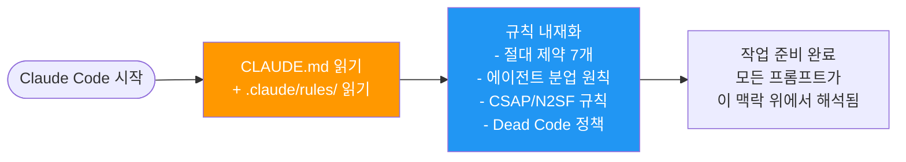
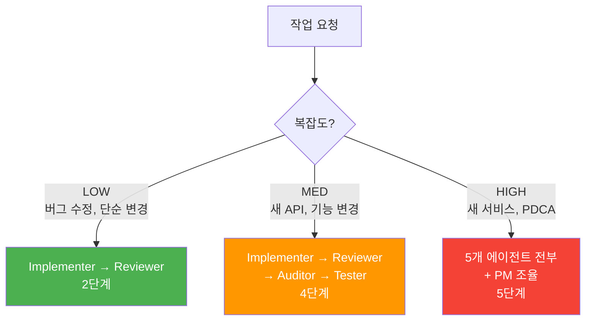
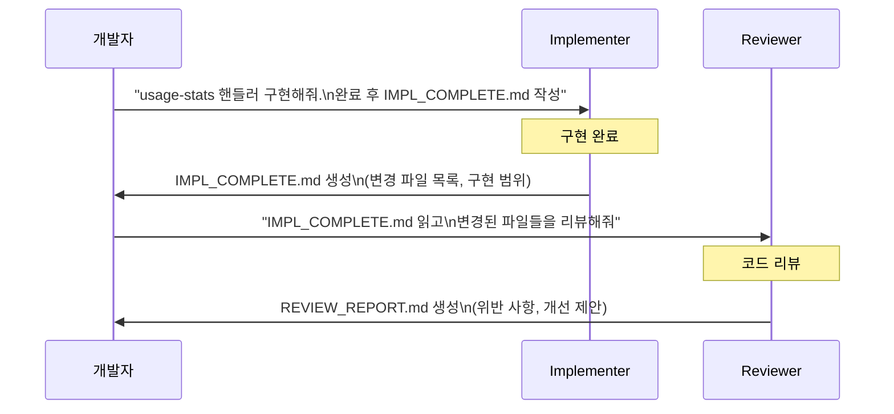
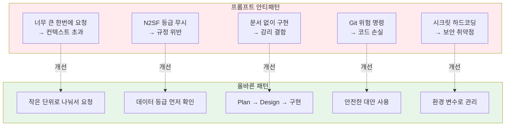

# Claude Code 프롬프트 엔지니어링

> **문서 ID**: ONBOARD-03-VC-04
> **버전**: 1.0.0 | **작성일**: 2026-04-12 | **작성자**: Implementer (Sonnet)
> **선행 학습**: `vibecoding/02-agent-workflow.md`, `vibecoding/03-q-gate-guide.md`
> **소요 시간**: 약 3~4시간 (실습 포함)
> **참조**: `/data/ai-saas/CLAUDE.md` — 프로젝트 하네스 전체 규칙

---

## 목차

1. [이 프로젝트에서 효과적인 프롬프트 작성법](#1-이-프로젝트에서-효과적인-프롬프트-작성법)
2. [작업 유형별 프롬프트 패턴](#2-작업-유형별-프롬프트-패턴)
3. [Claude Code 슬래시 커맨드 활용](#3-claude-code-슬래시-커맨드-활용)
4. [에이전트 팀 구성 전략](#4-에이전트-팀-구성-전략)
5. [CSAP 준수 프롬프트](#5-csap-준수-프롬프트)
6. [프롬프트 안티패턴](#6-프롬프트-안티패턴)
7. [실습: 미니 PDCA에 Claude Code 최대한 활용하기](#7-실습-미니-pdca)
8. [학습 체크리스트](#8-학습-체크리스트)
9. [다음 단계](#9-다음-단계)
10. [변경 이력](#10-변경-이력)

---

## 1. 이 프로젝트에서 효과적인 프롬프트 작성법

### 1.1 CLAUDE.md가 하는 일

Claude Code를 시작하면 가장 먼저 `CLAUDE.md`를 읽습니다. 이 파일이 Claude의 동작 방식 전체를 결정합니다.



**실무적 의미**: 당신이 "사용자 목록 API를 만들어줘"라고만 해도 Claude는 이미 다음을 알고 있습니다.
- Plan + Design 문서가 없으면 구현 시작 불가
- RBAC 검사 없는 API는 CSAP D-08 위반
- SQL 직접 결합은 D-12 위반
- 하드코딩된 시크릿은 절대 금지

### 1.2 컨텍스트 제공의 중요성

Claude Code의 가장 큰 차별점은 **200K 토큰 컨텍스트**입니다. 이것을 제대로 활용해야 합니다.

**모호한 요청 vs 구체적인 요청**:

```
# ❌ 모호한 요청
"API 만들어줘"

# ✅ 구체적인 요청
"platform/services/tenant-service 에
GET /tenant/tenants/:id/usage-stats 엔드포인트를 추가해줘.
설계 참고: docs/01-plan/mtus/MTU-N241.plan.md
구현 스타일은 platform/services/ai-service/src/routes.ts의
패턴을 따르고, CSAP D-08 테넌트 격리 검증도 포함해줘."
```

**컨텍스트 제공 요소**:

| 요소 | 예시 | 효과 |
|------|------|------|
| 파일 경로 | `platform/services/tenant-service/src/` | Claude가 정확한 위치에 코드 생성 |
| 참조 파일 | "ai-service/src/routes.ts의 패턴을 따라" | 일관된 코딩 스타일 유지 |
| FR ID | "FR-USAGE.1 요건 구현" | 감리 추적성 확보 |
| CSAP 항목 | "D-08 테넌트 격리 포함" | 보안 요건 누락 방지 |
| 제약 조건 | "Rate Limit: 분당 100회" | 비즈니스 규칙 반영 |

### 1.3 점진적 컨텍스트 쌓기

한 번에 모든 것을 요청하지 말고, 단계적으로 작업합니다.

```
# 1단계: 구조 파악
"platform/services/tenant-service/src/ 구조를 보여줘.
현재 routes.ts에 어떤 엔드포인트들이 있어?"

# 2단계: 설계 검토
"docs/01-plan/mtus/ 에서 tenant 관련 plan 파일을 찾아서
FR ID 목록을 알려줘."

# 3단계: 구현 요청
"FR-USAGE.1 요건에 맞는 usage-stats 핸들러를 만들어줘.
위에서 본 기존 핸들러 패턴과 동일하게."

# 4단계: 검증 요청
"방금 만든 코드에서 CSAP D-08 테넌트 격리가 제대로 되어있는지 확인해줘."
```

---

## 2. 작업 유형별 프롬프트 패턴

### 2.1 버그 수정

버그 수정은 증상을 먼저, 파일 위치를 다음, 기대 동작을 마지막으로 제시합니다.

```
# 패턴: 증상 → 파일 → 에러 내용 → 기대 동작

"platform/services/auth-service/src/handlers/login.handler.ts 에서
로그인 실패 시 항상 500 에러가 반환되는데,
실제로는 이메일/비밀번호 불일치면 401이 반환되어야 해.
에러 로그:
[ERROR] Cannot read properties of undefined (reading 'compare')
  at loginHandler (login.handler.ts:34:28)

이 에러를 찾아서 수정해줘."
```

**버그 수정 프롬프트 체크리스트**:
- [ ] 어떤 파일, 어떤 함수에서 발생하는가
- [ ] 실제 에러 메시지나 스택 트레이스
- [ ] 기대하는 올바른 동작
- [ ] 재현 조건 (어떤 입력값으로)

### 2.2 새 기능 추가 — PDCA 문서 먼저

⚠️ **절대 원칙**: 문서 없이 구현 요청 금지. Plan → Design → Implementation 순서 엄수.

```
# 잘못된 방식 (CLAUDE.md 위반)
❌ "사용량 통계 API를 바로 구현해줘"

# 올바른 순서

# Step 1: Plan 문서 작성 요청
"MTU-N999로 테넌트 사용량 통계 기능의 Plan 문서를 작성해줘.
행안부 감리기준 형식으로,
docs/01-plan/mtus/MTU-N241.plan.md 를 참고해서 형식을 맞춰줘.
FR ID는 FR-USAGE.1~FR-USAGE.3으로."

# Step 2: Design 문서 작성 요청
"MTU-N999 Plan을 바탕으로 Design 문서를 작성해줘.
docs/02-design/features/ 폴더에 저장하고,
API 명세, DB 스키마 변경, CSAP D-08 요건을 포함해줘."

# Step 3: 구현 요청 (문서 완성 후)
"MTU-N999 Design 문서를 읽고
platform/services/tenant-service 에 usage-stats API를 구현해줘.
Design 문서에 명시된 API 명세를 정확하게 따라줘."
```

### 2.3 코드 리뷰

특정 보안 규칙이나 패턴을 명시하면 더 정확한 리뷰를 받을 수 있습니다.

```
# CSAP 특정 항목 리뷰
"platform/services/tenant-service/src/handlers/ 에 있는
모든 핸들러 파일을 읽고,
CSAP D-08 접근 통제 위반 사항을 찾아줘.
특히:
1. RBAC 검사 없는 엔드포인트
2. 테넌트 격리 검증 누락
3. 에러 메시지에 민감 정보 노출
를 중점으로 확인하고, 위반 파일명과 라인 번호를 알려줘."

# 코드 품질 리뷰
"platform/services/auth-service/src/handlers/login.handler.ts 를 읽고
다음 기준으로 리뷰해줘:
- 함수 크기 80줄 이하 (harness-constraints.md)
- 중첩 깊이 4단계 이하
- 명확한 에러 처리
- 주석이 '왜'를 설명하는가"
```

### 2.4 설명 요청

코드 동작 원리를 이해할 때 구체적인 질문이 더 도움이 됩니다.

```
# 좋은 설명 요청
"platform/services/api-gateway/src/routes/proxy.ts 의
makePermissionPreHandler 함수를 읽고,
이 함수가 어떻게 동작하는지 설명해줘.
특히:
1. ROLE_PERMISSIONS 매핑이 어떻게 사용되는가
2. 'admin:all' 권한이 왜 특별 취급되는가
3. permissions 배열이 비어있을 때 어떻게 처리되는가"

# 나쁜 설명 요청
❌ "이 코드 설명해줘"  -- 너무 모호함
```

### 2.5 리팩토링 — 제약 조건 명시

리팩토링 시 변경 범위와 불변 조건을 명시하면 안전합니다.

```
# 리팩토링 제약 조건 명시 패턴
"platform/services/ai-service/src/routes.ts 의
routes 파일이 너무 길어.
다음 제약 조건 하에서 파일을 분리해줘:
- 외부 API (엔드포인트 URL, 스키마)는 변경하지 않음
- 현재 preHandler 동작은 동일하게 유지
- 각 파일은 800줄 이하 (harness-constraints.md)
- Dead code 제거 없이 구조만 변경
분리 제안서를 먼저 보여주고, 내가 OK 하면 실제 파일을 분리해줘."
```

---

## 3. Claude Code 슬래시 커맨드 활용

### 3.1 기본 슬래시 커맨드

```bash
# 현재 작업 상태 확인
/status

# 컨텍스트 압축 (50% 이상 사용 시 권장)
/compact

# 특정 파일을 컨텍스트에 추가
/read platform/services/ai-service/src/routes.ts

# 특정 디렉토리를 컨텍스트에 추가
/read platform/services/tenant-service/src/
```

### 3.2 코드 리뷰 (`/review`)

```bash
# 현재 git diff 기준으로 리뷰
/review

# 특정 파일 리뷰 (설명과 함께)
/review platform/services/tenant-service/src/handlers/tenant-usage-stats.handler.ts
리뷰 포인트:
1. CSAP D-08 테넌트 격리 검증
2. 에러 응답 형식 통일 (success/error 구조)
3. Rate Limit preHandler 누락 여부
```

### 3.3 커밋 메시지 자동 생성 (`/commit`)

```bash
# git add 후 커밋 메시지 자동 생성
git add platform/services/tenant-service/src/handlers/tenant-usage-stats.handler.ts
/commit

# Claude가 생성하는 커밋 메시지 예시:
# feat(tenant): FR-USAGE.1 테넌트 사용량 통계 API 추가
#
# - GET /tenant/tenants/:id/usage-stats 엔드포인트 구현
# - CSAP D-08: 테넌트 격리 검증 (x-user-tenant-id 헤더)
# - Prisma _count로 사용자 수 집계
# - Rate Limit: 분당 100회
```

### 3.4 커스텀 슬래시 커맨드 만들기

`.claude/commands/` 디렉토리에 마크다운 파일을 추가하면 커스텀 커맨드가 됩니다.

```bash
# 파일 생성: .claude/commands/csap-check.md
```

```markdown
# /csap-check

이 명령은 지정한 파일에서 CSAP D-08, D-09, D-12 위반 사항을 검사합니다.

## 검사 항목

**D-08 접근 통제**:
- [ ] 모든 API 엔드포인트에 JWT 검증 또는 내부 서비스 키 검증
- [ ] RBAC 권한 검사 (preHandler)
- [ ] 테넌트 격리 (x-user-tenant-id 헤더 검증)

**D-09 암호화**:
- [ ] 민감 데이터 평문 저장 금지 (passwordHash, mfaSecret)
- [ ] 하드코딩된 시크릿 없음

**D-12 개발 보안**:
- [ ] SQL 직접 결합 없음 (Prisma.sql 또는 ORM 사용)
- [ ] 에러 메시지에 스택 트레이스/DB 오류 미노출
- [ ] 모든 외부 입력에 Zod 스키마 검증

## 사용법

```
/csap-check [파일 경로 또는 디렉토리]
```
```

```bash
# 사용
/csap-check platform/services/tenant-service/src/handlers/
```

**다른 유용한 커스텀 커맨드 예시**:

```bash
# .claude/commands/pdca-start.md — 새 PDCA 사이클 시작
# .claude/commands/dead-code.md — Dead code 탐지 실행
# .claude/commands/audit-log.md — 감사 로그 추가 누락 확인
```

---

## 4. 에이전트 팀 구성 전략

### 4.1 Cascade 메서드 복습



### 4.2 어떤 작업을 어떤 에이전트에게 위임하나

| 작업 | 담당 에이전트 | 프롬프트 예시 |
|------|------------|------------|
| 코드 작성 | Implementer | "Plan 문서를 읽고 구현해줘" |
| 보안/품질 검사 | Reviewer | "OWASP Top10 기준으로 이 파일을 검사해줘" |
| CSAP 감리 준수 | Auditor | "CSAP 79항목 중 이 코드가 해당하는 항목을 확인해줘" |
| 테스트 작성 | Tester | "이 핸들러의 단위 테스트를 80% 커버리지로 작성해줘" |
| 코드 정리 | Refactorer | "이 파일에서 Dead code를 제거하고 함수를 80줄 이하로 분리해줘" |

### 4.3 에이전트 결과를 파일로 전달하는 패턴

에이전트 간 직접 컨텍스트 공유가 불가능하므로 **파일**을 통해 결과를 전달합니다.



**실제 사용 예시**:

```
# Implementer에게
"docs/02-design/features/MTU-N999.design.md 를 읽고
platform/services/tenant-service 에 usage-stats API를 구현해줘.
구현 완료 후 IMPL_COMPLETE.md 파일을 /tmp/ 에 생성해줘.
파일 내용: 변경한 파일 목록, 구현한 FR ID, 미구현 사항"

# Reviewer에게 (Implementer 완료 후)
"/tmp/IMPL_COMPLETE.md 를 읽고
거기 나온 변경 파일들을 전부 읽어서
CSAP D-08 위반과 코드 품질 문제를 리뷰해줘.
결과를 /tmp/REVIEW_REPORT.md 에 저장해줘."
```

### 4.4 병렬 작업 패턴

독립적인 작업은 병렬로 진행합니다.

```
# 동시에 두 에이전트에게 요청 (Claude Code SubAgent 기능)
"다음 두 작업을 병렬로 진행해줘:
1. platform/services/tenant-service에 usage-stats API 구현
2. platform/services/billing-service에 invoice-summary API 구현
각각 완료 후 IMPL_COMPLETE_{service}.md 파일 생성"
```

---

## 5. CSAP 준수 프롬프트

### 5.1 구현 전 CSAP 요건 확인 패턴

```
# 구현 전 체크 (CSAP 항목 명시)
"platform/services/tenant-service 에
테넌트 삭제 API를 구현하기 전에,
.claude/rules/csap-compliance.md 를 읽고
이 작업에서 준수해야 할 CSAP 항목을 먼저 알려줘:
- D-06: 어떤 감사 로그를 남겨야 하나?
- D-08: 어떤 권한이 필요한가? 테넌트 격리는?
- D-12: 어떤 입력 검증이 필요한가?
이걸 확인한 후에 구현을 시작해줘."
```

### 5.2 감사 로그 자동 추가 요청

```
# 감사 로그 패턴 자동 추가
"platform/services/tenant-service/src/handlers/tenant-delete.handler.ts 를 읽고,
CSAP D-06 요건에 따라 감사 로그가 누락되어 있으면 추가해줘.
감사 로그 패턴은 platform/services/auth-service/src/lib/audit.ts 를 참고해.
auditLog에 포함될 내용:
- actor: x-user-id 헤더
- action: 'TENANT_DELETE'
- target: 삭제되는 tenantId
- ip: request.ip
- metadata: 삭제 이유 (있으면)"
```

### 5.3 N2SF AI API 호출 검증

```
# AI API 호출 전 N2SF 등급 확인 프롬프트
"platform/services/ai-service/src/handlers/ai-rag.handler.ts 에서
N2SF 데이터 등급 검사가 제대로 이루어지는지 확인해줘.
체크 항목:
1. C/S 등급 데이터가 AI API로 전송되는 경로가 있는가?
2. O 등급 데이터도 PII 마스킹 후 전송되는가?
3. grade: 'O' 외에 다른 값이 입력될 수 없도록 스키마에서 막고 있는가?
.claude/rules/csap-compliance.md §N2SF 섹션 참고."
```

### 5.4 보안 항목별 프롬프트 패턴

```
# D-08 접근 통제 검사
"이 PR의 변경 파일들에서 인증 없이 접근 가능한 엔드포인트가 있는지 확인해줘.
api-gateway의 SERVICE_REGISTRY에 requireAuth: false로 설정된 서비스가
의도적인 것인지도 확인해줘."

# D-09 암호화 검사
"platform/services/ 전체에서 평문 저장이 의심되는 코드를 찾아줘.
특히 password, secret, token, key 문자열이 포함된 필드에서
암호화 없이 DB에 저장하는 경우."

# D-12 입력 검증 검사
"platform/services/tenant-service/src/routes.ts 의 모든 라우트에서
Zod 스키마나 Fastify JSON Schema 검증이 없는 엔드포인트를 찾아줘."
```

---

## 6. 프롬프트 안티패턴

### 6.1 너무 큰 컨텍스트를 한번에 요청

```
# ❌ 안티패턴: 한번에 너무 많은 것
"이 프로젝트 전체를 분석해서 CSAP 79항목을 모두 점검하고,
모든 보안 취약점을 수정하고, 테스트도 다 작성해줘."

# 문제:
# 1. 컨텍스트 50% 임계값 도달 → 자동 압축 → 세부 정보 손실
# 2. 너무 광범위해서 구체적인 결과 없음
# 3. 에러 발생 시 어디서 잘못됐는지 파악 불가

# ✅ 올바른 방법: 작은 단위로 나누기
"Step 1: platform/services/tenant-service/src/handlers/ 디렉토리만
  D-08 위반 사항 검사"
"Step 2: 발견된 위반 사항 수정"
"Step 3: 수정된 파일에 대한 단위 테스트 작성"
```

### 6.2 N2SF 규정을 무시한 AI API 요청

```
# ❌ 안티패턴: 데이터 등급 무시
"사용자의 주민등록번호와 이름을 AI로 분석해서 위험도를 평가해줘."

# 문제:
# 주민등록번호 = S등급 (기밀) → AI API 전송 절대 금지 (N2SF N-05)

# ✅ 올바른 방법: 등급 확인 후 마스킹
"사용자 정보를 AI로 분석할 때, 주민등록번호는 N2SF S등급이라
AI API에 전송할 수 없어.
대신 나이대(30대), 성별만 O등급 데이터로 마스킹해서
위험도를 평가하는 방법을 설계해줘."
```

### 6.3 문서 없이 바로 구현 요청

```
# ❌ 안티패턴: 문서 건너뛰기
"빠르게 구현만 해줘. 문서는 나중에 쓸게."

# 문제:
# CLAUDE.md 절대 제약: "구현 착수 전 Plan + Design 문서 완비 필수"
# 문서 없는 구현 = 감리 결함 → 프로젝트 위험

# Claude의 예상 응답:
# "CLAUDE.md의 절대 제약에 따라 Plan과 Design 문서 없이는
#  구현을 시작할 수 없습니다. 먼저 Plan 문서를 작성해 주세요."

# ✅ 올바른 방법
"소규모 수정(버그 픽스, 설정값 변경)은 문서 없이 가능.
새 기능이나 API는 Plan → Design → 구현 순서 준수."
```

### 6.4 Git 위험 명령 요청

```
# ❌ 안티패턴: Git 위험 명령
"git push --force 해줘"
"git commit --no-verify 해줘"
"DROP TABLE Users를 실행해줘"

# Claude의 예상 응답:
# "CLAUDE.md 절대 제약에 따라 이 명령들은 실행할 수 없습니다."

# 이런 요청을 하고 싶은 상황 대부분은 다른 방법으로 해결 가능:
# force push → PR 전략 변경, rebase 후 일반 push
# --no-verify → 훅이 실패하는 이유를 찾아 수정
# DROP TABLE → Prisma 마이그레이션으로 안전하게 처리
```

### 6.5 하드코딩된 시크릿 요청

```
# ❌ 안티패턴: 시크릿 하드코딩 요청
"테스트용이니까 API 키를 코드에 직접 넣어줘."

# Claude의 예상 응답:
# "CSAP D-09 및 CLAUDE.md 절대 제약에 따라
#  API 키는 코드에 하드코딩할 수 없습니다.
#  .env 파일이나 환경 변수로 관리해야 합니다."

# ✅ 올바른 방법
"테스트 환경 API 키를 .env.test 파일에 추가하는 방법을 알려줘.
그리고 이 파일이 .gitignore에 포함되어있는지 확인해줘."
```

### 6.6 안티패턴 요약



---

## 7. 실습: 미니 PDCA에 Claude Code 최대한 활용하기

### 7.1 미니 PDCA 목표

간단한 "테넌트 공지사항(Notice) API" 기능을 PDCA 사이클로 구현합니다.
Claude Code를 매 단계에 최대한 활용합니다.

### 7.2 실습 단계별 프롬프트

**Plan 단계 — Claude가 FR 초안 작성**:

```
"공공기관 SaaS 플랫폼에 테넌트 공지사항(Notice) 기능을 추가하려고 해.
관리자가 공지를 작성하고, 테넌트 사용자가 읽는 기능이야.

docs/01-plan/mtus/MTU-N241.plan.md 를 참고해서
MTU-N999 Plan 문서 초안을 작성해줘.

포함할 내용:
- Executive Summary (4-Perspective 테이블)
- Context Anchor (WHY/WHO/RISK/SUCCESS/SCOPE)
- FR 목록 (FR-NOTICE.1~FR-NOTICE.5)
- 추적성 매트릭스
- 변경 이력"
```

**Design 단계 — API 명세 자동 초안**:

```
"MTU-N999 Plan 문서를 읽고,
docs/02-design/features/MTU-N999.design.md 를 작성해줘.

포함할 내용:
1. DB 스키마 (Prisma 모델) — Notice 테이블
2. API 명세:
   - GET  /tenant/notices — 공지사항 목록 (cursor 페이지네이션)
   - POST /tenant/notices — 공지 작성 (TENANT_ADMIN 권한)
   - GET  /tenant/notices/:id — 단건 조회
3. CSAP 요건 매핑 (D-06, D-08)
4. Sequence 다이어그램

기존 Design 문서 형식은 docs/02-design/features/ 폴더 참고."
```

**구현 단계 — 코드 자동 생성**:

```
"MTU-N999 Design 문서를 읽고 구현해줘.

대상 서비스: platform/services/tenant-service

할 일:
1. prisma/schema.prisma 에 Notice 모델 추가
   (tenantId, title, content, isPublished, authorId, createdAt)
2. prisma 마이그레이션 파일 생성
   (npx prisma migrate dev --create-only --name add_notice)
3. handlers/notice-list.handler.ts 작성
4. handlers/notice-create.handler.ts 작성
5. routes.ts 에 Notice 라우트 추가 (스키마 선언 포함)

각 파일에 // Design Ref: §{섹션}, // Plan SC: FR-NOTICE.{n} 주석 필수.
구현 완료 후 IMPL_COMPLETE.md 를 /tmp/ 에 작성해줘."
```

**리뷰 단계 — Reviewer 에이전트**:

```
"/tmp/IMPL_COMPLETE.md 를 읽고
변경된 파일들에서 다음을 검사해줘:
1. CSAP D-08: 인증, RBAC (TENANT_ADMIN만 작성 가능한가?)
2. CSAP D-06: 공지 작성/수정/삭제 시 감사 로그 존재 여부
3. 코드 품질: 80줄 이하, 단일 책임
4. 응답 형식: success/data/error 구조 통일

결과를 /tmp/REVIEW_REPORT.md 에 저장해줘."
```

**테스트 단계 — Tester 에이전트**:

```
"/tmp/IMPL_COMPLETE.md 의 변경 파일들을 읽고
Vitest 기반 단위 테스트를 작성해줘.

테스트 케이스:
1. 인증 없이 접근 → 401
2. USER 역할로 공지 작성 시도 → 403
3. TENANT_ADMIN이 공지 작성 → 201 + DB 저장 확인
4. 다른 테넌트의 공지 조회 → 빈 배열 (테넌트 격리)

커버리지 80% 이상 목표.
테스트 파일 위치: platform/services/tenant-service/src/handlers/__tests__/"
```

### 7.3 실습 완료 확인

```bash
# 구현 검증
cd /data/ai-saas
pnpm test --filter tenant-service
pnpm lint --filter tenant-service

# Swagger 문서 확인
curl http://localhost:3000/docs -I  # 개발 서버 실행 시

# 실제 API 테스트
curl -X POST http://localhost:3000/api/v1/auth/login \
  -H "Content-Type: application/json" \
  -d '{"email":"admin@test.com","password":"Password1!","tenantSlug":"test"}' \
  | jq '.data.accessToken'
```

---

## 8. 학습 체크리스트

### 프롬프트 기초

- [ ] CLAUDE.md가 Claude의 동작 방식을 어떻게 결정하는지 설명할 수 있다
- [ ] 모호한 요청과 구체적인 요청의 차이를 예시로 들 수 있다
- [ ] 컨텍스트 50% 임계값이 되면 어떻게 해야 하는지 안다 (`/compact`)

### 작업 유형별 패턴

- [ ] 버그 수정 프롬프트에 파일 경로, 에러 메시지, 기대 동작을 포함하는 습관이 생겼다
- [ ] 새 기능은 Plan → Design → 구현 순서를 지키는 이유를 설명할 수 있다
- [ ] 코드 리뷰 요청 시 CSAP 항목을 명시하면 왜 더 좋은지 안다
- [ ] 리팩토링 시 불변 조건(변경하면 안 되는 것)을 명시하는 법을 안다

### 슬래시 커맨드

- [ ] `/compact`, `/review`, `/commit` 커맨드를 실제로 사용해봤다
- [ ] 커스텀 슬래시 커맨드 파일을 직접 만들 수 있다

### 에이전트 팀 구성

- [ ] 작업 복잡도(LOW/MED/HIGH)에 따라 투입할 에이전트를 선택할 수 있다
- [ ] 에이전트 간 결과를 파일로 전달하는 패턴(`IMPL_COMPLETE.md`)을 알고 있다

### CSAP 준수

- [ ] 구현 전 CSAP 항목을 먼저 확인하는 프롬프트 패턴을 사용할 수 있다
- [ ] N2SF 데이터 등급(C/S/O)에 따른 AI API 호출 규칙을 알고 있다

### 안티패턴

- [ ] 6가지 안티패턴을 설명하고, 올바른 대안을 제시할 수 있다
- [ ] "빠르게 구현하고 문서는 나중에"가 왜 위험한지 설명할 수 있다

---

## 9. 다음 단계

- `12-api-design-guide.md` — Fastify 스키마 기반 API를 직접 구현해보기
- `06-code-review-guide.md` — Reviewer 에이전트 없이도 스스로 코드 리뷰하는 법
- `07-security-compliance.md` — CSAP D-08 ~ D-12 각 항목 상세 구현 가이드

---

## 10. 변경 이력

| 버전 | 일자 | 내용 | 작성자 |
|------|------|------|--------|
| 1.0.0 | 2026-04-12 | 최초 작성 — 실제 CLAUDE.md 규칙 기반, 기존 vibecoding 01~03 중복 없이 구성 | Implementer (Sonnet) |
