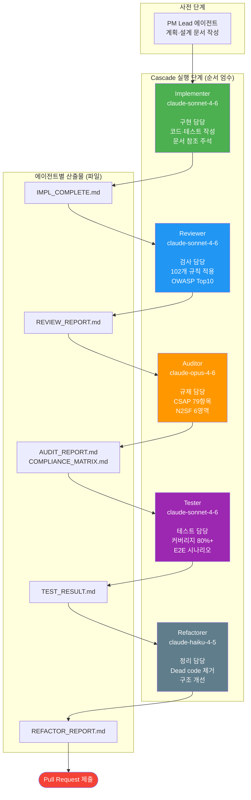
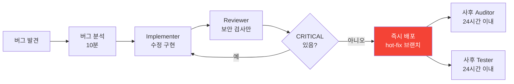
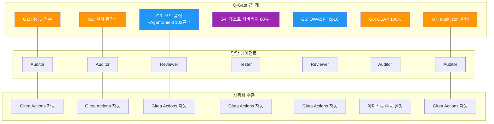
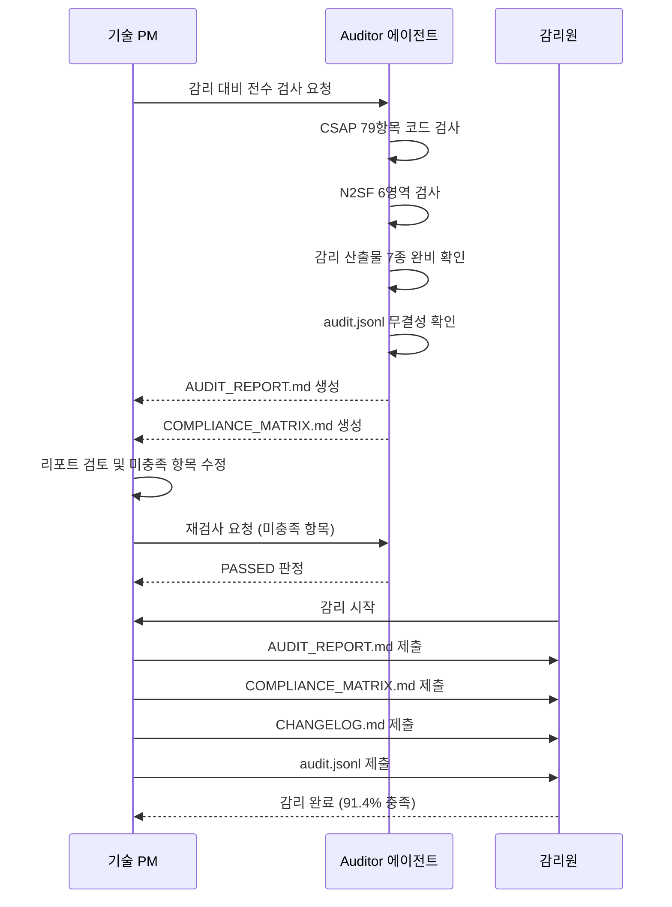

# 멀티 에이전트 패턴 — Claude Code Cascade 완전 가이드

> **문서 ID**: ONBOARD-03-VC-05
> **버전**: 1.0.0 | **작성일**: 2026-04-12 | **대상**: 개발자, 기술 PM
> **선행 학습**: `vibecoding/02-agent-workflow.md`, `vibecoding/04-prompt-engineering.md`
> **참조 파일**: `/data/ai-saas/.claude/agents/` (5개 에이전트 정의), `/data/ai-saas/CLAUDE.md`
> **소요 시간**: 약 4시간

---

## 목차

1. [멀티 에이전트 아키텍처 이해](#1-멀티-에이전트-아키텍처-이해)
2. [각 에이전트 역할 심화](#2-각-에이전트-역할-심화)
3. [효과적인 에이전트 위탁 방법](#3-효과적인-에이전트-위탁-방법)
4. [Cascade 실전 예시](#4-cascade-실전-예시)
5. [Q-Gate와 에이전트 연동](#5-q-gate와-에이전트-연동)
6. [에이전트 비용 최적화](#6-에이전트-비용-최적화)
7. [공공기관 맥락에서의 에이전트 활용](#7-공공기관-맥락에서의-에이전트-활용)
8. [안티패턴 및 주의사항](#8-안티패턴-및-주의사항)
9. [변경 이력](#9-변경-이력)

---

## 1. 멀티 에이전트 아키텍처 이해

### 1.1 왜 단일 에이전트가 아닌 멀티 에이전트인가

Claude Code를 처음 사용하는 개발자는 흔히 이런 생각을 합니다.

> "그냥 Claude한테 '이 기능 다 만들어줘'라고 하면 되는 거 아닌가요?"

틀린 말은 아닙니다. 단일 에이전트도 코드를 작성할 수 있습니다. 그러나 공공기관 SaaS 프레임워크에서는 이 방식이 충분하지 않습니다. 이유는 세 가지입니다.

**이유 1: 역할 충돌 (Conflict of Interest)**

구현자(Implementer)가 자신의 코드를 검토(Review)하면 객관성이 떨어집니다. "내가 만든 코드니까 맞을 거야"라는 확증 편향이 발생합니다. 멀티 에이전트는 구현 에이전트와 검토 에이전트를 분리하여 이 문제를 해결합니다.

**이유 2: 전문성 깊이**

CSAP 79개 통제항목을 전부 암기하면서 동시에 코드를 최적으로 작성하는 것은 어렵습니다. 각 에이전트가 특정 도메인에 집중하도록 분업하면 각 영역에서 더 높은 품질을 달성할 수 있습니다.

**이유 3: 감리 추적성**

행안부 감리기준은 개발, 검토, 감리의 역할 분리를 요구합니다. 멀티 에이전트는 이 역할 분리를 자동화하고 각 단계의 산출물을 파일로 남겨 감리 증빙으로 활용합니다.

### 1.2 Cascade 메서드: 구현→리뷰→감리→테스트→리팩토링

Cascade 메서드는 5개 전문 에이전트가 폭포처럼 순서대로 작업을 이어받는 방식입니다. 각 에이전트는 이전 에이전트의 파일 산출물을 읽고 자신의 역할을 수행합니다.

```
연구(PM Lead) → Plan 문서 → Design 문서
                                  ↓
                             Implementer
                             (코드 작성)
                                  ↓
                              Reviewer
                           (코드 품질 검사)
                                  ↓
                              Auditor
                           (CSAP 규제 검증)
                                  ↓
                               Tester
                           (테스트 작성·실행)
                                  ↓
                            Refactorer
                           (Dead code 제거)
                                  ↓
                           PR 제출 → 머지
```

각 단계는 이전 단계가 완료되어야 진행 가능합니다. Reviewer가 BLOCKED를 반환하면 Implementer가 수정 후 다시 시작합니다.

### 1.3 Mermaid: 5개 에이전트 역할 분업 다이어그램



### 1.4 에이전트 간 파일 기반 통신

에이전트들은 서로 직접 대화하지 않습니다. **파일을 통해 결과를 전달**합니다. 이는 매우 중요한 설계 원칙입니다.

왜 파일 기반 통신인가?

- **추적성**: 모든 에이전트의 판단 근거가 파일로 남습니다. 감리 시 "왜 이 코드가 승인되었는가?"에 대한 답변이 파일에 있습니다.
- **독립성**: 각 에이전트는 이전 에이전트의 컨텍스트(대화 기록)에 의존하지 않고 파일만 읽습니다.
- **재실행 가능성**: 특정 에이전트만 재실행해도 됩니다. Reviewer가 실패했다면 Implementer부터 다시 실행하지 않아도 됩니다.

파일 통신 규약:

```
IMPL_COMPLETE.md     → Reviewer가 읽는 파일
REVIEW_REPORT.md     → Auditor가 읽는 파일
AUDIT_REPORT.md      → Tester가 읽는 파일
COMPLIANCE_MATRIX.md → Tester가 읽는 파일
TEST_RESULT.md       → Refactorer가 읽는 파일
REFACTOR_REPORT.md   → PR 제출자가 읽는 파일
```

---

## 2. 각 에이전트 역할 심화

### 2.1 Implementer — 구현 전문가

**모델**: `claude-sonnet-4-6`
**파일**: `.claude/agents/implementer.md`

Implementer는 Cascade의 첫 번째 실행 에이전트입니다. Plan 문서와 Design 문서를 읽고 실제 코드를 작성합니다.

**Implementer가 하는 일:**

1. Design 문서(`docs/02-design/features/*.design.md`)를 전부 읽습니다.
2. Plan 문서에서 FR ID를 확인하고 구현 범위를 파악합니다.
3. Context Anchor 표의 WHY/WHO/RISK/SUCCESS/SCOPE를 확인합니다.
4. CSAP D-12 원칙에 따라 코드를 작성합니다:
   - 모든 입력에 Zod 검증
   - 매개변수화 쿼리 (SQL 주입 방지)
   - 환경 변수로 시크릿 관리
   - RBAC 검사 필수
5. 문서 참조 주석을 코드에 삽입합니다:
   ```typescript
   // Design Ref: §3.2 — Redis 캐싱 패턴
   // Plan SC: FR-N252.3 — 응답 성능 최적화
   ```
6. `IMPL_COMPLETE.md` 파일을 생성하여 구현 범위와 변경 파일 목록을 기록합니다.

**언제 Implementer를 사용하는가:**
- Plan + Design 문서가 완비된 후
- 신규 기능 추가
- 버그 수정 (FR ID 추적 가능한 경우)
- 기존 코드 수정

**언제 사용하지 않는가:**
- Plan 또는 Design 문서가 없을 때 (절대 제약)
- 탐색적 코드 작성 (프로토타입)

### 2.2 Reviewer — 코드 품질·보안 감시자

**모델**: `claude-sonnet-4-6`
**파일**: `.claude/agents/reviewer.md`

Reviewer는 코드를 직접 수정하지 않습니다. 오직 검사하고 리포트를 생성합니다.

**AgentShield 102개 규칙 — 주요 카테고리:**

| 카테고리 | 규칙 수 | 예시 |
|---------|--------|------|
| 보안 취약점 | 35개 | 하드코딩 시크릿, SQL 주입, XSS |
| 코드 품질 | 28개 | 함수 크기 80줄 초과, 중첩 4단계 초과 |
| CSAP 준수 | 22개 | RBAC 누락, 암호화 누락, 감사 로그 누락 |
| Dead Code | 10개 | 미사용 함수, 미사용 import, 주석 코드 |
| 성능 | 7개 | N+1 쿼리, 동기 블로킹 코드 |

**OWASP Top10 검사 방법:**

Reviewer는 OWASP Top10 각 항목을 코드 패턴으로 탐지합니다.

```bash
# A01: 접근 제어 취약 — RBAC 누락 API 탐지
grep -rn "export async function GET\|export async function POST" \
  platform/services/ | \
  grep -v "verifyToken\|hasPermission\|requireAuth"
# → 출력 있으면 인증 누락 API 의심

# A03: SQL 주입 — 직접 문자열 결합 탐지
grep -rn "execute\(\`\|query\(\`" platform/services/ | \
  grep -v "^\s*//"
# → 출력 있으면 SQL 주입 위험
```

**심각도별 처리 방침:**

```
CRITICAL → 즉시 차단 (보안 취약점, 인증 우회)
HIGH     → 차단 (코드 품질 심각 문제)
MEDIUM   → 경고 (성능, 구조)
LOW      → 참고 (스타일, 문서)

CRITICAL 또는 HIGH 존재 → BLOCKED (Implementer 재작업)
MEDIUM 이하만 존재       → APPROVED (Auditor 인계)
```

### 2.3 Auditor — 감리·규제 준수 감시자

**모델**: `claude-opus-4-6` (복합 규제 분석에 Opus 사용)
**파일**: `.claude/agents/auditor.md`

Auditor는 Cascade에서 가장 전문화된 에이전트입니다. CSAP 79개 통제항목, N2SF 6개 보안 영역, 행안부 감리기준을 모두 알고 있으며, 읽기 전용으로만 동작합니다.

**CSAP 79항목 검사 방법 — 예시:**

| CSAP 항목 | 코드 검사 방법 | 증거 위치 |
|---------|------------|---------|
| D-08-01 RBAC | `verifyToken` 호출 여부 | routes.ts 각 핸들러 |
| D-08-02 최소 권한 | `hasPermission('resource:read')` 범위 | 권한 정의 파일 |
| D-09-01 저장 암호화 | `encrypt()` 함수 사용 여부 | DB 저장 로직 |
| D-09-02 전송 암호화 | TLS 설정, HTTP 사용 금지 | 인프라 설정 |
| D-12-01 입력 검증 | `z.object().parse()` 사용 | 모든 API 핸들러 |
| D-06-01 감사 로그 | `auditLog()` 호출 여부 | 민감 작업 함수 |

**N2SF AI 연동 검증:**

Auditor는 AI API 호출 코드를 특별히 검사합니다.

```typescript
// 검사 대상: N2SF N-05 데이터 분류 규칙 준수
// 이런 코드가 있으면 AUDIT_REPORT.md에 플래그

// 위반 패턴 탐지
grep -rn "fetch.*openai.com\|axios.*anthropic.com" platform/services/
// → 직접 AI API 호출 탐지 → CRITICAL 플래그

// 정상 패턴 확인
grep -rn "aiGateway.send\|ai-gateway" platform/services/
// → AI Gateway 경유 확인
```

### 2.4 Tester — 테스트 전문가

**모델**: `claude-sonnet-4-6`
**파일**: `.claude/agents/tester.md`

Tester는 TDD(Test-Driven Development) 방식으로 테스트를 작성하고 실행합니다.

**Q-Gate G4 달성 방법 (커버리지 80%+):**

```bash
# 커버리지 측정
npm run test:coverage

# 커버리지 리포트 위치
open coverage/lcov-report/index.html

# 특정 파일 커버리지 확인
npx c8 report --include="platform/services/ai-service/**"
```

커버리지 기준:
- 신규 함수: 80% 이상
- 변경된 경로: 90% 이상
- CSAP 관련 로직: 100% (감리 대응)
- AI 게이트웨이: 100% (C/S 등급 차단 필수)

**PRD 테스트 시나리오 (TS-1~TS-6) 실행:**

```bash
# TS-1: CSAP 간편등급 체크리스트
npx playwright test tests/e2e/csap-checklist.spec.ts

# TS-4: AI API Gateway 패턴 (보안 필수)
npx playwright test tests/e2e/ai-gateway.spec.ts

# 전체 E2E 실행
npx playwright test tests/e2e/
```

### 2.5 Refactorer — 리팩토링 전문가

**모델**: `claude-haiku-4-5` (단순 코드 정리, 최소 비용)
**파일**: `.claude/agents/refactorer.md`

Refactorer는 기능 변경 없이 코드 구조만 개선합니다. Dead code 제거와 구조 단순화가 주요 역할입니다.

**Dead Code 탐지 도구 실행:**

```bash
# TypeScript 미사용 export 탐지
npx ts-prune --error

# 미사용 npm 패키지 탐지
npx depcheck

# Python 미사용 import 탐지
python -m pyflakes platform/services/

# 일괄 실행
npm run audit:dead-code
```

**처리 기준:**

| 코드 유형 | 처리 방법 | 예외 |
|---------|---------|------|
| 미사용 함수 | 즉시 제거 | 공개 API, 테스트 fixture |
| 미사용 변수 | 즉시 제거 | - |
| 미사용 import | 즉시 제거 | - |
| 주석 처리된 코드 | 제거 (git 히스토리 보존) | - |
| 오래된 TODO (3개월+) | 이슈 전환 후 제거 | - |

---

## 3. 효과적인 에이전트 위탁 방법

### 3.1 명확한 컨텍스트 제공

에이전트에게 작업을 위탁할 때 모호한 지시는 품질을 낮춥니다. 다음 형식을 사용하십시오.

**나쁜 예:**
```
AI RAG 기능 수정해줘
```

**좋은 예:**
```
Implementer 에이전트를 사용하여 다음 작업을 수행하십시오:

작업 범위:
- 파일: platform/services/ai-service/src/handlers/ai-rag.handler.ts
- 변경 내용: Redis 캐싱 레이어 추가

관련 문서:
- Plan: docs/01-plan/mtus/MTU-N252-aiops-rca.plan.md
- Design: docs/02-design/features/aiops-rca.design.md (§3.2 캐싱 패턴)
- FR ID: FR-N252.3

제약 조건:
- CSAP D-12 준수 (입력 검증, 감사 로그)
- N2SF: O 등급 데이터만 캐시 (C/S 등급 캐시 금지)
- 기존 테스트 모두 통과 유지

완료 조건:
- npm test 통과
- 커버리지 80%+ 유지
- IMPL_COMPLETE.md 생성
```

### 3.2 병렬 에이전트 실행 패턴

서로 독립적인 작업은 여러 에이전트를 병렬로 실행하여 시간을 절약할 수 있습니다.

**병렬 실행 가능한 예시:**

```
작업 A: security-service 새 RBAC 함수 구현
작업 B: compliance-service 감사 로그 포맷 개선
작업 C: dora-exporter 메트릭 추가

→ 서로 다른 서비스이므로 3개 Implementer를 동시에 실행 가능
```

**병렬 실행 불가 예시:**

```
작업 A: ai-rag.handler.ts 캐싱 추가 (Implementer)
작업 B: 동일 파일 코드 리뷰 (Reviewer)

→ A 완료 후 B 실행 (순서 의존성)
```

### 3.3 에이전트 결과 검증 방법

에이전트의 결과를 그대로 신뢰하지 마십시오. 반드시 검증합니다.

**Implementer 결과 검증:**

```bash
# 1. 직접 테스트 실행
npm test

# 2. 린트 확인
npm run lint

# 3. 문서 참조 주석 존재 확인
grep -rn "Design Ref:" platform/services/ai-service/src/handlers/ai-rag.handler.ts
grep -rn "Plan SC:" platform/services/ai-service/src/handlers/ai-rag.handler.ts

# 4. 하드코딩 시크릿 없음 확인
grep -rn "sk-\|api_key\s*=\s*\"" platform/services/
```

**Reviewer 결과 검증:**

```bash
# REVIEW_REPORT.md의 최종 결정 확인
grep "최종 결정\|APPROVED\|BLOCKED" REVIEW_REPORT.md

# 이슈 목록 확인
grep "CRITICAL\|HIGH" REVIEW_REPORT.md
```

**Auditor 결과 검증:**

```bash
# AUDIT_REPORT.md의 최종 판정 확인
grep "최종 판정\|PASSED\|FAILED\|CONDITIONAL" AUDIT_REPORT.md

# CSAP 미충족 항목 확인
grep "❌ 미충족" AUDIT_REPORT.md
```

### 3.4 실패한 에이전트 재실행 패턴

에이전트가 실패(BLOCKED)를 반환했을 때의 대응 방법입니다.

```mermaid
flowchart TD
  A[Reviewer BLOCKED] --> B[REVIEW_REPORT.md 읽기]
  B --> C{CRITICAL 이슈\n존재?}
  C -->|예| D[Implementer에게\n이슈 목록 전달]
  D --> E[Implementer 재실행\n이슈 수정]
  E --> F[Reviewer 재실행]
  F --> G{BLOCKED?}
  G -->|예| D
  G -->|아니오| H[Auditor 진행]

  C -->|아니오 (HIGH만)| I[HIGH 이슈 수정\n범위 최소화]
  I --> F
```

재실행 시 Implementer에게 전달할 컨텍스트:

```
Reviewer가 다음 이슈를 발견하였습니다. 수정하십시오:

[CRITICAL] platform/services/ai-service/src/handlers/ai-rag.handler.ts:45
  문제: RBAC 검사 없이 직접 DB 접근
  수정: verifyToken() + hasPermission('rag:read') 추가 필요
  CSAP: D-08-01

[HIGH] 동일 파일:78
  문제: 에러 메시지에 내부 스택 트레이스 노출
  수정: 안전한 에러 응답 패턴 적용 (csap-compliance.md §공통 보안 금지사항)

수정 완료 후 IMPL_COMPLETE.md를 업데이트하십시오.
```

---

## 4. Cascade 실전 예시

### 4.1 새 API 엔드포인트 추가 전체 사이클

**시나리오**: AI RAG에 이미지 첨부 지원 추가 (FR-N252.5)

**Step 1: Plan 문서 확인 (PM Lead 에이전트)**

```bash
# Plan 문서 존재 확인
ls docs/01-plan/mtus/MTU-N252-aiops-rca.plan.md

# FR ID 확인
grep "FR-N252.5" docs/01-plan/mtus/MTU-N252-aiops-rca.plan.md
```

**Step 2: Design 문서 확인**

```bash
# Design 문서 존재 확인
ls docs/02-design/features/aiops-rca.design.md

# 관련 섹션 확인
grep -A 20 "이미지 첨부\|image attachment" docs/02-design/features/aiops-rca.design.md
```

**Step 3: Implementer 실행**

위탁 프롬프트:
```
Implementer 에이전트로 다음을 구현하십시오:

목표: AI RAG 핸들러에 이미지 첨부 파일 처리 기능 추가
파일: platform/services/ai-service/src/handlers/ai-rag.handler.ts

요구사항 (Design §4.2 기준):
- 최대 파일 크기: 10MB
- 허용 형식: PNG, JPG, WEBP
- 이미지 데이터는 O 등급으로 처리 (PII 마스킹 후 AI API 전달)
- 악성 파일 업로드 방지 (매직 바이트 검증)

FR ID: FR-N252.5
```

**예상 산출물:**

```
IMPL_COMPLETE.md (생성)
platform/services/ai-service/src/handlers/ai-rag.handler.ts (수정)
platform/services/ai-service/src/lib/image-validator.ts (신규)
platform/services/ai-service/src/lib/__tests__/image-validator.test.ts (신규)
```

**Step 4: Reviewer 실행**

```
Reviewer 에이전트로 다음 파일을 검사하십시오:
- IMPL_COMPLETE.md (구현 범위 확인)
- platform/services/ai-service/src/handlers/ai-rag.handler.ts
- platform/services/ai-service/src/lib/image-validator.ts

특히 다음 항목을 중점 검사:
- 파일 업로드 OWASP A01, A04 패턴
- 악성 파일 차단 로직 (매직 바이트 검증)
- 이미지 데이터 N2SF O등급 처리 (PII 마스킹 확인)
```

**Step 5: Auditor 실행**

```
Auditor 에이전트로 다음을 검증하십시오:
- REVIEW_REPORT.md 확인 (APPROVED 상태)
- CSAP D-12 파일 업로드 보안 요건 충족 여부
- N2SF N-05 AI API 전송 전 이미지 데이터 등급 확인
- 감사 로그 이미지 업로드 이벤트 기록 여부
```

**Step 6: Tester 실행**

```
Tester 에이전트로 다음 테스트를 작성하고 실행하십시오:
- 이미지 업로드 성공 케이스 (PNG, JPG, WEBP)
- 크기 초과 실패 케이스 (11MB 파일)
- 허용 안된 형식 실패 케이스 (EXE, PDF)
- 악성 파일 (매직 바이트 조작) 차단 확인
- 커버리지 목표: image-validator.ts 100%
```

**Step 7: Refactorer 실행**

```
Refactorer 에이전트로 신규 파일의 Dead code를 확인하십시오:
- platform/services/ai-service/src/lib/image-validator.ts
- 미사용 함수, import, 변수 제거
- 함수 크기 80줄 이하 확인
```

### 4.2 버그 수정 전체 사이클 (긴급 경로)

**시나리오**: AI RAG 응답이 간헐적으로 타임아웃 발생

긴급 경로에서는 Cascade가 간소화됩니다.



긴급 시 Auditor와 Tester는 배포 후 24시간 이내에 실행합니다.

### 4.3 리팩토링 전체 사이클

**시나리오**: ai-tools.ts가 820줄로 파일 크기 초과

```bash
# 1. 문제 파일 확인
wc -l platform/services/ai-service/src/lib/ai-tools.ts
# → 820 줄 (800줄 초과)

# 2. Refactorer 에이전트 실행
# 프롬프트:
# "Refactorer 에이전트로 platform/services/ai-service/src/lib/ai-tools.ts를
# 분석하십시오. 820줄로 하네스 기준(800줄) 초과. 단일 책임 원칙에 따라
# 논리적으로 파일을 분리하되, 기능 변경은 하지 마십시오."

# 3. 분리 후 확인
wc -l platform/services/ai-service/src/lib/ai-tools*.ts
# → 각 파일 400줄 이하

# 4. 기존 테스트 모두 통과 확인
npm test platform/services/ai-service
```

### 4.4 각 단계별 예상 산출물

| Cascade 단계 | 예상 소요 시간 | 주요 산출물 |
|------------|------------|---------|
| Plan + Design 확인 | 5분 | 없음 (읽기만) |
| Implementer | 10~30분 | 코드 파일들 + IMPL_COMPLETE.md |
| Reviewer | 5~10분 | REVIEW_REPORT.md |
| Auditor | 10~20분 | AUDIT_REPORT.md + COMPLIANCE_MATRIX.md |
| Tester | 15~30분 | 테스트 파일들 + TEST_RESULT.md |
| Refactorer | 5~10분 | REFACTOR_REPORT.md + CHANGELOG 업데이트 |
| **전체** | **50~110분** | PR 제출 준비 완료 |

---

## 5. Q-Gate와 에이전트 연동

### 5.1 각 Q-Gate를 담당하는 에이전트



### 5.2 게이트 실패 시 해당 에이전트 재실행 방법

**G3 (코드 품질) 실패 시 — Reviewer 재실행:**

```bash
# Gitea Actions G3 실패 로그 확인
# → ESLint 오류, 타입 오류 목록 확인

# Reviewer 에이전트 실행 (수동)
# 프롬프트:
# "Reviewer 에이전트로 G3 게이트 실패 원인을 분석하십시오.
# 실패 로그: [로그 내용 붙여넣기]
# 해당 파일: platform/services/ai-service/src/handlers/ai-rag.handler.ts"
```

**G4 (커버리지) 실패 시 — Tester 재실행:**

```bash
# 커버리지 리포트 확인
npm run test:coverage

# 커버리지 낮은 파일 목록 확인
npx c8 report --reporter=text | grep -E "^[^|]*\s+[0-9]+\s+[0-9]+\s+[0-9]" | awk '$4 < 80'

# Tester 에이전트 실행
# 프롬프트:
# "Tester 에이전트로 다음 파일의 커버리지를 80%로 높이십시오:
# - platform/services/ai-service/src/lib/image-validator.ts (현재 65%)
# 미커버 라인: 45-52 (악성 파일 탐지 로직)"
```

**G6 (CSAP) 실패 시 — Auditor 재실행:**

```bash
# AUDIT_REPORT.md의 미충족 항목 확인
grep "❌ 미충족" AUDIT_REPORT.md

# Auditor 에이전트 재실행
# 프롬프트:
# "Auditor 에이전트로 CSAP D-12-03 (파일 업로드 보안) 미충족 원인을 분석하고
# 충족을 위해 필요한 구현 사항을 목록으로 작성하십시오."
```

### 5.3 자동 통과 vs 수동 확인 필요 게이트

| Q-Gate | 자동화 방식 | 수동 확인 필요 상황 |
|--------|-----------|----------------|
| G1: FR ID | Gitea Actions 자동 | Plan 문서가 없는 경우 |
| G2: 설계 완전성 | Gitea Actions 자동 | Design 문서 미완성 |
| G3: 코드 품질 | ESLint + 타입 체크 자동 | AgentShield 규칙 예외 처리 |
| G4: 커버리지 | Jest 커버리지 자동 측정 | 테스트 픽스쳐 제외 설정 |
| G5: OWASP | Semgrep + npm audit 자동 | 오탐(False Positive) 판정 |
| G6: CSAP | 에이전트 수동 실행 필수 | 항상 수동 |
| G7: audit.jsonl | 파일 존재 확인 자동 | 로그 내용 품질 확인 |

---

## 6. 에이전트 비용 최적화

### 6.1 Sonnet vs Opus vs Haiku 선택 기준

CLAUDE.md에 정의된 모델 라우팅을 반드시 따릅니다.

| 에이전트 | 모델 | 선택 이유 | 비용 수준 |
|---------|------|---------|---------|
| Implementer | Sonnet | 표준 복잡도 코드 작성, 200K 컨텍스트 | 중간 |
| Reviewer | Sonnet | 패턴 매칭 기반 검사, 충분한 성능 | 중간 |
| Auditor | **Opus** | CSAP 79항목 + N2SF 복합 규제 분석 | 높음 |
| Tester | Sonnet | TDD 패턴 반복, 표준 복잡도 | 중간 |
| Refactorer | **Haiku** | 단순 코드 정리, 최소 비용 | 낮음 |

**왜 Auditor만 Opus인가?**

CSAP 79개 통제항목을 N2SF 6개 영역과 교차 매핑하여 행안부 감리기준까지 동시에 검증하는 것은 복합적인 추론 능력이 필요합니다. Sonnet은 단순한 패턴 매칭에는 충분하지만, 이러한 다층적 규제 분석에서는 Opus가 더 정확합니다.

**왜 Refactorer는 Haiku인가?**

Dead code 탐지와 80줄 초과 함수 분리는 기계적인 작업입니다. 고급 추론 능력이 필요 없으므로 가장 저렴한 Haiku로 충분합니다. Phase 완료 시마다 자동 실행되므로 비용 절감 효과가 큽니다.

### 6.2 컨텍스트 관리 (50% 임계값 압축)

Claude Code의 컨텍스트가 50% 이상 사용되면 자동 압축이 시작됩니다. 긴 파일을 읽을 때 컨텍스트를 효율적으로 사용하는 방법입니다.

```
# 비효율적 패턴 (컨텍스트 낭비)
"platform/services/ai-service/src/ 폴더 전체를 읽어주세요"
→ 수천 줄을 컨텍스트에 올림

# 효율적 패턴 (필요한 부분만)
"platform/services/ai-service/src/handlers/ai-rag.handler.ts의
 85~120줄만 읽어주세요 (캐싱 로직 부분)"
→ 필요한 36줄만 컨텍스트에 올림
```

컨텍스트 50% 초과 시 수동 압축 권장:

```
/compact
```

### 6.3 반복 작업을 에이전트에게 효율적으로 위탁하기

반복적인 작업은 `/loop` 명령으로 자동화합니다.

```bash
# 주간 Dead code 자동 감사 (Refactorer 에이전트 활용)
/loop 7d npm run audit:dead-code

# 매일 테스트 실행 (Tester 에이전트 활용)
/loop 1d npm run test:coverage

# Cascade 전체를 반복 실행하지 않도록 주의
# 각 에이전트를 독립적으로 필요할 때만 실행
```

---

## 7. 공공기관 맥락에서의 에이전트 활용

### 7.1 감리 대비 자동화 (Auditor 에이전트)

행안부 감리는 예고 없이 실시됩니다. Auditor 에이전트를 주기적으로 실행하여 항상 감리 준비 상태를 유지합니다.

**주간 감리 준비 체크:**

```bash
# Auditor 에이전트 실행 프롬프트 (주간 실행)
# "Auditor 에이전트로 현재 구현 상태의 CSAP 준수 현황을 점검하십시오.
# 특히 이번 주 변경된 파일들을 중심으로 D-05, D-06, D-08, D-09, D-12를 확인하십시오.
# 변경 파일: git diff --name-only HEAD~5"
```

**감리 직전 전수 검사:**

```bash
# 감리 전 Auditor 완전 검사 실행
# "Auditor 에이전트로 CSAP 79개 통제항목 전수 검사를 실행하십시오.
# AUDIT_REPORT.md와 COMPLIANCE_MATRIX.md를 감리 제출용으로 최신화하십시오."
```

### 7.2 CSAP 증거 수집 자동화

CSAP 인증을 위한 증거 자료는 Auditor가 자동으로 수집합니다.

```
AUDIT_REPORT.md           → CSAP 통제항목 준수 현황
COMPLIANCE_MATRIX.md      → FR↔CSAP 매핑 테이블
.claude/audit.jsonl       → 감사 로그 (append-only)
.gitea/workflows/         → CI/CD 보안 게이트 증빙
CHANGELOG.md              → 변경 이력 (1년 이상)
```

### 7.3 Mermaid: 감리 대응 에이전트 플로우



---

## 8. 안티패턴 및 주의사항

### 8.1 너무 넓은 범위를 한 에이전트에게 위탁할 때

**안티패턴:**
```
"Implementer 에이전트로 AI 서비스 전체를 리팩토링하고,
 새 기능도 추가하고, 테스트도 작성하고,
 CSAP 문제도 해결하십시오."
```

**문제점:**
- 에이전트가 어디서부터 시작해야 할지 모름
- 작업 범위가 불명확하여 산출물 품질 저하
- 하나의 실수가 전체 결과를 무효화
- 감리 추적성 상실 (어떤 변경이 어느 요구사항을 위한 것인지 불명확)

**올바른 방법:**
```
MTU 단위로 작업을 분리하고 각각 독립적인 Cascade를 실행합니다.

MTU-A: AI 서비스 캐싱 기능 (FR-N252.3)
  → Implementer → Reviewer → Auditor → Tester → Refactorer

MTU-B: AI 서비스 이미지 업로드 (FR-N252.5)
  → Implementer → Reviewer → Auditor → Tester → Refactorer
```

### 8.2 에이전트 결과를 검증 없이 신뢰하는 위험

Claude Code 에이전트는 강력하지만 실수를 합니다.

**실수 사례 유형:**
- Implementer가 테스트 파일을 만들지 않음
- Reviewer가 특정 패턴을 탐지하지 못함 (오탐 또는 누락)
- Auditor가 최신 CSAP 개정 사항을 반영하지 못함

**검증 습관:**

```bash
# Implementer 완료 후
npm test                     # 직접 테스트 실행
npm run lint                 # 직접 린트 확인
grep -rn "TODO\|FIXME\|HACK" # 미완성 코드 탐지

# Reviewer 완료 후
grep "CRITICAL" REVIEW_REPORT.md  # CRITICAL 이슈 직접 확인
# 이슈 파일:라인을 직접 열어 코드 확인

# Auditor 완료 후
grep "❌" AUDIT_REPORT.md    # 미충족 항목 직접 확인
```

### 8.3 CLAUDE.md 절대 제약 에이전트 위반 방지

모든 에이전트는 CLAUDE.md의 절대 제약을 따릅니다. 그러나 실수로 위반이 발생할 수 있습니다. 다음 사항을 반드시 확인하십시오.

**위반 탐지 체크리스트:**

```bash
# 1. 하드코딩 시크릿 탐지
grep -rn "password\s*=\s*['\"]" platform/services/
grep -rn "api_key\s*=\s*['\"]" platform/services/
grep -rn "sk-[a-zA-Z0-9]{20}" platform/services/

# 2. SQL 직접 결합 탐지
grep -rn "execute(\`\|query(\`" platform/services/ | grep -v "\${"

# 3. 인증 없는 API 탐지
grep -rn "export async function GET\|POST\|PUT\|DELETE" platform/services/ | \
  xargs -I{} sh -c "grep -l 'verifyToken\|requireAuth' {}" 2>/dev/null

# 4. 외부 AI API 직접 호출 탐지
grep -rn "openai.com\|anthropic.com\|api.openai" platform/services/ | grep -v "ai-gateway"

# 5. 직접 DB 삭제 탐지 (WHERE 없는 DELETE)
grep -rn "DELETE FROM\s\+[a-zA-Z_]\+" platform/services/ | grep -v "WHERE"
```

에이전트가 위반 코드를 생성했다면:

```
1. 해당 코드를 즉시 제거
2. Reviewer 에이전트를 다시 실행하여 다른 위반 없는지 확인
3. .claude/audit.jsonl에 위반 발생 기록
4. 재발 방지를 위해 에이전트 프롬프트에 위반 사항 명시
```

### 8.4 Cascade 단계 건너뛰기 금지

바쁠 때 Reviewer나 Auditor를 건너뛰고 싶은 유혹이 생깁니다. 이는 절대 허용되지 않습니다.

```
# 절대 금지
Implementer → Tester → PR 제출 (Reviewer, Auditor 건너뜀)

# 이유
- Reviewer 건너뜀: 보안 취약점 미탐지 → 프로덕션 배포
- Auditor 건너뜀: CSAP 위반 → 인증 취소 위험
- Q-Gate 자동화가 일부 게이트를 잡더라도 에이전트 검사보다 얕음
```

---

## 9. 에이전트 활용 고급 패턴

### 9.1 에이전트 산출물 품질 기준

각 에이전트가 생성하는 산출물에는 최소 품질 기준이 있습니다. 이 기준을 충족하지 못하면 다음 에이전트로 인계하지 않습니다.

**IMPL_COMPLETE.md 최소 기준:**

```markdown
# 구현 완료 보고서 — IMPL_COMPLETE.md

## 구현 범위
- MTU: MTU-XXXX
- FR ID: FR-X.X

## 변경 파일 목록
| 파일 경로 | 변경 유형 | 주요 변경 내용 |
|---------|---------|------------|
| platform/services/xxx/yyy.ts | 신규 | 기능 A 구현 |

## 테스트 결과
- npm test: 전체 통과
- 커버리지: XX%

## CSAP 준수 확인
- [ ] D-08: RBAC 검사 적용
- [ ] D-09: 민감 데이터 암호화
- [ ] D-12: 입력 검증 (Zod)
- [ ] D-06: 감사 로그 기록

## 다음 단계
Reviewer 에이전트 실행 요청
```

**REVIEW_REPORT.md 최소 기준:**

```markdown
# 코드 리뷰 리포트 — REVIEW_REPORT.md

## 검사 일시: YYYY-MM-DD HH:MM KST
## 검사 파일: [파일 목록]

## 이슈 목록
| 심각도 | 파일:라인 | 설명 | 수정 방법 |
|------|---------|------|---------|

## 최종 결정: APPROVED / BLOCKED
```

### 9.2 에이전트 컨텍스트 앵커 활용

각 에이전트에게 위탁할 때 Context Anchor 정보를 반드시 포함합니다. Context Anchor는 에이전트가 작업의 맥락을 올바르게 이해하도록 돕습니다.

```
Context Anchor 형식:
WHY: 이 작업이 왜 필요한가 (비즈니스/규제 관점)
WHO: 누가 사용하는가 (사용자 유형)
RISK: 주요 위험 요소
SUCCESS: 성공 기준
SCOPE: 작업 범위 (포함/제외)
```

예시:
```
WHY: 행안부 감리 D+30 일 전 CSAP D-06 증거 수집 필요
WHO: CSAP 감사원, 기술 PM
RISK: 감사 로그 누락 시 CSAP 인증 불합격
SUCCESS: audit.jsonl에 지난 3개월 모든 민감 작업 기록
SCOPE: 포함 - ai-service, security-service / 제외 - infra 로그
```

### 9.3 에이전트 성능 모니터링

에이전트의 품질을 시간이 지나면서 추적하여 개선합니다.

| 지표 | 측정 방법 | 목표 |
|------|---------|------|
| Implementer 재작업률 | BLOCKED 횟수 / 총 실행 횟수 | < 20% |
| Reviewer 오탐률 | 잘못된 CRITICAL 플래그 | < 5% |
| Auditor 정확도 | CSAP 항목 실제 미충족 탐지 | > 95% |
| Tester 커버리지 | 평균 달성 커버리지 | > 85% |
| Refactorer 효과 | 제거한 Dead code 줄 수 | 주간 측정 |

---

## 10. 변경 이력

| 버전 | 일자 | 내용 | 작성자 |
|------|------|------|--------|
| 1.0.0 | 2026-04-12 | 최초 작성 — Cascade 완전 가이드, 5개 에이전트 심화 | Implementer (Sonnet) |

---

*이 문서는 `.claude/agents/` 폴더의 실제 에이전트 정의를 기반으로 작성되었습니다. 에이전트 정의가 변경되면 이 문서도 동기화하십시오.*
