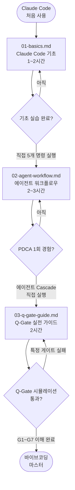

# 바이브코딩(Vibe Coding) — Claude Code 학습 경로

> **문서 ID**: ONBOARD-03-VC-INDEX
> **버전**: 1.0.0 | **작성일**: 2026-04-11 | **작성자**: Implementer (Sonnet)
> **선행 학습**: `03-development/02-service-development.md`
> **대상**: Claude Code를 처음 사용하는 모든 개발자

---

## 바이브코딩이란?

바이브코딩(Vibe Coding)은 개발자가 의도와 요구사항을 자연어로 표현하고, AI가 코드 생성, 검증, 문서화를 담당하는 협력적 개발 방법론입니다.

이 프로젝트에서 바이브코딩은 단순한 코드 자동완성이 아닙니다. CSAP 감리기준, N2SF 보안 정책, Q-Gate 품질 게이트를 모두 자동으로 준수하면서 코드를 생성하는 체계화된 개발 워크플로우입니다.

---

## 학습 경로

---

## 파일 구성

### `01-basics.md` — Claude Code 기초

**소요 시간**: 1~2시간

Claude Code를 처음 사용하는 개발자를 위한 입문 가이드입니다. 설치부터 효과적인 프롬프트 작성법, 자주 하는 실수까지 다룹니다.

**이 파일에서 배우는 것**:
- Claude Code 설치와 첫 실행
- `CLAUDE.md` 읽기와 내재화하는 방법
- 효과적인 프롬프트 패턴
- 파일 읽기/수정 요청하는 방법
- 잘 동작하는 프롬프트 vs 안 되는 프롬프트 예시
- 초보자 실수 목록

---

### `02-agent-workflow.md` — 에이전트 워크플로우

**소요 시간**: 2~3시간 (PDCA 실습 포함)

5개 전문 에이전트(Implementer, Reviewer, Auditor, Tester, Refactorer)가 협력하는 Cascade 메서드를 이해하고 직접 PDCA 사이클을 실행하는 방법을 배웁니다.

**이 파일에서 배우는 것**:
- `/pm` 커맨드로 PM 팀 구성하는 방법
- Cascade 메서드 (LOW/MED/HIGH 복잡도별 전략)
- 각 에이전트의 역할과 실제 프롬프트 예시
- 에이전트 간 파일 전달 규칙
- PDCA 사이클 단계별 실습

---

### `03-q-gate-guide.md` — Q-Gate 실전 가이드

**소요 시간**: 2시간

7단계 품질 게이트(Q-Gate)를 이해하고 각 게이트를 통과하는 방법을 배웁니다. 게이트 실패 시 디버깅 방법도 포함합니다.

**이 파일에서 배우는 것**:
- G1~G7 각 게이트 상세 설명
- 각 게이트를 자동으로 통과하게 만드는 개발 습관
- Q-Gate 실패 시 디버깅 방법
- 실전 Q-Gate 시뮬레이션

---

## 이 섹션 완료 기준

아래 항목을 모두 충족하면 바이브코딩 학습이 완료된 것입니다.

| 항목 | 확인 방법 |
|------|---------|
| Claude Code로 파일 읽기/수정 5회 이상 경험 | 직접 실습 |
| PDCA 사이클 1회 직접 수행 (Implementer 에이전트 활용) | 에이전트 로그 확인 |
| Q-Gate G1~G7 각 게이트 설명 가능 | 동료에게 설명해보기 |
| `audit.jsonl`에 감사 기록 확인 | 파일 직접 확인 |
| 잘 동작하는 프롬프트와 안 되는 프롬프트 차이 이해 | 실습 결과 비교 |

---

## 변경 이력

| 버전 | 일자 | 내용 | 작성자 |
|------|------|------|--------|
| 1.0.0 | 2026-04-11 | 최초 작성 | Implementer (Sonnet) |
