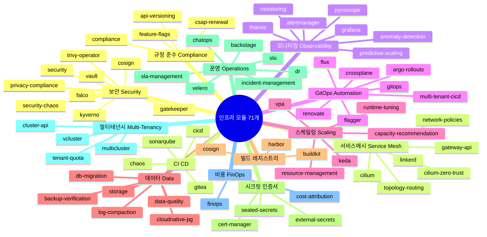

# 4.1 인프라 개요 — 철학, 구조, CSAP 매핑

> **버전**: 1.0.0 | **작성일**: 2026-04-11
> **대상**: 신규 합류 DevOps 엔지니어, 개발자
> **CSAP**: D-11 (가상화 보안), D-12 (시스템 개발 보안)
> **관련 문서**: `04-infrastructure.md` §1, `docs/07-infra/wsl-devops-complete-guide.md`

---

## 목차

1. [인프라 철학](#1-인프라-철학)
2. [기술 스택 전체 그림](#2-기술-스택-전체-그림)
3. [71개 인프라 모듈 카테고리별 분류](#3-71개-인프라-모듈-카테고리별-분류)
4. [네임스페이스 설계 원칙](#4-네임스페이스-설계-원칙)
5. [CSAP 인프라 요건 매핑](#5-csap-인프라-요건-매핑)
6. [인프라 작업 원칙](#6-인프라-작업-원칙)

---

## 1. 인프라 철학

공공기관 SaaS 프레임워크의 인프라는 세 가지 핵심 철학을 기반으로 설계되었습니다.

### 1.1 Cloud Native — 컨테이너 우선

모든 서비스는 컨테이너로 패키징되고 Kubernetes 위에서 실행됩니다. 서버에 직접 설치하거나 PM2 같은 프로세스 매니저를 쓰지 않습니다.

```
기존 방식 (사용 안 함):
  서버 → apt install → 프로세스 직접 실행 → 장애 시 수동 재시작

Cloud Native 방식 (이 프레임워크):
  컨테이너 이미지 → Kubernetes Deployment → 자동 재시작 + 스케일링 + 롤백
```

Cloud Native 방식의 공공기관 이점:

| 이점 | 설명 |
|------|------|
| 재현 가능성 | 개발 환경과 프로덕션 환경이 동일한 컨테이너 이미지 사용 |
| 감사 추적 | 모든 배포가 Git 커밋 이력으로 기록됨 (CSAP D-12 요건) |
| 빠른 복구 | Kubernetes가 장애 Pod를 자동 재시작 — 사람이 새벽에 깨지 않아도 됨 |
| 보안 격리 | 네임스페이스 + NetworkPolicy로 서비스 간 격리 (CSAP D-11 요건) |

### 1.2 GitOps — Git이 진실의 원천

클러스터의 모든 상태는 Git 저장소에 YAML 파일로 선언합니다. **직접 kubectl apply로 클러스터를 수정하는 것은 이 원칙에 위배됩니다.**

```
GitOps 흐름:
  개발자 → YAML 수정 → git push
                            ↓
                      Flux가 감지 (5분 이내)
                            ↓
                      클러스터에 자동 적용
                            ↓
                      실패 시 자동 롤백
```

왜 GitOps인가:

- **감사 추적**: 누가, 언제, 무엇을 변경했는지 Git 커밋 이력으로 완벽히 추적 가능
- **승인 프로세스**: Pull Request 기반 변경 관리 — CSAP D-12 변경 관리 요건 충족
- **롤백 용이성**: Git revert 한 줄이면 이전 상태로 복구
- **Drift Detection**: 클러스터가 Git 상태와 달라지면 Flux가 자동으로 원복

### 1.3 Zero Trust — 기본 거부, 명시적 허용

서비스 간 통신은 기본적으로 차단됩니다. 필요한 통신만 명시적으로 허용합니다. 이것이 Zero Trust 보안 모델입니다.

```
Zero Trust 구현 레이어:

Layer 4 (네트워크): Cilium NetworkPolicy → 허용된 포트/IP만 통신 가능
Layer 7 (HTTP):    Linkerd mTLS → 서비스 간 통신 자동 암호화 + 인증
Layer 인증:        Keycloak OIDC → 모든 API 요청에 JWT 검증
Layer 정책:        Kyverno → 승인되지 않은 컨테이너 이미지 배포 차단
```

예시: auth-service에서 api-gateway로의 통신만 허용하고, monitoring 네임스페이스에서 api-gateway로의 직접 접근은 차단합니다.

---

## 2. 기술 스택 전체 그림

```
[WSL2 Ubuntu 22.04 — 개발 호스트]
│
├── [Docker Engine v29.x — 컨테이너 런타임]
│   ├── Gitea v1.22 :3000      — Git 서버 + CI/CD Actions (Gitea Actions)
│   ├── Harbor v2.11 :8080     — 컨테이너 레지스트리 + Trivy 취약점 스캔
│   └── Act Runner v0.3        — CI/CD 파이프라인 실행 에이전트
│
└── [k3s v1.34.x — Kubernetes 클러스터]
    │
    ├── [kube-system]          — Kubernetes 핵심 + Traefik Ingress
    ├── [flux-system]          — GitOps 4 컨트롤러 (Source/Helm/Kustomize/Notification)
    ├── [cert-manager]         — TLS 인증서 자동 발급·갱신
    ├── [saas-platform]        — 마이크로서비스 22+ pods
    │   ├── api-gateway :3000
    │   ├── auth-service :3001
    │   ├── user-service :3002
    │   ├── tenant-service :3003
    │   └── ai-service :3010
    ├── [saas / cnpg-system]   — CloudNativePG PostgreSQL HA (Primary + 2 Replica)
    ├── [monitoring]           — Prometheus + Grafana + Loki + Tempo (LGTM 스택)
    ├── [saas-security]        — Falco + Kyverno + Gatekeeper
    ├── [external-secrets]     — HashiCorp Vault + External Secrets Operator
    └── [linkerd]              — 서비스 메시 (mTLS 자동 적용)
```

**핵심 도구 버전 기준**

| 도구 | 버전 | 역할 |
|------|------|------|
| k3s | v1.34.x | 경량 Kubernetes |
| Flux | v2.8.x | GitOps 동기화 |
| Helm | v3.20.x | Kubernetes 패키지 관리 |
| CloudNativePG | v1.24.x | PostgreSQL 오퍼레이터 |
| Traefik | v3.x | Ingress 컨트롤러 |
| Cert-Manager | v1.15.x | TLS 자동 관리 |
| Vault | v1.17.x | 시크릿 관리 |
| Falco | v0.39.x | 런타임 보안 |
| Kyverno | v1.12.x | 정책 엔진 |
| Linkerd | v2.16.x | 서비스 메시 |

---

## 3. 71개 인프라 모듈 카테고리별 분류

`infra/` 디렉토리에는 71개의 독립 모듈이 있습니다. 각 모듈은 Helm values 파일 또는 Kubernetes 매니페스트로 구성되며, Flux를 통해 자동 배포됩니다.

### 3.1 마인드맵



### 3.2 카테고리별 상세 설명

**보안 (Security)**

| 모듈 | 역할 | CSAP |
|------|------|------|
| `vault` | 런타임 시크릿 동적 발급, 만료 기반 자동 회전 | D-08, D-09 |
| `falco` | eBPF 기반 런타임 이상 행위 실시간 탐지 및 Loki 기록 | D-06 |
| `trivy-operator` | 배포 중 컨테이너 이미지 취약점 지속 스캔 | D-11 |
| `kyverno` | 정책 기반 배포 승인·거부 (미승인 이미지 차단) | D-08 |
| `gatekeeper` | OPA 기반 추가 정책 제어 | D-08 |
| `cosign` | 컨테이너 이미지 서명·검증 (공급망 보안) | D-11 |

**서비스 메시 (Service Mesh)**

| 모듈 | 역할 | CSAP |
|------|------|------|
| `linkerd` | 서비스 간 mTLS 자동 적용, 트래픽 관측성 | D-09 |
| `cilium` | eBPF 기반 L7 네트워크 정책, 고성능 CNI | D-08 |
| `cilium-zero-trust` | Cilium 위에 Zero Trust 정책 레이어 | D-08, D-09 |
| `gateway-api` | Kubernetes Gateway API (Traefik 대체 가능) | D-08 |
| `network-policies` | 네임스페이스 간 트래픽 격리 규칙 | D-11 |

**모니터링 (Observability)**

| 모듈 | 역할 | CSAP |
|------|------|------|
| `monitoring` | Prometheus + kube-prometheus-stack 전체 설치 | D-06 |
| `grafana` | 시각화 대시보드 (메트릭·로그·추적 통합) | D-06 |
| `thanos` | Prometheus 장기 메트릭 보관 및 고가용성 | D-06 |
| `alertmanager` | 알림 라우팅 (Slack, Email, PagerDuty) | D-06 |
| `anomaly-detection` | ML 기반 메트릭 이상 탐지 | — |

**GitOps / 자동화**

| 모듈 | 역할 | CSAP |
|------|------|------|
| `flux` | Git 상태를 클러스터에 지속 동기화하는 컨트롤러 4종 | D-12 |
| `renovate` | 의존성(이미지 태그, Helm 버전) 자동 업데이트 PR | D-12 |
| `argo-rollouts` | Canary/Blue-Green 고급 배포 전략 | — |
| `flagger` | 자동 카나리 분석 + 롤백 | — |

**데이터 (Data)**

| 모듈 | 역할 | CSAP |
|------|------|------|
| `cloudnative-pg` | PostgreSQL HA 오퍼레이터 (Primary + 2 Replica) | D-09 |
| `backup-verification` | Velero 백업 자동 복구 검증 | D-06 |
| `db-migration` | Kubernetes Job 기반 DB 스키마 마이그레이션 | D-12 |
| `velero` | 클러스터 전체 백업·복구 | D-06 |

---

## 4. 네임스페이스 설계 원칙

### 4.1 네임스페이스 목록

```
k3s 클러스터
├── kube-system          Kubernetes 핵심 컴포넌트 (CoreDNS, metrics-server, Traefik)
├── flux-system          GitOps 컨트롤러 (Source, Helm, Kustomize, Notification)
├── cert-manager         TLS 인증서 자동 갱신
├── saas-platform        마이크로서비스 애플리케이션 (22+ Pods)
├── saas                 CloudNativePG 클러스터 인스턴스 (DB 데이터)
├── cnpg-system          CloudNativePG 오퍼레이터
├── monitoring           Prometheus + Grafana + Loki + Tempo
├── linkerd              서비스 메시 컨트롤 플레인
├── falco-system         런타임 보안 모니터링
├── kyverno              정책 엔진
├── external-secrets     External Secrets Operator
├── saas-secrets         SealedSecret → Secret 동기화 대상
└── gitops-demo          학습/테스트용 (프로덕션 영향 없음)
```

### 4.2 네임스페이스 격리 원칙

**원칙 1 — 책임 분리**: 애플리케이션, 인프라, 모니터링은 반드시 다른 네임스페이스에 배치합니다.

```
좋은 예:  saas-platform (서비스) | monitoring (관측) | saas (DB)
나쁜 예:  하나의 네임스페이스에 서비스 + DB + 모니터링 혼합
```

**원칙 2 — 최소 권한**: 각 네임스페이스에는 해당 서비스만 필요한 권한을 부여합니다.

```yaml
# saas-platform 네임스페이스 ServiceAccount는
# saas 네임스페이스(DB)에 직접 접근 불가
# 반드시 ClusterIP Service를 통해서만 접근
```

**원칙 3 — NetworkPolicy 기반 격리**: 모든 네임스페이스 간 트래픽은 NetworkPolicy로 명시적으로 허용합니다.

```yaml
# 예시: saas-platform에서 monitoring으로의 메트릭 전송만 허용
apiVersion: networking.k8s.io/v1
kind: NetworkPolicy
metadata:
  name: allow-metrics-egress
  namespace: saas-platform
spec:
  podSelector: {}
  policyTypes:
    - Egress
  egress:
    - to:
        - namespaceSelector:
            matchLabels:
              kubernetes.io/metadata.name: monitoring
      ports:
        - port: 4317   # OpenTelemetry OTLP
        - port: 9090   # Prometheus
```

### 4.3 내부 DNS 주소 규칙

클러스터 내부에서 서비스 간 통신 시 반드시 아래 형식을 사용합니다.

```
형식: {서비스명}.{네임스페이스}.svc.cluster.local:{포트}

예시:
  auth-service.saas-platform.svc.cluster.local:3001
  postgres.saas.svc.cluster.local:5432
  grafana.monitoring.svc.cluster.local:3000
```

`localhost`나 IP 주소를 코드에 하드코딩하면 다른 네임스페이스나 환경에서 동작하지 않습니다.

---

## 5. CSAP 인프라 요건 매핑

공공기관 CSAP(클라우드 보안 인증) 인프라 관련 통제항목과 구현 방법입니다.

### 5.1 D-11 가상화 보안

| CSAP 세부 항목 | 구현 컴포넌트 | 확인 방법 |
|-------------|------------|---------|
| D-11-01 컨테이너 접근 통제 | Kyverno (이미지 서명 검증) | `kubectl get cpol` |
| D-11-02 컨테이너 무결성 | Cosign (이미지 서명) + Harbor Trivy | Harbor UI 취약점 리포트 |
| D-11-03 컨테이너 격리 | Namespace + NetworkPolicy | `kubectl get netpol -A` |
| D-11-04 이미지 보안 | Harbor v2.11 + Trivy 자동 스캔 | `trivy image localhost:8080/public-saas/app:latest` |
| D-11-05 자원 제한 | ResourceQuota + LimitRange | `kubectl get resourcequota -A` |

```bash
# D-11 준수 상태 확인
kubectl get resourcequota -A
kubectl get limitrange -A
kubectl get networkpolicies -A
flux get all -A | grep -E "READY|False"
```

### 5.2 D-12 시스템 개발 보안

| CSAP 세부 항목 | 구현 컴포넌트 | 확인 방법 |
|-------------|------------|---------|
| D-12-01 변경 관리 | Flux GitOps (Git PR 승인 기반 배포) | Gitea PR 이력 |
| D-12-02 취약점 관리 | Trivy Operator (배포 후 지속 스캔) | `kubectl get vulnerabilityreports -A` |
| D-12-03 개발 환경 분리 | vcluster (환경별 가상 클러스터) | `vcluster list` |
| D-12-04 배포 자동화 | Flux HelmRelease + Q-Gate 7단계 | `.gitea/workflows/` |
| D-12-05 롤백 | Flux remediation + Helm rollback | `helm history saas-platform -n saas-platform` |

### 5.3 D-09 암호화

| CSAP 세부 항목 | 구현 컴포넌트 | 설명 |
|-------------|------------|------|
| D-09-01 전송 암호화 | Linkerd mTLS + TLS 1.3+ | 서비스 간 자동 mTLS |
| D-09-02 저장 암호화 | CloudNativePG SSL + AES-256 | DB 레벨 암호화 |
| D-09-03 키 관리 | HashiCorp Vault | 동적 키 발급, 자동 회전 |
| D-09-04 인증서 관리 | Cert-Manager (자동 갱신) | 만료 30일 전 자동 갱신 |

### 5.4 D-06 침해사고 관리

| CSAP 세부 항목 | 구현 컴포넌트 | 설명 |
|-------------|------------|------|
| D-06-01 로그 수집 | Loki + Promtail DaemonSet | 전체 Pod 로그 자동 수집 |
| D-06-02 이상 탐지 | Falco (eBPF 커널 감시) | 이상 행위 실시간 알림 |
| D-06-03 감사 로그 | audit.jsonl (append-only) | 민감 작업 전수 기록 |
| D-06-04 장기 보존 | Thanos (12개월 이상 보관) | CSAP D-06 1년 보존 요건 |
| D-06-05 백업·복구 | Velero 일일 백업 | backup-verification 자동 검증 |

---

## 6. 인프라 작업 원칙

### 6.1 절대 금지 사항

```bash
# 금지 1: 클러스터 직접 수정 (Flux가 다음 동기화 시 원복함)
kubectl apply -f my-deployment.yaml    # 금지 — Git에 먼저 커밋하십시오

# 금지 2: 직접 Secret 생성 (Sealed Secrets 또는 Vault 사용)
kubectl create secret generic my-key --from-literal=key=myvalue   # 금지

# 금지 3: 하드코딩된 이미지 태그 (Renovate가 관리)
image: my-app:latest   # 금지 — 구체적인 SHA digest 또는 버전 태그 사용

# 금지 4: root 컨테이너 (Kyverno가 차단)
securityContext:
  runAsRoot: true    # 금지 — Kyverno 정책이 배포 차단
```

### 6.2 권장 작업 흐름

```
1. 변경 계획 수립 (Git 이슈 생성)
       ↓
2. feat/infra-XXX 브랜치 생성
       ↓
3. YAML 파일 수정 (infra/ 디렉토리)
       ↓
4. 로컬 검증: kubectl dry-run + helm lint
       ↓
5. git push + Pull Request 생성
       ↓
6. 팀원 리뷰 + 승인
       ↓
7. main 브랜치 머지
       ↓
8. Flux 자동 배포 (5분 이내)
       ↓
9. 배포 결과 확인: flux get all -A
```

### 6.3 트러블슈팅 시작점

문제가 발생했을 때 가장 먼저 확인할 명령어:

```bash
# 1단계: Flux 동기화 상태 확인
flux get all -A

# 2단계: 문제 있는 HelmRelease 상세 확인
flux describe helmrelease saas-platform -n flux-system

# 3단계: Pod 상태 확인
kubectl get pods -n saas-platform
kubectl describe pod <문제-pod명> -n saas-platform

# 4단계: 로그 확인
kubectl logs <pod명> -n saas-platform --tail=100

# 5단계: 이벤트 확인 (배포 실패 원인 주로 여기 있음)
kubectl get events -n saas-platform --sort-by='.lastTimestamp'
```

자세한 트러블슈팅 가이드는 `docs/07-infra/wsl-troubleshooting.md`를 참조하십시오.

---

다음 단계: `kubernetes/01-k3s-basics.md`에서 k3s 기초와 kubectl 사용법을 학습합니다.
