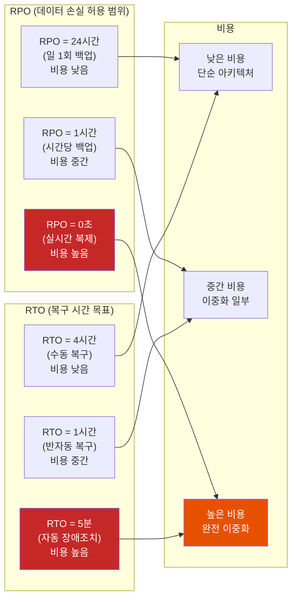
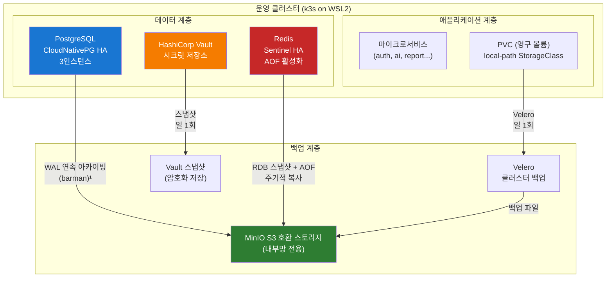
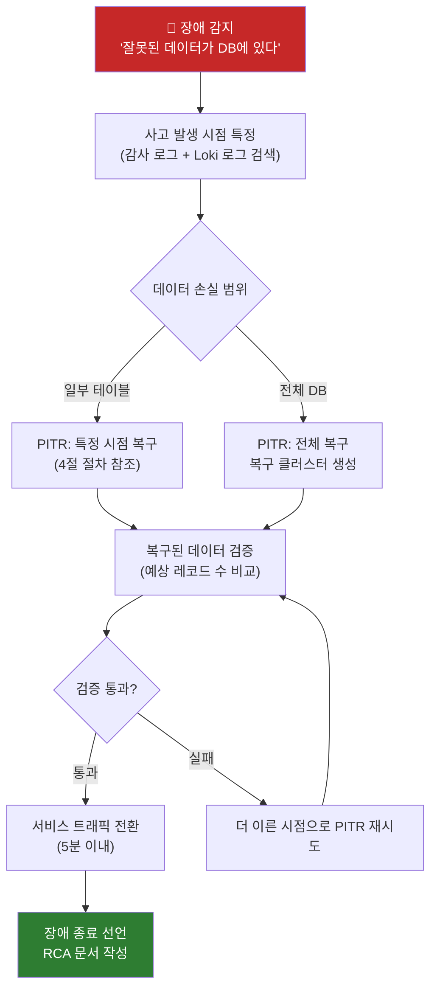
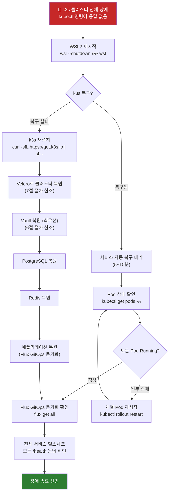
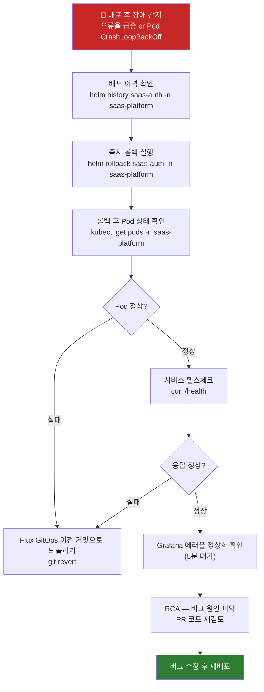

# 재해 복구(DR) — 완전 가이드

> **버전**: 1.0.0 | **작성일**: 2026-04-12
> **대상**: DevOps 엔지니어, SRE, 인프라 담당자
> **CSAP**: D-06 (침해사고 관리), D-09 (암호화 — 백업 암호화), D-11 (가상화 보안)
> **관련 문서**: `components/03-postgresql.md` §6, `04-infrastructure/README.md`, `docs/07-infra/wsl-troubleshooting.md`

---

## 목차

1. [재해 복구(DR)란](#1-재해-복구dr란)
2. [RPO vs RTO — 핵심 개념](#2-rpo-vs-rto--핵심-개념)
3. [이 프로젝트의 DR 전략](#3-이-프로젝트의-dr-전략)
4. [PostgreSQL PITR 복구 절차](#4-postgresql-pitr-복구-절차)
5. [Redis 데이터 복구](#5-redis-데이터-복구)
6. [Vault 백업 및 복원](#6-vault-백업-및-복원)
7. [PVC 백업 — Velero](#7-pvc-백업--velero)
8. [장애 시나리오별 복구 절차](#8-장애-시나리오별-복구-절차)
9. [RTO/RPO 측정 및 SLO와의 관계](#9-rtorpo-측정-및-slo와의-관계)
10. [DR 훈련 계획](#10-dr-훈련-계획)

---

## 1. 재해 복구(DR)란

### 1.1 재해란 무엇인가

"재해(Disaster)"는 드라마틱한 자연재해만을 의미하지 않습니다. IT 시스템에서 재해는 다음과 같은 상황을 포함합니다.

```
일반적인 재해 유형:
  ① 데이터 손상: 잘못된 SQL 실행, 소프트웨어 버그로 데이터 오염
  ② 잘못된 배포: 버그가 있는 버전 배포로 서비스 중단
  ③ 하드웨어 장애: 디스크 손상, 노드 오류
  ④ 랜섬웨어/보안 침해: 데이터 암호화 또는 삭제
  ⑤ 사람 실수: 잘못된 kubectl delete, 실수로 DROP TABLE 실행
  ⑥ 전체 클러스터 장애: k3s 클러스터 자체 불능 상태

공공기관 SaaS에서 추가 고려:
  - 연계 시스템(행정전자서명, 공공API) 장애에 의한 영향
  - 감사 대비 데이터 무결성 보장 의무
```

### 1.2 재해 복구 목표

재해 복구는 단순히 "서버를 다시 켠다"가 아닙니다. 목표는 세 가지입니다.

```
① 데이터 보존: 가능한 한 최신 상태로 데이터 복구
② 서비스 복원: 사용자가 최대한 빨리 서비스를 이용할 수 있도록
③ 원인 분석: 재발 방지를 위해 근본 원인(RCA) 파악
```

---

## 2. RPO vs RTO — 핵심 개념

### 2.1 직관적 비유

수족관 비유로 이해해 보겠습니다.

```
수족관 = 데이터베이스
물고기 = 데이터

RPO (Recovery Point Objective, 복구 시점 목표):
  "어제 오후 3시에 마지막으로 수족관 사진을 찍었다.
   지금 수족관이 폭발했다면, 어제 3시 상태로만 복구 가능하다.
   = 어제 3시 이후 추가된 물고기는 잃어버린다."

  → RPO = 1일 (24시간 전 데이터 손실을 감수)
  → 백업을 매일 1회 하면 RPO = 최대 24시간

RTO (Recovery Time Objective, 복구 시간 목표):
  "수족관이 폭발했다. 새 수족관을 채우는 데 걸리는 시간."
  → RTO = 2시간 (2시간 이내에 서비스 복구 목표)
```

### 2.2 RPO와 RTO의 트레이드오프



### 2.3 이 프로젝트의 RPO/RTO 목표

공공기관 SaaS 특성과 WSL2 기반 단일 노드 구성을 고려한 현실적 목표입니다.

| 시나리오 | RPO 목표 | RTO 목표 | 방법 |
|--------|--------|--------|------|
| DB 데이터 손상 | 최대 5분 | 2시간 이내 | PostgreSQL PITR |
| 잘못된 배포 | 해당 없음 | 5분 이내 | Helm 롤백 |
| 전체 클러스터 장애 | 최대 1일 | 4시간 이내 | Velero 백업 + 재구성 |
| Redis 장애 | 최대 1분 | 10분 이내 | Redis AOF 복구 |
| Vault 장애 | 최대 1일 | 1시간 이내 | Vault 스냅샷 복원 |

---

## 3. 이 프로젝트의 DR 전략

### 3.1 전체 DR 아키텍처



### 3.2 백업 주기 요약

| 대상 | 방식 | 주기 | 보존 기간 | RPO |
|------|------|------|---------|-----|
| PostgreSQL WAL | 연속 아카이빙 | 5분마다 WAL 전송 | 30일 | 최대 5분 |
| PostgreSQL 기본 백업 | barman 전체 백업 | 일 1회 | 30일 | PITR로 보완 |
| Redis RDB | 스냅샷 | 1분마다 | 7일 | 최대 1분 |
| Redis AOF | 로그 기반 | 매 쓰기마다 | 7일 | 0초 (기록 기준) |
| Vault | 스냅샷 | 일 1회 | 30일 | 최대 24시간 |
| PVC (Velero) | 볼륨 스냅샷 | 일 1회 | 14일 | 최대 24시간 |

---

## 4. PostgreSQL PITR 복구 절차

### 4.1 PITR이란

PITR(Point-in-Time Recovery)는 PostgreSQL이 WAL(Write-Ahead Log) 로그를 사용하여 **과거의 특정 시점**으로 데이터베이스를 복구하는 기능입니다.

```
비유: 자동 저장 기능이 있는 게임

일반 백업: "세이브 포인트"마다 저장
  → 세이브 포인트 사이에 죽으면 이전 세이브로 돌아감

PITR: 모든 행동이 로그에 기록됨
  → "오전 9시 32분으로 돌아가줘"라고 하면 그 정확한 시점으로 복구

PostgreSQL PITR:
  - 기본 백업(Base Backup): 전체 데이터 파일 스냅샷
  - WAL 로그: 기본 백업 이후 모든 변경 사항 순서대로 기록
  - 복구: 기본 백업 적용 → WAL 로그를 목표 시점까지 재생
```

### 4.2 PITR 복구 전제 조건 확인

```bash
# 1. WAL 아카이빙 활성화 확인
kubectl exec -n saas saas-main-db-1 -- \
  psql -U postgres -c "SHOW archive_mode;"
# archive_mode
# ------------
# on            ← 반드시 on이어야 함

# 2. S3(MinIO)에 WAL 파일이 있는지 확인
kubectl exec -n saas saas-main-db-1 -- \
  barman list-backups saas-main-db
# saas-main-db 20260411T000000 - Wed Apr 11 00:00:01 2026
# saas-main-db 20260410T000000 - Tue Apr 10 00:00:01 2026

# 3. 복구 대상 시점 확인 (사고 발생 시간 특정)
# 예: 개발자가 실수로 2026-04-12 14:30:00에 잘못된 쿼리 실행
TARGET_TIME="2026-04-12T14:25:00+09:00"  # 사고 5분 전
```

### 4.3 PITR 복구 절차

**주의**: 이 절차는 복구용 새 클러스터를 생성합니다. 기존 클러스터는 변경하지 않습니다.

```bash
# Step 1: 현재 상태 스냅샷 (증거 보존)
cat <<EOF | kubectl apply -f -
apiVersion: postgresql.cnpg.io/v1
kind: Backup
metadata:
  name: pre-recovery-snapshot-$(date +%Y%m%d%H%M)
  namespace: saas
spec:
  method: barmanObjectStore
  cluster:
    name: saas-main-db
EOF

kubectl get backup -n saas -w
# pre-recovery-snapshot-202604121435   saas-main-db   completed   2m
```

```yaml
# Step 2: 복구용 클러스터 생성
# 파일: /tmp/saas-main-db-recovered.yaml
apiVersion: postgresql.cnpg.io/v1
kind: Cluster
metadata:
  name: saas-main-db-recovered
  namespace: saas
spec:
  instances: 1  # 복구 중에는 단일 인스턴스
  imageName: ghcr.io/cloudnative-pg/postgresql:17

  bootstrap:
    recovery:
      source: saas-main-db         # 원본 클러스터 이름
      recoveryTarget:
        # 사고 발생 5분 전으로 복구 (KST = UTC+9)
        targetTime: "2026-04-12T14:25:00+09:00"
        # 또는 특정 트랜잭션 ID로 복구:
        # targetXID: "1234567"

  externalClusters:
    - name: saas-main-db
      barmanObjectStore:
        destinationPath: "s3://saas-backup/postgresql/"
        s3Credentials:
          accessKeyId:
            name: backup-credentials
            key: access-key-id
          secretAccessKey:
            name: backup-credentials
            key: secret-access-key
        wal:
          maxParallel: 8  # WAL 병렬 다운로드로 복구 속도 향상

  storage:
    size: 20Gi
    storageClass: local-path

  resources:
    requests:
      cpu: 200m
      memory: 512Mi
    limits:
      cpu: 1000m
      memory: 1Gi
```

```bash
# Step 3: 복구 클러스터 적용 및 상태 모니터링
kubectl apply -f /tmp/saas-main-db-recovered.yaml

# 복구 진행 상황 모니터링 (WAL 재생 로그 확인)
kubectl logs -n saas saas-main-db-recovered-1 -f | grep -E "recovery|PITR|WAL"
# LOG: starting point-in-time recovery to 2026-04-12 14:25:00+09
# LOG: restored log file "000000010000000000000005" from archive
# LOG: redo in progress, current LSN 0/5000000
# LOG: recovery stopping before commit of transaction ...
# LOG: pausing at the end of recovery
# HINT: Execute pg_wal_replay_resume() to promote.

# 복구 완료 확인
kubectl get cluster saas-main-db-recovered -n saas
# NAME                      INSTANCES   READY   STATUS
# saas-main-db-recovered    1           1       Cluster in healthy state
```

```bash
# Step 4: 복구된 데이터 검증
kubectl exec -n saas saas-main-db-recovered-1 -- \
  psql -U saas_app saas_platform -c \
  "SELECT COUNT(*) FROM users WHERE created_at < '2026-04-12 14:25:00+09';"
# count
# ------
# 12345   ← 예상 값과 비교

# 손상된 데이터가 사라졌는지 확인
kubectl exec -n saas saas-main-db-recovered-1 -- \
  psql -U saas_app saas_platform -c \
  "SELECT COUNT(*) FROM audit_logs WHERE created_at BETWEEN '2026-04-12 14:20:00+09' AND '2026-04-12 14:30:00+09';"
```

```bash
# Step 5: 서비스 트래픽 전환 (검증 완료 후)
# 방법 A: 기존 클러스터를 복구된 클러스터로 대체
# (주의: 복구 클러스터를 HA로 확장 후 서비스 전환)

# 복구 클러스터를 3인스턴스로 확장
kubectl patch cluster saas-main-db-recovered -n saas \
  --type=merge -p '{"spec":{"instances": 3}}'

# Service를 복구된 클러스터로 전환 (Patch)
kubectl patch service saas-main-db-rw -n saas \
  --type=merge -p '{"spec":{"selector":{"cnpg.io/cluster":"saas-main-db-recovered"}}}'

# Step 6: 원본 클러스터 백업 보존 (30일 후 삭제)
kubectl annotate cluster saas-main-db -n saas \
  recovery.note="사고 발생 클러스터. 2026-05-12까지 보존 후 삭제"
```

### 4.4 복구 소요 시간 예상

| 단계 | 소요 시간 | 비고 |
|------|---------|------|
| 기본 백업 다운로드 | 15~30분 | DB 크기 비례 |
| WAL 파일 재생 | 5~20분 | 사고 시점까지의 WAL 양 비례 |
| 데이터 검증 | 30~60분 | 수동 확인 포함 |
| 서비스 전환 | 5분 | Service selector 변경 |
| **총 RTO** | **55분~115분** | 목표 RTO 2시간 이내 |

---

## 5. Redis 데이터 복구

### 5.1 Redis HA 구성 확인

이 프로젝트는 Redis Sentinel을 사용합니다.

```bash
# Redis Pod 및 Sentinel 상태 확인
kubectl get pods -n saas -l app=redis
# NAME               READY   STATUS    RESTARTS   AGE
# redis-master-0     1/1     Running   0          30d
# redis-replica-0    1/1     Running   0          30d
# redis-replica-1    1/1     Running   0          30d
# redis-sentinel-0   1/1     Running   0          30d
# redis-sentinel-1   1/1     Running   0          30d
# redis-sentinel-2   1/1     Running   0          30d

# Master 주소 확인
kubectl exec -n saas redis-sentinel-0 -- redis-cli -p 26379 sentinel masters
# name: saas-redis
# ip: 10.43.x.x  ← 현재 Master IP
# port: 6379
```

### 5.2 Redis 영속성 설정 확인

```bash
# Master에서 영속성 설정 확인
kubectl exec -n saas redis-master-0 -- redis-cli CONFIG GET save
# 1) save
# 2) 60 1000    ← 60초마다 1000건 변경 시 RDB 스냅샷
#    300 100    ← 300초마다 100건 변경 시 RDB 스냅샷
#    3600 1     ← 3600초마다 1건 변경 시 RDB 스냅샷

# AOF 설정 확인
kubectl exec -n saas redis-master-0 -- redis-cli CONFIG GET appendonly
# 1) appendonly
# 2) yes        ← AOF 활성화 확인

# 현재 AOF 파일 크기
kubectl exec -n saas redis-master-0 -- redis-cli INFO persistence | grep aof
# aof_enabled:1
# aof_rewrite_in_progress:0
# aof_current_size:15728640  ← 15MB AOF 파일
```

### 5.3 Redis Master 장애 시나리오 — Sentinel 자동 복구

Redis Sentinel이 자동으로 처리하므로 수동 개입이 최소화됩니다.

```
자동 장애조치 절차:
  1. Sentinel 3개 중 2개가 Master 연결 불가 감지 (기본 30초)
  2. Sentinel 들이 투표: Replica 중 하나를 새 Master로 선출
  3. 새 Master 승격 완료 (보통 30~60초)
  4. 애플리케이션은 동일 Sentinel 주소를 통해 새 Master 자동 발견

모니터링:
```

```bash
# Sentinel 장애조치 이벤트 확인
kubectl logs -n saas redis-sentinel-0 | grep -i "failover\|switch-master"
# Executing failover on 'saas-redis'
# +switch-master saas-redis 10.43.x.1 6379 10.43.x.2 6379
# 의미: 10.43.x.1이 다운되어 10.43.x.2로 전환
```

### 5.4 Redis 데이터 손상 — 수동 AOF 복구

AOF 파일을 사용한 데이터 복구 절차입니다.

```bash
# Step 1: 손상된 Redis 중지
kubectl scale statefulset redis-master -n saas --replicas=0

# Step 2: 백업에서 AOF 파일 복사 (MinIO에서 가져오기)
kubectl exec -n saas minio-0 -- \
  mc cp minio/saas-backup/redis/appendonly.aof.20260411 \
  /tmp/appendonly.aof

# Step 3: AOF 파일 무결성 검사 및 복구
kubectl exec -n saas redis-master-0 -- \
  redis-check-aof --fix /data/appendonly.aof
# AOF analyzed: 15728 commands processed
# 0 records repaired

# Step 4: RDB + AOF 복구 (모두 적용)
kubectl exec -n saas redis-master-0 -- \
  redis-server /etc/redis/redis.conf --appendonly yes

# Step 5: 데이터 검증
kubectl exec -n saas redis-master-0 -- \
  redis-cli DBSIZE
# (integer) 98432   ← 예상 키 수와 비교
```

### 5.5 Redis 백업 수동 실행

```bash
# 즉시 RDB 스냅샷 저장 (중요 작업 전 권장)
kubectl exec -n saas redis-master-0 -- redis-cli BGSAVE
# Background saving started

# 저장 완료 확인
kubectl exec -n saas redis-master-0 -- redis-cli LASTSAVE
# (integer) 1744517234   ← Unix 타임스탬프

# MinIO로 복사 (cron job 자동화 또는 수동)
kubectl exec -n saas minio-0 -- \
  mc cp redis-master-0:/data/dump.rdb \
  minio/saas-backup/redis/dump-$(date +%Y%m%d%H%M).rdb
```

---

## 6. Vault 백업 및 복원

### 6.1 Vault가 중요한 이유

```
Vault는 모든 서비스의 시크릿(DB 비밀번호, API 키, 인증서)을 저장합니다.
Vault가 복구되지 않으면:
  - External Secrets Operator(ESO)가 시크릿을 가져올 수 없음
  - 모든 서비스가 환경 변수 없이 시작 불가
  - DB 접속, Redis 접속, AI API 호출 모두 실패

우선순위: 클러스터 재구성 시 Vault가 가장 먼저 복구되어야 함
```

### 6.2 Vault 스냅샷 백업 (일 1회 자동 실행)

```bash
# 수동 스냅샷 생성
VAULT_ADDR=http://vault.vault.svc.cluster.local:8200
VAULT_TOKEN=$(kubectl get secret -n vault vault-root-token -o jsonpath='{.data.token}' | base64 -d)

kubectl exec -n vault vault-0 -- \
  vault operator raft snapshot save \
  -address=${VAULT_ADDR} \
  -token=${VAULT_TOKEN} \
  /tmp/vault-snapshot-$(date +%Y%m%d%H%M).snap

# 스냅샷 MinIO로 복사
kubectl exec -n vault vault-0 -- \
  mc cp /tmp/vault-snapshot-$(date +%Y%m%d%H%M).snap \
  minio/saas-backup/vault/

# 스냅샷 상태 확인
kubectl exec -n vault vault-0 -- \
  vault operator raft list-peers \
  -address=${VAULT_ADDR} \
  -token=${VAULT_TOKEN}
```

### 6.3 Vault 스냅샷 복원 절차

```bash
# Step 1: 새 Vault 인스턴스 시작 (이미 배포되어 있는 경우 생략)
kubectl get pods -n vault
# vault-0   0/1   Running   0   5s  ← 초기화 대기 중

# Step 2: Vault 초기화 (새 클러스터) — 기존 키가 없는 경우에만
kubectl exec -n vault vault-0 -- vault operator init \
  -key-shares=5 \
  -key-threshold=3 \
  -format=json > /tmp/vault-init-keys.json
# 주의: 이 파일을 안전하게 보관! 분실 시 복구 불가

# Step 3: 스냅샷 복원
SNAPSHOT_FILE="vault-snapshot-20260411000000.snap"

kubectl exec -n vault vault-0 -- \
  vault operator raft snapshot restore \
  -address=${VAULT_ADDR} \
  -token=${VAULT_TOKEN} \
  /tmp/${SNAPSHOT_FILE}
# 2026-04-12T09:00:00Z [INFO] Starting snapshot restore

# Step 4: Vault Unseal (잠금 해제)
# 5개 키 중 3개 이상이 필요
kubectl exec -n vault vault-0 -- vault operator unseal ${KEY_1}
kubectl exec -n vault vault-0 -- vault operator unseal ${KEY_2}
kubectl exec -n vault vault-0 -- vault operator unseal ${KEY_3}
# Sealed: false  ← 성공

# Step 5: ESO가 시크릿을 다시 가져오도록 트리거
kubectl rollout restart deployment/external-secrets -n external-secrets
```

---

## 7. PVC 백업 — Velero

### 7.1 Velero란

Velero는 Kubernetes 클러스터 전체(애플리케이션 상태 + PVC)를 백업하는 도구입니다.

```
Velero가 백업하는 것:
  - 모든 Kubernetes 리소스 (Deployment, Service, ConfigMap, Secret 등)
  - PVC 데이터 (영구 볼륨 스냅샷)

Velero가 백업하지 않는 것:
  - 데이터베이스 내부 데이터 (PostgreSQL, Redis) — 별도 백업 필요
  - Vault 시크릿 — Vault 스냅샷 별도 필요
```

### 7.2 Velero 백업 현황 확인

```bash
# 백업 목록
kubectl get backups -n velero
# NAME                          STATUS      ERRORS   WARNINGS   CREATED                  EXPIRES
# daily-backup-20260412000000   Completed   0        2          2026-04-12 00:00:12 UTC   13d
# daily-backup-20260411000000   Completed   0        0          2026-04-11 00:00:11 UTC   12d

# 백업 상세 (네임스페이스별 리소스 수)
kubectl describe backup daily-backup-20260412000000 -n velero | grep -A 20 "Resource List"

# 백업 로그 확인
velero backup logs daily-backup-20260412000000
```

### 7.3 특정 네임스페이스 복원

```bash
# 예: saas-platform 네임스페이스 전체 복원
velero restore create saas-platform-restore \
  --from-backup daily-backup-20260412000000 \
  --include-namespaces saas-platform \
  --wait

# 복원 상태 확인
velero restore describe saas-platform-restore
# Phase: Completed
# Warnings: 0
# Errors: 0

# 복원된 Pod 상태 확인
kubectl get pods -n saas-platform
```

### 7.4 온디맨드 백업 (중요 작업 전)

```bash
# 헬름 차트 업그레이드 전 즉시 백업
velero backup create pre-upgrade-$(date +%Y%m%d%H%M) \
  --include-namespaces saas,saas-platform,monitoring,vault \
  --wait
# Backup request "pre-upgrade-202604121430" submitted successfully.
# Waiting for backup to complete. You may safely press ctrl-c to stop waiting...
# Backup completed with status: Completed

# PVC 스냅샷 포함 확인
velero backup describe pre-upgrade-202604121430 | grep -i "volume snapshots"
# Persistent Volumes: 8 of 8 snapshots OK
```

---

## 8. 장애 시나리오별 복구 절차

### 8.1 시나리오 1: DB 데이터 손상 (PITR 복구)



**복구 명령어 빠른 참조**:

```bash
# 사고 시점 특정 (감사 로그에서)
kubectl exec -n saas saas-main-db-1 -- psql -U postgres -c \
  "SELECT * FROM pg_stat_activity WHERE state = 'idle in transaction' AND query_start < NOW() - INTERVAL '5 minutes';"

# PITR 복구 (4절 절차 참조)
TARGET_TIME="2026-04-12T14:25:00+09:00"  # 사고 5분 전
kubectl apply -f /tmp/saas-main-db-recovered.yaml
```

### 8.2 시나리오 2: 전체 클러스터 장애 (재구성)

WSL2 + k3s 환경에서 k3s 클러스터 자체가 불능 상태가 된 경우입니다.



**클러스터 재구성 체크리스트**:

```bash
# 1. WSL2 재시작
wsl --shutdown
# (WSL2 재시작 후)

# 2. k3s 상태 확인
sudo systemctl status k3s
kubectl get nodes

# 3. Vault 복원 (가장 먼저 — 다른 서비스가 의존)
# 6절 절차 참조

# 4. Velero 복원
velero restore create full-restore \
  --from-backup daily-backup-20260412000000 \
  --wait

# 5. PostgreSQL 데이터 복원 확인 (CNPG가 자동 복원)
kubectl get cluster -n saas

# 6. Flux 동기화 강제 실행
flux reconcile source git flux-system
flux reconcile kustomization flux-system

# 7. 전체 헬스체크
kubectl get pods -A | grep -v Running
```

### 8.3 시나리오 3: 잘못된 배포 (Helm 롤백)



**Helm 롤백 명령어**:

```bash
# 현재 배포된 릴리즈 목록
helm list -n saas-platform
# NAME           NAMESPACE       REVISION  UPDATED            STATUS    CHART
# saas-auth      saas-platform   5         2026-04-12 14:30   deployed  auth-service-1.5.0
# saas-ai        saas-platform   3         2026-04-12 14:28   deployed  ai-service-2.1.0

# 배포 이력 확인
helm history saas-auth -n saas-platform
# REVISION   STATUS     CHART                DESCRIPTION
# 3          superseded auth-service-1.3.0   Install complete
# 4          superseded auth-service-1.4.0   Upgrade complete
# 5          deployed   auth-service-1.5.0   Upgrade complete  ← 현재 (문제)

# 직전 버전으로 롤백 (revision 4)
helm rollback saas-auth 4 -n saas-platform
# Rollback was a success! Happy Helming!

# 롤백 확인
helm list -n saas-platform | grep saas-auth
# saas-auth   saas-platform   6   2026-04-12 14:35   deployed   auth-service-1.4.0

# Pod 재시작 확인
kubectl rollout status deployment/auth-service -n saas-platform
# deployment "auth-service" successfully rolled out
```

---

## 9. RTO/RPO 측정 및 SLO와의 관계

### 9.1 DR 훈련을 통한 실제 RTO 측정

```bash
# RTO 측정 스크립트 (DR 훈련 시 사용)
#!/bin/bash
DRILL_START=$(date +%s)
echo "DR 훈련 시작: $(date)"

# --- 장애 시뮬레이션 ---
# (훈련 환경에서만 실행)
# kubectl delete pod saas-main-db-1 -n saas

# --- 복구 절차 실행 ---
# ... (복구 단계들) ...

# --- 서비스 복구 확인 ---
RECOVERY_START=$(date +%s)
until curl -sf http://localhost:3001/health > /dev/null; do
  sleep 5
  echo "서비스 대기 중..."
done
RECOVERY_END=$(date +%s)

echo "실제 RTO: $((RECOVERY_END - DRILL_START))초"
echo "서비스 복구 확인까지: $((RECOVERY_END - RECOVERY_START))초"
```

### 9.2 SLO와의 관계

DR 목표는 서비스 수준 목표(SLO)와 직접 연결됩니다.

| SLO 항목 | 목표값 | DR와의 관계 |
|--------|------|-----------|
| 가용성 | 99.5% / 월 | RTO 2시간 이내면 월 3.65시간 다운 허용 → 99.5% 달성 가능 |
| 에러율 | < 1% | 복구 중 에러 버짓 소진 모니터링 필요 |
| p99 응답 시간 | < 1초 | 복구 후 Pyroscope로 성능 이상 확인 |

```
계산 예시:
  월 운영 시간 = 30일 × 24시간 = 720시간
  99.5% 가용성 = 0.5% 다운 허용 = 720 × 0.005 = 3.6시간 다운 허용

  DR 시나리오별 가용성 영향:
    Helm 롤백 (RTO 5분): 5분 / 43200분 = 0.012% → 거의 영향 없음
    PITR 복구 (RTO 2시간): 120분 / 43200분 = 0.28% → 여전히 SLO 유지
    클러스터 재구성 (RTO 4시간): 240분 / 43200분 = 0.56% → SLO 위반!
    → 클러스터 장애 시 당월 SLO 위반 가능성 높음 → 고객 사전 통보 필요
```

### 9.3 에러 버짓 관리

```bash
# 현재 월간 에러 버짓 잔여량 확인 (SLO 가이드와 연동)
kubectl port-forward -n monitoring svc/grafana 3000:3000

# Grafana 쿼리:
# 월간 다운 시간 합계 (분)
# sum(increase(probe_success[30d] == 0)) / 60
```

---

## 10. DR 훈련 계획

### 10.1 분기별 DR 훈련 스케줄

공공기관 CSAP 요건과 행안부 감리기준(고시 제2023-1호)에 따라 분기 1회 DR 훈련을 실시합니다.

| 분기 | 훈련 일정 | 시나리오 | 목표 RTO |
|------|---------|--------|--------|
| Q2 2026 | 2026-06-15 (월) | Helm 롤백 훈련 | 5분 이내 |
| Q3 2026 | 2026-09-08 (월) | PostgreSQL PITR 훈련 | 2시간 이내 |
| Q4 2026 | 2026-12-07 (월) | 전체 클러스터 재구성 훈련 | 4시간 이내 |
| Q1 2027 | 2027-03-09 (월) | 복합 장애 시나리오 | 2시간 이내 |

### 10.2 훈련 전 체크리스트

```bash
# 훈련 시작 전 반드시 확인
echo "=== DR 훈련 전 체크리스트 ==="

# 1. 최신 백업 존재 확인
kubectl get backups -n velero | grep Completed | head -5

# 2. Vault 스냅샷 최신 확인
kubectl exec -n vault vault-0 -- \
  vault operator raft list-peers

# 3. PostgreSQL 백업 최신 확인
kubectl get backup -n saas | grep completed | head -5

# 4. 훈련 환경(스테이징)에서만 실행하는지 확인
kubectl config current-context
# staging-k3s  ← 반드시 스테이징이어야 함

# 5. 훈련 시작 시간 기록
echo "훈련 시작: $(date)" >> /tmp/dr-drill-log.txt
```

### 10.3 훈련 후 보고서 양식

훈련 완료 후 72시간 이내에 DR 훈련 결과 보고서를 작성합니다.

```markdown
# DR 훈련 결과 보고서 — 2026-Q3

## 훈련 개요
- **일시**: 2026-09-08 10:00~12:00 KST
- **시나리오**: PostgreSQL PITR 복구
- **참여자**: DevOps 엔지니어 2명, DBA 1명
- **환경**: 스테이징 클러스터

## 결과 측정
| 지표 | 목표 | 실제 | 평가 |
|------|------|------|------|
| RPO | 5분 | 3분 | 달성 |
| RTO | 2시간 | 1시간 45분 | 달성 |

## 발견된 문제점
1. WAL 다운로드 속도 예상보다 느림 (내부망 네트워크 병목)
2. 복구 후 ESO 시크릿 갱신 지연 (10분 소요, 예상 5분)

## 개선 조치
1. MinIO와 PostgreSQL 동일 노드 배치 → 네트워크 지연 제거
2. ESO 폴링 간격 단축: 5분 → 1분

## 다음 훈련 권고사항
- 전체 클러스터 재구성 시나리오 (Q4)
- Redis 장애 조치 포함
```

### 10.4 Runbook 위치

각 장애 유형별 상세 Runbook은 다음 위치에 있습니다.

```bash
ls /data/ai-saas/docs/07-infra/runbooks/
# db-pitr-recovery.md          ← PostgreSQL PITR 복구 상세
# redis-failover.md            ← Redis 장애 조치 절차
# vault-recovery.md            ← Vault 복원 절차
# cluster-rebuild.md           ← 클러스터 전체 재구성
# helm-rollback-playbook.md    ← Helm 롤백 빠른 참조

# Velero 복원 절차
velero restore --help
```

---

## 빠른 참조 — 상황별 대응표

| 증상 | 원인 | 즉시 조치 | 상세 절차 |
|------|------|---------|---------|
| DB 쿼리 에러, 데이터 없음 | 데이터 손상 | PITR 복구 클러스터 생성 | §4 |
| 배포 후 Pod CrashLoop | 잘못된 버전 | helm rollback | §8.3 |
| Redis 연결 불가 | Sentinel 장애 조치 중 | 30~60초 대기, 재확인 | §5.3 |
| 모든 서비스 시크릿 오류 | Vault 불능 | Vault 스냅샷 복원 | §6.3 |
| kubectl 응답 없음 | k3s 클러스터 장애 | WSL2 재시작 → k3s 복구 | §8.2 |
| PVC 데이터 손실 | 볼륨 손상 | Velero 복원 | §7.3 |

---

## 변경 이력

| 버전 | 일자 | 내용 | 작성자 |
|------|------|------|--------|
| 1.0.0 | 2026-04-12 | 최초 작성 — 재해 복구 완전 가이드 | Implementer (Sonnet) |
