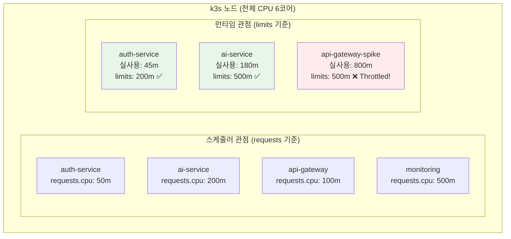
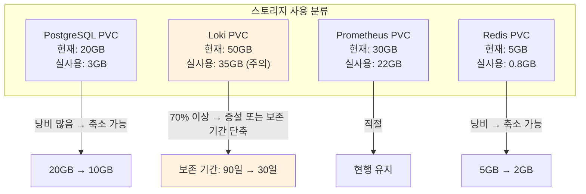
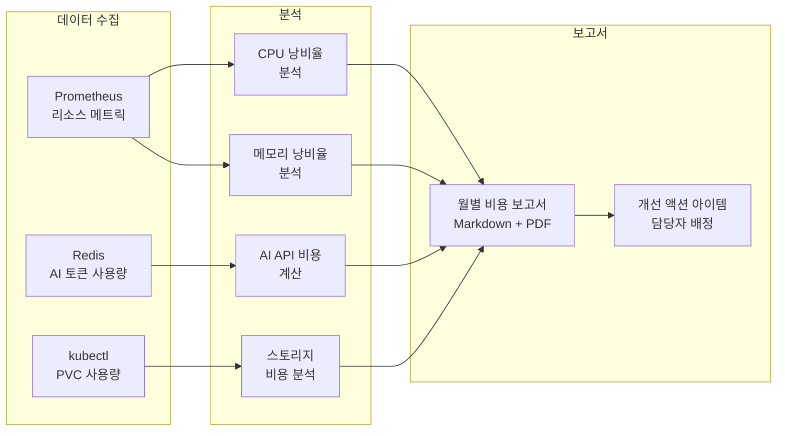

# 인프라 비용 최적화 가이드

> **문서 ID**: ONBOARD-04-INFRA-10
> **버전**: 1.0.0 | **작성일**: 2026-04-12 | **작성자**: Implementer (Sonnet)
> **선행 학습**: `01-overview.md` (인프라 개요), `kubernetes/01-k3s-basics.md` (k3s 기초)
> **소요 시간**: 약 90분
> **CSAP**: D-10 (서비스 가용성 — 리소스 관리), D-12 (시스템 개발 보안)
> **Design Ref**: MTU-N206 §3, MTU-N75 §1.3

---

## 목차

1. [클라우드/인프라 비용 구조 이해](#1-클라우드인프라-비용-구조-이해)
   - 1.1 [리소스가 곧 비용인 이유](#11-리소스가-곧-비용인-이유)
   - 1.2 [이 프로젝트의 리소스 예산](#12-이-프로젝트의-리소스-예산)
   - 1.3 [리소스 낭비 탐지 현황](#13-리소스-낭비-탐지-현황)
2. [Pod 리소스 요청/제한 최적화](#2-pod-리소스-요청제한-최적화)
   - 2.1 [requests vs limits 정확히 이해하기](#21-requests-vs-limits-정확히-이해하기)
   - 2.2 [기본값 자동 주입 정책 (Kyverno)](#22-기본값-자동-주입-정책-kyverno)
   - 2.3 [VPA로 최적값 찾기](#23-vpa로-최적값-찾기)
   - 2.4 [Prometheus 메트릭으로 낭비 발견하기](#24-prometheus-메트릭으로-낭비-발견하기)
3. [HPA/KEDA 자동 스케일링 최적화](#3-hpakeda-자동-스케일링-최적화)
   - 3.1 [HPA 야간 스케일 다운](#31-hpa-야간-스케일-다운)
   - 3.2 [KEDA — 큐 기반 AI 서비스 스케일링](#32-keda--큐-기반-ai-서비스-스케일링)
   - 3.3 [스케일링 메트릭 최적화](#33-스케일링-메트릭-최적화)
4. [스토리지 최적화](#4-스토리지-최적화)
   - 4.1 [PVC 사이징 전략](#41-pvc-사이징-전략)
   - 4.2 [Loki 로그 보존 기간 최적화](#42-loki-로그-보존-기간-최적화)
   - 4.3 [Prometheus 데이터 보존 최적화](#43-prometheus-데이터-보존-최적화)
5. [AI API 비용 최적화](#5-ai-api-비용-최적화)
   - 5.1 [모델 라우팅 — 요청 복잡도에 따른 모델 선택](#51-모델-라우팅--요청-복잡도에-따른-모델-선택)
   - 5.2 [응답 캐싱으로 중복 호출 제거](#52-응답-캐싱으로-중복-호출-제거)
   - 5.3 [토큰 예산 관리](#53-토큰-예산-관리)
6. [월별 비용 보고서 작성](#6-월별-비용-보고서-작성)
7. [학습 체크리스트](#7-학습-체크리스트)
8. [다음 단계](#8-다음-단계)

---

## 1. 클라우드/인프라 비용 구조 이해

### 1.1 리소스가 곧 비용인 이유

이 프로젝트는 온프레미스(WSL2 + k3s)에서 운영됩니다. 클라우드처럼 직접 비용 청구서가 나오지는 않지만, **리소스(CPU, 메모리, 스토리지)는 유한**하며 낭비하면 서비스 성능이 저하됩니다.

```
온프레미스 리소스 비용 관점:

  CPU 낭비 → 다른 서비스가 느려짐 (리소스 경합)
  메모리 낭비 → OOMKilled 발생 (Pod 강제 종료)
  디스크 낭비 → 로그/메트릭 손실, Pod 스케줄링 실패
  과도한 AI API 호출 → 외부 API 비용 직접 증가
```

#### 비유: 공공기관 청사의 사무실 배정

```
비효율적 배정 (현재 흔한 상황):
  팀 A (5명) → 20인 회의실 상시 점유
  팀 B (10명) → 8인 회의실에서 붐빔
  → 같은 건물인데 팀 A는 낭비, 팀 B는 부족

효율적 배정 (목표):
  팀 A (5명) → 6인 사무실 (맞는 크기)
  팀 B (10명) → 12인 사무실 (여유 있게)
  회의실 → 공유 예약제 (필요할 때만 사용)
```

Kubernetes의 리소스 `requests`와 `limits`가 정확히 이 역할을 합니다.

### 1.2 이 프로젝트의 리소스 예산

```
WSL2 호스트 서버 (개발 환경 기준):
  CPU: 8코어 (vCPU)
  메모리: 16GB
  디스크: 256GB SSD

k3s 클러스터 할당:
  CPU: 6코어 (OS/Docker에 2코어 예약)
  메모리: 12GB (시스템에 4GB 예약)
  디스크: 200GB (시스템에 56GB 예약)

네임스페이스별 예산 배분:
  saas-system (코어 서비스): CPU 2코어, 메모리 4GB
  monitoring:                 CPU 1코어, 메모리 3GB
  linkerd + linkerd-viz:      CPU 500m, 메모리 1GB
  flux-system:                CPU 200m, 메모리 512MB
  기타 (cert-manager 등):     CPU 300m, 메모리 512MB
```

```bash
# 현재 네임스페이스별 리소스 사용 현황 확인
kubectl top nodes
# NAME     CPU(cores)   CPU%   MEMORY(bytes)   MEMORY%
# wsl2     1250m        20%    6200Mi          51%

kubectl top pods -n saas-system --sort-by=memory
# NAME                        CPU(cores)   MEMORY(bytes)
# ai-service-xxx              120m         380Mi
# auth-service-xxx            45m          180Mi
# api-gateway-xxx             60m          220Mi
```

### 1.3 리소스 낭비 탐지 현황

이 프로젝트의 `infra/monitoring/resource-optimization/` 디렉토리에는 Prometheus 기반 리소스 낭비 탐지 규칙이 포함되어 있습니다.

```bash
# 현재 리소스 최적화 관련 알림 확인
kubectl get prometheusrule -n monitoring | grep resource
# resource-optimization-alerting-rules
# resource-optimization-recording-rules

# 현재 발동된 과잉 프로비저닝 알림 확인
kubectl port-forward -n monitoring svc/alertmanager 9093:9093 &
# http://localhost:9093 → Filter: "resource-optimization"
```

---

## 2. Pod 리소스 요청/제한 최적화

### 2.1 requests vs limits 정확히 이해하기



#### 핵심 규칙

| 개념 | 역할 | 초과 시 |
|------|------|--------|
| `requests.cpu` | 스케줄링 기준 (이 Pod를 어떤 노드에 배치할지) | 다른 노드로 배치 |
| `limits.cpu` | 실제 사용 가능한 최대 CPU | Throttling (느려짐) |
| `requests.memory` | 스케줄링 기준 | 다른 노드로 배치 |
| `limits.memory` | 실제 사용 가능한 최대 메모리 | OOMKilled (강제 종료) |

```
⚠️ OOMKilled를 예방하려면:
  limits.memory를 실제 최대 사용량보다 20~30% 여유 있게 설정

⚠️ CPU Throttling을 예방하려면:
  limits.cpu를 피크 사용량의 2배 이상으로 설정 (CPU는 압축 가능한 리소스)
```

#### 잘못된 설정과 올바른 설정 비교

```yaml
# ❌ 잘못된 설정 1: requests = limits (Guaranteed QoS — 비효율)
resources:
  requests:
    cpu: "1"       # 항상 1코어 예약
    memory: "1Gi"  # 항상 1GB 예약
  limits:
    cpu: "1"       # 실제로는 50m만 사용
    memory: "1Gi"  # 실제로는 200Mi만 사용
# → 노드 리소스의 90%가 낭비됨

# ❌ 잘못된 설정 2: limits 없음 (BestEffort QoS — 위험)
resources: {}  # 아무 설정 없음
# → OOM 발생 시 이 Pod가 가장 먼저 종료됨

# ✅ 올바른 설정: requests는 평균, limits는 피크의 2배
resources:
  requests:
    cpu: "50m"     # 평균 사용량 기준
    memory: "128Mi" # 평균 사용량 기준
  limits:
    cpu: "200m"    # 피크 사용량의 ~2배
    memory: "256Mi" # 피크 사용량 + 20% 여유
```

### 2.2 기본값 자동 주입 정책 (Kyverno)

이 프로젝트는 `infra/kyverno/policies/admission-security/default-resources.yaml`에서 리소스 기본값을 자동으로 주입합니다. Pod에 리소스 설정이 없으면 자동으로 안전한 기본값이 적용됩니다.

```yaml
# infra/kyverno/policies/admission-security/default-resources.yaml에서 발췌
# Design Ref: MTU-N75 §1.3
# Plan SC: FR-N75.3
# CSAP: D-12

apiVersion: kyverno.io/v1
kind: ClusterPolicy
metadata:
  name: default-resources
spec:
  rules:
    - name: set-default-resources
      match:
        any:
          - resources:
              kinds:
                - Pod
      exclude:
        any:
          - resources:
              namespaces:
                - kube-system
                - monitoring     # 모니터링 시스템은 제외 (별도 최적화)
      mutate:
        patchStrategicMerge:
          spec:
            containers:
              - (name): "*"
                resources:
                  requests:
                    +(cpu): "50m"      # 설정 없으면 50m 자동 적용
                    +(memory): "64Mi"  # 설정 없으면 64Mi 자동 적용
                  limits:
                    +(cpu): "200m"     # 설정 없으면 200m 자동 적용
                    +(memory): "256Mi" # 설정 없으면 256Mi 자동 적용
```

```bash
# 기본값 정책 적용 확인
kubectl describe clusterpolicy default-resources
# Status:
#   Ready: true
#   Valid: true

# 새 Pod 생성 시 기본값 주입 테스트
kubectl run test-pod --image=nginx -n saas-system --dry-run=server -o yaml | \
  grep -A 10 resources:
# resources:
#   limits:
#     cpu: 200m
#     memory: 256Mi
#   requests:
#     cpu: 50m
#     memory: 64Mi  ← 자동으로 주입됨
```

### 2.3 VPA로 최적값 찾기

VPA(Vertical Pod Autoscaler)는 Prometheus 메트릭을 분석하여 각 Pod의 최적 리소스 값을 자동으로 추천합니다.

```bash
# VPA 설치 (이 프로젝트에서는 추천 모드만 사용)
helm repo add fairwinds-stable https://charts.fairwinds.com/stable
helm install vpa fairwinds-stable/vpa \
  --namespace vpa \
  --create-namespace \
  --set updater.enabled=false  # 자동 변경 비활성화 (추천만 제공)
```

```yaml
# infra/vpa/auth-service-vpa.yaml
# VPA: auth-service 리소스 추천 (수동 검토 후 적용)
apiVersion: autoscaling.k8s.io/v1
kind: VerticalPodAutoscaler
metadata:
  name: auth-service-vpa
  namespace: saas-system
  annotations:
    description: "auth-service VPA — 추천 모드 (자동 적용 안 함)"
spec:
  targetRef:
    apiVersion: apps/v1
    kind: Deployment
    name: auth-service
  updatePolicy:
    updateMode: "Off"   # Off: 추천만, Auto: 자동 적용
  resourcePolicy:
    containerPolicies:
      - containerName: auth-service
        minAllowed:
          cpu: 10m
          memory: 64Mi
        maxAllowed:
          cpu: 1000m     # 최대 추천 상한선
          memory: 1Gi
        controlledResources: ["cpu", "memory"]
```

```bash
# VPA 추천값 확인 (7일 데이터 기반)
kubectl get vpa -n saas-system
# NAME               MODE   CPU   MEM       PROVIDED   AGE
# auth-service-vpa   Off    35m   148971Ki  True       7d

kubectl describe vpa auth-service-vpa -n saas-system
# Recommendation:
#   Container Recommendations:
#     Container Name: auth-service
#     Lower Bound:     cpu: 25m, memory: 100Mi    # 최소 안전 값
#     Target:          cpu: 35m, memory: 145Mi    # 권장 설정값
#     Upper Bound:     cpu: 120m, memory: 380Mi   # 피크 대비 여유
#     Uncapped Target: cpu: 35m, memory: 145Mi

# → requests.cpu를 50m → 35m으로, limits.cpu를 200m → 120m으로 조정 가능
```

### 2.4 Prometheus 메트릭으로 낭비 발견하기

`infra/monitoring/resource-optimization/resource-optimization-rules.yaml`에서 정의된 recording rule을 활용합니다.

```promql
# ── CPU 낭비율 탐지 (요청 대비 실사용률) ──
# 이 프로젝트의 실제 recording rule: resource_opt:cpu_utilization_ratio
sum by (namespace, pod, container) (
  rate(container_cpu_usage_seconds_total{container!="", container!="POD"}[5m])
)
/
sum by (namespace, pod, container) (
  kube_pod_container_resource_requests{resource="cpu", container!=""}
)
# 결과: 0.1 = 요청의 10%만 사용 (낭비 심각)
# 결과: 0.8 = 요청의 80% 사용 (적절)
# 결과: 1.5 = 요청의 150% 사용 (requests 부족 → 스케줄링 문제)

# ── 메모리 낭비율 탐지 ──
sum by (namespace, pod, container) (
  container_memory_working_set_bytes{container!="", container!="POD"}
)
/
sum by (namespace, pod, container) (
  kube_pod_container_resource_requests{resource="memory", container!=""}
)
# 결과: 0.2 = 요청의 20%만 사용 (낭비)

# ── 과잉 프로비저닝 컨테이너 목록 (CPU 요청이 실사용의 3배 이상) ──
# 이 프로젝트 실제 rule: resource_opt:cpu_over_provisioned_containers
(
  sum by (namespace, pod, container) (
    kube_pod_container_resource_requests{resource="cpu", container!=""}
  )
  /
  (
    sum by (namespace, pod, container) (
      rate(container_cpu_usage_seconds_total{container!="", container!="POD"}[1h])
    ) > 0
  )
) > 3
# → 이 결과가 나오는 컨테이너들의 requests.cpu를 낮출 것

# ── 실제 사용 가능 여유 메모리 (노드 수준) ──
node_memory_MemAvailable_bytes / node_memory_MemTotal_bytes * 100
# → 30% 이상 여유 있으면 requests.memory를 올려도 됨
# → 10% 미만이면 위험 (OOMKilled 가능성)
```

```bash
# Grafana에서 리소스 최적화 대시보드 확인
# infra/monitoring/dashboards/resource-optimization-dashboard.json 참조
kubectl port-forward -n monitoring svc/kube-prometheus-stack-grafana 3000:80 &
# http://localhost:3000 → Dashboards → Resource Optimization

# CLI로 즉시 확인하는 방법
kubectl top pods -n saas-system --sort-by=cpu | head -10
kubectl top pods -n saas-system --sort-by=memory | head -10
```

#### 리소스 설정 개선 사이클

```
1. 현황 파악: VPA 추천값 + PromQL로 실사용 확인
     ↓
2. 목표 설정: requests = 실평균 × 1.2, limits = 피크 × 1.5
     ↓
3. 적용: Helm values.yaml 수정 → git push → GitOps 자동 배포
     ↓
4. 검증: 72시간 모니터링 → OOMKilled/Throttling 없으면 성공
     ↓
5. 반복: 매월 VPA 추천값 재확인
```

---

## 3. HPA/KEDA 자동 스케일링 최적화

### 3.1 HPA 야간 스케일 다운

공공기관 SaaS는 업무 시간(09:00~18:00) 외에는 트래픽이 급감합니다. 야간에 Pod 수를 줄여 리소스를 확보합니다.

```yaml
# infra/hpa/auth-service-hpa.yaml
# 시간대별 HPA 설정 (KEDA ScaledObject로 구현)
apiVersion: keda.sh/v1alpha1
kind: ScaledObject
metadata:
  name: auth-service-scheduled-scale
  namespace: saas-system
  annotations:
    description: "업무 시간 기반 자동 스케일링"
spec:
  scaleTargetRef:
    name: auth-service
  minReplicaCount: 1
  maxReplicaCount: 10
  triggers:
    # CPU 기반 스케일링 (기본)
    - type: cpu
      metricType: Utilization
      metadata:
        value: "70"   # CPU 70% 초과 시 스케일 업

    # 스케줄 기반 스케일링 (야간 다운)
    - type: cron
      metadata:
        timezone: "Asia/Seoul"
        start: "0 9 * * 1-5"    # 평일 09:00 — 업무 시작
        end: "0 18 * * 1-5"     # 평일 18:00 — 업무 종료
        desiredReplicas: "3"    # 업무 시간: 최소 3개
    - type: cron
      metadata:
        timezone: "Asia/Seoul"
        start: "0 18 * * 1-5"  # 평일 18:00 — 야간 시작
        end: "0 9 * * 1-5"     # 평일 09:00 — 야간 종료
        desiredReplicas: "1"   # 야간: 최소 1개 (절전)
```

```bash
# HPA 현재 상태 확인
kubectl get hpa -n saas-system
# NAME           REFERENCE                TARGETS   MINPODS   MAXPODS   REPLICAS   AGE
# auth-service   Deployment/auth-service  45%/70%   1         10        2          3d

# KEDA ScaledObject 상태 확인
kubectl get scaledobject -n saas-system
# NAME                          SCALETARGETKIND   SCALETARGETNAME   MIN   MAX   TRIGGERS   AGE
# auth-service-scheduled-scale  Deployment        auth-service      1     10    2          3d
```

#### 스케일 다운 시 주의사항

```typescript
// CSAP D-06: 스케일 다운 전 온콜 통보가 필요한 경우
// platform/services/compliance-service/src/lib/audit.ts
await auditLog({
  actor: 'keda-controller',
  action: 'SCALE_DOWN',
  target: 'auth-service',
  details: '야간 스케줄 기반 스케일 다운: 3 → 1',
  timestamp: new Date().toISOString(),
})
```

### 3.2 KEDA — 큐 기반 AI 서비스 스케일링

AI 서비스는 요청이 몰릴 때와 없을 때의 차이가 극단적입니다. Redis 큐를 모니터링하여 대기 요청이 쌓이면 Pod를 늘리고, 소진되면 줄입니다.

```yaml
# infra/keda/ai-service-queue-scaler.yaml
# Design Ref: MTU-N252 §3 — AI 서비스 큐 기반 스케일링
apiVersion: keda.sh/v1alpha1
kind: ScaledObject
metadata:
  name: ai-service-queue-scaler
  namespace: saas-system
  annotations:
    description: "AI 처리 큐 기반 자동 스케일링 (N2SF O등급 데이터 처리)"
spec:
  scaleTargetRef:
    name: ai-service
  minReplicaCount: 0    # 큐가 비면 0으로 축소 (비용 절감)
  maxReplicaCount: 5    # 최대 5개 (리소스 예산 제약)
  cooldownPeriod: 300   # 스케일 다운 전 대기 시간 (초) — 갑작스런 종료 방지
  triggers:
    - type: redis
      metadata:
        address: redis.saas-system:6379
        listName: ai-task-queue    # 처리 대기 큐 키
        listLength: "5"            # 큐 항목 5개당 Pod 1개 추가
        enableTLS: "false"
      authenticationRef:
        name: redis-auth           # Redis 인증 시크릿 참조
```

```bash
# AI 서비스 큐 상태 모니터링
kubectl exec -n saas-system deployment/redis -- \
  redis-cli LLEN ai-task-queue
# 현재 대기 중인 AI 요청 수

# KEDA 스케일링 이력 확인
kubectl describe scaledobject ai-service-queue-scaler -n saas-system | \
  grep -A 10 "Events:"
```

### 3.3 스케일링 메트릭 최적화

```promql
# ── HPA 효율성 확인 ──
# 실제 Replica 수 vs 목표 Replica 수
kube_horizontalpodautoscaler_status_current_replicas{namespace="saas-system"}
kube_horizontalpodautoscaler_status_desired_replicas{namespace="saas-system"}

# ── 스케일 이벤트 빈도 (너무 잦으면 안정성 문제) ──
changes(kube_horizontalpodautoscaler_status_current_replicas{namespace="saas-system"}[1h])
# → 시간당 2회 이상이면 HPA cooldown 조정 필요

# ── 스케일 업 지연 탐지 (큐가 쌓이는데 Pod가 안 늘어남) ──
redis_list_length{key="ai-task-queue"} > 20
and
kube_deployment_spec_replicas{deployment="ai-service", namespace="saas-system"} < 3
```

---

## 4. 스토리지 최적화

### 4.1 PVC 사이징 전략



```bash
# PVC 사용량 확인
kubectl get pvc -n saas-system
# NAME              STATUS   VOLUME    CAPACITY   ACCESS MODES   STORAGECLASS   AGE
# postgresql-pvc    Bound    pvc-xxx   20Gi       RWO            local-path     30d
# redis-pvc         Bound    pvc-xxx   5Gi        RWO            local-path     30d

# 실제 디스크 사용량 확인
kubectl exec -n saas-system deployment/postgresql -- \
  df -h /var/lib/postgresql/data
# Filesystem      Size  Used Avail Use%
# /dev/sda1        20G  3.2G  16G  17%  ← 17% 사용, 83% 낭비

# PVC 사이즈 축소 방법 (k3s local-path는 직접 축소 불가 — 마이그레이션 필요)
# 1. 데이터 백업 (Velero)
velero backup create pg-backup-pre-resize --include-namespaces saas-system
# 2. 새 PVC 생성 (작은 크기)
# 3. 데이터 복원
# 4. 이전 PVC 삭제
```

### 4.2 Loki 로그 보존 기간 최적화

```yaml
# infra/loki/values-override.yaml
# Loki 로그 보존 기간 최적화
loki:
  limits_config:
    # CSAP D-06: 감사 로그 최소 1년 보존 (별도 처리)
    # 일반 애플리케이션 로그: 30일 (비용 절감)
    retention_period: 720h    # 30일 = 720시간

    # 네임스페이스별 보존 기간 차등 적용
    per_tenant_override_config: "/etc/loki/overrides.yaml"

# overrides.yaml:
#   saas-system:           # 일반 서비스 로그
#     retention_period: 720h  # 30일
#   monitoring:            # 시스템 로그
#     retention_period: 360h  # 15일 (메트릭으로 대체 가능)
#   audit:                 # 감사 로그 (CSAP D-06 요건)
#     retention_period: 8760h # 1년 (법적 보존 의무)
```

```bash
# Loki 현재 보존 설정 확인
kubectl get configmap -n monitoring loki-config -o yaml | grep retention

# 현재 Loki 디스크 사용량 확인
kubectl exec -n monitoring deployment/loki -- \
  du -sh /data/loki/chunks/
```

#### 로그 레벨 최적화로 양 줄이기

```typescript
// platform/services/ai-service/src/index.ts
// Production: warn 이상만 로깅 (info 제거로 로그 양 50% 감소 가능)
const LOG_LEVEL = process.env.LOG_LEVEL || 'warn'  // 기본값 warn

import pino from 'pino'
const logger = pino({
  level: LOG_LEVEL,
  // Development: 'debug', Production: 'warn'
})

// ❌ 모든 요청 info 로깅 (로그 폭발)
logger.info({ path: req.url }, 'Request received')  // 초당 60회 발생

// ✅ 에러/경고만 로깅
logger.warn({ path: req.url, status: 500 }, 'Request failed')
```

### 4.3 Prometheus 데이터 보존 최적화

```yaml
# infra/monitoring/prometheus-values.yaml
# Prometheus 데이터 보존 최적화
prometheus:
  prometheusSpec:
    # 데이터 보존 기간 (기본 15일 → 7일로 단축)
    # 장기 보존은 Thanos/Cortex 사용 (이 프로젝트는 단일 노드라 7일)
    retention: 7d
    retentionSize: 20GB  # 크기 제한으로 이중 보호

    # Recording Rule 적극 활용 (원시 데이터 대신 집계 데이터 보존)
    # → resource-optimization-rules.yaml의 recording rule이 이미 적용됨
    # → 원시 메트릭 보존 기간을 줄이고 recording rule 결과만 장기 보존
```

```bash
# Prometheus 현재 디스크 사용량 확인
kubectl exec -n monitoring prometheus-kube-prometheus-stack-prometheus-0 -- \
  df -h /prometheus
# → 20GB 이상이면 보존 기간 단축 또는 remote_write 설정 필요
```

---

## 5. AI API 비용 최적화

이 프로젝트의 AI API 호출은 외부 Anthropic API를 사용합니다. N2SF O등급(공개 데이터) + PII 마스킹 후에만 호출 가능하며, 호출 비용이 직접 발생합니다.

### 5.1 모델 라우팅 — 요청 복잡도에 따른 모델 선택

CLAUDE.md 섹션 7(모델 라우팅)의 원칙을 AI 서비스에 적용합니다.

```typescript
// platform/services/ai-service/src/lib/model-router.ts
// Design Ref: MTU-N252 §2 — AI 모델 라우팅
// Plan SC: AI-REQ-3

import { z } from 'zod'

// 요청 복잡도 분류 스키마
const TaskComplexitySchema = z.enum(['simple', 'standard', 'complex'])
type TaskComplexity = z.infer<typeof TaskComplexitySchema>

interface ModelConfig {
  model: string
  maxTokens: number
  costPer1kInputTokens: number   // USD
  costPer1kOutputTokens: number  // USD
}

// 모델별 설정 (N2SF O등급 — 외부 전송 허용)
const MODEL_CONFIGS: Record<TaskComplexity, ModelConfig> = {
  simple: {
    model: 'claude-haiku-4-5',       // 간단한 분류, 요약
    maxTokens: 1024,
    costPer1kInputTokens: 0.00025,
    costPer1kOutputTokens: 0.00125,
  },
  standard: {
    model: 'claude-sonnet-4-6',      // 표준 분석
    maxTokens: 4096,
    costPer1kInputTokens: 0.003,
    costPer1kOutputTokens: 0.015,
  },
  complex: {
    model: 'claude-opus-4-6',        // 복합 CSAP/N2SF 분석
    maxTokens: 8192,
    costPer1kInputTokens: 0.015,
    costPer1kOutputTokens: 0.075,
  },
}

/**
 * 요청 복잡도 자동 판정
 * Plan SC: AI-REQ-3
 */
export function classifyComplexity(
  prompt: string,
  taskType: string,
): TaskComplexity {
  // 규제 분석 (CSAP/N2SF) → 항상 complex
  if (taskType === 'csap-analysis' || taskType === 'n2sf-review') {
    return 'complex'
  }

  // 텍스트 분류, 키워드 추출 → simple
  if (taskType === 'classification' || taskType === 'keyword-extract') {
    return 'simple'
  }

  // 프롬프트 길이 기반 판정
  if (prompt.length < 500) return 'simple'
  if (prompt.length < 2000) return 'standard'
  return 'complex'
}

/**
 * 모델 라우팅 (비용 최적화)
 * Plan SC: AI-REQ-3
 */
export function selectModel(complexity: TaskComplexity): ModelConfig {
  return MODEL_CONFIGS[complexity]
}
```

```bash
# 모델별 API 호출 비율 확인 (Prometheus)
# platform/services/ai-service의 ai_api_calls_total 메트릭 활용
kubectl port-forward -n monitoring svc/kube-prometheus-stack-prometheus 9090:9090 &
# 쿼리: sum(ai_api_calls_total) by (model) — 모델별 호출 횟수
```

### 5.2 응답 캐싱으로 중복 호출 제거

동일하거나 유사한 요청에 대해 이전 AI 응답을 재사용합니다.

```typescript
// platform/services/ai-service/src/lib/ai-cache.ts
// Design Ref: MTU-N252 §3 — AI 응답 캐싱
// Plan SC: AI-REQ-4

import { createHash } from 'crypto'
import { getRedisClient } from './redis'

const CACHE_TTL_SECONDS = 3600  // 1시간 캐시 (AI 응답은 자주 변하지 않음)

/**
 * 캐시 키 생성 (프롬프트 + 모델 + 버전의 해시)
 */
function buildCacheKey(prompt: string, model: string, version: string): string {
  const hash = createHash('sha256')
    .update(`${prompt}:${model}:${version}`)
    .digest('hex')
    .slice(0, 16)
  return `ai_cache:${hash}`
}

/**
 * AI 응답 캐시 조회 (캐시 히트 시 API 비용 절감)
 */
export async function getCachedResponse(
  prompt: string,
  model: string,
): Promise<string | null> {
  const key = buildCacheKey(prompt, model, '1.0')
  const redis = getRedisClient()
  const cached = await redis.get(key)
  if (cached) {
    process.stdout.write(JSON.stringify({
      level: 'info',
      action: 'ai_cache_hit',
      model,
      ts: new Date().toISOString(),
    }) + '\n')
  }
  return cached
}

/**
 * AI 응답 캐시 저장
 */
export async function cacheResponse(
  prompt: string,
  model: string,
  response: string,
): Promise<void> {
  const key = buildCacheKey(prompt, model, '1.0')
  const redis = getRedisClient()
  await redis.setex(key, CACHE_TTL_SECONDS, response)
}
```

```promql
# 캐시 히트율 확인 (높을수록 비용 절감)
sum(rate(ai_cache_hits_total[1h]))
/
sum(rate(ai_api_calls_total[1h]))
* 100
# → 목표: 30% 이상 캐시 히트율
```

### 5.3 토큰 예산 관리

```typescript
// platform/services/ai-service/src/lib/token-budget.ts
// Design Ref: MTU-N252 §4 — 토큰 예산 관리
// Plan SC: AI-REQ-5

import { getRedisClient } from './redis'

// 일별 토큰 예산 (모델별)
const DAILY_TOKEN_BUDGET: Record<string, number> = {
  'claude-haiku-4-5': 5_000_000,    // 일 500만 토큰 (비용 $1.25)
  'claude-sonnet-4-6': 1_000_000,   // 일 100만 토큰 (비용 $3)
  'claude-opus-4-6': 200_000,       // 일 20만 토큰 (비용 $3)
}

const TODAY_KEY = () => {
  const today = new Date().toISOString().slice(0, 10)  // YYYY-MM-DD
  return `token_budget:${today}`
}

/**
 * 토큰 소비 기록 및 예산 초과 확인
 * CSAP D-06: 모든 AI 호출 기록
 */
export async function consumeTokenBudget(
  model: string,
  inputTokens: number,
  outputTokens: number,
): Promise<{ allowed: boolean; remaining: number }> {
  const redis = getRedisClient()
  const key = `${TODAY_KEY()}:${model}`
  const budget = DAILY_TOKEN_BUDGET[model] ?? 100_000

  const totalTokens = inputTokens + outputTokens
  const current = await redis.incrby(key, totalTokens)

  // 오늘 처음 사용이면 TTL 설정 (자정에 자동 초기화)
  if (current === totalTokens) {
    await redis.expire(key, 86400)  // 24시간
  }

  const remaining = Math.max(0, budget - current)
  const allowed = current <= budget

  if (!allowed) {
    process.stderr.write(JSON.stringify({
      level: 'warn',
      action: 'token_budget_exceeded',
      model,
      budget,
      used: current,
      ts: new Date().toISOString(),
    }) + '\n')
  }

  return { allowed, remaining }
}
```

```bash
# 일별 토큰 소비 현황 확인
kubectl exec -n saas-system deployment/redis -- \
  redis-cli KEYS "token_budget:*"
# token_budget:2026-04-12:claude-haiku-4-5
# token_budget:2026-04-12:claude-sonnet-4-6

kubectl exec -n saas-system deployment/redis -- \
  redis-cli GET "token_budget:2026-04-12:claude-sonnet-4-6"
# "234567"  ← 오늘 소비한 토큰 수
```

---

## 6. 월별 비용 보고서 작성



#### 월별 비용 보고서 템플릿

```markdown
# 인프라 비용 보고서 — 2026년 4월

## 1. 요약

| 항목 | 이번 달 | 지난 달 | 변화 |
|------|--------|--------|------|
| CPU 효율 | 68% | 61% | +7% ✅ |
| 메모리 효율 | 74% | 70% | +4% ✅ |
| Loki 디스크 | 38GB / 50GB | 35GB / 50GB | +3GB ⚠️ |
| AI API 토큰 | 1.2M / 1.5M | 0.9M / 1.5M | +33% |

## 2. CPU 최적화 기회

PromQL 결과: resource_opt:cpu_utilization_ratio < 0.2

| 서비스 | 요청 | 실사용 | 효율 | 권장 조치 |
|--------|------|-------|------|---------|
| auth-service | 50m | 35m | 70% | requests → 40m |
| redis | 100m | 8m | 8% | requests → 15m |

## 3. AI API 비용 분석

| 모델 | 호출 수 | 토큰 수 | 추정 비용(USD) |
|------|--------|--------|--------------|
| claude-haiku-4-5 | 45,000 | 800K | $0.20 |
| claude-sonnet-4-6 | 8,000 | 350K | $1.05 |
| claude-opus-4-6 | 500 | 48K | $0.72 |
| **합계** | 53,500 | 1.198M | **$1.97** |

## 4. 다음 달 액션 아이템

| 항목 | 담당자 | 기한 | 예상 절감 |
|------|--------|------|---------|
| redis CPU requests 조정 | 인프라팀 | 04-20 | 15% CPU |
| Loki 보존 기간 90일 → 30일 | SRE팀 | 04-25 | 8GB 디스크 |
| Haiku 캐싱 강화 | 개발팀 | 04-30 | AI 비용 30% |
```

```bash
# 자동화 스크립트로 핵심 지표 수집
#!/bin/bash
# scripts/monthly-cost-report.sh

echo "=== 리소스 효율 (Prometheus 쿼리) ==="
kubectl exec -n monitoring prometheus-kube-prometheus-stack-prometheus-0 -- \
  wget -qO- "http://localhost:9090/api/v1/query?query=avg(resource_opt:cpu_utilization_ratio)" | \
  python3 -c "import sys,json; d=json.load(sys.stdin); print(f'CPU 평균 효율: {float(d[\"data\"][\"result\"][0][\"value\"][1]):.1%}')"

echo "=== AI 토큰 사용량 (Redis) ==="
kubectl exec -n saas-system deployment/redis -- \
  redis-cli KEYS "token_budget:$(date +%Y-%m)*" | \
  xargs -I {} kubectl exec -n saas-system deployment/redis -- redis-cli GET {}

echo "=== PVC 사용량 ==="
kubectl get pvc -n saas-system -o json | \
  python3 -c "
import sys, json
pvcs = json.load(sys.stdin)['items']
for p in pvcs:
    print(f'{p[\"metadata\"][\"name\"]}: {p[\"spec\"][\"resources\"][\"requests\"][\"storage\"]}')
"
```

---

## 7. 학습 체크리스트

### 리소스 이해

- [ ] `requests`와 `limits`의 차이와 각각 초과 시 어떤 일이 발생하는지 설명할 수 있다
- [ ] OOMKilled가 발생하는 조건과 예방법을 설명할 있다
- [ ] Kyverno `default-resources` 정책이 왜 존재하는지 설명할 수 있다
- [ ] Guaranteed / Burstable / BestEffort QoS 클래스의 차이를 설명할 수 있다

### Prometheus 활용

- [ ] `resource_opt:cpu_utilization_ratio` recording rule을 Prometheus에서 직접 조회할 수 있다
- [ ] CPU 과잉 프로비저닝 컨테이너 목록을 PromQL로 찾을 수 있다
- [ ] `kubectl top pods`와 Prometheus 메트릭의 차이를 설명할 수 있다

### VPA/HPA/KEDA

- [ ] VPA 추천값을 확인하고 실제 Deployment에 적용하는 절차를 설명할 수 있다
- [ ] KEDA `cron` 트리거가 야간 스케일 다운을 어떻게 구현하는지 설명할 수 있다
- [ ] AI 서비스 큐 기반 스케일링에서 `minReplicaCount: 0`의 장단점을 설명할 수 있다

### 스토리지

- [ ] CSAP D-06에서 감사 로그를 1년 보존해야 하는 이유를 설명할 수 있다
- [ ] Loki 보존 기간을 네임스페이스별로 차등 설정하는 방법을 안다
- [ ] Prometheus recording rule이 원시 메트릭 보존보다 비용 효율적인 이유를 설명할 수 있다

### AI API 비용

- [ ] 요청 복잡도 기준으로 Haiku/Sonnet/Opus를 자동 선택하는 로직을 이해한다
- [ ] AI 응답 캐싱이 비용 절감에 기여하는 원리를 설명할 수 있다
- [ ] 일별 토큰 예산이 초과되면 어떤 일이 발생하는지 설명할 수 있다

---

## 8. 다음 단계

| 주제 | 문서 |
|------|------|
| 서비스 메시 고급 설정 | `components/09-service-mesh-advanced.md` |
| 재해 복구 | `08-disaster-recovery.md` — Velero 백업 |
| 인시던트 관리 | `../09-troubleshooting/04-incident-management.md` |
| 모니터링 대시보드 | `../05-monitoring/01-prometheus-grafana.md` |

---

## 변경 이력

| 버전 | 일자 | 내용 | 작성자 |
|------|------|------|--------|
| 1.0.0 | 2026-04-12 | 초안 작성 — 리소스 최적화, HPA/KEDA, 스토리지, AI 비용 | Implementer (Sonnet) |
