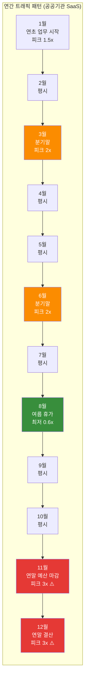
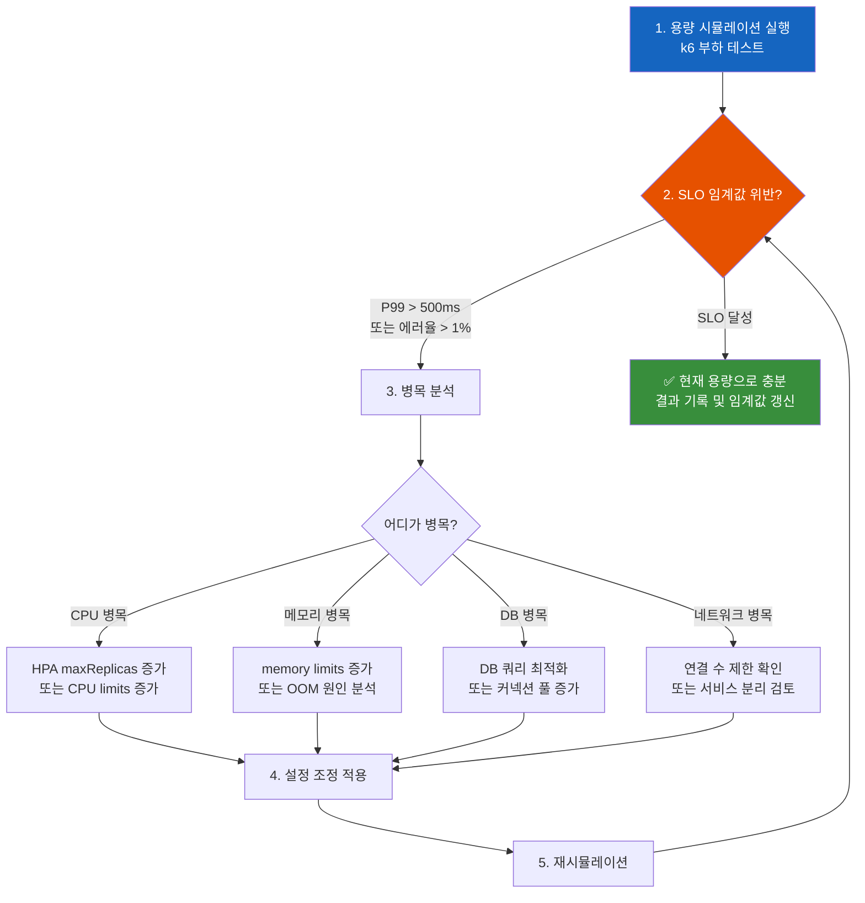

# 용량 계획 가이드 — 트래픽 급증에도 흔들리지 않는 서비스 운영

> **문서 ID**: ONBOARD-04-INFRA-11
> **버전**: 1.0.0 | **작성일**: 2026-04-12 | **작성자**: Implementer (Sonnet)
> **선행 학습**:
>   - `10-cost-optimization.md` (리소스 최적화 기초)
>   - `kubernetes/01-k3s-basics.md` (k3s Pod/Node 개념)
>   - `../05-monitoring/metrics/01-prometheus-basics.md` (PromQL 기초)
> **소요 시간**: 약 90분
> **CSAP**: D-10 (서비스 가용성), D-13 (변경 관리)
> **Design Ref**: MTU-N76 §1~3, MTU-N206 §3

---

## 목차

1. [용량 계획이란? — 왜 미리 계획해야 하나](#1-용량-계획이란--왜-미리-계획해야-하나)
   - 1.1 [깜짝 트래픽 급증 시나리오](#11-깜짝-트래픽-급증-시나리오)
   - 1.2 [용량 계획의 세 가지 목표](#12-용량-계획의-세-가지-목표)
   - 1.3 [이 프로젝트의 리소스 구조](#13-이-프로젝트의-리소스-구조)
2. [현재 시스템 용량 파악](#2-현재-시스템-용량-파악)
   - 2.1 [노드별 리소스 현황 확인](#21-노드별-리소스-현황-확인)
   - 2.2 [서비스별 리소스 사용률 확인](#22-서비스별-리소스-사용률-확인)
   - 2.3 [병목 서비스 찾기](#23-병목-서비스-찾기)
   - 2.4 [ResourceQuota와 LimitRange 현황](#24-resourcequota와-limitrange-현황)
3. [트래픽 예측 방법](#3-트래픽-예측-방법)
   - 3.1 [히스토리 기반 예측 (30일 데이터)](#31-히스토리-기반-예측-30일-데이터)
   - 3.2 [계절성 패턴 — 공공기관 특수 패턴](#32-계절성-패턴--공공기관-특수-패턴)
   - 3.3 [신규 기능 출시 영향 예측](#33-신규-기능-출시-영향-예측)
4. [스케일링 계획](#4-스케일링-계획)
   - 4.1 [수평 확장 (HPA): Pod 수 늘리기](#41-수평-확장-hpa-pod-수-늘리기)
   - 4.2 [수직 확장 (VPA): 리소스 크기 늘리기](#42-수직-확장-vpa-리소스-크기-늘리기)
   - 4.3 [노드 확장: 클러스터 자체 확장](#43-노드-확장-클러스터-자체-확장)
5. [용량 시뮬레이션](#5-용량-시뮬레이션)
   - 5.1 [k6로 예상 트래픽 시뮬레이션](#51-k6로-예상-트래픽-시뮬레이션)
   - 5.2 [병목 발견과 조정 사이클](#52-병목-발견과-조정-사이클)
   - 5.3 [결과 기록과 임계값 갱신](#53-결과-기록과-임계값-갱신)
6. [월별 용량 보고서 작성](#6-월별-용량-보고서-작성)
   - 6.1 [보고서 구성](#61-보고서-구성)
   - 6.2 [자동화 스크립트](#62-자동화-스크립트)
7. [학습 체크리스트](#7-학습-체크리스트)
8. [다음 단계](#8-다음-단계)

---

## 1. 용량 계획이란? — 왜 미리 계획해야 하나

### 1.1 깜짝 트래픽 급증 시나리오

용량 계획 없이 운영하면 다음 상황이 언제든 발생할 수 있습니다.

```
시나리오: 공공기관 SaaS 서비스 장애 발생

오전 9시: 정부 보조금 신청 기간 시작 (사전 공지 없이)
오전 9:05: 트래픽이 평소의 10배로 급증
오전 9:06: api-gateway Pod가 OOMKilled (메모리 부족으로 강제 종료)
오전 9:07: 서비스 전면 중단
오전 9:10: 담당자가 뒤늦게 알림 수신
오전 9:15: "왜 이렇게 됐지?" 원인 파악 시작
오전 10:30: 1시간 30분 만에 서비스 복구

피해:
  - 보조금 신청 불가: 수천 명 국민 민원 폭주
  - CSAP D-10 (서비스 가용성) 위반 가능성
  - SLA 위반 가능성
  - 언론 보도 위험
```

용량 계획을 미리 했다면:

```
사전 대응 시나리오:

3월 말: "4월 보조금 신청 기간, 작년 트래픽 데이터 분석"
        → 평소 5배 트래픽 예측

3주 전: HPA 최대 Pod 수 20 → 50으로 상향 조정
         메모리 limits 512Mi → 1Gi로 상향

1주 전: k6로 예상 트래픽 시뮬레이션 완료
         → 50 Pod로 30배 트래픽도 처리 가능 확인

D-Day: 트래픽 급증 → HPA 자동으로 Pod 30개로 확장
       서비스 정상 유지
       담당자는 Grafana 모니터링만 하면 됨
```

### 1.2 용량 계획의 세 가지 목표

```
1. 가용성 보장 (CSAP D-10)
   예상 최대 트래픽에서도 SLO 99.9% 달성
   → 용량 부족으로 인한 장애 사전 차단

2. 비용 효율 (10-cost-optimization.md 연계)
   과도한 리소스 예약 없이 필요한 만큼만 준비
   → 온프레미스 한정 리소스 낭비 방지

3. 스케일링 준비
   예상 성장률에 맞춰 언제 노드를 추가해야 하는지 미리 파악
   → 예산 확보와 하드웨어 조달 시간 확보
```

### 1.3 이 프로젝트의 리소스 구조

현재 시스템 리소스 제한 구조를 이해하는 것이 용량 계획의 출발점입니다.

```
WSL2 호스트 (전체 리소스):
  CPU: 8 vCPU
  메모리: 16GB
  디스크: 256GB SSD

k3s 클러스터 (할당된 리소스):
  CPU: 6코어 (OS/Docker에 2코어 예약)
  메모리: 12GB (시스템에 4GB 예약)
  디스크: 200GB

네임스페이스별 예산 (ResourceQuota):
  saas-system: CPU 2코어, 메모리 4GB, Pod 40개
  monitoring:  CPU 1코어, 메모리 3GB
  기타:        CPU 3코어, 메모리 5GB

테넌트 등급별 Quota (infra/resource-management/quotas/tenant-quotas.yaml):
  Small:  CPU 2코어(req)/4코어(lim), 메모리 4GB/8GB, Pod 20개
  Medium: CPU 4코어/8코어,         메모리 8GB/16GB, Pod 40개
  Large:  CPU 8코어/16코어,        메모리 16GB/32GB, Pod 80개

컨테이너 기본 제한 (infra/resource-management/limit-ranges/global-limit-range.yaml):
  기본 request: CPU 50m, 메모리 64Mi
  기본 limit:   CPU 200m, 메모리 256Mi
  최대 허용:    CPU 4코어, 메모리 8Gi (컨테이너 당)
```

---

## 2. 현재 시스템 용량 파악

용량 계획을 시작하려면 먼저 현재 상태를 정확히 파악해야 합니다.

### 2.1 노드별 리소스 현황 확인

```bash
# 노드 전체 리소스 현황
kubectl top nodes
# NAME     CPU(cores)   CPU%   MEMORY(bytes)   MEMORY%
# wsl2     1580m        26%    7890Mi          65%

# 상세 노드 정보 (할당 가능한 리소스 확인)
kubectl describe node wsl2 | grep -A 20 "Allocatable:"
# Allocatable:
#   cpu:               6        ← 실제 할당 가능한 CPU
#   memory:            12Gi     ← 실제 할당 가능한 메모리
#   pods:              110      ← 최대 Pod 수

# 이미 할당(Request)된 리소스 확인
kubectl describe node wsl2 | grep -A 15 "Allocated resources:"
# Allocated resources:
#   CPU Requests: 1200m (20%)
#   CPU Limits:   3000m (50%)
#   Memory Requests: 3Gi (25%)
#   Memory Limits: 8Gi (67%)
```

#### PromQL로 노드 용량 현황 조회

```promql
# 노드 CPU 사용률 (현재)
100 - (avg(irate(node_cpu_seconds_total{mode="idle"}[5m])) * 100)
# 예상: 26%

# 노드 메모리 사용률 (현재)
(1 - node_memory_MemAvailable_bytes / node_memory_MemTotal_bytes) * 100
# 예상: 65%

# 노드 디스크 사용률 (현재)
(1 - node_filesystem_avail_bytes{mountpoint="/"} / node_filesystem_size_bytes{mountpoint="/"}) * 100
# 예상: 45%

# Pod 할당량 사용률 (몇 개 Pod 할당됐나)
kube_node_status_allocatable{resource="pods"} - kube_pod_info  # 사용 가능한 Pod 슬롯 수
```

### 2.2 서비스별 리소스 사용률 확인

```bash
# 서비스별 CPU/메모리 사용량 (현재 실제 사용)
kubectl top pods -n saas-system --sort-by=memory
# NAME                         CPU(cores)   MEMORY(bytes)
# ai-service-5d8b-xxx          185m         420Mi   ← 가장 많이 사용
# api-gateway-7c9f-xxx         65m          235Mi
# user-service-3a4b-xxx        45m          185Mi
# auth-service-8e2c-xxx        40m          175Mi
# compliance-service-xxx       25m          145Mi

# 서비스별 Request vs 실제 사용량 비교 (낭비 발견)
kubectl top pods -n saas-system --sort-by=cpu
```

#### PromQL로 서비스별 요청/제한 대비 사용률

```promql
# CPU 요청(Request) 대비 실제 사용률 (낭비 탐지)
sum by (pod, namespace) (
  rate(container_cpu_usage_seconds_total{namespace="saas-system"}[5m])
) /
sum by (pod, namespace) (
  kube_pod_container_resource_requests{namespace="saas-system", resource="cpu"}
) * 100
# 결과가 20% 미만이면 Request를 낮출 수 있음 (10-cost-optimization.md 참고)
# 결과가 80% 이상이면 Request를 올려야 함

# 메모리 제한(Limit) 대비 실제 사용률 (OOMKill 위험 탐지)
sum by (pod, namespace) (
  container_memory_working_set_bytes{namespace="saas-system"}
) /
sum by (pod, namespace) (
  kube_pod_container_resource_limits{namespace="saas-system", resource="memory"}
) * 100
# 결과가 80% 이상이면 OOMKilled 위험! limits를 올려야 함
```

### 2.3 병목 서비스 찾기

병목(Bottleneck)은 전체 시스템에서 가장 느리거나 리소스를 가장 많이 소비하는 서비스입니다. 병목 서비스를 먼저 최적화해야 전체 성능이 개선됩니다.

```promql
# 병목 1: 응답 시간이 가장 긴 서비스
topk(5,
  histogram_quantile(0.99,
    sum by (service, le) (
      rate(http_request_duration_seconds_bucket[5m])
    )
  )
)
# 예상 결과:
# ai-service:    P99 = 1200ms  ← 병목!
# user-service:  P99 = 180ms
# auth-service:  P99 = 45ms

# 병목 2: 에러율이 가장 높은 서비스
topk(5,
  sum by (service) (rate(http_requests_total{status_code=~"5.."}[5m]))
  / sum by (service) (rate(http_requests_total[5m]))
)

# 병목 3: CPU를 가장 많이 소비하는 서비스
topk(5,
  sum by (pod) (
    rate(container_cpu_usage_seconds_total{namespace="saas-system"}[5m])
  )
)

# 병목 4: 메모리를 가장 많이 소비하는 서비스
topk(5,
  sum by (pod) (
    container_memory_working_set_bytes{namespace="saas-system"}
  )
)
```

### 2.4 ResourceQuota와 LimitRange 현황

```bash
# 현재 ResourceQuota 사용 현황
kubectl get resourcequota -n saas-system -o yaml
# status.used vs status.hard 비교

# ResourceQuota 사용률 확인
kubectl describe resourcequota -n saas-system
# Name: saas-system-quota
# Resource         Used    Hard
# limits.cpu       2800m   4000m   ← 70% 사용 중 (주의!)
# limits.memory    5632Mi  8Gi     ← 68% 사용 중
# pods             18      40      ← 45% 사용 중
# requests.cpu     980m    2000m   ← 49% 사용 중
# requests.memory  2560Mi  4Gi     ← 63% 사용 중

# LimitRange 설정 확인 (infra/resource-management/limit-ranges/global-limit-range.yaml)
kubectl describe limitrange global-limit-range -n saas-system
# Type        Resource  Min   Max    Default Limit  Default Request
# Container   cpu       10m   4      200m           50m
# Container   memory    16Mi  8Gi    256Mi          64Mi
# Pod         cpu       -     8      -              -
# Pod         memory    -     16Gi   -              -
# PVC         storage   1Gi   50Gi   -              -
```

#### PromQL로 Quota 사용률 모니터링

```promql
# ResourceQuota CPU limits 사용률
kube_resourcequota{namespace="saas-system", resource="limits.cpu", type="used"}
/ kube_resourcequota{namespace="saas-system", resource="limits.cpu", type="hard"}
* 100
# 80% 이상이면 경고 발생 (infra/monitoring/namespace-quota-rules.yaml 참고)

# ResourceQuota 메모리 limits 사용률
kube_resourcequota{namespace="saas-system", resource="limits.memory", type="used"}
/ kube_resourcequota{namespace="saas-system", resource="limits.memory", type="hard"}
* 100

# Pod 수 사용률
kube_resourcequota{namespace="saas-system", resource="pods", type="used"}
/ kube_resourcequota{namespace="saas-system", resource="pods", type="hard"}
* 100
```

---

## 3. 트래픽 예측 방법

### 3.1 히스토리 기반 예측 (30일 데이터)

과거 트래픽 패턴을 분석하여 미래를 예측합니다. Prometheus는 기본적으로 15일~30일 데이터를 보존합니다.

```promql
# 최근 30일 일별 최대 RPS (요청/초) 추이
max_over_time(
  sum(rate(http_requests_total[5m]))[30d:1d]
)
# 이 값들의 추세를 보면 주간 성장률을 계산할 수 있습니다

# 주간 평균 RPS 패턴 (요일별)
avg by (day_of_week) (
  sum(rate(http_requests_total[5m]))
)
# 예상: 월~금이 주말보다 3~4배 높음

# 시간대별 평균 RPS (하루 중 피크 시간 찾기)
avg by (hour) (
  sum(rate(http_requests_total[5m]))
)
# 예상: 오전 9~11시, 오후 2~4시가 피크
```

#### 성장률 계산 및 미래 트래픽 예측

```bash
# 스크립트: 지난 4주 데이터로 성장률 계산
cat > /tmp/capacity-forecast.sh << 'EOF'
#!/bin/bash

PROMETHEUS_URL="http://localhost:9090"

# 주차별 평균 RPS 조회
echo "=== 주차별 평균 RPS ==="
for WEEK in 4 3 2 1; do
  START=$((WEEK * 7 * 24 * 3600))
  END=$(((WEEK - 1) * 7 * 24 * 3600))

  RPS=$(curl -s "${PROMETHEUS_URL}/api/v1/query_range" \
    --data-urlencode "query=sum(rate(http_requests_total[1h]))" \
    --data-urlencode "start=$(date -d "-${START} seconds" +%s)" \
    --data-urlencode "end=$(date -d "-${END} seconds" +%s)" \
    --data-urlencode "step=3600" \
    | jq '[.data.result[0].values[].1 | tonumber] | add / length')

  echo "${WEEK}주 전: ${RPS} req/s"
done

# 선형 성장률 계산
echo ""
echo "=== 예측 ==="
echo "다음 달 예상 피크 RPS: [수동 계산 또는 scipy로 선형 회귀]"
EOF
chmod +x /tmp/capacity-forecast.sh
/tmp/capacity-forecast.sh
```

### 3.2 계절성 패턴 — 공공기관 특수 패턴

공공기관 SaaS는 일반 서비스와 다른 독특한 트래픽 패턴을 가집니다. 이 패턴을 미리 파악하고 준비해야 합니다.



#### 주요 예측 이벤트 캘린더

| 시기 | 이벤트 | 예상 트래픽 | 준비 필요 사항 |
|------|--------|-----------|-------------|
| 매 분기말 (3/6/9/12월) | 실적 보고, 예산 결산 | 평시 2배 | HPA maxReplicas 2배 설정 |
| 연말 (11~12월) | 예산 집행 마감 | 평시 3배 | 사전 스케일아웃 |
| 보조금 신청 기간 | 공고 후 즉시 급증 | 평시 5~10배 | 사전 용량 확보 필수 |
| 새해 업무 시작 (1월 2일) | 연초 업무 몰림 | 평시 1.5배 | HPA warm-up |
| 여름 휴가 (8월) | 트래픽 감소 | 평시 0.6배 | 스케일다운으로 비용 절감 |

```bash
# 공공기관 이벤트 캘린더를 사전 예약 스케일링으로 구현 (KEDA CronTrigger)
cat > /tmp/seasonal-scaling.yaml << 'EOF'
apiVersion: keda.sh/v1alpha1
kind: ScaledObject
metadata:
  name: api-gateway-seasonal
  namespace: saas-system
spec:
  scaleTargetRef:
    name: api-gateway
  minReplicaCount: 2
  maxReplicaCount: 50
  triggers:
    # 평시 CPU 기반 스케일링
    - type: prometheus
      metadata:
        serverAddress: http://prometheus-operated:9090
        metricName: cpu_utilization
        query: avg(rate(container_cpu_usage_seconds_total{pod=~"api-gateway.*"}[5m]))
        threshold: "0.7"

    # 분기말 사전 스케일아웃 (3/6/9/12월 말 주)
    - type: cron
      metadata:
        timezone: "Asia/Seoul"
        start: "0 8 25 3,6,9,12 *"   # 분기말 25일 오전 8시
        end: "0 20 31 3,6,9,12 *"    # 분기말 마지막 날 오후 8시
        desiredReplicas: "15"         # 평시 5개 → 15개로 사전 확장

    # 연말 집중 기간 (11/25 ~ 12/31)
    - type: cron
      metadata:
        timezone: "Asia/Seoul"
        start: "0 7 25 11 *"
        end: "0 21 31 12 *"
        desiredReplicas: "25"         # 연말은 더 많이 확장
EOF

kubectl apply -f /tmp/seasonal-scaling.yaml
```

### 3.3 신규 기능 출시 영향 예측

신규 기능 출시는 예상치 못한 트래픽 패턴을 유발할 수 있습니다.

```
신규 기능 출시 영향 예측 방법:

1. 유사 기능의 과거 출시 데이터 참고
   "작년 동일 기능 출시 시 트래픽 30% 증가"
   → 이번 출시도 30% 증가 예상

2. 베타 테스트 단계의 트래픽 외삽
   "베타 사용자 100명 시 RPS 50"
   "전체 사용자 10,000명으로 출시 시"
   → 예상 RPS = 50 × (10,000 / 100) = 5,000 (선형 가정)

3. Feature Flag으로 단계적 출시
   10% → 25% → 50% → 100%로 점진 확대
   각 단계에서 리소스 사용량 확인 후 다음 단계 진행

4. 최악의 경우(Worst Case) 용량 확보
   예상 트래픽 × 안전계수(1.5~2.0)로 용량 준비
   안전계수: 1.5 (예측 신뢰도 높음), 2.0 (예측 불확실)
```

```bash
# Feature Flag 단계적 출시와 리소스 모니터링 연동
# 각 단계에서 아래 명령으로 리소스 증가 추이 확인

watch -n 5 'kubectl top pods -n saas-system --sort-by=cpu | head -10'

# 새 기능 사용자 비율 10% 확대 후 CPU 사용량 변화 확인
# 이전 평균 CPU × (1 + 0.1) ≈ 새 평균 CPU 예상값
# 실제값이 예상값보다 30% 이상 높으면 병목 조사 필요
```

---

## 4. 스케일링 계획

### 4.1 수평 확장 (HPA): Pod 수 늘리기

HPA(Horizontal Pod Autoscaler)는 트래픽 증가 시 Pod 수를 자동으로 늘리는 기능입니다.

```
언제 HPA를 사용하는가:
  ✅ 트래픽이 예측 가능하게 증가하는 경우 (피크/평시 패턴)
  ✅ 서비스가 무상태(Stateless)인 경우 (api-gateway, user-service 등)
  ✅ 인스턴스를 늘려도 성능이 선형으로 개선되는 경우

언제 HPA가 부적합한가:
  ❌ DB 자체 (스케일아웃 복잡, 별도 클러스터링 필요)
  ❌ 대용량 인메모리 상태가 있는 서비스
  ❌ 기동 시간이 매우 긴 서비스 (startup latency가 큰 경우)
```

```yaml
# api-gateway HPA 설정 예시
# infra/resource-management/hpa/api-gateway-hpa.yaml
apiVersion: autoscaling/v2
kind: HorizontalPodAutoscaler
metadata:
  name: api-gateway-hpa
  namespace: saas-system
spec:
  scaleTargetRef:
    apiVersion: apps/v1
    kind: Deployment
    name: api-gateway
  minReplicas: 2    # 항상 최소 2개 (가용성 보장)
  maxReplicas: 20   # 최대 20개 (ResourceQuota 고려)

  metrics:
    # CPU 사용률 70% 이상 시 스케일아웃
    - type: Resource
      resource:
        name: cpu
        target:
          type: Utilization
          averageUtilization: 70

    # 메모리 사용률 75% 이상 시 스케일아웃
    - type: Resource
      resource:
        name: memory
        target:
          type: Utilization
          averageUtilization: 75

  behavior:
    scaleUp:
      stabilizationWindowSeconds: 60   # 1분 안정화 후 스케일아웃
      policies:
        - type: Percent
          value: 100    # 한 번에 현재 Pod 수의 100% 추가 가능 (빠른 확장)
          periodSeconds: 60
    scaleDown:
      stabilizationWindowSeconds: 300  # 5분 안정화 후 스케일인 (급격한 축소 방지)
      policies:
        - type: Percent
          value: 10    # 한 번에 10%만 감소 (점진적 축소)
          periodSeconds: 60
```

#### HPA 동작 확인

```bash
# HPA 현재 상태 확인
kubectl get hpa -n saas-system
# NAME              REFERENCE            TARGETS         MINPODS   MAXPODS   REPLICAS
# api-gateway-hpa   Deployment/api-gw    45%/70%         2         20        3
#                                        CPU/목표    최소  최대    현재

# HPA 이벤트 확인 (스케일링 이력)
kubectl describe hpa api-gateway-hpa -n saas-system | grep -A 20 "Events:"
# Events:
#   Normal  SuccessfulRescale  "New size: 5; reason: cpu resource utilization above target"
#   Normal  SuccessfulRescale  "New size: 3; reason: All metrics below target"

# HPA 스케일링 실시간 모니터링
watch -n 5 'kubectl get hpa -n saas-system && kubectl top pods -n saas-system | head -10'
```

### 4.2 수직 확장 (VPA): 리소스 크기 늘리기

VPA(Vertical Pod Autoscaler)는 Pod 수는 그대로 두고 각 Pod의 CPU/메모리를 자동으로 조정합니다.

```
언제 VPA를 사용하는가:
  ✅ 더 이상 Pod를 늘릴 수 없는 경우 (Stateful 서비스, DB 등)
  ✅ 현재 request/limit 설정이 최적값인지 모를 때 (분석 모드)
  ✅ 메모리 집약적 작업 (ML 추론 등)에서 적정 메모리 찾을 때

⚠️ 주의: VPA는 Pod를 재시작합니다. 서비스 중단이 발생할 수 있습니다.
   Production에서는 Off 모드(권장값 제공, 자동 적용 안 함)로 먼저 사용하세요.
```

```yaml
# ai-service VPA 설정 (분석 모드)
# infra/resource-management/vpa/ai-service-vpa.yaml
apiVersion: autoscaling.k8s.io/v1
kind: VerticalPodAutoscaler
metadata:
  name: ai-service-vpa
  namespace: saas-system
spec:
  targetRef:
    apiVersion: apps/v1
    kind: Deployment
    name: ai-service
  updatePolicy:
    updateMode: "Off"  # 권장값만 보여주고 자동 적용 안 함 (안전)
    # updateMode: "Auto"  # 자동 적용 (재시작 발생, 주의!)
  resourcePolicy:
    containerPolicies:
      - containerName: ai-service
        minAllowed:
          cpu: "100m"
          memory: "256Mi"
        maxAllowed:
          cpu: "4"          # LimitRange max 이내로 설정
          memory: "8Gi"
```

```bash
# VPA 권장값 확인 (Off 모드에서 2~3일 후 조회)
kubectl describe vpa ai-service-vpa -n saas-system | grep -A 20 "Recommendation:"
# Recommendation:
#   Container Recommendations:
#     Container Name: ai-service
#     Lower Bound:
#       Cpu:    80m
#       Memory: 320Mi
#     Target:           ← 이 값을 Deployment에 적용하면 최적!
#       Cpu:    180m
#       Memory: 480Mi
#     Upper Bound:
#       Cpu:    2
#       Memory: 2Gi
```

### 4.3 노드 확장: 클러스터 자체 확장

현재 노드의 리소스가 부족하면 노드 자체를 추가해야 합니다. 온프레미스 환경에서는 이것이 물리 서버 추가를 의미합니다.

```
노드 확장이 필요한 신호:

신호 1: CPU/메모리 사용률 지속적 80% 이상
  PromQL: avg(100 - rate(node_cpu_seconds_total{mode="idle"}[5m]) * 100) > 80
  → 즉시 대응 필요

신호 2: Pod Pending 상태 발생
  kubectl get pods -n saas-system | grep Pending
  kubectl describe pod <pending-pod> | grep "Insufficient"
  → 스케줄링 실패 = 노드 용량 부족

신호 3: ResourceQuota 사용률 90% 이상
  kube_resourcequota{type="used"} / kube_resourcequota{type="hard"} > 0.9
  → Quota 조정 또는 노드 추가 검토

노드 추가 계획 타임라인 (온프레미스):
  현재: 사용률 75%
  T+1개월: 예측 사용률 85% (성장률 10%/월)
  T+2개월: 예측 사용률 95% → 위험!
  따라서: 지금부터 노드 추가 계획 시작 (하드웨어 조달 4~8주 소요)
```

```bash
# 노드 용량 한계 예측 스크립트
cat > /tmp/node-capacity-check.sh << 'EOF'
#!/bin/bash
echo "=== 현재 노드 용량 현황 ==="

# 현재 CPU 사용률
CPU_UTIL=$(kubectl top nodes --no-headers | awk '{sum+=$3} END {print sum/NR}')
echo "평균 CPU 사용률: ${CPU_UTIL}%"

# 현재 메모리 사용률
MEM_UTIL=$(kubectl top nodes --no-headers | awk '{sum+=$5} END {print sum/NR}')
echo "평균 메모리 사용률: ${MEM_UTIL}%"

# Pod 수 현황
TOTAL_PODS=$(kubectl get pods --all-namespaces --no-headers | grep Running | wc -l)
echo "실행 중인 Pod 수: ${TOTAL_PODS}"

# Pending Pod 여부
PENDING=$(kubectl get pods --all-namespaces --no-headers | grep Pending | wc -l)
if [ "$PENDING" -gt 0 ]; then
  echo "⚠️ Pending Pod 발견: ${PENDING}개 — 즉시 조사 필요!"
else
  echo "✅ Pending Pod 없음"
fi

echo ""
echo "=== 용량 권고 사항 ==="
if (( $(echo "$CPU_UTIL > 80" | bc -l) )); then
  echo "❌ CPU 사용률 위험 수준 — 노드 추가 또는 서비스 최적화 필요"
elif (( $(echo "$CPU_UTIL > 60" | bc -l) )); then
  echo "⚠️ CPU 사용률 경고 수준 — 1개월 이내 용량 계획 수립 필요"
else
  echo "✅ CPU 여유 있음"
fi
EOF
chmod +x /tmp/node-capacity-check.sh
/tmp/node-capacity-check.sh
```

---

## 5. 용량 시뮬레이션

실제 트래픽을 발생시키기 전에 부하 테스트로 용량 한계를 미리 파악합니다.

### 5.1 k6로 예상 트래픽 시뮬레이션

```javascript
// /tmp/capacity-simulation.js
// 공공기관 SaaS 용량 시뮬레이션 시나리오

import http from 'k6/http';
import { check, sleep } from 'k6';
import { Counter, Rate, Trend } from 'k6/metrics';

const errorCount = new Counter('errors');
const errorRate = new Rate('error_rate');
const responseTime = new Trend('response_time', true);

// 시나리오: 분기말 트래픽 급증 (평시 5배)
export const options = {
  scenarios: {
    // 1단계: 평시 트래픽 (기준값 측정)
    baseline: {
      executor: 'constant-vus',
      vus: 10,          // 동시 사용자 10명
      duration: '2m',
      startTime: '0s',
      tags: { scenario: 'baseline' },
    },

    // 2단계: 점진적 부하 증가 (램프업)
    ramp_up: {
      executor: 'ramping-vus',
      startVUs: 10,
      stages: [
        { target: 25, duration: '2m' },   // 2분 동안 25명으로 증가
        { target: 50, duration: '2m' },   // 2분 동안 50명으로 증가
        { target: 100, duration: '3m' },  // 3분 동안 100명으로 증가 (5배)
        { target: 50, duration: '2m' },   // 2분 동안 50명으로 감소
        { target: 10, duration: '1m' },   // 1분 동안 10명으로 감소
      ],
      startTime: '2m',  // baseline 후 시작
    },

    // 3단계: 최악 시나리오 (급격한 스파이크)
    spike: {
      executor: 'constant-vus',
      vus: 200,         // 갑작스러운 200명 접속
      duration: '1m',
      startTime: '12m', // ramp_up 후 시작
      tags: { scenario: 'spike' },
    },
  },

  // SLO 임계값 정의
  thresholds: {
    http_req_duration: ['p(99)<500'],   // P99 500ms 이하 (SLO: 200ms이므로 여유 있게)
    error_rate: ['rate<0.01'],          // 에러율 1% 이하
    http_req_failed: ['rate<0.01'],
  },
};

const BASE_URL = __ENV.BASE_URL || 'http://api-gateway.saas-system.svc';

export default function () {
  // 실제 사용자 행동 시뮬레이션
  const scenarios = [
    { weight: 40, fn: () => getProfile() },    // 40%: 프로필 조회
    { weight: 30, fn: () => listItems() },     // 30%: 목록 조회
    { weight: 20, fn: () => createItem() },    // 20%: 항목 생성
    { weight: 10, fn: () => searchItems() },   // 10%: 검색
  ];

  const rand = Math.random() * 100;
  let cumulative = 0;
  for (const scenario of scenarios) {
    cumulative += scenario.weight;
    if (rand <= cumulative) {
      scenario.fn();
      break;
    }
  }

  sleep(Math.random() * 2 + 0.5); // 0.5~2.5초 대기 (실제 사용자 패턴)
}

function getProfile() {
  const res = http.get(`${BASE_URL}/api/v1/users/profile`, {
    headers: {
      'Authorization': 'Bearer test-token',
      'X-Tenant-ID': 'tenant-alpha',
    },
  });
  check(res, { 'profile ok': (r) => r.status === 200 });
  responseTime.add(res.timings.duration);
  if (res.status !== 200) errorCount.add(1);
  errorRate.add(res.status !== 200);
}

function listItems() {
  const res = http.get(`${BASE_URL}/api/v1/items?page=1&limit=20`, {
    headers: { 'Authorization': 'Bearer test-token' },
  });
  check(res, { 'list ok': (r) => r.status === 200 });
  responseTime.add(res.timings.duration);
}

function createItem() {
  const payload = JSON.stringify({
    name: `테스트 항목 ${Math.floor(Math.random() * 1000)}`,
    category: 'general',
  });
  const res = http.post(`${BASE_URL}/api/v1/items`, payload, {
    headers: {
      'Authorization': 'Bearer test-token',
      'Content-Type': 'application/json',
    },
  });
  check(res, { 'create ok': (r) => r.status === 201 });
  responseTime.add(res.timings.duration);
}

function searchItems() {
  const res = http.get(`${BASE_URL}/api/v1/items/search?q=테스트&limit=10`, {
    headers: { 'Authorization': 'Bearer test-token' },
  });
  check(res, { 'search ok': (r) => r.status === 200 });
  responseTime.add(res.timings.duration);
}
```

```bash
# 시뮬레이션 실행
k6 run \
  --env BASE_URL=http://localhost:8080 \
  --out prometheus=http://localhost:9090/api/v1/write \
  /tmp/capacity-simulation.js

# 실행 중 별도 터미널에서 리소스 모니터링
watch -n 3 'echo "=== Pod 현황 ===" && kubectl top pods -n saas-system --sort-by=cpu | head -10 && echo "" && echo "=== HPA 현황 ===" && kubectl get hpa -n saas-system'
```

### 5.2 병목 발견과 조정 사이클

시뮬레이션 → 병목 발견 → 조정 → 재시뮬레이션의 사이클을 반복합니다.



#### 시뮬레이션 결과 해석 예시

```
시뮬레이션 1차 결과:
  VU 50명에서: P99 = 180ms ✅ (SLO 달성)
  VU 100명에서: P99 = 820ms ❌ (SLO 위반)
  에러율: 2.3% ❌ (목표 0.1% 초과)
  병목: api-gateway CPU throttling (limits 500m 초과)

조정: api-gateway CPU limits 500m → 1000m, maxReplicas 10 → 20

시뮬레이션 2차 결과:
  VU 100명에서: P99 = 145ms ✅ (SLO 달성)
  VU 150명에서: P99 = 380ms ✅
  VU 200명에서: P99 = 720ms ❌ (SLO 위반)
  새 병목: user-service 메모리 증가 → OOMKilled 발생

조정: user-service memory limits 256Mi → 512Mi

시뮬레이션 3차 결과:
  VU 200명에서: P99 = 220ms ✅ (SLO 달성)
  결론: 현재 설정으로 동시 200명 처리 가능
  → 분기말 피크(예상 150명) 대비 여유 확보 완료
```

### 5.3 결과 기록과 임계값 갱신

```bash
# 시뮬레이션 결과를 Confluence/Gitea Wiki에 기록
# 또는 다음 형식으로 파일 저장

cat > /docs/capacity/$(date +%Y-%m).md << 'EOF'
# 용량 시뮬레이션 결과 — 2026년 4월

## 테스트 일시
2026-04-12

## 현재 설정
- api-gateway: CPU 200m/1000m, 메모리 128Mi/512Mi, HPA max 20
- user-service: CPU 100m/500m, 메모리 128Mi/512Mi, HPA max 15

## 최대 처리 가능 동시 사용자
- P99 < 200ms (SLO 엄격): 동시 120명
- P99 < 500ms (여유): 동시 200명

## 다음 달 예측 피크
예상 동시 사용자: 80명 (분기말 기준)
→ 현재 용량으로 충분

## 권고 사항
- 분기말(6월 말)에는 HPA maxReplicas를 25로 일시 상향 권장
- 연말(11~12월)에는 별도 용량 시뮬레이션 실시 필요
EOF
```

---

## 6. 월별 용량 보고서 작성

### 6.1 보고서 구성

월별 용량 보고서는 CSAP D-10(서비스 가용성) 요건을 충족하는 중요한 감사 자료입니다.

```markdown
# 월별 용량 보고서 — 2026년 4월

## 1. 요약 (Executive Summary)

| 지표 | 이번 달 | 전월 | 추세 |
|------|--------|------|------|
| 평균 CPU 사용률 | 26% | 22% | ↑ +4% |
| 평균 메모리 사용률 | 65% | 61% | ↑ +4% |
| 평균 Pod 수 | 18개 | 15개 | ↑ +3개 |
| 최대 동시 사용자 | 45명 | 38명 | ↑ +7명 |
| SLO 달성률 | 99.94% | 99.97% | ↓ -0.03% |
| 인시던트 발생 | 1건 | 0건 | - |

## 2. 트래픽 현황

### 2.1 월간 트래픽 추이
(Grafana 대시보드 스크린샷 첨부)

### 2.2 피크 시간대 분석
- 최대 RPS: 오전 10시 350 req/s (4월 12일)
- 일반 피크: 오전 9~11시, 오후 2~4시

## 3. 리소스 사용 현황

### 3.1 서비스별 평균 리소스 사용률
| 서비스 | CPU 요청 대비 사용률 | 메모리 제한 대비 사용률 |
|--------|------------------|-------------------|
| ai-service | 92% | 82% ⚠️ |
| api-gateway | 58% | 45% |
| user-service | 45% | 36% |
| auth-service | 38% | 34% |

### 3.2 ResourceQuota 사용률
| 리소스 | 사용량 | 한도 | 사용률 |
|--------|--------|------|--------|
| CPU limits | 2800m | 4000m | 70% ⚠️ |
| 메모리 limits | 5.5Gi | 8Gi | 69% |
| Pod 수 | 18 | 40 | 45% |

## 4. 위험 요소 및 권고 사항

### 4.1 위험 요소
- ⚠️ ai-service 메모리 사용률 82% — OOMKilled 위험
- ⚠️ CPU Quota 70% 도달 — 분기말 트래픽 급증 시 부족 가능

### 4.2 조치 계획
| 항목 | 조치 내용 | 담당자 | 마감 |
|------|---------|--------|------|
| ai-service 메모리 limits 512Mi → 768Mi 상향 | YAML 수정 후 배포 | 개발자 A | 04-15 |
| 분기말(6월) 대비 HPA maxReplicas 조정 | 5월 말 시뮬레이션 후 결정 | SRE팀 | 05-31 |

## 5. 다음 달 예측

### 5.1 트래픽 예측
- 5월 예상 평균 RPS: 이번 달 대비 +8% 증가 (성장률 유지)
- 5월 피크: 분기 초로 상대적으로 낮음

### 5.2 리소스 예측
- 현재 성장률 유지 시 CPU Quota는 2개월 후 90% 도달
- 7월 전에 Quota 상향 또는 노드 추가 검토 필요
```

### 6.2 자동화 스크립트

```bash
# 월별 용량 보고서 자동 생성 스크립트
# /data/ai-saas/scripts/generate-capacity-report.sh

cat > /data/ai-saas/scripts/generate-capacity-report.sh << 'SCRIPT'
#!/bin/bash

MONTH=$(date +%Y-%m)
PROMETHEUS_URL="http://localhost:9090"
REPORT_FILE="/docs/capacity/report-${MONTH}.md"

echo "# 용량 보고서 — ${MONTH}" > "$REPORT_FILE"
echo "" >> "$REPORT_FILE"
echo "생성 시각: $(date '+%Y-%m-%d %H:%M:%S')" >> "$REPORT_FILE"
echo "" >> "$REPORT_FILE"

# 1. 현재 CPU 사용률
CPU=$(curl -s "${PROMETHEUS_URL}/api/v1/query" \
  --data-urlencode "query=avg(100 - rate(node_cpu_seconds_total{mode='idle'}[5m]) * 100)" \
  | jq -r '.data.result[0].value[1]' | xargs printf "%.1f")

echo "## 현재 CPU 사용률: ${CPU}%" >> "$REPORT_FILE"

# 2. 현재 메모리 사용률
MEM=$(curl -s "${PROMETHEUS_URL}/api/v1/query" \
  --data-urlencode "query=(1 - node_memory_MemAvailable_bytes / node_memory_MemTotal_bytes) * 100" \
  | jq -r '.data.result[0].value[1]' | xargs printf "%.1f")

echo "## 현재 메모리 사용률: ${MEM}%" >> "$REPORT_FILE"

# 3. 서비스별 리소스 상위 5개
echo "" >> "$REPORT_FILE"
echo "## 상위 리소스 소비 서비스 (CPU)" >> "$REPORT_FILE"
kubectl top pods -n saas-system --sort-by=cpu --no-headers | head -5 >> "$REPORT_FILE"

# 4. ResourceQuota 현황
echo "" >> "$REPORT_FILE"
echo "## ResourceQuota 현황" >> "$REPORT_FILE"
kubectl describe resourcequota -n saas-system 2>/dev/null >> "$REPORT_FILE"

echo ""
echo "✅ 보고서 생성 완료: ${REPORT_FILE}"
SCRIPT

chmod +x /data/ai-saas/scripts/generate-capacity-report.sh

# 매월 1일 자동 실행 (CronJob 또는 /loop 사용)
# /loop 30d /data/ai-saas/scripts/generate-capacity-report.sh
```

```yaml
# Kubernetes CronJob으로 월별 보고서 자동 생성
# infra/jobs/capacity-report-cronjob.yaml
apiVersion: batch/v1
kind: CronJob
metadata:
  name: capacity-report-generator
  namespace: saas-system
spec:
  schedule: "0 9 1 * *"   # 매월 1일 오전 9시
  jobTemplate:
    spec:
      template:
        spec:
          serviceAccountName: capacity-report-sa  # Prometheus 조회 권한
          containers:
            - name: report-generator
              image: bitnami/kubectl:latest
              command:
                - /bin/sh
                - -c
                - |
                  echo "월별 용량 보고서 생성 중..."
                  # 스크립트 실행 또는 직접 PromQL 조회
                  MONTH=$(date +%Y-%m)
                  # ... 보고서 생성 로직
          restartPolicy: OnFailure
```

---

## 7. 학습 체크리스트

아래 항목을 모두 체크할 수 있으면 이 가이드를 완료한 것입니다.

### 개념 이해

- [ ] 용량 계획이 필요한 이유와 깜짝 트래픽 급증 시나리오를 설명할 수 있다
- [ ] ResourceQuota와 LimitRange의 차이를 설명할 수 있다
- [ ] HPA가 적합한 서비스와 적합하지 않은 서비스를 구분할 수 있다
- [ ] VPA의 Off 모드와 Auto 모드의 차이를 설명할 수 있다
- [ ] 에러 버짓 소진율(Burn Rate)이 무엇인지 설명할 수 있다
- [ ] 공공기관 SaaS의 계절성 트래픽 패턴을 설명할 수 있다

### 실습 완료

- [ ] `kubectl top nodes`와 `kubectl top pods`로 현재 리소스 사용량을 확인했다
- [ ] PromQL로 서비스별 CPU/메모리 사용률을 조회했다
- [ ] `kubectl describe resourcequota`로 Quota 사용현황을 확인했다
- [ ] k6로 기본 부하 테스트를 실행해 보았다
- [ ] HPA 설정 파일을 수정하여 maxReplicas를 변경해 보았다

### 분석 능력

- [ ] 병목 서비스를 PromQL로 찾을 수 있다 (CPU, 메모리, 응답시간 기준)
- [ ] 30일 트래픽 데이터로 다음 달 트래픽을 예측할 수 있다
- [ ] VPA 권장값을 조회하여 Deployment에 적용할 수 있다
- [ ] 시뮬레이션 결과를 기반으로 HPA/리소스 설정을 조정할 수 있다

### 운영 실습

- [ ] 분기말 대비 KEDA CronTrigger 설정을 이해하고 수정할 수 있다
- [ ] 월별 용량 보고서 스크립트를 실행하여 보고서를 생성할 수 있다
- [ ] Pending Pod가 발생했을 때 원인을 파악할 수 있다
- [ ] ResourceQuota 사용률이 80% 이상일 때 어떤 조치를 취해야 하는지 안다

---

## 8. 다음 단계

이 가이드를 완료했다면 다음 학습을 진행합니다.

| 다음 문서 | 내용 | 선행 조건 |
|---------|------|--------|
| `../05-monitoring/09-sre-practices.md` | SRE와 에러 버짓 기반 의사결정 | 이 가이드 완료 |
| `10-cost-optimization.md` | 리소스 낭비 제거와 비용 절감 | 이 가이드 완료 |
| `kubernetes/02-k3s-advanced.md` | k3s 고급 설정 (멀티노드 등) | k3s 기초 완료 |
| `../05-monitoring/metrics/01-prometheus-basics.md` | PromQL 심화 | Prometheus 기초 |

```bash
# 지금 바로 현재 용량 현황 확인해보기
kubectl port-forward -n monitoring svc/prometheus-operated 9090:9090 &

# 현재 리소스 현황 요약 조회
echo "=== 노드 현황 ===" && kubectl top nodes
echo ""
echo "=== 상위 CPU 소비 Pod ===" && kubectl top pods -n saas-system --sort-by=cpu | head -5
echo ""
echo "=== HPA 현황 ===" && kubectl get hpa -n saas-system
echo ""
echo "=== ResourceQuota 현황 ===" && kubectl get resourcequota -n saas-system

# PromQL로 ResourceQuota 사용률 확인
curl -s 'http://localhost:9090/api/v1/query' \
  --data-urlencode 'query=kube_resourcequota{namespace="saas-system", type="used"} / kube_resourcequota{namespace="saas-system", type="hard"} * 100' \
  | jq '.data.result[] | {resource: .metric.resource, usage_percent: .value[1]}'
```

> ⚠️ **중요**: 용량 계획은 한 번 하고 끝내는 것이 아닙니다. 매월 1회 보고서를 작성하고, 분기별로 시뮬레이션을 수행하는 것이 공공기관 SaaS 운영의 표준 관행입니다. CSAP D-10 감사 시 월별 보고서가 증거 자료로 제출됩니다.
