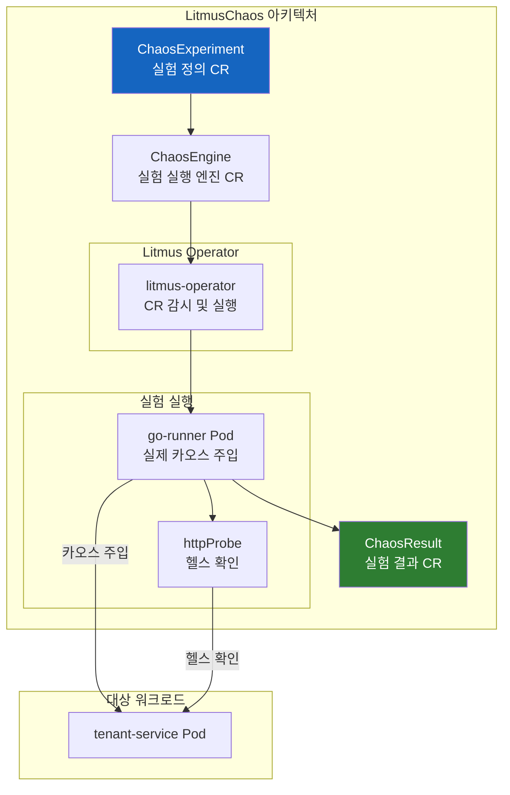
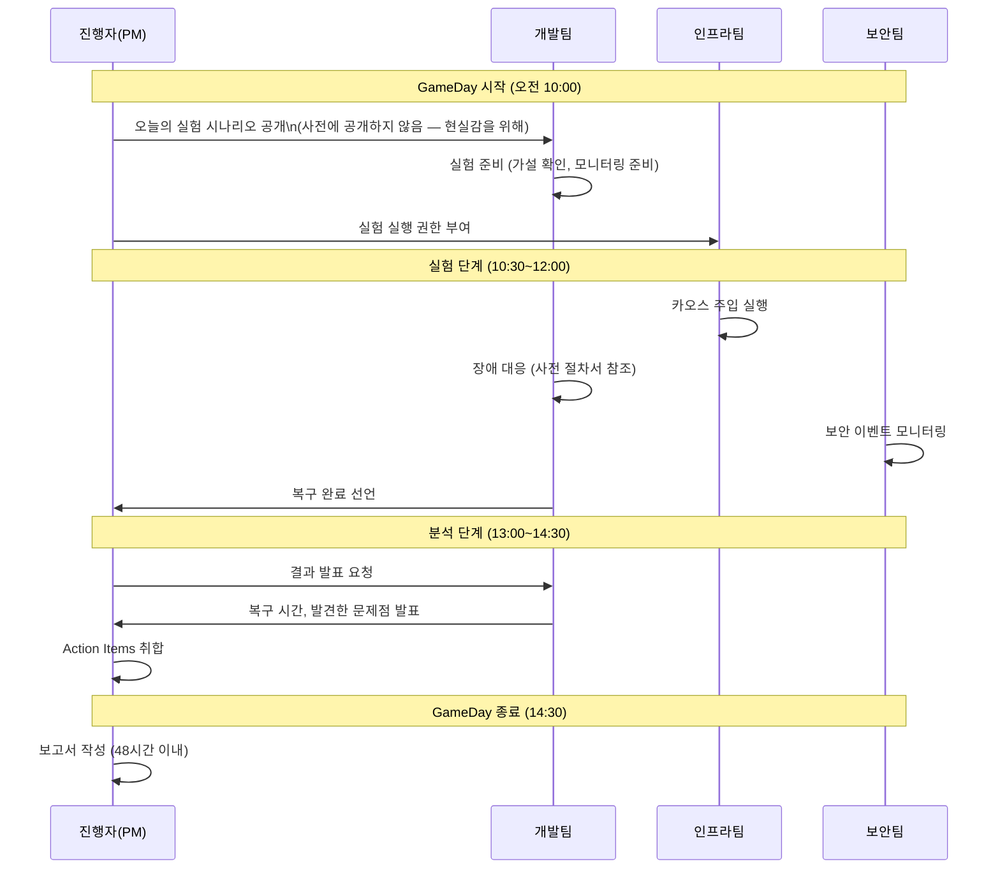

# 카오스 엔지니어링 — 의도적 장애로 복원력 검증하기

> **문서 ID**: ONBOARD-04-12
> **버전**: 1.0.0 | **작성일**: 2026-04-12 | **작성자**: Implementer (Sonnet)
> **학습 대상**: DevOps 엔지니어, SRE, 인프라 담당자 — 프로젝트 합류 후 3~4주 이내
> **예상 학습 시간**: 3~4시간
> **선행 문서**: `04-infrastructure/08-disaster-recovery.md`, `09-troubleshooting/04-incident-management.md`
> **CSAP 연관**: D-06 (침해사고 관리 — 탐지·처리·복구 훈련), D-10 (서비스 가용성 검증)

---

## 목차

1. [카오스 엔지니어링이란?](#1-카오스-엔지니어링이란)
   - 1.1 [장애를 일부러 만들어서 복구력을 검증한다](#11-장애를-일부러-만들어서-복구력을-검증한다)
   - 1.2 [Netflix Chaos Monkey와 GameDay 개념](#12-netflix-chaos-monkey와-gameday-개념)
   - 1.3 [이 프로젝트에서 카오스 엔지니어링이 필요한 이유](#13-이-프로젝트에서-카오스-엔지니어링이-필요한-이유)
2. [카오스 실험 계획 방법](#2-카오스-실험-계획-방법)
   - 2.1 [가설 기반 실험 설계](#21-가설-기반-실험-설계)
   - 2.2 [실험 범위 제한 — 프로덕션 vs 스테이징](#22-실험-범위-제한--프로덕션-vs-스테이징)
   - 2.3 [중지 조건(Stop Signal) 정의](#23-중지-조건stop-signal-정의)
3. [실제 카오스 실험 5종](#3-실제-카오스-실험-5종)
   - 3.1 [실험 1: Pod 강제 종료](#31-실험-1-pod-강제-종료)
   - 3.2 [실험 2: 네트워크 지연 주입](#32-실험-2-네트워크-지연-주입)
   - 3.3 [실험 3: CPU 부하 주입](#33-실험-3-cpu-부하-주입)
   - 3.4 [실험 4: DB 연결 차단](#34-실험-4-db-연결-차단)
   - 3.5 [실험 5: Redis 재시작](#35-실험-5-redis-재시작)
4. [LitmusChaos 소개](#4-litmuschaos-소개)
   - 4.1 [Kubernetes Native 카오스 도구](#41-kubernetes-native-카오스-도구)
   - 4.2 [실제 실험 파일 분석](#42-실제-실험-파일-분석)
   - 4.3 [보안 카오스 실험](#43-보안-카오스-실험)
5. [실험 결과 분석](#5-실험-결과-분석)
   - 5.1 [복구 시간 측정 (Grafana에서)](#51-복구-시간-측정-grafana에서)
   - 5.2 [기대와 다른 동작 발견 시 Action Items](#52-기대와-다른-동작-발견-시-action-items)
   - 5.3 [카오스 실험 보고서 작성](#53-카오스-실험-보고서-작성)
6. [카오스 실험 일정](#6-카오스-실험-일정)
   - 6.1 [월 1회 GameDay 운영 방법](#61-월-1회-gameday-운영-방법)
   - 6.2 [CSAP DR 훈련과의 통합](#62-csap-dr-훈련과의-통합)
7. [학습 체크리스트](#7-학습-체크리스트)
8. [다음 단계](#8-다음-단계)

---

## 1. 카오스 엔지니어링이란?

### 1.1 장애를 일부러 만들어서 복구력을 검증한다

카오스 엔지니어링을 처음 들으면 이상하게 느껴질 수 있습니다.

> "잘 돌아가는 시스템을 왜 일부러 망가뜨리나요?"

이 질문에 대한 핵심 답변은 이것입니다.

> "실제 장애는 가장 나쁜 순간에 예고 없이 찾아옵니다. 우리가 먼저 통제된 환경에서 장애를 만들어 시스템이 어떻게 반응하는지 알아야, 실제 장애 때 당황하지 않을 수 있습니다."

**직관적 비유**: 소방 훈련을 생각해보세요. 실제 화재가 나면 사람들이 패닉 상태에 빠집니다. 그래서 우리는 훈련을 합니다. 통제된 환경에서 대피 절차를 연습하고, 문제점(이 비상구는 잠겨 있었다, 저 직원은 훈련을 모르고 있었다)을 미리 발견합니다. 카오스 엔지니어링은 IT 시스템의 소방 훈련입니다.

**카오스 엔지니어링이 발견하는 것들**:

```
실제 발견 사례 (일반적):

  발견 1: "헬스체크가 통과해도 실제로는 서비스가 불능 상태였다"
    → 헬스체크 로직이 핵심 의존성을 확인하지 않고 있었음

  발견 2: "서킷 브레이커가 설정되어 있었지만 실제로 작동하지 않았다"
    → 설정 오류 (임계값이 너무 높게 설정됨)

  발견 3: "DB 장애 시 캐시로 계속 서비스하기로 했는데, 캐시가 DB 장애 시 함께 비워졌다"
    → 캐시 무효화 로직의 결함

  발견 4: "Pod이 죽으면 k8s가 자동으로 재시작한다고 알고 있었는데, 재시작이 30초나 걸렸다"
    → 헬스체크 설정이 잘못됨 (초기 지연 너무 짧음)
```

### 1.2 Netflix Chaos Monkey와 GameDay 개념

**Chaos Monkey (2011, Netflix)**:

Netflix는 2011년에 "Chaos Monkey"라는 프로그램을 만들었습니다. 이 프로그램은 프로덕션 환경에서 무작위로 서버 인스턴스를 종료합니다. Netflix가 이 프로그램을 만든 이유는 단 하나입니다.

> "서버가 언제든 죽을 수 있다는 것을 알기 때문에, 우리 서비스는 이를 견뎌낼 수 있도록 설계되어야 한다. 두려움보다 확신이 필요하다."

이 철학에서 출발해 카오스 엔지니어링이라는 분야가 생겼습니다.

**GameDay**:

GameDay는 팀 전체가 모여 카오스 실험을 실행하고 대응하는 행사입니다. 단순한 자동화 실험과 달리, GameDay는 다음을 목표로 합니다.

- 팀이 장애 대응 절차를 실제로 연습
- 사람 간 소통(누가 무엇을 해야 하나)을 연습
- 문서화된 절차와 실제 동작의 차이 발견
- 팀의 장애 대응 역량 향상

💡 GameDay는 "우리가 이미 알고 있는 것을 재확인"하는 자리가 아닙니다. "우리가 몰랐던 약점"을 발견하는 자리입니다.

### 1.3 이 프로젝트에서 카오스 엔지니어링이 필요한 이유

공공기관 SaaS에서 카오스 엔지니어링이 특히 중요한 이유:

**이유 1: 공공기관 서비스는 장애 허용 범위가 매우 좁다**

전자결재, 민원 서비스, 예산 집행 시스템이 장애 나면 국민 업무가 마비됩니다. 99.9% 가용성(월 43분 다운타임)도 공공기관에서는 수용하기 어려울 수 있습니다.

**이유 2: CSAP D-06 침해사고 관리 요건**

CSAP는 침해사고 대응 절차를 문서화하는 것만으로는 부족합니다. 실제 훈련(Drill)을 통해 절차의 유효성을 검증해야 합니다. 카오스 실험은 이 훈련의 기술적 구현입니다.

**이유 3: 마이크로서비스 의존성 복잡성**

이 프로젝트는 17개 서비스가 서로 의존합니다. AI Service, Auth Service, Tenant Service, Audit Service... 하나가 느려지면 다른 것도 영향을 받을 수 있습니다. 서킷 브레이커(`@public-saas/circuit-breaker`)가 올바르게 동작하는지 실험으로 확인해야 합니다.

**이유 4: 이미 실험 파일이 있다**

이 프로젝트에는 이미 카오스 실험 파일이 준비되어 있습니다.
- `infra/chaos/experiments/network-chaos.yaml` — 네트워크 지연 및 패킷 손실 실험
- `infra/security-chaos/security-chaos-experiments.yaml` — 보안 통제 검증 실험

이 문서는 이 파일들을 어떻게 실행하고 결과를 해석하는지 설명합니다.

---

## 2. 카오스 실험 계획 방법

### 2.1 가설 기반 실험 설계

카오스 실험은 무작위로 망가뜨리는 것이 아닙니다. 과학적 실험처럼 **가설을 세우고, 검증하고, 결과를 분석**합니다.

**가설 작성 템플릿**:

```
"[장애 조건]이 발생했을 때, 시스템은 [기대하는 동작]을 [시간 제한] 이내에 수행할 것이다."
```

**좋은 가설 예시**:

```
가설 1 (서킷 브레이커):
  "AI Service가 5초 이상 응답하지 않을 때,
   서킷 브레이커가 40초 이내에 OPEN 상태로 전환되고,
   ai-agent.handler.ts는 폴백 응답을 반환할 것이다."

가설 2 (그레이스풀 셧다운):
  "tenant-service Pod에 SIGTERM이 전송되었을 때,
   진행 중인 모든 HTTP 요청이 30초 이내에 완료되고,
   클라이언트는 502 오류를 받지 않을 것이다."

가설 3 (레이트 리밋):
  "Redis가 재시작될 때,
   rate-limit 미들웨어는 Redis 연결 오류를 감지하고,
   서비스 가용성을 유지한 채 rate limiting을 비활성화할 것이다."

가설 4 (헬스체크):
  "DB 연결이 차단되었을 때,
   /health/ready 엔드포인트가 503을 반환하고,
   k8s가 해당 Pod로의 트래픽 라우팅을 60초 이내에 중단할 것이다."
```

**나쁜 가설 예시**:

```
❌ "서버가 죽으면 재시작될 것이다."
   → 너무 모호함. 얼마나 걸리나? 어떤 오류가 발생하나?

❌ "시스템이 장애를 잘 처리할 것이다."
   → 측정 가능한 기준이 없음.
```

### 2.2 실험 범위 제한 — 프로덕션 vs 스테이징

```mermaid
graph TD
    subgraph "실험 승인 프로세스"
        A[실험 계획 작성] --> B{프로덕션\n실험인가?}
        B -- "Yes" --> C[팀장 + 아키텍처\n위원회 승인 필수]
        C --> D{SLO 버퍼\n충분한가?]
        D -- "에러 버짓 > 30%" --> E[시간 창 예약\n점검 공지 발송]
        D -- "에러 버짓 ≤ 30%" --> F[❌ 실험 중단\n에러 버짓 부족]
        B -- "No" --> G[스테이징 실험\n팀 내 합의만 필요]
        E --> H[실험 실행]
        G --> H
        H --> I[결과 기록]
        I --> J[Action Items 생성]
    end

    style F fill:#B71C1C,color:#fff
    style H fill:#1565C0,color:#fff
```

**스테이징 vs 프로덕션 실험 기준**:

| 기준 | 스테이징 | 프로덕션 |
|-----|---------|---------|
| 승인 | 팀 내 합의 | 팀장 + 아키텍처 위원회 |
| 사전 공지 | 팀에게만 | 모든 이해관계자 (기관 담당자 포함) |
| 실행 시간 | 언제든 | 업무 시간 외 권장 |
| 에러 버짓 확인 | 불필요 | 필수 (30% 이상 남아있어야) |
| 롤백 계획 | 권장 | 필수 |
| 첫 실험 원칙 | - | 반드시 스테이징 먼저 |

💡 **초보자 원칙**: 처음에는 반드시 스테이징에서만 실험하세요. 프로덕션 카오스 실험은 스테이징에서 수십 번 성공한 후에 팀 전체 합의 하에 진행합니다.

### 2.3 중지 조건(Stop Signal) 정의

모든 카오스 실험은 시작 전에 "이 상황이 되면 즉시 중단한다"는 중지 조건을 명시해야 합니다.

**중지 조건 예시**:

```yaml
# 실험 계획서 필수 항목
stopConditions:
  # 조건 1: SLO 에러 버짓 급감
  - type: error_budget
    threshold: "에러율 > 1% (5분 기준)"
    action: 즉시 실험 중단 + 롤백

  # 조건 2: 예상 복구 시간 초과
  - type: recovery_timeout
    threshold: "실험 시작 후 5분 이내 복구 미확인"
    action: 즉시 실험 중단 + 팀장 알림

  # 조건 3: 예상치 못한 범위로 영향 확산
  - type: blast_radius
    threshold: "대상 서비스 외 서비스에 영향 발생"
    action: 즉시 실험 중단 + 인시던트 선언

  # 조건 4: 보안 경보 발생
  - type: security_alert
    threshold: "CSAP D-06 감사 로그에 비정상 패턴"
    action: 즉시 실험 중단 + 보안 팀 알림
```

**중단 절차** (Stop Signal 발동 시):

```bash
# 1. LitmusChaos 실험 즉시 중단
kubectl patch chaosengine <engine-name> \
  --patch '{"spec":{"engineState":"stop"}}' \
  --type merge \
  -n staging

# 2. 임시 NetworkPolicy 롤백 (DB 연결 차단 실험의 경우)
kubectl delete networkpolicy chaos-db-block -n staging

# 3. 상태 확인
kubectl get pods -n staging
kubectl get endpoints -n staging
```

---

## 3. 실제 카오스 실험 5종

### 3.1 실험 1: Pod 강제 종료

**가설**: "tenant-service Pod이 강제 종료될 때, k8s ReplicaSet이 60초 이내에 새 Pod를 시작하고 서비스가 복구된다."

**실행 방법**:

```bash
# 현재 실행 중인 tenant-service Pod 확인
kubectl get pods -n staging -l app.kubernetes.io/name=tenant-service

# Pod 강제 종료 (카오스 주입)
kubectl delete pod -n staging -l app.kubernetes.io/name=tenant-service

# 복구 과정 모니터링 (새 창에서 실행)
watch -n2 kubectl get pods -n staging -l app.kubernetes.io/name=tenant-service
```

**예상 동작 시퀀스**:

```
T+0초:   Pod 삭제 명령 실행
T+1초:   k8s가 Pod 종료 감지, ReplicaSet이 새 Pod 생성 시작
T+5~15초: 새 Pod 이미지 풀 및 컨테이너 시작
T+15~30초: readiness probe 통과 (mesh-ready /health/ready → 200)
T+30초:  새 Pod가 Service 엔드포인트에 등록, 트래픽 라우팅 재개
T+60초:  이전 Pod 완전 종료 (Terminating → 삭제)
```

**검증 방법**:

```bash
# 복구 시간 측정 (Grafana에서 또는 kubectl events로)
kubectl get events -n staging --sort-by=.metadata.creationTimestamp | grep tenant-service

# 서비스 가용성 확인 (외부에서 지속적으로 요청 보내기)
while true; do
  curl -s -o /dev/null -w "%{http_code}\n" \
    http://tenant-service.staging.svc.cluster.local/health/live
  sleep 1
done
```

**예상 결과**: Pod 종료 후 약 30~45초 동안 일부 요청이 실패할 수 있습니다. 이 시간을 단축하려면 `minReadySeconds`, `readinessProbe` 설정을 조정합니다.

**실패 시 조사 포인트**:
- `kubectl describe pod <new-pod>` — 이미지 풀 오류, OOM 등 확인
- `kubectl logs <new-pod>` — 애플리케이션 시작 오류 확인
- `kubectl get hpa -n staging` — HPA 설정 확인

### 3.2 실험 2: 네트워크 지연 주입

이 실험은 이미 `infra/chaos/experiments/network-chaos.yaml`에 정의되어 있습니다.

**가설**: "tenant-service에 300ms 네트워크 지연이 발생할 때, 업스트림 서비스의 타임아웃 설정(1000ms)에 의해 요청이 실패하지 않고 처리된다."

**LitmusChaos를 통한 실험 실행**:

```bash
# 1. 사전 확인 — 현재 응답 시간 기준선 측정
kubectl exec -n staging deploy/api-gateway -- \
  curl -s -w "%{time_total}" \
  http://tenant-service.staging.svc.cluster.local/api/tenants

# 2. 네트워크 지연 실험 적용 (network-chaos.yaml — 300ms 지연)
kubectl apply -f infra/chaos/experiments/network-chaos.yaml

# 3. ChaosEngine 상태 확인
kubectl get chaosengine -n staging
kubectl describe chaosengine network-latency-engine -n staging

# 4. 실험 중 응답 시간 모니터링
kubectl exec -n staging deploy/api-gateway -- \
  bash -c 'while true; do
    curl -s -w "응답시간: %{time_total}초\n" \
    http://tenant-service.staging.svc.cluster.local/api/tenants;
    sleep 2;
  done'
```

**실제 실험 파일 내용 요약** (`infra/chaos/experiments/network-chaos.yaml`):

```yaml
# 실험 3: Network Latency 300ms
apiVersion: litmuschaos.io/v1alpha1
kind: ChaosExperiment
metadata:
  name: network-latency-tenant
  namespace: staging
spec:
  definition:
    env:
      - name: APP_LABEL
        value: "app.kubernetes.io/name=tenant-service"
      - name: NETWORK_LATENCY
        value: "300"  # 300ms 지연
      - name: JITTER
        value: "50"   # ±50ms 변동
      - name: TOTAL_CHAOS_DURATION
        value: "60"   # 60초 동안 실험
```

**검증 포인트**:
- Grafana에서 `saas_http_request_duration_seconds{service="tenant-service"}` 확인
- 서킷 브레이커 상태: `saas_circuit_breaker_state{service="api-gateway"}` 확인
- 에러율 변화: `saas_http_requests_total{status_code=~"5.."}` 확인

### 3.3 실험 3: CPU 부하 주입

**가설**: "auth-service Pod에 CPU 80% 부하가 발생할 때, HPA(Horizontal Pod Autoscaler)가 5분 이내에 Pod를 2개에서 4개로 확장한다."

**stress-ng를 이용한 직접 부하 주입**:

```bash
# auth-service Pod 이름 확인
AUTH_POD=$(kubectl get pod -n staging \
  -l app.kubernetes.io/name=auth-service \
  -o jsonpath='{.items[0].metadata.name}')

# Pod 내부에서 CPU 부하 생성 (4코어 기준 80% 부하, 120초)
kubectl exec -n staging $AUTH_POD -- \
  stress-ng --cpu 2 --cpu-load 80 --timeout 120s

# 다른 창에서 HPA 모니터링
watch -n5 kubectl get hpa -n staging
```

**HPA 동작 확인**:

```bash
# HPA 상세 상태 확인
kubectl describe hpa auth-service-hpa -n staging

# 예상 출력:
# Current replicas: 2
# Desired replicas: 4  ← HPA가 확장 결정
# Conditions:
#   AbleToScale: True
#   ScalingActive: True (CPU: 80% > 70% 임계값)
```

**이 실험에서 확인할 것들**:
- HPA 확장이 실제로 발생하는가
- 확장된 Pod들이 트래픽을 고르게 받는가 (Linkerd `linkerd viz tap` 활용)
- 부하가 줄어들면 Scale-In이 발생하는가 (cooldown period 확인)

### 3.4 실험 4: DB 연결 차단

**가설**: "tenant-service와 PostgreSQL 사이의 네트워크가 차단될 때, /health/ready 엔드포인트가 503을 반환하고 k8s가 해당 Pod로의 트래픽을 60초 이내에 중단한다."

⚠️ **주의**: 이 실험은 반드시 스테이징 환경에서만 실행하세요. 잘못 실행하면 데이터 손실이 발생할 수 있습니다.

```bash
# 임시 NetworkPolicy로 DB 연결 차단 (tenant-service → postgres)
cat <<EOF | kubectl apply -f -
apiVersion: networking.k8s.io/v1
kind: NetworkPolicy
metadata:
  name: chaos-db-block
  namespace: staging
spec:
  podSelector:
    matchLabels:
      app.kubernetes.io/name: tenant-service
  policyTypes:
    - Egress
  egress:
    # postgres로의 연결만 차단 (5432 포트)
    # 다른 연결(Redis, 다른 서비스)은 유지
    - ports:
        - port: 5432
          protocol: TCP
      to: []  # 빈 목록 = 차단
EOF

# 헬스체크 응답 확인
TENANT_POD=$(kubectl get pod -n staging \
  -l app.kubernetes.io/name=tenant-service \
  -o jsonpath='{.items[0].metadata.name}')

kubectl exec -n staging $TENANT_POD -- \
  curl -s http://localhost:3000/health/ready

# 예상 응답:
# {"status":"unhealthy","checks":{"database":{"status":"unhealthy","error":"Connection refused"}}}
# HTTP 503

# k8s Endpoints에서 제거 확인 (트래픽 차단)
watch -n3 kubectl get endpoints tenant-service -n staging

# 실험 종료 — NetworkPolicy 삭제
kubectl delete networkpolicy chaos-db-block -n staging
```

**`@public-saas/health` 패키지의 역할**:

```typescript
// platform/packages/health/src/health-checker.ts
// DB 연결 확인 로직 (CommonCheckers.database)
export const CommonCheckers = {
  database: (prismaClient: PrismaClient): DependencyChecker => async () => {
    try {
      await prismaClient.$queryRaw`SELECT 1`;
      return { status: 'healthy' };
    } catch (error) {
      // DB 연결 실패 시 unhealthy 반환 → /health/ready가 503 반환
      return { status: 'unhealthy', error: 'DB 연결 실패' };
    }
  },
};
```

### 3.5 실험 5: Redis 재시작

**가설**: "Redis가 재시작될 때, rate-limit 미들웨어는 Redis 연결 실패를 감지하고 서비스 가용성을 유지한 채 rate limiting을 비활성화한다. Redis 복구 후 자동으로 rate limiting이 재활성화된다."

```bash
# Redis Pod 이름 확인
REDIS_POD=$(kubectl get pod -n staging \
  -l app.kubernetes.io/name=redis \
  -o jsonpath='{.items[0].metadata.name}')

# 실험 전 — rate limiting 동작 확인
for i in {1..10}; do
  curl -s -o /dev/null -w "HTTP %{http_code}\n" \
    -H "Authorization: Bearer $TEST_TOKEN" \
    http://api-gateway.staging.svc.cluster.local/api/tenants
done

# Redis 재시작 (카오스 주입)
kubectl delete pod -n staging $REDIS_POD

# Redis 재시작 중 서비스 가용성 확인 (다른 창에서)
while true; do
  STATUS=$(curl -s -o /dev/null -w "%{http_code}" \
    -H "Authorization: Bearer $TEST_TOKEN" \
    http://api-gateway.staging.svc.cluster.local/api/tenants)
  echo "$(date +%H:%M:%S) HTTP $STATUS"
  sleep 1
done
```

**`@public-saas/rate-limit` graceful fallback 동작**:

```typescript
// platform/packages/rate-limit/src/index.ts
// Redis 연결 실패 시 rate limiting 비활성화 (가용성 우선)
async function getRedis(): Promise<RedisLike | null> {
  try {
    const client = redisModule.createClient({ url: REDIS_URL });
    await client.connect();
    return client;
  } catch {
    // ✅ Redis 연결 실패 시 null 반환 → rate limiting 비활성화
    // 서비스는 계속 정상 동작 (요청 처리)
    return null;
  }
}
```

**예상 결과**:
- Redis 재시작 중: 모든 요청이 정상 처리됨 (rate limiting 임시 비활성화)
- Redis 복구 후: rate limiting 자동 재활성화

---

## 4. LitmusChaos 소개

### 4.1 Kubernetes Native 카오스 도구

이 프로젝트는 LitmusChaos를 카오스 엔지니어링 도구로 사용합니다. LitmusChaos는 CNCF(Cloud Native Computing Foundation) 프로젝트로, Kubernetes 클러스터 내에서 카오스 실험을 선언적으로 정의하고 실행합니다.

**LitmusChaos를 선택한 이유**:

| 기준 | LitmusChaos | Chaos Mesh |
|-----|------------|-----------|
| CNCF 프로젝트 | 졸업(Graduated) | 인큐베이팅 |
| 실험 종류 | 200+ | 100+ |
| 공공기관 적합성 | 온프레미스 완전 지원 | 온프레미스 완전 지원 |
| 보안 실험 | 지원 | 제한적 |
| 문서화 | 풍부 | 보통 |

**LitmusChaos 구성 요소**:



**LitmusChaos 설치 확인**:

```bash
# LitmusChaos 설치 상태 확인
kubectl get pods -n litmus

# 예상 출력:
# litmus-operator-xxx       1/1 Running
# chaos-exporter-xxx        1/1 Running

# 사용 가능한 실험 목록
kubectl get chaosexperiment -n litmus
```

### 4.2 실제 실험 파일 분석

`infra/chaos/experiments/network-chaos.yaml`의 구조를 상세히 살펴보겠습니다.

```yaml
# --- ChaosExperiment: 실험 정의 ---
apiVersion: litmuschaos.io/v1alpha1
kind: ChaosExperiment
metadata:
  name: network-latency-tenant
  namespace: staging
  labels:
    app.kubernetes.io/part-of: chaos-engineering
    experiment-type: network
spec:
  definition:
    scope: Namespaced          # 네임스페이스 범위로 제한
    image: "litmuschaos/go-runner:3.0.0"  # 카오스 주입 실행 컨테이너
    env:
      - name: APP_NAMESPACE
        value: "staging"       # 대상 네임스페이스
      - name: APP_LABEL
        value: "app.kubernetes.io/name=tenant-service"  # 대상 Pod 선택
      - name: TOTAL_CHAOS_DURATION
        value: "60"            # 60초 동안 카오스 유지
      - name: NETWORK_LATENCY
        value: "300"           # 300ms 추가 지연
      - name: JITTER
        value: "50"            # ±50ms 변동
      - name: NETWORK_INTERFACE
        value: "eth0"          # 대상 네트워크 인터페이스

---
# --- ChaosEngine: 실험 실행 ---
apiVersion: litmuschaos.io/v1alpha1
kind: ChaosEngine
metadata:
  name: network-latency-engine
  namespace: staging
spec:
  engineState: "active"        # active = 즉시 실행
  appinfo:
    appns: "staging"
    applabel: "app.kubernetes.io/name=tenant-service"
    appkind: "deployment"
  experiments:
    - name: network-latency-tenant
      spec:
        probe:
          # httpProbe: 실험 중 헬스체크 (이것이 실패하면 실험도 Fail)
          - name: "tenant-service-timeout"
            type: "httpProbe"
            httpProbe/inputs:
              url: "http://tenant-service.staging.svc.cluster.local/health"
              method:
                get:
                  criteria: "=="
                  responseCode: "200"  # 200이면 서비스 정상
            mode: "Continuous"
            runProperties:
              probeTimeout: 15
              interval: 10
              retry: 5
```

**핵심 이해 포인트**: `httpProbe`는 카오스 실험 중에 서비스가 여전히 정상적으로 응답하는지 지속적으로 확인합니다. 만약 서비스가 300ms 지연 중에 헬스체크 응답을 하지 못하면, 그것이 바로 "가설이 틀렸다"는 증거가 됩니다.

### 4.3 보안 카오스 실험

`infra/security-chaos/security-chaos-experiments.yaml`은 보안 통제의 복원력을 검증합니다. 일반적인 서비스 가용성 실험과 다른 접근법입니다.

**보안 카오스 실험 3종**:

```yaml
# 실험 1: NetworkPolicy 삭제 후 Kyverno 자동 복구 검증
# "NetworkPolicy가 삭제되면 60초 이내에 Kyverno가 자동으로 복구한다"
- name: security-netpolicy-resilience
  env:
    - name: POLICY_NAME
      value: default-deny-all
    - name: EXPECTED_RECOVERY_TIME
      value: "60"  # Kyverno가 60초 이내 복구 기대

# 실험 2: RBAC 권한 탈취 시뮬레이션
# "낮은 권한 계정으로 높은 권한 API를 호출하면 BLOCKED 되어야 한다"
- name: security-rbac-escalation-test
  env:
    - name: EXPECTED_RESULT
      value: "BLOCKED"

# 실험 3: PSS(Pod Security Standards) 위반 Pod 생성 시도
# "privileged: true Pod 생성 시도가 REJECTED 되어야 한다"
- name: security-pss-violation-test
  env:
    - name: PRIVILEGED_POD
      value: "true"
    - name: EXPECTED_RESULT
      value: "REJECTED"
```

이 실험들은 **보안 통제가 실제로 작동하는지** 검증합니다. "우리는 NetworkPolicy를 설정했다"가 아닌, "NetworkPolicy가 삭제되어도 Kyverno가 즉시 복구한다"는 것을 증명합니다.

---

## 5. 실험 결과 분석

### 5.1 복구 시간 측정 (Grafana에서)

카오스 실험 결과를 정량적으로 측정하기 위해 Grafana를 활용합니다.

**주요 측정 지표**:

```
1. MTTR (Mean Time To Recovery, 평균 복구 시간)
   측정: 카오스 주입 시점 → 서비스 정상화 시점

2. 에러율 변화
   PromQL: rate(saas_http_requests_total{status_code=~"5.."}[1m])

3. 레이턴시 변화
   PromQL: histogram_quantile(0.99, rate(saas_http_request_duration_seconds_bucket[5m]))

4. 서킷 브레이커 상태
   PromQL: saas_circuit_breaker_state{state="OPEN"}

5. LitmusChaos 실험 결과
   PromQL: litmuschaos_experiment_verdict{verdict="Pass"}
```

**Grafana 대시보드에서 카오스 실험 구간 표시**:

```bash
# 실험 시작 시 Grafana Annotation 추가
curl -X POST http://grafana.monitoring.svc.cluster.local/api/annotations \
  -H "Content-Type: application/json" \
  -d '{
    "time": '$(date +%s%3N)',
    "tags": ["chaos", "network-latency"],
    "text": "카오스 실험 시작: tenant-service 네트워크 300ms 지연"
  }'

# 실험 종료 시 Annotation 추가
curl -X POST http://grafana.monitoring.svc.cluster.local/api/annotations \
  -H "Content-Type: application/json" \
  -d '{
    "time": '$(date +%s%3N)',
    "tags": ["chaos", "network-latency", "end"],
    "text": "카오스 실험 종료: 복구 확인"
  }'
```

### 5.2 기대와 다른 동작 발견 시 Action Items

실험 결과가 가설과 다를 때는 즉시 Action Item을 생성합니다.

```mermaid
graph TD
    A[실험 결과 분석] --> B{가설과\n결과가 일치하는가?}
    B -- "일치" --> C[✅ 복원력 확인\n실험 보고서 작성]
    B -- "불일치" --> D[원인 분석]
    D --> E{근본 원인은?}
    E -- "설정 오류" --> F[즉시 수정\n(설정값, 타임아웃 등)]
    E -- "코드 버그" --> G[버그 티켓 생성\n다음 스프린트 우선 처리]
    E -- "아키텍처 결함" --> H[RFC 제안\n팀 토론 후 설계 변경]
    F --> I[수정 후 재실험]
    G --> I
    H --> I
    I --> A

    style C fill:#2E7D32,color:#fff
    style H fill:#E65100,color:#fff
```

**Action Item 예시**:

```markdown
## 카오스 실험 Action Item

### 실험: tenant-service Pod 강제 종료 (2026-04-15)

**가설**: 60초 이내 복구
**실제 결과**: 92초 소요

**원인 분석**:
  - readinessProbe.initialDelaySeconds = 30초 (너무 길었음)
  - 이미지 풀 시간 약 20초 (캐시 없는 상태)
  - 총 92초 = 이미지 풀 20초 + 컨테이너 시작 15초 + readiness 30초 + 여유 27초

**Action Items**:
  - [ ] AUTH-123: readinessProbe.initialDelaySeconds를 30→10으로 축소
  - [ ] AUTH-124: k8s 노드에 이미지 프리풀(pre-pull) 설정 추가
  - [ ] AUTH-125: HPA minReplicas를 1→2로 변경 (단일 실패 지점 제거)

**담당자**: @backend-team
**기한**: 다음 스프린트 (2026-04-22)
**재실험 일정**: 2026-04-29
```

### 5.3 카오스 실험 보고서 작성

월 1회 GameDay 이후 공식 보고서를 작성합니다. CSAP D-06 요건에 따라 침해사고 대응 훈련 기록으로 보관합니다.

**보고서 템플릿**:

```markdown
# 카오스 엔지니어링 실험 보고서

## 실험 정보
- **날짜**: 2026-04-15
- **참여자**: [이름 목록]
- **환경**: staging / production
- **실험 도구**: LitmusChaos 3.0

## 실험 결과 요약

| 실험 | 가설 | 결과 | 비고 |
|-----|------|------|------|
| Pod 강제 종료 | 60초 이내 복구 | ❌ 92초 소요 | readiness 설정 문제 |
| 네트워크 300ms 지연 | 서비스 정상 동작 | ✅ 에러율 0.1% 이하 | 서킷 브레이커 정상 |
| Redis 재시작 | 가용성 유지 | ✅ 요청 처리 지속 | graceful fallback 정상 |

## Action Items
- [이슈 링크 목록]

## CSAP D-06 준수 확인
- [ ] 실험 감사 로그 기록 완료
- [ ] 실험 보고서 보안 팀 공유
- [ ] 취약점 발견 시 보안 담당자 즉시 보고

## 다음 실험 예정일
2026-05-13 (월 1회 GameDay)
```

---

## 6. 카오스 실험 일정

### 6.1 월 1회 GameDay 운영 방법

**GameDay 진행 순서** (약 3시간):



**GameDay 준비 체크리스트** (1주일 전):

```markdown
## GameDay 준비 체크리스트

### 환경 준비
- [ ] 스테이징 환경 최신 상태 확인
- [ ] LitmusChaos Operator 동작 확인: `kubectl get pods -n litmus`
- [ ] Grafana 대시보드 접속 확인
- [ ] 실험 파일 최신화: `infra/chaos/experiments/`

### 시나리오 준비
- [ ] 이번 달 실험 시나리오 선택 (3~5개)
- [ ] 각 실험의 가설 및 중지 조건 작성
- [ ] 롤백 절차 확인 및 문서화

### 참여자 준비
- [ ] 참여자 전원에게 일시 공지 (시나리오는 비공개)
- [ ] 온콜 담당자 확인 (실험 중 실제 장애 발생 시 대응)
- [ ] 보안 팀에게 보안 카오스 실험 사전 통보

### 사후 처리
- [ ] 보고서 작성 담당자 지정
- [ ] Action Items 추적 시스템 (GitLab/Gitea 이슈) 준비
```

**월별 실험 로테이션 예시**:

| 월 | 주요 실험 | 목표 |
|---|--------|------|
| 4월 | Pod 강제 종료 | 기본 복원력 검증 |
| 5월 | 네트워크 지연 | 서킷 브레이커 동작 검증 |
| 6월 | DB 연결 차단 | 헬스체크 + 캐시 폴백 검증 |
| 7월 | 보안 카오스 | 보안 통제 복원력 검증 |
| 8월 | CPU 부하 + HPA | 자동 확장 검증 |
| 9월 | 복합 시나리오 | 동시 다발 장애 대응 |

### 6.2 CSAP DR 훈련과의 통합

CSAP D-06(침해사고 관리)은 단순한 문서화를 넘어 **실제 훈련의 증빙**을 요구합니다. 카오스 엔지니어링 GameDay를 DR 훈련과 통합하면 두 가지를 동시에 충족합니다.

**통합 훈련 계획 (연 2회)**:

```
1분기 훈련 (2월):
  목표: CSAP D-06 침해사고 탐지 및 대응 훈련
  형식: 보안 카오스 실험 (security-chaos-experiments.yaml 실행)
  증빙: 실험 로그 + 보고서 → CSAP 감사 자료로 보관

3분기 훈련 (8월):
  목표: CSAP D-10 가용성 복구 훈련 (DR 시뮬레이션)
  형식: 복합 시나리오 (DB 장애 + 서비스 Pod 장애 동시)
  증빙: 복구 시간 측정 + RTO/RPO 검증 보고서
```

**CSAP 감사 증빙 자료 목록**:

```
감사 증빙:
  1. 카오스 실험 계획서 (가설, 범위, 중지 조건)
  2. 실험 실행 로그 (LitmusChaos ChaosResult CR)
  3. Grafana 스크린샷 (복구 시간 측정)
  4. 실험 보고서 (Action Items 포함)
  5. Action Items 처리 결과 (GitLab/Gitea 이슈 종료 확인)

보관 위치: .claude/audit.jsonl (CSAP D-06 감사 로그)
보관 기간: 최소 1년 (CSAP D-06 요건)
```

**LitmusChaos Prometheus Alert** (`security-chaos-alerts`):

```yaml
# infra/security-chaos/security-chaos-experiments.yaml 에서 발췌
- alert: SecurityChaosExperimentFailed
  expr: litmuschaos_experiment_verdict{verdict="Fail",app="security-chaos"} > 0
  labels:
    severity: critical
    csap_domain: D-06
  annotations:
    summary: "보안 카오스 실험 실패: 즉시 조사 필요"
    # 보안 통제가 실제로 실패했다는 의미이므로 즉시 대응 필요
```

---

## 7. 학습 체크리스트

이 문서를 학습한 후 다음 항목들을 스스로 확인하세요.

**개념 이해**
- [ ] 카오스 엔지니어링이 "무작위 파괴"가 아닌 "가설 기반 실험"임을 설명할 수 있다
- [ ] GameDay가 무엇이고 왜 팀 전체가 참여해야 하는지 말할 수 있다
- [ ] 이 프로젝트에서 카오스 실험이 CSAP D-06과 어떻게 연결되는지 설명할 수 있다

**실험 계획**
- [ ] 좋은 가설을 작성할 수 있다 ("X 상황에서 Y 동작이 Z 시간 이내에 발생한다")
- [ ] 중지 조건 3가지 이상을 말할 수 있다
- [ ] 스테이징과 프로덕션 실험의 승인 기준 차이를 설명할 수 있다

**실험 실행**
- [ ] `kubectl delete pod`로 Pod 강제 종료 실험을 실행하고 복구를 모니터링할 수 있다
- [ ] `infra/chaos/experiments/network-chaos.yaml`을 적용하고 ChaosEngine 상태를 확인할 수 있다
- [ ] 임시 NetworkPolicy로 DB 연결을 차단하고 복구할 수 있다 (스테이징에서)
- [ ] 실험 종료 후 리소스가 올바르게 정리되었는지 확인할 수 있다

**결과 분석**
- [ ] Grafana에서 카오스 실험 구간의 에러율과 레이턴시를 확인할 수 있다
- [ ] 가설과 다른 결과가 나왔을 때 Action Item을 작성할 수 있다
- [ ] CSAP D-06 감사 증빙 자료 목록 5가지를 말할 수 있다

**실습**
- [ ] `infra/chaos/` 디렉토리의 YAML 파일을 읽고 어떤 실험인지 설명할 수 있다
- [ ] `infra/security-chaos/security-chaos-experiments.yaml`에서 실험 3개의 목적을 말할 수 있다
- [ ] `kubectl get chaosresult -n staging`으로 이전 실험 결과를 확인해봤다

---

## 8. 다음 단계

이 문서를 읽은 후 다음 순서로 학습을 이어가세요.

1. **`04-infrastructure/08-disaster-recovery.md`** — DR 훈련과 카오스 실험의 연계 방법 복습
2. **`09-troubleshooting/04-incident-management.md`** — 카오스 실험 중 예상치 못한 인시던트 발생 시 대응 방법
3. **`02-architecture/09-platform-engineering.md`** — `@public-saas/circuit-breaker`와 `@public-saas/health`가 카오스 실험에서 어떻게 동작하는지 이해
4. **실습**: 스테이징 환경에서 실험 1(Pod 강제 종료)을 혼자 실행해보세요. 복구 시간을 측정하고 팀에 공유하세요.

---

*Design Ref: MTU-N50 Design §카오스 실험 시나리오 #3, #4 | infra/chaos/experiments/, infra/security-chaos/*
*Plan SC: FR-N50.3, FR-N157.1~FR-N157.6*
*CSAP 연관: D-06 (침해사고 관리 훈련), D-10 (서비스 가용성 검증)*
