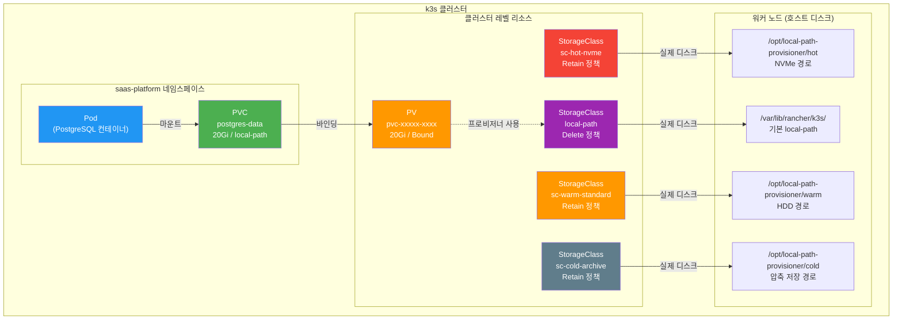
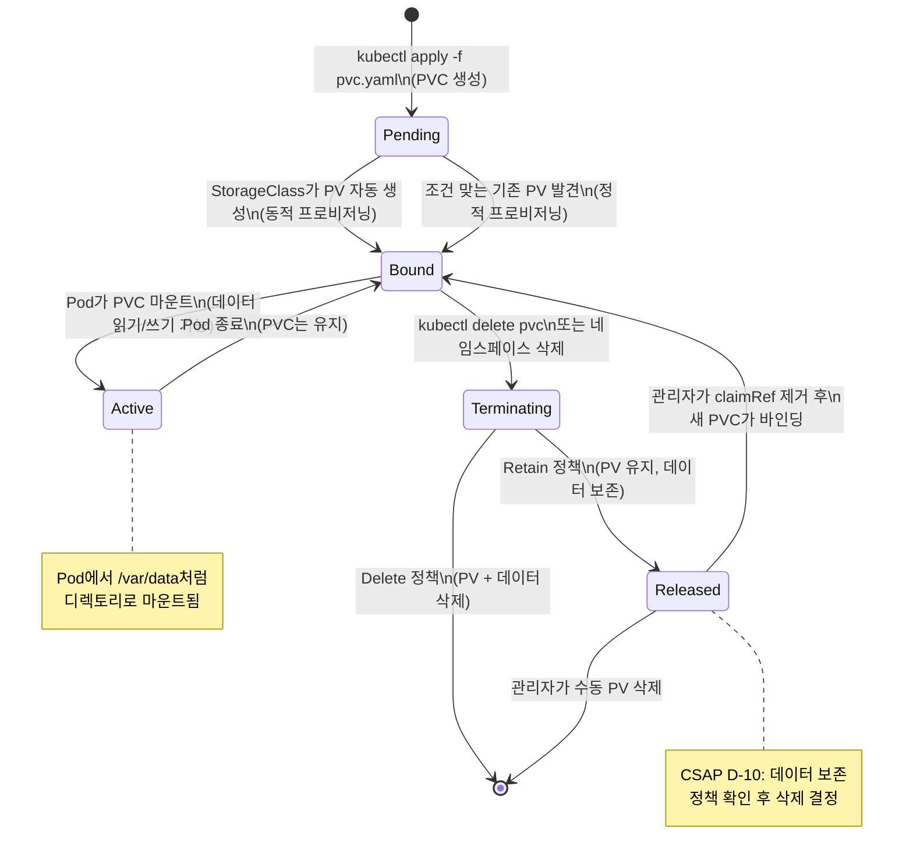

# Kubernetes 스토리지 관리 — PVC, StorageClass, 용량 계획

> **문서 ID**: ONBOARD-04-INFRA-14
> **버전**: 1.0.0 | **작성일**: 2026-04-12 | **작성자**: Implementer (Sonnet)
> **대상**: 신규 인프라 엔지니어, DevOps 담당자, 운영 담당자
> **CSAP**: D-10 (정보처리 시설 관리), D-06 (침해사고 관리 — 감사 로그 보존), D-09 (암호화 — 저장 암호화)
> **선행 문서**:
>   - `04-infrastructure/kubernetes/01-k3s-basics.md` (k3s 기초)
>   - `04-infrastructure/components/03-postgresql.md` (PostgreSQL PVC)
>   - `04-infrastructure/components/05-redis.md` (Redis PVC)
> **관련 문서** (중복 불가):
>   - `04-infrastructure/components/08-velero-backup.md` — PVC 백업 (Velero)
>   - `04-infrastructure/08-disaster-recovery.md` — 재해 복구 절차
> **Design Ref**: MTU-N97 §StorageClass, MTU-N64 §스토리지

---

## 목차

1. [Kubernetes 스토리지 개념 — 초급자 완전 이해](#1-kubernetes-스토리지-개념--초급자-완전-이해)
   - 1.1 [PV vs PVC — 창고와 임대 계약 비유](#11-pv-vs-pvc--창고와-임대-계약-비유)
   - 1.2 [StorageClass — 스토리지 등급 카탈로그](#12-storageclass--스토리지-등급-카탈로그)
   - 1.3 [우리 클러스터의 StorageClass 목록](#13-우리-클러스터의-storageclass-목록)
   - 1.4 [PV/PVC/Pod 관계 다이어그램](#14-pvpvcpod-관계-다이어그램)
2. [우리 프로젝트의 스토리지 사용 현황](#2-우리-프로젝트의-스토리지-사용-현황)
   - 2.1 [PostgreSQL PVC 설정](#21-postgresql-pvc-설정)
   - 2.2 [Redis PVC 설정](#22-redis-pvc-설정)
   - 2.3 [서비스별 스토리지 요구사항 표](#23-서비스별-스토리지-요구사항-표)
3. [PVC 관리 실전](#3-pvc-관리-실전)
   - 3.1 [PVC 생성 방법](#31-pvc-생성-방법)
   - 3.2 [PVC 상태 확인 및 모니터링](#32-pvc-상태-확인-및-모니터링)
   - 3.3 [PVC Pending 문제 해결](#33-pvc-pending-문제-해결)
   - 3.4 [Reclaim Policy — 삭제 시 데이터 처리](#34-reclaim-policy--삭제-시-데이터-처리)
   - 3.5 [PVC 라이프사이클 다이어그램](#35-pvc-라이프사이클-다이어그램)
4. [스토리지 용량 계획](#4-스토리지-용량-계획)
   - 4.1 [서비스별 성장 추세 분석](#41-서비스별-성장-추세-분석)
   - 4.2 [용량 경보 설정 (80% 임계값)](#42-용량-경보-설정-80-임계값)
   - 4.3 [PVC 온라인 확장 — Volume Expansion](#43-pvc-온라인-확장--volume-expansion)
   - 4.4 [StorageClass 선택 기준](#44-storageclass-선택-기준)
5. [CSAP 스토리지 요건 (D-10)](#5-csap-스토리지-요건-d-10)
   - 5.1 [데이터 보존 기간별 스토리지 정책](#51-데이터-보존-기간별-스토리지-정책)
   - 5.2 [암호화 at-rest](#52-암호화-at-rest)
   - 5.3 [스토리지 접근 로그 (감사 로그)](#53-스토리지-접근-로그-감사-로그)
   - 5.4 [백업 검증 주기](#54-백업-검증-주기)
6. [트러블슈팅](#6-트러블슈팅)
   - 6.1 ["No space left on device" 긴급 대응](#61-no-space-left-on-device-긴급-대응)
   - 6.2 [PVC 확장 실패 원인별 해결](#62-pvc-확장-실패-원인별-해결)
   - 6.3 [스토리지 성능 저하 진단](#63-스토리지-성능-저하-진단)
   - 6.4 [데이터 복구 시나리오](#64-데이터-복구-시나리오)
7. [실습: PostgreSQL PVC 용량 확장](#7-실습-postgresql-pvc-용량-확장)
   - 7.1 [현재 사용량 확인](#71-현재-사용량-확인)
   - 7.2 [확장 요청 절차](#72-확장-요청-절차)
   - 7.3 [확장 후 검증](#73-확장-후-검증)
8. [학습 체크리스트](#8-학습-체크리스트)
9. [변경 이력](#9-변경-이력)

---

## 1. Kubernetes 스토리지 개념 — 초급자 완전 이해

### 1.1 PV vs PVC — 창고와 임대 계약 비유

Kubernetes를 처음 접할 때 PV(Persistent Volume)와 PVC(Persistent Volume Claim)의 차이가 헷갈립니다. 다음 비유로 이해해 보십시오.

```
창고 비유:

PV (Persistent Volume) = 물리적 창고 공간
  - 서울 강남구에 50평짜리 창고가 있습니다
  - 창고 자체는 항상 존재합니다 (노드의 실제 디스크 공간)
  - 인프라 엔지니어가 사전에 생성하거나 StorageClass가 자동 생성합니다

PVC (Persistent Volume Claim) = 창고 임대 계약서
  - "나는 20평이 필요해요, 냉장 기능이 있어야 해요" = 요구사항 명세
  - 애플리케이션(Pod)이 스토리지가 필요할 때 PVC를 작성합니다
  - Kubernetes가 조건에 맞는 창고(PV)를 자동으로 연결해 줍니다

Pod = 창고를 실제로 사용하는 세입자
  - 창고에 물건을 넣고 뺍니다 (데이터 읽기/쓰기)
  - 세입자(Pod)가 이사 가도 창고(PV)의 물건(데이터)은 남습니다
```

#### 정적 프로비저닝 vs 동적 프로비저닝

```
정적 프로비저닝 (Static Provisioning):
  1. 관리자가 PV를 수동으로 생성 (kubectl apply -f pv.yaml)
  2. 개발자가 PVC를 생성
  3. Kubernetes가 조건에 맞는 PV를 자동 바인딩

  장점: 정밀한 제어 가능
  단점: 매번 관리자가 개입 필요

동적 프로비저닝 (Dynamic Provisioning) — 우리 프로젝트 방식:
  1. 관리자가 StorageClass를 정의 (어떤 종류의 스토리지인지)
  2. 개발자가 PVC에 storageClassName 지정
  3. PVC 생성 시 StorageClass가 PV를 자동 생성 + 바인딩

  장점: 자동화, 관리자 개입 불필요
  단점: StorageClass 설계가 중요
```

**핵심 차이 요약**:

| 항목 | PV | PVC |
|------|-----|-----|
| 생성 주체 | 관리자 또는 StorageClass | 개발자 (또는 Helm 차트) |
| 대표 설정 | 용량, 스토리지 유형, Reclaim Policy | 필요 용량, StorageClass 이름, AccessMode |
| 라이프사이클 | 클러스터 레벨 리소스 | 네임스페이스 레벨 리소스 |
| Pod 관계 | Pod와 직접 연결 불가 | Pod의 볼륨으로 마운트 |

### 1.2 StorageClass — 스토리지 등급 카탈로그

StorageClass는 스토리지 "등급 카탈로그"입니다. PVC를 생성할 때 어떤 종류의 스토리지를 원하는지 카탈로그에서 선택하는 개념입니다.

```
호텔 예약 비유:

StorageClass = 호텔 객실 등급 카탈로그
  - 스탠더드룸 (표준 HDD, 저렴, 느림)
  - 디럭스룸 (SSD, 빠름)
  - 스위트룸 (NVMe, 최고 성능, 비쌈)

PVC = 특정 등급 객실 예약
  - "디럭스룸 20평 주세요" = storageClassName: sc-hot-nvme, size: 20Gi

Kubernetes = 호텔 프론트 데스크
  - 예약(PVC)을 받아서 해당 등급 객실(PV)을 배정함
```

#### StorageClass 핵심 파라미터

```yaml
# StorageClass 구성 요소 설명
apiVersion: storage.k8s.io/v1
kind: StorageClass
metadata:
  name: sc-hot-nvme            # 이름: PVC에서 참조할 이름
provisioner: rancher.io/local-path  # 프로비저너: 실제 볼륨 생성 방법
reclaimPolicy: Retain          # 삭제 정책: PVC 삭제 후 PV 유지(Retain) vs 삭제(Delete)
volumeBindingMode: WaitForFirstConsumer  # 바인딩 시점: Pod 스케줄링 시
allowVolumeExpansion: true     # 볼륨 확장 허용 여부
parameters:
  nodePath: /opt/local-path-provisioner/hot  # 노드 로컬 디스크 경로
mountOptions:
  - noatime                    # 성능 최적화: 파일 접근 시간 미기록
```

### 1.3 우리 클러스터의 StorageClass 목록

이 프로젝트는 데이터 접근 빈도와 성능 요구사항에 따라 3계층 StorageClass를 운영합니다.
실제 파일: `infra/storage/storageclass-hot.yaml`, `storageclass-warm.yaml`, `storageclass-cold.yaml`

#### sc-hot-nvme — Hot 티어 (실시간 데이터)

```yaml
# infra/storage/storageclass-hot.yaml
# Design Ref: MTU-N97 Design §StorageClass | Plan SC: FR-N97.1
apiVersion: storage.k8s.io/v1
kind: StorageClass
metadata:
  name: sc-hot-nvme
  labels:
    tier: hot
    app.kubernetes.io/part-of: public-saas-framework
  annotations:
    description: "Hot 티어 - 실시간 메트릭, 활성 로그 (0~7일)"
    csap.ref: "D-07"
provisioner: rancher.io/local-path
reclaimPolicy: Retain
volumeBindingMode: WaitForFirstConsumer
allowVolumeExpansion: true
parameters:
  nodePath: /opt/local-path-provisioner/hot
mountOptions:
  - noatime      # 파일 접근 시간 미기록 (성능)
  - nodiratime   # 디렉토리 접근 시간 미기록 (성능)
```

#### sc-warm-standard — Warm 티어 (분석 데이터)

```yaml
# infra/storage/storageclass-warm.yaml
# Design Ref: MTU-N97 Design §StorageClass | Plan SC: FR-N97.1
apiVersion: storage.k8s.io/v1
kind: StorageClass
metadata:
  name: sc-warm-standard
  labels:
    tier: warm
  annotations:
    description: "Warm 티어 - 분석용 로그, 지난 메트릭 (7~30일)"
    csap.ref: "D-07"
provisioner: rancher.io/local-path
reclaimPolicy: Retain
volumeBindingMode: WaitForFirstConsumer
allowVolumeExpansion: true
parameters:
  nodePath: /opt/local-path-provisioner/warm
mountOptions:
  - noatime
```

#### sc-cold-archive — Cold 티어 (장기 보존)

```yaml
# infra/storage/storageclass-cold.yaml
# Design Ref: MTU-N97 Design §StorageClass | Plan SC: FR-N97.1
# CSAP D-06: 감사 로그 장기보관, D-07: 가용성 관리
apiVersion: storage.k8s.io/v1
kind: StorageClass
metadata:
  name: sc-cold-archive
  labels:
    tier: cold
  annotations:
    description: "Cold 티어 - 감사 로그 장기보관, 백업 (30일+)"
    csap.ref: "D-06,D-07"
provisioner: rancher.io/local-path
reclaimPolicy: Retain
volumeBindingMode: WaitForFirstConsumer
allowVolumeExpansion: true
parameters:
  nodePath: /opt/local-path-provisioner/cold
mountOptions:
  - noatime
  - compress=zstd  # 압축 저장 (용량 절감)
```

#### 기본 StorageClass — local-path

k3s 클러스터에는 기본 `local-path` StorageClass가 내장되어 있습니다. PostgreSQL CNPG 클러스터에서 사용합니다.

```bash
# StorageClass 전체 목록 확인
kubectl get storageclass

# 예상 출력:
# NAME                 PROVISIONER                    RECLAIMPOLICY   VOLUMEBINDINGMODE      ALLOWVOLUMEEXPANSION
# local-path (default) rancher.io/local-path          Delete          WaitForFirstConsumer   false
# sc-hot-nvme          rancher.io/local-path          Retain          WaitForFirstConsumer   true
# sc-warm-standard     rancher.io/local-path          Retain          WaitForFirstConsumer   true
# sc-cold-archive      rancher.io/local-path          Retain          WaitForFirstConsumer   true
```

**주의**: 기본 `local-path`의 reclaimPolicy는 `Delete`입니다. PVC를 삭제하면 데이터가 함께 삭제됩니다. 중요한 데이터는 반드시 `Retain` 정책을 가진 StorageClass를 사용하십시오.

### 1.4 PV/PVC/Pod 관계 다이어그램



**핵심 요점**:
- Pod는 PVC를 통해서만 스토리지에 접근합니다 (직접 PV 접근 불가)
- PVC는 StorageClass를 참조하여 올바른 유형의 PV를 요청합니다
- PV는 노드의 실제 디스크 공간에 매핑됩니다
- StorageClass가 다르면 물리적으로 다른 디스크 경로를 사용합니다

---

## 2. 우리 프로젝트의 스토리지 사용 현황

### 2.1 PostgreSQL PVC 설정

PostgreSQL은 CloudNativePG(CNPG) 오퍼레이터로 관리됩니다. 실제 파일: `infra/cloudnative-pg/clusters/saas-main-db.yaml`

```yaml
# CNPG 클러스터 스토리지 설정 (발췌)
# Design Ref: MTU-N64.design.md §2, §3
# Plan SC: FR-N64.2, FR-N64.3, FR-N64.4
spec:
  instances: 3   # Primary 1 + Replica 2

  # 스토리지 설정
  storage:
    size: 10Gi           # 각 인스턴스당 10Gi (전체 30Gi 사용)
    storageClass: local-path  # 기본 local-path 사용
```

CNPG는 각 인스턴스(Primary + Replica 2개)에 별도 PVC를 자동 생성합니다:

```bash
# CNPG가 자동 생성한 PVC 확인
kubectl get pvc -n saas

# 예상 출력:
# NAME                     STATUS   VOLUME                    CAPACITY   STORAGECLASS
# saas-main-db-1           Bound    pvc-aaaaa-11111           10Gi       local-path
# saas-main-db-2           Bound    pvc-bbbbb-22222           10Gi       local-path
# saas-main-db-3           Bound    pvc-ccccc-33333           10Gi       local-path
```

#### PostgreSQL WAL 아카이빙 스토리지

CNPG 백업은 MinIO(오브젝트 스토리지)로 WAL을 전송합니다. 직접 PVC가 아닌 S3 호환 엔드포인트를 사용합니다:

```yaml
# infra/cloudnative-pg/clusters/saas-main-db.yaml (발췌)
backup:
  barmanObjectStore:
    destinationPath: "s3://cnpg-backups/"
    endpointURL: "http://minio.velero-system.svc:9000"
    # 인증정보는 Secret 참조 (하드코딩 금지 — CSAP D-12)
    s3Credentials:
      accessKeyId:
        name: cnpg-minio-creds
        key: ACCESS_KEY_ID
      secretAccessKey:
        name: cnpg-minio-creds
        key: SECRET_ACCESS_KEY
    wal:
      compression: gzip
      maxParallel: 2
    data:
      compression: gzip
  retentionPolicy: "14d"   # 14일 보존 (CSAP D-10 요건 검토 필요)
```

### 2.2 Redis PVC 설정

Redis는 Flux HelmRelease를 통해 Bitnami Helm 차트로 배포됩니다. 실제 파일: `infra/flux/helm-release.yaml`

```yaml
# Redis HelmRelease 스토리지 설정 (발췌)
# Design Ref: MTU-N35 Design §Redis | Plan SC: FR-N35.4
spec:
  values:
    architecture: standalone    # 단일 인스턴스 (개발/스테이징 환경)
    master:
      persistence:
        enabled: true
        storageClass: local-path
        size: 5Gi               # 5Gi PVC 요청
      resources:
        requests: { cpu: 50m, memory: 128Mi }
        limits: { cpu: 250m, memory: 256Mi }
```

Redis PVC 확인:

```bash
kubectl get pvc -n saas-platform | grep redis

# 예상 출력:
# NAME                        STATUS   VOLUME                    CAPACITY   STORAGECLASS
# redis-data-saas-redis-master-0   Bound    pvc-ddddd-44444      5Gi        local-path
```

**주의사항**: Redis는 주로 인메모리 캐시로 사용되지만, 세션 데이터와 JWT 블랙리스트는 재시작 후에도 보존되어야 합니다. 영속성(persistence) 설정이 반드시 활성화되어야 합니다.

### 2.3 서비스별 스토리지 요구사항 표

| 서비스 | PVC 이름 | 용량 | StorageClass | 용도 | CSAP |
|--------|---------|------|-------------|------|------|
| PostgreSQL Primary | saas-main-db-1 | 10Gi | local-path | 사용자/테넌트 데이터 | D-09 |
| PostgreSQL Replica 1 | saas-main-db-2 | 10Gi | local-path | 읽기 전용 복제본 | D-09 |
| PostgreSQL Replica 2 | saas-main-db-3 | 10Gi | local-path | 읽기 전용 복제본 | D-09 |
| Redis | redis-data-saas-redis-master-0 | 5Gi | local-path | 세션, 캐시, Rate Limit | D-08 |
| Prometheus | prometheus-kube-prometheus-0 | 50Gi | sc-hot-nvme | 메트릭 데이터 (15일) | D-07 |
| Loki | loki-data-0 | 100Gi | sc-warm-standard | 로그 데이터 (30일) | D-06 |
| MinIO (백업) | minio-data | 200Gi | sc-cold-archive | Velero 백업, WAL | D-10 |
| Tempo | tempo-data-0 | 50Gi | sc-warm-standard | 분산 추적 데이터 | D-06 |

**합계**: 약 435Gi (운영 환경 기준 여유 30% 고려 시 약 570Gi 권장)

---

## 3. PVC 관리 실전

### 3.1 PVC 생성 방법

#### 방법 1: 직접 YAML 작성 (권장)

```yaml
# example-pvc.yaml
# 신규 서비스에 PVC를 추가하는 표준 방법
apiVersion: v1
kind: PersistentVolumeClaim
metadata:
  name: my-service-data          # PVC 이름 (서비스명-data 규칙 권장)
  namespace: saas-platform
  labels:
    app.kubernetes.io/name: my-service
    app.kubernetes.io/part-of: public-saas
  annotations:
    csap.ref: "D-10"             # CSAP 항목 명시
    data-classification: "O"     # N2SF 데이터 등급 (C/S/O)
spec:
  storageClassName: sc-hot-nvme  # 사용할 StorageClass
  accessModes:
    - ReadWriteOnce              # 단일 노드에서 읽기/쓰기 (DB에 적합)
  resources:
    requests:
      storage: 20Gi              # 요청 용량
```

```bash
# PVC 생성
kubectl apply -f example-pvc.yaml

# 생성 후 상태 확인 (Bound 상태가 될 때까지 대기)
kubectl get pvc my-service-data -n saas-platform -w
```

#### AccessMode 선택 기준

| AccessMode | 설명 | 사용 사례 |
|-----------|------|---------|
| ReadWriteOnce (RWO) | 단일 노드에서 읽기/쓰기 | DB, 단일 인스턴스 앱 |
| ReadOnlyMany (ROX) | 여러 노드에서 읽기 전용 | 공유 설정, 정적 파일 |
| ReadWriteMany (RWX) | 여러 노드에서 읽기/쓰기 | NFS, 공유 파일 서버 (local-path 미지원) |

**주의**: `rancher.io/local-path` 프로비저너는 `ReadWriteOnce`만 지원합니다. 여러 Pod에서 동시에 쓰기가 필요하면 MinIO 또는 다른 스토리지 솔루션을 사용하십시오.

#### 방법 2: Helm 차트 내 PVC 설정

Helm 차트를 통해 서비스를 배포할 때 `values.yaml`에서 PVC 설정을 제어합니다:

```yaml
# infra/helm/saas-platform/charts/my-service/values.yaml
persistence:
  enabled: true
  storageClass: sc-hot-nvme
  accessMode: ReadWriteOnce
  size: 10Gi
  annotations:
    csap.ref: "D-10"
```

### 3.2 PVC 상태 확인 및 모니터링

#### kubectl로 PVC 상태 확인

```bash
# 전체 네임스페이스 PVC 목록
kubectl get pvc --all-namespaces

# 특정 네임스페이스 상세 정보
kubectl get pvc -n saas-platform -o wide

# PVC 상세 정보 (바인딩된 PV, 이벤트 확인)
kubectl describe pvc postgres-data -n saas-platform

# PVC 사용량 (Pod 내부에서 확인)
kubectl exec -n saas-platform deploy/my-service -- df -h /data
```

#### PVC 상태 의미

| 상태 | 의미 | 조치 |
|------|------|------|
| Pending | PV 바인딩 대기 중 | 3.3절 트러블슈팅 참조 |
| Bound | 정상 — PV와 연결됨 | 정상 상태 |
| Lost | PV가 삭제됨 | 즉시 인프라팀 연락 |
| Terminating | 삭제 중 | Pod가 마운트 해제하면 완료 |

#### Prometheus로 PVC 사용량 모니터링

```promql
# PVC 사용률 (%) — 80% 이상이면 경보
(
  kubelet_volume_stats_used_bytes
  /
  kubelet_volume_stats_capacity_bytes
) * 100 > 80

# PVC 잔여 공간 (바이트)
kubelet_volume_stats_available_bytes{namespace="saas-platform"}

# PVC별 사용량 상위 5개
topk(5, kubelet_volume_stats_used_bytes)
```

Grafana에서 확인하는 방법:
1. Grafana 접속: `http://grafana.saas.local:3000`
2. 대시보드 > Kubernetes / Persistent Volumes 검색
3. 네임스페이스 필터: `saas-platform`

### 3.3 PVC Pending 문제 해결

PVC가 `Pending` 상태에서 벗어나지 못할 때의 진단 절차입니다.

#### 진단 단계

```bash
# 1단계: PVC 이벤트 확인
kubectl describe pvc <pvc-name> -n <namespace>
# 마지막 "Events:" 섹션을 확인하십시오

# 2단계: 스케줄되지 않은 이유 확인
kubectl get events -n <namespace> --field-selector reason=ProvisioningFailed

# 3단계: PV 목록 확인 (사용 가능한 PV가 있는지)
kubectl get pv
```

#### 원인별 해결 방법

**원인 1: StorageClass가 존재하지 않음**

```bash
# 증상: "no persistent volumes available for this claim"
# 또는: "storageclass.storage.k8s.io "sc-hot-nvme" not found"

# 확인
kubectl get storageclass sc-hot-nvme

# 해결: StorageClass 적용
kubectl apply -f infra/storage/storageclass-hot.yaml
```

**원인 2: 용량 부족 (노드 디스크 여유 없음)**

```bash
# 확인: 노드 디스크 사용량
kubectl get nodes -o custom-columns=NODE:.metadata.name,DISK:.status.allocatable.ephemeral-storage

# 노드에 직접 접속하여 확인
df -h /opt/local-path-provisioner/hot

# 해결: 불필요한 PVC 정리
kubectl get pv --field-selector status.phase=Released
kubectl delete pv <released-pv-name>
```

**원인 3: volumeBindingMode=WaitForFirstConsumer인데 Pod가 없음**

```bash
# 증상: PVC는 Pending이지만 에러 메시지 없음
# 이유: WaitForFirstConsumer는 Pod가 스케줄될 때까지 PV를 생성하지 않음

# 확인
kubectl get storageclass <name> -o yaml | grep volumeBindingMode
# volumeBindingMode: WaitForFirstConsumer

# 해결: 정상 동작입니다. Pod를 먼저 생성하면 PVC도 Bound 됩니다.
kubectl get pod -n <namespace>  # Pod 스케줄 확인
```

**원인 4: 접근 모드 불일치**

```bash
# 증상: "no persistent volumes available" (용량은 충분한데)
# 이유: 기존 PV가 ReadWriteOnce인데 PVC가 ReadWriteMany 요청

# 확인: PVC의 accessModes 확인
kubectl get pvc <name> -o yaml | grep -A3 accessModes

# 해결: PVC의 accessModes를 ReadWriteOnce로 수정
```

### 3.4 Reclaim Policy — 삭제 시 데이터 처리

**중요**: PVC를 삭제할 때 데이터가 어떻게 처리되는지 반드시 이해해야 합니다.

```
Reclaim Policy 비교:

Delete (기본 local-path):
  PVC 삭제 → PV 삭제 → 실제 파일 삭제 → 데이터 영구 소실
  → 개발 환경 임시 데이터에 적합
  → 주의: 실수로 삭제하면 복구 불가능

Retain (sc-hot-nvme, sc-warm-standard, sc-cold-archive):
  PVC 삭제 → PV 상태: Released (데이터 보존)
  → 관리자가 수동으로 PV 정리하거나 재사용 결정
  → 프로덕션 데이터에 필수

Recycle (비권장):
  PVC 삭제 → PV의 내용을 rm -rf로 삭제 후 재사용
  → Kubernetes 1.15+ 에서 비권장 (삭제 예정)
```

#### Retain 정책의 PV 재사용 절차

```bash
# 1. Released 상태의 PV 확인
kubectl get pv --field-selector status.phase=Released

# 2. PV에서 기존 PVC 참조 제거 (재사용 가능 상태로)
kubectl patch pv <pv-name> -p '{"spec":{"claimRef": null}}'

# 3. 새 PVC가 이 PV를 사용하도록 claimRef 지정
# (PVC와 PV 이름을 명시적으로 연결)
```

### 3.5 PVC 라이프사이클 다이어그램



---

## 4. 스토리지 용량 계획

### 4.1 서비스별 성장 추세 분석

스토리지는 무한하지 않습니다. 정기적으로 성장 추세를 분석하고 사전에 확장 계획을 수립해야 합니다.

#### 월간 성장 예측 공식

```
예상 필요 용량 = 현재 사용량 × (1 + 월 성장률)^예측 개월

예시: PostgreSQL 현재 사용량 6Gi, 월 10% 성장 시
  3개월 후: 6Gi × 1.1^3 = 7.99Gi
  6개월 후: 6Gi × 1.1^6 = 10.63Gi ← 10Gi 한도 초과!
  → 4~5개월 내에 확장 필요
```

#### Prometheus로 성장 추세 쿼리

```promql
# 지난 30일 PVC 성장률 (일 평균)
deriv(kubelet_volume_stats_used_bytes{
  namespace="saas-platform",
  persistentvolumeclaim="saas-main-db-1"
}[30d])

# 현재 사용량으로 디스크가 가득 찰 때까지 남은 일수 예측
predict_linear(
  kubelet_volume_stats_used_bytes{
    persistentvolumeclaim="saas-main-db-1"
  }[7d],
  30 * 24 * 3600  # 30일 후 예측값
)
```

#### 서비스별 성장 예측표 (2026년 기준)

| 서비스 | 현재 용량 | 현재 사용량 | 월 성장률 | 6개월 예측 | 확장 시점 |
|--------|---------|-----------|---------|-----------|---------|
| PostgreSQL Primary | 10Gi | 6Gi (60%) | 8% | 9.5Gi | 3개월 후 |
| Redis | 5Gi | 0.5Gi (10%) | 5% | 0.67Gi | 여유 있음 |
| Prometheus | 50Gi | 35Gi (70%) | 12% | 69Gi | 2개월 후 |
| Loki | 100Gi | 60Gi (60%) | 15% | 138Gi | 3개월 후 |
| MinIO (백업) | 200Gi | 80Gi (40%) | 10% | 141Gi | 여유 있음 |

### 4.2 용량 경보 설정 (80% 임계값)

CSAP D-10에 따라 스토리지 용량이 80%에 도달하면 경보를 발령해야 합니다.

```yaml
# infra/monitoring/storage-alerts.yaml
# CSAP D-10: 정보처리 시설 관리
apiVersion: monitoring.coreos.com/v1
kind: PrometheusRule
metadata:
  name: storage-capacity-alerts
  namespace: monitoring
  labels:
    release: kube-prometheus-stack
spec:
  groups:
    - name: storage.rules
      rules:
        # 경고: 80% 도달 시 Slack 알림
        - alert: PVCUsageWarning
          expr: |
            (
              kubelet_volume_stats_used_bytes
              /
              kubelet_volume_stats_capacity_bytes
            ) * 100 > 80
          for: 5m
          labels:
            severity: warning
            csap_ref: D-10
          annotations:
            summary: "PVC 사용량 경고: {{ $labels.persistentvolumeclaim }}"
            description: |
              네임스페이스: {{ $labels.namespace }}
              PVC: {{ $labels.persistentvolumeclaim }}
              사용률: {{ $value | printf "%.1f" }}%
              조치: 30일 내 확장 계획 수립 필요

        # 위험: 90% 도달 시 즉각 대응
        - alert: PVCUsageCritical
          expr: |
            (
              kubelet_volume_stats_used_bytes
              /
              kubelet_volume_stats_capacity_bytes
            ) * 100 > 90
          for: 1m
          labels:
            severity: critical
            csap_ref: D-10
          annotations:
            summary: "PVC 사용량 위험: {{ $labels.persistentvolumeclaim }}"
            description: |
              즉각 조치 필요!
              사용률: {{ $value | printf "%.1f" }}%
              7일 내 확장하지 않으면 서비스 장애 발생

        # 예측: 7일 내 100% 도달 예상
        - alert: PVCFillingSoon
          expr: |
            predict_linear(
              kubelet_volume_stats_available_bytes[6h],
              7 * 24 * 3600
            ) < 0
          for: 1h
          labels:
            severity: warning
          annotations:
            summary: "PVC 7일 내 포화 예상: {{ $labels.persistentvolumeclaim }}"
```

### 4.3 PVC 온라인 확장 — Volume Expansion

PVC 용량을 서비스 중단 없이 확장할 수 있습니다. 단, StorageClass에 `allowVolumeExpansion: true`가 설정되어 있어야 합니다.

**확장 전 확인 사항**:

```bash
# 1. StorageClass가 확장을 지원하는지 확인
kubectl get storageclass local-path -o yaml | grep allowVolumeExpansion
# allowVolumeExpansion: true  ← 이 값이 있어야 함

# 기본 local-path는 allowVolumeExpansion이 false일 수 있음
# sc-hot-nvme, sc-warm-standard, sc-cold-archive는 true

# 2. 현재 PVC 용량 확인
kubectl get pvc saas-main-db-1 -n saas -o yaml | grep storage
```

**확장 절차**:

```bash
# 방법 1: kubectl patch (즉시 반영)
kubectl patch pvc saas-main-db-1 -n saas \
  -p '{"spec":{"resources":{"requests":{"storage":"20Gi"}}}}'

# 방법 2: YAML 수정 후 apply
# PVC YAML에서 storage: 10Gi → storage: 20Gi 로 수정
kubectl apply -f updated-pvc.yaml

# 확장 진행 상태 모니터링
kubectl get pvc saas-main-db-1 -n saas -w
# NAME           STATUS   VOLUME               CAPACITY   ACCESS MODES
# saas-main-db-1 Bound    pvc-aaaaa-11111      10Gi       RWO        ← 확장 중
# saas-main-db-1 Bound    pvc-aaaaa-11111      20Gi       RWO        ← 완료
```

**주의**: 용량은 늘릴 수 있지만 줄일 수 없습니다. 신중하게 결정하십시오.

### 4.4 StorageClass 선택 기준

어떤 StorageClass를 선택할지 결정하는 기준표입니다.

| 기준 | sc-hot-nvme | sc-warm-standard | sc-cold-archive | local-path (기본) |
|------|------------|-----------------|----------------|-------------------|
| 성능 | 매우 빠름 (NVMe) | 중간 (HDD) | 낮음 (압축) | k3s 기본값 |
| 데이터 보존 | Retain | Retain | Retain | Delete (주의!) |
| 압축 | 미적용 | 미적용 | zstd 압축 | 미적용 |
| 권장 데이터 | 실시간 메트릭, 활성 DB | 분석 로그, 지난 메트릭 | 감사 로그, 백업 | 개발 임시 데이터 |
| 데이터 나이 | 0~7일 | 7~30일 | 30일+ | 비영구 |
| CSAP | D-07 | D-07 | D-06, D-07 | 데이터 소실 위험 |

**결정 트리**:

```
데이터를 얼마나 자주 읽는가?
  ├── 실시간 접근 (초마다) → sc-hot-nvme
  ├── 가끔 접근 (하루에 몇 번) → sc-warm-standard
  └── 거의 접근 안 함 (감사 로그) → sc-cold-archive

데이터를 PVC 삭제 후에도 보존해야 하는가?
  ├── 예 → sc-hot-nvme, sc-warm-standard, sc-cold-archive (Retain 정책)
  └── 아니오 → local-path (Delete 정책, 개발 전용)
```

---

## 5. CSAP 스토리지 요건 (D-10)

> **CSAP D-10**: 정보처리 시설 관리 — 정보 자산의 안전한 저장·보존·파기

### 5.1 데이터 보존 기간별 스토리지 정책

CSAP D-06 및 D-10에 따라 데이터 유형별 보존 기간을 준수해야 합니다.

```
데이터 유형별 보존 요건 (CSAP 기준):

감사 로그 (Audit Log): 최소 1년 보존
  → sc-cold-archive 사용 (compress=zstd)
  → MinIO ILM 규칙: hot(7일) → warm(30일) → cold(365일) → 만료

개인정보 처리 로그: 3년 보존 (개인정보보호법)
  → sc-cold-archive + 별도 버킷으로 격리

시스템 운영 로그: 6개월 보존
  → sc-warm-standard

메트릭 데이터: 90일 보존 (권장)
  → sc-hot-nvme(7일) → sc-warm-standard(30일) → 삭제

백업 데이터: 14일 보존 (현재 CNPG 설정)
  → CSAP 요건 충족 여부 검토 필요 (최소 30일 권장)
```

MinIO ILM 규칙 현황 (`infra/storage/minio-ilm-rules.yaml`):

| 버킷 | Hot→Warm | Warm→Cold | 만료 | CSAP |
|------|---------|---------|------|------|
| audit-logs | 7일 | 30일 | 365일 | D-06 |
| metrics-data | 3일 | 14일 | 미설정 | D-07 |
| velero-backups | 즉시 | 7일 | 미설정 | D-10 |

### 5.2 암호화 at-rest

#### StorageClass 레벨 암호화

현재 구성에서 스토리지 레벨 암호화는 호스트 OS의 디스크 암호화(LUKS)에 의존합니다.

```bash
# 호스트 OS LUKS 암호화 상태 확인
lsblk -o NAME,FSTYPE,MOUNTPOINT,SIZE
# LUKS 암호화 확인
cryptsetup status /dev/mapper/luks-*
```

#### 애플리케이션 레벨 암호화 (CSAP D-09)

데이터베이스 레벨에서 민감 데이터는 AES-256으로 암호화합니다:

```typescript
// platform/services/auth-service/src/lib/encryption.ts
// CSAP D-09: 저장 암호화
import { createCipheriv, createDecipheriv, randomBytes } from 'crypto'

const ALGORITHM = 'aes-256-gcm'
const KEY = Buffer.from(process.env['ENCRYPTION_KEY']!, 'hex')  // 32바이트 키

export function encryptSensitiveData(plaintext: string): string {
  const iv = randomBytes(12)  // 96비트 IV
  const cipher = createCipheriv(ALGORITHM, KEY, iv)

  const encrypted = Buffer.concat([
    cipher.update(plaintext, 'utf8'),
    cipher.final()
  ])
  const authTag = cipher.getAuthTag()

  // iv + authTag + encrypted 를 base64로 인코딩
  return Buffer.concat([iv, authTag, encrypted]).toString('base64')
}
```

#### PostgreSQL TLS 설정 (CNPG)

```yaml
# infra/cloudnative-pg/clusters/saas-main-db.yaml (발췌)
postgresql:
  parameters:
    ssl: "on"                          # TLS 강제 (CSAP D-09)
    password_encryption: "scram-sha-256"  # 비밀번호 해시 알고리즘
  pg_hba:
    - hostssl all all 0.0.0.0/0 scram-sha-256  # SSL + SCRAM 인증만 허용
```

### 5.3 스토리지 접근 로그 (감사 로그)

CSAP D-06에 따라 스토리지 접근 이력을 감사 로그로 기록합니다.

```typescript
// 스토리지 관련 민감 작업 감사 로그 예시
// CSAP D-06: 침해사고 관리 — 모든 민감 작업 전수 기록

import { auditLog } from '@/lib/audit'

async function expandPVCCapacity(
  adminUser: User,
  pvcName: string,
  newSize: string
): Promise<void> {
  // CSAP D-10: PVC 확장은 민감 작업 — 감사 로그 필수
  await auditLog({
    actor: adminUser.id,
    action: 'PVC_CAPACITY_EXPAND',
    target: pvcName,
    details: {
      newSize,
      reason: 'capacity_planning',
      approvedBy: adminUser.id,
    },
    timestamp: new Date().toISOString(),
    ip: getClientIP(),
  })

  // 실제 확장 로직
  await kubectl.patch('pvc', pvcName, { resources: { requests: { storage: newSize } } })
}
```

#### PostgreSQL 감사 로그 설정

```yaml
# infra/cloudnative-pg/clusters/saas-main-db.yaml (발췌)
postgresql:
  parameters:
    # CSAP D-06: DB 감사 로그
    log_statement: "ddl"           # DDL 구문 전수 기록
    log_connections: "on"          # 연결 시도 기록
    log_disconnections: "on"       # 연결 종료 기록
    log_checkpoints: "on"          # 체크포인트 기록
    log_lock_waits: "on"           # 잠금 대기 기록
    log_min_duration_statement: "1000"  # 1초 이상 쿼리 기록
```

### 5.4 백업 검증 주기

CSAP D-10에 따라 백업이 실제로 복구 가능한지 정기적으로 검증해야 합니다.

```
백업 검증 일정:

주간 검증 (매주 월요일 03:00):
  - PostgreSQL WAL 복구 테스트
  - 최근 백업에서 테스트 DB 복구
  - 복구 소요 시간 측정 (RTO 확인)

월간 검증 (매월 첫 번째 일요일):
  - Velero 전체 복구 시뮬레이션
  - 감사 로그 무결성 검증 (해시 확인)

분기 검증 (DR 훈련):
  - 전체 서비스 장애 시나리오 복구
  - RTO/RPO 목표 달성 여부 확인
  - 결과 보고서 작성 (감리 자료)
```

---

## 6. 트러블슈팅

### 6.1 "No space left on device" 긴급 대응

서비스 장애를 일으키는 가장 위험한 스토리지 상황입니다. 즉각 대응이 필요합니다.

#### 1단계: 위치 파악 (5분 이내)

```bash
# 어떤 Pod/PVC에서 발생했는지 확인
kubectl get events --all-namespaces --field-selector reason=Failed | grep "No space"

# 노드 디스크 사용량 확인
kubectl describe node | grep -A5 "Allocated resources"

# 노드에 SSH 접속 후 상세 확인
df -h /opt/local-path-provisioner/
du -sh /opt/local-path-provisioner/hot/* | sort -hr | head -20
```

#### 2단계: 즉시 완화 (15분 이내)

```bash
# 방법 1: 임시 파일 정리 (안전)
# PostgreSQL 임시 파일 정리 (주의: DB 재시작 필요)
kubectl exec -n saas saas-main-db-1 -- psql -c "VACUUM FULL ANALYZE;"

# 방법 2: 오래된 로그 정리 (Loki)
# Loki 청크 압축 강제 실행
kubectl exec -n monitoring loki-0 -- /usr/bin/loki -config.file=/etc/loki/config.yaml -target=compactor

# 방법 3: 불필요한 Docker 이미지 정리 (containerd)
# 노드에 SSH 접속 후
crictl rmi --prune
```

#### 3단계: PVC 긴급 확장 (30분 이내)

```bash
# StorageClass가 allowVolumeExpansion=true인 경우
kubectl patch pvc <affected-pvc> -n <namespace> \
  -p '{"spec":{"resources":{"requests":{"storage":"<new-size>"}}}}'

# 확장 완료까지 모니터링
kubectl get pvc <affected-pvc> -n <namespace> -w
```

#### 4단계: 사후 조치

```bash
# 근본 원인 분석
# 어떤 서비스가 디스크를 빠르게 사용했는지 Prometheus로 분석
# CSAP D-10: 사고 원인 및 조치 내용 감사 로그 기록 필수
```

### 6.2 PVC 확장 실패 원인별 해결

```bash
# 확장 실패 시 이벤트 확인
kubectl describe pvc <name> -n <namespace>
# "Warning" 이벤트를 찾아 원인 파악
```

| 오류 메시지 | 원인 | 해결 방법 |
|-----------|------|---------|
| `volume plugin does not support resize` | StorageClass가 확장 미지원 | `allowVolumeExpansion: true`인 StorageClass로 마이그레이션 |
| `resize quota exceeded` | ResourceQuota 한도 초과 | `kubectl describe resourcequota -n <ns>` 확인 후 쿼터 증가 |
| `larger than required size` | 요청 크기 오류 | 현재 크기보다 큰 값으로 수정 |
| `waiting for volume controller` | 컨트롤러 지연 | 5분 대기 후 재확인, 또는 Controller 재시작 |

### 6.3 스토리지 성능 저하 진단

서비스가 느려질 때 디스크 I/O 문제인지 확인하는 방법입니다.

```bash
# Pod 내부에서 디스크 I/O 테스트
kubectl exec -n saas-platform <pod-name> -- \
  dd if=/dev/zero of=/data/test_io bs=1M count=100 oflag=sync

# 디스크 I/O 실시간 모니터링 (노드에서)
iostat -x 1  # 1초 간격 I/O 통계

# Prometheus: I/O 대기 시간 (높으면 디스크 병목)
node_disk_io_time_seconds_total{device="sda"}

# Prometheus: I/O 사용률
rate(node_disk_io_time_seconds_total[5m]) * 100
```

iowait가 높을 때 조치:

```
iowait 20% 미만: 정상
iowait 20~50%: 모니터링 강화, 쿼리 최적화 검토
iowait 50% 이상: 즉각 조치 필요
  - PostgreSQL 쿼리 분석: EXPLAIN ANALYZE
  - 불필요한 I/O 유발 프로세스 확인
  - HDD → SSD StorageClass 마이그레이션 검토
```

### 6.4 데이터 복구 시나리오

> 주의: 이 섹션은 PVC 레벨 복구 개요입니다. 상세 복구 절차는 `04-infrastructure/08-disaster-recovery.md`와 `components/08-velero-backup.md`를 참조하십시오.

**시나리오 1: PVC 데이터 손상**

```bash
# Velero로 PVC 데이터 복구 (상세 절차는 08-velero-backup.md)
velero restore create --from-backup <backup-name> \
  --include-namespaces saas-platform \
  --include-resources persistentvolumeclaims

# 특정 PVC만 복구
velero restore create --from-backup <backup-name> \
  --selector "app=postgres"
```

**시나리오 2: PostgreSQL 특정 시점 복구 (PITR)**

```bash
# CNPG PITR (상세 절차는 08-disaster-recovery.md §4)
kubectl apply -f - <<EOF
apiVersion: postgresql.cnpg.io/v1
kind: Cluster
metadata:
  name: saas-main-db-restored
  namespace: saas
spec:
  bootstrap:
    recovery:
      source: saas-main-db
      recoveryTarget:
        targetTime: "2026-04-12 03:00:00"  # 복구 목표 시점
  externalClusters:
    - name: saas-main-db
      barmanObjectStore:
        destinationPath: "s3://cnpg-backups/"
        endpointURL: "http://minio.velero-system.svc:9000"
EOF
```

---

## 7. 실습: PostgreSQL PVC 용량 확장

> **실습 시간**: 약 30분
> **CSAP**: D-10 (정보처리 시설 관리 — 변경 기록 필수)
> **난이도**: 초중급

이 실습에서는 PostgreSQL PVC를 10Gi에서 20Gi로 안전하게 확장하는 전체 절차를 수행합니다.

### 7.1 현재 사용량 확인

```bash
# 1. 현재 PVC 상태 확인
kubectl get pvc -n saas
# 예상 출력:
# NAME           STATUS   VOLUME               CAPACITY   ACCESS MODES   STORAGECLASS
# saas-main-db-1 Bound    pvc-aaaaa-11111      10Gi       RWO            local-path
# saas-main-db-2 Bound    pvc-bbbbb-22222      10Gi       RWO            local-path
# saas-main-db-3 Bound    pvc-ccccc-33333      10Gi       RWO            local-path

# 2. 실제 사용량 확인 (Pod 내부)
kubectl exec -n saas saas-main-db-1 -- df -h /var/lib/postgresql/data
# Filesystem      Size  Used Avail Use% Mounted on
# /dev/sda        9.8G  6.1G  3.7G  63% /var/lib/postgresql/data

# 3. Prometheus로 사용률 확인
# Grafana > Explore > Prometheus:
# kubelet_volume_stats_used_bytes{
#   persistentvolumeclaim="saas-main-db-1"
# } / kubelet_volume_stats_capacity_bytes{
#   persistentvolumeclaim="saas-main-db-1"
# } * 100
```

### 7.2 확장 요청 절차 (CSAP D-10 기록 포함)

**사전 준비: 변경 기록 작성 (CSAP D-10 필수)**

```markdown
## 스토리지 용량 변경 기록

- 변경 일시: 2026-04-12 14:00 KST
- 신청자: [이름] ([소속])
- 승인자: 인프라팀 리더
- 대상: saas/saas-main-db-1 PVC
- 변경 내용: 10Gi → 20Gi
- 변경 사유: 6개월 성장률 분석 결과 3개월 내 한도 도달 예측
- 예상 영향: 서비스 중단 없음 (온라인 확장)
- 롤백 계획: 확장은 롤백 불가. 변경 전 Velero 백업 확인.
```

**실제 확장 실행**:

```bash
# 1. 변경 전 백업 상태 확인
velero backup get | head -5
# 최신 백업이 오늘 날짜인지 확인

# 2. StorageClass 확장 지원 확인
kubectl get storageclass local-path -o yaml | grep allowVolumeExpansion
# 주의: local-path의 기본값은 false일 수 있음
# sc-hot-nvme 등 allowVolumeExpansion=true인 StorageClass 사용 권장

# 3. PVC 확장 실행
kubectl patch pvc saas-main-db-1 -n saas \
  -p '{"spec":{"resources":{"requests":{"storage":"20Gi"}}}}'

# 4. 확장 진행 상태 실시간 모니터링
kubectl get pvc saas-main-db-1 -n saas -w
```

**주의**: 기본 `local-path` StorageClass는 `allowVolumeExpansion: false`일 수 있습니다. 이 경우 다음 대안을 사용합니다:

```bash
# 대안: sc-hot-nvme StorageClass로 데이터 마이그레이션 후 확장
# (상세 마이그레이션 절차는 인프라팀과 협의)

# 확인: StorageClass 변경이 필요한 경우
# 1. 새 크기의 PVC를 sc-hot-nvme로 생성
# 2. velero로 데이터 이전
# 3. 기존 PVC 삭제 (Retain 정책이므로 데이터 보존)
```

### 7.3 확장 후 검증

```bash
# 1. PVC 용량 변경 확인
kubectl get pvc saas-main-db-1 -n saas
# CAPACITY 열이 20Gi로 변경되었는지 확인

# 2. Pod 내부에서 파일시스템 크기 확인
kubectl exec -n saas saas-main-db-1 -- df -h /var/lib/postgresql/data
# Size 열이 20G 가까이 증가했는지 확인

# 3. PostgreSQL에서 확인
kubectl exec -n saas saas-main-db-1 -- psql -c "
  SELECT pg_size_pretty(pg_database_size('saas_platform')) AS db_size;
"

# 4. Prometheus 메트릭 갱신 확인 (약 1~2분 후)
# kubelet_volume_stats_capacity_bytes{persistentvolumeclaim="saas-main-db-1"}
# 값이 20Gi(= 21474836480)로 변경되었는지 확인

# 5. 감사 로그 기록 확인 (CSAP D-10)
kubectl logs -n monitoring deployment/audit-service | grep PVC_CAPACITY_EXPAND | tail -5
```

---

## 8. 학습 체크리스트

이 문서를 학습한 후 다음 항목을 스스로 확인하십시오.

- [ ] PV와 PVC의 차이를 비개발자에게 설명할 수 있다
- [ ] StorageClass의 역할과 Reclaim Policy 차이를 이해한다
- [ ] `kubectl get pvc --all-namespaces`로 전체 PVC 상태를 확인할 수 있다
- [ ] PVC가 Pending 상태일 때 3가지 이상의 원인을 진단할 수 있다
- [ ] Prometheus로 PVC 사용률을 쿼리할 수 있다
- [ ] PVC 확장 명령을 올바르게 실행하고 검증할 수 있다
- [ ] CSAP D-10 요건에 따라 스토리지 변경 시 감사 기록을 남길 수 있다
- [ ] "No space left on device" 상황에서 즉각 대응 절차를 알고 있다
- [ ] Hot/Warm/Cold 티어 StorageClass를 언제 사용해야 하는지 결정할 수 있다

---

## 9. 변경 이력

| 버전 | 일자 | 변경 내용 | 작성자 |
|------|------|---------|-------|
| 1.0.0 | 2026-04-12 | 최초 작성 — PVC/StorageClass 개념, 실제 클러스터 설정 기반 | Implementer (Sonnet) |
