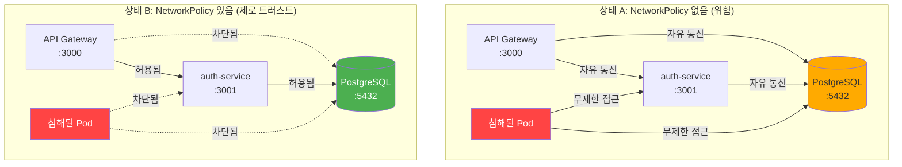
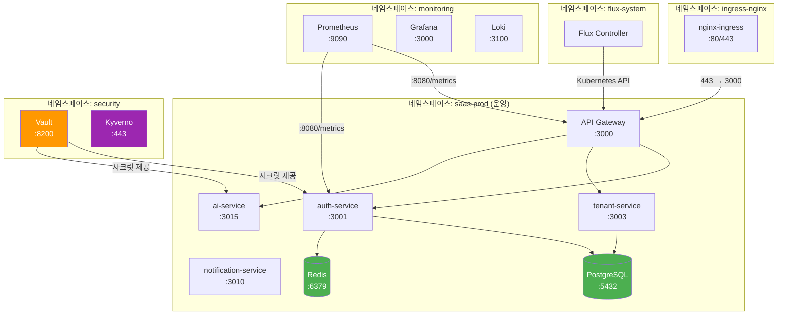
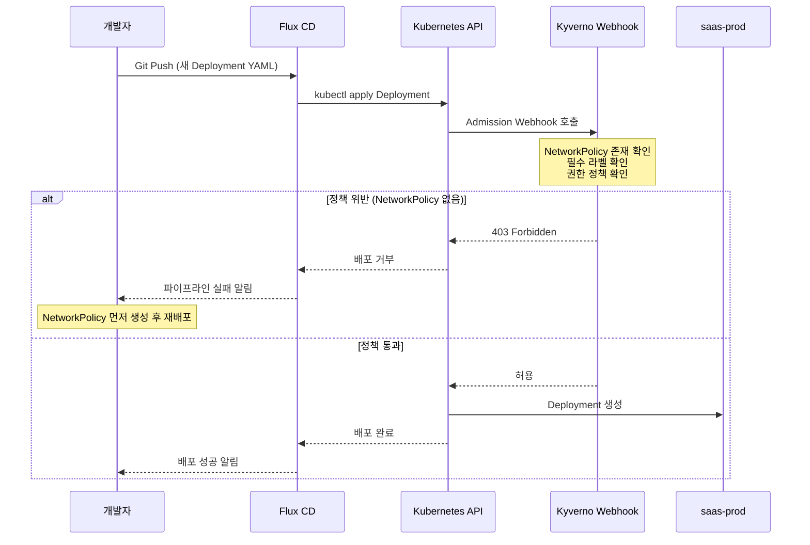
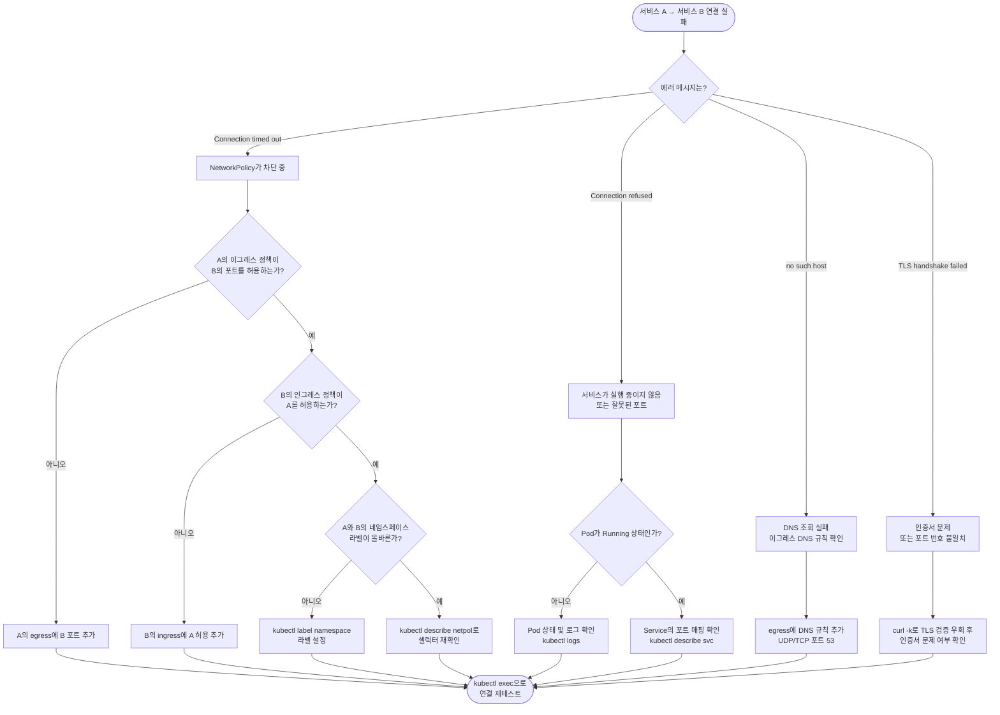

# Kubernetes NetworkPolicy 심화 — 제로 트러스트 네트워킹 구현

> **문서 ID**: INFRA-NETPOL-15
> **버전**: 1.0.0 | **작성일**: 2026-04-12 | **작성자**: Implementer (Sonnet)
> **목적**: 공공기관 SaaS 프레임워크의 네트워크 격리 정책을 이해하고 운영한다
> **선행 학습**: [04-infrastructure/01-overview.md](./01-overview.md)

---

## 목차

1. [NetworkPolicy 기본 개념](#1-networkpolicy-기본-개념)
2. [이 프로젝트의 네임스페이스 구조](#2-이-프로젝트의-네임스페이스-구조)
3. [서비스별 NetworkPolicy 레시피 10개](#3-서비스별-networkpolicy-레시피-10개)
4. [Kyverno 정책으로 NetworkPolicy 자동 강제](#4-kyverno-정책으로-networkpolicy-자동-강제)
5. [Cilium/Calico vs 기본 NetworkPolicy](#5-ciliumcalico-vs-기본-networkpolicy)
6. [디버깅 가이드](#6-디버깅-가이드)
7. [CSAP D-08 준수 매핑](#7-csap-d-08-준수-매핑)
8. [변경 이력](#변경-이력)

---

## 1. NetworkPolicy 기본 개념

### 1.1 네트워크 격리란 무엇인가

Kubernetes 클러스터 내부의 Pod는 기본적으로 **모든 Pod와 자유롭게 통신**할 수 있습니다.
인증 서비스, AI 서비스, 데이터베이스가 모두 같은 클러스터에 있어도 아무런 격리 없이 서로 통신이 가능합니다.
이는 공공기관 CSAP 인증에서 요구하는 **망 분리 원칙(D-08)**을 위반합니다.

NetworkPolicy는 Pod 수준의 방화벽 역할을 합니다.
특정 Pod가 어떤 Pod로부터 트래픽을 받고(인그레스), 어떤 Pod로 트래픽을 보낼 수 있는지(이그레스)를 명시적으로 선언합니다.

### 1.2 기본 거부(Default Deny) vs 허용 목록 방식

**기본 허용 방식 (위험 — 이 프로젝트에서 금지)**
- 아무 정책이 없으면 모든 통신이 허용됩니다
- 공격자가 하나의 Pod를 침해하면 전체 클러스터 내부로 이동(Lateral Movement)이 가능합니다
- CSAP D-08 불적합 판정

**기본 거부 방식 (이 프로젝트 채택 — 제로 트러스트)**
- 먼저 "모든 트래픽 차단" 정책을 적용합니다
- 필요한 통신만 명시적으로 허용합니다
- 새로운 서비스를 배포해도 명시적 허용 전까지는 격리됩니다
- CSAP D-08, N2SF N-03 요건 충족

### 1.3 NetworkPolicy 없는 상태 vs 있는 상태 비교



**핵심 차이점**: 상태 B에서 API Gateway는 auth-service와만 통신하고, DB에는 직접 접근하지 못합니다.
DB는 오직 auth-service, tenant-service 등 명시적으로 허용된 서비스에서만 접근 가능합니다.

### 1.4 NetworkPolicy 셀렉터 이해

NetworkPolicy는 라벨(Label)로 대상을 선택합니다.

```yaml
# Pod에 붙이는 라벨 예시
metadata:
  labels:
    app: auth-service          # 서비스 이름
    component: backend         # 컴포넌트 유형
    tier: application          # 계층 (application / database / monitoring)
```

NetworkPolicy의 `podSelector`는 이 라벨을 사용하여
"어떤 Pod에 이 정책을 적용할 것인가"를 결정합니다.

### 1.5 인그레스(Ingress) vs 이그레스(Egress)

| 구분 | 방향 | 의미 | 예시 |
|------|------|------|------|
| 인그레스 | 들어오는 트래픽 | 다른 Pod가 이 Pod로 접속 | API Gateway → auth-service |
| 이그레스 | 나가는 트래픽 | 이 Pod가 다른 Pod로 접속 | auth-service → PostgreSQL |

두 방향을 모두 제어해야 완전한 격리가 됩니다.
인그레스만 제어하면 악성 Pod가 외부로 데이터를 빼낼 수 있습니다.

---

## 2. 이 프로젝트의 네임스페이스 구조

### 2.1 네임스페이스 목록과 역할

이 프로젝트는 환경별, 기능별로 네임스페이스를 분리합니다.

| 네임스페이스 | 역할 | 포함 서비스 | 외부 노출 |
|-------------|------|------------|---------|
| `saas-prod` | 운영 환경 (실제 서비스) | 17개 마이크로서비스 전체 | 일부 허용 (API Gateway만) |
| `saas-stg` | 스테이징 환경 (검증) | 17개 마이크로서비스 전체 | 제한적 허용 |
| `monitoring` | 관측 가능성 도구 | Prometheus, Grafana, Loki, Tempo | Grafana UI만 허용 |
| `security` | 보안 도구 | Vault, Falco, Kyverno | 내부 전용 |
| `flux-system` | GitOps 컨트롤러 | Flux CD (source-controller, kustomize-controller) | 내부 전용 |
| `cert-manager` | TLS 인증서 관리 | cert-manager | 내부 전용 |
| `ingress-nginx` | 인그레스 컨트롤러 | nginx-ingress-controller | 외부 노출 (80/443) |

### 2.2 네임스페이스 간 통신 매트릭스

아래 표는 **행(출발) → 열(도착)** 방향의 트래픽 허용 여부입니다.

| 출발 \ 도착 | saas-prod | saas-stg | monitoring | security | flux-system | 외부 인터넷 |
|------------|-----------|----------|------------|----------|-------------|------------|
| **saas-prod** | 내부 정책 적용 | 차단 | Prometheus 스크레이프만 | Vault만 | 차단 | AI API만 허용 |
| **saas-stg** | 차단 | 내부 정책 적용 | Prometheus 스크레이프만 | Vault만 | 차단 | 차단 |
| **monitoring** | Prometheus 스크레이프 | Prometheus 스크레이프 | 허용 | 차단 | 차단 | AlertManager 웹훅만 |
| **security** | Vault 응답만 | Vault 응답만 | Falco 알림만 | 허용 | 차단 | 차단 |
| **flux-system** | 배포 API 호출 | 배포 API 호출 | 차단 | 차단 | 허용 | Git 저장소(Gitea)만 |
| **ingress-nginx** | API Gateway만 | 차단 | Grafana만 | 차단 | 차단 | 허용 (인바운드) |

**범례**: 허용 = 트래픽 통과 가능, 차단 = NetworkPolicy로 완전 차단

### 2.3 네임스페이스별 격리 다이어그램


> **참고**: 실제 구현에서 `architecture-beta` 다이어그램 미지원 렌더러의 경우 아래 대체 다이어그램을 사용합니다.



### 2.4 네임스페이스 라벨 규칙

NetworkPolicy에서 `namespaceSelector`를 사용하려면 네임스페이스에 라벨이 있어야 합니다.

```bash
# 운영 환경 적용 시 네임스페이스 라벨 설정
kubectl label namespace saas-prod   env=prod  tier=application
kubectl label namespace saas-stg    env=stg   tier=application
kubectl label namespace monitoring  tier=monitoring
kubectl label namespace security    tier=security
kubectl label namespace flux-system tier=gitops
kubectl label namespace ingress-nginx tier=ingress

# 라벨 확인
kubectl get namespaces --show-labels
```

---

## 3. 서비스별 NetworkPolicy 레시피 10개

> **적용 방법**: 각 YAML을 저장 후 `kubectl apply -f <파일명>.yaml -n saas-prod` 실행

### 레시피 0: 기본 거부 정책 (모든 네임스페이스에 먼저 적용)

NetworkPolicy를 시작하기 전에 반드시 먼저 적용해야 하는 기본 거부 정책입니다.

```yaml
# 00-default-deny-all.yaml
# 이 정책은 saas-prod, saas-stg 네임스페이스에 모두 적용합니다.
# 결과: 명시적으로 허용된 트래픽만 통과, 나머지 전부 차단
apiVersion: networking.k8s.io/v1
kind: NetworkPolicy
metadata:
  name: default-deny-all
  namespace: saas-prod
  labels:
    policy-type: baseline
    csap: "D-08"
spec:
  podSelector: {}       # 빈 셀렉터 = 네임스페이스 내 모든 Pod
  policyTypes:
    - Ingress
    - Egress
  # rules 없음 = 모든 인그레스/이그레스 차단
```

**해설**: `podSelector: {}`는 네임스페이스 내 모든 Pod를 대상으로 합니다.
`policyTypes`에 Ingress와 Egress를 모두 나열하고 규칙을 지정하지 않으면
해당 방향의 모든 트래픽이 차단됩니다.

### 레시피 1: auth-service — JWT 검증을 위한 내부 서비스 접근 허용

auth-service는 모든 서비스에서 JWT 검증 요청을 받고, PostgreSQL과 Redis에 접근해야 합니다.

```yaml
# 01-auth-service-netpol.yaml
# Design Ref: auth-service/src/index.ts — 포트 3001, Redis + PostgreSQL 의존
# CSAP D-08: 인증 서비스 격리 — 내부 서비스만 접근 허용
apiVersion: networking.k8s.io/v1
kind: NetworkPolicy
metadata:
  name: auth-service-netpol
  namespace: saas-prod
  labels:
    app: auth-service
    csap: "D-08"
spec:
  podSelector:
    matchLabels:
      app: auth-service
  policyTypes:
    - Ingress
    - Egress

  ingress:
    # 규칙 1: API Gateway에서 인증 요청 수신
    - from:
        - podSelector:
            matchLabels:
              app: api-gateway
      ports:
        - protocol: TCP
          port: 3001

    # 규칙 2: 다른 서비스의 JWT 검증 요청 수신 (서비스 간 내부 인증)
    # 서비스들은 X-Internal-Service-Key 헤더를 함께 전송해야 함
    - from:
        - podSelector:
            matchLabels:
              tier: application
      ports:
        - protocol: TCP
          port: 3001

    # 규칙 3: Prometheus 메트릭 스크레이프 허용
    - from:
        - namespaceSelector:
            matchLabels:
              tier: monitoring
          podSelector:
            matchLabels:
              app: prometheus
      ports:
        - protocol: TCP
          port: 8080  # /metrics 엔드포인트

  egress:
    # 규칙 4: PostgreSQL 접근 (사용자 데이터 조회)
    - to:
        - podSelector:
            matchLabels:
              app: postgresql
      ports:
        - protocol: TCP
          port: 5432

    # 규칙 5: Redis 접근 (세션 관리 — auth-service/src/lib/session.ts)
    - to:
        - podSelector:
            matchLabels:
              app: redis
      ports:
        - protocol: TCP
          port: 6379

    # 규칙 6: DNS 조회 허용 (필수 — 없으면 서비스 이름 해석 불가)
    - to:
        - namespaceSelector: {}
      ports:
        - protocol: UDP
          port: 53
        - protocol: TCP
          port: 53
```

**해설**: `X-Internal-Service-Key` 헤더는 auth-service의 `src/routes.ts`에서 검증합니다.
DNS 규칙(포트 53)은 반드시 포함해야 합니다. 없으면 `redis.saas-prod.svc.cluster.local` 같은
서비스 이름 해석에 실패합니다.

### 레시피 2: ai-service — 외부 AI API 이그레스 허용 (특정 도메인만)

ai-service는 N2SF O등급 데이터를 PII 마스킹 후 외부 LLM API로 전송합니다.
특정 도메인만 허용하기 위해 IP 블록 또는 이그레스 규칙을 활용합니다.

```yaml
# 02-ai-service-netpol.yaml
# Design Ref: ai-service/src/routes.ts — 포트 3015
# N2SF: O등급 데이터 + PII 마스킹 후 외부 AI API 전송만 허용
# CSAP D-08, D-10: 외부 통신 제어
apiVersion: networking.k8s.io/v1
kind: NetworkPolicy
metadata:
  name: ai-service-netpol
  namespace: saas-prod
  labels:
    app: ai-service
    n2sf: "O-grade-only"
    csap: "D-08,D-10"
spec:
  podSelector:
    matchLabels:
      app: ai-service
  policyTypes:
    - Ingress
    - Egress

  ingress:
    # 규칙 1: API Gateway에서만 요청 수신
    - from:
        - podSelector:
            matchLabels:
              app: api-gateway
      ports:
        - protocol: TCP
          port: 3015

    # 규칙 2: Prometheus 메트릭 스크레이프
    - from:
        - namespaceSelector:
            matchLabels:
              tier: monitoring
      ports:
        - protocol: TCP
          port: 8080

  egress:
    # 규칙 3: PostgreSQL (AI 모델 메타데이터, 사용량 기록)
    - to:
        - podSelector:
            matchLabels:
              app: postgresql
      ports:
        - protocol: TCP
          port: 5432

    # 규칙 4: 외부 LLM API 허용
    # lmstudio, ollama, vllm 등 온프레미스 LLM 서버
    # 실제 운영 시 CIDR 또는 ExternalName Service로 제한
    # ai-service/src/routes.ts: provider: lmstudio|openai|ollama|vllm
    - to:
        - ipBlock:
            cidr: 10.0.0.0/8        # 내부 LLM 서버 (온프레미스)
            except:
              - 10.0.0.0/24         # 내부 민감 서브넷 제외
      ports:
        - protocol: TCP
          port: 11434               # Ollama 기본 포트
        - protocol: TCP
          port: 1234                # LM Studio 기본 포트
        - protocol: TCP
          port: 8000                # vLLM 기본 포트

    # 규칙 5: Vault 시크릿 조회 (AI API 키 관리)
    - to:
        - namespaceSelector:
            matchLabels:
              tier: security
          podSelector:
            matchLabels:
              app: vault
      ports:
        - protocol: TCP
          port: 8200

    # 규칙 6: DNS 허용
    - to:
        - namespaceSelector: {}
      ports:
        - protocol: UDP
          port: 53
```

**주의사항**: 외부 SaaS AI API(OpenAI 등)를 사용하는 경우 `ipBlock`에 해당 서비스의
IP 대역을 추가해야 합니다. N2SF 규정상 C/S 등급 데이터 전송은 코드 수준에서도
차단되어 있습니다(`ai-service/src/lib/pii-masking.ts` 참조).

### 레시피 3: notification-service — SMTP/Webhook 이그레스

notification-service는 이메일(SMTP)과 외부 웹훅 엔드포인트로 알림을 발송합니다.

```yaml
# 03-notification-service-netpol.yaml
# Design Ref: notification-service/src/index.ts — 포트 3010
# notification-service/src/lib/webhook-sender.ts — 외부 웹훅 발송
apiVersion: networking.k8s.io/v1
kind: NetworkPolicy
metadata:
  name: notification-service-netpol
  namespace: saas-prod
  labels:
    app: notification-service
    csap: "D-08"
spec:
  podSelector:
    matchLabels:
      app: notification-service
  policyTypes:
    - Ingress
    - Egress

  ingress:
    # 규칙 1: API Gateway에서 알림 API 요청 수신
    - from:
        - podSelector:
            matchLabels:
              app: api-gateway
      ports:
        - protocol: TCP
          port: 3010

    # 규칙 2: 이벤트 버스(BullMQ/Redis)에서 이벤트 수신
    # notification-service/src/index.ts: user.created, security.account_locked 등
    - from:
        - podSelector:
            matchLabels:
              tier: application
      ports:
        - protocol: TCP
          port: 3010

    # 규칙 3: Prometheus 스크레이프
    - from:
        - namespaceSelector:
            matchLabels:
              tier: monitoring
      ports:
        - protocol: TCP
          port: 8080

  egress:
    # 규칙 4: PostgreSQL (알림 이력 저장)
    - to:
        - podSelector:
            matchLabels:
              app: postgresql
      ports:
        - protocol: TCP
          port: 5432

    # 규칙 5: Redis (BullMQ 큐 — 이벤트 구독)
    - to:
        - podSelector:
            matchLabels:
              app: redis
      ports:
        - protocol: TCP
          port: 6379

    # 규칙 6: SMTP 발송 (TLS 587 또는 암호화 465)
    # CSAP D-09: 전송 암호화 TLS 1.3+ 필수
    - to:
        - ipBlock:
            cidr: 0.0.0.0/0         # SMTP 서버 주소 (운영 시 구체적 CIDR으로 교체)
      ports:
        - protocol: TCP
          port: 587                 # STARTTLS
        - protocol: TCP
          port: 465                 # SMTPS

    # 규칙 7: 외부 웹훅 엔드포인트 (notification-service/src/lib/webhook-sender.ts)
    - to:
        - ipBlock:
            cidr: 0.0.0.0/0
            except:
              - 10.0.0.0/8          # 내부망 제외 (내부는 서비스 이름으로 접근)
              - 172.16.0.0/12
              - 192.168.0.0/16
      ports:
        - protocol: TCP
          port: 443                 # HTTPS 웹훅만 허용

    # 규칙 8: DNS 허용
    - to:
        - namespaceSelector: {}
      ports:
        - protocol: UDP
          port: 53
```

**해설**: 웹훅은 HTTPS(443)만 허용하고 HTTP(80)는 차단합니다.
CSAP D-09 요건인 "전송 시 TLS 암호화"를 네트워크 정책 수준에서도 강제합니다.

### 레시피 4: PostgreSQL — 애플리케이션 서비스에서만 인그레스

데이터베이스는 가장 강력하게 격리해야 합니다.
오직 명시적으로 허용된 서비스만 접근할 수 있습니다.

```yaml
# 04-postgresql-netpol.yaml
# CSAP D-08: 데이터베이스 접근 최소 권한 원칙
# N2SF N-03: 데이터 격리 — 애플리케이션 계층만 DB 접근
apiVersion: networking.k8s.io/v1
kind: NetworkPolicy
metadata:
  name: postgresql-netpol
  namespace: saas-prod
  labels:
    app: postgresql
    csap: "D-08,D-09"
spec:
  podSelector:
    matchLabels:
      app: postgresql
  policyTypes:
    - Ingress
    - Egress

  ingress:
    # 오직 아래 서비스들만 DB에 접근 가능
    # 각 서비스의 Prisma Client가 이 DB에 연결함
    - from:
        - podSelector:
            matchLabels:
              app: auth-service          # auth-service/src/lib/prisma.ts
        - podSelector:
            matchLabels:
              app: tenant-service        # tenant-service/src/lib/prisma.ts
        - podSelector:
            matchLabels:
              app: user-service
        - podSelector:
            matchLabels:
              app: billing-service
        - podSelector:
            matchLabels:
              app: subscription-service
        - podSelector:
            matchLabels:
              app: notification-service  # notification-service/src/lib/prisma.ts
        - podSelector:
            matchLabels:
              app: ai-service
        - podSelector:
            matchLabels:
              app: audit-service
        - podSelector:
            matchLabels:
              app: compliance-service
        - podSelector:
            matchLabels:
              app: crm-service
        - podSelector:
            matchLabels:
              app: catalog-service
        - podSelector:
            matchLabels:
              app: file-service
        - podSelector:
            matchLabels:
              app: security-service
        - podSelector:
            matchLabels:
              app: security-monitor-service
      ports:
        - protocol: TCP
          port: 5432

  egress:
    # PostgreSQL은 외부로 직접 통신하지 않음
    # Streaming Replication을 사용하는 경우 레플리카 Pod 허용 필요
    - to:
        - podSelector:
            matchLabels:
              app: postgresql-replica   # 읽기 전용 레플리카
      ports:
        - protocol: TCP
          port: 5432
```

**중요**: API Gateway는 DB에 직접 접근하지 않습니다.
모든 DB 접근은 해당 도메인의 마이크로서비스를 통해서만 이루어집니다.

### 레시피 5: Redis — 애플리케이션 서비스에서만 인그레스

```yaml
# 05-redis-netpol.yaml
# Redis: 세션(auth), 캐시(tenant), 큐(BullMQ/notification) 용도로 사용
# auth-service/src/lib/session.ts: Redis 세션 저장소
# tenant-service/src/index.ts: cachePlugin (saas:tenant 프리픽스)
apiVersion: networking.k8s.io/v1
kind: NetworkPolicy
metadata:
  name: redis-netpol
  namespace: saas-prod
  labels:
    app: redis
    csap: "D-08"
spec:
  podSelector:
    matchLabels:
      app: redis
  policyTypes:
    - Ingress
    - Egress

  ingress:
    - from:
        # 세션 관리: auth-service (Redis 세션 저장)
        - podSelector:
            matchLabels:
              app: auth-service
        # 캐시: tenant-service (cachePlugin prefix: saas:tenant)
        - podSelector:
            matchLabels:
              app: tenant-service
        # BullMQ 큐: notification-service (이벤트 버스)
        - podSelector:
            matchLabels:
              app: notification-service
        # Rate Limit: api-gateway (레이트 리미팅 카운터)
        - podSelector:
            matchLabels:
              app: api-gateway
        # AI 서비스: Rate Limit 카운터 (ai-service/src/routes.ts: createRateLimiter)
        - podSelector:
            matchLabels:
              app: ai-service
      ports:
        - protocol: TCP
          port: 6379

  egress: []  # Redis는 외부로 연결하지 않음
```

**테넌트 격리 주의사항**: Redis 키는 반드시 `tenantId`를 포함해야 합니다.
예: `saas:tenant:{tenantId}:config`. NetworkPolicy만으로는 Redis 내부 키 격리가 안 됩니다.
자세한 내용은 [09-troubleshooting/08-multi-tenant-debugging.md](../09-troubleshooting/08-multi-tenant-debugging.md)를 참조하세요.

### 레시피 6: Prometheus — 각 서비스 스크레이프 허용

Prometheus는 `monitoring` 네임스페이스에서 `saas-prod` 네임스페이스의
각 서비스 `/metrics` 엔드포인트를 스크레이프합니다.

```yaml
# 06-prometheus-netpol.yaml
# monitoring 네임스페이스에 적용
apiVersion: networking.k8s.io/v1
kind: NetworkPolicy
metadata:
  name: prometheus-netpol
  namespace: monitoring
  labels:
    app: prometheus
spec:
  podSelector:
    matchLabels:
      app: prometheus
  policyTypes:
    - Ingress
    - Egress

  ingress:
    # Grafana에서 쿼리 수신
    - from:
        - podSelector:
            matchLabels:
              app: grafana
      ports:
        - protocol: TCP
          port: 9090

  egress:
    # saas-prod 네임스페이스의 모든 서비스 메트릭 스크레이프
    # 각 서비스는 :8080/metrics 엔드포인트 제공 (responseTimePlugin)
    - to:
        - namespaceSelector:
            matchLabels:
              env: prod
      ports:
        - protocol: TCP
          port: 8080    # 서비스 메트릭 포트

    # DNS 허용
    - to:
        - namespaceSelector: {}
      ports:
        - protocol: UDP
          port: 53

---
# saas-prod 네임스페이스에도 적용 — Prometheus 스크레이프 인바운드 허용
apiVersion: networking.k8s.io/v1
kind: NetworkPolicy
metadata:
  name: allow-prometheus-scrape
  namespace: saas-prod
spec:
  podSelector:
    matchLabels:
      tier: application  # 모든 애플리케이션 Pod
  policyTypes:
    - Ingress

  ingress:
    - from:
        - namespaceSelector:
            matchLabels:
              tier: monitoring
          podSelector:
            matchLabels:
              app: prometheus
      ports:
        - protocol: TCP
          port: 8080
```

### 레시피 7: Vault — security 네임스페이스에서만 접근

HashiCorp Vault는 시크릿 저장소로, 가장 엄격하게 격리합니다.

```yaml
# 07-vault-netpol.yaml
# security 네임스페이스에 적용
# auth-service/src/index.ts: configPlugin이 Vault에서 시크릿 로드
apiVersion: networking.k8s.io/v1
kind: NetworkPolicy
metadata:
  name: vault-netpol
  namespace: security
  labels:
    app: vault
    csap: "D-08,D-09"
spec:
  podSelector:
    matchLabels:
      app: vault
  policyTypes:
    - Ingress
    - Egress

  ingress:
    # saas-prod 서비스들의 시크릿 조회 허용
    # configPlugin(config-vault 패키지)이 이 엔드포인트를 사용
    - from:
        - namespaceSelector:
            matchLabels:
              env: prod
      ports:
        - protocol: TCP
          port: 8200

    # saas-stg 서비스들의 시크릿 조회 허용
    - from:
        - namespaceSelector:
            matchLabels:
              env: stg
      ports:
        - protocol: TCP
          port: 8200

  egress:
    # Vault Raft 스토리지 (클러스터 모드)
    - to:
        - podSelector:
            matchLabels:
              app: vault
      ports:
        - protocol: TCP
          port: 8201    # 클러스터 통신 포트

    # DNS 허용
    - to:
        - namespaceSelector: {}
      ports:
        - protocol: UDP
          port: 53
```

### 레시피 8: API Gateway — 유일한 외부 진입점

API Gateway는 외부에서 들어오는 모든 트래픽의 진입점입니다.
외부에서는 ingress-nginx를 통해서만 접근 가능하고, 내부로는 각 서비스에 프록시합니다.

```yaml
# 08-api-gateway-netpol.yaml
# api-gateway/src/index.ts — 포트 3000
# 외부 트래픽의 단일 진입점 (CSAP D-08: 접근 통제 집중)
apiVersion: networking.k8s.io/v1
kind: NetworkPolicy
metadata:
  name: api-gateway-netpol
  namespace: saas-prod
  labels:
    app: api-gateway
    csap: "D-08"
spec:
  podSelector:
    matchLabels:
      app: api-gateway
  policyTypes:
    - Ingress
    - Egress

  ingress:
    # ingress-nginx에서만 외부 트래픽 수신
    - from:
        - namespaceSelector:
            matchLabels:
              tier: ingress
          podSelector:
            matchLabels:
              app.kubernetes.io/name: ingress-nginx
      ports:
        - protocol: TCP
          port: 3000

    # Prometheus 스크레이프
    - from:
        - namespaceSelector:
            matchLabels:
              tier: monitoring
      ports:
        - protocol: TCP
          port: 8080

  egress:
    # 각 마이크로서비스로 프록시 (tier: application 라벨 보유)
    - to:
        - podSelector:
            matchLabels:
              tier: application
      ports:
        - protocol: TCP
          port: 3001    # auth-service
        - protocol: TCP
          port: 3002    # user-service
        - protocol: TCP
          port: 3003    # tenant-service
        - protocol: TCP
          port: 3004    # menu-service
        - protocol: TCP
          port: 3005    # catalog-service
        - protocol: TCP
          port: 3006    # subscription-service
        - protocol: TCP
          port: 3007    # billing-service
        - protocol: TCP
          port: 3008    # crm-service
        - protocol: TCP
          port: 3010    # notification-service
        - protocol: TCP
          port: 3011    # file-service
        - protocol: TCP
          port: 3012    # audit-service
        - protocol: TCP
          port: 3013    # compliance-service
        - protocol: TCP
          port: 3015    # ai-service

    # Redis (레이트 리미팅)
    - to:
        - podSelector:
            matchLabels:
              app: redis
      ports:
        - protocol: TCP
          port: 6379

    # DNS 허용
    - to:
        - namespaceSelector: {}
      ports:
        - protocol: UDP
          port: 53
```

### 레시피 9: audit-service / compliance-service — 감사 로그 접근 제어

감사 서비스는 append-only 특성으로 보호됩니다.
쓰기는 모든 서비스에서 가능하지만 읽기는 감사자(auditor) 역할에만 허용합니다.

```yaml
# 09-audit-service-netpol.yaml
# audit-service/src/lib/append-only.ts — 추가 전용 감사 로그
# CSAP D-06: 침해사고 관리 — 감사 로그 무결성 보호
apiVersion: networking.k8s.io/v1
kind: NetworkPolicy
metadata:
  name: audit-service-netpol
  namespace: saas-prod
  labels:
    app: audit-service
    csap: "D-06,D-08"
spec:
  podSelector:
    matchLabels:
      app: audit-service
  policyTypes:
    - Ingress
    - Egress

  ingress:
    # 감사 이벤트 수신: 모든 애플리케이션 서비스에서 감사 로그 전송
    - from:
        - podSelector:
            matchLabels:
              tier: application
      ports:
        - protocol: TCP
          port: 3012

    # API Gateway에서 감사 조회 (감사자 권한 필요)
    - from:
        - podSelector:
            matchLabels:
              app: api-gateway
      ports:
        - protocol: TCP
          port: 3012

    # Prometheus 스크레이프
    - from:
        - namespaceSelector:
            matchLabels:
              tier: monitoring
      ports:
        - protocol: TCP
          port: 8080

  egress:
    # PostgreSQL (감사 로그 저장 — append-only)
    - to:
        - podSelector:
            matchLabels:
              app: postgresql
      ports:
        - protocol: TCP
          port: 5432

    # DNS
    - to:
        - namespaceSelector: {}
      ports:
        - protocol: UDP
          port: 53
```

### 레시피 10: Flux System — GitOps 컨트롤러

Flux CD는 Gitea 저장소에서 변경사항을 감지하고 클러스터에 배포합니다.

```yaml
# 10-flux-system-netpol.yaml
# flux-system 네임스페이스에 적용
# GitOps: Gitea → Flux → Kubernetes API
apiVersion: networking.k8s.io/v1
kind: NetworkPolicy
metadata:
  name: flux-controllers-netpol
  namespace: flux-system
spec:
  podSelector: {}  # flux-system 내 모든 컨트롤러
  policyTypes:
    - Ingress
    - Egress

  ingress:
    # Flux 컨트롤러 간 통신 (source-controller → kustomize-controller)
    - from:
        - namespaceSelector:
            matchLabels:
              tier: gitops
      ports:
        - protocol: TCP
          port: 9090    # source-controller HTTP API
        - protocol: TCP
          port: 8080    # 메트릭

  egress:
    # Gitea 저장소 (Git 폴링)
    - to:
        - ipBlock:
            cidr: 10.0.0.0/8  # Gitea 내부 서버 주소
      ports:
        - protocol: TCP
          port: 3000    # Gitea HTTP
        - protocol: TCP
          port: 22      # Git SSH

    # Kubernetes API 서버 (배포 적용)
    - to:
        - ipBlock:
            cidr: 0.0.0.0/0  # kube-apiserver는 클러스터 외부 IP일 수 있음
      ports:
        - protocol: TCP
          port: 6443    # k3s API 서버

    # Helm 차트 저장소 (OCI)
    - to:
        - ipBlock:
            cidr: 0.0.0.0/0
      ports:
        - protocol: TCP
          port: 443

    # DNS
    - to:
        - namespaceSelector: {}
      ports:
        - protocol: UDP
          port: 53
```

---

## 4. Kyverno 정책으로 NetworkPolicy 자동 강제

### 4.1 Kyverno란?

Kyverno는 Kubernetes Admission Controller 기반의 정책 엔진입니다.
새로운 리소스가 클러스터에 들어올 때 정책을 검사하고 위반 시 차단합니다.

이 프로젝트에서는 Kyverno로 다음을 강제합니다.
- 새로운 Deployment 생성 시 해당 앱의 NetworkPolicy가 없으면 배포 차단
- 모든 Pod에 필수 라벨(`app`, `tier`) 존재 확인
- 특권 컨테이너(privileged) 사용 금지

### 4.2 NetworkPolicy 강제 ClusterPolicy

```yaml
# kyverno-require-networkpolicy.yaml
# CSAP D-08: 모든 서비스에 NetworkPolicy 강제
apiVersion: kyverno.io/v1
kind: ClusterPolicy
metadata:
  name: require-network-policy
  annotations:
    policies.kyverno.io/title: "NetworkPolicy 필수 적용"
    policies.kyverno.io/description: >
      모든 Deployment에 대응하는 NetworkPolicy가 존재해야 합니다.
      CSAP D-08 접근 통제 요건 — 배포 시 자동 검증.
spec:
  validationFailureAction: Enforce    # Audit(경고만)이 아닌 Enforce(차단)
  background: true                    # 기존 리소스도 검사

  rules:
    - name: check-networkpolicy-exists
      match:
        any:
          - resources:
              kinds:
                - Deployment
              namespaces:
                - saas-prod
                - saas-stg
      validate:
        message: >
          Deployment '{{ request.object.metadata.name }}'에 대한 NetworkPolicy가
          존재하지 않습니다. 먼저 NetworkPolicy를 생성하세요.
          (CSAP D-08 요건: 모든 서비스 네트워크 격리 필수)
        deny:
          conditions:
            all:
              # NetworkPolicy 중 해당 앱을 선택하는 것이 없으면 차단
              - key: >
                  {{ request.object.metadata.name }}
                operator: AnyNotIn
                value: >
                  {{ request.object.metadata.labels.app }}
```

> **참고**: Kyverno의 컨텍스트 조회로 실제 NetworkPolicy 존재 여부를 확인하는
> 더 정확한 방법은 `context` 필드를 사용합니다. 위 예시는 단순화된 버전입니다.

```yaml
# kyverno-require-labels.yaml
# 모든 Pod에 필수 라벨 강제 (NetworkPolicy 셀렉터 작동을 위해 필수)
apiVersion: kyverno.io/v1
kind: ClusterPolicy
metadata:
  name: require-pod-labels
spec:
  validationFailureAction: Enforce
  rules:
    - name: check-required-labels
      match:
        any:
          - resources:
              kinds:
                - Pod
              namespaces:
                - saas-prod
                - saas-stg
      validate:
        message: >
          Pod에 'app'과 'tier' 라벨이 필수입니다.
          NetworkPolicy 셀렉터 작동에 필요합니다.
        pattern:
          metadata:
            labels:
              app: "?*"     # 비어 있지 않은 값
              tier: "?*"
```

### 4.3 배포 검증 시퀀스 다이어그램



### 4.4 Kyverno 정책 위반 확인

```bash
# 정책 위반 보고서 확인
kubectl get policyreport -A

# 특정 네임스페이스 상세 확인
kubectl get policyreport -n saas-prod -o yaml

# Kyverno 감사 로그 확인
kubectl logs -n kyverno -l app=kyverno --tail=50 | grep "FAIL\|BLOCK"
```

### 4.5 정책 예외 처리 (특수 경우)

```yaml
# 특정 Deployment에 정책 예외 허용 (사유 필수 기재)
# 예: 마이그레이션 Job은 임시로 예외
apiVersion: kyverno.io/v1
kind: PolicyException
metadata:
  name: migration-job-exception
  namespace: saas-prod
spec:
  exceptions:
    - policyName: require-network-policy
      ruleNames:
        - check-networkpolicy-exists
  match:
    any:
      - resources:
          kinds:
            - Job
          names:
            - "db-migration-*"
          namespaces:
            - saas-prod
```

---

## 5. Cilium/Calico vs 기본 NetworkPolicy

### 5.1 기본 NetworkPolicy의 한계

Kubernetes 기본 NetworkPolicy는 L3/L4 수준(IP, 포트)만 제어합니다.
예를 들어 "auth-service에서 POST /api/v1/ai/chat 만 허용하고 DELETE는 차단"처럼
HTTP 메서드나 경로 기반 제어는 불가능합니다.

| 기능 | 기본 NetworkPolicy | Cilium | Calico |
|------|------------------|--------|--------|
| L3 (IP/CIDR) | 지원 | 지원 | 지원 |
| L4 (포트/프로토콜) | 지원 | 지원 | 지원 |
| L7 (HTTP 경로, 메서드) | **미지원** | 지원 | 지원 (Enterprise) |
| DNS 기반 정책 | **미지원** | 지원 | 지원 |
| 암호화 (WireGuard/IPSec) | **미지원** | 지원 | 지원 |
| 관측 가능성 (Hubble) | **미지원** | 지원 | 미지원 |
| eBPF 기반 성능 | **미지원** | 지원 | 부분 지원 |

### 5.2 이 프로젝트에서 기본 NetworkPolicy를 선택한 이유

**선택 근거 (ADR: Architecture Decision Record)**:

1. **k3s 환경 호환성**: 이 프로젝트는 WSL2 기반 k3s를 사용합니다.
   Cilium은 eBPF 커널 요건이 높아 k3s 표준 환경과 충돌 가능성이 있습니다.

2. **운영 복잡도**: Cilium/Calico는 추가 데몬셋과 CRD가 필요합니다.
   초기 단계에서는 기본 NetworkPolicy로 CSAP D-08 요건을 충족합니다.

3. **L7 정책의 대안**: HTTP 메서드/경로 제어는 API Gateway(`api-gateway/src/`)와
   서비스 내부 RBAC 미들웨어(`auth-service/src/middleware/rbac.middleware.ts`)에서 수행합니다.

4. **마이그레이션 경로**: 클러스터 성숙 후 Cilium으로 마이그레이션할 수 있습니다.
   기본 NetworkPolicy YAML은 Cilium NetworkPolicy와 호환됩니다.

**향후 계획**: 운영 환경 안정화 후 Cilium Enterprise 평가 예정.
L7 정책으로 `/ai/chat` 엔드포인트의 등급(grade: O) 검증을 네트워크 수준에서도 강제할 수 있습니다.

---

## 6. 디버깅 가이드

### 6.1 NetworkPolicy 차단 여부 확인법

가장 빠른 확인 방법은 `kubectl exec`으로 직접 연결 테스트입니다.

```bash
# 방법 1: curl Pod를 임시 생성하여 연결 테스트
kubectl run netdebug \
  --image=curlimages/curl:latest \
  --restart=Never \
  --namespace=saas-prod \
  --labels="app=netdebug,tier=debug" \
  --rm -it \
  -- curl -v --max-time 5 http://auth-service:3001/health

# 예상 결과 (허용): HTTP 200 응답
# 예상 결과 (차단): Connection timed out 또는 Connection refused

# 방법 2: 기존 Pod 내부에서 연결 테스트
kubectl exec -n saas-prod \
  $(kubectl get pod -n saas-prod -l app=api-gateway -o jsonpath='{.items[0].metadata.name}') \
  -- curl -v --max-time 5 http://auth-service.saas-prod.svc.cluster.local:3001/health

# 방법 3: netcat으로 포트 개방 여부 확인 (응답 없어도 연결 자체 확인)
kubectl exec -n saas-prod \
  $(kubectl get pod -n saas-prod -l app=api-gateway -o jsonpath='{.items[0].metadata.name}') \
  -- nc -zv auth-service 3001
```

**Connection timed out vs Connection refused 차이**:
- `Connection timed out`: NetworkPolicy가 패킷을 DROP하는 경우 (묵시적 차단)
- `Connection refused`: 서비스가 실행 중이 아니거나 포트가 닫힌 경우

### 6.2 적용된 NetworkPolicy 목록 확인

```bash
# 특정 네임스페이스의 모든 NetworkPolicy 확인
kubectl get networkpolicies -n saas-prod

# 특정 정책 상세 확인
kubectl describe networkpolicy auth-service-netpol -n saas-prod

# 특정 Pod에 적용된 NetworkPolicy 확인
# (podSelector로 어떤 정책이 매칭되는지 확인)
kubectl get networkpolicies -n saas-prod -o yaml | \
  grep -A5 "podSelector"
```

### 6.3 Hubble Flow 로그 분석 (Cilium 사용 시)

```bash
# Hubble CLI로 실시간 네트워크 흐름 모니터링
hubble observe --namespace saas-prod --verdict DROPPED

# 특정 서비스의 차단된 트래픽 확인
hubble observe \
  --namespace saas-prod \
  --pod auth-service \
  --verdict DROPPED \
  --output json | jq '.flow | {source: .source, destination: .destination, verdict: .verdict}'

# 최근 1분간 차단된 모든 트래픽
hubble observe \
  --namespace saas-prod \
  --since 1m \
  --verdict DROPPED
```

**Cilium 미사용 시 대안**: k3s의 flannel CNI는 기본적으로 네트워크 흐름 로그를 제공하지 않습니다.
이 경우 `tcpdump`나 임시 디버그 Pod로 확인해야 합니다.

### 6.4 흔한 실수 5가지 + 해결법

**실수 1: DNS 이그레스 규칙 누락**

```bash
# 증상: 서비스 이름으로 접속 불가, IP로는 접속 가능
# 에러: dial tcp: lookup auth-service: no such host

# 원인: DNS(UDP 53) 이그레스가 차단됨
# 해결: 모든 NetworkPolicy의 egress에 아래 추가
```

```yaml
egress:
  - to:
      - namespaceSelector: {}
    ports:
      - protocol: UDP
        port: 53
      - protocol: TCP
        port: 53  # DNS-over-TCP (응답이 512바이트 초과 시 사용)
```

**실수 2: podSelector와 namespaceSelector를 AND 조건으로 사용해야 할 때 잘못 작성**

```yaml
# 잘못된 예: monitoring 네임스페이스의 Prometheus Pod (OR 조건으로 작동)
ingress:
  - from:
      - namespaceSelector:
          matchLabels:
            tier: monitoring
      - podSelector:
          matchLabels:
            app: prometheus

# 올바른 예: monitoring 네임스페이스의 Prometheus Pod만 허용 (AND 조건)
ingress:
  - from:
      - namespaceSelector:
          matchLabels:
            tier: monitoring
        podSelector:           # 같은 레벨에 podSelector가 있으면 AND 조건
          matchLabels:
            app: prometheus
```

**핵심**: `from` 배열의 한 항목 내에서 `namespaceSelector`와 `podSelector`가 함께 있으면 AND,
별도 항목으로 분리되면 OR 조건입니다.

**실수 3: 네임스페이스 라벨 미설정**

```bash
# 증상: namespaceSelector로 허용했는데 차단됨
# 원인: 해당 네임스페이스에 라벨이 없음

# 확인
kubectl get namespace monitoring --show-labels

# 해결
kubectl label namespace monitoring tier=monitoring --overwrite
```

**실수 4: 새로운 서비스 추가 시 기존 정책 미업데이트**

```bash
# 증상: 새 서비스를 배포했는데 DB에 접속 불가
# 원인: postgresql-netpol의 ingress에 새 서비스가 없음

# 확인: postgresql NetworkPolicy에 새 앱이 포함되어 있는지 확인
kubectl get networkpolicy postgresql-netpol -n saas-prod -o yaml | \
  grep -A3 "matchLabels"

# 해결: postgresql-netpol에 새 서비스 추가 후 재적용
kubectl apply -f 04-postgresql-netpol.yaml
```

**실수 5: `policyTypes` 미선언으로 이그레스 차단 효과 없음**

```yaml
# 잘못된 예: Ingress만 제어되고 Egress는 무제한
spec:
  policyTypes:
    - Ingress
  # egress 규칙 없음 = Egress는 모두 허용

# 올바른 예: Egress도 명시적으로 선언
spec:
  policyTypes:
    - Ingress
    - Egress
  egress:
    - to: ...
```

### 6.5 디버깅 트리 다이어그램



---

## 7. CSAP D-08 준수 매핑

CSAP 중/상 등급 인증의 D-08 접근 통제 통제항목과 NetworkPolicy의 매핑입니다.

### 7.1 통제항목 대응표

| CSAP D-08 항목 | 내용 | 대응 NetworkPolicy / 조치 |
|--------------|------|--------------------------|
| D-08-01 | 사용자 인증 | auth-service 격리 (레시피 1) |
| D-08-02 | 권한 관리 | RBAC 미들웨어 + NetworkPolicy 조합 |
| D-08-03 | 패스워드 관리 | auth-service 격리 (bcrypt, CSAP D-09) |
| D-08-04 | 세션 관리 | Redis NetworkPolicy (레시피 5) — 세션 저장소 격리 |
| D-08-05 | 접근 로그 | audit-service NetworkPolicy (레시피 9) |
| D-08-06 | 계정 잠금 | auth-service 격리 — 외부에서 직접 접근 불가 |
| D-08-07 | 원격 접근 통제 | 기본 거부 정책 (레시피 0) + API Gateway 단일 진입점 (레시피 8) |
| D-08-08 | 다중 인증 | auth-service 격리 (MFA 엔드포인트 보호) |
| D-08-09 | 특권 접근 관리 | Vault NetworkPolicy (레시피 7) — 시크릿 격리 |
| D-08-10 | 접근 차단 | Kyverno 정책 강제 (섹션 4) |
| D-08-11 | 망 분리 | 네임스페이스 격리 + NetworkPolicy (섹션 2) |
| D-08-12 | 통신 구간 암호화 | TLS 1.3 + HTTPS 전용 이그레스 (레시피 3) |

### 7.2 N2SF N-03 격리 아키텍처 준수

N2SF(국가정보화사업 보안 프레임워크) N-03은 클라우드 환경에서 테넌트 간 격리를 요구합니다.

**NetworkPolicy + 소프트웨어 격리 조합**:
- **네트워크 계층**: 네임스페이스 + NetworkPolicy (이 문서)
- **데이터 계층**: PostgreSQL Row-Level Security + tenantId 필터 (`tenant-service/src/lib/isolation.ts`)
- **캐시 계층**: Redis 키 네임스페이스 (`saas:tenant:{tenantId}:*`)
- **AI 계층**: RAG 벡터스토어 tenantId 격리 (`ai-service/src/lib/vector-store.ts`)

### 7.3 감사 증적 생성

CSAP 감사 시 NetworkPolicy 적용 증거를 제출해야 합니다.

```bash
# 증적 1: 적용된 NetworkPolicy 전체 목록 (YAML 형식으로 저장)
kubectl get networkpolicies -n saas-prod -o yaml > \
  csap-evidence/network-policies-$(date +%Y%m%d).yaml

# 증적 2: Kyverno 정책 위반 보고서
kubectl get policyreport -n saas-prod -o yaml > \
  csap-evidence/kyverno-report-$(date +%Y%m%d).yaml

# 증적 3: 네트워크 연결 테스트 결과 (스크린샷 또는 로그)
kubectl exec -n saas-prod \
  $(kubectl get pod -n saas-prod -l app=api-gateway -o jsonpath='{.items[0].metadata.name}') \
  -- curl -v --max-time 5 http://postgresql:5432 2>&1 | \
  tee csap-evidence/db-isolation-test-$(date +%Y%m%d).log
```

---

## 변경 이력

| 버전 | 일자 | 내용 | 작성자 |
|------|------|------|-------|
| 1.0.0 | 2026-04-12 | 최초 작성 — 10개 레시피, Kyverno 통합, CSAP D-08 매핑 | Implementer (Sonnet) |
