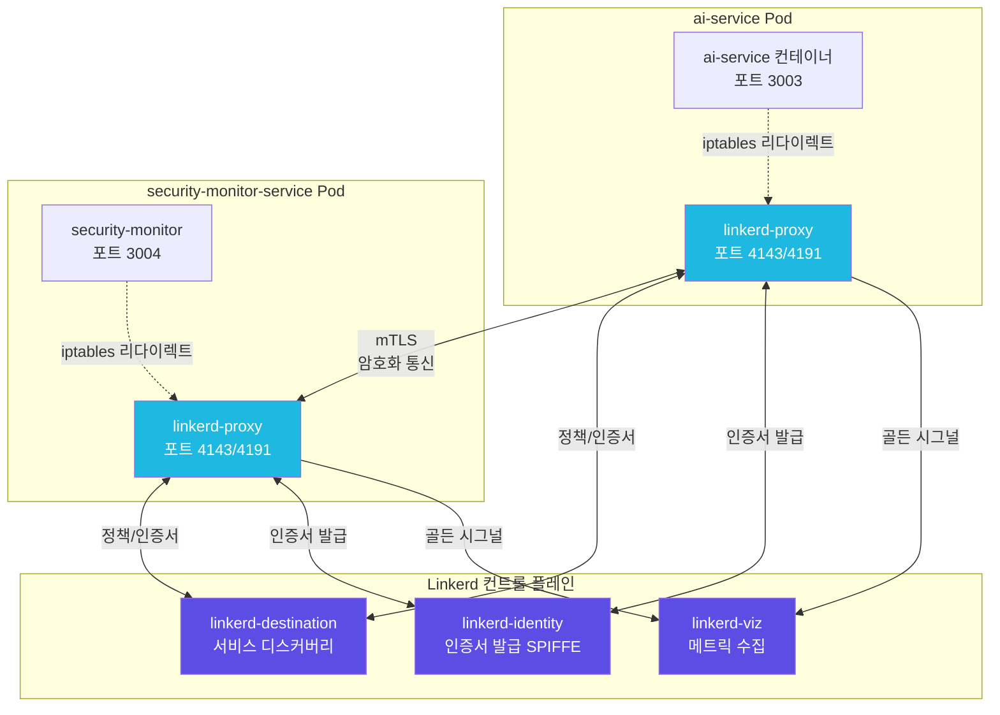
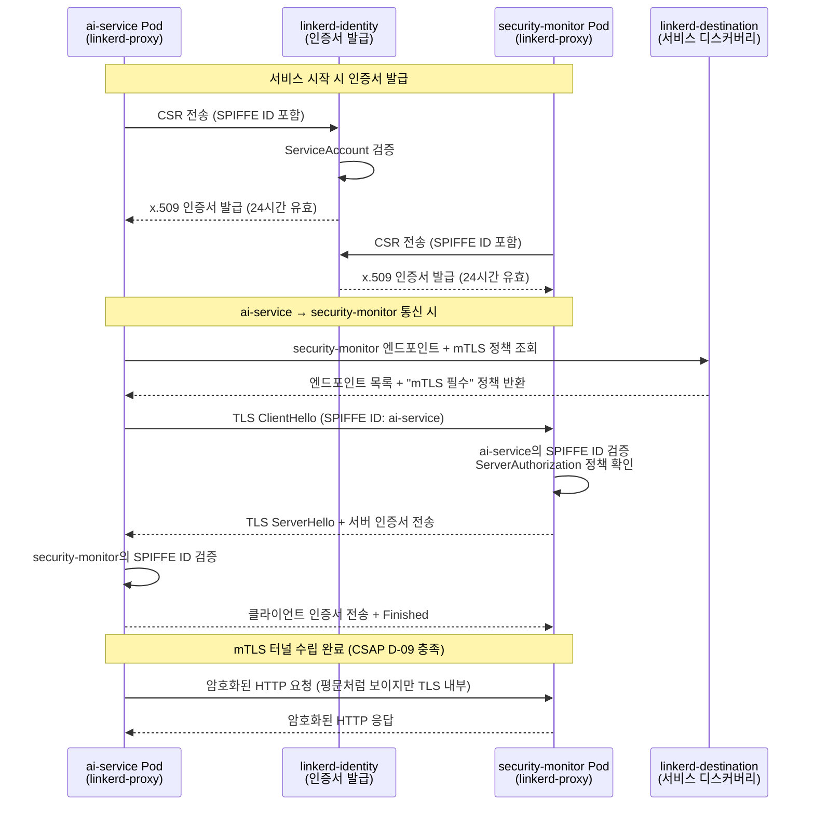
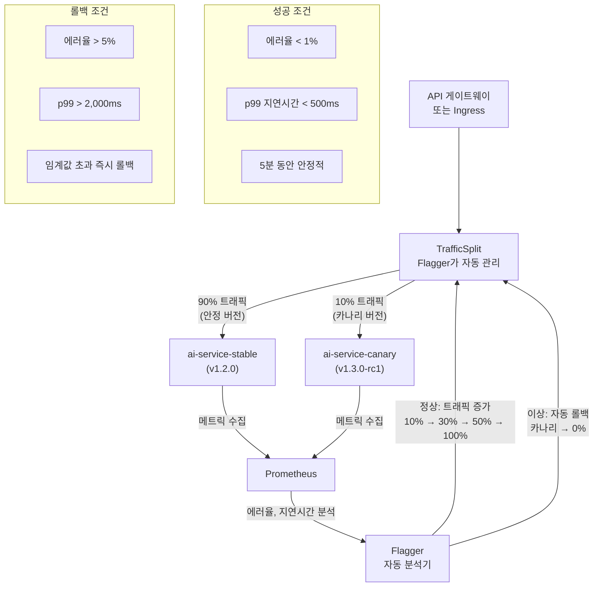

# Linkerd 서비스 메시 심화 — mTLS, 트래픽 관리, 관측가능성 완전 가이드
> **문서 ID**: INFRA-MESH-16
> **버전**: 1.0.0 | **작성일**: 2026-04-13 | **작성자**: Implementer (Sonnet)
> **목적**: Linkerd 서비스 메시의 내부 동작 원리부터 프로덕션 운영까지 심화 수준으로 안내합니다.
> **선행 학습**: [01-overview.md](./01-overview.md), [15-network-policies-advanced.md](./15-network-policies-advanced.md)

---

## 목차

1. [서비스 메시가 필요한 이유](#1-서비스-메시가-필요한-이유)
2. [이 프로젝트의 Linkerd 구성](#2-이-프로젝트의-linkerd-구성)
3. [mTLS 완전 이해](#3-mtls-완전-이해)
4. [트래픽 관리](#4-트래픽-관리)
5. [카나리 배포와 Linkerd](#5-카나리-배포와-linkerd)
6. [Linkerd 관측가능성](#6-linkerd-관측가능성)
7. [운영 트러블슈팅](#7-운영-트러블슈팅)
8. [변경 이력](#변경-이력)

---

## 1. 서비스 메시가 필요한 이유

### 1.1 마이크로서비스 환경의 근본적인 문제

이 프로젝트는 `platform/services/` 아래에 `ai-service`, `security-monitor-service`, `security-service`, `compliance-service` 등 여러 서비스가 동시에 운영됩니다. 서비스 수가 늘어날수록 다음 문제들이 반드시 발생합니다.

**문제 1 — 서비스 간 통신 보안**: ai-service가 security-monitor-service를 호출할 때, 이 연결이 실제로 암호화되어 있는지 어떻게 확인합니까? 클러스터 내부라도 네트워크 패킷 스니핑이 가능합니다.

**문제 2 — 트래픽 가시성 부재**: ai-service의 `/ai/rag/query` 엔드포인트가 500ms 이상 걸리는 이유를 알려면 어떻게 해야 합니까? 각 서비스에 직접 트레이싱 코드를 심어야 합니다.

**문제 3 — 장애 전파 방지**: ai-service가 응답이 없을 때 호출 서비스가 무한 대기하면 전체 시스템이 다운됩니다. 서비스마다 Circuit Breaker를 코딩해야 합니까?

**문제 4 — 배포 안전성**: 새 버전을 배포할 때 트래픽을 점진적으로 이동시키고, 에러율이 오르면 자동 롤백하는 기능이 필요합니다. 이를 직접 구현하려면 많은 코드가 필요합니다.

서비스 메시는 이 모든 문제를 **애플리케이션 코드 수정 없이** 인프라 계층에서 해결합니다.

### 1.2 Sidecar 패턴 동작 원리

Linkerd는 **Sidecar 패턴**을 사용합니다. 모든 Pod에 `linkerd-proxy`라는 초경량 프록시 컨테이너가 자동으로 주입됩니다. 이 프록시가 모든 인바운드/아웃바운드 네트워크 트래픽을 가로챕니다.



**동작 순서:**
1. ai-service 컨테이너가 `http://security-monitor-service:3004/api/events` 호출 (평문 HTTP)
2. `iptables` 규칙이 이 트래픽을 `linkerd-proxy`(포트 4143)로 리다이렉트
3. `linkerd-proxy`가 대상 서비스의 인증서를 `linkerd-identity`에서 조회
4. 양쪽 proxy 간 mTLS 핸드셰이크 완료 → 암호화 터널 수립
5. 암호화된 패킷이 네트워크를 통해 전달
6. 대상 Pod의 `linkerd-proxy`가 복호화 후 security-monitor 컨테이너에 전달
7. 애플리케이션은 평문 HTTP로 주고받는 것처럼 동작 (투명 암호화)

이 모든 과정에서 **애플리케이션 코드를 한 줄도 수정하지 않습니다.**

---

## 2. 이 프로젝트의 Linkerd 구성

### 2.1 설치 상태 확인

```bash
# Linkerd 전체 상태 확인
linkerd check

# 정상 출력 예시:
# linkerd-config
# √ control plane Namespace exists
# √ control plane ClusterRoles exist
# linkerd-identity
# √ certificate config is valid
# √ trust anchors are using supported crypto algorithm
# linkerd-data-plane
# √ data plane namespace exists
# √ data plane proxies are ready

# 버전 확인
linkerd version
# Client version: stable-2.14.x
# Server version: stable-2.14.x

# 컨트롤 플레인 Pod 상태
kubectl get pod -n linkerd
```

### 2.2 주입된 Pod 확인

```bash
# public-saas 네임스페이스의 모든 서비스 메트릭
linkerd viz stat -n public-saas deploy

# 출력 예시:
# NAME                      MESHED   SUCCESS      RPS   LATENCY_P50   LATENCY_P95
# ai-service                2/2      97.83%   42.5rp/s        12ms          89ms
# security-monitor-service  1/1      99.12%    8.2rp/s         3ms          18ms
# compliance-service        1/1      98.45%    5.1rp/s         5ms          31ms

# MESHED 컬럼: Linkerd Proxy가 주입된 Pod 수 / 전체 Pod 수
# 2/2 = 모든 Pod에 주입 완료

# 특정 서비스의 상세 통계
linkerd viz stat -n public-saas deploy/ai-service --from deploy/security-monitor-service
```

### 2.3 GracefulShutdown과 Linkerd 연동

`platform/packages/mesh-ready/src/graceful-shutdown.ts`의 `GracefulShutdown` 클래스는 Linkerd와 긴밀하게 연동되도록 설계되어 있습니다. 실제 코드를 분석합니다.

```typescript
// 실제 코드: platform/packages/mesh-ready/src/graceful-shutdown.ts
// Design Ref: SVC-MESH-R13 Plan / CSAP D-07 가용성 관리

export class GracefulShutdown {
  private isShuttingDown = false;   // readiness probe 제어
  private activeRequests = 0;       // 진행 중 요청 추적

  // 핵심: onRequest 훅
  // isShuttingDown = true가 되면 503 반환 → Linkerd가 이 Pod를 엔드포인트에서 제외
  app.addHook('onRequest', async (_request, reply) => {
    if (this.isShuttingDown) {
      reply.status(503).send({
        error: 'Service Unavailable',
        message: '서비스가 종료 중입니다',
        code: 'SERVICE_SHUTTING_DOWN',
      });
      return;
    }
    this.incrementRequests();
  });
}
```

**Linkerd와의 상호작용 흐름:**

```
Pod가 SIGTERM 수신
   ↓
GracefulShutdown.isShuttingDown = true
   ↓
readiness probe → /ready 엔드포인트 → 503 반환
   ↓
k8s가 이 Pod를 Service 엔드포인트에서 제거
   ↓
Linkerd가 새 요청을 다른 Pod로 라우팅
   ↓
기존 activeRequests 완료 대기 (최대 30초)
   ↓
정리 핸들러 실행 (DB 연결, 캐시 플러시)
   ↓
process.exit(0)
```

이 흐름이 정확히 작동하려면 k8s Deployment에 `terminationGracePeriodSeconds`를 `GracefulShutdown` 타임아웃보다 크게 설정해야 합니다.

```yaml
# k8s/deployment-ai-service.yaml
spec:
  template:
    spec:
      terminationGracePeriodSeconds: 40  # GracefulShutdown timeout(30s) + 여유 10s

      containers:
        - name: ai-service
          readinessProbe:
            httpGet:
              path: /ready
              port: 3003
            periodSeconds: 5
            failureThreshold: 2  # 2회 실패 시 즉시 엔드포인트 제거
```

### 2.4 네임스페이스 자동 주입 설정

```bash
# public-saas 네임스페이스에 자동 주입 활성화
kubectl annotate namespace public-saas \
  linkerd.io/inject=enabled

# 특정 Deployment에 수동 주입
kubectl get deploy/ai-service -n public-saas -o yaml | \
  linkerd inject - | \
  kubectl apply -f -

# 주입 확인
kubectl get pod -n public-saas -l app=ai-service -o yaml | \
  grep "linkerd.io/proxy-injector"
```

---

## 3. mTLS 완전 이해

### 3.1 TLS vs mTLS 차이

일반 TLS(Transport Layer Security)는 클라이언트가 서버를 검증합니다. 예를 들어 브라우저가 `https://` 사이트에 접속할 때 서버의 인증서를 확인합니다. 그러나 서버는 클라이언트를 검증하지 않습니다.

mTLS(mutual TLS, 상호 TLS)는 **양방향 검증**입니다. 서버도 클라이언트의 인증서를 요구하고 검증합니다. 두 서비스가 서로의 신원을 확인한 후에만 데이터를 교환합니다.

클러스터 내부 서비스 간 통신에서 mTLS가 필요한 이유:
- 네트워크 패킷 스니핑 방지 (암호화)
- 가짜 서비스 접근 차단 (상호 인증)
- 제로 트러스트 보안 모델 구현 (CSAP D-09 요건)

### 3.2 SPIFFE/SPIRE 인증 원리

Linkerd는 **SPIFFE(Secure Production Identity Framework for Everyone)** 표준을 구현합니다. 각 서비스(정확히는 k8s ServiceAccount)마다 고유한 신원 ID를 부여합니다.

```
SPIFFE ID 형식:
spiffe://{trust-domain}/ns/{namespace}/sa/{service-account}

예시:
ai-service:           spiffe://cluster.local/ns/public-saas/sa/ai-service
security-monitor:     spiffe://cluster.local/ns/public-saas/sa/security-monitor-service
compliance-service:   spiffe://cluster.local/ns/public-saas/sa/compliance-service
```

이 SPIFFE ID가 x.509 인증서의 SAN(Subject Alternative Name) 필드에 포함됩니다. mTLS 핸드셰이크 시 양쪽이 이 SPIFFE ID를 검증하여 신원을 확인합니다.

### 3.3 인증서 자동 순환

Linkerd는 인증서를 **24시간마다 자동으로 갱신**합니다. 이 과정은 완전히 자동화되어 운영자 개입이 필요하지 않습니다.

```
인증서 계층 구조:
┌─────────────────────────────┐
│    Trust Anchor (루트 CA)    │ ← 10년 유효, 오프라인 보관
│  cert-manager 또는 수동 관리  │
└────────────┬────────────────┘
             │ 서명
┌────────────▼────────────────┐
│   Issuer Certificate (중간) │ ← 1년 유효, linkerd-identity가 관리
│    linkerd-identity 서비스   │
└────────────┬────────────────┘
             │ 24시간마다 자동 발급
┌────────────▼────────────────┐
│  Leaf Certificate (리프)     │ ← 24시간 유효
│  각 Pod의 linkerd-proxy      │
└─────────────────────────────┘
```

### 3.4 mTLS 핸드셰이크 흐름



### 3.5 mTLS 동작 확인

```bash
# 서비스 간 연결 상태 확인 (mTLS 여부 포함)
linkerd viz edges -n public-saas

# 출력 예시:
# SRC                      DST                            SRC_NS         DST_NS      SECURED
# ai-service               security-monitor-service       public-saas    public-saas  √
# ai-service               compliance-service             public-saas    public-saas  √
# security-monitor-service compliance-service             public-saas    public-saas  √
# SECURED 컬럼의 √: mTLS 암호화 확인됨

# 특정 연결 상세 검증
linkerd viz tap -n public-saas deploy/ai-service \
  --to deploy/security-monitor-service \
  --method POST \
  --path /api/security-events

# ai-service의 인증서 확인
kubectl exec -n public-saas deploy/ai-service \
  -c linkerd-proxy \
  -- curl -s http://localhost:4191/metrics | grep "linkerd_identity"

# 인증서 만료 시간 확인
linkerd check --proxy -n public-saas
```

### 3.6 mTLS 검증 스크립트

```bash
#!/bin/bash
# scripts/verify-mtls.sh
# Design Ref: INFRA-MESH-16 §3.6
# CSAP D-09: mTLS 암호화 검증

NAMESPACE="public-saas"

echo "=== mTLS 연결 상태 확인 ==="
linkerd viz edges -n "${NAMESPACE}" | \
  awk 'NR==1 || $NF=="√"' | \
  column -t

echo ""
echo "=== 미암호화 연결 탐지 ==="
UNSECURED=$(linkerd viz edges -n "${NAMESPACE}" | \
  awk 'NR>1 && $NF!="√" {print $1, "→", $2}')

if [ -z "${UNSECURED}" ]; then
  echo "✓ 모든 연결이 mTLS로 암호화되어 있습니다"
else
  echo "경고: 미암호화 연결 발견:"
  echo "${UNSECURED}"
  exit 1
fi
```

---

## 4. 트래픽 관리

### 4.1 HTTPRoute 설정

Linkerd는 Kubernetes Gateway API의 `HTTPRoute`를 사용하여 세밀한 트래픽 제어를 지원합니다.

```yaml
# k8s/linkerd/httproute-ai-service.yaml
# Design Ref: INFRA-MESH-16 §4.1

apiVersion: gateway.networking.k8s.io/v1beta1
kind: HTTPRoute
metadata:
  name: ai-service-routes
  namespace: public-saas
spec:
  parentRefs:
    - name: ai-service
      kind: Service
      group: core
      port: 3003
  rules:
    # RAG 쿼리 경로: 타임아웃 60초 (LLM 응답 대기)
    - matches:
        - path:
            type: PathPrefix
            value: /ai/rag/query
      filters:
        - type: RequestTimeout
          requestTimeout:
            request: 60s
      backendRefs:
        - name: ai-service
          port: 3003
          weight: 100

    # 일반 채팅 경로: 타임아웃 30초
    - matches:
        - path:
            type: PathPrefix
            value: /ai/chat
      filters:
        - type: RequestTimeout
          requestTimeout:
            request: 30s
      backendRefs:
        - name: ai-service
          port: 3003
          weight: 100

    # 헬스체크: 타임아웃 없음
    - matches:
        - path:
            type: Exact
            value: /health
      backendRefs:
        - name: ai-service
          port: 3003
          weight: 100
```

### 4.2 재시도 정책 (Retry Budget)

재시도는 신중하게 설정해야 합니다. 무분별한 재시도는 장애를 오히려 악화시킬 수 있습니다(재시도 폭풍).

```yaml
# k8s/linkerd/service-profile-ai.yaml
# Design Ref: INFRA-MESH-16 §4.2

apiVersion: linkerd.io/v1alpha2
kind: ServiceProfile
metadata:
  name: ai-service.public-saas.svc.cluster.local
  namespace: public-saas
spec:
  # Retry Budget: 전체 요청의 20%까지만 재시도 허용
  # 이 제한으로 재시도 폭풍 방지
  retryBudget:
    retryRatio: 0.2          # 최대 20% 재시도
    minRetriesPerSecond: 10  # 트래픽이 적을 때 최소 재시도 횟수
    ttl: 10s                 # 10초 윈도우에서 집계

  routes:
    # GET /ai/models: 안전한 재시도 (멱등성 보장)
    - name: GET /ai/models
      condition:
        method: GET
        pathRegex: /ai/models
      isRetryable: true        # 재시도 허용
      timeout: 5s

    # POST /ai/chat: 재시도 금지 (멱등성 없음 — LLM 호출 중복 방지)
    - name: POST /ai/chat
      condition:
        method: POST
        pathRegex: /ai/chat
      isRetryable: false       # 재시도 금지
      timeout: 30s

    # POST /ai/rag/query: 재시도 금지 (LLM 호출)
    - name: POST /ai/rag
      condition:
        method: POST
        pathRegex: /ai/rag/.*
      isRetryable: false
      timeout: 60s
```

### 4.3 타임아웃 설정

```yaml
# 경로별 타임아웃 전략 가이드
#
# 타임아웃 계층 (짧은 것이 우선 적용):
# 1. Linkerd ServiceProfile timeout    ← 경로별 설정
# 2. HTTPRoute requestTimeout          ← 경로별 설정
# 3. Linkerd proxy global timeout      ← 전체 기본값
# 4. 애플리케이션 레벨 timeout          ← 코드 내부

# 각 서비스별 권장 타임아웃:
#
# ai-service (LLM 호출 포함):
#   - /ai/chat:           30s  (LLM 생성 시간 포함)
#   - /ai/chat/stream:    타임아웃 없음 (스트리밍 완료까지)
#   - /ai/rag/query:      60s  (임베딩 + LLM 생성)
#   - /ai/agent:          120s (다단계 에이전트 실행)
#   - /ai/models:         5s   (단순 조회)
#
# security-monitor-service:
#   - /api/events:        10s
#   - /api/alerts:        5s
#
# compliance-service:
#   - /api/check:         30s  (CSAP 79개 항목 검사)
```

### 4.4 Circuit Breaker

Linkerd의 Circuit Breaker는 `linkerd-timeout-ms` 헤더를 통한 클라이언트 측 타임아웃으로 구현됩니다. 연속 실패 시 Linkerd가 자동으로 그 엔드포인트를 임시 제외합니다.

```typescript
// src/clients/ai-service-client.ts
// Design Ref: INFRA-MESH-16 §4.4

/**
 * Linkerd가 인식하는 타임아웃 헤더를 설정하여
 * Circuit Breaker 효과를 얻습니다.
 */
export async function callAiService(
  endpoint: string,
  payload: unknown,
  timeoutMs: number = 30_000,
): Promise<Response> {
  const controller = new AbortController();
  const timeoutId = setTimeout(() => controller.abort(), timeoutMs);

  try {
    return await fetch(`http://ai-service.public-saas.svc.cluster.local:3003${endpoint}`, {
      method: 'POST',
      headers: {
        'Content-Type': 'application/json',
        // Linkerd가 이 헤더를 인식하여 프록시 레벨에서 타임아웃 적용
        'l5d-timeout': `${timeoutMs}ms`,
      },
      body: JSON.stringify(payload),
      signal: controller.signal,
    });
  } finally {
    clearTimeout(timeoutId);
  }
}
```

---

## 5. 카나리 배포와 Linkerd

### 5.1 카나리 배포 개요

카나리 배포(Canary Deployment)는 새 버전을 전체 트래픽에 즉시 배포하지 않고, 소량의 트래픽만 새 버전으로 보내면서 안정성을 검증하는 기법입니다. 금카나리아가 광산에서 위험을 먼저 감지했던 데서 이름이 유래했습니다.

Linkerd + Flagger 조합이 이 프로젝트에서 카나리 배포를 자동화합니다.

### 5.2 카나리 트래픽 분할 다이어그램



### 5.3 Flagger Canary 설정

```yaml
# k8s/flagger/canary-ai-service.yaml
# Design Ref: INFRA-MESH-16 §5.3

apiVersion: flagger.app/v1beta1
kind: Canary
metadata:
  name: ai-service
  namespace: public-saas
spec:
  # 대상 Deployment
  targetRef:
    apiVersion: apps/v1
    kind: Deployment
    name: ai-service

  # 프로그레스 마감: 10분 안에 완료 안 되면 롤백
  progressDeadlineSeconds: 600

  # Linkerd 서비스 메시 사용
  service:
    port: 3003
    targetPort: 3003
    gateways:
      - linkerd

  # 트래픽 가중치 증가 전략
  analysis:
    # 5분마다 분석 실행
    interval: 5m
    # 연속 성공 횟수 (5회 = 총 25분 후 100% 전환)
    threshold: 5
    # 트래픽 증가 단계: 10% → 20% → 30% → 40% → 50% → 100%
    stepWeight: 10
    # 최대 카나리 트래픽 비율
    maxWeight: 50

    # 성공 조건 (모두 만족해야 트래픽 증가)
    metrics:
      # 에러율: 1% 미만
      - name: error-rate
        thresholdRange:
          max: 1
        interval: 1m

      # 요청 성공률: 99% 이상
      - name: request-success-rate
        thresholdRange:
          min: 99
        interval: 1m

      # p99 지연시간: 500ms 미만
      - name: request-duration
        thresholdRange:
          max: 500
        interval: 30s

    # 롤백 조건: 에러율 5% 이상이면 즉시 롤백
    webhooks:
      - name: rollback-on-error
        type: rollback
        url: http://flagger-loadtester.public-saas/api/rollback
        metadata:
          errorRateThreshold: "5"
```

### 5.4 수동 카나리 트래픽 조절

```bash
# 현재 카나리 상태 확인
kubectl describe canary ai-service -n public-saas

# 카나리 진행 강제 중단 (문제 발견 시)
kubectl patch canary ai-service -n public-saas \
  --type json \
  -p '[{"op": "replace", "path": "/spec/skipAnalysis", "value": true}]'

# 수동 롤백
kubectl patch canary ai-service -n public-saas \
  --type json \
  -p '[{"op": "replace", "path": "/status/failedChecks", "value": 10}]'

# 트래픽 가중치 현황 확인
kubectl get trafficsplit -n public-saas ai-service -o yaml | \
  grep -A 10 backends
```

---

## 6. Linkerd 관측가능성

### 6.1 Golden Signal 4개 자동 수집

Linkerd는 애플리케이션 코드 수정 없이 모든 HTTP 트래픽에서 Golden Signal 4개를 자동으로 수집합니다.

| 시그널 | 설명 | Linkerd 메트릭 | 대상 값 |
|--------|------|----------------|---------|
| Latency (지연) | 요청 처리 시간 | `response_latency_ms_p99` | < 500ms |
| Traffic (트래픽) | 초당 요청 수 | `request_total rate` | 모니터링 기준 |
| Errors (에러) | 5xx 응답 비율 | `response_total{classification="failure"}` | < 1% |
| Saturation (포화) | 리소스 사용률 | `process_cpu_seconds_total` | CPU < 70% |

### 6.2 실시간 요청 감청 (Tap)

`linkerd viz tap` 명령은 실시간으로 서비스 간 요청을 볼 수 있는 강력한 디버깅 도구입니다.

```bash
# ai-service가 받는 모든 요청 실시간 확인
linkerd viz tap -n public-saas deploy/ai-service

# 출력 예시:
# req id=0:0 proxy=in  src=10.42.0.15:54321 dst=10.42.0.20:3003
#   :method=POST :path=/ai/chat :authority=ai-service:3003
# rsp id=0:0 proxy=in  src=10.42.0.15:54321 dst=10.42.0.20:3003
#   :status=200 latency=1234µs

# 특정 경로만 필터링
linkerd viz tap -n public-saas deploy/ai-service \
  --path /ai/rag/query \
  --method POST

# 에러 응답만 필터링
linkerd viz tap -n public-saas deploy/ai-service \
  --to-namespace public-saas \
  | grep ":status=5"

# security-monitor → ai-service 방향 요청만
linkerd viz tap -n public-saas deploy/ai-service \
  --from deploy/security-monitor-service \
  --output json | jq '.responseInitEvent.http.responseInit.httpStatus'
```

### 6.3 Grafana Linkerd 대시보드 활용

```bash
# Linkerd Viz 대시보드 접속 (포트 포워딩)
linkerd viz dashboard &

# 또는 Grafana 직접 접속 (Prometheus 연동된 경우)
kubectl port-forward -n monitoring svc/grafana 3000:3000 &
# http://localhost:3000 → Linkerd 관련 대시보드 선택
```

Grafana에서 확인할 수 있는 주요 Linkerd 대시보드:

**Linkerd Top Line (상위 레벨):**
- 전체 서비스 성공률 추이
- 네임스페이스별 RPS
- 전체 mTLS 적용률

**Linkerd Deployment (서비스별):**
- 선택한 서비스의 인바운드/아웃바운드 요청
- 응답 지연시간 히트맵 (p50/p95/p99)
- 각 업스트림/다운스트림 서비스 상태

**Linkerd Route (경로별):**
- `/ai/rag/query`, `/ai/chat` 등 경로별 성공률
- 재시도 횟수 및 재시도 성공률

```bash
# 명령줄에서 상위 서비스 확인
linkerd viz top -n public-saas deploy/ai-service

# 출력 예시:
# ROUTE                              COUNT    BEST    WORST    LAST  SUCCESS
# POST /ai/rag/query                  1234   89ms   2341ms   234ms   97.89%
# POST /ai/chat                       5678   23ms    456ms    67ms   99.12%
# POST /ai/chat/stream                 234   12ms   8901ms   123ms   98.72%
```

### 6.4 Prometheus 메트릭 쿼리

```promql
# ai-service 에러율 (1분 이동평균)
sum(rate(
  response_total{
    namespace="public-saas",
    deployment="ai-service",
    classification="failure"
  }[1m]
)) /
sum(rate(
  response_total{
    namespace="public-saas",
    deployment="ai-service"
  }[1m]
))

# p99 지연시간 (특정 경로)
histogram_quantile(0.99,
  sum(rate(
    response_latency_ms_bucket{
      namespace="public-saas",
      deployment="ai-service"
    }[5m]
  )) by (le, dst)
)

# mTLS 비율 (보안 요건 모니터링)
sum(tcp_open_connections{
  namespace="public-saas",
  tls="true"
}) /
sum(tcp_open_connections{namespace="public-saas"})
```

---

## 7. 운영 트러블슈팅

### 7.1 Pod Injection 실패 원인

Linkerd Proxy가 Pod에 주입되지 않는 일반적인 원인과 해결 방법입니다.

```bash
# 주입 상태 확인
linkerd check --proxy -n public-saas

# Pod에 proxy가 없는 경우 확인
kubectl get pod -n public-saas -o jsonpath=\
  '{range .items[*]}{.metadata.name}{"\t"}{.spec.containers[*].name}{"\n"}{end}' | \
  grep -v linkerd-proxy

# 원인 1: 네임스페이스 주입 어노테이션 없음
kubectl get namespace public-saas -o yaml | grep inject

# 해결: 어노테이션 추가
kubectl annotate namespace public-saas linkerd.io/inject=enabled

# 원인 2: Pod에 주입 비활성화 어노테이션
kubectl get pod ai-service-xxx -n public-saas -o yaml | \
  grep "linkerd.io/inject"

# 특정 Pod에 주입 비활성화된 경우
# spec.template.metadata.annotations:
#   linkerd.io/inject: disabled  ← 이것이 있으면 주입 안 됨

# 원인 3: Webhook 실패 확인
kubectl get events -n public-saas | grep "linkerd"
kubectl logs -n linkerd deploy/linkerd-proxy-injector | tail -50
```

### 7.2 mTLS 인증서 갱신 실패 처리

```bash
# 인증서 만료 상태 확인
linkerd check --proxy -n public-saas 2>&1 | grep -i cert

# 인증서 유효기간 확인
kubectl exec -n public-saas deploy/ai-service \
  -c linkerd-proxy \
  -- curl -s http://localhost:4191/metrics | \
  grep "linkerd_identity_cert_expiration_seconds"

# Issuer 인증서 갱신 (만료 30일 전에 선제적으로)
# cert-manager를 사용하는 경우:
kubectl delete certificaterequest -n linkerd --all

# 수동 갱신 (cert-manager 없는 경우):
# 1. 새 인증서 생성
step certificate create identity.linkerd.cluster.local \
  ca.crt ca.key \
  --ca root.crt --ca-key root.key \
  --profile intermediate-ca \
  --not-after 8760h  # 1년

# 2. Secret 업데이트
kubectl create secret generic linkerd-identity-issuer \
  -n linkerd \
  --from-file=tls.crt=ca.crt \
  --from-file=tls.key=ca.key \
  --from-file=ca.crt=root.crt \
  --dry-run=client -o yaml | kubectl apply -f -

# 3. linkerd-identity 재시작 (새 인증서 로드)
kubectl rollout restart -n linkerd deploy/linkerd-identity

# 4. 각 서비스 Pod 재시작 (새 리프 인증서 발급)
kubectl rollout restart -n public-saas deploy/ai-service
kubectl rollout restart -n public-saas deploy/security-monitor-service
```

### 7.3 메모리 사용량 증가 대응

`linkerd-proxy` 사이드카는 기본적으로 소량의 메모리를 사용하지만, 대용량 트래픽이나 많은 엔드포인트 환경에서 증가할 수 있습니다.

```bash
# proxy 메모리 사용량 확인
kubectl top pod -n public-saas --containers | grep linkerd-proxy

# 출력 예시:
# ai-service-xxx   ai-service       450m   312Mi
# ai-service-xxx   linkerd-proxy     12m    28Mi  ← 정상: 20-50Mi

# 메모리 급증 원인 분석
kubectl exec -n public-saas deploy/ai-service \
  -c linkerd-proxy \
  -- curl -s http://localhost:4191/metrics | \
  grep "process_resident_memory_bytes"

# 해결 1: 프록시 리소스 제한 설정
# Deployment annotation으로 프록시 리소스 조정
kubectl annotate deploy ai-service -n public-saas \
  config.linkerd.io/proxy-cpu-limit=250m \
  config.linkerd.io/proxy-memory-limit=128Mi \
  config.linkerd.io/proxy-cpu-request=50m \
  config.linkerd.io/proxy-memory-request=20Mi

# 해결 2: 오래된 연결 정리 (keepalive 설정 조정)
kubectl annotate deploy ai-service -n public-saas \
  config.linkerd.io/proxy-outbound-connect-timeout=10s \
  config.linkerd.io/proxy-inbound-connect-timeout=10s

# 해결 3: Tap 비활성화 (디버깅 불필요한 경우)
kubectl annotate deploy ai-service -n public-saas \
  config.linkerd.io/disable-tap=true
```

### 7.4 성능 저하 진단 체크리스트

```bash
#!/bin/bash
# scripts/linkerd-health-check.sh
# Design Ref: INFRA-MESH-16 §7.4

NAMESPACE="public-saas"
echo "=== Linkerd 상태 종합 진단 ==="

echo ""
echo "1. 컨트롤 플레인 상태"
linkerd check --quiet 2>&1 | tail -5

echo ""
echo "2. 데이터 플레인 상태"
linkerd check --proxy -n "${NAMESPACE}" --quiet 2>&1 | tail -5

echo ""
echo "3. 서비스별 성공률 (1분 평균)"
linkerd viz stat -n "${NAMESPACE}" deploy --time-window 1m | \
  awk 'NR==1 || $4 < 99.0'  # 99% 미만 서비스 강조

echo ""
echo "4. mTLS 미적용 연결"
linkerd viz edges -n "${NAMESPACE}" | \
  awk 'NR>1 && $NF != "√" {print "미암호화:", $1, "→", $2}'

echo ""
echo "5. 인증서 만료 임박 (30일 이내)"
linkerd check --proxy -n "${NAMESPACE}" 2>&1 | grep -i "expire\|expir"

echo ""
echo "=== 진단 완료 ==="
```

---

## 변경 이력

| 버전 | 일자 | 내용 | 작성자 |
|------|------|------|--------|
| 1.0.0 | 2026-04-13 | 최초 작성 — Linkerd 서비스 메시 심화 가이드 | Implementer (Sonnet) |
