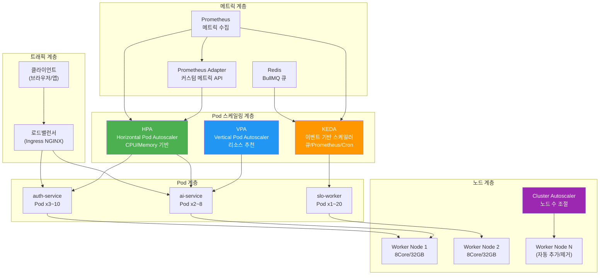
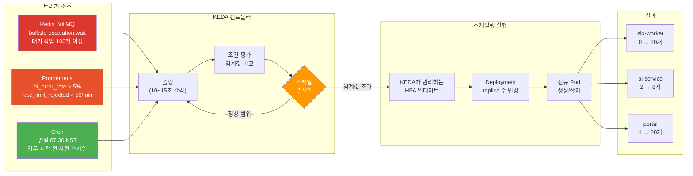

# 17. Kubernetes 오토스케일링 완전 가이드

> **문서 ID**: INFRA-GUIDE-017
> **버전**: 1.0.0
> **작성일**: 2026-04-13
> **목적**: HPA, VPA, KEDA, Cluster Autoscaler를 활용한 공공 SaaS 오토스케일링 전략을 초급자가 완전히 이해하고 적용할 수 있도록 안내
> **선행 학습**: 16-service-mesh-deep-dive.md, 12-chaos-engineering.md, 11-capacity-planning.md

---

## 목차

1. [오토스케일링 전략 개요](#1-오토스케일링-전략-개요)
2. [HPA (Horizontal Pod Autoscaler)](#2-hpa-horizontal-pod-autoscaler)
3. [VPA (Vertical Pod Autoscaler)](#3-vpa-vertical-pod-autoscaler)
4. [KEDA 심화](#4-keda-심화)
5. [Graceful Scaling](#5-graceful-scaling)
6. [AI 서비스 특화 스케일링](#6-ai-서비스-특화-스케일링)
7. [운영 모니터링](#7-운영-모니터링)
8. [변경 이력](#변경-이력)

---

## 1. 오토스케일링 전략 개요

### 1.1 왜 오토스케일링이 필요한가

공공기관 SaaS 서비스는 트래픽이 일정하지 않습니다. 예를 들어 민원 접수 시스템은 평일 오전 9시~11시에 폭발적으로 트래픽이 증가하고, 새벽에는 거의 요청이 없습니다. 이런 상황에서 최대 트래픽을 기준으로 서버를 항상 켜두면 비용이 낭비되고, 최소 트래픽 기준으로만 운영하면 피크 타임에 서비스가 다운됩니다.

오토스케일링은 이 문제를 해결합니다. 트래픽이 늘어나면 Pod를 자동으로 추가하고, 트래픽이 줄어들면 Pod를 자동으로 줄입니다. 비용을 절감하면서도 서비스 가용성을 유지할 수 있습니다.

### 1.2 4종 오토스케일러 비교

이 프로젝트에서 사용하는 오토스케일러는 크게 4종류입니다:

| 구분 | HPA | VPA | KEDA | Cluster Autoscaler |
|------|-----|-----|------|-------------------|
| 스케일 방향 | 수평 (Pod 수) | 수직 (리소스 크기) | 수평 (커스텀 트리거) | 노드 수 |
| 기준 메트릭 | CPU, Memory, 커스텀 | CPU, Memory 사용 패턴 | 이벤트, 큐, Prometheus | 미스케줄 Pod |
| 반응 속도 | 15~30초 | 재시작 필요 | 수초 (외부 메트릭) | 수분 |
| 적합 서비스 | API 서버, 웹 서버 | 배치 작업, ML 추론 | 큐 처리, 이벤트 기반 | 클러스터 전체 |

### 1.3 선택 기준 결정 트리

어떤 오토스케일러를 선택해야 할지 다음 기준으로 결정합니다:

- 요청 수 기반으로 스케일하고 싶다 → HPA (CPU/Memory 또는 Prometheus Adapter)
- 메모리를 얼마나 써야 할지 모르겠다 → VPA (리소스 추천)
- Redis 큐나 Kafka 메시지 수 기반으로 스케일하고 싶다 → KEDA
- 특정 시간대에 맞춰 스케일하고 싶다 → KEDA Cron ScaledObject
- Pod가 스케줄되지 않는다 → Cluster Autoscaler (노드 추가)

### 1.4 오토스케일러 레이어 아키텍처



위 다이어그램에서 HPA(초록), VPA(파랑), KEDA(주황), Cluster Autoscaler(보라)가 각각 다른 계층에서 동작하는 것을 볼 수 있습니다. 이들은 서로 독립적으로 동작하지만, 결국 동일한 노드 풀 위에서 실행됩니다.

---

## 2. HPA (Horizontal Pod Autoscaler)

### 2.1 HPA의 기본 개념

HPA(Horizontal Pod Autoscaler)는 Pod의 수를 자동으로 조절합니다. "수평" 스케일링이란 동일한 크기의 Pod를 여러 개 추가하는 방식입니다.

**동작 원리**:
1. Kubernetes Metrics Server 또는 Prometheus Adapter가 메트릭을 수집합니다
2. HPA 컨트롤러가 15초(기본값)마다 현재 메트릭을 확인합니다
3. 목표값과 현재값을 비교하여 필요한 replica 수를 계산합니다
4. 계산된 replica 수로 Deployment를 업데이트합니다

**replica 계산 공식**:
```
원하는 replica 수 = ceil(현재 replica 수 × (현재 메트릭값 / 목표 메트릭값))
```

예: CPU 70% 목표, 현재 140%, 현재 Pod 3개
```
원하는 replica = ceil(3 × (140 / 70)) = ceil(6) = 6개
```

### 2.2 CPU/Memory 기반 HPA

가장 기본적인 HPA 설정입니다. auth-service에 CPU 70% 임계값을 적용하는 예제입니다:

```yaml
# kubernetes/hpa/auth-service-hpa.yaml
apiVersion: autoscaling/v2
kind: HorizontalPodAutoscaler
metadata:
  name: auth-service-hpa
  namespace: saas-prod
  labels:
    app: auth-service
    component: autoscaling
    # Design Ref: 11-capacity-planning.md §3.2
spec:
  scaleTargetRef:
    apiVersion: apps/v1
    kind: Deployment
    name: auth-service
  minReplicas: 2   # 최소 2개 (가용성 보장)
  maxReplicas: 10  # 최대 10개 (비용 상한)

  metrics:
    # CPU 기반 스케일링
    - type: Resource
      resource:
        name: cpu
        target:
          type: Utilization
          averageUtilization: 70  # 70% 초과 시 스케일업

    # Memory 기반 스케일링 (CPU와 OR 조건)
    - type: Resource
      resource:
        name: memory
        target:
          type: Utilization
          averageUtilization: 80  # 80% 초과 시 스케일업

  behavior:
    # 스케일업: 빠르게 (60초마다 최대 4개씩 추가)
    scaleUp:
      stabilizationWindowSeconds: 0   # 즉시 반응
      policies:
        - type: Pods
          value: 4
          periodSeconds: 60
        - type: Percent
          value: 100  # 100% 증가도 허용
          periodSeconds: 60
      selectPolicy: Max  # 더 많이 스케일업하는 정책 선택

    # 스케일다운: 천천히 (5분 안정화 후 2개씩 감소)
    scaleDown:
      stabilizationWindowSeconds: 300  # 5분 안정화 윈도우
      policies:
        - type: Pods
          value: 2
          periodSeconds: 60  # 1분마다 최대 2개씩 제거
      selectPolicy: Min  # 더 적게 스케일다운하는 정책 선택
```

**스케일업/다운 동작 차이 이유**: 스케일업은 빠르게 해야 트래픽 급증에 즉시 대응합니다. 반면 스케일다운은 천천히 해야 순간적인 트래픽 감소 후 다시 증가하는 경우 불필요한 Pod 생성/삭제를 반복하지 않습니다. 이를 "스케일 다운 안정화 윈도우"라고 합니다.

### 2.3 커스텀 메트릭 HPA (Prometheus Adapter)

CPU/Memory 외에도 "초당 요청 수(RPS)", "응답 지연 시간"과 같은 커스텀 메트릭 기반으로 스케일링할 수 있습니다. 이를 위해 Prometheus Adapter가 필요합니다.

**Prometheus Adapter 설치**:
```bash
# Helm으로 Prometheus Adapter 설치
helm repo add prometheus-community https://prometheus-community.github.io/helm-charts
helm upgrade --install prometheus-adapter \
  prometheus-community/prometheus-adapter \
  --namespace monitoring \
  --set prometheus.url=http://prometheus.monitoring.svc \
  --set prometheus.port=9090
```

**Prometheus Adapter 커스텀 규칙 설정**:
```yaml
# prometheus-adapter-config.yaml
rules:
  custom:
    # auth-service 초당 요청 수를 커스텀 메트릭으로 노출
    - seriesQuery: 'http_requests_total{namespace="saas-prod",service="auth-service"}'
      resources:
        overrides:
          namespace: {resource: "namespace"}
          pod: {resource: "pod"}
      name:
        matches: "^(.*)_total"
        as: "${1}_per_second"
      metricsQuery: 'rate(<<.Series>>{<<.LabelMatchers>>}[2m])'

    # ai-service 토큰 소비량 기반 메트릭
    - seriesQuery: 'ai_tokens_consumed_total{namespace="saas-prod"}'
      resources:
        overrides:
          namespace: {resource: "namespace"}
          pod: {resource: "pod"}
      name:
        matches: "^(.*)_total"
        as: "${1}_rate"
      metricsQuery: 'rate(<<.Series>>{<<.LabelMatchers>>}[5m])'
```

**커스텀 메트릭 기반 HPA**:
```yaml
# kubernetes/hpa/auth-service-custom-hpa.yaml
apiVersion: autoscaling/v2
kind: HorizontalPodAutoscaler
metadata:
  name: auth-service-rps-hpa
  namespace: saas-prod
spec:
  scaleTargetRef:
    apiVersion: apps/v1
    kind: Deployment
    name: auth-service
  minReplicas: 2
  maxReplicas: 15

  metrics:
    # 초당 요청 수 기반 스케일링 (Pod당 100 RPS 목표)
    - type: Pods
      pods:
        metric:
          name: http_requests_per_second
        target:
          type: AverageValue
          averageValue: "100"  # Pod당 평균 100 RPS

    # 외부 메트릭: 전체 서비스 에러율
    - type: External
      external:
        metric:
          name: error_rate_percent
          selector:
            matchLabels:
              service: auth-service
        target:
          type: Value
          value: "5"  # 에러율 5% 초과 시 스케일업
```

### 2.4 스케일 다운 안정화 윈도우 상세 설명

스케일 다운 안정화 윈도우(Stabilization Window)는 스케일 다운이 너무 빨리 일어나지 않도록 보호하는 메커니즘입니다.

**문제 상황 (안정화 윈도우 없는 경우)**:
1. 오전 9시: 트래픽 급증 → Pod 10개로 스케일업
2. 오전 9시 5분: 트래픽 잠시 감소 → Pod 3개로 스케일다운
3. 오전 9시 6분: 트래픽 다시 급증 → Pod 다시 10개로 스케일업
4. 결과: 불필요한 Pod 생성/삭제 반복, 서비스 불안정

**해결 (5분 안정화 윈도우)**:
1. 오전 9시: 트래픽 급증 → Pod 10개로 스케일업
2. 오전 9시 5분: 트래픽 잠시 감소 → 5분간 관찰 시작
3. 오전 9시 10분: 5분 동안 지속적으로 낮은 경우에만 스케일다운
4. 결과: 안정적인 스케일링

```yaml
behavior:
  scaleDown:
    stabilizationWindowSeconds: 300  # 5분(300초) 안정화
    policies:
      - type: Pods
        value: 1         # 1분마다 최대 1개씩만 제거 (보수적)
        periodSeconds: 60
```

### 2.5 HPA 스케일 결정 흐름

```mermaid
flowchart TD
    Start(["15초마다 HPA 컨트롤러 실행"]) --> FetchMetrics["Metrics Server에서<br/>현재 CPU/Memory 조회"]
    FetchMetrics --> CalcDesired["원하는 replica 수 계산<br/>ceil(현재 replicas × 현재값/목표값)"]
    CalcDesired --> CheckMin{"계산값 < minReplicas?"}
    CheckMin -->|"예"| SetMin["replica = minReplicas로 설정"]
    CheckMin -->|"아니오"| CheckMax{"계산값 > maxReplicas?"}
    CheckMax -->|"예"| SetMax["replica = maxReplicas로 설정"]
    CheckMax -->|"아니오"| CheckStabilization{"스케일다운 요청이고<br/>안정화 윈도우 내?"}
    CheckStabilization -->|"예 (윈도우 내)"| KeepCurrent["현재 replica 유지<br/>(너무 이른 스케일다운 방지)"]
    CheckStabilization -->|"아니오"| CheckPolicy{"Policy 제한<br/>초과?"]
    CheckPolicy -->|"초과"| LimitByPolicy["Policy 최대값으로 제한<br/>(예: 1분에 최대 4개)"]
    CheckPolicy -->|"정상"| Apply["Deployment replica 업데이트"]
    SetMin --> Apply
    SetMax --> Apply
    LimitByPolicy --> Apply
    KeepCurrent --> End(["대기 후 재실행"])
    Apply --> End

    style Start fill:#4CAF50,color:#fff
    style Apply fill:#2196F3,color:#fff
    style KeepCurrent fill:#FF9800,color:#fff
```

### 2.6 실제 서비스 HPA 설정 예제

이 프로젝트의 핵심 서비스들에 대한 HPA 설정 예제입니다:

**ai-service HPA** (AI 서비스는 비용이 높으므로 보수적으로 설정):
```yaml
# kubernetes/hpa/ai-service-hpa.yaml
apiVersion: autoscaling/v2
kind: HorizontalPodAutoscaler
metadata:
  name: ai-service-hpa
  namespace: saas-prod
  annotations:
    # Design Ref: platform/services/ai-service/src/routes.ts
    # Rate Limiter: chatLimiter(10/min), agentLimiter(5/min)
    scaling-note: "AI 서비스는 GPU 없이 CPU로 추론. 스케일업 보수적 설정."
spec:
  scaleTargetRef:
    apiVersion: apps/v1
    kind: Deployment
    name: ai-service
  minReplicas: 2
  maxReplicas: 8   # AI 비용 상한: 8 Pod

  metrics:
    - type: Resource
      resource:
        name: cpu
        target:
          type: Utilization
          averageUtilization: 60  # AI 추론은 CPU 집약적 → 여유 있게 60%

  behavior:
    scaleUp:
      stabilizationWindowSeconds: 60   # 1분 관찰 후 스케일업
      policies:
        - type: Pods
          value: 2
          periodSeconds: 120  # 2분마다 최대 2개 추가 (비용 제어)
    scaleDown:
      stabilizationWindowSeconds: 600  # 10분 안정화 (AI Pod는 시작 비용이 높음)
      policies:
        - type: Pods
          value: 1
          periodSeconds: 120
```

**portal (프론트엔드) HPA**:
```yaml
# kubernetes/hpa/portal-hpa.yaml
apiVersion: autoscaling/v2
kind: HorizontalPodAutoscaler
metadata:
  name: portal-hpa
  namespace: saas-prod
spec:
  scaleTargetRef:
    apiVersion: apps/v1
    kind: Deployment
    name: portal
  minReplicas: 3   # 프론트엔드는 최소 3개 (고가용성)
  maxReplicas: 20

  metrics:
    - type: Resource
      resource:
        name: cpu
        target:
          type: Utilization
          averageUtilization: 70
    # SSR(Server-Side Rendering) 페이지 생성 메모리 고려
    - type: Resource
      resource:
        name: memory
        target:
          type: Utilization
          averageUtilization: 75

  behavior:
    scaleUp:
      stabilizationWindowSeconds: 0  # 즉시 스케일업 (프론트는 시작 빠름)
    scaleDown:
      stabilizationWindowSeconds: 180  # 3분 안정화
```

### 2.7 HPA 트러블슈팅

**문제 1: HPA가 "unknown" 메트릭 상태**
```bash
# 확인
kubectl describe hpa auth-service-hpa -n saas-prod

# 원인: Metrics Server가 없거나 동작 안 함
kubectl get deployment metrics-server -n kube-system

# 해결: Metrics Server 설치
kubectl apply -f https://github.com/kubernetes-sigs/metrics-server/releases/latest/download/components.yaml
```

**문제 2: HPA가 스케일업하지 않음**
```bash
# HPA 이벤트 확인
kubectl describe hpa auth-service-hpa -n saas-prod | grep -A 20 Events

# minReplicas == maxReplicas인지 확인
kubectl get hpa auth-service-hpa -n saas-prod -o jsonpath='{.spec.minReplicas}'

# Pod 리소스 요청(requests)이 설정되어 있는지 확인
# requests가 없으면 CPU 사용률 계산 불가
kubectl get deployment auth-service -n saas-prod -o jsonpath='{.spec.template.spec.containers[0].resources}'
```

---

## 3. VPA (Vertical Pod Autoscaler)

### 3.1 VPA의 기본 개념

VPA(Vertical Pod Autoscaler)는 Pod에 할당된 CPU/Memory 리소스 크기를 자동으로 조절합니다. "수직" 스케일링이란 Pod 수는 그대로이지만 각 Pod가 사용하는 리소스를 늘리거나 줄이는 방식입니다.

**VPA가 필요한 경우**:
- 서비스가 얼마나 많은 메모리를 써야 할지 모를 때
- OOMKilled(메모리 부족으로 종료)가 자주 발생할 때
- 리소스를 과도하게 예약(over-provision)하고 있는지 확인하고 싶을 때

**VPA의 3가지 모드**:

| 모드 | 동작 | 적합한 상황 |
|------|------|-------------|
| Off | 추천값만 계산, 적용 안 함 | 리소스 최적화 분석 단계 |
| Initial | Pod 시작 시에만 추천값 적용 | 재시작 가능한 배치 작업 |
| Auto | 자동으로 적용 (Pod 재시작 필요) | 리소스 낭비가 심한 경우 |

**중요**: VPA의 `Auto` 모드는 리소스 변경을 위해 Pod를 재시작합니다. 프로덕션 서비스에서는 서비스 중단이 발생할 수 있으므로 주의해야 합니다.

### 3.2 VPA 설치 및 기본 설정

```bash
# VPA 설치
git clone https://github.com/kubernetes/autoscaler.git
cd autoscaler/vertical-pod-autoscaler
./hack/vpa-install.sh

# 설치 확인
kubectl get pods -n kube-system | grep vpa
```

**Off 모드로 리소스 추천값 확인** (가장 안전한 시작 방법):
```yaml
# kubernetes/vpa/ai-service-vpa-off.yaml
apiVersion: autoscaling.k8s.io/v1
kind: VerticalPodAutoscaler
metadata:
  name: ai-service-vpa
  namespace: saas-prod
  annotations:
    # Design Ref: packages/slo-escalation/src/escalation-controller.ts
    # SLO 에스컬레이션 컨트롤러는 메모리를 많이 사용하므로 VPA 분석 필요
    purpose: "리소스 최적화 분석 전용, 자동 적용 안 함"
spec:
  targetRef:
    apiVersion: apps/v1
    kind: Deployment
    name: ai-service
  updatePolicy:
    updateMode: "Off"  # 추천값만 계산, 실제 적용 안 함

  resourcePolicy:
    containerPolicies:
      - containerName: ai-service
        minAllowed:
          cpu: 100m
          memory: 256Mi
        maxAllowed:
          cpu: 4000m
          memory: 8Gi
        controlledResources: ["cpu", "memory"]
```

**추천값 확인 방법**:
```bash
# VPA가 계산한 리소스 추천값 확인
kubectl describe vpa ai-service-vpa -n saas-prod

# 출력 예시:
#   Recommendation:
#     Container Recommendations:
#       Container Name:  ai-service
#         Lower Bound:
#           Cpu:     100m
#           Memory:  512Mi
#         Target:        ← 이 값을 사용하면 됩니다
#           Cpu:     500m
#           Memory:  1Gi
#         Upper Bound:
#           Cpu:     2000m
#           Memory:  4Gi
```

### 3.3 실제 packages/ 메모리 추천값 반영

VPA 분석 결과를 기반으로 `packages/` 서비스들의 Deployment에 리소스를 설정합니다:

```yaml
# kubernetes/deployments/slo-escalation-deployment.yaml
# Design Ref: packages/slo-escalation/src/escalation-controller.ts
# SLO 에스컬레이션: 최대 5000개 이벤트 히스토리 보관 (maxHistory = 5000)
# 메모리 요구사항: 이벤트 1개 약 500byte × 5000 = 2.5MB + 오버헤드
apiVersion: apps/v1
kind: Deployment
metadata:
  name: slo-escalation
  namespace: saas-prod
spec:
  template:
    spec:
      containers:
        - name: slo-escalation
          resources:
            requests:
              cpu: 100m    # VPA 추천 Lower Bound
              memory: 128Mi
            limits:
              cpu: 500m    # VPA 추천 Upper Bound
              memory: 512Mi  # 5000 이벤트 × 500byte + 오버헤드 충분
```

```yaml
# kubernetes/deployments/feature-flag-deployment.yaml
# Design Ref: packages/feature-flag-sdk
apiVersion: apps/v1
kind: Deployment
metadata:
  name: feature-flag-sdk
  namespace: saas-prod
spec:
  template:
    spec:
      containers:
        - name: feature-flag-sdk
          resources:
            requests:
              cpu: 50m
              memory: 64Mi
            limits:
              cpu: 200m
              memory: 256Mi
```

### 3.4 Initial 모드 (배치 작업용)

배치 작업이나 주기적으로 실행되는 CronJob에는 Initial 모드가 적합합니다:

```yaml
# kubernetes/vpa/dora-exporter-vpa.yaml
apiVersion: autoscaling.k8s.io/v1
kind: VerticalPodAutoscaler
metadata:
  name: dora-exporter-vpa
  namespace: monitoring
  annotations:
    # Design Ref: packages/dora-exporter/src/index.ts
    purpose: "DORA 메트릭 수집기는 배치 실행, 재시작 시 리소스 최적화"
spec:
  targetRef:
    apiVersion: apps/v1
    kind: Deployment
    name: dora-exporter
  updatePolicy:
    updateMode: "Initial"  # Pod 시작 시에만 적용
```

### 3.5 HPA + VPA 동시 사용 주의사항

HPA와 VPA를 동시에 사용할 때는 충돌이 발생할 수 있습니다:

**충돌 문제**: HPA가 CPU 사용률로 스케일업하려는데, VPA가 CPU 제한을 올려버리면 HPA의 판단 기준이 달라집니다.

**안전한 동시 사용 방법**:
```yaml
# 방법 1: VPA는 CPU 추천을 끄고 Memory만 관리
spec:
  resourcePolicy:
    containerPolicies:
      - containerName: auth-service
        controlledResources: ["memory"]  # CPU는 HPA에게 맡김
        controlledValues: RequestsAndLimits

# 방법 2: VPA를 Off 모드로 (추천값만, 자동 적용 금지)
spec:
  updatePolicy:
    updateMode: "Off"
```

**권장 조합**:
- API 서버 (auth-service, portal): HPA (CPU) + VPA Off (메모리 추천 참고용)
- 배치 작업 (dora-exporter, ml-pipeline): VPA Initial 또는 Auto
- 이벤트 기반 워커 (slo-escalation): KEDA + VPA Off

---

## 4. KEDA 심화

### 4.1 KEDA란 무엇인가

KEDA(Kubernetes Event-Driven Autoscaling)는 외부 이벤트나 메트릭을 기반으로 Pod를 스케일링합니다. HPA가 CPU/Memory만 볼 수 있는 것과 달리, KEDA는 Redis 큐 길이, Kafka 메시지 수, Prometheus 메트릭, 심지어 특정 시간대에도 반응할 수 있습니다.

**KEDA의 핵심 개념**:
- **ScaledObject**: "어떤 조건에서 어떻게 스케일링할지" 정의하는 CRD
- **Trigger**: 스케일링 조건 (Redis, Prometheus, Cron 등)
- **ScaledJob**: Deployment가 아닌 Job을 스케일링할 때 사용

### 4.2 KEDA 설치

```bash
# Helm으로 KEDA 설치
helm repo add kedacore https://kedacore.github.io/charts
helm repo update

helm upgrade --install keda kedacore/keda \
  --namespace keda \
  --create-namespace \
  --set watchNamespace=saas-prod

# 설치 확인
kubectl get pods -n keda
kubectl get crds | grep keda
```

### 4.3 Redis BullMQ 기반 KEDA

`packages/slo-escalation`에서 SLO 위반 이벤트를 BullMQ 큐에 넣고, 워커가 처리하는 패턴을 KEDA로 스케일링합니다:

```yaml
# kubernetes/keda/slo-worker-scaledobject.yaml
apiVersion: keda.sh/v1alpha1
kind: ScaledObject
metadata:
  name: slo-worker-scaledobject
  namespace: saas-prod
  annotations:
    # Design Ref: packages/slo-escalation/src/escalation-controller.ts
    # EscalationLevel: Normal/Warning/Danger/Critical/Violated
    # maxHistory = 5000 이벤트를 큐로 처리
spec:
  scaleTargetRef:
    name: slo-worker  # 스케일링 대상 Deployment
  pollingInterval: 10   # 10초마다 큐 확인
  cooldownPeriod: 60    # 스케일다운 전 60초 대기
  minReplicaCount: 0    # 큐가 비면 Pod 0개 (비용 최적화)
  maxReplicaCount: 20   # 최대 20개 워커

  triggers:
    - type: redis
      metadata:
        address: redis-master.saas-prod.svc:6379
        listName: "bull:slo-escalation:wait"  # BullMQ 대기 큐
        listLength: "100"  # 대기 중인 작업 100개 이상 시 스케일업

      # 비밀 정보는 Secret에서 가져옴 (CSAP D-09 준수)
      authenticationRef:
        name: redis-keda-auth
```

```yaml
# kubernetes/keda/redis-auth.yaml
apiVersion: v1
kind: Secret
metadata:
  name: redis-keda-auth
  namespace: saas-prod
type: Opaque
stringData:
  password: ""  # Redis 패스워드 (실제는 Vault에서 주입)
---
apiVersion: keda.sh/v1alpha1
kind: TriggerAuthentication
metadata:
  name: redis-keda-auth
  namespace: saas-prod
spec:
  secretTargetRef:
    - parameter: password
      name: redis-keda-auth
      key: password
```

**동작 설명**: `bull:slo-escalation:wait` 큐에 대기 중인 작업이 100개를 넘으면 워커 Pod를 자동으로 추가합니다. 큐가 비면 Pod를 0개로 줄여 비용을 절약합니다. 이 방식은 `slo-escalation`의 `escalate()` 메서드가 호출할 때마다 큐에 작업을 넣는 패턴과 연동됩니다.

### 4.4 Prometheus 기반 KEDA

에러율이 높아지면 자동으로 스케일업하는 패턴입니다:

```yaml
# kubernetes/keda/ai-service-error-rate-scaledobject.yaml
apiVersion: keda.sh/v1alpha1
kind: ScaledObject
metadata:
  name: ai-service-error-scaledobject
  namespace: saas-prod
  annotations:
    # Design Ref: platform/services/ai-service/src/routes.ts
    # Rate Limiter: chatLimiter(10/min) 초과 시 503 에러 증가 → 스케일업
spec:
  scaleTargetRef:
    name: ai-service
  pollingInterval: 15    # 15초마다 확인
  cooldownPeriod: 120    # 2분 쿨다운
  minReplicaCount: 2
  maxReplicaCount: 8

  triggers:
    # 에러율 5% 초과 시 스케일업
    - type: prometheus
      metadata:
        serverAddress: http://prometheus.monitoring.svc:9090
        metricName: ai_error_rate
        query: |
          sum(rate(http_requests_total{
            service="ai-service",
            status=~"5.."
          }[2m])) /
          sum(rate(http_requests_total{
            service="ai-service"
          }[2m]))
        threshold: "0.05"  # 5% 에러율

    # Rate Limiter 거부율 30% 초과 시에도 스케일업
    - type: prometheus
      metadata:
        serverAddress: http://prometheus.monitoring.svc:9090
        metricName: ai_rate_limit_rejection
        query: |
          sum(rate(rate_limit_rejected_total{
            service="ai-service"
          }[2m]))
        threshold: "50"  # 분당 50개 이상 거부 시
```

### 4.5 Cron 기반 KEDA (예측적 스케일링)

공공기관 특성상 트래픽 패턴이 예측 가능합니다. 민원 처리 시스템은 오전 8시에 급증하고 밤 11시에는 거의 없습니다:

```yaml
# kubernetes/keda/portal-cron-scaledobject.yaml
apiVersion: keda.sh/v1alpha1
kind: ScaledObject
metadata:
  name: portal-cron-scaledobject
  namespace: saas-prod
  annotations:
    purpose: "업무 시간 예측적 스케일링 — 공공기관 트래픽 패턴 기반"
    # 참고: DORA Gate (.gitea/workflows/dora-gate.yml)에서
    # 배포 시간을 업무 시간으로 제한하는 것과 동일한 맥락
spec:
  scaleTargetRef:
    name: portal
  minReplicaCount: 1   # 야간 최소값
  maxReplicaCount: 20

  triggers:
    # 오전 7시 30분 (KST): 업무 시작 전 사전 스케일업 (한국 시간 = UTC+9)
    - type: cron
      metadata:
        timezone: Asia/Seoul
        start: "30 7 * * 1-5"  # 평일 오전 7시 30분
        end: "0 22 * * 1-5"    # 평일 오후 10시
        desiredReplicas: "10"  # 업무 시간 10개

    # 오전 9시: 피크 타임 최대 스케일업
    - type: cron
      metadata:
        timezone: Asia/Seoul
        start: "0 9 * * 1-5"   # 평일 오전 9시
        end: "0 11 * * 1-5"    # 오전 11시까지
        desiredReplicas: "20"  # 피크 타임 최대

    # 점심 시간: 소폭 감소
    - type: cron
      metadata:
        timezone: Asia/Seoul
        start: "0 12 * * 1-5"
        end: "0 13 * * 1-5"
        desiredReplicas: "8"

    # 오후 피크: 오후 2시~5시
    - type: cron
      metadata:
        timezone: Asia/Seoul
        start: "0 14 * * 1-5"
        end: "0 17 * * 1-5"
        desiredReplicas: "15"
```

**Cron 트리거 설명**: `start`와 `end` 사이에 지정된 `desiredReplicas`를 유지합니다. 여러 Cron 트리거가 겹치면 가장 높은 `desiredReplicas`가 선택됩니다. Prometheus나 Redis 트리거와 함께 사용하면 예측적 스케일링과 반응적 스케일링을 동시에 적용할 수 있습니다.

### 4.6 KEDA 트리거 → 스케일링 흐름



### 4.7 KEDA 모니터링 및 디버깅

```bash
# ScaledObject 상태 확인
kubectl get scaledobject -n saas-prod

# 출력 예시:
# NAME                          SCALETARGETKIND   SCALETARGETNAME   MIN   MAX   TRIGGERS   READY   ACTIVE
# slo-worker-scaledobject       Deployment         slo-worker         0     20    redis      True    True

# KEDA 이벤트 확인
kubectl describe scaledobject slo-worker-scaledobject -n saas-prod

# KEDA 오퍼레이터 로그 확인
kubectl logs -n keda deployment/keda-operator --tail=100 -f

# 현재 Redis 큐 길이 확인 (트리거 조건 확인)
kubectl exec -it redis-master-0 -n saas-prod -- redis-cli llen bull:slo-escalation:wait
```

---

## 5. Graceful Scaling

### 5.1 Graceful Scaling이란

스케일 다운 시 문제가 발생합니다. Kubernetes가 Pod를 삭제하면, 그 Pod에서 처리 중이던 요청들은 어떻게 될까요? 응답을 받지 못한 클라이언트는 에러를 경험합니다.

Graceful Scaling은 이 문제를 해결합니다. Pod가 삭제되기 전에 "지금 처리 중인 요청들은 다 끝낸 후 삭제해달라"는 신호를 보내고, 새로운 요청은 받지 않는 방식입니다.

### 5.2 실제 코드 분석: GracefulShutdown 클래스

`platform/packages/mesh-ready/src/graceful-shutdown.ts`의 구현을 분석합니다:

```typescript
// Design Ref: SVC-MESH-R13 Plan
// Plan SC: FR-MESH.3
// CSAP: D-07 가용성 관리

export class GracefulShutdown {
  private isShuttingDown = false;  // 셧다운 진행 여부
  private activeRequests = 0;      // 현재 처리 중인 요청 수

  /**
   * Fastify 인스턴스에 셧다운 훅 등록
   * Kubernetes가 SIGTERM을 보내면 자동으로 실행됩니다
   */
  registerWithFastify(app: FastifyInstance): void {
    // 요청이 들어올 때마다 카운터 증가
    app.addHook('onRequest', async (_request, reply) => {
      if (this.isShuttingDown) {
        // 셧다운 중이면 새 요청 거부 (503 반환)
        reply.status(503).send({
          error: 'Service Unavailable',
          message: '서비스가 종료 중입니다',
          code: 'SERVICE_SHUTTING_DOWN',
        });
        return;
      }
      this.activeRequests++;
    });

    // 요청이 완료될 때마다 카운터 감소
    app.addHook('onResponse', async () => {
      this.decrementRequests();
    });

    // SIGTERM (Kubernetes Pod 삭제 신호) 수신 시
    process.on('SIGTERM', () => {
      this.shutdown(app).then(() => {
        process.exit(0);  // 정상 종료
      });
    });
  }

  async shutdown(app?: FastifyInstance): Promise<void> {
    this.isShuttingDown = true;  // 1단계: 새 요청 거부 시작

    // 2단계: 진행 중 요청 완료 대기 (최대 30초)
    await this.waitForActiveRequests();

    // 3단계: DB 연결, 캐시 등 정리
    await this.runCleanupHandlers();

    // 4단계: Fastify 서버 완전 종료
    if (app) await app.close();
  }

  private async waitForActiveRequests(): Promise<void> {
    // 100ms마다 확인, 최대 30초(DEFAULT_TIMEOUT) 대기
    return new Promise<void>((resolve) => {
      const startTime = Date.now();
      const interval = setInterval(() => {
        if (this.activeRequests === 0) {
          clearInterval(interval);
          resolve();  // 모든 요청 완료
        }
        if (Date.now() - startTime >= this.timeout) {
          clearInterval(interval);
          resolve();  // 타임아웃: 강제 종료
        }
      }, 100);
    });
  }
}
```

**핵심 포인트**:
1. `isShuttingDown = true` 설정 직후부터 새 요청은 503 반환
2. `activeRequests` 카운터로 처리 중인 요청 추적
3. 100ms 간격으로 카운터 확인, 0이 되면 종료
4. 최대 30초(terminationGracePeriodSeconds와 일치) 후 강제 종료

### 5.3 Kubernetes PreStop Hook 설정

Kubernetes에는 SIGTERM을 보내기 전에 실행되는 PreStop Hook이 있습니다. PreStop Hook은 로드밸런서가 해당 Pod를 제외하기 전에 충분한 시간을 확보하기 위해 사용합니다:

```yaml
# kubernetes/deployments/auth-service-deployment.yaml
apiVersion: apps/v1
kind: Deployment
metadata:
  name: auth-service
  namespace: saas-prod
spec:
  template:
    spec:
      # Kubernetes가 Pod를 종료할 때 최대 대기 시간
      # GracefulShutdown.DEFAULT_TIMEOUT(30초) + 여유 10초 = 40초
      terminationGracePeriodSeconds: 40

      containers:
        - name: auth-service
          lifecycle:
            preStop:
              exec:
                command:
                  # PreStop: 슬립 5초
                  # 이유: Kubernetes가 로드밸런서(Endpoint)에서 Pod를 제거하는 데
                  # 최대 수 초 걸림. 그 동안 들어오는 요청을 처리하기 위해 대기.
                  - /bin/sh
                  - -c
                  - sleep 5

          readinessProbe:
            httpGet:
              path: /ready
              port: 3000
            # readinessProbe 실패 시 로드밸런서에서 제거됨
            # isShuttingDown = true가 되면 /ready가 503 반환 → 자동으로 제거
            failureThreshold: 1
            periodSeconds: 5
```

**종료 시퀀스 설명**:
```
Kubernetes가 Pod 삭제 결정
    ↓
PreStop Hook 실행 (sleep 5초)
    ← 이 5초 동안 로드밸런서가 해당 Pod를 제거
    ↓
SIGTERM 전송 (GracefulShutdown 시작)
    ← isShuttingDown = true, 새 요청 거부
    ← 처리 중인 요청 완료 대기 (최대 30초)
    ↓
process.exit(0) 호출
    ↓
Pod 완전 종료
```

### 5.4 Readiness Probe와 스케일링 연동

Readiness Probe는 Pod가 "요청을 받을 준비가 되었는지" 확인합니다. GracefulShutdown과 연동되면 스케일 다운 시 자동으로 로드밸런서에서 제외됩니다:

```typescript
// platform/services/auth-service/src/routes.ts 예시
// Design Ref: platform/packages/mesh-ready/src/graceful-shutdown.ts

const graceful = new GracefulShutdown({ timeout: 30_000 });
graceful.registerWithFastify(app);

// /ready 엔드포인트: readinessProbe 용
app.get('/ready', async (request, reply) => {
  if (graceful.isTerminating()) {
    // 셧다운 중: readinessProbe 실패 → 로드밸런서 자동 제외
    return reply.status(503).send({ ready: false, reason: 'shutting_down' });
  }
  return reply.send({ ready: true });
});

// /health 엔드포인트: livenessProbe 용 (셧다운 중에도 살아있음)
app.get('/health', async () => {
  return { alive: true };
});
```

### 5.5 스케일 다운 시 In-flight 요청 처리 흐름

```
[정상 상태]
클라이언트 → 로드밸런서 → Pod A (처리 중) → DB → 응답

[스케일 다운 시작]
1. HPA: "Pod 수를 10 → 6으로 줄여야겠다"
2. Kubernetes: Pod A에 삭제 신호
3. PreStop Hook: 5초 대기 (로드밸런서 제외 준비)
4. 로드밸런서: Pod A를 목록에서 제거 (새 요청 안 보냄)
5. SIGTERM: GracefulShutdown.isShuttingDown = true
6. 기존 처리 중 요청: 정상 완료 (최대 30초)
7. 완료 후: process.exit(0)

[결과]
클라이언트: 모든 요청 정상 응답 받음 (에러 없음)
```

---

## 6. AI 서비스 특화 스케일링

### 6.1 AI 서비스 스케일링의 특수성

`platform/services/ai-service/src/routes.ts`에서 볼 수 있듯이, AI 서비스는 일반 API 서버와 다른 특성을 가집니다:

```typescript
// CSAP D-08-06: Rate Limiting
const readLimiter = createRateLimiter(100, 60, 'rl:ai:read');   // 100/분
const writeLimiter = createRateLimiter(20, 60, 'rl:ai:write');  // 20/분
const chatLimiter = createRateLimiter(10, 60, 'rl:ai:chat');    // 10/분
const embedLimiter = createRateLimiter(30, 60, 'rl:ai:embed');  // 30/분
const ragLimiter = createRateLimiter(20, 60, 'rl:ai:rag');      // 20/분
const agentLimiter = createRateLimiter(5, 60, 'rl:ai:agent');   // 5/분 (비용 높음)
const workflowLimiter = createRateLimiter(10, 60, 'rl:ai:workflow'); // 10/분
```

**AI 서비스 스케일링 특성**:
1. **처리 시간 가변**: 단순 채팅은 1초, 에이전트는 수십 초
2. **비용 민감**: AI 추론은 CPU를 많이 씀 → Pod 당 처리량 제한
3. **토큰 비용**: 모델에 따라 토큰당 비용 발생 → 스케일업이 바로 비용 증가
4. **Rate Limiter**: 이미 소프트웨어 수준에서 요청 제한 → 과도한 스케일업 불필요

### 6.2 Rate Limiter 기반 스케일링 전략

Rate Limiter가 거부하는 요청이 늘어나면 스케일업이 필요합니다. KEDA로 이를 탐지합니다:

```yaml
# kubernetes/keda/ai-rate-limit-scaledobject.yaml
apiVersion: keda.sh/v1alpha1
kind: ScaledObject
metadata:
  name: ai-rate-limit-scaledobject
  namespace: saas-prod
  annotations:
    # Design Ref: platform/services/ai-service/src/routes.ts
    # chatLimiter: 10/60초, agentLimiter: 5/60초
    # Rate Limiter 거부율이 높으면 서비스 확장 필요
spec:
  scaleTargetRef:
    name: ai-service
  minReplicaCount: 2
  maxReplicaCount: 8
  pollingInterval: 30

  triggers:
    # 채팅 Rate Limiter 거부율 모니터링
    - type: prometheus
      metadata:
        serverAddress: http://prometheus.monitoring.svc:9090
        metricName: ai_chat_rate_limit_reject_rate
        # rl:ai:chat 키의 거부 횟수 (분당)
        query: |
          sum(rate(rate_limit_rejected_total{
            limiter="rl:ai:chat"
          }[5m])) * 60
        threshold: "20"  # 분당 20회 이상 거부 시 스케일업

    # 에이전트 Rate Limiter 거부율 (비용이 더 높으므로 임계값 낮게)
    - type: prometheus
      metadata:
        serverAddress: http://prometheus.monitoring.svc:9090
        metricName: ai_agent_rate_limit_reject_rate
        query: |
          sum(rate(rate_limit_rejected_total{
            limiter="rl:ai:agent"
          }[5m])) * 60
        threshold: "10"  # 분당 10회 이상 거부 시 스케일업
```

### 6.3 토큰 비용 제어와 스케일링 연계

AI 서비스의 월간 토큰 예산을 초과하지 않도록 스케일링에 제한을 겁니다:

```yaml
# kubernetes/hpa/ai-service-cost-aware-hpa.yaml
apiVersion: autoscaling/v2
kind: HorizontalPodAutoscaler
metadata:
  name: ai-service-cost-aware-hpa
  namespace: saas-prod
  annotations:
    cost-limit: "월간 토큰 예산 초과 시 maxReplicas를 수동으로 1로 줄임"
    runbook: "docs/runbooks/ai-cost-control.md"
spec:
  scaleTargetRef:
    apiVersion: apps/v1
    kind: Deployment
    name: ai-service
  minReplicas: 2

  # 비용 제어: 월간 예산 상황에 따라 maxReplicas 조정
  # 정상: 8, 예산 80% 소진: 4, 예산 100% 소진: 2
  maxReplicas: 8

  metrics:
    - type: Resource
      resource:
        name: cpu
        target:
          type: Utilization
          averageUtilization: 60

  behavior:
    scaleUp:
      stabilizationWindowSeconds: 120  # 2분 관찰 후 스케일업
      policies:
        - type: Pods
          value: 1       # 한 번에 1개씩만 추가 (비용 점진적 증가)
          periodSeconds: 120
    scaleDown:
      stabilizationWindowSeconds: 300  # 5분 안정화
```

**월간 예산 모니터링 및 maxReplicas 자동 조정 스크립트**:
```bash
#!/bin/bash
# scripts/ai-cost-gate.sh
# Design Ref: platform/services/ai-service/src/routes.ts /ai/cost 엔드포인트 활용

BUDGET_LIMIT=1000000  # 월간 토큰 예산 (100만 토큰)
CURRENT_USAGE=$(curl -s http://ai-service/ai/cost | jq '.data.monthlyTokens')

USAGE_RATIO=$(echo "scale=2; $CURRENT_USAGE / $BUDGET_LIMIT * 100" | bc)

if (( $(echo "$USAGE_RATIO > 80" | bc -l) )); then
  echo "토큰 예산 ${USAGE_RATIO}% 소진. maxReplicas를 4로 제한합니다."
  kubectl patch hpa ai-service-cost-aware-hpa -n saas-prod \
    --type=merge -p '{"spec":{"maxReplicas":4}}'
fi

if (( $(echo "$USAGE_RATIO > 95" | bc -l) )); then
  echo "토큰 예산 ${USAGE_RATIO}% 소진. maxReplicas를 2로 제한합니다. (긴급)"
  kubectl patch hpa ai-service-cost-aware-hpa -n saas-prod \
    --type=merge -p '{"spec":{"maxReplicas":2}}'
fi
```

### 6.4 N2SF O등급 데이터 처리와 스케일링

AI 서비스는 N2SF O등급 데이터만 처리합니다 (C/S 등급은 전송 금지). 스케일링 시에도 이 원칙이 유지됩니다:

```typescript
// platform/services/ai-service/src/handlers/ai.handler.ts 에서
// grade: z.string().enum(['O'])  ← O등급만 허용

// 스케일링이 되어도 이 검증은 변하지 않음
// 따라서 Pod가 몇 개이든 N2SF 규정 준수 보장됨
```

### 6.5 미래 확장: GPU 노드 셀렉터

현재 이 프로젝트는 CPU 기반 추론(LM Studio, Ollama)을 사용합니다. 향후 GPU가 필요한 모델을 사용할 경우를 대비한 설정입니다:

```yaml
# kubernetes/deployments/ai-service-gpu-deployment.yaml (미래 확장용)
# NOTE: 미사용. Phase 3 GPU 노드 추가 시 사용 예정. 2027-01-01 이후 재검토.
apiVersion: apps/v1
kind: Deployment
metadata:
  name: ai-service-gpu
  namespace: saas-prod
spec:
  template:
    spec:
      # GPU 노드에만 배치
      nodeSelector:
        accelerator: nvidia-gpu
        node-role.kubernetes.io/gpu-worker: "true"

      # GPU 리소스 요청
      containers:
        - name: ai-service
          resources:
            limits:
              nvidia.com/gpu: "1"  # GPU 1개 사용

      # CPU 노드에 스케줄되지 않도록 taint 허용
      tolerations:
        - key: "nvidia.com/gpu"
          operator: "Exists"
          effect: "NoSchedule"
```

---

## 7. 운영 모니터링

### 7.1 HPA 현황 확인

```bash
# 모든 HPA 현황 확인 (한 눈에 보기)
kubectl get hpa -n saas-prod

# 출력 예시:
# NAME                   REFERENCE              TARGETS          MINPODS   MAXPODS   REPLICAS   AGE
# auth-service-hpa       Deployment/auth-svc    45%/70%          2         10        4          2d
# ai-service-hpa         Deployment/ai-svc      72%/60%          2         8         6          2d
# portal-hpa             Deployment/portal      38%/70%          3         20        5          2d

# 특정 HPA 상세 확인
kubectl describe hpa auth-service-hpa -n saas-prod

# HPA 메트릭 실시간 확인
watch kubectl get hpa -n saas-prod
```

### 7.2 스케일링 이벤트 로그 분석

```bash
# 스케일링 이벤트 확인 (언제, 왜 스케일링됐는지)
kubectl describe hpa auth-service-hpa -n saas-prod | grep -A 30 "Events:"

# 출력 예시:
# Events:
#   Type    Reason             Age    From                       Message
#   Normal  SuccessfulRescale  5m23s  horizontal-pod-autoscaler  New size: 4; reason: cpu resource utilization (percentage of request) above target
#   Normal  SuccessfulRescale  23m    horizontal-pod-autoscaler  New size: 2; reason: All metrics below target

# Kubernetes 이벤트에서 스케일링 이벤트만 필터
kubectl get events -n saas-prod --field-selector reason=SuccessfulRescale

# KEDA 스케일링 이벤트
kubectl get events -n saas-prod | grep ScaledObject
```

### 7.3 Prometheus 기반 스케일링 모니터링 쿼리

```promql
# 현재 Deployment replica 수 추이
kube_deployment_spec_replicas{namespace="saas-prod"}

# HPA가 원하는 replica 수 vs 현재 replica 수 비교
kube_horizontalpodautoscaler_status_desired_replicas{namespace="saas-prod"}
kube_horizontalpodautoscaler_status_current_replicas{namespace="saas-prod"}

# 스케일업 이벤트 횟수 (지난 24시간)
count_over_time(
  changes(kube_horizontalpodautoscaler_status_current_replicas{namespace="saas-prod"}[24h])
)

# Pod 시작 시간 (스케일업 후 준비 완료까지 얼마나 걸렸나)
histogram_quantile(0.95,
  rate(kubelet_pod_start_duration_seconds_bucket{namespace="saas-prod"}[1h])
)
```

### 7.4 비용과 성능 균형 최적화

스케일링의 목표는 비용과 성능의 균형입니다:

**비용 최적화 체크리스트**:
```bash
# 1. 낮은 사용률 Pod 확인 (CPU 20% 이하는 낭비)
kubectl top pods -n saas-prod | awk '$3 < 20 {print $1, $3"%"}'

# 2. VPA 추천값 vs 현재 설정 비교
kubectl describe vpa -n saas-prod | grep -A 6 "Target:"

# 3. minReplicas가 과도하게 높지 않은지 확인
# 야간(새벽 2시)에도 최소값이 유지되는지 → 불필요하면 낮춤
kubectl get hpa -n saas-prod -o jsonpath='{range .items[*]}{.metadata.name}: min={.spec.minReplicas}{"\n"}{end}'

# 4. KEDA minReplicaCount=0 서비스 확인 (큐 비면 0개로 줄어드는지)
kubectl get scaledobject -n saas-prod -o jsonpath='{range .items[*]}{.metadata.name}: min={.spec.minReplicaCount}{"\n"}{end}'
```

**성능 최적화 체크리스트**:
```bash
# 1. HPA가 maxReplicas에 도달했는지 확인 (상한 부족)
kubectl get hpa -n saas-prod -o json | \
  jq '.items[] | select(.status.currentReplicas == .spec.maxReplicas) | .metadata.name'

# 2. Pod Pending 상태 확인 (노드 부족)
kubectl get pods -n saas-prod | grep Pending

# 3. 스케일업 속도가 느린 경우: stabilizationWindowSeconds 조정
# scaleUp.stabilizationWindowSeconds를 0으로 설정하면 즉시 반응

# 4. 스케일업 후 Pod 준비 완료 속도
kubectl get pods -n saas-prod -o wide | grep -v Running
```

### 7.5 DORA 게이트와 스케일링 연계

`.gitea/workflows/dora-gate.yml`에서 볼 수 있듯이, DORA 게이트는 배포 품질을 관리합니다. 스케일링 설정 변경도 배포의 일부이므로 DORA 게이트를 통과해야 합니다:

```yaml
# .gitea/workflows/deploy-scaling-config.yml 예시
# HPA/KEDA 설정 변경 시 DORA 게이트 호출
jobs:
  deploy-scaling:
    steps:
      - name: DORA 게이트 확인
        uses: ./.gitea/workflows/dora-gate.yml
        with:
          namespace: saas-prod
          team: platform
        # CFR > 30%이면 스케일링 설정 변경도 차단됨
```

---

## 변경 이력

| 버전 | 일자 | 내용 | 작성자 |
|------|------|------|--------|
| 1.0.0 | 2026-04-13 | 초안 작성 — HPA/VPA/KEDA/Graceful Scaling 완전 가이드 | Implementer Agent |
