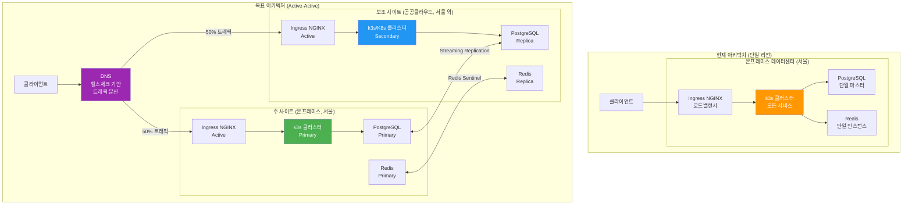
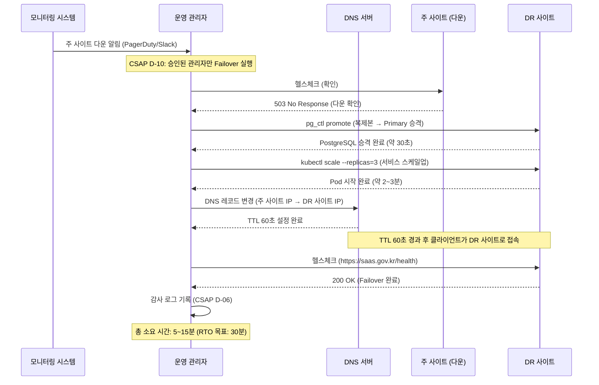

# 18. 멀티 리전 전략

> **문서 ID**: INFRA-GUIDE-018
> **버전**: 1.0.0
> **작성일**: 2026-04-13
> **목적**: 단일 리전에서 시작하여 Active-Active 멀티 리전으로 발전하는 단계별 전략을 초급자가 이해하고 계획할 수 있도록 안내
> **선행 학습**: 08-disaster-recovery.md, 17-autoscaling-advanced.md, 16-service-mesh-deep-dive.md

---

## 목차

1. [멀티 리전 개요](#1-멀티-리전-개요)
2. [Active-Passive 구현](#2-active-passive-구현)
3. [DNS 기반 트래픽 분산](#3-dns-기반-트래픽-분산)
4. [데이터 일관성 전략](#4-데이터-일관성-전략)
5. [Active-Active 전환 계획](#5-active-active-전환-계획)
6. [비용과 복잡성](#6-비용과-복잡성)
7. [DR 훈련 스케줄](#7-dr-훈련-스케줄)
8. [변경 이력](#변경-이력)

---

## 1. 멀티 리전 개요

### 1.1 현재 상태: 단일 리전 (온프레미스 k3s)

현재 이 프로젝트는 단일 리전에서 동작합니다. "리전"이란 물리적으로 격리된 데이터센터 위치를 의미합니다.

**현재 구성**:
- 주 사이트: 온프레미스 k3s 클러스터 (서울 내 특정 데이터센터)
- 데이터베이스: PostgreSQL (단일 마스터)
- 캐시: Redis (단일 인스턴스)
- 파일 스토리지: 로컬 NAS

**현재 상태의 위험**:
- 데이터센터 화재, 지진, 홍수 등 재해 발생 시 전체 서비스 중단
- 전력 공급 장애로 수 시간 ~ 수 일 서비스 불가
- CSAP 중/상 등급: 복구 목표 시간(RTO) 4시간, 복구 목표 시점(RPO) 1시간 요구

**공공기관 규정**:
- 행정망 데이터는 국내 보존 의무 (해외 클라우드 사용 제한)
- 공공 클라우드(NCP G-Cloud, KT Cloud, 가온 클라우드 등)는 국내 리전만 사용 가능
- CSAP 인증 클라우드 사업자만 사용 가능

### 1.2 멀티 리전 로드맵

```
현재 (2026 Q2)      →    단기 (2026 Q4)      →    장기 (2027 Q2)
단일 리전              Active-Passive           Active-Active
온프레미스 k3s          온프레미스 + 공공클라우드   양방향 트래픽 처리
RTO: 수 시간           RTO: 30분                RTO: 0 (무중단)
RPO: 1시간            RPO: 5분                 RPO: 0 (실시간)
```

### 1.3 현재 vs 목표 아키텍처



---

## 2. Active-Passive 구현

### 2.1 Active-Passive란

**Active-Passive**(능동-수동) 방식은 하나의 사이트(Active)가 모든 트래픽을 처리하고, 다른 사이트(Passive)는 대기 상태로 준비만 합니다. Active 사이트에 장애가 발생하면 Passive 사이트가 역할을 인수합니다(Failover).

**비유**: 비행기의 주 엔진과 예비 엔진. 주 엔진이 정상이면 예비 엔진은 켜져 있지만 사용하지 않습니다.

**장점**: 구현이 상대적으로 단순하고, 비용이 Active-Active 대비 낮습니다.
**단점**: Failover 시간 동안(수 분) 서비스 중단이 발생합니다.

### 2.2 주 사이트 구성 (온프레미스 k3s)

```yaml
# kubernetes/namespaces/saas-prod-primary.yaml
apiVersion: v1
kind: Namespace
metadata:
  name: saas-prod
  labels:
    site: primary
    region: seoul-onpremise
    role: active  # 현재 Active 사이트
```

```yaml
# 주 사이트 PostgreSQL ConfigMap
# kubernetes/primary-site/postgres-config.yaml
apiVersion: v1
kind: ConfigMap
metadata:
  name: postgres-primary-config
  namespace: saas-prod
data:
  # Streaming Replication 설정
  postgresql.conf: |
    # 복제 설정
    wal_level = replica
    max_wal_senders = 10
    max_replication_slots = 10
    wal_keep_size = 1024MB  # WAL 파일 1GB 유지
    synchronous_commit = on  # 복제본 확인 후 커밋 (RPO 0 목표)

    # 성능 설정
    shared_buffers = 8GB
    effective_cache_size = 24GB
    max_connections = 500
```

### 2.3 재해 복구 사이트 구성 (공공 클라우드)

```yaml
# DR 사이트 PostgreSQL 복제본 설정
# 공공 클라우드 (예: NCP G-Cloud, KT Cloud)

apiVersion: apps/v1
kind: StatefulSet
metadata:
  name: postgres-standby
  namespace: saas-dr  # DR 네임스페이스
  annotations:
    site: dr
    region: ncp-gcloud-kr
    role: passive
spec:
  serviceName: postgres-standby
  replicas: 1
  template:
    spec:
      initContainers:
        # 주 사이트에서 베이스 백업 가져오기
        - name: pg-basebackup
          image: postgres:16
          command:
            - pg_basebackup
            - --host=postgres-primary.saas-prod.svc.cluster.local
            - --username=replicator
            - --pgdata=/var/lib/postgresql/data
            - --wal-method=stream
            - --progress
          env:
            - name: PGPASSWORD
              valueFrom:
                secretKeyRef:
                  name: postgres-replication-secret
                  key: password

      containers:
        - name: postgres
          image: postgres:16
          env:
            - name: POSTGRES_USER
              value: saas_user
            - name: POSTGRES_DB
              value: saas_db
          volumeMounts:
            - name: postgres-data
              mountPath: /var/lib/postgresql/data

      volumes:
        - name: postgres-data
          persistentVolumeClaim:
            claimName: postgres-dr-pvc
```

### 2.4 PostgreSQL Streaming Replication 설정

```sql
-- 주 사이트에서 복제 사용자 생성
CREATE USER replicator REPLICATION LOGIN ENCRYPTED PASSWORD 'STRONG_PASSWORD_FROM_VAULT';

-- pg_hba.conf에 복제 연결 허용 추가
-- host replication replicator DR_SITE_IP/32 md5
```

```bash
# DR 사이트의 recovery.conf (PostgreSQL 12+에서는 standby.signal + postgresql.conf)

# DR 사이트 postgresql.conf에 추가
cat >> /var/lib/postgresql/data/postgresql.conf << 'EOF'
# Streaming Replication Standby 설정
primary_conninfo = 'host=postgres-primary.saas-prod.svc.cluster.local port=5432 user=replicator password=STRONG_PASSWORD dbname=replication sslmode=require'
primary_slot_name = 'dr_replication_slot'
recovery_target_timeline = 'latest'
hot_standby = on  # 읽기 쿼리 허용 (DR 사이트에서 읽기 오프로드 가능)
EOF

# standby 신호 파일 생성
touch /var/lib/postgresql/data/standby.signal
```

```sql
-- 주 사이트에 복제 슬롯 생성
SELECT pg_create_physical_replication_slot('dr_replication_slot');

-- 복제 상태 확인
SELECT
    client_addr,
    state,
    sent_lsn,
    write_lsn,
    flush_lsn,
    replay_lsn,
    sync_state,
    -- 복제 지연 시간 (이것이 RPO)
    EXTRACT(EPOCH FROM (now() - pg_last_xact_replay_timestamp())) AS lag_seconds
FROM pg_stat_replication;
```

### 2.5 Failover 절차

Failover는 Active 사이트 장애 시 Passive 사이트를 Active로 전환하는 과정입니다:

```bash
#!/bin/bash
# scripts/failover.sh
# CSAP D-10 준수: 승인된 관리자만 실행 가능
# 감사 로그: .claude/audit.jsonl에 기록

set -e

echo "[FAILOVER 시작] $(date -u +%Y-%m-%dT%H:%M:%SZ)"

# 1. 장애 확인 (자동 트리거가 아닌 경우)
echo "주 사이트 상태 확인..."
PRIMARY_STATUS=$(curl -sf https://primary.saas.gov.kr/health && echo "OK" || echo "FAIL")

if [ "$PRIMARY_STATUS" = "OK" ]; then
    echo "경고: 주 사이트가 정상입니다. Failover를 취소합니다."
    echo "강제 실행하려면 --force 옵션을 사용하십시오."
    exit 1
fi

# 2. 감사 로그 기록 (CSAP D-06)
cat >> .claude/audit.jsonl << EOF
{"timestamp":"$(date -u +%Y-%m-%dT%H:%M:%SZ)","actor":"$USER","action":"FAILOVER_INITIATED","detail":"primary_status=${PRIMARY_STATUS}","csap_ref":"D-10"}
EOF

# 3. DR 사이트 PostgreSQL을 Primary로 승격
echo "PostgreSQL 복제본을 Primary로 승격..."
kubectl exec -n saas-dr postgres-standby-0 -- \
    pg_ctl promote -D /var/lib/postgresql/data

# 승격 완료 대기
sleep 10
echo "PostgreSQL 승격 완료"

# 4. DNS 전환 (DR 사이트 IP로 변경)
DR_SITE_IP=$(kubectl get svc -n saas-dr ingress-nginx \
    -o jsonpath='{.status.loadBalancer.ingress[0].ip}')

echo "DNS 전환: ${DR_SITE_IP}로 변경..."
# 실제 DNS 변경은 DNS 제공사 API 호출
# ./scripts/update-dns.sh --record "saas.gov.kr" --ip "${DR_SITE_IP}" --ttl 60

# 5. DR 사이트 서비스 스케일업
echo "DR 사이트 서비스 스케일업..."
kubectl scale deployment -n saas-dr --all --replicas=3

# 6. 헬스체크
echo "DR 사이트 헬스체크..."
sleep 30
curl -sf https://dr.saas.gov.kr/health || {
    echo "오류: DR 사이트 헬스체크 실패"
    exit 1
}

echo "[FAILOVER 완료] $(date -u +%Y-%m-%dT%H:%M:%SZ)"
echo "DR 사이트가 Active 상태입니다. 주 사이트 복구 후 Failback 계획을 수립하십시오."
```

### 2.6 Failover 실행 시퀀스



### 2.7 Failback 절차 (주 사이트 복구 후)

```bash
#!/bin/bash
# scripts/failback.sh
# 주 사이트 복구 후 DR에서 주 사이트로 다시 전환

echo "[FAILBACK 시작]"

# 1. 주 사이트 PostgreSQL 복구
# DR 사이트가 Primary로 사용된 기간의 데이터를 주 사이트로 동기화

# 2. 주 사이트를 새 복제본으로 설정 (역할 임시 전환)
# 주 사이트 PostgreSQL을 DR 사이트 복제본으로 설정

# 3. 데이터 완전 동기화 확인
kubectl exec -n saas-dr postgres-standby-0 -- \
    psql -U saas_user -d saas_db -c "SELECT pg_current_wal_lsn();"

# 4. 역할 전환
# DR 사이트: Active → Passive
# 주 사이트: Passive → Active

# 5. DNS 다시 주 사이트 IP로 변경
echo "[FAILBACK 완료]"
```

---

## 3. DNS 기반 트래픽 분산

### 3.1 DNS 헬스체크 기반 Failover

DNS 기반 트래픽 분산은 DNS 서버가 각 사이트의 헬스체크를 수행하고, 장애가 발생한 사이트로는 트래픽을 보내지 않는 방식입니다:

```yaml
# 공공기관 DNS 설정 예시 (NCP DNS 기준)
# 실제 설정은 사용 중인 DNS 서비스에 따라 다름

saas.gov.kr:
  type: A
  ttl: 60  # 60초 TTL (짧은 TTL로 빠른 전환)
  records:
    - ip: 10.1.0.100    # 주 사이트
      weight: 100       # 정상 시 모든 트래픽
      health_check:
        url: https://10.1.0.100/health
        interval: 10s
        timeout: 5s
        healthy_threshold: 2
        unhealthy_threshold: 3
    - ip: 10.2.0.100    # DR 사이트
      weight: 0         # Active-Passive: 평소에는 0%
      health_check:
        url: https://10.2.0.100/health
        interval: 10s
        timeout: 5s
        healthy_threshold: 2
        unhealthy_threshold: 3
      # 주 사이트 장애 시 자동으로 이 레코드로 전환
      failover: true
```

### 3.2 TTL 설정 트레이드오프

**TTL(Time To Live)**은 DNS 캐시가 유효한 시간입니다. 짧을수록 장애 감지가 빠르지만, DNS 서버 부하가 증가합니다:

| TTL | Failover 소요 시간 | DNS 쿼리 수 | 권장 상황 |
|-----|-------------------|------------|-----------|
| 300초 (5분) | 최대 5분 | 낮음 | 평상시 (비용 절약) |
| 60초 (1분) | 최대 1분 | 중간 | DR 훈련 기간 |
| 30초 | 최대 30초 | 높음 | Active-Active 전환기 |
| 10초 이하 | 즉시에 가까움 | 매우 높음 | 권장하지 않음 |

**전략**: 평상시에는 TTL 300초, DR 훈련 1주일 전부터 TTL을 60초로 낮춥니다.

```bash
# TTL 사전 단축 스크립트 (DR 훈련 전)
#!/bin/bash
# scripts/pre-dr-dns-prep.sh
# DR 훈련 1주일 전 실행: TTL을 300 → 60으로 단축

echo "DNS TTL을 60초로 변경합니다 (DR 훈련 준비)"
# 실제 DNS API 호출은 사용 중인 서비스에 따라 다름
# ncp-cli dns update --zone saas.gov.kr --record saas --ttl 60

echo "현재 TTL 전파 대기 (기존 300초 TTL 만료까지)"
echo "약 5분 후 모든 클라이언트가 새 TTL(60초)을 사용합니다"
```

### 3.3 공공기관 맥락: ISP 레벨 DNS 제약

공공기관 환경에서는 일반 기업과 다른 DNS 제약이 있습니다:

**행정망 (내부 네트워크)**:
- 내부 DNS 서버(행정안전부 DNS) 사용 필수
- 외부 DNS(Cloudflare, Google 8.8.8.8 등) 차단
- DNS 변경 요청 → 정보화 담당부서 승인 필요 (수 시간 ~ 수 일 소요 가능)

**인터넷망 (외부 접근)**:
- ISP별 DNS 캐시 TTL 강제 적용 문제 존재
- 일부 ISP는 TTL이 짧아도 자체 캐시를 오래 유지
- 결과: DNS 변경 후 실제 전파에 수 분 더 소요

**대응 방안**:
```bash
# DNS 전파 상태 확인
# 다양한 DNS 서버에서 현재 IP를 확인
dig @168.126.63.1 saas.gov.kr +short   # KT DNS
dig @210.220.163.82 saas.gov.kr +short  # SKT DNS
dig @164.124.101.2 saas.gov.kr +short   # LG U+ DNS

# 내부 행정망 DNS
dig @내부DNS서버주소 saas.gov.kr +short
```

**현실적인 RTO 계획**:
- DNS 전파 지연: 최대 5분 (짧은 TTL 기준)
- ISP 캐시: 최대 10분 추가
- 총 DNS 기반 Failover: 15~30분 예상 → RTO 30분 목표 내 달성 가능

### 3.4 헬스체크 엔드포인트 설계

DNS 헬스체크가 사용할 `/health` 엔드포인트는 단순히 "서버가 살아있음"이 아니라 실제 서비스 가능 여부를 확인해야 합니다:

```typescript
// platform/services/auth-service/src/routes.ts (헬스체크 예시)
// Design Ref: platform/packages/mesh-ready/src/graceful-shutdown.ts

app.get('/health', async (request, reply) => {
  const checks = {
    server: 'ok',
    database: 'unknown',
    redis: 'unknown',
  }

  // DB 연결 확인
  try {
    await prisma.$queryRaw`SELECT 1`
    checks.database = 'ok'
  } catch (e) {
    checks.database = 'error'
  }

  // Redis 연결 확인
  try {
    await redis.ping()
    checks.redis = 'ok'
  } catch (e) {
    checks.redis = 'error'
  }

  const allOk = Object.values(checks).every((v) => v === 'ok')

  // DNS 헬스체크가 사용: 200이면 정상, 503이면 트래픽 차단
  return reply
    .status(allOk ? 200 : 503)
    .send({ status: allOk ? 'healthy' : 'unhealthy', checks })
})
```

---

## 4. 데이터 일관성 전략

### 4.1 CAP 정리와 공공기관 선택

분산 시스템에서는 **일관성(Consistency)**, **가용성(Availability)**, **분단 내성(Partition Tolerance)** 중 2개만 동시에 보장할 수 있습니다 (CAP 정리).

멀티 리전 환경에서는 네트워크 분단(Partition)이 언제든 발생할 수 있으므로, **P(분단 내성)는 필수**입니다. 따라서 C(일관성)와 A(가용성) 중 선택해야 합니다.

**이 프로젝트의 선택**:
- 민감 데이터 (결제, 권한, 감사 로그): **일관성 우선** (CP) - 잠깐 서비스 불가해도 데이터 정합성 필수
- 비민감 데이터 (통계, 캐시, 검색): **가용성 우선** (AP) - 약간 오래된 데이터를 보여줘도 서비스 유지

### 4.2 최종 일관성 허용 영역 vs 강한 일관성 필수 영역

| 영역 | 데이터 예시 | 일관성 요구 | 구현 방식 |
|------|------------|------------|----------|
| 강한 일관성 필수 | 사용자 권한, 결제, 감사 로그 | 즉각적 일관성 | 주 사이트 DB만 쓰기 |
| 최종 일관성 허용 | 통계, 추천, 캐시 | 수 초~수 분 지연 OK | 복제본 읽기 허용 |
| 읽기 전용 | 공지사항, 약관 | 수 분 지연 OK | CDN 캐시 가능 |

**구현 코드 예시**:
```typescript
// platform/services/auth-service/src/lib/db.ts
// 강한 일관성이 필요한 쿼리는 Primary에서만 실행

import { PrismaClient } from '@prisma/client'

// Primary 연결 (쓰기 + 강한 일관성 필요 읽기)
const primaryPrisma = new PrismaClient({
  datasources: {
    db: { url: process.env['DATABASE_PRIMARY_URL'] }
  }
})

// Replica 연결 (최종 일관성 허용 읽기)
const replicaPrisma = new PrismaClient({
  datasources: {
    db: { url: process.env['DATABASE_REPLICA_URL'] }
  }
})

// 권한 확인: 반드시 Primary에서 (강한 일관성)
export async function checkUserPermission(userId: string, resource: string) {
  return primaryPrisma.userPermission.findFirst({
    where: { userId, resource }
  })
}

// 통계 조회: Replica에서 (최종 일관성 OK)
export async function getUsageStats(tenantId: string) {
  return replicaPrisma.usageRecord.aggregate({
    where: { tenantId },
    _sum: { tokensUsed: true }
  })
}
```

### 4.3 분산 캐시 무효화 문제

멀티 리전 환경에서 Redis 캐시 무효화는 복잡한 문제입니다:

**문제 시나리오**:
1. 주 사이트에서 사용자 권한 변경 → Redis 캐시 무효화
2. DR 사이트의 Redis는 아직 이전 캐시를 가지고 있음
3. 사용자가 DR 사이트에 접속 → 이전 권한으로 동작 (보안 문제)

**해결 방안**:
```typescript
// platform/services/auth-service/src/lib/cache.ts
// 멀티 리전 캐시 무효화 패턴

import Redis from 'ioredis'

// Primary와 DR 사이트 Redis 모두 연결
const primaryRedis = new Redis(process.env['REDIS_PRIMARY_URL']!)
const drRedis = new Redis(process.env['REDIS_DR_URL']!)

// 캐시 무효화 시 양쪽 모두 삭제
export async function invalidateCache(key: string): Promise<void> {
  // 병렬로 양쪽 무효화
  await Promise.allSettled([
    primaryRedis.del(key),
    drRedis.del(key),
  ])
  // allSettled 사용: 한쪽 실패해도 계속 진행
}

// 권한 관련 캐시는 TTL을 짧게 설정 (최대 5분)
export async function setPermissionCache(
  userId: string,
  permissions: string[]
): Promise<void> {
  const key = `perm:${userId}`
  const ttl = 300  // 5분 (짧은 TTL로 불일치 최소화)

  await Promise.allSettled([
    primaryRedis.setex(key, ttl, JSON.stringify(permissions)),
    drRedis.setex(key, ttl, JSON.stringify(permissions)),
  ])
}
```

### 4.4 멀티 리전 감사 로그 동기화

CSAP D-06 요건에 따라 감사 로그는 무결성이 보장되어야 합니다. 멀티 리전에서는 양쪽 사이트의 감사 로그가 일치해야 합니다:

```typescript
// platform/services/compliance-service/src/lib/audit.ts
// Design Ref: CSAP D-06, 멀티 리전 감사 로그

export interface AuditEntry {
  id: string
  tenantId: string
  actorId?: string
  action: string
  detail?: Record<string, unknown>
  ipAddress?: string
  timestamp: string
  site: 'primary' | 'dr'  // 어느 사이트에서 기록됐는지
}

// 감사 로그 기록: 반드시 Primary DB에 기록
// PostgreSQL Streaming Replication이 DR 사이트로 자동 복제
export async function recordAuditLog(entry: Omit<AuditEntry, 'id' | 'site'>): Promise<void> {
  // 1. Primary DB에 기록 (강한 일관성)
  await primaryPrisma.auditLog.create({
    data: {
      ...entry,
      site: process.env['SITE_ROLE'] as 'primary' | 'dr',  // 현재 사이트 표시
    }
  })

  // 2. 로컬 파일 감사 로그도 동시 기록 (CSAP D-06 중복 보장)
  const logLine = JSON.stringify({
    timestamp: entry.timestamp,
    actor: entry.actorId,
    action: entry.action,
    site: process.env['SITE_ROLE'],
    csap_ref: 'D-06',
  }) + '\n'

  // .claude/audit.jsonl에 추가 (append-only)
  await appendFile('.claude/audit.jsonl', logLine)
}

// Failover 중 감사 로그 처리
// DR 사이트가 Active가 되면 DR PostgreSQL에 직접 기록
// 나중에 주 사이트 복구 시 PostgreSQL Replication으로 동기화
```

---

## 5. Active-Active 전환 계획

### 5.1 Active-Active의 의미

**Active-Active** 방식은 두 사이트 모두 실제 트래픽을 처리합니다. 한 사이트가 다운되어도 다른 사이트가 계속 운영됩니다.

**Active-Passive 대비 장점**:
- RTO: 0 (한 사이트 다운 시 즉시 다른 사이트로)
- RPO: 0 (동시에 양쪽에 쓰기)
- 용량: 두 사이트 모두 운영 → 더 많은 트래픽 처리

**단점**:
- 구현 복잡도 매우 높음
- 비용 2배
- 데이터 충돌 문제 해결 필요

### 5.2 Active-Active 전제조건

Active-Active로 전환하기 전에 반드시 완료해야 할 조건들입니다:

**조건 1: 모든 서비스 무상태(Stateless)화**
```
현재 상태 확인:
- auth-service: 무상태 (JWT 토큰 기반) → OK
- ai-service: 무상태 (각 요청 독립) → OK
- portal (Next.js): 서버 컴포넌트 세션 → 작업 필요
- file-upload: 로컬 디스크 임시 저장 → 공유 스토리지 필요
```

```typescript
// 무상태화 체크리스트 (각 서비스 검토)

// 나쁜 예: 로컬 메모리에 상태 저장 (무상태화 필요)
const sessionCache = new Map<string, Session>()  // Pod 재시작 시 소실

// 좋은 예: Redis에 상태 저장 (무상태화 완료)
const session = await redis.get(`session:${sessionId}`)
```

**조건 2: 분산 세션 (Redis Cluster)**
```yaml
# kubernetes/redis/redis-cluster.yaml
# Active-Active를 위한 Redis Cluster 설정

apiVersion: apps/v1
kind: StatefulSet
metadata:
  name: redis-cluster
  namespace: saas-prod
spec:
  replicas: 6  # 3 마스터 + 3 복제본

  # Redis Cluster 모드: 데이터 자동 샤딩
  # 주 사이트 3노드 + DR 사이트 3노드 = 6노드 클러스터
```

**조건 3: 모든 쓰기 작업의 충돌 해결 전략 확정**

### 5.3 충돌 해결 전략

양쪽 사이트에서 동시에 같은 데이터를 수정하면 충돌이 발생합니다:

**전략 1: Last-Write-Wins (마지막 쓰기 우선)**
```sql
-- 타임스탬프 기반 충돌 해결
-- 더 나중에 쓰여진 데이터가 이깁니다
CREATE TABLE user_profiles (
    id UUID PRIMARY KEY,
    tenant_id UUID NOT NULL,
    name VARCHAR(255),
    updated_at TIMESTAMPTZ NOT NULL DEFAULT NOW(),
    site VARCHAR(10) NOT NULL  -- 'primary' or 'dr'
);

-- 충돌 시 더 최근 레코드 유지
INSERT INTO user_profiles (id, name, updated_at, site)
VALUES ($1, $2, $3, $4)
ON CONFLICT (id) DO UPDATE
SET name = EXCLUDED.name,
    updated_at = EXCLUDED.updated_at,
    site = EXCLUDED.site
WHERE EXCLUDED.updated_at > user_profiles.updated_at;
```

**장점**: 구현 간단
**단점**: 동시 수정 시 한쪽 변경이 무시됨 (데이터 유실 가능)

**전략 2: CRDT (Conflict-free Replicated Data Type)**
```typescript
// CRDT: 충돌 없이 병합 가능한 데이터 구조
// 예: G-Counter (증가만 가능한 카운터)

interface GCounter {
  [siteId: string]: number
}

function increment(counter: GCounter, siteId: string): GCounter {
  return { ...counter, [siteId]: (counter[siteId] || 0) + 1 }
}

function merge(a: GCounter, b: GCounter): GCounter {
  const result: GCounter = {}
  const allSites = new Set([...Object.keys(a), ...Object.keys(b)])
  for (const site of allSites) {
    result[site] = Math.max(a[site] || 0, b[site] || 0)
  }
  return result
}

function value(counter: GCounter): number {
  return Object.values(counter).reduce((sum, v) => sum + v, 0)
}

// 사용 예: AI 토큰 사용량 집계 (양쪽 사이트에서 증가)
// 충돌 없이 merge() 함수로 양쪽 값을 합산
```

**전략 선택 기준**:
- 단순한 카운터/집계: CRDT
- 문서 편집 (충돌 가능): Last-Write-Wins + 사용자 확인
- 권한/보안 데이터: 충돌 불허 → Primary에서만 쓰기

### 5.4 단계별 Active-Active 전환

```
1단계 (2026 Q3): 준비
- 모든 서비스 무상태화 완료
- Redis Cluster 구성
- 충돌 해결 전략 코딩 완료

2단계 (2026 Q4): 읽기 트래픽 분산
- DNS: 주 사이트 70%, DR 사이트 30% (읽기 오프로드)
- 쓰기는 여전히 주 사이트만

3단계 (2027 Q1): 완전 Active-Active
- DNS: 50%/50% 분산
- 양쪽에서 쓰기 허용
- CRDT + LWW 충돌 해결 적용

4단계 (2027 Q2): 최적화
- 지역 기반 라우팅 (가까운 사이트로 연결)
- 비용 최적화
```

---

## 6. 비용과 복잡성

### 6.1 실제 비용 계산

**현재 단일 리전 비용** (가상 예시):
```
온프레미스 운영 비용:
- 서버 감가상각: 월 500만 원
- 전기/냉각: 월 100만 원
- 네트워크: 월 50만 원
- 총계: 월 650만 원
```

**Active-Passive 추가 비용** (DR 사이트):
```
공공 클라우드 DR 사이트:
- 최소 사양 서버 3대: 월 200만 원
- PostgreSQL 복제 트래픽: 월 30만 원
- Redis Sentinel: 월 20만 원
- 네트워크 연결 (VPN): 월 20만 원
- 총 추가 비용: 월 270만 원 (41% 증가)

RTO 30분 달성 비용: 월 270만 원
```

**Active-Active 추가 비용**:
```
공공 클라우드 동일 사양 사이트:
- 주 사이트와 동일 규모: 월 650만 원
- 양방향 데이터 복제 트래픽: 월 100만 원
- 총 추가 비용: 월 750만 원 (115% 증가)

RTO 0 달성 비용: 월 750만 원 추가
```

**비용 대비 효과 판단**:
- 서비스 중단 1시간의 가치: 공공기관 서비스 영향도에 따라 다름
- CSAP 요건(RTO 4시간, RPO 1시간)을 Active-Passive로 충족 가능
- Active-Active는 CSAP 요건 초과 → 비용 대비 필요성 검토 필요

### 6.2 공공기관 규정: 데이터 국내 보존 의무

```
법적 근거:
- 개인정보 보호법 제17조: 개인정보의 국외 이전 제한
- 행정안전부 고시: 행정정보 국내 보관 원칙
- CSAP 인증 기준: 국내 CSAP 인증 클라우드 사용

결론:
- 해외 클라우드 (AWS, Azure, GCP 해외 리전) 사용 불가
- 국내 공공 클라우드만 사용 가능
  - NCP G-Cloud (네이버 클라우드 G2B)
  - KT Cloud Government
  - 가온 클라우드 (가온아이)
  - 스마일서브 Gov-Cloud
```

### 6.3 단계별 전환 권장 경로

```
지금 해야 할 일 (즉시):
1. 핵심 서비스 Graceful Shutdown 구현 (이미 완료 — graceful-shutdown.ts)
2. PostgreSQL WAL 아카이빙 설정 (현재 RPO 개선)
3. 모니터링 + 알림 강화 (장애 빠른 감지)

단기 목표 (2026 Q3):
1. DR 사이트 공공 클라우드 계약 및 구성
2. PostgreSQL Streaming Replication 구성
3. DNS 헬스체크 Failover 설정
4. Failover 절차 문서화 + 훈련

중기 목표 (2027 Q1):
1. 서비스 무상태화 완료
2. Redis Cluster 구성
3. Active-Active 검토 (비용 대비 효과)
```

---

## 7. DR 훈련 스케줄

### 7.1 분기별 Failover 훈련 계획

DR(재해 복구) 훈련은 실제 장애가 발생했을 때 당황하지 않고 신속하게 대응하기 위한 필수 훈련입니다. CSAP D-10 요건에 따르면 정기적인 DR 훈련이 필요합니다.

**연간 DR 훈련 일정**:

| 훈련 분기 | 예정 날짜 | 훈련 범위 | 목표 |
|----------|----------|----------|------|
| 1분기 (Q1) | 3월 셋째 주 목요일 | DB Failover 단독 | Failover 절차 숙달 |
| 2분기 (Q2) | 6월 셋째 주 목요일 | 전체 서비스 Failover | RTO 30분 달성 검증 |
| 3분기 (Q3) | 9월 셋째 주 목요일 | Chaos Engineering | 예상치 못한 장애 대응 |
| 4분기 (Q4) | 12월 셋째 주 목요일 | 전체 DR 시나리오 | 연간 DR 계획 수립 |

**훈련 시간 선택 기준**: 목요일은 월요일~금요일 중 장애 영향이 비교적 낮은 날입니다. 오전 10시 시작으로 업무 피크 이전에 완료합니다.

### 7.2 Failover 훈련 절차

```bash
#!/bin/bash
# scripts/dr-drill.sh
# 분기별 DR 훈련 스크립트
# CSAP D-10 준수 증거: 훈련 결과 audit.jsonl에 기록

DRILL_DATE=$(date +%Y%m%d)
DRILL_LOG="docs/dr-drills/drill-${DRILL_DATE}.log"
mkdir -p docs/dr-drills

echo "=== DR 훈련 시작: ${DRILL_DATE} ===" | tee -a "$DRILL_LOG"

# 1. 사전 상태 기록
echo "[사전 상태] $(date +%T)" | tee -a "$DRILL_LOG"
kubectl get pods -n saas-prod -o wide 2>&1 | tee -a "$DRILL_LOG"

# 2. 주 사이트 DB 강제 셧다운 (훈련)
DRILL_START=$(date +%s)
echo "[DB 셧다운 시작] $(date +%T)" | tee -a "$DRILL_LOG"
kubectl scale statefulset postgres-master -n saas-prod --replicas=0 2>&1 | tee -a "$DRILL_LOG"

# 3. 모니터링 알림 확인 (5분 내 알림 도착 확인)
echo "[알림 대기] 모니터링 알림이 발생하는지 확인하십시오." | tee -a "$DRILL_LOG"
sleep 60  # 1분 대기

# 4. Failover 실행
echo "[Failover 시작] $(date +%T)" | tee -a "$DRILL_LOG"
./scripts/failover.sh 2>&1 | tee -a "$DRILL_LOG"

# 5. RTO 측정
FAILOVER_END=$(date +%s)
RTO_SECONDS=$((FAILOVER_END - DRILL_START))
echo "[RTO 측정] ${RTO_SECONDS}초 (목표: 1800초/30분)" | tee -a "$DRILL_LOG"

# 6. 서비스 정상 동작 확인
echo "[서비스 확인]" | tee -a "$DRILL_LOG"
curl -sf https://dr.saas.gov.kr/health | tee -a "$DRILL_LOG"
curl -sf https://dr.saas.gov.kr/api/auth/health | tee -a "$DRILL_LOG"

# 7. Failback 실행
echo "[Failback 시작] $(date +%T)" | tee -a "$DRILL_LOG"
kubectl scale statefulset postgres-master -n saas-prod --replicas=1 2>&1 | tee -a "$DRILL_LOG"
./scripts/failback.sh 2>&1 | tee -a "$DRILL_LOG"

# 8. 훈련 결과 기록 (CSAP D-10 증거)
cat >> .claude/audit.jsonl << EOF
{
  "timestamp": "$(date -u +%Y-%m-%dT%H:%M:%SZ)",
  "actor": "$USER",
  "action": "DR_DRILL_COMPLETED",
  "detail": {
    "drill_date": "${DRILL_DATE}",
    "rto_seconds": ${RTO_SECONDS},
    "rto_target_seconds": 1800,
    "rto_achieved": $([ $RTO_SECONDS -lt 1800 ] && echo "true" || echo "false"),
    "log_file": "${DRILL_LOG}"
  },
  "csap_ref": "D-10"
}
EOF

echo "=== DR 훈련 완료: ${DRILL_DATE} ===" | tee -a "$DRILL_LOG"
echo "RTO: ${RTO_SECONDS}초 (목표: 1800초)" | tee -a "$DRILL_LOG"
```

### 7.3 CSAP D-10 준수 증거 생성

CSAP D-10(재해 복구 계획)은 다음 증거를 요구합니다:

```
CSAP D-10 증거 목록:
1. DR 계획서 (이 문서)
2. DR 훈련 결과 보고서 (분기별)
3. RTO/RPO 목표 달성 증거
4. 담당자 교육 이수 기록

파일 위치:
- DR 훈련 로그: docs/dr-drills/drill-YYYYMMDD.log
- 감사 추적: .claude/audit.jsonl (DR_DRILL_COMPLETED 이벤트)
- 보고서: docs/dr-drills/quarterly-report-YYYY-QN.md
```

**분기별 DR 훈련 보고서 템플릿**:
```markdown
# DR 훈련 보고서 — 2026년 2분기

## 훈련 개요
- 날짜: 2026-06-18
- 시간: 10:00 ~ 12:00 (KST)
- 참가자: OOO (시스템 담당), OOO (DBA), OOO (네트워크)
- CSAP 참조: D-10 재해 복구 계획

## 훈련 시나리오
- 시나리오: 주 사이트 데이터센터 전력 공급 중단 시뮬레이션

## RTO/RPO 달성 결과
| 목표 | 목표값 | 실제값 | 달성 여부 |
|------|--------|--------|----------|
| RTO (복구 목표 시간) | 30분 | 18분 | 달성 |
| RPO (복구 목표 시점) | 1시간 | 3분 | 달성 |

## 발견된 문제점
1. Failover 스크립트 4단계에서 DNS 변경 명령 오류
   → 수정 완료 (2026-06-19)

## 개선 조치
1. DNS 변경 자동화 스크립트 개선
2. 모니터링 알림 도달 시간 단축 (5분 → 2분)

## 다음 훈련 일정
- 3분기 훈련: 2026-09-17
```

### 7.3 RPO 검증: 복제 지연 모니터링

훈련 중에만이 아니라 평상시에도 복제 지연(Replication Lag)을 모니터링해야 합니다. 복제 지연이 RPO 목표(1시간)를 초과하면 즉시 알림을 보냅니다:

```yaml
# kubernetes/monitoring/replication-lag-alert.yaml
apiVersion: monitoring.coreos.com/v1
kind: PrometheusRule
metadata:
  name: replication-lag-alert
  namespace: monitoring
spec:
  groups:
    - name: dr-replication
      rules:
        # 복제 지연 5분 초과 → 경고
        - alert: PostgresReplicationLagWarning
          expr: |
            pg_stat_replication_pg_wal_lsn_diff{application_name="dr_replication_slot"} > 300
          for: 2m
          labels:
            severity: warning
            csap_ref: D-10
          annotations:
            summary: "PostgreSQL 복제 지연 경고"
            description: "DR 사이트 복제 지연이 {{ $value }}초입니다. RPO 목표(1시간)에 주의하십시오."

        # 복제 지연 30분 초과 → 긴급 (RPO 목표 위협)
        - alert: PostgresReplicationLagCritical
          expr: |
            pg_stat_replication_pg_wal_lsn_diff{application_name="dr_replication_slot"} > 1800
          for: 1m
          labels:
            severity: critical
            csap_ref: D-10
          annotations:
            summary: "PostgreSQL 복제 지연 긴급 — RPO 위협"
            description: "DR 사이트 복제 지연이 {{ $value }}초입니다. 즉시 확인 필요."

        # 복제 연결 끊김
        - alert: PostgresReplicationDisconnected
          expr: |
            absent(pg_stat_replication_pg_wal_lsn_diff{application_name="dr_replication_slot"})
          for: 5m
          labels:
            severity: critical
            csap_ref: D-10
          annotations:
            summary: "PostgreSQL 복제 연결 끊김"
            description: "DR 사이트와의 복제 연결이 5분 이상 끊겼습니다."
```

```bash
# 복제 지연 실시간 확인
kubectl exec -n saas-prod postgres-master-0 -- \
    psql -U saas_user -d saas_db -c "
SELECT
    client_addr AS dr_site_ip,
    application_name,
    state,
    EXTRACT(EPOCH FROM (now() - pg_last_xact_replay_timestamp()))::INT AS lag_seconds,
    pg_size_pretty(pg_wal_lsn_diff(pg_current_wal_lsn(), replay_lsn)) AS lag_size
FROM pg_stat_replication;
"
```

### 7.4 Gitea CI/CD와 DR 훈련 연계

DORA Gate(`.gitea/workflows/dora-gate.yml`)와 유사하게, DR 훈련 결과를 CI/CD에 연계합니다:

```yaml
# .gitea/workflows/dr-quarterly-drill.yml
name: 분기별 DR 훈련

on:
  schedule:
    - cron: "0 1 * * 4"  # 매 목요일 오전 10시 (KST = UTC+9, 즉 UTC 01:00)

  # 수동 실행도 허용
  workflow_dispatch:

jobs:
  dr-drill:
    name: DR Failover 훈련
    runs-on: self-hosted

    # 분기에 한 번만 실행 (조건 체크)
    if: |
      github.event_name == 'workflow_dispatch' ||
      (contains(fromJSON('["03","06","09","12"]'),
        format('{0}', github.event.schedule_date.month)))

    steps:
      - name: DR 훈련 실행
        run: |
          ./scripts/dr-drill.sh

      - name: 훈련 결과 감사 로그 확인
        run: |
          # DORA Gate처럼 훈련 결과를 게이트 조건으로 활용
          RTO=$(cat docs/dr-drills/latest-drill.json | jq '.rto_seconds')
          if [ "$RTO" -gt 1800 ]; then
            echo "::error::DR 훈련 RTO 목표 미달: ${RTO}초 > 1800초"
            exit 1
          fi

          # 감사 로그 기록
          echo "{\"timestamp\":\"$(date -u +%Y-%m-%dT%H:%M:%SZ)\",\"actor\":\"ci-dr-drill\",\"action\":\"DR_DRILL_GATE_PASSED\",\"detail\":\"rto=${RTO}s\",\"csap_ref\":\"D-10\"}" >> .claude/audit.jsonl

      - name: DR 보고서 업로드
        uses: actions/upload-artifact@v4
        with:
          name: dr-drill-report
          path: docs/dr-drills/
          retention-days: 365  # CSAP D-06: 1년 보존
```

### 7.5 멀티 리전 운영 트러블슈팅

**문제 1: Failover 후 Split-Brain (양쪽 다 Primary 상태)**

Split-Brain은 주 사이트와 DR 사이트가 서로 연결이 끊긴 상태에서 양쪽 모두 "내가 Primary다"라고 판단하는 상황입니다. 데이터 정합성이 깨집니다.

```bash
# Split-Brain 탐지
kubectl exec -n saas-prod postgres-master-0 -- \
    psql -U saas_user -c "SELECT pg_is_in_recovery();"
# false = Primary

kubectl exec -n saas-dr postgres-standby-0 -- \
    psql -U saas_user -c "SELECT pg_is_in_recovery();"
# false = Primary (Split-Brain 발생!)

# 해결: DR 사이트를 즉시 복제본으로 강제 전환
kubectl exec -n saas-dr postgres-standby-0 -- \
    pg_ctl stop -D /var/lib/postgresql/data
# 이후 pg_basebackup으로 주 사이트에서 새로 동기화
```

**예방**: 퍼블릭 클라우드의 경우 STONITH(Shoot The Other Node In The Head) 또는 Patroni 같은 HA 솔루션을 사용하면 Split-Brain을 예방할 수 있습니다.

**문제 2: Failover 후 시퀀스 충돌**

PostgreSQL 시퀀스(UUID가 아닌 SERIAL을 사용하는 경우)는 복제되지 않습니다. Failover 후 DR 사이트에서 같은 시퀀스 값이 재사용될 수 있습니다.

```sql
-- 시퀀스 충돌 확인
SELECT sequence_name, last_value FROM information_schema.sequences
WHERE sequence_schema = 'public';

-- Failover 후 DR 사이트 시퀀스 값 올리기 (안전 마진 100만 추가)
SELECT setval('audit_logs_id_seq',
    (SELECT last_value FROM audit_logs_id_seq) + 1000000);
```

**예방**: UUID를 기본 키로 사용하면 시퀀스 충돌이 없습니다. 이 프로젝트는 이미 UUID를 사용합니다.

**문제 3: DNS 변경 후 일부 클라이언트가 계속 주 사이트로 접근**

TTL 캐시 때문에 일부 클라이언트는 이전 IP(주 사이트)로 계속 접근합니다.

```bash
# 클라이언트 쪽에서 DNS 캐시 강제 갱신
# Linux
sudo systemd-resolve --flush-caches

# macOS
sudo dscacheutil -flushcache; sudo killall -HUP mDNSResponder

# Windows
ipconfig /flushdns
```

**대응**: 주 사이트가 완전히 다운된 경우 어차피 연결이 실패하므로 클라이언트가 자동으로 재시도합니다. TTL 60초 설정 시 최대 1분 후 새 IP를 사용합니다.

---

## 변경 이력

| 버전 | 일자 | 내용 | 작성자 |
|------|------|------|--------|
| 1.0.0 | 2026-04-13 | 초안 작성 — 멀티 리전 전략 완전 가이드 | Implementer Agent |
