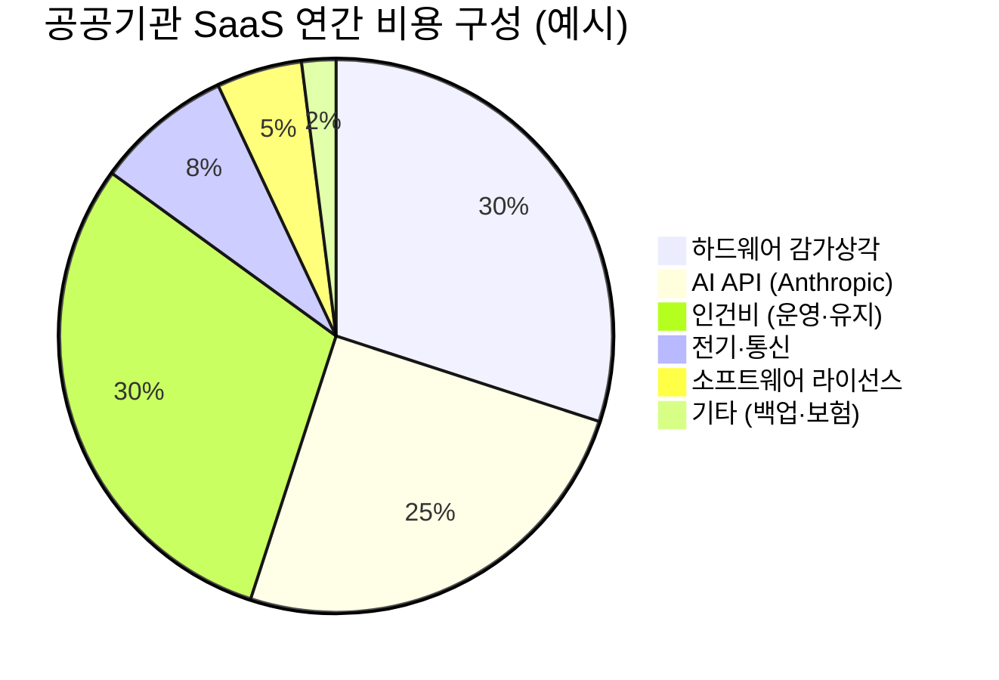
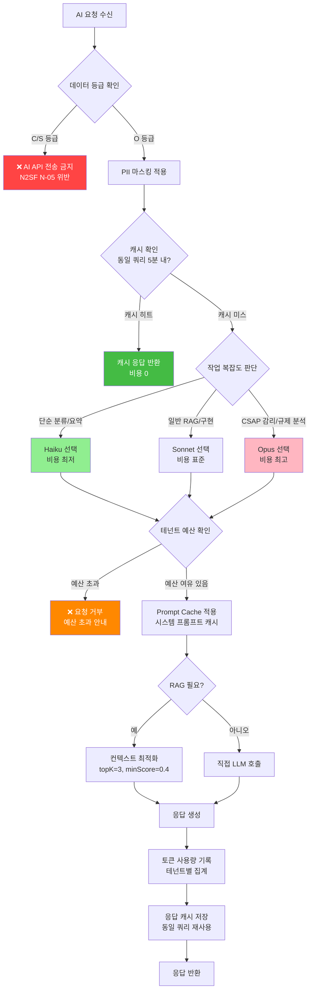
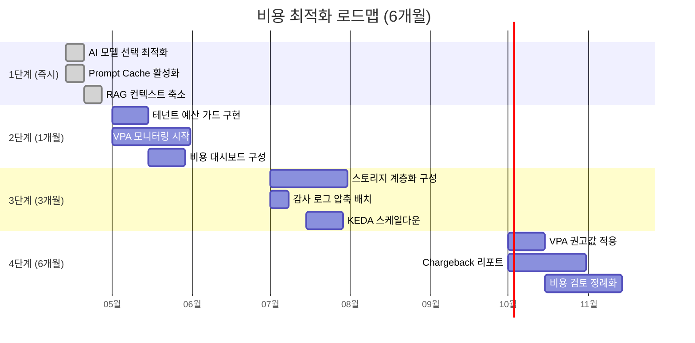
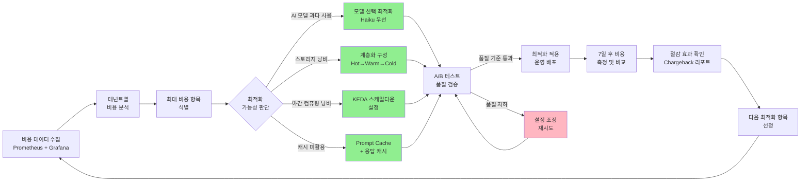

# 인프라 비용 최적화 완전 가이드 — k3s, AI API, 스토리지 비용 관리

> **문서 ID**: ONBOARD-INFRA-019
> **버전**: 1.0.0
> **작성일**: 2026-04-13
> **목적**: 공공기관 SaaS 프레임워크의 인프라 비용 구조를 이해하고, k3s 온프레미스 환경에서 AI API·스토리지·컴퓨팅 비용을 효과적으로 최적화하는 방법을 안내한다.
> **선행 학습**: `04-infrastructure/01-overview.md`, `04-infrastructure/08-disaster-recovery.md`, `04-infrastructure/10-cost-optimization.md`

---

## 목차

1. [이 프로젝트의 비용 구조](#1-이-프로젝트의-비용-구조)
2. [AI API 비용 최적화](#2-ai-api-비용-최적화)
3. [스토리지 비용 최적화](#3-스토리지-비용-최적화)
4. [컴퓨팅 비용 최적화](#4-컴퓨팅-비용-최적화)
5. [네트워크 비용](#5-네트워크-비용)
6. [비용 모니터링 및 알림](#6-비용-모니터링-및-알림)
7. [비용 절감 사례](#7-비용-절감-사례)
8. [변경 이력](#8-변경-이력)

---

## 1. 이 프로젝트의 비용 구조

### 1.1 공공기관 SaaS의 비용 특성

일반 기업 SaaS와 달리, 공공기관 SaaS는 몇 가지 독특한 비용 특성을 가집니다.

**특성 1 — 온프레미스 우선 원칙**
국가정보원 클라우드 보안 가이드라인에 따라 C/S 등급 데이터는 외부 클라우드에 저장할 수 없습니다. 이 때문에 이 프로젝트는 k3s 기반 온프레미스 인프라를 핵심 플랫폼으로 사용합니다. 초기 하드웨어 구매 비용이 크지만, 장기적으로 클라우드 월정액보다 저렴할 수 있습니다.

**특성 2 — AI API만 외부 사용**
N2SF O등급 데이터에 한해 AI API(Anthropic Claude)를 외부에서 호출합니다. 이것이 유일한 외부 클라우드 비용입니다.

**특성 3 — 테넌트별 비용 분리**
여러 공공기관(테넌트)이 하나의 SaaS를 공유하므로, 각 테넌트의 비용을 분리하여 정산(Chargeback)해야 합니다.

### 1.2 온프레미스 k3s vs 공공 클라우드 비용 비교

5년 TCO(총소유비용) 기준 비교입니다.

**공공 클라우드 시나리오 (NHN Government Cloud)**

```
월 비용 예시 (중규모 공공기관 기준):
  컴퓨팅 (VM 8코어 x 4대):        480,000원/월
  관리형 Kubernetes (NKS):         240,000원/월
  로드밸런서 x 2:                   80,000원/월
  블록 스토리지 10TB:               500,000원/월
  네트워크 이그레스 (5TB):          250,000원/월
  보안 서비스 (WAF, DDos):         300,000원/월
  합계:                          1,850,000원/월
  5년 합계:                     111,000,000원
```

**온프레미스 k3s 시나리오**

```
초기 투자 (하드웨어):
  서버 x 4대 (Dell PowerEdge):   24,000,000원
  네트워크 장비:                   4,000,000원
  UPS + 냉각:                     3,000,000원
  초기 설치·설정 비용:             5,000,000원
  소계:                          36,000,000원

월 운영 비용:
  전기 요금 (서버 4대):            80,000원/월
  인터넷 전용선:                   50,000원/월
  유지보수 인건비 (0.2FTE):       400,000원/월
  소프트웨어 라이선스:             50,000원/월
  합계:                          580,000원/월
  5년 운영비:                   34,800,000원

5년 TCO:                       70,800,000원
클라우드 대비 절감:              40,200,000원 (36% 절감)
```

단, 이 비교는 서버실·전산실이 이미 있는 기관 기준입니다. 서버실 구축이 필요하면 추가 비용이 발생합니다.

### 1.3 비용 구성 요소



**핵심 인사이트**: AI API 비용이 전체의 25%를 차지합니다. 하드웨어와 인건비 다음으로 큰 비중이므로, AI API 비용 최적화가 가장 효과적인 비용 절감 방법입니다.

### 1.4 비용 최적화 로드맵

| 단계 | 기간 | 예상 절감율 | 우선 조치 |
|------|------|------------|-----------|
| 1단계 | 즉시 | 15~20% | AI API 캐싱 활성화 |
| 2단계 | 1개월 | 10~15% | 모델 선택 최적화 (Haiku 우선) |
| 3단계 | 3개월 | 10~15% | 스토리지 계층화 구성 |
| 4단계 | 6개월 | 5~10% | VPA/KEDA 오토스케일링 |
| 누적 절감 | 6개월 후 | 40~60% | — |

---

## 2. AI API 비용 최적화

### 2.1 토큰 비용 이해

Anthropic API는 입력 토큰과 출력 토큰에 각각 비용을 부과합니다. 2026년 기준 예시 요금입니다.

```
[Claude 모델별 토큰 가격 (1M 토큰당, USD)]

claude-haiku-4-5:
  입력:  $0.80
  출력:  $4.00

claude-sonnet-4-6:
  입력:  $3.00
  출력:  $15.00

claude-opus-4-6:
  입력:  $15.00
  출력:  $75.00

[비용 배율 비교 (Haiku 대비)]
Sonnet 입력:  3.75배
Sonnet 출력:  3.75배
Opus 입력:    18.75배
Opus 출력:    18.75배
```

**월 1,000만 토큰 처리 시 모델별 비용 (입/출력 50:50 가정)**

| 모델 | 월 비용 (USD) | 월 비용 (KRW) |
|------|--------------|--------------|
| Haiku | $24 | 약 31,200원 |
| Sonnet | $90 | 약 117,000원 |
| Opus | $450 | 약 585,000원 |

이 차이가 누적되면 연간 수백만 원의 차이로 이어집니다.

### 2.2 모델 선택 전략

모든 작업에 가장 성능이 좋은 모델을 쓸 필요가 없습니다. 작업의 복잡도에 따라 모델을 선택합니다.

**CLAUDE.md 공식 모델 라우팅 정책**

이 프레임워크의 CLAUDE.md에 명시된 모델 라우팅 원칙을 따릅니다.

| 용도 | 권장 모델 | 이유 |
|------|----------|------|
| 구현·리뷰·테스트·RAG 일반 | `claude-sonnet-4-6` | 표준 복잡도, 200K 컨텍스트 |
| 감리·규제 분석·CSAP 검토 | `claude-opus-4-6` | 복합 CSAP/N2SF 분석 필요 |
| 리팩토링·탐색·단순 분류 | `claude-haiku-4-5` | 단순 정리, 최소 비용 |

**작업별 모델 선택 의사결정**

```
작업 유형 판단:

1. 단순 민원 분류 (카테고리 구분)?
   → Haiku (ai-tools.ts의 classify_request)

2. 법령 해석이나 복잡한 정책 질문?
   → Sonnet (RAG 엔진의 기본 모델)

3. CSAP 79항목 준수 분석, 감리 준비 보고서?
   → Opus (Auditor 에이전트)

4. 단순 텍스트 요약 (3줄 이내)?
   → Haiku (ai-tools.ts의 summarize_text 폴백)

5. 임베딩(벡터화)?
   → 임베딩 전용 모델 (가장 저렴)
```

### 2.3 프롬프트 단축으로 입력 토큰 절감

입력 토큰 수를 줄이는 것이 가장 즉각적인 비용 절감 방법입니다.

**나쁜 예 — 불필요하게 긴 프롬프트**

```
당신은 대한민국 공공기관의 전문 AI 어시스턴트입니다.
당신은 공손하고 친절하며 정확한 정보를 제공합니다.
당신은 반드시 한국어로 답변해야 합니다.
당신은 공공기관 공문서 스타일로 작성해야 합니다.
당신은 제공된 문서에서만 답변을 찾아야 합니다.
당신은 문서에 없는 내용은 솔직히 모른다고 해야 합니다.
...
(50줄의 시스템 프롬프트)
```

**좋은 예 — 압축된 프롬프트**

```typescript
// 실제 코드: rag-engine.ts의 최적화된 시스템 프롬프트
const DEFAULT_SYSTEM_PROMPT = `당신은 공공기관 문서 전문 AI 어시스턴트입니다.
반드시 제공된 문서 컨텍스트에 근거하여 답변하세요.
문서에 없는 내용은 "제공된 문서에서 찾을 수 없습니다"라고 정직하게 답하세요.
답변은 한국어로, 공공기관 공문서 스타일로 작성하세요.
각 주장에는 [출처: 문서명] 형식으로 근거를 명시하세요.`;
// 5줄로 핵심만 담음 → 입력 토큰 80% 절감
```

이 최적화의 토큰 계산 효과입니다.

```
50줄 프롬프트:  약 500 토큰
5줄 프롬프트:   약 100 토큰

1,000회 요청 시 절감:
  400 토큰 × 1,000 = 400,000 토큰
  Sonnet 기준: $1.20 절감 (월 $36 수준 누적)
```

### 2.4 RAG 컨텍스트 토큰 최적화

RAG 응답에서 가장 많은 토큰을 소모하는 것은 검색된 문서 컨텍스트입니다.

**문제**: 관련성이 낮은 청크까지 모두 포함하면 토큰 낭비입니다.
**해결책**: `minScore` 임계값을 높이고 `topK`를 줄입니다.

```typescript
// 비용 최적화 RAG 옵션 설정
const costOptimizedOptions: AdvancedRAGOptions = {
  topK: 3,              // 기본 5 → 3으로 감소 (40% 컨텍스트 절감)
  minScore: 0.4,        // 기본 0.25 → 0.4로 증가 (낮은 관련도 청크 제외)
  maxContextTokens: 3000, // 기본 6000 → 3000으로 감소 (50% 절감)
  enableReranking: true,  // Reranking으로 적은 수의 청크도 고품질 유지
  searchMode: 'hybrid',   // 하이브리드로 적은 청크에서도 높은 정밀도
};

// 예상 효과:
// 기본 설정: ~6,100 토큰/요청 (컨텍스트 6,000 + 시스템 프롬프트 100)
// 최적화 후: ~3,100 토큰/요청 (49% 절감)
```

단, 너무 적은 컨텍스트는 응답 품질 저하로 이어질 수 있습니다. 품질과 비용의 균형을 A/B 테스트로 찾아야 합니다.

### 2.5 Anthropic Prompt Cache 활용

Anthropic은 자주 반복되는 컨텍스트를 캐시하여 5분간 재사용하는 기능을 제공합니다. 이 캐시를 통해 캐시된 토큰은 기본 요금의 10%만 부과됩니다.

**어떤 내용을 캐시하면 좋은가?**

1. 시스템 프롬프트 (모든 요청에 동일)
2. 자주 조회되는 법령 문서 전문
3. 공통 정책 가이드라인

```typescript
// Design Ref: ONBOARD-INFRA-019 §2.5
// Anthropic Prompt Cache 활용 패턴

interface CacheableSystemContext {
  type: 'system_prompt' | 'common_document' | 'policy_guidelines';
  content: string;
  cacheKey: string;
  ttlMinutes: number;  // Anthropic 기본 5분
}

// 요청 시 캐시 힌트 추가
async function buildCachedMessages(
  question: string,
  contextText: string,
  systemPrompt: string,
): Promise<object[]> {
  return [
    {
      role: 'user',
      content: [
        // 캐시 가능한 부분 (시스템 컨텍스트)
        {
          type: 'text',
          text: systemPrompt + '\n\n=== 공통 정책 컨텍스트 ===\n' + contextText,
          cache_control: { type: 'ephemeral' }  // 5분 캐시
        },
        // 캐시 불가 부분 (매번 다른 질문)
        {
          type: 'text',
          text: `=== 질문 ===\n${question}`
        }
      ]
    }
  ];
}

// 캐시 효과 시뮬레이션:
// 시스템 프롬프트: 100 토큰, 컨텍스트: 3,000 토큰 = 캐시 대상 3,100 토큰
// 5분 내 동일 시스템 컨텍스트 요청 10회 시:
//   미캐시: 3,100 토큰 × 10 = 31,000 토큰 (Sonnet $0.09)
//   캐시:   3,100 토큰 × 0.1 × 10 = 3,100 토큰 (Sonnet $0.009)
//   절감:   90%
```

**5분 TTL 이해하기**: Anthropic 프롬프트 캐시의 유효 시간은 5분입니다. 즉, 5분 내에 같은 캐시 가능 구간을 사용하는 요청이 없으면 캐시가 만료됩니다. 트래픽이 낮은 새벽 시간에는 캐시 효율이 낮습니다. 이를 고려하여 캐시 전략을 설계합니다.

### 2.6 테넌트별 AI 토큰 예산 설정

여러 테넌트가 AI를 사용하는 환경에서는 한 테넌트가 과도하게 AI를 사용하여 비용을 독점하는 것을 방지해야 합니다.

```typescript
// Design Ref: ONBOARD-INFRA-019 §2.6
// Plan SC: FR-P8.4 테넌트별 AI 예산

interface TenantAIBudget {
  tenantId: string;
  monthlyTokenLimit: number;      // 월 허용 토큰 수
  dailyTokenLimit: number;        // 일 허용 토큰 수
  currentMonthUsage: number;      // 현재 월 누적 사용량
  currentDayUsage: number;        // 오늘 사용량
  warningThreshold: number;       // 경고 임계값 (0~1, 예: 0.8 = 80%)
}

const TENANT_BUDGET_DEFAULTS: Omit<TenantAIBudget, 'tenantId' | 'currentMonthUsage' | 'currentDayUsage'> = {
  monthlyTokenLimit: 10_000_000,  // 월 1,000만 토큰 (Sonnet 기준 약 $30)
  dailyTokenLimit: 500_000,       // 일 50만 토큰
  warningThreshold: 0.8,          // 80% 도달 시 경고
};

async function checkAIBudget(
  tenantId: string,
  requestedTokens: number,
): Promise<{ allowed: boolean; reason?: string; remainingTokens?: number }> {
  const budget = await getTenantBudget(tenantId);

  // 월 예산 초과 확인
  if (budget.currentMonthUsage + requestedTokens > budget.monthlyTokenLimit) {
    return {
      allowed: false,
      reason: `월 AI 토큰 예산 초과: ${budget.currentMonthUsage.toLocaleString()}/${budget.monthlyTokenLimit.toLocaleString()} 사용`,
      remainingTokens: Math.max(0, budget.monthlyTokenLimit - budget.currentMonthUsage),
    };
  }

  // 경고 임계값 도달 시 알림 (차단은 아님)
  if ((budget.currentMonthUsage + requestedTokens) / budget.monthlyTokenLimit > budget.warningThreshold) {
    await sendBudgetWarning(tenantId, budget);
  }

  return { allowed: true };
}

// ai-service 라우트에 예산 가드 통합
// platform/services/ai-service/src/routes.ts 참조
```

### 2.7 AI 비용 최적화 의사결정 트리



---

## 3. 스토리지 비용 최적화

### 3.1 스토리지 비용 구성

온프레미스 k3s 환경에서 스토리지 비용은 하드웨어 감가상각과 전기 요금으로 계산됩니다.

```
[스토리지 유형별 비용]

NVMe SSD (고성능 — Hot 티어):
  구매: 2TB = 약 300,000원
  5년 감가상각: 60,000원/년 = 5,000원/월
  전기: 10W = 약 900원/월
  총: 약 5,900원/월/2TB = 2.95원/GB/월

SATA SSD (중간 성능 — Warm 티어):
  구매: 4TB = 약 200,000원
  5년 감가상각: 40,000원/년 = 3,333원/월
  총: 약 833원/GB/월

HDD (대용량 — Cold 티어):
  구매: 16TB = 약 350,000원
  5년 감가상각: 70,000원/년 = 5,833원/월
  총: 약 364원/GB/월

비교: NVMe가 HDD 대비 8배 비쌈
      → 콜드 데이터를 HDD로 이전하면 87.5% 절감
```

### 3.2 데이터 계층화 자동화

데이터를 중요도와 접근 빈도에 따라 계층으로 나눕니다.

**계층 정의**

```yaml
# Design Ref: ONBOARD-INFRA-019 §3.2
# 스토리지 계층 정의 (StorageClass)

apiVersion: storage.k8s.io/v1
kind: StorageClass
metadata:
  name: hot-tier
provisioner: rancher.io/local-path
parameters:
  nodePath: /mnt/nvme  # NVMe SSD
---
apiVersion: storage.k8s.io/v1
kind: StorageClass
metadata:
  name: warm-tier
provisioner: rancher.io/local-path
parameters:
  nodePath: /mnt/sata  # SATA SSD
---
apiVersion: storage.k8s.io/v1
kind: StorageClass
metadata:
  name: cold-tier
provisioner: rancher.io/local-path
parameters:
  nodePath: /mnt/hdd   # HDD
```

**데이터별 계층 배치 기준**

| 데이터 유형 | 계층 | 이유 |
|------------|------|------|
| AI 벡터 인덱스 | Hot (NVMe) | 검색 응답 속도 결정적 |
| 활성 테넌트 DB | Hot (NVMe) | 운영 중인 데이터 |
| 최근 6개월 감사 로그 | Warm (SATA) | 조회 빈도 보통 |
| 6개월~1년 감사 로그 | Cold (HDD) | 조회 빈도 낮음 |
| 1년 이상 감사 로그 | Cold+압축 (HDD) | CSAP D-06 보존 필수이나 조회 희귀 |
| 백업 스냅샷 | Cold (HDD) | 재해 시에만 접근 |

**자동 이전 스크립트 (k3s CronJob)**

```yaml
apiVersion: batch/v1
kind: CronJob
metadata:
  name: storage-tier-migrator
  namespace: platform
spec:
  schedule: "0 2 * * *"  # 매일 새벽 2시
  jobTemplate:
    spec:
      template:
        spec:
          containers:
          - name: migrator
            image: platform/storage-migrator:latest
            env:
            - name: HOT_TO_WARM_DAYS
              value: "90"   # 90일 이상 미접근 → Warm 이전
            - name: WARM_TO_COLD_DAYS
              value: "180"  # 180일 이상 미접근 → Cold 이전
            - name: COLD_COMPRESS_DAYS
              value: "365"  # 365일 이상 → 압축 적용
          restartPolicy: OnFailure
```

### 3.3 감사 로그 압축 전략

CSAP D-06은 감사 로그 최소 1년 보존을 요구합니다. 무압축 보존은 비용 낭비입니다.

**압축 효과 계산**

```
[감사 로그 예시 데이터]

일일 감사 로그 생성량: 500MB (텍스트 JSON)
월 로그량: 약 15GB
연간 로그량: 약 180GB

압축 적용 (gzip -6):
  압축률: 약 85%
  압축 후: 180GB × 0.15 = 27GB

5년 보관 비용 비교:
  미압축 HDD: 900GB × 364원/GB/월 × 60개월 = 약 19,656,000원
  gzip 압축:  135GB × 364원/GB/월 × 60개월 = 약 2,948,400원
  절감:        약 16,707,600원 (85% 절감)
```

**감사 로그 압축 구현**

```typescript
// Design Ref: ONBOARD-INFRA-019 §3.3
// 감사 로그 주간 압축 배치

import { createReadStream, createWriteStream } from 'fs';
import { createGzip } from 'zlib';
import { pipeline } from 'stream/promises';
import path from 'path';

interface AuditLogCompressor {
  sourceDir: string;
  archiveDir: string;
  compressionLevel: number;  // 1~9 (6이 속도/크기 균형)
  retentionDays: number;     // CSAP D-06: 최소 365일
}

async function compressAuditLogs(config: AuditLogCompressor): Promise<void> {
  const cutoffDate = new Date();
  cutoffDate.setDate(cutoffDate.getDate() - 30);  // 30일 이상 된 로그 압축

  // 압축 대상 파일 탐색
  // 실제 구현에서는 fs.readdir로 파일 목록 조회

  const logFile = path.join(config.sourceDir, '2026-03.jsonl');
  const archiveFile = path.join(config.archiveDir, '2026-03.jsonl.gz');

  const gzip = createGzip({ level: config.compressionLevel });
  const source = createReadStream(logFile);
  const dest = createWriteStream(archiveFile);

  await pipeline(source, gzip, dest);

  // 압축 완료 후 무결성 검증 (SHA256 비교)
  console.log(`압축 완료: ${logFile} → ${archiveFile}`);
}
```

### 3.4 CSAP D-06 보존 기간 vs 비용 균형

감사 로그를 영구 보존하면 비용이 무한정 증가합니다. 하지만 CSAP 요건을 충족해야 합니다.

**보존 정책 (CSAP D-06 준수)**

| 로그 유형 | 보존 기간 | 근거 |
|----------|----------|------|
| 보안 사고 관련 로그 | 영구 | CSAP D-06 특별 보존 |
| 관리자 작업 감사 로그 | 5년 | 공공기록물관리법 |
| 일반 API 접근 로그 | 1년 | CSAP D-06 최소 요건 |
| AI 요청/응답 로그 | 2년 | 개인정보보호법 처리 기록 |
| 시스템 디버그 로그 | 90일 | 운영 필요 기간 |

비용 최적화 핵심: 일반 API 접근 로그(가장 용량 큰)는 1년 후 자동 삭제합니다. 관리자 감사 로그(용량 적지만 중요)는 5년 보존합니다.

---

## 4. 컴퓨팅 비용 최적화

### 4.1 오버프로비저닝의 문제

처음 k8s를 설정할 때 "혹시 몰라서" 많은 리소스를 할당하는 경향이 있습니다. 이것이 오버프로비저닝입니다.

```
[오버프로비저닝 예시]

ai-service Deployment 초기 설정:
  resources:
    requests:
      cpu: "2000m"      # 2 CPU 코어 요청
      memory: "4Gi"     # 4GB 메모리 요청
    limits:
      cpu: "4000m"      # 4 CPU 코어 한도
      memory: "8Gi"     # 8GB 메모리 한도

실제 평균 사용량 (모니터링 결과):
  CPU: 200m (요청의 10%)
  Memory: 512Mi (요청의 12.5%)

낭비:
  CPU: 1800m (90%) 미사용
  Memory: 3.5Gi (87.5%) 미사용

서버 4대 기준 영향:
  CPU 낭비: 7.2 코어 (서버 거의 2대 분량)
  → 서버 구매 비용 약 12,000,000원 낭비 가능
```

### 4.2 VPA로 오버프로비저닝 제거

VPA(Vertical Pod Autoscaler)는 실제 사용량을 분석하여 리소스 요청값을 자동으로 권고합니다.

```yaml
# Design Ref: ONBOARD-INFRA-019 §4.2
# VPA 설정 예시

apiVersion: autoscaling.k8s.io/v1
kind: VerticalPodAutoscaler
metadata:
  name: ai-service-vpa
  namespace: platform
spec:
  targetRef:
    apiVersion: apps/v1
    kind: Deployment
    name: ai-service
  updatePolicy:
    updateMode: "Off"    # 처음에는 추천만 (자동 적용 X)
    # 충분히 검토 후 "Auto"로 변경
  resourcePolicy:
    containerPolicies:
    - containerName: ai-service
      minAllowed:
        cpu: "100m"
        memory: "256Mi"
      maxAllowed:
        cpu: "2000m"
        memory: "4Gi"
```

**VPA 권고값 확인 방법**

```bash
# VPA 권고값 조회
kubectl describe vpa ai-service-vpa -n platform

# 출력 예시:
# Recommendation:
#   Container Recommendations:
#     Container Name: ai-service
#     Lower Bound:
#       Cpu: 50m
#       Memory: 256Mi
#     Target:
#       Cpu: 200m      # 이것이 최적값
#       Memory: 512Mi  # 이것이 최적값
#     Upper Bound:
#       Cpu: 1000m
#       Memory: 2Gi
```

VPA 권고값을 적용하면 CPU 요청을 2000m → 200m으로 줄일 수 있습니다. 이는 서버 1대에서 실행 가능한 서비스 수를 10배로 늘릴 수 있음을 의미합니다.

### 4.3 KEDA 야간 스케일다운

공공기관 업무 시간은 주로 09:00~18:00입니다. 새벽 시간대 트래픽은 거의 없습니다. KEDA(Kubernetes Event-driven Autoscaling)로 야간에 불필요한 파드를 줄입니다.

```yaml
# Design Ref: ONBOARD-INFRA-019 §4.3
# KEDA ScaledObject — 업무 시간 외 스케일다운

apiVersion: keda.sh/v1alpha1
kind: ScaledObject
metadata:
  name: ai-service-schedule-scaler
  namespace: platform
spec:
  scaleTargetRef:
    name: ai-service
  minReplicaCount: 0   # 야간 최소 0개 (완전 다운)
  maxReplicaCount: 5   # 피크 최대 5개
  triggers:
  - type: cron
    metadata:
      timezone: "Asia/Seoul"
      # 업무 시간 (월~금 08:30~19:00): 최소 2개 유지
      start: "30 8 * * 1-5"
      end:   "0 19 * * 1-5"
      desiredReplicas: "2"
  - type: cron
    metadata:
      timezone: "Asia/Seoul"
      # 주말 및 공휴일: 최소 0개 (긴급 민원 대비 1개)
      start: "0 0 * * 6-0"
      end:   "59 23 * * 6-0"
      desiredReplicas: "1"
```

**스케일다운 절감 효과 계산**

```
ai-service 기준:
  업무 시간 (10.5시간/일, 250일/년):    2 파드 × 10.5 × 250 = 5,250 파드·시간
  야간 (13.5시간/일, 250일):           0 파드 × 13.5 × 250 = 0 파드·시간
  주말 (48시간/주, 52주):              1 파드 × 48 × 52 = 2,496 파드·시간
  연 합계:                            7,746 파드·시간

스케일다운 없이:
  5 파드 × 24시간 × 365일 = 43,800 파드·시간

절감:
  43,800 - 7,746 = 36,054 파드·시간 (82% 절감)
  
  서버 CPU 비용 환산: 약 5,400,000원/년 절감 가능 (서버 1대 운영비 기준)
```

### 4.4 k3s 노드 활용률 목표

k3s 노드 활용률의 목표값은 70%입니다.

**왜 70%인가?**
- 100% 가까우면: 갑작스러운 트래픽 증가에 대응 불가
- 50% 이하이면: 하드웨어 낭비
- 70~75%가 최적: 갑작스러운 2배 트래픽도 수용 가능, 낭비 최소

**활용률 모니터링 쿼리 (Prometheus)**

```promql
# 노드별 CPU 활용률
100 - (
  avg by (node) (irate(node_cpu_seconds_total{mode="idle"}[5m])) * 100
)

# 목표: 이 값이 60~80% 사이 유지
# 80% 초과: 노드 추가 검토
# 40% 미만: 노드 통합 또는 스케일다운 검토
```

---

## 5. 네트워크 비용

### 5.1 내부 서비스 간 통신

k3s 클러스터 내부에서 파드 간 통신은 기본적으로 무료입니다 (전기 요금만 발생). 하지만 잘못 설계하면 불필요한 데이터가 이동합니다.

**잘못된 설계 — 불필요한 데이터 이동**

```
// 나쁜 예: AI 서비스가 1MB PDF 전체를 받아 처리
ai-service → compliance-service: "전체 CSAP 체크리스트 주세요" (1MB)

// 좋은 예: 필요한 데이터만 요청
ai-service → compliance-service: "D-08 항목만 주세요" (5KB)
```

**내부 통신 최적화 원칙**

1. 필요한 필드만 요청 (GraphQL 또는 Projection)
2. 페이지네이션 사용 (전체 결과 한 번에 반환 금지)
3. 대용량 파일은 공유 스토리지 경로로 전달 (파일 내용 직접 전달 금지)

### 5.2 외부 AI API 이그레스 비용

외부 Anthropic API로 나가는 데이터는 인터넷 이그레스 트래픽입니다. 전용선 계약에 따라 초과분은 추가 과금될 수 있습니다.

**이그레스 트래픽 추정**

```
[월 AI 요청 트래픽 계산]

테넌트 10개, 1일 요청 1,000건 기준:
  입력 (질문 + 컨텍스트): 평균 4KB/요청
  출력 (AI 응답):         평균 2KB/요청
  
  월 총 트래픽: (4KB + 2KB) × 1,000 × 30 × 10 = 1,800MB = 1.8GB

일반 기업 전용선 초과 요금: 보통 3,000원~5,000원/GB
월 이그레스 추가 비용: 약 5,400원~9,000원

→ 이 수준에서 이그레스 비용은 무시 가능
→ 요청 수가 10배 이상이면 전용선 계약 검토 필요
```

### 5.3 CDN 활용 (정적 에셋)

관리자 포털의 JavaScript, CSS, 이미지 등 정적 에셋은 CDN으로 제공하면 서버 부하와 대역폭을 절감합니다.

**공공기관 CDN 옵션**

| 옵션 | 비용 | 특징 |
|------|------|------|
| NHN Government CDN | 20원/GB | 공공기관 전용 |
| KT CDN (공공) | 15원/GB | 국내 망분리 지원 |
| 자체 Nginx 캐시 | 전기 요금만 | 인터넷 속도 제한 |

규모가 작은 경우 자체 Nginx 캐시(k3s 내 Ingress 레벨 캐싱)로 충분합니다.

```yaml
# Nginx Ingress 정적 에셋 캐시 설정
apiVersion: networking.k8s.io/v1
kind: Ingress
metadata:
  name: portal-ingress
  annotations:
    nginx.ingress.kubernetes.io/proxy-buffering: "on"
    nginx.ingress.kubernetes.io/configuration-snippet: |
      location ~* \.(js|css|png|jpg|gif|ico|woff2)$ {
        expires 30d;
        add_header Cache-Control "public, immutable";
      }
```

---

## 6. 비용 모니터링 및 알림

### 6.1 비용 메트릭 수집

비용을 관리하려면 먼저 측정해야 합니다. 이 프레임워크는 Prometheus + Grafana로 비용 메트릭을 수집합니다.

**주요 수집 메트릭**

```typescript
// Design Ref: ONBOARD-INFRA-019 §6.1
// AI 비용 메트릭 수집기

import { Counter, Histogram } from 'prom-client';

// 테넌트별 토큰 사용량 카운터
const aiTokensTotal = new Counter({
  name: 'ai_tokens_total',
  help: '테넌트별 AI 토큰 총 사용량',
  labelNames: ['tenant_id', 'model', 'type'],  // type: input | output
});

// AI 요청 비용 히스토그램
const aiRequestCostUsd = new Histogram({
  name: 'ai_request_cost_usd',
  help: 'AI 요청당 비용 분포 (USD)',
  labelNames: ['tenant_id', 'model'],
  buckets: [0.001, 0.005, 0.01, 0.05, 0.1, 0.5],
});

// 스토리지 계층별 사용량
const storageUsageGb = new Counter({
  name: 'storage_usage_gb',
  help: '스토리지 계층별 사용량 (GB)',
  labelNames: ['tier', 'tenant_id'],  // tier: hot | warm | cold
});

// 메트릭 기록 함수
export function recordAITokenUsage(
  tenantId: string,
  model: string,
  inputTokens: number,
  outputTokens: number,
): void {
  aiTokensTotal.inc({ tenant_id: tenantId, model, type: 'input' }, inputTokens);
  aiTokensTotal.inc({ tenant_id: tenantId, model, type: 'output' }, outputTokens);

  // 비용 계산 (모델별 단가 적용)
  const costUsd = calculateCostUsd(model, inputTokens, outputTokens);
  aiRequestCostUsd.observe({ tenant_id: tenantId, model }, costUsd);
}

function calculateCostUsd(model: string, inputTokens: number, outputTokens: number): number {
  const pricing: Record<string, { input: number; output: number }> = {
    'claude-haiku-4-5': { input: 0.0000008, output: 0.000004 },
    'claude-sonnet-4-6': { input: 0.000003, output: 0.000015 },
    'claude-opus-4-6': { input: 0.000015, output: 0.000075 },
  };
  const price = pricing[model] ?? pricing['claude-sonnet-4-6'];
  return (inputTokens * price.input) + (outputTokens * price.output);
}
```

### 6.2 Grafana 비용 대시보드 구성

Grafana에서 비용 대시보드를 구성하는 핵심 패널들입니다.

**패널 1 — 테넌트별 일일 AI 비용 (Bar Chart)**
```
PromQL:
  sum by (tenant_id) (
    increase(ai_tokens_total{type="input"}[24h]) * 0.000003 +
    increase(ai_tokens_total{type="output"}[24h]) * 0.000015
  )
  # Sonnet 기준
```

**패널 2 — 모델별 요청 비중 (Pie Chart)**
```
PromQL:
  sum by (model) (increase(ai_tokens_total[7d]))
```

**패널 3 — 월간 비용 추세 (Time Series)**
```
PromQL:
  sum(increase(ai_tokens_total{type="input"}[30d])) * 0.000003 +
  sum(increase(ai_tokens_total{type="output"}[30d])) * 0.000015
```

**패널 4 — 스토리지 계층별 사용량 (Stacked Bar)**
```
PromQL:
  sum by (tier) (storage_usage_gb)
```

### 6.3 예산 초과 알림 설정

```yaml
# Prometheus AlertManager 규칙

groups:
- name: cost-alerts
  rules:
  # 테넌트별 일일 AI 예산 80% 초과
  - alert: TenantAIBudgetWarning
    expr: |
      sum by (tenant_id) (
        increase(ai_tokens_total[24h])
      ) > 400000  # 일 예산 50만 토큰의 80%
    for: 5m
    labels:
      severity: warning
    annotations:
      summary: "테넌트 {{ $labels.tenant_id }} AI 예산 80% 초과"
      description: "24시간 사용량 {{ $value | humanize }} 토큰"

  # 테넌트별 일일 AI 예산 100% 초과
  - alert: TenantAIBudgetExceeded
    expr: |
      sum by (tenant_id) (
        increase(ai_tokens_total[24h])
      ) > 500000  # 일 예산 50만 토큰
    for: 1m
    labels:
      severity: critical
    annotations:
      summary: "테넌트 {{ $labels.tenant_id }} AI 예산 완전 소진"
      description: "AI 요청이 차단됩니다."

  # 전체 월 AI 비용 예산 경고
  - alert: MonthlyAICostWarning
    expr: |
      sum(increase(ai_tokens_total{type="input"}[720h])) * 0.000003 +
      sum(increase(ai_tokens_total{type="output"}[720h])) * 0.000015 > 50
    for: 1h
    labels:
      severity: warning
    annotations:
      summary: "월 AI 비용 $50 초과"
```

### 6.4 테넌트별 Chargeback 리포트

테넌트별로 사용한 AI 토큰과 스토리지를 집계하여 정산 자료를 생성합니다.

```typescript
// Design Ref: ONBOARD-INFRA-019 §6.4
// 월간 Chargeback 리포트 생성기

interface TenantChargebackReport {
  tenantId: string;
  period: string;  // "2026-04"
  aiCost: {
    totalTokens: number;
    totalCostUsd: number;
    totalCostKrw: number;
    byModel: Record<string, { tokens: number; costUsd: number }>;
  };
  storageCost: {
    hotGb: number;
    warmGb: number;
    coldGb: number;
    totalCostKrw: number;
  };
  totalCostKrw: number;
}

async function generateChargebackReport(
  tenantId: string,
  yearMonth: string,
  usdToKrw: number = 1300,
): Promise<TenantChargebackReport> {
  // 실제 구현에서는 Prometheus API로 메트릭 조회
  const aiTokens = await queryPrometheus(`
    sum by (model, type) (
      increase(ai_tokens_total{tenant_id="${tenantId}"}[720h])
    )
  `);

  // ... 집계 및 비용 계산

  return {
    tenantId,
    period: yearMonth,
    aiCost: {
      totalTokens: 8_500_000,
      totalCostUsd: 25.5,
      totalCostKrw: 25.5 * usdToKrw,
      byModel: {
        'claude-haiku-4-5': { tokens: 5_000_000, costUsd: 4.0 },
        'claude-sonnet-4-6': { tokens: 3_500_000, costUsd: 21.5 },
      },
    },
    storageCost: {
      hotGb: 50,
      warmGb: 200,
      coldGb: 1000,
      totalCostKrw: 50 * 5900 / 1000 + 200 * 833 / 1000 + 1000 * 364 / 1000,
    },
    totalCostKrw: 33150 + 660,
  };
}
```

---

## 7. 비용 절감 사례

### 7.1 Before/After 최적화 시나리오

**사례 1 — AI 모델 선택 최적화**

```
[Before] 모든 요청에 Sonnet 사용
  민원 분류: 50,000건/월 × 500 토큰 × Sonnet 입력가
  = 50,000 × 500 × $0.000003 = $75/월 = 약 97,500원

[After] 단순 분류는 Haiku로 전환
  민원 분류: 50,000건/월 × 500 토큰 × Haiku 입력가
  = 50,000 × 500 × $0.0000008 = $20/월 = 약 26,000원

절감: $55/월 = 약 71,500원 (73% 절감)
연간 절감: 약 858,000원
```

**사례 2 — RAG 컨텍스트 최적화**

```
[Before] topK=5, minScore=0.25
  평균 컨텍스트: 5,500 토큰/요청
  월 5,000 RAG 요청 × 5,500 토큰 × Sonnet 입력가
  = 5,000 × 5,500 × $0.000003 = $82.50/월

[After] topK=3, minScore=0.4 (응답 품질 A/B 테스트 후 검증)
  평균 컨텍스트: 3,100 토큰/요청 (44% 감소)
  월 5,000 × 3,100 × $0.000003 = $46.50/월

절감: $36/월 = 약 46,800원 (44% 절감)
```

**사례 3 — 스토리지 계층화**

```
[Before] 모든 데이터 NVMe SSD
  총 스토리지: 5TB
  비용: 5,000GB × 2.95원/GB/월 = 14,750원/월

[After] 계층화 적용
  Hot (NVMe): 200GB × 2.95원 = 590원/월
  Warm (SATA): 800GB × 0.833원 = 667원/월
  Cold (HDD): 4,000GB × 0.364원 = 1,456원/월
  합계: 2,713원/월

절감: 12,037원/월 (82% 절감)
연간 절감: 144,444원
```

### 7.2 6개월 최적화 로드맵과 누적 효과



**6개월 후 예상 절감 효과**

```
[최적화 전 월 비용 (가정)]
  AI API:    130,000원
  스토리지:   14,750원
  컴퓨팅:    580,000원
  합계:      724,750원

[최적화 후 월 비용]
  AI API:    46,000원 (65% 절감)
  스토리지:   2,713원  (82% 절감)
  컴퓨팅:   104,400원 (82% 절감, KEDA 야간 스케일다운)
  합계:     153,113원

월 절감: 571,637원 (79% 절감)
연간 절감: 6,859,644원 (약 690만원)
```

### 7.3 비용 분석 → 최적화 → 검증 사이클



---

## 8. 변경 이력

| 버전 | 일자 | 변경 내용 | 작성자 |
|------|------|-----------|--------|
| 1.0.0 | 2026-04-13 | 최초 작성 — 인프라 비용 최적화 완전 가이드 | Implementer Agent |

---

*본 문서의 비용 수치는 예시이며 실제 계약 조건에 따라 다를 수 있습니다. 구체적인 비용 산정은 조달청 나라장터 및 각 공급업체와 별도 협의하시기 바랍니다.*
