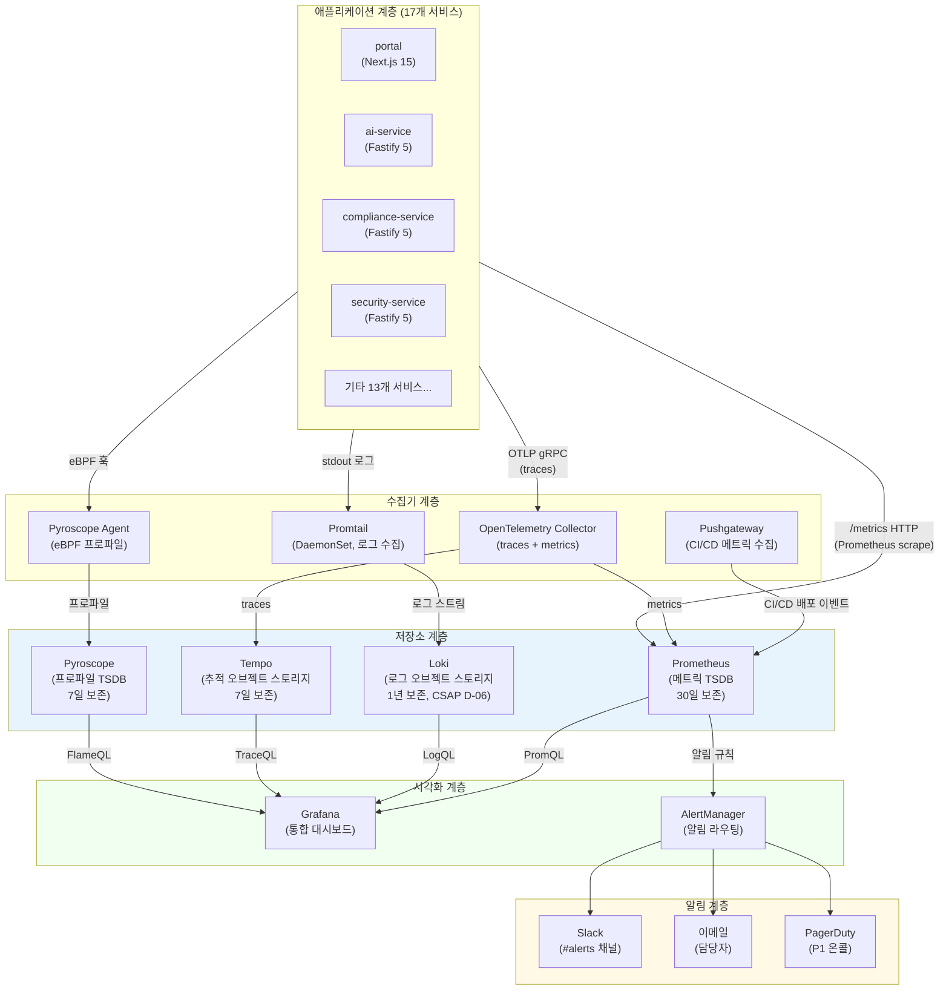
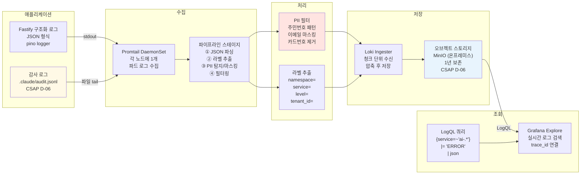

# 관측가능성 인프라 완전 가이드

> **대상 독자**: 공공기관 SaaS 프레임워크 신규 엔지니어 (인프라/백엔드 경험 6개월 이상)
> **작성일**: 2026-04-13
> **관련 CSAP 통제항목**: D-06(침해사고 관리), D-07(가용성 관리), D-12(시스템 개발 보안)
> **관련 Plan**: MTU-N251(DORA Four Keys), MTU-N252(AIOps RCA)

---

## 목차

1. [관측가능성 인프라란?](#1-관측가능성-인프라란)
2. [전체 스택 아키텍처](#2-전체-스택-아키텍처)
3. [Prometheus 스택 운영](#3-prometheus-스택-운영)
4. [Grafana 스택 운영](#4-grafana-스택-운영)
5. [Loki 로그 스택 운영](#5-loki-로그-스택-운영)
6. [Tempo 분산 추적 운영](#6-tempo-분산-추적-운영)
7. [Pyroscope 지속적 프로파일링](#7-pyroscope-지속적-프로파일링)
8. [K8s 배포 구성](#8-k8s-배포-구성)
9. [공공기관 SaaS 관측가능성 (CSAP D-06)](#9-공공기관-saas-관측가능성-csap-d-06)
10. [실습: trace_id 기반 요청 전체 추적](#10-실습-trace_id-기반-요청-전체-추적)

---

## 1. 관측가능성 인프라란?

### 1.1 초급자를 위한 직관적 설명

관측가능성(Observability)은 시스템 내부 상태를 외부에서 추론할 수 있는 능력입니다.
비유를 들어 설명하겠습니다.

자동차 계기판을 생각해 보십시오. 운전자는 엔진을 직접 보지 않아도 계기판의 속도계, 연료계, 경고등으로 자동차 상태를 파악합니다. 관측가능성 인프라는 소프트웨어 시스템의 계기판을 구축하는 작업입니다.

공공기관 SaaS 프레임워크는 17개 마이크로서비스가 동시에 실행됩니다. 하나의 API 요청이 `portal → ai-service → compliance-service → security-service` 순서로 흐를 때, 어떤 서비스에서 지연이 발생했는지, 어떤 오류가 발생했는지를 즉시 파악해야 합니다. 이것이 관측가능성이 필요한 핵심 이유입니다.

### 1.2 MELT 4종 — 관측가능성의 4개 기둥

관측가능성은 4가지 신호 유형(MELT)으로 구성됩니다.

| 신호 유형 | 영어 | 도구 | 답하는 질문 |
|-----------|------|------|-------------|
| **지표** | Metrics | Prometheus | "현재 초당 몇 개의 요청이 들어오는가?" |
| **이벤트** | Events | Loki (구조화 로그) | "언제, 무엇이 일어났는가?" |
| **로그** | Logs | Loki | "오류의 정확한 메시지는 무엇인가?" |
| **추적** | Traces | Tempo | "요청이 어떤 경로로 이동했는가?" |

각각이 왜 필요한지 구체적으로 설명합니다.

**지표(Metrics)가 필요한 이유**

지표는 시간에 따라 숫자로 집계된 데이터입니다. "현재 CPU 사용률이 80%이다", "초당 요청 수가 1,000건이다"처럼 현재 상태를 숫자로 표현합니다. SLO(서비스 수준 목표) 달성 여부를 측정하는 데 필수입니다. 예를 들어 "가용성 99.9% 이상 유지"라는 SLO는 지표 없이는 측정 자체가 불가능합니다.

**로그(Logs)가 필요한 이유**

로그는 시스템이 기록한 이벤트의 텍스트 기록입니다. 오류가 발생했을 때 "왜 오류가 발생했는가"를 파악하는 가장 직접적인 방법입니다. 지표는 "오류가 5% 증가했다"고 알려주지만, 로그는 "테넌트 A의 사용자 B가 권한 없는 리소스에 접근하려다 403 오류가 발생했다"는 구체적인 내용을 알려줍니다. 공공기관 SaaS에서는 CSAP D-06 요건에 따라 모든 민감 작업의 로그를 1년 이상 보존해야 합니다.

**추적(Traces)가 필요한 이유**

마이크로서비스 환경에서 하나의 요청은 여러 서비스를 거칩니다. 추적은 이 전체 여정을 하나의 맥락으로 연결합니다. "포털에서 5초가 걸렸다"는 지표로는 어느 서비스가 병목인지 알 수 없지만, 추적은 각 서비스별 소요 시간을 폭포수(Waterfall) 차트로 보여줍니다.

**프로파일링(Profiling)이 필요한 이유**

프로파일링은 "코드의 어느 함수가 CPU를 많이 사용하는가"를 측정합니다. 지표로 CPU 사용률이 높다는 것을 알았지만, 코드의 어느 부분이 원인인지는 프로파일링 없이는 파악하기 어렵습니다. Pyroscope는 프로덕션 환경에서 성능 저하 없이 지속적으로 프로파일을 수집합니다.

### 1.3 관측가능성 vs 모니터링

초급자가 자주 혼동하는 개념을 정리합니다.

| 구분 | 모니터링(Monitoring) | 관측가능성(Observability) |
|------|---------------------|--------------------------|
| 접근 방식 | 알려진 장애 감지 | 알 수 없는 장애도 추론 가능 |
| 핵심 질문 | "무엇이 잘못되었는가?" | "왜 잘못되었는가?" |
| 사전 지식 | 미리 알고 있는 장애 유형만 탐지 | 처음 보는 장애도 원인 파악 가능 |
| 도구 | 임계값 기반 알림 | 탐색적 질의(쿼리) 기반 분석 |
| 비유 | 체온계로 열을 확인 | MRI로 내부 상태 전체 파악 |

공공기관 SaaS는 두 가지를 모두 필요로 합니다. 알려진 장애 유형(모니터링)은 Prometheus AlertManager로 자동 알림하고, 알 수 없는 문제(관측가능성)는 Grafana 대시보드에서 탐색적으로 분석합니다.

---

## 2. 전체 스택 아키텍처

### 2.1 관측가능성 스택 전체 아키텍처



### 2.2 로그 파이프라인 상세



---

## 3. Prometheus 스택 운영

### 3.1 Prometheus란?

Prometheus는 시계열(Time Series) 데이터베이스 기반의 메트릭 수집 시스템입니다. 초급자에게 시계열 데이터를 설명하면, "2026-04-13 09:00:00에 CPU 사용률이 45%였고, 09:00:15에 47%였다"처럼 시간과 값의 쌍으로 기록되는 데이터입니다.

Prometheus의 특징적인 수집 방식은 **풀(Pull) 방식**입니다. 애플리케이션이 Prometheus에게 데이터를 보내는 것이 아니라, Prometheus가 주기적으로 애플리케이션의 `/metrics` 엔드포인트에 접속해서 데이터를 가져갑니다. 이 방식은 애플리케이션이 Prometheus의 주소를 알 필요가 없어 마이크로서비스 환경에서 유리합니다.

### 3.2 ServiceMonitor CRD 설계

Kubernetes에서 Prometheus가 어떤 서비스를 스크레이프할지 지정하는 방법은 `ServiceMonitor` CRD(Custom Resource Definition)를 사용하는 것입니다. 이는 Prometheus Operator가 제공하는 쿠버네티스 네이티브 방식입니다.

```yaml
# platform/services/ai-service/helm/templates/servicemonitor.yaml
# Design Ref: MTU-N251 §3.2 — DORA 메트릭 수집
# Plan SC: FR-N251.3

apiVersion: monitoring.coreos.com/v1
kind: ServiceMonitor
metadata:
  name: ai-service-monitor
  namespace: monitoring           # Prometheus가 위치한 네임스페이스
  labels:
    # Prometheus Operator가 이 레이블로 ServiceMonitor를 선택
    prometheus: kube-prometheus
    app: ai-service
spec:
  # 대상 서비스의 네임스페이스 선택
  namespaceSelector:
    matchNames:
      - platform
  # 대상 서비스를 선택하는 레이블 셀렉터
  selector:
    matchLabels:
      app: ai-service
  # 스크레이프 엔드포인트 설정
  endpoints:
    - port: http-metrics           # 서비스의 포트 이름 (숫자 아님)
      path: /metrics               # 메트릭 경로
      interval: 15s                # 15초마다 수집 (기본값)
      scrapeTimeout: 10s           # 10초 내 응답 없으면 타임아웃
      honorLabels: false           # 레이블 충돌 시 Prometheus 레이블 우선
      # TLS 설정 (서비스 메시 mTLS 환경)
      tlsConfig:
        insecureSkipVerify: false
        caFile: /etc/prometheus/secrets/linkerd-ca/ca.crt
      # 리라벨링: 불필요한 레이블 제거, 필요한 레이블 추가
      relabelings:
        - sourceLabels: [__meta_kubernetes_pod_name]
          targetLabel: pod
        - sourceLabels: [__meta_kubernetes_namespace]
          targetLabel: namespace
        - sourceLabels: [__meta_kubernetes_pod_label_app_version]
          targetLabel: version
      # 메트릭 리라벨링: 고카디널리티 메트릭 드롭
      metricRelabelings:
        # URL 경로를 포함한 고카디널리티 메트릭 드롭
        - sourceLabels: [__name__, uri]
          regex: 'http_requests_total;/api/v1/.*'
          action: drop
        # 내부 Go 런타임 메트릭 중 불필요한 것 제거
        - sourceLabels: [__name__]
          regex: 'go_gc_duration_seconds.*'
          action: drop
```

### 3.3 스크레이프 설정 최적화

공공기관 SaaS 환경에서 17개 서비스를 운영할 때 Prometheus 스크레이프 설정 최적화는 매우 중요합니다. 잘못 설정하면 Prometheus 자체가 과부하를 받아 메트릭을 놓칩니다.

**스크레이프 간격 설계 원칙**

| 서비스 유형 | 스크레이프 간격 | 이유 |
|-------------|----------------|------|
| SLO 핵심 서비스 (ai-service, portal) | 15s | 높은 정밀도로 SLO 측정 필요 |
| 일반 서비스 (compliance, security) | 30s | 표준 간격 |
| 배치 서비스, 비핵심 | 60s | 리소스 절약 |
| 인프라 (노드, etcd) | 15s | 인프라 이상 조기 감지 |

**카디널리티 관리 — 초급자 주의 사항**

카디널리티(Cardinality)란 메트릭의 레이블 조합 수를 의미합니다. 예를 들어 `tenant_id` 레이블에 10,000개의 테넌트 값이 있고, `user_id` 레이블에 100만 개의 사용자 값이 있다면, 조합 수는 100억이 됩니다. 이는 Prometheus가 감당할 수 없는 수준입니다.

```typescript
// 올바른 메트릭 설계 — 낮은 카디널리티
// packages/dora-exporter/src/index.ts 참고

import { Counter, Histogram, Registry } from 'prom-client';

const registry = new Registry();

// ✅ 올바른 예: 제한된 레이블 값
const httpRequestsTotal = new Counter({
  name: 'http_requests_total',
  help: '총 HTTP 요청 수',
  // 레이블 값이 제한적 (method: GET/POST/PUT/DELETE, status: 200/400/500 등)
  labelNames: ['method', 'status_code', 'service'],
  registers: [registry],
});

// ✅ 올바른 예: 히스토그램 버킷 명시적 설정
const httpDurationSeconds = new Histogram({
  name: 'http_request_duration_seconds',
  help: 'HTTP 요청 처리 시간 (초)',
  labelNames: ['method', 'route', 'service'],
  // SLO 기반 버킷 설계: p50, p90, p95, p99 측정 가능
  buckets: [0.005, 0.01, 0.025, 0.05, 0.1, 0.25, 0.5, 1, 2.5, 5, 10],
  registers: [registry],
});

// ❌ 잘못된 예: 고카디널리티 레이블
// user_id, request_id, tenant_id 등을 레이블로 사용하면 안 됨
// const wrongMetric = new Counter({
//   labelNames: ['user_id', 'request_id'],  // 수백만 개 조합 발생!
// });
```

### 3.4 데이터 보존 정책 (CSAP D-06)

CSAP D-06(침해사고 관리) 통제항목은 보안 관련 로그를 최소 1년간 보존하도록 요구합니다. Prometheus는 기본적으로 로컬 TSDB에 데이터를 저장하므로 장기 보존을 위해 별도의 설계가 필요합니다.

```yaml
# helm/prometheus/values.yaml
# Design Ref: MTU-N251 §4.1 — 데이터 보존 정책

prometheus:
  prometheusSpec:
    # 로컬 보존: 30일 (운영 분석용)
    retention: 30d
    retentionSize: 100GB

    # Thanos Sidecar 연동 (장기 보존)
    # 30일 이후 데이터는 MinIO 오브젝트 스토리지로 이동
    thanos:
      image:
        tag: v0.36.1
      objectStorageConfig:
        secret:
          type: s3
          config:
            bucket: prometheus-long-term
            endpoint: minio.storage.svc.cluster.local:9000
            # 시크릿은 환경 변수로 주입 (CSAP D-09: 하드코딩 금지)
            access_key: "${MINIO_ACCESS_KEY}"
            secret_key: "${MINIO_SECRET_KEY}"
            insecure: false

    # 저장 공간 설정
    storageSpec:
      volumeClaimTemplate:
        spec:
          storageClassName: local-path
          accessModes: ["ReadWriteOnce"]
          resources:
            requests:
              storage: 200Gi

    # 리소스 제한 (k3s 온프레미스 환경)
    resources:
      requests:
        cpu: 500m
        memory: 2Gi
      limits:
        cpu: 2000m
        memory: 8Gi
```

### 3.5 핵심 알림 규칙

공공기관 SaaS에서 반드시 설정해야 하는 Prometheus 알림 규칙입니다.

```yaml
# helm/prometheus/rules/slo-alerts.yaml
# Design Ref: MTU-N252 §3.3 — SLO 기반 알림
# CSAP: D-07 가용성 관리

apiVersion: monitoring.coreos.com/v1
kind: PrometheusRule
metadata:
  name: slo-alerts
  namespace: monitoring
spec:
  groups:
    - name: slo.availability
      interval: 30s
      rules:
        # 에러 버짓 빠른 소진 감지 (1시간 내 2% 소진)
        - alert: ErrorBudgetBurnRateHigh
          expr: |
            (
              1 - (
                sum(rate(http_requests_total{status_code!~"5.."}[1h])) by (service)
                /
                sum(rate(http_requests_total[1h])) by (service)
              )
            ) / (1 - 0.999) > 14.4
          for: 2m
          labels:
            severity: critical
            csap_ref: D-07
          annotations:
            summary: "{{ $labels.service }} 에러 버짓 빠른 소진 감지"
            description: |
              서비스 {{ $labels.service }}의 에러 버짓 소진율이 14.4배입니다.
              현재 추세대로라면 1시간 내 에러 버짓 2%가 소진됩니다.
              SLO 위반 위험이 높습니다. 즉시 확인하십시오.
            runbook: "https://wiki.internal/runbooks/slo-burn"

        # Graceful Shutdown 중 503 응답 추적
        # Design Ref: SVC-MESH-R13 — GracefulShutdown 클래스 연동
        - alert: ServiceShuttingDown503
          expr: |
            increase(http_requests_total{status_code="503",
              error_code="SERVICE_SHUTTING_DOWN"}[5m]) > 10
          for: 1m
          labels:
            severity: warning
          annotations:
            summary: "서비스 종료 중 503 응답 급증 ({{ $labels.service }})"
            description: |
              {{ $labels.service }}가 종료 과정에서 503 응답을 과다하게 반환합니다.
              graceful-shutdown timeout 설정을 확인하십시오.
              기본값: 30초 (k8s terminationGracePeriodSeconds와 일치)
```

---

## 4. Grafana 스택 운영

### 4.1 Grafana란?

Grafana는 Prometheus, Loki, Tempo, Pyroscope 등 여러 데이터 소스에서 데이터를 가져와 시각화하는 통합 대시보드 도구입니다. 초급자는 Grafana를 "관측가능성 데이터의 스프레드시트"로 생각하면 됩니다. 엑셀이 여러 소스의 데이터를 표와 차트로 보여주듯, Grafana는 여러 관측가능성 데이터를 대시보드로 통합합니다.

Grafana의 핵심 기능은 **상관 분석(Correlation)**입니다. 메트릭에서 이상 징후를 발견하면, 같은 시간대의 로그를 클릭 한 번으로 조회하고, 더 나아가 해당 요청의 전체 추적(Trace)까지 연결해서 볼 수 있습니다.

### 4.2 데이터소스 자동화 (ConfigMap)

Grafana 배포 시 데이터소스를 수동으로 UI에서 설정하면 반복 배포 시마다 재설정해야 합니다. ConfigMap으로 데이터소스를 코드화하면 Grafana가 시작할 때 자동으로 적용됩니다.

```yaml
# helm/grafana/templates/datasources-configmap.yaml
# Design Ref: MTU-N252 §4.2 — 관측가능성 통합

apiVersion: v1
kind: ConfigMap
metadata:
  name: grafana-datasources
  namespace: monitoring
  labels:
    grafana_datasource: "1"    # Grafana Sidecar가 이 레이블로 자동 로드
data:
  datasources.yaml: |
    apiVersion: 1

    datasources:
      # Prometheus: 메트릭 조회
      - name: Prometheus
        type: prometheus
        uid: prometheus-uid
        url: http://prometheus-operated.monitoring.svc:9090
        isDefault: true
        jsonData:
          timeInterval: "15s"
          queryTimeout: "60s"
          httpMethod: POST
          # Exemplar 활성화: 메트릭에서 Tempo 추적으로 바로 이동
          exemplarTraceIdDestinations:
            - name: trace_id
              datasourceUid: tempo-uid

      # Loki: 로그 조회
      - name: Loki
        type: loki
        uid: loki-uid
        url: http://loki-gateway.monitoring.svc:3100
        jsonData:
          timeout: 60
          maxLines: 1000
          # Loki에서 Tempo로 연결 (trace_id 필드 기반)
          derivedFields:
            - name: TraceID
              matcherRegex: '"trace_id":"(\w+)"'
              url: '$${__value.raw}'
              datasourceUid: tempo-uid

      # Tempo: 분산 추적 조회
      - name: Tempo
        type: tempo
        uid: tempo-uid
        url: http://tempo.monitoring.svc:3100
        jsonData:
          httpMethod: GET
          tracesToLogsV2:
            datasourceUid: loki-uid
            # Trace에서 Loki 로그로 연결
            tags:
              - { key: 'service.name', value: 'service' }
              - { key: 'k8s.pod.name', value: 'pod' }
          tracesToMetrics:
            datasourceUid: prometheus-uid
            # Trace에서 Prometheus 메트릭으로 연결
            tags:
              - { key: 'service.name', value: 'service' }
          serviceMap:
            datasourceUid: prometheus-uid

      # Pyroscope: 프로파일 조회
      - name: Pyroscope
        type: grafana-pyroscope-datasource
        uid: pyroscope-uid
        url: http://pyroscope.monitoring.svc:4040
```

### 4.3 대시보드 프로비저닝

대시보드도 ConfigMap으로 코드화하여 GitOps로 관리합니다.

```yaml
# helm/grafana/templates/dashboards-configmap.yaml
# DORA Four Keys 대시보드 프로비저닝 예시

apiVersion: v1
kind: ConfigMap
metadata:
  name: grafana-dashboard-dora
  namespace: monitoring
  labels:
    grafana_dashboard: "1"    # Grafana Sidecar 자동 로드 레이블
data:
  dora-four-keys.json: |
    {
      "title": "DORA Four Keys — 공공기관 SaaS",
      "uid": "dora-four-keys",
      "tags": ["dora", "csap", "sre"],
      "refresh": "1m",
      "panels": [
        {
          "title": "배포 빈도 (주간)",
          "type": "stat",
          "datasource": { "uid": "prometheus-uid" },
          "fieldConfig": {
            "defaults": {
              "thresholds": {
                "mode": "absolute",
                "steps": [
                  { "color": "red", "value": null },
                  { "color": "orange", "value": 1 },
                  { "color": "yellow", "value": 4 },
                  { "color": "green", "value": 7 }
                ]
              },
              "unit": "times/week"
            }
          },
          "targets": [
            {
              "expr": "dora:deployment_frequency:weekly",
              "legendFormat": "배포 빈도"
            }
          ]
        },
        {
          "title": "변경 실패율 (CFR)",
          "type": "gauge",
          "datasource": { "uid": "prometheus-uid" },
          "fieldConfig": {
            "defaults": {
              "min": 0,
              "max": 100,
              "thresholds": {
                "steps": [
                  { "color": "green", "value": null },
                  { "color": "orange", "value": 15 },
                  { "color": "red", "value": 30 }
                ]
              },
              "unit": "percent"
            }
          },
          "targets": [
            {
              "expr": "dora:change_failure_rate:ratio * 100",
              "legendFormat": "CFR %"
            }
          ]
        }
      ]
    }
```

### 4.4 Grafana 사용자 접근 제어 (CSAP D-08)

공공기관 SaaS에서 Grafana는 운영 메트릭과 로그를 노출하므로 RBAC 설정이 필수입니다.

```yaml
# helm/grafana/values.yaml — RBAC 설정
# CSAP: D-08 접근 통제

grafana:
  # 기본 관리자 비밀번호: 환경 변수로 주입 (하드코딩 금지)
  adminPassword: "${GRAFANA_ADMIN_PASSWORD}"

  # LDAP/OIDC 연동 (공공기관 통합인증 연동)
  auth:
    generic_oauth:
      enabled: true
      client_id: "${GRAFANA_OAUTH_CLIENT_ID}"
      client_secret: "${GRAFANA_OAUTH_CLIENT_SECRET}"
      scopes: "openid email groups"
      auth_url: https://sso.public.go.kr/auth
      token_url: https://sso.public.go.kr/token

  # 역할별 접근 권한
  rbac:
    # Viewer: 대시보드 읽기만 가능 (일반 운영자)
    # Editor: 대시보드 수정 가능 (시니어 엔지니어)
    # Admin: 데이터소스, 플러그인 관리 (인프라 팀)
    groups:
      - name: "sre-team"
        role: Editor
      - name: "dev-team"
        role: Viewer
      - name: "infra-admin"
        role: Admin
```

---

## 5. Loki 로그 스택 운영

### 5.1 Loki란?

Loki는 Grafana Labs에서 개발한 로그 집계 시스템입니다. Elasticsearch와 다르게 로그 내용을 전체 인덱싱하지 않고, **레이블(Label)만 인덱싱**합니다. 이 접근 방식은 스토리지 비용을 획기적으로 절감하지만, 로그 내용으로 검색할 때는 더 많은 시간이 걸립니다.

초급자를 위한 비유: Loki는 도서관의 분류 시스템과 같습니다. 책의 제목과 저자(레이블)만 색인하고, 책 내용(로그 본문)은 원본 그대로 보관합니다. 책을 찾을 때 분류(레이블)로 먼저 좁히고, 그 다음 내용을 검색합니다.

### 5.2 라벨 설계 전략 (낮은 카디널리티)

Loki 성능의 핵심은 **낮은 카디널리티** 라벨 설계입니다. Prometheus와 마찬가지로 카디널리티가 높으면 성능이 급격히 저하됩니다.

```yaml
# helm/promtail/values.yaml
# Design Ref: 로그 파이프라인 라벨 설계

config:
  clients:
    - url: http://loki-gateway.monitoring.svc:3100/loki/api/v1/push

  scrape_configs:
    - job_name: kubernetes-pods
      kubernetes_sd_configs:
        - role: pod
      pipeline_stages:
        # 1단계: JSON 파싱 (구조화 로그)
        - json:
            expressions:
              level: level          # 로그 레벨 추출
              service: service      # 서비스명 추출
              trace_id: trace_id    # 분산 추적 ID 추출
              tenant_id: tenant_id  # 테넌트 ID 추출

        # 2단계: 레이블로 승격 (낮은 카디널리티 값만!)
        # ✅ 올바른 예: 제한된 값을 가지는 필드
        - labels:
            level:      # error, warn, info, debug (4개 값)
            service:    # 서비스명 (17개 값)
            namespace:  # 쿠버네티스 네임스페이스 (5개 값)
        # ❌ 잘못된 예: 아래 필드들은 레이블로 만들지 말 것
        # tenant_id:   수천 개의 테넌트 = 고카디널리티
        # user_id:     수백만 개의 사용자 = 메모리 폭발
        # trace_id:    UUID = 무한 카디널리티

        # 3단계: trace_id는 레이블이 아닌 구조화 메타데이터로 저장
        # Loki v3.0+: structured metadata 기능 활용
        - structured_metadata:
            trace_id: trace_id    # 검색 가능하지만 인덱스 없음
            tenant_id: tenant_id

        # 4단계: PII 탐지 및 마스킹
        # CSAP D-12: 개인정보 비식별화
        - replace:
            # 주민등록번호 패턴: 000000-0000000
            expression: '(\d{6})-(\d{7})'
            replace: '${1}-*******'
        - replace:
            # 카드번호 패턴
            expression: '(\d{4})-(\d{4})-(\d{4})-(\d{4})'
            replace: '****-****-****-${4}'
        - replace:
            # 이메일 로컬 파트 마스킹
            expression: '([a-zA-Z0-9._%+-]{2})[a-zA-Z0-9._%+-]*(@[a-zA-Z0-9.-]+)'
            replace: '${1}***${2}'

        # 5단계: 불필요한 로그 필터링 (스토리지 절약)
        - drop:
            expression: '.*health.*check.*200.*'  # 헬스체크 로그 제거
            drop_counter_reason: health_check_noise
```

### 5.3 PII 탐지 파이프라인

공공기관 SaaS에서 로그에 개인정보(PII)가 포함되는 경우를 방지하는 것은 CSAP D-12 요건이자 개인정보보호법 준수 사항입니다.

```typescript
// 애플리케이션 레벨 PII 마스킹 예시
// platform/services/compliance-service/src/lib/audit.ts 패턴

interface LogEntry {
  level: string;
  msg: string;
  service: string;
  trace_id?: string;
  tenant_id?: string;
  // 사용자 ID는 해시로 저장 (직접 노출 금지)
  user_hash?: string;
  ts: string;
}

/**
 * PII 안전 로거 — 개인정보 자동 마스킹
 * CSAP D-12: 개인정보 비식별화
 */
export class PIISafeLogger {
  private readonly serviceName: string;

  constructor(serviceName: string) {
    this.serviceName = serviceName;
  }

  info(msg: string, meta?: Record<string, unknown>): void {
    const entry = this.buildEntry('info', msg, meta);
    process.stdout.write(JSON.stringify(entry) + '\n');
  }

  error(msg: string, meta?: Record<string, unknown>): void {
    // 에러 로그에는 스택 트레이스 포함, 단 DB 연결 정보 제거
    const sanitizedMeta = this.sanitizeErrorMeta(meta);
    const entry = this.buildEntry('error', msg, sanitizedMeta);
    process.stderr.write(JSON.stringify(entry) + '\n');
  }

  private buildEntry(level: string, msg: string, meta?: Record<string, unknown>): LogEntry {
    return {
      level,
      msg,
      service: this.serviceName,
      trace_id: this.getTraceId(),
      tenant_id: this.getTenantId(),
      ts: new Date().toISOString(),
      ...this.maskPII(meta),
    };
  }

  private maskPII(data?: Record<string, unknown>): Record<string, unknown> {
    if (!data) return {};
    const masked: Record<string, unknown> = {};

    for (const [key, value] of Object.entries(data)) {
      // 이메일 필드 마스킹
      if (key === 'email' && typeof value === 'string') {
        masked[key] = this.maskEmail(value);
        continue;
      }
      // 전화번호 필드 마스킹
      if ((key === 'phone' || key === 'phoneNumber') && typeof value === 'string') {
        masked[key] = this.maskPhone(value);
        continue;
      }
      // userId는 해시로 변환 (역추적 불가)
      if (key === 'userId' && typeof value === 'string') {
        masked['user_hash'] = this.hashUserId(value);
        continue;
      }
      // 비밀번호, 토큰, 시크릿은 완전 제거
      if (['password', 'token', 'secret', 'apiKey'].includes(key)) {
        masked[key] = '[REDACTED]';
        continue;
      }
      masked[key] = value;
    }
    return masked;
  }

  private maskEmail(email: string): string {
    const [local, domain] = email.split('@');
    if (!local || !domain) return '[MASKED_EMAIL]';
    return `${local.substring(0, 2)}***@${domain}`;
  }

  private maskPhone(phone: string): string {
    return phone.replace(/(\d{3})-(\d{3,4})-(\d{4})/, '$1-****-$3');
  }

  private hashUserId(userId: string): string {
    // 실제 구현에서는 crypto.createHash('sha256').update(userId).digest('hex')
    return `hash_${userId.substring(0, 4)}...`;
  }

  private sanitizeErrorMeta(meta?: Record<string, unknown>): Record<string, unknown> {
    if (!meta) return {};
    // DB 연결 문자열, 패스워드 등 제거
    const { dbUrl, connectionString, password, ...safe } = meta as Record<string, unknown>;
    void dbUrl; void connectionString; void password; // 의도적 제거
    return safe;
  }

  private getTraceId(): string | undefined {
    // OpenTelemetry Context에서 현재 trace_id 추출
    // 실제 구현: opentelemetry API 사용
    return process.env['OTEL_TRACE_ID'];
  }

  private getTenantId(): string | undefined {
    // AsyncLocalStorage에서 현재 테넌트 ID 추출
    return process.env['CURRENT_TENANT_ID'];
  }
}
```

### 5.4 LogQL 쿼리 실전 가이드

LogQL은 Loki의 쿼리 언어입니다. SQL과 유사하지만 로그에 특화된 문법을 사용합니다.

```logql
# 기본 로그 스트림 선택
{namespace="platform", service="ai-service"}

# 특정 레벨 필터링
{namespace="platform"} |= "ERROR"

# JSON 파싱 후 필드 필터링
{namespace="platform", service="ai-service"}
| json
| level = "error"
| duration > 1000

# 특정 trace_id로 전체 서비스 로그 추적
# (tenant_id는 structured_metadata에 있으므로 별도 필터)
{namespace="platform"}
| json
| trace_id = "abc123def456"

# 에러 발생 빈도 집계 (메트릭 변환)
sum by (service) (
  count_over_time(
    {namespace="platform"} |= "ERROR" [5m]
  )
)

# 응답 시간 분포 (히스토그램)
quantile_over_time(0.99,
  {namespace="platform", service="ai-service"}
  | json
  | unwrap duration [5m]
)

# CSAP 감사 로그 조회 (특정 액션)
{job="audit-log"}
| json
| action = "USER_DELETE"
| line_format "{{.timestamp}} [{{.actor}}] 삭제 대상: {{.target}} (IP: {{.ip}})"
```

---

## 6. Tempo 분산 추적 운영

### 6.1 분산 추적이란?

마이크로서비스 환경에서 사용자의 요청은 여러 서비스를 경유합니다. 분산 추적은 이 전체 여정을 **하나의 Trace ID**로 연결하여 시각화합니다.

초급자를 위한 비유: 택배 배송을 생각해보십시오. 하나의 운송장 번호(Trace ID)로 "발송 → 물류센터 1 → 물류센터 2 → 배송 차량 → 수령"의 전체 경로와 각 단계별 소요 시간을 추적합니다. Tempo가 하는 일이 정확히 이것입니다.

**핵심 용어**

- **Trace**: 하나의 사용자 요청 전체 여정 (유일한 trace_id 보유)
- **Span**: Trace를 구성하는 개별 작업 단위 (예: HTTP 요청, DB 쿼리, 외부 API 호출)
- **Parent Span / Child Span**: 상위-하위 관계로 트리 구조 형성
- **Exemplar**: Prometheus 메트릭과 Tempo Trace를 연결하는 샘플 포인트

### 6.2 OpenTelemetry Collector 설정

```yaml
# helm/otel-collector/values.yaml
# Design Ref: MTU-N252 §3.4 — 분산 추적 수집

config:
  receivers:
    otlp:
      protocols:
        grpc:
          endpoint: 0.0.0.0:4317   # OTLP gRPC 수신
        http:
          endpoint: 0.0.0.0:4318   # OTLP HTTP 수신

  processors:
    # 배치 처리: 네트워크 효율성
    batch:
      timeout: 5s
      send_batch_size: 512
      send_batch_max_size: 1024

    # 메모리 제한: OOM 방지
    memory_limiter:
      check_interval: 1s
      limit_mib: 1024
      spike_limit_mib: 256

    # 리소스 속성 추가 (K8s 메타데이터 자동 주입)
    resource:
      attributes:
        - key: deployment.environment
          value: production
          action: upsert

    # Span 속성에서 PII 제거
    # CSAP D-12: AI API 전송 전 마스킹
    transform:
      error_mode: ignore
      trace_statements:
        - context: span
          statements:
            # 이메일 주소 마스킹
            - replace_pattern(attributes["user.email"], "([^@]{2})[^@]*@", "$$1***@")
            # HTTP URL 쿼리 파라미터 제거 (토큰 등 포함 가능)
            - replace_pattern(attributes["http.url"], "\\?.*", "")

  exporters:
    # Tempo로 추적 데이터 전송
    otlp/tempo:
      endpoint: http://tempo.monitoring.svc:4317
      tls:
        insecure: true    # 클러스터 내부 통신 (Linkerd mTLS로 대체)

    # Prometheus로 메트릭 전송 (Span에서 메트릭 생성)
    prometheus:
      endpoint: 0.0.0.0:8889

  connectors:
    # Span Metrics: 추적 데이터에서 메트릭 자동 생성
    spanmetrics:
      histogram:
        explicit:
          buckets: [5ms, 10ms, 25ms, 50ms, 100ms, 250ms, 500ms, 1s, 2.5s, 5s]
      dimensions:
        - name: service.name
        - name: span.kind
        - name: http.method
        - name: http.status_code

  service:
    pipelines:
      traces:
        receivers: [otlp]
        processors: [memory_limiter, batch, resource, transform]
        exporters: [otlp/tempo]
      metrics:
        receivers: [otlp, spanmetrics]
        processors: [memory_limiter, batch]
        exporters: [prometheus]
```

### 6.3 애플리케이션 계측 (Fastify 5 + OpenTelemetry)

```typescript
// platform/services/ai-service/src/instrumentation.ts
// Design Ref: MTU-N252 §3.5 — 자동 계측

import { NodeSDK } from '@opentelemetry/sdk-node';
import { OTLPTraceExporter } from '@opentelemetry/exporter-trace-otlp-grpc';
import { Resource } from '@opentelemetry/resources';
import { SEMRESATTRS_SERVICE_NAME, SEMRESATTRS_SERVICE_VERSION } from '@opentelemetry/semantic-conventions';
import { getNodeAutoInstrumentations } from '@opentelemetry/auto-instrumentations-node';
import { PrometheusExporter } from '@opentelemetry/exporter-prometheus';

const sdk = new NodeSDK({
  // 서비스 리소스 정보
  resource: new Resource({
    [SEMRESATTRS_SERVICE_NAME]: process.env['SERVICE_NAME'] ?? 'ai-service',
    [SEMRESATTRS_SERVICE_VERSION]: process.env['SERVICE_VERSION'] ?? '1.0.0',
    'deployment.environment': process.env['NODE_ENV'] ?? 'production',
    'k8s.namespace.name': process.env['POD_NAMESPACE'] ?? 'platform',
    'k8s.pod.name': process.env['POD_NAME'] ?? 'unknown',
  }),

  // OTel Collector로 추적 데이터 전송
  traceExporter: new OTLPTraceExporter({
    url: process.env['OTEL_EXPORTER_OTLP_ENDPOINT'] ?? 'http://otel-collector.monitoring.svc:4317',
  }),

  // Prometheus 형식 메트릭 노출
  metricReader: new PrometheusExporter({
    port: 9464,    // /metrics 엔드포인트
  }),

  // 자동 계측: HTTP, gRPC, DB, Redis, Fastify 등
  instrumentations: [
    getNodeAutoInstrumentations({
      '@opentelemetry/instrumentation-http': {
        // 헬스체크는 추적에서 제외 (노이즈 감소)
        ignoreIncomingRequestHook: (req) => {
          return req.url?.includes('/health') ?? false;
        },
        // 요청 헤더에서 민감 정보 제거
        headersToSpanAttributes: {
          client: {
            requestHeaders: ['content-type', 'x-tenant-id'],
            // Authorization 헤더는 의도적으로 제외
          },
        },
      },
      '@opentelemetry/instrumentation-pg': {
        // DB 쿼리 파라미터는 수집하지 않음 (PII 포함 가능)
        dbStatementSerializer: (sql: string) => {
          // 파라미터 값 제거, 쿼리 구조만 유지
          return sql.replace(/\$\d+/g, '?');
        },
      },
    }),
  ],
});

sdk.start();

// 프로세스 종료 시 OTel SDK 정상 종료
// Design Ref: SVC-MESH-R13 — GracefulShutdown 패턴과 동일
process.on('SIGTERM', async () => {
  await sdk.shutdown();
});
```

### 6.4 샘플링 전략 (Head/Tail)

모든 추적 데이터를 저장하면 비용이 매우 높아집니다. 샘플링으로 저장 비용을 조절합니다.

**Head 샘플링 (시작 시 결정)**: 요청이 시작될 때 이 요청을 추적할지 결정합니다. 간단하고 오버헤드가 낮지만, 중요한 오류가 있는 요청이 샘플링되지 않을 위험이 있습니다.

**Tail 샘플링 (완료 후 결정)**: 요청이 완료된 후 추적 데이터 전체를 보고 저장 여부를 결정합니다. 오류, 지연 요청을 확실히 저장할 수 있지만 메모리 오버헤드가 있습니다.

```yaml
# OTel Collector Tail Sampling 정책
# Design Ref: MTU-N252 §3.6 — 샘플링 전략

processors:
  tail_sampling:
    # 추적 완료 대기 시간
    decision_wait: 10s
    # 추적 캐시 크기
    num_traces: 50000

    policies:
      # 정책 1: 오류가 있는 추적은 항상 저장 (100%)
      - name: errors-policy
        type: status_code
        status_code: { status_codes: [ERROR] }

      # 정책 2: 지연 요청 저장 (응답 시간 > 500ms)
      - name: latency-policy
        type: latency
        latency: { threshold_ms: 500 }

      # 정책 3: 정상 요청은 10%만 저장 (비용 절약)
      - name: probabilistic-policy
        type: probabilistic
        probabilistic: { sampling_percentage: 10 }

      # 정책 4: P1 테넌트(대형 고객)는 50% 샘플링
      - name: vip-tenant-policy
        type: string_attribute
        string_attribute:
          key: tenant.tier
          values: [premium, enterprise]
        # 이 정책에 해당하면 50% 추가 샘플링
        # (실제 구현: composite policy 사용)
```

---

## 7. Pyroscope 지속적 프로파일링

### 7.1 지속적 프로파일링이란?

프로파일링은 "프로그램의 어느 부분이 CPU, 메모리를 얼마나 사용하는가"를 측정하는 작업입니다. 기존 프로파일링 도구는 개발 환경에서만 사용하고, 프로덕션에서는 성능 저하 우려로 사용하지 않았습니다.

Pyroscope는 **지속적 프로파일링(Continuous Profiling)**을 제공합니다. eBPF 기술을 사용하여 프로덕션에서 약 1% 미만의 오버헤드로 항상 프로파일 데이터를 수집합니다.

초급자를 위한 비유: 자동차에 블랙박스를 달아두면, 사고 발생 후 사고 직전 영상을 볼 수 있습니다. Pyroscope는 소프트웨어의 "성능 블랙박스"입니다. 프로덕션에서 CPU 스파이크가 발생했을 때, 그 시점의 플레임 그래프를 바로 확인할 수 있습니다.

### 7.2 eBPF 기반 자동 계측

eBPF(extended Berkeley Packet Filter)는 Linux 커널에서 안전하게 코드를 실행할 수 있는 기술입니다. Pyroscope의 eBPF 모드는 애플리케이션 코드를 수정하지 않고도 CPU 프로파일을 수집합니다.

```yaml
# helm/pyroscope/values.yaml — eBPF 기반 프로파일링
# Design Ref: MTU-N252 §4.1 — 지속적 프로파일링

pyroscope:
  # Pyroscope Agent (eBPF) DaemonSet으로 각 노드에 배포
  agent:
    enabled: true
    # 특권 컨테이너 필요 (eBPF 커널 접근)
    securityContext:
      privileged: true
    # eBPF 수집 설정
    config: |
      [profiles]
        [profiles.cpu]
          sample_rate = 100   # 초당 100회 샘플링

      # Node.js 프로세스 프로파일링
      [[scrape_configs]]
        job_name = "nodejs-services"
        # cgroup v2 기반 자동 탐지
        [scrape_configs.selector]
          service_name = "~platform.*"
        [scrape_configs.profiling_config]
          # CPU 프로파일 (가장 중요)
          [scrape_configs.profiling_config.profile_cpu]
            enabled = true
            path = "/debug/pprof/profile"
            delta = true
          # 메모리 프로파일
          [scrape_configs.profiling_config.profile_mem]
            enabled = true
            path = "/debug/pprof/heap"
          # Goroutine 프로파일 (Go 서비스용)
          [scrape_configs.profiling_config.profile_goroutine]
            enabled = false   # Node.js 서비스는 해당 없음
```

### 7.3 플레임 그래프(Flame Graph) 읽는 방법

플레임 그래프는 프로파일 결과를 시각화한 것입니다. 초급자가 이해해야 할 핵심 사항:

1. **X축 (가로)**: 시간 비율이 아니라 CPU 시간 비율입니다. 넓을수록 많은 CPU를 사용합니다.
2. **Y축 (세로)**: 호출 스택 깊이입니다. 위로 갈수록 호출된 함수입니다.
3. **색상**: 의미 없습니다. 시각적 구분용입니다.
4. **성능 병목 찾기**: 가장 넓은 블록을 찾으세요. 그것이 가장 많은 CPU를 소비하는 함수입니다.

```typescript
// Node.js 서비스에서 Pyroscope SDK 연동 (push 방식)
// platform/services/ai-service/src/profiling.ts

import Pyroscope from '@pyroscope/nodejs';

// NOTE: eBPF 모드가 주 방식이지만, 세밀한 제어가 필요한 경우 SDK 사용
// Design Ref: MTU-N252 §4.2
export function initProfiling(): void {
  if (process.env['NODE_ENV'] !== 'production') {
    return;  // 개발 환경에서는 프로파일링 비활성화
  }

  Pyroscope.init({
    serverAddress: process.env['PYROSCOPE_URL'] ?? 'http://pyroscope.monitoring.svc:4040',
    appName: process.env['SERVICE_NAME'] ?? 'ai-service',
    tags: {
      version: process.env['SERVICE_VERSION'] ?? '1.0.0',
      namespace: process.env['POD_NAMESPACE'] ?? 'platform',
      pod: process.env['POD_NAME'] ?? 'unknown',
    },
    // 레이블 기반 프로파일: 테넌트별 분리 분석 가능
    // 단, tenant_id는 낮은 카디널리티 티어 그룹만 사용
    // (전체 tenant_id는 고카디널리티)
  });

  Pyroscope.start();
}
```

---

## 8. K8s 배포 구성

### 8.1 관측가능성 스택 Helm Chart 구성

```yaml
# helm/observability/Chart.yaml
# 관측가능성 스택 통합 Helm Chart

apiVersion: v2
name: observability-stack
description: 공공기관 SaaS 관측가능성 인프라 (MELT 4종)
version: 1.5.0
type: application

# 의존 차트
dependencies:
  # Prometheus 스택 (Prometheus + AlertManager + Grafana)
  - name: kube-prometheus-stack
    version: ">=65.0.0"
    repository: https://prometheus-community.github.io/helm-charts
    alias: prometheus

  # Loki 스택 (Loki + Promtail)
  - name: loki-stack
    version: ">=2.10.0"
    repository: https://grafana.github.io/helm-charts
    alias: loki

  # Tempo
  - name: tempo
    version: ">=1.10.0"
    repository: https://grafana.github.io/helm-charts

  # Pyroscope
  - name: pyroscope
    version: ">=1.7.0"
    repository: https://grafana.github.io/helm-charts

  # OpenTelemetry Collector
  - name: opentelemetry-collector
    version: ">=0.110.0"
    repository: https://open-telemetry.github.io/opentelemetry-helm-charts
    alias: otel-collector
```

### 8.2 리소스 요청/제한 최적화

k3s 온프레미스 환경에서는 리소스 제한을 신중하게 설정해야 합니다. 너무 작으면 관측가능성 시스템이 죽고, 너무 크면 애플리케이션 리소스를 빼앗습니다.

```yaml
# helm/observability/values.yaml — 리소스 최적화
# Design Ref: INFR-3 k3s 클러스터 리소스 예산

# Prometheus: 17개 서비스 메트릭 수집 (30일 보존)
prometheus:
  prometheusSpec:
    resources:
      requests:
        cpu: 500m       # 최소 보장
        memory: 2Gi
      limits:
        cpu: 2000m      # 스크레이프 집중 시 burst 허용
        memory: 8Gi     # 30일 데이터 + 쿼리 버퍼

# Grafana: UI 서버 (쿼리 오프로드됨)
grafana:
  resources:
    requests:
      cpu: 100m
      memory: 256Mi
    limits:
      cpu: 500m
      memory: 1Gi

# Loki: 로그 수집/저장 (1년 보존, 오브젝트 스토리지 활용)
loki:
  loki:
    resources:
      requests:
        cpu: 200m
        memory: 512Mi
      limits:
        cpu: 1000m
        memory: 2Gi

# Promtail: DaemonSet (각 노드에 1개)
loki:
  promtail:
    resources:
      requests:
        cpu: 50m        # 로그 파이프라인은 가볍게
        memory: 128Mi
      limits:
        cpu: 200m
        memory: 256Mi

# Tempo: 추적 저장 (7일 보존)
tempo:
  resources:
    requests:
      cpu: 200m
      memory: 512Mi
    limits:
      cpu: 1000m
      memory: 2Gi

# OTel Collector: 추적/메트릭 수집기
otel-collector:
  resources:
    requests:
      cpu: 100m
      memory: 256Mi
    limits:
      cpu: 500m
      memory: 1Gi

# Pyroscope: 프로파일 수집
pyroscope:
  resources:
    requests:
      cpu: 100m
      memory: 256Mi
    limits:
      cpu: 500m
      memory: 1Gi
```

### 8.3 고가용성(HA) 설정

공공기관 SaaS에서 관측가능성 시스템도 가용성이 중요합니다. 관측가능성 시스템이 다운되면 장애 대응이 어려워집니다.

```yaml
# Loki HA 설정 (2개 이상 레플리카)
loki:
  loki:
    commonConfig:
      replication_factor: 2    # 데이터 복제본 2개
    storage:
      type: s3                 # MinIO (S3 호환)

# Prometheus Federation (고가용성 구성)
# 2개 Prometheus 인스턴스가 동일 데이터 수집
prometheus:
  prometheusSpec:
    replicas: 2
    # 2개 중 하나가 죽어도 메트릭 연속성 유지

# AlertManager HA (3개 레플리카 클러스터)
alertmanager:
  alertmanagerSpec:
    replicas: 3    # gossip 프로토콜로 중복 알림 방지
```

---

## 9. 공공기관 SaaS 관측가능성 (CSAP D-06)

### 9.1 CSAP D-06 로그 보존 1년 요건

CSAP D-06(침해사고 관리) 통제항목은 다음을 요구합니다:

- **보존 기간**: 모든 보안 관련 로그 최소 1년 보존
- **무결성**: 로그 수정/삭제 불가 구조 (append-only)
- **접근 통제**: 로그 접근 자체도 로그로 기록
- **실시간성**: 로그 분석 도구 구비 및 상시 모니터링

```yaml
# Loki 로그 보존 정책 설정
# CSAP D-06: 1년 보존

loki:
  loki:
    limits_config:
      # 전역 보존 기간 (기본)
      retention_period: 365d    # 1년

      # 보안 관련 스트림은 더 긴 보존
      # (Loki v3.0 stream-level retention)
      per_stream_rate_limit: 10MB
      per_stream_rate_limit_burst: 20MB

    compactor:
      # 보존 정책 강제 적용
      retention_enabled: true
      retention_delete_delay: 2h
      retention_delete_worker_count: 150

    # 감사 로그 전용 스트림 규칙
    # {job="audit-log"} 스트림은 3년 보존 (감리 요건)
    ruler:
      storage:
        type: local
```

```typescript
// 감사 로그 append-only 구현
// platform/services/compliance-service/src/lib/audit.ts

import * as fs from 'fs';
import * as path from 'path';

interface AuditEntry {
  timestamp: string;
  actor: string;
  action: string;
  target?: string;
  detail?: string;
  ip?: string;
  tenant_id?: string;
  csap_ref?: string;
}

const AUDIT_LOG_PATH = process.env['AUDIT_LOG'] ?? '.claude/audit.jsonl';

/**
 * CSAP D-06: 감사 로그 기록 (append-only)
 * 수정/삭제가 불가능한 JSONL 형식으로 기록
 */
export async function auditLog(entry: AuditEntry): Promise<void> {
  const line = JSON.stringify({
    ...entry,
    timestamp: entry.timestamp ?? new Date().toISOString(),
  });

  // append 모드로만 쓰기 (수정 불가)
  await fs.promises.appendFile(
    path.resolve(AUDIT_LOG_PATH),
    line + '\n',
    { encoding: 'utf8', flag: 'a' }    // 'a' = append only
  );
}

/**
 * 민감 작업 감사 로그 래퍼
 * CSAP D-06: 모든 민감 작업 전수 기록
 */
export function withAudit<T>(
  action: string,
  csapRef: string,
  fn: () => Promise<T>
): (actor: string, target: string, ip: string, tenantId: string) => Promise<T> {
  return async (actor: string, target: string, ip: string, tenantId: string) => {
    await auditLog({
      timestamp: new Date().toISOString(),
      actor,
      action,
      target,
      ip,
      tenant_id: tenantId,
      csap_ref: csapRef,
      detail: `action_start`,
    });

    try {
      const result = await fn();
      await auditLog({
        timestamp: new Date().toISOString(),
        actor,
        action: `${action}_SUCCESS`,
        target,
        ip,
        tenant_id: tenantId,
        csap_ref: csapRef,
      });
      return result;
    } catch (error) {
      await auditLog({
        timestamp: new Date().toISOString(),
        actor,
        action: `${action}_FAILURE`,
        target,
        ip,
        tenant_id: tenantId,
        csap_ref: csapRef,
        // 에러 메시지는 민감 정보 제거 후 기록
        detail: error instanceof Error ? error.message : 'unknown_error',
      });
      throw error;
    }
  };
}
```

### 9.2 SLO 모니터링과 공공기관 보고

공공기관 SaaS는 SLA(서비스 수준 협약)를 계약으로 명시하고, SLO(서비스 수준 목표)로 내부 측정합니다.

```yaml
# Prometheus SLO 기록 규칙
# Design Ref: MTU-N251 §3.3 — SLO 메트릭

apiVersion: monitoring.coreos.com/v1
kind: PrometheusRule
metadata:
  name: slo-recording-rules
  namespace: monitoring
spec:
  groups:
    - name: slo.recording
      interval: 30s
      rules:
        # 5분 에러율 계산
        - record: slo:error_rate:5m
          expr: |
            1 - (
              sum(rate(http_requests_total{status_code!~"5.."}[5m])) by (service)
              /
              sum(rate(http_requests_total[5m])) by (service)
            )

        # 에러 버짓 소진율 (SLO 99.9% 기준)
        - record: slo:error_budget_burn_rate:1h
          expr: |
            (slo:error_rate:5m / (1 - 0.999)) * 100

        # 월간 가용성 (공공기관 보고용)
        - record: slo:availability:monthly
          expr: |
            avg_over_time(
              (1 - slo:error_rate:5m)[30d:5m]
            ) * 100
```

---

## 10. 실습: trace_id 기반 요청 전체 추적

### 10.1 실습 목표

사용자 요청 하나를 `trace_id`로 추적하여 portal → ai-service → compliance-service를 거치는 전체 경로를 Grafana에서 확인합니다.

### 10.2 실습 단계

**단계 1: 테스트 요청 생성**

```bash
# 추적 ID 직접 지정하여 요청 (테스트용)
TRACE_ID=$(openssl rand -hex 16)
echo "사용 trace_id: ${TRACE_ID}"

curl -v https://portal.saas.go.kr/api/v1/ai/analyze \
  -H "Content-Type: application/json" \
  -H "traceparent: 00-${TRACE_ID}-$(openssl rand -hex 8)-01" \
  -H "Authorization: Bearer ${TEST_TOKEN}" \
  -d '{"query": "CSAP 현황 분석", "tenant_id": "tenant-001"}'
```

**단계 2: Grafana Tempo에서 추적 조회**

1. Grafana 접속: `https://grafana.saas.go.kr`
2. Explore 메뉴 클릭
3. 데이터소스: Tempo 선택
4. Search 탭에서 Trace ID 입력: `${TRACE_ID}`
5. Run Query 클릭

**단계 3: 폭포수 차트 분석**

```
portal (총 2.3s)
├── ai-service (2.1s)
│   ├── rag-engine.search (1.5s) ← 병목!
│   │   └── vector-store.query (1.3s)
│   └── ai-agent.generate (0.5s)
└── compliance-service (0.1s)
    └── audit.log (0.05s)
```

**단계 4: 로그 연결 확인**

Tempo에서 Span을 클릭하면 "Logs for this span" 버튼이 나타납니다. 클릭하면 Loki에서 동일 `trace_id`의 로그를 자동으로 조회합니다.

**단계 5: Pyroscope 연결 (선택 사항)**

`rag-engine.search`가 1.5초로 병목임을 발견했다면:

1. Grafana → Explore → Pyroscope 데이터소스 선택
2. Service: ai-service 선택
3. Time range: 요청 발생 시간 전후 1분
4. Profile type: CPU 선택
5. 플레임 그래프에서 `vectorStore.cosineSearch` 함수가 넓게 표시되면, 벡터 검색 최적화 필요 확인

### 10.3 Fastify GracefulShutdown과 관측가능성 연동

`platform/packages/mesh-ready/src/graceful-shutdown.ts`의 `GracefulShutdown` 클래스는 관측가능성 시스템과 다음과 같이 연동됩니다.

```typescript
// Design Ref: SVC-MESH-R13 §3 — GracefulShutdown 관측가능성 연동
// Plan SC: FR-MESH.3

import { GracefulShutdown } from '@saas/mesh-ready';
import { Counter, Gauge } from 'prom-client';

// 셧다운 관련 메트릭 선언
const shuttingDownGauge = new Gauge({
  name: 'service_shutting_down',
  help: '서비스가 셧다운 중이면 1, 아니면 0',
  labelNames: ['service'],
});

const activeRequestsGauge = new Gauge({
  name: 'service_active_requests',
  help: '현재 처리 중인 요청 수',
  labelNames: ['service'],
});

const shutdown503Counter = new Counter({
  name: 'http_requests_total',
  help: 'HTTP 요청 수 (셧다운 503 추적용)',
  labelNames: ['status_code', 'error_code', 'service'],
});

// GracefulShutdown 인스턴스 생성 시 관측가능성 훅 주입
const gracefulShutdown = new GracefulShutdown({
  timeout: 30_000,    // k8s terminationGracePeriodSeconds와 일치
  logger: {
    info: (msg: string) => {
      process.stdout.write(JSON.stringify({
        level: 'info',
        component: 'graceful-shutdown',
        msg,
        ts: new Date().toISOString(),
      }) + '\n');
      // 셧다운 시작 시 메트릭 업데이트
      if (msg.includes('시작')) {
        shuttingDownGauge.labels({ service: 'ai-service' }).set(1);
      }
    },
    error: (msg: string) => {
      process.stderr.write(JSON.stringify({
        level: 'error',
        component: 'graceful-shutdown',
        msg,
        ts: new Date().toISOString(),
      }) + '\n');
    },
  },
  // 셧다운 시 정리 핸들러: DB 연결 해제, 캐시 플러시 등
  cleanupHandlers: [
    async () => {
      shuttingDownGauge.labels({ service: 'ai-service' }).set(0);
      activeRequestsGauge.labels({ service: 'ai-service' }).set(0);
      // OTel SDK flush (추적 데이터 손실 방지)
      // Design Ref: MTU-N252 §3.5
    },
  ],
});
```

### 10.4 자주 발생하는 문제와 해결

| 증상 | 가능한 원인 | 확인 방법 | 해결 방법 |
|------|-------------|-----------|-----------|
| Prometheus 스크레이프 실패 | 서비스 포트 불일치 | `kubectl describe servicemonitor` | ServiceMonitor port 이름 확인 |
| Loki 로그 누락 | Promtail DaemonSet 미배포 | `kubectl get pods -n monitoring` | DaemonSet toleration 확인 |
| Tempo 추적 단절 | OTel 헤더 전파 누락 | Grafana Tempo에서 추적 확인 | `traceparent` 헤더 전파 확인 |
| Grafana 대시보드 빈 화면 | 시간 범위 설정 오류 | 우상단 시간 범위 확인 | 최근 1시간으로 조정 |
| 카디널리티 초과 경고 | 고카디널리티 레이블 | `prometheus_tsdb_head_series` 메트릭 확인 | 고카디널리티 레이블 제거 |
| 프로파일 데이터 없음 | Pyroscope Agent 미배포 | `kubectl get daemonset -n monitoring` | 특권 컨테이너 설정 확인 |

---

## 부록: 관련 문서 및 참고 자료

- **설계 문서**: `docs/02-design/features/MTU-N251.design.md` (DORA Four Keys)
- **설계 문서**: `docs/02-design/features/MTU-N252.design.md` (AIOps RCA)
- **CSAP 준수**: `.claude/rules/csap-compliance.md`
- **실제 코드**: `platform/packages/mesh-ready/src/graceful-shutdown.ts`
- **에스컬레이션**: `packages/slo-escalation/src/escalation-controller.ts`
- **DORA 게이트**: `.gitea/workflows/dora-gate.yml`
- **Prometheus 규칙**: `helm/prometheus/rules/`
- **Grafana 대시보드**: `helm/grafana/dashboards/`

---

*이 문서는 CSAP D-06(침해사고 관리), D-07(가용성 관리), D-12(시스템 개발 보안) 요건을 반영하여 작성되었습니다.*
*변경 시 관측가능성 담당자와 보안 담당자 검토 필수.*
