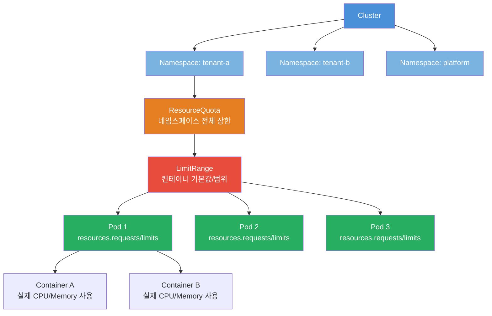
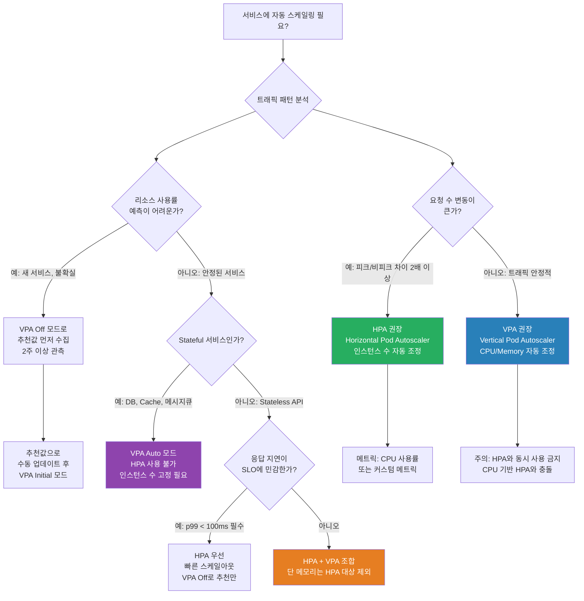

# Kubernetes 리소스 관리 완전 가이드

> 대상: Kubernetes 입문자 ~ 중급자
> 관련 컴포넌트: `platform/packages/mesh-ready/src/graceful-shutdown.ts`
> CSAP 연관: D-07 가용성 관리, D-08 접근 통제
> 최종 수정: 2026-04-13

---

## 목차

1. [K8s 리소스 관리란?](#1-k8s-리소스-관리란)
2. [ResourceQuota — 네임스페이스 할당량](#2-resourcequota--네임스페이스-할당량)
3. [LimitRange — 기본값 설정](#3-limitrange--기본값-설정)
4. [Vertical Pod Autoscaler (VPA)](#4-vertical-pod-autoscaler-vpa)
5. [PodDisruptionBudget (PDB)](#5-poddisruptionbudget-pdb)
6. [Quality of Service (QoS) 클래스](#6-quality-of-service-qos-클래스)
7. [graceful-shutdown 연동](#7-graceful-shutdown-연동)
8. [공공기관 SaaS 리소스 정책](#8-공공기관-saas-리소스-정책)
9. [실습: ai-service 리소스 설정](#9-실습-ai-service-resourcequota--pdb-설정)

---

## 1. K8s 리소스 관리란?

### 1.1 왜 리소스를 관리해야 하는가

Kubernetes 클러스터는 여러 팀, 여러 서비스가 동시에 사용하는 공유 인프라입니다. 공공기관 SaaS 환경에서는 수십 개의 테넌트가 동일한 k3s 클러스터 위에서 동작합니다. 리소스 관리 없이 배포하면 다음과 같은 문제가 발생합니다.

**문제 시나리오**: 테넌트 A의 AI 서비스가 갑자기 메모리를 과다 사용하면, 같은 노드에 있는 테넌트 B의 API 서버가 메모리 부족으로 강제 종료됩니다. 테넌트 B는 자신과 무관한 이유로 서비스 장애를 겪습니다.

Kubernetes 리소스 관리는 이런 상황을 방지하는 울타리(Fence) 역할을 합니다.

### 1.2 CPU와 메모리 단위 이해

초급자가 가장 헷갈리는 부분이 단위입니다. 한 번 제대로 이해하면 이후 모든 설정이 명확해집니다.

#### CPU 단위: 코어 vs 밀리코어(m)

```
1000m = 1 CPU 코어

예시:
  100m  → CPU 코어의 10% (0.1 코어)
  500m  → CPU 코어의 50% (0.5 코어)
  1000m → CPU 코어 1개 (1 코어)
  2000m → CPU 코어 2개 (2 코어)
```

실용적인 기준:
- 경량 API 서버: 100m ~ 250m
- 일반 웹 서비스: 250m ~ 500m
- AI 추론 서비스: 500m ~ 2000m
- 배치 처리: 1000m ~ 4000m

CPU는 **압축 가능한(compressible)** 리소스입니다. 제한을 초과하면 스로틀링(throttling)이 발생하여 느려지지만, 프로세스가 죽지는 않습니다.

#### 메모리 단위: Ki, Mi, Gi

```
메모리 단위 (1000 기반 vs 1024 기반):
  1K  = 1,000 바이트        (1000 기반)
  1Ki = 1,024 바이트        (1024 기반, kibibyte)
  
  1M  = 1,000,000 바이트   (1000 기반)
  1Mi = 1,048,576 바이트   (1024 기반, mebibyte)
  
  1G  = 1,000,000,000 바이트 (1000 기반)
  1Gi = 1,073,741,824 바이트 (1024 기반, gibibyte)

Kubernetes에서 권장하는 표기:
  128Mi = 약 134MB
  512Mi = 약 537MB
  1Gi   = 약 1.07GB
  2Gi   = 약 2.15GB
```

메모리는 **비압축 가능한(incompressible)** 리소스입니다. 제한을 초과하면 OOM Kill(Out Of Memory Kill)이 발생하여 프로세스가 강제 종료됩니다. 이것이 메모리 설정이 CPU보다 더 중요한 이유입니다.

### 1.3 요청(Request) vs 제한(Limit) 차이

이 개념은 Kubernetes 리소스 관리의 핵심입니다.

```
Request (요청):
  - 스케줄러가 Pod를 배치할 때 "최소 이 만큼의 리소스가 있는 노드에 배치해줘"라고 보장하는 값
  - 노드 선택의 기준이 됨
  - Request만큼은 항상 보장됨

Limit (제한):
  - "이 이상은 절대 사용하지 마"라는 상한선
  - CPU: 초과 시 스로틀링 (느려짐)
  - Memory: 초과 시 OOM Kill (프로세스 강제 종료)
```

**비유**: Request는 "좌석 예약", Limit은 "더 이상 의자를 가져오지 마"

```yaml
resources:
  requests:
    memory: "256Mi"   # 스케줄러에게: 256Mi 있는 노드에 배치해줘
    cpu: "250m"       # 스케줄러에게: 0.25 코어 있는 노드에 배치해줘
  limits:
    memory: "512Mi"   # 이 컨테이너는 512Mi를 초과할 수 없음
    cpu: "500m"       # 이 컨테이너는 0.5 코어를 초과할 수 없음
```

**중요 규칙**:
- `Request <= Limit` 이어야 함
- `Limit`이 없으면 해당 노드의 전체 리소스를 사용할 수도 있어 위험함
- 공공기관 환경에서는 Limit을 항상 명시해야 함 (CSAP D-07)

### 1.4 리소스 관리 계층 구조



위 그림에서 보듯이 리소스 관리는 4단계 계층으로 이루어집니다.

| 단계 | 객체 | 역할 | 설정 주체 |
|------|------|------|-----------|
| 1 | Cluster | 전체 물리 노드 자원 | 인프라팀 |
| 2 | ResourceQuota | 네임스페이스 전체 상한 | 인프라팀/테넌트 관리자 |
| 3 | LimitRange | 컨테이너별 기본값/범위 | 인프라팀 |
| 4 | Pod spec | 개별 컨테이너 설정 | 개발팀 |

---

## 2. ResourceQuota — 네임스페이스 할당량

### 2.1 ResourceQuota란

ResourceQuota는 특정 네임스페이스(Namespace)에서 사용할 수 있는 전체 리소스의 상한선을 정의합니다. "이 테넌트의 네임스페이스에서는 CPU 총합 10코어, 메모리 총합 20Gi를 넘을 수 없다"처럼 설정합니다.

### 2.2 기본 ResourceQuota 설정

공공기관 SaaS 프레임워크의 테넌트별 네임스페이스에 적용하는 기본 할당량입니다.

```yaml
# 파일: platform/helm/tenant-quota/templates/resource-quota.yaml
apiVersion: v1
kind: ResourceQuota
metadata:
  name: tenant-resource-quota
  namespace: tenant-{{ .Values.tenantId }}
  labels:
    app.kubernetes.io/managed-by: flux
    csap.go.kr/compliance: "D-07"
spec:
  hard:
    # CPU 할당량
    requests.cpu: "4"          # 전체 Pod의 CPU 요청 합계 상한
    limits.cpu: "8"            # 전체 Pod의 CPU 제한 합계 상한
    
    # 메모리 할당량
    requests.memory: 8Gi       # 전체 Pod의 메모리 요청 합계 상한
    limits.memory: 16Gi        # 전체 Pod의 메모리 제한 합계 상한
    
    # Pod 개수 제한
    pods: "50"                 # 네임스페이스에서 실행 가능한 최대 Pod 수
    
    # 서비스 제한
    services: "20"
    services.loadbalancers: "2"   # LoadBalancer 타입 Service 제한
    services.nodeports: "0"        # NodePort 사용 금지 (보안)
    
    # 스토리지 제한
    requests.storage: 100Gi    # 전체 PVC 용량 합계 상한
    persistentvolumeclaims: "10"
    
    # ConfigMap, Secret 제한
    configmaps: "50"
    secrets: "50"
```

### 2.3 ResourceQuota 상태 확인

```bash
# 현재 사용량 확인
kubectl describe resourcequota tenant-resource-quota -n tenant-abc

# 출력 예시
Name:                    tenant-resource-quota
Namespace:               tenant-abc
Resource                 Used     Hard
--------                 ----     ----
configmaps               12       50
limits.cpu               2500m    8
limits.memory            4Gi      16Gi
persistentvolumeclaims   3        10
pods                     8        50
requests.cpu             1250m    4
requests.memory          2Gi      8Gi
requests.storage         30Gi     100Gi
secrets                  18       50
services                 5        20
services.loadbalancers   1        2
services.nodeports       0        0
```

### 2.4 테넌트 등급별 할당량 전략

공공기관 SaaS는 테넌트 규모에 따라 리소스를 차등 배분합니다.

```yaml
# Small 테넌트 (소규모 기관, 50인 미만)
# 파일: platform/helm/tenant-quota/values-small.yaml
quota:
  requests:
    cpu: "2"
    memory: 4Gi
  limits:
    cpu: "4"
    memory: 8Gi
  pods: "20"
  storage: 50Gi

---
# Medium 테넌트 (중규모 기관, 50~500인)
# 파일: platform/helm/tenant-quota/values-medium.yaml
quota:
  requests:
    cpu: "4"
    memory: 8Gi
  limits:
    cpu: "8"
    memory: 16Gi
  pods: "50"
  storage: 200Gi

---
# Large 테넌트 (대규모 기관, 500인 이상)
# 파일: platform/helm/tenant-quota/values-large.yaml
quota:
  requests:
    cpu: "8"
    memory: 16Gi
  limits:
    cpu: "16"
    memory: 32Gi
  pods: "100"
  storage: 500Gi
```

### 2.5 ResourceQuota와 Namespace 생성 자동화

테넌트 온보딩 시 Flux GitOps를 통해 자동으로 Namespace와 ResourceQuota를 생성합니다.

```yaml
# 파일: platform/gitops/tenants/tenant-abc/kustomization.yaml
apiVersion: kustomize.toolkit.fluxcd.io/v1
kind: Kustomization
metadata:
  name: tenant-abc
  namespace: flux-system
spec:
  interval: 5m
  path: ./platform/helm/tenant-quota
  prune: true
  sourceRef:
    kind: GitRepository
    name: ai-saas
  postBuild:
    substitute:
      TENANT_ID: abc
      QUOTA_TIER: medium
```

### 2.6 ResourceQuota 초과 시 동작

ResourceQuota를 초과하는 Pod를 배포하려고 하면 즉시 오류가 발생합니다.

```
Error from server (Forbidden): pods "api-server-new" is forbidden:
exceeded quota: tenant-resource-quota,
requested: limits.memory=2Gi,
used: limits.memory=15Gi,
limited: limits.memory=16Gi
```

이 상황에서의 대응 방법:
1. 기존 Pod 중 불필요한 것 삭제
2. 기존 Pod의 Limit 값 조정 (과다 설정 여부 확인)
3. 테넌트 등급 업그레이드 요청

---

## 3. LimitRange — 기본값 설정

### 3.1 LimitRange란

LimitRange는 네임스페이스 내의 컨테이너별로 리소스의 기본값(default), 최솟값(min), 최댓값(max)을 설정합니다.

**LimitRange의 3가지 역할**:
1. **기본값 주입**: 개발자가 `resources`를 명시하지 않으면 자동으로 기본값 주입
2. **최솟값 강제**: 너무 낮은 값 설정 방지 (예: CPU 10m은 실용성 없음)
3. **최댓값 강제**: 단일 컨테이너가 과도한 리소스 요청 방지

### 3.2 기본 LimitRange 설정

```yaml
# 파일: platform/helm/tenant-quota/templates/limit-range.yaml
apiVersion: v1
kind: LimitRange
metadata:
  name: tenant-limit-range
  namespace: tenant-{{ .Values.tenantId }}
spec:
  limits:
  # 컨테이너별 제한
  - type: Container
    default:
      # 개발자가 limits를 생략하면 자동 주입되는 값
      cpu: 500m
      memory: 512Mi
    defaultRequest:
      # 개발자가 requests를 생략하면 자동 주입되는 값
      cpu: 100m
      memory: 128Mi
    max:
      # 단일 컨테이너의 최대 허용값
      cpu: "4"
      memory: 4Gi
    min:
      # 단일 컨테이너의 최소 허용값
      cpu: 50m
      memory: 64Mi

  # Pod 전체 제한 (모든 컨테이너 합계)
  - type: Pod
    max:
      cpu: "8"
      memory: 8Gi

  # PersistentVolumeClaim 제한
  - type: PersistentVolumeClaim
    max:
      storage: 50Gi
    min:
      storage: 1Gi
```

### 3.3 LimitRange 동작 확인

```bash
# LimitRange 상태 확인
kubectl describe limitrange tenant-limit-range -n tenant-abc

# 출력 예시
Name:                  tenant-limit-range
Namespace:             tenant-abc
Type       Resource  Min   Max   Default Request  Default Limit  Max Limit/Request Ratio
----       --------  ---   ---   ---------------  -------------  -----------------------
Container  cpu       50m   4     100m             500m           -
Container  memory    64Mi  4Gi   128Mi            512Mi          -
Pod        cpu       -     8     -                -              -
Pod        memory    -     8Gi   -                -              -
```

### 3.4 LimitRange 위반 사례 및 해결

```bash
# 최소값 미만 설정 시 오류
Error: pods "test-pod" is forbidden: [
  minimum cpu usage per Container is 50m, but limit is 10m.
  minimum memory usage per Container is 64Mi, but limit is 32Mi.
]

# 해결: limits를 최솟값 이상으로 설정
resources:
  limits:
    cpu: 100m    # 50m 이상
    memory: 128Mi  # 64Mi 이상
```

### 3.5 LimitRange 없는 경우의 위험성

LimitRange 없이 ResourceQuota만 있을 때, 개발자가 `resources`를 명시하지 않으면 Pod가 아예 생성되지 않습니다. ResourceQuota는 "requests/limits가 명시된 경우에만 합산"하기 때문에, LimitRange의 기본값이 없으면 ResourceQuota 검사가 실패합니다.

**권장 패턴**: 항상 LimitRange와 ResourceQuota를 함께 설정

```bash
# LimitRange 없이 ResourceQuota만 있을 때 발생하는 오류
Error from server (Forbidden): pods "my-pod" is forbidden:
[failed quota: tenant-resource-quota:
must specify limits.cpu for: my-container,
must specify limits.memory for: my-container]
```

---

## 4. Vertical Pod Autoscaler (VPA)

### 4.1 VPA란?

VPA는 Pod의 실제 사용량을 분석하여 최적의 Request/Limit 값을 **자동으로 추천하거나 적용**하는 도구입니다. 개발자가 처음에는 적당한 값을 설정하더라도, 시간이 지나면서 실제 사용 패턴에 맞게 자동 조정됩니다.

**VPA가 필요한 이유**:
- Request 과다 설정: 노드 낭비 (리소스 예약했지만 안 씀)
- Request 과소 설정: OOM Kill 발생 가능성

### 4.2 VPA 설치 (k3s 환경)

```bash
# VPA 컴포넌트 설치
git clone https://github.com/kubernetes/autoscaler.git
cd autoscaler/vertical-pod-autoscaler
./hack/vpa-up.sh

# 설치 확인
kubectl get pods -n kube-system | grep vpa
# 출력:
# vpa-admission-controller-xxx   1/1   Running
# vpa-recommender-xxx            1/1   Running
# vpa-updater-xxx                1/1   Running
```

### 4.3 VPA 모드 3가지

```yaml
# 모드 1: Off — 추천만 하고 적용 안 함 (초기 분석용)
apiVersion: autoscaling.k8s.io/v1
kind: VerticalPodAutoscaler
metadata:
  name: ai-service-vpa
  namespace: platform
spec:
  targetRef:
    apiVersion: apps/v1
    kind: Deployment
    name: ai-service
  updatePolicy:
    updateMode: "Off"    # 추천값 계산만 (Pod 재시작 없음)
  resourcePolicy:
    containerPolicies:
    - containerName: ai-service
      minAllowed:
        cpu: 100m
        memory: 256Mi
      maxAllowed:
        cpu: "4"
        memory: 8Gi

---
# 모드 2: Initial — Pod 생성 시에만 적용 (실행 중 변경 없음)
  updatePolicy:
    updateMode: "Initial"

---
# 모드 3: Auto — 자동 적용 (Pod 재시작하여 값 업데이트)
  updatePolicy:
    updateMode: "Auto"
```

### 4.4 VPA 추천값 확인

```bash
kubectl describe vpa ai-service-vpa -n platform

# 출력에서 추천값 확인
Status:
  Recommendation:
    Container Recommendations:
      Container Name: ai-service
      Lower Bound:
        Cpu:     100m
        Memory:  512Mi
      Target:          # 이 값을 Request로 설정 권장
        Cpu:     250m
        Memory:  768Mi
      Uncapped Target:
        Cpu:     200m
        Memory:  650Mi
      Upper Bound:     # 이 값을 Limit으로 설정 권장
        Cpu:     500m
        Memory:  1Gi
```

### 4.5 VPA vs HPA 선택 결정 트리



### 4.6 HPA와 VPA 충돌 방지

HPA(Horizontal Pod Autoscaler)와 VPA를 동시에 사용할 때 CPU 기반 HPA와 VPA Auto 모드가 충돌합니다.

```yaml
# 충돌 발생 시나리오:
# - HPA: CPU 70% 초과 시 Pod 수 늘림
# - VPA: CPU 부족 감지하여 CPU Request 늘림
# - HPA: CPU 사용률(%) 기준이 바뀌어 혼란 발생

# 안전한 조합:
# 방법 1: VPA는 메모리만 관리 (CPU는 HPA)
spec:
  resourcePolicy:
    containerPolicies:
    - containerName: api-server
      controlledResources: ["memory"]   # CPU 제외

# 방법 2: HPA는 커스텀 메트릭만 사용 (CPU 제외)
apiVersion: autoscaling/v2
kind: HorizontalPodAutoscaler
spec:
  metrics:
  - type: Pods
    pods:
      metric:
        name: http_requests_per_second   # CPU 대신 요청 수 기준
      target:
        type: AverageValue
        averageValue: 1000
```

### 4.7 VPA 운영 주의사항

공공기관 SaaS에서 VPA Auto 모드 사용 시 주의사항입니다.

```
주의사항 1: Pod 재시작 발생
- VPA Auto 모드는 값 적용 시 Pod를 재시작합니다.
- PDB(PodDisruptionBudget) 없이는 서비스 중단 가능
- 필수: VPA + PDB 동시 설정

주의사항 2: 야간 배치에 VPA 부적합
- 야간에만 CPU 폭발적으로 사용하는 배치 작업
- VPA가 낮 시간 기준으로 너무 낮게 추천할 수 있음
- 배치 서비스는 별도 Job/CronJob으로 분리

주의사항 3: 메모리 Limit 과다 설정 주의
- VPA Upper Bound가 너무 높으면 LimitRange max 초과 가능
- maxAllowed 값을 LimitRange max와 일치시킬 것
```

---

## 5. PodDisruptionBudget (PDB)

### 5.1 PDB란?

PDB는 "의도적인 중단"이 발생할 때 서비스의 최소 가용성을 보장합니다. "의도적인 중단"이란 노드 드레인(drain), 업그레이드, 유지보수 작업을 말합니다.

**배경**: Kubernetes에서 노드를 유지보수하려면 `kubectl drain`으로 해당 노드의 모든 Pod를 다른 노드로 이동시킵니다. PDB 없이는 특정 서비스의 모든 Pod가 동시에 이동될 수 있어 서비스 중단이 발생합니다.

### 5.2 minAvailable vs maxUnavailable

```yaml
# 방법 1: minAvailable — "최소 N개는 살아있어야 해"
apiVersion: policy/v1
kind: PodDisruptionBudget
metadata:
  name: ai-service-pdb
  namespace: platform
spec:
  minAvailable: 2     # 최소 2개 Pod는 항상 Running 상태 유지
  selector:
    matchLabels:
      app: ai-service

---
# 방법 2: maxUnavailable — "최대 N개까지는 중단 허용"
apiVersion: policy/v1
kind: PodDisruptionBudget
metadata:
  name: api-server-pdb
  namespace: platform
spec:
  maxUnavailable: 1   # 동시에 최대 1개 Pod만 중단 허용
  selector:
    matchLabels:
      app: api-server

---
# 퍼센트 표기도 가능
spec:
  minAvailable: "50%"    # 전체 Pod의 50% 이상 유지
  # 또는
  maxUnavailable: "25%"  # 전체 Pod의 25% 이하만 동시 중단 허용
```

### 5.3 PDB 설정 전략

| 서비스 유형 | 권장 설정 | 이유 |
|-------------|-----------|------|
| API 서버 (stateless) | `maxUnavailable: 1` | 롤링 업데이트와 호환성 |
| AI 서비스 (중요) | `minAvailable: 2` | 최소 2개 항상 보장 |
| DB (stateful) | `maxUnavailable: 0` | 중단 자체를 허용 안 함 |
| 배치 처리 | PDB 불필요 | 이미 1개 실행, 중단 허용 |

```yaml
# 공공기관 SaaS ai-service PDB — 3 Replica 기준
apiVersion: policy/v1
kind: PodDisruptionBudget
metadata:
  name: ai-service-pdb
  namespace: platform
  labels:
    csap.go.kr/compliance: "D-07"
    csap.go.kr/availability: "99.9"
spec:
  minAvailable: 2    # 3개 중 2개 보장 (1개만 드레인 허용)
  selector:
    matchLabels:
      app: ai-service
      version: stable
```

### 5.4 PDB 상태 확인

```bash
kubectl get pdb -n platform

# 출력 예시
NAME              MIN AVAILABLE   MAX UNAVAILABLE   ALLOWED DISRUPTIONS   AGE
ai-service-pdb    2               N/A               1                     7d
api-server-pdb    N/A             1                 2                     7d

# ALLOWED DISRUPTIONS: 현재 추가로 중단 허용되는 Pod 수
# 0이면 더 이상 드레인 불가능
```

```bash
# 드레인 시도 중 PDB에 막히는 경우
kubectl drain node01 --ignore-daemonsets --delete-emptydir-data

# 오류 메시지:
# error when evicting pods/"ai-service-7b9cf8d96-xk2p4" (will retry after 5s):
# Cannot evict pod as it would violate the pod's disruption budget.
```

### 5.5 롤링 업데이트 + PDB 조합

PDB와 Deployment의 롤링 업데이트 전략을 조합하면 무중단 배포가 가능합니다.

```yaml
# Deployment 롤링 업데이트 전략
apiVersion: apps/v1
kind: Deployment
metadata:
  name: ai-service
  namespace: platform
spec:
  replicas: 3
  strategy:
    type: RollingUpdate
    rollingUpdate:
      maxSurge: 1          # 업데이트 중 최대 1개 초과 허용 (4개까지 가능)
      maxUnavailable: 0    # 업데이트 중 중단 Pod 없음 (항상 3개 유지)
  # PDB와 조합: maxUnavailable: 0으로 하면 항상 3개 이상 유지
```

**동작 순서 (RollingUpdate + PDB)**:
1. 새 버전 Pod 1개 생성 (총 4개)
2. PDB 확인: minAvailable=2 충족 상태에서 기존 Pod 1개 종료
3. 새 버전 Pod가 Ready 상태가 되면 다음 기존 Pod 종료
4. 총 3번 반복하여 완전 교체 완료
5. 전체 과정에서 최소 2개 항상 Running 상태 보장

---

## 6. Quality of Service (QoS) 클래스

### 6.1 QoS란?

Kubernetes는 Pod의 리소스 설정에 따라 자동으로 QoS 클래스를 부여합니다. 노드 메모리가 부족할 때 어떤 Pod를 먼저 종료할지(OOM Kill) 결정하는 우선순위 기준이 됩니다.

### 6.2 3가지 QoS 클래스

```
1. Guaranteed (보장형) — OOM Kill 우선순위 가장 낮음 (마지막으로 종료)
   조건: 모든 컨테이너에 requests == limits 설정
   
   예시:
     resources:
       requests:
         cpu: 500m
         memory: 512Mi
       limits:
         cpu: 500m      # requests와 동일
         memory: 512Mi  # requests와 동일

2. Burstable (폭발형) — OOM Kill 우선순위 중간
   조건: 최소 하나의 컨테이너에 requests 또는 limits가 있지만 Guaranteed 조건 불충족
   
   예시:
     resources:
       requests:
         cpu: 100m
         memory: 128Mi
       limits:
         cpu: 500m      # requests와 다름
         memory: 512Mi  # requests와 다름

3. BestEffort (최선형) — OOM Kill 우선순위 가장 높음 (가장 먼저 종료)
   조건: 어떤 컨테이너에도 requests, limits 미설정
   
   예시:
     # resources 블록 없음 — 매우 위험!
```

### 6.3 QoS 등급 확인

```bash
kubectl get pod ai-service-7b9cf8d96-xk2p4 -n platform -o jsonpath='{.status.qosClass}'
# 출력: Guaranteed
```

### 6.4 공공기관 SaaS QoS 정책

```
CSAP D-07 가용성 요건에 따른 QoS 정책:

Critical 서비스 (ai-service, api-gateway, auth-service):
  → Guaranteed 클래스 필수 (requests == limits)
  
Standard 서비스 (notification, billing 등):
  → Burstable 클래스 허용 (requests < limits)
  
Background 작업 (배치, 마이그레이션):
  → Burstable 허용, BestEffort는 금지
```

```yaml
# CSAP Critical 서비스 예시 — Guaranteed QoS
# 파일: platform/services/ai-service/helm/values.yaml
resources:
  requests:
    cpu: "500m"
    memory: "1Gi"
  limits:
    cpu: "500m"     # requests와 완전히 동일 → Guaranteed
    memory: "1Gi"   # requests와 완전히 동일 → Guaranteed
```

### 6.5 OOM Kill 시 대응

```bash
# OOM Kill 발생 확인
kubectl describe pod ai-service-7b9cf8d96-xk2p4 -n platform | grep -A 5 "OOMKilled"

# 출력 예시:
Last State:  Terminated
  Reason:    OOMKilled       # 메모리 초과 강제 종료
  Exit Code: 137
  Started:   Mon, 13 Apr 2026 09:00:00 +0900
  Finished:  Mon, 13 Apr 2026 09:05:32 +0900

# 대응 방법:
# 1. 메모리 사용량 분석
kubectl top pod ai-service-7b9cf8d96-xk2p4 -n platform --containers

# 2. Limit 값 상향 조정
# 3. VPA 추천값 확인하여 Request/Limit 재설정
```

---

## 7. graceful-shutdown 연동

### 7.1 왜 graceful-shutdown이 리소스 관리와 연관되는가

Pod가 종료될 때(OOM Kill, drain, 업데이트 등) Kubernetes는 다음 순서로 신호를 보냅니다.

```
1. SIGTERM 전송 (프로세스에게 "종료 준비해")
2. terminationGracePeriodSeconds 동안 대기
3. 대기 시간 초과 시 SIGKILL 전송 (강제 종료)
```

애플리케이션이 SIGTERM을 받고 제대로 처리하지 못하면:
- 진행 중인 요청이 강제 종료됨 (데이터 손실 가능)
- DB 연결이 비정상 종료됨 (커넥션 풀 오염)
- 처리 중인 메시지가 유실됨

### 7.2 실제 소스 코드 분석

공공기관 SaaS 프레임워크의 `graceful-shutdown.ts`는 이 문제를 체계적으로 해결합니다.

```typescript
// 파일: platform/packages/mesh-ready/src/graceful-shutdown.ts
// Design Ref: SVC-MESH-R13 Plan | Plan SC: FR-MESH.3 | CSAP: D-07 가용성 관리

export class GracefulShutdown {
  private readonly timeout: number;        // 기본 30초 (DEFAULT_TIMEOUT = 30_000)
  private isShuttingDown = false;          // 셧다운 상태 플래그
  private activeRequests = 0;              // 진행 중 요청 카운터

  // SIGTERM 수신 시 순서:
  // 1. readiness = false (신규 요청 거부)
  // 2. 진행 중 요청 완료 대기 (최대 30초)
  // 3. 정리 핸들러 실행 (DB 연결, 캐시 등)
  // 4. Fastify 서버 종료
  // 5. 프로세스 종료 (exit 0)

  registerWithFastify(app: FastifyInstance): void {
    // onRequest 훅: 셧다운 중이면 503 반환 (신규 요청 거부)
    app.addHook('onRequest', async (_request, reply) => {
      if (this.isShuttingDown) {
        reply.status(503).send({
          error: 'Service Unavailable',
          message: '서비스가 종료 중입니다',
          code: 'SERVICE_SHUTTING_DOWN',
        });
        return;
      }
      this.incrementRequests();  // 활성 요청 카운터 증가
    });

    // onResponse 훅: 요청 완료 시 카운터 감소
    app.addHook('onResponse', async () => {
      this.decrementRequests();
    });

    // SIGTERM/SIGINT 핸들러 등록
    process.on('SIGTERM', () => {
      this.shutdown(app)
        .then(() => process.exit(0))
        .catch((err) => {
          this.logger.error(`셧다운 중 오류: ${String(err)}`);
          process.exit(1);
        });
    });
  }
}
```

### 7.3 terminationGracePeriodSeconds 설정

`terminationGracePeriodSeconds`는 Kubernetes가 SIGTERM 후 SIGKILL을 보내기까지 기다리는 시간입니다. 이 값은 애플리케이션의 graceful shutdown 타임아웃보다 커야 합니다.

```yaml
# 파일: platform/services/ai-service/helm/templates/deployment.yaml
apiVersion: apps/v1
kind: Deployment
metadata:
  name: ai-service
  namespace: platform
spec:
  template:
    spec:
      # CSAP D-07: graceful shutdown 시간 보장
      # graceful-shutdown.ts DEFAULT_TIMEOUT = 30초
      # + DB 연결 종료 시간 5초
      # + 버퍼 5초
      # = 40초 설정
      terminationGracePeriodSeconds: 40

      containers:
      - name: ai-service
        image: registry.internal/ai-service:latest

        # SIGTERM 수신 처리는 graceful-shutdown.ts에서 담당
        # preStop Hook: SIGTERM 전에 5초 대기 (k8s 엔드포인트 제거 동기화)
        lifecycle:
          preStop:
            exec:
              command: ["/bin/sh", "-c", "sleep 5"]
```

### 7.4 preStop Hook이 필요한 이유

```
문제 상황:
  1. k8s가 SIGTERM을 Pod에 전송함
  2. 동시에 k8s가 Service의 엔드포인트에서 Pod 제거 시작
  3. 엔드포인트 제거는 완료까지 1~5초 소요
  4. 그 사이에 새 요청이 이미 종료 중인 Pod로 유입될 수 있음

해결책: preStop으로 5초 대기 후 SIGTERM 처리
  1. preStop: sleep 5 (5초 대기)
  2. 그 사이 k8s가 엔드포인트에서 Pod 제거 완료
  3. 이후 SIGTERM 전송 → graceful-shutdown 시작
  4. 더 이상 새 요청 유입 없음
```

```yaml
# 최종 권장 설정 조합
lifecycle:
  preStop:
    exec:
      command: ["/bin/sh", "-c", "sleep 5"]

terminationGracePeriodSeconds: 40
# = preStop 5초 + graceful-shutdown 30초 + 버퍼 5초
```

### 7.5 Readiness Probe와의 통합

```yaml
# Readiness Probe: 셧다운 시작 시 자동으로 503 반환
# graceful-shutdown.ts의 isShuttingDown 플래그를 Readiness 체크에 활용

readinessProbe:
  httpGet:
    path: /readyz    # 셧다운 중이면 503 반환 → k8s가 엔드포인트 제거
    port: 3000
  initialDelaySeconds: 5
  periodSeconds: 5
  failureThreshold: 3

# /readyz 엔드포인트 구현 (Fastify)
app.get('/readyz', (request, reply) => {
  if (gracefulShutdown.isTerminating()) {
    return reply.status(503).send({ status: 'shutting_down' });
  }
  reply.send({ status: 'ok' });
});
```

---

## 8. 공공기관 SaaS 리소스 정책

### 8.1 CSAP D-07 가용성 요건

CSAP(클라우드서비스 보안인증) D-07 가용성 관리 항목에서 요구하는 리소스 정책입니다.

| 항목 | 요건 | 구현 방법 |
|------|------|-----------|
| D-07.1 | 단일장애점(SPOF) 제거 | Replica >= 2, PDB 설정 |
| D-07.2 | 장애 격리 | Namespace 분리, NetworkPolicy |
| D-07.3 | 리소스 보장 | ResourceQuota + LimitRange |
| D-07.4 | 자동 복구 | liveness/readiness probe |
| D-07.5 | 서비스 연속성 | PDB + terminationGracePeriodSeconds |

### 8.2 서비스별 가용성 등급 정책

```yaml
# 공공기관 SaaS 서비스 가용성 등급 (CSAP D-07 기반)
# 파일: docs/policies/resource-policy.yaml

availability_policy:
  tier1_critical:
    # 99.9% 가용성 목표 (월 43분 이하 중단 허용)
    services: [ai-service, api-gateway, auth-service]
    replicas_min: 3
    replicas_max: 10
    pdb:
      minAvailable: 2
    resources:
      requests:
        cpu: "500m"
        memory: "1Gi"
      limits:
        cpu: "500m"     # Guaranteed QoS
        memory: "1Gi"   # Guaranteed QoS
    terminationGracePeriodSeconds: 40

  tier2_standard:
    # 99.5% 가용성 목표 (월 3.6시간 이하)
    services: [notification, billing, catalog]
    replicas_min: 2
    replicas_max: 6
    pdb:
      maxUnavailable: 1
    resources:
      requests:
        cpu: "200m"
        memory: "256Mi"
      limits:
        cpu: "1"        # Burstable QoS
        memory: "1Gi"
    terminationGracePeriodSeconds: 30

  tier3_background:
    # 99.0% 가용성 목표
    services: [audit, report-generator]
    replicas_min: 1
    replicas_max: 3
    pdb: null  # PDB 불필요
    resources:
      requests:
        cpu: "100m"
        memory: "128Mi"
      limits:
        cpu: "2"
        memory: "2Gi"
    terminationGracePeriodSeconds: 60  # 배치 처리 완료 대기
```

### 8.3 멀티테넌트 리소스 격리

```yaml
# 테넌트 간 리소스 격리 구조
# 파일: platform/gitops/policies/tenant-isolation.yaml

# 1. Namespace 격리 (ResourceQuota)
# 테넌트 A: namespace tenant-a, quota 4CPU/8Gi
# 테넌트 B: namespace tenant-b, quota 4CPU/8Gi
# 두 테넌트는 서로의 리소스에 영향 없음

# 2. Node 레벨 격리 (선택적 — 고보안 테넌트)
# 노드 테인트(Taint)를 이용한 테넌트 전용 노드
# kubectl taint nodes worker-01 tenant=abc:NoSchedule

# 3. 우선순위 클래스 (PriorityClass)
apiVersion: scheduling.k8s.io/v1
kind: PriorityClass
metadata:
  name: critical-tenant-services
value: 1000
globalDefault: false
description: "공공기관 핵심 서비스 우선순위"

---
apiVersion: scheduling.k8s.io/v1
kind: PriorityClass
metadata:
  name: standard-tenant-services
value: 500
globalDefault: true
description: "일반 테넌트 서비스 기본 우선순위"
```

### 8.4 리소스 모니터링 대시보드

```bash
# 클러스터 전체 리소스 사용량 확인
kubectl top nodes

# 네임스페이스별 리소스 사용량
kubectl top pods --all-namespaces --sort-by=memory

# ResourceQuota 현황 전체 조회
kubectl get resourcequota --all-namespaces

# 리소스 초과 위험 조기 감지 PromQL
# CPU 사용률이 Quota의 80% 초과인 네임스페이스 탐지
kube_resourcequota{resource="requests.cpu"} / kube_resourcequota{resource="limits.cpu"} > 0.8
```

---

## 9. 실습: ai-service ResourceQuota + PDB 설정

### 9.1 실습 목표

이 실습에서는 `platform` 네임스페이스에 배포된 `ai-service`에 대해 다음을 설정합니다.
- ResourceQuota: CPU 8코어, 메모리 16Gi, Pod 20개
- LimitRange: 컨테이너별 기본값 및 범위
- PDB: 최소 2개 Pod 보장
- VPA: 추천값 수집 (Off 모드)

### 9.2 실습 단계

#### 단계 1: 현재 상태 확인

```bash
# 현재 ai-service Pod 상태 확인
kubectl get pods -n platform -l app=ai-service

# 리소스 사용량 확인
kubectl top pods -n platform -l app=ai-service --containers
```

#### 단계 2: ResourceQuota 적용

```bash
# 파일 생성
cat > /tmp/platform-quota.yaml << 'EOF'
apiVersion: v1
kind: ResourceQuota
metadata:
  name: platform-resource-quota
  namespace: platform
  labels:
    csap.go.kr/compliance: "D-07"
spec:
  hard:
    requests.cpu: "8"
    limits.cpu: "16"
    requests.memory: 16Gi
    limits.memory: 32Gi
    pods: "50"
    services: "30"
    services.nodeports: "0"
    persistentvolumeclaims: "20"
    requests.storage: 200Gi
EOF

kubectl apply -f /tmp/platform-quota.yaml

# 적용 확인
kubectl describe resourcequota platform-resource-quota -n platform
```

#### 단계 3: LimitRange 적용

```bash
cat > /tmp/platform-limitrange.yaml << 'EOF'
apiVersion: v1
kind: LimitRange
metadata:
  name: platform-limit-range
  namespace: platform
spec:
  limits:
  - type: Container
    default:
      cpu: 500m
      memory: 1Gi
    defaultRequest:
      cpu: 250m
      memory: 512Mi
    max:
      cpu: "4"
      memory: 8Gi
    min:
      cpu: 50m
      memory: 128Mi
  - type: Pod
    max:
      cpu: "8"
      memory: 16Gi
EOF

kubectl apply -f /tmp/platform-limitrange.yaml
```

#### 단계 4: PDB 적용

```bash
cat > /tmp/ai-service-pdb.yaml << 'EOF'
apiVersion: policy/v1
kind: PodDisruptionBudget
metadata:
  name: ai-service-pdb
  namespace: platform
  labels:
    csap.go.kr/compliance: "D-07"
    csap.go.kr/availability-tier: "1"
spec:
  minAvailable: 2
  selector:
    matchLabels:
      app: ai-service
EOF

kubectl apply -f /tmp/ai-service-pdb.yaml

# 적용 확인
kubectl get pdb -n platform
```

#### 단계 5: VPA 설정 (추천값 수집)

```bash
cat > /tmp/ai-service-vpa.yaml << 'EOF'
apiVersion: autoscaling.k8s.io/v1
kind: VerticalPodAutoscaler
metadata:
  name: ai-service-vpa
  namespace: platform
spec:
  targetRef:
    apiVersion: apps/v1
    kind: Deployment
    name: ai-service
  updatePolicy:
    updateMode: "Off"     # 추천만 수집, 자동 적용 안 함
  resourcePolicy:
    containerPolicies:
    - containerName: ai-service
      minAllowed:
        cpu: 100m
        memory: 256Mi
      maxAllowed:
        cpu: "4"
        memory: 8Gi
      controlledValues: RequestsAndLimits
EOF

kubectl apply -f /tmp/ai-service-vpa.yaml
```

#### 단계 6: graceful-shutdown 연동 확인

```bash
# Deployment에 terminationGracePeriodSeconds 및 preStop 설정 확인
kubectl get deployment ai-service -n platform -o jsonpath='{.spec.template.spec.terminationGracePeriodSeconds}'

# 설정이 없다면 패치
kubectl patch deployment ai-service -n platform --type=json -p='[
  {"op": "add", "path": "/spec/template/spec/terminationGracePeriodSeconds", "value": 40},
  {"op": "add", "path": "/spec/template/spec/containers/0/lifecycle", "value": {
    "preStop": {"exec": {"command": ["/bin/sh", "-c", "sleep 5"]}}
  }}
]'
```

#### 단계 7: 2주 후 VPA 추천값 확인 및 적용

```bash
# VPA 추천값 확인 (2주 이상 운영 후)
kubectl describe vpa ai-service-vpa -n platform

# 추천값 확인 후 Deployment 업데이트
# Target 값을 requests로, Upper Bound의 120%를 limits로 설정
kubectl set resources deployment ai-service -n platform \
  --requests=cpu=250m,memory=768Mi \
  --limits=cpu=500m,memory=1536Mi
```

### 9.3 실습 결과 검증

```bash
# 전체 설정 상태 확인
echo "=== ResourceQuota ==="
kubectl describe resourcequota platform-resource-quota -n platform

echo "=== LimitRange ==="
kubectl describe limitrange platform-limit-range -n platform

echo "=== PodDisruptionBudget ==="
kubectl get pdb -n platform -o wide

echo "=== VPA ==="
kubectl describe vpa ai-service-vpa -n platform | grep -A 20 "Recommendation:"

echo "=== Pod QoS 클래스 ==="
kubectl get pods -n platform -l app=ai-service -o jsonpath='{range .items[*]}{.metadata.name}: {.status.qosClass}{"\n"}{end}'

echo "=== terminationGracePeriodSeconds ==="
kubectl get pods -n platform -l app=ai-service -o jsonpath='{range .items[*]}{.metadata.name}: {.spec.terminationGracePeriodSeconds}s{"\n"}{end}'
```

### 9.4 기대 결과

실습 완료 후 다음 상태가 확인되어야 합니다.

```
=== ResourceQuota ===
Resource                 Used      Hard
requests.cpu             750m      8
limits.cpu               1500m     16
requests.memory          1536Mi    16Gi
limits.memory            3Gi       32Gi
pods                     3         50

=== LimitRange ===
Type       Resource  Min    Max   Default Request  Default Limit
Container  cpu       50m    4     250m             500m
Container  memory    128Mi  8Gi   512Mi            1Gi

=== PodDisruptionBudget ===
NAME              MIN AVAILABLE   ALLOWED DISRUPTIONS
ai-service-pdb    2               1

=== Pod QoS 클래스 ===
ai-service-xxx-001: Burstable
ai-service-xxx-002: Burstable
ai-service-xxx-003: Burstable

=== terminationGracePeriodSeconds ===
ai-service-xxx-001: 40s
ai-service-xxx-002: 40s
ai-service-xxx-003: 40s
```

---

## 참고 자료

- [Kubernetes 공식 문서: Resource Management](https://kubernetes.io/docs/concepts/configuration/manage-resources-containers/)
- [Kubernetes 공식 문서: VPA](https://github.com/kubernetes/autoscaler/tree/master/vertical-pod-autoscaler)
- [Kubernetes 공식 문서: PDB](https://kubernetes.io/docs/tasks/run-application/configure-pdb/)
- [CSAP 가이드라인: D-07 가용성 관리](https://www.kisa.or.kr/csap)
- 관련 소스: `/data/ai-saas/platform/packages/mesh-ready/src/graceful-shutdown.ts`
- 관련 가이드: `04-infrastructure/17-autoscaling-advanced.md` (HPA 심화)

---

*문서 버전: 1.0.0 | 작성일: 2026-04-13 | 담당: 인프라팀*
*Design Ref: SVC-MESH-R13 | CSAP: D-07*
