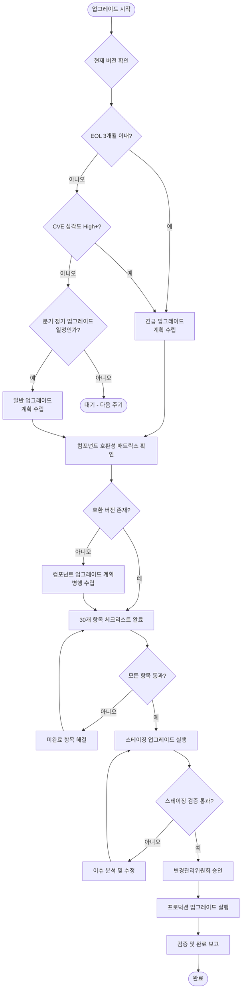
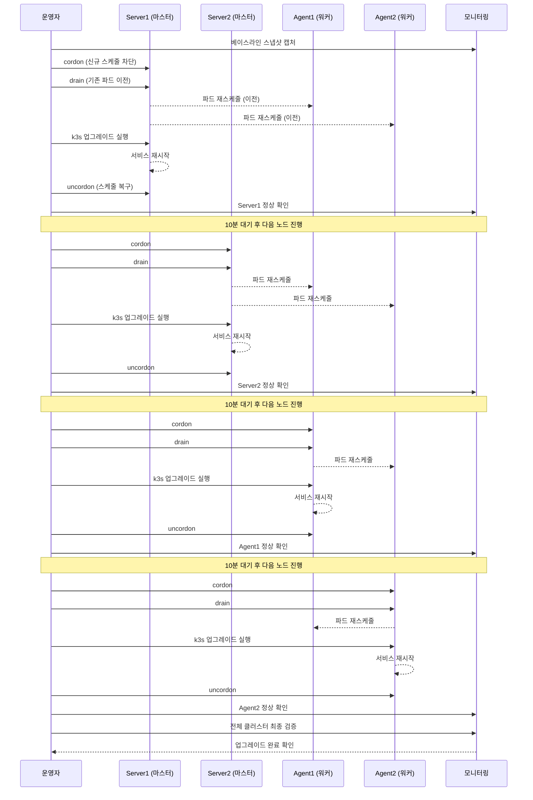

# k3s 클러스터 업그레이드 완전 가이드

> 대상 독자: 인프라 담당자, DevOps 엔지니어 (초급~중급)
> 관련 요구사항: NFR-1 (고가용성), NFR-2 (운영 가시성), CSAP D-07 (가용성 관리)
> 최종 수정: 2026-04-13

---

## 목차

1. [클러스터 업그레이드란?](#1-클러스터-업그레이드란)
2. [업그레이드 전 준비](#2-업그레이드-전-준비)
3. [업그레이드 전략](#3-업그레이드-전략)
4. [k3s 업그레이드 절차](#4-k3s-업그레이드-절차)
5. [컴포넌트 업그레이드 순서](#5-컴포넌트-업그레이드-순서)
6. [업그레이드 검증](#6-업그레이드-검증)
7. [롤백 전략](#7-롤백-전략)
8. [GracefulShutdown 연동](#8-gracefulshutdown-연동)
9. [공공기관 업그레이드 승인 프로세스](#9-공공기관-업그레이드-승인-프로세스)
10. [실습: 스테이징 업그레이드 시뮬레이션](#10-실습-스테이징-업그레이드-시뮬레이션)

---

## 1. 클러스터 업그레이드란?

### 1.1 초급자를 위한 개념 설명

쿠버네티스 클러스터(k3s)는 수십 ~ 수백 개의 마이크로서비스를 하나의 운영 환경에서 관리하는 플랫폼입니다. 이 플랫폼 자체도 소프트웨어이므로 정기적인 업그레이드가 필요합니다.

클러스터 업그레이드를 자동차 정비에 비유하면 이렇습니다.

- **자동차 엔진**: k3s (쿠버네티스 배포판)
- **차량 정비**: 보안 패치, 기능 개선 업데이트
- **달리는 중 정비**: 무중단(Zero-Downtime) 업그레이드

공공기관 SaaS처럼 24시간 운영이 필요한 시스템에서는 정비 중에도 차가 멈추면 안 됩니다. 이것이 "무중단 업그레이드"의 핵심 과제입니다.

### 1.2 왜 정기 업그레이드가 필요한가

k3s와 쿠버네티스 생태계를 정기 업그레이드해야 하는 이유는 크게 네 가지입니다.

**보안 취약점 패치**

k3s 및 쿠버네티스에는 매달 CVE(공통 취약점 및 노출)가 보고됩니다. 공공기관 CSAP 인증 요건(D-07 가용성, D-08 접근 통제)은 알려진 취약점을 일정 기간 내 패치하도록 규정합니다. 패치하지 않으면 감리 결함으로 기록됩니다.

**새 기능 및 성능 개선**

쿠버네티스 새 버전은 리소스 스케줄링 효율, 네트워크 성능, HPA(수평적 파드 오토스케일러) 정확도를 지속적으로 개선합니다. Linkerd 서비스 메시도 새로운 mTLS 알고리즘을 지원합니다.

**의존 컴포넌트 버전 동기화**

Helm, Flux, cert-manager, Linkerd는 특정 쿠버네티스 버전에 맞는 릴리즈를 제공합니다. k3s를 오래된 버전으로 유지하면 이 컴포넌트들을 업그레이드할 수 없습니다.

**지원 수명 주기(EOL) 대응**

쿠버네티스는 각 버전을 약 14개월 지원합니다. EOL이 지난 버전은 더 이상 보안 패치를 제공받지 못합니다. 이는 CSAP 인증에서 직접적인 결함 사유가 됩니다.

### 1.3 k3s 버전 지원 주기

k3s는 업스트림 쿠버네티스 릴리즈를 따르되, 경량화 및 엣지 환경에 최적화된 형태로 패키징합니다.

```
쿠버네티스 릴리즈 주기:
- 소규모(패치): ~매월 (v1.30.x)
- 중규모(마이너): ~4개월 (v1.31.0)
- 각 마이너 버전 지원 기간: 약 14개월

k3s 지원 정책:
- 최신 3개 마이너 버전 지원
- 패치 버전은 최신 2개 지원
```

**버전 참조표 (2026년 기준)**

| k3s 버전 | 쿠버네티스 | 출시일 | EOL |
|---------|-----------|--------|-----|
| v1.32.x | 1.32 | 2025-12 | 2027-02 |
| v1.31.x | 1.31 | 2025-08 | 2026-10 |
| v1.30.x | 1.30 | 2025-04 | 2026-06 |
| v1.29.x | 1.29 | 2024-12 | 2026-02 (EOL 완료) |

공공기관 SaaS 프레임워크 권장 정책: **EOL 3개월 전에 다음 마이너 버전으로 업그레이드 계획 수립 및 실행**

---

## 2. 업그레이드 전 준비

### 2.1 버전 호환성 매트릭스 확인

k3s 업그레이드 전 가장 먼저 확인해야 할 것은 현재 설치된 모든 컴포넌트가 새 k3s 버전과 호환되는지 여부입니다.

```bash
# 현재 클러스터 버전 확인
kubectl version --short

# 현재 k3s 버전 확인 (Server 노드에서 실행)
k3s --version

# 설치된 컴포넌트 버전 확인
helm list -A
flux version
linkerd version
kubectl get nodes -o wide
```

### 2.2 컴포넌트별 호환 버전 매트릭스

아래 표는 공공기관 SaaS 프레임워크 운영 환경의 컴포넌트 호환 버전을 정리한 것입니다.

**k3s v1.31 기준 호환 버전**

| 컴포넌트 | 최소 버전 | 권장 버전 | 비고 |
|---------|---------|---------|------|
| Helm | 3.14+ | 3.16.x | Helm 3 필수 |
| Flux v2 | 2.3+ | 2.4.x | GitOps 컨트롤러 |
| Linkerd | 2.15+ | 2.16.x | mTLS 서비스 메시 |
| cert-manager | 1.14+ | 1.16.x | TLS 인증서 자동화 |
| Kyverno | 1.12+ | 1.13.x | 정책 엔진 |
| Prometheus Stack | 0.72+ | 0.75.x | 모니터링 |
| Loki | 3.0+ | 3.1.x | 로그 수집 |

**k3s v1.32 기준 호환 버전**

| 컴포넌트 | 최소 버전 | 권장 버전 | 비고 |
|---------|---------|---------|------|
| Helm | 3.15+ | 3.17.x | |
| Flux v2 | 2.4+ | 2.5.x | |
| Linkerd | 2.16+ | 2.17.x | |
| cert-manager | 1.15+ | 1.17.x | |
| Kyverno | 1.13+ | 1.14.x | |

### 2.3 업그레이드 의사결정 흐름도



### 2.4 업그레이드 30개 항목 체크리스트

업그레이드 실행 전 아래 30개 항목을 모두 확인합니다. 미완료 항목이 있으면 업그레이드를 진행하지 않습니다.

#### 사전 정보 수집 (항목 1~8)

```
[ ] 1. 현재 k3s 버전 및 목표 버전 문서화
[ ] 2. 업그레이드 대상 노드 목록 작성 (Server/Agent 구분)
[ ] 3. 모든 컴포넌트 호환성 매트릭스 검토 완료
[ ] 4. 릴리즈 노트(Release Notes) 변경 사항 검토 (Breaking Changes 포함)
[ ] 5. 업그레이드 예상 소요 시간 계산 (노드 수 × 노드당 시간)
[ ] 6. 유지보수 창(Maintenance Window) 일정 확정
[ ] 7. 업그레이드 담당자 및 승인자 지정
[ ] 8. 롤백 담당자 및 롤백 기준(Go/No-Go) 정의
```

#### 백업 및 스냅샷 (항목 9~14)

```
[ ] 9.  ETCD 스냅샷 생성 및 무결성 확인
[ ] 10. 스냅샷 외부 저장소 전송 확인 (S3 호환 오브젝트 스토리지)
[ ] 11. PersistentVolume 스냅샷 생성 (Velero)
[ ] 12. 현재 실행 중인 모든 워크로드 목록 저장
[ ] 13. Helm 릴리즈 상태 저장 (helm list -A > helm-releases-backup.txt)
[ ] 14. Flux Kustomization/HelmRelease 상태 저장
```

#### 클러스터 상태 확인 (항목 15~22)

```
[ ] 15. 모든 노드 Ready 상태 확인
[ ] 16. 모든 파드 Running/Completed 상태 확인 (Pending/CrashLoop 없음)
[ ] 17. PodDisruptionBudget (PDB) 설정 검토
[ ] 18. HorizontalPodAutoscaler 설정 확인 (최소 2개 레플리카)
[ ] 19. 스토리지 용량 여유 확인 (최소 30% 여유)
[ ] 20. 클러스터 리소스 여유 확인 (CPU 40%, Memory 50% 미만 사용)
[ ] 21. Linkerd 서비스 메시 정상 상태 확인
[ ] 22. cert-manager 인증서 만료 여부 확인 (30일 이상 여유)
```

#### 알림 및 모니터링 (항목 23~27)

```
[ ] 23. AlertManager 알림 채널 정상 동작 확인
[ ] 24. PagerDuty/슬랙 온콜 담당자 연락 가능 상태 확인
[ ] 25. Prometheus 대시보드 베이스라인 스냅샷 캡처
[ ] 26. 업그레이드 중 모니터링 담당자 지정 (별도 인원)
[ ] 27. 업그레이드 롤백 알림 채널 정의
```

#### 승인 및 문서 (항목 28~30)

```
[ ] 28. 변경관리위원회(CAB) 승인 문서 확보
[ ] 29. 업그레이드 계획서 작성 및 서명 완료
[ ] 30. 업그레이드 후 검증 시나리오 문서 준비
```

---

## 3. 업그레이드 전략

### 3.1 Rolling 업그레이드 (순차 업그레이드)

Rolling 업그레이드는 클러스터 내 노드를 하나씩 순차적으로 업그레이드하는 방식입니다. 가장 일반적인 무중단 업그레이드 방법입니다.

**적합한 경우**
- 단일 클러스터 환경
- 노드 수 3개 이상 (최소 1개 노드가 항상 서비스 가능해야 하므로)
- 소규모 패치 업그레이드 (v1.30.x → v1.30.y)

**주의 사항**
- 업그레이드 중 클러스터 용량이 일시적으로 감소합니다 (노드 1개 격리 시)
- PodDisruptionBudget이 없는 단일 파드 서비스는 중단될 수 있습니다

**Rolling 업그레이드 원칙**

1. Server 노드를 먼저, Agent 노드를 나중에 업그레이드합니다
2. 한 번에 1개 노드만 업그레이드합니다 (동시 다수 노드 업그레이드 금지)
3. 각 노드 업그레이드 후 클러스터 정상 상태 확인 후 다음 노드로 진행합니다

### 3.2 Blue-Green 클러스터 업그레이드

Blue-Green 방식은 새 버전 클러스터(Green)를 별도로 구성한 뒤 트래픽을 전환하는 방식입니다.

**적합한 경우**
- 마이너 버전 업그레이드 (v1.30 → v1.31)
- 충분한 인프라 비용이 확보된 경우
- 제로다운타임이 절대적으로 요구되는 프로덕션

**장단점**

| 구분 | 내용 |
|------|------|
| 장점 | 완전한 무중단, 즉각 롤백 가능 |
| 장점 | 새 환경에서 완전한 사전 검증 가능 |
| 단점 | 일시적으로 인프라 비용 2배 발생 |
| 단점 | 데이터 마이그레이션 복잡성 |

**공공기관 SaaS 권장 사항**: 마이너 버전 업그레이드 시 Blue-Green 방식 사용. 패치 버전 업그레이드는 Rolling 방식 사용.

### 3.3 카나리 노드 테스트

카나리 노드 테스트는 전체 업그레이드 전에 1개 노드만 먼저 업그레이드하여 문제가 없는지 검증하는 방식입니다.

**절차**
1. 클러스터에서 비중요 워크로드만 실행되는 노드를 선택합니다
2. 해당 노드만 새 k3s 버전으로 업그레이드합니다
3. 24~48시간 동안 문제 없음을 확인합니다
4. 이상 없으면 나머지 노드를 순차 업그레이드합니다

---

## 4. k3s 업그레이드 절차

### 4.1 Rolling 업그레이드 순서 (시퀀스 다이어그램)



### 4.2 Server 노드 업그레이드

Server 노드는 ETCD, API Server, Controller Manager, Scheduler를 실행하는 컨트롤 플레인입니다. Server 노드를 먼저 업그레이드해야 합니다.

```bash
# [Server 노드에서 실행]

# 1단계: 업그레이드 전 ETCD 스냅샷 생성
k3s etcd-snapshot save \
  --name pre-upgrade-$(date +%Y%m%d-%H%M%S) \
  --dir /var/lib/rancher/k3s/server/db/snapshots

# 스냅샷 확인
k3s etcd-snapshot list

# 2단계: 해당 노드 cordon (신규 파드 스케줄 차단)
# 다른 서버(또는 로컬 kubectl)에서 실행
kubectl cordon <node-name>

# 예시: server1 노드명 확인
kubectl get nodes

# 3단계: 해당 노드 drain (기존 파드를 다른 노드로 이전)
kubectl drain <node-name> \
  --ignore-daemonsets \
  --delete-emptydir-data \
  --force \
  --grace-period=60

# --ignore-daemonsets: DaemonSet 파드는 다른 노드로 이전 불가하므로 무시
# --delete-emptydir-data: emptyDir 볼륨 데이터 삭제 허용 (임시 데이터)
# --grace-period=60: 파드 종료 최대 대기 시간 60초

# 4단계: k3s 업그레이드 실행
# 방법 A: k3s install 스크립트 (권장)
curl -sfL https://get.k3s.io | INSTALL_K3S_VERSION="v1.31.4+k3s1" sh -

# 방법 B: k3s system-upgrade-controller 사용 (GitOps 환경)
# (아래 Plan 섹션 참조)

# 5단계: k3s 서비스 재시작 확인
systemctl status k3s

# 6단계: 노드 버전 확인
kubectl get node <node-name> -o jsonpath='{.status.nodeInfo.kubeletVersion}'

# 7단계: 노드 uncordon (스케줄 복구)
kubectl uncordon <node-name>

# 8단계: 노드 Ready 상태 확인
kubectl get nodes
```

### 4.3 Agent 노드 업그레이드

Agent 노드는 실제 워크로드 파드가 실행되는 워커 노드입니다. Server 노드 업그레이드 완료 후 진행합니다.

```bash
# [Agent 노드에서 실행]

# 1단계: cordon (마스터 또는 kubectl 접근 가능한 위치에서)
kubectl cordon <agent-node-name>

# 2단계: drain
kubectl drain <agent-node-name> \
  --ignore-daemonsets \
  --delete-emptydir-data \
  --force \
  --grace-period=60

# drain 완료 확인 (파드가 모두 이전되었는지 확인)
kubectl get pods -o wide | grep <agent-node-name>

# 3단계: k3s 에이전트 업그레이드 (Agent 노드에서 실행)
curl -sfL https://get.k3s.io | INSTALL_K3S_VERSION="v1.31.4+k3s1" sh -s - agent \
  --server https://<server-ip>:6443 \
  --token <node-token>

# 4단계: k3s-agent 서비스 재시작 확인
systemctl status k3s-agent

# 5단계: 노드 버전 확인
kubectl get node <agent-node-name>

# 6단계: uncordon
kubectl uncordon <agent-node-name>

# 7단계: 파드 재배포 확인 (이전에 실행 중이던 파드가 돌아오는지 확인)
kubectl get pods -o wide | grep <agent-node-name>
```

### 4.4 k3s System Upgrade Controller (GitOps 방식)

GitOps 환경에서는 k3s의 공식 업그레이드 도구인 `system-upgrade-controller`를 사용하는 것을 권장합니다.

```yaml
# upgrade-plan.yaml — k3s 업그레이드 계획 선언
apiVersion: upgrade.cattle.io/v1
kind: Plan
metadata:
  name: k3s-server-upgrade
  namespace: system-upgrade
spec:
  concurrency: 1                     # 동시에 업그레이드할 노드 수 (1 = 순차)
  cordon: true                       # 업그레이드 중 cordon 자동 적용
  serviceAccountName: system-upgrade
  upgrade:
    image: rancher/k3s-upgrade
  version: v1.31.4+k3s1
  nodeSelector:
    matchExpressions:
      - key: node-role.kubernetes.io/control-plane
        operator: In
        values:
          - "true"                   # Server 노드만 선택
---
apiVersion: upgrade.cattle.io/v1
kind: Plan
metadata:
  name: k3s-agent-upgrade
  namespace: system-upgrade
spec:
  concurrency: 1
  cordon: true
  prepare:                           # Server 업그레이드 완료 후 Agent 업그레이드
    image: rancher/k3s-upgrade
    args:
      - prepare
      - k3s-server-upgrade
  serviceAccountName: system-upgrade
  upgrade:
    image: rancher/k3s-upgrade
  version: v1.31.4+k3s1
  nodeSelector:
    matchExpressions:
      - key: node-role.kubernetes.io/control-plane
        operator: NotIn
        values:
          - "true"                   # Agent 노드만 선택
```

```bash
# system-upgrade-controller 설치 (최초 1회)
kubectl apply -f https://github.com/rancher/system-upgrade-controller/releases/latest/download/system-upgrade-controller.yaml

# 업그레이드 계획 적용
kubectl apply -f upgrade-plan.yaml

# 업그레이드 진행 상황 확인
kubectl get plans -A
kubectl get jobs -n system-upgrade
```

### 4.5 kubectl drain 상세 옵션 가이드

`kubectl drain`은 노드에서 파드를 안전하게 이전시키는 핵심 명령입니다.

```bash
# 기본 문법
kubectl drain <노드명> [옵션]

# 주요 옵션 설명
# --ignore-daemonsets
#   DaemonSet이 관리하는 파드(예: 로그 수집 에이전트, 노드 모니터링)는
#   다른 노드로 이전할 수 없으므로 무시합니다.
#   이 옵션 없이 drain하면 에러가 발생합니다.

# --delete-emptydir-data
#   emptyDir 볼륨을 사용하는 파드의 데이터를 삭제합니다.
#   캐시, 임시 파일 등 재생성 가능한 데이터만 있는 경우 사용합니다.
#   영구 데이터는 반드시 PersistentVolume을 사용해야 합니다.

# --force
#   ReplicaSet, StatefulSet 등에 의해 관리되지 않는 단독 파드도 강제 삭제합니다.
#   이 파드들은 다른 노드에 재생성되지 않으므로 주의가 필요합니다.

# --grace-period=N
#   파드 종료 전 대기 시간(초). 이 시간 내에 종료되지 않으면 강제 종료됩니다.
#   GracefulShutdown 타임아웃과 동일하게 설정하는 것을 권장합니다 (기본 30초).

# --pod-selector='key=value'
#   특정 라벨을 가진 파드만 drain합니다 (선택적 사용)

# --timeout=5m
#   drain 작업 전체 타임아웃

# 실제 운영 권장 명령
kubectl drain <노드명> \
  --ignore-daemonsets \
  --delete-emptydir-data \
  --force \
  --grace-period=30 \
  --timeout=10m
```

---

## 5. 컴포넌트 업그레이드 순서

k3s 클러스터의 컴포넌트는 반드시 아래 순서대로 업그레이드합니다. 순서를 바꾸면 서비스 중단이 발생할 수 있습니다.

### 5.1 업그레이드 순서 원칙

```
1. ETCD 스냅샷 (업그레이드 전 필수)
2. k3s Server 노드 (컨트롤 플레인)
3. k3s Agent 노드 (워커)
4. Flux (GitOps 컨트롤러 - CRD 먼저 적용)
5. cert-manager (TLS 인증서 관리)
6. Linkerd (서비스 메시 - 모든 앱의 사이드카 주입)
7. Kyverno (정책 엔진)
8. Prometheus Stack (모니터링)
9. 애플리케이션 서비스
```

### 5.2 Flux 업그레이드

```bash
# 현재 Flux 버전 확인
flux version

# Flux CLI 업그레이드 (로컬)
curl -s https://fluxcd.io/install.sh | sudo bash

# 클러스터 내 Flux 컴포넌트 업그레이드
flux install --version=v2.4.0

# 업그레이드 확인
flux check
kubectl get pods -n flux-system
```

### 5.3 cert-manager 업그레이드

```bash
# 현재 버전 확인
kubectl get deployment cert-manager -n cert-manager -o jsonpath='{.spec.template.spec.containers[0].image}'

# Helm으로 업그레이드
helm repo update
helm upgrade cert-manager jetstack/cert-manager \
  --namespace cert-manager \
  --version v1.16.0 \
  --set installCRDs=true

# 업그레이드 확인
kubectl get pods -n cert-manager
kubectl get certificate -A
```

### 5.4 Linkerd 업그레이드

Linkerd는 서비스 메시로 모든 서비스 간 통신에 관여합니다. 업그레이드 순서가 특히 중요합니다.

```bash
# 1단계: Linkerd CLI 업그레이드
curl -sL run.linkerd.io/install | sh
export PATH=$PATH:$HOME/.linkerd2/bin

# 2단계: 현재 상태 확인
linkerd check

# 3단계: CRD 업그레이드 (컨트롤 플레인보다 먼저)
linkerd upgrade --crds | kubectl apply -f -

# 4단계: 컨트롤 플레인 업그레이드
linkerd upgrade | kubectl apply -f -

# 5단계: 업그레이드 완료 확인
linkerd check

# 6단계: 데이터 플레인 (사이드카) 재시작
# 각 네임스페이스의 파드를 재시작하여 새 Linkerd 프록시 주입
kubectl rollout restart deployment -n public-saas-system
kubectl rollout restart deployment -n monitoring

# 7단계: 데이터 플레인 확인
linkerd check --proxy
```

### 5.5 앱 서비스 업그레이드

```bash
# Flux를 통한 앱 서비스 재조정 (새 Linkerd 사이드카 주입)
flux reconcile kustomization apps --with-source

# 또는 각 서비스 개별 재시작
kubectl rollout restart deployment -n <namespace>

# 모든 파드 재시작 완료 확인
kubectl get pods -A | grep -v Running | grep -v Completed
```

---

## 6. 업그레이드 검증

업그레이드 후에는 각 단계별 검증을 반드시 수행합니다. 검증을 생략하면 장애 발생 시 원인 파악이 어렵습니다.

### 6.1 노드 상태 검증

```bash
# 모든 노드 Ready 상태 확인
kubectl get nodes
# 모든 노드의 STATUS가 Ready여야 합니다

# 버전 확인 (모든 노드가 동일 버전이어야 합니다)
kubectl get nodes -o custom-columns=\
'NAME:.metadata.name,VERSION:.status.nodeInfo.kubeletVersion,STATUS:.status.conditions[-1].type'

# 노드 상세 정보 확인
kubectl describe node <node-name> | grep -A 10 "Conditions:"
```

### 6.2 시스템 파드 상태 검증

```bash
# 시스템 네임스페이스 파드 확인
kubectl get pods -n kube-system
kubectl get pods -n flux-system
kubectl get pods -n cert-manager
kubectl get pods -n linkerd

# Running 상태가 아닌 파드 확인 (0개여야 정상)
kubectl get pods -A | grep -v Running | grep -v Completed | grep -v Succeeded

# 최근 이벤트 확인 (Warning 이벤트 확인)
kubectl get events -A --sort-by='.lastTimestamp' | tail -50
```

### 6.3 서비스 정상 확인

```bash
# Linkerd 메시 상태 확인
linkerd check
linkerd viz stat deploy -n public-saas-system

# cert-manager 인증서 상태 확인
kubectl get certificate -A
# READY가 모두 True여야 합니다

# Flux 조정 상태 확인
flux get all -A

# 애플리케이션 엔드포인트 헬스체크
curl -k https://api.public-saas.local/healthz
curl -k https://portal.public-saas.local/api/health
```

### 6.4 메트릭 베이스라인 비교

```bash
# Prometheus 쿼리로 업그레이드 전후 비교
# 에러율 확인
curl -s "http://prometheus.monitoring.svc:9090/api/v1/query?\
query=sum(rate(http_requests_total{status=~'5..'}[5m]))/sum(rate(http_requests_total[5m]))" \
| jq '.data.result'

# 응답 시간 확인
curl -s "http://prometheus.monitoring.svc:9090/api/v1/query?\
query=histogram_quantile(0.99,sum(rate(http_request_duration_seconds_bucket[5m]))by(le))" \
| jq '.data.result'

# 재시작 횟수 확인
kubectl get pods -A -o json | jq '.items[] | {name: .metadata.name, restarts: .status.containerStatuses[0].restartCount}' | grep -v '"restarts": 0'
```

### 6.5 SLO 임계값 검증 기준

업그레이드 후 아래 기준을 모두 통과해야 업그레이드를 완료로 처리합니다.

| 지표 | 허용 기준 | 측정 방법 |
|------|---------|---------|
| 서비스 가용성 | 99.9% 이상 유지 | Prometheus availability 쿼리 |
| P99 응답 시간 | 기준값 +20% 이내 | histogram_quantile 쿼리 |
| 에러율 | 0.1% 이하 | HTTP 5xx 비율 |
| 파드 재시작 | 업그레이드 노드 외 0회 | kubectl get pods restart count |
| Linkerd 성공률 | 99.5% 이상 | linkerd viz stat |

---

## 7. 롤백 전략

업그레이드 후 문제가 발생하면 즉시 롤백합니다. 롤백 기준(Go/No-Go)을 사전에 정의합니다.

### 7.1 롤백 기준 (No-Go 조건)

다음 중 하나라도 발생하면 즉시 롤백합니다.

```
- 서비스 에러율 1% 초과 (10분 이상 지속)
- P99 응답 시간 기준값 50% 초과
- 핵심 서비스(인증, 데이터 API) 장애
- Linkerd 서비스 메시 전체 다운
- ETCD 클러스터 쿼럼 손실
- 노드 NotReady 2개 이상 동시 발생
```

### 7.2 k3s 버전 고정 및 롤백

```bash
# 이전 버전으로 롤백 (Server 노드에서 실행)
curl -sfL https://get.k3s.io | INSTALL_K3S_VERSION="v1.30.8+k3s1" sh -

# Agent 노드 롤백
curl -sfL https://get.k3s.io | INSTALL_K3S_VERSION="v1.30.8+k3s1" sh -s - agent \
  --server https://<server-ip>:6443 \
  --token <node-token>

# 버전 확인
kubectl get nodes
```

### 7.3 ETCD 스냅샷 복구

ETCD 데이터 자체가 손상된 경우 스냅샷에서 복구합니다. 이 작업은 k3s 서비스를 완전히 중단시킵니다.

```bash
# [Server 노드에서 실행]

# 1단계: k3s 서비스 중지
systemctl stop k3s

# 2단계: 기존 데이터 디렉터리 백업
mv /var/lib/rancher/k3s/server/db /var/lib/rancher/k3s/server/db.bak

# 3단계: 스냅샷 목록 확인
ls -la /var/lib/rancher/k3s/server/db/snapshots/

# 4단계: 스냅샷 복구
k3s server \
  --cluster-reset \
  --cluster-reset-restore-path=/var/lib/rancher/k3s/server/db/snapshots/pre-upgrade-20260413-100000

# 5단계: k3s 재시작
systemctl start k3s

# 6단계: 클러스터 상태 확인
kubectl get nodes
kubectl get pods -A
```

### 7.4 Velero PersistentVolume 복구

```bash
# 백업 목록 확인
velero backup list

# PV 복구 (특정 네임스페이스)
velero restore create \
  --from-backup pre-upgrade-backup \
  --include-namespaces public-saas-system \
  --restore-volumes

# 복구 진행 상황 확인
velero restore describe <restore-name>
```

---

## 8. GracefulShutdown 연동

### 8.1 GracefulShutdown이 업그레이드에 중요한 이유

k3s 업그레이드 중 `kubectl drain` 명령은 파드에 SIGTERM 시그널을 전송하여 종료를 요청합니다. 이 때 서비스가 진행 중인 요청을 완료하지 않고 갑자기 종료되면 클라이언트는 오류 응답을 받게 됩니다.

공공기관 SaaS 프레임워크의 모든 Fastify 서비스는 `@public-saas/mesh-ready` 패키지의 `GracefulShutdown` 클래스를 사용합니다. 이 클래스는 SIGTERM 수신 시 아래 순서로 안전하게 종료합니다.

**GracefulShutdown 동작 순서** (`platform/packages/mesh-ready/src/graceful-shutdown.ts` 참조):

```
SIGTERM 수신
    ↓
isShuttingDown = true (신규 요청 차단 → 503 응답)
    ↓
진행 중 요청 완료 대기 (최대 30초)
    ↓
정리 핸들러 순차 실행 (DB 연결 해제, 캐시 플러시)
    ↓
Fastify 서버 종료
    ↓
process.exit(0)
```

### 8.2 업그레이드 시 GracefulShutdown 설정 확인

업그레이드 전 모든 서비스의 GracefulShutdown 타임아웃이 Kubernetes `terminationGracePeriodSeconds`와 일치하는지 확인합니다.

```typescript
// 서비스 코드에서 확인해야 할 설정
// Design Ref: SVC-MESH-R13 §2 — FR-MESH.3

const shutdown = new GracefulShutdown({
  timeout: 30_000,  // 30초 — k8s terminationGracePeriodSeconds와 동일해야 함
  cleanupHandlers: [
    async () => { await prisma.$disconnect(); },
    async () => { await redis.quit(); },
  ],
});
```

```yaml
# Kubernetes Deployment에서 terminationGracePeriodSeconds 확인
apiVersion: apps/v1
kind: Deployment
spec:
  template:
    spec:
      terminationGracePeriodSeconds: 30  # GracefulShutdown timeout과 동일
      containers:
        - name: service
          lifecycle:
            preStop:
              exec:
                command: ["/bin/sleep", "5"]  # Linkerd 프록시 종료 전 대기
```

### 8.3 drain 명령의 grace-period 설정

```bash
# --grace-period를 terminationGracePeriodSeconds와 동일하게 설정
kubectl drain <node-name> \
  --grace-period=30 \      # GracefulShutdown.timeout과 동일
  --ignore-daemonsets \
  --delete-emptydir-data
```

### 8.4 업그레이드 중 요청 흐름

업그레이드 중 서비스 인스턴스 중 하나가 종료되면 다음과 같은 흐름으로 요청이 처리됩니다.

```
클라이언트 요청
    ↓
Linkerd 프록시 (로드밸런싱)
    ↓
건강한 파드로 라우팅 (종료 중인 파드 제외)
    ↓
정상 응답 반환
```

GracefulShutdown이 `isShuttingDown = true`로 설정되면 Linkerd readiness probe가 실패하여 해당 파드로의 라우팅이 자동으로 중단됩니다. 이를 위해 readiness probe에 GracefulShutdown 상태를 반영해야 합니다.

```typescript
// Fastify 헬스체크 엔드포인트에서 readiness 상태 반영
app.get('/readyz', async (_req, reply) => {
  if (shutdown.isTerminating()) {
    // 종료 중임을 알려 Linkerd가 트래픽 라우팅을 중단하도록 함
    return reply.status(503).send({ status: 'terminating' });
  }
  return reply.status(200).send({ status: 'ok' });
});
```

---

## 9. 공공기관 업그레이드 승인 프로세스

### 9.1 CSAP 요건 (D-07 가용성 관리)

CSAP D-07 통제항목은 공공기관 정보시스템의 가용성을 일정 수준 이상으로 유지하도록 요구합니다. 클러스터 업그레이드는 가용성에 영향을 미치는 변경 작업이므로 변경관리 절차를 따라야 합니다.

**CSAP D-07 주요 요구사항**

| 요구사항 | 내용 | 업그레이드 관련성 |
|---------|------|----------|
| D-07.1 | 서비스 연속성 계획 수립 | 업그레이드 계획서 = 연속성 계획 |
| D-07.2 | 정기적 백업 및 복구 테스트 | ETCD 스냅샷 = 백업 증거 |
| D-07.3 | 변경 관리 절차 적용 | 변경관리위원회 승인 필수 |
| D-07.4 | 서비스 중단 시 복구 목표 | RTO/RPO 정의 및 달성 |

### 9.2 변경관리위원회(CAB) 승인 절차

```
1. 변경 요청서(CR) 작성 (최소 2주 전)
   - 업그레이드 이유 (보안 패치/기능 개선/EOL 대응)
   - 업그레이드 범위 (노드 수, 컴포넌트 목록)
   - 예상 영향도 (중단 가능성, 영향받는 서비스)
   - 롤백 계획

2. 기술 검토 (1주 전)
   - 스테이징 업그레이드 완료 보고서 첨부
   - 컴포넌트 호환성 매트릭스 첨부

3. CAB 회의 (2~3일 전)
   - 위원회 심의 및 승인/반려
   - 조건부 승인 시 조건 이행 계획 수립

4. 승인 후 업그레이드 실행

5. 업그레이드 결과 보고 (완료 후 24시간 이내)
   - 검증 결과 요약
   - CSAP 증거 수집 (감사 로그, 스냅샷 등)
```

### 9.3 CSAP 증거 수집

업그레이드 완료 후 CSAP 인증을 위한 증거를 수집합니다. 이는 `csap-evidence.yml` 워크플로우를 통해 자동화됩니다.

```bash
# 수동 증거 수집 실행
./scripts/csap-evidence-collect-v2.sh --date 2026-04-13 --controls D-07,D-08

# 업그레이드 관련 증거 목록
# - ETCD 스냅샷 생성 로그 (D-07.2)
# - 변경관리위원회 승인 문서 (D-07.3)
# - 업그레이드 전후 헬스체크 결과 (D-07.1)
# - 감사 로그 (audit.jsonl) (D-06)
```

### 9.4 업그레이드 일정 관리

| 단계 | 기간 | 내용 |
|------|------|------|
| 계획 수립 | T-4주 | 버전 선정, 호환성 확인 |
| 스테이징 업그레이드 | T-2주 | 스테이징 환경 검증 |
| CAB 승인 신청 | T-2주 | 변경 요청서 제출 |
| CAB 심의 | T-3일 | 승인 획득 |
| 프로덕션 업그레이드 | T | 실행 |
| 사후 검증 | T+1일 | 결과 보고 |

---

## 10. 실습: 스테이징 k3s 업그레이드 시뮬레이션

이 실습은 스테이징(stg) 환경에서 k3s 패치 버전 업그레이드를 안전하게 수행하는 방법을 단계별로 익힙니다.

### 10.1 실습 환경 요건

```
- 스테이징 클러스터 접근 권한 (kubectl, SSH)
- k3s 현재 버전: v1.30.8+k3s1 (가정)
- 목표 버전: v1.30.9+k3s1 (패치 업그레이드)
- 노드 구성: server1, agent1 (최소 2노드)
```

### 10.2 실습 Step 1 — 사전 상태 확인

```bash
# 현재 상태 캡처
echo "=== 업그레이드 전 클러스터 상태 ==="
kubectl get nodes -o wide
kubectl get pods -A | grep -v Running | grep -v Completed
kubectl get pvc -A

# 베이스라인 메트릭 캡처
kubectl top nodes
kubectl top pods -A --sort-by=memory

# 현재 버전 기록
kubectl version --short > /tmp/upgrade-baseline-version.txt
kubectl get nodes -o json | jq '.items[].status.nodeInfo.kubeletVersion' \
  >> /tmp/upgrade-baseline-version.txt
```

### 10.3 실습 Step 2 — ETCD 스냅샷 생성

```bash
# Server 노드에서 실행 (SSH 접속 후)
sudo k3s etcd-snapshot save \
  --name stg-pre-upgrade-$(date +%Y%m%d-%H%M%S) \
  --dir /var/lib/rancher/k3s/server/db/snapshots

# 스냅샷 확인
sudo k3s etcd-snapshot list

# 스냅샷을 외부 스토리지에 복사 (실습 환경에서는 로컬 경로로 대체)
cp /var/lib/rancher/k3s/server/db/snapshots/stg-pre-upgrade-* /tmp/etcd-backup/
```

### 10.4 실습 Step 3 — Server 노드 업그레이드

```bash
# Server 노드 cordon
kubectl cordon server1

# 파드 drain
kubectl drain server1 \
  --ignore-daemonsets \
  --delete-emptydir-data \
  --force \
  --grace-period=30

# drain 완료 확인
kubectl get pods -o wide | grep server1

# Server 노드에서 k3s 업그레이드
sudo curl -sfL https://get.k3s.io | \
  INSTALL_K3S_VERSION="v1.30.9+k3s1" sh -

# 업그레이드 완료 확인
sudo k3s --version
sudo systemctl status k3s

# uncordon
kubectl uncordon server1

# 정상 확인
kubectl get nodes
```

### 10.5 실습 Step 4 — Agent 노드 업그레이드

```bash
# Agent 노드 cordon
kubectl cordon agent1

# drain
kubectl drain agent1 \
  --ignore-daemonsets \
  --delete-emptydir-data \
  --force \
  --grace-period=30

# Agent 노드에서 업그레이드 (NODE_TOKEN은 /var/lib/rancher/k3s/server/node-token에서 확인)
NODE_TOKEN=$(sudo cat /var/lib/rancher/k3s/server/node-token)

# Agent 노드에서 실행
sudo curl -sfL https://get.k3s.io | \
  INSTALL_K3S_VERSION="v1.30.9+k3s1" K3S_URL=https://server1:6443 \
  K3S_TOKEN=$NODE_TOKEN sh -

# 업그레이드 확인
sudo systemctl status k3s-agent

# uncordon
kubectl uncordon agent1
```

### 10.6 실습 Step 5 — 검증

```bash
# 버전 확인
kubectl get nodes

# 예상 출력:
# NAME      STATUS   ROLES                  VERSION
# server1   Ready    control-plane,master   v1.30.9+k3s1
# agent1    Ready    <none>                 v1.30.9+k3s1

# 서비스 정상 확인
kubectl get pods -A | grep -v Running | grep -v Completed | grep -v Succeeded

# Linkerd 상태 확인
linkerd check

# 헬스체크
curl -k https://api.stg.public-saas.local/healthz
```

### 10.7 실습 Step 6 — 결과 기록

```bash
# 업그레이드 후 상태 캡처
echo "=== 업그레이드 후 클러스터 상태 ==="
kubectl get nodes -o wide
kubectl version --short

# CSAP 증거 수집
./scripts/csap-evidence-collect-v2.sh --date $(date +%Y-%m-%d) --controls D-07

# 업그레이드 완료 감사 로그 기록
echo "{
  \"timestamp\": \"$(date -u +%Y-%m-%dT%H:%M:%SZ)\",
  \"actor\": \"ops-team\",
  \"action\": \"CLUSTER_UPGRADE_COMPLETE\",
  \"detail\": \"k3s v1.30.8 to v1.30.9, environment=stg\",
  \"csap_ref\": \"D-07\"
}" >> .claude/audit.jsonl
```

### 10.8 실습 완료 확인 기준

아래 항목을 모두 확인한 후 실습을 완료로 처리합니다.

```
[ ] 모든 노드 VERSION이 v1.30.9+k3s1로 변경됨
[ ] 모든 파드 Running/Completed 상태
[ ] linkerd check 통과
[ ] 헬스체크 엔드포인트 200 응답
[ ] ETCD 스냅샷 존재 확인
[ ] 감사 로그 기록 확인
```

---

## 참고 자료

- [k3s 공식 업그레이드 가이드](https://docs.k3s.io/upgrades/automated)
- [k3s System Upgrade Controller](https://github.com/rancher/system-upgrade-controller)
- [Linkerd 업그레이드 가이드](https://linkerd.io/2.x/tasks/upgrade/)
- [Flux 업그레이드 가이드](https://fluxcd.io/flux/installation/upgrade/)
- [CSAP 가용성 관리 D-07](https://isms.kisa.or.kr/)
- 내부 문서: `/data/ai-saas/docs/02-design/features/`

---

*이 가이드는 공공기관 SaaS 프레임워크 운영 팀이 작성하였습니다.*
*마지막 업데이트: 2026-04-13 | 다음 검토 예정: 2026-07-01*
