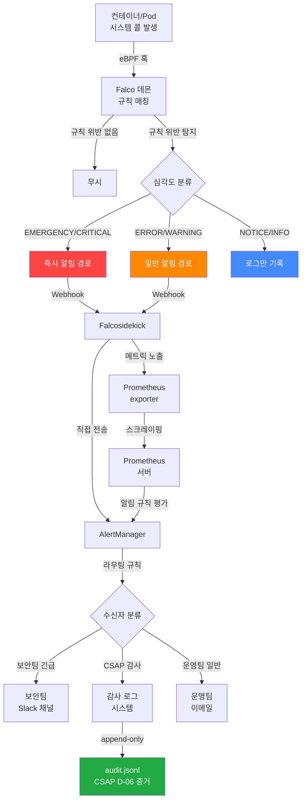

# Falco 런타임 보안 완전 가이드

> 대상 독자: 공공기관 SaaS 플랫폼 신규 개발자 (보안 경험 무관)
> 관련 CSAP 항목: D-06 (침해사고 관리), D-08 (접근 통제)
> 최종 수정: 2026-04-13

---

## 목차

1. [Falco란? — 초급자를 위한 설명](#1-falco란--초급자를-위한-설명)
2. [Falco 아키텍처 심층 해설](#2-falco-아키텍처-심층-해설)
3. [기본 규칙 이해](#3-기본-규칙-이해)
4. [커스텀 규칙 작성](#4-커스텀-규칙-작성)
5. [오탐(False Positive) 처리](#5-오탐false-positive-처리)
6. [AlertManager 연동](#6-alertmanager-연동)
7. [CSAP D-06 보안 이벤트 기록](#7-csap-d-06-보안-이벤트-기록)
8. [실제 사고 시나리오 5가지](#8-실제-사고-시나리오-5가지)
9. [실습: AI 서비스 민감 파일 접근 탐지](#9-실습-ai-서비스-민감-파일-접근-탐지)

---

## 1. Falco란? — 초급자를 위한 설명

### 1.1 런타임 보안이 왜 필요한가

여러분이 공공기관 SaaS 플랫폼을 개발하고 있다고 상상해 보십시오. 코드 리뷰를 통과하고, 취약점 스캔도 완료했으며, 컨테이너 이미지도 깨끗합니다. 배포까지 완료했습니다. 그런데 여기서 문제가 시작됩니다.

공격자는 여러분이 검사한 시점과 실제 운영 시점 사이의 틈을 노립니다. 다음 상황을 생각해 보십시오.

- 정상적으로 배포된 컨테이너 내부에서 누군가 `bash` 셸을 실행했습니다.
- AI 서비스 컨테이너가 갑자기 `/etc/shadow` 파일(리눅스 비밀번호 파일)을 읽으려 합니다.
- 정상적으로 HTTP 요청만 처리해야 하는 웹 서버가 외부 IP로 직접 연결을 시도합니다.

이런 상황들은 코드 검사 시점에는 탐지할 수 없습니다. **배포 후 실행 중인 환경에서만** 탐지 가능합니다. 이것이 **런타임 보안**이 필요한 이유입니다.

### 1.2 전통적인 HIDS와 Falco의 차이

**HIDS (Host Intrusion Detection System)** 는 호스트 수준에서 작동하는 전통적인 침입 탐지 시스템입니다. 대표적으로 OSSEC, Wazuh가 있습니다.

| 비교 항목 | 전통 HIDS | Falco (eBPF 기반) |
|-----------|-----------|-------------------|
| 탐지 레벨 | 파일, 네트워크 로그 | 시스템 콜 레벨 |
| 성능 영향 | 높음 (에이전트 설치) | 낮음 (eBPF, 에이전트 불필요) |
| 컨테이너 지원 | 제한적 | 네이티브 지원 |
| k8s 통합 | 별도 설정 필요 | 기본 지원 |
| 실시간성 | 지연 있음 | 즉시 탐지 |
| 규칙 언어 | 복잡한 설정 파일 | 직관적 DSL |

**Falco**는 클라우드 네이티브 런타임 보안 도구입니다. CNCF(Cloud Native Computing Foundation) 졸업 프로젝트로, Kubernetes 환경에서 컨테이너의 모든 시스템 콜을 실시간으로 감시합니다.

쉽게 설명하면, Falco는 컨테이너 안에서 일어나는 **모든 행동을 감시하는 CCTV**라고 생각하면 됩니다. 단순히 녹화만 하는 것이 아니라, 이상한 행동이 발생하면 즉시 경보를 발령합니다.

### 1.3 공공기관 SaaS에서 Falco가 중요한 이유

우리 플랫폼은 CSAP(클라우드 서비스 안전성 평가) 중/상 등급을 목표로 합니다. CSAP D-06(침해사고 관리) 항목은 다음을 요구합니다.

```
D-06-1: 보안 이벤트 실시간 탐지 체계 구축
D-06-2: 침해사고 탐지 시 즉시 알림 체계
D-06-3: 보안 이벤트 로그 1년 이상 보존
D-06-4: 침해사고 대응 절차 수립 및 훈련
```

Falco는 이 요구사항을 기술적으로 충족시키는 핵심 도구입니다.

---

## 2. Falco 아키텍처 심층 해설

### 2.1 eBPF 커널 드라이버

**eBPF(extended Berkeley Packet Filter)** 는 리눅스 커널 내부에 안전하게 프로그램을 실행할 수 있는 기술입니다. 커널 코드를 수정하지 않고도 커널 이벤트를 실시간으로 관찰할 수 있습니다.

```
[사용자 공간]          [커널 공간]
┌─────────────┐        ┌──────────────────────┐
│ Falco 프로세스 │◄──────│ eBPF 프로브 (후킹 포인트) │
│             │        │                      │
│ 규칙 엔진   │        │ sys_open()           │
│ 알림 처리   │        │ sys_execve()         │
│ 출력 채널   │        │ sys_connect()        │
└─────────────┘        │ sys_write()          │
                       └──────────────────────┘
```

eBPF 방식의 장점은 다음과 같습니다.
- 커널 패닉 없이 안전하게 실행 (검증된 프로그램만 실행)
- 성능 오버헤드 최소 (일반적으로 CPU 사용률 1~3% 추가)
- 에이전트를 컨테이너 내부에 설치할 필요 없음

### 2.2 Falco의 전체 아키텍처

```
┌────────────────────────────────────────────────────────────────┐
│                    Kubernetes 클러스터                          │
│                                                                │
│  ┌─────────────┐   ┌─────────────┐   ┌─────────────────────┐  │
│  │  Pod A      │   │  Pod B      │   │  Pod C (AI 서비스)  │  │
│  │  (웹 서버)  │   │  (DB 서비스)│   │                     │  │
│  └──────┬──────┘   └──────┬──────┘   └──────────┬──────────┘  │
│         │                 │                      │             │
│  ┌──────▼─────────────────▼──────────────────────▼──────────┐  │
│  │              Kubernetes 노드 (k3s)                        │  │
│  │                                                           │  │
│  │  ┌─────────────────────────────────────────────────────┐ │  │
│  │  │                   리눅스 커널                         │ │  │
│  │  │    ┌───────────┐   시스템 콜 후킹                    │ │  │
│  │  │    │ eBPF 프로브│◄──────────────────────────────┐   │ │  │
│  │  │    └─────┬─────┘                                │   │ │  │
│  │  └──────────┼───────────────────────────────────────┘  │  │
│  │             │                                           │  │
│  │  ┌──────────▼────────────────────────────────────────┐ │  │
│  │  │                  Falco 데몬                         │ │  │
│  │  │                                                    │ │  │
│  │  │  ┌──────────────┐  ┌──────────────────────────┐  │ │  │
│  │  │  │   규칙 엔진   │  │      출력 채널            │  │ │  │
│  │  │  │              │  │  • stdout (로그)          │  │ │  │
│  │  │  │  falco_rules │  │  • Prometheus exporter   │  │ │  │
│  │  │  │  .yaml 로드  │  │  • Webhook (AlertManager)│  │ │  │
│  │  │  │              │  │  • gRPC (팬아웃)          │  │ │  │
│  │  │  └──────────────┘  └──────────────────────────┘  │ │  │
│  │  └───────────────────────────────────────────────────┘ │  │
│  └───────────────────────────────────────────────────────────┘  │
└────────────────────────────────────────────────────────────────┘
```

### 2.3 규칙 엔진

Falco 규칙 엔진은 세 가지 구성 요소로 이루어집니다.

**목록(Lists)**: 자주 사용하는 값들의 집합
```yaml
- list: allowed_admin_tools
  items: [kubectl, helm, jq, curl]

- list: sensitive_directories
  items: [/etc/shadow, /etc/passwd, /etc/ssl/private, /var/secrets]
```

**매크로(Macros)**: 재사용 가능한 조건 표현식
```yaml
- macro: container_running
  condition: container.id != host

- macro: interactive_terminal
  condition: >
    ((proc.aname=sshd and proc.name != sshd) or
     proc.name = bash or proc.name = sh)
    and proc.tty != 0
```

**규칙(Rules)**: 탐지 조건과 알림 설정
```yaml
- rule: Shell Spawned in Container
  desc: 컨테이너 내에서 셸 프로세스가 실행되었습니다
  condition: container_running and proc.name in (shell_binaries)
  output: "컨테이너 셸 실행 탐지 (user=%user.name container=%container.name)"
  priority: WARNING
  tags: [container, shell, CSAP-D06]
```

### 2.4 출력 채널

Falco는 탐지된 이벤트를 다양한 채널로 출력할 수 있습니다.

| 채널 | 용도 | 설정 방법 |
|------|------|-----------|
| stdout | 기본 로그, kubectl logs 확인 | 기본 활성화 |
| 파일 | 영구 보존 로그 | file_output 설정 |
| Syslog | 중앙 로그 서버 연동 | syslog_output 설정 |
| Webhook | AlertManager, Slack 연동 | http_output 설정 |
| gRPC | Falcosidekick 연동 | grpc_output 설정 |

---

## 3. 기본 규칙 이해

### 3.1 falco_rules.yaml 기본 구조

Falco 규칙 파일은 YAML 형식으로 작성됩니다. 다음은 전체 구조를 설명합니다.

```yaml
# ===================================================
# Falco 규칙 파일 기본 구조
# 우리 플랫폼: /etc/falco/falco_rules.yaml
# ===================================================

# 1. 목록 정의 (Lists)
- list: 목록_이름
  items: [값1, 값2, 값3]

# 2. 매크로 정의 (Macros)
- macro: 매크로_이름
  condition: 조건_표현식

# 3. 규칙 정의 (Rules)
- rule: 규칙_이름
  desc: 규칙에 대한 설명
  condition: 탐지_조건 (Falco 필터 표현식)
  output: 알림_메시지_형식
  priority: EMERGENCY|ALERT|CRITICAL|ERROR|WARNING|NOTICE|INFO|DEBUG
  enabled: true
  tags: [태그1, 태그2]
```

### 3.2 Falco 필터 표현식 문법

Falco는 C-like 문법의 조건 표현식을 사용합니다. 핵심 필드들을 설명합니다.

**프로세스 관련 필드**
```
proc.name          - 프로세스 이름 (예: bash, python3)
proc.pid           - 프로세스 ID
proc.ppid          - 부모 프로세스 ID
proc.pname         - 부모 프로세스 이름
proc.args          - 프로세스 실행 인자
proc.exe           - 실행 파일 전체 경로
proc.cwd           - 현재 작업 디렉토리
proc.tty           - TTY 번호 (0이면 백그라운드)
```

**파일 관련 필드**
```
fd.name            - 파일 디스크립터 이름 (파일 경로)
fd.typechar        - 파일 타입 (f=파일, d=디렉토리, 4=IPv4 소켓)
fd.directory       - 파일이 위치한 디렉토리
```

**컨테이너/k8s 관련 필드**
```
container.id       - 컨테이너 ID (host면 컨테이너 아님)
container.name     - 컨테이너 이름
container.image    - 컨테이너 이미지 이름
k8s.ns.name        - 네임스페이스 이름
k8s.pod.name       - Pod 이름
k8s.deployment.name - Deployment 이름
```

**사용자 관련 필드**
```
user.name          - 사용자 이름
user.uid           - 사용자 UID (0이면 root)
user.gid           - 사용자 GID
```

**네트워크 관련 필드**
```
fd.sip             - 서버 IP 주소
fd.sport           - 서버 포트
fd.cip             - 클라이언트 IP 주소
fd.cport           - 클라이언트 포트
fd.rip             - 원격 IP 주소
```

### 3.3 조건 연산자

Falco 표현식에서 사용할 수 있는 연산자들입니다.

```
=, !=          - 같음, 다름
<, <=, >, >=   - 비교 연산자
in             - 목록에 포함 (in (val1, val2))
contains       - 문자열 포함 (fd.name contains "secret")
startswith     - 문자열 시작 (proc.name startswith "py")
endswith       - 문자열 끝 (fd.name endswith ".key")
glob           - 글로브 패턴 (fd.name glob "/etc/*.conf")
pmatch         - 접두사 매칭 (파일 경로)
and, or, not   - 논리 연산자
```

### 3.4 실제 내장 규칙 예제 분석

Falco가 기본 제공하는 규칙 중 중요한 것들을 분석합니다.

```yaml
# 예제 1: 컨테이너에서 민감한 파일 읽기 탐지
- rule: Read sensitive file untrusted
  desc: >
    신뢰되지 않은 프로세스가 /etc/shadow 등 민감 파일을 읽으려 합니다.
  condition: >
    open_read
    and sensitive_files
    and not proc.name in (user_mgmt_binaries)
    and not container.image.repository in (allowed_images)
  output: >
    민감 파일 읽기 탐지 (user=%user.name name=%proc.name
    parent=%proc.pname cmdline=%proc.cmdline file=%fd.name
    container=%container.name image=%container.image.repository)
  priority: WARNING
  tags: [filesystem, mitre_credential_access]

# 예제 2: 컨테이너에서 패키지 매니저 실행
- rule: Launch Package Management Process in Container
  desc: >
    컨테이너 내에서 패키지 관리자(apt, yum 등)가 실행되었습니다.
    공격자가 도구를 설치하려는 시도일 수 있습니다.
  condition: >
    spawned_process
    and container
    and package_mgmt_procs
  output: >
    패키지 매니저 실행 탐지 (user=%user.name container=%container.name
    image=%container.image.repository proc=%proc.name cmdline=%proc.cmdline)
  priority: ERROR
  tags: [container, software, mitre_persistence]
```

---

## 4. 커스텀 규칙 작성

### 4.1 공공기관 SaaS 특화 규칙 작성 원칙

우리 플랫폼에서 커스텀 규칙을 작성할 때는 다음 원칙을 따릅니다.

1. **최소 권한 원칙 반영**: 각 서비스가 해야 하는 일만 허용하고 나머지는 탐지
2. **멀티테넌시 경계 보호**: 테넌트 간 데이터 격리 위반 탐지
3. **N2SF 데이터 등급 보호**: C/S 등급 데이터 관련 파일 접근 탐지
4. **CSAP D-06 증거 생성**: 모든 보안 이벤트에 CSAP 태그 부착

### 4.2 커스텀 규칙 1: AI 서비스 민감 환경변수 접근 탐지

```yaml
# 파일: /etc/falco/rules.d/public-saas-custom.yaml
# Design Ref: CSAP D-06, N2SF N-05

# AI 서비스가 접근해서는 안 되는 민감 파일 목록
- list: ai_service_forbidden_paths
  items:
    - /etc/shadow
    - /etc/passwd
    - /proc/1/environ
    - /var/run/secrets/kubernetes.io/serviceaccount/token
    - /proc/keys
    - /etc/ssh

# AI 서비스 컨테이너 이미지 목록 (이것만 AI 서비스로 인식)
- list: ai_service_images
  items:
    - public-saas/ai-service
    - public-saas/rag-service

# 규칙: AI 서비스 컨테이너의 금지된 파일 접근 탐지
- rule: AI Service Forbidden File Access
  desc: >
    AI 서비스 컨테이너가 접근해서는 안 되는 민감 파일에
    접근을 시도했습니다. N2SF N-05 위반 가능성이 있습니다.
  condition: >
    open_read
    and container
    and container.image.repository in (ai_service_images)
    and (
      fd.name pmatch (ai_service_forbidden_paths)
      or fd.name contains "/secrets/"
      or fd.name contains "/.env"
      or fd.name endswith ".key"
      or fd.name endswith ".pem"
    )
  output: >
    [CSAP-D06][N2SF-N05] AI 서비스 민감 파일 접근 탐지
    (user=%user.name proc=%proc.name file=%fd.name
    container=%container.name pod=%k8s.pod.name
    namespace=%k8s.ns.name image=%container.image.repository)
  priority: CRITICAL
  enabled: true
  tags: [ai-service, n2sf, CSAP-D06, CSAP-D08, public-saas]
```

### 4.3 커스텀 규칙 2: 컨테이너 탈출 시도 탐지

컨테이너 탈출은 공격자가 컨테이너 경계를 넘어 호스트 시스템에 접근하려는 시도입니다.

```yaml
# 컨테이너 탈출 시도 관련 위험 도구 목록
- list: container_escape_tools
  items:
    - nsenter      # 네임스페이스 진입 도구
    - unshare      # 네임스페이스 분리 도구
    - capsh        # 리눅스 권한 조작 도구
    - setns        # 네임스페이스 설정 시스템 콜
    - runc         # 컨테이너 런타임 (컨테이너 내부에서 실행 시 의심)

# 매크로: 컨테이너 내부에서 실행 중인지 확인
- macro: in_container
  condition: container.id != host

# 규칙: 컨테이너 탈출 시도 탐지
- rule: Container Escape Attempt
  desc: >
    컨테이너 내부에서 탈출 시도 도구가 실행되었습니다.
    공격자가 컨테이너 경계를 넘으려는 시도일 수 있습니다.
  condition: >
    spawned_process
    and in_container
    and (
      proc.name in (container_escape_tools)
      or (proc.name = mount and user.uid != 0)
      or (proc.name = chroot)
    )
  output: >
    [CSAP-D06][긴급] 컨테이너 탈출 시도 탐지
    (user=%user.name uid=%user.uid proc=%proc.name
    args=%proc.args container=%container.name
    pod=%k8s.pod.name namespace=%k8s.ns.name
    image=%container.image.repository)
  priority: EMERGENCY
  enabled: true
  tags: [container-escape, CSAP-D06, public-saas, mitre_privilege_escalation]

# 규칙: 특권(Privileged) 컨테이너에서의 마운트 작업
- rule: Privileged Container Mount
  desc: >
    특권 컨테이너에서 호스트 파일시스템 마운트를 시도합니다.
    컨테이너 탈출의 전형적인 기법입니다.
  condition: >
    spawned_process
    and container
    and container.privileged = true
    and proc.name = mount
    and not proc.args contains "tmpfs"
  output: >
    [CSAP-D06][긴급] 특권 컨테이너 마운트 시도
    (user=%user.name container=%container.name
    proc=%proc.name args=%proc.args
    pod=%k8s.pod.name)
  priority: EMERGENCY
  enabled: true
  tags: [container-escape, privileged, CSAP-D06, public-saas]
```

### 4.4 커스텀 규칙 3: 권한 상승 탐지

```yaml
# 권한 상승에 사용되는 SUID 바이너리 목록
- list: privilege_escalation_binaries
  items:
    - sudo
    - su
    - newgrp
    - sg
    - runuser

# 규칙: 컨테이너 내 권한 상승 시도
- rule: Privilege Escalation in Container
  desc: >
    컨테이너 내부에서 권한 상승 시도가 탐지되었습니다.
    공격자가 root 권한 획득을 시도할 수 있습니다.
  condition: >
    spawned_process
    and in_container
    and (
      proc.name in (privilege_escalation_binaries)
      or (proc.name = chmod and proc.args contains "+s")
      or (proc.name = chown and user.uid != 0 and proc.args startswith "root:")
    )
  output: >
    [CSAP-D06] 컨테이너 내 권한 상승 시도
    (user=%user.name uid=%user.uid proc=%proc.name
    args=%proc.args container=%container.name
    pod=%k8s.pod.name namespace=%k8s.ns.name)
  priority: CRITICAL
  enabled: true
  tags: [privilege-escalation, CSAP-D06, CSAP-D08, public-saas]

# 규칙: 런타임 중 /proc/sys 커널 파라미터 수정 시도
- rule: Kernel Parameter Modification Attempt
  desc: >
    컨테이너가 커널 파라미터 수정을 시도합니다.
    컨테이너 격리 우회에 사용될 수 있습니다.
  condition: >
    open_write
    and in_container
    and fd.name startswith /proc/sys/
  output: >
    [CSAP-D06][긴급] 커널 파라미터 수정 시도
    (user=%user.name proc=%proc.name
    file=%fd.name container=%container.name)
  priority: EMERGENCY
  enabled: true
  tags: [kernel, container-escape, CSAP-D06]
```

### 4.5 커스텀 규칙 4: 멀티테넌시 경계 침해 탐지

공공기관 SaaS에서 멀티테넌시는 핵심 보안 요구사항입니다. 다른 테넌트의 데이터에 접근하는 행위를 탐지합니다.

```yaml
# 우리 플랫폼의 테넌트 데이터 경로 패턴
- list: tenant_data_directories
  items:
    - /data/tenants
    - /var/lib/tenant-data
    - /mnt/tenant-volumes

# 규칙: 테넌트 네임스페이스 경계 침해 의심
- rule: Cross-Tenant Namespace Access
  desc: >
    한 테넌트의 Pod가 다른 테넌트 네임스페이스의 리소스에
    접근을 시도하는 것이 탐지되었습니다.
    멀티테넌시 격리 정책 위반일 수 있습니다.
  condition: >
    spawned_process
    and in_container
    and proc.name = kubectl
    and (
      proc.args contains "--namespace"
      or proc.args contains "-n"
    )
    and not k8s.ns.name in (kube-system, kube-public, monitoring)
  output: >
    [CSAP-D06][N2SF-N03] 크로스 테넌트 접근 시도 의심
    (user=%user.name proc=%proc.name args=%proc.args
    source_ns=%k8s.ns.name pod=%k8s.pod.name
    container=%container.name)
  priority: ERROR
  enabled: true
  tags: [multitenancy, n2sf, CSAP-D06, public-saas]
```

### 4.6 커스텀 규칙 5: 암호화 키 및 시크릿 파일 접근 탐지

```yaml
# 시크릿 관련 파일 확장자 및 경로
- list: secret_file_extensions
  items: [.key, .pem, .p12, .pfx, .crt, .cer, .der]

- list: secret_directories
  items:
    - /etc/ssl/private
    - /var/secrets
    - /run/secrets
    - /etc/kubernetes/pki

# 매크로: 시크릿 파일 접근 여부
- macro: accessing_secret_file
  condition: >
    fd.name pmatch (secret_directories)
    or (
      fd.name contains "/"
      and (
        fd.name endswith .key
        or fd.name endswith .pem
        or fd.name endswith .p12
        or fd.name endswith .pfx
      )
    )

# 규칙: 예상치 못한 시크릿 파일 접근
- rule: Unexpected Secret File Access
  desc: >
    일반 애플리케이션 프로세스가 암호화 키 또는
    시크릿 파일에 접근을 시도합니다.
    CSAP D-09 암호화 정책 위반 가능성이 있습니다.
  condition: >
    (open_read or open_write)
    and in_container
    and accessing_secret_file
    and not proc.name in (vault, consul, openssl, certbot)
  output: >
    [CSAP-D06][CSAP-D09] 시크릿 파일 무단 접근 탐지
    (user=%user.name proc=%proc.name
    file=%fd.name container=%container.name
    pod=%k8s.pod.name namespace=%k8s.ns.name)
  priority: CRITICAL
  enabled: true
  tags: [secret, encryption, CSAP-D06, CSAP-D09, public-saas]
```

---

## 5. 오탐(False Positive) 처리

### 5.1 오탐이란?

오탐(False Positive)은 실제로는 정상적인 동작인데 Falco가 보안 위협으로 잘못 탐지하는 경우입니다. 오탐이 많으면 실제 위협을 놓치거나 알림 피로도(Alert Fatigue)가 발생합니다.

### 5.2 예외(Exceptions) 처리 방법

Falco는 규칙에 예외 목록을 추가하는 방법을 제공합니다.

**방법 1: not 조건으로 예외 추가**
```yaml
# 기존 규칙에 예외 조건 추가
- rule: Shell Spawned in Container
  desc: 컨테이너 내 셸 실행 탐지
  condition: >
    spawned_process
    and container
    and proc.name in (shell_binaries)
    # 예외: 공식 이미지의 init 스크립트는 허용
    and not proc.pname in (entrypoint.sh, docker-entrypoint.sh, start.sh)
    # 예외: Kubernetes Job (일회성 작업)은 허용
    and not k8s.pod.labels contains "job-name"
    # 예외: 개발/스테이징 환경 디버깅은 허용 (단, 운영환경 제외)
    and not k8s.ns.name in (development, staging)
  output: "컨테이너 셸 실행 (user=%user.name container=%container.name)"
  priority: WARNING
  tags: [container, shell, CSAP-D06]
```

**방법 2: 별도 예외 파일로 관리 (권장)**
```yaml
# 파일: /etc/falco/rules.d/exceptions.yaml
# 이 파일에서 기존 규칙의 예외만 관리합니다.

# Falco 0.36+ 에서 지원하는 exceptions 키워드 방식
- rule: Read sensitive file untrusted
  exceptions:
    # 우리 플랫폼 초기화 스크립트는 shadow 읽기 허용
    - name: init_scripts
      fields: [proc.name, fd.name]
      values:
        - [init_system_users.sh, /etc/shadow]
    # Vault 에이전트는 인증서 파일 접근 허용
    - name: vault_agent
      fields: [proc.name]
      values:
        - [vault-agent]
```

### 5.3 규칙 우선순위 조정

오탐이 많은 규칙의 심각도를 낮춰 운영 부담을 줄입니다.

```yaml
# 특정 규칙의 우선순위를 낮추는 오버라이드
# 파일: /etc/falco/rules.d/priority-overrides.yaml

# 개발 환경에서만 패키지 설치 허용 (운영 환경은 원래 설정 유지)
- rule: Launch Package Management Process in Container
  condition: >
    spawned_process
    and container
    and package_mgmt_procs
    # 개발 네임스페이스는 낮은 우선순위로
    and not k8s.ns.name = development
  priority: WARNING  # 기본값 ERROR에서 WARNING으로 낮춤
```

### 5.4 오탐 분석 및 처리 절차

```
[Falco 알림 수신]
       │
       ▼
[알림 내용 분석]
       │
       ├──► 실제 위협? ──► 즉시 보안팀 연락 + 격리 조치
       │
       └──► 오탐 판단? ──► 원인 분석
                               │
                               ├──► 정상 운영 패턴? ──► 예외 규칙 추가
                               │
                               └──► 규칙 너무 넓음? ──► 규칙 조건 구체화
```

**오탐 기록 양식 (CSAP D-06 증거 활용)**
```yaml
# 오탐 기록: falco-false-positive-log.yaml
false_positive_entries:
  - date: "2026-04-13"
    rule: "Shell Spawned in Container"
    container: "ai-service-7f9b8c-xyz"
    cause: "Kubernetes Job 초기화 스크립트가 bash 호출"
    resolution: "k8s.pod.labels job-name 예외 추가"
    approved_by: "보안담당자 홍길동"
    csap_ref: "D-06"
```

---

## 6. AlertManager 연동

### 6.1 Falco → Prometheus → AlertManager 연동 구조



### 6.2 Falcosidekick 설정

Falcosidekick은 Falco 알림을 다양한 채널로 라우팅하는 미들웨어입니다.

```yaml
# Helm values: falcosidekick-values.yaml
config:
  # Slack 보안 알림 채널
  slack:
    webhookurl: "${SLACK_SECURITY_WEBHOOK}"
    minimumpriority: "error"
    messageformat: >
      [CSAP-D06] Falco 보안 이벤트 탐지
      *규칙*: {{ .Rule }}
      *심각도*: {{ .Priority }}
      *시간*: {{ .Time }}
      *Pod*: {{ .OutputFields.k8s_pod_name }}
      *네임스페이스*: {{ .OutputFields.k8s_ns_name }}

  # AlertManager 직접 연동
  alertmanager:
    hostport: "http://alertmanager.monitoring.svc:9093"
    minimumpriority: "warning"

  # 감사 로그 Webhook (우리 security-monitor-service로 전송)
  webhook:
    address: "http://security-monitor-service.platform.svc:8080/events/falco"
    minimumpriority: "notice"
    method: POST
```

### 6.3 AlertManager 라우팅 규칙

```yaml
# AlertManager 설정: alertmanager.yaml
route:
  group_by: ['alertname', 'namespace']
  group_wait: 10s
  group_interval: 5m
  repeat_interval: 12h
  receiver: 'default-receiver'

  routes:
    # Falco 긴급 알림: 즉시 보안팀으로
    - match:
        alertname: FalcoAlert
        severity: EMERGENCY
      receiver: 'security-emergency'
      group_wait: 0s       # 즉시 전송 (그룹 대기 없음)
      repeat_interval: 15m # 15분마다 반복 알림

    # Falco CRITICAL 알림
    - match:
        alertname: FalcoAlert
        severity: CRITICAL
      receiver: 'security-team'
      group_wait: 30s
      repeat_interval: 1h

    # Falco 일반 알림
    - match:
        alertname: FalcoAlert
      receiver: 'security-team'
      group_wait: 5m

receivers:
  - name: 'security-emergency'
    slack_configs:
      - channel: '#security-emergency'
        send_resolved: false
        text: |
          [긴급] Falco 보안 이벤트 탐지 - 즉시 대응 필요
          {{ range .Alerts }}
          • 규칙: {{ .Labels.falco_rule }}
          • 컨테이너: {{ .Labels.container_name }}
          • Pod: {{ .Labels.pod_name }}
          {{ end }}
    pagerduty_configs:
      - routing_key: "${PAGERDUTY_ROUTING_KEY}"

  - name: 'security-team'
    slack_configs:
      - channel: '#security-alerts'
        text: |
          Falco 보안 이벤트
          {{ range .Alerts }}
          규칙: {{ .Labels.falco_rule }} | 심각도: {{ .Labels.severity }}
          {{ end }}
```

### 6.4 Prometheus 규칙 (Falco 메트릭 기반 알림)

```yaml
# Prometheus rules: falco-alerts.yaml
groups:
  - name: falco-security-alerts
    interval: 30s
    rules:
      # CRITICAL 이상 이벤트 5분 내 발생 시 즉시 알림
      - alert: FalcoCriticalEvent
        expr: >
          increase(falco_events_total{priority=~"EMERGENCY|CRITICAL|ALERT"}[5m]) > 0
        for: 0m
        labels:
          severity: critical
          csap_ref: D-06
        annotations:
          summary: "Falco 심각 보안 이벤트 탐지"
          description: >
            지난 5분 내 심각도 CRITICAL 이상 이벤트 {{ $value }}건 탐지.
            즉시 확인 필요.

      # 동일 Pod에서 반복적 보안 이벤트 (공격 진행 중 의심)
      - alert: FalcoRepeatedViolations
        expr: >
          increase(falco_events_total[10m]) > 10
        for: 1m
        labels:
          severity: warning
          csap_ref: D-06
        annotations:
          summary: "반복적 Falco 보안 이벤트 탐지"
          description: >
            지난 10분 내 보안 이벤트 {{ $value }}건 발생.
            지속적인 공격 시도일 수 있습니다.
```

---

## 7. CSAP D-06 보안 이벤트 기록

### 7.1 security-monitor-service 감사 로그 분석

실제 소스 코드(`platform/services/security-monitor-service/src/lib/audit.ts`)를 분석합니다.

```typescript
// 실제 소스 코드 (platform/services/security-monitor-service/src/lib/audit.ts)
// 보안 모니터링 서비스 감사 로깅
// Design Ref: DESIGN-MTU-P15
// CSAP: D-06

import { createAuditLogger, createStandardTransport } from '@public-saas/audit-sdk';

const auditLogger = createAuditLogger({
  serviceName: 'security-monitor-service',
  transport: createStandardTransport('security-monitor-service'),
});

export async function logSecurityEvent(
  action: string,
  metadata?: Record<string, unknown>
): Promise<void> {
  await auditLogger.log({
    actor: 'system:security-monitor',
    action,
    target: 'security',
    targetType: 'security',
    tenantId: 'system',
    ip: process.env.SERVICE_IP || '127.0.0.1', // CSAP D-06: 내부 서비스 루프백 기본값
    userAgent: 'security-monitor-service/1.0',
    metadata,
  });
}
```

이 코드에서 중요한 점을 분석합니다.

**1. `createAuditLogger` — 중앙화된 감사 로깅**
- `@public-saas/audit-sdk` 패키지를 통해 표준화된 감사 로깅 사용
- 모든 서비스가 동일한 형식으로 로그를 생성하여 CSAP D-06 요건 충족
- `createStandardTransport`가 `.claude/audit.jsonl`로 append-only 기록 보장

**2. `logSecurityEvent` — Falco 이벤트 수신 처리**
- Falco가 탐지한 보안 이벤트를 받아 CSAP 형식으로 기록
- `action` 파라미터: 이벤트 유형 (예: `FALCO_CONTAINER_ESCAPE`, `FALCO_PRIVILEGE_ESCALATION`)
- `metadata`: Falco가 제공한 상세 정보 (컨테이너 이름, Pod 이름, 규칙 이름 등)

### 7.2 Falco → security-monitor-service 연동 구현

Falco 이벤트를 받아 CSAP D-06 형식으로 변환하는 Webhook 핸들러입니다.

```typescript
// platform/services/security-monitor-service/src/handlers/falco-webhook.handler.ts
// Design Ref: CSAP D-06
// Falco Webhook 이벤트 수신 및 감사 로그 기록

import type { FastifyRequest, FastifyReply } from 'fastify';
import { z } from 'zod';
import { logSecurityEvent } from '../lib/audit.js';

// Falco 이벤트 스키마 검증
const falcoEventSchema = z.object({
  output: z.string(),           // 규칙 output 문자열
  priority: z.string(),         // EMERGENCY, CRITICAL, ERROR 등
  rule: z.string(),             // 규칙 이름
  time: z.string(),             // 이벤트 발생 시간 (ISO 8601)
  output_fields: z.object({     // 구조화된 필드
    container_name: z.string().optional(),
    k8s_pod_name: z.string().optional(),
    k8s_ns_name: z.string().optional(),
    proc_name: z.string().optional(),
    user_name: z.string().optional(),
    fd_name: z.string().optional(),
  }).passthrough(),             // 추가 필드 허용
});

type FalcoEvent = z.infer<typeof falcoEventSchema>;

// 심각도 매핑 (Falco → CSAP)
const priorityToSeverity: Record<string, string> = {
  'EMERGENCY': 'CSAP_CRITICAL',
  'ALERT':     'CSAP_CRITICAL',
  'CRITICAL':  'CSAP_HIGH',
  'ERROR':     'CSAP_MEDIUM',
  'WARNING':   'CSAP_LOW',
  'NOTICE':    'CSAP_INFO',
  'INFO':      'CSAP_DEBUG',
  'DEBUG':     'CSAP_DEBUG',
};

export async function falcoWebhookHandler(
  request: FastifyRequest,
  reply: FastifyReply,
): Promise<void> {
  // 입력 검증 (CSAP D-12: 모든 입력 검증 필수)
  const event = falcoEventSchema.parse(request.body) as FalcoEvent;

  // CSAP D-06 형식으로 감사 로그 기록
  await logSecurityEvent(`FALCO_${event.rule.toUpperCase().replace(/\s/g, '_')}`, {
    falco_rule: event.rule,
    falco_priority: event.priority,
    csap_severity: priorityToSeverity[event.priority] ?? 'CSAP_INFO',
    falco_time: event.time,
    container_name: event.output_fields.container_name,
    pod_name: event.output_fields.k8s_pod_name,
    namespace: event.output_fields.k8s_ns_name,
    process_name: event.output_fields.proc_name,
    username: event.output_fields.user_name,
    file_name: event.output_fields.fd_name,
    raw_output: event.output,
    csap_ref: 'D-06',
  });

  await reply.status(200).send({ received: true });
}
```

### 7.3 감사 로그 형식 (CSAP D-06 요건)

CSAP D-06은 감사 로그에 다음 필드를 반드시 포함하도록 요구합니다.

```json
{
  "timestamp": "2026-04-13T09:30:00.000Z",
  "actor": "system:security-monitor",
  "action": "FALCO_CONTAINER_ESCAPE_ATTEMPT",
  "target": "security",
  "targetType": "security",
  "tenantId": "system",
  "ip": "10.0.0.5",
  "userAgent": "security-monitor-service/1.0",
  "metadata": {
    "falco_rule": "Container Escape Attempt",
    "falco_priority": "EMERGENCY",
    "csap_severity": "CSAP_CRITICAL",
    "container_name": "ai-service-prod-7f9b8c-xyz",
    "pod_name": "ai-service-prod-7f9b8c",
    "namespace": "production",
    "process_name": "nsenter",
    "csap_ref": "D-06",
    "raw_output": "[CSAP-D06][긴급] 컨테이너 탈출 시도 탐지..."
  }
}
```

---

## 8. 실제 사고 시나리오 5가지

### 시나리오 1: 공급망 공격 — 악성 npm 패키지 설치 시도

```
상황:
  의존성 패키지 업데이트 과정에서 악성 패키지가 포함되어
  컨테이너 내에서 외부 서버에 연결을 시도합니다.

Falco 탐지 규칙:
  "Launch Package Management Process in Container"
  + "Outbound Connection to Suspicious Port"

탐지 로그 예시:
  [ERROR] 패키지 매니저 실행 탐지
  container=ai-service-prod proc=npm args=install malicious-pkg
  pod=ai-service-7f9b8c namespace=production

대응 절차:
  1. 해당 Pod 즉시 격리 (network policy로 외부 연결 차단)
  2. 컨테이너 이미지 분석 (어느 패키지가 악성인지 확인)
  3. 의존성 잠금 파일(package-lock.json) 검증
  4. CSAP D-06 보안 사고 보고서 작성
```

### 시나리오 2: 크리덴셜 탈취 시도

```
상황:
  공격자가 애플리케이션 취약점을 통해 임의 코드 실행 후
  환경 변수(API 키, DB 비밀번호)를 탈취하려 시도합니다.

Falco 탐지 규칙:
  "Read Environment Variables from /proc"
  커스텀 규칙: "AI Service Forbidden File Access"

탐지 로그 예시:
  [CRITICAL] AI 서비스 민감 파일 접근 탐지
  [CSAP-D06][N2SF-N05]
  proc=python3 file=/proc/1/environ
  container=ai-service-prod pod=ai-service-7f9b8c

대응 절차:
  1. 해당 컨테이너 즉시 재시작 (임의 코드 실행 중단)
  2. 접근된 환경 변수 키 즉시 교체
  3. Vault에서 시크릿 버전 교체
  4. 취약점 근본 원인 분석 및 패치
```

### 시나리오 3: 컨테이너 탈출 시도

```
상황:
  공격자가 컨테이너 런타임 취약점(CVE)을 이용하여
  컨테이너 경계를 넘으려 시도합니다.

Falco 탐지 규칙:
  커스텀 규칙: "Container Escape Attempt"
  커스텀 규칙: "Privileged Container Mount"

탐지 로그 예시:
  [EMERGENCY] 컨테이너 탈출 시도 탐지
  [CSAP-D06][긴급]
  proc=nsenter args=--target 1 --mount --uts --ipc --pid
  container=api-gateway-prod pod=api-gateway-7d8c9

대응 절차:
  1. 즉시 보안팀 연락 (PagerDuty 자동 알림)
  2. 해당 노드 격리 (cordon + drain)
  3. 컨테이너 런타임 버전 확인 및 패치
  4. 전체 클러스터 보안 점검
  5. CSAP D-06 침해사고 보고서 48시간 내 제출
```

### 시나리오 4: 멀티테넌트 데이터 횡단 접근

```
상황:
  한 기관(테넌트 A)의 서비스가 다른 기관(테넌트 B)의
  네임스페이스에 있는 서비스에 직접 접근을 시도합니다.

Falco 탐지 규칙:
  커스텀 규칙: "Cross-Tenant Namespace Access"
  + Kubernetes Audit Log 분석

탐지 로그 예시:
  [ERROR] 크로스 테넌트 접근 시도 의심
  [CSAP-D06][N2SF-N03]
  proc=kubectl args=-n tenant-b get secrets
  source_ns=tenant-a pod=batch-job-xyz

대응 절차:
  1. 해당 ServiceAccount 권한 즉시 박탈
  2. NetworkPolicy 재점검 (테넌트 간 격리 확인)
  3. 접근 시도 테넌트에 보안 공지
  4. N2SF N-03 격리 정책 재검토
```

### 시나리오 5: 야간 이상 행동 탐지 (APT 공격 의심)

```
상황:
  업무 시간 외(새벽 3시) 특정 컨테이너에서 대용량 데이터
  외부 전송 시도 및 암호화 도구 실행이 탐지됩니다.

Falco 탐지 규칙:
  "Outbound Network Anomaly"
  "Unexpected Process in Container"
  + 시간 기반 조건 (Prometheus 이상 탐지)

탐지 로그 예시:
  [ALERT] 야간 이상 네트워크 활동
  proc=openssl args=enc -e -aes-256-cbc -in /data/...
  bytes_sent=524288000 (500MB)
  container=compliance-service
  time=03:15:23 KST

대응 절차:
  1. 해당 서비스 즉시 네트워크 격리
  2. 메모리 덤프 획득 (포렌식 증거)
  3. 전송 대상 IP 블랙리스트 등록
  4. CSAP D-06 침해사고 보고서 작성
  5. 개인정보보호위원회 72시간 내 신고 검토
```

---

## 9. 실습: AI 서비스 민감 파일 접근 탐지 규칙 작성

### 실습 목표

공공기관 SaaS의 AI 서비스(`ai-service`)가 허용되지 않은 파일에 접근하는 것을 탐지하는 Falco 규칙을 직접 작성합니다.

### 9.1 사전 준비 — Falco 설치 확인

```bash
# Falco가 Kubernetes에 배포되어 있는지 확인
kubectl get pods -n falco

# 예상 출력:
# NAME                    READY   STATUS    RESTARTS   AGE
# falco-7f9b8c-xyz        1/1     Running   0          2d
# falcosidekick-abc-123   1/1     Running   0          2d

# Falco 로그 확인
kubectl logs -n falco -l app=falco --tail=20

# 현재 로드된 규칙 확인
kubectl exec -n falco -l app=falco -- falco --list
```

### 9.2 단계 1: 요구사항 분석

AI 서비스는 다음 파일에만 접근해야 합니다.

```
허용:
  /app/*              - 애플리케이션 코드
  /tmp/*              - 임시 파일
  /var/log/app/*      - 앱 로그

금지:
  /etc/shadow         - 리눅스 비밀번호 파일
  /proc/*/environ     - 프로세스 환경 변수
  /var/secrets/*      - Kubernetes 시크릿 마운트
  *.key, *.pem       - 개인키 파일
  /etc/ssl/private/*  - SSL 인증서 개인키
```

### 9.3 단계 2: 커스텀 규칙 파일 작성

```bash
# 규칙 파일 생성
cat > /tmp/ai-service-rules.yaml << 'EOF'
# ===================================================
# AI 서비스 특화 Falco 보안 규칙
# Design Ref: CSAP D-06, N2SF N-05
# 작성일: 2026-04-13
# ===================================================

# ── 목록 정의 ───────────────────────────────────────

# AI 서비스 컨테이너 이미지 (정확한 저장소 경로)
- list: ai_service_images
  items:
    - public-saas/ai-service
    - registry.internal.example.com/public-saas/ai-service

# AI 서비스가 절대 접근해서는 안 되는 파일/디렉토리
- list: ai_forbidden_files
  items:
    - /etc/shadow
    - /etc/gshadow
    - /etc/sudoers

# ── 매크로 정의 ─────────────────────────────────────

# AI 서비스 컨테이너인지 확인
- macro: is_ai_service
  condition: >
    container
    and container.image.repository in (ai_service_images)

# 민감한 경로 접근 여부
- macro: accessing_sensitive_path
  condition: >
    (
      fd.name pmatch (/etc/shadow)
      or fd.name pmatch (/etc/gshadow)
      or fd.name contains "/proc/"
      and fd.name contains "/environ"
      or fd.name startswith /var/secrets/
      or fd.name startswith /run/secrets/
      or fd.name endswith .key
      or fd.name endswith .pem
      or fd.name endswith .p12
      or fd.name startswith /etc/ssl/private/
    )

# ── 규칙 정의 ───────────────────────────────────────

# 규칙 1: AI 서비스의 민감 파일 접근 탐지
- rule: AI Service Sensitive File Access Detected
  desc: >
    AI 서비스 컨테이너가 허용되지 않은 민감 파일에
    접근을 시도했습니다. N2SF N-05 위반 가능성.
    CSAP D-06 보안 이벤트로 기록됩니다.
  condition: >
    (open_read or open_write)
    and is_ai_service
    and accessing_sensitive_path
  output: >
    [CSAP-D06][N2SF-N05][CRITICAL]
    AI 서비스 민감 파일 접근 탐지
    user=%user.name uid=%user.uid
    proc=%proc.name args=%proc.args
    file=%fd.name
    container=%container.name
    pod=%k8s.pod.name
    namespace=%k8s.ns.name
    image=%container.image.repository:%container.image.tag
  priority: CRITICAL
  enabled: true
  tags:
    - ai-service
    - n2sf-n05
    - CSAP-D06
    - public-saas

# 규칙 2: AI 서비스에서 셸 실행 탐지
- rule: AI Service Shell Execution
  desc: >
    AI 서비스 컨테이너에서 대화형 셸이 실행되었습니다.
    정상적인 AI 서비스 동작이 아닙니다.
  condition: >
    spawned_process
    and is_ai_service
    and proc.name in (bash, sh, zsh, dash, fish)
    and proc.tty != 0
  output: >
    [CSAP-D06][CRITICAL] AI 서비스 셸 실행 탐지
    user=%user.name proc=%proc.name tty=%proc.tty
    container=%container.name pod=%k8s.pod.name
    namespace=%k8s.ns.name
  priority: CRITICAL
  enabled: true
  tags:
    - ai-service
    - shell
    - CSAP-D06
    - public-saas

# 규칙 3: AI 서비스의 의심스러운 외부 연결
- rule: AI Service Unexpected Outbound Connection
  desc: >
    AI 서비스가 허가되지 않은 외부 IP/포트로 연결을 시도합니다.
    데이터 유출 시도일 수 있습니다. N2SF N-05 관련.
  condition: >
    outbound
    and is_ai_service
    and not fd.sip in (127.0.0.1, ::1)
    and fd.sport != 443
    and fd.sport != 8080
    and fd.sport != 8443
    and not fd.sip startswith "10."
    and not fd.sip startswith "172.16."
    and not fd.sip startswith "192.168."
  output: >
    [CSAP-D06][N2SF-N05][ERROR] AI 서비스 비정상 외부 연결
    user=%user.name proc=%proc.name
    dest=%fd.sip:%fd.sport
    container=%container.name pod=%k8s.pod.name
  priority: ERROR
  enabled: true
  tags:
    - ai-service
    - network
    - n2sf-n05
    - CSAP-D06
EOF

echo "규칙 파일 작성 완료: /tmp/ai-service-rules.yaml"
```

### 9.4 단계 3: 규칙 적용 및 테스트

```bash
# ConfigMap으로 Kubernetes에 적용
kubectl create configmap falco-ai-service-rules \
  --from-file=ai-service-rules.yaml=/tmp/ai-service-rules.yaml \
  -n falco \
  --dry-run=client -o yaml | kubectl apply -f -

# Falco Helm 차트에 ConfigMap 마운트 설정
# values.yaml 업데이트:
# falco:
#   rulesFile:
#     - /etc/falco/falco_rules.yaml
#     - /etc/falco/rules.d/ai-service-rules.yaml

# 테스트: AI 서비스 컨테이너에서 민감 파일 접근 시뮬레이션
kubectl exec -it -n production deployment/ai-service -- \
  cat /etc/shadow 2>&1 || echo "접근 차단됨 (예상된 결과)"

# Falco 로그에서 탐지 확인
kubectl logs -n falco -l app=falco | grep "AI Service Sensitive"

# 예상 출력:
# 2026-04-13T09:30:00.000Z [CRITICAL] AI 서비스 민감 파일 접근 탐지
# [CSAP-D06][N2SF-N05][CRITICAL]
# user=appuser uid=1000 proc=cat file=/etc/shadow
# container=ai-service-prod pod=ai-service-7f9b8c
# namespace=production
```

### 9.5 단계 4: CSAP D-06 증거 수집

```bash
# Falco 탐지 이벤트를 CSAP 증거로 수집
kubectl logs -n falco -l app=falco \
  --since=24h \
  | grep "CSAP-D06" \
  > /tmp/csap-d06-falco-evidence-$(date +%Y%m%d).log

echo "CSAP D-06 증거 파일 생성 완료"
wc -l /tmp/csap-d06-falco-evidence-$(date +%Y%m%d).log
```

### 9.6 실습 완료 체크리스트

```
[ ] Falco가 Kubernetes 클러스터에서 실행 중인지 확인
[ ] 커스텀 규칙 파일이 ConfigMap으로 적용되었는지 확인
[ ] AI 서비스 민감 파일 접근 시 Falco가 탐지하는지 확인
[ ] 탐지 로그에 CSAP-D06 태그가 포함되어 있는지 확인
[ ] AlertManager로 알림이 전달되는지 확인
[ ] audit.jsonl에 보안 이벤트가 기록되는지 확인
```

---

## 참고 자료

- Falco 공식 문서: https://falco.org/docs/
- Falco 규칙 저장소: https://github.com/falcosecurity/rules
- CSAP D-06 통제 지침: 행안부 클라우드 서비스 안전성 평가 지침
- 내부 문서: `docs/guides/onboarding/07-security/14-csap-deep-dive.md`
- 내부 문서: `docs/guides/onboarding/04-infrastructure/20-observability-infrastructure.md`

---

*작성: 공공기관 SaaS 플랫폼팀 | CSAP D-06 준수 | 최종 수정: 2026-04-13*
