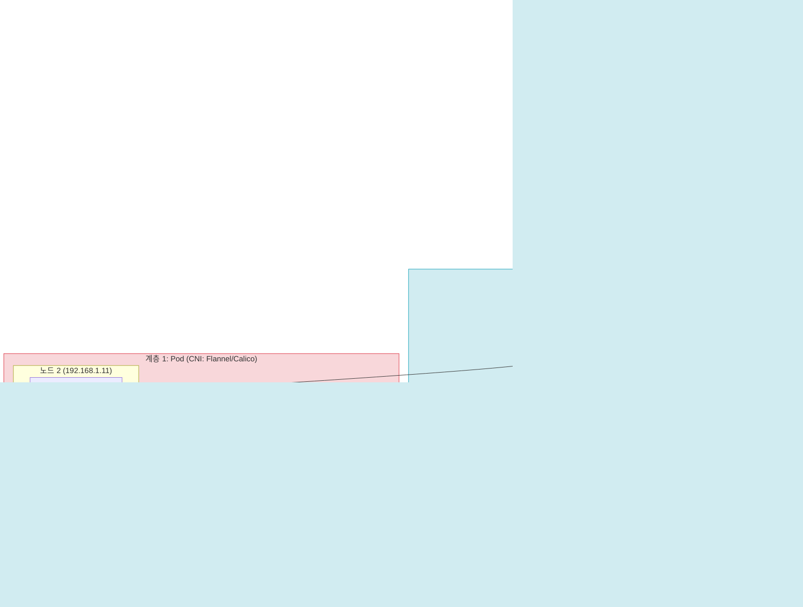
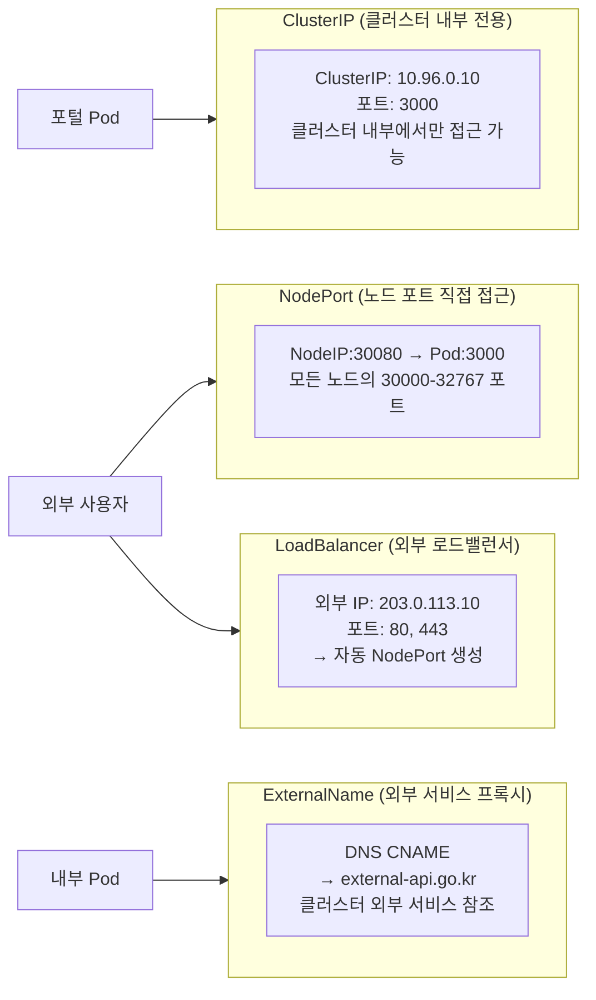
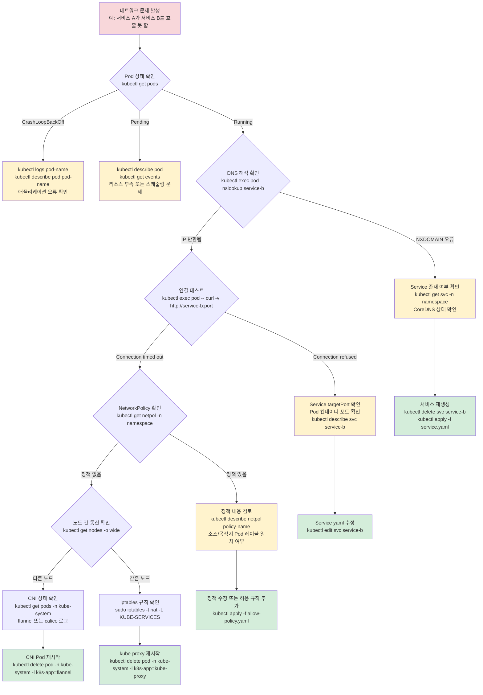

# Kubernetes 네트워킹 완전 가이드 — CNI, Service, Ingress, NetworkPolicy, Linkerd mTLS

---

| 항목 | 내용 |
|------|------|
| 문서 ID | GUIDE-INFRA-24 |
| 버전 | 1.0.0 |
| 작성일 | 2026-04-13 |
| 목적 | Kubernetes 네트워킹의 모든 계층을 처음부터 완전히 이해하고, 공공기관 SaaS 운영에 적용 가능한 실전 패턴을 습득 |
| 선행 학습 | GUIDE-INFRA-01 (k8s 기초), GUIDE-INFRA-16 (서비스 메시 기초), GUIDE-INFRA-15 (NetworkPolicy) |
| 관련 FR ID | FR-MESH.1~FR-MESH.4 |
| CSAP 연계 | D-07 가용성 관리, D-10 네트워크 보안 |

---

## 목차

1. [Kubernetes 네트워킹을 왜 깊이 이해해야 하는가](#1-왜-kubernetes-네트워킹을-이해해야-하는가)
2. [K8s 네트워킹 4계층 아키텍처](#2-k8s-네트워킹-4계층-아키텍처)
3. [CNI 동작 원리 — Flannel vs Calico](#3-cni-동작-원리)
4. [Service 유형 완전 비교](#4-service-유형-완전-비교)
5. [Ingress vs Gateway API](#5-ingress-vs-gateway-api)
6. [NetworkPolicy 레시피 10개](#6-networkpolicy-레시피-10개)
7. [Linkerd mTLS 동작 원리 — 실제 코드 분석](#7-linkerd-mtls-동작-원리)
8. [CoreDNS — 서비스 디스커버리와 커스텀 도메인](#8-coredns)
9. [kube-proxy vs eBPF Dataplane](#9-kube-proxy-vs-ebpf)
10. [K8s 네트워크 디버깅 플로우차트](#10-네트워크-디버깅-플로우차트)
11. [실제 트러블슈팅 시나리오 3개](#11-트러블슈팅-시나리오)
12. [변경 이력](#변경-이력)

---

## 1. 왜 Kubernetes 네트워킹을 이해해야 하는가

### 1.1 공공기관 SaaS에서 네트워킹이 중요한 이유

공공기관 SaaS 플랫폼은 여러 마이크로서비스가 서로 통신하며 동작합니다. 이 통신에 문제가 생기면 서비스 전체가 중단됩니다. CSAP D-10(네트워크 보안) 요건은 서비스 간 통신에 암호화와 접근 제어를 요구합니다.

```
공공기관 SaaS 서비스 통신 구조 (간략):

브라우저 → Ingress → Portal(Next.js) → API Gateway
                                        ↓
                    Auth Service ← API Gateway → AI Service
                         ↓                           ↓
                    PostgreSQL                 Vector DB
```

이 통신 경로에서 문제가 생길 수 있는 지점:
- Pod가 다른 Pod를 찾지 못하는 경우 (DNS 문제)
- 네트워크 정책이 통신을 차단하는 경우 (NetworkPolicy)
- 서비스 간 인증서가 만료된 경우 (mTLS)
- 로드밸런서 설정이 잘못된 경우 (Service 유형 오해)

이 모든 문제를 이해하고 해결하려면 네트워킹 4계층 전체를 알아야 합니다.

### 1.2 이 가이드에서 배울 내용

```
네트워킹 계층별 학습 목표:
─────────────────────────────────────────────────────────
계층 1 (Pod 레벨)   : Pod IP 할당, CNI 플러그인 동작 원리
계층 2 (Service)    : ClusterIP/NodePort/LB, 로드밸런싱
계층 3 (Ingress)    : 외부 트래픽 진입, TLS 종료
계층 4 (서비스 메시): 서비스 간 mTLS, 관찰 가능성
```

---

## 2. K8s 네트워킹 4계층 아키텍처

### 2.1 전체 아키텍처 다이어그램



### 2.2 각 계층이 하는 일

**계층 1 — Pod 네트워킹 (CNI)**
- 각 Pod에 고유한 IP 주소 할당
- 다른 노드의 Pod와 직접 통신 가능하도록 가상 네트워크 구성
- Pod가 삭제되면 IP 회수, 새 Pod에 새 IP 할당

**계층 2 — Service (안정적인 주소)**
- Pod IP는 재시작마다 변함 → Service가 고정 IP 제공
- 여러 Pod에 부하 분산 (로드밸런싱)
- 클러스터 내부 DNS: `service-name.namespace.svc.cluster.local`

**계층 3 — Ingress (외부 트래픽 진입점)**
- 단일 외부 IP로 여러 서비스에 라우팅
- 도메인 기반 라우팅 (`saas.go.kr` vs `api.saas.go.kr`)
- TLS 인증서 관리 (cert-manager 연동)

**계층 4 — 서비스 메시 (서비스 간 보안)**
- 서비스 간 mTLS (상호 TLS) 자동 적용
- 트래픽 관찰 가능성 (메트릭, 추적)
- 서킷 브레이커, 재시도 정책

---

## 3. CNI 동작 원리

### 3.1 CNI란 무엇인가

CNI(Container Network Interface)는 컨테이너에 네트워크를 연결하는 표준 인터페이스입니다. Kubernetes는 CNI를 통해 Pod에 IP 주소를 할당하고 Pod 간 통신을 가능하게 합니다.

CNI 없이는:
- Pod가 IP 주소를 가질 수 없음
- Pod 간 통신 불가능
- Kubernetes 자체가 동작하지 않음

### 3.2 Pod IP 할당 과정

```
1. kubectl apply -f pod.yaml 실행
2. API Server → Scheduler: 어느 노드에 배치할까?
3. Scheduler → API Server: 노드 A에 배치
4. API Server → kubelet(노드 A): Pod 생성 지시
5. kubelet → 컨테이너 런타임: 컨테이너 생성
6. 컨테이너 런타임 → CNI 플러그인: "이 컨테이너에 IP 주세요"
7. CNI → 컨테이너: IP 할당 (예: 10.244.1.5)
8. CNI → 가상 네트워크: 라우팅 테이블 업데이트
9. Pod 준비 완료
```

### 3.3 Flannel vs Calico 비교

| 항목 | Flannel | Calico |
|------|---------|--------|
| 복잡도 | 단순 (설정 최소) | 복잡 (기능 풍부) |
| NetworkPolicy | 지원 안 함 | 완전 지원 |
| 성능 | 오버레이 네트워크 오버헤드 | BGP 라우팅으로 고성능 |
| 암호화 | 없음 | WireGuard 암호화 지원 |
| CSAP D-10 | 미충족 (PolicyResource 없음) | 충족 (NetworkPolicy + 암호화) |
| 공공기관 추천 | 개발환경 | 운영환경 필수 |
| k3s 기본 | Flannel | 별도 설치 필요 |

**공공기관 SaaS 선택 기준:**
- 개발/테스트 환경: Flannel (간단, k3s 기본 제공)
- 운영 환경: Calico (NetworkPolicy 필수, CSAP D-10 요건)

### 3.4 노드 간 Pod 통신 동작 원리

```
시나리오: 노드 1의 Portal Pod(10.244.1.5)가 노드 2의 Auth Pod(10.244.2.6) 호출

Flannel (VXLAN 오버레이):
노드1 Portal Pod → 가상 인터페이스 flannel.1 → UDP 캡슐화 →
노드2 물리 NIC → VXLAN 역캡슐화 → Auth Pod

Calico (BGP 라우팅):
노드1 Portal Pod → 라우팅 테이블 조회 (BGP가 자동 업데이트) →
물리 네트워크 직접 전송 (캡슐화 없음) → 노드2 Auth Pod
```

Calico BGP 방식이 캡슐화 오버헤드 없이 더 빠릅니다.

---

## 4. Service 유형 완전 비교

### 4.1 Service 4가지 유형



### 4.2 ClusterIP — 마이크로서비스 내부 통신

가장 기본적인 Service 유형입니다. 클러스터 내부에서만 접근 가능합니다.

```yaml
# auth-service ClusterIP 설정 예시
apiVersion: v1
kind: Service
metadata:
  name: auth-service
  namespace: public-saas
spec:
  type: ClusterIP  # 기본값 (명시 안 해도 ClusterIP)
  selector:
    app: auth-service  # 이 레이블이 있는 Pod에 트래픽 전달
  ports:
    - name: http
      port: 3001        # Service가 노출하는 포트 (클라이언트가 접근)
      targetPort: 3001  # Pod 내 컨테이너 포트 (보통 같은 값)
      protocol: TCP
```

다른 서비스에서 접근하는 방법:
```
# 같은 namespace에서
http://auth-service:3001

# 다른 namespace에서
http://auth-service.public-saas.svc.cluster.local:3001
```

### 4.3 NodePort — 개발/테스트 직접 접근

```yaml
apiVersion: v1
kind: Service
metadata:
  name: portal-nodeport
spec:
  type: NodePort
  selector:
    app: portal
  ports:
    - port: 4000        # ClusterIP 포트
      targetPort: 4000  # Pod 포트
      nodePort: 30400   # 노드 외부 포트 (30000-32767 범위)
      # nodePort 미지정 시 자동 할당
```

```bash
# 노드 IP 확인
kubectl get nodes -o wide

# 접근 방법: http://노드IP:30400
# 개발환경: http://localhost:30400 (k3s + WSL2)
```

**주의**: NodePort는 모든 노드의 해당 포트를 열므로 운영 환경에서는 보안 위험 존재. 개발/테스트에만 사용.

### 4.4 LoadBalancer — 운영 환경 외부 노출

```yaml
apiVersion: v1
kind: Service
metadata:
  name: ingress-nginx-controller
  namespace: ingress-nginx
  annotations:
    # MetalLB 어드레스 풀 지정 (k3s 환경)
    metallb.universe.tf/address-pool: public-pool
spec:
  type: LoadBalancer
  selector:
    app.kubernetes.io/name: ingress-nginx
  ports:
    - name: http
      port: 80
      targetPort: 80
    - name: https
      port: 443
      targetPort: 443
  # loadBalancerIP: "203.0.113.10"  # 특정 IP 요청 (MetalLB에 해당 IP가 있어야 함)
```

k3s에서 MetalLB 없이 LoadBalancer를 만들면 `<pending>` 상태가 됩니다.

```bash
# LoadBalancer 상태 확인
kubectl get svc ingress-nginx-controller -n ingress-nginx
# EXTERNAL-IP가 <pending>이면 MetalLB 설치 필요

# MetalLB 설치 (k3s 환경)
kubectl apply -f https://raw.githubusercontent.com/metallb/metallb/v0.14.5/config/manifests/metallb-native.yaml
```

### 4.5 ExternalName — 외부 서비스 추상화

외부 API를 클러스터 내에서 Service처럼 참조할 때 사용합니다.

```yaml
# 외부 공공 API를 내부 서비스처럼 참조
apiVersion: v1
kind: Service
metadata:
  name: openapi-gov-kr
  namespace: public-saas
spec:
  type: ExternalName
  externalName: api.data.go.kr  # 실제 외부 도메인

# Pod에서 접근: http://openapi-gov-kr/...
# 실제로는 api.data.go.kr로 DNS CNAME 처리됨
```

---

## 5. Ingress vs Gateway API

### 5.1 Ingress 기본 구조

Ingress는 단일 외부 IP로 여러 내부 Service에 HTTP/HTTPS 트래픽을 라우팅합니다.

```yaml
# 공공기관 SaaS Portal Ingress 설정
apiVersion: networking.k8s.io/v1
kind: Ingress
metadata:
  name: public-saas-ingress
  namespace: public-saas
  annotations:
    # cert-manager: TLS 인증서 자동 발급/갱신 (Let's Encrypt 또는 사설 CA)
    cert-manager.io/cluster-issuer: "letsencrypt-prod"
    # Nginx 설정
    nginx.ingress.kubernetes.io/ssl-redirect: "true"
    nginx.ingress.kubernetes.io/proxy-body-size: "10m"
    # HSTS (CSAP D-09: TLS 강제)
    nginx.ingress.kubernetes.io/configuration-snippet: |
      add_header Strict-Transport-Security "max-age=63072000; includeSubDomains; preload" always;
spec:
  ingressClassName: nginx
  tls:
    - hosts:
        - saas.go.kr
        - "*.saas.go.kr"  # 테넌트 서브도메인 와일드카드
      secretName: public-saas-tls  # cert-manager가 이 Secret에 인증서 저장
  rules:
    # 포털 (메인 도메인)
    - host: saas.go.kr
      http:
        paths:
          - path: /
            pathType: Prefix
            backend:
              service:
                name: portal
                port:
                  number: 4000

    # API 게이트웨이 (api 서브도메인)
    - host: api.saas.go.kr
      http:
        paths:
          - path: /
            pathType: Prefix
            backend:
              service:
                name: api-gateway
                port:
                  number: 3000

    # 테넌트 서브도메인 와일드카드 (*.saas.go.kr)
    - host: "*.saas.go.kr"
      http:
        paths:
          - path: /
            pathType: Prefix
            backend:
              service:
                name: portal  # 멀티테넌트: Portal이 서브도메인 처리
                port:
                  number: 4000
```

### 5.2 Gateway API — Ingress의 다음 세대

Gateway API는 Ingress의 한계를 극복하기 위한 차세대 표준입니다.

```
Ingress의 한계:
  - 벤더별 annotation으로 기능 확장 → 이식성 없음
  - 단일 리소스에 너무 많은 역할 → 관심사 분리 불가
  - HTTP만 지원 (TCP, gRPC 등 불가)

Gateway API의 개선:
  - GatewayClass: 인프라 팀이 로드밸런서 유형 정의
  - Gateway: 운영팀이 외부 접점 포트/프로토콜 정의
  - HTTPRoute/TCPRoute: 앱 팀이 라우팅 규칙 정의
  → 역할별 분리 → CSAP 접근 통제에 유리
```

```yaml
# Gateway API 예시 (Linkerd + Gateway API 조합)
apiVersion: gateway.networking.k8s.io/v1
kind: HTTPRoute
metadata:
  name: portal-route
  namespace: public-saas
spec:
  parentRefs:
    - name: public-saas-gateway
  hostnames:
    - "saas.go.kr"
  rules:
    - matches:
        - path:
            type: PathPrefix
            value: /api/
      backendRefs:
        - name: api-gateway
          port: 3000
    - matches:
        - path:
            type: PathPrefix
            value: /
      backendRefs:
        - name: portal
          port: 4000
```

---

## 6. NetworkPolicy 레시피 10개

### 6.1 NetworkPolicy 기본 개념

NetworkPolicy는 Kubernetes에서 Pod 간 네트워크 트래픽을 제어하는 방화벽 규칙입니다. CSAP D-10(네트워크 보안) 요건을 충족하려면 반드시 필요합니다.

**중요한 원칙:**
- NetworkPolicy가 없으면: 모든 Pod가 서로 통신 가능 (위험)
- NetworkPolicy 적용 후: 명시적으로 허용하지 않은 트래픽은 차단

### 6.2 레시피 1 — 모든 수신/발신 차단 (기본 정책)

모든 네임스페이스에 적용해야 하는 기본 정책입니다. 이것을 먼저 적용하고 필요한 트래픽만 허용합니다.

```yaml
apiVersion: networking.k8s.io/v1
kind: NetworkPolicy
metadata:
  name: default-deny-all
  namespace: public-saas
spec:
  podSelector: {}  # 모든 Pod에 적용
  policyTypes:
    - Ingress
    - Egress
  # ingress/egress 규칙 없음 = 모든 트래픽 차단
```

### 6.3 레시피 2 — 같은 네임스페이스 내 통신만 허용

```yaml
apiVersion: networking.k8s.io/v1
kind: NetworkPolicy
metadata:
  name: allow-same-namespace
  namespace: public-saas
spec:
  podSelector: {}
  policyTypes:
    - Ingress
  ingress:
    - from:
        - podSelector: {}  # 같은 namespace의 모든 Pod에서 수신 허용
```

### 6.4 레시피 3 — API Gateway → Auth Service 특정 포트만 허용

```yaml
apiVersion: networking.k8s.io/v1
kind: NetworkPolicy
metadata:
  name: allow-gateway-to-auth
  namespace: public-saas
spec:
  podSelector:
    matchLabels:
      app: auth-service  # 이 정책의 대상: auth-service Pod
  policyTypes:
    - Ingress
  ingress:
    - from:
        - podSelector:
            matchLabels:
              app: api-gateway  # api-gateway Pod에서만
      ports:
        - protocol: TCP
          port: 3001  # 포트 3001만 허용
```

### 6.5 레시피 4 — Ingress 컨트롤러 → Portal 허용

```yaml
apiVersion: networking.k8s.io/v1
kind: NetworkPolicy
metadata:
  name: allow-ingress-to-portal
  namespace: public-saas
spec:
  podSelector:
    matchLabels:
      app: portal
  policyTypes:
    - Ingress
  ingress:
    - from:
        - namespaceSelector:
            matchLabels:
              kubernetes.io/metadata.name: ingress-nginx  # ingress-nginx namespace
        - podSelector:
            matchLabels:
              app.kubernetes.io/name: ingress-nginx
      ports:
        - port: 4000
```

### 6.6 레시피 5 — DB는 앱에서만 접근 허용 (최고 보안)

```yaml
apiVersion: networking.k8s.io/v1
kind: NetworkPolicy
metadata:
  name: db-access-control
  namespace: public-saas
spec:
  podSelector:
    matchLabels:
      app: postgresql  # DB Pod에 적용
  policyTypes:
    - Ingress
    - Egress
  ingress:
    - from:
        # portal만 DB 접근 가능
        - podSelector:
            matchLabels:
              app: portal
      ports:
        - port: 5432
    - from:
        # auth-service만 DB 접근 가능
        - podSelector:
            matchLabels:
              app: auth-service
      ports:
        - port: 5432
  egress:
    - {}  # DB 발신은 모두 차단 (DB는 다른 서비스 호출 불필요)
```

### 6.7 레시피 6 — DNS 조회 허용 (필수! 없으면 서비스 이름 해석 불가)

NetworkPolicy로 모든 Egress를 차단하면 DNS도 차단됩니다. DNS는 반드시 허용해야 합니다.

```yaml
apiVersion: networking.k8s.io/v1
kind: NetworkPolicy
metadata:
  name: allow-dns-egress
  namespace: public-saas
spec:
  podSelector: {}  # 모든 Pod
  policyTypes:
    - Egress
  egress:
    # CoreDNS (kube-dns) 허용
    - to:
        - namespaceSelector:
            matchLabels:
              kubernetes.io/metadata.name: kube-system
        - podSelector:
            matchLabels:
              k8s-app: kube-dns
      ports:
        - protocol: UDP
          port: 53
        - protocol: TCP
          port: 53
```

### 6.8 레시피 7 — 모니터링 수집기 (Prometheus) 허용

```yaml
apiVersion: networking.k8s.io/v1
kind: NetworkPolicy
metadata:
  name: allow-prometheus-scrape
  namespace: public-saas
spec:
  podSelector: {}  # 모든 Pod의 메트릭 엔드포인트
  policyTypes:
    - Ingress
  ingress:
    - from:
        - namespaceSelector:
            matchLabels:
              kubernetes.io/metadata.name: monitoring
        - podSelector:
            matchLabels:
              app: prometheus
      ports:
        - port: 9090   # 메트릭 포트 (서비스마다 다를 수 있음)
        - port: 3000   # Fastify 메트릭
```

### 6.9 레시피 8 — AI Service 외부 AI Gateway 접근 허용

AI Service만 외부 AI Gateway로 나갈 수 있도록 제한합니다.

```yaml
apiVersion: networking.k8s.io/v1
kind: NetworkPolicy
metadata:
  name: allow-ai-service-egress
  namespace: public-saas
spec:
  podSelector:
    matchLabels:
      app: ai-service  # AI Service Pod만
  policyTypes:
    - Egress
  egress:
    # 내부 서비스 통신
    - to:
        - podSelector: {}  # 같은 namespace 내부
    # DNS
    - to:
        - namespaceSelector:
            matchLabels:
              kubernetes.io/metadata.name: kube-system
      ports:
        - port: 53
          protocol: UDP
    # 외부 AI Gateway (N2SF: O등급 데이터만, PII 마스킹 후)
    - to:
        - ipBlock:
            cidr: 0.0.0.0/0
            except:
              - 10.0.0.0/8      # 내부 네트워크 제외 (별도 규칙으로 처리)
              - 172.16.0.0/12
              - 192.168.0.0/16
      ports:
        - port: 443  # HTTPS만 허용 (평문 HTTP 금지 — CSAP D-09)
```

### 6.10 레시피 9 — 테넌트 격리 (Namespace별)

여러 테넌트를 별도 Namespace로 분리하는 경우, Namespace 간 통신을 차단합니다.

```yaml
# 각 테넌트 Namespace에 적용
apiVersion: networking.k8s.io/v1
kind: NetworkPolicy
metadata:
  name: tenant-isolation
  namespace: tenant-seoul  # 서울시청 테넌트 네임스페이스
spec:
  podSelector: {}
  policyTypes:
    - Ingress
    - Egress
  ingress:
    # 같은 namespace에서만 수신 허용
    - from:
        - podSelector: {}
    # 플랫폼 namespace에서만 수신 허용 (관리 목적)
    - from:
        - namespaceSelector:
            matchLabels:
              role: platform  # public-saas namespace에 이 레이블 추가
  egress:
    # 같은 namespace로만 발신 허용
    - to:
        - podSelector: {}
    # DNS 허용
    - to:
        - namespaceSelector:
            matchLabels:
              kubernetes.io/metadata.name: kube-system
      ports:
        - port: 53
          protocol: UDP
    # 플랫폼 API Gateway로만 외부 발신 허용
    - to:
        - namespaceSelector:
            matchLabels:
              role: platform
        - podSelector:
            matchLabels:
              app: api-gateway
```

### 6.11 레시피 10 — 헬스체크 포트 허용

Kubernetes liveness/readiness probe가 차단되지 않도록 합니다.

```yaml
apiVersion: networking.k8s.io/v1
kind: NetworkPolicy
metadata:
  name: allow-health-probes
  namespace: public-saas
spec:
  podSelector: {}
  policyTypes:
    - Ingress
  ingress:
    # kubelet이 헬스체크 포트에 접근 허용
    # kubelet은 노드의 IP에서 접근하므로 ipBlock으로 허용
    - from:
        - ipBlock:
            cidr: 192.168.1.0/24  # 노드 IP 대역 (환경에 맞게 수정)
      ports:
        - port: 8080  # 헬스체크 포트 (서비스마다 설정 다를 수 있음)
```

---

## 7. Linkerd mTLS 동작 원리

### 7.1 mTLS가 필요한 이유

일반 TLS는 클라이언트가 서버를 검증합니다 (단방향). mTLS(Mutual TLS)는 서버도 클라이언트를 검증합니다 (양방향). 이것이 CSAP D-10이 서비스 간 통신에 요구하는 수준입니다.

```
일반 HTTP:     Pod A → (평문) → Pod B
TLS:           Pod A → (암호화, B 신원 검증) → Pod B
mTLS:          Pod A ↔ (암호화, 서로 신원 검증) ↔ Pod B
```

### 7.2 Linkerd 사이드카 패턴

Linkerd는 모든 Pod 옆에 경량 프록시(`linkerd-proxy`)를 사이드카로 주입합니다. 애플리케이션 코드 변경 없이 모든 서비스 간 통신에 mTLS를 적용합니다.

```
[Pod 내부 구조 — Linkerd 적용 후]
┌────────────────────────────────┐
│  Pod                           │
│  ┌──────────────────────────┐  │
│  │   애플리케이션 컨테이너   │  │
│  │   (Fastify 서버 :3001)    │  │
│  └──────────┬───────────────┘  │
│             │ 127.0.0.1        │
│  ┌──────────▼───────────────┐  │
│  │   linkerd-proxy          │  │
│  │   (사이드카, 자동 주입)   │  │
│  │   수신: iptables 가로채기 │  │
│  │   발신: iptables 가로채기 │  │
│  │   mTLS 자동 처리          │  │
│  └──────────────────────────┘  │
└────────────────────────────────┘

애플리케이션은 일반 HTTP로 통신하지만,
linkerd-proxy가 자동으로 mTLS로 변환
```

### 7.3 GracefulShutdown — 메시 환경에서의 안전한 종료

`/data/ai-saas/platform/packages/mesh-ready/src/graceful-shutdown.ts`의 실제 코드를 분석합니다. 이 코드는 Linkerd mTLS 환경에서 Pod가 종료될 때 안전하게 처리하는 핵심 로직입니다.

**문제 상황**: Kubernetes가 Pod를 종료할 때 (`kubectl delete pod` 또는 롤링 업데이트):
1. SIGTERM 신호를 Pod에 보냄
2. 기본 동작: 즉시 프로세스 종료 → 처리 중인 요청 유실
3. Linkerd가 사이드카를 먼저 종료하면 앱이 요청을 받을 수 없음

**해결책: GracefulShutdown 클래스 (실제 코드 분석)**

```typescript
// /data/ai-saas/platform/packages/mesh-ready/src/graceful-shutdown.ts

export class GracefulShutdown {
  private readonly timeout: number;        // 최대 대기 시간 (기본 30초)
  private readonly cleanupHandlers: Array<() => Promise<void>>;
  private isShuttingDown = false;  // 셧다운 중인지 플래그
  private activeRequests = 0;      // 현재 처리 중인 요청 수

  constructor(options: GracefulShutdownOptions = {}) {
    this.timeout = options.timeout ?? DEFAULT_TIMEOUT; // 30초
    // k8s terminationGracePeriodSeconds와 일치시키는 것이 중요
    // terminationGracePeriodSeconds: 30 → timeout: 30000
  }

  // Fastify 훅 등록 — 모든 요청을 카운팅
  registerWithFastify(app: FastifyInstance): void {
    app.addHook('onRequest', async (_request, reply) => {
      if (this.isShuttingDown) {
        // SIGTERM 수신 후 새 요청 거부 (503 반환)
        // Linkerd가 이 응답을 보고 트래픽 전송 중단
        reply.status(503).send({
          error: 'Service Unavailable',
          code: 'SERVICE_SHUTTING_DOWN',
        });
        return;
      }
      this.activeRequests++; // 요청 시작 시 카운트 증가
    });

    app.addHook('onResponse', async () => {
      this.activeRequests--; // 요청 완료 시 카운트 감소
    });

    // SIGTERM, SIGINT 핸들러 등록
    const handler = () => {
      this.shutdown(app).then(() => process.exit(0))
                       .catch(() => process.exit(1));
    };
    process.on('SIGTERM', handler);
    process.on('SIGINT', handler);
  }

  async shutdown(app?: FastifyInstance): Promise<void> {
    if (this.isShuttingDown) return;
    this.isShuttingDown = true; // 새 요청 차단 시작

    // 1단계: 처리 중인 요청이 완료될 때까지 대기 (최대 30초)
    await this.waitForActiveRequests();

    // 2단계: 정리 핸들러 실행 (DB 연결 종료, 캐시 flush 등)
    await this.runCleanupHandlers();

    // 3단계: Fastify 서버 정상 종료
    if (app) await app.close();
  }

  private async waitForActiveRequests(): Promise<void> {
    if (this.activeRequests === 0) return;

    return new Promise<void>((resolve) => {
      const startTime = Date.now();
      const interval = setInterval(() => {
        if (this.activeRequests === 0) {
          clearInterval(interval);
          resolve();
          return;
        }
        if (Date.now() - startTime >= this.timeout) {
          // 타임아웃: 강제 종료 (요청 유실 최소화)
          clearInterval(interval);
          resolve();
        }
      }, 100); // 100ms마다 확인
    });
  }
}
```

### 7.4 GracefulShutdown을 실제 서비스에 적용

`mesh-ready-plugin.ts`에서 GracefulShutdown을 Fastify 플러그인으로 통합합니다.

```typescript
// /data/ai-saas/platform/packages/mesh-ready/src/mesh-ready-plugin.ts

async function meshReadyPluginImpl(app: FastifyInstance, opts: MeshReadyPluginOptions) {
  // 세 가지 핵심 컴포넌트 초기화
  const metadata = new ServiceMetadata(opts.service);    // 서비스 메타데이터
  const tracer = new TraceContextPropagator();           // 분산 추적
  const shutdown = new GracefulShutdown(opts.shutdown);  // 그레이스풀 셧다운

  // Fastify에 decorator 추가 (app.mesh.shutdown 등으로 접근 가능)
  app.decorate('mesh', { metadata, tracer, shutdown, ... });

  // 분산 추적 헤더 전파 (W3C TraceContext + B3 동시 지원)
  if (!opts.disableTracing) {
    app.addHook('onRequest', async (request, reply) => {
      tracer.onRequestHook(request, reply);
    });
  }

  // 그레이스풀 셧다운 훅 등록
  if (!opts.disableShutdown) {
    shutdown.registerWithFastify(app);
  }

  // /metadata 엔드포인트 (k8s 서비스 디스커버리용)
  if (!opts.disableMetadataEndpoint) {
    app.get('/metadata', async () => ({
      success: true,
      data: metadata.getMetadata(),
    }));
  }
}
```

**실제 서비스에서 사용하는 방법:**

```typescript
// auth-service/src/app.ts
import Fastify from 'fastify';
import { meshReadyPlugin } from '@public-saas/mesh-ready';

const app = Fastify({ logger: true });

await app.register(meshReadyPlugin, {
  service: {
    name: 'auth-service',
    version: '0.1.0',
    namespace: 'public-saas',
    dependencies: ['postgresql', 'redis'],
  },
  shutdown: {
    timeout: 30000,  // k8s terminationGracePeriodSeconds와 동일
    cleanupHandlers: [
      async () => prisma.$disconnect(),   // DB 연결 종료
      async () => redisClient.quit(),      // Redis 연결 종료
    ],
  },
});

// 이후 app.mesh.shutdown, app.mesh.tracer 등 사용 가능
```

### 7.5 분산 추적 — TraceContextPropagator 분석

서비스 A가 서비스 B를 호출할 때, 요청의 전체 경로를 추적하는 메커니즘입니다.

```typescript
// trace-context-propagator.ts의 핵심 동작

// W3C traceparent 형식: 00-{32자리 traceId}-{16자리 spanId}-{2자리 flags}
// 예: 00-4bf92f3577b34da6a3ce929d0e0e4736-00f067aa0ba902b7-01

const tracer = new TraceContextPropagator();

// 수신 요청에서 추적 헤더 추출
const incoming = tracer.extractHeaders(request);
// incoming = { traceparent: '00-4bf9...', 'x-b3-traceid': '4bf9...' }

// 다운스트림 서비스 호출 시 전파
const outgoing = tracer.createPropagationHeaders(incoming);
// 추적 헤더가 없으면 새 컨텍스트 생성 (최초 서비스)
// 있으면 동일한 traceId 유지 (span 체인)

// 다음 서비스 호출 시 헤더 포함
await fetch('http://auth-service:3001/verify', {
  headers: outgoing,
});
```

---

## 8. CoreDNS

### 8.1 서비스 디스커버리 동작 원리

```
Pod에서 http://auth-service:3001 호출 시:

1. Pod → 8.8.8.8:53 질의? 아님!
   Pod DNS 설정: /etc/resolv.conf
   nameserver 10.96.0.10  ← CoreDNS ClusterIP
   search public-saas.svc.cluster.local svc.cluster.local cluster.local

2. Pod → CoreDNS(10.96.0.10):53 → "auth-service가 어디야?"
   CoreDNS: "auth-service.public-saas.svc.cluster.local → 10.96.0.12"

3. Pod → 10.96.0.12:3001 (ClusterIP)
   kube-proxy가 DNAT: 10.96.0.12 → 실제 Pod IP(10.244.1.6)
```

### 8.2 DNS 조회 순서 (search 도메인)

```bash
# Pod에서 dig로 확인
kubectl exec -it pod-name -n public-saas -- dig auth-service

# 조회 순서:
# 1. auth-service.public-saas.svc.cluster.local
# 2. auth-service.svc.cluster.local
# 3. auth-service.cluster.local
# 4. auth-service (외부 DNS로 나감 — 보통 여기서 실패)
```

### 8.3 커스텀 도메인 설정 — CoreDNS ConfigMap

```yaml
# CoreDNS 커스텀 도메인 설정
apiVersion: v1
kind: ConfigMap
metadata:
  name: coredns
  namespace: kube-system
data:
  Corefile: |
    .:53 {
        errors
        health {
           lameduck 5s
        }
        ready
        kubernetes cluster.local in-addr.arpa ip6.arpa {
           pods insecure
           fallthrough in-addr.arpa ip6.arpa
           ttl 30
        }
        prometheus :9153
        forward . /etc/resolv.conf {
           max_concurrent 1000
        }
        cache 30
        loop
        reload
        loadbalance
    }

    # 공공 API 서버 도메인 → 내부 프록시 서비스로 리다이렉트
    api.data.go.kr:53 {
        errors
        rewrite name api.data.go.kr openapi-gov-kr.public-saas.svc.cluster.local
        forward . /etc/resolv.conf
    }
```

### 8.4 DNS 관련 흔한 문제

```bash
# Pod에서 DNS 질의가 실패할 때 디버깅
kubectl run dns-debug --rm -it --image=busybox --restart=Never -- sh

# CoreDNS에 직접 질의
nslookup auth-service 10.96.0.10

# CoreDNS 상태 확인
kubectl get pods -n kube-system -l k8s-app=kube-dns
kubectl logs -n kube-system -l k8s-app=kube-dns
```

---

## 9. kube-proxy vs eBPF

### 9.1 kube-proxy 동작 원리

kube-proxy는 Service의 ClusterIP를 실제 Pod IP로 변환하는 역할을 합니다.

```
Service 트래픽 흐름 (kube-proxy iptables 모드):

요청: auth-service:3001 (ClusterIP: 10.96.0.12)
         ↓
iptables PREROUTING 체인:
  -A KUBE-SERVICES -d 10.96.0.12 -p tcp --dport 3001 -j KUBE-SVC-AUTH
  -A KUBE-SVC-AUTH -m statistic --mode random --probability 0.5 -j KUBE-SEP-1
  -A KUBE-SVC-AUTH -j KUBE-SEP-2
  -A KUBE-SEP-1 -j DNAT --to-destination 10.244.1.6:3001  ← Pod 1
  -A KUBE-SEP-2 -j DNAT --to-destination 10.244.2.3:3001  ← Pod 2

결과: 50% 확률로 Pod 1 또는 Pod 2로 전달 (라운드로빈 아님, 확률 기반)
```

**kube-proxy의 한계:**
- iptables 규칙이 Service/Pod 수에 비례해 기하급수적으로 증가
- 1000개 Service = 수만 개 iptables 규칙 → 성능 저하
- 규칙 업데이트 시 전체 체인 재구성 → 순간적인 패킷 손실

### 9.2 eBPF Dataplane (Cilium)

```
eBPF 방식 (Cilium):

요청: auth-service:3001
         ↓
커널 내 eBPF 프로그램:
  - Service → Pod 매핑을 해시 맵으로 관리 (O(1) 조회)
  - iptables 우회, 커널에서 직접 처리
  - 네트워크 정책도 eBPF로 처리 (훨씬 빠름)

결과: 수십 배 빠른 처리, 선형 확장 (Pod 10개와 10,000개가 동일 성능)
```

```
공공기관 SaaS 선택:
  운영 규모 < 100 Pod:     kube-proxy (k3s 기본, 단순함 우선)
  운영 규모 > 100 Pod:     Cilium (eBPF, 성능 + 고급 NetworkPolicy)
  보안 요건 최고 수준:      Cilium + WireGuard (Pod 간 암호화)
```

---

## 10. 네트워크 디버깅 플로우차트



---

## 11. 트러블슈팅 시나리오

### 시나리오 1: Portal이 Auth Service에 연결 안 됨

**증상**: Portal 로그에 `ECONNREFUSED 10.96.0.12:3001` 에러

**원인 파악 단계:**

```bash
# Step 1: Auth Service가 실제로 존재하는지 확인
kubectl get svc auth-service -n public-saas
# 없으면: Service yaml 파일 확인 후 재배포

# Step 2: Auth Service에 연결된 Pod가 있는지 확인 (Endpoints)
kubectl get endpoints auth-service -n public-saas
# NAME           ENDPOINTS        AGE
# auth-service   <none>           5m  ← Pod가 없거나 레이블 불일치!
# auth-service   10.244.1.6:3001  5m  ← 정상

# Step 3: Endpoints가 없다면 Pod 레이블 확인
kubectl get pods -n public-saas --show-labels | grep auth
# Pod에 app=auth-service 레이블이 있는지 확인

# Step 4: 레이블 불일치라면
kubectl describe svc auth-service -n public-saas
# Selector: app=auth-service  ← Service가 찾는 레이블
kubectl get pods -n public-saas -l app=auth-service
# 결과 없으면 Pod에 해당 레이블 없음

# 해결: Pod의 레이블 수정
kubectl label pod auth-pod-xxxx app=auth-service -n public-saas
```

**근본 원인**: Service의 `selector`와 Pod의 `labels`가 불일치하면 Endpoints가 빈 상태가 됩니다.

### 시나리오 2: NetworkPolicy 적용 후 모든 통신 중단

**증상**: `default-deny-all` 정책 적용 후 모든 서비스 간 통신 실패

**원인**: default-deny-all이 DNS까지 차단함

```bash
# DNS가 차단되었는지 확인
kubectl exec -n public-saas portal-pod -- nslookup auth-service
# ;; connection timed out; no servers could be reached  ← DNS 차단됨

# 현재 NetworkPolicy 목록 확인
kubectl get netpol -n public-saas
# NAME               POD-SELECTOR   AGE
# default-deny-all   <none>         2m  ← 모든 트래픽 차단

# DNS 허용 정책 적용 (레시피 6)
kubectl apply -f - <<EOF
apiVersion: networking.k8s.io/v1
kind: NetworkPolicy
metadata:
  name: allow-dns-egress
  namespace: public-saas
spec:
  podSelector: {}
  policyTypes:
    - Egress
  egress:
    - to:
        - namespaceSelector:
            matchLabels:
              kubernetes.io/metadata.name: kube-system
      ports:
        - protocol: UDP
          port: 53
EOF

# DNS 복구 확인
kubectl exec -n public-saas portal-pod -- nslookup auth-service
# Server: 10.96.0.10
# Address: 10.96.0.10:53
# Name: auth-service.public-saas.svc.cluster.local
# Address: 10.96.0.12  ← 정상 복구
```

### 시나리오 3: 롤링 업데이트 중 502 오류 발생

**증상**: 배포 중 간헐적으로 `502 Bad Gateway` 오류

**원인**: Pod가 아직 종료 중인데 Ingress가 트래픽을 보냄

```bash
# 현재 Pod 상태 모니터링
kubectl get pods -n public-saas -w
# auth-service-old-xxx   Running   → Terminating  ← 종료 시작
# auth-service-new-yyy   Pending   → Running      ← 새 Pod 시작

# GracefulShutdown이 동작하는지 확인
kubectl logs auth-service-old-xxx -n public-saas | grep "그레이스풀"
# {"level":"info","msg":"그레이스풀 셧다운 시작 (timeout: 30000ms)"}
# {"level":"info","msg":"활성 요청 3개 완료 대기 중..."}
# {"level":"info","msg":"모든 활성 요청 완료"}
# {"level":"info","msg":"그레이스풀 셧다운 완료"}
```

**해결책: Deployment에 terminationGracePeriodSeconds 설정**

```yaml
spec:
  template:
    spec:
      # GracefulShutdown timeout(30초)보다 약간 길게 설정
      terminationGracePeriodSeconds: 35
      containers:
        - name: auth-service
          # preStop hook: SIGTERM 전 약간의 대기 (Ingress 연결 끊기 시간 확보)
          lifecycle:
            preStop:
              exec:
                command: ["/bin/sh", "-c", "sleep 5"]
```

```
시나리오 정리:
SIGTERM 수신
    ↓ preStop: 5초 대기 (Ingress가 이 Pod로 새 요청 보내는 것 중단할 시간)
    ↓ GracefulShutdown: 처리 중인 요청 완료 대기 (최대 30초)
    ↓ 정리 핸들러: DB 연결 종료 등
    ↓ 프로세스 종료
총 최대 35초 → terminationGracePeriodSeconds: 35
```

---

## 변경 이력

| 버전 | 일자 | 내용 | 작성자 |
|------|------|------|--------|
| 1.0.0 | 2026-04-13 | 최초 작성 — K8s 네트워킹 완전 가이드 | Implementer |

---

*본 문서는 `/data/ai-saas/platform/packages/mesh-ready/src/` 실제 코드를 직접 분석하여 작성되었습니다. GracefulShutdown, TraceContextPropagator, ServiceMetadata 구현체를 기반으로 Linkerd mTLS 통합 패턴을 설명합니다.*
