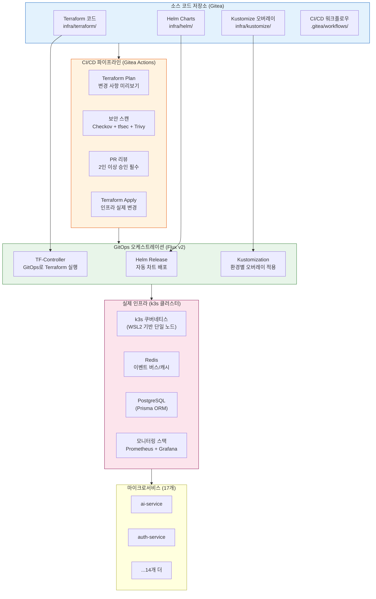
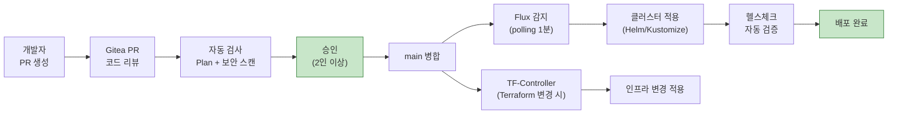
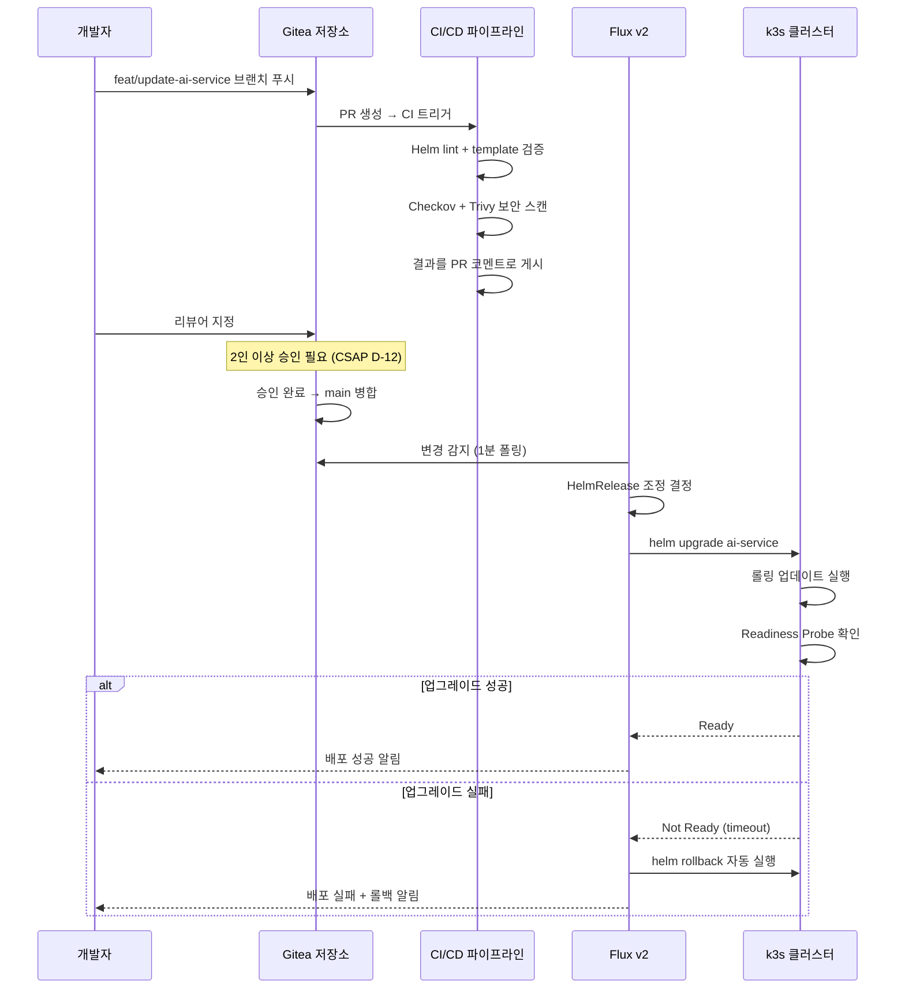
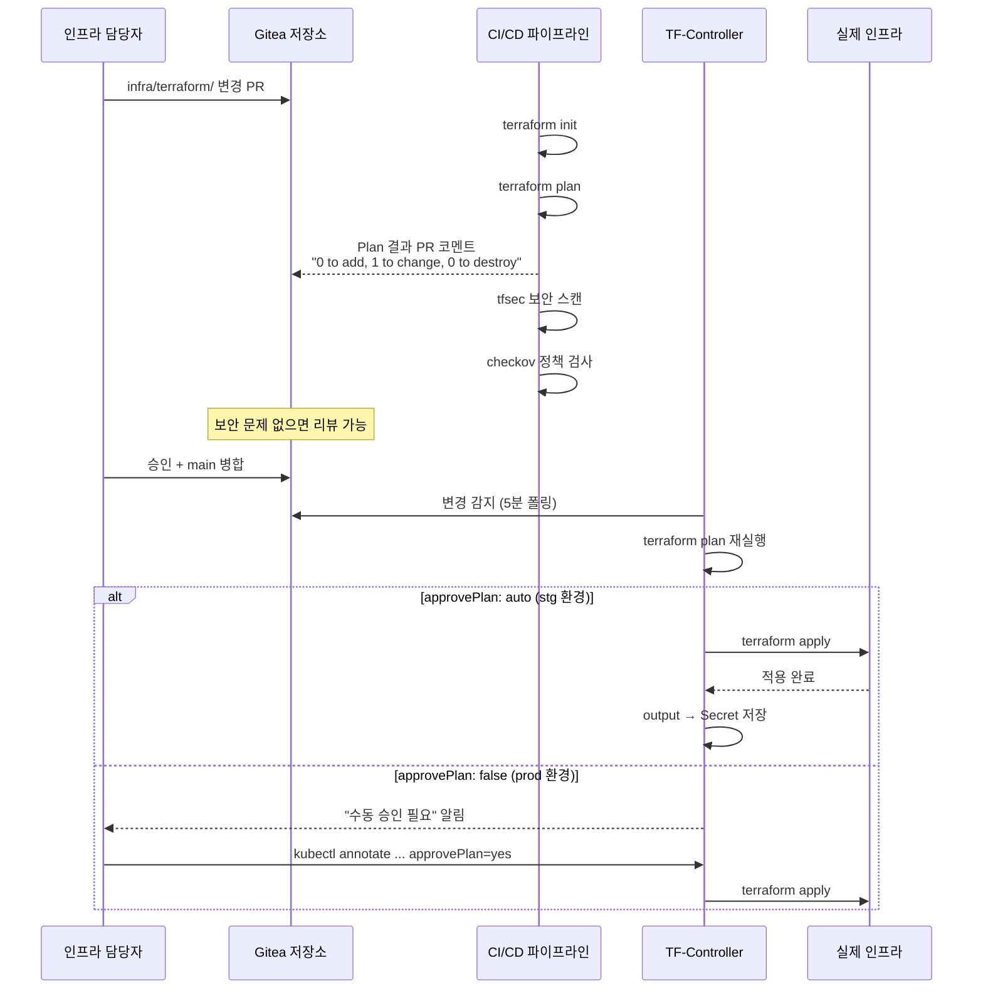

# Infrastructure as Code(IaC) 완전 가이드

> **대상**: 공공기관 SaaS 프레임워크 신규 인프라/DevOps 담당자  
> **수준**: 초급 ~ 중급 (리눅스 기초 지식 권장)  
> **Design Ref**: MTU-N253 Design, MTU-N251 Design §3.7  
> **Plan SC**: FR-N253.4, FR-N251.8  
> **CSAP**: D-12(시스템 개발 보안), D-06(침해사고 관리)  
> **최종 수정**: 2026-04-13

---

## 목차

1. [IaC란 무엇인가 — 인프라를 코드로 관리하는 이유](#1-iac란-무엇인가)
2. [IaC 생태계 다이어그램](#2-iac-생태계-다이어그램)
3. [Terraform 공공기관 SaaS 패턴](#3-terraform-공공기관-saas-패턴)
4. [Helm Chart 개발 완전 가이드](#4-helm-chart-개발-완전-가이드)
5. [Kustomize 오버레이 전략 — dev/stg/prod](#5-kustomize-오버레이-전략)
6. [Flux + Terraform 통합 — TF-Controller 패턴](#6-flux--terraform-통합)
7. [csap-evidence.yml 실제 코드 분석](#7-csap-evidenceyml-실제-코드-분석)
8. [dora-gate.yml 실제 코드 분석](#8-dora-gateyml-실제-코드-분석)
9. [IaC 보안 — Checkov, tfsec, Trivy](#9-iac-보안)
10. [IaC 변경 프로세스 — PR 리뷰부터 Apply까지](#10-iac-변경-프로세스)
11. [IaC 롤백 전략](#11-iac-롤백-전략)
12. [IaC 워크플로우 시퀀스 다이어그램](#12-iac-워크플로우-시퀀스-다이어그램)
13. [연습 문제](#13-연습-문제)

---

## 1. IaC란 무엇인가

### 1.1 전통적인 인프라 관리 vs IaC

**전통적인 방식 (클릭 오퍼레이션)**:

```
운영자가 웹 콘솔에 로그인 → 버튼 클릭으로 서버 생성 → 설정 변경
문제: 누가 언제 무엇을 바꿨는지 알 수 없음
     "눈송이 서버(Snowflake Server)" — 어떻게 만들어졌는지 아무도 모름
```

**IaC 방식**:

```
인프라 상태를 코드 파일에 선언 → git으로 관리 → 자동으로 적용
장점: 모든 변경 이력이 git에 기록됨
     코드 리뷰로 변경 승인
     동일한 환경을 언제든 재생성 가능
```

### 1.2 공공기관 SaaS에서 IaC가 필수인 이유

| 요구사항 | 전통적 방법 | IaC 방법 |
|---------|----------|--------|
| **CSAP D-12** 변경 관리 | 변경 기록 수동 작성 | git 커밋 이력이 자동 증거 |
| **재현 가능성** | "내 PC에서는 됩니다" | 코드로 동일 환경 재생성 |
| **감사(Audit)** | 누가 바꿨는지 불명확 | PR + 승인 이력 = 완벽한 감사 추적 |
| **롤백** | 수동으로 이전 상태 복원 | `git revert` + 재배포 |
| **신규 환경** | 1~2일 소요 | 10분 이내 자동화 |

### 1.3 이 프로젝트의 IaC 도구 선택

```
계층별 도구 분리 (관심사 분리 원칙)

인프라 프로비저닝: Terraform
  → "어떤 서버/네트워크/스토리지가 필요한가"
  → k3s 클러스터, Redis 인스턴스, 스토리지 클래스

애플리케이션 패키징: Helm
  → "어떤 컨테이너를 어떻게 배포할 것인가"
  → 각 마이크로서비스의 Deployment, Service, ConfigMap

환경별 설정 관리: Kustomize
  → "dev/stg/prod별로 무엇이 다른가"
  → 리소스 제한, 레플리카 수, 환경변수

지속적 동기화: Flux
  → "git 변경을 자동으로 클러스터에 적용"
  → GitOps 자동화
```

---

## 2. IaC 생태계 다이어그램

### 2.1 전체 IaC 도구 계층과 책임 범위



### 2.2 변경 사항이 클러스터에 적용되는 흐름



---

## 3. Terraform 공공기관 SaaS 패턴

### 3.1 Terraform 기초 — 선언적 인프라

Terraform은 "원하는 상태"를 코드로 선언하면 자동으로 현재 상태에서 원하는 상태로 만들어 줍니다.

```hcl
# infra/terraform/k3s/main.tf — k3s 클러스터 정의 예시
# Design Ref: MTU-N253 Design §2

terraform {
  required_version = ">= 1.7.0"
  required_providers {
    kubernetes = {
      source  = "hashicorp/kubernetes"
      version = "~> 2.25"
    }
    helm = {
      source  = "hashicorp/helm"
      version = "~> 2.12"
    }
  }

  # CSAP D-12: State 파일을 원격에 안전하게 저장
  # state에는 민감 정보가 포함될 수 있으므로 암호화 스토리지 필수
  backend "kubernetes" {
    secret_suffix    = "state"
    config_path      = "~/.kube/config"
    namespace        = "terraform"
    load_config_file = true
  }
}
```

### 3.2 State Backend — 상태 파일 관리

Terraform은 현재 인프라 상태를 `terraform.tfstate` 파일에 저장합니다. 팀에서 공유하려면 원격 Backend가 필요합니다.

```
[State Backend 선택 기준]

공공기관 SaaS (온프레미스 k3s 환경):
✅ Kubernetes Secret Backend  — k3s 클러스터 내 안전한 저장
✅ 쿠버네티스 RBAC로 접근 제어
✅ 외부 클라우드 서비스 미사용 (보안 요건 충족)

❌ AWS S3 / Azure Blob — 외부 클라우드 금지 (프로젝트 제약)
❌ 로컬 파일 — 팀 협업 불가, 분실 위험
```

### 3.3 Workspace — 환경별 상태 분리

```bash
# 환경별 workspace 생성
terraform workspace new dev
terraform workspace new stg
terraform workspace new prod

# 현재 workspace 확인
terraform workspace show
# → stg

# workspace별로 state가 분리됨
# terraform.tfstate.d/
# ├── dev/terraform.tfstate
# ├── stg/terraform.tfstate
# └── prod/terraform.tfstate
```

```hcl
# workspace에 따라 값이 달라지는 변수
locals {
  # 환경별 설정 맵
  env_config = {
    dev = {
      redis_replicas    = 1
      postgres_size     = "small"
      monitoring_enabled = false
    }
    stg = {
      redis_replicas    = 1
      postgres_size     = "medium"
      monitoring_enabled = true
    }
    prod = {
      redis_replicas    = 3       # 프로덕션은 HA 구성
      postgres_size     = "large"
      monitoring_enabled = true
    }
  }

  # 현재 workspace의 설정 선택
  config = local.env_config[terraform.workspace]
}

resource "helm_release" "redis" {
  name       = "redis"
  repository = "https://charts.bitnami.com/bitnami"
  chart      = "redis"

  set {
    name  = "replica.replicaCount"
    value = local.config.redis_replicas
  }
}
```

### 3.4 모듈 설계 — 재사용 가능한 인프라 컴포넌트

```
infra/terraform/
├── modules/
│   ├── k8s-namespace/     # 네임스페이스 + RBAC + NetworkPolicy 묶음
│   ├── microservice/      # Deployment + Service + HPA 묶음
│   ├── redis/             # Redis + Secret 관리 묶음
│   └── monitoring/        # Prometheus + Grafana 묶음
├── environments/
│   ├── dev/main.tf        # dev 환경: 모듈 조합
│   ├── stg/main.tf        # stg 환경: 모듈 조합
│   └── prod/main.tf       # prod 환경: 모듈 조합
└── shared/
    └── variables.tf       # 공통 변수 정의
```

```hcl
# modules/k8s-namespace/main.tf — 네임스페이스 모듈
variable "name" {
  description = "네임스페이스 이름"
  type        = string
}

variable "team" {
  description = "담당 팀"
  type        = string
}

# 네임스페이스 생성
resource "kubernetes_namespace" "this" {
  metadata {
    name = var.name
    labels = {
      team        = var.team
      managed-by  = "terraform"
      environment = terraform.workspace
    }
  }
}

# NetworkPolicy: 같은 네임스페이스 간 통신만 허용
# CSAP D-10: 네트워크 접근 통제
resource "kubernetes_network_policy" "default_deny" {
  metadata {
    name      = "default-deny-all"
    namespace = kubernetes_namespace.this.metadata[0].name
  }
  spec {
    pod_selector {}
    policy_types = ["Ingress", "Egress"]
  }
}
```

### 3.5 Drift 탐지 — 실제 vs 코드 상태 불일치 감지

```bash
# terraform plan으로 drift 확인
# 코드와 실제 인프라 상태가 다르면 변경 사항이 표시됨
terraform plan -detailed-exitcode
# exit code 0: 변경 없음
# exit code 1: 오류 발생
# exit code 2: 변경 사항 있음 (drift 감지!)

# 자동화: 주기적 drift 감지
# .gitea/workflows/ 에서 스케줄 실행
```

---

## 4. Helm Chart 개발 완전 가이드

### 4.1 Helm 기초 — 쿠버네티스 패키지 매니저

Helm은 쿠버네티스용 패키지 매니저입니다. 복잡한 YAML 파일들을 템플릿으로 관리하고, 값(values)만 바꿔서 재사용합니다.

```
helm install ai-service ./charts/ai-service --values values-stg.yaml
           ↑              ↑                         ↑
      릴리즈 이름     Chart 경로              환경별 값 파일
```

### 4.2 Chart.yaml — Chart 메타데이터

```yaml
# infra/helm/charts/ai-service/Chart.yaml
apiVersion: v2
name: ai-service
description: "공공기관 SaaS AI 서비스 — RAG + 에이전트 + 보안 게이트웨이"
type: application
version: 1.5.0      # Chart 버전 (구조 변경 시 증가)
appVersion: "1.5.0" # 앱 버전 (이미지 태그와 동기화)

# 의존 Chart 선언
dependencies:
  - name: redis
    version: "18.x.x"
    repository: "https://charts.bitnami.com/bitnami"
    condition: redis.enabled    # values.yaml의 redis.enabled 값으로 제어

maintainers:
  - name: "공공 SaaS 개발팀"
    email: "platform@agency.go.kr"

keywords:
  - ai
  - rag
  - csap
  - public-sector
```

### 4.3 _helpers.tpl — 재사용 가능한 템플릿 함수

`_helpers.tpl`은 차트 전체에서 반복 사용되는 이름, 레이블 등을 함수로 정의합니다.

```yaml
# infra/helm/charts/ai-service/templates/_helpers.tpl

{{/*
앱 전체 이름 — Chart 이름 + 릴리즈 이름 결합
최대 63자 (쿠버네티스 레이블 제한)
*/}}
{{- define "ai-service.fullname" -}}
{{- if .Values.fullnameOverride }}
{{- .Values.fullnameOverride | trunc 63 | trimSuffix "-" }}
{{- else }}
{{- $name := default .Chart.Name .Values.nameOverride }}
{{- printf "%s-%s" .Release.Name $name | trunc 63 | trimSuffix "-" }}
{{- end }}
{{- end }}

{{/*
공통 레이블 — 모든 쿠버네티스 리소스에 부착
CSAP D-08: 리소스 식별 및 접근 제어용
*/}}
{{- define "ai-service.labels" -}}
helm.sh/chart: {{ .Chart.Name }}-{{ .Chart.Version }}
app.kubernetes.io/name: {{ .Chart.Name }}
app.kubernetes.io/instance: {{ .Release.Name }}
app.kubernetes.io/version: {{ .Chart.AppVersion | quote }}
app.kubernetes.io/managed-by: {{ .Release.Service }}
environment: {{ .Values.environment | default "unknown" }}
team: {{ .Values.team | default "platform" }}
csap-compliant: "true"  # CSAP 준수 리소스 표시
{{- end }}

{{/*
서비스 계정 이름
*/}}
{{- define "ai-service.serviceAccountName" -}}
{{- if .Values.serviceAccount.create }}
{{- default (include "ai-service.fullname" .) .Values.serviceAccount.name }}
{{- else }}
{{- default "default" .Values.serviceAccount.name }}
{{- end }}
{{- end }}

{{/*
이미지 참조 — 레지스트리 + 이름 + 태그
*/}}
{{- define "ai-service.image" -}}
{{- printf "%s/%s:%s" .Values.image.registry .Values.image.repository .Values.image.tag }}
{{- end }}
```

### 4.4 values.yaml — 기본값 및 환경별 오버라이드

```yaml
# infra/helm/charts/ai-service/values.yaml

# 이미지 설정
image:
  registry: "registry.agency.go.kr"    # 내부 레지스트리
  repository: "ai-service"
  tag: "latest"
  pullPolicy: IfNotPresent

# 레플리카 (환경별로 오버라이드)
replicaCount: 1

# 환경 정보 (Helm 레이블용)
environment: "dev"
team: "platform"

# 리소스 제한 (CSAP D-12: 리소스 고갈 공격 방지)
resources:
  limits:
    cpu: "1000m"
    memory: "1Gi"
  requests:
    cpu: "200m"
    memory: "256Mi"

# 서비스 계정
serviceAccount:
  create: true
  automount: false  # CSAP D-08: 불필요한 권한 마운트 금지

# 보안 컨텍스트 (CSAP D-12)
securityContext:
  runAsNonRoot: true              # root로 실행 금지
  runAsUser: 1000
  runAsGroup: 1000
  readOnlyRootFilesystem: true    # 파일시스템 읽기 전용
  allowPrivilegeEscalation: false # 권한 상승 금지
  capabilities:
    drop: ["ALL"]                 # 모든 Linux 권한 제거

# 환경 변수
env:
  NODE_ENV: "production"
  PORT: "3000"
  LOG_LEVEL: "info"

# 시크릿 환경 변수 (Secret 리소스에서 참조)
# 절대 values.yaml에 하드코딩 금지! (CSAP D-09)
envFrom:
  - secretRef:
      name: "ai-service-secrets"

# Probe 설정
livenessProbe:
  httpGet:
    path: /health
    port: 3000
  initialDelaySeconds: 30
  periodSeconds: 10

readinessProbe:
  httpGet:
    path: /ready
    port: 3000
  initialDelaySeconds: 10
  periodSeconds: 5

# HPA (수평 자동 확장)
autoscaling:
  enabled: false
  minReplicas: 1
  maxReplicas: 10
  targetCPUUtilizationPercentage: 80

# Redis 의존성 (비활성화 시 외부 Redis 사용)
redis:
  enabled: false
  # external.host: redis.redis.svc.cluster.local

# 서비스 메시 (Istio) 사이드카
istio:
  enabled: false
```

### 4.5 Deployment 템플릿 — 보안 설정 포함

```yaml
# infra/helm/charts/ai-service/templates/deployment.yaml
apiVersion: apps/v1
kind: Deployment
metadata:
  name: {{ include "ai-service.fullname" . }}
  labels:
    {{- include "ai-service.labels" . | nindent 4 }}
spec:
  replicas: {{ .Values.replicaCount }}
  selector:
    matchLabels:
      app.kubernetes.io/name: {{ .Chart.Name }}
      app.kubernetes.io/instance: {{ .Release.Name }}
  template:
    metadata:
      labels:
        {{- include "ai-service.labels" . | nindent 8 }}
      annotations:
        # ConfigMap/Secret 변경 시 자동 재시작
        checksum/config: {{ include (print $.Template.BasePath "/configmap.yaml") . | sha256sum }}
    spec:
      serviceAccountName: {{ include "ai-service.serviceAccountName" . }}
      # 보안 컨텍스트 적용 (CSAP D-12)
      securityContext:
        {{- toYaml .Values.securityContext | nindent 8 }}
      containers:
        - name: {{ .Chart.Name }}
          image: {{ include "ai-service.image" . }}
          imagePullPolicy: {{ .Values.image.pullPolicy }}
          ports:
            - containerPort: {{ .Values.env.PORT | default 3000 }}
          env:
            {{- range $key, $value := .Values.env }}
            - name: {{ $key }}
              value: {{ $value | quote }}
            {{- end }}
          {{- if .Values.envFrom }}
          envFrom:
            {{- toYaml .Values.envFrom | nindent 12 }}
          {{- end }}
          resources:
            {{- toYaml .Values.resources | nindent 12 }}
          livenessProbe:
            {{- toYaml .Values.livenessProbe | nindent 12 }}
          readinessProbe:
            {{- toYaml .Values.readinessProbe | nindent 12 }}
          # 읽기 전용 파일시스템 (CSAP D-12)
          volumeMounts:
            - name: tmp
              mountPath: /tmp   # /tmp는 쓰기 허용 (임시 파일용)
      volumes:
        - name: tmp
          emptyDir: {}
      # 노드 선택 (환경별 노드 분리 가능)
      {{- if .Values.nodeSelector }}
      nodeSelector:
        {{- toYaml .Values.nodeSelector | nindent 8 }}
      {{- end }}
```

### 4.6 값 검증 — Chart 배포 전 유효성 검사

```yaml
# infra/helm/charts/ai-service/templates/NOTES.txt
# 배포 완료 후 표시되는 안내 메시지

{{- if not .Values.envFrom }}
경고: envFrom이 설정되지 않았습니다.
ai-service-secrets 시크릿이 존재하는지 확인하세요.
{{- end }}

{{- if eq .Values.environment "prod" }}
프로덕션 배포 완료!
- 레플리카: {{ .Values.replicaCount }}
- 이미지: {{ include "ai-service.image" . }}
- HPA: {{ if .Values.autoscaling.enabled }}활성화 (최대 {{ .Values.autoscaling.maxReplicas }}개){{ else }}비활성화{{ end }}
{{- end }}

접속 방법:
  kubectl port-forward svc/{{ include "ai-service.fullname" . }} 8080:3000 -n {{ .Release.Namespace }}
```

---

## 5. Kustomize 오버레이 전략

### 5.1 Kustomize와 Helm의 차이

| 항목 | Helm | Kustomize |
|------|------|-----------|
| **접근 방식** | 템플릿 + 값 | 기본 YAML + 패치 |
| **적합한 용도** | 복잡한 패키지, 의존성 관리 | 환경별 미세 조정 |
| **학습 곡선** | 높음 (Go 템플릿 문법) | 낮음 (YAML 패치) |
| **이 프로젝트** | Chart 배포 | Helm 결과물 환경별 조정 |

### 5.2 디렉토리 구조

```
infra/kustomize/
├── base/                     # 공통 기본 설정
│   ├── kustomization.yaml
│   ├── namespace.yaml
│   └── network-policies.yaml
└── overlays/
    ├── dev/                  # 개발 환경
    │   ├── kustomization.yaml
    │   ├── patch-replicas.yaml      # 레플리카 1로 설정
    │   └── patch-resources.yaml     # 리소스 제한 낮춤
    ├── stg/                  # 스테이징 환경
    │   ├── kustomization.yaml
    │   ├── patch-replicas.yaml      # 레플리카 2로 설정
    │   └── patch-ingress.yaml       # stg 도메인 설정
    └── prod/                 # 프로덕션 환경
        ├── kustomization.yaml
        ├── patch-replicas.yaml      # 레플리카 3으로 설정
        ├── patch-hpa.yaml           # HPA 활성화
        └── patch-pdb.yaml           # PodDisruptionBudget
```

### 5.3 base/kustomization.yaml — 공통 설정

```yaml
# infra/kustomize/base/kustomization.yaml
apiVersion: kustomize.config.k8s.io/v1beta1
kind: Kustomization

# 공통 레이블 (모든 리소스에 자동 추가)
commonLabels:
  managed-by: kustomize
  project: public-saas
  csap-compliant: "true"

# 공통 어노테이션
commonAnnotations:
  contact: "platform-team@agency.go.kr"

# 기본 리소스 목록
resources:
  - namespace.yaml
  - network-policies.yaml
```

### 5.4 overlays/stg/kustomization.yaml — 스테이징 오버레이

```yaml
# infra/kustomize/overlays/stg/kustomization.yaml
apiVersion: kustomize.config.k8s.io/v1beta1
kind: Kustomization

# 기반 설정 참조
bases:
  - ../../base

# 스테이징 환경 레이블 추가
commonLabels:
  environment: stg

# 스테이징 이름 접두사 (dev, stg, prod 리소스 구분)
namePrefix: "stg-"

# 이미지 태그 고정 (스테이징은 안정 버전 사용)
images:
  - name: registry.agency.go.kr/ai-service
    newTag: "1.5.0-rc.1"

# 패치 적용
patches:
  # 레플리카 수 조정
  - path: patch-replicas.yaml
  # 스테이징 도메인 인그레스
  - path: patch-ingress.yaml

# ConfigMap 생성 (스테이징 설정)
configMapGenerator:
  - name: stg-config
    literals:
      - NODE_ENV=staging
      - LOG_LEVEL=debug
```

```yaml
# infra/kustomize/overlays/stg/patch-replicas.yaml
# 스트래티직 머지 패치 — 특정 필드만 변경
apiVersion: apps/v1
kind: Deployment
metadata:
  name: stg-ai-service  # namePrefix 적용 후 이름
spec:
  replicas: 2  # base의 값을 2로 덮어씀
```

```yaml
# infra/kustomize/overlays/prod/patch-hpa.yaml
# 프로덕션 HPA 활성화
apiVersion: autoscaling/v2
kind: HorizontalPodAutoscaler
metadata:
  name: prod-ai-service
spec:
  scaleTargetRef:
    apiVersion: apps/v1
    kind: Deployment
    name: prod-ai-service
  minReplicas: 3
  maxReplicas: 10
  metrics:
    - type: Resource
      resource:
        name: cpu
        target:
          type: Utilization
          averageUtilization: 70
```

---

## 6. Flux + Terraform 통합

### 6.1 GitOps 원칙

GitOps는 git 저장소를 "단일 진실 원천(Single Source of Truth)"으로 사용하는 운영 방식입니다.

```
GitOps 4가지 원칙:
1. 선언적(Declarative): 원하는 상태를 코드로 선언
2. 버전화(Versioned): git으로 모든 변경 이력 관리
3. 자동 동기화(Auto-sync): git 변경이 클러스터에 자동 적용
4. 지속적 모니터링(Continuous): 실제 vs 원하는 상태를 지속 비교
```

### 6.2 Flux HelmRelease — 자동 Chart 배포

```yaml
# flux/releases/ai-service.yaml
apiVersion: helm.toolkit.fluxcd.io/v2beta1
kind: HelmRelease
metadata:
  name: ai-service
  namespace: flux-system
spec:
  # 동기화 주기: 1분마다 Chart 변경 확인
  interval: 1m
  # 배포 대상
  targetNamespace: ai-services
  releaseName: ai-service

  # Chart 소스 (로컬 Gitea)
  chart:
    spec:
      chart: ./infra/helm/charts/ai-service
      sourceRef:
        kind: GitRepository
        name: public-saas-repo
      interval: 5m

  # 값 파일 (환경별)
  valuesFrom:
    - kind: ConfigMap
      name: stg-ai-service-values
    - kind: Secret
      name: ai-service-secrets-values    # 민감 값은 Secret으로

  # 업그레이드 설정
  upgrade:
    remediation:
      retries: 3         # 실패 시 3회 재시도
    cleanupOnFail: true  # 실패 시 부분 적용 정리

  # 롤백 설정
  rollback:
    cleanupOnFail: true
    force: false
```

### 6.3 TF-Controller — GitOps로 Terraform 실행

TF-Controller는 Terraform 코드 변경을 Flux가 감지하여 자동 실행합니다.

```yaml
# flux/terraform/redis-cluster.yaml
apiVersion: infra.contrib.fluxcd.io/v1alpha2
kind: Terraform
metadata:
  name: redis-cluster
  namespace: flux-system
spec:
  # Terraform 코드 경로
  path: ./infra/terraform/redis
  sourceRef:
    kind: GitRepository
    name: public-saas-repo

  # 자동 Approve (stg 환경)
  # prod 환경에서는 false로 설정하여 수동 승인 필요
  approvePlan: "auto"

  # 동기화 주기
  interval: 5m

  # 변수 전달
  vars:
    - name: environment
      value: stg
    - name: redis_replicas
      value: "1"

  # 출력값을 Secret으로 저장
  writeOutputsToSecret:
    name: redis-connection-secret
```

---

## 7. csap-evidence.yml 실제 코드 분석

이 파일은 `/data/ai-saas/.gitea/workflows/csap-evidence.yml`에 있습니다.

### 7.1 워크플로우 개요

```yaml
name: CSAP 증거 수집

on:
  schedule:
    - cron: '0 0 * * 1'  # 매주 월요일 00:00 UTC (09:00 KST)
  workflow_dispatch:       # 수동 트리거도 지원
    inputs:
      date:
        description: '수집 기준일 (YYYY-MM-DD)'
        required: false
        type: string
      controls:
        description: '수집 대상 통제항목 (예: D-06,D-08 또는 all)'
        required: false
        type: string
        default: 'all'
```

**설계 이유**: CSAP 심사 시 감사원이 "D-06 감사 로그를 보여주세요"라고 하면, 이 워크플로우가 자동으로 수집한 증거 파일을 제출합니다. 수동 작업 없이 주마다 자동 수집됩니다.

### 7.2 쿠버네티스 컨텍스트 설정

```yaml
- name: kubectl 설정
  uses: azure/setup-kubectl@v3
  with:
    version: 'v1.30.0'
  continue-on-error: true   # kubectl이 없어도 계속 진행

- name: 쿠버네티스 컨텍스트 설정
  run: |
    # KUBECONFIG 시크릿이 있으면 설정
    if [[ -n "${{ secrets.KUBECONFIG }}" ]]; then
      echo "${{ secrets.KUBECONFIG }}" > /tmp/kubeconfig
      export KUBECONFIG=/tmp/kubeconfig
    fi
  continue-on-error: true   # k3s가 없는 환경에서도 실행 가능
```

**설계 이유**: CI 환경에서 실제 쿠버네티스 클러스터가 없을 수도 있습니다. `continue-on-error: true`로 kubectl이 없어도 다음 단계(스크립트 실행)로 넘어갑니다.

### 7.3 증거 수집 스크립트 실행

```yaml
- name: CSAP 증거 수집 v2 실행
  run: |
    chmod +x scripts/csap-evidence-collect-v2.sh

    DATE="${{ inputs.date || '' }}"         # 입력값 없으면 오늘 날짜
    CONTROLS="${{ inputs.controls || 'all' }}"

    ARGS=""
    if [[ -n "$DATE" ]]; then
      ARGS="--date $DATE"
    fi
    if [[ "$CONTROLS" != "all" ]]; then
      ARGS="$ARGS --controls $CONTROLS"
    fi

    ./scripts/csap-evidence-collect-v2.sh $ARGS
```

`csap-evidence-collect-v2.sh`는 다음을 수집합니다:
- **D-06**: `.claude/audit.jsonl` 감사 로그 파일
- **D-08**: RBAC 정책 (`kubectl get rolebindings`)
- **D-09**: 암호화 설정 (Secret 암호화 여부)
- **D-12**: 최근 코드 변경 이력 (`git log`)

### 7.4 증거 무결성 검증

```yaml
- name: 증거 무결성 검증
  run: |
    DATE="${{ inputs.date || '' }}"
    if [[ -z "$DATE" ]]; then
      DATE=$(date +%Y-%m-%d)
    fi

    MANIFEST="evidence/${DATE}/manifest.sha256"
    if [[ -f "$MANIFEST" ]]; then
      cd "evidence/${DATE}"
      sha256sum -c manifest.sha256 2>&1 | tail -5
      echo "무결성 검증 완료"
      cd -
    else
      echo "::warning::매니페스트 파일 없음 (${MANIFEST})"
    fi
```

**설계 이유**: SHA-256 해시로 증거 파일이 수집 후 변조되지 않았음을 검증합니다. CSAP 심사에서 "이 로그가 실제로 그날 수집된 것이 맞습니까?"라는 질문에 답할 수 있습니다.

### 7.5 아티팩트 업로드 — 1년 보존

```yaml
- name: 증거 아티팩트 업로드
  uses: actions/upload-artifact@v4
  with:
    name: csap-evidence-${{ inputs.date || 'latest' }}
    path: evidence/
    retention-days: 365   # CSAP D-06: 감사 로그 1년 보존 요건 충족!
```

### 7.6 감사 로그 자기 기록

```yaml
- name: 감사 로그 기록
  if: always()   # 성공/실패 관계없이 항상 실행
  run: |
    echo "{
      \"timestamp\":\"$(date -u +%Y-%m-%dT%H:%M:%SZ)\",
      \"actor\":\"csap-evidence-ci\",
      \"action\":\"CSAP_EVIDENCE_CI_COMPLETE\",
      \"detail\":\"workflow=csap-evidence\",
      \"csap_ref\":\"D-06\"
    }" >> "$AUDIT_LOG"
```

**설계 이유**: "증거 수집 워크플로우 자체가 실행됐다"는 사실도 감사 로그에 기록합니다. 메타 감사(audit of audit)입니다. CSAP 심사에서 감사 자동화 시스템이 실제로 작동했음을 증명합니다.

### 7.7 IaC 관점에서의 의미

이 워크플로우 자체가 IaC입니다:
- 증거 수집 정책이 코드(`.gitea/workflows/csap-evidence.yml`)로 정의됨
- git에서 이 파일의 변경 이력 = 증거 수집 정책 변경 이력
- 코드 리뷰로 정책 변경을 통제 (CSAP D-12 변경 관리)

---

## 8. dora-gate.yml 실제 코드 분석

이 파일은 `/data/ai-saas/.gitea/workflows/dora-gate.yml`에 있습니다.

### 8.1 워크플로우 목적과 설계

```yaml
# =============================================================================
# DORA Four Keys CI/CD 배포 게이트
# CSAP: D-12(시스템 개발 보안 — 배포 품질 게이트)
#
# 배포 전 DORA 메트릭 기반 자동 승인/차단:
# - CFR > 30% → 배포 차단 (DORA Low)
# - CFR > 15% → 경고 + 수동 승인 요구
# - 정상 → 배포 허용 + DORA 이벤트 기록
# =============================================================================
```

**DORA 4대 지표란?**:
- **DF (Deployment Frequency)**: 배포 빈도 — "얼마나 자주 배포하는가"
- **LT (Lead Time for Changes)**: 변경 리드타임 — "코드 작성부터 배포까지 걸리는 시간"
- **CFR (Change Failure Rate)**: 변경 실패율 — "배포가 실패하거나 롤백되는 비율"
- **MTTR (Mean Time to Recover)**: 평균 복구 시간 — "장애 발생 후 복구까지 걸리는 시간"

### 8.2 workflow_call — 재사용 가능한 워크플로우

```yaml
on:
  workflow_call:               # 다른 워크플로우에서 호출 가능
    inputs:
      namespace:
        description: '배포 대상 네임스페이스'
        required: true
        type: string
      team:
        required: false
        type: string
        default: 'platform'
    outputs:
      dora_grade:              # 호출한 워크플로우로 결과 반환
        value: ${{ jobs.dora-gate.outputs.grade }}
      gate_result:
        value: ${{ jobs.dora-gate.outputs.result }}
```

**설계 이유**: `workflow_call`을 사용하면 다른 배포 워크플로우에서 이 게이트를 재사용할 수 있습니다. "모든 배포는 DORA 게이트를 통과해야 한다"는 정책을 코드로 강제합니다.

```yaml
# 다른 워크플로우에서 dora-gate 호출 예시
jobs:
  check-dora:
    uses: ./.gitea/workflows/dora-gate.yml
    with:
      namespace: ai-services
      team: platform
  deploy:
    needs: check-dora
    if: needs.check-dora.outputs.gate_result == 'pass'
    # gate_result가 pass일 때만 배포 실행
```

### 8.3 Prometheus에서 DORA 메트릭 조회

```yaml
- name: DORA 메트릭 조회
  id: query
  run: |
    # 변경 실패율 조회 (PromQL)
    CFR=$(curl -s "${PROMETHEUS_URL}/api/v1/query?query=dora:change_failure_rate:ratio" \
      | jq -r '.data.result[0].value[1] // "0"' 2>/dev/null || echo "0")

    # 배포 빈도 조회
    DF=$(curl -s "${PROMETHEUS_URL}/api/v1/query?query=dora:deployment_frequency:weekly" \
      | jq -r '.data.result[0].value[1] // "0"' 2>/dev/null || echo "0")

    echo "cfr=${CFR}" >> $GITHUB_OUTPUT
    echo "df=${DF}" >> $GITHUB_OUTPUT
```

**연결 관계**: `dora-exporter`(packages/dora-exporter)가 Prometheus 메트릭을 노출하면, 이 워크플로우가 배포 전에 해당 메트릭을 조회합니다. 코드 변경 이력(Gitea webhook) → DORA 메트릭 → 배포 게이트 — 전체가 자동화됩니다.

### 8.4 게이트 판정 로직

```yaml
- name: DORA 게이트 판정
  id: check
  run: |
    CFR="${{ steps.query.outputs.cfr }}"
    CFR_INT=$(echo "$CFR" | cut -d'.' -f1)  # 소수점 제거

    if [ "${CFR_INT}" -gt 30 ] 2>/dev/null; then
      echo "result=block" >> $GITHUB_OUTPUT
      echo "::error::DORA 게이트 차단: 변경 실패율 ${CFR}% > 30%"

      # 감사 로그 기록 (CSAP D-12)
      echo "{\"timestamp\":\"$(date -u +%Y-%m-%dT%H:%M:%SZ)\",
             \"action\":\"DEPLOY_BLOCKED\",
             \"detail\":\"CFR=${CFR}%\",
             \"csap_ref\":\"D-12\"}" >> "$AUDIT_LOG"

      exit 1  # 워크플로우 실패 → 배포 중단

    elif [ "${CFR_INT}" -gt 15 ] 2>/dev/null; then
      echo "result=warn" >> $GITHUB_OUTPUT
      echo "::warning::DORA 게이트 경고: CFR ${CFR}% > 15%"
      # exit 0: 경고만, 배포는 계속

    else
      echo "result=pass" >> $GITHUB_OUTPUT
      # 정상 배포
    fi
```

### 8.5 배포 이벤트 자동 기록

```yaml
- name: DORA 배포 이벤트 기록
  if: steps.check.outputs.result != 'block'  # 차단되지 않은 경우만
  run: |
    chmod +x scripts/dora-event-push.sh
    ./scripts/dora-event-push.sh deploy \
      --namespace "${{ inputs.namespace }}" \
      --team "${{ inputs.team }}" \
      --duration "${{ inputs.deploy_duration }}" \
      --commit "${{ inputs.commit_sha || github.sha }}" || true
```

이 스크립트는 Pushgateway로 배포 이벤트를 전송하여 Prometheus의 `dora_deployment_total` 카운터를 증가시킵니다.

---

## 9. IaC 보안

### 9.1 Checkov — Terraform/Helm 정적 분석

```bash
# Terraform 코드 보안 검사
checkov -d infra/terraform/ --compact
# 예시 출력:
# Check: CKV_K8S_30: "Do not admit containers with the NET_RAW capability"
# PASSED for resource: kubernetes_deployment.ai_service

# Helm Chart 검사
checkov -d infra/helm/ --framework helm
```

주요 검사 항목:
- `CKV_K8S_6`: root 사용자로 실행 금지
- `CKV_K8S_14`: 이미지 태그 `latest` 사용 금지
- `CKV_K8S_30`: 위험한 Linux 권한(NET_RAW) 제거
- `CKV2_K8S_6`: NetworkPolicy 설정 필수

### 9.2 tfsec — Terraform 전용 보안 스캐너

```bash
# Terraform 코드 보안 취약점 탐지
tfsec infra/terraform/ --format json | jq '.results[] | select(.severity == "HIGH")'

# 예시 탐지 사례:
# [HIGH] Secret 하드코딩 탐지
# resource "kubernetes_secret" "api_key" {
#   data = { key = "hardcoded-value" }  ← 탐지!
# }
```

### 9.3 Trivy IaC 스캔 — 이미지 + 설정 통합 스캔

```bash
# Helm Chart 보안 스캔
trivy config infra/helm/charts/ai-service/

# Kubernetes YAML 스캔
trivy config infra/kustomize/overlays/prod/

# 컨테이너 이미지 취약점 스캔
trivy image registry.agency.go.kr/ai-service:1.5.0
```

### 9.4 CI/CD 파이프라인에 보안 스캔 통합

```yaml
# .gitea/workflows/iac-security-scan.yml
name: IaC 보안 스캔

on:
  pull_request:
    paths:
      - 'infra/**'
      - '.gitea/workflows/**'

jobs:
  security-scan:
    runs-on: ubuntu-latest
    steps:
      - uses: actions/checkout@v4

      - name: Checkov 스캔
        uses: bridgecrewio/checkov-action@master
        with:
          directory: infra/
          output_format: github_failed_only
          # CSAP 요구사항 관련 검사만 강제
          check: CKV_K8S_6,CKV_K8S_14,CKV_K8S_30

      - name: tfsec 스캔
        uses: aquasecurity/tfsec-action@v1.0.0
        with:
          working_directory: infra/terraform/
          soft_fail: false  # 보안 문제 발견 시 PR 차단

      - name: Trivy IaC 스캔
        uses: aquasecurity/trivy-action@master
        with:
          scan-type: 'config'
          scan-ref: 'infra/'
          severity: 'HIGH,CRITICAL'
          exit-code: '1'  # HIGH 이상 발견 시 실패
```

---

## 10. IaC 변경 프로세스

### 10.1 변경 프로세스 전체 흐름

```
1. 개발자가 feature 브랜치 생성
   feat/infra/increase-redis-replicas

2. Terraform/Helm 코드 변경

3. PR 생성 → 자동 검사 시작
   - terraform plan 실행 → 변경 사항 미리보기
   - Checkov + tfsec + Trivy 보안 스캔
   - 변경 영향도 분석

4. 변경 사항 검토
   - 리뷰어: Terraform Plan 출력 확인
     "이 변경으로 Redis 레플리카가 1→3으로 늘어납니다"
   - CSAP D-12 준수 여부 확인

5. 2인 이상 승인 (CSAP D-12 4-eyes principle)

6. main 병합 → Flux가 자동 동기화
   - Flux가 1분 이내 변경 감지
   - HelmRelease/Kustomization 업데이트 적용
   - 헬스체크 자동 검증
```

### 10.2 Terraform Plan 출력 읽는 법

```
terraform plan 출력 예시:

  # helm_release.redis will be updated in-place
  ~ resource "helm_release" "redis" {
      id     = "redis"
      name   = "redis"

      ~ set {
          name  = "replica.replicaCount"
          - value = "1"
          + value = "3"           ← 이 변경이 적용됨
        }
    }

Plan: 0 to add, 1 to change, 0 to destroy.
```

기호 해석:
- `+` : 새로 추가됨 (리소스 생성)
- `-` : 제거됨 (리소스 삭제) ← 주의 필요
- `~` : 수정됨 (기존 리소스 변경)
- `-/+`: 삭제 후 재생성 ← 서비스 중단 발생 가능

### 10.3 Drift 탐지 자동화

```yaml
# .gitea/workflows/terraform-drift.yml
name: Terraform Drift 탐지

on:
  schedule:
    - cron: '0 9 * * *'  # 매일 오전 9시 KST

jobs:
  drift-check:
    runs-on: ubuntu-latest
    steps:
      - uses: actions/checkout@v4

      - name: Terraform Plan (Drift 확인)
        run: |
          cd infra/terraform/
          terraform init
          # -detailed-exitcode: 변경 있으면 exit code 2
          terraform plan -detailed-exitcode -out=drift.plan || EXIT=$?

          if [ "$EXIT" = "2" ]; then
            echo "::warning::Drift 탐지! 코드와 실제 인프라 상태가 다릅니다."
            terraform show drift.plan
            # 슬랙 알림 전송
          fi
```

---

## 11. IaC 롤백 전략

### 11.1 Flux Reconcile 취소 — 앱 롤백

```bash
# Helm Release 이전 버전으로 롤백
flux suspend helmrelease ai-service -n flux-system

# 이전 Chart 버전으로 수동 롤백
helm rollback ai-service 3 -n ai-services
# 3번째 릴리즈(이전 버전)로 롤백

# Flux 동기화 재개
flux resume helmrelease ai-service -n flux-system
```

### 11.2 Terraform 롤백 — 인프라 롤백

```bash
# 방법 1: git revert로 코드 롤백 (권장)
git revert HEAD~1
git push origin main
# Flux TF-Controller가 자동으로 Terraform 재실행

# 방법 2: 이전 state로 직접 롤백 (위험! 신중하게)
terraform state pull > backup.tfstate
terraform state push previous.tfstate  # 이전 state 적용
terraform apply                         # 이전 상태로 인프라 복원
```

### 11.3 언제 무엇을 사용할까

| 상황 | 방법 | 소요 시간 |
|------|------|---------|
| 앱 버전 버그 | `helm rollback` | 1~2분 |
| Helm Chart 설정 오류 | `git revert` + Flux | 3~5분 |
| Terraform 인프라 변경 실수 | `git revert` + TF-Controller | 5~10분 |
| Redis 레플리카 수 잘못 줄임 | Terraform 재실행 | 10~15분 |
| 전체 클러스터 장애 | Terraform destroy + apply | 30~60분 |

---

## 12. IaC 워크플로우 시퀀스 다이어그램

### 12.1 일반 앱 변경 (Helm Chart)



### 12.2 인프라 변경 (Terraform)



---

## 13. 연습 문제

### 연습 1 (초급): Helm Chart 값 수정

현재 `stg` 환경의 `ai-service`는 레플리카 1개로 운영됩니다.
Kustomize 오버레이를 사용하여 레플리카를 2개로 변경하세요.

1. `infra/kustomize/overlays/stg/patch-replicas.yaml`을 작성하세요.
2. `stg/kustomization.yaml`에 패치를 등록하세요.
3. `kubectl kustomize infra/kustomize/overlays/stg/`로 결과를 확인하세요.

### 연습 2 (중급): Terraform Module 작성

모든 마이크로서비스에 공통으로 필요한 "네임스페이스 + NetworkPolicy + RBAC" 묶음을 Terraform 모듈로 작성하세요.

요구사항:
- 모듈 입력: `name` (네임스페이스 이름), `team` (담당 팀)
- 모듈 출력: `namespace_name` (생성된 네임스페이스 이름)
- CSAP D-08: 기본 NetworkPolicy(인그레스/이그레스 모두 차단)를 포함하세요.

### 연습 3 (고급): DORA 게이트 확장

현재 `dora-gate.yml`은 CFR(변경 실패율)만 체크합니다. MTTR(평균 복구 시간)도 게이트에 추가하세요.

요구사항:
- MTTR > 4시간이면 배포 경고 (`warn`)
- MTTR > 24시간이면 배포 차단 (`block`)
- 모든 판정을 `.claude/audit.jsonl`에 CSAP D-06 형식으로 기록하세요.

---

## 참고 자료

- CSAP 증거 수집: `/data/ai-saas/.gitea/workflows/csap-evidence.yml`
- DORA 배포 게이트: `/data/ai-saas/.gitea/workflows/dora-gate.yml`
- DORA 익스포터: `/data/ai-saas/packages/dora-exporter/src/index.ts`
- Terraform 공식 문서: https://developer.hashicorp.com/terraform
- Flux 공식 문서: https://fluxcd.io/flux/
- Helm 공식 문서: https://helm.sh/docs/

---

*문서 버전: 1.0.0 | 작성일: 2026-04-13 | 작성자: 공공 SaaS 인프라팀*  
*다음 가이드: `26-disaster-recovery.md` — 재해 복구 전략*
