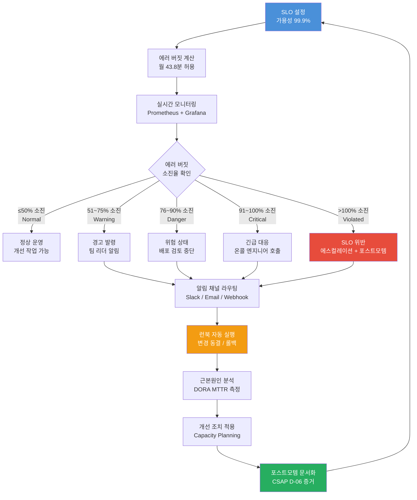
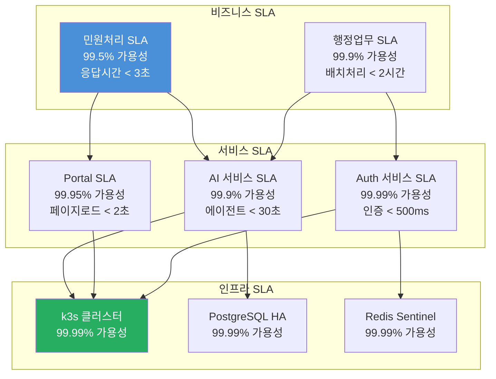
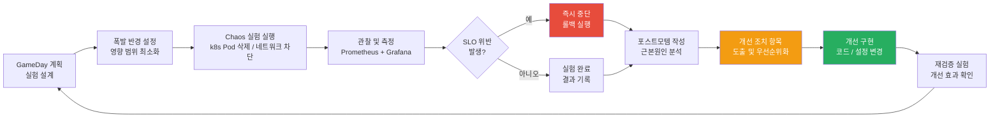
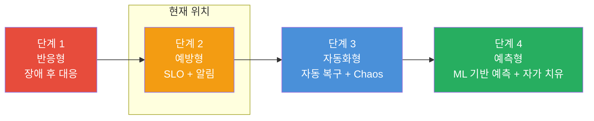
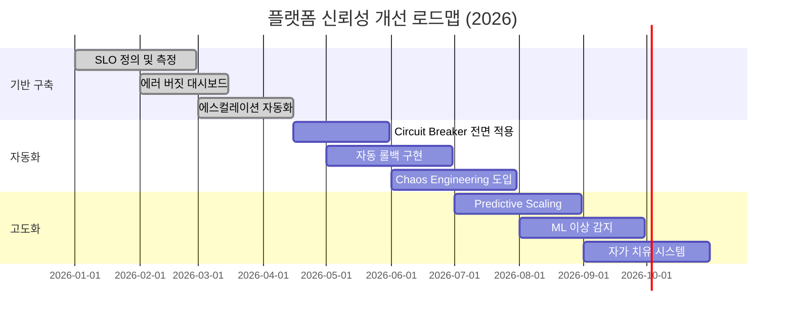

# 플랫폼 신뢰성 완전 가이드

> **대상**: SRE, DevOps, 플랫폼 엔지니어
> **수준**: 중급 이상 (k8s 운영 경험 필요)
> **관련 파일**:
> - `packages/slo-escalation/src/escalation-controller.ts`
> - `packages/dora-exporter/src/index.ts`
> **CSAP**: D-04 가용성관리, D-06 침해사고관리, D-07 연속성관리

---

## 목차

1. [플랫폼 신뢰성 개요 — SRE 원칙 적용](#1-플랫폼-신뢰성-개요--sre-원칙-적용)
2. [escalation-controller.ts 실제 코드 완전 분석](#2-escalation-controllerts-실제-코드-완전-분석)
3. [dora-exporter 실제 코드 분석](#3-dora-exporter-실제-코드-분석)
4. [SLA 계층 구조 — 인프라·서비스·비즈니스 SLA](#4-sla-계층-구조--인프라서비스비즈니스-sla)
5. [신뢰성 예산 (Error Budget) 운영](#5-신뢰성-예산-error-budget-운영)
6. [장애 내성 패턴 — Circuit Breaker, Bulkhead, Retry, Timeout](#6-장애-내성-패턴--circuit-breaker-bulkhead-retry-timeout)
7. [용량 계획 — VPA 권장값 기반 리소스 설정](#7-용량-계획--vpa-권장값-기반-리소스-설정)
8. [Chaos Engineering 결과를 신뢰성 개선으로 연결](#8-chaos-engineering-결과를-신뢰성-개선으로-연결)
9. [플랫폼 신뢰성 메트릭 대시보드](#9-플랫폼-신뢰성-메트릭-대시보드)
10. [CSAP D-04 가용성 요건 충족 증거 수집](#10-csap-d-04-가용성-요건-충족-증거-수집)
11. [신뢰성 개선 로드맵](#11-신뢰성-개선-로드맵)

---

## 1. 플랫폼 신뢰성 개요 — SRE 원칙 적용

### 1.1 신뢰성 생태계 전체 다이어그램



### 1.2 공공기관 SaaS 신뢰성 목표

공공기관 SaaS는 민간 SaaS와 달리 다음 요건이 추가됩니다.

| 구분 | 민간 SaaS | 공공기관 SaaS | 근거 |
|------|---------|-------------|------|
| 가용성 | 99.9% (월 43분) | 99.9~99.95% (월 22~43분) | CSAP D-04 |
| 데이터 보존 | 서비스 정책 | 법정 보존 기간 | 공공기록물법 |
| 재해복구 RTO | 4시간 | 2시간 이내 | 행안부 지침 |
| 재해복구 RPO | 1시간 | 30분 이내 | CSAP D-07 |
| 감사 추적 | 선택 | 의무 | CSAP D-06 |

### 1.3 신뢰성 4대 황금 신호

SRE(Site Reliability Engineering)에서는 서비스 상태를 4가지 신호로 측정합니다.

```
1. 지연시간 (Latency)
   - p50 < 200ms, p95 < 500ms, p99 < 2000ms
   - AI 에이전트 예외: p95 < 30,000ms (LLM 처리 시간 포함)

2. 트래픽 (Traffic)
   - 요청/초 (RPS)
   - AI 토큰 소비량/분
   - 테넌트별 사용량

3. 에러 (Errors)
   - HTTP 5xx 비율 < 0.1%
   - LLM 호출 실패율 < 1%
   - 타임아웃 비율 < 0.5%

4. 포화도 (Saturation)
   - CPU 사용률 < 70%
   - 메모리 사용률 < 80%
   - DB 연결 풀 사용률 < 60%
```

---

## 2. escalation-controller.ts 실제 코드 완전 분석

`packages/slo-escalation/src/escalation-controller.ts`는 SLO 위반 상황에서 자동으로 알림을 발송하고 런북을 실행하는 핵심 컴포넌트입니다.

### 2.1 EscalationLevel 5단계 설계

```typescript
// escalation-controller.ts 10~16줄
export enum EscalationLevel {
  Normal   = 'normal',    // 에러 버짓 소진율 ≤ 50%
  Warning  = 'warning',   // 51~75%
  Danger   = 'danger',    // 76~90%
  Critical = 'critical',  // 91~100%
  Violated = 'violated',  // > 100% (SLO 위반)
}
```

**왜 5단계인가?**

Google SRE 책에서는 에러 버짓을 "빠른 소진"과 "느린 소진" 두 가지 신호로 감지합니다. 이 구현은 그 개념을 5단계로 세분화하였습니다.

각 단계의 현실적 의미:
- **Normal (≤50%)**: 이번 달 절반 이하를 썼습니다. 개선 작업이나 새 기능 배포를 진행할 수 있습니다.
- **Warning (51~75%)**: 추가 장애가 없어야 이번 달 SLO를 지킬 수 있습니다. 신중한 운영이 필요합니다.
- **Danger (76~90%)**: 작은 장애 하나로도 SLO를 위반할 수 있습니다. 새 배포 검토가 필요합니다.
- **Critical (91~100%)**: 거의 한계에 도달했습니다. 온콜 엔지니어 대기가 필요합니다.
- **Violated (>100%)**: SLO를 이미 위반했습니다. 포스트모템 의무, 경영진 보고가 필요합니다.

### 2.2 determineEscalationLevel 함수

```typescript
// escalation-controller.ts 62~68줄
export function determineEscalationLevel(budgetBurnRate: number): EscalationLevel {
  if (budgetBurnRate <= 50)  return EscalationLevel.Normal;
  if (budgetBurnRate <= 75)  return EscalationLevel.Warning;
  if (budgetBurnRate <= 90)  return EscalationLevel.Danger;
  if (budgetBurnRate <= 100) return EscalationLevel.Critical;
  return EscalationLevel.Violated;
}
```

이 함수는 순수 함수(pure function)입니다. 외부 상태에 의존하지 않아 테스트가 매우 간단합니다.

```typescript
// 테스트 예시
describe('determineEscalationLevel', () => {
  test.each([
    [0,    EscalationLevel.Normal],
    [50,   EscalationLevel.Normal],
    [51,   EscalationLevel.Warning],
    [75,   EscalationLevel.Warning],
    [76,   EscalationLevel.Danger],
    [90,   EscalationLevel.Danger],
    [91,   EscalationLevel.Critical],
    [100,  EscalationLevel.Critical],
    [101,  EscalationLevel.Violated],
    [200,  EscalationLevel.Violated],
  ])('소진율 %d%%는 %s', (rate, expected) => {
    expect(determineEscalationLevel(rate)).toBe(expected);
  });
});
```

### 2.3 EscalationPolicy 스키마 설계

```typescript
// escalation-controller.ts 25~44줄
const EscalationPolicySchema = z.object({
  name:    z.string(),
  service: z.string(),
  levels:  z.array(z.object({
    level: z.nativeEnum(EscalationLevel),
    budgetBurnRateMin: z.number().min(0).max(200),
    budgetBurnRateMax: z.number().min(0).max(200),
    contacts: z.array(z.object({
      name:    z.string(),
      channel: z.nativeEnum(NotificationChannel),
      target:  z.string(),
    })),
    waitMinutes: z.number().min(0),
    actions: z.array(z.string()).optional(),
  })),
});
```

**실제 정책 등록 예시:**

```typescript
const aiServicePolicy: EscalationPolicy = {
  name: 'AI 서비스 SLO 에스컬레이션',
  service: 'ai-service',
  levels: [
    {
      level: EscalationLevel.Warning,
      budgetBurnRateMin: 51,
      budgetBurnRateMax: 75,
      contacts: [
        { name: '팀 리더', channel: NotificationChannel.Slack, target: '#sre-alerts' },
      ],
      waitMinutes: 30,
      actions: ['notify-team-lead'],
    },
    {
      level: EscalationLevel.Critical,
      budgetBurnRateMin: 91,
      budgetBurnRateMax: 100,
      contacts: [
        { name: '온콜 엔지니어', channel: NotificationChannel.Slack, target: '#incident' },
        { name: '개발팀 리더', channel: NotificationChannel.Email, target: 'lead@agency.go.kr' },
      ],
      waitMinutes: 0,  // 즉시 알림
      actions: ['freeze-deployments', 'create-incident'],
    },
    {
      level: EscalationLevel.Violated,
      budgetBurnRateMin: 101,
      budgetBurnRateMax: 200,
      contacts: [
        { name: '임원진', channel: NotificationChannel.Email, target: 'cto@agency.go.kr' },
      ],
      waitMinutes: 0,
      actions: ['freeze-deployments', 'create-postmortem', 'page-management'],
    },
  ],
};

controller.registerPolicy(aiServicePolicy);
```

### 2.4 escalate() 메서드 흐름 분석

```typescript
// escalation-controller.ts 89~152줄
async escalate(
  service: string,
  sloName: string,
  budgetBurnRate: number,
  budgetRemaining: number,
): Promise<EscalationEvent> {
  // 1단계: 현재 소진율로 레벨 결정
  const level = determineEscalationLevel(budgetBurnRate);
  const policy = this.policies.get(service);

  const event: EscalationEvent = { ... };

  if (!policy) {
    // 정책 없으면 경고만 기록하고 반환 (에러 아님)
    process.stderr.write(JSON.stringify({ level: 'warn', ... }) + '\n');
    this.recordEvent(event);
    return event;
  }

  const levelPolicy = policy.levels.find(l => l.level === level);
  if (!levelPolicy) {
    this.recordEvent(event);
    return event;  // 해당 레벨 정책 없으면 조용히 통과
  }

  // 2단계: 알림 발송
  for (const contact of levelPolicy.contacts) {
    await this.notify(contact.channel, contact.target, { ... });
    event.notifiedContacts.push(contact.name);
  }

  // 3단계: 자동 런북 실행
  if (levelPolicy.actions) {
    for (const action of levelPolicy.actions) {
      await this.triggerAction(action, service, level);
      event.actionsTriggered.push(action);
    }
  }

  this.recordEvent(event);
  return event;
}
```

**정책 없을 때 에러를 던지지 않는 이유:**

에스컬레이션 컨트롤러는 알림 인프라이므로, 정책 미설정이 서비스를 중단시키면 안 됩니다. 대신 경고 로그를 남기고 정상 반환합니다. 이 결정은 **fail-open** 방식으로, 알림 시스템 자체의 가용성을 우선합니다.

### 2.5 이력 관리 및 메모리 효율

```typescript
// escalation-controller.ts 73~76줄, 206~210줄
private history: EscalationEvent[] = [];
private readonly maxHistory = 5000;

private recordEvent(event: EscalationEvent): void {
  this.history.push(event);
  if (this.history.length > this.maxHistory) {
    this.history = this.history.slice(-this.maxHistory);  // 최신 5000개 유지
  }
}
```

`maxHistory = 5000`은 각 이벤트가 약 500바이트라고 가정하면 약 2.5MB입니다. 메모리 내 이력이 무한정 증가하는 것을 방지합니다.

장기 이력이 필요하면 `recordEvent` 내에서 데이터베이스에 비동기 기록을 추가할 수 있습니다.

### 2.6 Prometheus와 통합하는 방법

```typescript
// SLO 모니터링 루프 (실제 구현 예시)
import { Gauge } from 'prom-client';
const errorBudgetGauge = new Gauge({
  name: 'slo_error_budget_remaining_percent',
  help: '에러 버짓 잔여율 (%)',
  labelNames: ['service', 'slo_name'],
});

// Prometheus 스크래핑 시마다 에스컬레이션 체크
async function checkAndEscalate(service: string, sloName: string) {
  const currentAvailability = await calculateAvailability(service, '30d');
  const targetAvailability  = 0.999; // 99.9%

  // 에러 버짓 소진율 계산
  const allowedErrors  = 1 - targetAvailability;     // 0.001
  const actualErrors   = 1 - currentAvailability;    // 실제 에러 비율
  const burnRate       = (actualErrors / allowedErrors) * 100;
  const budgetRemaining = Math.max(0, 100 - burnRate);

  errorBudgetGauge.labels(service, sloName).set(budgetRemaining);

  await controller.escalate(service, sloName, burnRate, budgetRemaining);
}

// 5분마다 체크
setInterval(() => checkAndEscalate('ai-service', 'availability-slo'), 5 * 60 * 1000);
```

---

## 3. dora-exporter 실제 코드 분석

`packages/dora-exporter/src/index.ts`는 Gitea와 AlertManager의 웹훅을 수신하여 DORA 4대 지표를 Prometheus 메트릭으로 노출합니다.

### 3.1 DORA 4대 지표 개요

```
DORA 4대 지표 (DevOps Research and Assessment)

1. 배포 빈도 (Deployment Frequency)
   - Elite: 요구에 따라 (하루 여러 번)
   - High:  하루 1회 ~ 주 1회
   - Medium: 주 1회 ~ 월 1회
   - Low:   월 1회 미만

2. 변경 리드타임 (Lead Time for Changes)
   - Elite: 1시간 미만
   - High:  하루 미만
   - Medium: 1주일 ~ 1달
   - Low:   1달 초과

3. 변경 실패율 (Change Failure Rate)
   - Elite: 0~15%
   - High:  16~30%
   - Medium/Low: 31~60%

4. 서비스 복구 시간 MTTR (Mean Time to Recovery)
   - Elite: 1시간 미만
   - High:  하루 미만
   - Medium: 1일 ~ 1주일
   - Low:   1주일 초과
```

### 3.2 Prometheus 메트릭 정의 분석

```typescript
// dora-exporter/src/index.ts 26~65줄

// FR-DORA.1: 배포 빈도 — Counter
const deploymentTotal = new Counter({
  name: 'dora_deployment_total',
  help: '배포 횟수 (DORA Deployment Frequency)',
  labelNames: ['team', 'service', 'environment'],
  registers: [register],
});
```

**Counter vs Gauge vs Histogram 선택 이유:**

| 지표 | 메트릭 타입 | 이유 |
|------|-----------|------|
| 배포 횟수 | Counter | 단조 증가, 재설정 없음 |
| 변경 리드타임 | Histogram | 분포 확인 필요 (p50/p95) |
| 변경 실패율 | Gauge | 비율이 올라갈 수도 내려갈 수도 |
| MTTR | Histogram | 분포 확인 필요 (p50/p95) |
| DORA 등급 | Gauge | 현재 등급 상태값 |

Histogram의 버킷 설계가 중요합니다:

```typescript
// dora-exporter/src/index.ts 34~40줄
buckets: [60, 300, 900, 1800, 3600, 7200, 14400, 28800, 86400, 604800]
//        1분  5분  15분  30분  1시간  2시간  4시간  8시간  1일   1주일
```

이 버킷은 DORA 등급 경계값(1시간, 1일, 1주일)을 커버합니다. Prometheus의 `histogram_quantile` 함수로 중앙값과 백분위수를 계산할 수 있습니다.

### 3.3 Gitea Webhook 처리 분석

```typescript
// dora-exporter/src/index.ts 121~161줄
app.post('/webhook/gitea', async (req, res) => {
  const payload = giteaWebhookSchema.parse(req.body);  // Zod 검증
  const repoName   = payload.repository.full_name;
  const team       = extractTeam(repoName);             // 'org/service' → 'org'
  const service    = extractService(repoName);          // 'org/service' → 'service'
  const environment = extractEnvironment(payload.ref);  // 브랜치 → 환경 매핑

  if (isDeploymentEvent(payload.ref)) {
    // FR-DORA.1: 배포 카운터 증가
    deploymentTotal.inc({ team, service, environment });

    // FR-DORA.2: 리드타임 계산
    const firstCommitTime = getFirstCommitTimestamp(payload.commits);
    if (firstCommitTime) {
      const deployTime = Date.now();
      const leadTime = leadTimeCalculator.calculate(firstCommitTime, deployTime);
      leadTimeSeconds.observe({ team, service }, leadTime);
    }

    // FR-DORA.3: 변경 실패율 업데이트
    const isFailure = changeFailureDetector.detect(payload.commits);
    if (isFailure) {
      changeFailureDetector.recordFailure(team, service);
    } else {
      changeFailureDetector.recordSuccess(team, service);
    }
    const rate = changeFailureDetector.getRate(team, service);
    changeFailureRate.set({ team, service }, rate);
  }
});
```

**리드타임 계산 방법:**

```
리드타임 = 배포 시각 - 첫 번째 커밋 시각

예시:
- 첫 커밋: 2026-04-13 09:00
- 배포:    2026-04-13 14:30
- 리드타임: 5시간 30분 = 19,800초 → DORA 'High' 등급
```

실제로는 이슈 생성 시점부터 측정해야 더 정확하지만, 구현 복잡도를 고려하여 첫 커밋 기준으로 측정합니다.

### 3.4 AlertManager Webhook으로 MTTR 측정

```typescript
// dora-exporter/src/index.ts 167~199줄
app.post('/webhook/alertmanager', async (req, res) => {
  const payload = alertManagerSchema.parse(req.body);

  for (const alert of payload.alerts) {
    const service  = alert.labels.service || 'unknown';
    const team     = alert.labels.team || 'unknown';
    const severity = alert.labels.severity || 'warning';

    if (alert.status === 'firing') {
      // 장애 시작 시각 기록
      mttrTracker.recordIncidentStart(service, team, alert.startsAt);

    } else if (alert.status === 'resolved') {
      // 복구 시각 기록 + MTTR 계산
      const recoveryTime = mttrTracker.recordIncidentEnd(
        service, team, alert.endsAt || new Date().toISOString()
      );
      if (recoveryTime !== null) {
        mttrSeconds.observe({ team, service, severity }, recoveryTime);
      }
    }
  }
});
```

**MTTR 계산 흐름:**

```
AlertManager: 장애 firing 이벤트
  ↓ POST /webhook/alertmanager
  ↓ mttrTracker.recordIncidentStart(service, team, startsAt)
  ↓ 내부 Map: incidentMap.set('service:team', startTime)

(장애 처리 중...)

AlertManager: 장애 resolved 이벤트
  ↓ POST /webhook/alertmanager
  ↓ mttrTracker.recordIncidentEnd(service, team, endsAt)
  ↓ MTTR = endsAt - startTime (초)
  ↓ mttrSeconds.observe({ team, service, severity }, mttr)
```

### 3.5 이벤트 큐 아키텍처

```typescript
// dora-exporter/src/index.ts 104~115줄
const eventQueue = new EventQueue({ maxQueueSize: 10000, maxRetries: 3 });

eventQueue.setHandler(async (event) => {
  const { team, service, environment, type } = event;
  if (type === DORAEventType.Deployment) {
    deploymentTotal.inc({ team, service, environment });
  } else if (type === DORAEventType.DeploymentFailure || ...) {
    changeFailureDetector.recordFailure(team, service);
    changeFailureRate.set({ team, service }, changeFailureDetector.getRate(team, service));
  }
});
```

Webhook이 burst로 들어올 때 직접 처리하면 성능 문제가 생깁니다. 이벤트 큐를 통해:
1. Webhook 응답 즉시 반환 (클라이언트 타임아웃 방지)
2. 배치 처리로 메트릭 업데이트 효율화
3. 실패 시 `maxRetries: 3`으로 재시도

### 3.6 DORA 등급 분류 로직

```typescript
// dora-exporter/src/index.ts 205~226줄
app.post('/classify', async (_req, res) => {
  const teams = changeFailureDetector.getTeams();

  for (const team of teams) {
    const level = classifier.classify({
      deploymentFrequency: await getDeploymentRate(team),   // 일평균 배포 횟수
      leadTimeSeconds:     await getMedianLeadTime(team),   // 중앙값 리드타임
      changeFailureRate:   changeFailureDetector.getTeamRate(team),
      mttrSeconds:         mttrTracker.getMedianMTTR(team),
    });
    teamLevel.set({ team }, level);  // 0=Low, 1=Medium, 2=High, 3=Elite
  }
});
```

---

## 4. SLA 계층 구조 — 인프라·서비스·비즈니스 SLA

### 4.1 3계층 SLA 구조



### 4.2 SLA 계층별 책임 매핑

| SLA 계층 | 책임자 | 모니터링 도구 | CSAP 항목 |
|---------|--------|------------|----------|
| 비즈니스 SLA | 서비스 관리자 | 대시보드 | D-04 |
| 서비스 SLA | 개발팀 | Prometheus + Alerting | D-04, D-06 |
| 인프라 SLA | 인프라팀 | k8s 이벤트, node_exporter | D-04, D-07 |

### 4.3 SLO 설정 워크시트

새로운 서비스의 SLO를 설정할 때 다음 워크시트를 활용합니다.

```
서비스명: _________________
대상 사용자: _________________

1. 가용성 SLO
   목표: [ ] 99.5%  [ ] 99.9%  [ ] 99.95%  [ ] 99.99%
   에러 버짓 (월간): _____ 분/시간
   측정 방법: [ ] 업타임 모니터링  [ ] 합성 모니터링  [ ] 실사용자 모니터링

2. 지연시간 SLO
   p50 목표: _____ ms
   p95 목표: _____ ms
   p99 목표: _____ ms
   측정 방법: Prometheus histogram_quantile

3. 에러율 SLO
   목표: HTTP 5xx < _____ %
   측정 방법: sum(rate(http_errors[5m])) / sum(rate(http_requests[5m]))

4. SLO 위반 시 액션
   Warning: _________________
   Critical: _________________
   Violated: _________________
```

---

## 5. 신뢰성 예산 (Error Budget) 운영

### 5.1 에러 버짓 계산

```
월간 에러 버짓 = (1 - SLO 목표) × 월 총 분

예시: 가용성 99.9% SLO
  월 총 분 = 30일 × 24시간 × 60분 = 43,200분
  허용 다운타임 = (1 - 0.999) × 43,200 = 43.2분
```

| SLO 수준 | 월 허용 다운타임 | 주 허용 다운타임 | 일 허용 다운타임 |
|---------|--------------|--------------|--------------|
| 99.0% | 7시간 12분 | 1시간 41분 | 14분 24초 |
| 99.5% | 3시간 36분 | 50분 24초 | 7분 12초 |
| 99.9% | 43분 12초 | 10분 5초 | 1분 26초 |
| 99.95% | 21분 36초 | 5분 2초 | 43초 |
| 99.99% | 4분 19초 | 1분 | 8.6초 |

### 5.2 에러 버짓 소진 속도 계산

```
1시간 소진율 기반 경보 (SRE 권장):

빠른 소진 경보: 1시간 동안 2%시간 버짓 소진
  → SLO 목표 달성을 위한 연간 예산의 2%를 1시간에 소진
  → 조건: sum(rate(errors[1h])) / sum(rate(requests[1h])) > 14 * burn_rate_threshold

느린 소진 경보: 6시간 동안 5% 버짓 소진
  → 조건: sum(rate(errors[6h])) / sum(rate(requests[6h])) > 6 * burn_rate_threshold
```

### 5.3 에러 버짓 정책 — 소진 시 행동 지침

```
에러 버짓 소진율 | 허용 행동              | 금지 행동
0~50%          | 새 기능 개발 및 배포    | 없음
51~75%         | 버그 수정 배포만        | 대규모 기능 배포
76~90%         | 긴급 수정만            | 모든 배포 자제
91~100%        | 배포 동결              | 모든 변경 금지
>100%          | 배포 동결 + 포스트모템 | 예외 없음
```

### 5.4 에러 버짓 갱신 주기

```typescript
// 에러 버짓 계산 쿼리 (PromQL)
const errorBudgetQuery = `
  # 가용성 SLO 에러 버짓 잔여율
  (
    1 - (
      sum(increase(http_requests_total{job="ai-service",status=~"5.."}[30d]))
      /
      sum(increase(http_requests_total{job="ai-service"}[30d]))
    )
    / (1 - 0.999)  # SLO 목표
  ) * 100
`;
```

---

## 6. 장애 내성 패턴 — Circuit Breaker, Bulkhead, Retry, Timeout

### 6.1 Circuit Breaker 패턴

```typescript
// Circuit Breaker 구현 예시
import { CircuitBreaker } from '@public-saas/circuit-breaker';

const llmCircuitBreaker = new CircuitBreaker({
  name: 'llm-provider',
  failureThreshold: 5,       // 5번 실패 시 Open
  successThreshold: 2,       // 2번 성공 시 Half-Open → Closed
  timeout: 30000,            // Open 상태 유지 시간 (30초)
  volumeThreshold: 10,       // 최소 10회 호출 후 통계 수집
});

// AI 서비스에서 활용
async function callLLMWithBreaker(messages: Message[]): Promise<LLMResponse> {
  return llmCircuitBreaker.execute(async () => {
    return await llmProvider.chat(messages, { maxTokens: 2048 });
  });
}
```

**Circuit Breaker 3가지 상태:**

```
Closed (정상)
  ↓ 실패 5번 연속
Open (차단)
  ↓ 30초 후
Half-Open (탐색)
  ↓ 성공 2번
Closed (복구)
```

### 6.2 Bulkhead 패턴 — 격리와 자원 분리

```typescript
// 테넌트별 요청 큐 격리 (Bulkhead)
const tenantQueues = new Map<string, PQueue>();

function getTenantQueue(tenantId: string): PQueue {
  if (!tenantQueues.has(tenantId)) {
    tenantQueues.set(tenantId, new PQueue({
      concurrency: 3,    // 테넌트당 최대 3개 동시 AI 요청
      interval: 1000,
      intervalCap: 5,    // 초당 최대 5개
    }));
  }
  return tenantQueues.get(tenantId)!;
}

// 특정 테넌트의 폭주가 다른 테넌트에 영향을 주지 않음
async function processAIRequest(tenantId: string, query: string) {
  const queue = getTenantQueue(tenantId);
  return queue.add(() => runAgent(query, ...));
}
```

### 6.3 Retry 패턴 — 지수 백오프

```typescript
// 지수 백오프 재시도
async function retryWithBackoff<T>(
  fn: () => Promise<T>,
  maxRetries = 3,
  baseDelayMs = 1000,
): Promise<T> {
  let lastError: Error;

  for (let attempt = 0; attempt <= maxRetries; attempt++) {
    try {
      return await fn();
    } catch (error) {
      lastError = error as Error;

      // 마지막 시도면 재시도 없음
      if (attempt === maxRetries) break;

      // 재시도 불가능한 에러 (클라이언트 에러)
      if ((error as any).statusCode >= 400 && (error as any).statusCode < 500) {
        throw error;
      }

      // 지수 백오프 + 지터 (thundering herd 방지)
      const delay = baseDelayMs * Math.pow(2, attempt)
                  + Math.random() * 1000;
      await new Promise(r => setTimeout(r, delay));
    }
  }

  throw lastError!;
}

// LLM 호출에 적용
const response = await retryWithBackoff(
  () => llmProvider.chat(messages, options),
  3,    // 최대 3회 재시도
  500,  // 초기 대기 500ms → 1000ms → 2000ms
);
```

### 6.4 Timeout 패턴 — 리소스 고갈 방지

```typescript
// Promise.race로 타임아웃 구현
function withTimeout<T>(
  promise: Promise<T>,
  timeoutMs: number,
  operationName: string,
): Promise<T> {
  const timeout = new Promise<never>((_, reject) =>
    setTimeout(
      () => reject(new Error(`${operationName} 타임아웃 (${timeoutMs}ms)`)),
      timeoutMs,
    )
  );
  return Promise.race([promise, timeout]);
}

// AI 에이전트 실행 타임아웃 (최대 120초)
const result = await withTimeout(
  runAgent(query, tools, executors, { maxIterations: 10 }),
  120_000,
  'AI 에이전트',
);
```

### 6.5 4가지 패턴 조합 전략

```
요청 수신
  ↓
Bulkhead: 테넌트별 큐 격리
  ↓
Circuit Breaker: LLM 제공자 상태 확인
  ↓ (Open 상태)
Fallback: 대체 모델 또는 에러 응답
  ↓ (Closed/Half-Open)
Timeout: 최대 실행 시간 제한
  ↓ (타임아웃)
Retry: 지수 백오프로 재시도
  ↓
성공 응답 반환
```

---

## 7. 용량 계획 — VPA 권장값 기반 리소스 설정

### 7.1 VPA(Vertical Pod Autoscaler) 권장값 해석

```yaml
# VPA 리소스 권장 예시
apiVersion: autoscaling.k8s.io/v1
kind: VerticalPodAutoscaler
metadata:
  name: ai-service-vpa
spec:
  targetRef:
    apiVersion: apps/v1
    kind: Deployment
    name: ai-service
---
# VPA가 제안하는 권장값 (status 섹션)
status:
  recommendation:
    containerRecommendations:
    - containerName: ai-service
      lowerBound:           # 안전 최소값
        cpu: "100m"
        memory: "256Mi"
      target:               # 권장 설정값
        cpu: "500m"
        memory: "768Mi"
      upperBound:           # 최대 허용값
        cpu: "2000m"
        memory: "2Gi"
      uncappedTarget:       # 제한 없는 권장값
        cpu: "450m"
        memory: "700Mi"
```

**VPA 권장값 적용 방법:**

```
권장값 해석:
- lowerBound: 이 이하로 설정하면 OOM(메모리 부족) 위험
- target: 현재 사용 패턴 기반 최적값
- upperBound: 이 이상은 과할당 (비용 낭비)

requests 설정 = target 값 (VPA 권장)
limits 설정   = upperBound 값 × 1.2 (안전 마진)
```

### 7.2 AI 서비스 리소스 요구사항 특성

AI 서비스는 일반 웹 서비스와 다른 리소스 패턴을 가집니다.

```
일반 API 서비스:
  CPU: 지속적으로 낮음 (요청당 10~50ms)
  메모리: 안정적 (수백 MB)
  특이사항: 없음

AI 에이전트 서비스:
  CPU: 평소 낮음, LLM 처리 시 급등 (스파이크 패턴)
  메모리: 세션 메모리, 프롬프트 버퍼로 높음 (1~2GB)
  특이사항:
  - 단일 요청이 수십 초 걸릴 수 있음
  - LLM 응답 대기 중에는 CPU 거의 0%
  - 다수 동시 에이전트 실행 시 메모리 급증
```

### 7.3 HPA 설정 권장사항

```yaml
# ai-service HPA 설정
apiVersion: autoscaling/v2
kind: HorizontalPodAutoscaler
metadata:
  name: ai-service-hpa
spec:
  scaleTargetRef:
    apiVersion: apps/v1
    kind: Deployment
    name: ai-service
  minReplicas: 2
  maxReplicas: 10
  metrics:
  - type: Resource
    resource:
      name: cpu
      target:
        type: Utilization
        averageUtilization: 60  # AI 서비스는 낮게 설정 (스파이크 대비)
  - type: Resource
    resource:
      name: memory
      target:
        type: Utilization
        averageUtilization: 70
  # Custom Metric: 에이전트 큐 크기 기반 스케일링
  - type: Pods
    pods:
      metric:
        name: agent_queue_size
      target:
        type: AverageValue
        averageValue: "5"  # Pod당 5개 초과 시 스케일 아웃
  behavior:
    scaleUp:
      stabilizationWindowSeconds: 60   # 빠른 스케일 업
    scaleDown:
      stabilizationWindowSeconds: 300  # 느린 스케일 다운 (비용 최적화)
```

### 7.4 Predictive Scaling — 사전 예측 스케일링

공공기관에는 예측 가능한 트래픽 패턴이 있습니다.

```
공공기관 트래픽 패턴:
- 출근 시간 (09:00~10:00): 급격한 증가
- 점심 시간 (12:00~13:00): 30% 감소
- 마감 시간 (17:00~18:00): 두 번째 피크
- 야간 (19:00~08:00): 10% 수준
- 주말 공휴일: 5% 수준

사전 스케일링 전략:
- 08:45에 예열 (warm-up): minReplicas를 4→8로 증가
- 18:30에 복원: minReplicas를 8→4로 감소
```

```yaml
# CronJob으로 예측 스케일링 (간단한 방법)
# 더 정교한 방법: KEDA (Kubernetes Event-driven Autoscaling)
apiVersion: batch/v1
kind: CronJob
metadata:
  name: pre-scale-morning
spec:
  schedule: "45 8 * * 1-5"  # 평일 08:45
  jobTemplate:
    spec:
      template:
        spec:
          containers:
          - name: kubectl
            image: bitnami/kubectl
            command:
            - kubectl
            - patch
            - hpa
            - ai-service-hpa
            - --patch
            - '{"spec":{"minReplicas":8}}'
```

---

## 8. Chaos Engineering 결과를 신뢰성 개선으로 연결

### 8.1 Chaos Engineering GameDay 결과 처리 흐름



### 8.2 표준 Chaos 실험 목록

```
1. Pod 실패 실험
   실험: ai-service Pod 무작위 종료 (1/3 확률)
   예상: 다른 Pod로 트래픽 이동, SLO 유지
   측정: 503 에러 발생 수, 복구 시간
   기대 결과: < 5초 내 복구

2. 네트워크 지연 주입
   실험: ai-service → database 네트워크에 500ms 지연 추가
   예상: 응답 시간 증가하지만 타임아웃 없음
   측정: p99 응답 시간, 에러율
   기대 결과: 에러율 < 0.1% 유지

3. LLM 제공자 장애 시뮬레이션
   실험: LLM 서버 DNS 차단 (5분)
   예상: Circuit Breaker가 열리고 폴백 응답 제공
   측정: Circuit Breaker 상태, 에러 응답 내용
   기대 결과: 적절한 에러 메시지, 자동 복구

4. 메모리 압박 실험
   실험: ai-service 컨테이너에 메모리 부하 주입
   예상: OOM Killer 트리거 전 HPA 스케일 아웃
   측정: 메모리 사용률, Pod 재시작 수
   기대 결과: 재시작 없이 스케일 아웃으로 해소

5. DB 연결 고갈 실험
   실험: 연결 풀의 90% 강제 점유
   예상: 큐에서 대기 후 처리, 타임아웃 에러 최소화
   측정: 연결 풀 사용률, DB 에러율
   기대 결과: 에러율 < 1%, p99 < 5초
```

### 8.3 실험 결과를 시스템 개선으로 연결하는 방법

```
실험 결과: Pod 종료 시 30초간 에러율 20%
  ↓
근본원인: graceful shutdown이 없어서 진행 중 요청이 끊김
  ↓
개선 조치: GracefulShutdown 클래스 통합 (mesh-ready 패키지 사용)
  ↓
재검증: 동일 실험 재실행 → 에러율 0.5%로 감소
  ↓
문서화: CSAP D-07 연속성관리 증거 자료로 활용
```

---

## 9. 플랫폼 신뢰성 메트릭 대시보드

### 9.1 Grafana 대시보드 패널 구성

```
신뢰성 대시보드 레이아웃

┌────────────────────────────────────────────────────┐
│ 에러 버짓 현황                                       │
│ ┌──────────┐ ┌──────────┐ ┌──────────┐ ┌──────────┐│
│ │ai-service│ │portal    │ │auth-svc  │ │compliance││
│ │  72.3%   │ │  95.1%   │ │  99.2%   │ │  88.4%   ││
│ │  Warning │ │  Normal  │ │  Normal  │ │  Danger  ││
│ └──────────┘ └──────────┘ └──────────┘ └──────────┘│
├────────────────────────────────────────────────────┤
│ DORA 4대 지표                                        │
│ ┌──────────────────┐ ┌───────────────────────────┐│
│ │ 배포 빈도         │ │ 변경 리드타임               ││
│ │ 2.3회/일 (High)  │ │ 4.2시간 중앙값 (High)      ││
│ └──────────────────┘ └───────────────────────────┘│
│ ┌──────────────────┐ ┌───────────────────────────┐│
│ │ 변경 실패율       │ │ MTTR                       ││
│ │ 8.2% (Elite)    │ │ 22분 중앙값 (Elite)         ││
│ └──────────────────┘ └───────────────────────────┘│
├────────────────────────────────────────────────────┤
│ 황금 신호 시계열                                      │
│ [지연시간 그래프 - 24시간]                            │
│ [에러율 그래프 - 24시간]                             │
│ [트래픽 그래프 - 24시간]                             │
│ [포화도 그래프 - 24시간]                             │
└────────────────────────────────────────────────────┘
```

### 9.2 핵심 Grafana 패널 쿼리

```promql
# 1. 에러 버짓 잔여율 (%)
(1 - (
  sum(increase(http_requests_total{job="ai-service",status=~"5.."}[30d]))
  / sum(increase(http_requests_total{job="ai-service"}[30d]))
) / (1 - 0.999)) * 100

# 2. 가용성 (지난 30일)
sum(rate(http_requests_total{job="ai-service",status!~"5.."}[30d]))
/ sum(rate(http_requests_total{job="ai-service"}[30d])) * 100

# 3. p99 응답 시간
histogram_quantile(0.99,
  sum(rate(http_request_duration_ms_bucket{job="ai-service"}[5m])) by (le)
)

# 4. 에이전트 에러율
sum(rate(http_requests_total{job="ai-service",path="/ai/agent",status=~"5.."}[5m]))
/ sum(rate(http_requests_total{job="ai-service",path="/ai/agent"}[5m])) * 100

# 5. DORA 배포 빈도 (주간)
increase(dora_deployment_total{environment="production"}[7d]) / 7
```

### 9.3 알림 규칙 설정

```yaml
# Prometheus AlertManager 규칙
groups:
- name: slo-alerts
  interval: 1m
  rules:
  # 빠른 에러 버짓 소진 (1시간 내 2% 소진)
  - alert: ErrorBudgetFastBurn
    expr: |
      (
        sum(rate(http_requests_total{job="ai-service",status=~"5.."}[1h]))
        / sum(rate(http_requests_total{job="ai-service"}[1h]))
      ) > 14 * (1 - 0.999)
    for: 5m
    labels:
      severity: critical
    annotations:
      summary: "ai-service 에러 버짓 빠른 소진"
      description: "1시간 소진율이 정상의 14배 초과"

  # 느린 에러 버짓 소진 (6시간 내 5% 소진)
  - alert: ErrorBudgetSlowBurn
    expr: |
      (
        sum(rate(http_requests_total{job="ai-service",status=~"5.."}[6h]))
        / sum(rate(http_requests_total{job="ai-service"}[6h]))
      ) > 6 * (1 - 0.999)
    for: 30m
    labels:
      severity: warning
    annotations:
      summary: "ai-service 에러 버짓 느린 소진"
```

---

## 10. CSAP D-04 가용성 요건 충족 증거 수집

### 10.1 CSAP D-04 요건 매핑

| CSAP D-04 통제항목 | 증거 유형 | 수집 방법 |
|-----------------|---------|---------|
| D-04-01 가용성 목표 수립 | SLO 문서 | 설계 문서 |
| D-04-02 가용성 모니터링 | 모니터링 스크린샷 | Grafana 내보내기 |
| D-04-03 장애 복구 계획 | DR 절차서 | 문서 |
| D-04-04 가용성 측정 결과 | 월간 가용성 보고서 | DORA 지표 익스포터 |

### 10.2 월간 가용성 보고서 자동 생성

```typescript
// dora-exporter 주간 보고서를 CSAP 증거로 활용
const response = await fetch('/report/weekly?format=evidence');
const evidence = await response.json();

// 응답 형식
{
  "period": "2026-04-01 ~ 2026-04-30",
  "csapRefs": ["D-06", "D-12"],
  "availability": {
    "target": "99.9%",
    "actual": "99.94%",
    "totalDowntime": "25분 12초",
    "incidents": 3
  },
  "dora": {
    "deploymentFrequency": "2.3회/일 (High)",
    "leadTimeMedian": "4.2시간 (High)",
    "changeFailureRate": "8.2% (Elite)",
    "mttrMedian": "22분 (Elite)",
    "overallLevel": "High"
  },
  "evidenceId": "CSAP-D04-2026-04"
}
```

### 10.3 CSAP 감사 대비 체크리스트

```
CSAP D-04 가용성 관리 감사 준비

[ ] SLO 목표치 문서화 (최소 99.9% 가용성)
[ ] 월간 가용성 측정 기록 (최소 12개월)
[ ] 장애 이력 및 복구 시간 기록 (MTTR 증거)
[ ] DR 훈련 기록 (연 2회 이상)
[ ] Chaos Engineering 실험 결과 및 개선 조치
[ ] HPA/VPA 설정 증거 (자동 스케일링)
[ ] 모니터링 대시보드 스크린샷
[ ] 알림 규칙 설정 문서
[ ] 에스컬레이션 정책 문서
[ ] 포스트모템 기록 (CSAP D-06 연계)
```

---

## 11. 신뢰성 개선 로드맵

### 11.1 신뢰성 성숙도 단계



### 11.2 분기별 신뢰성 개선 계획



### 11.3 다음 단계 — Runbook 자동화

현재 에스컬레이션 컨트롤러의 `triggerAction`은 로그만 기록합니다. 실제 자동화를 위한 구현 방향:

```typescript
// 현재: 로그만 기록
private async triggerAction(action: string, service: string, level: EscalationLevel): Promise<void> {
  process.stdout.write(JSON.stringify({ action: 'trigger_action', runbookAction: action, ... }) + '\n');
}

// 개선: 실제 런북 실행
private async triggerAction(action: string, service: string, level: EscalationLevel): Promise<void> {
  switch (action) {
    case 'freeze-deployments':
      await this.gitea.createBranchProtection(service, { requireApprovals: 2 });
      break;
    case 'create-postmortem':
      await this.github.createIssue({
        title: `[포스트모템] ${service} SLO 위반 ${new Date().toISOString()}`,
        template: 'postmortem.md',
        labels: ['postmortem', 'slo-violation'],
      });
      break;
    case 'rollback-last-deployment':
      await this.argocd.rollback(service, { revision: 'previous' });
      break;
  }
}
```

---

*Design Ref: MTU-N178 §3, MTU-N169-dora-metrics.design.md §3*
*Plan SC: FR-SLO.1~FR-SLO.6, FR-DORA.1~FR-DORA.5*
*CSAP: D-04 가용성관리, D-06 침해사고관리, D-07 연속성관리*
