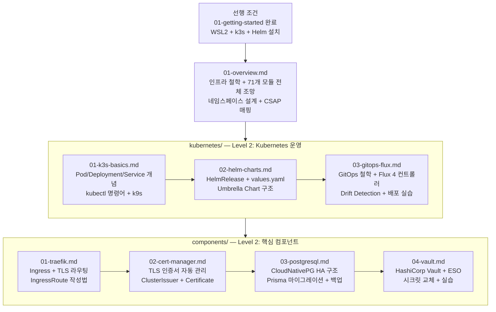

# 4장 인프라 심화 — 학습 가이드

> **버전**: 1.0.0 | **작성일**: 2026-04-11
> **대상**: 공공기관 SaaS 프레임워크 신규 DevOps 엔지니어 / 개발자
> **선행 조건**: `01-getting-started` 완료, WSL2 + k3s 설치 완료
> **CSAP**: D-11 (가상화 보안), D-12 (시스템 개발 보안)

---

## 이 섹션에서 배우는 것

`04-infrastructure.md`(인프라 개요)를 읽었다면, 이 심화 섹션은 각 컴포넌트를 실제로 다루는 방법을 단계별로 알려줍니다. 개념 이해를 넘어 **직접 실습**할 수 있도록 구성되어 있습니다.

---

## 학습 맵



---

## Level 1~3 구조 설명

| 레벨 | 위치 | 내용 | 대상 |
|------|------|------|------|
| **Level 1** | `04-infrastructure.md` | 인프라 개요, 설치, 전체 구조 | 모든 합류 구성원 |
| **Level 2** | `04-infrastructure/` 이 섹션 | 각 컴포넌트 심화 운영, 실습 | 개발자 + DevOps |
| **Level 3** | `docs/07-infra/*.md` | 운영 전문가용 심층 가이드 | 인프라 담당자 |

---

## 파일 목록 및 학습 순서

### 인프라 개요 (필수 — 먼저 읽기)

| 파일 | 내용 | 예상 학습 시간 |
|------|------|--------------|
| `01-overview.md` | 인프라 철학, 71개 모듈 분류, CSAP 매핑 | 30분 |

### Kubernetes 운영 (Level 2)

| 파일 | 내용 | 예상 학습 시간 |
|------|------|--------------|
| `kubernetes/01-k3s-basics.md` | k3s 기초, 핵심 리소스, kubectl/k9s | 60분 |
| `kubernetes/02-helm-charts.md` | Helm, Chart, values.yaml 커스터마이징 | 45분 |
| `kubernetes/03-gitops-flux.md` | GitOps, Flux 컨트롤러, Drift Detection | 60분 |

### 핵심 컴포넌트 (Level 2)

| 파일 | 내용 | 예상 학습 시간 |
|------|------|--------------|
| `components/01-traefik.md` | Ingress 라우팅, TLS, IngressRoute | 30분 |
| `components/02-cert-manager.md` | 인증서 자동 관리, ClusterIssuer | 30분 |
| `components/03-postgresql.md` | CloudNativePG HA, 마이그레이션, 백업 | 45분 |
| `components/04-vault.md` | 시크릿 관리, External Secrets Operator | 45분 |

---

## 선행 조건 확인

이 섹션을 시작하기 전에 아래를 확인하십시오.

```bash
# k3s 노드 정상 동작 확인
kubectl get nodes
# NAME           STATUS   ROLES           AGE   VERSION
# desktop-xxx    Ready    control-plane   Xd    v1.34.x+k3s1

# Flux 컨트롤러 정상 동작 확인
kubectl get pods -n flux-system
# 4개 컨트롤러가 Running 상태여야 합니다.

# Helm 설치 확인
helm version
# version.BuildInfo{Version:"v3.20.x", ...}
```

하나라도 오류가 있으면 `01-getting-started` 또는 `04-infrastructure.md` 2절로 돌아가십시오.

---

## Level 3 심화 자료 (운영 전문가용)

| 문서 | 내용 |
|------|------|
| `docs/07-infra/wsl-devops-complete-guide.md` | WSL2 전체 DevOps 스택 완전 가이드 |
| `docs/07-infra/flux-gitops-integration-guide.md` | Flux GitOps 고급 패턴 |
| `docs/07-infra/helm-umbrella-guide.md` | Umbrella Chart 설계 심화 |
| `docs/07-infra/networkpolicy-guide.md` | NetworkPolicy 제로 트러스트 설계 |
| `docs/07-infra/monitoring-operations-guide.md` | Prometheus + Grafana 운영 |
| `docs/07-infra/wsl-troubleshooting.md` | 장애 대응 + 트러블슈팅 |
