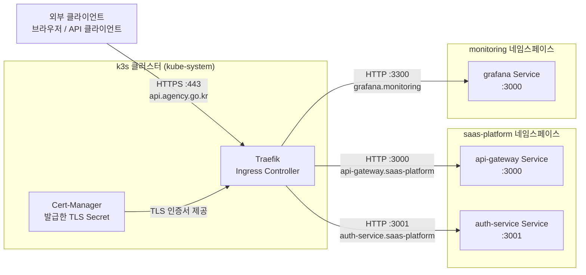

# Traefik — Ingress Controller와 TLS 라우팅

> **버전**: 1.0.0 | **작성일**: 2026-04-11
> **대상**: 신규 개발자, DevOps 엔지니어
> **CSAP**: D-08 (접근 통제), D-09 (암호화 — TLS 종료)
> **관련 문서**: `04-infrastructure.md` §5.1, `docs/07-infra/service-access-guide.md`

---

## 목차

1. [Traefik이란](#1-traefik이란)
2. [트래픽 흐름 다이어그램](#2-트래픽-흐름-다이어그램)
3. [IngressRoute 작성법](#3-ingressroute-작성법)
4. [TLS 자동 적용](#4-tls-자동-적용)
5. [실제 라우팅 설정 예시](#5-실제-라우팅-설정-예시)
6. [Traefik 상태 확인](#6-traefik-상태-확인)
7. [자주 하는 실수](#7-자주-하는-실수)

---

## 1. Traefik이란

### 1.1 역할

Traefik은 k3s에 기본 내장된 Ingress Controller입니다. 외부에서 들어오는 모든 HTTP/HTTPS 트래픽을 클러스터 내부의 적절한 서비스로 라우팅합니다.

```
비유: Traefik = 건물 안내 데스크
      - 방문자(외부 요청)가 도착하면 어디로 가야 할지 안내
      - "api.agency.go.kr → api-gateway 서비스로 연결"
      - "auth.agency.go.kr → auth-service 서비스로 연결"
      - HTTPS 연결에서 암호화를 처리하고 내부는 HTTP로 전달
```

### 1.2 왜 NodePort 대신 Traefik을 사용하는가

| 방식 | 단점 |
|------|------|
| NodePort (직접 포트 노출) | 포트 번호를 외부에 노출, CSAP D-08 위반 위험, TLS 없음 |
| LoadBalancer | 클라우드 환경 필요, 온프레미스에서 별도 설정 복잡 |
| **Traefik IngressRoute** | 단일 진입점, TLS 자동 처리, 미들웨어 체인, CSAP 요건 충족 |

### 1.3 k3s에서 Traefik 위치 확인

```bash
# Traefik Pod 상태 확인
kubectl get pods -n kube-system -l app.kubernetes.io/name=traefik
# NAME                         READY   STATUS    RESTARTS   AGE
# traefik-xxxxx                1/1     Running   0          7d

# Traefik Service 확인 (NodePort 80, 443)
kubectl get service -n kube-system traefik
# NAME      TYPE           CLUSTER-IP      EXTERNAL-IP   PORT(S)
# traefik   LoadBalancer   10.43.xxx.xxx   <pending>     80:30080/TCP,443:30443/TCP
```

---

## 2. 트래픽 흐름 다이어그램



**핵심 포인트**:
- 외부는 항상 HTTPS(443) 로 연결 → Traefik이 TLS를 종료
- 클러스터 내부는 HTTP로 통신 (Linkerd mTLS가 별도 암호화)
- 각 서비스는 자신의 호스트명(Host)과 경로(Path)로 라우팅됨

---

## 3. IngressRoute 작성법

### 3.1 기본 IngressRoute

IngressRoute는 k3s Traefik 전용 CRD입니다. 표준 Kubernetes Ingress보다 더 세밀한 라우팅을 지원합니다.

```yaml
# 예시: API Gateway IngressRoute
apiVersion: traefik.io/v1alpha1
kind: IngressRoute
metadata:
  name: api-gateway-route
  namespace: saas-platform
  annotations:
    # CSAP D-08: 접근 통제 — 외부 접근 허용 경로 명시
    csap.ref/d08: "접근통제 — IngressRoute 경로 제한"
spec:
  entryPoints:
    - web         # HTTP :80 (자동으로 HTTPS 리다이렉트)
    - websecure   # HTTPS :443

  routes:
    - match: Host(`api.agency.go.kr`) && PathPrefix(`/api/v1`)
      kind: Rule
      services:
        - name: api-gateway
          port: 3000

  tls:
    secretName: api-gateway-tls   # cert-manager가 자동 생성
```

### 3.2 라우팅 규칙 문법

Traefik은 Go 표현식 문법을 사용합니다.

```yaml
# 단일 호스트 매칭
match: Host(`api.agency.go.kr`)

# 호스트 + 경로 접두사
match: Host(`api.agency.go.kr`) && PathPrefix(`/api/v1`)

# 여러 경로
match: Host(`api.agency.go.kr`) && (PathPrefix(`/api`) || PathPrefix(`/health`))

# 헤더 매칭 (A/B 테스트, 카나리 배포)
match: Host(`api.agency.go.kr`) && Headers(`X-Canary`, `true`)

# 서브도메인 와일드카드
match: HostRegexp(`{tenant:[a-z]+}.agency.go.kr`)
```

### 3.3 미들웨어 적용

IngressRoute에 미들웨어를 체인으로 연결하여 Rate Limiting, IP 화이트리스트, 인증 등을 추가합니다.

```yaml
# 미들웨어 정의
apiVersion: traefik.io/v1alpha1
kind: Middleware
metadata:
  name: rate-limit
  namespace: saas-platform
spec:
  rateLimit:
    average: 100    # 초당 평균 100 요청
    burst: 200      # 버스트 최대 200 요청
---
# IngressRoute에서 미들웨어 참조
spec:
  routes:
    - match: Host(`api.agency.go.kr`)
      kind: Rule
      middlewares:
        - name: rate-limit       # 미들웨어 적용
      services:
        - name: api-gateway
          port: 3000
```

### 3.4 표준 Kubernetes Ingress (단순 사용)

복잡한 라우팅이 필요 없다면 표준 Kubernetes Ingress도 사용 가능합니다.

```yaml
apiVersion: networking.k8s.io/v1
kind: Ingress
metadata:
  name: my-service
  namespace: saas-platform
  annotations:
    traefik.ingress.kubernetes.io/router.entrypoints: web,websecure
    traefik.ingress.kubernetes.io/router.tls: "true"
spec:
  rules:
    - host: my-service.agency.go.kr
      http:
        paths:
          - path: /
            pathType: Prefix
            backend:
              service:
                name: my-service
                port:
                  number: 8080
  tls:
    - hosts:
        - my-service.agency.go.kr
      secretName: my-service-tls
```

---

## 4. TLS 자동 적용

### 4.1 Cert-Manager와 연동

Traefik은 Cert-Manager가 발급한 TLS Secret을 참조합니다. IngressRoute의 `tls.secretName`에 Secret 이름을 지정하면 됩니다.

```yaml
# 1단계: Certificate 리소스 생성 (cert-manager가 처리)
apiVersion: cert-manager.io/v1
kind: Certificate
metadata:
  name: api-gateway-tls
  namespace: saas-platform
spec:
  secretName: api-gateway-tls        # 이 이름의 Secret 자동 생성
  issuerRef:
    name: saas-ca-issuer
    kind: ClusterIssuer
  dnsNames:
    - api.agency.go.kr
  duration: 8760h                    # 1년
  renewBefore: 720h                  # 만료 30일 전 자동 갱신
---
# 2단계: IngressRoute에서 해당 Secret 참조
spec:
  tls:
    secretName: api-gateway-tls      # Certificate.spec.secretName과 동일
```

### 4.2 HTTP → HTTPS 리다이렉트

모든 HTTP 요청을 HTTPS로 자동 리다이렉트하는 미들웨어:

```yaml
apiVersion: traefik.io/v1alpha1
kind: Middleware
metadata:
  name: redirect-https
  namespace: saas-platform
spec:
  redirectScheme:
    scheme: https
    permanent: true    # 301 Permanent Redirect
---
# HTTP IngressRoute에 미들웨어 적용
spec:
  entryPoints:
    - web              # HTTP만
  routes:
    - match: Host(`api.agency.go.kr`)
      middlewares:
        - name: redirect-https   # HTTPS로 리다이렉트
      services:
        - name: api-gateway
          port: 3000
```

---

## 5. 실제 라우팅 설정 예시

### 5.1 API Gateway 전체 설정

```yaml
# 완성된 API Gateway IngressRoute 예시
apiVersion: traefik.io/v1alpha1
kind: IngressRoute
metadata:
  name: api-gateway-https
  namespace: saas-platform
spec:
  entryPoints:
    - websecure
  routes:
    # 공개 API (인증 불필요)
    - match: Host(`api.agency.go.kr`) && Path(`/health`)
      kind: Rule
      services:
        - name: api-gateway
          port: 3000

    # 인증 필요 API
    - match: Host(`api.agency.go.kr`) && PathPrefix(`/api/v1`)
      kind: Rule
      middlewares:
        - name: rate-limit
      services:
        - name: api-gateway
          port: 3000

    # WebSocket (실시간 알림)
    - match: Host(`api.agency.go.kr`) && PathPrefix(`/ws`)
      kind: Rule
      services:
        - name: api-gateway
          port: 3000
          scheme: h2c        # HTTP/2 WebSocket
  tls:
    secretName: api-gateway-tls
```

### 5.2 멀티 테넌트 라우팅

서브도메인으로 테넌트를 구분하는 라우팅:

```yaml
# tenant-A.agency.go.kr, tenant-B.agency.go.kr 모두 처리
apiVersion: traefik.io/v1alpha1
kind: IngressRoute
metadata:
  name: tenant-routing
  namespace: saas-platform
spec:
  entryPoints:
    - websecure
  routes:
    - match: HostRegexp(`{tenant:[a-z0-9-]+}.agency.go.kr`)
      kind: Rule
      services:
        - name: tenant-service
          port: 3003
  tls:
    secretName: wildcard-tls    # *.agency.go.kr 와일드카드 인증서
```

---

## 6. Traefik 상태 확인

### 6.1 기본 상태 확인

```bash
# Traefik Pod 상태
kubectl get pods -n kube-system -l app.kubernetes.io/name=traefik

# Traefik 버전 및 설정 확인
kubectl describe deployment traefik -n kube-system | grep -A5 "Image:"

# 현재 등록된 IngressRoute 목록
kubectl get ingressroute -A

# 특정 IngressRoute 상세
kubectl describe ingressroute api-gateway-https -n saas-platform
```

### 6.2 Traefik 대시보드 접근

```bash
# 로컬에서 Traefik 대시보드 접근
kubectl port-forward -n kube-system svc/traefik 9000:9000

# 브라우저에서 접근
# http://localhost:9000/dashboard/
```

Traefik 대시보드에서:
- 등록된 라우터(Router) 목록 확인
- 백엔드 서비스(Service) 상태 확인
- 미들웨어 적용 현황 확인
- 실시간 요청 통계 확인

### 6.3 라우팅 동작 테스트

```bash
# curl로 라우팅 테스트 (WSL2 환경)
curl -H "Host: api.agency.go.kr" http://localhost/health

# HTTPS 테스트 (자체 서명 인증서 허용)
curl -k -H "Host: api.agency.go.kr" https://localhost/api/v1/health

# 헤더 확인 (응답 헤더에 서비스 정보)
curl -I -H "Host: api.agency.go.kr" http://localhost/health
```

---

## 7. 자주 하는 실수

### 실수 1: entryPoints 누락으로 HTTPS 동작 안 함

```yaml
# 잘못된 예 (HTTP만 처리)
spec:
  entryPoints:
    - web

# 올바른 예 (HTTP + HTTPS 모두)
spec:
  entryPoints:
    - web
    - websecure
```

### 실수 2: 네임스페이스 다른 곳의 서비스 참조

IngressRoute는 동일 네임스페이스의 Service만 직접 참조할 수 있습니다. 다른 네임스페이스의 서비스를 참조하려면 `TraefikService`를 중간에 사용하거나 ExternalName Service를 생성합니다.

```yaml
# 잘못된 예 (다른 네임스페이스 직접 참조 — 동작 안 함)
services:
  - name: grafana               # monitoring 네임스페이스에 있는 서비스
    port: 3000
    namespace: monitoring       # 일부 버전에서만 지원

# 올바른 예 (동일 네임스페이스 ExternalName Service 생성)
apiVersion: v1
kind: Service
metadata:
  name: grafana-proxy
  namespace: saas-platform
spec:
  type: ExternalName
  externalName: grafana.monitoring.svc.cluster.local
  ports:
    - port: 3000
```

### 실수 3: TLS Secret이 없어 HTTPS 동작 안 함

```bash
# Certificate 상태 확인
kubectl get certificate -n saas-platform
# READY가 True여야 함

# Secret 생성 여부 확인
kubectl get secret api-gateway-tls -n saas-platform

# Certificate 이벤트 확인 (발급 오류 원인)
kubectl describe certificate api-gateway-tls -n saas-platform | grep -A10 "Events:"
```

---

다음 단계: `02-cert-manager.md`에서 TLS 인증서 자동 관리를 학습합니다.
