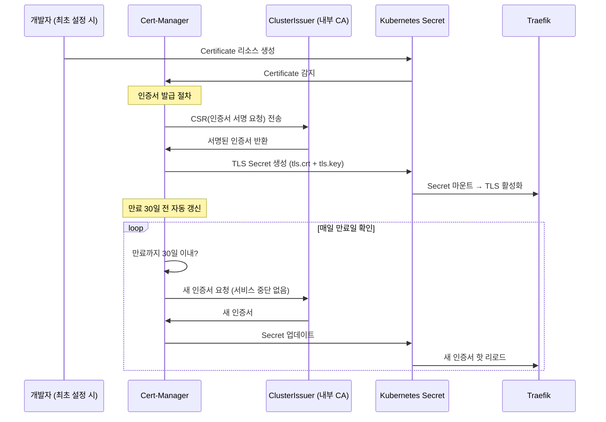

# Cert-Manager — TLS 인증서 자동 관리

> **버전**: 1.0.0 | **작성일**: 2026-04-11
> **대상**: 신규 개발자, DevOps 엔지니어
> **CSAP**: D-09 (암호화 — TLS 1.3+, 인증서 관리)
> **관련 문서**: `04-infrastructure.md` §5.2, `docs/07-infra/service-access-guide.md`

---

## 목차

1. [Cert-Manager란](#1-cert-manager란)
2. [인증서 갱신 흐름](#2-인증서-갱신-흐름)
3. [ClusterIssuer 설정](#3-clusterissuer-설정)
4. [Certificate 리소스](#4-certificate-리소스)
5. [실습: 새 서비스에 TLS 적용](#5-실습-새-서비스에-tls-적용)
6. [인증서 상태 모니터링](#6-인증서-상태-모니터링)
7. [자주 하는 실수](#7-자주-하는-실수)

---

## 1. Cert-Manager란

### 1.1 역할

Cert-Manager는 Kubernetes 클러스터에서 TLS 인증서의 발급, 갱신, 폐기를 자동화하는 오퍼레이터입니다.

```
수동 인증서 관리 (사용 안 함):
  - openssl로 인증서 생성 → 서버에 복사 → 매년 갱신 작업
  - 담당자가 바뀌거나 갱신일을 잊으면 서비스 중단
  - CSAP D-09 감사 시 인증서 만료 증적 제출 어려움

Cert-Manager 자동 관리 (이 프레임워크):
  - Certificate 리소스 선언 → Cert-Manager가 자동 발급
  - 만료 30일 전 자동 갱신 (서비스 중단 없음)
  - 인증서 상태를 Kubernetes 리소스로 추적·감사 가능
```

### 1.2 Cert-Manager 설치 확인

```bash
# Cert-Manager Pod 상태
kubectl get pods -n cert-manager
# NAME                                       READY   STATUS
# cert-manager-xxxxx                         1/1     Running
# cert-manager-cainjector-xxxxx              1/1     Running
# cert-manager-webhook-xxxxx                 1/1     Running

# CRD 설치 확인
kubectl get crds | grep cert-manager
# certificates.cert-manager.io
# clusterissuers.cert-manager.io
# issuers.cert-manager.io
```

### 1.3 지원하는 인증서 발급 방식

| 방식 | 사용 상황 | 구현 |
|------|---------|------|
| **자체 CA (Self-signed CA)** | 내부 클러스터 서비스 간 TLS | ClusterIssuer + CA Secret |
| **Let's Encrypt** | 공개 도메인 서비스 | ClusterIssuer + ACME (CSAP 환경에서 제한적) |
| **Vault PKI** | 엔터프라이즈 PKI 통합 | ClusterIssuer + Vault |

이 프레임워크는 내부 자체 CA를 사용합니다. 공공기관 환경에서는 자체 Root CA 인증서를 사용하는 것이 일반적입니다.

---

## 2. 인증서 갱신 흐름



**핵심**: 인증서 갱신은 서비스 재시작 없이 자동으로 이루어집니다.

---

## 3. ClusterIssuer 설정

ClusterIssuer는 클러스터 전체에서 사용할 수 있는 인증서 발급자입니다. Issuer는 특정 네임스페이스에만 적용됩니다.

### 3.1 내부 CA ClusterIssuer

```yaml
# infra/cert-manager/templates/ca-cluster-issuer.yaml
apiVersion: cert-manager.io/v1
kind: ClusterIssuer
metadata:
  name: saas-ca-issuer
  annotations:
    csap.ref/d09: "암호화 — 내부 CA 기반 TLS 인증서 관리"
spec:
  ca:
    secretName: saas-root-ca-secret   # Root CA 인증서가 담긴 Secret
```

ClusterIssuer가 참조하는 Root CA Secret은 cert-manager 네임스페이스에 있어야 합니다:

```bash
# Root CA Secret 확인
kubectl get secret saas-root-ca-secret -n cert-manager
# NAME                  TYPE                DATA   AGE
# saas-root-ca-secret   kubernetes.io/tls   2      30d
```

### 3.2 ClusterIssuer 상태 확인

```bash
# ClusterIssuer 목록
kubectl get clusterissuers
# NAME             READY   AGE
# saas-ca-issuer   True    30d

# ClusterIssuer 상세
kubectl describe clusterissuer saas-ca-issuer
# 출력에서 Ready: True 와 조건 확인
```

### 3.3 자체 서명 ClusterIssuer (테스트용)

```yaml
# 테스트 환경에서 자체 서명 인증서를 빠르게 발급
apiVersion: cert-manager.io/v1
kind: ClusterIssuer
metadata:
  name: selfsigned-issuer
spec:
  selfSigned: {}   # 자체 서명 — 브라우저에서 경고 표시됨
```

---

## 4. Certificate 리소스

### 4.1 기본 Certificate

```yaml
# 예시: auth-service용 TLS 인증서
apiVersion: cert-manager.io/v1
kind: Certificate
metadata:
  name: auth-service-tls
  namespace: saas-platform
  annotations:
    csap.ref/d09: "암호화 — TLS 1.3+ 전송 암호화"
spec:
  # 발급된 인증서가 저장될 Secret 이름
  secretName: auth-service-tls

  # 어떤 ClusterIssuer로 발급할지
  issuerRef:
    name: saas-ca-issuer
    kind: ClusterIssuer

  # 인증서가 유효한 도메인 목록
  dnsNames:
    - auth.agency.go.kr
    - auth-service.saas-platform.svc.cluster.local

  # 유효 기간
  duration: 8760h       # 1년 (8760시간)
  renewBefore: 720h     # 만료 30일(720시간) 전 자동 갱신

  # 키 알고리즘
  privateKey:
    algorithm: ECDSA    # RSA 대신 ECDSA 사용 (성능 우수)
    size: 256

  # 인증서 사용 목적
  usages:
    - server auth       # 서버 인증
    - client auth       # mTLS용 클라이언트 인증
```

### 4.2 와일드카드 인증서

멀티 테넌트 환경에서 `*.agency.go.kr` 형태의 와일드카드 인증서:

```yaml
apiVersion: cert-manager.io/v1
kind: Certificate
metadata:
  name: wildcard-tls
  namespace: saas-platform
spec:
  secretName: wildcard-tls
  issuerRef:
    name: saas-ca-issuer
    kind: ClusterIssuer
  dnsNames:
    - "*.agency.go.kr"          # 와일드카드 — 하나의 인증서로 모든 서브도메인
    - "agency.go.kr"
  duration: 8760h
  renewBefore: 720h
```

와일드카드 인증서는 `tenant-a.agency.go.kr`, `tenant-b.agency.go.kr` 등 모든 서브도메인에 사용할 수 있습니다.

---

## 5. 실습: 새 서비스에 TLS 적용

새 서비스(notification-service)에 HTTPS를 적용하는 전체 절차입니다.

### 단계 1: Certificate 리소스 생성

```yaml
# infra/cert-manager/certificates/notification-service.yaml
apiVersion: cert-manager.io/v1
kind: Certificate
metadata:
  name: notification-service-tls
  namespace: saas-platform
spec:
  secretName: notification-service-tls
  issuerRef:
    name: saas-ca-issuer
    kind: ClusterIssuer
  dnsNames:
    - notification.agency.go.kr
    - notification-service.saas-platform.svc.cluster.local
  duration: 8760h
  renewBefore: 720h
```

```bash
# Git에 커밋 후 Flux로 배포
git add infra/cert-manager/certificates/notification-service.yaml
git commit -m "feat(cert): notification-service TLS 인증서 추가 (CSAP D-09)"
git push origin main
```

### 단계 2: Certificate 발급 확인

```bash
# Certificate 상태 확인 (READY=True 될 때까지 대기)
kubectl get certificate notification-service-tls -n saas-platform -w
# NAME                          READY   SECRET                        AGE
# notification-service-tls      False   notification-service-tls      5s
# notification-service-tls      True    notification-service-tls      15s  ← 발급 완료

# 발급된 Secret 확인
kubectl get secret notification-service-tls -n saas-platform
# NAME                       TYPE                DATA   AGE
# notification-service-tls   kubernetes.io/tls   3      1m

# 인증서 내용 확인 (만료일, 도메인 등)
kubectl get secret notification-service-tls -n saas-platform \
  -o jsonpath='{.data.tls\.crt}' | base64 -d | openssl x509 -noout -text | \
  grep -E "Subject:|DNS:|Not After"
```

### 단계 3: IngressRoute에 TLS 적용

```yaml
# notification-service IngressRoute 생성
apiVersion: traefik.io/v1alpha1
kind: IngressRoute
metadata:
  name: notification-service-route
  namespace: saas-platform
spec:
  entryPoints:
    - websecure
  routes:
    - match: Host(`notification.agency.go.kr`)
      kind: Rule
      services:
        - name: notification-service
          port: 3005
  tls:
    secretName: notification-service-tls   # Certificate에서 지정한 secretName
```

### 단계 4: TLS 동작 확인

```bash
# curl로 HTTPS 연결 테스트
curl -v --cacert /path/to/saas-ca.crt \
  https://notification.agency.go.kr/health

# 인증서 유효성 확인
echo | openssl s_client -connect notification.agency.go.kr:443 2>/dev/null | \
  openssl x509 -noout -subject -dates
```

---

## 6. 인증서 상태 모니터링

### 6.1 인증서 목록 확인

```bash
# 전체 인증서 상태
kubectl get certificates -A
# NAMESPACE       NAME                     READY   SECRET                   AGE
# saas-platform   api-gateway-tls          True    api-gateway-tls          30d
# saas-platform   auth-service-tls         True    auth-service-tls         30d
# saas-platform   notification-svc-tls     True    notification-svc-tls     1d

# READY가 False인 인증서 찾기
kubectl get certificates -A | grep -v "True"
```

### 6.2 만료 예정 인증서 확인

```bash
# 만료일 일괄 확인
kubectl get certificates -A -o json | jq -r \
  '.items[] | "\(.metadata.namespace)/\(.metadata.name): \(.status.notAfter)"'

# 30일 이내 만료 예정 인증서 (Alertmanager가 자동으로 경고 알림)
kubectl get certificates -A -o json | jq -r \
  '.items[] | select(.status.notAfter != null) |
   "\(.metadata.name): \(.status.notAfter)"'
```

### 6.3 인증서 발급 실패 원인 진단

```bash
# Certificate 상세 이벤트 확인
kubectl describe certificate api-gateway-tls -n saas-platform
# Events 섹션에서 오류 메시지 확인

# CertificateRequest 상태 확인
kubectl get certificaterequests -n saas-platform

# cert-manager 컨트롤러 로그
kubectl logs -n cert-manager deployment/cert-manager --tail=50
```

### 6.4 Alertmanager 인증서 만료 알림 설정

```yaml
# infra/cert-manager/alerting-rules.yaml
apiVersion: monitoring.coreos.com/v1
kind: PrometheusRule
metadata:
  name: cert-manager-alerts
  namespace: monitoring
spec:
  groups:
    - name: cert-manager
      rules:
        - alert: CertificateExpiringIn30Days
          expr: |
            certmanager_certificate_expiration_timestamp_seconds
            - time() < 30 * 24 * 60 * 60
          for: 1h
          labels:
            severity: warning
          annotations:
            summary: "인증서 만료 30일 전: {{ $labels.name }}"
            description: "{{ $labels.namespace }}/{{ $labels.name }} 인증서가 30일 내 만료됩니다."

        - alert: CertificateExpiringIn7Days
          expr: |
            certmanager_certificate_expiration_timestamp_seconds
            - time() < 7 * 24 * 60 * 60
          for: 1h
          labels:
            severity: critical
          annotations:
            summary: "긴급: 인증서 만료 7일 전: {{ $labels.name }}"
```

---

## 7. 자주 하는 실수

### 실수 1: Certificate와 IngressRoute가 다른 네임스페이스

```yaml
# 잘못된 예
# Certificate: saas-platform 네임스페이스
# IngressRoute: kube-system 네임스페이스 → Secret 접근 불가

# 올바른 예: Certificate와 IngressRoute가 동일 네임스페이스
Certificate → namespace: saas-platform
IngressRoute → namespace: saas-platform
Secret (자동 생성) → namespace: saas-platform
```

### 실수 2: secretName 불일치

```yaml
# Certificate
spec:
  secretName: my-service-tls-cert    # 이 이름으로 Secret 생성

# IngressRoute
spec:
  tls:
    secretName: my-service-tls       # 이름이 다름 → TLS 동작 안 함

# 올바른 예: 동일한 이름 사용
spec:
  tls:
    secretName: my-service-tls-cert  # Certificate.spec.secretName과 동일
```

### 실수 3: ClusterIssuer READY=False 상태에서 Certificate 생성

```bash
# ClusterIssuer 상태 먼저 확인
kubectl get clusterissuer saas-ca-issuer
# READY가 True여야 Certificate 발급 가능

# ClusterIssuer가 False면 원인 확인
kubectl describe clusterissuer saas-ca-issuer
# Events 섹션 확인 → Root CA Secret 없음이 주요 원인
```

### 실수 4: 인증서 갱신을 위한 수동 개입

```bash
# Cert-Manager가 자동으로 갱신합니다. 수동 삭제 불필요.
# 단, 긴급히 즉시 갱신이 필요할 때는 CertificateRequest 삭제로 재발급 트리거 가능
kubectl delete certificaterequests -n saas-platform \
  $(kubectl get certificaterequests -n saas-platform -o name | head -1)
```

---

다음 단계: `03-postgresql.md`에서 CloudNativePG PostgreSQL HA 클러스터 운영을 학습합니다.
