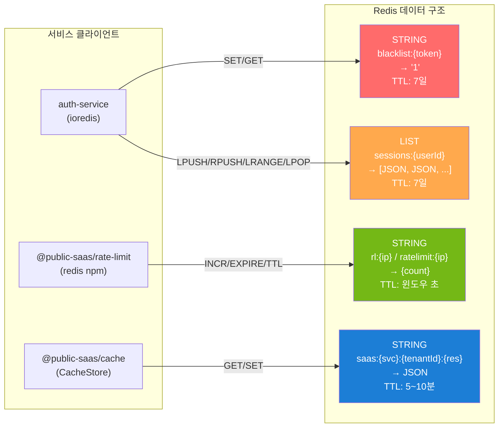
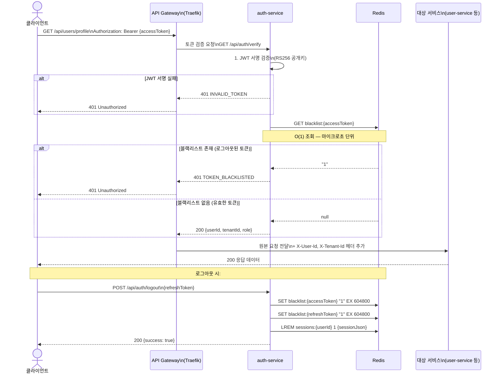

# Redis — 세션 저장소, 캐시, Rate Limit, 이벤트 버스

> **버전**: 1.0.0 | **작성일**: 2026-04-12
> **대상**: 신규 개발자, 백엔드 개발자, DevOps 엔지니어
> **CSAP**: D-08-02 (세션 관리), D-08-03 (로그아웃 무효화), D-08-04 (동시 접속 제한), D-08-06 (무차별 대입 방어)
> **관련 문서**: `infra/helm/saas-platform/charts/redis/`, `platform/services/auth-service/src/lib/session.ts`

---

## 목차

1. [Redis의 역할](#1-redis의-역할)
2. [설치 방법 — Helm 서브차트](#2-설치-방법--helm-서브차트)
3. [Redis Sentinel vs Cluster](#3-redis-sentinel-vs-cluster)
4. [주요 사용 패턴](#4-주요-사용-패턴)
5. [JWT 블랙리스트 체크 흐름](#5-jwt-블랙리스트-체크-흐름)
6. [redis-cli 직접 접속](#6-redis-cli-직접-접속)
7. [RedisInsight으로 데이터 확인](#7-redisinsight으로-데이터-확인)
8. [자주 발생하는 문제와 해결법](#8-자주-발생하는-문제와-해결법)

---

## 1. Redis의 역할

### 1.1 Redis란

Redis(Remote Dictionary Server)는 메모리 기반 데이터 저장소입니다. 디스크 I/O 없이 마이크로초 단위로 읽고 쓰는 특성 때문에 공공 SaaS 플랫폼에서 4가지 핵심 역할을 담당합니다.

```
PostgreSQL (영구 저장) ↔ Redis (빠른 임시 저장)

PostgreSQL: 사용자 정보, 테넌트 데이터, 감사 로그 → 디스크 저장, 영구 보존
Redis:      세션 토큰, 캐시, Rate Limit 카운터  → 메모리 저장, TTL 자동 만료
```

### 1.2 이 프로젝트에서 Redis 4가지 역할

```mermaid
graph TB
    subgraph REDIS["Redis (redis:7-alpine)"]
        direction TB
        BL["JWT 블랙리스트\nblacklist:{token}\n→ 로그아웃 처리"]
        SES["세션 목록\nsessions:{userId}\n→ 동시 접속 제한"]
        RL["Rate Limit 카운터\nrl:{ip}\n→ 무차별 대입 방어"]
        CACHE["API 캐시\nsaas:{svc}:{tenantId}:{res}\n→ DB 부하 감소"]
    end

    AUTH["auth-service\n(ioredis)"] -->|blacklistToken()| BL
    AUTH -->|createSession()| SES
    AUTH -->|incr/expire| RL
    SVC["각종 서비스\n(CacheStore)"] -->|getOrFetch()| CACHE

    style BL fill:#ff6b6b,color:#fff
    style SES fill:#ffa94d,color:#fff
    style RL fill:#74b816,color:#fff
    style CACHE fill:#1c7ed6,color:#fff
```

| 역할 | Redis 키 패턴 | TTL | CSAP |
|------|-------------|-----|------|
| JWT 블랙리스트 | `blacklist:{token}` | 7일 (갱신 토큰 만료 시간) | D-08-03 |
| 세션 목록 | `sessions:{userId}` | 7일 | D-08-02, D-08-04 |
| Rate Limit 카운터 | `rl:{ip}` 또는 `ratelimit:{ip}` | 요청 윈도우 (초) | D-08-06 |
| API 캐시 | `saas:{service}:{tenantId}:{resource}:{id}` | 5분 (기본값) | D-08-05 |

---

## 2. 설치 방법 — Helm 서브차트

### 2.1 이 프로젝트의 Redis 설치 구조

이 프레임워크는 Redis를 직접 Kubernetes 매니페스트로 관리하지 않고, **Helm 서브차트** 방식으로 관리합니다.

```
infra/helm/saas-platform/
├── Chart.yaml                         ← umbrella 차트
├── values.yaml                        ← 전역 활성화 설정
├── values-dev.yaml                    ← 개발 환경 오버라이드
└── charts/
    └── redis/
        ├── Chart.yaml                 ← Redis 서브차트 정의
        ├── values.yaml                ← Redis 기본값
        └── templates/
            ├── deployment.yaml
            └── service.yaml
```

### 2.2 Redis 서브차트 설정

```yaml
# infra/helm/saas-platform/charts/redis/values.yaml
# Design Ref: MTU-N35 Design -- Redis 인프라
# Plan SC: FR-N35.4

enabled: true
replicaCount: 1

image:
  repository: redis
  pullPolicy: IfNotPresent
  tag: "7-alpine"

fullnameOverride: "redis"    # Service 이름: redis (클러스터 내부 DNS)

service:
  type: ClusterIP
  port: 6379

resources:
  requests:
    cpu: 50m
    memory: 64Mi
  limits:
    cpu: 200m
    memory: 128Mi
```

```yaml
# infra/helm/saas-platform/values.yaml — Redis 활성화
redis:
  enabled: true
```

### 2.3 Helm으로 배포

```bash
# saas-platform umbrella 차트 배포 (Redis 포함)
helm upgrade --install saas-platform \
  infra/helm/saas-platform/ \
  -n saas-platform \
  --create-namespace \
  -f infra/helm/saas-platform/values.yaml \
  --wait

# Redis Pod 상태 확인
kubectl get pods -n saas-platform -l app.kubernetes.io/name=redis
# NAME                     READY   STATUS    RESTARTS
# redis-xxxxxxxxx-xxxxx    1/1     Running   0

# Redis Service 확인
kubectl get svc -n saas-platform redis
# NAME    TYPE        CLUSTER-IP    PORT(S)
# redis   ClusterIP   10.43.x.x     6379/TCP
```

### 2.4 서비스에서 Redis 연결 설정

```yaml
# ConfigMap 또는 환경 변수 설정
REDIS_URL: "redis://redis.saas-platform.svc.cluster.local:6379"
```

```typescript
// platform/services/auth-service/src/lib/session.ts (실제 코드)
// Design Ref: DESIGN-MTU-P01 Section 4
// Plan SC: FR-P01.4, FR-P01.7

import Redis from 'ioredis';

const redis = new Redis(process.env['REDIS_URL'] ?? 'redis://localhost:6379');
```

---

## 3. Redis Sentinel vs Cluster

### 3.1 세 가지 Redis 운영 모드 비교

| 특성 | Standalone | Sentinel | Cluster |
|------|-----------|---------|---------|
| 구성 | 단일 인스턴스 | Primary + Replica + Sentinel | 샤딩된 다수 노드 |
| 고가용성 | 없음 | 자동 장애 조치 | 자동 샤딩 + 장애 조치 |
| 스케일 | 단일 서버 메모리 제한 | 단일 서버 메모리 제한 | 수평 확장 가능 |
| 복잡도 | 낮음 | 중간 | 높음 |
| 최소 노드 수 | 1개 | 3개 Sentinel + 2개 데이터 | 6개 (권장) |
| WSL2 개발 환경 | 적합 | 가능하나 과도함 | 과도함 |

### 3.2 이 프로젝트의 선택: Standalone

```
이 프로젝트는 WSL2 + k3s 단일 노드 환경에서 운영됩니다.
현재 Standalone 모드를 사용하는 이유:

1. WSL2 단일 노드: Sentinel/Cluster의 최소 3~6개 노드 불가
2. 메모리 효율: Redis 메모리 limit 128Mi (128Gi 아님)
3. 세션/캐시 데이터의 특성: 재시작 시 재생성 가능 (데이터 손실 허용)
4. 공공 SaaS 운영 환경: 별도 HA Redis 클러스터 구성 권장

운영 환경 전환 시: Bitnami Redis Sentinel 차트로 전환 권장
```

### 3.3 운영 환경 Sentinel 전환 시 참고

```yaml
# 운영 환경 전환 예시 (이 프로젝트 미사용 — 참고용)
# helm repo add bitnami https://charts.bitnami.com/bitnami
# helm install redis bitnami/redis --set architecture=replication

# Sentinel 활성화 시 환경 변수 변경 필요:
# REDIS_URL: "redis-sentinel://redis-headless.saas-platform:26379/0?sentinelMasterId=mymaster"
```

---

## 4. 주요 사용 패턴

### 4.1 JWT 블랙리스트 — 로그아웃 처리

JWT는 stateless이므로 로그아웃해도 토큰 자체는 만료 전까지 유효합니다. Redis 블랙리스트로 이 문제를 해결합니다.

```typescript
// platform/services/auth-service/src/lib/session.ts
// CSAP D-08-03: 로그아웃 시 토큰 무효화

const BLACKLIST_KEY = (token: string): string => `blacklist:${token}`;

/**
 * 토큰을 블랙리스트에 등록 (로그아웃 시 호출)
 * TTL은 갱신 토큰 만료 시간(7일)으로 설정
 */
export async function blacklistToken(token: string): Promise<void> {
  await redis.set(
    BLACKLIST_KEY(token),  // "blacklist:eyJhbGciOiJSUzI1NiJ9..."
    '1',                   // 값은 존재 여부만 확인 (1바이트)
    'EX',
    AUTH_CONSTANTS.REFRESH_TOKEN_EXPIRES_SECONDS  // 604800 (7일)
  );
}

/**
 * 토큰이 블랙리스트에 있는지 확인 (API 요청마다 호출)
 */
export async function isTokenBlacklisted(token: string): Promise<boolean> {
  const result = await redis.get(BLACKLIST_KEY(token));
  return result !== null;  // null → 유효 토큰, '1' → 블랙리스트
}
```

**Redis에 저장되는 데이터**:
```
blacklist:eyJhbGciOiJSUzI1NiJ9.eyJzdWIiOiJ1c2VyLTEifQ → "1" (TTL: 604800초)
```

### 4.2 Rate Limit — 슬라이딩 윈도우 (INCR + EXPIRE)

Redis `INCR`과 `EXPIRE`를 조합하여 고정 윈도우 Rate Limiting을 구현합니다. 외부 라이브러리 없이 원자적(atomic) 연산으로 처리합니다.

```typescript
// platform/packages/rate-limit/src/index.ts (실제 코드)
// CSAP D-08-06: 무차별 대입 공격 방어

export function createRateLimiter(
  maxRequests: number,
  windowSeconds: number,
  keyPrefix: string = 'rl'
) {
  return async function rateLimitMiddleware(
    request: FastifyRequest,
    reply: FastifyReply
  ): Promise<void> {
    const redis = await getRedis();
    if (!redis) return;  // Redis 미연결 시 통과 (가용성 우선)

    const key = `${keyPrefix}:${request.ip}`;
    // 예: "ratelimit:192.168.1.1"

    const current = await redis.incr(key);  // 원자적 증가

    if (current === 1) {
      // 첫 번째 요청: TTL 설정 (키 자동 만료)
      await redis.expire(key, windowSeconds);
    }

    const ttl = await redis.ttl(key);
    const remaining = Math.max(0, maxRequests - current);

    // 응답 헤더로 클라이언트에 정보 제공
    void reply.header('X-RateLimit-Limit', String(maxRequests));
    void reply.header('X-RateLimit-Remaining', String(remaining));
    void reply.header('X-RateLimit-Reset', String(ttl));

    if (current > maxRequests) {
      await reply.status(429).send({
        success: false,
        error: {
          code: 'RATE_LIMIT_EXCEEDED',
          message: '요청 한도를 초과했습니다. 잠시 후 다시 시도하세요.',
          retryAfter: ttl,
        },
      });
    }
  };
}
```

**각 서비스별 Rate Limit 설정** (`auth-service` 예시):

```typescript
// platform/services/auth-service/src/middleware/rate-limit.middleware.ts
import { rateLimitMiddleware } from '@public-saas/rate-limit';

// 로그인: 60초에 최대 10회
const loginRateLimit = rateLimitMiddleware({ max: 10, windowSeconds: 60 });

// 토큰 갱신: 60초에 최대 30회
const refreshRateLimit = rateLimitMiddleware({ max: 30, windowSeconds: 60 });

// 비밀번호 변경: 300초에 최대 5회
const passwordRateLimit = rateLimitMiddleware({ max: 5, windowSeconds: 300 });
```

**Redis에 저장되는 데이터**:
```
ratelimit:192.168.1.100 → 7 (TTL: 53초 남음)
```

### 4.3 세션 관리 — 동시 접속 제한 (CSAP D-08-04)

```typescript
// platform/services/auth-service/src/lib/session.ts
// CSAP D-08-04: 동시 세션 최대 3개, FIFO 만료

const SESSION_KEY = (userId: string): string => `sessions:${userId}`;

export async function createSession(
  userId: string,
  sessionData: SessionData
): Promise<void> {
  const key = SESSION_KEY(userId);
  const sessions = await redis.lrange(key, 0, -1);  // Redis List 조회

  // 동시 세션 3개 초과 시: 가장 오래된 세션 강제 만료
  if (sessions.length >= AUTH_CONSTANTS.MAX_CONCURRENT_SESSIONS) {
    const oldestRaw = await redis.lpop(key);  // 리스트 맨 앞(가장 오래된 것) 제거
    if (oldestRaw) {
      const oldest = JSON.parse(oldestRaw) as SessionData;
      await blacklistToken(oldest.token);       // 오래된 토큰 블랙리스트 등록
      await blacklistToken(oldest.refreshToken);
    }
  }

  await redis.rpush(key, JSON.stringify(sessionData));  // 새 세션을 리스트 끝에 추가
  await redis.expire(key, AUTH_CONSTANTS.REFRESH_TOKEN_EXPIRES_SECONDS);
}
```

**Redis에 저장되는 데이터** (List 자료구조):
```
sessions:user-abc123 → [
  '{"token":"eyJ...1","ip":"1.1.1.1","userAgent":"Chrome","createdAt":"..."}',
  '{"token":"eyJ...2","ip":"2.2.2.2","userAgent":"Firefox","createdAt":"..."}',
  '{"token":"eyJ...3","ip":"3.3.3.3","userAgent":"Mobile","createdAt":"..."}'
]
TTL: 604800초 (7일)
```

### 4.4 Cache-Aside 패턴 — 멀티테넌시 캐시 격리

```typescript
// platform/packages/cache/src/cache-store.ts (실제 코드)
// CSAP D-08-05: 테넌트별 캐시 키 격리

export class CacheStore {
  /**
   * 캐시 키 생성 (CSAP D-08-05: 테넌트 격리)
   * 패턴: {prefix}:{service}:{tenantId}:{resource}:{identifier}
   */
  buildKey(
    service: string,
    tenantId: string,
    resource: string,
    identifier?: string
  ): string {
    const parts = ['saas', service, tenantId, resource];
    if (identifier) parts.push(identifier);
    return parts.join(':');
  }

  /**
   * Cache-Aside (Read-Through) 패턴
   * 캐시에 없으면 fetcher 실행 후 자동 캐싱
   */
  async getOrFetch<T>(
    key: string,
    tenantId: string,
    fetcher: () => Promise<T>,
    ttlSeconds?: number
  ): Promise<T> {
    const cached = this.get<T>(key);
    if (cached !== undefined) {
      return cached;   // 캐시 히트: DB 조회 없이 즉시 반환
    }

    const value = await fetcher();        // 캐시 미스: DB에서 조회
    this.set(key, value, tenantId, ttlSeconds);  // 결과를 캐시에 저장
    return value;
  }

  /**
   * 테넌트 격리 삭제
   * 테넌트 정지/삭제 시 관련 캐시 일괄 제거 (CSAP D-08-05)
   */
  invalidateTenant(tenantId: string): number {
    let deleted = 0;
    for (const [key, entry] of this.store.entries()) {
      if (entry.tenantId === tenantId) {
        this.store.delete(key);
        deleted++;
      }
    }
    return deleted;
  }
}
```

**Cache-Aside 사용 예시**:

```typescript
// 서비스 레이어에서 캐시 활용
const cacheStore = new CacheStore({ defaultTtlSeconds: 300, maxEntries: 10000 });

async function getTenantConfig(tenantId: string) {
  const key = cacheStore.buildKey('tenant', tenantId, 'config');
  // 키 예시: "saas:tenant:t-001:config"

  return cacheStore.getOrFetch(
    key,
    tenantId,
    () => prisma.tenantConfig.findUnique({ where: { tenantId } }),
    600  // 10분 캐시
  );
}
```

**중요**: 현재 `CacheStore`는 인메모리(Map) 기반으로 구현되어 있습니다. 멀티 Pod 환경에서는 ioredis를 직접 사용하는 분산 캐시로 전환해야 합니다.

### 4.5 전체 Redis 사용 패턴 맵



---

## 5. JWT 블랙리스트 체크 흐름

API 요청이 들어올 때마다 JWT를 Redis 블랙리스트와 대조하는 전체 흐름입니다.



---

## 6. redis-cli 직접 접속

### 6.1 kubectl exec으로 redis-cli 접속

```bash
# Redis Pod 이름 확인
kubectl get pods -n saas-platform -l app.kubernetes.io/name=redis
# NAME                    READY   STATUS
# redis-7d4c8b9f5-xk2pn   1/1     Running

# redis-cli 접속
kubectl exec -it -n saas-platform redis-7d4c8b9f5-xk2pn -- redis-cli

# 접속 확인
127.0.0.1:6379> PING
PONG

# 전체 키 목록 조회 (운영 환경에서는 KEYS * 대신 SCAN 사용)
127.0.0.1:6379> KEYS *
1) "sessions:user-001"
2) "blacklist:eyJhbGciOiJSUzI1NiJ9..."
3) "ratelimit:10.42.1.5"
```

### 6.2 유용한 redis-cli 명령어

```bash
# 블랙리스트 확인 (특정 토큰)
127.0.0.1:6379> GET blacklist:eyJhbGci...
"1"

# 세션 목록 확인 (특정 사용자)
127.0.0.1:6379> LRANGE sessions:user-001 0 -1
1) "{\"token\":\"eyJ...\",\"ip\":\"1.1.1.1\",\"createdAt\":\"2026-04-12T08:00:00Z\"}"
2) "{\"token\":\"eyJ...\",\"ip\":\"2.2.2.2\",\"createdAt\":\"2026-04-12T09:00:00Z\"}"

# 세션 수 확인
127.0.0.1:6379> LLEN sessions:user-001
(integer) 2

# Rate Limit 카운터 확인
127.0.0.1:6379> GET ratelimit:10.42.1.5
"7"

# TTL 확인 (초 단위, -1이면 TTL 없음, -2이면 키 없음)
127.0.0.1:6379> TTL ratelimit:10.42.1.5
(integer) 47

# 특정 키 삭제 (긴급 세션 강제 무효화)
127.0.0.1:6379> DEL sessions:user-001
(integer) 1

# 메모리 사용량 확인
127.0.0.1:6379> INFO memory
# used_memory_human: 1.50M
# maxmemory_human: 128.00M

# 연결된 클라이언트 수
127.0.0.1:6379> CLIENT LIST
id=3 addr=10.42.1.7:52048 ... name= ... cmd=auth-service

# 초당 명령 처리량 (2초 간격으로 10회)
127.0.0.1:6379> INFO stats | grep instantaneous_ops
instantaneous_ops_per_sec:245
```

### 6.3 로컬에서 포트 포워딩으로 접속

```bash
# 포트 포워딩 (백그라운드)
kubectl port-forward -n saas-platform svc/redis 6379:6379 &

# 로컬 redis-cli로 접속 (redis-cli 설치 필요)
redis-cli -h 127.0.0.1 -p 6379 PING
# PONG

# 연결 해제 후 포트 포워딩 종료
kill %1
```

---

## 7. RedisInsight으로 데이터 확인

RedisInsight는 Redis 데이터를 시각적으로 탐색할 수 있는 GUI 도구입니다.

### 7.1 RedisInsight 실행

```bash
# Docker로 RedisInsight 실행
docker run -d \
  --name redisinsight \
  -p 5540:5540 \
  redis/redisinsight:latest

# 브라우저에서 접근
# http://localhost:5540
```

### 7.2 Redis 연결 설정

포트 포워딩 후 RedisInsight에서 연결:

```bash
# Step 1: 포트 포워딩
kubectl port-forward -n saas-platform svc/redis 6379:6379

# Step 2: RedisInsight에서 연결
# Host: 127.0.0.1
# Port: 6379
# (인증 없음 — 개발 환경)
```

### 7.3 RedisInsight에서 확인할 수 있는 것

```
Browser 탭:
  ├── blacklist:* → STRING 타입, 블랙리스트된 토큰 목록
  ├── sessions:* → LIST 타입, 사용자별 세션 목록
  ├── ratelimit:* → STRING 타입, IP별 카운터
  └── saas:* → STRING 타입, 캐시 데이터

Profiler 탭:
  → 실시간으로 어떤 명령이 실행되는지 모니터링

Analysis 탭:
  → 키 타입별 분포, 메모리 사용량 분석
```

---

## 8. 자주 발생하는 문제와 해결법

### 문제 1: Connection refused

```
증상: Error: connect ECONNREFUSED 127.0.0.1:6379
원인: Redis Pod 미실행 또는 REDIS_URL 설정 오류
```

```bash
# 진단 1: Redis Pod 상태 확인
kubectl get pods -n saas-platform -l app.kubernetes.io/name=redis
# STATUS가 Running이어야 함

# 진단 2: Redis Service 확인
kubectl get svc -n saas-platform redis
# 6379 포트가 열려있어야 함

# 진단 3: REDIS_URL 환경 변수 확인
kubectl exec -n saas-platform <auth-service-pod> -- env | grep REDIS
# REDIS_URL=redis://redis.saas-platform.svc.cluster.local:6379

# 진단 4: 서비스 내에서 DNS 해석 확인
kubectl exec -n saas-platform <auth-service-pod> -- \
  nslookup redis.saas-platform.svc.cluster.local
# Address: 10.43.xxx.xxx

# 해결: Redis Pod 재시작
kubectl rollout restart deployment/redis -n saas-platform
```

### 문제 2: NOAUTH — 비밀번호 인증 실패

```
증상: NOAUTH Authentication required
원인: Redis에 requirepass가 설정되었으나 연결 URL에 비밀번호 미포함
```

```bash
# 진단: Redis에 비밀번호 설정 여부 확인
kubectl exec -n saas-platform <redis-pod> -- redis-cli CONFIG GET requirepass

# 해결 A: REDIS_URL에 비밀번호 포함
# redis://:yourpassword@redis.saas-platform.svc.cluster.local:6379

# 해결 B: 개발 환경에서 비밀번호 제거
kubectl exec -n saas-platform <redis-pod> -- redis-cli CONFIG SET requirepass ""
```

### 문제 3: OOM — maxmemory 초과

```
증상: OOM command not allowed when used memory > 'maxmemory'
원인: Redis 메모리 limit(128Mi) 초과
```

```bash
# 진단: 현재 메모리 사용량 확인
kubectl exec -n saas-platform <redis-pod> -- redis-cli INFO memory | grep used_memory_human
# used_memory_human: 125.50M  ← 128M에 근접

# 진단: 메모리를 많이 차지하는 키 확인 (SCAN 사용, KEYS * 금지)
kubectl exec -n saas-platform <redis-pod> -- redis-cli \
  --bigkeys --scan --count 100

# 해결 A: 만료되지 않은 대형 키 수동 삭제
kubectl exec -n saas-platform <redis-pod> -- redis-cli DEL <big-key>

# 해결 B: maxmemory-policy 설정 (캐시용 키 자동 eviction)
kubectl exec -n saas-platform <redis-pod> -- redis-cli \
  CONFIG SET maxmemory-policy allkeys-lru

# 해결 C: values.yaml에서 메모리 limit 증가 후 재배포
# resources.limits.memory: 256Mi
```

**`maxmemory-policy` 옵션 설명**:

| 정책 | 설명 | 권장 상황 |
|------|------|---------|
| `noeviction` | 메모리 초과 시 오류 반환 (기본값) | 블랙리스트 등 중요 데이터 |
| `allkeys-lru` | 모든 키 중 LRU 방식으로 제거 | 캐시 전용 |
| `volatile-lru` | TTL 있는 키 중 LRU 방식으로 제거 | 세션/캐시 혼용 |

이 프로젝트 권장: **`volatile-lru`** (TTL 없는 블랙리스트 키 보호)

### 문제 4: 캐시 키 충돌 — 테넌트 격리 실패

```
증상: A 테넌트가 B 테넌트의 데이터를 조회함
원인: 캐시 키에 tenantId를 포함하지 않아 키 충돌 발생
```

```typescript
// 잘못된 예 — tenantId 없이 키 생성 (테넌트 격리 실패)
const key = `user:${userId}`;
// user:123이 모든 테넌트에서 공유됨

// 올바른 예 — tenantId 포함 (CSAP D-08-05)
const key = cacheStore.buildKey('user', tenantId, 'profile', userId);
// saas:user:t-001:profile:123 → 테넌트별 격리
```

```bash
# 현재 캐시 키 패턴 확인 (키가 tenantId를 포함하는지 검증)
kubectl exec -n saas-platform <redis-pod> -- redis-cli KEYS "saas:*"
# 올바른 패턴: saas:{service}:{tenantId}:{resource}:{id}
# 잘못된 패턴: user:{id}  ← tenantId 없음
```

### 문제 5: 서비스 재시작 후 세션 초기화

```
증상: Redis 재시작 후 모든 사용자 세션이 사라짐
원인: Redis는 기본 메모리 전용 → 재시작 시 데이터 소멸 (정상 동작)
```

```
이는 의도된 동작입니다:
- 세션/Rate Limit 카운터: 재시작 시 초기화 허용
- 블랙리스트: 재시작 시 사라지지만, JWT 만료 시간(15분) 내에 재사용될 수 있음

운영 환경 주의: 블랙리스트 데이터 보존이 필요하면 Redis AOF/RDB 영구화 활성화
# redis.conf: appendonly yes / save 60 1000
```

---

다음 단계: `06-linkerd.md`에서 서비스 메시와 mTLS 자동 암호화를 학습합니다.
