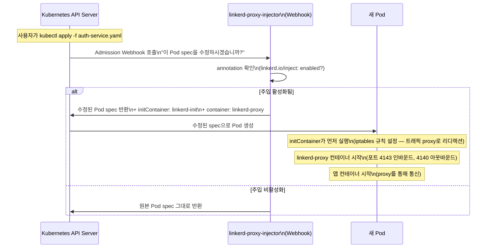
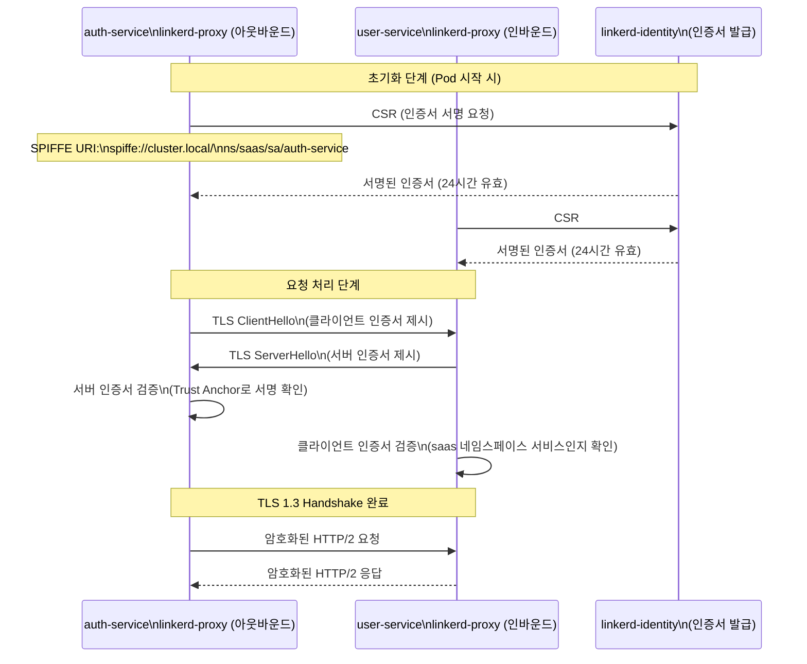

# Linkerd — 서비스 메시와 mTLS 자동 암호화

> **버전**: 1.0.0 | **작성일**: 2026-04-12
> **대상**: 신규 개발자, DevOps 엔지니어, 보안 담당자
> **CSAP**: D-09 (전송 암호화 — TLS 1.3+), D-08 (접근 통제 — Zero Trust mTLS)
> **관련 파일**: `infra/linkerd/`, `infra/linkerd/install.sh`, `infra/linkerd/values.yaml`

---

## 목차

1. [서비스 메시가 왜 필요한가](#1-서비스-메시가-왜-필요한가)
2. [Linkerd vs Istio — 선택 이유](#2-linkerd-vs-istio--선택-이유)
3. [mTLS: 서비스 간 자동 암호화](#3-mtls-서비스-간-자동-암호화)
4. [이 프로젝트의 Linkerd 설치](#4-이-프로젝트의-linkerd-설치)
5. [linkerd inject 작동 원리](#5-linkerd-inject-작동-원리)
6. [Linkerd Dashboard와 모니터링 명령어](#6-linkerd-dashboard와-모니터링-명령어)
7. [ServiceProfile과 RetryBudget](#7-serviceprofile과-retrybudget)
8. [AuthorizationPolicy — Zero Trust 접근 제어](#8-authorizationpolicy--zero-trust-접근-제어)
9. [새 서비스에 Linkerd 활성화하는 방법](#9-새-서비스에-linkerd-활성화하는-방법)
10. [자주 발생하는 문제와 해결법](#10-자주-발생하는-문제와-해결법)

---

## 1. 서비스 메시가 왜 필요한가

### 1.1 비유: 마을의 도로 시스템

```
[서비스 메시가 없는 상황 — 도로 없이 집과 집이 직접 연결]

  auth-service ──────────────────→ user-service
       ↑                                 ↑
       │ 문제 발생!                      │
       │ · 암호화 없음 (평문 HTTP)       │
       │ · 누가 보냈는지 알 수 없음      │
       │ · 연결 실패 시 재시도 없음      │
       │ · 트래픽 통계 없음              │
       └─────────────────────────────────┘

[Linkerd 서비스 메시 — 도로망 구축]

  auth-service ─→ [proxy] ══════════════ [proxy] ─→ user-service
                    ↑                      ↑
                    │ Linkerd가 제공:       │
                    │ · 자동 mTLS (암호화)  │
                    │ · 인증서 기반 신원    │
                    │ · 자동 재시도·타임아웃│
                    │ · 실시간 트래픽 통계  │
                    └──────────────────────┘
```

### 1.2 구체적으로 해결하는 문제

| 문제 | Linkerd가 없을 때 | Linkerd가 있을 때 |
|------|-----------------|-----------------|
| 서비스 간 암호화 | 각 서비스가 직접 TLS 구현 필요 | 자동 mTLS (코드 변경 없음) |
| 신원 인증 | 서비스 A가 B인지 확인 불가 | 인증서 기반 신원 자동 검증 |
| 실패 처리 | 각 서비스가 재시도 로직 직접 구현 | ServiceProfile로 선언적 재시도 |
| 트래픽 가시성 | 서비스마다 다른 로깅 형식 | 통일된 메트릭, 성공률, 레이턴시 |
| 접근 제어 | 코드 레벨 IP 필터링 | AuthorizationPolicy로 Zero Trust |

### 1.3 서비스 메시 토폴로지

```mermaid
graph TB
    subgraph CLUSTER["k3s 클러스터"]
        subgraph CP["Linkerd 컨트롤 플레인 (linkerd 네임스페이스)"]
            DEST["linkerd-destination\nmTLS 인증서 배포"]
            IDENT["linkerd-identity\n워크로드 인증서 발급\n(24시간 자동 회전)"]
            PROXY_INJ["linkerd-proxy-injector\nsidecar 자동 주입"]
        end

        subgraph SAAS["saas 네임스페이스"]
            subgraph AUTH_POD["auth-service Pod"]
                AUTH_APP["auth-service\n컨테이너\n:3001"]
                AUTH_PROXY["linkerd-proxy\nsidecar\n:4143(in) :4140(out)"]
            end

            subgraph USER_POD["user-service Pod"]
                USER_APP["user-service\n컨테이너\n:3002"]
                USER_PROXY["linkerd-proxy\nsidecar\n:4143(in) :4140(out)"]
            end
        end

        AUTH_PROXY <-->|mTLS (TLS 1.3)| USER_PROXY
        IDENT -->|인증서 주입| AUTH_PROXY
        IDENT -->|인증서 주입| USER_PROXY
    end

    style CP fill:#e8f5e9
    style AUTH_PROXY fill:#fff3e0
    style USER_PROXY fill:#fff3e0
```

---

## 2. Linkerd vs Istio — 선택 이유

### 2.1 비교표

| 특성 | Linkerd v2.16 | Istio v1.23 |
|------|-------------|------------|
| 설치 복잡도 | 낮음 (Helm 2개 명령) | 높음 (IstioOperator CRD) |
| 메모리 사용 (proxy) | 10~20Mi | 50~100Mi |
| CPU 사용 (proxy) | 10~50m | 50~200m |
| 학습 곡선 | 낮음 | 높음 (Envoy 설정 복잡) |
| mTLS 기본값 | 메시 주입 즉시 자동 활성화 | 별도 PeerAuthentication 설정 필요 |
| 한국어 문서 | 부족 | 상대적으로 풍부 |
| WSL2 환경 | 경량으로 적합 | 리소스 부담 |

### 2.2 이 프로젝트가 Linkerd를 선택한 이유

```
1. WSL2 단일 노드 환경: 리소스 제약으로 Istio proxy(100Mi+)는 과도
   → Linkerd proxy: 10Mi 요청, 50Mi 제한

2. 설정 복잡도: 공공 SaaS는 CSAP 감리 문서화 부담이 큰데,
   Istio의 복잡한 설정은 감리 설명 자체가 어려움
   → Linkerd: YAML 몇 줄로 선언적 구성

3. mTLS 기본 활성화: 네임스페이스 annotation 1개로 전체 메시 암호화
   → CSAP D-09 요건(TLS 1.3+) 즉시 충족

4. 운영 안정성: Linkerd는 CNCF Graduated 프로젝트
   → 성숙도 및 장기 지원 보장
```

---

## 3. mTLS: 서비스 간 자동 암호화

### 3.1 mTLS란

mTLS(Mutual TLS)는 일반 TLS의 단방향 인증과 달리, **서버와 클라이언트 양쪽이 모두 인증서로 신원을 증명**하는 방식입니다.

```
일반 HTTPS (단방향 TLS):
  클라이언트 ─→ "서버 인증서 주세요"
  서버 ─→ [인증서] "저는 auth-service.saas.cluster.local 입니다"
  클라이언트 ─→ "OK, 신뢰합니다" → 암호화 통신 시작
  (클라이언트는 누구인지 증명 안 함)

mTLS (상호 TLS):
  클라이언트 ─→ "서버 인증서 주세요"
  서버 ─→ [인증서] "저는 user-service 입니다. 당신의 인증서는?"
  클라이언트 ─→ [인증서] "저는 auth-service 입니다"
  양쪽 모두 인증 → 암호화 통신 시작
```

### 3.2 Linkerd 3계층 인증서 구조

```
Trust Anchor (Root CA)
  유효기간: 10년
  보관: 오프라인 (git 커밋 금지)
  파일: infra/linkerd/certs/ca.crt (공개키만)
  역할: 모든 신뢰의 출발점
    │
    ▼
Identity Issuer (Intermediate CA)
  유효기간: 1년
  보관: Kubernetes Secret (linkerd 네임스페이스)
  파일: infra/linkerd/certs/issuer.crt
  역할: 워크로드 인증서 서명
    │
    ▼
워크로드 인증서 (Leaf Certificate)
  유효기간: 24시간 (자동 회전)
  보관: linkerd-proxy 메모리 내
  형식: SPIFFE URI (spiffe://cluster.local/ns/saas/sa/auth-service)
  역할: 실제 서비스 신원 증명
```

```bash
# 현재 인증서 상태 확인
linkerd check --proxy
# 모든 항목이 ✓이어야 함
```

### 3.3 CSAP D-09 충족 근거

```
CSAP D-09 요건: 전송 암호화 (TLS 1.3 이상)

Linkerd mTLS 스펙:
  - 암호화 프로토콜: TLS 1.3 (명시적 하향 불허)
  - 암호 수트: ECDHE + AES-256-GCM (최신 권장 수트)
  - 인증서 알고리즘: ECDSA P-256
  - 인증서 회전: 24시간 자동 (수동 갱신 실수 방지)

결론: Linkerd 메시 주입된 네임스페이스의 모든 서비스 간 통신은
      TLS 1.3으로 자동 암호화 → CSAP D-09 완전 충족
```

---

## 4. 이 프로젝트의 Linkerd 설치

### 4.1 설치 스크립트 구조

```bash
# infra/linkerd/install.sh — 단계별 설치
# Design Ref: MTU-N54 Section 3.1

# 실행
chmod +x infra/linkerd/install.sh
infra/linkerd/install.sh
```

스크립트가 자동으로 수행하는 7단계:

```
Step 1: Linkerd CLI 설치 (v2.16.0)
Step 2: step CLI 확인 (인증서 생성 도구)
Step 3: Trust Anchor + Identity Issuer 인증서 생성
Step 4: Linkerd CRDs 설치 (Helm)
Step 5: Linkerd Control Plane 설치 (Helm)
Step 6: Linkerd Viz 대시보드 설치
Step 7: saas 네임스페이스에 메시 주입 annotation 설정
```

### 4.2 Trust Anchor 인증서 수동 생성

```bash
# step CLI 설치 (Ubuntu/Debian)
wget https://dl.smallstep.com/gh-release/cli/docs-cli-install/v0.27.4/step-cli_0.27.4_amd64.deb
sudo dpkg -i step-cli_0.27.4_amd64.deb

# Trust Anchor (Root CA) 생성 — 10년 유효
# 주의: ca.key는 절대 git에 커밋하지 말 것
step certificate create root.linkerd.cluster.local \
  infra/linkerd/certs/ca.crt \
  infra/linkerd/certs/ca.key \
  --profile root-ca \
  --no-password --insecure \
  --not-after=87600h

# Identity Issuer (Intermediate CA) 생성 — 1년 유효
step certificate create identity.linkerd.cluster.local \
  infra/linkerd/certs/issuer.crt \
  infra/linkerd/certs/issuer.key \
  --profile intermediate-ca \
  --not-after=8760h \
  --no-password --insecure \
  --ca infra/linkerd/certs/ca.crt \
  --ca-key infra/linkerd/certs/ca.key

# 생성된 인증서 검증
step certificate inspect infra/linkerd/certs/ca.crt --short
step certificate inspect infra/linkerd/certs/issuer.crt --short
```

### 4.3 Helm으로 Control Plane 설치

```bash
# Helm 저장소 추가
helm repo add linkerd https://helm.linkerd.io/stable
helm repo update

# Step 1: CRDs 먼저 설치
helm install linkerd-crds linkerd/linkerd-crds \
  -n linkerd --create-namespace --wait

# Step 2: Control Plane 설치 (인증서 파일 참조)
helm install linkerd-control-plane linkerd/linkerd-control-plane \
  -n linkerd \
  --set-file identityTrustAnchorsPEM=infra/linkerd/certs/ca.crt \
  --set-file identity.issuer.tls.crtPEM=infra/linkerd/certs/issuer.crt \
  --set-file identity.issuer.tls.keyPEM=infra/linkerd/certs/issuer.key \
  -f infra/linkerd/values.yaml \
  --wait --timeout 5m

# Step 3: Viz 대시보드 설치
helm install linkerd-viz linkerd/linkerd-viz \
  -n linkerd-viz --create-namespace \
  --set prometheus.enabled=false \
  --set prometheusUrl="http://kube-prometheus-stack-prometheus.monitoring:9090" \
  --wait --timeout 5m
```

### 4.4 설치 확인

```bash
# Control Plane 상태 확인
linkerd check
# kubernetes-api                   [✓]
# linkerd-existence                [✓]
# linkerd-version                  [✓]
# linkerd-identity                 [✓]
# linkerd-proxy-injector           [✓]
# All checks passed!

# Control Plane Pod 상태
kubectl get pods -n linkerd
# NAME                                     READY   STATUS
# linkerd-destination-xxxxxxxxx-xxxxx      2/2     Running
# linkerd-identity-xxxxxxxxx-xxxxx         2/2     Running
# linkerd-proxy-injector-xxxxxxxxx-xxxxx   2/2     Running
```

### 4.5 values.yaml — 이 프로젝트 설정

```yaml
# infra/linkerd/values.yaml
# Design Ref: MTU-N54 Section 3.3
# CSAP: D-09 암호화 (서비스 간 mTLS)

identity:
  issuer:
    scheme: kubernetes.io/tls
    clockSkewAllowance: 20s
    issuanceLifetime: 24h0m0s    # 워크로드 인증서 24시간 유효

# 컨트롤 플레인 리소스 (WSL2 최적화)
controllerResources: &controller_resources
  cpu:
    request: 50m
    limit: 250m
  memory:
    request: 64Mi
    limit: 256Mi

# 데이터 플레인 proxy 리소스 (경량화)
proxy:
  resources:
    cpu:
      request: 10m
      limit: 100m
    memory:
      request: 10Mi
      limit: 50Mi
  logLevel: warn
  logFormat: json
  # 불투명 포트: TCP 레벨 mTLS (Redis:6379, PostgreSQL:5432 포함)
  opaquePorts: "25,443,587,3306,5432,6379,11211"

enableHA: false                  # WSL2 단일 노드: HA 불필요
prometheusUrl: "http://kube-prometheus-stack-prometheus.monitoring:9090"
```

---

## 5. linkerd inject 작동 원리

### 5.1 네임스페이스 annotation으로 자동 주입

Linkerd는 Pod를 수동으로 변경하지 않습니다. 네임스페이스에 annotation을 붙이면 해당 네임스페이스에 새로 생성되는 모든 Pod에 sidecar가 자동 주입됩니다.

```bash
# saas 네임스페이스에 메시 주입 활성화
kubectl annotate namespace saas linkerd.io/inject=enabled

# 확인
kubectl get ns saas -o jsonpath='{.metadata.annotations.linkerd\.io/inject}'
# enabled

# 활성화 후 기존 Deployment를 롤링 재시작하여 sidecar 주입
kubectl rollout restart deployment -n saas
```

### 5.2 sidecar 주입 과정 상세



### 5.3 주입 후 Pod 구조

```bash
# 주입 전 Pod: 컨테이너 1개
kubectl describe pod auth-service-xxx -n saas | grep -A5 "Containers:"
# Containers:
#   auth-service:
#     Image: localhost:8080/public-saas/auth-service:v1.2.3
#     Ports: 3001/TCP

# 주입 후 Pod: 컨테이너 3개 (앱 + 2개의 Linkerd 컴포넌트)
kubectl describe pod auth-service-xxx -n saas | grep -A5 "Containers:"
# Init Containers:
#   linkerd-init:        ← iptables 설정 (초기화 후 종료)
# Containers:
#   linkerd-proxy:       ← 트래픽 처리 sidecar (항상 실행)
#   auth-service:        ← 실제 애플리케이션

# Pod 내 컨테이너 목록 확인
kubectl get pod auth-service-xxx -n saas -o jsonpath='{.spec.containers[*].name}'
# linkerd-proxy auth-service
```

### 5.4 트래픽 흐름 (iptables 리디렉션)

```
외부 요청 → Pod IP:3001
             ↓ iptables REDIRECT (linkerd-init이 설정)
           linkerd-proxy :4143 (인바운드)
             ↓ mTLS 복호화 + 연결 인증
           auth-service :3001 (실제 앱)
             ↓ 로컬호스트 통신 (암호화 불필요)

앱 → user-service 요청
     ↓ iptables REDIRECT
   linkerd-proxy :4140 (아웃바운드)
     ↓ mTLS 암호화 + 상대방 인증
   user-service linkerd-proxy :4143
     ↓ mTLS 복호화
   user-service :3002
```

---

## 6. Linkerd Dashboard와 모니터링 명령어

### 6.1 Linkerd Viz 대시보드 접근

```bash
# 대시보드 접근 (포트 포워딩 자동 설정)
linkerd viz dashboard &
# Linkerd dashboard available at:
# http://localhost:50750

# 또는 직접 포트 포워딩
kubectl port-forward -n linkerd-viz svc/web 8084:8084 &
# http://localhost:8084
```

대시보드에서 확인할 수 있는 것:
- **Namespace 개요**: 각 네임스페이스의 메시 주입 현황
- **서비스 맵**: 서비스 간 트래픽 흐름 그래프
- **성공률(Success Rate)**: 서비스별 HTTP 200/5xx 비율
- **요청률(RPS)**: 초당 요청 수
- **P50/P95/P99 레이턴시**: 응답 시간 분포

### 6.2 linkerd check — 상태 확인

```bash
# 전체 상태 확인 (Control Plane + 데이터 플레인)
linkerd check
# ✓ kubernetes-api
# ✓ linkerd-existence
# ✓ linkerd-identity
# ✓ linkerd-proxy-injector
# ✓ All checks passed!

# Proxy 상태만 확인
linkerd check --proxy

# Viz 확장 상태 확인
linkerd viz check
```

### 6.3 linkerd viz stat — 트래픽 통계

```bash
# 네임스페이스 내 모든 서비스 통계
linkerd viz stat deploy -n saas
# NAME                MESHED   SUCCESS   RPS     LATENCY_P50   LATENCY_P99
# auth-service        1/1      100.00%   23.4/s  4ms           18ms
# user-service        1/1      99.87%    45.2/s  3ms           12ms
# notification-svc    1/1      100.00%   5.8/s   8ms           35ms

# 특정 서비스로 들어오는 트래픽
linkerd viz stat -n saas deploy/auth-service --from deploy/api-gateway

# 특정 서비스에서 나가는 트래픽
linkerd viz stat -n saas deploy/auth-service --to deploy/user-service

# 실시간 트래픽 탭 (Tap) — 실제 요청 헤더/응답 확인
linkerd viz tap deploy/auth-service -n saas
# req id=0:1 proxy=in  src=10.42.1.7:52048 dst=10.42.1.8:3001
#   :method=POST :path=/api/auth/login :authority=auth-service
# rsp id=0:1 proxy=in  src=10.42.1.7:52048 dst=10.42.1.8:3001
#   :status=200 latency=4ms
```

### 6.4 mTLS 암호화 확인

```bash
# 두 서비스 간 mTLS 활성화 여부 확인
linkerd viz edges deploy -n saas
# SRC               DST               CLIENT                      SERVER
# api-gateway       auth-service      saas/api-gateway            saas/auth-service
# auth-service      user-service      saas/auth-service           saas/user-service
# (자물쇠 아이콘이 있으면 mTLS 활성화)

# 특정 서비스의 mTLS 인증서 확인
linkerd viz stat authz deploy/auth-service -n saas
```

---

## 7. ServiceProfile과 RetryBudget

### 7.1 ServiceProfile이란

ServiceProfile은 각 서비스의 라우트별 타임아웃, 재시도 정책을 선언적으로 정의합니다.

```yaml
# infra/linkerd/service-profiles/auth-service.yaml
# Design Ref: MTU-N54 Section 3.4
# CSAP: D-08 접근 통제

apiVersion: linkerd.io/v1alpha2
kind: ServiceProfile
metadata:
  name: auth-service.saas.svc.cluster.local
  namespace: saas
spec:
  routes:
    - name: POST /api/auth/login
      condition:
        method: POST
        pathRegex: /api/auth/login
      timeout: 5s
      isRetryable: false     # 로그인은 재시도 금지 (중복 로그인 방지)

    - name: POST /api/auth/token/refresh
      condition:
        method: POST
        pathRegex: /api/auth/token/refresh
      timeout: 5s
      isRetryable: true      # 토큰 갱신은 재시도 허용

    - name: GET /api/auth/verify
      condition:
        method: GET
        pathRegex: /api/auth/verify
      timeout: 3s
      isRetryable: true

  retryBudget:
    retryRatio: 0.2          # 전체 요청의 최대 20%만 재시도
    minRetriesPerSecond: 10  # 초당 최소 10회 재시도 보장
    ttl: 10s
```

### 7.2 RetryBudget 주요 설정

```yaml
# infra/linkerd/retry-budget/enhanced-profiles.yaml
# 감사 서비스: 재시도 최소화 (감사 로그 중복 방지)
apiVersion: linkerd.io/v1alpha2
kind: ServiceProfile
metadata:
  name: audit-service.saas-system.svc.cluster.local
spec:
  retryBudget:
    retryRatio: 0.05         # 5%만 재시도 (감사 로그 중복 위험)
    minRetriesPerSecond: 5
    ttl: 60s
  routes:
    - name: POST /api/v1/audit/events
      timeout: 15s
      isRetryable: false     # 감사 이벤트 중복 방지: 재시도 완전 금지
```

---

## 8. AuthorizationPolicy — Zero Trust 접근 제어

### 8.1 기본 거부(Default Deny) 정책

```yaml
# infra/linkerd/authorization/default-deny.yaml
# Design Ref: MTU-N54 Section 3.5
# CSAP: D-08 접근 통제 (기본 거부, 명시적 허용만)

apiVersion: policy.linkerd.io/v1beta3
kind: AuthorizationPolicy
metadata:
  name: default-deny
  namespace: saas
spec:
  targetRef:
    group: policy.linkerd.io
    kind: Server
    name: ""              # 모든 서버에 적용
  requiredAuthenticationRefs:
    - name: mesh-only
      kind: MeshTLSAuthentication
      group: policy.linkerd.io
---
# 메시 내 서비스 인증만 허용
apiVersion: policy.linkerd.io/v1alpha1
kind: MeshTLSAuthentication
metadata:
  name: mesh-only
  namespace: saas
spec:
  identities:
    - "*.saas.serviceaccount.identity.linkerd.cluster.local"
```

### 8.2 서비스별 명시적 허용

```yaml
# infra/linkerd/authorization/auth-service-policy.yaml

# Server 정의: auth-service Pod와 포트
apiVersion: policy.linkerd.io/v1beta3
kind: Server
metadata:
  name: auth-service-server
  namespace: saas
spec:
  podSelector:
    matchLabels:
      app: auth-service
  port: http
  proxyProtocol: HTTP/2

---
# MeshTLSAuthentication: 메시 내 서비스만 접근 허용
apiVersion: policy.linkerd.io/v1alpha1
kind: MeshTLSAuthentication
metadata:
  name: auth-service-mtls
  namespace: saas
spec:
  identities:
    - "*.saas.serviceaccount.identity.linkerd.cluster.local"

---
# AuthorizationPolicy: auth-service-server에 대해 mTLS 인증 요구
apiVersion: policy.linkerd.io/v1beta3
kind: AuthorizationPolicy
metadata:
  name: auth-service-policy
  namespace: saas
spec:
  targetRef:
    group: core
    kind: Server
    name: auth-service-server
  requiredAuthenticationRefs:
    - name: auth-service-mtls
      kind: MeshTLSAuthentication
      group: policy.linkerd.io
```

---

## 9. 새 서비스에 Linkerd 활성화하는 방법

### 9.1 체크리스트

```
새 서비스를 Linkerd 메시에 추가할 때:

□ 1. 네임스페이스 annotation 확인
□ 2. Deployment YAML에 annotation 없어도 됨 (네임스페이스 레벨 설정 상속)
□ 3. Service 리소스 정의
□ 4. ServiceProfile YAML 작성 (infra/linkerd/service-profiles/)
□ 5. AuthorizationPolicy 작성 (infra/linkerd/authorization/)
□ 6. 배포 후 linkerd check --proxy 확인
```

### 9.2 단계별 실행

```bash
# Step 1: 네임스페이스 annotation 확인 (이미 설정됨)
kubectl get ns saas -o jsonpath='{.metadata.annotations}'
# {"linkerd.io/inject":"enabled"}

# Step 2: 새 서비스 배포 (annotation 자동 상속)
kubectl apply -f platform/services/my-new-service/k8s/

# Step 3: sidecar 주입 확인
kubectl get pods -n saas | grep my-new-service
# my-new-service-xxx   2/2   Running   ← 2/2이면 sidecar 포함

# Pod 내 컨테이너 확인
kubectl get pod my-new-service-xxx -n saas \
  -o jsonpath='{.spec.containers[*].name}'
# linkerd-proxy my-new-service

# Step 4: mTLS 통신 확인
linkerd viz edges deploy/my-new-service -n saas
```

### 9.3 특정 Pod만 메시 제외 (필요 시)

```yaml
# 특정 Pod를 메시에서 제외 (Redis, PostgreSQL 등 내부 인프라)
apiVersion: apps/v1
kind: Deployment
metadata:
  name: redis
spec:
  template:
    metadata:
      annotations:
        linkerd.io/inject: disabled    # 이 Pod만 메시 제외
```

### 9.4 ServiceProfile 템플릿

새 서비스 추가 시 복사하여 사용:

```yaml
# infra/linkerd/service-profiles/{service-name}.yaml
apiVersion: linkerd.io/v1alpha2
kind: ServiceProfile
metadata:
  name: {service-name}.saas.svc.cluster.local
  namespace: saas
spec:
  routes:
    - name: GET /api/v1/{resource}
      condition:
        method: GET
        pathRegex: /api/v1/{resource}
      timeout: 5s
      isRetryable: true

    - name: POST /api/v1/{resource}
      condition:
        method: POST
        pathRegex: /api/v1/{resource}
      timeout: 10s
      isRetryable: false    # 쓰기 작업은 재시도 금지 (중복 데이터 방지)

  retryBudget:
    retryRatio: 0.2
    minRetriesPerSecond: 10
    ttl: 10s
```

---

## 10. 자주 발생하는 문제와 해결법

### 문제 1: sidecar가 주입되지 않음 (2/2 대신 1/1)

```bash
# 증상
kubectl get pods -n saas | grep my-service
# my-service-xxx   1/1   Running   ← 사이드카 없음!

# 진단 1: 네임스페이스 annotation 확인
kubectl get ns saas --show-labels | grep inject
# linkerd.io/inject이 없으면 annotation 추가 필요

# 진단 2: Pod annotation 확인 (disabled로 명시되어 있을 수 있음)
kubectl get pod my-service-xxx -n saas \
  -o jsonpath='{.metadata.annotations.linkerd\.io/inject}'
# "disabled"이면 Deployment spec.template.metadata.annotations에서 제거

# 해결: 네임스페이스 annotation 추가 후 롤링 재시작
kubectl annotate namespace saas linkerd.io/inject=enabled --overwrite
kubectl rollout restart deployment/my-service -n saas
```

### 문제 2: mTLS 인증 실패 — certificate expired

```bash
# 증상
linkerd check
# ✗ issuer cert is within its validity period
#   issuer certificate is not valid anymore

# 진단: 인증서 만료일 확인
kubectl get secret linkerd-identity-issuer -n linkerd \
  -o jsonpath='{.data.tls\.crt}' | base64 -d | openssl x509 -noout -dates
# notAfter=Apr 11 08:00:00 2026 GMT  ← 만료됨!

# 해결: Identity Issuer 인증서 갱신
# Step 1: 새 Issuer 인증서 생성 (Trust Anchor 재사용)
step certificate create identity.linkerd.cluster.local \
  infra/linkerd/certs/issuer-new.crt \
  infra/linkerd/certs/issuer-new.key \
  --profile intermediate-ca --not-after=8760h \
  --no-password --insecure \
  --ca infra/linkerd/certs/ca.crt \
  --ca-key infra/linkerd/certs/ca.key

# Step 2: Secret 업데이트
kubectl create secret tls linkerd-identity-issuer \
  -n linkerd \
  --cert=infra/linkerd/certs/issuer-new.crt \
  --key=infra/linkerd/certs/issuer-new.key \
  --dry-run=client -o yaml | kubectl apply -f -

# Step 3: Control Plane 재시작
kubectl rollout restart deploy -n linkerd
```

### 문제 3: latency spike — proxy 설정 오류

```bash
# 증상: P99 레이턴시가 갑자기 수 초로 증가
linkerd viz stat deploy/auth-service -n saas
# LATENCY_P99: 3200ms  ← 정상(18ms)에서 급등

# 진단 1: proxy 리소스 부족 여부
kubectl top pods -n saas | grep linkerd-proxy
# 또는
kubectl describe pod auth-service-xxx -n saas | grep -A10 "linkerd-proxy"

# 진단 2: 재시도 스톰 발생 여부 (RetryBudget 초과)
linkerd viz stat deploy/auth-service -n saas
# EFFECTIVE_SUCCESS가 낮고 ACTUAL_SUCCESS가 높으면 재시도 과다

# 해결 A: proxy 리소스 증가 (values.yaml)
# proxy.resources.limits.memory: 128Mi → 256Mi

# 해결 B: RetryBudget 축소 (재시도 폭풍 방지)
# retryRatio: 0.2 → 0.05

# 해결 C: 타임아웃 조정
# timeout: 5s → 10s (upstream 서비스가 느린 경우)
```

### 문제 4: 503 no endpoints available

```bash
# 증상: 서비스 호출 시 503 오류
# message: "no endpoints available for service"

# 진단: 상대방 서비스 Pod 상태
kubectl get pods -n saas | grep user-service
# user-service-xxx   0/2   CrashLoopBackOff  ← 다운됨

# 진단: 메시 에지 확인
linkerd viz edges deploy/auth-service -n saas
# auth-service → user-service: 연결 없음

# 해결: 상대방 서비스 복구 후 연결 자동 재설정
kubectl rollout restart deployment/user-service -n saas
kubectl rollout status deployment/user-service -n saas

# 서킷 브레이커 상태 확인 (Linkerd에는 서킷 브레이커 없음 → 애플리케이션 레벨 처리)
```

### mTLS 핸드셰이크 흐름 (정상 동작 참고)



---

다음 단계: 4장 학습을 모두 완료했습니다. `docs/guides/onboarding/03-development/03-testing-guide.md`에서 테스트 전략과 Q-Gate G4 통과 방법을 학습합니다.
