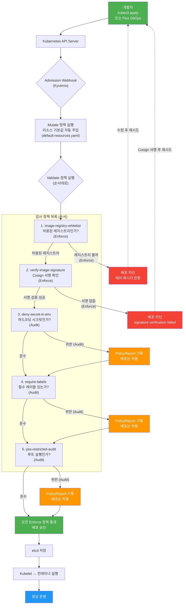

# Kyverno — 쿠버네티스 네이티브 정책 엔진

> **버전**: 1.0.0 | **작성일**: 2026-04-12
> **대상**: DevOps 엔지니어, 신규 개발자
> **전제 조건**: `06-linkerd.md` 완료, Kubernetes 기본 지식
> **소요 시간**: 약 90분
> **Design Ref**: MTU-N31, MTU-N75
> **CSAP**: D-05 (공급망), D-06 (감사), D-08 (접근 통제), D-11 (가상화), D-12 (개발 보안)

---

## 목차

1. [Kyverno란?](#1-kyverno란)
2. [OPA vs Kyverno — 어떤 것을 선택해야 하는가](#2-opa-vs-kyverno--어떤-것을-선택해야-하는가)
3. [이 프로젝트의 Kyverno 정책 목록](#3-이-프로젝트의-kyverno-정책-목록)
4. [정책 위반 시 배포 차단 동작](#4-정책-위반-시-배포-차단-동작)
5. [정책 예외(Exception) 설정 방법](#5-정책-exceptionexception-설정-방법)
6. [새 정책 추가하는 방법](#6-새-정책-추가하는-방법)
7. [유용한 kubectl 명령어](#7-유용한-kubectl-명령어)
8. [dry-run으로 정책 테스트](#8-dry-run으로-정책-테스트)
9. [배포 요청 검증 플로우](#9-배포-요청-검증-플로우)

---

## 1. Kyverno란?

### 1.1 한 줄 정의

Kyverno(카이베르노)는 **Kubernetes 네이티브 정책 엔진**입니다. Kubernetes 클러스터에 배포되는 모든 리소스(Pod, Deployment 등)가 정해진 보안 규칙을 준수하는지 자동으로 검사하고, 위반 시 배포 자체를 차단합니다.

### 1.2 쉬운 비유

```
건물 입주 심사관에 비유:

  일반 배포 (Kyverno 없음):
    개발자: "이 컨테이너 배포해주세요"
    k8s: "네, 바로 배포합니다"
    → 루트 권한 컨테이너도, 서명 없는 이미지도 배포됨

  Kyverno 있는 배포:
    개발자: "이 컨테이너 배포해주세요"
    Kyverno: "잠깐, 검사가 필요합니다.
              - 이미지에 Cosign 서명이 있나요? ✅
              - CPU/메모리 limits가 설정됐나요? ✅
              - 루트로 실행되나요? ❌ 차단!"
    k8s: "Kyverno가 거부했으므로 배포 불가"
```

### 1.3 Kyverno가 동작하는 원리

Kyverno는 Kubernetes **Admission Webhook** 메커니즘을 활용합니다.

```
배포 요청의 생애 주기:

  kubectl apply → API Server
                    ↓
              Admission Webhook
                    ↓
         [Kyverno Admission Controller]
              ↓             ↓
          정책 검사        정책 검사
           통과            실패
              ↓             ↓
         etcd 저장        요청 거부
         배포 진행        에러 메시지 반환
```

### 1.4 Kyverno의 3가지 정책 유형

| 정책 유형 | 역할 | 동작 |
|---------|------|------|
| `validate` | 규칙 위반 검사 | 위반 시 배포 차단 또는 경고 |
| `mutate` | 자동 설정 주입 | 누락된 설정을 자동으로 추가 |
| `generate` | 리소스 자동 생성 | 새 네임스페이스 생성 시 NetworkPolicy 자동 생성 |

### 1.5 Enforce vs Audit 모드

```
Enforce 모드 (validationFailureAction: Enforce):
  → 정책 위반 시 배포 즉시 차단
  → kubectl apply 명령이 에러와 함께 실패
  → CSAP 의무 항목에 적용

Audit 모드 (validationFailureAction: Audit):
  → 정책 위반 시 배포는 허용하되 PolicyReport에 기록
  → 위반 현황 파악용 (점진적 전환 중)
  → 새 정책 도입 초기에 사용
```

---

## 2. OPA vs Kyverno — 어떤 것을 선택해야 하는가

### 2.1 두 도구 비교

Kubernetes 정책 엔진으로 가장 많이 사용되는 두 가지는 **OPA/Gatekeeper**와 **Kyverno**입니다.

| 비교 항목 | OPA/Gatekeeper | Kyverno |
|---------|--------------|---------|
| **정책 언어** | Rego (전용 언어 학습 필요) | Kubernetes YAML (이미 알고 있음) |
| **학습 곡선** | 높음 (Rego는 Datalog 기반 논리형 언어) | 낮음 (YAML이면 충분) |
| **Kubernetes 통합** | 간접적 (CRD + Rego 분리) | 네이티브 (CRD 자체가 정책) |
| **mutate 기능** | 제한적 | 강력 (패치, 전략적 병합 모두 지원) |
| **generate 기능** | 없음 | 있음 |
| **이미지 검증** | 직접 구현 필요 | 내장 (Cosign 통합) |
| **성숙도** | 높음 (CNCF Graduated) | 높음 (CNCF Graduated) |
| **공공기관 채택** | 일부 | 증가 추세 |

### 2.2 이 프로젝트가 Kyverno를 선택한 이유

```
결정 근거 (MTU-N31 Plan 문서):

  1. 팀 YAML 친숙도 > Rego 학습 비용
     → 모든 개발자가 YAML을 알고 있음
     → Rego 학습에 수주 소요 vs Kyverno 당일 적용 가능

  2. Cosign 이미지 서명 검증 내장
     → OPA는 Cosign 통합에 별도 구현 필요
     → Kyverno는 verifyImages 블록 한 줄로 해결

  3. mutate + generate의 필요성
     → 리소스 기본값 자동 주입 (default-resources.yaml)
     → 신규 네임스페이스에 NetworkPolicy 자동 생성

  결론: 공공기관 SaaS 특성(빠른 개발, 높은 보안 요건)에 Kyverno가 적합
```

### 2.3 OPA가 더 나은 경우

```
OPA를 고려해야 하는 상황:
  → 매우 복잡한 비즈니스 로직 기반 정책 (조건이 10개 이상)
  → 외부 데이터 참조가 필요한 정책 (OPA Bundle)
  → 이미 OPA 경험이 풍부한 팀
  → Kubernetes 외부 시스템(API, Terraform 등)에도 정책 적용 필요
```

---

## 3. 이 프로젝트의 Kyverno 정책 목록

모든 정책 파일은 `infra/kyverno/` 디렉토리에 있습니다.

### 3.1 정책 전체 목록

```
infra/kyverno/
├── values.yaml                           # Kyverno Helm Chart 설정
├── verify-image-signature.yaml           # Cosign 이미지 서명 검증
├── verify-provenance.yaml                # SLSA 증명 검증
├── require-labels.yaml                   # 필수 레이블 요구
├── policy-reporter-values.yaml           # PolicyReport 수집기
└── policies/
    ├── pss-restricted-audit.yaml         # PSS Restricted 프로필 감사
    └── admission-security/
        ├── default-resources.yaml        # 리소스 기본값 자동 주입
        ├── deny-secret-env.yaml          # 시크릿 환경변수 직접 삽입 금지
        ├── image-registry-whitelist.yaml # 허용 레지스트리 제한
        └── require-labels.yaml           # 감사 추적용 레이블
```

### 3.2 정책 1: Cosign 이미지 서명 검증

**파일**: `infra/kyverno/verify-image-signature.yaml`
**모드**: Enforce (위반 시 배포 차단)
**CSAP**: D-05-03, D-12-08

```yaml
# 핵심 동작 설명
apiVersion: kyverno.io/v1
kind: ClusterPolicy
metadata:
  name: verify-image-signature
spec:
  validationFailureAction: Enforce  # 미서명 이미지 = 즉시 차단
  rules:
    - name: verify-cosign-signature
      match:
        any:
          - resources:
              kinds: [Pod]
              namespaces: [saas-platform]
      verifyImages:
        - imageReferences:
            - "localhost:8080/public-saas/*"  # 우리 Harbor 레지스트리만
          attestors:
            - entries:
                - keys:
                    publicKeys: |   # CI 파이프라인의 Cosign 공개키
                      -----BEGIN PUBLIC KEY-----
                      ...
                      -----END PUBLIC KEY-----
```

```
이 정책이 막는 공격:
  → 공격자가 Harbor 계정 탈취 후 악성 이미지 업로드
  → 개발자 실수로 서명 없이 빌드된 이미지 배포
  → 외부 레지스트리(Docker Hub 등)의 이미지 직접 배포

동작 흐름:
  kubectl apply deployment.yaml
    → Kyverno: "이미지의 Cosign 서명 확인 중..."
    → 서명 있음 → 배포 허용
    → 서명 없음 → "image signature verification failed" 에러
```

### 3.3 정책 2: 리소스 제한 필수 (자동 주입)

**파일**: `infra/kyverno/policies/admission-security/default-resources.yaml`
**모드**: Mutate (자동 주입)
**CSAP**: D-12

```yaml
apiVersion: kyverno.io/v1
kind: ClusterPolicy
metadata:
  name: default-resources
spec:
  rules:
    - name: set-default-resources
      match:
        any:
          - resources:
              kinds: [Pod]
      exclude:
        any:
          - resources:
              namespaces: [kube-system, monitoring]
      mutate:
        patchStrategicMerge:
          spec:
            containers:
              - (name): "*"
                resources:
                  requests:
                    +(cpu): "50m"      # 이미 설정된 경우 덮어쓰지 않음 (+)
                    +(memory): "64Mi"
                  limits:
                    +(cpu): "200m"
                    +(memory): "256Mi"
```

```
이 정책의 효과:
  → requests/limits 없는 Pod 배포 시 자동으로 기본값 주입
  → 리소스 제한 없는 Pod가 CPU/메모리를 독점하는 것 방지
  → 클러스터 노드 Out of Memory 방지

개발자 행동 기준:
  → 기본값으로 충분한 경우: 아무것도 하지 않아도 됨
  → 더 많은 리소스가 필요한 경우: Deployment에 명시적으로 설정
  → 기본값보다 적게 필요한 경우: 명시적으로 낮게 설정 (기본값 덮어씀)
```

### 3.4 정책 3: 루트 컨테이너 금지

**파일**: `infra/kyverno/policies/pss-restricted-audit.yaml`
**모드**: Audit (기록 후 Enforce 전환 예정)
**CSAP**: D-08-05

```yaml
apiVersion: kyverno.io/v1
kind: ClusterPolicy
metadata:
  name: pss-restricted-audit
spec:
  validationFailureAction: Audit  # 현재 Audit, 향후 Enforce 전환 예정
  rules:
    - name: require-run-as-non-root
      match:
        any:
          - resources:
              kinds: [Pod]
              namespaces: [default, saas-apps, saas-data]
      validate:
        message: "Pod은 runAsNonRoot: true를 설정해야 합니다 (CSAP D-08)"
        pattern:
          spec:
            securityContext:
              runAsNonRoot: true

    - name: deny-privilege-escalation
      validate:
        message: "컨테이너는 allowPrivilegeEscalation: false를 설정해야 합니다"
        pattern:
          spec:
            containers:
              - securityContext:
                  allowPrivilegeEscalation: false
```

```
Dockerfile에서 루트 방지하는 방법:
  # ✅ 올바른 Dockerfile
  FROM node:22-alpine
  RUN addgroup -g 1001 appgroup && adduser -u 1001 -G appgroup -D appuser
  USER appuser  # root 대신 일반 사용자로 실행

Kubernetes Deployment에서:
  spec:
    template:
      spec:
        securityContext:
          runAsNonRoot: true
          runAsUser: 1001
          runAsGroup: 1001
        containers:
          - securityContext:
              allowPrivilegeEscalation: false
              capabilities:
                drop: ["ALL"]
```

### 3.5 정책 4: 최신 이미지 태그(:latest) 금지

**파일**: `infra/kyverno/policies/admission-security/image-registry-whitelist.yaml` (내부 포함)
**모드**: Enforce
**CSAP**: D-05, D-12

```yaml
# image-registry-whitelist.yaml에 포함된 :latest 금지 규칙
- name: deny-latest-tag
  match:
    any:
      - resources:
          kinds: [Pod]
          namespaces: [saas-platform, saas-apps]
  validate:
    message: ":latest 태그 사용 금지. SHA 다이제스트 또는 시맨틱 버전 태그 사용하십시오."
    deny:
      conditions:
        any:
          - key: "{{ images.containers.*.tag }}"
            operator: AnyIn
            value: ["latest", ""]
```

```
:latest 태그를 금지하는 이유:
  :latest 사용 시 문제:
    → 언제 빌드된 이미지인지 추적 불가
    → 같은 배포 파일로 다른 이미지가 실행될 수 있음
    → Cosign 서명 검증이 무의미해짐

  올바른 태그 전략:
    ❌ image: localhost:8080/public-saas/auth-service:latest
    ✅ image: localhost:8080/public-saas/auth-service:v1.2.3
    ✅ image: localhost:8080/public-saas/auth-service:84e230e  (git SHA)
    ✅ image: localhost:8080/public-saas/auth-service@sha256:abc123...
```

### 3.6 정책 5: 시크릿 환경변수 직접 삽입 금지

**파일**: `infra/kyverno/policies/admission-security/deny-secret-env.yaml`
**모드**: Audit (향후 Enforce 전환)
**CSAP**: D-09

```yaml
apiVersion: kyverno.io/v1
kind: ClusterPolicy
metadata:
  name: deny-secret-in-env
spec:
  validationFailureAction: Audit
  rules:
    - name: deny-hardcoded-secrets
      validate:
        message: >-
          SECRET, PASSWORD, API_KEY, TOKEN, CREDENTIAL 이름의 환경변수는
          직접 value를 설정할 수 없습니다. secretKeyRef를 사용하십시오.
        foreach:
          - list: "request.object.spec.containers[]"
            deny:
              conditions:
                all:
                  - key: "{{ element.env[?contains(name, 'SECRET') ...].value | length(@) }}"
                    operator: GreaterThan
                    value: 0
```

```yaml
# ❌ 정책 위반 — 환경변수에 직접 값 설정
env:
  - name: JWT_SECRET
    value: "hardcoded-secret-value"  # PolicyReport에 기록됨

# ✅ 정책 준수 — Secret 리소스 참조
env:
  - name: JWT_SECRET
    valueFrom:
      secretKeyRef:
        name: auth-service-secrets
        key: JWT_SECRET
```

### 3.7 정책 6: 허용된 레지스트리만 사용

**파일**: `infra/kyverno/policies/admission-security/image-registry-whitelist.yaml`
**모드**: Enforce
**CSAP**: D-05, D-08

```yaml
# 허용 레지스트리 목록
allowedRegistries:
  - "localhost:8080"           # Harbor (내부 레지스트리)
  - "registry.k8s.io"         # Kubernetes 공식 이미지
  - "ghcr.io/fluxcd"          # Flux GitOps 공식 이미지
  - "quay.io/kyverno"         # Kyverno 자체 이미지

# 차단되는 것:
#   - Docker Hub (docker.io/*)
#   - 개인 계정 레지스트리
#   - 알 수 없는 레지스트리
```

---

## 4. 정책 위반 시 배포 차단 동작

### 4.1 Enforce 모드 에러 메시지

Enforce 모드 정책을 위반하면 `kubectl apply` 명령이 즉시 실패합니다.

```bash
$ kubectl apply -f deployment.yaml

Error from server: error when creating "deployment.yaml":
admission webhook "validate.kyverno.svc-fail" denied the request:

resource Deployment/saas-platform/auth-service was blocked due to the following policies:

verify-image-signature:
  verify-cosign-signature: |
    failed to verify image localhost:8080/public-saas/auth-service:latest:
    .attestors[0].entries[0].keys: no matching signatures:
    signature verification failed
```

```bash
# 이미지 레지스트리 위반 예시
Error from server: admission webhook "validate.kyverno.svc-fail" denied the request:

restrict-image-registries:
  validate-image-registry: |
    validation error: 허용된 이미지 레지스트리만 사용 가능합니다.
    Harbor(localhost:8080), registry.k8s.io, ghcr.io/fluxcd만 허용.
    rule validate-image-registry failed at path /spec/containers/0/image/
```

### 4.2 Audit 모드 — PolicyReport 기록

Audit 모드에서는 배포는 허용되지만 PolicyReport에 기록됩니다.

```bash
# PolicyReport 조회
kubectl get policyreport -n saas-platform

NAME                    KIND         NAME                 PASS   FAIL   WARN   ERROR   SKIP
policyreport-abc123     Pod          auth-service-xyz     8      1      0      0       0

# 위반 상세 확인
kubectl describe policyreport policyreport-abc123 -n saas-platform

Results:
  Policy: pss-restricted-audit
  Rule:   require-run-as-non-root
  Status: fail
  Message: Pod은 runAsNonRoot: true를 설정해야 합니다 (CSAP D-08)
```

### 4.3 Flux/GitOps 배포에서의 차단

GitOps(Flux)를 통한 배포에서 Kyverno가 차단하면 다음과 같이 표시됩니다.

```bash
# Flux Kustomization 상태 확인
kubectl get kustomization -n flux-system

NAME              AGE   READY   STATUS
saas-platform     2d    False   Kyverno admission webhook denied:
                                verify-image-signature: signature verification failed
```

---

## 5. 정책 예외(Exception) 설정 방법

### 5.1 언제 예외가 필요한가

```
예외가 정당한 경우:
  → kube-system 네임스페이스 (Kubernetes 시스템 컴포넌트)
  → 모니터링 도구 (Prometheus, Grafana)
  → Linkerd 사이드카 (루트로 초기화 후 비루트로 전환)
  → 레거시 이미지 마이그레이션 기간 (임시)

예외가 정당하지 않은 경우:
  → "번거롭다"는 이유
  → 개발 편의를 위한 영구 예외
  → 보안 검토 없는 예외
```

### 5.2 PolicyException 리소스 사용

```yaml
# infra/kyverno/exceptions/monitoring-exception.yaml
apiVersion: kyverno.io/v2beta1
kind: PolicyException
metadata:
  name: monitoring-tools-exception
  namespace: monitoring
  annotations:
    # CSAP D-06: 예외 승인 근거 기록 (감사 추적)
    exception.csap.gov/reason: "모니터링 도구는 CNCF 공식 이미지 사용. Harbor 미러 구성 전 임시 예외"
    exception.csap.gov/approved-by: "보안팀장"
    exception.csap.gov/expiry: "2026-07-01"   # 예외 만료일 필수
    exception.csap.gov/ticket: "CSAP-EX-001"
spec:
  exceptions:
    - policyName: restrict-image-registries
      ruleNames:
        - validate-image-registry
  match:
    any:
      - resources:
          kinds: [Pod]
          namespaces: [monitoring]
          names: ["prometheus-*", "grafana-*", "loki-*"]
```

### 5.3 예외 설정 프로세스

```
1. 예외 필요성 분석
   → 왜 정책을 준수할 수 없는가?
   → 대안이 없는가? (Harbor 미러링 등)

2. 보안팀 검토 및 승인
   → CSAP-EX-{번호} 티켓 생성
   → 보안팀장 승인

3. PolicyException YAML 작성
   → reason, approved-by, expiry, ticket 어노테이션 필수
   → 만료일 설정 (영구 예외 금지)

4. PR 제출 및 코드 리뷰
   → Reviewer 에이전트가 예외의 정당성 검토
   → 보안팀 최종 승인

5. 정기 검토
   → 분기별 예외 목록 검토
   → 만료된 예외 자동 알림 (Policy Reporter)
```

---

## 6. 새 정책 추가하는 방법

### 6.1 정책 작성 단계

```
단계 1: 요구사항 정의
  → 어떤 위협을 방어하는가?
  → 어떤 CSAP 항목과 연관되는가?
  → validate/mutate/generate 중 어떤 유형인가?

단계 2: Audit 모드로 먼저 배포
  → 기존 배포된 리소스가 얼마나 영향받는지 확인
  → PolicyReport 분석

단계 3: 위반 항목 수정
  → 팀에 위반 현황 공유
  → 수정 기한 설정 (보통 2주)

단계 4: Enforce 모드 전환
  → 모든 위반 항목 수정 후 전환
  → 배포 파이프라인에서 검증 포함

단계 5: 문서화
  → 이 파일(07-kyverno-policies.md) 업데이트
  → CHANGELOG.md 기록
```

### 6.2 정책 파일 템플릿

```yaml
# infra/kyverno/policies/admission-security/새정책.yaml
# 정책 설명 (한국어)
# Design Ref: MTU-N{번호} §{절}
# Plan SC: FR-N{번호}.{항목}
# CSAP 매핑: D-{번호}

apiVersion: kyverno.io/v1
kind: ClusterPolicy
metadata:
  name: 정책-이름-kebab-case           # 전역 고유 이름
  labels:
    app.kubernetes.io/component: admission-security
    csap.compliance/control: D-00     # 관련 CSAP 항목
  annotations:
    policies.kyverno.io/title: "정책 한국어 제목"
    policies.kyverno.io/category: "CSAP Supply Chain Security"
    policies.kyverno.io/severity: high   # low / medium / high / critical
    policies.kyverno.io/subject: Pod
    policies.kyverno.io/description: >-
      이 정책이 무엇을 하는지, 왜 필요한지 설명.
      CSAP D-00 항목 충족을 위해 적용됨.
    csap.control: "D-00"
    n2sf.domain: "N-00"

spec:
  # 처음에는 Audit으로 시작, 영향 파악 후 Enforce로 전환
  validationFailureAction: Audit

  # 백그라운드에서 기존 리소스도 검사
  background: true

  # Admission Webhook 타임아웃 (기본 10초, 최대 30초 권장)
  webhookTimeoutSeconds: 15

  rules:
    - name: 규칙-이름
      match:
        any:
          - resources:
              kinds:
                - Pod           # 검사 대상 리소스 유형
              namespaces:
                - saas-platform # 적용할 네임스페이스
      exclude:
        any:
          - resources:
              namespaces:
                - kube-system   # 시스템 네임스페이스 제외
                - monitoring
      validate:
        message: "위반 시 에러 메시지 (한국어로 명확하게)"
        pattern:
          # 준수해야 할 패턴 정의
          metadata:
            labels:
              app.kubernetes.io/name: "?*"  # 필수 레이블
```

### 6.3 자주 사용하는 패턴

**레이블 필수 요구**:

```yaml
validate:
  message: "app.kubernetes.io/name 레이블이 필수입니다"
  pattern:
    metadata:
      labels:
        app.kubernetes.io/name: "?*"   # ?* = 비어있지 않은 문자열
        app.kubernetes.io/version: "?*"
```

**특정 값 금지 (deny)**:

```yaml
validate:
  message: "hostNetwork: true는 사용할 수 없습니다"
  deny:
    conditions:
      any:
        - key: "{{ request.object.spec.hostNetwork }}"
          operator: Equals
          value: true
```

**foreach로 모든 컨테이너 검사**:

```yaml
validate:
  message: "모든 컨테이너에 imagePullPolicy: Always가 필요합니다"
  foreach:
    - list: "request.object.spec.containers[]"
      pattern:
        imagePullPolicy: Always
```

---

## 7. 유용한 kubectl 명령어

### 7.1 정책 현황 확인

```bash
# 전체 ClusterPolicy 목록
kubectl get clusterpolicies

NAME                          ADMISSION   BACKGROUND   READY   AGE   VALIDATE   MUTATE   GENERATE   VERIFY IMAGES
default-resources             true        true         True    5d    0          1        0          0
deny-secret-in-env            true        true         True    5d    1          0        0          0
image-registry-whitelist      true        true         True    5d    2          0        0          0
pss-restricted-audit          true        true         True    3d    3          0        0          0
require-image-signature       true        true         True    5d    0          0        0          1
verify-provenance             true        true         True    5d    0          0        0          1

# 특정 정책 상세 확인
kubectl describe clusterpolicy verify-image-signature

# 정책 적용 상태만 확인
kubectl get clusterpolicy -o custom-columns=\
NAME:.metadata.name,\
MODE:.spec.validationFailureAction,\
READY:.status.ready
```

### 7.2 PolicyReport 분석

```bash
# 네임스페이스별 PolicyReport 목록
kubectl get policyreport -A

NAMESPACE        NAME                       KIND         PASS   FAIL   WARN
saas-platform    cpol-verify-image-sig-xyz  Pod          12     0      0
saas-platform    cpol-pss-restricted-abc    Pod          12     2      0
monitoring       cpol-registry-whitelist    Pod          5      3      0

# 위반 항목만 추출
kubectl get policyreport -A -o json | \
  jq '.items[] | .results[] | select(.result == "fail") | {
    policy: .policy,
    rule: .rule,
    resource: .resources[0].name,
    namespace: .resources[0].namespace,
    message: .message
  }'

# 특정 네임스페이스의 위반 요약
kubectl get policyreport -n saas-platform -o json | \
  jq '.items[] | {
    name: .metadata.name,
    pass: .summary.pass,
    fail: .summary.fail
  }'
```

### 7.3 Kyverno 컴포넌트 상태 확인

```bash
# Kyverno 파드 상태
kubectl get pods -n kyverno

NAME                                             READY   STATUS    RESTARTS   AGE
kyverno-admission-controller-5d8b9c7f4-xxx       1/1     Running   0          5d
kyverno-background-controller-7f6d9c8b5-yyy      1/1     Running   0          5d

# Admission Webhook 등록 확인
kubectl get validatingwebhookconfigurations | grep kyverno
kubectl get mutatingwebhookconfigurations | grep kyverno

# Kyverno 로그 확인 (정책 적용 로그)
kubectl logs -n kyverno deploy/kyverno-admission-controller --tail=50 -f

# Kyverno 이벤트 확인
kubectl get events -n kyverno --sort-by='.lastTimestamp' | tail -20
```

### 7.4 정책 유효성 검사 도구

```bash
# kyverno CLI 설치
brew install kyverno  # macOS
# 또는
curl -LO https://github.com/kyverno/kyverno/releases/latest/download/kyverno_linux_amd64.tar.gz

# 정책 문법 검사
kyverno lint infra/kyverno/policies/admission-security/deny-secret-env.yaml

# 정책이 특정 리소스에 어떻게 적용되는지 확인
kyverno apply \
  infra/kyverno/policies/admission-security/require-labels.yaml \
  --resource platform/k8s/saas-platform/auth-service-deployment.yaml
```

---

## 8. dry-run으로 정책 테스트

새 정책을 배포하기 전에 반드시 dry-run으로 기존 리소스에 미치는 영향을 먼저 파악합니다.

### 8.1 kyverno CLI로 로컬 테스트

```bash
# 정책 파일과 리소스 파일로 테스트 (클러스터 불필요)
kyverno apply infra/kyverno/policies/new-policy.yaml \
  --resource platform/k8s/saas-platform/auth-service-deployment.yaml

# 출력 예시:
# Applying 1 policy rule(s) to 1 resource(s)...
# pass: 1, fail: 0, warn: 0, error: 0, skip: 0
#
# 또는 위반 시:
# fail: 1
# Policy: new-policy
# Rule: rule-name
# Resource: saas-platform/auth-service-deployment
# Message: violation message
```

### 8.2 디렉토리 전체 테스트

```bash
# 모든 정책을 모든 k8s 매니페스트에 적용
kyverno apply infra/kyverno/policies/ \
  --resource platform/k8s/ \
  --recursive

# 특정 정책만 테스트
kyverno apply infra/kyverno/verify-image-signature.yaml \
  --resource platform/k8s/saas-platform/ \
  --recursive
```

### 8.3 실제 클러스터에서 Audit 모드 dry-run

```bash
# 1. 새 정책을 Audit 모드로 임시 배포
kubectl apply -f - <<EOF
apiVersion: kyverno.io/v1
kind: ClusterPolicy
metadata:
  name: test-new-policy
spec:
  validationFailureAction: Audit  # 항상 Audit으로 시작
  ...
EOF

# 2. 기존 리소스 스캔 (background: true일 때 자동)
# 수동으로 즉시 스캔 트리거
kubectl annotate clusterpolicy test-new-policy \
  policies.kyverno.io/last-applied-at="$(date -u +%Y-%m-%dT%H:%M:%SZ)" \
  --overwrite

# 3. PolicyReport 확인 (30초~5분 소요)
watch kubectl get policyreport -A

# 4. 위반 현황 확인
kubectl get policyreport -A -o json | \
  jq '.items[] | .results[] | select(.result == "fail" and .policy == "test-new-policy")'

# 5. 영향 없음 확인 후 Enforce로 전환
kubectl patch clusterpolicy test-new-policy \
  --type merge \
  -p '{"spec":{"validationFailureAction":"Enforce"}}'
```

### 8.4 테스트 케이스 작성 (Kyverno Test)

```yaml
# infra/kyverno/tests/verify-image-signature-test.yaml
apiVersion: cli.kyverno.io/v1alpha1
kind: Test
metadata:
  name: verify-image-signature-test
policies:
  - ../verify-image-signature.yaml
resources:
  - resources/signed-pod.yaml       # 서명된 이미지 → pass 기대
  - resources/unsigned-pod.yaml     # 미서명 이미지 → fail 기대
results:
  - policy: verify-image-signature
    rule: verify-cosign-signature
    resource: signed-pod
    result: pass
  - policy: verify-image-signature
    rule: verify-cosign-signature
    resource: unsigned-pod
    result: fail
```

```bash
# 테스트 실행
kyverno test infra/kyverno/tests/

# 출력:
# PASS: verify-image-signature-test (2/2)
```

---

## 9. 배포 요청 검증 플로우



---

## Kyverno 정책 요약표

| 정책 이름 | 파일 | 유형 | 모드 | CSAP | 방어 위협 |
|---------|------|------|------|------|---------|
| verify-image-signature | verify-image-signature.yaml | validate | Enforce | D-05 | 이미지 변조, 공급망 공격 |
| default-resources | admission-security/default-resources.yaml | mutate | 항상 적용 | D-12 | 리소스 무제한 소비 |
| pss-restricted-audit | pss-restricted-audit.yaml | validate | Audit→Enforce | D-08 | 루트 권한 남용 |
| restrict-image-registries | admission-security/image-registry-whitelist.yaml | validate | Enforce | D-05, D-12 | 악성 레지스트리 사용 |
| deny-secret-in-env | admission-security/deny-secret-env.yaml | validate | Audit→Enforce | D-09 | 시크릿 평문 노출 |

---

## 다음 단계

Kyverno를 통한 정책 엔진을 이해했습니다. 이제 이 모든 인프라 컴포넌트들이 어떻게 CI/CD 파이프라인과 연결되는지 학습합니다.

`../../06-cicd/pipelines/03-devsecops.md`로 이동하십시오.

---

> **참조**: `infra/kyverno/` — Kyverno 정책 파일 전체
> **참조**: `06-cicd/pipelines/03-devsecops.md` — DevSecOps 파이프라인 (Kyverno 섹션)
> **참조**: `02-architecture/01-system-overview.md` — 네트워크 정책 개요
> **CSAP 연관**: D-05 (공급망), D-06 (감사), D-08 (접근 통제), D-11 (가상화), D-12 (개발 보안)

---

## 변경 이력

| 버전 | 일자 | 내용 | 작성자 |
|------|------|------|------|
| 1.0.0 | 2026-04-12 | 최초 작성 — OPA 비교, 6가지 정책, dry-run, 배포 플로우 | Implementer (Sonnet) |
