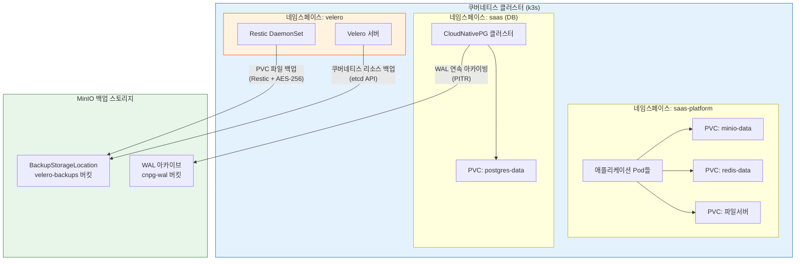
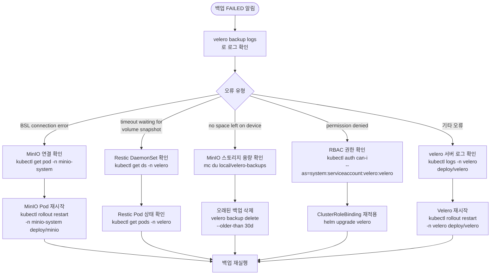

# 8장: Velero 백업 및 재해 복구 (DR)

> **버전**: 1.0.0 | **작성일**: 2026-04-12
> **대상**: 인프라 엔지니어, DevOps 엔지니어, 운영 담당자
> **CSAP**: D-10 (재해 복구 및 사업 연속성), D-06 (침해사고 관리), D-07 (가용성 관리)
> **선행 문서**: `04-infrastructure/components/03-postgresql.md`, `04-infrastructure/kubernetes/01-k3s-basics.md`

---

## 목차

1. [Velero란 무엇인가?](#1-velero란-무엇인가)
2. [이 프로젝트의 백업 전략 개요](#2-이-프로젝트의-백업-전략-개요)
3. [Velero 설치 및 설정](#3-velero-설치-및-설정)
4. [정기 백업 스케줄 설정](#4-정기-백업-스케줄-설정)
5. [수동 백업 실행 및 확인](#5-수동-백업-실행-및-확인)
6. [복구(Restore) 절차](#6-복구restore-절차)
7. [백업 검증 방법 및 DR 훈련](#7-백업-검증-방법-및-dr-훈련)
8. [CSAP D-10 요건 매핑](#8-csap-d-10-요건-매핑)
9. [트러블슈팅](#9-트러블슈팅)
10. [학습 체크리스트](#10-학습-체크리스트)
11. [다음 단계](#11-다음-단계)

---

## 1. Velero란 무엇인가?

### 1.1 기본 개념

Velero는 쿠버네티스 클러스터의 리소스(Pod, Deployment, ConfigMap 등)와 영구 볼륨(PV, Persistent Volume)을 백업하고 복구하는 오픈소스 도구입니다. VMware가 개발하였으며, 현재 CNCF(Cloud Native Computing Foundation) 졸업 프로젝트입니다.

```
Velero가 백업하는 대상:
  ┌─────────────────────────────────────────┐
  │ 쿠버네티스 리소스 (etcd 기반)            │
  │   - Deployment, StatefulSet, DaemonSet  │
  │   - Service, ConfigMap, Secret          │
  │   - PersistentVolumeClaim (PVC 명세)     │
  │   - RBAC 정책, NetworkPolicy            │
  │   - Custom Resource (CRD 인스턴스)      │
  ├─────────────────────────────────────────┤
  │ 볼륨 데이터 (Restic/Kopia 기반)          │
  │   - PVC에 연결된 실제 파일 데이터         │
  │   - 예: 업로드된 문서, 로그, 임시 파일    │
  └─────────────────────────────────────────┘
```

### 1.2 PVC 백업을 왜 별도로 해야 하나?

처음 이 프로젝트를 접하면 "PostgreSQL을 CNPG로 이미 백업하는데 왜 Velero가 필요한가?"라는 질문이 자연스럽게 나옵니다. 이 두 가지는 서로 다른 문제를 해결합니다.

#### PostgreSQL CNPG(CloudNativePG) 백업 — 데이터베이스 전용

```
CNPG 백업이 다루는 것:
  - PostgreSQL WAL(Write-Ahead Log) 연속 아카이빙
  - 특정 시점으로 복구 (PITR: Point-In-Time Recovery)
  - 트랜잭션 수준의 일관성 보장
  - 예: "2026-04-11 14:30:00에 커밋된 직전 상태로 복구해주세요"

CNPG 백업이 다루지 못하는 것:
  - PostgreSQL 이외의 다른 Pod 상태
  - 파일 서버에 업로드된 문서 (MinIO PVC)
  - Redis 데이터 (영구 저장 시)
  - 쿠버네티스 설정 자체 (Deployment YAML 등)
```

#### Velero 백업 — 클러스터 전체

```
Velero 백업이 다루는 것:
  - 클러스터 내 모든 쿠버네티스 리소스 상태
  - 파일 시스템 레벨의 PVC 데이터 (Restic으로 실제 파일 내용)
  - 네임스페이스 전체 복구
  - 예: "클러스터 전체가 삭제되었을 때 48시간 전 상태로 모두 복구"

Velero 백업의 한계:
  - DB 트랜잭션 단위 복구 불가 (일관성은 CNPG가 더 정밀)
  - 파일 레벨 백업이므로 대용량 DB에는 비효율적
```

#### 비교 요약

| 항목 | CNPG 백업 (WAL + PITR) | Velero 백업 |
|------|----------------------|-------------|
| 대상 | PostgreSQL DB만 | 클러스터 전체 |
| 복구 단위 | 특정 시점 (분 단위) | 백업 시점 스냅샷 |
| 일관성 | 트랜잭션 일관성 보장 | 파일 시스템 수준 |
| 속도 | WAL replay (느림) | 파일 복사 (빠름) |
| 용도 | 데이터 손상, 논리 오류 | 클러스터 재해, 마이그레이션 |
| CSAP 연관 | D-10 데이터 보호 | D-10 재해 복구 |

> 💡 **결론**: CNPG와 Velero는 상호 보완적입니다. 이 프로젝트는 두 가지를 모두 사용하여 중첩 보호(Layered Protection)를 구현합니다.

### 1.3 Restic이란?

Velero는 PVC의 실제 파일 데이터를 백업할 때 Restic(또는 Kopia)을 사용합니다.

```
Restic의 역할:
  PVC 마운트 경로의 파일을 읽어서
  → 암호화(AES-256) + 중복 제거 후
  → MinIO(S3 호환)에 저장

  특징:
  - 블록 레벨 중복 제거 (변경된 부분만 전송)
  - 내장 암호화 (저장소에 있어도 암호화된 상태)
  - 증분 백업 지원
```

---

## 2. 이 프로젝트의 백업 전략 개요

### 2.1 전체 아키텍처



### 2.2 백업 스케줄 및 보존 정책

```mermaid
gantt
  title 백업 스케줄 타임라인 (하루 기준, KST)
  dateFormat HH:mm
  axisFormat %H:%M

  section 데이터베이스 (CNPG)
  WAL 연속 아카이빙 (매 5분)       : active, 00:00, 24:00
  일간 베이스 백업 (03:00 KST)     : crit, 03:00, 03:30

  section Velero 백업
  일간 SaaS 백업 (02:00 KST)      : 02:00, 02:45
  일간 PV 데이터 백업 (04:00 KST)  : 04:00, 04:30
  주간 클러스터 백업 (일요일 03:00) : 03:00, 04:00

  section 검증
  DR 훈련 CronJob (일요일 03:00)   : 03:00, 05:00
```

| 스케줄 | 시간 | 보존 기간 | 대상 |
|--------|------|----------|------|
| 일간 SaaS 백업 | 매일 02:00 KST | 30일 | saas-platform 네임스페이스 전체 |
| 주간 클러스터 백업 | 매주 일요일 03:00 KST | 90일 | 클러스터 전체 |
| 일간 PV 데이터 백업 | 매일 04:00 KST | 14일 | PVC 파일 데이터만 |
| CNPG 일간 베이스 | 매일 03:00 KST (UTC 18:00) | 30일 | PostgreSQL 베이스 백업 |
| CNPG WAL | 5분 간격 연속 | 7일 | PostgreSQL WAL 아카이브 |

> ⚠️ **CSAP D-10 요건**: 중요 데이터는 최소 1년 보존이 원칙입니다. 위 정책은 운영 효율과 비용을 고려한 최소 요건입니다. 감리 시 장기 보존 정책(테이프 또는 Cold Storage)을 별도 제시해야 합니다.

### 2.3 RTO/RPO 목표

| 지표 | 정의 | 목표값 | 비고 |
|------|------|--------|------|
| RPO (Recovery Point Objective) | 복구 시 최대 데이터 손실 허용 시간 | 1시간 이내 | WAL 5분 + 버퍼 |
| RTO (Recovery Time Objective) | 서비스 복구까지 허용 시간 | 4시간 이내 | CSAP D-10 기준 |
| 백업 성공률 | 스케줄 백업 성공 비율 | 99% 이상 | 월간 기준 |

---

## 3. Velero 설치 및 설정

### 3.1 사전 요구사항

```bash
# Velero CLI 설치 (운영자 로컬 머신에)
# macOS
brew install velero

# Linux
wget https://github.com/vmware-tanzu/velero/releases/download/v1.13.0/velero-v1.13.0-linux-amd64.tar.gz
tar -xzf velero-v1.13.0-linux-amd64.tar.gz
sudo mv velero-v1.13.0-linux-amd64/velero /usr/local/bin/

# 설치 확인
velero version

# kubectl 연결 확인
kubectl cluster-info
```

### 3.2 MinIO 사전 설치 (백업 스토리지)

Velero는 백업 데이터를 S3 호환 스토리지에 저장합니다. 이 프로젝트는 클러스터 내부의 MinIO를 사용합니다.

```bash
# MinIO Namespace 생성
kubectl create namespace minio-system

# MinIO Helm 설치
helm repo add minio https://charts.min.io/
helm repo update

helm install minio minio/minio \
  --namespace minio-system \
  --set rootUser=minio-admin \
  --set rootPassword="${MINIO_ROOT_PASSWORD}" \
  --set persistence.enabled=true \
  --set persistence.size=50Gi \
  --set resources.requests.memory=512Mi \
  --set mode=standalone

# MinIO Pod 상태 확인
kubectl get pods -n minio-system
```

> ⚠️ **보안 주의**: `MINIO_ROOT_PASSWORD`는 반드시 환경 변수로 주입하세요. 명령줄에 직접 입력하면 shell history에 남습니다.

```bash
# Velero용 버킷 생성 (MinIO CLI 또는 웹 콘솔 사용)
# MinIO 포트포워딩
kubectl port-forward -n minio-system svc/minio 9000:9000 9001:9001 &

# MinIO CLI로 버킷 생성
mc alias set local http://localhost:9000 minio-admin "${MINIO_ROOT_PASSWORD}"
mc mb local/velero-backups
mc mb local/velero-backups-weekly

# 버킷 확인
mc ls local/
```

### 3.3 Velero Helm 설치

```bash
# Velero Helm 레포지터리 추가
helm repo add vmware-tanzu https://vmware-tanzu.github.io/helm-charts
helm repo update
```

Helm values 파일을 준비합니다. 이 파일은 `infra/velero/values.yaml`에 있습니다.

```yaml
# infra/velero/values.yaml
# Design Ref: §3 | Plan SC: FR-N55.1

initContainers:
  - name: velero-plugin-for-aws
    image: velero/velero-plugin-for-aws:v1.9.0
    volumeMounts:
      - mountPath: /target
        name: plugins

configuration:
  # BackupStorageLocation: MinIO S3 호환
  backupStorageLocation:
    - name: default
      provider: aws
      bucket: velero-backups
      default: true
      config:
        region: minio
        s3ForcePathStyle: "true"
        s3Url: http://minio.minio-system.svc.cluster.local:9000
        publicUrl: http://minio.minio-system.svc.cluster.local:9000

  # VolumeSnapshotLocation: Restic 사용 (CSI 스냅샷 대신)
  volumeSnapshotLocation:
    - name: default
      provider: aws
      config:
        region: minio

  # PVC 파일 데이터 기본 백업 활성화 (Restic)
  defaultVolumesToFsBackup: true

credentials:
  # 실제 배포 시 SealedSecret으로 교체 필수 (CSAP D-09)
  secretContents:
    cloud: |
      [default]
      aws_access_key_id=CHANGE_ME_ACCESS_KEY
      aws_secret_access_key=CHANGE_ME_SECRET_KEY

# Restic DaemonSet (PVC 파일 백업)
deployNodeAgent: true
nodeAgent:
  podVolumePath: /var/lib/kubelet/pods

# Prometheus 메트릭 노출
metrics:
  enabled: true
  serviceMonitor:
    enabled: true

# 알림 규칙
configuration:
  logLevel: info

# 스케줄 백업 (Helm으로 함께 배포)
schedules:
  daily-saas:
    schedule: "0 17 * * *"  # 02:00 KST (UTC+9 = UTC 17:00)
    template:
      includedNamespaces:
        - saas-platform
      ttl: 720h  # 30일
      storageLocation: default

  weekly-cluster:
    schedule: "0 18 0 * 0"  # 매주 일요일 03:00 KST
    template:
      includeClusterResources: true
      ttl: 2160h  # 90일
      storageLocation: default

  daily-pv:
    schedule: "0 19 * * *"  # 매일 04:00 KST
    template:
      includedNamespaces:
        - saas-platform
      defaultVolumesToFsBackup: true
      ttl: 336h  # 14일
      storageLocation: default
```

```bash
# Velero 설치
helm install velero vmware-tanzu/velero \
  --namespace velero \
  --create-namespace \
  --version 6.0.0 \
  --values infra/velero/values.yaml

# 설치 상태 확인
kubectl get pods -n velero
kubectl get backupstoragelocation -n velero
```

### 3.4 BackupStorageLocation 연결 확인

```bash
# BSL 상태 확인 (Available이어야 정상)
kubectl get backupstoragelocation -n velero

# 예상 출력:
# NAME      PHASE       LAST VALIDATED   AGE   DEFAULT
# default   Available   15s              2m    true

# BSL 상세 정보
kubectl describe backupstoragelocation default -n velero
```

> ✅ `PHASE`가 `Available`이면 MinIO 연결이 성공한 것입니다.
> ❌ `Unavailable`이면 MinIO 접속 정보 또는 버킷 이름을 확인하세요.

---

## 4. 정기 백업 스케줄 설정

### 4.1 Schedule CRD 개념

Velero의 `Schedule`은 주기적으로 백업을 실행하는 CRD(Custom Resource Definition)입니다. cron 형식으로 시간을 지정합니다.

### 4.2 일간 SaaS 전체 백업 (매일 02:00 KST)

```yaml
# infra/velero/schedules/daily-saas.yaml
# Design Ref: §4 | Plan SC: FR-N55.3
apiVersion: velero.io/v1
kind: Schedule
metadata:
  name: daily-saas-backup
  namespace: velero
  labels:
    app.kubernetes.io/part-of: saas-platform
    csap.compliance/domain: D-10
spec:
  # UTC 17:00 = KST 02:00 (서머타임 없음)
  schedule: "0 17 * * *"
  template:
    # 백업 대상 네임스페이스
    includedNamespaces:
      - saas-platform

    # 민감 리소스 제외 (Sealed Secret이 아닌 평문 Secret 제외)
    excludedResources:
      - events
      - events.events.k8s.io

    # 보존 기간: 30일 (720시간)
    ttl: 720h

    # PVC 파일 데이터도 함께 백업 (Restic 사용)
    defaultVolumesToFsBackup: true

    # 백업 스토리지 위치
    storageLocation: default

    # 레이블 (Prometheus 메트릭 구분용)
    metadata:
      labels:
        schedule-type: daily
        target: saas-platform

  # 이미 실행 중이면 건너뜀 (중복 방지)
  useOwnerReferencesInBackup: false
```

### 4.3 주간 클러스터 전체 백업 (매주 일요일 03:00 KST)

```yaml
# infra/velero/schedules/weekly-cluster.yaml
# Design Ref: §4 | Plan SC: FR-N55.4
apiVersion: velero.io/v1
kind: Schedule
metadata:
  name: weekly-cluster-backup
  namespace: velero
  labels:
    csap.compliance/domain: D-10
spec:
  # 매주 일요일 UTC 18:00 = KST 03:00
  schedule: "0 18 * * 0"
  template:
    # 클러스터 전체 리소스 포함 (ClusterRole, PV 등)
    includeClusterResources: true

    # 모든 네임스페이스
    includedNamespaces: []

    # 시스템 네임스페이스는 제외 (선택사항)
    excludedNamespaces:
      - kube-system
      - kube-public

    # 보존 기간: 90일 (2160시간)
    ttl: 2160h

    storageLocation: default

    metadata:
      labels:
        schedule-type: weekly
        target: cluster
```

### 4.4 스케줄 적용 및 확인

```bash
# 스케줄 CRD 적용
kubectl apply -f infra/velero/schedules/daily-saas.yaml
kubectl apply -f infra/velero/schedules/weekly-cluster.yaml
kubectl apply -f infra/velero/schedules/daily-pv.yaml

# 스케줄 목록 확인
velero schedule get

# 예상 출력:
# NAME                    STATUS    CREATED                         SCHEDULE    BACKUP TTL   LAST BACKUP   SELECTOR
# daily-saas-backup       Enabled   2026-04-12 09:00:00 +0900 KST   0 17 * * *  720h0m0s     2h ago        <none>
# weekly-cluster-backup   Enabled   2026-04-12 09:00:00 +0900 KST   0 18 * * 0  2160h0m0s    5d ago        <none>
# daily-pv-backup         Enabled   2026-04-12 09:00:00 +0900 KST   0 19 * * *  336h0m0s     1h ago        <none>
```

---

## 5. 수동 백업 실행 및 확인

### 5.1 수동 백업이 필요한 경우

- 대규모 배포 직전 스냅샷
- 데이터 마이그레이션 전
- 감사(Audit) 시점 보존
- 예상치 못한 장애 전조 발생 시

### 5.2 수동 백업 실행

```bash
# 특정 네임스페이스 수동 백업
velero backup create manual-backup-$(date +%Y%m%d) \
  --include-namespaces saas-platform \
  --default-volumes-to-fs-backup \
  --ttl 168h

# 전체 클러스터 수동 백업
velero backup create full-cluster-$(date +%Y%m%d) \
  --include-cluster-resources \
  --ttl 720h

# 특정 레이블의 리소스만 백업
velero backup create labeled-backup-$(date +%Y%m%d) \
  --include-namespaces saas-platform \
  --selector "app.kubernetes.io/part-of=saas-platform"
```

### 5.3 백업 상태 확인

```bash
# 백업 목록 (최신 순)
velero backup get

# 특정 백업 상세 정보
velero backup describe manual-backup-20260412

# 예상 출력:
# Name:         manual-backup-20260412
# Namespace:    velero
# Labels:       velero.io/storage-location=default
# Annotations:  velero.io/source-cluster-k8s-gitversion=v1.30.0+k3s1
#
# Phase:  Completed          ← Completed이면 성공
#
# Errors:    0               ← 0이면 오류 없음
# Warnings:  2               ← 경고는 있어도 무관한 경우 많음
#
# Started:    2026-04-12 02:00:01 +0900 KST
# Completed:  2026-04-12 02:12:33 +0900 KST
#
# Expiration:  2026-04-19 02:00:01 +0900 KST (7일 후 자동 삭제)
#
# Total items to be backed up:  1,247
# Items backed up:              1,247
#
# Resource List:
#   apps/v1/Deployment:
#     - saas-platform/api-gateway
#     - saas-platform/auth-service
#     ...
```

### 5.4 백업 로그 확인

```bash
# 백업 로그 (오류 원인 파악)
velero backup logs manual-backup-20260412

# 오류만 필터링
velero backup logs manual-backup-20260412 | grep -E "error|Error|ERRO"

# 경고만 필터링
velero backup logs manual-backup-20260412 | grep -i "warning\|warn"
```

### 5.5 MinIO에서 백업 파일 직접 확인

```bash
# MinIO CLI로 백업 파일 목록
mc ls local/velero-backups/

# 특정 백업 내용 확인
mc ls local/velero-backups/manual-backup-20260412/

# 백업 크기 확인
mc du local/velero-backups/
```

---

## 6. 복구(Restore) 절차

### 6.1 복구 시나리오별 접근 방법

```mermaid
flowchart TD
  A([재해 발생 감지]) --> B{재해 유형 분류}

  B -->|단일 Pod/Deployment 삭제| C["즉시 재배포\n(Git → Flux 자동 복구)"]
  B -->|네임스페이스 전체 삭제| D["Velero 네임스페이스 복구"]
  B -->|클러스터 전체 손실| E["신규 클러스터 구축\n→ Velero 클러스터 복구"]
  B -->|데이터 손상 (DB)| F["CNPG PITR 복구\n(특정 시점으로)"]
  B -->|파일 데이터 손실| G["Velero PV 복구\n(Restic 기반)"]

  C --> H[서비스 정상화 확인]
  D --> I[네임스페이스 복구 실행]
  E --> J[클러스터 전체 복구 실행]
  F --> K[DB PITR 실행]
  G --> L[PV Restore 실행]

  I --> H
  J --> H
  K --> H
  L --> H

  H --> M{서비스 정상?}
  M -->|예| N([복구 완료\n+ 사후 보고서 작성])
  M -->|아니오| O[추가 진단\n에스컬레이션]
  O --> B

  style A fill:#F44336,color:#fff
  style N fill:#4CAF50,color:#fff
  style O fill:#FF9800,color:#fff
```

### 6.2 단계별 복구 절차

#### 시나리오 1: 네임스페이스 전체 삭제 복구

```bash
# Step 1: 사용 가능한 백업 목록 확인
velero backup get | grep saas-platform

# Step 2: 복구할 백업 선택 (가장 최신 완료된 백업)
BACKUP_NAME="daily-saas-backup-20260412020000"

# Step 3: 복구 실행 (네임스페이스가 없으면 자동 생성됨)
velero restore create \
  --from-backup "${BACKUP_NAME}" \
  --include-namespaces saas-platform \
  --restore-volumes true

# Step 4: 복구 상태 모니터링
velero restore get

# 복구 진행 상황 추적
watch -n 5 "velero restore get"

# Step 5: 복구 완료 확인
velero restore describe <restore-name>

# Step 6: Pod 상태 확인
kubectl get pods -n saas-platform
kubectl get pvc -n saas-platform
```

#### 시나리오 2: 다른 네임스페이스로 복구 (검증용)

```bash
# 프로덕션에 영향 없이 테스트 네임스페이스로 복구
velero restore create restore-verify-$(date +%Y%m%d) \
  --from-backup "${BACKUP_NAME}" \
  --namespace-mappings "saas-platform:saas-platform-verify" \
  --include-namespaces saas-platform

# 검증 후 삭제
kubectl delete namespace saas-platform-verify
```

#### 시나리오 3: 특정 리소스만 복구

```bash
# 특정 Deployment만 복구 (다른 리소스 영향 없음)
velero restore create \
  --from-backup "${BACKUP_NAME}" \
  --include-namespaces saas-platform \
  --include-resources deployments \
  --selector "app=auth-service"

# ConfigMap만 복구
velero restore create \
  --from-backup "${BACKUP_NAME}" \
  --include-namespaces saas-platform \
  --include-resources configmaps
```

### 6.3 복구 후 검증 체크리스트

```bash
# 1. 모든 Pod 실행 상태 확인
kubectl get pods -n saas-platform
# 예상: 모든 Pod가 Running 또는 Completed

# 2. 서비스 엔드포인트 확인
kubectl get services -n saas-platform
kubectl get endpoints -n saas-platform

# 3. PVC 바인딩 상태 확인
kubectl get pvc -n saas-platform
# 예상: STATUS=Bound

# 4. 애플리케이션 헬스체크
kubectl exec -n saas-platform deploy/api-gateway -- \
  wget -qO- http://localhost:3000/health

# 5. DB 연결 확인
kubectl exec -n saas-platform deploy/user-service -- \
  node -e "const { prisma } = require('./lib/prisma'); prisma.\$queryRaw\`SELECT 1\`.then(r => console.log('DB OK', r))"

# 6. 감사 로그 기록 (CSAP D-06)
echo "{\"timestamp\":\"$(date -u +%Y-%m-%dT%H:%M:%SZ)\",\"action\":\"DISASTER_RECOVERY_RESTORE\",\"actor\":\"${USER}\",\"backup\":\"${BACKUP_NAME}\",\"status\":\"completed\"}" \
  >> /var/log/saas/audit.log
```

---

## 7. 백업 검증 방법 및 DR 훈련

### 7.1 자동 백업 검증 CronJob

이 프로젝트에는 매주 일요일 자동으로 백업을 복구하여 검증하는 CronJob이 구성되어 있습니다.

```yaml
# infra/backup-verification/velero-verify-cronjob.yaml (기존 파일)
# 매주 일요일 03:00 UTC 실행
# 최신 성공 백업을 격리 네임스페이스에 복구하고
# RTO 목표(14400초 = 4시간) 달성 여부를 확인합니다.
```

CronJob 상태 확인:

```bash
# CronJob 목록 확인
kubectl get cronjob -n velero

# 가장 최근 실행 결과 확인
kubectl get jobs -n velero --sort-by=.status.startTime | tail -5

# 검증 Job 로그 확인
kubectl logs -n velero \
  $(kubectl get pod -n velero -l app=velero-backup-verify -o name | tail -1)
```

### 7.2 월 1회 수동 DR 훈련 체크리스트

CSAP D-10 요건에 따라 월 1회 DR 훈련을 실시하고 결과를 기록해야 합니다.

```markdown
## DR 훈련 체크리스트 (월간)

### 사전 준비 (D-1)
- [ ] DR 훈련 일정 공지 (팀 전체)
- [ ] 최신 백업 상태 확인 (velero backup get)
- [ ] 검증 네임스페이스 준비 (saas-platform-dr-test)
- [ ] DR 훈련 담당자 지정

### 훈련 실행 (당일)
- [ ] 훈련 시작 시각 기록: ___________
- [ ] 백업 선택: ___________
- [ ] 복구 명령 실행 및 완료 시각: ___________
- [ ] RTO 측정 (목표: 4시간 이내): ___________
- [ ] Pod 상태 확인 (모든 Pod Running): [ ]
- [ ] 서비스 헬스체크 통과: [ ]
- [ ] DB 쿼리 정상 동작 확인: [ ]
- [ ] 파일 데이터 무결성 확인: [ ]

### 결과 정리 (D+1)
- [ ] DR 훈련 보고서 작성 (담당자: ___________)
- [ ] RTO 목표 달성 여부: [ ] 달성 / [ ] 미달성
- [ ] 미달성 시 개선 계획: ___________
- [ ] 감사 로그 기록 완료: [ ]
- [ ] 검증 네임스페이스 정리: [ ]
```

### 7.3 DR 훈련 자동화 스크립트

```bash
#!/bin/bash
# DR 훈련 자동화 스크립트 (infra/velero/dr-scripts/dr-drill.sh)
set -euo pipefail

DRILL_NS="saas-platform-dr-$(date +%Y%m%d)"
START_TIME=$(date +%s)
LOG_FILE="/tmp/dr-drill-$(date +%Y%m%d).log"

echo "[DR훈련] 시작: $(date)" | tee -a "${LOG_FILE}"

# 1단계: 최신 성공 백업 확인
LATEST=$(velero backup get -o json | \
  jq -r '[.items[] | select(.status.phase == "Completed")] | sort_by(.status.completionTimestamp) | last | .metadata.name')
echo "[DR훈련] 사용 백업: ${LATEST}" | tee -a "${LOG_FILE}"

# 2단계: 격리 네임스페이스로 복구
velero restore create "drill-$(date +%Y%m%d%H%M)" \
  --from-backup "${LATEST}" \
  --namespace-mappings "saas-platform:${DRILL_NS}" \
  --wait 2>&1 | tee -a "${LOG_FILE}"

# 3단계: RTO 계산
END_TIME=$(date +%s)
RTO=$((END_TIME - START_TIME))
RTO_TARGET=14400
echo "[DR훈련] RTO: ${RTO}초 (목표: ${RTO_TARGET}초)" | tee -a "${LOG_FILE}"

# 4단계: 보고서 생성
STATUS=$([ "${RTO}" -le "${RTO_TARGET}" ] && echo "PASS" || echo "FAIL")
echo "[DR훈련] 결과: ${STATUS}" | tee -a "${LOG_FILE}"

# 5단계: 감사 로그 (CSAP D-06)
echo "{\"timestamp\":\"$(date -u +%Y-%m-%dT%H:%M:%SZ)\",\"action\":\"DR_DRILL\",\"actor\":\"${USER}\",\"backup\":\"${LATEST}\",\"rto_seconds\":${RTO},\"status\":\"${STATUS}\"}" \
  >> /var/log/saas/audit.log

# 6단계: 정리
kubectl delete namespace "${DRILL_NS}" --ignore-not-found --wait=false
echo "[DR훈련] 완료: $(date)" | tee -a "${LOG_FILE}"
```

---

## 8. CSAP D-10 요건 매핑

### 8.1 CSAP D-10 데이터 보호 및 재해 복구 요건

| CSAP 항목 | 요건 내용 | 구현 방법 |
|-----------|----------|----------|
| D-10-01 | 중요 데이터 정기 백업 | Velero 일간 자동 백업 + CNPG WAL |
| D-10-02 | 백업 데이터 안전한 보관 | MinIO AES-256 암호화 + Restic 내장 암호화 |
| D-10-03 | 백업 복구 절차 수립 | Restore Runbook 문서화 + 자동화 스크립트 |
| D-10-04 | 정기 복구 훈련 실시 | 월 1회 DR 훈련 + 자동 검증 CronJob |
| D-10-05 | RTO/RPO 목표 수립 | RTO 4시간, RPO 1시간 |
| D-10-06 | 백업 이중화 | 일간 + 주간 스케줄로 이중화 |

### 8.2 감사 증거 자료 준비

```bash
# CSAP 감사 시 제출할 증거 자료 생성

# 1. 백업 이력 목록 (최근 30일)
velero backup get -o json | \
  jq '[.items[] | {name: .metadata.name, phase: .status.phase, startTimestamp: .status.startTimestamp, completionTimestamp: .status.completionTimestamp}]' \
  > /tmp/csap-evidence-backup-history.json

# 2. 스케줄 설정 현황
velero schedule get -o json > /tmp/csap-evidence-schedules.json

# 3. BackupStorageLocation 설정
kubectl get backupstoragelocation -n velero -o yaml > /tmp/csap-evidence-bsl.yaml

# 4. DR 훈련 기록 (최근 3개월)
kubectl get jobs -n velero --sort-by=.status.startTime -o json > /tmp/csap-evidence-dr-jobs.json

echo "CSAP D-10 증거 자료 생성 완료"
ls -la /tmp/csap-evidence-*.json /tmp/csap-evidence-*.yaml
```

### 8.3 백업 보안 요건 (D-09 연계)

```yaml
# MinIO 버킷 정책 — 읽기 전용 접근 제한
# MinIO Console 또는 mc 명령으로 설정

# Velero 서비스 계정은 최소 권한만 부여
apiVersion: v1
kind: ServiceAccount
metadata:
  name: velero
  namespace: velero
---
# Velero가 사용하는 MinIO IAM 정책 (최소 권한)
# {
#   "Version": "2012-10-17",
#   "Statement": [
#     {
#       "Effect": "Allow",
#       "Action": ["s3:GetObject", "s3:PutObject", "s3:DeleteObject", "s3:ListBucket"],
#       "Resource": ["arn:aws:s3:::velero-backups", "arn:aws:s3:::velero-backups/*"]
#     }
#   ]
# }
```

---

## 9. 트러블슈팅

### 9.1 백업 실패 시 확인 순서



### 9.2 자주 발생하는 오류와 해결 방법

#### 오류 1: BackupStorageLocation이 Unavailable

```bash
# 증상
kubectl get backupstoragelocation -n velero
# NAME      PHASE         LAST VALIDATED
# default   Unavailable   5m

# 원인 파악
kubectl describe backupstoragelocation default -n velero
# 주목할 부분: Events 섹션의 오류 메시지

# 해결 1: MinIO 서비스 상태 확인
kubectl get pods -n minio-system
kubectl get svc -n minio-system

# 해결 2: MinIO 접근 자격 증명 확인
kubectl get secret velero -n velero -o jsonpath='{.data.cloud}' | base64 -d

# 해결 3: MinIO DNS 해석 확인
kubectl run dns-test --rm -it --image=busybox --restart=Never -- \
  nslookup minio.minio-system.svc.cluster.local
```

#### 오류 2: Restic PV 백업 실패

```bash
# 증상
velero backup logs <backup-name> | grep "restic\|error"
# node-agent pod not found ... DaemonSet may not be running

# 원인: node-agent(구 restic) DaemonSet이 실행되지 않음
kubectl get ds -n velero

# 해결: DaemonSet 재시작
kubectl rollout restart ds/node-agent -n velero

# DaemonSet 상태 확인
kubectl rollout status ds/node-agent -n velero
```

#### 오류 3: 복구 후 Pod가 Pending 상태

```bash
# 증상
kubectl get pods -n saas-platform
# api-gateway-xxxxx   0/1   Pending   0   5m

# 원인 파악
kubectl describe pod <pending-pod> -n saas-platform
# 주목: Events의 "0/1 nodes are available" 메시지

# PVC가 Bound되지 않은 경우
kubectl get pvc -n saas-platform
# STATUS=Pending 이면 StorageClass 문제

# 해결: StorageClass 확인
kubectl get storageclass
# 복구된 PVC의 storageClassName이 클러스터에 존재해야 함
```

#### 오류 4: 백업 용량 초과

```bash
# MinIO 버킷 사용량 확인
mc du local/velero-backups/

# 오래된 백업 수동 삭제 (TTL 이전이지만 긴급 시)
velero backup get | grep "30d\|720h\|Expired"
velero backup delete <old-backup-name> --confirm

# 만료된 백업 일괄 정리 (Velero가 자동으로 수행하지만 수동 트리거 가능)
velero backup delete --confirm \
  $(velero backup get -o json | jq -r '.items[] | select(.status.phase == "Deleting") | .metadata.name')
```

### 9.3 Prometheus 알림 확인

```bash
# Velero 관련 활성 알림 확인
kubectl get prometheusrule -n velero

# Grafana에서 Velero 대시보드 접근
# URL: http://grafana.saas-platform.local/d/velero-backup/velero-backup-performance

# 메트릭 직접 확인
kubectl port-forward -n velero svc/velero 8085:8085 &
curl http://localhost:8085/metrics | grep velero_backup

# 유용한 메트릭:
# velero_backup_success_total      — 성공 건수
# velero_backup_failure_total      — 실패 건수
# velero_backup_duration_seconds   — 소요 시간
# velero_backup_last_successful_timestamp — 마지막 성공 시각
```

---

## 10. 학습 체크리스트

이 문서를 읽고 다음 항목을 스스로 확인해 보세요.

### 개념 이해

- [ ] Velero와 CNPG 백업의 차이를 설명할 수 있다
- [ ] RPO와 RTO의 차이를 이해하고 이 프로젝트의 목표값을 안다
- [ ] Restic이 PVC 백업에 사용되는 이유를 설명할 수 있다
- [ ] BackupStorageLocation (BSL)이 무엇인지 안다
- [ ] CSAP D-10 요건에서 정기 백업과 복구 훈련이 왜 필수인지 안다

### 실습 능력

- [ ] `velero backup get`으로 백업 목록을 확인할 수 있다
- [ ] `velero backup describe <name>`으로 백업 상세 정보를 볼 수 있다
- [ ] 수동 백업 명령어를 옵션 설명과 함께 작성할 수 있다
- [ ] 복구(Restore) 명령어를 실행하고 상태를 모니터링할 수 있다
- [ ] 백업 실패 시 로그를 확인하고 원인을 파악하는 순서를 안다

### 운영 능력

- [ ] 월간 DR 훈련 체크리스트를 따라 훈련을 실시할 수 있다
- [ ] CSAP 감사를 위한 증거 자료를 생성하는 명령어를 안다
- [ ] Prometheus에서 Velero 메트릭을 확인하는 방법을 안다

---

## 11. 다음 단계

이 문서를 마쳤다면 다음 문서로 이동하세요.

- **실습**: `10-exercises/04-k8s-debug.md` — 직접 백업 생성 및 복구 실습
- **모니터링 연계**: `05-monitoring/metrics/01-prometheus-basics.md` — Velero 메트릭 Grafana 설정
- **보안 연계**: `07-security/csap/01-what-is-csap.md` — CSAP D-10 전체 요건 이해
- **DB 백업 연계**: `04-infrastructure/components/03-postgresql.md` — CNPG PITR 설정

> 💡 **팁**: Velero 실습 전에 반드시 개발 환경(dev 네임스페이스)에서 먼저 시험해 보세요. 프로덕션 데이터에 직접 `velero restore`를 실행하면 기존 리소스를 덮어쓸 수 있습니다.
