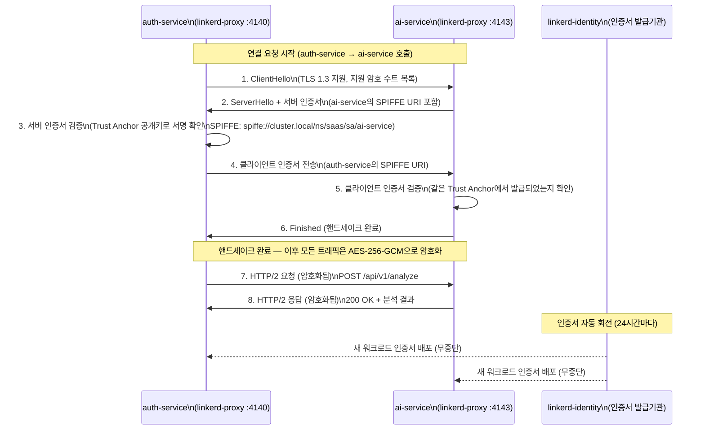
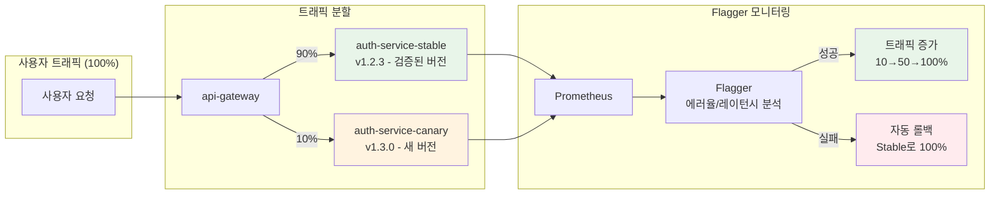
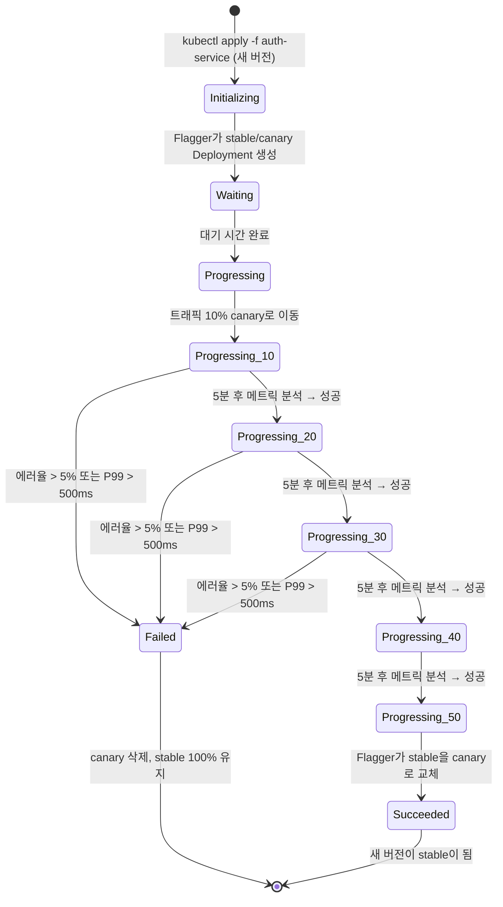
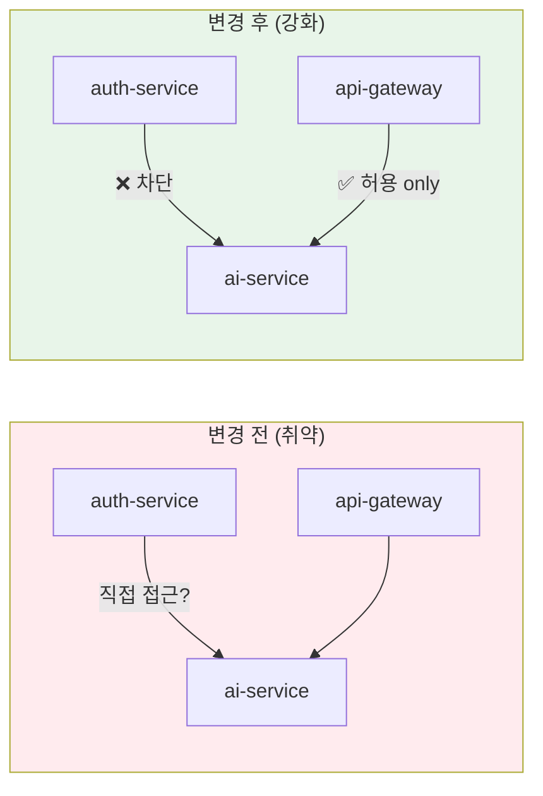

# 서비스 메시 심화 — Linkerd 고급 운영 가이드

> **문서 ID**: ONBOARD-04-INFRA-COMP-09
> **버전**: 1.0.0 | **작성일**: 2026-04-12 | **작성자**: Implementer (Sonnet)
> **선행 학습**: `06-linkerd.md` (Linkerd 기초), `01-overview.md` (인프라 개요)
> **소요 시간**: 약 120분
> **CSAP**: D-08 (접근 통제 — Zero Trust mTLS), D-09 (전송 암호화 — TLS 1.3+), D-06 (감사 로깅)
> **Design Ref**: MTU-N54 §3, MTU-N114 §3, MTU-N159 §3

---

## 목차

1. [서비스 메시 심화 이해](#1-서비스-메시-심화-이해)
   - 1.1 [mTLS 실제 작동 원리 — 핸드셰이크부터 암호화까지](#11-mtls-실제-작동-원리--핸드셰이크부터-암호화까지)
   - 1.2 [Linkerd Proxy가 트래픽을 가로채는 방법](#12-linkerd-proxy가-트래픽을-가로채는-방법)
   - 1.3 [eBPF 기반 Linkerd v3 — Sidecar 없는 미래](#13-ebpf-기반-linkerd-v3--sidecar-없는-미래)
   - 1.4 [linkerd viz 대시보드로 볼 수 있는 것들](#14-linkerd-viz-대시보드로-볼-수-있는-것들)
2. [트래픽 정책 설정](#2-트래픽-정책-설정)
   - 2.1 [Server — 수신 포트 선언](#21-server--수신-포트-선언)
   - 2.2 [ServerAuthorization — 접근 허용 대상 제한](#22-serverauthorization--접근-허용-대상-제한)
   - 2.3 [HTTPRoute — 레이트 리밋과 재시도 정책](#23-httproute--레이트-리밋과-재시도-정책)
   - 2.4 [MeshTLSAuthentication — 메시 내부 인증](#24-meshtlsauthentication--메시-내부-인증)
3. [카나리 배포 연동 — Flagger + Linkerd](#3-카나리-배포-연동--flagger--linkerd)
   - 3.1 [카나리 배포 개념](#31-카나리-배포-개념)
   - 3.2 [Flagger 설치 및 Canary 리소스 정의](#32-flagger-설치-및-canary-리소스-정의)
   - 3.3 [트래픽 가중치 분배 흐름](#33-트래픽-가중치-분배-흐름)
   - 3.4 [자동 롤백 조건 설정](#34-자동-롤백-조건-설정)
4. [관측가능성 — 메시 레벨 메트릭](#4-관측가능성--메시-레벨-메트릭)
   - 4.1 [Prometheus scraping 설정](#41-prometheus-scraping-설정)
   - 4.2 [linkerd viz top — 실시간 서비스 호출 확인](#42-linkerd-viz-top--실시간-서비스-호출-확인)
   - 4.3 [골든 메트릭 PromQL 쿼리 모음](#43-골든-메트릭-promql-쿼리-모음)
   - 4.4 [Grafana 대시보드 활용](#44-grafana-대시보드-활용)
5. [문제 해결](#5-문제-해결)
   - 5.1 [mTLS 불일치 탐지](#51-mtls-불일치-탐지)
   - 5.2 [서비스 간 통신 거부 디버깅](#52-서비스-간-통신-거부-디버깅)
   - 5.3 [linkerd check 헬스 체크 해석](#53-linkerd-check-헬스-체크-해석)
   - 5.4 [자주 발생하는 오류 패턴](#54-자주-발생하는-오류-패턴)
6. [실습 — auth-service → ai-service 트래픽 정책 강화](#6-실습--auth-service--ai-service-트래픽-정책-강화)
7. [학습 체크리스트](#7-학습-체크리스트)
8. [다음 단계](#8-다음-단계)

---

## 1. 서비스 메시 심화 이해

### 1.1 mTLS 실제 작동 원리 — 핸드셰이크부터 암호화까지

`06-linkerd.md`에서 mTLS의 개념을 배웠습니다. 이 섹션에서는 실제로 auth-service와 ai-service 사이에 패킷이 어떻게 오가는지 단계별로 추적합니다.

#### TLS 1.3 핸드셰이크 전체 흐름



#### 핵심 포인트: 애플리케이션 코드는 아무것도 모른다

```
auth-service 컨테이너 관점:
  "나는 그냥 localhost:4140으로 HTTP 요청을 보냈을 뿐이야"

실제로 일어나는 일:
  auth-service → (일반 HTTP) → linkerd-proxy(4140)
                                    ↓ TLS 1.3 핸드셰이크
  ai-service ← (일반 HTTP) ← linkerd-proxy(4143)
```

이것이 Linkerd의 핵심 가치입니다. 애플리케이션 코드를 단 한 줄도 수정하지 않고 모든 서비스 간 통신이 mTLS로 암호화됩니다.

#### SPIFFE URI — 서비스 신원 증명

Linkerd는 인증서의 Subject Alternative Name(SAN)에 SPIFFE URI를 사용합니다.

```
SPIFFE URI 형식:
  spiffe://cluster.local/ns/{네임스페이스}/sa/{서비스어카운트명}

예시:
  auth-service: spiffe://cluster.local/ns/saas-system/sa/auth-service
  ai-service:   spiffe://cluster.local/ns/saas-system/sa/ai-service
  api-gateway:  spiffe://cluster.local/ns/saas-system/sa/api-gateway
```

```bash
# auth-service의 현재 인증서 SPIFFE URI 확인
kubectl exec -n saas-system deployment/auth-service \
  -c linkerd-proxy -- \
  openssl s_client -connect localhost:4143 -showcerts 2>/dev/null | \
  openssl x509 -noout -text | grep "URI:"
# URI:spiffe://cluster.local/ns/saas-system/sa/auth-service
```

### 1.2 Linkerd Proxy가 트래픽을 가로채는 방법

Linkerd는 iptables 규칙을 사용하여 모든 네트워크 트래픽을 투명하게 가로챕니다. 이것이 "투명 프록시(Transparent Proxy)" 패턴입니다.

```
Pod 내부 네트워크 흐름:

[앱 컨테이너] → (아웃바운드 트래픽)
      ↓
[iptables OUTPUT 규칙]
  "uid 2102(linkerd-proxy)에서 오는 것은 통과"
  "그 외 모든 아웃바운드 → :4140으로 리디렉션"
      ↓
[linkerd-proxy :4140 — Outbound]
  · 대상 서비스 조회 (linkerd-destination에서)
  · mTLS 연결 수립
  · 메트릭 수집
      ↓
[외부 네트워크 — mTLS 암호화 트래픽]
      ↓
[대상 Pod의 linkerd-proxy :4143 — Inbound]
  · mTLS 검증
  · 클라이언트 신원 확인
  · 메트릭 수집
      ↓
[iptables PREROUTING 규칙]
  "모든 인바운드 → :4143으로 리디렉션"
      ↓
[대상 앱 컨테이너] ← (일반 HTTP)
```

```bash
# Pod 내부 iptables 규칙 확인 (initContainer가 설정한 규칙)
kubectl exec -n saas-system deployment/auth-service \
  -c linkerd-proxy -- \
  iptables -t nat -L OUTPUT -n --line-numbers
```

### 1.3 eBPF 기반 Linkerd v3 — Sidecar 없는 미래

현재 이 프로젝트는 Linkerd v2.16(Sidecar 기반)을 사용합니다. Linkerd v3는 eBPF를 사용하여 Sidecar 컨테이너 없이 동작합니다.

#### Sidecar vs eBPF 비교

| 항목 | Linkerd v2 (현재) | Linkerd v3 (eBPF) |
|------|-----------------|-----------------|
| 프록시 위치 | Pod 내 sidecar 컨테이너 | 노드 커널 레벨 |
| 리소스 오버헤드 | Pod당 10Mi~50Mi | 노드당 고정 |
| 레이턴시 추가 | 약 0.5~1ms | 약 0.1ms |
| Kubernetes 버전 | 모든 버전 | k3s v1.26+ |
| 복잡도 | 낮음 | 중간 (커널 모듈 필요) |

```
💡 왜 이 프로젝트는 아직 v2를 사용하는가?

WSL2 환경에서 eBPF 커널 모듈 로드에 제약이 있습니다.
WSL2의 Linux 커널(6.6.x)은 eBPF를 지원하지만,
일부 eBPF 프로그램 유형은 WSL2 환경에서 정상 동작하지 않습니다.
프로덕션 환경(베어메탈 또는 전용 VM)으로 전환 시 v3 마이그레이션 검토 예정.
```

#### eBPF 작동 원리 (참고)

```
전통적인 Sidecar 방식:
  앱 → iptables → sidecar proxy → 네트워크

eBPF 방식:
  앱 → 커널 eBPF 훅 → 네트워크
      (커널 내부에서 처리 — 컨텍스트 전환 없음)
```

### 1.4 linkerd viz 대시보드로 볼 수 있는 것들

`linkerd viz` 대시보드(기본 포트 :8084)는 서비스 메시의 실시간 상태를 시각화합니다.

```bash
# 대시보드 접근 (로컬 포트포워딩)
linkerd viz dashboard &
# 브라우저에서 http://localhost:8084 접속

# 특정 네임스페이스의 트래픽 현황 (CLI)
linkerd viz stat deployments -n saas-system
# NAME             MESHED   SUCCESS      RPS   LATENCY_P50   LATENCY_P95   LATENCY_P99   TCP_CONN
# auth-service      1/1     100.00%   42.3rps         3ms          12ms          45ms         12
# ai-service        1/1      98.70%    8.1rps        15ms          85ms         220ms          4
# api-gateway       1/1      99.90%   60.0rps         5ms          18ms          52ms         18
```

#### 대시보드에서 확인할 수 있는 정보

| 메뉴 | 내용 |
|------|------|
| Namespaces | 네임스페이스별 메시 주입 현황, 전체 성공률 |
| Deployments | 배포별 RPS, 성공률, P50/P95/P99 레이턴시 |
| Pods | Pod별 mTLS 적용 여부, 트래픽 현황 |
| Services | 서비스별 인바운드/아웃바운드 트래픽 |
| Traffic Policies | Server, ServerAuthorization 목록 |
| Grafana | 연동된 Grafana 대시보드로 바로 이동 |

```bash
# 특정 서비스의 실시간 요청 흐름 확인
linkerd viz top deployment/auth-service -n saas-system
# ROUTE                          METHOD   COUNT   BEST   WORST    LAST  SUCCESS
# [api-gateway] → /auth/login    POST        42    2ms    15ms    5ms   100.00%
# [api-gateway] → /auth/refresh  POST        18    1ms    8ms     2ms   100.00%
# [api-gateway] → /health        GET         95    1ms    3ms     1ms   100.00%

# 서비스 간 mTLS 현황 확인
linkerd viz edges deployment -n saas-system
# SRC             DST             SRC_NS         DST_NS         SECURED
# api-gateway     auth-service    saas-system    saas-system    YES
# api-gateway     ai-service      saas-system    saas-system    YES
# auth-service    compliance-svc  saas-system    saas-system    YES
```

---

## 2. 트래픽 정책 설정

Linkerd v2.12+에서는 `policy.linkerd.io` API 그룹의 CRD로 세밀한 트래픽 정책을 선언합니다. 이 프로젝트는 `infra/linkerd/authorization/service-mesh-policies.yaml`과 `infra/topology-routing/linkerd-zone-routing.yaml`에 정책이 정의되어 있습니다.

### 2.1 Server — 수신 포트 선언

`Server` 리소스는 특정 Pod가 어떤 포트로 트래픽을 받는지, 어떤 프로토콜을 사용하는지 선언합니다.

```yaml
# infra/topology-routing/linkerd-zone-routing.yaml에서 발췌
# Design Ref: MTU-N159 Section 3.3
# CSAP: D-09 암호화, D-08 접근 통제
apiVersion: policy.linkerd.io/v1beta3
kind: Server
metadata:
  name: topology-aware-server
  namespace: public-saas
  labels:
    topology-routing.saas.io/enabled: "true"
spec:
  podSelector:
    matchLabels:
      topology-routing.saas.io/enabled: "true"
  port: http          # 포트 이름 (Service의 port name과 일치해야 함)
  proxyProtocol: HTTP/2
```

#### auth-service용 Server 리소스 예시

```yaml
# infra/linkerd/servers/auth-service-server.yaml
apiVersion: policy.linkerd.io/v1beta3
kind: Server
metadata:
  name: auth-service-server
  namespace: saas-system
  labels:
    app: auth-service
    csap.compliance/control: D-08
  annotations:
    description: "auth-service 수신 포트 선언 — 인증 API"
spec:
  podSelector:
    matchLabels:
      app: auth-service
  port: http          # auth-service의 Service.spec.ports[].name: "http"
  proxyProtocol: HTTP/2
```

```bash
# Server 리소스 확인
kubectl get server -n saas-system
# NAME                     AGE
# auth-service-server      3d
# ai-service-server        3d
# api-gateway-server       3d

# Server 상세 조회
kubectl describe server auth-service-server -n saas-system
```

### 2.2 ServerAuthorization — 접근 허용 대상 제한

`ServerAuthorization`은 어떤 서비스가 특정 Server에 접근할 수 있는지 제어합니다. 이것이 Zero Trust의 핵심입니다.

```yaml
# infra/linkerd/authorization/service-mesh-policies.yaml에서 발췌
# Plan SC: FR-N114.3
# CSAP: D-08 접근통제 (서비스 간 인증)

# ai-gateway: api-gateway에서만 접근 허용 (N2SF 격리)
apiVersion: policy.linkerd.io/v1beta1
kind: ServerAuthorization
metadata:
  name: ai-gateway-allow-gateway-only
  namespace: saas-system
  labels:
    csap.compliance/control: D-08
    n2sf.data-grade: O
  annotations:
    description: "AI Gateway는 API Gateway를 통해서만 접근 (N2SF 격리)"
spec:
  server:
    name: ai-gateway           # 위에서 정의한 Server 이름
  client:
    meshTLS:
      serviceAccounts:
        - name: api-gateway    # 허용할 서비스의 ServiceAccount 이름
```

#### 이 프로젝트의 전체 접근 제어 매트릭스

```
서비스 간 허용 관계 (ServerAuthorization 기준):

  api-gateway → tenant-service    ✅ 허용 (tenant-service-allow-gateway)
  api-gateway → ai-gateway        ✅ 허용 (ai-gateway-allow-gateway-only)
  api-gateway → catalog-service   ✅ 허용 (catalog-service-allow-limited)
  api-gateway → compliance-svc    ✅ 허용 (compliance-service-allow-limited)

  auth-service → audit-service    ✅ 허용 (audit-service-allow-all-write)
  tenant-svc   → audit-service    ✅ 허용
  ai-gateway   → audit-service    ✅ 허용

  auth-service → ai-gateway       ❌ 차단 (ServerAuthorization 없음)
  monitoring   → ai-gateway       ❌ 차단 (별도 허용 없음)
```

```bash
# 현재 적용된 ServerAuthorization 목록 확인
kubectl get serverauthorization -n saas-system
# NAME                              AGE
# tenant-service-allow-gateway      3d
# audit-service-allow-all-write     3d
# ai-gateway-allow-gateway-only     3d
# catalog-service-allow-limited     3d
# compliance-service-allow-limited  3d

# 특정 정책 상세 확인
kubectl describe serverauthorization ai-gateway-allow-gateway-only -n saas-system
```

#### ServerAuthorization vs NetworkPolicy 차이

| 항목 | NetworkPolicy (Cilium) | ServerAuthorization (Linkerd) |
|------|----------------------|------------------------------|
| 레이어 | L3/L4 (IP, 포트) | L7 (HTTP, gRPC) + mTLS 신원 |
| 인증 기반 | IP 주소 (변경 가능) | SPIFFE 인증서 (변조 불가) |
| 적용 위치 | 네트워크 정책 | 서비스 메시 정책 |
| 우회 가능성 | IP 스푸핑으로 가능 | 인증서 위조 없이 불가 |
| CSAP 항목 | D-11 가상화 보안 | D-08 접근 통제 |

💡 두 레이어를 모두 적용하는 것이 CSAP D-08의 심층 방어(Defense in Depth) 요건을 충족합니다.

### 2.3 HTTPRoute — 레이트 리밋과 재시도 정책

`HTTPRoute`는 HTTP 레벨에서 라우팅 규칙, 타임아웃, 재시도를 정의합니다.

#### 재시도 정책 설정

```yaml
# infra/linkerd/httproute/auth-service-route.yaml
# Design Ref: MTU-N54 §3.2
apiVersion: policy.linkerd.io/v1beta3
kind: HTTPRoute
metadata:
  name: auth-service-retry-policy
  namespace: saas-system
  annotations:
    description: "auth-service 재시도 및 타임아웃 정책"
spec:
  parentRefs:
    - name: auth-service-server    # 위에서 정의한 Server
      kind: Server
      group: policy.linkerd.io
  rules:
    # /health 경로: 빠른 타임아웃, 재시도 허용
    - matches:
        - path:
            type: PathPrefix
            value: /health
      timeouts:
        request: 5s
      # 재시도: GET 요청, 500/502/503 응답 시 최대 3회
      retry:
        limit: 3
        timeout: 5s
        backoff:
          minPenalty: 100ms
          maxPenalty: 1000ms
        conditions:
          - status:
              range:
                start: 500
                end: 503

    # /auth/login: 재시도 없음 (멱등하지 않음)
    - matches:
        - path:
            type: PathPrefix
            value: /auth/login
      timeouts:
        request: 10s
      # ⚠️ POST 요청은 재시도하면 중복 로그인이 발생할 수 있어 재시도 안 함

    # 기본 경로: 30초 타임아웃
    - matches:
        - path:
            type: PathPrefix
            value: /
      timeouts:
        request: 30s
```

#### ServiceProfile에서의 RetryBudget (이 프로젝트 실제 설정)

```yaml
# infra/topology-routing/linkerd-zone-routing.yaml에서 발췌
apiVersion: linkerd.io/v1alpha2
kind: ServiceProfile
metadata:
  name: auth-service.public-saas.svc.cluster.local
  namespace: public-saas
  annotations:
    topology-routing.saas.io/zone-preference: "same-zone-first"
spec:
  retryBudget:
    retryRatio: 0.2       # 전체 요청의 최대 20%까지만 재시도 허용
    minRetriesPerSecond: 10  # 초당 최소 10회 재시도는 항상 허용
    ttl: 120s             # 재시도 버짓 계산 윈도우
  routes:
    - name: health-check
      condition:
        method: GET
        pathRegex: /health
      timeout: 5s
      isRetryable: true    # 이 경로는 재시도 허용
    - name: api-default
      condition:
        pathRegex: /.*
      timeout: 30s
      responseClasses:
        - condition:
            status:
              min: 500
              max: 599
          isFailure: true  # 5xx는 실패로 분류
```

#### 레이트 리밋 구현

⚠️ Linkerd 자체에는 레이트 리밋 기능이 없습니다. 메시 레벨 레이트 리밋은 api-gateway 레이어에서 구현합니다.

```typescript
// platform/services/api-gateway/src/middleware/rate-limit.ts
// Design Ref: MTU-N54 §2.1 — 레이트 리밋 미들웨어
import { RateLimiterRedis } from 'rate-limiter-flexible'
import { getRedisClient } from '../lib/redis'

// Plan SC: FR-RATELIMIT.1
const rateLimiter = new RateLimiterRedis({
  storeClient: getRedisClient(),
  keyPrefix: 'rl_mesh',
  points: 100,       // 요청 허용 횟수
  duration: 60,      // 윈도우 (초)
  blockDuration: 60, // 초과 시 차단 시간 (초)
})

export async function meshRateLimit(req: Request, serviceId: string): Promise<void> {
  const key = `${serviceId}:${req.headers.get('x-forwarded-for')}`
  try {
    await rateLimiter.consume(key)
  } catch {
    throw new Error(`RATE_LIMIT_EXCEEDED: ${serviceId}`)
  }
}
```

### 2.4 MeshTLSAuthentication — 메시 내부 인증

```yaml
# infra/topology-routing/linkerd-zone-routing.yaml에서 발췌
# 메시 내 모든 서비스에 TLS 인증 요구
apiVersion: policy.linkerd.io/v1alpha1
kind: MeshTLSAuthentication
metadata:
  name: public-saas-mesh-tls
  namespace: public-saas
spec:
  identityRefs:
    - kind: Namespace
      name: public-saas   # public-saas 네임스페이스의 모든 서비스 신원 허용
```

```yaml
# 특정 ServiceAccount만 허용하는 경우
apiVersion: policy.linkerd.io/v1alpha1
kind: MeshTLSAuthentication
metadata:
  name: ai-service-tls-auth
  namespace: saas-system
spec:
  identityRefs:
    - kind: ServiceAccount
      name: api-gateway
      namespace: saas-system
    - kind: ServiceAccount
      name: auth-service
      namespace: saas-system
```

---

## 3. 카나리 배포 연동 — Flagger + Linkerd

카나리 배포는 새 버전의 서비스를 일부 트래픽에만 먼저 노출하여 위험을 최소화하는 배포 전략입니다. Flagger가 Linkerd와 연동하여 트래픽 가중치를 자동으로 조절합니다.

### 3.1 카나리 배포 개념



### 3.2 Flagger 설치 및 Canary 리소스 정의

```bash
# Flagger 설치 (Linkerd 연동 모드)
helm repo add flagger https://flagger.app
helm repo update

helm install flagger flagger/flagger \
  --namespace=linkerd-viz \
  --set meshProvider=linkerd \
  --set metricsServer=http://kube-prometheus-stack-prometheus.monitoring:9090 \
  --wait
```

```yaml
# infra/flagger/canary/auth-service-canary.yaml
# Design Ref: MTU-N54 §4 — 카나리 배포
# CSAP: D-12 시스템 개발 보안 (안전한 배포)
apiVersion: flagger.app/v1beta1
kind: Canary
metadata:
  name: auth-service
  namespace: saas-system
spec:
  # 대상 Deployment
  targetRef:
    apiVersion: apps/v1
    kind: Deployment
    name: auth-service

  # 서비스 설정
  service:
    port: 3001
    portName: http
    gateways:
      - public-gateway.saas-system.svc.cluster.local
    hosts:
      - auth.saas.internal
    # Linkerd 트래픽 정책 재사용
    retries:
      attempts: 3
      perTryTimeout: 10s
      retryOn: "5xx"

  # 카나리 분석 설정
  analysis:
    # 단계 간격: 5분마다 트래픽 증가
    interval: 5m
    # 최대 가중치: 50%까지 증가 후 성공 시 100%로 프로모션
    maxWeight: 50
    # 한 번에 증가하는 가중치
    stepWeight: 10

    # 성공 기준 (골든 메트릭)
    metrics:
      - name: request-success-rate
        # 에러율 5% 초과 시 롤백
        thresholdRange:
          min: 95
        interval: 1m
      - name: request-duration
        # P99 레이턴시 500ms 초과 시 롤백
        thresholdRange:
          max: 500
        interval: 1m

    # 분석 실패 시 알림
    webhooks:
      - name: notify-slack
        type: confirm-rollback
        url: http://alertmanager.monitoring:9093/api/v1/alerts
```

### 3.3 트래픽 가중치 분배 흐름



```bash
# 카나리 배포 현황 확인
kubectl get canary -n saas-system
# NAME           STATUS        WEIGHT   LASTTRANSITIONTIME
# auth-service   Progressing   20       2026-04-12T03:00:00Z

# 상세 이벤트 확인
kubectl describe canary auth-service -n saas-system | grep -A 20 "Events:"
# Events:
#   New revision detected, progressing canary analysis.
#   Advance auth-service canary weight 10
#   Advance auth-service canary weight 20
```

### 3.4 자동 롤백 조건 설정

```yaml
# 더 엄격한 롤백 조건 예시 (ai-service용 — AI 서비스는 민감도 높음)
analysis:
  interval: 3m
  maxWeight: 30     # 최대 30%까지만 카나리 트래픽
  stepWeight: 5     # 5%씩 점진적 증가

  metrics:
    - name: request-success-rate
      thresholdRange:
        min: 99     # 성공률 99% 미만 시 롤백 (ai-service는 더 엄격)
      interval: 1m
    - name: request-duration
      thresholdRange:
        max: 1000   # P99 1초 초과 시 롤백
      interval: 1m

  # 연속 실패 횟수 초과 시 롤백 (기본: 5회)
  threshold: 3      # 3회 연속 실패 시 즉시 롤백
```

```bash
# 수동 롤백 (긴급 시)
kubectl annotate canary auth-service -n saas-system \
  flagger.app/canary-weight=0

# 즉시 프로모션 (테스트 완료 후 강제 프로모션)
kubectl annotate canary auth-service -n saas-system \
  flagger.app/canary-weight=100
```

---

## 4. 관측가능성 — 메시 레벨 메트릭

### 4.1 Prometheus scraping 설정

Linkerd는 각 Pod의 linkerd-proxy에서 메트릭을 노출합니다. Prometheus가 이를 자동 수집합니다.

```yaml
# Linkerd proxy 메트릭 scraping 설정
# (linkerd-viz Helm chart가 자동으로 ServiceMonitor 생성)

# 수동으로 확인하는 방법
kubectl get servicemonitor -n linkerd-viz
# NAME                          AGE
# linkerd-controller            3d
# linkerd-destination           3d
# linkerd-identity              3d
# linkerd-proxy-injector        3d
```

```bash
# Prometheus에서 Linkerd 메트릭 직접 확인
# (로컬 포트포워딩 후)
kubectl port-forward -n monitoring svc/kube-prometheus-stack-prometheus 9090:9090 &

# Prometheus UI: http://localhost:9090
# 쿼리: response_total{namespace="saas-system"}
```

#### Linkerd가 노출하는 메트릭 목록

```
# 응답 카운트 (성공/실패 구분)
response_total{namespace, deployment, direction, classification}

# 요청 지속시간 (히스토그램)
response_latency_ms_bucket{namespace, deployment, direction, le}

# TCP 커넥션 수
tcp_open_connections{namespace, deployment, direction}

# mTLS 적용 여부
# (direction="inbound"인 메트릭에 tls="true" 레이블 포함)
response_total{tls="true", direction="inbound"}
```

### 4.2 linkerd viz top — 실시간 서비스 호출 확인

`linkerd viz top`은 특정 서비스로 들어오는 실시간 요청을 트탭(tcpdump)처럼 보여줍니다.

```bash
# auth-service 실시간 요청 모니터링
linkerd viz top deployment/auth-service -n saas-system
# ROUTE                          METHOD   COUNT   BEST   WORST    LAST  SUCCESS
# [api-gateway] → /auth/login    POST        42    2ms    15ms    5ms   100.00%
# [api-gateway] → /auth/refresh  POST        18    1ms    8ms     2ms   100.00%
# [unknown] → /health            GET         95    1ms    3ms     1ms   100.00%

# ai-service 실시간 요청 모니터링
linkerd viz top deployment/ai-service -n saas-system --namespace saas-system

# 특정 Pod 모니터링
linkerd viz top pod/auth-service-6d8f9b-xxxxx -n saas-system

# 특정 경로만 필터링
linkerd viz top deployment/auth-service -n saas-system | grep "login"
```

#### tap — 요청/응답 페이로드 확인

```bash
# ⚠️ 주의: tap은 헤더만 볼 수 있음. 본문(body)은 암호화로 인해 볼 수 없음.
# auth-service로 들어오는 요청 헤더 실시간 확인
linkerd viz tap deployment/auth-service -n saas-system \
  --method POST \
  --path /auth/login
# req id=0:0 proxy=in  src=10.42.0.5:44321 dst=10.42.0.8:3001
#   :method=POST :authority=auth-service:3001 :path=/auth/login
#   content-type=application/json x-request-id=abc-123
# rsp id=0:0 proxy=in  src=10.42.0.5:44321 dst=10.42.0.8:3001
#   :status=200 latency=4ms
```

### 4.3 골든 메트릭 PromQL 쿼리 모음

골든 메트릭(Golden Signals)은 서비스 상태를 나타내는 4가지 핵심 지표입니다.

```promql
# ── 1. 성공률 (Success Rate) ──
# saas-system 네임스페이스 전체 서비스 성공률
sum(rate(response_total{namespace="saas-system", classification="success"}[5m]))
/
sum(rate(response_total{namespace="saas-system"}[5m]))
* 100

# auth-service만의 성공률
sum(rate(response_total{namespace="saas-system", deployment="auth-service", classification="success"}[5m]))
/
sum(rate(response_total{namespace="saas-system", deployment="auth-service"}[5m]))
* 100

# ── 2. 레이턴시 (Latency) ──
# P99 레이턴시 (ms)
histogram_quantile(0.99,
  sum(rate(response_latency_ms_bucket{namespace="saas-system", deployment="auth-service"}[5m]))
  by (le)
)

# P50 레이턴시
histogram_quantile(0.50,
  sum(rate(response_latency_ms_bucket{namespace="saas-system"}[5m]))
  by (le, deployment)
)

# ── 3. 처리량 (Throughput/TPS) ──
# 초당 요청 수 (서비스별)
sum(rate(response_total{namespace="saas-system"}[5m])) by (deployment)

# ── 4. TCP 커넥션 수 ──
# 현재 열린 TCP 커넥션
sum(tcp_open_connections{namespace="saas-system"}) by (deployment, direction)

# ── mTLS 적용률 (CSAP D-09 확인용) ──
# mTLS로 보호된 인바운드 요청 비율
sum(rate(response_total{namespace="saas-system", direction="inbound", tls="true"}[5m]))
/
sum(rate(response_total{namespace="saas-system", direction="inbound"}[5m]))
* 100
# → 100%이어야 정상 (메시 내 모든 통신이 mTLS로 암호화)

# ── 에러 버짓 소진율 (SLO 연동) ──
# auth-service SLO: 성공률 99.9% 이상
# 에러 버짓 소진율 계산
1 - (
  sum(rate(response_total{deployment="auth-service", classification="success"}[1h]))
  /
  sum(rate(response_total{deployment="auth-service"}[1h]))
) / (1 - 0.999)
```

### 4.4 Grafana 대시보드 활용

이 프로젝트에는 두 개의 Linkerd 전용 Grafana 대시보드가 포함되어 있습니다.

```
infra/monitoring/dashboards/linkerd-dashboard.json
infra/monitoring/dashboards/linkerd-mesh-extended.json
```

```bash
# Grafana 접근 (로컬 포트포워딩)
kubectl port-forward -n monitoring svc/kube-prometheus-stack-grafana 3000:80 &
# http://localhost:3000 → 사이드바 → Dashboards → Linkerd

# 또는 linkerd viz dashboard에서 Grafana로 바로 이동
linkerd viz dashboard
```

#### 대시보드에서 확인해야 할 핵심 패널

| 패널 | 정상 범위 | 비정상 신호 |
|------|----------|------------|
| Namespace 성공률 | > 99.9% | < 99% |
| P99 레이턴시 | < 200ms | > 500ms |
| 초당 요청 수 (RPS) | 평소 기준치의 ±30% | 급격한 변화 |
| mTLS 커버리지 | 100% | < 100% |
| TCP 커넥션 수 | 안정적 | 급증 (누수 의심) |

---

## 5. 문제 해결

### 5.1 mTLS 불일치 탐지

#### 증상: 일부 서비스 간 통신이 평문으로 이루어짐

```bash
# mTLS 적용 여부 전체 확인
linkerd viz edges deployment -n saas-system
# SRC             DST             SRC_NS         DST_NS         SECURED
# api-gateway     auth-service    saas-system    saas-system    YES     ← 정상
# api-gateway     legacy-svc      saas-system    saas-system    NO      ← ⚠️ 문제!

# 특정 서비스의 메시 주입 여부 확인
linkerd check --proxy -n saas-system
# linkerd-proxy-injector
#   ✓ proxy-injector pod is running
# control-plane-proxy
#   ✗ saas-system/legacy-svc: pod is not meshed  ← 주입 안 됨
```

```bash
# 해결: 메시 주입 활성화
kubectl annotate namespace saas-system linkerd.io/inject=enabled
kubectl rollout restart deployment/legacy-svc -n saas-system

# 확인
kubectl get pod -n saas-system -l app=legacy-svc -o jsonpath='{.items[0].spec.containers[*].name}'
# legacy-svc linkerd-proxy  ← proxy가 추가되면 성공
```

#### 증상: 특정 포트에서 mTLS가 적용되지 않음

불투명 포트(Opaque Port) 설정 문제일 수 있습니다.

```bash
# 현재 opaque port 설정 확인
kubectl get svc -n saas-system auth-service -o jsonpath='{.metadata.annotations}'
# {"config.linkerd.io/opaque-ports": "5432,6379"}

# Redis(6379)를 opaque port로 추가 (TCP 레벨 mTLS 적용)
kubectl annotate svc redis -n saas-system \
  config.linkerd.io/opaque-ports="6379"
```

### 5.2 서비스 간 통신 거부 디버깅

#### connection refused vs 403 Forbidden — 원인이 다르다

```
connection refused (ECONNREFUSED):
  원인 1: 대상 서비스가 실행 중이지 않음
  원인 2: NetworkPolicy(Cilium)에서 차단됨 (L4 레벨)
  진단: kubectl get pod -n saas-system
        kubectl exec ... -- curl -v http://target-service

403 Forbidden:
  원인: ServerAuthorization에서 차단됨 (mTLS 신원 불일치)
  진단: linkerd viz tap deployment/target-service ... | grep "403"
```

#### 단계별 디버깅 절차

```bash
# Step 1: 대상 서비스 Pod 상태 확인
kubectl get pod -n saas-system -l app=ai-service

# Step 2: 소스 서비스에서 직접 연결 테스트
kubectl exec -n saas-system deployment/auth-service \
  -c auth-service -- \
  curl -sv http://ai-service:3003/health
# 성공하면: 앱 레벨 문제가 아닌 ServerAuthorization 문제

# Step 3: ServerAuthorization 정책 확인
kubectl get serverauthorization -n saas-system -o yaml | grep -A 10 "ai-service"

# Step 4: Linkerd tap으로 실제 거부 이벤트 확인
linkerd viz tap deployment/ai-service -n saas-system 2>&1 | grep -E "403|refused"

# Step 5: 정책 임시 완화 테스트 (테스트 후 즉시 복원!)
# ⚠️ 프로덕션에서는 절대 사용 금지
kubectl annotate pod -n saas-system -l app=ai-service \
  config.linkerd.io/proxy-log-level=debug
kubectl logs -n saas-system -l app=ai-service -c linkerd-proxy | grep "denied"
```

#### NetworkPolicy 차단과 ServerAuthorization 차단 구별

```bash
# NetworkPolicy 차단 확인 (Cilium 로그)
kubectl logs -n kube-system -l k8s-app=cilium --tail=50 | grep "denied"

# ServerAuthorization 차단 확인 (Linkerd proxy 로그)
kubectl logs -n saas-system deployment/ai-service \
  -c linkerd-proxy --tail=50 | grep -i "unauthorized\|forbidden\|denied"

# 어디서 차단되는지 확인: tcpdump로 패킷 도달 여부 확인
kubectl exec -n saas-system deployment/ai-service \
  -c linkerd-proxy -- \
  ss -tlnp | grep 3003
```

### 5.3 linkerd check 헬스 체크 해석

```bash
# 전체 헬스 체크
linkerd check
# kubernetes-api
#   ✓ can initialize the client
#   ✓ can query the Kubernetes API
# kubernetes-version
#   ✓ is running the minimum Kubernetes API version
# linkerd-config
#   ✓ control plane Namespace exists
#   ✓ control plane ClusterRoles exist
# linkerd-existence
#   ✓ 'linkerd-config' config map exists
#   ✓ heartbeat ServiceAccount exist
# linkerd-identity
#   ✓ certificate config is valid
#   ✓ trust roots are valid certificates
#   ✓ trust roots are not expiring soon    ← ⚠️ 만료 30일 전 경고
#   ✓ issuer cert is valid
#   ✓ issuer cert is not expiring soon
# linkerd-proxy-injector
#   ✓ proxy-injector pod is running
# All checks passed!   ← 이게 나와야 정상

# 특정 네임스페이스의 proxy 상태 확인
linkerd check --proxy -n saas-system
```

#### 자주 나타나는 에러 메시지

| 에러 메시지 | 원인 | 해결법 |
|------------|------|-------|
| `trust roots are expiring soon` | Trust Anchor 인증서 만료 임박 | `step certificate create ... --not-after=87600h`로 갱신 |
| `issuer cert is not valid yet` | 시스템 시간 불일치 | `timedatectl` 확인, NTP 동기화 |
| `proxy-injector pod is not running` | 컨트롤 플레인 장애 | `kubectl rollout restart deployment/linkerd-proxy-injector -n linkerd` |
| `pod is not meshed` | 네임스페이스 annotation 없음 | `kubectl annotate namespace ... linkerd.io/inject=enabled` |

### 5.4 자주 발생하는 오류 패턴

#### 패턴 1: CrashLoopBackOff — linkerd-proxy 때문

```bash
# 증상: Pod가 CrashLoop인데 앱 컨테이너는 정상
kubectl describe pod auth-service-xxxx -n saas-system
# Events:
#   Warning  BackOff  linkerd-proxy: Back-off restarting failed container

# 원인: linkerd-proxy가 컨트롤 플레인과 통신 불가
kubectl get pod -n linkerd
# linkerd-destination-xxx   0/2   CrashLoopBackOff  ← 컨트롤 플레인 장애

# 해결: 컨트롤 플레인 재시작
kubectl rollout restart deployment -n linkerd
```

#### 패턴 2: 높은 레이턴시 — proxy 리소스 부족

```bash
# 증상: linkerd-proxy CPU throttling
kubectl top pod -n saas-system --containers | grep linkerd-proxy
# POD                        NAME           CPU(cores)   MEMORY(bytes)
# auth-service-6d8f9b-xxx    linkerd-proxy  98m          45Mi  ← CPU 제한 100m에 근접

# 해결: proxy 리소스 제한 증가
# infra/linkerd/values.yaml 수정:
# proxy:
#   resources:
#     cpu:
#       limit: 200m    # 100m → 200m으로 증가

helm upgrade linkerd-control-plane linkerd/linkerd-control-plane \
  -n linkerd \
  -f infra/linkerd/values.yaml
kubectl rollout restart deployment -n saas-system
```

#### 패턴 3: 인증서 갱신 실패

```bash
# 증상: linkerd check 결과
# ✗ issuer cert is not valid yet
# Error: clock skew detected (20s+)

# 원인: WSL2 절전 모드 후 시스템 시간 불일치
date   # 실제 시간 확인
sudo hwclock -s  # 하드웨어 시계로 동기화

# 컨트롤 플레인 재시작 (인증서 재발급)
kubectl rollout restart deployment -n linkerd
```

---

## 6. 실습 — auth-service → ai-service 간 트래픽 정책 강화

이 실습에서는 auth-service가 ai-service에 직접 접근하지 못하도록 정책을 강화하고, 반드시 api-gateway를 경유하도록 합니다. 이는 N2SF의 데이터 등급 분리 요건과 CSAP D-08 접근 통제 요건을 동시에 충족합니다.



#### Step 1: 현재 상태 확인

```bash
# auth-service → ai-service 직접 접근 가능 여부 확인
kubectl exec -n saas-system deployment/auth-service \
  -c auth-service -- \
  curl -sv http://ai-service:3003/health
# 만약 응답이 온다면 취약점

# 현재 ServerAuthorization 확인
kubectl get serverauthorization -n saas-system | grep ai
```

#### Step 2: ai-service용 Server 리소스 생성

```yaml
# infra/linkerd/servers/ai-service-server.yaml
# Design Ref: DS-N114.3
# Plan SC: FR-N114.3
# CSAP: D-08 접근통제, D-09 암호화
apiVersion: policy.linkerd.io/v1beta3
kind: Server
metadata:
  name: ai-service-server
  namespace: saas-system
  labels:
    app: ai-service
    csap.compliance/control: D-08
    n2sf.data-grade: O
  annotations:
    description: "ai-service 수신 포트 — api-gateway 전용 접근"
spec:
  podSelector:
    matchLabels:
      app: ai-service
  port: http
  proxyProtocol: HTTP/2
```

```bash
kubectl apply -f infra/linkerd/servers/ai-service-server.yaml
```

#### Step 3: ServerAuthorization 적용

```yaml
# infra/linkerd/authorization/ai-service-auth.yaml
# api-gateway ServiceAccount만 ai-service 접근 허용
apiVersion: policy.linkerd.io/v1beta1
kind: ServerAuthorization
metadata:
  name: ai-service-allow-gateway-only
  namespace: saas-system
  labels:
    csap.compliance/control: D-08
    n2sf.data-grade: O
  annotations:
    description: "ai-service: api-gateway 전용 접근 (N2SF O등급 격리)"
spec:
  server:
    name: ai-service-server
  client:
    meshTLS:
      serviceAccounts:
        - name: api-gateway
          namespace: saas-system
        # auth-service는 허용하지 않음 (의도적 차단)
```

```bash
kubectl apply -f infra/linkerd/authorization/ai-service-auth.yaml
```

#### Step 4: 정책 적용 확인

```bash
# auth-service에서 ai-service 접근 시도 — 차단되어야 함
kubectl exec -n saas-system deployment/auth-service \
  -c auth-service -- \
  curl -sv http://ai-service:3003/health
# → connection refused 또는 HTTP 403 응답 (정책 적용 성공)

# api-gateway에서 ai-service 접근 시도 — 허용되어야 함
kubectl exec -n saas-system deployment/api-gateway \
  -c api-gateway -- \
  curl -sv http://ai-service:3003/health
# → HTTP 200 OK (허용됨)

# edges로 전체 mTLS 현황 확인
linkerd viz edges deployment -n saas-system | grep ai-service
# api-gateway    ai-service    saas-system    saas-system    YES
```

#### Step 5: 감사 로그 기록

```typescript
// CSAP D-06: 정책 변경 시 감사 로그 기록 필수
// platform/services/compliance-service/src/lib/audit.ts
import { auditLog } from '@/lib/audit'

await auditLog({
  actor: 'infra-team',
  action: 'MESH_POLICY_APPLY',
  target: 'ai-service-server + ai-service-allow-gateway-only',
  details: 'N2SF 격리: auth-service의 ai-service 직접 접근 차단',
  timestamp: new Date().toISOString(),
  csapControl: 'D-08',
})
```

---

## 7. 학습 체크리스트

이 문서를 완료했다면 다음 항목들을 스스로 확인해보십시오.

### mTLS 이해

- [ ] TLS 1.3 핸드셰이크의 5단계를 설명할 수 있다
- [ ] SPIFFE URI가 무엇이며 어디서 확인하는지 안다
- [ ] 애플리케이션 코드 변경 없이 mTLS가 적용되는 이유를 설명할 수 있다
- [ ] CSAP D-09 요건이 Linkerd mTLS로 어떻게 충족되는지 설명할 수 있다

### 트래픽 정책

- [ ] `Server` vs `ServerAuthorization` 리소스의 역할 차이를 설명할 수 있다
- [ ] `MeshTLSAuthentication`이 IP 기반 방화벽보다 안전한 이유를 설명할 수 있다
- [ ] `ServiceProfile`의 `retryBudget`에서 `retryRatio: 0.2`의 의미를 설명할 수 있다
- [ ] ai-gateway에 대한 ServerAuthorization이 N2SF 격리를 어떻게 구현하는지 설명할 수 있다

### 카나리 배포

- [ ] Flagger + Linkerd 조합에서 트래픽 분할이 어떻게 이루어지는지 설명할 수 있다
- [ ] 에러율 > 5%, P99 > 500ms 조건이 자동 롤백을 트리거하는 흐름을 설명할 수 있다
- [ ] `stepWeight: 10`과 `maxWeight: 50`의 의미를 설명할 수 있다

### 관측가능성

- [ ] `linkerd viz stat`, `linkerd viz top`, `linkerd viz edges` 명령어를 실행할 수 있다
- [ ] mTLS 커버리지 100%를 PromQL로 확인할 수 있다
- [ ] 골든 메트릭 4가지(성공률, 레이턴시, TPS, TCP 커넥션)를 Grafana에서 찾을 수 있다

### 문제 해결

- [ ] `connection refused`와 `403 Forbidden`의 원인 차이를 설명할 수 있다
- [ ] `linkerd check` 출력에서 `trust roots are expiring soon`을 발견하면 어떻게 해야 하는지 안다
- [ ] 메시 주입이 안 된 Pod를 탐지하고 수정하는 방법을 안다

### 실습

- [ ] auth-service → ai-service 직접 접근 차단 정책을 직접 적용해보았다
- [ ] `linkerd viz edges`로 정책 적용 후 `SECURED: YES`를 확인했다
- [ ] 정책 변경 사실을 감사 로그에 기록했다

---

## 8. 다음 단계

| 주제 | 문서 |
|------|------|
| 비용 최적화 | `10-cost-optimization.md` — 리소스 요청/제한, HPA 최적화 |
| 재해 복구 | `08-disaster-recovery.md` — Velero 백업, 복구 절차 |
| 트러블슈팅 심화 | `../09-troubleshooting/04-incident-management.md` — 인시던트 관리 |
| 모니터링 연동 | `../05-monitoring/01-prometheus-grafana.md` — Linkerd 메트릭 대시보드 |

---

## 변경 이력

| 버전 | 일자 | 내용 | 작성자 |
|------|------|------|--------|
| 1.0.0 | 2026-04-12 | 초안 작성 — mTLS 심화, 트래픽 정책, 카나리 배포, 관측가능성 | Implementer (Sonnet) |
