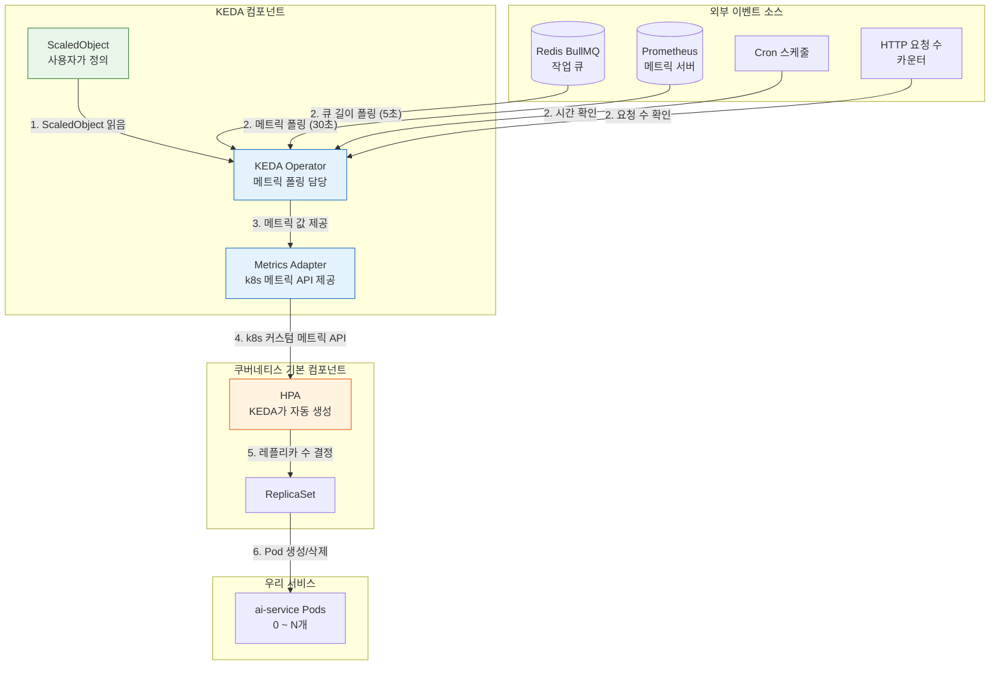
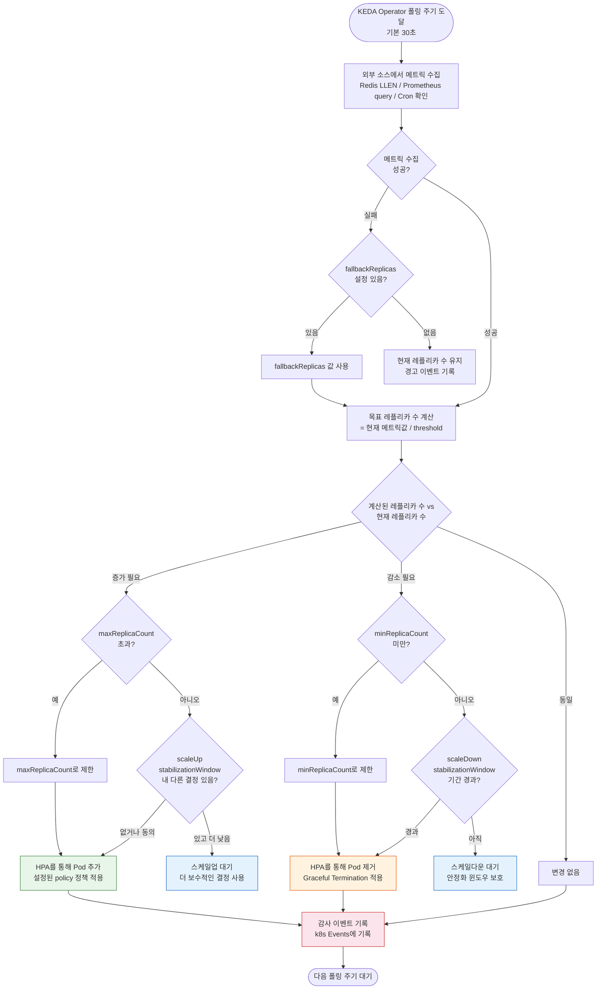

# KEDA 이벤트 기반 오토스케일 심화

> **문서 ID**: ONBOARD-04-INFRA-COMP-10
> **버전**: 1.0.0 | **작성일**: 2026-04-12 | **대상**: DevOps 엔지니어, 인프라 담당자, 백엔드 개발자
> **선행 학습**: `04-infrastructure/01-overview.md` (인프라 개요), `04-infrastructure/kubernetes/01-k3s-basics.md` (k3s 기초), `04-infrastructure/10-cost-optimization.md` (비용 최적화 — HPA/KEDA 개요 포함)
> **소요 시간**: 약 3~4시간 (실습 포함)
> **CSAP**: D-10 (서비스 가용성), D-12 (시스템 개발 보안)
> **Design Ref**: MTU-N56 §KEDA 오토스케일링, MTU-N113 §이벤트 오토스케일

---

## 목차

1. [KEDA란 무엇인가](#1-keda란-무엇인가)
   - 1.1 [이벤트 기반 스케일링이 필요한 이유](#11-이벤트-기반-스케일링이-필요한-이유)
   - 1.2 [HPA vs KEDA 비교](#12-hpa-vs-keda-비교)
   - 1.3 [KEDA 아키텍처 다이어그램](#13-keda-아키텍처-다이어그램)
   - 1.4 [우리 프로젝트에서 KEDA를 쓰는 이유](#14-우리-프로젝트에서-keda를-쓰는-이유)
2. [우리 프로젝트의 KEDA 사용 현황](#2-우리-프로젝트의-keda-사용-현황)
   - 2.1 [KEDA 배포 확인 방법](#21-keda-배포-확인-방법)
   - 2.2 [Redis 큐 기반 스케일링 (BullMQ 연동)](#22-redis-큐-기반-스케일링-bullmq-연동)
   - 2.3 [Prometheus 메트릭 기반 스케일링](#23-prometheus-메트릭-기반-스케일링)
   - 2.4 [Cron 기반 야간 스케일다운](#24-cron-기반-야간-스케일다운)
3. [ScaledObject 작성 실습](#3-scaledobject-작성-실습)
   - 3.1 [Redis Scaler — 큐 길이 기반 스케일링](#31-redis-scaler--큐-길이-기반-스케일링)
   - 3.2 [Prometheus Scaler — AI 요청 처리량 기반](#32-prometheus-scaler--ai-요청-처리량-기반)
   - 3.3 [CPU/메모리 복합 스케일링](#33-cpumemory-복합-스케일링)
   - 3.4 [Cron Scaler — 예측 가능한 트래픽 처리](#34-cron-scaler--예측-가능한-트래픽-처리)
   - 3.5 [ScaledJob — 배치 작업용 스케일링](#35-scaledjob--배치-작업용-스케일링)
4. [스케일링 의사결정 흐름도](#4-스케일링-의사결정-흐름도)
5. [KEDA 트러블슈팅](#5-keda-트러블슈팅)
   - 5.1 [ScaledObject 동작하지 않을 때 진단 방법](#51-scaledobject-동작하지-않을-때-진단-방법)
   - 5.2 [메트릭 폴링 실패 처리](#52-메트릭-폴링-실패-처리)
   - 5.3 [스케일링 중 요청 손실 방지](#53-스케일링-중-요청-손실-방지)
6. [CSAP 연관성](#6-csap-연관성)
   - 6.1 [가용성 요건과 KEDA](#61-가용성-요건과-keda)
   - 6.2 [비용 vs 성능 균형 설정 기준](#62-비용-vs-성능-균형-설정-기준)
7. [운영 팁](#7-운영-팁)
   - 7.1 [최소 레플리카 수 설정 기준](#71-최소-레플리카-수-설정-기준)
   - 7.2 [스케일다운 속도 제어](#72-스케일다운-속도-제어)
   - 7.3 [KEDA 메트릭 Grafana 대시보드](#73-keda-메트릭-grafana-대시보드)
8. [학습 체크리스트](#8-학습-체크리스트)
9. [변경 이력](#9-변경-이력)

---

## 1. KEDA란 무엇인가

### 1.1 이벤트 기반 스케일링이 필요한 이유

쿠버네티스의 기본 스케일링 도구인 HPA(Horizontal Pod Autoscaler)는 **CPU와 메모리 사용률**만으로 스케일링을 결정합니다. 이 방식은 대부분의 웹 서비스에 잘 맞지만, 공공기관 SaaS처럼 **다양한 이벤트 소스**가 있는 환경에서는 한계가 있습니다.

왜 CPU/메모리 기반 스케일링만으로는 부족한지 구체적인 시나리오로 살펴봅니다.

```
시나리오 1: AI 문서 요약 서비스
  - 민원 처리 담당자가 오후 2시에 200개 문서를 일괄 업로드
  - BullMQ 큐에 200개 작업이 쌓임
  - 하지만 ai-service Pod는 아직 첫 번째 작업도 시작하지 않음
  - CPU/메모리 사용률: 5% (아직 처리 전이라 낮음)
  - HPA 판단: "스케일 불필요"
  - 결과: 200개 작업이 1개 Pod로만 처리 → 지연 발생

  KEDA 판단: "큐에 200개 작업 → 즉시 10개 Pod로 스케일업"
  결과: 200개 작업 병렬 처리 → 빠른 완료

시나리오 2: 공공 민원 포털 트래픽
  - 매일 09:00 공무원 출근 시간에 트래픽 급증
  - CPU가 높아지기까지는 약 3~5분 소요
  - HPA는 CPU가 높아진 후에야 스케일업 결정
  - 3~5분 동안 서비스 응답 지연

  KEDA 판단: "09:00 Cron 트리거 → 사전에 Pod 증가"
  결과: 트래픽 증가 전에 이미 준비 완료

시나리오 3: 외부 API 연동 배치
  - 매일 새벽 2시 행정 데이터 수집 배치가 실행됨
  - 평소에는 이 Pod가 전혀 필요 없음
  - HPA로는 "필요할 때만 실행하고 완료 후 0개로"가 불가능

  KEDA ScaledJob: "작업 있을 때만 Pod 생성, 없으면 0개"
```

**핵심 차이**: HPA는 현재 상태에 반응하지만, KEDA는 **미래 발생할 이벤트를 미리 감지**하여 선제적으로 스케일링합니다.

### 1.2 HPA vs KEDA 비교

| 항목 | HPA (기본 k8s) | KEDA |
|------|---------------|------|
| 스케일링 기준 | CPU, 메모리 | 큐 길이, 메트릭, Cron, HTTP 요청 수 등 50+ |
| 최소 레플리카 | 1 이상 | 0 가능 (완전 셧다운) |
| 반응 속도 | 15초 이상 (메트릭 수집 주기) | Scaler 설정에 따라 수초 |
| 선제적 스케일링 | 불가 (반응형) | Cron Scaler로 사전 스케일업 가능 |
| 배치 작업 | 지원 안 함 | ScaledJob으로 지원 |
| 외부 시스템 연동 | 불가 | Redis, Kafka, RabbitMQ, DB, HTTP 등 |
| HPA와 관계 | 단독 작동 | HPA를 내부적으로 활용 (KEDA가 HPA 생성) |
| 학습 난이도 | 낮음 | 중간 (Scaler 개념 이해 필요) |

**중요한 점**: KEDA는 HPA를 대체하는 것이 아니라 **HPA를 더 똑똑하게 만드는 도구**입니다. KEDA가 ScaledObject를 생성하면, 내부적으로 HPA가 생성되고 KEDA가 HPA에게 올바른 메트릭을 제공합니다.

### 1.3 KEDA 아키텍처 다이어그램

KEDA가 어떻게 동작하는지 전체 흐름을 이해합니다.



**각 컴포넌트 역할 설명**:

- **ScaledObject**: 개발자가 작성하는 YAML 파일. "어떤 이벤트 소스를 보고, 어떻게 스케일링할지" 정의합니다.
- **KEDA Operator**: ScaledObject를 읽고 외부 이벤트 소스(Redis, Prometheus 등)를 주기적으로 폴링합니다.
- **Metrics Adapter**: KEDA가 수집한 외부 메트릭을 쿠버네티스 표준 메트릭 API 형식으로 변환합니다.
- **HPA**: KEDA가 자동으로 생성하고 관리합니다. 직접 수정하면 KEDA와 충돌하므로 주의하십시오.

### 1.4 우리 프로젝트에서 KEDA를 쓰는 이유

이 프로젝트는 다음과 같은 특성 때문에 KEDA가 필수입니다.

```
이유 1: AI 작업의 비동기 처리 패턴
  - ai-service는 대부분의 무거운 작업(OCR, 요약, 번역)을 BullMQ 큐에 넣음
  - 큐에 작업이 쌓이면 즉시 Worker Pod를 늘려야 함
  - 큐가 비면 Worker Pod를 줄여 리소스 절약

이유 2: 예측 가능한 트래픽 패턴
  - 공공기관 특성: 업무 시간(09:00~18:00) 집중
  - Cron Scaler로 출근 전 미리 Pod 증가 → 응답 지연 없음
  - 야간에 자동으로 최소 레플리카로 복귀

이유 3: 0개 스케일링 (비용 절약)
  - 배치 작업 전용 Worker는 작업이 없을 때 0개로 유지
  - HPA는 최소 1개를 유지해야 하지만 KEDA는 0개 가능

이유 4: Prometheus 메트릭 연동
  - SLO 기반 스케일링: "P95 응답 시간이 500ms 초과하면 스케일업"
  - 큐 길이가 아닌 비즈니스 메트릭으로 스케일링 결정

이유 5: CSAP 가용성 요건 (D-10)
  - CSAP는 서비스 가용성 99.5% 이상을 요구
  - KEDA로 부하 급증 시 자동 대응 → 가용성 확보
```

---

## 2. 우리 프로젝트의 KEDA 사용 현황

### 2.1 KEDA 배포 확인 방법

먼저 KEDA가 클러스터에 올바르게 배포되어 있는지 확인합니다.

```shell
# KEDA 네임스페이스 확인
kubectl get namespace keda

# KEDA 핵심 컴포넌트 Pod 확인
kubectl get pods -n keda
# 예상 출력:
# NAME                                      READY   STATUS    RESTARTS   AGE
# keda-operator-5d7b9b9b8c-xxxxx           1/1     Running   0          5d
# keda-operator-metrics-apiserver-xxxxx    1/1     Running   0          5d

# KEDA 버전 확인
kubectl get deployment keda-operator -n keda -o jsonpath='{.spec.template.spec.containers[0].image}'

# 현재 배포된 ScaledObject 목록 확인
kubectl get scaledobjects -A

# ScaledObject 상세 상태 확인
kubectl get scaledobject ai-service-scaledobject -n saas-system -o yaml

# KEDA가 자동 생성한 HPA 확인 (이름이 keda-hpa-로 시작)
kubectl get hpa -A | grep keda-hpa
```

### 2.2 Redis 큐 기반 스케일링 (BullMQ 연동)

우리 프로젝트에서 ai-service는 BullMQ를 사용하여 AI 작업을 큐잉합니다. KEDA의 Redis Scaler가 이 큐의 길이를 모니터링하여 Worker Pod 수를 자동으로 조정합니다.

**BullMQ 큐와 KEDA의 연동 원리**:

BullMQ는 Redis에 다음 형식으로 큐 데이터를 저장합니다.

```
Redis 키 구조 (BullMQ v5):
  bull:{큐 이름}:wait     → 대기 중인 작업 목록
  bull:{큐 이름}:active   → 처리 중인 작업 목록
  bull:{큐 이름}:completed → 완료된 작업 목록
  bull:{큐 이름}:failed   → 실패한 작업 목록

예시:
  bull:ai-document-queue:wait   → [job1, job2, job3, ...]
  bull:ai-document-queue:active → [job4]
```

KEDA Redis Scaler는 `LLEN bull:{큐이름}:wait` 명령으로 대기 작업 수를 확인합니다.

```yaml
# ai-service Redis 큐 기반 ScaledObject 예시
# Design Ref: MTU-N56 §KEDA 오토스케일링
apiVersion: keda.sh/v1alpha1
kind: ScaledObject
metadata:
  name: ai-worker-redis-scaledobject
  namespace: saas-system
  labels:
    app: ai-service
    component: worker
spec:
  # 스케일링 대상 Deployment 지정
  scaleTargetRef:
    apiVersion: apps/v1
    kind: Deployment
    name: ai-worker          # BullMQ Worker Deployment

  # 레플리카 수 범위
  minReplicaCount: 0         # 큐가 비면 0개로 (비용 절약)
  maxReplicaCount: 20        # 최대 20개 Worker

  # 스케일링 행동 제어
  advanced:
    horizontalPodAutoscalerConfig:
      behavior:
        scaleUp:
          stabilizationWindowSeconds: 30   # 스케일업은 30초 기다린 후 결정
          policies:
          - type: Pods
            value: 5
            periodSeconds: 60              # 60초마다 최대 5개씩 추가
        scaleDown:
          stabilizationWindowSeconds: 300  # 스케일다운은 5분 기다린 후 결정 (안전)
          policies:
          - type: Pods
            value: 2
            periodSeconds: 60              # 60초마다 최대 2개씩 제거

  triggers:
  - type: redis
    metadata:
      # Redis 서버 주소 (Vault에서 가져온 값 사용)
      address: redis-master.saas-system.svc.cluster.local:6379

      # BullMQ 큐 이름 (실제 큐 이름과 일치해야 함)
      listName: bull:ai-document-queue:wait

      # 큐 길이 1개당 Pod 1개 생성 기준
      # listLength 10 = 대기 작업 10개당 Pod 1개
      listLength: "10"

      # 데이터베이스 번호 (기본 0)
      db: "0"

      # 연결 방식 설정
      enableTLS: "false"

    # Redis 비밀번호는 Secret에서 참조 (CSAP D-09: 시크릿 하드코딩 금지)
    authenticationRef:
      name: redis-trigger-auth
```

**Redis 인증 Secret 설정**:

```yaml
# TriggerAuthentication — Redis 비밀번호 연결
# CSAP D-09: 시크릿은 환경 변수/Secret으로 관리
apiVersion: keda.sh/v1alpha1
kind: TriggerAuthentication
metadata:
  name: redis-trigger-auth
  namespace: saas-system
spec:
  secretTargetRef:
  - parameter: password
    name: redis-credentials     # k8s Secret 이름
    key: redis-password         # Secret의 키 이름
---
# 실제 Secret (Vault에서 External Secrets Operator로 자동 생성됨)
apiVersion: v1
kind: Secret
metadata:
  name: redis-credentials
  namespace: saas-system
type: Opaque
# 값은 base64 인코딩 (실제 환경에서는 Vault로 관리)
data:
  redis-password: <base64-encoded-password>
```

### 2.3 Prometheus 메트릭 기반 스케일링

CPU/메모리가 아닌 **비즈니스 메트릭**으로 스케일링합니다. 예를 들어 AI API 요청 처리 시간이 기준을 초과하면 즉시 스케일업합니다.

```yaml
# Prometheus 기반 AI 서비스 스케일링
# "AI API P95 응답 시간이 500ms 초과하면 스케일업"
apiVersion: keda.sh/v1alpha1
kind: ScaledObject
metadata:
  name: ai-service-prometheus-scaledobject
  namespace: saas-system
spec:
  scaleTargetRef:
    kind: Deployment
    name: ai-service

  minReplicaCount: 2     # AI 서비스는 최소 2개 유지 (가용성)
  maxReplicaCount: 10

  # 메트릭 수집 간격 (기본 30초)
  pollingInterval: 30

  # 스케일다운 대기 시간 (AI 서비스는 초기화가 느리므로 여유 있게)
  cooldownPeriod: 300

  triggers:
  - type: prometheus
    metadata:
      # Prometheus 서버 URL
      serverAddress: http://prometheus-operated.monitoring.svc.cluster.local:9090

      # 스케일링 기준 메트릭 쿼리 (PromQL)
      # ai_service_request_duration_seconds P95가 0.5초 초과하면 스케일업
      query: |
        histogram_quantile(0.95,
          rate(ai_service_request_duration_seconds_bucket[5m])
        )

      # 임계값: 이 값을 초과하면 스케일업
      threshold: "0.5"

      # 메트릭 없으면 (서비스 시작 전) 기본값
      activationThreshold: "0.1"

      # 네임스페이스 필터
      namespace: saas-system

      # 메트릭 이름 (HPA에서 참조할 이름)
      metricName: ai_request_p95_latency
```

### 2.4 Cron 기반 야간 스케일다운

공공기관 특성상 업무 시간이 명확하므로, Cron 트리거로 예측 가능한 스케일링을 구현합니다.

```yaml
# Cron 기반 업무 시간 스케일링
# 출근 전 미리 확장 → 퇴근 후 자동 축소
apiVersion: keda.sh/v1alpha1
kind: ScaledObject
metadata:
  name: portal-cron-scaledobject
  namespace: saas-system
spec:
  scaleTargetRef:
    kind: Deployment
    name: portal-frontend

  minReplicaCount: 1      # 야간 최소 1개 (완전 중단 방지)
  maxReplicaCount: 10

  triggers:
  # 평일 오전 확장: 08:30에 10개로 확장 (출근 30분 전)
  - type: cron
    metadata:
      timezone: "Asia/Seoul"     # 한국 시간대
      start: "30 8 * * 1-5"     # 평일 08:30
      end: "0 19 * * 1-5"       # 평일 19:00
      desiredReplicas: "10"     # 업무 시간: 10개

  # 점심 시간 약간 축소 (12:00~13:00)
  # 주석: 점심 시간 트래픽 패턴을 모니터링한 후 적용 여부 결정 필요
  # - type: cron
  #   metadata:
  #     timezone: "Asia/Seoul"
  #     start: "0 12 * * 1-5"
  #     end: "0 13 * * 1-5"
  #     desiredReplicas: "5"

  advanced:
    horizontalPodAutoscalerConfig:
      behavior:
        scaleUp:
          stabilizationWindowSeconds: 0    # Cron 이벤트는 즉시 스케일업
        scaleDown:
          stabilizationWindowSeconds: 1800  # 퇴근 후 30분 동안 관찰 후 축소
```

---

## 3. ScaledObject 작성 실습

### 3.1 Redis Scaler — 큐 길이 기반 스케일링

**실습 목표**: notification-service의 이메일 발송 큐를 모니터링하여 스케일링을 구현합니다.

```yaml
# notification-worker-scaledobject.yaml
# 이메일 알림 발송 Worker 스케일링
# Plan SC: FR-N113.1 — 이벤트 기반 오토스케일링 구현
apiVersion: keda.sh/v1alpha1
kind: ScaledObject
metadata:
  name: notification-worker-scaledobject
  namespace: saas-system
  annotations:
    # 문서 추적성 (CSAP 감리 대비)
    csap.reference: "MTU-N56 §KEDA 오토스케일링"
    design.ref: "FR-N113.1"
spec:
  scaleTargetRef:
    apiVersion: apps/v1
    kind: Deployment
    name: notification-worker

  # 최소 0개: 큐가 비면 Worker 0개 유지 (비용 절약)
  # 주의: 0으로 설정하면 첫 작업이 올 때까지 Pod 시작 시간만큼 지연 발생
  # 허용 지연: 이메일은 수초 지연이 허용되므로 0으로 설정
  minReplicaCount: 0
  maxReplicaCount: 30

  # 폴링 간격: 5초마다 큐 길이 확인
  pollingInterval: 5

  # 큐가 빈 후 300초(5분) 후에 스케일다운 시작
  cooldownPeriod: 300

  triggers:
  - type: redis
    metadata:
      address: redis-master.saas-system.svc.cluster.local:6379
      listName: bull:notification-email-queue:wait
      # 작업 10개당 Worker 1개 추가
      listLength: "10"
      db: "0"
      # 큐에 1개 이상 있을 때부터 스케일링 시작 (0.1 = 1/10개 이상)
      activationListLength: "1"
    authenticationRef:
      name: redis-trigger-auth

  advanced:
    horizontalPodAutoscalerConfig:
      behavior:
        scaleUp:
          stabilizationWindowSeconds: 0     # 작업 쌓이면 즉시 스케일업
          policies:
          - type: Pods
            value: 10                       # 한 번에 최대 10개 추가
            periodSeconds: 60
        scaleDown:
          stabilizationWindowSeconds: 300   # 5분 동안 안정적이면 스케일다운
          policies:
          - type: Pods
            value: 3
            periodSeconds: 60
```

**ScaledObject 적용 및 확인**:

```shell
# ScaledObject 적용
kubectl apply -f notification-worker-scaledobject.yaml

# 상태 확인 (READY: True가 되어야 함)
kubectl get scaledobject notification-worker-scaledobject -n saas-system

# 상세 상태 (이벤트 및 메트릭 확인)
kubectl describe scaledobject notification-worker-scaledobject -n saas-system

# KEDA가 생성한 HPA 확인
kubectl get hpa keda-hpa-notification-worker-scaledobject -n saas-system

# 실시간 레플리카 수 모니터링
watch kubectl get deployment notification-worker -n saas-system

# 테스트: Redis에 직접 작업 추가하여 스케일링 확인
kubectl exec -it redis-master-0 -n saas-system -- redis-cli \
  LPUSH bull:notification-email-queue:wait '{"id":"test-1","data":{}}'
```

### 3.2 Prometheus Scaler — AI 요청 처리량 기반

**실습 목표**: ai-service의 실제 요청 처리량을 기준으로 스케일링합니다.

먼저 Prometheus에서 사용할 메트릭이 존재하는지 확인합니다.

```shell
# Prometheus에서 메트릭 확인
kubectl port-forward svc/prometheus-operated 9090:9090 -n monitoring &

# PromQL로 메트릭 확인 (브라우저에서 http://localhost:9090 열기)
# 또는 curl로 확인
curl -s 'http://localhost:9090/api/v1/query?query=rate(http_requests_total{service="ai-service"}[1m])'
```

```yaml
# ai-service-prometheus-scaledobject.yaml
# AI 서비스 요청량 기반 스케일링
apiVersion: keda.sh/v1alpha1
kind: ScaledObject
metadata:
  name: ai-service-prometheus-scaledobject
  namespace: saas-system
spec:
  scaleTargetRef:
    kind: Deployment
    name: ai-service

  # AI 서비스는 최소 2개 (고가용성)
  minReplicaCount: 2
  maxReplicaCount: 15

  pollingInterval: 30   # 30초마다 Prometheus 조회

  triggers:
  - type: prometheus
    metadata:
      serverAddress: http://prometheus-operated.monitoring.svc.cluster.local:9090

      # 메트릭 1: 초당 요청 수 기반 스케일링
      # Pod 1개당 초당 100 요청 처리 목표
      query: |
        sum(rate(http_requests_total{
          namespace="saas-system",
          service="ai-service"
        }[1m]))
      threshold: "100"
      metricName: ai_requests_per_second

  # 두 번째 트리거: 응답 지연 기반 (OR 조건으로 작동)
  # 요청 수가 낮아도 지연이 높으면 스케일업
  - type: prometheus
    metadata:
      serverAddress: http://prometheus-operated.monitoring.svc.cluster.local:9090
      query: |
        histogram_quantile(0.95,
          sum(rate(http_request_duration_seconds_bucket{
            namespace="saas-system",
            service="ai-service"
          }[5m])) by (le)
        ) * 1000
      # P95 응답 시간이 2000ms(2초) 초과하면 스케일업
      threshold: "2000"
      metricName: ai_p95_latency_ms
```

### 3.3 CPU/메모리 복합 스케일링

KEDA는 CPU/메모리 기반 스케일링도 지원합니다. 외부 이벤트와 함께 사용할 수 있습니다.

```yaml
# api-gateway 복합 스케일링
# CPU 또는 메모리 중 하나라도 기준 초과하면 스케일업
apiVersion: keda.sh/v1alpha1
kind: ScaledObject
metadata:
  name: api-gateway-composite-scaledobject
  namespace: saas-system
spec:
  scaleTargetRef:
    kind: Deployment
    name: api-gateway

  minReplicaCount: 3     # 게이트웨이는 항상 최소 3개
  maxReplicaCount: 20

  triggers:
  # CPU 기반 (60% 초과 시 스케일업)
  - type: cpu
    metricType: Utilization   # Utilization: 사용률 %, AverageValue: 절대값
    metadata:
      value: "60"

  # 메모리 기반 (70% 초과 시 스케일업)
  - type: memory
    metricType: Utilization
    metadata:
      value: "70"

  # HTTP 요청 수 기반 (초당 500 요청 초과 시)
  - type: prometheus
    metadata:
      serverAddress: http://prometheus-operated.monitoring.svc.cluster.local:9090
      query: |
        sum(rate(traefik_service_requests_total{
          service="api-gateway@kubernetes"
        }[1m]))
      threshold: "500"
      metricName: gateway_requests_per_second
```

### 3.4 Cron Scaler — 예측 가능한 트래픽 처리

공공기관의 업무 패턴에 최적화된 Cron 스케일링 예시입니다.

```yaml
# 공공기관 업무 시간 스케일링 설계
# 패턴: 출근 → 오전 집중 → 점심 소강 → 오후 집중 → 야간 최소
apiVersion: keda.sh/v1alpha1
kind: ScaledObject
metadata:
  name: government-hours-scaledobject
  namespace: saas-system
spec:
  scaleTargetRef:
    kind: Deployment
    name: portal-api

  minReplicaCount: 1
  maxReplicaCount: 20

  triggers:
  # 출근 전 예열 (08:30 ~ 09:00): 중간 규모
  - type: cron
    metadata:
      timezone: "Asia/Seoul"
      start: "30 8 * * 1-5"     # 평일 08:30 시작
      end: "0 9 * * 1-5"        # 평일 09:00 종료
      desiredReplicas: "5"

  # 오전 업무 (09:00 ~ 12:00): 최대 규모
  - type: cron
    metadata:
      timezone: "Asia/Seoul"
      start: "0 9 * * 1-5"
      end: "0 12 * * 1-5"
      desiredReplicas: "15"

  # 점심 시간 (12:00 ~ 13:00): 축소
  - type: cron
    metadata:
      timezone: "Asia/Seoul"
      start: "0 12 * * 1-5"
      end: "0 13 * * 1-5"
      desiredReplicas: "5"

  # 오후 업무 (13:00 ~ 18:00): 최대 규모
  - type: cron
    metadata:
      timezone: "Asia/Seoul"
      start: "0 13 * * 1-5"
      end: "0 18 * * 1-5"
      desiredReplicas: "15"

  # 야근 대비 (18:00 ~ 20:00): 중간 규모
  - type: cron
    metadata:
      timezone: "Asia/Seoul"
      start: "0 18 * * 1-5"
      end: "0 20 * * 1-5"
      desiredReplicas: "5"
  # 20:00 이후: minReplicaCount(1)으로 자동 복귀
```

### 3.5 ScaledJob — 배치 작업용 스케일링

ScaledObject는 Deployment를 스케일링하지만, ScaledJob은 **Job을 직접 생성**합니다. 한 번 실행하고 종료되는 배치 작업에 적합합니다.

```yaml
# 야간 데이터 수집 ScaledJob
# 큐에 배치 작업이 있을 때만 Job 생성, 없으면 0개
apiVersion: keda.sh/v1alpha1
kind: ScaledJob
metadata:
  name: data-collection-scaledjob
  namespace: saas-system
spec:
  jobTargetRef:
    parallelism: 5           # 동시 실행 Job 수
    completions: 1
    template:
      spec:
        restartPolicy: Never
        containers:
        - name: data-collector
          image: saas-registry.local/data-collector:latest
          resources:
            requests:
              cpu: "500m"
              memory: "512Mi"
            limits:
              cpu: "1"
              memory: "1Gi"
          env:
          - name: QUEUE_NAME
            value: "data-collection-queue"
          - name: REDIS_URL
            valueFrom:
              secretKeyRef:
                name: redis-credentials
                key: redis-url

  # 큐 1개당 Job 1개 생성
  triggers:
  - type: redis
    metadata:
      address: redis-master.saas-system.svc.cluster.local:6379
      listName: bull:data-collection-queue:wait
      listLength: "1"    # 작업 1개당 Job 1개
    authenticationRef:
      name: redis-trigger-auth

  # 완료된 Job 정리 정책
  successfulJobsHistoryLimit: 5    # 성공한 Job 5개 보존
  failedJobsHistoryLimit: 3        # 실패한 Job 3개 보존

  # Job 생성 정책
  maxReplicaCount: 10   # 동시 최대 10개 Job
  pollingInterval: 10   # 10초마다 큐 확인
```

---

## 4. 스케일링 의사결정 흐름도

KEDA가 스케일링 결정을 어떻게 내리는지 전체 흐름을 이해합니다.



**목표 레플리카 수 계산 공식**:

```
목표 레플리카 수 = ceil(현재_메트릭_값 / threshold)

예시 (Redis 큐):
  현재 큐 길이 = 47개 작업
  listLength (threshold) = 10
  목표 레플리카 수 = ceil(47 / 10) = ceil(4.7) = 5

예시 (Prometheus):
  현재 요청량 = 320 req/s
  threshold = 100 req/s per Pod
  목표 레플리카 수 = ceil(320 / 100) = ceil(3.2) = 4
```

---

## 5. KEDA 트러블슈팅

### 5.1 ScaledObject 동작하지 않을 때 진단 방법

ScaledObject를 적용했는데 스케일링이 일어나지 않을 때 단계적으로 진단합니다.

**1단계: ScaledObject 상태 확인**

```shell
# ScaledObject 상태 확인 (READY와 ACTIVE 컬럼 확인)
kubectl get scaledobject -n saas-system
# 출력 예시:
# NAME                         SCALETARGETKIND   SCALETARGETNAME   MIN   MAX   READY   ACTIVE   ...
# ai-worker-redis-scaledobject Deployment        ai-worker         0     20    True    True     ...

# READY=False인 경우 describe로 원인 확인
kubectl describe scaledobject ai-worker-redis-scaledobject -n saas-system

# 주요 확인 사항:
# Conditions:
#   Type            Status   Reason
#   AbleToScale     True     ...        → HPA와 정상 연결
#   ScalingActive   True     ...        → 현재 스케일링 중
#   ScalingLimited  False    ...        → min/max 제한에 걸리지 않음
```

**2단계: KEDA Operator 로그 확인**

```shell
# KEDA Operator 로그에서 에러 확인
kubectl logs -n keda deployment/keda-operator --since=10m | grep -E "ERROR|WARN|ai-worker"

# 자주 나타나는 에러 메시지와 원인:
#
# "failed to get scaler" → Scaler 설정 오류 (Redis 주소, 큐 이름 확인)
# "connection refused" → Redis/Prometheus 서버 접근 불가
# "authentication failed" → TriggerAuthentication Secret 설정 오류
# "no metrics returned" → PromQL 쿼리가 결과 없음 (쿼리 직접 확인 필요)
```

**3단계: KEDA가 생성한 HPA 확인**

```shell
# HPA 상태 확인
kubectl get hpa keda-hpa-ai-worker-redis-scaledobject -n saas-system -o yaml

# HPA 이벤트 확인
kubectl describe hpa keda-hpa-ai-worker-redis-scaledobject -n saas-system

# 자주 나타나는 HPA 에러:
# "unable to fetch metrics" → Metrics API 서버 문제
# "the HPA was able to successfully calculate a replica count" → 정상
# "failed to get cpu utilization" → Pod에 resources.requests.cpu 없음
```

**4단계: Metrics API 서버 확인**

```shell
# KEDA Metrics Adapter 상태 확인
kubectl get deployment keda-operator-metrics-apiserver -n keda

# Metrics API 서버 로그
kubectl logs -n keda deployment/keda-operator-metrics-apiserver --since=5m

# k8s 커스텀 메트릭 API에서 메트릭 확인
kubectl get --raw "/apis/external.metrics.k8s.io/v1beta1/namespaces/saas-system/s0-redis-bull:ai-document-queue:wait"
```

**5단계: Redis 연결 직접 테스트**

```shell
# Redis에 직접 연결하여 큐 길이 확인
kubectl exec -it redis-master-0 -n saas-system -- redis-cli

# Redis CLI에서 실행:
AUTH <redis-password>
LLEN bull:ai-document-queue:wait     # 대기 큐 길이
LLEN bull:ai-document-queue:active  # 처리 중 큐 길이
LLEN bull:ai-document-queue:failed  # 실패한 작업 수

# TriggerAuthentication이 올바른 Secret을 참조하는지 확인
kubectl get triggerauthentication redis-trigger-auth -n saas-system -o yaml
kubectl get secret redis-credentials -n saas-system -o jsonpath='{.data.redis-password}' | base64 -d
```

### 5.2 메트릭 폴링 실패 처리

외부 소스(Redis, Prometheus)에 일시적으로 접근이 불가능할 때 KEDA 동작을 제어합니다.

```yaml
# 폴링 실패 시 fallback 설정
# CSAP D-10: 장애 상황에서도 최소 서비스 수준 유지
apiVersion: keda.sh/v1alpha1
kind: ScaledObject
metadata:
  name: ai-worker-with-fallback
  namespace: saas-system
spec:
  scaleTargetRef:
    kind: Deployment
    name: ai-worker

  minReplicaCount: 2
  maxReplicaCount: 20

  # 폴백 설정: 메트릭 폴링 실패 시 동작
  fallback:
    failureThreshold: 3          # 연속 3번 실패 시 폴백 적용
    replicas: 5                  # 폴백 시 5개로 유지 (서비스 지속)

  triggers:
  - type: redis
    metadata:
      address: redis-master.saas-system.svc.cluster.local:6379
      listName: bull:ai-document-queue:wait
      listLength: "10"
    authenticationRef:
      name: redis-trigger-auth
```

**폴링 실패 원인별 해결 방법**:

```shell
# 원인 1: Redis Pod 재시작 중
# 증상: "connection refused to redis-master:6379"
# 해결: Redis가 복구되면 자동으로 정상화됨. fallback 설정으로 서비스 유지

# 원인 2: Network Policy 차단
# 증상: "i/o timeout" 또는 "connection timed out"
kubectl get networkpolicy -n saas-system
# keda-operator Pod에서 Redis로의 트래픽이 허용되어 있는지 확인

# 예시 NetworkPolicy (keda-operator 허용)
cat << 'EOF' | kubectl apply -f -
apiVersion: networking.k8s.io/v1
kind: NetworkPolicy
metadata:
  name: allow-keda-to-redis
  namespace: saas-system
spec:
  podSelector:
    matchLabels:
      app: redis
  ingress:
  - from:
    - namespaceSelector:
        matchLabels:
          kubernetes.io/metadata.name: keda
    ports:
    - protocol: TCP
      port: 6379
EOF

# 원인 3: Prometheus 쿼리가 데이터 없음 반환
# 증상: "no metrics found for scaler"
# 해결: Prometheus에서 직접 쿼리 확인
kubectl port-forward svc/prometheus-operated 9090:9090 -n monitoring
# http://localhost:9090 접속 후 PromQL 직접 실행하여 결과 확인
```

### 5.3 스케일링 중 요청 손실 방지

Pod가 삭제될 때 처리 중인 요청이 손실되지 않도록 Graceful Shutdown을 설정합니다.

**ai-service의 Graceful Shutdown 설정 확인**:

```yaml
# Deployment에 Graceful Shutdown 설정
# platform/services/ai-service 배포 Deployment 예시
apiVersion: apps/v1
kind: Deployment
metadata:
  name: ai-service
  namespace: saas-system
spec:
  template:
    spec:
      # SIGTERM 신호 후 최대 대기 시간
      # AI 작업이 최대 120초 걸리므로 충분한 시간 확보
      terminationGracePeriodSeconds: 180  # 3분

      containers:
      - name: ai-service
        # 앱이 SIGTERM을 받으면 새 요청 거부, 기존 요청 완료 후 종료
        # platform/packages/mesh-ready/src/graceful-shutdown.ts 참조
        lifecycle:
          preStop:
            exec:
              # 새 요청 거부 후 30초 대기 (로드밸런서에서 제거 대기)
              command: ["/bin/sh", "-c", "sleep 30"]
```

```shell
# BullMQ Worker의 Graceful Shutdown 확인
# ai-service가 SIGTERM을 받으면 새 작업 처리 중단, 현재 작업 완료 후 종료

# Worker 로그에서 Graceful Shutdown 확인
kubectl logs -n saas-system deployment/ai-worker --since=5m | grep -E "SIGTERM|graceful|shutdown"

# 스케일다운 중 작업 손실 여부 모니터링
# BullMQ failed 큐에 새 항목이 추가되면 Graceful Shutdown이 제대로 안 된 것
kubectl exec -it redis-master-0 -n saas-system -- redis-cli \
  LLEN bull:ai-document-queue:failed
```

**PodDisruptionBudget 설정 (스케일다운 시 최소 Pod 보장)**:

```yaml
# PDB: 스케일다운 시 최소 레플리카 수 보장
# CSAP D-10: 서비스 연속성 보장
apiVersion: policy/v1
kind: PodDisruptionBudget
metadata:
  name: ai-service-pdb
  namespace: saas-system
spec:
  minAvailable: 1          # 스케일다운 중에도 최소 1개 Pod 유지
  selector:
    matchLabels:
      app: ai-service
```

---

## 6. CSAP 연관성

### 6.1 가용성 요건과 KEDA

CSAP D-10(서비스 가용성)은 공공 SaaS가 최소 99.5% 가용성을 유지할 것을 요구합니다. KEDA는 이 요건 달성에 핵심 역할을 합니다.

```
CSAP D-10 가용성 요건 충족 방법:

요건: 월간 가용성 99.5% 이상
  → 월 최대 허용 다운타임: 약 3.6시간

KEDA 기여:
  1. 트래픽 급증 자동 대응
     - CPU 임계 초과 3분 전에 Redis 큐 기반 스케일업
     - 요청 손실 없이 처리 용량 확장

  2. 장애 복구 자동화
     - Pod 장애 시 KEDA가 목표 레플리카 수 유지
     - 스케일다운 후 새 장애 시 빠른 복구

  3. Graceful Shutdown 보장
     - Pod 삭제 전 처리 중 요청 완료
     - 5XX 에러 없는 무중단 스케일링

CSAP 증거 자료:
  - kubectl describe scaledobject 출력 → ScaledObject 동작 증거
  - k8s Events 로그 → 자동 스케일링 이력
  - Grafana 대시보드 → 가용성 시각화 증거
```

### 6.2 비용 vs 성능 균형 설정 기준

```
온프레미스(WSL2 + k3s) 환경에서의 리소스 균형:

총 가용 리소스 (예시):
  - CPU: 16코어
  - 메모리: 32GB

권장 배분:
  - 시스템 예약: CPU 2코어, 메모리 4GB
  - 인프라 컴포넌트: CPU 4코어, 메모리 8GB
  - 서비스 Pod (평상시): CPU 6코어, 메모리 12GB
  - KEDA 스케일업 버퍼: CPU 4코어, 메모리 8GB

스케일링 설정 원칙:
  1. 평상시 부하에서 CPU/메모리 50~60% 사용률 목표
     → 급증 시 2배 여유 확보

  2. maxReplicaCount = 총 리소스 / Pod 리소스 요청 * 0.8
     → 전체 리소스의 80%까지만 사용 (오버헤드 여유)

  3. minReplicaCount 결정 기준:
     - 사용자 대면 서비스: 최소 2개 (HA)
     - 내부 Worker: 0개 가능 (비용 절약)
     - AI 서비스: 최소 2개 (콜드 스타트 방지)
```

---

## 7. 운영 팁

### 7.1 최소 레플리카 수 설정 기준

```
서비스 유형별 권장 minReplicaCount:

사용자 대면 서비스 (portal-frontend, api-gateway):
  minReplicaCount: 2~3
  이유: 한 Pod 장애 시 즉시 다른 Pod로 트래픽 전환 필요

AI 처리 서비스 (ai-service):
  minReplicaCount: 2
  이유: 모델 로딩 시간이 길어 콜드 스타트가 오래 걸림
       (0으로 설정 시 첫 요청 30초+ 지연 가능)

Background Worker (ai-worker, notification-worker):
  minReplicaCount: 0
  이유: 작업이 없을 때 리소스 낭비 방지. 지연 허용됨.

배치 작업 (ScaledJob):
  minReplicaCount: 0 (ScaledJob은 0이 기본)
  이유: 작업이 있을 때만 실행하는 것이 목적

내부 API 서비스 (auth-service, tenant-service):
  minReplicaCount: 2
  이유: 다른 모든 서비스가 의존하므로 HA 필수
```

### 7.2 스케일다운 속도 제어

무분별한 스케일다운은 요청 손실을 유발할 수 있습니다. 안전한 설정 방법입니다.

```yaml
# 안전한 스케일다운 설정
advanced:
  horizontalPodAutoscalerConfig:
    behavior:
      scaleDown:
        # stabilizationWindowSeconds: 이 시간 동안 "축소 필요" 상태가
        # 지속될 때만 스케일다운 실행 (급격한 변화 완충)
        stabilizationWindowSeconds: 300  # 5분 관찰 후 결정

        policies:
        # 한 번에 제거할 수 있는 Pod 수 제한
        - type: Pods
          value: 2            # 한 번에 최대 2개씩만 제거
          periodSeconds: 60   # 60초 간격으로

        # 또는 비율로 제한 (전체의 10%씩)
        - type: Percent
          value: 10
          periodSeconds: 60

        # 두 정책 중 더 보수적인(느린) 것을 선택
        selectPolicy: Min

# 서비스별 권장 stabilizationWindowSeconds:
# AI 서비스: 600초 (10분) — 처리 중 작업 완료 대기
# Worker: 300초 (5분) — 큐 일시적 비움 구분
# 프론트엔드: 180초 (3분) — 트래픽 일시 감소 구분
# 배치 Worker: 60초 (1분) — 빠른 축소로 비용 절약
```

### 7.3 KEDA 메트릭 Grafana 대시보드

KEDA 스케일링 상태를 Grafana에서 시각화합니다.

```shell
# KEDA 메트릭이 Prometheus에 수집되는지 확인
kubectl get servicemonitor -n keda
# 없으면 ServiceMonitor 생성 필요

# KEDA 기본 메트릭 이름들:
# keda_scaler_metrics_value      → Scaler 현재 메트릭 값
# keda_scaler_active             → Scaler 활성 여부
# keda_scaler_errors_total       → Scaler 에러 수
# keda_scaled_object_paused      → ScaledObject 일시정지 여부

# PromQL로 스케일링 현황 확인
# 현재 활성 ScaledObject 수
kubectl exec -it prometheus-0 -n monitoring -- \
  promtool query instant 'count(keda_scaler_active == 1)'

# Grafana에서 KEDA 대시보드 가져오기
# 커뮤니티 대시보드 ID: 16158 (KEDA Dashboard)
# Grafana → Import → 16158 입력
```

**KEDA 모니터링을 위한 핵심 Grafana 패널**:

```
패널 1: 서비스별 현재 레플리카 수
  PromQL: kube_deployment_spec_replicas{namespace="saas-system"}

패널 2: KEDA 스케일링 이벤트 (1시간)
  PromQL: changes(kube_deployment_spec_replicas{namespace="saas-system"}[1h])

패널 3: Redis 큐 길이 vs 레플리카 수 비교
  PromQL1: keda_scaler_metrics_value{scaler="redis",scaledObject="ai-worker-redis-scaledobject"}
  PromQL2: kube_deployment_spec_replicas{deployment="ai-worker"}

패널 4: KEDA 에러율
  PromQL: rate(keda_scaler_errors_total[5m])

패널 5: 스케일링으로 절약된 리소스
  설명: 평균 레플리카 수 vs maxReplicaCount 비율
  PromQL: avg_over_time(kube_deployment_spec_replicas{namespace="saas-system"}[24h])
          / keda_scaled_object_max_replicas
```

---

## 8. 학습 체크리스트

이 가이드를 완료했다면 다음 항목을 확인하십시오.

```
KEDA 기본 이해
[ ] HPA와 KEDA의 차이를 설명할 수 있다
[ ] KEDA Operator, Metrics Adapter, ScaledObject의 관계를 이해한다
[ ] 외부 이벤트 소스가 어떻게 k8s HPA 메트릭으로 변환되는지 설명할 수 있다

ScaledObject 작성
[ ] Redis Scaler로 BullMQ 큐 기반 ScaledObject를 작성할 수 있다
[ ] Prometheus Scaler로 비즈니스 메트릭 기반 스케일링을 구성할 수 있다
[ ] Cron Scaler로 업무 시간 기반 예측 스케일링을 구성할 수 있다
[ ] ScaledJob으로 배치 작업 스케일링을 구현할 수 있다
[ ] TriggerAuthentication으로 시크릿을 안전하게 참조할 수 있다

운영 실무
[ ] ScaledObject 상태를 kubectl로 확인할 수 있다
[ ] KEDA Operator 로그에서 에러를 찾을 수 있다
[ ] 스케일다운 설정(stabilizationWindowSeconds)의 역할을 이해한다
[ ] Graceful Shutdown이 요청 손실 방지에 필수적임을 이해한다
[ ] PodDisruptionBudget의 목적을 설명할 수 있다

CSAP 연관성
[ ] KEDA가 CSAP D-10 가용성 요건 달성에 어떻게 기여하는지 설명할 수 있다
[ ] TriggerAuthentication에서 시크릿 하드코딩이 금지된 이유를 안다 (CSAP D-09)
[ ] minReplicaCount 설정이 서비스 유형에 따라 다른 이유를 이해한다
```

---

## 9. 변경 이력

| 버전 | 일자 | 변경 내용 | 작성자 |
|------|------|---------|--------|
| 1.0.0 | 2026-04-12 | 초안 작성 — KEDA 이벤트 기반 오토스케일 심화 가이드 | Implementer (Sonnet) |

---

*다음 문서*: `04-infrastructure/components/README.md` → 컴포넌트 전체 목록 확인
*관련 문서*: `04-infrastructure/10-cost-optimization.md` (§3 HPA/KEDA 개요), `05-monitoring/README.md` (KEDA Grafana 모니터링)
