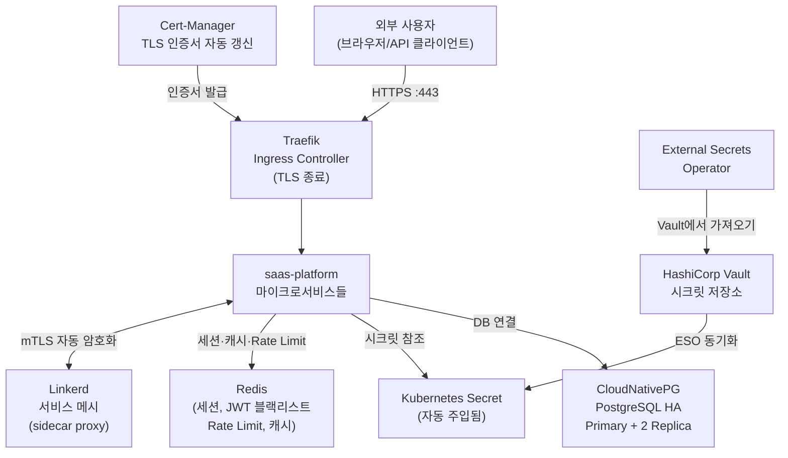

# 핵심 컴포넌트 — 학습 가이드

> **버전**: 1.0.0 | **작성일**: 2026-04-11
> **대상**: 신규 개발자, DevOps 엔지니어
> **선행 조건**: `kubernetes/03-gitops-flux.md` 완료

---

## 이 섹션의 목적

Kubernetes와 Helm을 이해했다면, 이 섹션에서는 공공기관 SaaS 프레임워크의 핵심 인프라 컴포넌트를 실제로 다루는 방법을 배웁니다.

---

## 핵심 컴포넌트 역할 표

| 컴포넌트 | 역할 | CSAP | 파일 |
|---------|------|------|------|
| **Traefik** | 외부 트래픽 단일 진입점, HTTP/HTTPS 라우팅 | D-08 | `01-traefik.md` |
| **Cert-Manager** | TLS 인증서 자동 발급·갱신 | D-09 | `02-cert-manager.md` |
| **CloudNativePG** | PostgreSQL HA 클러스터 (Primary + 2 Replica) | D-09 | `03-postgresql.md` |
| **Vault + ESO** | 시크릿 동적 관리, 자동 주입 | D-08, D-09 | `04-vault.md` |
| **Redis** | 세션 저장소, JWT 블랙리스트, Rate Limit, 캐시 | D-08-02~06 | `05-redis.md` |
| **Linkerd** | 서비스 메시, mTLS 자동 암호화, Zero Trust | D-09, D-08 | `06-linkerd.md` |
| **Kyverno** | 쿠버네티스 네이티브 정책 엔진, 배포 보안 강제 | D-05, D-08, D-11, D-12 | `07-kyverno-policies.md` |

---

## 컴포넌트 간 관계



---

## 학습 순서

```
01-traefik.md           → 트래픽이 어떻게 서비스에 도달하는지 이해
    ↓
02-cert-manager.md      → HTTPS가 어떻게 자동으로 적용되는지 이해
    ↓
03-postgresql.md        → 데이터가 어떻게 저장·보호되는지 이해
    ↓
04-vault.md             → 비밀번호가 어떻게 안전하게 서비스에 전달되는지 이해
    ↓
05-redis.md             → 세션·캐시·Rate Limit이 어떻게 처리되는지 이해
    ↓
06-linkerd.md           → 서비스 간 통신이 어떻게 자동 암호화되는지 이해
    ↓
07-kyverno-policies.md  → 배포 단계에서 보안 정책이 어떻게 강제되는지 이해
```

---

## 핵심 원칙 요약

- **Traefik**: 모든 외부 트래픽의 단일 진입점. 서비스를 직접 NodePort로 노출하지 않음
- **Cert-Manager**: TLS 인증서를 수동으로 갱신하지 않음. 만료 30일 전 자동 갱신
- **PostgreSQL**: DB에 직접 접속하여 스키마 변경 금지. 반드시 마이그레이션 파일 사용
- **Vault**: `.env` 파일이나 `values.yaml`에 비밀번호 직접 기재 절대 금지
- **Kyverno**: 서명 없는 이미지, 루트 컨테이너, 미인가 레지스트리는 배포 자체가 차단됨
