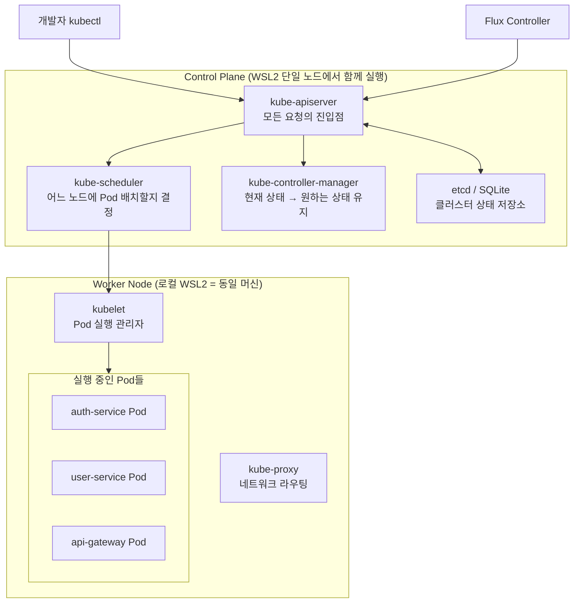

# k3s 기초 — Pod부터 Namespace까지

> **버전**: 1.0.0 | **작성일**: 2026-04-11
> **대상**: Kubernetes 입문자, 신규 개발자
> **CSAP**: D-11 (가상화 보안)
> **관련 문서**: `04-infrastructure.md` §3, `docs/07-infra/wsl-devops-complete-guide.md`

---

## 목차

1. [k3s란 무엇인가](#1-k3s란-무엇인가)
2. [클러스터 구조 이해](#2-클러스터-구조-이해)
3. [핵심 리소스 개념](#3-핵심-리소스-개념)
4. [kubectl 명령어 치트시트](#4-kubectl-명령어-치트시트)
5. [k9s — TUI 클러스터 관리](#5-k9s--tui-클러스터-관리)
6. [초보자 실습: auth-service Pod 상태 확인](#6-초보자-실습-auth-service-pod-상태-확인)
7. [자주 하는 실수와 해결법](#7-자주-하는-실수와-해결법)

---

## 1. k3s란 무엇인가

### 1.1 Kubernetes가 필요한 이유

서비스가 한 대의 서버에서 실행될 때는 단순합니다. 하지만 공공기관 SaaS처럼 여러 서비스(auth, user, tenant, ai 등)를 동시에 운영하면 문제가 복잡해집니다.

```
문제 상황 (Kubernetes 없이):
- 서버 1: auth-service 실행 중 → 장애 → 수동 재시작 필요
- 서버 2: user-service → 트래픽 급증 → 수동으로 서버 더 추가
- 배포: 각 서버에 SSH 접속 → 직접 명령어 실행 → 사람 실수 가능
- 업데이트: 모든 서버에 순차적으로 배포 → 시간 오래 걸림
```

Kubernetes는 이 모든 문제를 자동화합니다.

```
Kubernetes가 해결하는 것:
- 장애: Pod 자동 재시작 (사람이 새벽에 깨지 않아도 됨)
- 스케일링: 트래픽 증가 시 자동으로 Pod 추가 (KEDA)
- 배포: 롤링 업데이트로 무중단 배포 + 실패 시 자동 롤백
- 설정 관리: ConfigMap/Secret으로 환경별 설정 주입
```

### 1.2 k3s vs 일반 Kubernetes

k3s는 Rancher Labs에서 만든 경량 Kubernetes입니다. 공공기관 SaaS 프레임워크가 k3s를 선택한 이유:

| 항목 | k3s | 일반 k8s (kubeadm) |
|------|-----|-----------------|
| 메모리 사용량 | 512MB | 2GB+ |
| 설치 시간 | 30초 | 20분+ |
| 단일 바이너리 | 예 | 여러 컴포넌트 |
| Kubernetes API | 동일 100% 호환 | — |
| SQLite (etcd 대신) | 가능 (단일 노드) | etcd 필수 |
| 프로덕션 사용 | 가능 (HA 구성 시) | 표준 |
| WSL2 호환성 | 우수 | 복잡 |

**중요**: k3s는 경량화된 것이지, 제한된 Kubernetes가 아닙니다. 모든 kubectl 명령어와 Kubernetes API를 동일하게 사용합니다.

### 1.3 k3s 설치 확인

```bash
# k3s 버전 확인
kubectl version --client
# Client Version: v1.34.6+k3s1

# 클러스터 정보
kubectl cluster-info
# Kubernetes control plane is running at https://127.0.0.1:6443

# 설치된 노드 확인 (WSL2 단일 노드 환경에서는 1개)
kubectl get nodes
# NAME              STATUS   ROLES                  AGE   VERSION
# desktop-xxxxx     Ready    control-plane,master    7d    v1.34.6+k3s1
```

---

## 2. 클러스터 구조 이해

### 2.1 Control Plane과 Worker 노드



**WSL2 환경에서는 Control Plane과 Worker 노드가 동일한 머신에서 실행됩니다.** 프로덕션에서는 별도 서버로 분리됩니다.

### 2.2 요청 처리 흐름

`kubectl apply -f deployment.yaml`을 실행하면:

```
1. kubectl → kube-apiserver (API 서버에 요청 전송)
2. kube-apiserver → etcd (원하는 상태 저장)
3. kube-scheduler → 어느 노드에 Pod를 배치할지 결정
4. kubelet → 해당 노드에서 컨테이너 실행
5. kube-controller-manager → 실제 상태와 원하는 상태 지속 비교
```

---

## 3. 핵심 리소스 개념

Kubernetes에는 수십 가지 리소스 타입이 있지만, 일상 운영에서는 이 6가지만 알면 됩니다.

### 3.1 Pod — 최소 배포 단위

Pod는 Kubernetes에서 가장 작은 실행 단위입니다. 하나 이상의 컨테이너를 묶어서 관리합니다.

```
비유: Pod = 컨테이너들이 함께 사는 집
      - 같은 집(Pod) 안의 컨테이너들은 네트워크를 공유
      - localhost로 서로 통신 가능
      - 같은 볼륨(저장소) 공유 가능
```

```yaml
# Pod 예시 (직접 생성하는 경우는 드묾 — 보통 Deployment로 관리)
apiVersion: v1
kind: Pod
metadata:
  name: auth-service-pod
  namespace: saas-platform
  labels:
    app: auth-service
spec:
  containers:
    - name: auth-service
      image: localhost:8080/public-saas/auth-service:v1.2.3
      ports:
        - containerPort: 3001
      env:
        - name: DATABASE_URL
          valueFrom:
            secretKeyRef:
              name: auth-db-credentials
              key: url
      resources:
        requests:
          cpu: 50m        # 최소 보장 CPU (50밀리코어)
          memory: 128Mi   # 최소 보장 메모리
        limits:
          cpu: 250m       # 최대 사용 CPU
          memory: 256Mi   # 최대 사용 메모리
```

**Pod를 직접 생성하지 않는 이유**: Pod가 장애로 종료되면 자동으로 재시작되지 않습니다. 이를 해결하는 것이 Deployment입니다.

### 3.2 Deployment — Pod 관리자

Deployment는 Pod를 몇 개 유지할지 선언하고, 장애 시 자동 재시작, 업데이트 시 롤링 배포를 담당합니다.

```
비유: Deployment = Pod 관리 감독관
      - "auth-service Pod를 항상 2개 유지해"
      - 1개가 죽으면 즉시 새 Pod 생성
      - 업데이트 시 하나씩 교체 (무중단 배포)
```

```yaml
# Deployment 예시
apiVersion: apps/v1
kind: Deployment
metadata:
  name: auth-service
  namespace: saas-platform
spec:
  replicas: 2           # 항상 2개의 Pod 유지
  selector:
    matchLabels:
      app: auth-service
  template:             # 아래가 실제 Pod 정의
    metadata:
      labels:
        app: auth-service
    spec:
      containers:
        - name: auth-service
          image: localhost:8080/public-saas/auth-service:v1.2.3
          ports:
            - containerPort: 3001
  strategy:
    type: RollingUpdate
    rollingUpdate:
      maxUnavailable: 0   # 업데이트 중에도 항상 최소 2개 운영
      maxSurge: 1         # 업데이트 중 최대 3개까지 일시 허용
```

**Deployment 상태 확인**:

```bash
# Deployment 목록
kubectl get deployments -n saas-platform

# 배포 진행 상황 실시간 확인
kubectl rollout status deployment/auth-service -n saas-platform
# Waiting for deployment "auth-service" rollout to finish: 1 of 2 updated replicas are available...
# deployment "auth-service" successfully rolled out

# 이전 버전으로 롤백
kubectl rollout undo deployment/auth-service -n saas-platform
```

### 3.3 Service — 내부 네트워크 노출

Pod는 IP가 매번 바뀝니다. Service는 Pod들 앞에서 고정 DNS 이름과 로드밸런싱을 제공합니다.

```
비유: Service = 대표 전화번호
      - Pod IP는 Pod가 재시작될 때마다 바뀜 (임시 번호)
      - Service IP는 변하지 않음 (대표 번호)
      - 여러 Pod로 트래픽을 자동 분산 (로드밸런싱)
```

```yaml
# ClusterIP Service (클러스터 내부 전용)
apiVersion: v1
kind: Service
metadata:
  name: auth-service
  namespace: saas-platform
spec:
  selector:
    app: auth-service   # 이 레이블의 Pod들로 트래픽 전달
  ports:
    - port: 3001
      targetPort: 3001
  type: ClusterIP       # 클러스터 내부에서만 접근 가능
```

Service 타입별 특징:

| 타입 | 접근 범위 | 용도 |
|------|---------|------|
| ClusterIP | 클러스터 내부 전용 | 서비스 간 통신 (가장 많이 사용) |
| NodePort | 호스트 포트로 외부 노출 | 개발/테스트용 |
| LoadBalancer | 외부 LB 연동 | 클라우드 환경 |
| ExternalName | 외부 DNS 매핑 | 외부 서비스 참조 |

이 프레임워크에서는 외부 노출은 Traefik IngressRoute를 사용하고, 서비스 간 통신은 ClusterIP Service를 사용합니다.

### 3.4 ConfigMap — 설정 관리

환경별 설정값(비밀번호가 아닌 것)을 컨테이너에 주입합니다.

```
비유: ConfigMap = 환경 설정 파일
      - 데이터베이스 호스트 주소, 로그 레벨, API 엔드포인트 등
      - 비밀번호나 API 키 같은 민감 정보는 Secret 사용
```

```yaml
apiVersion: v1
kind: ConfigMap
metadata:
  name: auth-service-config
  namespace: saas-platform
data:
  DATABASE_HOST: "postgres.saas.svc.cluster.local"
  DATABASE_PORT: "5432"
  LOG_LEVEL: "info"
  OTEL_ENDPOINT: "http://saas-otel-collector.monitoring.svc.cluster.local:4317"
```

Deployment에서 ConfigMap 참조:

```yaml
spec:
  containers:
    - name: auth-service
      envFrom:
        - configMapRef:
            name: auth-service-config   # ConfigMap 전체를 환경변수로 주입
```

### 3.5 Secret — 민감 정보 관리

API 키, 비밀번호, 토큰 등 민감한 정보를 저장합니다. ConfigMap과 구조는 같지만 base64 인코딩 + RBAC 접근 제어가 적용됩니다.

**중요**: 이 프레임워크에서는 Secret을 직접 생성하지 않습니다. 반드시 SealedSecret 또는 External Secrets Operator를 통해 관리합니다. 자세한 내용은 `components/04-vault.md`를 참조하십시오.

```bash
# Secret 목록 확인 (값은 노출되지 않음)
kubectl get secrets -n saas-platform

# Secret 키 목록만 확인 (값 제외)
kubectl describe secret auth-db-credentials -n saas-platform
```

### 3.6 Namespace — 격리 단위

클러스터를 논리적으로 분리하는 단위입니다. 네임스페이스별로 RBAC 권한, NetworkPolicy, ResourceQuota를 독립적으로 설정합니다.

```bash
# 네임스페이스 목록
kubectl get namespaces
# NAME              STATUS   AGE
# kube-system       Active   7d
# flux-system       Active   7d
# saas-platform     Active   7d
# monitoring        Active   7d
# saas              Active   7d
# ...

# 특정 네임스페이스의 모든 리소스
kubectl get all -n saas-platform
```

---

## 4. kubectl 명령어 치트시트

### 4.1 기본 조회 명령어

```bash
# --- Pod 관련 ---
# Pod 목록 (특정 네임스페이스)
kubectl get pods -n saas-platform

# Pod 목록 (전체 네임스페이스)
kubectl get pods -A

# Pod 상세 정보 (상태, 이벤트, 컨테이너 상태 등)
kubectl describe pod <pod명> -n saas-platform

# Pod 실시간 로그 (-f 는 follow)
kubectl logs <pod명> -n saas-platform -f

# Pod 최근 100줄 로그
kubectl logs <pod명> -n saas-platform --tail=100

# Pod 이전 컨테이너 로그 (재시작 전 로그)
kubectl logs <pod명> -n saas-platform --previous

# 여러 Pod 로그 동시 확인 (stern 필요)
stern auth-service -n saas-platform

# --- Deployment 관련 ---
# Deployment 목록
kubectl get deployments -n saas-platform

# Deployment 상세 (replicas, 이미지 태그 확인)
kubectl describe deployment auth-service -n saas-platform

# 롤아웃 상태 확인
kubectl rollout status deployment/auth-service -n saas-platform

# 배포 이력 확인
kubectl rollout history deployment/auth-service -n saas-platform

# 이전 버전으로 롤백
kubectl rollout undo deployment/auth-service -n saas-platform

# --- Service 관련 ---
# Service 목록
kubectl get services -n saas-platform

# Service 상세 (엔드포인트 확인)
kubectl describe service auth-service -n saas-platform

# --- 이벤트 확인 ---
# 네임스페이스 이벤트 (최근 것부터)
kubectl get events -n saas-platform --sort-by='.lastTimestamp'

# --- 리소스 사용량 ---
# 노드 CPU/메모리 사용량
kubectl top nodes

# Pod별 CPU/메모리 사용량
kubectl top pods -n saas-platform

# --- 설정 확인 ---
kubectl get configmap -n saas-platform
kubectl get secret -n saas-platform
```

### 4.2 Pod 내부 접속 (디버깅)

```bash
# Pod 내부 쉘 접속
kubectl exec -it <pod명> -n saas-platform -- sh

# 특정 명령어 실행 (쉘 없이)
kubectl exec <pod명> -n saas-platform -- env | grep DATABASE

# Pod 내부에서 다른 서비스 연결 테스트
kubectl exec -it <pod명> -n saas-platform -- \
  wget -qO- http://user-service.saas-platform.svc.cluster.local:3002/health

# 임시 디버그 Pod 생성 (문제 분석용)
kubectl run debug-pod --image=busybox --rm -it \
  -n saas-platform --restart=Never -- sh
```

### 4.3 포트 포워딩 (로컬에서 서비스 직접 접근)

```bash
# Grafana 대시보드를 로컬 3000 포트로 접근
kubectl port-forward -n monitoring svc/grafana 3000:3000

# Prometheus를 로컬 9090 포트로 접근
kubectl port-forward -n monitoring svc/prometheus-server 9090:9090

# 특정 Pod 직접 접근 (서비스 우회)
kubectl port-forward -n saas-platform pod/<pod명> 8080:3001
```

포트 포워딩은 로컬 개발과 디버깅용입니다. Ctrl+C로 종료됩니다.

### 4.4 자원 상태 빠른 조회

```bash
# 전체 클러스터 상태 한눈에
kubectl get all -A

# 실패한 Pod만 필터링
kubectl get pods -A | grep -v Running | grep -v Completed

# 특정 레이블 Pod 조회
kubectl get pods -n saas-platform -l app=auth-service

# JSON 형식 출력 (jq로 파싱)
kubectl get pods -n saas-platform -o json | jq '.items[].metadata.name'

# 와이드 출력 (IP, 노드 정보 포함)
kubectl get pods -n saas-platform -o wide
```

### 4.5 Flux 관련 명령어

```bash
# 전체 Flux 리소스 상태
flux get all -A

# 특정 HelmRelease 상태
flux get helmrelease -n flux-system

# 즉시 동기화 (5분 폴링 대기 없이)
flux reconcile helmrelease saas-platform -n flux-system

# Git 소스 즉시 갱신
flux reconcile source git fleet-infra

# HelmRelease 일시 중지 (긴급 수정 시)
flux suspend helmrelease saas-platform -n flux-system

# 일시 중지 해제
flux resume helmrelease saas-platform -n flux-system
```

---

## 5. k9s — TUI 클러스터 관리

k9s는 터미널에서 Kubernetes 클러스터를 시각적으로 관리하는 TUI(Terminal User Interface) 도구입니다. kubectl 명령어를 외우지 않아도 키보드로 빠르게 탐색할 수 있습니다.

### 5.1 k9s 시작

```bash
# 기본 실행 (현재 컨텍스트 클러스터)
k9s

# 특정 네임스페이스로 시작
k9s -n saas-platform

# 특정 리소스 타입으로 시작
k9s --command pods
```

### 5.2 k9s 화면 구조

```
┌─────────────────────────────────────────────────────────────────┐
│ Context: default   Cluster: local  User: admin  K9s Rev: v0.32  │
│ CPU:  4%  MEM: 45%                              Pods: 28 / 28    │
├─────────────────────────────────────────────────────────────────┤
│ Pods(saas-platform)[28]                                          │
├─ NAME ──────────────── READY  STATUS   RESTARTS  AGE ───────────┤
│ ▶ api-gateway-xxx       1/1   Running  0         2d             │
│   auth-service-xxx      1/1   Running  0         2d             │
│   user-service-xxx      1/1   Running  0         2d             │
│   tenant-service-xxx    1/1   Running  0         1d             │
│   ai-service-xxx        1/1   Running  2         6h             │ ← 재시작 2회
├─────────────────────────────────────────────────────────────────┤
│ <ctrl-a> All NS  <l> Logs  <d> Describe  <e> Edit  <?>Help      │
└─────────────────────────────────────────────────────────────────┘
```

### 5.3 핵심 단축키

| 단축키 | 동작 | 설명 |
|--------|------|------|
| `:pods` | Pod 목록 이동 | 콜론 + 리소스명으로 이동 |
| `:deployments` | Deployment 목록 | — |
| `:services` | Service 목록 | — |
| `:helmreleases` | HelmRelease 목록 | Flux 리소스 |
| `l` | 로그 보기 | 선택된 Pod 로그 |
| `d` | Describe | 상세 정보 (kubectl describe) |
| `e` | 편집 | YAML 직접 편집 (Git 우선 권장) |
| `s` | 쉘 접속 | Pod 내부 쉘 (kubectl exec) |
| `/` | 검색 | Pod명 필터링 |
| `ctrl-a` | 전체 네임스페이스 | 모든 NS 표시 |
| `?` | 도움말 | 전체 단축키 목록 |
| `ctrl-c` | 종료 | k9s 종료 |
| `esc` | 뒤로가기 | 이전 화면 |
| `0`~`9` | 네임스페이스 | 숫자로 네임스페이스 전환 |

### 5.4 k9s로 문제 진단하는 순서

```
1. k9s 실행 → Pod 목록에서 STATUS가 Running이 아닌 것 확인
2. 문제 Pod 선택 후 'd' → Events 섹션에서 오류 메시지 확인
3. 'l' → 로그 확인 (애플리케이션 에러 메시지)
4. ':helmreleases' → Flux HelmRelease 상태 확인
```

---

## 6. 초보자 실습: auth-service Pod 상태 확인

이 실습을 완료하면 실제 운영 환경에서 Pod 상태를 점검하는 기본 흐름을 익힐 수 있습니다.

### 실습 1: Pod 목록 확인

```bash
# 1. saas-platform 네임스페이스의 Pod 목록 조회
kubectl get pods -n saas-platform

# 예상 출력:
# NAME                                READY   STATUS    RESTARTS   AGE
# api-gateway-7d4b9c-xxxxx            1/1     Running   0          2d
# auth-service-6f8d4b-xxxxx           1/1     Running   0          2d
# user-service-5c7b3d-xxxxx           1/1     Running   0          2d
# tenant-service-8e6c2a-xxxxx         1/1     Running   0          1d
# ai-service-9f5a1b-xxxxx             1/1     Running   2          6h
```

READY 컬럼의 `1/1` 의미: 전체 컨테이너 수 / 정상 컨테이너 수입니다. `0/1`이면 컨테이너가 실행 중이지 않은 상태입니다.

### 실습 2: auth-service 상세 정보 확인

```bash
# 2. Pod 이름 저장 (실제 이름은 환경마다 다름)
AUTH_POD=$(kubectl get pods -n saas-platform -l app=auth-service -o jsonpath='{.items[0].metadata.name}')
echo $AUTH_POD

# 3. Pod 상세 정보 확인
kubectl describe pod $AUTH_POD -n saas-platform

# 출력에서 확인할 항목:
# - Status: Running 인지
# - Containers > State: Running 인지
# - Events: 최근 이벤트 (오류 메시지)
# - Conditions: Ready가 True인지
```

### 실습 3: 로그 확인

```bash
# 4. auth-service 최근 로그 확인
kubectl logs $AUTH_POD -n saas-platform --tail=50

# 5. 실시간 로그 스트리밍 (Ctrl+C로 중단)
kubectl logs $AUTH_POD -n saas-platform -f

# 예상 출력:
# {"level":"info","timestamp":"2026-04-11T09:00:01.123Z","message":"서버 시작 완료 — 포트 3001"}
# {"level":"info","timestamp":"2026-04-11T09:00:05.456Z","message":"DB 연결 성공"}
# {"level":"info","timestamp":"2026-04-11T09:01:00.789Z","message":"JWT 검증 완료 — userId: user_123"}
```

### 실습 4: 서비스 연결 확인

```bash
# 6. auth-service Service 확인
kubectl get service auth-service -n saas-platform

# 예상 출력:
# NAME           TYPE        CLUSTER-IP      EXTERNAL-IP   PORT(S)    AGE
# auth-service   ClusterIP   10.43.xxx.xxx   <none>        3001/TCP   2d

# 7. 임시 Pod에서 auth-service 헬스체크
kubectl run healthcheck --image=busybox --rm -it \
  -n saas-platform --restart=Never -- \
  wget -qO- http://auth-service.saas-platform.svc.cluster.local:3001/health

# 예상 출력:
# {"status":"ok","uptime":172800}
```

### 실습 5: k9s로 시각적 확인

```bash
# 8. k9s 실행
k9s -n saas-platform

# k9s 내에서:
# - 화살표로 auth-service Pod 선택
# - 'l' 키로 로그 확인
# - 'esc'로 목록으로 돌아오기
# - 'ctrl-c'로 종료
```

실습 완료 기준: auth-service Pod가 `Running` 상태이고, 로그에서 서버 시작 메시지를 확인했다면 성공입니다.

---

## 7. 자주 하는 실수와 해결법

### 실수 1: 네임스페이스 지정 누락

```bash
# 잘못된 예
kubectl get pods
# No resources found in default namespace.

# 올바른 예
kubectl get pods -n saas-platform
# 또는 전체 네임스페이스
kubectl get pods -A
```

### 실수 2: Pod에 직접 변경 시도

```bash
# 이렇게 하지 마십시오 (Flux가 원복함)
kubectl set image deployment/auth-service auth-service=localhost:8080/...

# 올바른 방법: Git 저장소의 YAML 수정 후 push → Flux 자동 배포
```

### 실수 3: localhost로 서비스 간 통신 시도

```typescript
// 코드에서 잘못된 예
const authServiceUrl = 'http://localhost:3001'  // 금지

// 올바른 예 (환경변수로 주입)
const authServiceUrl = process.env.AUTH_SERVICE_URL
// ConfigMap에서 주입:
// AUTH_SERVICE_URL: http://auth-service.saas-platform.svc.cluster.local:3001
```

### 실수 4: CrashLoopBackOff 상태 분석

```bash
# Pod가 CrashLoopBackOff 상태일 때
kubectl describe pod <pod명> -n saas-platform
# Events 섹션에서 원인 확인

kubectl logs <pod명> -n saas-platform --previous
# 이전 컨테이너 로그에서 종료 원인 확인

# 주요 원인:
# 1. 환경변수 누락 (ConfigMap/Secret 참조 오류)
# 2. 외부 서비스 연결 실패 (DB, Redis)
# 3. OOM Killed — 메모리 limit 초과
# 4. 이미지 Pull 오류 (Harbor 인증 문제)
```

### 실수 5: OOMKilled 해결

```bash
# Pod 재시작 원인 확인
kubectl describe pod <pod명> -n saas-platform | grep -A5 "Last State"
# OOMKilled 표시되면 메모리 limit 부족

# Helm values.yaml에서 메모리 limit 증가 후 Git push
# resources.limits.memory: 512Mi → 1Gi
```

---

다음 단계: `02-helm-charts.md`에서 Helm을 사용한 서비스 배포와 설정 커스터마이징을 학습합니다.
