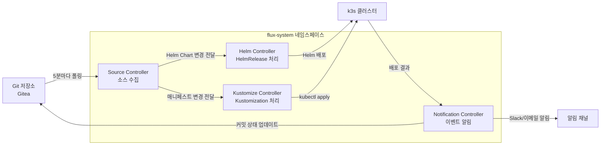
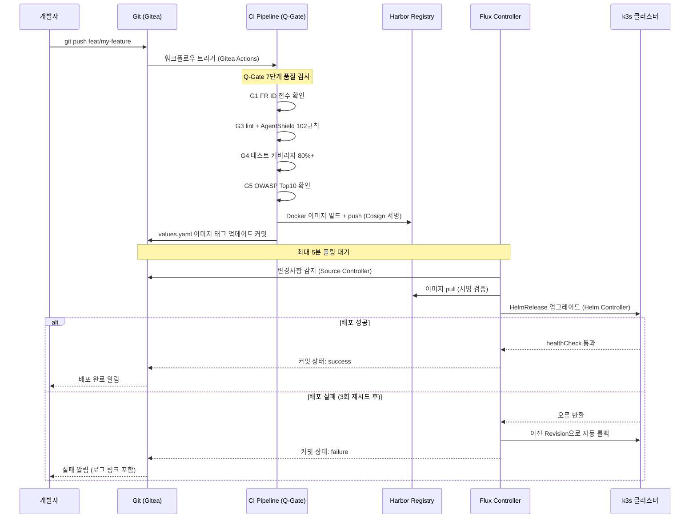

# GitOps + Flux — Git이 진실의 원천

> **버전**: 1.0.0 | **작성일**: 2026-04-11
> **대상**: 신규 DevOps 엔지니어, 개발자
> **CSAP**: D-12 (시스템 개발 보안 — 변경 관리)
> **관련 문서**: `04-infrastructure.md` §4, `docs/07-infra/flux-gitops-integration-guide.md`

---

## 목차

1. [GitOps 철학](#1-gitops-철학)
2. [Flux 컴포넌트 구조](#2-flux-컴포넌트-구조)
3. [HelmRelease 작성법](#3-helmrelease-작성법)
4. [Kustomization 구조](#4-kustomization-구조)
5. [변경사항 배포 흐름](#5-변경사항-배포-흐름)
6. [Drift Detection 이해](#6-drift-detection-이해)
7. [실습: 내 서비스 설정 변경 배포](#7-실습-내-서비스-설정-변경-배포)
8. [고급 패턴](#8-고급-패턴)

---

## 1. GitOps 철학

### 1.1 Git이 진실의 원천 (Single Source of Truth)

GitOps의 핵심 원칙은 단순합니다.

```
클러스터의 원하는 상태 = Git 저장소의 YAML 파일
```

클러스터를 변경하고 싶다면 Git에 커밋하십시오. 클러스터가 어떤 상태인지 알고 싶다면 Git을 보십시오. 직접 `kubectl apply`나 `helm upgrade`로 클러스터를 수정하는 것은 GitOps 원칙에 위배됩니다.

```
전통적 배포 방식 (문제):
  개발자 A → kubectl apply → 클러스터 변경
  개발자 B → kubectl apply → 클러스터 변경
  → 누가 무엇을 변경했는지 추적 어려움
  → 재현 불가 (동일 클러스터 재구성 어려움)
  → 실수로 잘못된 설정 적용 → 수동 복구 필요

GitOps 방식 (해결):
  개발자 A → Git push → Flux 감지 → 클러스터 자동 적용
  개발자 B → Git push → PR 리뷰 → 승인 후 머지 → Flux 자동 적용
  → 모든 변경이 Git 이력으로 추적 가능
  → 언제든 git revert로 이전 상태 복구
  → 동일 Git 상태 = 동일 클러스터 상태 (재현 가능)
```

### 1.2 공공기관에서 GitOps가 필수인 이유

| 공공기관 요건 | GitOps 충족 방법 |
|------------|---------------|
| CSAP D-12 변경 관리 | 모든 인프라 변경이 Git 커밋 이력으로 기록됨 |
| 감리 추적성 | 누가, 언제, 무엇을, 왜 변경했는지 PR로 증명 |
| 승인 프로세스 | Pull Request 기반 변경 → 승인자 리뷰 필수 |
| 재현 가능성 | 동일 Git 상태로 언제든 동일 환경 재구성 |
| 롤백 | `git revert` 한 번으로 이전 상태 복구 |

---

## 2. Flux 컴포넌트 구조

Flux는 4개의 컨트롤러로 구성됩니다. 각 컨트롤러는 독립적인 역할을 수행하며 함께 GitOps 파이프라인을 구성합니다.

### 2.1 4개 컨트롤러 역할



| 컨트롤러 | 역할 | 처리하는 리소스 |
|---------|------|-------------|
| **Source Controller** | Git/Helm 저장소에서 최신 소스를 주기적으로 가져와 아티팩트 생성 | GitRepository, HelmRepository, HelmChart |
| **Helm Controller** | HelmRelease 리소스를 감시하여 Helm 설치/업그레이드/롤백 실행 | HelmRelease |
| **Kustomize Controller** | Kustomization 리소스를 감시하여 kubectl apply 실행 | Kustomization |
| **Notification Controller** | 배포 성공/실패 이벤트를 Git 커밋 상태, Slack 등으로 전송 | Alert, Provider, Receiver |

### 2.2 컨트롤러 상태 확인

```bash
# 4개 컨트롤러 Pod 상태
kubectl get pods -n flux-system
# NAME                                        READY   STATUS    RESTARTS
# source-controller-xxxxx                     1/1     Running   0
# kustomize-controller-xxxxx                  1/1     Running   0
# helm-controller-xxxxx                       1/1     Running   0
# notification-controller-xxxxx               1/1     Running   0

# 전체 Flux 리소스 상태
flux get all -A
# NAMESPACE     NAME                   READY  MESSAGE
# flux-system   gitrepository/fleet-infra   True   stored artifact for revision 'main@sha1:...'
# flux-system   helmrelease/saas-platform   True   Release reconciliation succeeded
# flux-system   kustomization/apps          True   Applied revision: main@sha1:...
```

---

## 3. HelmRelease 작성법

HelmRelease는 "이 Helm Chart를 이 설정으로 이 네임스페이스에 배포하라"는 선언입니다.

### 3.1 기본 구조

```yaml
# infra/flux/helm-release.yaml 실제 파일 기반
apiVersion: helm.toolkit.fluxcd.io/v2
kind: HelmRelease
metadata:
  name: saas-platform
  namespace: flux-system
  labels:
    app.kubernetes.io/name: saas-platform
    app.kubernetes.io/part-of: public-saas
  annotations:
    csap.ref/d12: "개발보안 — GitOps 자동 배포"
spec:
  # Helm Controller가 이 HelmRelease를 확인하는 주기
  interval: 5m

  # 배포할 Helm Chart 정의
  chart:
    spec:
      chart: ./helm/saas-platform        # 저장소 내 Chart 경로
      sourceRef:
        kind: GitRepository
        name: fleet-infra                # 소스로 사용할 GitRepository 이름
        namespace: flux-system
      interval: 5m
      reconcileStrategy: ChartVersion   # Chart 버전이 바뀔 때만 업데이트

  # 배포 대상
  targetNamespace: saas-platform

  # Values 오버라이드 (Git에 있는 설정)
  values:
    global:
      imageRegistry: localhost:8080
      environment: staging

  # 설치 설정
  install:
    createNamespace: true              # 네임스페이스 없으면 자동 생성
    remediation:
      retries: 3                       # 설치 실패 시 3회 재시도

  # 업그레이드 설정
  upgrade:
    remediation:
      retries: 3
      remediateLastFailure: true       # 마지막 실패 시 이전 버전으로 자동 롤백
    cleanupOnFail: true

  # 롤백 설정
  rollback:
    timeout: 5m
    cleanupOnFail: true

  # 전체 작업 타임아웃
  timeout: 10m

  # 의존 관계 (DB, Redis가 먼저 준비되어야 함)
  dependsOn:
    - name: saas-postgres
      namespace: flux-system
    - name: saas-redis
      namespace: flux-system
```

### 3.2 외부 Helm Repository Chart 배포

외부 Helm Repository에서 Chart를 가져와 배포하는 경우:

```yaml
# HelmRepository 소스 정의
apiVersion: source.toolkit.fluxcd.io/v1
kind: HelmRepository
metadata:
  name: bitnami
  namespace: flux-system
spec:
  interval: 30m
  url: https://charts.bitnami.com/bitnami
---
# HelmRelease에서 참조
apiVersion: helm.toolkit.fluxcd.io/v2
kind: HelmRelease
metadata:
  name: saas-postgres
  namespace: flux-system
spec:
  interval: 10m
  chart:
    spec:
      chart: postgresql          # HelmRepository의 Chart 이름
      version: "16.x"            # Semver 범위 지정 가능
      sourceRef:
        kind: HelmRepository
        name: bitnami            # 위에서 정의한 HelmRepository 이름
  targetNamespace: saas-platform
  values:
    auth:
      existingSecret: postgres-credentials
    primary:
      persistence:
        enabled: true
        storageClass: local-path
        size: 20Gi
```

### 3.3 ValuesFrom — ConfigMap에서 Values 주입

```yaml
# ConfigMap에 values 저장
apiVersion: v1
kind: ConfigMap
metadata:
  name: saas-platform-values
  namespace: flux-system
data:
  values.yaml: |
    auth-service:
      replicaCount: 3
    api-gateway:
      replicaCount: 3
---
# HelmRelease에서 참조
spec:
  valuesFrom:
    - kind: ConfigMap
      name: saas-platform-values
      valuesKey: values.yaml    # ConfigMap의 키 이름
```

---

## 4. Kustomization 구조

Kustomization은 Git 저장소의 디렉토리에 있는 매니페스트를 클러스터에 직접 적용합니다. Helm을 쓰지 않는 경우나 기존 YAML을 환경별로 패치할 때 사용합니다.

### 4.1 기본 Kustomization

```yaml
# infra/flux/app-kustomization.yaml
apiVersion: kustomize.toolkit.fluxcd.io/v1
kind: Kustomization
metadata:
  name: sample-apps
  namespace: flux-system
spec:
  interval: 5m
  sourceRef:
    kind: GitRepository
    name: fleet-infra
  path: ./apps/sample-app           # 저장소 내 매니페스트 경로
  prune: true                       # Git에서 삭제된 리소스는 클러스터에서도 삭제
  targetNamespace: gitops-demo
  healthChecks:                     # 배포 성공 기준
    - apiVersion: apps/v1
      kind: Deployment
      name: nginx-demo
      namespace: gitops-demo
  timeout: 5m
```

### 4.2 kustomization.yaml 파일

`path`가 가리키는 디렉토리에는 `kustomization.yaml`이 있어야 합니다.

```yaml
# apps/sample-app/kustomization.yaml
apiVersion: kustomize.config.k8s.io/v1beta1
kind: Kustomization
resources:
  - deployment.yaml
  - service.yaml
  - configmap.yaml
```

### 4.3 환경별 패치 (Kustomize overlay)

```
apps/
├── base/                    # 공통 기본 매니페스트
│   ├── kustomization.yaml
│   ├── deployment.yaml
│   └── service.yaml
└── overlays/
    ├── dev/                 # 개발 환경 패치
    │   ├── kustomization.yaml
    │   └── patch-replicas.yaml
    └── prod/                # 프로덕션 환경 패치
        ├── kustomization.yaml
        └── patch-replicas.yaml
```

```yaml
# apps/overlays/prod/kustomization.yaml
apiVersion: kustomize.config.k8s.io/v1beta1
kind: Kustomization
resources:
  - ../../base          # base 매니페스트 참조
patches:
  - path: patch-replicas.yaml
```

```yaml
# apps/overlays/prod/patch-replicas.yaml
apiVersion: apps/v1
kind: Deployment
metadata:
  name: my-service
spec:
  replicas: 3     # 프로덕션은 3개로 패치
```

---

## 5. 변경사항 배포 흐름

### 5.1 전체 배포 흐름도



### 5.2 단계별 설명

**1단계: 코드 변경 및 PR**

```bash
git checkout -b feat/notification-service
# 코드 수정
git add .
git commit -m "feat(notification): 이메일 알림 서비스 추가 (FR-5.1)"
git push origin feat/notification-service
# Gitea에서 PR 생성 → 팀원 리뷰 → 승인 → main 머지
```

**2단계: CI Pipeline 자동 실행**

main에 머지되면 Gitea Actions가 자동으로:
- 빌드 + 테스트 + lint 실행
- Q-Gate 7단계 품질 검사
- Docker 이미지 빌드 → Harbor에 push (Cosign 서명)
- values.yaml에서 이미지 태그 자동 업데이트 커밋

**3단계: Flux 자동 감지 및 배포**

```bash
# Flux가 5분 이내 자동 감지 + 배포
# 즉시 확인하려면:
flux get all -n flux-system

# 강제 동기화 (5분 대기 없이)
flux reconcile source git fleet-infra
flux reconcile helmrelease saas-platform -n flux-system
```

---

## 6. Drift Detection 이해

### 6.1 Drift란

Drift는 클러스터의 실제 상태가 Git에 선언된 상태와 달라진 것입니다.

```
예시 Drift 상황:
  Git 상태: auth-service replicas = 2
  클러스터: auth-service replicas = 3  ← 누군가 직접 kubectl scale로 변경

  → Flux가 감지 → Git 상태(2)로 자동 원복
```

### 6.2 Drift Detection 설정 확인

```yaml
# infra/flux/drift-detection/drift-config.yaml
apiVersion: kustomize.toolkit.fluxcd.io/v1
kind: Kustomization
metadata:
  name: drift-detection
  namespace: flux-system
spec:
  interval: 5m     # 5분마다 Git vs 클러스터 상태 비교
  force: false     # 강제 적용 없이 변경분만 적용
  prune: true      # Git에서 삭제된 리소스 자동 제거
```

### 6.3 Drift 알림 설정

```yaml
# Drift 감지 시 Slack 알림 설정
apiVersion: notification.toolkit.fluxcd.io/v1beta3
kind: Alert
metadata:
  name: drift-alert
  namespace: flux-system
spec:
  summary: "클러스터 상태 드리프트 감지"
  providerRef:
    name: slack-webhook
  eventSeverity: warning
  eventSources:
    - kind: Kustomization
      name: "*"   # 모든 Kustomization 감시
  exclusionList:
    - ".*upgrade not needed.*"  # 변경 없는 정상 동기화 알림 제외
```

### 6.4 의도적 Drift 허용 (Flux 일시 중지)

긴급 수정이 필요할 때만 Flux를 일시 중지합니다.

```bash
# Flux HelmRelease 일시 중지
flux suspend helmrelease saas-platform -n flux-system

# 직접 kubectl 수정 (긴급 패치)
kubectl set image deployment/auth-service \
  auth-service=localhost:8080/public-saas/auth-service:v1.2.4-hotfix \
  -n saas-platform

# Git에 동일 변경 반영 후 재개
git commit -m "fix: auth-service v1.2.4-hotfix 이미지 태그 반영"
git push
flux resume helmrelease saas-platform -n flux-system

# 즉시 동기화
flux reconcile helmrelease saas-platform -n flux-system
```

**중요**: Flux 재개 후 반드시 `flux get all -A`로 동기화 상태를 확인하고, Git 상태와 클러스터 상태가 일치하는지 검증하십시오.

---

## 7. 실습: 내 서비스 설정 변경 배포

이 실습은 실제 GitOps 배포 흐름을 체험합니다.

### 실습 목표

auth-service의 로그 레벨을 `info`에서 `debug`로 변경하여 배포합니다.

### 실습 1: 변경 전 현재 상태 확인

```bash
# 현재 auth-service의 LOG_LEVEL 환경변수 확인
kubectl exec -n saas-platform \
  $(kubectl get pods -n saas-platform -l app=auth-service -o jsonpath='{.items[0].metadata.name}') \
  -- env | grep LOG_LEVEL

# 예상 출력:
# LOG_LEVEL=info
```

### 실습 2: Git 브랜치 생성 및 values 변경

```bash
# 브랜치 생성
git checkout -b feat/debug-logging

# values.yaml에서 LOG_LEVEL 변경
# helm/saas-platform/values.yaml 또는
# helm/auth-service/values.yaml 내 LOG_LEVEL: info → debug
```

변경할 파일 내용 예시:
```yaml
# helm/saas-platform/values.yaml 변경 전
auth-service:
  env:
    LOG_LEVEL: info

# 변경 후
auth-service:
  env:
    LOG_LEVEL: debug
```

### 실습 3: 변경 커밋 및 push

```bash
git add helm/saas-platform/values.yaml
git commit -m "feat(auth): 디버깅을 위해 LOG_LEVEL=debug 임시 적용 (FR-1.1)"
git push origin feat/debug-logging
```

### 실습 4: PR 생성 및 머지

Gitea UI에서:
1. feat/debug-logging → main PR 생성
2. 팀원에게 리뷰 요청
3. 승인 후 Squash and Merge

### 실습 5: Flux 배포 모니터링

```bash
# Flux 동기화 상태 실시간 확인
watch flux get all -n flux-system

# 또는 즉시 동기화 강제
flux reconcile source git fleet-infra
flux reconcile helmrelease saas-platform -n flux-system

# 배포 완료 확인
kubectl rollout status deployment/auth-service -n saas-platform
# deployment "auth-service" successfully rolled out
```

### 실습 6: 변경 적용 확인

```bash
# LOG_LEVEL이 debug로 변경되었는지 확인
kubectl exec -n saas-platform \
  $(kubectl get pods -n saas-platform -l app=auth-service -o jsonpath='{.items[0].metadata.name}') \
  -- env | grep LOG_LEVEL

# 예상 출력:
# LOG_LEVEL=debug
```

실습 완료 기준: `LOG_LEVEL=debug`가 출력되고 auth-service 로그에 debug 레벨 메시지가 나타나면 성공입니다.

---

## 8. 고급 패턴

### 8.1 Image Update Automation

이미지 태그가 업데이트될 때 Flux가 자동으로 values.yaml을 변경하는 패턴입니다.

```yaml
# Image Policy — 어떤 태그 패턴을 추적할지
apiVersion: image.toolkit.fluxcd.io/v1beta2
kind: ImagePolicy
metadata:
  name: auth-service-policy
  namespace: flux-system
spec:
  imageRepositoryRef:
    name: auth-service
  policy:
    semver:
      range: '>=1.0.0'    # 1.0.0 이상 최신 버전 자동 추적
```

```yaml
# ImageRepository — 감시할 레지스트리
apiVersion: image.toolkit.fluxcd.io/v1beta2
kind: ImageRepository
metadata:
  name: auth-service
  namespace: flux-system
spec:
  image: localhost:8080/public-saas/auth-service
  interval: 5m
```

### 8.2 Multi-environment 전략

```
fleet-infra/
├── apps/
│   ├── base/                  # 공통 베이스
│   └── overlays/
│       ├── dev/               # 개발 환경 패치
│       ├── stg/               # 스테이징 환경 패치
│       └── prod/              # 프로덕션 환경 패치
└── infra/
    └── flux/
        └── environments/
            ├── dev-kustomization.yaml
            ├── stg-kustomization.yaml
            └── prod-kustomization.yaml
```

각 환경별 Kustomization이 해당 overlay를 참조하여 독립적으로 관리됩니다.

### 8.3 Flux 상태 요약 명령어

```bash
# 가장 자주 쓰는 Flux 명령어 모음
flux get all -A                                           # 전체 상태 조회
flux get helmreleases -A                                  # HelmRelease만 조회
flux get kustomizations -A                                # Kustomization만 조회
flux reconcile source git fleet-infra                     # Git 소스 즉시 갱신
flux reconcile helmrelease saas-platform -n flux-system   # HelmRelease 즉시 동기화
flux suspend helmrelease saas-platform -n flux-system     # Flux 일시 중지
flux resume helmrelease saas-platform -n flux-system      # Flux 재개
flux logs --follow                                        # Flux 컨트롤러 실시간 로그
flux events                                               # Flux 최근 이벤트
flux check                                                # Flux 컴포넌트 헬스체크
```

---

다음 단계: `components/01-traefik.md`에서 Traefik Ingress Controller와 TLS 라우팅을 학습합니다.
