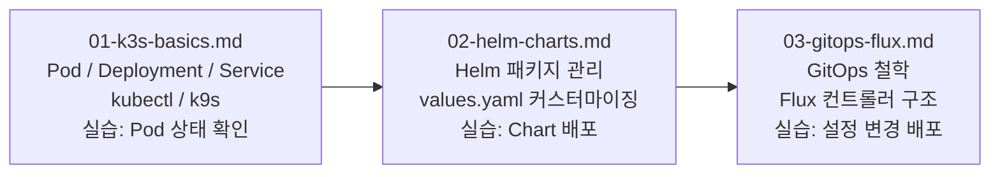

# Kubernetes 운영 — 학습 가이드

> **버전**: 1.0.0 | **작성일**: 2026-04-11
> **대상**: Kubernetes를 처음 접하는 개발자, DevOps 입문자
> **선행 조건**: `04-infrastructure/01-overview.md` 완료, k3s 설치 완료

---

## 이 섹션의 목적

공공기관 SaaS 프레임워크는 k3s(경량 Kubernetes)를 기반으로 운영됩니다. 이 섹션은 Kubernetes를 처음 접하는 구성원이 실무에서 필요한 최소한의 개념과 명령어를 익힐 수 있도록 구성되어 있습니다.

"전체 Kubernetes를 다 배워야 하나?"라고 걱정할 필요 없습니다. 이 프레임워크에서 일상적으로 사용하는 개념과 명령어만 다룹니다.

---

## 학습 순서



---

## 파일 설명

| 파일 | 핵심 질문 | 예상 시간 |
|------|---------|---------|
| `01-k3s-basics.md` | "k3s에서 내 서비스는 어떻게 실행되나?" | 60분 |
| `02-helm-charts.md` | "서비스를 어떻게 설치하고 설정하나?" | 45분 |
| `03-gitops-flux.md` | "내가 만든 변경이 어떻게 자동으로 배포되나?" | 60분 |

---

## 핵심 원칙 미리 보기

이 섹션 전체에 반복적으로 등장하는 원칙입니다.

1. **직접 클러스터 수정 금지** — 항상 Git 먼저, Flux가 자동 적용
2. **모든 설정은 YAML** — 인프라 상태는 코드로 표현
3. **네임스페이스로 격리** — 서비스 간 경계는 명시적으로 설정
4. **kubectl은 읽기 전용으로** — 조회(get, describe, logs)는 언제든 가능, 수정(apply, delete)은 Git 통해서

---

## 전제 도구 확인

```bash
# k3s 정상 동작 확인
kubectl get nodes
# NAME           STATUS   ROLES           AGE   VERSION
# desktop-xxx    Ready    control-plane   Xd    v1.34.x+k3s1

# Helm 설치 확인
helm version
# version.BuildInfo{Version:"v3.20.x", ...}

# Flux 설치 확인
flux version --client
# flux: v2.8.x
```

세 가지가 모두 정상 출력되면 이 섹션을 시작할 준비가 된 것입니다.
