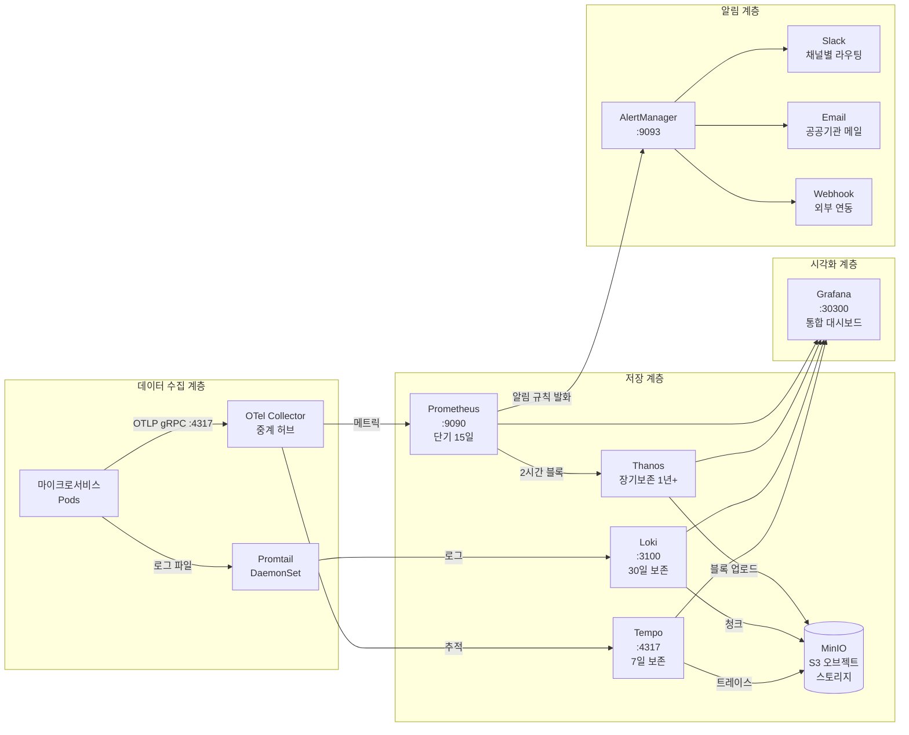
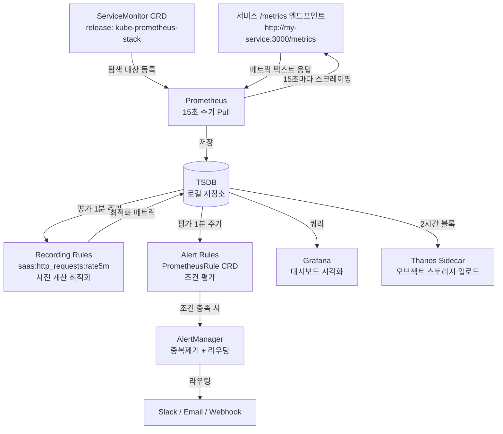
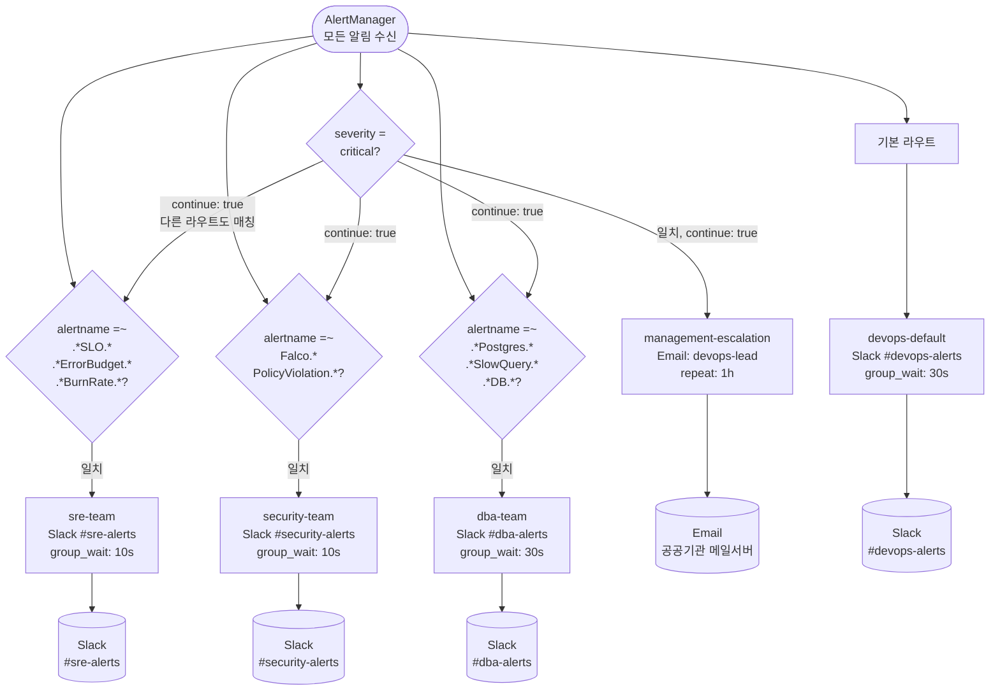
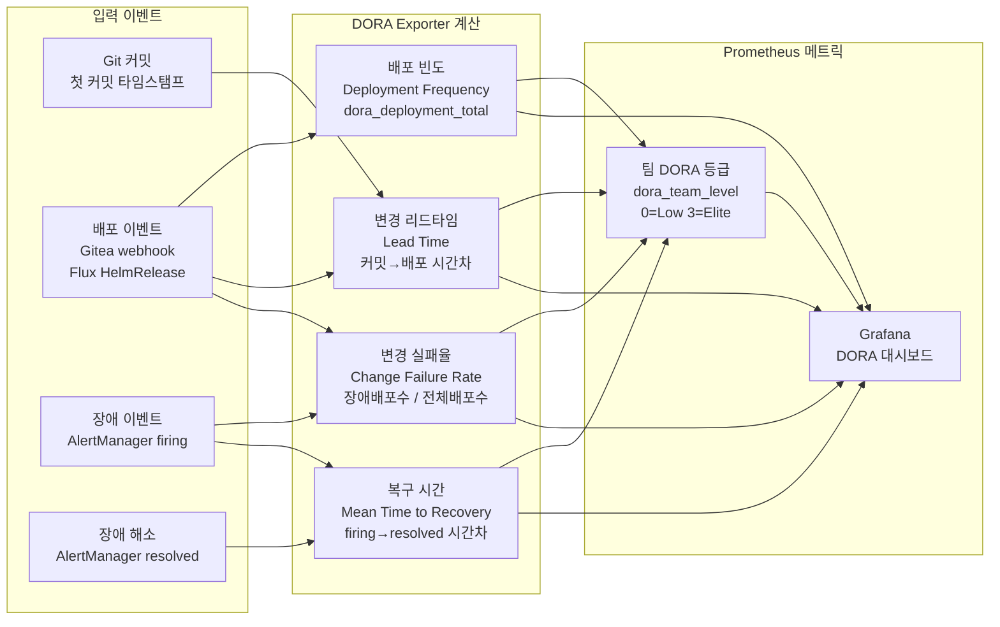
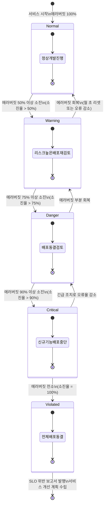

# 6장. 모니터링 및 관측가능성

> **버전**: 1.0.0 | **작성일**: 2026-04-11
> **대상**: 신규 합류 개발자, DevOps 엔지니어, SRE
> **관련 문서**: `docs/07-infra/observability-guide.md`, `docs/07-infra/monitoring-operations-guide.md`
> **CSAP**: D-06 (침해사고 관리), D-08 (접근 통제), D-09 (암호화)

---

## 목차

1. [관측가능성 3대 기둥](#1-관측가능성-3대-기둥)
2. [Prometheus + Grafana](#2-prometheus--grafana)
3. [Thanos — 장기 메트릭 보존](#3-thanos--장기-메트릭-보존)
4. [Loki — 로그 집계 및 쿼리](#4-loki--로그-집계-및-쿼리)
5. [Tempo — 분산 추적](#5-tempo--분산-추적)
6. [AlertManager — 알림 채널 설정](#6-alertmanager--알림-채널-설정)
7. [DORA 메트릭](#7-dora-메트릭)
8. [SLO/SLA 관리](#8-slosla-관리)
9. [Falco — 런타임 보안 모니터링](#9-falco--런타임-보안-모니터링)
10. [실습: 내 서비스의 대시보드 만들기](#10-실습-내-서비스의-대시보드-만들기)

---

## 1. 관측가능성 3대 기둥

관측가능성(Observability)은 시스템 내부 상태를 외부 출력만으로 파악하는 능력입니다. 공공기관 SaaS 프레임워크는 LGTM 스택으로 세 가지 기둥을 모두 구현합니다.

### 1.1 3대 기둥 개요

| 기둥 | 도구 | 질문 | 예시 |
|------|------|------|------|
| 메트릭(Metrics) | Prometheus + Grafana | "지금 얼마나 빠른가?" | CPU 80%, 응답시간 p99=200ms |
| 로그(Logs) | Loki + Promtail | "무슨 일이 일어났는가?" | `ERROR: DB connection refused` |
| 추적(Traces) | Tempo + OpenTelemetry | "어디서 느린가?" | API → DB 쿼리 300ms 소비 |

### 1.2 LGTM 스택 아키텍처

```
마이크로서비스 파드
  │ 메트릭 (Prometheus pull)       → Prometheus :9090 → Grafana :30300
  │ 로그 (Promtail DaemonSet push) → Loki :3100     → Grafana :30300
  │ 추적 (OTLP push 4317/4318)    → Tempo :4317    → Grafana :30300
  │
  └── OTel Collector (중계 허브)
        ├── traces  → Tempo
        ├── metrics → Prometheus
        └── logs    → Loki

알림: Prometheus → AlertManager :9093 → Slack/이메일/Webhook
장기 보존: Prometheus → Thanos Sidecar → MinIO (S3)
```

**관측성 스택 전체 아키텍처**



**구성요소별 상세 설명**

| 계층 | 컴포넌트 | 역할 | 데이터 보존 |
|-----|---------|------|---------|
| 수집 | Promtail DaemonSet | 각 노드의 `/var/log/pods/` 자동 수집. 레이블 자동 추가 | — |
| 수집 | OTel Collector | 추적(OTLP), 메트릭, 로그 통합 수신 후 각 백엔드로 라우팅 | — |
| 저장 | Prometheus | Pull 방식 메트릭 수집. TSDB 형식 로컬 저장 | 15일 |
| 저장 | Thanos | Prometheus Sidecar로 오브젝트 스토리지에 블록 업로드 | 1년+ |
| 저장 | Loki | 레이블 인덱싱만 수행하여 메모리 최소화 | 30일 |
| 저장 | Tempo | 트레이스 저장. Grafana에서 로그↔트레이스 연동 | 7일 |
| 시각화 | Grafana | Prometheus/Thanos/Loki/Tempo 통합 데이터소스 지원 | — |
| 알림 | AlertManager | 중복 제거(grouping), 억제(inhibition), 라우팅 | — |

**실무 활용 예시**: 장애 발생 시 Grafana에서 "Explore" 메뉴를 활용하면 로그(Loki) → 트레이스(Tempo) → 메트릭(Prometheus)을 하나의 화면에서 연동하여 원인을 빠르게 파악할 수 있습니다.

**자주 하는 실수**: Thanos가 설정되지 않은 상태에서 15일 이전 메트릭을 조회하면 데이터가 없습니다. CSAP D-06 감사 요건(1년 보존)을 충족하려면 반드시 Thanos + MinIO를 함께 구성해야 합니다.

### 1.3 설치 순서와 상태 확인

```bash
# 7단계 자동 설치
./scripts/setup-observability.sh install

# 설치 순서:
# [1/7] kube-prometheus-stack  → Prometheus + Grafana + AlertManager
# [2/7] Loki                   → 로그 집계 엔진
# [3/7] Promtail               → 파드 로그 수집 DaemonSet
# [4/7] Tempo                  → 분산 추적
# [5/7] OpenTelemetry Operator → 자동 계측 CRD
# [6/7] PostgreSQL Exporter    → SQL 슬로우쿼리 메트릭
# [7/7] Redis Exporter         → Redis 메트릭

# 설치 후 전체 파드 상태 확인
kubectl get pods -n monitoring
```

**접근 URL**

| 서비스 | URL | 계정 |
|--------|-----|------|
| Grafana | http://localhost:30300 | admin / (초기 비밀번호 아래 명령으로 확인) |
| Prometheus | http://localhost:30090 | 인증 없음 (내부 전용) |
| AlertManager | http://localhost:30093 | 인증 없음 (내부 전용) |

```bash
# Grafana 초기 비밀번호 확인
kubectl get secret grafana-admin-secret -n monitoring \
  -o jsonpath='{.data.admin-password}' | base64 -d && echo
```

---

## 2. Prometheus + Grafana

### 2.1 Prometheus 개념

Prometheus는 풀(Pull) 방식으로 대상 서비스의 `/metrics` 엔드포인트를 주기적으로 수집합니다. 서비스는 메트릭을 Prometheus 형식(텍스트)으로 노출만 하면 됩니다.

```
Prometheus
  │ (15초마다 수집)
  ▼
/metrics 엔드포인트 (예: http://api-gateway:3000/metrics)
  출력 예:
  # HELP http_requests_total 총 HTTP 요청 수
  # TYPE http_requests_total counter
  http_requests_total{method="GET",status="200"} 1234
  http_request_duration_seconds{le="0.1"} 500
```

### 2.2 Prometheus 메트릭 수집 흐름

아래 다이어그램은 ServiceMonitor 등록부터 알림 발화까지의 전체 데이터 흐름을 보여줍니다.



**구성요소별 상세 설명**

| 구성 요소 | 파일 위치 | 역할 상세 |
|---------|---------|---------|
| ServiceMonitor | `infra/monitoring/` 또는 서비스별 | `release: kube-prometheus-stack` 레이블 필수. 누락 시 Prometheus가 인식 불가 |
| Recording Rules | `infra/monitoring/golden-signals-rules.yaml` | 자주 사용하는 복잡한 PromQL을 사전 계산. 대시보드 쿼리 속도 개선 |
| Alert Rules | `infra/monitoring/alerting-rules.yaml` | `for: 2m` 설정으로 일시적 스파이크 무시. `runbook_url` 필수 |
| AlertManager | `infra/monitoring/alertmanager-config.yaml` | 동일 알림 그룹화(group_by), 억제(inhibit_rules) 설정 |

**실무 활용 예시**: Recording Rules로 사전 계산된 메트릭(`saas:http_request_duration_seconds:p99`)을 Grafana 대시보드에서 사용하면 실시간 쿼리보다 10배 이상 빠르게 응답합니다.

**자주 하는 실수**: PrometheusRule에 `release: kube-prometheus-stack` 레이블이 없으면 Prometheus가 규칙을 로드하지 않습니다. `kubectl get prometheusrule -n monitoring` 출력에서 AGE가 최근인데도 알림이 동작하지 않으면 레이블을 먼저 확인하십시오.

### 2.3 ServiceMonitor 추가 방법

ServiceMonitor는 Prometheus에게 "이 서비스의 메트릭을 수집하라"고 알리는 CRD입니다. `kube-prometheus-stack`이 `release: kube-prometheus-stack` 레이블이 붙은 ServiceMonitor를 자동으로 탐색합니다.

```yaml
# 내 서비스에 ServiceMonitor 추가
apiVersion: monitoring.coreos.com/v1
kind: ServiceMonitor
metadata:
  name: my-service-monitor
  namespace: saas-platform
  labels:
    release: kube-prometheus-stack    # 이 레이블이 있어야 Prometheus가 인식
    app.kubernetes.io/name: my-service
spec:
  selector:
    matchLabels:
      app.kubernetes.io/name: my-service  # 모니터링 대상 서비스 레이블
  namespaceSelector:
    matchNames:
      - saas-platform
  endpoints:
    - port: http         # Service의 포트 이름
      path: /metrics     # 메트릭 경로 (기본값)
      interval: 15s      # 수집 주기
```

```bash
# ServiceMonitor 적용
kubectl apply -f my-service-monitor.yaml

# Prometheus 타겟 확인 (적용 후 30초 이내 나타남)
kubectl port-forward svc/kube-prometheus-stack-prometheus 9090 -n monitoring &
curl -s "http://localhost:9090/api/v1/targets" | \
  python3 -c "import sys,json; [print(t['labels']['job'],t['health']) for t in json.load(sys.stdin)['data']['activeTargets']]"
```

**Node.js 서비스에 메트릭 추가 예시**

```typescript
// prom-client 라이브러리 사용
import { Registry, Counter, Histogram, collectDefaultMetrics } from 'prom-client';

const register = new Registry();
collectDefaultMetrics({ register });  // Node.js 기본 메트릭 (CPU, 메모리 등)

// 커스텀 메트릭
const httpRequestsTotal = new Counter({
  name: 'http_requests_total',
  help: '총 HTTP 요청 수',
  labelNames: ['method', 'status', 'path'],
  registers: [register],
});

const httpRequestDuration = new Histogram({
  name: 'http_request_duration_seconds',
  help: 'HTTP 응답 시간 (초)',
  labelNames: ['method', 'path'],
  buckets: [0.01, 0.05, 0.1, 0.25, 0.5, 1, 2.5, 5],
  registers: [register],
});

// Express 미들웨어
app.use((req, res, next) => {
  const end = httpRequestDuration.startTimer({ method: req.method, path: req.path });
  res.on('finish', () => {
    httpRequestsTotal.inc({ method: req.method, status: res.statusCode, path: req.path });
    end();
  });
  next();
});

// /metrics 엔드포인트
app.get('/metrics', async (req, res) => {
  res.set('Content-Type', register.contentType);
  res.send(await register.metrics());
});
```

### 2.4 기본 대시보드 목록

Grafana 좌측 메뉴 "Dashboards"에서 확인 가능한 대시보드 목록입니다.

| 대시보드 이름 | 폴더 | 주요 패널 |
|------------|------|---------|
| SQL 모니터링 (PostgreSQL + Redis) | Public SaaS | 슬로우쿼리 TOP 20, 캐시 히트율 |
| 서비스 트래픽 | Public SaaS | 요청 수, 지연시간 p99, 에러율 |
| 로그 탐색기 | Public SaaS | LogQL 실시간 로그, 서비스별 에러 집계 |
| 클러스터 개요 | Public SaaS | 노드 CPU/메모리, Pod 재시작 현황 |
| GitOps 현황 | Public SaaS | Flux 동기화 상태, 배포 이력 |
| Kubernetes Nodes | Default | 노드 리소스 상세 |
| Kubernetes Pods | Default | 네임스페이스별 Pod 상태 |

```bash
# 대시보드 ConfigMap이 없어 대시보드가 보이지 않을 때
kubectl apply -f infra/monitoring/dashboards/ -n monitoring
kubectl rollout restart deployment/kube-prometheus-stack-grafana -n monitoring
```

### 2.5 SRE 황금 신호 (Golden Signals)

`infra/monitoring/golden-signals-rules.yaml`은 4개의 핵심 SRE 지표를 사전 계산(recording rule)으로 정의합니다.

| 신호 | PromQL 예시 | 의미 |
|------|------------|------|
| Latency (지연) | `saas:http_request_duration_seconds:p99` | 99% 요청이 이 시간 안에 완료 |
| Traffic (트래픽) | `saas:http_requests:rate5m` | 초당 요청 수 |
| Errors (오류) | `saas:http_errors:rate5m` | 초당 오류 수 |
| Saturation (포화) | `saas:cpu_utilization:avg` | 리소스 포화도 |

```bash
# PromQL 직접 쿼리 (Prometheus UI 또는 Grafana Explore에서 사용)
# 서비스별 p99 지연시간
histogram_quantile(0.99,
  sum by (namespace, service, le) (
    rate(http_request_duration_seconds_bucket[5m])
  )
)

# 초당 에러율
sum(rate(http_requests_total{status=~"5.."}[5m])) by (service)
  /
sum(rate(http_requests_total[5m])) by (service)
```

### 2.6 알림 규칙 작성법

`infra/monitoring/alerting-rules.yaml`에 PrometheusRule CRD로 알림을 정의합니다.

```yaml
apiVersion: monitoring.coreos.com/v1
kind: PrometheusRule
metadata:
  name: my-service-alerts
  namespace: monitoring
  labels:
    release: kube-prometheus-stack    # Prometheus가 인식하는 필수 레이블
    csap.compliance/control: D-06
spec:
  groups:
    - name: my-service.alerts
      rules:
        # 높은 에러율 경고
        - alert: MyServiceHighErrorRate
          expr: |
            sum(rate(http_requests_total{service="my-service",status=~"5.."}[5m]))
              /
            sum(rate(http_requests_total{service="my-service"}[5m]))
            > 0.05
          for: 2m            # 2분 이상 지속될 때만 알림
          labels:
            severity: warning
            team: devops
          annotations:
            summary: "{{ $labels.service }} 에러율 {{ $value | humanizePercentage }} 초과"
            description: "지난 5분간 에러율이 5%를 초과했습니다. 즉시 확인하십시오."
            runbook_url: "https://gitea.local/saas-admin/runbooks/blob/main/my-service.md"

        # 응답시간 초과
        - alert: MyServiceHighLatency
          expr: |
            histogram_quantile(0.99,
              sum by (le) (
                rate(http_request_duration_seconds_bucket{service="my-service"}[5m])
              )
            ) > 1.0
          for: 5m
          labels:
            severity: critical
          annotations:
            summary: "{{ $labels.service }} p99 응답시간 {{ $value | humanizeDuration }} 초과"
```

```bash
# PrometheusRule 적용
kubectl apply -f my-service-alerts.yaml

# 알림 규칙 확인
kubectl get prometheusrule -n monitoring

# 현재 발화 중인 알림 확인
curl -s http://localhost:30090/api/v1/alerts | \
  python3 -c "
import sys, json
alerts = json.load(sys.stdin)['data']['alerts']
for a in [x for x in alerts if x['state'] == 'firing']:
    print(f\"[FIRING] {a['labels']['alertname']}: {a['annotations'].get('summary', '')}\")"
```

---

## 3. Thanos — 장기 메트릭 보존

### 3.1 개요

Prometheus는 기본적으로 15일치 메트릭만 로컬에 보존합니다. CSAP D-06은 감사 데이터 최소 1년 보존을 요구하므로, Thanos를 통해 MinIO(S3 호환)로 장기 보존합니다.

```
Prometheus
  │ (2시간 단위 블록)
  └── Thanos Sidecar
        │ (블록 업로드)
        ▼
      MinIO (saas 클러스터 내부)
        │
        ├── Thanos Store Gateway → 오래된 메트릭 쿼리
        └── Thanos Query Frontend → Grafana ← 통합 쿼리
```

`infra/thanos/install.yaml`에서 MinIO 연결 설정을 확인할 수 있습니다.

### 3.2 Thanos 구성 요소

| 컴포넌트 | 역할 |
|---------|------|
| Sidecar | Prometheus와 함께 실행, 오브젝트 스토리지에 블록 업로드 |
| Store Gateway | MinIO의 오래된 블록을 쿼리 가능하게 노출 |
| Query Frontend | 분산 쿼리 캐싱, Grafana 데이터소스로 설정 |
| Compactor | 블록 압축 및 다운샘플링 (장기 조회 성능 개선) |

### 3.3 Grafana에서 Thanos 데이터소스 설정

```bash
# Grafana UI → Configuration → Data Sources → Add data source
# Type: Prometheus
# URL: http://thanos-query-frontend.monitoring.svc:10902
# Name: Thanos (장기 보존)
```

장기 메트릭은 "Thanos" 데이터소스를, 실시간 메트릭은 "Prometheus" 데이터소스를 사용합니다.

---

## 4. Loki — 로그 집계 및 쿼리

### 4.1 개요

Loki는 Prometheus와 유사한 방식으로 로그를 수집합니다. 로그 내용은 인덱싱하지 않고 레이블(라벨)만 인덱싱하여 메모리를 최소화합니다.

**설정 파일**: `infra/monitoring/loki/values.yaml`
- 배포 모드: SingleBinary (WSL2 단일 노드 최적화)
- 로그 보존: 30일 (`retention_period: 720h`)
- 수집 속도: 초당 16MB

### 4.2 Promtail — 로그 수집

Promtail은 각 노드에서 실행되는 DaemonSet으로, `/var/log/pods/` 디렉토리의 파드 로그를 수집합니다. 별도 설정 없이 클러스터의 모든 파드 로그가 자동 수집됩니다.

```bash
# Promtail 상태 확인
kubectl get daemonset promtail -n monitoring
# DESIRED = CURRENT = READY = 1 (단일 노드)

# Promtail 로그 확인
kubectl logs -n monitoring -l app.kubernetes.io/name=promtail --tail=20
```

### 4.3 LogQL 기초 문법

LogQL은 PromQL과 유사한 로그 쿼리 언어입니다. Grafana의 "Explore" 메뉴에서 사용합니다.

**기본 필터링**

```logql
# 특정 네임스페이스의 모든 로그
{namespace="saas-platform"}

# 특정 파드의 로그
{namespace="saas-platform", pod=~"api-gateway-.*"}

# 에러 로그만 필터
{namespace="saas-platform"} |= "ERROR"

# 특정 HTTP 상태 코드 필터
{namespace="saas-platform"} |~ "status.*5[0-9]{2}"

# 특정 텍스트 제외
{namespace="saas-platform"} != "healthcheck"
```

**JSON 파싱 (구조화된 로그)**

```logql
# JSON 로그에서 필드 추출
{namespace="saas-platform"} | json | level="error"

# 특정 필드 값으로 필터
{namespace="saas-platform"} | json | userId="user-123"

# 파싱 후 라인 필터
{namespace="saas-platform"} | json | duration > 1000
```

**집계 메트릭**

```logql
# 분당 에러 수
sum(rate({namespace="saas-platform"} |= "ERROR" [1m])) by (pod)

# 서비스별 로그 수 (초당)
sum(rate({namespace="saas-platform"} [5m])) by (app)

# 특정 키워드 발생 횟수 (1시간 기준)
count_over_time({namespace="saas-platform"} |= "CSAP_AUDIT" [1h])
```

### 4.4 Grafana에서 로그 탐색

```bash
# 1. Grafana 접속: http://localhost:30300
# 2. 좌측 메뉴 "Explore" 클릭
# 3. 데이터소스 "Loki" 선택
# 4. Label filters: namespace = saas-platform
# 5. "Run query" 클릭
```

**유용한 LogQL 패턴**

```logql
# 최근 1시간 내 에러 로그 (시간 역순)
{namespace="saas-platform"} |= "ERROR" | json

# DB 연결 오류 추적
{namespace="saas-platform"} |~ "connection refused|ECONNREFUSED"

# CSAP 감사 이벤트
{namespace="saas-platform"} |= "CSAP_AUDIT"

# Pod 재시작 후 로그 (previous 로그)
# kubectl logs {pod} --previous 결과를 Loki에서 확인 시:
{namespace="saas-platform", pod="api-gateway-abc123"} | json
```

---

## 5. Tempo — 분산 추적

### 5.1 개요

분산 추적은 단일 요청이 여러 마이크로서비스를 거칠 때 각 단계의 소요 시간을 시각화합니다. "API 응답이 왜 느린가?"를 한눈에 파악할 수 있습니다.

```
사용자 요청 (trace_id: abc123)
  │
  ├── [span] api-gateway (5ms)
  │     └── [span] auth-service (2ms)
  │
  ├── [span] user-service (150ms)
  │     └── [span] postgres query (140ms) ← 병목!
  │
  └── [span] notification-service (10ms)
```

**설정 파일**: `infra/monitoring/tempo/values.yaml`
- 배포 모드: Monolithic (WSL2 단일 노드)
- 트레이스 보존: 7일 (`retention: 168h`)
- 수신 프로토콜: OTLP gRPC (:4317), OTLP HTTP (:4318), Jaeger (:14268)

### 5.2 OpenTelemetry 자동 계측

OTel Operator가 설치되면 파드 annotation 추가만으로 자동 계측이 활성화됩니다. 서비스 코드를 수정하지 않아도 됩니다.

```yaml
# Deployment에 annotation 추가 (영구 적용)
apiVersion: apps/v1
kind: Deployment
metadata:
  name: my-service
spec:
  template:
    metadata:
      annotations:
        # 언어에 맞는 annotation 선택
        instrumentation.opentelemetry.io/inject-nodejs: "true"   # Node.js
        # instrumentation.opentelemetry.io/inject-python: "true"  # Python
        # instrumentation.opentelemetry.io/inject-java: "true"    # Java
    spec:
      containers:
        - name: my-service
          env:
            - name: OTEL_SERVICE_NAME
              value: "my-service"
            - name: OTEL_RESOURCE_ATTRIBUTES
              value: "deployment.environment=production,service.version=1.0.0"
```

```bash
# annotation 추가 (실행 중인 Deployment에 즉시 적용)
kubectl patch deployment my-service -n saas-platform \
  --type='json' \
  -p='[{"op":"add","path":"/spec/template/metadata/annotations/instrumentation.opentelemetry.io~1inject-nodejs","value":"true"}]'

# 계측 주입 확인 (파드 내 2개 컨테이너가 아닌 init 컨테이너 확인)
kubectl describe pod $(kubectl get pod -n saas-platform -l app=my-service -o name | head -1) -n saas-platform | grep -A3 "Init Containers"
```

### 5.3 Grafana에서 트레이스 탐색

```bash
# 1. Grafana 접속: http://localhost:30300
# 2. 좌측 메뉴 "Explore" 클릭
# 3. 데이터소스 "Tempo" 선택
# 4. "Search" 탭에서 서비스 선택
# 5. 특정 트레이스 클릭 → 폭포수(waterfall) 뷰 확인
```

**로그-트레이스 연결 (Loki → Tempo)**

Grafana에서 로그를 보다가 해당 요청의 전체 트레이스를 바로 볼 수 있습니다.

```logql
# trace_id가 포함된 로그 (JSON 로그에서 자동 연결)
{namespace="saas-platform"} | json | traceId!=""
```

로그에 `traceId` 필드가 있으면 Grafana가 자동으로 Tempo 링크를 생성합니다.

---

## 6. AlertManager — 알림 채널 설정

### 6.1 알림 채널 라우팅 구조

`infra/monitoring/alertmanager-config.yaml`에 5개 알림 채널이 정의되어 있습니다.

| 채널 | 대상 팀 | 조건 |
|------|---------|------|
| devops-default | DevOps 팀 | Flux, Deployment 관련 알림 |
| sre-team | SRE 팀 | SLO 위반, 에러 버짓 소진 |
| security-team | 보안 팀 | Falco 이벤트, 정책 위반 |
| dba-team | DBA 팀 | PostgreSQL, 슬로우쿼리 관련 |
| management-escalation | 관리자 | critical 심각도 전체 |

**AlertManager 5채널 라우팅 다이어그램**



**구성요소별 상세 설명**

| 라우팅 규칙 | 매칭 조건 | `continue` 설정 | 비고 |
|----------|---------|--------------|------|
| SRE 팀 | alertname에 SLO/ErrorBudget/BurnRate 포함 | false | SLO 위반은 SRE가 1차 대응 |
| 보안 팀 | alertname에 Falco/PolicyViolation 포함 | false | CSAP D-06 요건: 즉시 보고 |
| DBA 팀 | alertname에 Postgres/SlowQuery/DB 포함 | false | 슬로우쿼리 5초 이상 시 자동 알림 |
| 관리자 에스컬레이션 | severity=critical | **true** | critical은 해당 팀 + 관리자 동시 알림 |
| DevOps 기본 | 위 조건 미해당 전체 | false | Flux 동기화 실패, 인증서 만료 등 |

`continue: true` 설정의 의미: critical 심각도 알림은 해당 팀(SRE/보안/DBA)과 관리자 모두에게 동시에 전달됩니다. 예를 들어 `FalcoAlertCritical`은 security-team과 management-escalation 양쪽으로 라우팅됩니다.

**실무 활용 예시**: 신규 알림 규칙 작성 시 `alertname` 접두사를 팀 규약에 맞게 지정하면 자동으로 올바른 채널로 라우팅됩니다. 예: `PostgresReplicationLag` → dba-team 자동 라우팅.

**자주 하는 실수**: Slack webhook URL을 AlertManager values.yaml에 직접 하드코딩하면 CSAP D-09 시크릿 관리 위반입니다. 반드시 `${SLACK_WEBHOOK_URL}` 환경 변수 참조 또는 ExternalSecret으로 주입하십시오.

```yaml
# alertmanager-config.yaml 핵심 라우팅 구조
route:
  receiver: "devops-default"          # 기본 수신자
  routes:
    - matchers:
        - alertname=~".*SLO.*|.*ErrorBudget.*|.*BurnRate.*"
      receiver: "sre-team"
      group_wait: 10s                 # SLO 알림은 10초 이내 발송
    - matchers:
        - alertname=~"Falco.*|PolicyViolation.*"
      receiver: "security-team"
      group_wait: 10s
    - matchers:
        - severity="critical"
      receiver: "management-escalation"
      repeat_interval: 1h
      continue: true                  # 다른 라우트도 계속 매칭
```

### 6.2 Slack 알림 채널 설정

```yaml
# AlertManager values.yaml의 receivers 섹션에 추가
receivers:
  - name: "devops-default"
    slack_configs:
      - channel: "#devops-alerts"
        api_url: "https://hooks.slack.com/services/YOUR/SLACK/WEBHOOK"
        send_resolved: true
        title: '[{{ .Status | toUpper }}] {{ .GroupLabels.alertname }}'
        text: |
          *서비스*: {{ .GroupLabels.namespace }}
          *요약*: {{ range .Alerts }}{{ .Annotations.summary }}{{ end }}
          *심각도*: {{ .GroupLabels.severity }}
        color: |
          {{ if eq .Status "firing" }}danger{{ else }}good{{ end }}
```

### 6.3 이메일 알림 설정 (공공기관 메일 서버)

```yaml
# global 섹션 (smtp 설정)
global:
  smtp_smarthost: 'smtp.gov.kr:587'
  smtp_from: 'alertmanager@saas-platform.gov.kr'
  smtp_auth_username: '${SMTP_USERNAME}'    # 환경 변수 참조
  smtp_auth_password: '${SMTP_PASSWORD}'
  smtp_require_tls: true

receivers:
  - name: "management-escalation"
    email_configs:
      - to: "devops-lead@agency.go.kr"
        send_resolved: true
        headers:
          Subject: '[CRITICAL] {{ .GroupLabels.alertname }} — 공공기관 SaaS'
        html: |
          <h2>알림 발생</h2>
          <p><strong>알림명</strong>: {{ .GroupLabels.alertname }}</p>
          <p><strong>네임스페이스</strong>: {{ .GroupLabels.namespace }}</p>
          {{ range .Alerts }}
          <p>{{ .Annotations.description }}</p>
          {{ end }}
```

### 6.4 알림 테스트

```bash
# AlertManager 설정 적용
kubectl apply -f infra/monitoring/alertmanager-config.yaml -n monitoring
kubectl rollout restart deployment/kube-prometheus-stack-alertmanager -n monitoring

# 테스트 알림 발송
curl -s -X POST http://localhost:30093/api/v2/alerts \
  -H "Content-Type: application/json" \
  -d '[{
    "labels": {
      "alertname": "TestAlert",
      "severity": "info",
      "namespace": "saas-platform"
    },
    "annotations": {
      "summary": "테스트 알림입니다. 무시하십시오."
    }
  }]'

# 현재 활성 알림 목록
curl -s http://localhost:30093/api/v2/alerts | python3 -m json.tool
```

### 6.5 핵심 알림 규칙 목록

| 알림 이름 | 조건 | 심각도 | CSAP |
|----------|------|--------|------|
| PodCrashLooping | 재시작 5회/15분 | critical | D-06 |
| HighCPUUsage | CPU > 80% (5분) | warning | — |
| HighMemoryUsage | 메모리 > 85% (5분) | warning | — |
| SlowQueryDetected | DB 쿼리 > 5초 | warning | D-12 |
| FluxReconcileFailure | GitOps 동기화 실패 5분 | critical | D-12 |
| CertificateExpiring | TLS 인증서 7일 이내 만료 | critical | D-09 |
| LokiIngestionLag | 로그 수집 지연 > 60초 | critical | D-06 |
| FalcoAlertCritical | Falco 보안 이벤트 발생 | critical | D-06, D-08 |

---

## 7. DORA 메트릭

### 7.1 DORA 4대 지표 개요

DORA(DevOps Research and Assessment) 4대 지표는 DevOps 팀의 소프트웨어 전달 성과를 측정합니다. 공공기관 SaaS 프레임워크는 `packages/dora-exporter`로 Prometheus 메트릭을 실시간 수집합니다.

| 지표 | 설명 | Elite 기준 | 측정 방법 |
|------|------|----------|---------|
| 배포 빈도 | 프로덕션 배포 횟수 | 하루 여러 번 | Gitea 배포 webhook |
| 변경 리드타임 | 첫 커밋 → 프로덕션 배포 | 1시간 미만 | 커밋 타임스탬프 추적 |
| 변경 실패율 | 배포 중 장애 발생 비율 | 0~15% | AlertManager 장애 감지 |
| MTTR | 장애 발생 → 복구 시간 | 1시간 미만 | 장애 시작/종료 이벤트 |

**DORA 메트릭 계산 플로우**



**구성요소별 상세 설명**

| DORA 지표 | 데이터 소스 | 계산 방식 | Elite 기준 미달 시 조치 |
|---------|---------|---------|----------------|
| 배포 빈도(DF) | Gitea Deployment webhook | 단위 시간당 배포 건수 집계 | CI/CD 파이프라인 자동화 강화 |
| 변경 리드타임(LT) | Gitea Push + Deployment webhook | 첫 커밋 시각 - 프로덕션 배포 완료 시각 | PR 리뷰 프로세스 개선, 브랜치 수명 단축 |
| 변경 실패율(CFR) | AlertManager webhook | 배포 후 1시간 내 장애 발생 건수 / 전체 배포 수 | 테스트 커버리지 향상, 카나리 배포 도입 |
| MTTR | AlertManager firing/resolved 이벤트 | 장애 시작 ~ AlertManager resolved 시각 차이 | 런북(Runbook) 정비, 자동 복구 스크립트 구축 |

**실무 활용 예시**: `dora_team_level{team="devops"}` 메트릭이 `2`(High) 이상을 유지하는 것을 목표로 합니다. 주간 스프린트 회고에서 DORA Grafana 대시보드를 참조하여 팀 성과를 점검하십시오.

**자주 하는 실수**: Gitea webhook URL이 `dora-exporter.saas-platform.svc:8080`로 설정되어 있어야 합니다. Gitea에서 webhook 전송 실패 시 DORA 메트릭이 수집되지 않으며, `dora_deployment_total`이 증가하지 않습니다.

### 7.2 packages/dora-exporter 활용법

`packages/dora-exporter`는 Gitea webhook과 AlertManager webhook을 수신하여 DORA 메트릭을 Prometheus 형식으로 노출합니다.

```typescript
// dora-exporter가 노출하는 메트릭 (packages/dora-exporter/src/index.ts)
// FR-DORA.1: 배포 빈도
dora_deployment_total{team, service, environment}

// FR-DORA.2: 변경 리드타임 (초 단위 히스토그램)
dora_lead_time_seconds{team, service}

// FR-DORA.3: 변경 실패율 (0.0 ~ 1.0)
dora_change_failure_rate{team, service}

// FR-DORA.4: 서비스 복구 시간 (초 단위 히스토그램)
dora_mttr_seconds{team, service, severity}

// FR-DORA.8: 팀 DORA 등급 (0=Low, 1=Medium, 2=High, 3=Elite)
dora_team_level{team}
```

**Gitea webhook 연동 설정**

```bash
# Gitea 저장소 → Settings → Webhooks → Add Webhook
# URL: http://dora-exporter.saas-platform.svc:8080/webhook/gitea
# Content Type: application/json
# Events: Push, Deployment
```

**Grafana에서 DORA 대시보드 확인**

```promql
# 일간 배포 빈도
dora:deployment_frequency:daily

# 팀별 배포 빈도 (주간)
dora:deployment_frequency:weekly

# 변경 실패율 (%)
avg(dora_change_failure_rate) * 100

# MTTR 중앙값 (분)
histogram_quantile(0.50, sum by (le) (rate(dora_mttr_seconds_bucket[7d]))) / 60
```

### 7.3 DORA 등급 기준

| 등급 | 배포 빈도 | 리드타임 | 변경 실패율 | MTTR |
|------|---------|---------|-----------|------|
| Elite | 하루 여러 번 | 1시간 미만 | 0~15% | 1시간 미만 |
| High | 주 1회~하루 1회 | 1일 미만 | 0~15% | 1일 미만 |
| Medium | 월 1회~주 1회 | 1주 미만 | 0~30% | 1일~1주 |
| Low | 월 1회 미만 | 1개월 이상 | 16~30% | 1주 이상 |

---

## 8. SLO/SLA 관리

### 8.1 SLO 개념

SLO(Service Level Objective)는 서비스 신뢰성 목표입니다. 에러 버짓(Error Budget)은 허용 가능한 오류량입니다.

```
SLO 예시: 가용성 99.9% (월간)
  └── 에러 버짓: 월 43.2분 (= 100% - 99.9%)
  
현재 가용성 99.85% 라면:
  └── 에러 버짓 소진율: (99.9% - 99.85%) / (100% - 99.9%) = 50% 소진
```

### 8.2 packages/slo-escalation 이해

`packages/slo-escalation/src/escalation-controller.ts`는 에러 버짓 소진율에 따라 자동 에스컬레이션을 수행합니다.

```typescript
// 에스컬레이션 단계 (FR-SLO.1)
enum EscalationLevel {
  Normal   = 'normal',   // 소진율 0~50%: 정상
  Warning  = 'warning',  // 소진율 50~75%: 경고
  Danger   = 'danger',   // 소진율 75~90%: 위험
  Critical = 'critical', // 소진율 90~100%: 긴급
  Violated = 'violated', // 소진율 100%: SLO 위반
}
```

**SLO 에스컬레이션 단계 전이 다이어그램**



**구성요소별 상세 설명**

| 에스컬레이션 단계 | 에러버짓 소진율 | 자동 조치 | 알림 채널 |
|--------------|------------|--------|---------|
| Normal | 0 ~ 50% | 없음 (정상 개발 진행) | — |
| Warning | 50 ~ 75% | SLO 대시보드 경고 표시 | sre-team Slack |
| Danger | 75 ~ 90% | 배포 동결 권고 알림 발송 | sre-team + devops-lead |
| Critical | 90 ~ 100% | 신규 기능 배포 자동 차단(Kyverno 정책) | 전체 팀 + 관리자 |
| Violated | 100%+ | 전체 배포 동결, SLO 위반 보고서 자동 생성 | management-escalation |

**실무 활용 예시**: `packages/slo-escalation`이 AlertManager webhook을 통해 에스컬레이션 이벤트를 수신합니다. Grafana SLO 대시보드에서 "Error Budget Burn Rate" 패널이 급격히 상승하면 Warning 단계 전이 이전에 선제적으로 원인을 파악하십시오.

**자주 하는 실수**: SLO를 너무 높게(예: 99.99%) 설정하면 에러 버짓이 월 4.3분에 불과하여 경미한 이슈에도 Violated 상태가 됩니다. 공공기관 서비스는 99.9%(월 43.2분)를 기본 목표로 설정하고 운영 안정화 후 상향 조정하십시오.

```bash
# SLO 에러 버짓 Prometheus 메트릭
# (slo-escalation이 AlertManager webhook을 통해 수신)

# 현재 에러 버짓 소진율
sum(rate(http_requests_total{status=~"5.."}[30d]))
  /
sum(rate(http_requests_total[30d]))
  /
(1 - 0.999)  # SLO 목표 99.9%

# 에러 버짓 잔여량 (%)
(1 -
  sum(rate(http_requests_total{status=~"5.."}[30d]))
    /
  sum(rate(http_requests_total[30d]))
    /
  (1 - 0.999)
) * 100
```

### 8.3 에러 버짓 소진 시 대응 정책

| 소진율 | 에스컬레이션 단계 | 조치 |
|-------|----------------|------|
| 0~50% | Normal | 정상 개발 진행 |
| 50~75% | Warning | 리스크 높은 배포 재검토 |
| 75~90% | Danger | 배포 동결 검토, 안정성 개선 우선 |
| 90~100% | Critical | 신규 기능 배포 중단, 안정화 집중 |
| 100%+ | Violated | 전체 배포 동결, 긴급 복구 |

### 8.4 SLO Grafana 대시보드 확인

```bash
# Grafana → Dashboards → 검색: "SLO"
# 또는 Explore → Prometheus → 직접 쿼리

# 서비스 가용성 (30일 기준)
1 - (
  sum(rate(http_requests_total{status=~"5.."}[30d]))
    /
  sum(rate(http_requests_total[30d]))
)
```

---

## 9. Falco — 런타임 보안 모니터링

### 9.1 개요

Falco는 eBPF 기반 런타임 보안 모니터링 도구입니다. 컨테이너 내에서 의심스러운 행위(파일 접근, 셸 실행, 네트워크 연결 등)를 실시간 탐지합니다. CSAP D-06 침해사고 관리 요건의 핵심입니다.

**설정 파일**: `infra/falco/values.yaml`
- 드라이버: eBPF (WSL2 커널 6.6+ 호환)
- 출력: JSON → Falcosidekick → Grafana/Loki

### 9.2 공공기관 SaaS 커스텀 규칙

`infra/falco/custom-rules.yaml`에 공공기관 특화 탐지 규칙이 정의되어 있습니다.

| 규칙 | 조건 | CSAP | 심각도 |
|------|------|------|--------|
| Sensitive File Access | 컨테이너 내 `/etc/shadow`, `/etc/passwd` 접근 | D-08 | WARNING |
| Shell Spawned in Container | 컨테이너 내 bash/sh 실행 | D-12 | WARNING |
| Unexpected Network Connection | 허용 목록 외 외부 IP 연결 | D-09 | CRITICAL |
| Crypto Mining Activity | 암호화폐 채굴 프로세스 탐지 | D-11 | CRITICAL |

### 9.3 Falco 이벤트 확인

```bash
# Falco 파드 상태 확인
kubectl get pods -n falco-system

# 실시간 Falco 이벤트 확인
kubectl logs -n falco-system -l app.kubernetes.io/name=falco -f | \
  grep -E '"priority":"(CRITICAL|WARNING|ERROR)"'

# Falco 이벤트 예시 출력:
# {"time":"2026-04-11T10:00:00Z","rule":"Shell Spawned in Container",
#  "priority":"WARNING","output":"컨테이너 내 셸 실행 탐지 (사용자=root 컨테이너=my-service 이미지=my-image 네임스페이스=saas-platform)"}
```

### 9.4 Grafana에서 Falco 이벤트 조회

Falcosidekick이 Falco 이벤트를 Loki로 전송하므로, Grafana Loki에서 조회 가능합니다.

```logql
# Falco 보안 이벤트 (LogQL)
{namespace="falco-system"} | json | priority="CRITICAL"

# 특정 규칙 이벤트
{namespace="falco-system"} |= "Shell Spawned in Container"

# 최근 24시간 보안 이벤트 수 (집계)
count_over_time({namespace="falco-system"} | json | priority="WARNING" or priority="CRITICAL" [24h])
```

### 9.5 CSAP 감사 대응

Falco에서 탐지된 이벤트는 자동으로 AlertManager를 통해 보안 팀에 전달됩니다 (6.1절 라우팅 참조). CSAP D-06 감사 시 Loki에서 지난 1년간의 보안 이벤트 이력을 제출할 수 있습니다.

```bash
# CSAP 감사용 — 특정 기간 보안 이벤트 추출
# Loki API를 사용하여 JSON 출력
START=$(date -d "2026-01-01" +%s)000000000
END=$(date -d "2026-04-11" +%s)000000000

curl -s -G "http://localhost:30300/loki/api/v1/query_range" \
  --data-urlencode 'query={namespace="falco-system"} | json | priority="CRITICAL"' \
  --data-urlencode "start=${START}" \
  --data-urlencode "end=${END}" \
  --data-urlencode "limit=1000" \
  -H "Authorization: Bearer $(kubectl get secret grafana-admin-secret -n monitoring -o jsonpath='{.data.admin-password}' | base64 -d)"
```

---

## 10. 실습: 내 서비스의 대시보드 만들기

### 10.1 목표

이 실습을 완료하면 다음을 직접 만들 수 있습니다:
- 내 서비스의 ServiceMonitor (메트릭 수집)
- Grafana 커스텀 대시보드
- 에러율 알림 규칙

### 10.2 Step 1 — ServiceMonitor 생성

```bash
# 1. ServiceMonitor 파일 생성
cat > /tmp/my-service-monitor.yaml << 'EOF'
apiVersion: monitoring.coreos.com/v1
kind: ServiceMonitor
metadata:
  name: my-service-monitor
  namespace: monitoring
  labels:
    release: kube-prometheus-stack
spec:
  selector:
    matchLabels:
      app.kubernetes.io/name: my-service
  namespaceSelector:
    matchNames:
      - saas-platform
  endpoints:
    - port: http
      path: /metrics
      interval: 15s
EOF

# 2. 적용
kubectl apply -f /tmp/my-service-monitor.yaml

# 3. Prometheus 타겟에서 확인 (30초 대기)
# 브라우저: http://localhost:30090/targets
# 또는:
kubectl port-forward svc/kube-prometheus-stack-prometheus 9090 -n monitoring &
curl -s "http://localhost:9090/api/v1/targets" | python3 -m json.tool | grep "my-service"
```

### 10.3 Step 2 — Grafana 대시보드 ConfigMap 생성

Grafana sidecar가 `grafana_dashboard: "1"` 레이블의 ConfigMap을 자동으로 대시보드로 로드합니다.

```bash
cat > /tmp/my-service-dashboard-cm.yaml << 'EOF'
apiVersion: v1
kind: ConfigMap
metadata:
  name: my-service-dashboard
  namespace: monitoring
  labels:
    grafana_dashboard: "1"       # 이 레이블이 있어야 Grafana가 자동 로드
data:
  my-service.json: |
    {
      "title": "My Service Dashboard",
      "uid": "my-service-dash",
      "panels": [
        {
          "title": "초당 요청 수",
          "type": "graph",
          "gridPos": {"x":0,"y":0,"w":12,"h":8},
          "targets": [
            {
              "expr": "sum(rate(http_requests_total{service=\"my-service\"}[5m]))",
              "legendFormat": "RPS"
            }
          ]
        },
        {
          "title": "p99 응답시간 (초)",
          "type": "graph",
          "gridPos": {"x":12,"y":0,"w":12,"h":8},
          "targets": [
            {
              "expr": "histogram_quantile(0.99, sum by(le) (rate(http_request_duration_seconds_bucket{service=\"my-service\"}[5m])))",
              "legendFormat": "p99"
            }
          ]
        },
        {
          "title": "에러율 (%)",
          "type": "graph",
          "gridPos": {"x":0,"y":8,"w":24,"h":8},
          "targets": [
            {
              "expr": "sum(rate(http_requests_total{service=\"my-service\",status=~\"5..\"}[5m])) / sum(rate(http_requests_total{service=\"my-service\"}[5m])) * 100",
              "legendFormat": "에러율 %"
            }
          ]
        }
      ],
      "refresh": "30s",
      "time": {"from": "now-1h", "to": "now"},
      "schemaVersion": 30,
      "version": 1
    }
EOF

# 적용 (약 5초 후 Grafana에 자동 표시)
kubectl apply -f /tmp/my-service-dashboard-cm.yaml

# 적용 확인
kubectl get configmap -n monitoring -l grafana_dashboard=1 | grep my-service
```

### 10.4 Step 3 — 알림 규칙 추가

```bash
cat > /tmp/my-service-alerts.yaml << 'EOF'
apiVersion: monitoring.coreos.com/v1
kind: PrometheusRule
metadata:
  name: my-service-alerts
  namespace: monitoring
  labels:
    release: kube-prometheus-stack
spec:
  groups:
    - name: my-service.alerts
      rules:
        - alert: MyServiceDown
          expr: up{job="my-service"} == 0
          for: 1m
          labels:
            severity: critical
            team: devops
          annotations:
            summary: "My Service 다운"
            description: "my-service 메트릭 수집이 1분 이상 실패했습니다."

        - alert: MyServiceHighErrorRate
          expr: |
            sum(rate(http_requests_total{service="my-service",status=~"5.."}[5m]))
              /
            sum(rate(http_requests_total{service="my-service"}[5m]))
            > 0.05
          for: 2m
          labels:
            severity: warning
            team: devops
          annotations:
            summary: "My Service 에러율 5% 초과"
            description: "지난 5분간 에러율 {{ $value | humanizePercentage }}"
EOF

kubectl apply -f /tmp/my-service-alerts.yaml

# 알림 규칙 확인
kubectl get prometheusrule -n monitoring my-service-alerts
```

### 10.5 Step 4 — 결과 확인

```bash
# Grafana 접속 후 대시보드 확인
# 브라우저: http://localhost:30300
# 좌측 메뉴 Dashboards → 검색: "My Service Dashboard"

# Prometheus에서 알림 규칙 확인
# 브라우저: http://localhost:30090/rules
# 또는:
curl -s "http://localhost:30090/api/v1/rules" | \
  python3 -c "
import sys, json
rules = json.load(sys.stdin)
for group in rules['data']['groups']:
    if 'my-service' in group['name']:
        for rule in group['rules']:
            print(f\"{rule['name']}: {rule.get('health','unknown')}\")"

# 로그 확인 (Grafana Explore → Loki)
# {namespace="saas-platform", app="my-service"}

# 전체 모니터링 파이프라인 상태 요약
echo "=== Prometheus 타겟 수 ==="
curl -s "http://localhost:30090/api/v1/targets" | \
  python3 -c "import sys,json; d=json.load(sys.stdin); print(f\"Active: {len([t for t in d['data']['activeTargets'] if t['health']=='up'])} / Total: {len(d['data']['activeTargets'])}\")"

echo "=== Loki 수집 상태 ==="
kubectl get pods -n monitoring -l app.kubernetes.io/name=loki

echo "=== Falco 보안 이벤트 (최근 10건) ==="
kubectl logs -n falco-system -l app.kubernetes.io/name=falco --tail=10 2>/dev/null | \
  python3 -c "import sys; [print(l.strip()) for l in sys.stdin if 'rule' in l]" || echo "(Falco 미설치)"
```

---

## 일상 운영 절차

### 매일 점검 체크리스트

```bash
# 1. 전체 클러스터 상태
kubectl get nodes
kubectl get pods -A | grep -v Running | grep -v Completed

# 2. 모니터링 파드 상태
kubectl get pods -n monitoring

# 3. 활성 알림 확인
curl -s http://localhost:30093/api/v2/alerts | \
  python3 -c "import sys, json; [print(f\"{a['labels']['alertname']}: {a['labels'].get('severity','?')}\") for a in json.load(sys.stdin) if a['status']['state']=='active']"

# 4. 에러 버짓 소진율 확인 (Grafana SLO 대시보드)
# 브라우저: http://localhost:30300 → Dashboards → SLO

# 5. Flux 동기화 상태
flux get all -A | grep -v True
```

### 장애 발생 시 초동 대응 순서

```bash
# 1. 어느 서비스인가? (알림 확인)
curl -s http://localhost:30093/api/v2/alerts | python3 -m json.tool

# 2. 파드 상태 확인
kubectl get pods -n saas-platform
kubectl describe pod <장애파드> -n saas-platform

# 3. 최근 로그 확인 (Loki LogQL)
# Grafana Explore → {namespace="saas-platform", pod=~"<장애파드>.*"} | json

# 4. 관련 트레이스 확인 (Tempo)
# Grafana Explore → Tempo → 장애 시간대 서비스 검색

# 5. 메트릭으로 원인 분석 (Prometheus)
# Grafana 대시보드 → 해당 서비스 에러율/지연시간 확인

# 6. 필요 시 롤백
helm rollback <릴리즈명> <이전리비전> -n saas-platform
# 또는
kubectl rollout undo deployment/<배포명> -n saas-platform
```

---

## 참고 문서

- LGTM 스택 관측가능성 가이드: `docs/07-infra/observability-guide.md`
- 모니터링 운영 가이드: `docs/07-infra/monitoring-operations-guide.md`
- AlertManager 설정: `infra/monitoring/alertmanager-config.yaml`
- Loki values: `infra/monitoring/loki/values.yaml`
- Tempo values: `infra/monitoring/tempo/values.yaml`
- Falco 커스텀 규칙: `infra/falco/custom-rules.yaml`
- Thanos 설치: `infra/thanos/install.yaml`
- DORA Exporter: `packages/dora-exporter/src/index.ts`
- SLO Escalation Controller: `packages/slo-escalation/src/escalation-controller.ts`
- DORA 메트릭 PrometheusRule: `infra/monitoring/dora-metrics-rules.yaml`
- 황금 신호 PrometheusRule: `infra/monitoring/golden-signals-rules.yaml`

---

*Design Ref: MTU-N24, MTU-N45, MTU-N57, MTU-N74, MTU-N102, MTU-N126, MTU-N178 | CSAP: D-06, D-08, D-09*
