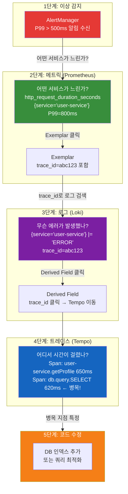
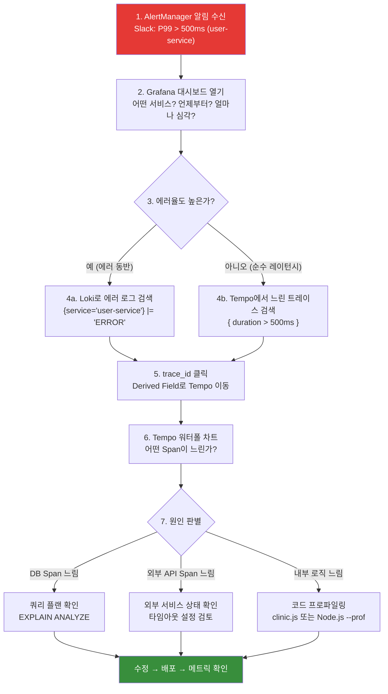
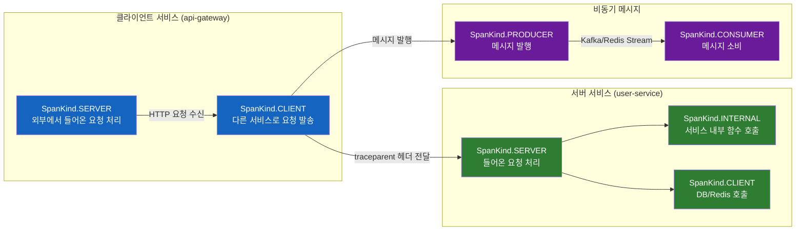
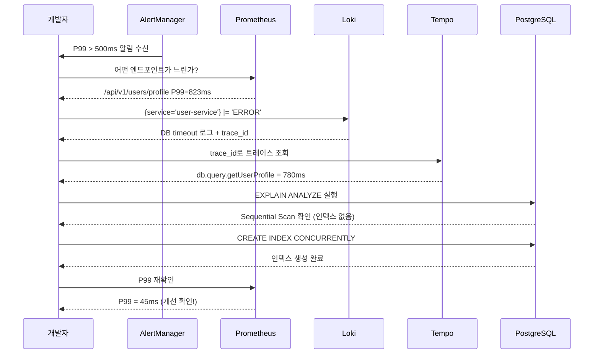

# 관측가능성 심화 가이드 — M.E.L.T. 통합과 실전 디버깅

> **문서 ID**: ONBOARD-05-MON-08
> **버전**: 1.0.0 | **작성일**: 2026-04-12 | **작성자**: Implementer (Sonnet)
> **선행 학습**:
>   - `metrics/01-prometheus-basics.md` (Prometheus 기초)
>   - `logging/01-loki-guide.md` (Loki 로그 관리)
>   - `tracing/01-tempo-otel.md` (Tempo + OpenTelemetry)
> **소요 시간**: 약 120분
> **CSAP**: D-06 (침해사고 관리), D-10 (네트워크 보안)
> **Design Ref**: MTU-N178 §2, MTU-N236 §1

---

## 목차

1. [관측가능성 3요소 통합 — M.E.L.T. 완전 이해](#1-관측가능성-3요소-통합--melt-완전-이해)
   - 1.1 [M.E.L.T.란 무엇인가](#11-melt란-무엇인가)
   - 1.2 [세 기둥이 연결되는 방식](#12-세-기둥이-연결되는-방식)
   - 1.3 [trace_id가 모든 것을 연결하는 방법](#13-trace_id가-모든-것을-연결하는-방법)
   - 1.4 [Grafana 단일 화면에서 보기](#14-grafana-단일-화면에서-보기)
2. [실제 디버깅 워크플로우](#2-실제-디버깅-워크플로우)
   - 2.1 [전체 흐름: 알림 → 코드 라인까지](#21-전체-흐름-알림--코드-라인까지)
   - 2.2 [시나리오: API P99 급증 추적](#22-시나리오-api-p99-급증-추적)
   - 2.3 [단계별 상세 수행 방법](#23-단계별-상세-수행-방법)
3. [OTel(OpenTelemetry) 완전 이해](#3-otelopentelemetry-완전-이해)
   - 3.1 [Span, Trace, Context Propagation](#31-span-trace-context-propagation)
   - 3.2 [W3C TraceContext 헤더 심화](#32-w3c-tracecontext-헤더-심화)
   - 3.3 [Fastify 자동 계측 설정](#33-fastify-자동-계측-설정)
   - 3.4 [AI 서비스 스트리밍 요청 추적](#34-ai-서비스-스트리밍-요청-추적)
4. [커스텀 계측 추가하기](#4-커스텀-계측-추가하기)
   - 4.1 [비즈니스 Span 추가](#41-비즈니스-span-추가)
   - 4.2 [주요 속성 추가](#42-주요-속성-추가)
   - 4.3 [Span 상태 설정과 에러 기록](#43-span-상태-설정과-에러-기록)
   - 4.4 [DB 쿼리와 외부 API 호출 추적](#44-db-쿼리와-외부-api-호출-추적)
5. [로그-트레이스-메트릭 상관 관계](#5-로그-트레이스-메트릭-상관-관계)
   - 5.1 [로그에 trace_id 자동 포함](#51-로그에-trace_id-자동-포함)
   - 5.2 [Loki Derived Fields로 Tempo 바로 이동](#52-loki-derived-fields로-tempo-바로-이동)
   - 5.3 [Prometheus Exemplar로 트레이스 연결](#53-prometheus-exemplar로-트레이스-연결)
6. [실습: 느린 API 끝까지 추적하기](#6-실습-느린-api-끝까지-추적하기)
   - 6.1 [실습 목표와 준비](#61-실습-목표와-준비)
   - 6.2 [단계별 실습 진행](#62-단계별-실습-진행)
   - 6.3 [결과 해석](#63-결과-해석)
7. [학습 체크리스트](#7-학습-체크리스트)
8. [다음 단계](#8-다음-단계)

---

## 1. 관측가능성 3요소 통합 — M.E.L.T. 완전 이해

### 1.1 M.E.L.T.란 무엇인가

관측가능성(Observability)은 시스템 내부 상태를 외부에서 이해할 수 있는 능력입니다. M.E.L.T.는 이를 구성하는 네 가지 데이터 유형의 약자입니다.

```
M — Metrics  (메트릭)  : 숫자로 표현된 시스템 상태 → Prometheus
E — Events   (이벤트)  : 발생한 사건 기록 → Kubernetes Events, Audit Log
L — Logs     (로그)    : 상세 텍스트 기록 → Loki
T — Traces   (추적)    : 요청 여정 추적 → Tempo
```

이 중 이 프로젝트에서 가장 핵심적으로 사용하는 세 가지는 **Metrics(Prometheus), Logs(Loki), Traces(Tempo)**입니다.

#### 비유: 병원 진료의 세 단계

```
병원에 아픈 환자가 왔습니다.

1단계 — 바이탈 체크 (Metrics):
  체온: 39.2°C ← 정상 범위 초과! (알림 발생)
  혈압: 140/90  ← 높음
  맥박: 95 bpm  ← 약간 높음

2단계 — 증상 청취 (Logs):
  "아침부터 두통이 있었습니다"
  "점심에 구역질이 났습니다"
  "오후 3시에 열이 갑자기 올랐습니다"

3단계 — 검사 결과 (Traces):
  혈액 검사: 백혈구 수치 정상
  X-레이: 이상 없음
  소변 검사: 세균 감지! ← 원인 발견

서비스 장애도 똑같은 과정입니다:
  메트릭으로 이상 감지 → 로그로 증상 파악 → 트레이스로 원인 추적
```

### 1.2 세 기둥이 연결되는 방식

각 기둥은 독립적으로도 유용하지만, 세 가지를 함께 사용할 때 진짜 힘이 발휘됩니다.



### 1.3 trace_id가 모든 것을 연결하는 방법

`trace_id`는 하나의 사용자 요청에 부여되는 전역 고유 식별자입니다. 이 ID가 메트릭, 로그, 트레이스 세 곳에 모두 포함됨으로써 연결이 가능해집니다.

```
사용자가 POST /api/v1/profile 을 호출합니다.
OTel이 자동으로 trace_id = "4bf92f3577b34da6a3ce929d0e0e4736" 을 생성합니다.

이 ID는 세 곳에 동시에 기록됩니다:

[Prometheus Exemplar]
  http_request_duration_seconds{...} = 0.823
  # trace_id="4bf92f3577b34da6a3ce929d0e0e4736" ← 함께 저장

[Loki 로그]
  {
    "timestamp": "2026-04-12T09:15:33Z",
    "level": "error",
    "message": "DB query timeout",
    "service": "user-service",
    "trace_id": "4bf92f3577b34da6a3ce929d0e0e4736"  ← 포함됨
  }

[Tempo 트레이스]
  Trace ID: 4bf92f3577b34da6a3ce929d0e0e4736
  └─ api-gateway (10ms)
     └─ user-service (800ms)  ← 느림!
        └─ postgres (780ms)   ← 원인!
```

이제 알림에서 trace_id 하나만 있으면, 해당 요청의 로그와 트레이스를 즉시 찾을 수 있습니다.

#### 실제 코드: 로그에 trace_id 포함하기

```typescript
// platform/packages/observability/src/logger.ts
import { trace, context } from '@opentelemetry/api';
import pino from 'pino';

const baseLogger = pino({ level: 'info' });

/**
 * OTel 컨텍스트에서 trace_id를 자동으로 추출하여 로그에 포함합니다.
 * Design Ref: MTU-N178 §2.1 — 로그-트레이스 상관 관계
 */
export function getLogger(service: string) {
  return {
    info: (message: string, meta: Record<string, unknown> = {}) => {
      const span = trace.getActiveSpan();
      const traceId = span?.spanContext().traceId ?? 'no-trace';
      const spanId = span?.spanContext().spanId ?? 'no-span';

      baseLogger.info({
        service,
        trace_id: traceId,  // ← 핵심: 로그에 trace_id 포함
        span_id: spanId,
        ...meta,
        message,
      });
    },

    error: (message: string, error?: Error, meta: Record<string, unknown> = {}) => {
      const span = trace.getActiveSpan();
      const traceId = span?.spanContext().traceId ?? 'no-trace';

      baseLogger.error({
        service,
        trace_id: traceId,  // ← 에러 로그에도 trace_id 포함
        error_name: error?.name,
        // 민감 정보는 스택 트레이스에 포함하지 않음 (CSAP D-12)
        error_message: error?.message?.substring(0, 200),
        ...meta,
        message,
      });
    },
  };
}
```

### 1.4 Grafana 단일 화면에서 보기

Grafana는 Prometheus, Loki, Tempo를 하나의 UI에서 연결해 보여주는 통합 시각화 도구입니다.

#### Exemplar 설정 (메트릭 → 트레이스)

Grafana에서 Prometheus 데이터소스에 Exemplar를 설정하면, 히스토그램 그래프의 점(dot)을 클릭하여 해당 요청의 Tempo 트레이스로 바로 이동할 수 있습니다.

```yaml
# Grafana 데이터소스 설정 (grafana-datasource-configmap.yaml)
apiVersion: v1
kind: ConfigMap
metadata:
  name: grafana-datasources
  namespace: monitoring
data:
  datasources.yaml: |
    apiVersion: 1
    datasources:
      - name: Prometheus
        type: prometheus
        url: http://prometheus-operated:9090
        jsonData:
          exemplarTraceIdDestinations:
            - name: trace_id               # ← Exemplar 필드명
              datasourceUid: tempo-uid     # ← 연결할 Tempo 데이터소스
              urlDisplayLabel: "Tempo에서 보기"
```

#### Derived Fields 설정 (로그 → 트레이스)

Loki 데이터소스에 Derived Fields를 설정하면, 로그에서 `trace_id`를 자동으로 인식하고 Tempo 링크로 변환합니다.

```yaml
      - name: Loki
        type: loki
        url: http://loki:3100
        jsonData:
          derivedFields:
            - name: trace_id
              matcherRegex: '"trace_id":"([^"]+)"'  # ← JSON 로그에서 trace_id 추출
              url: '$${__value.raw}'
              datasourceUid: tempo-uid              # ← Tempo로 연결
              urlDisplayLabel: "Tempo에서 트레이스 보기"
```

#### 결과: 하나의 화면에서 모든 것을 보는 통합 대시보드

```
Grafana 대시보드 레이아웃:

┌─────────────────────────────────────────────────────┐
│  상단: 메트릭 패널 (Prometheus)                        │
│  - P99 응답시간 그래프                                 │
│  - 에러율 그래프 (with Exemplar 점)                    │
│  - 초당 요청수 (RPS)                                  │
├─────────────────────────────────────────────────────┤
│  중단: 로그 패널 (Loki)                               │
│  - 실시간 에러 로그 스트림                             │
│  - trace_id 클릭 → Tempo 이동 링크                    │
├─────────────────────────────────────────────────────┤
│  하단: 트레이스 패널 (Tempo)                           │
│  - 최근 느린 요청 목록                                 │
│  - 서비스별 레이턴시 분포                              │
└─────────────────────────────────────────────────────┘

💡 팁: 상단 그래프에서 이상 시점을 드래그 선택하면
       아래 로그와 트레이스가 자동으로 해당 시간 범위로 필터링됩니다.
```

---

## 2. 실제 디버깅 워크플로우

### 2.1 전체 흐름: 알림 → 코드 라인까지

실제 장애 대응 시 사용하는 표준 워크플로우입니다. 이 순서를 외워두면 패닉 없이 체계적으로 원인을 찾을 수 있습니다.



### 2.2 시나리오: API P99 급증 추적

오전 9시 15분, Slack에 알림이 왔습니다.

```
[AlertManager] 🔴 FIRING
알림명: UserServiceP99High
서비스: user-service
현재값: P99 = 823ms (임계값: 500ms)
시작: 2026-04-12 09:10:00
```

이 알림을 받았을 때 어떻게 해결하는지 단계별로 살펴보겠습니다.

### 2.3 단계별 상세 수행 방법

#### 1단계: Grafana 대시보드로 범위 파악

```
브라우저에서 Grafana 접속:
  http://localhost:3001 (포트포워딩 중인 경우)
  또는 kubectl port-forward -n monitoring svc/grafana 3001:80 &

대시보드 선택: "SaaS Platform Overview" 또는 "Service Details"
시간 범위: Last 30 minutes (09:00 ~ 09:30으로 설정)
```

PromQL로 어떤 엔드포인트가 느린지 좁히기:

```promql
# user-service의 엔드포인트별 P99 레이턴시
histogram_quantile(0.99,
  sum by (handler, le) (
    rate(http_request_duration_seconds_bucket{
      service="user-service"
    }[5m])
  )
)
```

결과 예시:
```
handler="/api/v1/users/profile" → 823ms  ← 문제!
handler="/api/v1/users/list"    → 45ms   ← 정상
handler="/health"               → 2ms    ← 정상
```

#### 2단계: Loki에서 에러 로그 확인

Grafana → Explore → Loki 선택:

```logql
# 해당 시간대의 에러 로그 검색
{namespace="saas-system", service="user-service"}
|= "ERROR"
| json
| line_format "{{.timestamp}} [{{.level}}] {{.message}} trace_id={{.trace_id}}"
```

출력 예시:
```
09:10:23 [ERROR] Database query timeout after 800ms trace_id=4bf92f3577b34da6a
09:11:45 [ERROR] Database query timeout after 750ms trace_id=8c4e1a2b99f0d5c3
09:12:11 [ERROR] Database query timeout after 820ms trace_id=1d7f3e5a0b2c4d6e
```

패턴 발견: DB 쿼리 타임아웃이 반복되고 있습니다.

#### 3단계: trace_id로 Tempo 이동

로그의 `trace_id` 값(예: `4bf92f3577b34da6a`)을 클릭하면 Derived Field가 Tempo로 자동 이동합니다.

또는 Grafana → Explore → Tempo에서 직접 검색:

```
# TraceQL로 느리고 에러가 있는 트레이스 검색
{ .service.name = "user-service" && duration > 500ms && status = error }
```

#### 4단계: Tempo 워터폴 차트에서 병목 확인

```
Trace ID: 4bf92f3577b34da6a3ce929d0e0e4736
총 소요시간: 823ms

서비스 워터폴:
┌─ api-gateway [12ms]
│  └─ user-service [800ms]  ← 대부분의 시간
│     ├─ auth.verify [15ms]  ← 정상
│     └─ db.query.getUserProfile [780ms]  ← 문제!
│        span.db.system: postgresql
│        span.db.statement: SELECT * FROM users JOIN ...
│        span.db.operation: SELECT
│        tenantId: "tenant-alpha"
└─ [응답 반환] [11ms]
```

원인 특정: `getUserProfile` 쿼리가 780ms 걸리고 있습니다. DB 인덱스 문제일 가능성이 높습니다.

#### 5단계: DB 쿼리 최적화 후 검증

```sql
-- EXPLAIN ANALYZE로 쿼리 플랜 확인
EXPLAIN ANALYZE
SELECT u.*, p.* FROM users u
JOIN profiles p ON u.id = p.user_id
WHERE u.tenant_id = 'tenant-alpha'
  AND u.id = 'user-123';

-- 결과: Sequential Scan (인덱스 없음!)
-- → tenant_id + id 복합 인덱스 추가
CREATE INDEX CONCURRENTLY idx_users_tenant_id
  ON users(tenant_id, id);
```

수정 배포 후 Prometheus에서 P99 확인:
```promql
histogram_quantile(0.99,
  rate(http_request_duration_seconds_bucket{
    service="user-service",
    handler="/api/v1/users/profile"
  }[5m])
)
```

결과: 823ms → 45ms로 개선됨을 메트릭으로 확인.

---

## 3. OTel(OpenTelemetry) 완전 이해

### 3.1 Span, Trace, Context Propagation

#### Span의 전체 구조

Span은 하나의 작업을 나타내는 데이터 단위입니다. Span에는 다음 정보가 담깁니다.

```typescript
// OTel Span 구조 (개념적 표현)
interface Span {
  // 식별자
  traceId: string;    // 상위 Trace의 ID (128bit hex)
  spanId: string;     // 이 Span의 고유 ID (64bit hex)
  parentSpanId?: string; // 부모 Span ID (Root Span은 없음)

  // 메타데이터
  name: string;       // 작업 이름 (예: "user-service.getProfile")
  kind: SpanKind;     // SERVER, CLIENT, INTERNAL, PRODUCER, CONSUMER

  // 시간
  startTime: HrTime;  // 시작 시각 (나노초 정밀도)
  endTime: HrTime;    // 종료 시각

  // 상태
  status: { code: SpanStatusCode; message?: string };
  // SpanStatusCode: UNSET, OK, ERROR

  // 추가 정보
  attributes: Attributes;  // key-value 쌍 (비즈니스 데이터)
  events: TimedEvent[];    // Span 내 발생한 이벤트 (예: 재시도)
  links: Link[];           // 다른 Trace와의 연결 (비동기 작업)
}
```

#### OTel SpanKind 분류 다이어그램

요청이 서비스 경계를 넘을 때마다 Span의 역할이 달라집니다. `SpanKind`는 이 역할을 구분합니다.



**SpanKind 정리**:

| SpanKind | 사용 시점 | 예시 |
|---------|---------|------|
| `SERVER` | 외부에서 들어온 요청 처리 | Fastify 라우트 핸들러 |
| `CLIENT` | 다른 서비스나 DB에 요청 | HTTP 호출, DB 쿼리, Redis 명령 |
| `INTERNAL` | 서비스 내부 함수 | 비즈니스 로직 함수 |
| `PRODUCER` | 메시지 큐에 발행 | Kafka produce, Redis LPUSH |
| `CONSUMER` | 메시지 큐에서 소비 | Kafka consume, Redis BRPOP |

#### Trace 계층 구조 시각화

```
Trace ID: 4bf92f3577b34da6a3ce929d0e0e4736

├─ [ROOT] api-gateway.handleRequest         │████░░░░░░│ 12ms
│   kind=SERVER
│   http.method=POST
│   http.url=/api/v1/users/profile
│   http.status_code=200
│
├─ [CHILD 1] user-service.processRequest    │█████████████████████░│ 800ms
│   kind=SERVER
│   tenantId=tenant-alpha
│   userId=user-123
│
│   ├─ [CHILD 1.1] auth.verifyToken         │████│ 15ms
│   │   kind=CLIENT
│   │   rpc.method=verifyToken
│
│   └─ [CHILD 1.2] db.query.getUserProfile  │████████████████████│ 780ms
│       kind=CLIENT
│       db.system=postgresql
│       db.name=saas_db
│       db.statement=SELECT u.*, p.* FROM ...
│       db.rows_affected=1
│
└─ 총 823ms
```

### 3.2 W3C TraceContext 헤더 심화

W3C TraceContext는 서비스 간 Trace 정보를 전달하는 표준 HTTP 헤더 형식입니다.

```
HTTP 요청 헤더:
  traceparent: 00-4bf92f3577b34da6a3ce929d0e0e4736-00f067aa0ba902b7-01

각 필드 해설:
  00                                    → 버전 (항상 00)
  4bf92f3577b34da6a3ce929d0e0e4736     → Trace ID (32자리 hex, 128bit)
  00f067aa0ba902b7                     → Parent Span ID (16자리 hex, 64bit)
  01                                   → Trace Flags
                                         01 = 샘플링 됨 (기록)
                                         00 = 샘플링 안 됨 (기록 안 함)

추가 헤더:
  tracestate: rojo=00f067aa0ba902b7,congo=t61rcWkgMzE
              → 벤더별 추가 정보 (Istio, Datadog 등)
```

#### 이 프로젝트의 헤더 처리 방식

```typescript
// platform/packages/mesh-ready/src/trace-context-propagator.ts 요약
// Design Ref: MTU-N178 §2.3 — Context Propagation

import { W3CTraceContextPropagator } from '@opentelemetry/core';
import { CompositePropagator, B3Propagator } from '@opentelemetry/propagator-b3';

// W3C TraceContext (기본) + B3 (Istio/Linkerd 호환) 동시 지원
export const propagator = new CompositePropagator({
  propagators: [
    new W3CTraceContextPropagator(),  // traceparent, tracestate
    new B3Propagator(),               // x-b3-traceid, x-b3-spanid 등
  ],
});

// 이 설정으로 아래 헤더들이 자동으로 처리됩니다:
// - traceparent (W3C 표준)
// - tracestate  (W3C 벤더 확장)
// - x-b3-traceid (B3/Zipkin)
// - x-b3-spanid
// - x-b3-parentspanid
// - x-b3-sampled
// - x-request-id (기존 correlationId 연동)
```

### 3.3 Fastify 자동 계측 설정

Fastify에서 OTel 자동 계측을 설정하면 모든 HTTP 요청이 자동으로 Span을 생성합니다. 코드를 수정하지 않아도 됩니다.

```typescript
// platform/services/user-service/src/telemetry.ts
// ⚠️ 중요: 이 파일은 서비스 진입점(main.ts)에서 가장 먼저 import 해야 합니다!
import { NodeSDK } from '@opentelemetry/sdk-node';
import { OTLPTraceExporter } from '@opentelemetry/exporter-trace-otlp-http';
import { HttpInstrumentation } from '@opentelemetry/instrumentation-http';
import { FastifyInstrumentation } from '@opentelemetry/instrumentation-fastify';
import { PgInstrumentation } from '@opentelemetry/instrumentation-pg';
import { RedisInstrumentation } from '@opentelemetry/instrumentation-ioredis';
import { Resource } from '@opentelemetry/resources';
import { SemanticResourceAttributes } from '@opentelemetry/semantic-conventions';

// Design Ref: MTU-N178 §2.2 — 자동 계측 설정
const sdk = new NodeSDK({
  resource: new Resource({
    [SemanticResourceAttributes.SERVICE_NAME]: 'user-service',
    [SemanticResourceAttributes.SERVICE_VERSION]: process.env.npm_package_version ?? '0.0.0',
    [SemanticResourceAttributes.DEPLOYMENT_ENVIRONMENT]: process.env.NODE_ENV ?? 'production',
    // 멀티테넌트 식별을 위한 커스텀 속성
    'tenant.namespace': process.env.TENANT_NAMESPACE ?? 'default',
  }),

  traceExporter: new OTLPTraceExporter({
    // OTel Collector로 전송 (Collector가 Tempo로 라우팅)
    url: process.env.OTEL_EXPORTER_OTLP_ENDPOINT ?? 'http://otel-collector:4318/v1/traces',
    headers: {
      // N2SF: O등급 데이터만 전송, 민감 정보 제외
      'x-service-name': 'user-service',
    },
  }),

  instrumentations: [
    // HTTP 요청 자동 계측 (Fastify 기반)
    new HttpInstrumentation({
      // 헬스체크 경로는 Span 생성 제외 (노이즈 감소)
      ignoreIncomingRequestHook: (req) => {
        return req.url === '/health' || req.url === '/metrics';
      },
    }),

    // Fastify 라우터 정보 자동 추가
    new FastifyInstrumentation(),

    // PostgreSQL 쿼리 자동 계측
    new PgInstrumentation({
      // 쿼리 파라미터는 보안상 기록하지 않음 (CSAP D-12)
      dbStatementSerializer: (operation, query) => {
        // 쿼리 구조만 기록, 실제 값(PII)은 제외
        return `${operation} [${query.name ?? 'anonymous'}]`;
      },
    }),

    // Redis 명령 자동 계측
    new RedisInstrumentation(),
  ],
});

sdk.start();
process.on('SIGTERM', () => sdk.shutdown());
```

```typescript
// platform/services/user-service/src/main.ts
// ⚠️ telemetry.ts를 반드시 첫 번째로 import
import './telemetry';  // ← 이 줄이 가장 위에 있어야 합니다!

import Fastify from 'fastify';
import { userRoutes } from './routes';

const app = Fastify({ logger: true });
app.register(userRoutes);
app.listen({ port: 3000, host: '0.0.0.0' });
```

### 3.4 AI 서비스 스트리밍 요청 추적

AI 서비스의 스트리밍 응답은 일반 요청과 다르게 처리해야 합니다. 스트림이 완전히 종료될 때까지 Span을 유지해야 합니다.

```typescript
// platform/services/ai-service/src/handlers/ai-agent.handler.ts
// Design Ref: MTU-N178 §3.1 — AI 스트리밍 추적
import { trace, SpanStatusCode, SpanKind } from '@opentelemetry/api';
import type { FastifyRequest, FastifyReply } from 'fastify';

const tracer = trace.getTracer('ai-service');

export async function handleAgentStream(
  request: FastifyRequest,
  reply: FastifyReply,
): Promise<void> {
  // AI 스트리밍 전체를 감싸는 Span 생성
  await tracer.startActiveSpan(
    'ai-agent.streamResponse',
    {
      kind: SpanKind.SERVER,
      attributes: {
        'ai.model': 'claude-sonnet-4-6',
        'ai.streaming': true,
        // N2SF: 데이터 등급 기록 (O등급만 허용)
        'n2sf.data_grade': 'O',
        'tenant.id': request.headers['x-tenant-id'] as string,
      },
    },
    async (span) => {
      let tokenCount = 0;
      let firstTokenMs = 0;
      const startTime = Date.now();

      try {
        // 스트림 시작 이벤트 기록
        span.addEvent('stream.start', {
          'request.prompt_length': (request.body as { prompt: string }).prompt.length,
        });

        const stream = await aiGateway.streamChat(/* ... */);

        for await (const chunk of stream) {
          tokenCount++;
          if (tokenCount === 1) {
            firstTokenMs = Date.now() - startTime;
            // TTFT(Time To First Token) 이벤트 기록
            span.addEvent('stream.first_token', {
              'ai.ttft_ms': firstTokenMs,
            });
          }
          reply.raw.write(chunk);
        }

        // 스트림 완료 이벤트 기록
        span.addEvent('stream.complete', {
          'ai.total_tokens': tokenCount,
          'ai.total_ms': Date.now() - startTime,
        });
        span.setStatus({ code: SpanStatusCode.OK });

      } catch (error) {
        // 에러 기록 (민감 정보 제외)
        span.recordException(error as Error);
        span.setStatus({
          code: SpanStatusCode.ERROR,
          message: 'AI stream failed',
        });
        throw error;
      } finally {
        span.end();  // ← 스트림 종료 후 Span 종료
      }
    },
  );
}
```

---

## 4. 커스텀 계측 추가하기

### 4.1 비즈니스 Span 추가

자동 계측만으로는 비즈니스 로직의 세부 사항을 추적할 수 없습니다. 중요한 함수에 직접 Span을 추가하면 더 상세한 추적이 가능합니다.

#### 기본 패턴

```typescript
import { trace, SpanStatusCode } from '@opentelemetry/api';

const tracer = trace.getTracer('user-service');  // 서비스 이름 일치

// ✅ 올바른 커스텀 Span 추가 방법
async function getUserProfile(userId: string, tenantId: string) {
  return tracer.startActiveSpan('user-service.getUserProfile', async (span) => {
    try {
      // 비즈니스 컨텍스트 속성 추가
      span.setAttributes({
        'user.id': userId,
        'tenant.id': tenantId,
        'operation': 'getUserProfile',
      });

      const user = await db.users.findOne({ id: userId, tenantId });

      if (!user) {
        span.setAttributes({ 'user.found': false });
        span.setStatus({ code: SpanStatusCode.OK });
        return null;
      }

      span.setAttributes({
        'user.found': true,
        'user.plan': user.plan,  // 비즈니스 중요 속성
      });
      span.setStatus({ code: SpanStatusCode.OK });
      return user;

    } catch (error) {
      span.recordException(error as Error);
      span.setStatus({
        code: SpanStatusCode.ERROR,
        message: (error as Error).message,
      });
      throw error;

    } finally {
      span.end();  // ← 반드시 호출해야 합니다!
    }
  });
}
```

#### 중첩 Span (Parent-Child 관계)

```typescript
// 외부에서 이미 Span이 활성화된 상태에서 새 Span을 만들면 자동으로 Child가 됩니다
async function processUserRequest(userId: string) {
  return tracer.startActiveSpan('processUserRequest', async (parentSpan) => {
    // Step 1: 유저 조회 (Child Span 1)
    const user = await tracer.startActiveSpan('fetchUser', async (span) => {
      const result = await db.findUser(userId);
      span.end();
      return result;
    });

    // Step 2: 권한 확인 (Child Span 2)
    const permissions = await tracer.startActiveSpan('checkPermissions', async (span) => {
      const result = await authService.getPermissions(user.id);
      span.end();
      return result;
    });

    parentSpan.end();
    return { user, permissions };
  });
}

// 결과 트레이스:
// processUserRequest [100ms]
//   ├─ fetchUser [30ms]
//   └─ checkPermissions [65ms]
```

### 4.2 주요 속성 추가

Span 속성은 나중에 TraceQL로 검색하거나 필터링할 때 사용됩니다. 다음 속성들을 표준으로 추가합니다.

```typescript
// 이 프로젝트의 표준 Span 속성 (Design Ref: MTU-N178 §2.4)

// ✅ 비즈니스 컨텍스트 (멀티테넌트 추적에 필수)
span.setAttributes({
  'tenant.id': tenantId,        // 테넌트 식별
  'user.id': userId,            // 사용자 식별 (익명화 가능)
  'plan.type': 'enterprise',    // 요금제 유형 (비즈니스 우선순위)
});

// ✅ 기술 컨텍스트 (성능 분석에 유용)
span.setAttributes({
  'db.query.count': 3,          // 쿼리 수
  'cache.hit': true,            // 캐시 히트 여부
  'retry.count': 2,             // 재시도 횟수
});

// ✅ N2SF 데이터 분류 (보안 감사에 필수)
span.setAttributes({
  'n2sf.data_grade': 'O',       // O 등급만 외부 AI API 전송 허용
  'n2sf.pii_masked': true,      // PII 마스킹 여부
});

// ❌ 절대 추가하지 말아야 할 속성 (CSAP D-12)
// span.setAttributes({
//   'user.password': hashedPassword,  // 비밀번호 관련 정보 금지
//   'db.password': process.env.DB_PASS,  // 시크릿 금지
//   'user.ssn': '900101-1234567',     // 주민등록번호 금지
// });
```

#### Span 속성으로 검색하는 TraceQL

```
# Tempo에서 특정 테넌트의 느린 요청 찾기
{ .tenant.id = "tenant-alpha" && duration > 500ms }

# 에러가 있는 enterprise 플랜 요청 찾기
{ .plan.type = "enterprise" && status = error }

# DB 쿼리가 3번 이상인 요청 (N+1 문제 탐지)
{ .db.query.count >= 3 && .service.name = "user-service" }
```

### 4.3 Span 상태 설정과 에러 기록

Span의 상태를 올바르게 설정해야 Tempo에서 에러 트레이스를 필터링할 수 있습니다.

```typescript
import { SpanStatusCode } from '@opentelemetry/api';

// ✅ 성공 케이스
span.setStatus({ code: SpanStatusCode.OK });
span.end();

// ✅ 에러 케이스 — 올바른 방법
try {
  await riskyOperation();
} catch (error) {
  // 1. 예외 정보 기록 (스택 트레이스 포함)
  span.recordException(error as Error);

  // 2. 상태를 ERROR로 설정
  span.setStatus({
    code: SpanStatusCode.ERROR,
    message: '작업 실패: DB 연결 오류',  // 사용자에게 노출되지 않는 내부 메시지
  });

  // 3. Span을 항상 종료 (finally 권장)
  span.end();
  throw error;  // 에러를 다시 던져 상위 Span에도 전파
}

// ✅ 비즈니스 예외 케이스 (HTTP 4xx — 서비스 입장에서는 정상)
if (!user) {
  span.setAttributes({ 'error.type': 'not_found' });
  span.setStatus({ code: SpanStatusCode.OK });  // 4xx는 서비스 에러가 아님
  span.end();
  throw new NotFoundError('User not found');
}
```

### 4.4 DB 쿼리와 외부 API 호출 추적

#### TypeORM/Prisma DB 쿼리 추적

```typescript
// Design Ref: MTU-N178 §2.5 — DB 쿼리 추적
async function findUserWithOrders(userId: string): Promise<UserWithOrders> {
  return tracer.startActiveSpan('db.findUserWithOrders', async (span) => {
    span.setAttributes({
      'db.system': 'postgresql',
      'db.name': 'saas_db',
      'db.operation': 'SELECT',
      'db.table': 'users,orders',
      'user.id': userId,
    });

    const startTime = Date.now();
    try {
      const result = await prisma.user.findUnique({
        where: { id: userId },
        include: { orders: { take: 10, orderBy: { createdAt: 'desc' } } },
      });

      const queryMs = Date.now() - startTime;
      span.setAttributes({
        'db.duration_ms': queryMs,
        'db.rows_returned': result?.orders.length ?? 0,
      });

      // ⚠️ 100ms 이상은 느린 쿼리로 이벤트 기록
      if (queryMs > 100) {
        span.addEvent('slow_query_detected', { 'db.duration_ms': queryMs });
      }

      span.setStatus({ code: SpanStatusCode.OK });
      return result as UserWithOrders;

    } catch (error) {
      span.recordException(error as Error);
      span.setStatus({ code: SpanStatusCode.ERROR });
      throw error;
    } finally {
      span.end();
    }
  });
}
```

#### 외부 API 호출 추적 (AI Gateway 패턴)

```typescript
// platform/services/ai-service/src/lib/ai-tools.ts
// N2SF: O등급 데이터만 외부 전송, PII 마스킹 필수
async function callExternalAI(prompt: string, tenantId: string): Promise<string> {
  return tracer.startActiveSpan('ai-gateway.callExternalAPI', async (span) => {
    span.setAttributes({
      'ai.provider': 'anthropic',
      'ai.model': 'claude-sonnet-4-6',
      'n2sf.data_grade': 'O',  // N2SF 등급 기록 (감사 추적)
      'n2sf.pii_masked': true,
      'tenant.id': tenantId,
      'ai.prompt_length': prompt.length,
    });

    try {
      const response = await fetch('https://api.anthropic.com/v1/messages', {
        method: 'POST',
        headers: {
          'Authorization': `Bearer ${process.env.ANTHROPIC_API_KEY}`,
          // Context Propagation: AI 제공자는 OTel 미지원이므로 수동으로 trace_id 전달
          'x-correlation-id': span.spanContext().traceId,
        },
        body: JSON.stringify({ model: 'claude-sonnet-4-6', /* ... */ }),
      });

      span.setAttributes({
        'http.status_code': response.status,
        'ai.response_status': response.ok ? 'success' : 'error',
      });
      span.setStatus({ code: response.ok ? SpanStatusCode.OK : SpanStatusCode.ERROR });
      return await response.text();

    } catch (error) {
      span.recordException(error as Error);
      span.setStatus({ code: SpanStatusCode.ERROR });
      throw error;
    } finally {
      span.end();
    }
  });
}
```

---

## 5. 로그-트레이스-메트릭 상관 관계

### 5.1 로그에 trace_id 자동 포함

pino 로거와 OTel을 연결하면 모든 로그에 `trace_id`가 자동으로 포함됩니다.

```typescript
// platform/packages/observability/src/pino-otel-transport.ts
// Design Ref: MTU-N178 §2.6 — 로그-트레이스 상관
import { trace } from '@opentelemetry/api';
import pino from 'pino';

/**
 * pino 로거에 OTel 컨텍스트를 자동으로 주입하는 믹스인
 * 모든 서비스에서 공통으로 사용합니다.
 */
export const createLogger = (serviceName: string) => pino({
  level: process.env.LOG_LEVEL ?? 'info',
  base: {
    service: serviceName,
    env: process.env.NODE_ENV,
  },
  // 매 로그마다 OTel 컨텍스트를 자동으로 주입
  mixin: () => {
    const span = trace.getActiveSpan();
    if (!span) return {};

    const ctx = span.spanContext();
    return {
      trace_id: ctx.traceId,   // ← Loki → Tempo 연결의 핵심
      span_id: ctx.spanId,
      trace_flags: ctx.traceFlags,
    };
  },
  // Loki가 파싱하기 쉬운 JSON 형식으로 출력
  formatters: {
    level: (label) => ({ level: label }),
  },
  timestamp: pino.stdTimeFunctions.isoTime,
});

// 사용 예시
const logger = createLogger('user-service');

logger.info({ userId: 'user-123', action: 'profile_update' }, '프로필 업데이트 성공');
// 출력:
// {
//   "level": "info",
//   "time": "2026-04-12T09:15:33.000Z",
//   "service": "user-service",
//   "trace_id": "4bf92f3577b34da6a3ce929d0e0e4736",  ← 자동 주입
//   "span_id": "00f067aa0ba902b7",
//   "userId": "user-123",
//   "action": "profile_update",
//   "message": "프로필 업데이트 성공"
// }
```

### 5.2 Loki Derived Fields로 Tempo 바로 이동

Grafana의 Loki 데이터소스에 Derived Fields를 설정하면, 로그의 `trace_id` 값이 자동으로 클릭 가능한 Tempo 링크로 변환됩니다.

```yaml
# Grafana datasource 설정에 추가
# infra/monitoring/grafana/datasources/loki.yaml
apiVersion: 1
datasources:
  - name: Loki
    type: loki
    uid: loki-uid
    url: http://loki:3100
    jsonData:
      maxLines: 1000
      derivedFields:
        # JSON 로그에서 trace_id 자동 추출
        - name: "Trace ID"
          matcherType: label          # JSON 필드로 매칭
          matcherRegex: trace_id      # 필드명
          url: "${__value.raw}"       # URL 템플릿
          datasourceUid: tempo-uid    # Tempo 데이터소스로 연결
          urlDisplayLabel: "Tempo에서 트레이스 보기"

        # 레거시 텍스트 로그에서 trace_id 추출 (정규식)
        - name: "Trace ID (text)"
          matcherType: regex
          matcherRegex: 'trace_id=([a-f0-9]{32})'
          url: "${__value.raw}"
          datasourceUid: tempo-uid
          urlDisplayLabel: "Tempo 트레이스"
```

#### 실제 동작 화면

```
Grafana → Explore → Loki 로그 조회 결과:

┌──────────────────────────────────────────────────────┐
│ 09:10:23 [ERROR] Database query timeout              │
│ service=user-service                                 │
│ trace_id=4bf92f3577b34da6a  [Tempo에서 보기] ← 클릭!│
│ user_id=user-123                                    │
└──────────────────────────────────────────────────────┘

클릭하면 → Tempo가 열리고 해당 트레이스의 워터폴 차트가 표시됩니다.
```

### 5.3 Prometheus Exemplar로 트레이스 연결

Exemplar는 메트릭 값에 trace_id를 첨부하는 기능입니다. 히스토그램 그래프에서 이상 데이터 포인트를 클릭하면 해당 요청의 Tempo 트레이스로 바로 이동합니다.

```typescript
// Fastify에서 Prometheus 메트릭에 Exemplar 추가
// platform/packages/observability/src/metrics.ts
import { Registry, Histogram } from 'prom-client';
import { trace } from '@opentelemetry/api';

const registry = new Registry();

const httpDurationHistogram = new Histogram({
  name: 'http_request_duration_seconds',
  help: 'HTTP 요청 처리 시간 (초)',
  labelNames: ['method', 'route', 'status_code', 'service'],
  buckets: [0.005, 0.01, 0.025, 0.05, 0.1, 0.25, 0.5, 1, 2.5, 5],
  registers: [registry],
  enableExemplars: true,  // ← Exemplar 기능 활성화
});

// 요청 완료 시 Exemplar와 함께 메트릭 기록
export function recordHttpDuration(
  method: string,
  route: string,
  statusCode: number,
  service: string,
  durationSeconds: number,
): void {
  const span = trace.getActiveSpan();
  const traceId = span?.spanContext().traceId;

  httpDurationHistogram.observe(
    { method, route, status_code: statusCode.toString(), service },
    durationSeconds,
    // Exemplar: trace_id 포함하여 Tempo 연결 가능하게 함
    traceId ? { traceID: traceId } : undefined,
  );
}
```

#### Grafana에서 Exemplar 확인하기

```
1. Grafana → Explore → Prometheus 선택
2. 쿼리 입력:
   histogram_quantile(0.99,
     rate(http_request_duration_seconds_bucket{service="user-service"}[5m])
   )
3. 그래프 하단의 "Exemplars" 토글 활성화
4. 그래프에 작은 다이아몬드(♦) 점이 표시됨
5. 점 클릭 → "Tempo에서 트레이스 보기" 링크 표시
6. 링크 클릭 → 해당 요청의 Tempo 워터폴 차트로 이동
```

---

## 6. 실습: 느린 API 찾아서 trace_id → 로그 → DB 쿼리까지 추적하기

### 6.1 실습 목표와 준비

이 실습에서는 실제 느린 API 요청을 발생시키고, M.E.L.T. 도구를 사용하여 원인을 찾는 전체 과정을 경험합니다.

#### 사전 준비

```bash
# 1. Grafana 포트포워딩
kubectl port-forward -n monitoring svc/grafana 3001:80 &

# 2. Prometheus 포트포워딩
kubectl port-forward -n monitoring svc/prometheus-operated 9090:9090 &

# 3. 로그 확인
kubectl logs -n saas-system -l app=user-service -f &

# 4. 현재 메트릭 기준값 확인 (실습 전 P99 확인)
curl -s 'http://localhost:9090/api/v1/query' \
  --data-urlencode 'query=histogram_quantile(0.99, rate(http_request_duration_seconds_bucket{service="user-service"}[5m]))' \
  | jq '.data.result[].value[1]'
```

### 6.2 단계별 실습 진행

#### Step 1: 느린 요청 발생시키기

```bash
# k6로 부하 테스트 (느린 엔드포인트 시뮬레이션)
cat > /tmp/slow-api-test.js << 'EOF'
import http from 'k6/http';
import { check, sleep } from 'k6';

export const options = {
  vus: 50,        // 동시 가상 사용자 50명
  duration: '2m', // 2분간 실행
};

export default function () {
  const res = http.get('http://user-service/api/v1/users/profile', {
    headers: {
      'Authorization': 'Bearer test-token',
      'X-Tenant-ID': 'tenant-alpha',
    },
  });
  check(res, { 'status 200': (r) => r.status === 200 });
  sleep(0.1);
}
EOF

k6 run /tmp/slow-api-test.js
```

#### Step 2: Prometheus에서 이상 감지

```promql
# P99 레이턴시 추이 (5분 이동 평균)
histogram_quantile(0.99,
  sum by (handler, le) (
    rate(http_request_duration_seconds_bucket{
      service="user-service"
    }[5m])
  )
)

# 에러율 확인
sum(rate(http_requests_total{service="user-service", status_code=~"5.."}[5m]))
/ sum(rate(http_requests_total{service="user-service"}[5m]))
```

예상 출력: `/api/v1/users/profile` 핸들러의 P99가 500ms 초과

#### Step 3: Loki에서 에러 로그 찾기

```logql
# Grafana → Explore → Loki
{namespace="saas-system", app="user-service"}
|= "ERROR"
| json
| trace_id != ""
| line_format "{{.time}} [{{.level}}] {{.message}} | trace={{.trace_id}}"
```

출력에서 `trace_id` 값을 복사합니다 (예: `4bf92f3577b34da6a3ce929d0e0e4736`).

#### Step 4: Tempo에서 트레이스 워터폴 확인

```
# Grafana → Explore → Tempo
# Search 방법 1: TraceID 직접 입력
4bf92f3577b34da6a3ce929d0e0e4736

# Search 방법 2: TraceQL 검색
{ .service.name = "user-service" && duration > 500ms }
| select(span:name, duration, .db.statement)
```

워터폴 차트에서 가장 긴 Span 클릭 → 속성 확인:
```
span.db.statement: "SELECT u.*, p.*, o.* FROM users u ..."
span.db.duration_ms: 750
span.db.rows_returned: 1
```

#### Step 5: DB 쿼리 분석

```bash
# PostgreSQL에 직접 접속하여 쿼리 플랜 확인
kubectl exec -n saas-system -it postgres-0 -- psql -U saas_user -d saas_db

-- 느린 쿼리 재현 및 분석
EXPLAIN (ANALYZE, BUFFERS, FORMAT TEXT)
SELECT u.*, p.*, o.*
FROM users u
  JOIN profiles p ON u.id = p.user_id
  LEFT JOIN orders o ON u.id = o.user_id
WHERE u.tenant_id = 'tenant-alpha'
  AND u.id = 'user-123';

-- 예상 출력:
-- Seq Scan on users  (cost=0.00..4521.33 rows=1 width=...)
--   Filter: (tenant_id = 'tenant-alpha' AND id = 'user-123')
-- Rows Removed by Filter: 49999
-- Execution Time: 750.234 ms
-- ← Sequential Scan이 문제! 인덱스 없음
```

#### Step 6: 수정 및 검증

```sql
-- 인덱스 추가 (서비스 중단 없이 CONCURRENTLY 옵션 사용)
CREATE INDEX CONCURRENTLY idx_users_tenant_user
  ON users(tenant_id, id);

-- 인덱스 생성 완료 후 쿼리 재실행
EXPLAIN (ANALYZE, BUFFERS)
SELECT u.*, p.*
FROM users u JOIN profiles p ON u.id = p.user_id
WHERE u.tenant_id = 'tenant-alpha' AND u.id = 'user-123';

-- 예상 출력:
-- Index Scan using idx_users_tenant_user  (cost=0.29..8.31 rows=1 ...)
-- Execution Time: 1.234 ms  ← 750ms → 1.2ms로 개선!
```

### 6.3 결과 해석

```bash
# 수정 후 P99 확인 (5분 후 재측정)
curl -s 'http://localhost:9090/api/v1/query' \
  --data-urlencode 'query=histogram_quantile(0.99, rate(http_request_duration_seconds_bucket{service="user-service", handler="/api/v1/users/profile"}[5m]))' \
  | jq '.data.result[].value[1]'

# 예상: 0.823 → 0.045 (823ms → 45ms)
```

전체 과정 요약:



---

## 7. 학습 체크리스트

아래 항목을 모두 체크할 수 있으면 이 가이드를 완료한 것입니다.

### 개념 이해

- [ ] M.E.L.T.의 각 요소(Metrics, Events, Logs, Traces)가 무엇인지 설명할 수 있다
- [ ] trace_id가 세 도구(Prometheus, Loki, Tempo)를 어떻게 연결하는지 설명할 수 있다
- [ ] Span과 Trace의 차이를 설명할 수 있다
- [ ] W3C TraceContext 헤더(`traceparent`)의 구조를 설명할 수 있다
- [ ] Parent Span과 Child Span의 관계를 설명할 수 있다
- [ ] Exemplar가 메트릭과 트레이스를 연결하는 방법을 설명할 수 있다
- [ ] Loki Derived Fields가 로그와 트레이스를 연결하는 방법을 설명할 수 있다

### 실습 완료

- [ ] Grafana에서 P99 레이턴시 그래프를 조회해 보았다
- [ ] Loki에서 trace_id를 포함한 에러 로그를 검색해 보았다
- [ ] Tempo에서 TraceQL로 느린 트레이스를 검색해 보았다
- [ ] Exemplar 점을 클릭하여 Tempo 트레이스로 이동해 보았다
- [ ] Derived Field를 클릭하여 Tempo 트레이스로 이동해 보았다

### 구현 능력

- [ ] 새 서비스에 OTel 자동 계측을 설정할 수 있다 (`NodeSDK`, `FastifyInstrumentation`)
- [ ] 비즈니스 로직에 커스텀 Span을 추가할 수 있다 (`tracer.startActiveSpan`)
- [ ] Span에 적절한 속성(`tenant.id`, `user.id`, `plan.type`)을 추가할 수 있다
- [ ] Span 에러를 올바르게 기록할 수 있다 (`recordException`, `setStatus`)
- [ ] 로그에 trace_id가 자동으로 포함되도록 pino 로거를 설정할 수 있다
- [ ] AI 서비스의 스트리밍 요청에 Span을 추가할 수 있다

### CSAP/보안

- [ ] Span 속성에 민감 정보(비밀번호, 주민등록번호, API 키)를 포함하지 않는 이유를 설명할 수 있다
- [ ] N2SF 데이터 등급에 따라 AI API 호출 추적 시 어떤 속성을 기록해야 하는지 안다
- [ ] 에러 메시지에 내부 시스템 정보가 노출되지 않도록 처리하는 방법을 안다

---

## 8. 다음 단계

이 가이드를 완료했다면 다음 학습을 진행합니다.

| 다음 문서 | 내용 | 선행 조건 |
|---------|------|--------|
| `09-sre-practices.md` | SRE 원칙과 에러 버짓 기반 개발 | 이 가이드 완료 |
| `alerting/01-alertmanager-guide.md` | AlertManager 알림 규칙 설정 | Prometheus 기초 |
| `slo/01-slo-guide.md` | SLO 설계와 에러 버짓 계산 | 이 가이드 완료 |
| `profiling/01-profiling-guide.md` | CPU/메모리 프로파일링 (pprof, clinic.js) | 트레이스 이해 후 |

```bash
# 실습 환경 정리
pkill -f "kubectl port-forward"

# 이 가이드에서 학습한 내용 복습
# 핵심 명령어 요약:
kubectl port-forward -n monitoring svc/grafana 3001:80    # Grafana 접속
kubectl port-forward -n monitoring svc/prometheus-operated 9090:9090  # Prometheus 접속
kubectl top pods -n saas-system                           # Pod 리소스 현황
kubectl logs -n saas-system -l app=user-service --tail=100 -f  # 실시간 로그
```

> 💡 **팁**: 실제 장애를 겪을 때 이 가이드의 "2.1 전체 흐름" 다이어그램을 벽에 붙여두면 패닉 없이 체계적으로 대응할 수 있습니다.
