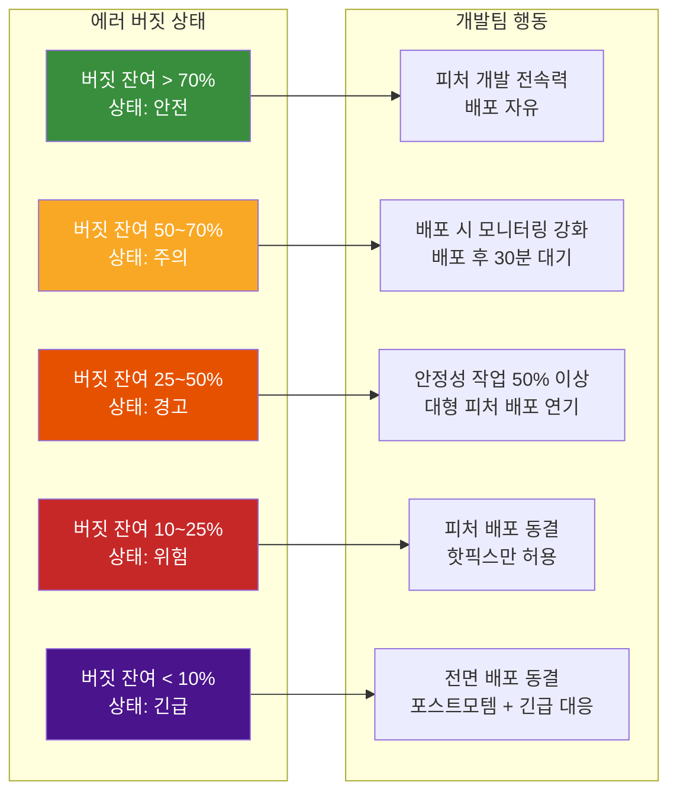
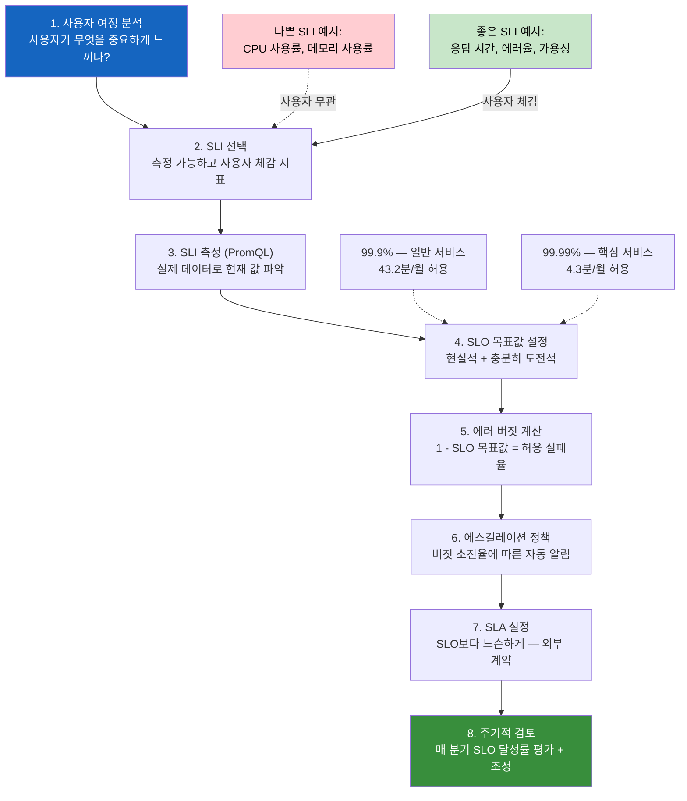
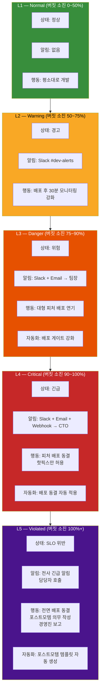

# SRE 실천 가이드 — 개발팀이 알아야 할 사이트 신뢰성 공학

> **문서 ID**: ONBOARD-05-MON-09
> **버전**: 1.0.0 | **작성일**: 2026-04-12 | **작성자**: Implementer (Sonnet)
> **선행 학습**:
>   - `slo/01-slo-guide.md` (SLO와 에러 버짓)
>   - `dora/01-dora-metrics.md` (DORA 4 Keys)
>   - `08-observability-deep-dive.md` (관측가능성 통합)
> **소요 시간**: 약 90분
> **CSAP**: D-06 (침해사고 관리), D-13 (변경 관리)
> **Design Ref**: MTU-N178 §3, MTU-N255 §SC-1~SC-6
> **Plan SC**: FR-SLO.1~6, FR-DORA.1~4

---

## 목차

1. [SRE란? — 개발팀이 왜 알아야 하나](#1-sre란--개발팀이-왜-알아야-하나)
   - 1.1 [SRE의 탄생 배경](#11-sre의-탄생-배경)
   - 1.2 [개발자에게 SRE가 중요한 이유](#12-개발자에게-sre가-중요한-이유)
   - 1.3 [공공기관 SaaS에서 SRE의 역할](#13-공공기관-saas에서-sre의-역할)
2. [에러 버짓 기반 개발 의사결정](#2-에러-버짓-기반-개발-의사결정)
   - 2.1 [에러 버짓이란 무엇인가](#21-에러-버짓이란-무엇인가)
   - 2.2 [버짓 잔여량에 따른 개발 속도 결정](#22-버짓-잔여량에-따른-개발-속도-결정)
   - 2.3 [피처 개발 vs 안정성 작업 결정 기준](#23-피처-개발-vs-안정성-작업-결정-기준)
   - 2.4 [이 프로젝트의 에러 버짓 정책](#24-이-프로젝트의-에러-버짓-정책)
3. [SLI → SLO → SLA 설계 방법](#3-sli--slo--sla-설계-방법)
   - 3.1 [좋은 SLI 고르는 방법](#31-좋은-sli-고르는-방법)
   - 3.2 [SLO 목표값 설정 트레이드오프](#32-slo-목표값-설정-트레이드오프)
   - 3.3 [SLA는 계약이다](#33-sla는-계약이다)
4. [에스컬레이션 레벨 관리](#4-에스컬레이션-레벨-관리)
   - 4.1 [escalation-controller.ts 해설](#41-escalation-controllerts-해설)
   - 4.2 [L1~L5 단계별 대응 기준](#42-l1l5-단계별-대응-기준)
   - 4.3 [에스컬레이션 정책 등록 방법](#43-에스컬레이션-정책-등록-방법)
5. [DORA 4 Keys와 팀 개발 건강도](#5-dora-4-keys와-팀-개발-건강도)
   - 5.1 [배포 빈도 높이기 전략](#51-배포-빈도-높이기-전략)
   - 5.2 [변경 리드 타임 단축 방법](#52-변경-리드-타임-단축-방법)
   - 5.3 [변경 실패율 낮추기](#53-변경-실패율-낮추기)
   - 5.4 [복구 시간 단축 방법](#54-복구-시간-단축-방법)
6. [포스트-인시던트 학습](#6-포스트-인시던트-학습)
   - 6.1 [인시던트를 성장 기회로](#61-인시던트를-성장-기회로)
   - 6.2 [포스트모템 작성 방법](#62-포스트모템-작성-방법)
   - 6.3 [Action Items 추적](#63-action-items-추적)
7. [온콜 로테이션 운영](#7-온콜-로테이션-운영)
   - 7.1 [온콜 피로 방지 방법](#71-온콜-피로-방지-방법)
   - 7.2 [효과적인 온콜 핸드오프](#72-효과적인-온콜-핸드오프)
8. [학습 체크리스트](#8-학습-체크리스트)
9. [다음 단계](#9-다음-단계)

---

## 1. SRE란? — 개발팀이 왜 알아야 하나

### 1.1 SRE의 탄생 배경

SRE(Site Reliability Engineering, 사이트 신뢰성 공학)는 Google이 2003년 개발한 개념입니다. 소프트웨어 엔지니어를 기존 시스템 운영(Ops) 역할에 투입하여 코드로 운영 문제를 해결하는 방법론입니다.

```
전통적인 개발/운영 분리 (문제):

  개발팀: "기능을 빠르게 만들어서 배포하고 싶다"
  운영팀: "배포하면 장애가 날 수 있다. 배포를 최소화하자"
  결과: 두 팀의 목표가 충돌 → 조직 내 갈등 → 긴 배포 주기 → 품질 저하

SRE 접근법 (해결):
  핵심 아이디어: 신뢰성 자체를 제품의 기능으로 본다
  "서비스가 얼마나 자주 실패해도 되는가?"를 명확한 수치로 정의 (SLO)
  → 수치 범위 안에서는 개발팀이 자유롭게 배포 가능
  → 수치를 초과하면 배포를 멈추고 안정화에 집중
```

### 1.2 개발자에게 SRE가 중요한 이유

개발자 입장에서 SRE 원칙을 모르면 다음과 같은 상황이 발생합니다.

```
SRE를 모르는 개발자의 하루:

  오전: 신규 기능 배포
  오후 2시: 서비스 에러율 급증 알림
  "내 코드 때문인가?" 파악이 안 됨 → 롤백해야 하나 말아야 하나 판단 불가
  PM에게 전화: "지금 배포 계속해도 되나요?"
  → 명확한 기준이 없어서 감으로 결정
```

```
SRE 원칙을 아는 개발자의 하루:

  오전: 신규 기능 배포
  오후 2시: 에러율 알림 수신
  대시보드 확인: "현재 에러 버짓 사용률 62%. 임계값(90%) 미만이니 배포 계속 가능"
  → 데이터 기반으로 즉시 판단 가능
  에러율이 계속 오르면: "버짓 90% 도달 시 배포 동결" 정책이 자동 적용
  → 명확한 기준으로 스트레스 없이 대응
```

### 1.3 공공기관 SaaS에서 SRE의 역할

공공기관 서비스는 국민이 사용하는 서비스입니다. 장애는 단순한 불편을 넘어 행정 서비스 중단으로 이어질 수 있습니다.

```
공공기관 SaaS에서 SRE가 필요한 이유:

1. CSAP 요건 충족
   - D-06: 서비스 가용성 목표 정의 + 지속 측정 필수
   - D-13: 변경(배포)의 안정성 추적 필수
   - SRE의 SLO/에러버짓이 이 두 요건을 동시에 충족

2. 국민 서비스 신뢰
   - 민원 서비스, 행정 신청 등의 다운타임 → 국민 민원
   - 수치화된 목표(SLO)로 서비스 품질을 투명하게 관리

3. 예산 절감
   - 과도한 "절대 장애 없음" 목표는 비용 낭비
   - 적절한 SLO로 비용-신뢰성 균형점 찾기
```

---

## 2. 에러 버짓 기반 개발 의사결정

### 2.1 에러 버짓이란 무엇인가

에러 버짓(Error Budget)은 SLO에서 정의된 "허용되는 장애 시간"입니다.

```
예시: 가용성 SLO = 99.9%

한 달(30일)을 기준으로:
  총 시간: 30 × 24 × 60 = 43,200분
  허용 장애 시간: 43,200 × (1 - 0.999) = 43.2분

  이 43.2분이 한 달의 에러 버짓입니다.

에러 버짓 사용:
  배포 중 5분 다운타임 → 버짓 5분 소비
  DB 마이그레이션 중 3분 지연 → 버짓 3분 소비
  갑작스러운 장애 20분 → 버짓 20분 소비
  남은 버짓: 43.2 - 5 - 3 - 20 = 15.2분

  15.2분이 이번 달 남은 에러 버짓입니다.
```

#### 에러 버짓 소진율(Burn Rate)

에러 버짓 소진율은 현재 속도로 에러가 발생하면 한 달 버짓을 얼마나 빨리 소진하는지를 나타냅니다.

```promql
# 1시간 기준 에러 버짓 소진율 계산
# (SLO: 가용성 99.9%, 에러율 SLI 기준)
(
  sum(rate(http_requests_total{status_code=~"5.."}[1h]))
  / sum(rate(http_requests_total[1h]))
) / 0.001  # 허용 에러율 (1 - 0.999)

# 결과 해석:
# 1.0 = 정상 소진율 (한 달에 버짓을 딱 다 씀)
# 2.0 = 2배 소진 (버짓이 15일만에 소진됨)
# 14.4 = 매우 빠른 소진 (버짓이 2일만에 소진됨) → 긴급 대응!
```

### 2.2 버짓 잔여량에 따른 개발 속도 결정



### 2.3 피처 개발 vs 안정성 작업 결정 기준

```
결정 원칙: "에러 버짓이 곧 개발팀의 혁신 예산이다"

버짓이 충분할 때 (70% 이상):
  ✅ 신규 피처 개발 + 배포
  ✅ 성능 개선 실험
  ✅ 리팩토링 및 기술 부채 해소
  ✅ 새로운 기술 도입 실험

버짓이 소진되어 갈 때 (50% 이하):
  ✅ SLO 위반 원인 분석
  ✅ 장애 재발 방지 코드 작성
  ✅ 테스트 커버리지 강화
  ✅ 배포 자동화 개선
  ❌ 신규 대형 피처 배포 자제
  ❌ 위험한 DB 스키마 변경 자제

버짓 거의 소진 (10% 이하):
  ❌ 피처 배포 전면 중단
  ✅ 긴급 핫픽스만 허용
  ✅ 포스트모템 작성 의무화
  ✅ 경영진 보고
```

### 2.4 이 프로젝트의 에러 버짓 정책

이 프로젝트에서 실제로 적용되는 에러 버짓 정책입니다.

```typescript
// packages/slo-escalation/src/escalation-controller.ts 에서 정의된 정책
// Plan SC: FR-SLO.1~6

// 에스컬레이션 레벨과 버짓 소진율의 관계
// determineEscalationLevel(budgetBurnRate) 함수 기준:
//   budgetBurnRate <= 50%  → Normal  (정상)
//   budgetBurnRate <= 75%  → Warning (경고: 개발 속도 조절 시작)
//   budgetBurnRate <= 90%  → Danger  (위험: 피처 배포 자제)
//   budgetBurnRate <= 100% → Critical (긴급: 배포 동결)
//   budgetBurnRate > 100%  → Violated (SLO 위반: 전면 대응)
```

```yaml
# 실제 에러 버짓 정책 예시 (SLO 설정 기준)
# 이 설정으로 escalate() 함수를 호출하면 자동으로 알림이 발송됩니다
sloPolicy:
  service: "user-service"
  slo:
    availability: 99.9%      # 가용성 99.9% → 월 43.2분 버짓
    latencyP99: 200ms        # P99 200ms 이하
    errorRate: 0.1%          # 에러율 0.1% 이하

  deploymentPolicy:
    budgetAbove70: "배포 자유 — 기능 개발 집중"
    budget50to70:  "배포 후 30분 모니터링 필수"
    budget25to50:  "배포 전 SRE 검토 필수"
    budgetBelow25: "피처 배포 동결 — 핫픽스만 허용"
    budgetBelow10: "전면 배포 동결 — 경영진 보고"
```

---

## 3. SLI → SLO → SLA 설계 방법

### 3.1 좋은 SLI 고르는 방법

좋은 SLI는 "사용자가 실제로 체감하는 것"을 측정해야 합니다.

```
나쁜 SLI (사용자와 무관):
  ❌ CPU 사용률 < 80%
     (CPU가 90%여도 사용자는 정상 응답을 받을 수 있음)

  ❌ 메모리 사용률 < 70%
     (메모리가 많아도 느린 쿼리로 사용자는 답답함)

  ❌ Pod restart 횟수 0
     (Pod가 restart해도 사용자는 인식 못할 수 있음)

좋은 SLI (사용자 체감 기준):
  ✅ HTTP 2xx/3xx 응답 비율 (가용성)
     "사용자가 정상 응답을 받는가?"

  ✅ P99 응답 시간 (레이턴시)
     "사용자가 빠른 응답을 받는가?"

  ✅ HTTP 5xx 비율 (에러율)
     "사용자가 에러 페이지를 보는가?"
```

#### SLI 선택 기준 체크리스트

| 기준 | 설명 | 예시 |
|------|------|------|
| 사용자 체감 | 사용자가 직접 느끼는 지표인가? | 응답 시간, 에러 메시지 |
| 측정 가능 | Prometheus로 즉시 수집 가능한가? | HTTP 메트릭, DB 쿼리 시간 |
| 실행 가능 | 값이 나쁠 때 개선할 수 있는가? | 코드 최적화, 스케일아웃 |
| 단순성 | 하나의 숫자로 표현 가능한가? | 백분율, 밀리초 |

#### SLI → SLO → SLA 설계 흐름



#### 이 프로젝트의 SLI 정의

```promql
# SLI 1: 가용성 (성공 요청 비율)
sum(rate(http_requests_total{status_code=~"[23].."}[5m]))
/ sum(rate(http_requests_total[5m]))

# SLI 2: P99 레이턴시
histogram_quantile(0.99,
  sum by (le) (rate(http_request_duration_seconds_bucket[5m]))
)

# SLI 3: 에러율
sum(rate(http_requests_total{status_code=~"5.."}[5m]))
/ sum(rate(http_requests_total[5m]))
```

### 3.2 SLO 목표값 설정 트레이드오프

SLO 목표값을 높이면 신뢰성은 올라가지만, 개발 유연성과 비용이 증가합니다.

```
99.9% vs 99.99% vs 99.999% 비교:

  99.9%   (Three Nines):
    월간 허용 다운타임: 43.2분
    연간 허용 다운타임: 8.7시간
    비용: 기준 (1배)
    배포 자유도: 높음 (월 43분 안에서 자유)
    적합: 일반 내부 서비스, 개발 환경

  99.99%  (Four Nines):
    월간 허용 다운타임: 4.3분
    연간 허용 다운타임: 52분
    비용: 기준의 3~5배
    배포 자유도: 중간 (Blue-Green 배포 필수)
    적합: 핵심 공공 서비스 (민원 접수 등)

  99.999% (Five Nines):
    월간 허용 다운타임: 26초
    연간 허용 다운타임: 5.2분
    비용: 기준의 10배 이상
    배포 자유도: 매우 낮음 (카나리 배포 + 자동 롤백 필수)
    적합: 금융 결제, 응급 시스템

이 프로젝트의 현재 SLO:
  ✅ 가용성: 99.9% (공공기관 일반 행정 서비스 수준)
  ✅ P99 레이턴시: 200ms 이하
  ✅ 에러율: 0.1% 이하
```

### 3.3 SLA는 계약이다

SLA(Service Level Agreement)는 서비스 제공자와 고객(기관) 사이의 법적 계약입니다.

```
SLA의 특징:

1. 외부 약속 — 위반 시 실제 페널티 발생
   예: 월 가용성 99.5% 위반 → 서비스 크레딧 20% 제공

2. SLO보다 항상 느슨하게 설정
   SLO: 99.9% (내부 목표)
   SLA: 99.5% (외부 약속)
   → SLO를 달성하면 자동으로 SLA 달성
   → SLO 위반이 있어도 SLA는 달성 가능 (안전 마진)

3. 이 프로젝트의 SLA 예시 (공공기관 계약 기준)
   - 월간 시스템 가용성: 99.5% 이상
   - 장애 발생 시 4시간 이내 복구 (RTO)
   - 데이터 손실 허용 범위: 최대 1시간 (RPO)
   - SLA 위반 시: 서비스 이용료의 10% 환급

⚠️ 중요: SLA는 법적 구속력이 있으므로 달성 불가능한 수치를 약속하지 마십시오.
```

---

## 4. 에스컬레이션 레벨 관리

### 4.1 escalation-controller.ts 해설

이 프로젝트의 `packages/slo-escalation/src/escalation-controller.ts`는 SLO 위반 상황을 자동으로 감지하고 단계별로 적절한 담당자에게 알림을 보내는 컨트롤러입니다.

```typescript
// escalation-controller.ts 핵심 로직 해설
// Design Ref: MTU-N178 §3, Plan SC: FR-SLO.1~6

// 1단계: 에스컬레이션 레벨 판정 함수
export function determineEscalationLevel(budgetBurnRate: number): EscalationLevel {
  // budgetBurnRate: 현재 에러 버짓 소진율 (0~200+)
  // 0 = 완전 정상, 100 = 버짓 모두 소진, 200 = 2배 초과 소진

  if (budgetBurnRate <= 50)  return EscalationLevel.Normal;   // 정상 범위
  if (budgetBurnRate <= 75)  return EscalationLevel.Warning;  // 경고: 개발팀 인지
  if (budgetBurnRate <= 90)  return EscalationLevel.Danger;   // 위험: 팀장 개입
  if (budgetBurnRate <= 100) return EscalationLevel.Critical; // 긴급: CTO 보고
  return EscalationLevel.Violated;                            // SLO 위반: 전사 대응
}

// 2단계: 에스컬레이션 실행 (escalate 함수)
// 입력: 서비스명, SLO명, 소진율, 잔여 버짓
// 출력: 알림 발송 + 자동 런북 실행 + 이력 기록
async escalate(service, sloName, budgetBurnRate, budgetRemaining)

// 3단계: 정책 기반 알림 라우팅
// Slack/Email/Webhook으로 레벨별 담당자에게 알림
// levelPolicy.contacts에 등록된 담당자에게만 전송

// 4단계: 자동 런북 트리거 (FR-SLO.6)
// levelPolicy.actions에 등록된 자동화 작업 실행
// 예: "freeze-deployments", "create-postmortem", "page-oncall"
```

### 4.2 L1~L5 단계별 대응 기준



| 레벨 | 버짓 소진율 | 알림 채널 | 대응자 | 자동화 행동 |
|------|-----------|---------|--------|-----------|
| Normal (L1) | 0~50% | 없음 | - | 없음 |
| Warning (L2) | 50~75% | Slack | 개발팀 전체 | 알림 발송 |
| Danger (L3) | 75~90% | Slack + Email | 팀장 | 배포 게이트 강화 |
| Critical (L4) | 90~100% | Slack + Email + Webhook | CTO | 배포 동결 |
| Violated (L5) | 100%+ | 전사 긴급 | 경영진 | 포스트모템 자동 생성 |

### 4.3 에스컬레이션 정책 등록 방법

```typescript
// 실제 에스컬레이션 정책 등록 예시
// Design Ref: MTU-N178 §3.2, Plan SC: FR-SLO.3

import {
  SLOEscalationController,
  EscalationLevel,
  NotificationChannel,
} from '@saas/slo-escalation';

const controller = new SLOEscalationController();

controller.registerPolicy({
  name: "user-service-slo-policy",
  service: "user-service",
  levels: [
    {
      level: EscalationLevel.Warning,
      budgetBurnRateMin: 50,
      budgetBurnRateMax: 75,
      waitMinutes: 5,  // 5분 이상 지속 시에만 알림
      contacts: [
        {
          name: "개발팀 Slack",
          channel: NotificationChannel.Slack,
          target: "#sre-alerts",
        },
      ],
      // Warning 단계에서는 자동 행동 없음 (개발팀이 인지만 하면 됨)
    },
    {
      level: EscalationLevel.Danger,
      budgetBurnRateMin: 75,
      budgetBurnRateMax: 90,
      waitMinutes: 3,
      contacts: [
        {
          name: "개발팀 Slack",
          channel: NotificationChannel.Slack,
          target: "#sre-alerts",
        },
        {
          name: "팀장 이메일",
          channel: NotificationChannel.Email,
          target: "team-lead@agency.go.kr",
        },
      ],
      actions: ["strengthen-deploy-gate"],  // 배포 게이트 강화 자동 실행
    },
    {
      level: EscalationLevel.Critical,
      budgetBurnRateMin: 90,
      budgetBurnRateMax: 100,
      waitMinutes: 1,  // 1분 이상 지속 시 즉시 알림
      contacts: [
        {
          name: "CTO",
          channel: NotificationChannel.Email,
          target: "cto@agency.go.kr",
        },
        {
          name: "비상 Webhook",
          channel: NotificationChannel.Webhook,
          target: "https://hooks.agency.go.kr/emergency",
        },
      ],
      actions: ["freeze-deployments"],  // 배포 자동 동결
    },
    {
      level: EscalationLevel.Violated,
      budgetBurnRateMin: 100,
      budgetBurnRateMax: 200,
      waitMinutes: 0,  // 즉시
      contacts: [
        {
          name: "경영진 긴급 연락",
          channel: NotificationChannel.Email,
          target: "executive@agency.go.kr",
        },
      ],
      actions: [
        "freeze-deployments",     // 배포 동결
        "create-postmortem",      // 포스트모템 문서 자동 생성
        "page-oncall",            // 온콜 담당자 호출
      ],
    },
  ],
});

// 에스컬레이션 실행 (Prometheus Alertmanager Webhook에서 호출)
await controller.escalate(
  "user-service",
  "availability-slo",
  92,   // 현재 소진율 92%
  8,    // 잔여 버짓 8%
);
// → Critical 레벨 판정 → CTO 이메일 + Webhook 발송 + 배포 동결 실행
```

---

## 5. DORA 4 Keys와 팀 개발 건강도

DORA(DevOps Research and Assessment)의 4가지 핵심 지표는 팀의 소프트웨어 전달 성과를 측정합니다. 이 프로젝트의 `packages/dora-exporter`가 이 지표를 자동으로 수집합니다.

### 5.1 배포 빈도 높이기 전략

배포 빈도(Deployment Frequency)는 "얼마나 자주 프로덕션에 배포하는가"입니다.

```
현재 목표: 주 2~3회 → 목표: 일 1회 이상

낮은 배포 빈도의 악순환:
  배포가 두려움 → 변경 사항을 쌓음 → 한 번에 많은 배포
  → 뭔가 잘못됐을 때 원인 찾기 어려움 → 더 두려워짐

배포 빈도를 높이는 방법:
  1. 작은 단위로 개발 (Feature Flags 활용)
  2. 자동화된 테스트 (배포 안심 기반)
  3. 카나리/블루그린 배포 (위험 분산)
  4. 자동 롤백 (빠른 회복 보장)
```

#### Feature Flag으로 안전한 잦은 배포

```typescript
// packages/feature-flag-sdk/src/index.ts 활용 예시
import { FeatureFlagClient } from '@saas/feature-flag-sdk';

const flags = new FeatureFlagClient({
  endpoint: process.env.FEATURE_FLAG_ENDPOINT,
});

// 새 기능을 Feature Flag으로 감싸기
// → 코드 배포와 기능 출시를 분리!
export async function getRecommendations(userId: string) {
  const isNewAlgorithmEnabled = await flags.isEnabled(
    'new-recommendation-algorithm',
    { userId, tenantId: getTenantId() },
  );

  if (isNewAlgorithmEnabled) {
    return newRecommendationAlgorithm(userId);  // 새 알고리즘 (배포됐지만 비활성)
  }
  return legacyRecommendationAlgorithm(userId); // 기존 알고리즘 (안전)
}

// 배포 순서:
// 1. 새 코드 배포 (Feature Flag = OFF, 기존 동작 유지)
// 2. 문제 없으면 Flag를 10% 사용자에게 ON
// 3. 문제 없으면 50% → 100%로 점진 확대
// 4. 문제 있으면 Flag를 OFF로 되돌리면 즉시 롤백 (재배포 불필요!)
```

### 5.2 변경 리드 타임 단축 방법

변경 리드 타임(Lead Time for Changes)은 "코드 커밋부터 프로덕션 배포까지 시간"입니다.

```
현재 목표: 2일 이내 → 최종 목표: 4시간 이내

리드 타임의 구성:
  코드 작성 → [PR 리뷰 대기] → [CI/CD 파이프라인] → [승인] → [배포]
                ↑ 주 병목            ↑ 보조 병목

단축 전략:

  1. PR 리뷰 대기 시간 줄이기
     - 작은 PR (300줄 이하) 원칙
     - 리뷰 SLA 설정 (24시간 이내 리뷰)
     - Pair Programming으로 리뷰 즉시 진행

  2. CI/CD 파이프라인 속도 개선
     - 병렬 테스트 실행
     - 캐시 최적화 (pnpm store, Docker layer)
     - 불필요한 테스트 단계 제거

  3. 배포 승인 간소화
     - 에러 버짓이 70% 이상이면 자동 승인
     - Staging 환경 자동 배포, Production만 수동 승인
```

```bash
# 현재 리드 타임 PromQL로 확인 (dora-exporter 사용)
# packages/dora-exporter/src/index.ts가 수집하는 지표

# 최근 30일 평균 리드 타임
avg_over_time(
  dora_lead_time_seconds[30d]
)
# 목표: 14400 이하 (4시간)
```

### 5.3 변경 실패율 낮추기

변경 실패율(Change Failure Rate)은 "배포 중 서비스 장애나 롤백이 발생한 비율"입니다.

```
목표: 변경 실패율 < 5%

현재 변경 실패율 확인:
  sum(dora_deployments_failed_total) / sum(dora_deployments_total)

실패율이 높은 이유와 대책:

  원인 1: 테스트 불충분
  대책: 커버리지 80% 이상 강제 (Q-GATE G4)
  구현: CI에서 커버리지 미달 시 자동 차단

  원인 2: 개발/프로덕션 환경 차이
  대책: Docker 이미지를 동일하게 사용
  구현: Staging에서 프로덕션과 동일한 이미지로 테스트

  원인 3: DB 마이그레이션 실패
  대책: 하위 호환 마이그레이션 원칙 (Blue-Green 배포 가능하도록)
  구현:
    - 컬럼 삭제 금지 (대신 deprecate → 다음 버전에서 삭제)
    - 마이그레이션 실패 시 자동 롤백 스크립트
```

```yaml
# Gitea Actions CI에서 변경 실패율 게이팅
# .gitea/workflows/quality-gate.yml
name: Quality Gate
on: [push]
jobs:
  quality-gate:
    steps:
      - name: Unit Tests
        run: pnpm test --coverage

      - name: Coverage Check (G4 Gate)
        run: |
          COVERAGE=$(cat coverage/coverage-summary.json | jq '.total.lines.pct')
          if (( $(echo "$COVERAGE < 80" | bc -l) )); then
            echo "❌ 커버리지 ${COVERAGE}% — 80% 미만 (Q-GATE G4 실패)"
            exit 1
          fi
          echo "✅ 커버리지 ${COVERAGE}% — G4 통과"

      - name: DORA Failure Rate Check
        run: |
          FAILURE_RATE=$(curl -s prometheus/api/v1/query \
            --data-urlencode 'query=sum(dora_deployments_failed_total) / sum(dora_deployments_total)' \
            | jq '.data.result[0].value[1]')
          if (( $(echo "$FAILURE_RATE > 0.05" | bc -l) )); then
            echo "⚠️ 변경 실패율 ${FAILURE_RATE} — 5% 초과, 배포 주의"
          fi
```

### 5.4 복구 시간 단축 방법

복구 시간(Mean Time to Recovery, MTTR)은 "장애 발생 후 서비스 정상화까지 시간"입니다.

```
목표: MTTR < 30분

복구 시간 단축 전략:

  1. 빠른 탐지 (Detection Time 단축)
     - AlertManager 알림 즉시 수신 (P99 임계값 위반 시 1분 이내)
     - Grafana 대시보드 대형 화면에 상시 표시 (공공기관 관제실)
     - 08-observability-deep-dive.md의 디버깅 워크플로우 숙지

  2. 빠른 진단 (Diagnosis Time 단축)
     - 런북(Runbook) 사전 작성
     - trace_id → Loki → Tempo 연결로 5분 이내 원인 파악
     - 이전 인시던트 포스트모템에서 패턴 학습

  3. 빠른 롤백 (Rollback Time 단축)
     - Flux GitOps로 이전 버전으로 즉시 롤백
     - Feature Flag으로 코드 롤백 없이 기능 비활성화

  4. 빠른 복구 확인 (Verification Time 단축)
     - SLO 대시보드에서 실시간 복구 확인
     - smoke test 자동 실행으로 복구 검증
```

```bash
# 빠른 롤백 명령 (런북에 포함)
# Design Ref: MTU-N178 §3.3 — 긴급 롤백 절차

# 방법 1: Flux로 이전 버전 롤백 (권장)
flux suspend kustomization user-service
kubectl -n saas-system set image deployment/user-service \
  user-service=registry.agency.go.kr/user-service:v1.2.3-previous

# 방법 2: Feature Flag으로 기능만 비활성화 (재배포 불필요)
curl -X PATCH https://feature-flag-service/flags/new-feature \
  -H "Authorization: Bearer $ADMIN_TOKEN" \
  -d '{"enabled": false}'

# 방법 3: HPA로 즉시 스케일아웃 (부하 급증 시)
kubectl -n saas-system scale deployment user-service --replicas=10

# 복구 확인
kubectl -n saas-system rollout status deployment/user-service
curl -f https://user-service/health || echo "아직 복구 중"
```

---

## 6. 포스트-인시던트 학습

### 6.1 인시던트를 성장 기회로

SRE 문화에서 인시던트(장애)는 누군가를 비난하는 기회가 아니라 시스템과 프로세스를 개선하는 기회입니다.

```
잘못된 접근 (비난 문화):
  "누가 이 코드 배포했어? 왜 테스트 안 했어?"
  → 개발자들이 위험을 감수하지 않으려 함
  → 배포 빈도 감소 → 혁신 속도 저하

올바른 접근 (학습 문화):
  "시스템의 어떤 부분이 이 장애를 막지 못했나?"
  "어떻게 하면 같은 실수가 시스템 수준에서 예방될까?"
  → 개발자들이 안심하고 실험 가능
  → 배포 빈도 증가 → 혁신 가속

구체적인 행동:
  ✅ 인시던트 후 24시간 이내 포스트모템 초안 작성
  ✅ 비난 없는 사실 기반 타임라인 작성
  ✅ 시스템/프로세스 차원의 개선 사항 도출
  ✅ Action Items에 담당자와 마감일 명시
  ❌ 특정 개인을 비난하는 언어 사용 금지
  ❌ 사후 책임 추궁을 위한 회의 금지
```

### 6.2 포스트모템 작성 방법

```markdown
# 포스트모템 템플릿
## 인시던트 요약
- 발생 일시: 2026-04-12 09:10 ~ 09:58
- 영향 범위: user-service P99 > 500ms (전체 사용자 영향)
- 심각도: Sev2 (서비스 저하, 완전 중단은 아님)
- 탐지 방법: AlertManager → Slack 알림
- 복구 방법: DB 인덱스 추가

## 타임라인 (사실만 기록, 비난 없음)
09:10 — AlertManager: P99 > 500ms 알림 발생
09:12 — 개발자 A: Grafana 대시보드 확인 시작
09:15 — 개발자 A: Loki에서 DB timeout 로그 발견
09:22 — 개발자 A: Tempo에서 db.query.getUserProfile 780ms 확인
09:30 — 개발자 A: EXPLAIN ANALYZE로 인덱스 부재 확인
09:45 — 개발자 A: CREATE INDEX CONCURRENTLY 실행
09:58 — 인덱스 생성 완료, P99 45ms로 정상화
총 MTTR: 48분

## 근본 원인 (5-Why 분석)
- Why 1: DB 쿼리가 780ms 걸렸다
- Why 2: users 테이블에 tenant_id 인덱스가 없었다
- Why 3: 초기 개발 시 소규모 데이터로 테스트하여 Full Scan 문제 미발견
- Why 4: 성능 테스트에 프로덕션 규모 데이터가 없었다
- Why 5: 스테이징 환경에 데이터 시딩 절차가 없었다

## 잘한 점
✅ AlertManager 알림이 10분 내 발송됨
✅ 관측가능성 도구(Grafana+Loki+Tempo)로 48분 내 원인 파악
✅ 재배포 없이 인덱스 추가로 복구 가능

## 개선 사항 (Action Items)
| 항목 | 담당자 | 마감 | 완료 |
|------|--------|------|------|
| 스테이징 환경 데이터 시딩 스크립트 작성 | 개발자 A | 04-19 | [ ] |
| DB 마이그레이션 시 EXPLAIN 분석 CI 통합 | 개발자 B | 04-26 | [ ] |
| 인덱스 누락 탐지 Prometheus 규칙 추가 | 개발자 C | 05-03 | [ ] |
```

### 6.3 Action Items 추적

```bash
# Action Items를 Gitea 이슈로 자동 등록
# (Violated 레벨 에스컬레이션 시 create-postmortem 액션이 자동으로 이슈 생성)

# 수동으로 이슈 생성 (gh CLI)
gh issue create \
  --title "[포스트모템 Action] 스테이징 환경 데이터 시딩 스크립트" \
  --body "## 배경\n2026-04-12 user-service P99 급증 인시던트 개선 사항\n\n## 작업 내용\n- [ ] scripts/seed-staging-data.ts 작성\n- [ ] CI 파이프라인에 시딩 단계 추가" \
  --assignee "developer-a" \
  --label "sre,postmortem" \
  --milestone "April SRE Actions"

# Action Items 완료율 추적
gh issue list --label "postmortem" --state all \
  --json number,title,state,assignees \
  | jq '.[] | select(.state == "OPEN") | .title'
```

---

## 7. 온콜 로테이션 운영

### 7.1 온콜 피로 방지 방법

온콜 담당자는 24시간 장애 대응 대기 상태입니다. 피로가 쌓이면 번아웃과 품질 저하로 이어집니다.

```
온콜 피로의 원인과 대책:

원인 1: 노이즈 알림 (False Positive)
  "사실 문제없는데 알림이 울렸다"
  대책: 알림 임계값 조정, 알림 빈도 최적화
  기준: 주간 알림 중 조치가 필요한 실제 알림 비율 > 80%

원인 2: 야간/주말 잦은 알림
  대책: 
    - 중요도 낮은 알림은 야간 조용 시간 (22:00~08:00) 비활성화
    - Sev3 이하 알림은 다음 영업일 처리
    - Sev1~Sev2만 야간 페이징

원인 3: 롤백/복구 절차가 복잡
  대책: 런북 자동화 (원클릭 롤백)
  기준: 온콜 당번의 MTTR < 30분

원인 4: 온콜 기간이 너무 길거나 짧음
  대책: 1주일 로테이션 권장 (이틀은 너무 짧아 컨텍스트 전환 비용 큼)

원인 5: 쉬는 날 연락 없음
  대책: 온콜 종료 후 반드시 "보상 휴가" 또는 "온콜 피로 시간" 제공
```

```yaml
# AlertManager 야간 조용 시간 설정
# infra/monitoring/alertmanager/alertmanager.yaml
route:
  group_by: ['alertname', 'service']
  group_wait: 30s
  group_interval: 5m
  repeat_interval: 4h
  receiver: 'default'

  routes:
    # Sev1 (Critical): 24시간 365일 즉시 알림
    - match:
        severity: critical
      receiver: 'oncall-pager'
      continue: true

    # Sev2 (Warning): 야간 조용 시간 적용
    - match:
        severity: warning
      receiver: 'slack-only'
      mute_time_intervals:
        - nights-and-weekends  # 22:00~08:00, 주말

    # Sev3 (Info): Slack만, 페이징 없음
    - match:
        severity: info
      receiver: 'slack-only'

time_intervals:
  - name: nights-and-weekends
    time_intervals:
      - times:
          - start_time: '22:00'
            end_time: '08:00'
        weekdays: ['monday:friday']
      - weekdays: ['saturday', 'sunday']
```

### 7.2 효과적인 온콜 핸드오프

온콜 담당자가 바뀔 때 중요한 정보를 빠짐없이 전달해야 합니다.

```markdown
# 온콜 핸드오프 체크리스트 템플릿
## 기간: 2026-04-12 (월) ~ 2026-04-19 (일)
## 전임 담당자: 개발자 A → 신임 담당자: 개발자 B

### 현재 진행 중인 인시던트
- [ ] (없음) 또는 "user-service DB 인덱스 최적화 모니터링 중 (04-12 복구, 48시간 추이 관찰)"

### 이번 주 예정된 위험 작업
- 04-14 (화) 14:00: DB 마이그레이션 (users 테이블 컬럼 추가)
  담당: 개발자 C / 예상 영향: 5분 이내 / 롤백: scripts/rollback-04-14.sql

### 현재 에러 버짓 상태
- user-service: 버짓 잔여 72% (Warning 없음)
- auth-service: 버짓 잔여 91% (정상)
- ai-service: 버짓 잔여 65% (주의 — 배포 전 SRE 확인 필요)

### 특별 주의 사항
- ai-service: 04-11부터 P99 조금 상승 추세, 원인 미파악
  → 이번 주 원인 분석 필요 (Gitea Issue #342)

### 알림 연락처
- 팀장: 010-1234-5678 (긴급 시)
- CTO: 010-9876-5432 (Sev1 발생 시)
- DB 전문가: 개발자 D (DB 관련 이슈 발생 시)

### 런북 위치
- 일반 장애: /docs/runbooks/general-incident.md
- DB 장애: /docs/runbooks/db-incident.md
- AI 서비스 장애: /docs/runbooks/ai-service-incident.md
```

---

## 8. 학습 체크리스트

아래 항목을 모두 체크할 수 있으면 이 가이드를 완료한 것입니다.

### SRE 개념 이해

- [ ] SRE가 전통적인 운영(Ops)과 다른 점을 설명할 수 있다
- [ ] 에러 버짓이 무엇이고 어떻게 계산하는지 설명할 수 있다
- [ ] SLI, SLO, SLA의 차이와 관계를 설명할 수 있다
- [ ] "100% 가용성 SLO는 왜 나쁜가"를 설명할 수 있다
- [ ] 에러 버짓 소진율(Burn Rate)이 무엇인지 설명할 수 있다

### 에스컬레이션 이해

- [ ] `determineEscalationLevel()` 함수가 어떻게 레벨을 판정하는지 설명할 수 있다
- [ ] L1~L5 각 레벨에서 개발팀이 취해야 할 행동을 설명할 수 있다
- [ ] `registerPolicy()`로 서비스별 에스컬레이션 정책을 등록할 수 있다
- [ ] Critical 레벨에서 자동으로 배포가 동결되는 메커니즘을 설명할 수 있다

### DORA 실천

- [ ] DORA 4 Keys(배포 빈도, 리드 타임, 변경 실패율, MTTR)를 설명할 수 있다
- [ ] Feature Flag을 사용하여 배포와 기능 출시를 분리하는 방법을 안다
- [ ] 변경 실패율을 낮추기 위한 CI/CD 게이팅 방법을 안다
- [ ] 현재 팀의 DORA 점수를 PromQL로 조회할 수 있다

### 인시던트 대응

- [ ] 비난 없는 포스트모템을 작성할 수 있다
- [ ] 5-Why 분석으로 근본 원인을 찾을 수 있다
- [ ] Action Items를 Gitea 이슈로 등록하고 추적할 수 있다
- [ ] 온콜 핸드오프 문서를 작성할 수 있다

### 운영 실습

- [ ] PromQL로 현재 에러 버짓 소진율을 계산할 수 있다
- [ ] AlertManager에서 야간 조용 시간을 설정할 수 있다
- [ ] 빠른 롤백 명령(Flux, Feature Flag)을 실행할 수 있다
- [ ] 온콜 핸드오프 체크리스트를 작성할 수 있다

---

## 9. 다음 단계

이 가이드를 완료했다면 다음 학습을 진행합니다.

| 다음 문서 | 내용 | 선행 조건 |
|---------|------|--------|
| `04-infrastructure/11-capacity-planning.md` | 용량 계획과 스케일링 | 이 가이드 완료 |
| `alerting/01-alertmanager-guide.md` | AlertManager 상세 설정 | SLO 이해 |
| `dora/01-dora-metrics.md` | DORA 측정 방법 상세 | 이 가이드 완료 |
| `slo/01-slo-guide.md` | SLO 설계 실습 | 이 가이드 완료 |

```bash
# 현재 SRE 지표 한눈에 확인
# Prometheus에서 에러 버짓 현황 조회
kubectl port-forward -n monitoring svc/prometheus-operated 9090:9090 &

# 에러 버짓 소진율 (전 서비스)
curl -s 'http://localhost:9090/api/v1/query' \
  --data-urlencode 'query=
    sum by (service) (
      rate(http_requests_total{status_code=~"5.."}[1h])
    ) / sum by (service) (
      rate(http_requests_total[1h])
    ) / 0.001
  ' | jq '.data.result[] | {service: .metric.service, burnRate: .value[1]}'

# DORA: 최근 7일 배포 빈도
curl -s 'http://localhost:9090/api/v1/query' \
  --data-urlencode 'query=sum_over_time(dora_deployments_total[7d]) / 7'
```

> 💡 **팁**: SRE는 도구가 아닌 문화입니다. 팀 회의에서 에러 버짓 현황을 정기적으로 공유하고, 인시던트를 비난 없이 검토하는 습관이 SRE 문화의 핵심입니다.
