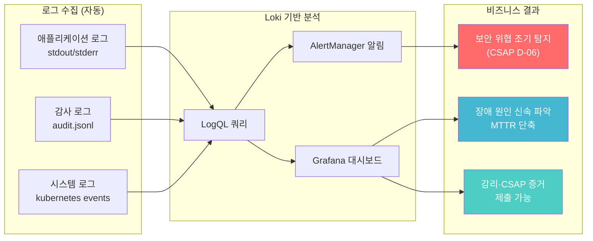
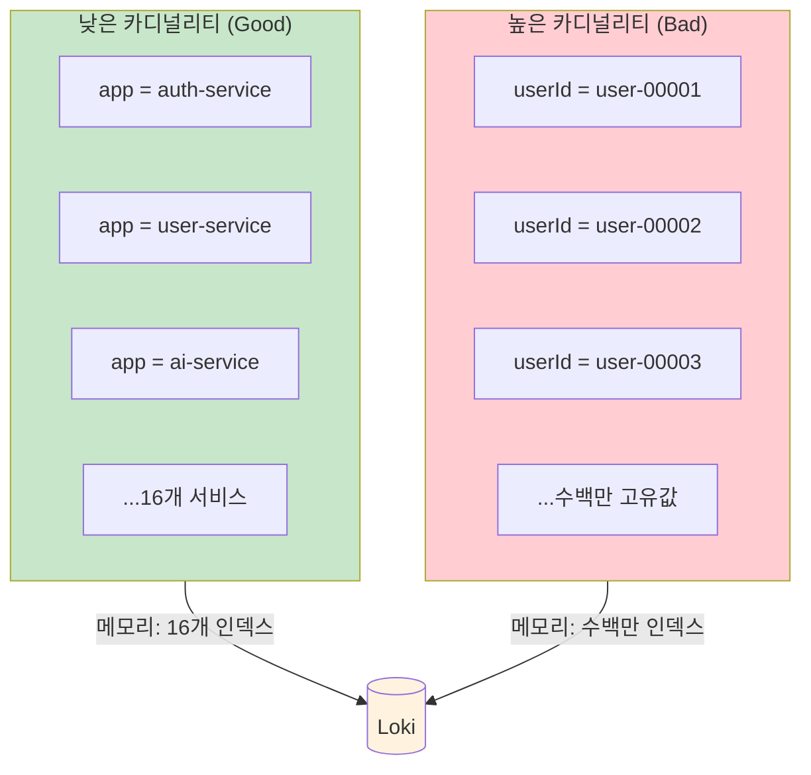
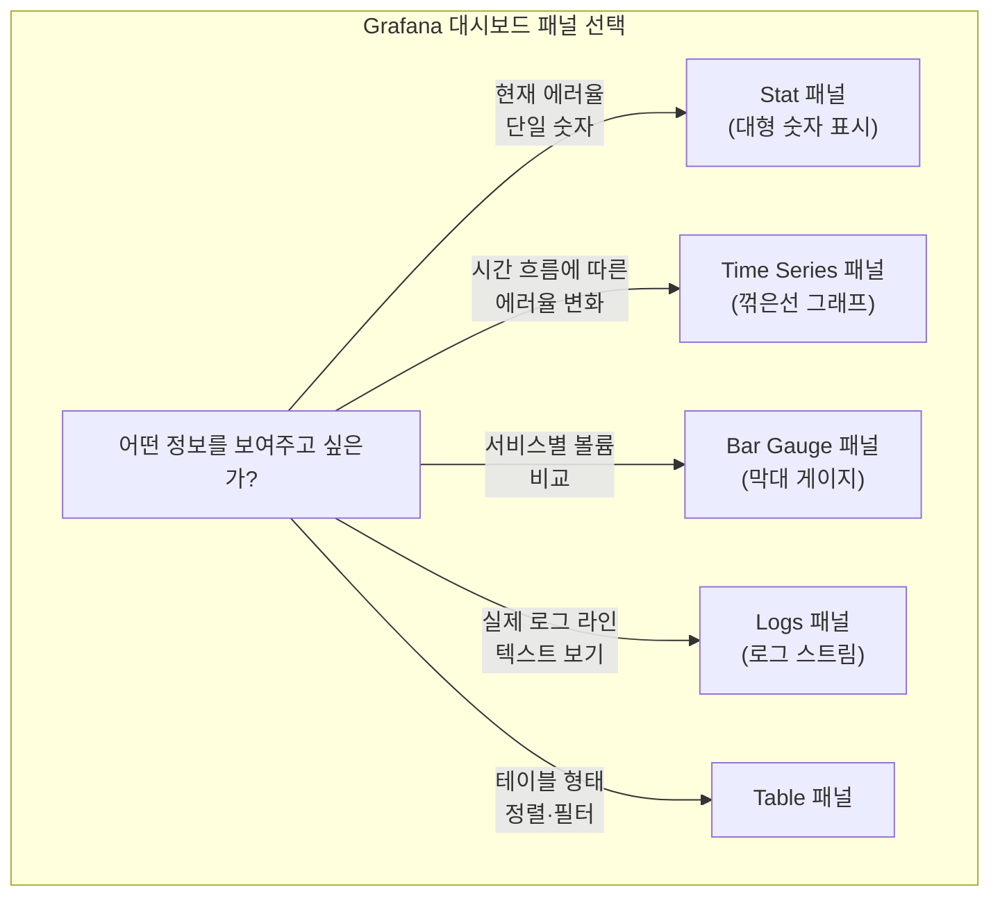
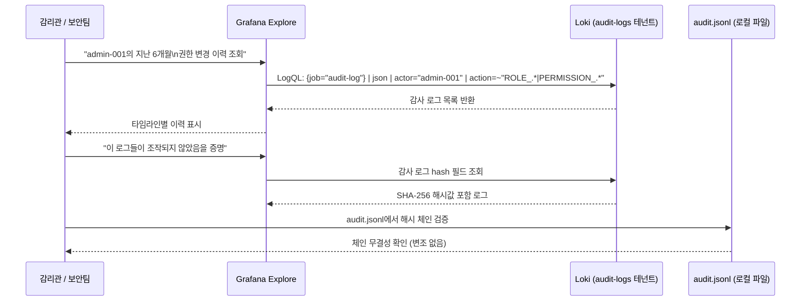
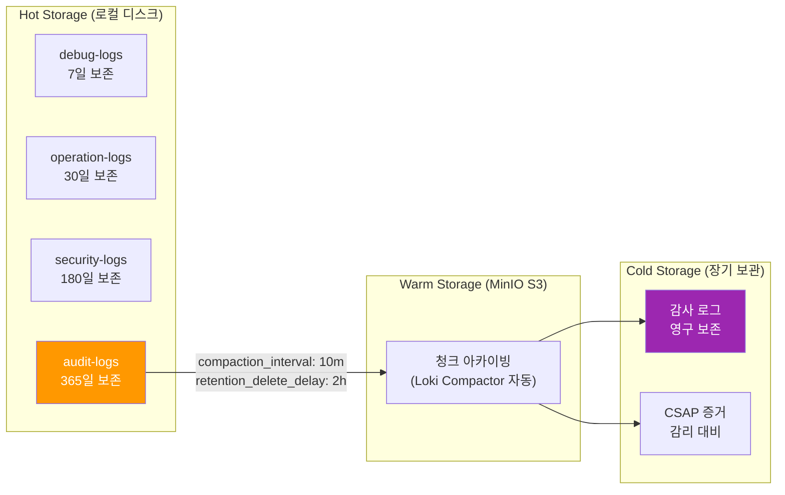

# 로그 분석 심화 — LogQL 고급 쿼리와 CSAP 감사 분석

> **문서 ID**: ONBOARD-05-MON-10
> **버전**: 1.0.0 | **작성일**: 2026-04-12 | **작성자**: Implementer (Sonnet)
> **대상**: `05-monitoring/logging/01-loki-guide.md` 학습을 완료한 개발자
> **선행 학습**: `01-loki-guide.md` (Loki 기초 완료 필수)
> **소요 시간**: 약 90분
> **CSAP**: D-06 (침해사고 관리 — 로그 보존·이상 탐지), D-08 (접근 통제), D-10 (로그 관리)

---

## 목차

1. [로그 분석의 중요성 — 공공기관 SaaS 맥락](#1-로그-분석의-중요성--공공기관-saas-맥락)
2. [감사 로그 vs 애플리케이션 로그 vs 시스템 로그](#2-감사-로그-vs-애플리케이션-로그-vs-시스템-로그)
3. [LogQL 심화 — 기초에서 고급까지](#3-logql-심화--기초에서-고급까지)
4. [레이블 최적화 — 고카디널리티 함정 피하기](#4-레이블-최적화--고카디널리티-함정-피하기)
5. [실전 LogQL 쿼리 20개](#5-실전-logql-쿼리-20개)
6. [Grafana Loki 대시보드 구성](#6-grafana-loki-대시보드-구성)
7. [CSAP 감사 로그 분석](#7-csap-감사-로그-분석)
8. [로그 보존 및 아카이브 전략](#8-로그-보존-및-아카이브-전략)
9. [실습: 어젯밤 22:00~23:00 인증 실패 이상 탐지](#9-실습-어젯밤-22002300-인증-실패-이상-탐지)
10. [학습 체크리스트](#10-학습-체크리스트)
11. [다음 단계](#11-다음-단계)

---

## 1. 로그 분석의 중요성 — 공공기관 SaaS 맥락

### 1.1 왜 공공기관 SaaS에서 로그가 특히 중요한가

공공기관 SaaS는 일반 민간 서비스와 다른 두 가지 핵심 압박을 받습니다.

첫째, **감리·감사 요건**: 행안부 정보시스템 감리기준(고시 제2023-1호)은 시스템 운영의 투명성을 요구합니다. 감리관이 "지난 6개월간 관리자 계정 권한 변경 이력을 보여주세요"라고 요청할 때, 로그가 없으면 감리 결함으로 처리됩니다.

둘째, **CSAP 인증 요건**: CSAP D-06(침해사고 관리)은 보안 이벤트 로그를 1년 이상 보존하고, 이상 징후를 탐지할 수 있는 체계를 요구합니다. 로그 분석 능력은 인증 통과의 필수 조건입니다.

### 1.2 CSAP D-06 요건 상세

CSAP D-06이 요구하는 구체적인 사항을 코드와 연결하여 이해합니다.

```
CSAP D-06-01: 침해사고 대응 절차 수립
  → 로그 기반 이상 탐지 → AlertManager 알림 → 대응 절차 실행

CSAP D-06-02: 침해사고 탐지 및 분석
  → LogQL 쿼리로 패턴 분석 → 브루트포스, PII 유출 등 탐지

CSAP D-06-03: 침해사고 기록 및 보존
  → 감사 로그 1년 이상 보존 (loki-storage-config.yaml의 audit-logs 테넌트)

CSAP D-06-04: 취약점 관리
  → OOMKilled, CrashLoopBackOff 로그 → 시스템 취약점 사전 탐지
```

실제 프로젝트의 알림 규칙(`infra/monitoring/loki-alerting-rules.yaml`)은 이 D-06 요건을 각 alert의 `csap_ref` 필드로 추적합니다.

### 1.3 로그 분석이 가져다주는 실질적 가치



---

## 2. 감사 로그 vs 애플리케이션 로그 vs 시스템 로그

### 2.1 세 가지 로그 유형의 차이

이 프로젝트에는 세 종류의 로그가 흐르고 있습니다. 각각의 목적과 분석 방법이 다릅니다.

| 구분 | 감사 로그 | 애플리케이션 로그 | 시스템 로그 |
|------|---------|----------------|-----------|
| **목적** | 법적 책임·CSAP 증거 | 장애 분석·디버깅 | 인프라 상태 파악 |
| **생산자** | 비즈니스 로직 (명시적 기록) | 서비스 코드 (자동) | Kubernetes, OS |
| **보존** | 1년 이상 (CSAP D-06) | 30일 (기본) | 7일 (debug-logs 테넌트) |
| **필수 필드** | actor, action, target, timestamp, ip | level, message, service, traceId | pod, namespace, event |
| **Loki 테넌트** | `audit-logs` | `operation-logs` | `debug-logs` |
| **예시** | "관리자 A가 사용자 B를 삭제" | "DB 연결 실패, 재시도 3회" | "Pod auth-service OOMKilled" |

### 2.2 각 로그의 LogQL 스트림 셀렉터

```logql
# 감사 로그 — audit.jsonl 경로에서 수집
{job="audit-log", namespace="saas-platform"}

# 특정 서비스 애플리케이션 로그
{app="auth-service", namespace="saas-services"}

# 시스템 로그 (Kubernetes events)
{job="kube-events", namespace="kube-system"}

# 모든 서비스 로그 (운영 전체)
{namespace=~"saas-.*"}
```

### 2.3 감사 로그 구조 (이 프로젝트 표준)

`platform/services/compliance-service/src/lib/audit.ts`의 감사 로그 구조입니다.

```typescript
// 이 구조가 로그에 기록됩니다
interface AuditEntry {
  timestamp: string;    // ISO 8601, Loki 인덱싱 기준
  actor: string;        // 행위자 사용자 ID
  action: string;       // USER_DELETE, ROLE_CHANGE, PERMISSION_GRANT 등
  target: string;       // 대상 리소스 ID
  result: 'success' | 'failure';
  ip: string;           // 클라이언트 IP (CSAP D-06)
  tenantId: string;     // 멀티테넌트 구분
  hash?: string;        // SHA-256 체인 (무결성 검증)
}
```

```logql
# 감사 로그 전체 조회 (JSON 파서 필수)
{job="audit-log"} | json | action != ""

# 특정 사용자의 모든 감사 이벤트
{job="audit-log"} | json | actor="user-admin-001"

# 실패한 작업만 조회
{job="audit-log"} | json | result="failure"
```

---

## 3. LogQL 심화 — 기초에서 고급까지

### 3.1 파이프라인 필터 비교: `|= "error"` vs `| json | level="error"`

기초 가이드에서 배운 두 방식의 차이를 정확히 이해합니다.

```logql
# 방식 1: 텍스트 포함 필터 (|= "error")
{app="auth-service"} |= "error"
```

- 로그 라인 전체를 **문자열로 검색**합니다.
- 빠르지만 정확도가 낮습니다.
- `"error"` 문자열이 어디에 있든 매칭합니다 (예: `errorId`, `error-handler` 경로명도 매칭).

```logql
# 방식 2: JSON 파서 후 필드 필터 (| json | level="error")
{app="auth-service"} | json | level="error"
```

- JSON 로그를 파싱하여 **필드별로 정확하게 필터링**합니다.
- 느리지만 정확합니다.
- `level` 필드가 정확히 `"error"` 인 로그만 반환합니다.

**언제 어느 것을 쓰는가:**

| 상황 | 추천 방식 | 이유 |
|------|---------|------|
| 빠른 확인, 대략적 검색 | `\|= "error"` | 파싱 오버헤드 없음 |
| 정확한 레벨 필터링 | `\| json \| level="error"` | 오탐 방지 |
| 특정 필드 값 조건 | `\| json \| statusCode=500` | 필드별 비교 불가 |
| 성능 중요 (대용량 쿼리) | `\|= "error"` 먼저, 후 `\| json` | 범위 축소 후 파싱 |

### 3.2 파서 종류 비교

```logql
# 1. JSON 파서 — JSON 형식 로그
{app="auth-service"} | json

# 2. logfmt 파서 — key=value 형식 로그
{app="some-service"} | logfmt
# 예: level=error msg="connection failed" host=db-01

# 3. pattern 파서 — 비정형 텍스트 (nginx 접근 로그 등)
{app="traefik"} | pattern `<ip> - - [<timestamp>] "<method> <path> <protocol>" <status> <bytes>`

# 4. regexp 파서 — 정규식으로 필드 추출
{app="legacy-service"} | regexp `(?P<level>\w+): (?P<message>.+)`
```

### 3.3 메트릭 변환 함수

LogQL은 로그를 숫자 메트릭으로 변환할 수 있습니다. 이것이 PromQL과 함께 쓰일 때의 강점입니다.

```logql
# count_over_time: 시간 창 내 로그 줄 수
count_over_time({app="auth-service"} |= "error" [5m])

# rate: 초당 로그 발생률 (count_over_time / 시간)
rate({app="auth-service"} |= "error" [5m])

# bytes_over_time: 시간 창 내 로그 바이트 수
bytes_over_time({namespace="saas-services"} [5m])

# bytes_rate: 초당 로그 바이트 발생률
bytes_rate({namespace="saas-services"} [5m])
```

### 3.4 집계 함수 (여러 스트림 합산)

```logql
# sum: 서비스별 에러 수 합산
sum(count_over_time({namespace="saas-services"} |= "error" [5m])) by (app)

# max: 서비스 중 가장 높은 에러율
max(rate({namespace="saas-services"} |= "error" [5m])) by (app)

# avg: 평균 에러율
avg(rate({namespace="saas-services"} |= "error" [5m])) by (app)

# topk: 에러가 가장 많은 서비스 상위 5개
topk(5, sum(rate({namespace="saas-services"} |= "error" [5m])) by (app))
```

### 3.5 라인 포맷 변환

```logql
# line_format: 출력 형식 커스터마이징 (Go 템플릿 문법)
{app="auth-service"} | json | line_format "{{.timestamp}} [{{.level}}] {{.message}} user={{.userId}}"

# label_format: 레이블 이름 변경 또는 새 레이블 추가
{app="auth-service"} | json | label_format service_name=app, error_level=level
```

---

## 4. 레이블 최적화 — 고카디널리티 함정 피하기

### 4.1 레이블 카디널리티란

Loki는 레이블로 로그 스트림을 구분합니다. 레이블 값의 종류가 매우 많아지는 것을 **고카디널리티(High Cardinality)**라고 하며, 이것이 Loki 성능의 가장 큰 적입니다.



### 4.2 레이블로 쓰면 안 되는 값

```yaml
# ❌ 고카디널리티 레이블 — 절대 금지
labels:
  userId: "user-123456"          # 사용자 수만큼 스트림 생성
  requestId: "req-abc-xyz-001"   # 요청마다 고유값
  ip: "203.0.113.100"            # IP 주소 무한 증가
  timestamp: "2026-04-12T..."    # 모든 줄이 고유
  traceId: "7d3f8a..."           # 트레이스 ID는 JSON 필드로

# ✅ 낮은 카디널리티 레이블 — 권장
labels:
  app: "auth-service"            # 16개 서비스 중 하나
  namespace: "saas-services"     # 몇 개의 네임스페이스
  environment: "production"      # production / staging / dev
  level: "error"                 # debug / info / warn / error / fatal
```

### 4.3 올바른 방식: 필드는 JSON 본문에, 레이블은 분류용으로만

```typescript
// ✅ 올바른 로그 작성 — userId는 JSON 필드, 레이블 아님
logger.error({
  userId: 'user-123456',     // JSON 본문 (| json 파서로 추출)
  tenantId: 'tenant-01',     // JSON 본문
  ip: '192.168.1.100',       // JSON 본문
  action: 'LOGIN_FAILED',    // JSON 본문
}, 'Authentication failed')

// Promtail이 자동으로 붙이는 레이블 (낮은 카디널리티)
// app: auth-service
// namespace: saas-services
// pod: auth-service-7d9b4f8c6-xkz2p  (← 이 정도는 허용)
```

---

## 5. 실전 LogQL 쿼리 20개

### 카테고리 1: 에러 탐지 쿼리 (쿼리 1~5)

**쿼리 1: 특정 시간대 에러 급증 탐지**

```logql
# 지난 1시간을 5분 단위로 에러율 시각화
rate({namespace="saas-services"} |= "error" [5m])
```

Grafana에서 "Last 1 hour" + "Step: 5m"으로 설정하면 에러가 언제 급증했는지 그래프로 확인할 수 있습니다.

**쿼리 2: 서비스별 에러율 비교**

```logql
# 서비스별 에러 발생률 (app 레이블 기준)
sum by (app) (
  rate({namespace="saas-services"} | json | level="error" [5m])
)
```

어떤 서비스에서 에러가 집중되는지 바 차트로 비교합니다.

**쿼리 3: HTTP 500 에러만 필터링**

```logql
# HTTP 500 에러 (상태 코드 기반)
{namespace="saas-services"} | json | status >= 500
```

> 💡 주의: `status >= 500`은 JSON 파서가 `status` 필드를 숫자로 인식해야 동작합니다. 문자열로 저장된 경우 `status=~"5\\d{2}"` 정규식을 사용합니다.

**쿼리 4: 특정 에러 메시지 패턴 탐지**

```logql
# DB 연결 관련 에러 전체
{namespace="saas-services"} | json | message =~ "(?i)(connection|timeout|ECONNREFUSED|ETIMEDOUT)"
```

**쿼리 5: 에러율이 임계치를 넘는 서비스 식별**

```logql
# 초당 에러율 0.1 초과 서비스
sum by (app) (rate({namespace="saas-services"} | json | level="error" [5m])) > 0.1
```

---

### 카테고리 2: 테넌트 분석 쿼리 (쿼리 6~8)

**쿼리 6: 테넌트별 에러율 비교**

```logql
# 테넌트별 에러 발생 횟수 (JSON의 tenantId 필드 기준)
sum by (tenantId) (
  count_over_time(
    {namespace="saas-services"} | json | level="error" [1h]
  )
)
```

**쿼리 7: 특정 테넌트의 모든 로그 (장애 분석)**

```logql
# tenant-01의 최근 1시간 모든 에러
{namespace="saas-services"} | json | tenantId="tenant-01" | level="error"
```

**쿼리 8: 테넌트별 요청 볼륨 (SLA 모니터링)**

```logql
# 테넌트별 총 로그 수 (= 요청 볼륨 근사치)
sum by (tenantId) (
  count_over_time({namespace="saas-services"} | json [1h])
)
```

---

### 카테고리 3: 성능 분석 쿼리 (쿼리 9~11)

**쿼리 9: 느린 API 로그 필터링 (1초 이상)**

```logql
# duration 필드가 1000ms(1초) 이상인 요청
{namespace="saas-services"} | json | duration > 1000
```

**쿼리 10: 느린 요청의 서비스별 분포**

```logql
# P99 응답 시간 (직접 LogQL로 계산 — duration 필드 필요)
quantile_over_time(0.99,
  {namespace="saas-services"} | json | unwrap duration [5m]
) by (app)
```

> 💡 `unwrap`은 JSON 필드를 숫자 값으로 추출하여 `quantile_over_time` 같은 집계 함수에 사용할 수 있게 합니다.

**쿼리 11: DB 쿼리 타임아웃 패턴**

```logql
# DB 쿼리 실패 패턴
{namespace="saas-services"} | json
  | message =~ "(?i)(query timeout|database error|prisma|pg error)"
  | level="error"
```

---

### 카테고리 4: 보안 이벤트 탐지 쿼리 (쿼리 12~16)

**쿼리 12: 인증 실패 패턴 탐지**

```logql
# 로그인 실패 로그
{app="auth-service"} | json | message =~ "Login.*failed|authentication.*failed|Invalid.*credential"
```

**쿼리 13: IP별 인증 실패 횟수 (브루트포스 탐지)**

```logql
# 5분간 IP별 인증 실패 횟수 — 5회 초과 시 브루트포스 의심
sum by (ip) (
  count_over_time(
    {app="auth-service"} | json | message =~ "Login.*failed" [5m]
  )
) > 5
```

이 쿼리가 실제 `loki-alerting-rules.yaml`의 `AuthenticationFailureSpike` 알림의 기반입니다.

**쿼리 14: RBAC 권한 거부 이벤트**

```logql
# 403 Forbidden 에러 (권한 없는 접근 시도)
{namespace="saas-services"} | json | status=403
```

**쿼리 15: PII 데이터 로그 유출 탐지**

```logql
# 주민등록번호 패턴이 로그에 노출된 경우
{namespace="saas-services"} |~ "\\d{6}-\\d{7}"
```

> ⚠️ 이 쿼리가 결과를 반환하면 즉시 보안팀에 보고해야 합니다. CSAP D-09 위반입니다. 실제로 `loki-alerting-rules.yaml`의 `PIILeakageDetected` 알림이 이 패턴을 자동 탐지합니다.

**쿼리 16: 관리자 권한 작업 이력**

```logql
# 관리자가 수행한 민감한 작업 전체
{job="audit-log"} | json
  | action =~ "USER_DELETE|ROLE_CHANGE|PERMISSION_GRANT|PERMISSION_REVOKE|TENANT_CREATE|TENANT_DELETE"
```

---

### 카테고리 5: 감사 로그 분석 쿼리 (쿼리 17~20)

**쿼리 17: 특정 사용자의 전체 행동 이력**

```logql
# 사용자 admin-001의 지난 24시간 모든 감사 이벤트
{job="audit-log"} | json | actor="admin-001"
```

**쿼리 18: 야간 시간대 관리자 작업 탐지 (이상 징후)**

```logql
# 00:00~06:00 사이 발생한 관리자 작업
{job="audit-log"} | json
  | timestamp =~ "T0[0-5]:\\d{2}:\\d{2}"
  | action =~ "USER_DELETE|ROLE_CHANGE|TENANT_.*"
```

**쿼리 19: 실패한 감사 이벤트 집계**

```logql
# 서비스별 실패한 작업 횟수
sum by (service) (
  count_over_time(
    {job="audit-log"} | json | result="failure" [1h]
  )
)
```

**쿼리 20: 로그 볼륨 이상 탐지 (로그 삭제/조작 의심)**

```logql
# 로그 수집 드롭률이 0.1% 초과 시 탐지
(
  sum(rate(promtail_dropped_bytes_total[5m]))
  /
  sum(rate(promtail_sent_bytes_total[5m]))
) > 0.001
```

이것은 `loki-pipeline-rules.yaml`의 `loki:pipeline:drop_ratio` recording rule을 활용합니다.

---

## 6. Grafana Loki 대시보드 구성

### 6.1 대시보드 패널 유형별 사용 가이드



### 6.2 에러율 패널 구성 (Stat + Time Series)

**현재 에러율 — Stat 패널**

```
패널 유형: Stat
쿼리:
  sum(rate({namespace="saas-services"} | json | level="error" [5m]))

설정:
  - Unit: requests/sec
  - Thresholds:
    - Green: 0 ~ 0.1 (정상)
    - Yellow: 0.1 ~ 1.0 (주의)
    - Red: 1.0 이상 (위험)
  - Reduce: Last (최신값만 표시)
```

**시간별 에러율 추이 — Time Series 패널**

```
패널 유형: Time Series
쿼리 A (에러율):
  sum by (app) (rate({namespace="saas-services"} | json | level="error" [5m]))

쿼리 B (전체 요청률):
  sum by (app) (rate({namespace="saas-services"} | json [5m]))

설정:
  - Legend: {{app}}
  - Fill opacity: 10
  - Line width: 2
```

### 6.3 로그 볼륨 패널 (Bar Gauge)

```
패널 유형: Bar Gauge
쿼리:
  sum by (app) (
    count_over_time({namespace="saas-services"} | json | level="error" [1h])
  )

설정:
  - Orientation: Horizontal
  - Display mode: Retro LCD
  - Max: 1000
  - Unit: logs (count)
  - Field override: 값에 따른 색상 (0=green, 100=yellow, 500=red)
```

### 6.4 로그 스트림 패널 (Logs Panel)

```
패널 유형: Logs
쿼리:
  {namespace="saas-services"} | json | level="error"

설정:
  - Deduplication: Exact (완전히 같은 줄 중복 제거)
  - Log level: 자동 감지 (level 필드 기준)
  - Time: Show (타임스탬프 표시)
  - Wrap lines: On
  - Prettify JSON: On
```

### 6.5 AlertManager 연동 — LogQL 알림 규칙

실제 `infra/monitoring/loki-alerting-rules.yaml`에 이미 구성된 알림 규칙을 이해합니다.

```yaml
# 이 구조를 Grafana UI에서도 생성할 수 있습니다
- alert: AuthenticationFailureSpike
  expr: |
    sum(rate({app="auth-service"} |= "401" [5m])) > 5
  for: 1m          # 1분 동안 조건이 지속될 때만 발화
  labels:
    severity: critical
    team: security
  annotations:
    summary: "인증 실패 급증 — 무차별 대입 공격 의심"
    csap_ref: "D-08-05"
```

**Grafana UI에서 알림 규칙 추가하는 방법:**

```
1. Grafana 좌측 메뉴 → Alerting → Alert Rules
2. + New alert rule 클릭
3. 데이터소스: Loki 선택
4. 위 expr 쿼리 입력
5. Threshold: IS ABOVE 5
6. Evaluate every: 1m, For: 1m
7. Labels: severity=critical, team=security
8. 저장
```

---

## 7. CSAP 감사 로그 분석

### 7.1 감사 로그 분석 워크플로우



### 7.2 특정 사용자의 전체 행동 이력 조회

```logql
# 특정 사용자(admin-001)의 지난 30일 모든 감사 이벤트
{job="audit-log"} | json | actor="admin-001"
```

Grafana Explore에서 이 쿼리를 실행하고 "Last 30 days"로 시간 범위를 설정합니다.

**결과를 CSV로 내보내기 (감리 제출용):**

```
Grafana Explore → 오른쪽 상단 → Inspector → Data → Download CSV
```

### 7.3 비정상 접근 패턴 탐지

**시나리오 1: 업무 시간 외 관리자 접근**

```logql
# 22:00 ~ 06:00 사이의 관리자 작업 (비정상 의심)
{job="audit-log"} | json
  | action =~ "USER_DELETE|ROLE_CHANGE|TENANT_.*|PERMISSION_.*"
  | timestamp =~ "T(2[2-9]|[0-1]\\d)[0-5]\\d"
```

**시나리오 2: 단시간에 대량 데이터 조회**

```logql
# 1분 내 100회 이상 데이터 조회한 사용자
sum by (actor) (
  count_over_time(
    {job="audit-log"} | json | action="DATA_READ" [1m]
  )
) > 100
```

**시나리오 3: 퇴사 처리된 계정 접근 시도**

```logql
# 계정 비활성화 이후 해당 계정으로 접근 시도
{job="audit-log"} | json | result="failure" | message =~ "Account.*disabled|User.*deactivated"
```

### 7.4 감사 로그 SHA-256 체인 검증

이 프로젝트의 감사 로그는 각 엔트리에 이전 엔트리의 해시를 포함하여 체인을 형성합니다. 이를 통해 중간 로그가 삭제되거나 변조되었는지 탐지할 수 있습니다.

```logql
# hash 필드가 비어있는 감사 로그 탐지 (체인 손상 의심)
{job="audit-log"} | json | hash=""
```

```bash
# 로컬 audit.jsonl 파일에서 해시 체인 검증 스크립트
# (감리 제출 전 실행 권장)
node -e "
const fs = require('fs');
const crypto = require('crypto');

const lines = fs.readFileSync('.claude/audit.jsonl', 'utf8')
  .split('\n')
  .filter(Boolean)
  .map(l => JSON.parse(l));

let prevHash = '';
let valid = true;
for (const [i, entry] of lines.entries()) {
  const expected = crypto
    .createHash('sha256')
    .update(prevHash + JSON.stringify({...entry, hash: undefined}))
    .digest('hex');
  if (entry.hash && entry.hash !== expected) {
    console.error('체인 손상 감지: 라인', i + 1);
    valid = false;
  }
  prevHash = entry.hash || expected;
}
console.log(valid ? '감사 로그 체인 무결성 확인 완료' : '감사 로그 변조 의심 — 보안팀 보고 필요');
"
```

---

## 8. 로그 보존 및 아카이브 전략

### 8.1 이 프로젝트의 계층화 보존 정책

`infra/log-compaction/loki-storage-config.yaml`에 정의된 실제 보존 정책입니다.



### 8.2 테넌트별 보존 기간 설정 (실제 설정값)

```yaml
# infra/log-compaction/loki-storage-config.yaml의 overrides.yaml 섹션
overrides:
  audit-logs:
    retention_period: 8760h   # 365일 — CSAP D-06 의무 요건
    max_streams_per_user: 10000

  security-logs:
    retention_period: 4320h   # 180일 — 보안 분석용 추가 확보

  operation-logs:
    retention_period: 720h    # 30일 — 일반 운영 로그

  debug-logs:
    retention_period: 168h    # 7일 — 디버그 로그 최소화
    max_streams_per_user: 1000
```

### 8.3 로그 압축 및 비용 최적화

```yaml
# Loki Compactor 설정 (loki-storage-config.yaml)
compactor:
  working_directory: /loki/compactor
  compaction_interval: 10m         # 10분마다 압축 수행
  retention_enabled: true
  retention_delete_delay: 2h       # 2시간 유예 후 실제 삭제
  retention_delete_worker_count: 150
```

**압축 효과:**
- 원시 로그 대비 평균 5~10배 압축 (gzip)
- TSDB 인덱스로 쿼리 성능 향상
- MinIO 오브젝트 스토리지 비용 절감

### 8.4 로그 쿼리 성능 최적화 팁

```logql
# ❌ 느린 쿼리: 전체 네임스페이스 regex
{namespace="saas-services"} |~ "Login.*failed"

# ✅ 빠른 쿼리: 특정 앱 먼저 제한 후 검색
{namespace="saas-services", app="auth-service"} |= "Login" |= "failed"

# ✅ 더 빠른 쿼리: 텍스트 필터 후 JSON 파싱
{app="auth-service"} |= "failed" | json | level="error"

# 규칙: 스트림 셀렉터 {}로 최대한 범위를 좁힌 후 파이프라인 적용
```

---

## 9. 실습: 어젯밤 22:00~23:00 인증 실패 이상 탐지

### 실습 목표

어젯밤 22:00~23:00 사이에 auth-service에서 인증 실패가 비정상적으로 많이 발생했다는 알림을 받았습니다. Grafana Explore를 사용하여 원인을 분석합니다.

### 준비: 시간 범위 설정

```
Grafana Explore → 우측 상단 시간 범위 → Custom range
  From: 어제 22:00:00
  To: 어제 23:00:00
  Apply time range
```

### Step 1: 전체 에러 현황 파악

```logql
# 해당 시간대 auth-service 에러 로그 전체
{app="auth-service", namespace="saas-services"} | json | level="error"
```

예상 결과: 에러 로그가 평소보다 많이 보일 것입니다. 로그 볼륨 그래프에서 급증 시점을 확인합니다.

### Step 2: 로그인 실패 로그 격리

```logql
# 인증 실패 로그만 필터링
{app="auth-service"} | json
  | level="error"
  | message =~ "Login.*failed|authentication.*failed|Invalid.*credential"
```

로그 라인을 클릭하여 `ip`, `userId`, `tenantId` 필드를 확인합니다.

### Step 3: IP별 실패 횟수 집계

```logql
# 해당 시간대 IP별 인증 실패 횟수
sum by (ip) (
  count_over_time(
    {app="auth-service"} | json | message =~ "Login.*failed" [1h]
  )
)
```

Grafana 뷰를 "Metrics"로 전환합니다. IP별 실패 횟수가 테이블로 표시됩니다.

**분석 포인트:**
- 특정 IP에서 집중적으로 실패가 발생하는가?
- 실패한 `userId`들이 여러 계정인가, 단일 계정인가?
- 실패 시도 사이의 간격이 규칙적인가?

### Step 4: 시간대별 패턴 확인

```logql
# 분 단위로 인증 실패 발생 빈도
rate(
  {app="auth-service"} | json | message =~ "Login.*failed" [1m]
)
```

그래프에서 22:00~23:00 사이 피크가 어느 시점에 가장 높은지, 규칙적인 패턴(봇 의심)인지 확인합니다.

### Step 5: 잠긴 계정 확인

```logql
# 계정 잠금 발생 여부
{app="auth-service"} | json | message =~ "Account.*locked|Too many.*attempts"
```

계정 잠금이 다수 발생했다면 브루트포스 공격의 결과일 가능성이 높습니다.

### Step 6: 대응 판단표

| 관찰된 패턴 | 판단 | 대응 |
|-----------|------|------|
| 단일 IP에서 10분 내 50회+ 실패 | 브루트포스 공격 | IP 차단, 보안팀 보고 |
| 여러 IP에서 동시다발, 여러 계정 | 크리덴셜 스터핑 | 2FA 강제, 비밀번호 재설정 안내 |
| 규칙적 간격 (예: 30초마다) | 자동화 공격 | Fail2ban 규칙 강화 |
| 단일 계정, 다양한 IP | 정상 사용자 비밀번호 분실 | 사용자 지원 안내 |
| 새벽에 집중, 업무 시간 없음 | 오프쇼어 공격 의심 | 지역 기반 접근 제어 검토 |

### Step 7: 감사 로그 연계 확인

공격 IP가 이전에 성공적으로 로그인했는지 확인합니다.

```logql
# 공격 의심 IP의 성공 로그인 이력
{app="auth-service"} | json
  | ip="203.0.113.42"   # 위에서 발견한 의심 IP로 교체
  | message =~ "Login.*success"
```

성공 이력이 있다면 해당 계정이 이미 탈취되었을 가능성이 있습니다.

---

## 10. 학습 체크리스트

이 가이드를 완료한 후 다음 사항을 스스로 확인합니다.

### 개념 이해

- [ ] CSAP D-06이 요구하는 로그 보존 기간(1년)과 그 이유를 설명할 수 있다
- [ ] 감사 로그, 애플리케이션 로그, 시스템 로그의 차이와 각각의 Loki 테넌트를 말할 수 있다
- [ ] `|= "error"` 와 `| json | level="error"` 의 차이를 설명할 수 있다
- [ ] 고카디널리티 레이블이 위험한 이유와 올바른 레이블 설계를 설명할 수 있다

### LogQL 실습

- [ ] Grafana Explore에서 특정 서비스의 에러 로그를 조회할 수 있다
- [ ] `sum by (app)(rate(...[5m]))` 구조의 집계 쿼리를 작성할 수 있다
- [ ] `unwrap` 키워드를 사용하여 JSON 필드를 숫자로 추출할 수 있다
- [ ] 5개 이상의 실전 쿼리(섹션 5)를 Explore에서 직접 실행했다

### 대시보드 구성

- [ ] Stat, Time Series, Bar Gauge, Logs 패널을 각각 생성할 수 있다
- [ ] 에러율 임계치 알림 규칙을 Grafana UI에서 생성할 수 있다

### 보안 분석

- [ ] `loki-alerting-rules.yaml`의 알림 규칙과 CSAP D-06/D-08 요건을 연결할 수 있다
- [ ] 브루트포스 공격과 크리덴셜 스터핑을 LogQL로 구분하여 탐지할 수 있다
- [ ] 감사 로그 SHA-256 체인 검증 스크립트를 실행하고 결과를 해석할 수 있다

### 실습 완료

- [ ] 섹션 9의 전체 실습 시나리오를 수행하고 판단표를 작성했다

---

## 11. 다음 단계

로그 분석 심화를 완료했습니다. 관련된 다음 학습을 추천합니다.

**모니터링 연계:**
- `05-monitoring/metrics/02-grafana-guide.md` — Prometheus 메트릭과 Loki 로그를 Grafana에서 연결하는 방법
- `05-monitoring/tracing/01-tempo-otel.md` — 로그의 traceId로 Tempo 분산 추적 연계

**보안 심화:**
- `07-security/audit/01-audit-logging.md` — 감사 로그 생성 코드 작성 방법
- `07-security/csap/02-dev-checklist.md` — 개발자 CSAP 체크리스트 전체

**트러블슈팅:**
- `09-troubleshooting/02-debugging-guide.md` — 로그와 메트릭을 결합한 체계적 디버깅
- `09-troubleshooting/05-network-debugging.md` — 네트워크 문제 진단

---

> **참조 파일**:
> - `infra/monitoring/loki-alerting-rules.yaml` — 실제 Loki 알림 규칙
> - `infra/log-compaction/loki-storage-config.yaml` — 보존 정책 설정
> - `infra/monitoring/loki-pipeline-rules.yaml` — 수집 파이프라인 recording rules
> - `infra/monitoring/loki-pipeline-alerts.yaml` — 파이프라인 알림 규칙
>
> **CSAP 연관**: D-06-01~04 (침해사고 관리), D-08-05 (인증 실패 탐지), D-09-02 (PII 유출 방지), D-10 (로그 관리)
