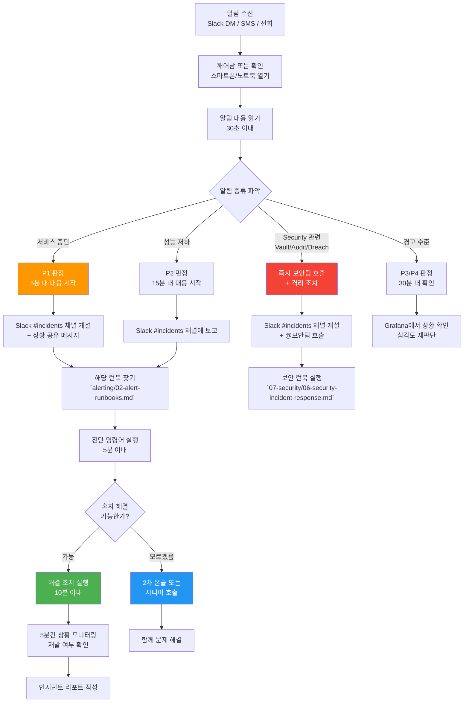
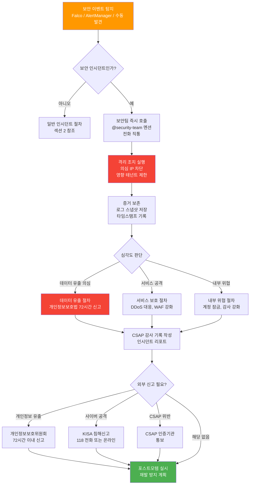

# SRE 온콜 가이드 — 초급 온콜러를 위한 완전 가이드

> **문서 ID**: ONBOARD-05-MON-11
> **버전**: 1.0.0 | **작성일**: 2026-04-12 | **대상**: 첫 온콜을 맡은 신규 엔지니어, SRE 팀원
> **선행 학습**:
>   - `09-sre-practices.md` — SRE 실천 방법론 (에러 버짓, SLO 개념)
>   - `alerting/02-alert-runbooks.md` — 알림별 런북 (10개 핵심 알림 대응)
>   - `alerting/01-alertmanager-guide.md` — AlertManager 사용법
>   - `../09-troubleshooting/04-incident-management.md` — 인시던트 관리 절차
> **소요 시간**: 최초 숙지 90분 + 온콜 중 즉시 참조용
> **CSAP**: D-06 (침해사고 관리 — 탐지·분석·처리·복구·재발방지)
> **Design Ref**: MTU-N178 §3, MTU-N57 Design §3
> **Plan SC**: FR-SLO.1~6, FR-DORA.1~4

---

## 목차

1. [온콜이란 무엇인가 — 초급자 설명](#1-온콜이란-무엇인가--초급자-설명)
   - 1.1 [온콜의 정의와 목적](#11-온콜의-정의와-목적)
   - 1.2 [우리 팀 온콜 로테이션 구조](#12-우리-팀-온콜-로테이션-구조)
   - 1.3 [온콜 시작 전 준비사항 체크리스트](#13-온콜-시작-전-준비사항-체크리스트)
   - 1.4 [알림 채널 확인 방법](#14-알림-채널-확인-방법)
   - 1.5 [온콜 핸드오프 절차](#15-온콜-핸드오프-절차)

2. [알림 받았을 때 첫 10분 가이드](#2-알림-받았을-때-첫-10분-가이드)
   - 2.1 [알림 수신부터 초기 분류까지 흐름도](#21-알림-수신부터-초기-분류까지-흐름도)
   - 2.2 [우선순위 판단 — P1~P4 즉각 구분법](#22-우선순위-판단--p1p4-즉각-구분법)
   - 2.3 [에스컬레이션 연락처 목록](#23-에스컬레이션-연락처-목록)
   - 2.4 [상황 전파 메시지 템플릿](#24-상황-전파-메시지-템플릿)

3. [TOP 10 알림별 초동 대응 가이드](#3-top-10-알림별-초동-대응-가이드)
   - 3.1 [HighErrorRate — 에러율 급등](#31-higherrorrate--에러율-급등)
   - 3.2 [CrashLoopBackOff — Pod 반복 재시작](#32-crashloopbackoff--pod-반복-재시작)
   - 3.3 [PodOOMKilled — 메모리 부족](#33-podoomkilled--메모리-부족)
   - 3.4 [HighMemoryUsage — 메모리 경고](#34-highmemoryusage--메모리-경고)
   - 3.5 [SLOErrorBudgetBurning — 에러 버짓 소진](#35-sloerrorbudgetburning--에러-버짓-소진)
   - 3.6 [DatabaseConnectionPoolExhausted — DB 연결 고갈](#36-databaseconnectionpoolexhausted--db-연결-고갈)
   - 3.7 [VaultSealedOrUnreachable — Vault 접근 불가](#37-vaultsealorunreachable--vault-접근-불가)
   - 3.8 [AuditLogFailure — 감사 로그 실패](#38-auditlogfailure--감사-로그-실패)
   - 3.9 [SecurityThreatDetected — 보안 위협 탐지](#39-securitythreatdetected--보안-위협-탐지)
   - 3.10 [CertificateExpiringSoon — 인증서 만료 임박](#310-certificateexpiringsoon--인증서-만료-임박)

4. [진단 도구 빠른 참조](#4-진단-도구-빠른-참조)
   - 4.1 [kubectl 온콜 치트시트 (20개 필수 명령어)](#41-kubectl-온콜-치트시트-20개-필수-명령어)
   - 4.2 [k9s 단축키 — 온콜 필수 목록](#42-k9s-단축키--온콜-필수-목록)
   - 4.3 [Grafana 즉시 열어야 할 대시보드](#43-grafana-즉시-열어야-할-대시보드)
   - 4.4 [Loki 즉시 실행할 LogQL 5개](#44-loki-즉시-실행할-logql-5개)

5. [CSAP 온콜 의무사항](#5-csap-온콜-의무사항)
   - 5.1 [P1 인시던트 30분 내 기록 의무](#51-p1-인시던트-30분-내-기록-의무)
   - 5.2 [보안 인시던트 즉시 보고 절차](#52-보안-인시던트-즉시-보고-절차)
   - 5.3 [보안 인시던트 보고 흐름도](#53-보안-인시던트-보고-흐름도)

6. [온콜 이후 — 사후 처리](#6-온콜-이후--사후-처리)
   - 6.1 [인시던트 리포트 초안 작성 (30분 내)](#61-인시던트-리포트-초안-작성-30분-내)
   - 6.2 [포스트모템 일정 잡기](#62-포스트모템-일정-잡기)
   - 6.3 [CSAP 증거 파일 저장](#63-csap-증거-파일-저장)
   - 6.4 [온콜 핸드오프 노트 작성](#64-온콜-핸드오프-노트-작성)

7. [처음 온콜을 맡은 주니어를 위한 가이드](#7-처음-온콜을-맡은-주니어를-위한-가이드)
   - 7.1 [마인드셋: 모르면 물어보는 것이 정답](#71-마인드셋-모르면-물어보는-것이-정답)
   - 7.2 [첫 달은 시니어와 페어 온콜](#72-첫-달은-시니어와-페어-온콜)
   - 7.3 [롤플레이 시뮬레이션 시나리오](#73-롤플레이-시뮬레이션-시나리오)

8. [학습 체크리스트](#8-학습-체크리스트)

---

## 1. 온콜이란 무엇인가 — 초급자 설명

### 1.1 온콜의 정의와 목적

온콜(On-Call)은 업무 시간 외에도 시스템 장애에 대응할 수 있도록 **특정 엔지니어가 대기 상태를 유지하는 제도**입니다. 응급실 당직 의사가 밤새 호출에 응답하는 것과 비슷합니다.

```
온콜 제도가 필요한 이유:

  공공기관 SaaS 시스템의 운영 시간:
    - 공식 업무: 09:00~18:00 (월~금)
    - 시스템 운영: 24시간 365일 (민원 포털, 긴급 행정)
    - 장애 발생 가능 시간: 언제든지

  온콜 없이는:
    오전 2시에 인증 서비스 다운 →
    담당자 모두 취침 중 →
    새벽 내내 서비스 중단 →
    CSAP D-10 가용성 위반

  온콜 있으면:
    오전 2시에 인증 서비스 다운 →
    온콜 담당자 알림 수신 (5분 내) →
    30분 내 서비스 복구 →
    CSAP 요건 충족
```

온콜의 목적은 영웅이 되는 것이 아닙니다. **올바른 절차에 따라 시스템을 안정적으로 유지하는 것**입니다.

### 1.2 우리 팀 온콜 로테이션 구조

```
온콜 로테이션 구조:

  교대 주기: 1주일 (월요일 09:00 ~ 다음 주 월요일 09:00)
  로테이션 인원: 팀원 전원 (초보 제외 첫 달)

  역할:
    1차 온콜 (Primary On-Call):
      - 알림 수신 즉시 대응
      - 응답 시간: P1=5분, P2=15분, P3=30분 이내
      - 해결 또는 에스컬레이션 책임

    2차 온콜 (Secondary On-Call / Escalation):
      - 1차 온콜이 15분 이내 응답 없을 때 자동 호출
      - 1차 온콜의 판단이 어려울 때 지원
      - 주니어의 첫 달은 항상 시니어가 2차 온콜

  관리 도구:
    - 로테이션 스케줄: Gitea Issues의 팀 캘린더
    - 알림 라우팅: AlertManager → Slack DM + 전화 SMS

  온콜 보상:
    - 평일 야간 온콜 1회: 대체 휴무 0.5일
    - 주말 온콜 1일: 대체 휴무 1일
    - 실제 P1/P2 대응: 추가 보상 (인사 규정 참조)
```

### 1.3 온콜 시작 전 준비사항 체크리스트

온콜 교대를 받기 전 반드시 완료해야 하는 항목입니다.

```
온콜 시작 전 체크리스트:

  알림 설정:
  [ ] 스마트폰 무음 해제 (온콜 주간 중 절대 무음 금지)
  [ ] Slack 알림 설정 → 모든 채널 실시간 알림 활성화
  [ ] AlertManager SMS 수신 확인 (테스트 문자 발송)
  [ ] 핵심 알림 채널 채널 가입 확인:
      #alerts-critical (P1/P2 알림)
      #alerts-warning (P3/P4 알림)
      #incidents (인시던트 진행)
      #deployments (배포 알림)

  접근 권한:
  [ ] Grafana 접속 확인 (http://grafana.internal)
  [ ] Kubernetes 클러스터 접속 확인 (kubectl get nodes)
  [ ] Loki 접속 확인 (http://loki.internal)
  [ ] Vault 접속 확인 (http://vault.internal)
  [ ] Harbor 레지스트리 접속 확인

  도구 준비:
  [ ] kubectl 최신 버전 설치 확인
  [ ] k9s 설치 확인 (선택, 강력 권장)
  [ ] Linkerd CLI 설치 확인
  [ ] 이 문서 북마크 저장

  이전 온콜자에게 인수인계:
  [ ] 현재 진행 중인 인시던트 없는지 확인
  [ ] 주의 필요한 서비스 또는 알림 있는지 확인
  [ ] 이번 주 예정된 배포 일정 확인
  [ ] 이전 주 중요 이벤트 브리핑 청취
```

### 1.4 알림 채널 확인 방법

```bash
# AlertManager 현재 활성 알림 확인
curl -s http://alertmanager.internal/api/v2/alerts | \
  jq '.[] | select(.status.state == "active") | {name: .labels.alertname, severity: .labels.severity}'

# 예시 출력:
# {
#   "name": "HighErrorRate",
#   "severity": "warning"
# }

# Grafana AlertManager UI 접속
# http://grafana.internal/alerting/list
# → "Firing" 상태인 알림 목록 확인

# Slack 채널 최근 알림 확인
# Slack → #alerts-critical → 최근 24시간 메시지 확인

# Prometheus에서 현재 발화 중인 알림 직접 확인
curl -s http://prometheus.internal/api/v1/alerts | \
  jq '.data.alerts[] | select(.state == "firing") | {name: .labels.alertname, state: .state}'
```

### 1.5 온콜 핸드오프 절차

```
온콜 교대 절차 (매주 월요일 09:00):

  [교대 나가는 사람 — 전달 사항]
  1. Slack #oncall-handoff 채널에 핸드오프 메시지 작성:

     형식:
     ---
     온콜 교대 (YYYY-MM-DD 09:00)
     나가는 온콜: @이름
     들어오는 온콜: @이름

     [이번 주 주요 이벤트]
     - (날짜): 어떤 일이 있었음

     [현재 열린 인시던트]
     - 없음 / (있으면 상세 내용)

     [주의 필요한 서비스]
     - auth-service: 최근 메모리 사용량 증가 추세 (90% 근처)

     [이번 주 예정 배포]
     - 수요일: user-service v2.1.0 배포 예정

     [기타 전달 사항]
     - Vault 갱신 예정일: 이번 주 목요일 (자동 갱신이지만 확인 필요)
     ---

  2. 이전 인시던트 리포트 완료 확인 (미완성이면 완성 후 교대)

  [교대 받는 사람]
  1. 핸드오프 메시지 확인 및 이해
  2. 현재 활성 알림 없는지 직접 확인
  3. 불명확한 사항 즉시 질문
  4. Slack에 "온콜 인수 완료" 메시지 남기기
```

---

## 2. 알림 받았을 때 첫 10분 가이드

### 2.1 알림 수신부터 초기 분류까지 흐름도



### 2.2 우선순위 판단 — P1~P4 즉각 구분법

30초 내에 판단할 수 있는 빠른 분류 기준입니다.

```
P1 — 즉각 대응 (5분 내 응답, 30분 내 복구 목표)
  판단 기준 (하나라도 해당하면 P1):
  - "서비스가 완전히 다운되었습니다" 문구
  - 에러율 > 50% 또는 HTTP 5xx 폭증
  - 로그인 불가 (인증 서비스 장애)
  - 데이터 손실 가능성
  - 보안 침해 감지
  행동: 즉시 일어나서 노트북 열기 + 팀장 자동 에스컬레이션

P2 — 긴급 대응 (15분 내 응답, 2시간 내 복구 목표)
  판단 기준:
  - 핵심 기능 심각 저하 (에러율 10~50%)
  - P99 레이턴시 5초 이상
  - 일부 테넌트 서비스 불가
  - 에러 버짓 10% 미만 소진
  행동: 빠르게 확인 후 상황 파악 시작

P3 — 일반 대응 (30분 내 응답, 4시간 내 복구 목표)
  판단 기준:
  - 비핵심 기능 장애
  - 성능 저하이나 사용 가능한 수준
  - 경고 수준 알림
  행동: 확인 후 근무 시간 내 처리 가능하면 티켓 생성

P4 — 낮은 우선순위 (업무 시간 내 대응)
  판단 기준:
  - 정보성 알림
  - 임계값 근접 경고 (아직 초과 안 함)
  - 미래 위험 예고 (인증서 30일 후 만료)
  행동: 다음 근무일 처리
```

### 2.3 에스컬레이션 연락처 목록

```
에스컬레이션 연락 순서:

  레벨 1 — 2차 온콜 (모르는 기술 문제):
    Slack: @oncall-secondary 태그
    전화: 핸드오프 메시지에 기록된 번호

  레벨 2 — 팀 리드 (P1 인시던트, 30분 미해결):
    Slack: @team-lead 태그
    이유: 의사결정 권한 필요 시

  레벨 3 — 보안팀 (보안 관련 인시던트):
    Slack: @security-team 태그
    전화: 보안 담당자 직통 번호 (내부 위키)
    이유: CSAP D-06 보안 인시던트 즉시 보고 의무

  레벨 4 — CTO/경영진 (P1 장기화, 데이터 유출 의심):
    Slack: @cto 태그
    이유: 외부 공지 필요 여부 결정

  외부 연락:
    KISA 침해신고: 인터넷침해대응센터 118
    개인정보보호위원회: 개인정보 유출 시 72시간 내 신고 의무
    CSAP 인증기관: 중요 침해사고 발생 시 통보

  주의: 외부 기관 연락은 반드시 팀 리드 승인 후 진행
```

### 2.4 상황 전파 메시지 템플릿

Slack #incidents 채널에 올리는 초기 상황 전파 메시지 형식입니다.

```
[P1/P2 초기 상황 전파 템플릿]

:rotating_light: [인시던트 선언] [서비스명] 장애 발생

상태: 조사 중
심각도: P1 / P2
탐지 시각: YYYY-MM-DD HH:MM KST
영향 서비스: (예: api-gateway, auth-service)
영향 범위: (예: 모든 사용자 로그인 불가 / 특정 테넌트 영향)
현재 에러율: (예: 35%)

[증상]
- (간단히 1~2줄로)

[현재 진행 중인 조치]
- 원인 파악 중

[다음 업데이트]
- 15분 후

담당: @나의슬랙ID
```

```
[업데이트 메시지 템플릿 — 15분마다]

:information_source: [업데이트] [서비스명] 장애 대응 중

상태: 조사 중 / 조치 중 / 복구 확인 중
경과 시간: XX분
원인: (파악된 경우 기재, 미파악 시 "조사 중")

[진행 상황]
- (최근 조치 내역)

[다음 조치]
- (앞으로 할 일)

[다음 업데이트]
- 15분 후
```

```
[해결 완료 메시지 템플릿]

:white_check_mark: [해결] [서비스명] 장애 복구 완료

상태: 정상
장애 시작: YYYY-MM-DD HH:MM KST
장애 종료: YYYY-MM-DD HH:MM KST
총 영향 시간: XX분

[근본 원인]
- (간략히)

[조치 내용]
- (무엇을 했는지)

[후속 조치]
- 포스트모템: 48시간 내 작성 예정
- 재발 방지: (간략히)

인시던트 리포트: (링크)
```

---

## 3. TOP 10 알림별 초동 대응 가이드

### 3.1 HighErrorRate — 에러율 급등

```
알림 이름: HighErrorRate
심각도: warning (에러율 5% 초과) / critical (20% 초과)
CSAP 연관: D-06 (서비스 가용성 저하는 침해사고 범주 포함)

[즉각 진단 명령어]
# 1. 어떤 서비스에서 에러 발생 중인지 확인
kubectl get pods -A --field-selector=status.phase!=Running | head -20

# 2. 에러율 높은 서비스 확인 (Prometheus)
curl -s 'http://prometheus.internal/api/v1/query' \
  --data-urlencode 'query=sum by (service) (rate(http_requests_total{status=~"5.."}[5m]))' | \
  jq '.data.result[] | {service: .metric.service, rate: .value[1]}'

# 3. 해당 서비스 최근 로그 확인
kubectl logs -n saas-platform \
  -l app=<서비스명> \
  --tail=100 \
  --since=5m | grep -E "ERROR|FATAL|panic"

# 4. 최근 배포 여부 확인
kubectl get events -n saas-platform \
  --sort-by='.lastTimestamp' | tail -20

[초동 조치]
단계 1 (0~5분): 어느 서비스인지, 에러 메시지가 무엇인지 파악
단계 2 (5~10분):
  - 최근 배포가 있었으면: Flagger 상태 확인 및 롤백 고려
  - 배포 없었으면: DB, 외부 의존성 확인
단계 3 (10분+): 혼자 해결 안 되면 에스컬레이션

[자동 복구 확인]
kubectl get canary -A | grep -v Succeeded
# 배포 롤백 중인지 확인
```

### 3.2 CrashLoopBackOff — Pod 반복 재시작

```
알림 이름: PodCrashLoopBackOff
심각도: critical (재시작 5회 이상)
CSAP 연관: D-10 (서비스 가용성)

[즉각 진단 명령어]
# 1. 어떤 Pod가 재시작 중인지 확인
kubectl get pods -A | grep -E "CrashLoop|Error|OOMKilled"

# 2. Pod 상태 상세 확인
kubectl describe pod <pod-name> -n <namespace> | tail -30
# 찾아볼 내용: Last State, Events 섹션

# 3. 이전 종료 로그 확인 (종료 이유 파악에 핵심)
kubectl logs <pod-name> -n <namespace> --previous

# 4. OOM 여부 확인
kubectl describe pod <pod-name> -n <namespace> | grep -A 3 "OOMKilled"

# 5. 재시작 횟수 확인
kubectl get pod <pod-name> -n <namespace> \
  -o jsonpath='{.status.containerStatuses[0].restartCount}'

[초동 조치]
OOM으로 인한 재시작:
  → 섹션 3.3 (PodOOMKilled) 참조

설정 오류로 인한 재시작:
  → 환경 변수, 시크릿 마운트 오류가 많음
  kubectl get secret -n <namespace>
  kubectl describe pod | grep "Error: secret"

애플리케이션 버그로 인한 패닉:
  → 최근 배포 확인 후 롤백 검토
  kubectl get canary -n <namespace>

[임시 조치 — 재시작 스톰 완화]
# Pod 삭제로 재시작 (근본 해결 아님, 임시방편)
kubectl delete pod <pod-name> -n <namespace>
# Kubernetes가 자동으로 새 Pod 생성

# 빠른 재시작 방지 (RestartPolicy 조정은 권한 필요, 에스컬레이션)
```

### 3.3 PodOOMKilled — 메모리 부족

```
알림 이름: PodOOMKilled
심각도: warning
CSAP 연관: D-10 (서비스 가용성)

[즉각 진단 명령어]
# 1. OOMKilled Pod 확인
kubectl get pods -A -o json | \
  jq '.items[] | select(.status.containerStatuses[]?.lastState.terminated.reason == "OOMKilled") |
  {name: .metadata.name, namespace: .metadata.namespace}'

# 2. 현재 메모리 사용량 확인
kubectl top pods -n saas-platform --sort-by=memory | head -10

# 3. 메모리 limits 확인
kubectl get pod <pod-name> -n <namespace> -o json | \
  jq '.spec.containers[].resources.limits.memory'

# 4. 메모리 사용 추세 확인 (Prometheus)
# Grafana에서 해당 Pod 메모리 그래프 확인
# 대시보드: Infrastructure → Pod Memory

[초동 조치]
임시 조치 (메모리 limits 임시 증가):
  kubectl patch deployment <service-name> -n <namespace> \
    --type='json' \
    -p='[{"op": "replace",
          "path": "/spec/template/spec/containers/0/resources/limits/memory",
          "value": "1Gi"}]'
  # 주의: 이것은 임시 조치, Git에도 반드시 반영 필요

근본 원인 조사:
  - 메모리 누수 (Memory Leak) 의심 시: 시니어 에스컬레이션
  - 갑자기 부하 증가: HPA(수평 확장) 동작 중인지 확인
    kubectl get hpa -n <namespace>
```

### 3.4 HighMemoryUsage — 메모리 경고

```
알림 이름: HighMemoryUsage
심각도: warning (80% 초과) / critical (90% 초과)
CSAP 연관: D-10

[즉각 진단 명령어]
# 1. 메모리 사용량 상위 Pod 확인
kubectl top pods -n saas-platform --sort-by=memory | head -10

# 2. 노드 메모리 확인
kubectl top nodes

# 3. 메모리 증가 추세 파악
# Grafana → Infrastructure → Node Memory → 최근 2시간 추세 확인

[초동 조치]
즉각적 위험이 아닌 경우 (80~89%):
  → 모니터링 강화, 다음 근무 시간에 근본 원인 조사

위험 수준 (90% 이상):
  1. HPA가 있으면 자동 확장 확인
     kubectl get hpa -n saas-platform
  2. 없으면 수동 레플리카 증가 (부하 분산)
     kubectl scale deployment <service-name> \
       -n saas-platform --replicas=5
  3. 메모리 사용 높은 Pod 재시작 (메모리 누수 임시 해결)
     kubectl rollout restart deployment/<service-name> -n saas-platform
```

### 3.5 SLOErrorBudgetBurning — 에러 버짓 소진

```
알림 이름: SLOErrorBudgetBurning
심각도: warning (50% 소진) / critical (10% 미만 잔여)
CSAP 연관: D-10 (가용성 SLA)

에러 버짓이란:
  - SLO 99.9% = 월간 43.8분 다운타임 허용
  - 에러 버짓 = 허용 다운타임의 총량
  - 10% 잔여 = 이번 달 43.8분 중 39.4분 이미 소진!

[즉각 진단 명령어]
# 현재 에러 버짓 잔여량 확인
curl -s 'http://prometheus.internal/api/v1/query' \
  --data-urlencode 'query=slo:error_budget_remaining:ratio' | \
  jq '.data.result[] | {slo: .metric.slo_name, remaining: (.value[1] | tonumber | . * 100 | round)}'

# 에러 버짓 소진 속도 확인 (burn rate)
# 번 레이트 1.0 = 정상 소진 속도
# 번 레이트 5.0 = 5배 빠르게 소진 중 (위험!)
curl -s 'http://prometheus.internal/api/v1/query' \
  --data-urlencode 'query=slo:error_budget_burn_rate:ratio' | jq .

[초동 조치]
번 레이트 > 10 (매우 빠른 소진):
  → 즉각 P1 대응 시작, 에러의 근본 원인 파악
  → 신규 배포 즉시 중단

번 레이트 3~10:
  → P2로 처리, 에러율 높은 서비스 파악
  → 이번 주 배포 계획 재검토

번 레이트 1~3:
  → 모니터링, 다음 SRE 미팅에서 논의
```

### 3.6 DatabaseConnectionPoolExhausted — DB 연결 고갈

```
알림 이름: DatabaseConnectionPoolExhausted
심각도: critical (풀 90% 이상 사용)
CSAP 연관: D-10 (서비스 가용성)

[즉각 진단 명령어]
# 1. DB 연결 수 현황 확인
kubectl exec -n saas-platform \
  $(kubectl get pod -n saas-platform -l app=postgresql -o name | head -1) \
  -- psql -U postgres -c "
    SELECT count(*), state
    FROM pg_stat_activity
    GROUP BY state
    ORDER BY count DESC;
  "

# 2. 장기 실행 쿼리 확인 (30초 이상)
kubectl exec -n saas-platform \
  $(kubectl get pod -n saas-platform -l app=postgresql -o name | head -1) \
  -- psql -U postgres -c "
    SELECT pid, now() - query_start AS duration, query
    FROM pg_stat_activity
    WHERE now() - query_start > interval '30 seconds'
    ORDER BY duration DESC;
  "

# 3. 각 서비스의 DB 연결 사용량
kubectl exec -n saas-platform \
  $(kubectl get pod -n saas-platform -l app=postgresql -o name | head -1) \
  -- psql -U postgres -c "
    SELECT application_name, count(*)
    FROM pg_stat_activity
    GROUP BY application_name
    ORDER BY count DESC;
  "

[초동 조치]
즉각 조치:
  1. 장기 실행 쿼리 강제 종료
     # 30초 이상 실행 중인 쿼리 목록 pid 확인 후
     kubectl exec ... -- psql -U postgres -c "SELECT pg_terminate_backend(<pid>);"

  2. 연결 누수 발생 서비스 재시작 (연결 강제 반환)
     kubectl rollout restart deployment/<service-name> -n saas-platform

  3. PgBouncer 연결 풀링 상태 확인
     kubectl exec -n saas-platform -l app=pgbouncer -- \
       psql -p 6432 pgbouncer -c "SHOW POOLS;"
```

### 3.7 VaultSealedOrUnreachable — Vault 접근 불가

```
알림 이름: VaultSealedOrUnreachable
심각도: critical (CSAP D-09 시크릿 관리 불가)
CSAP 연관: D-09 (암호화/시크릿 관리), D-08 (접근 통제)

[즉각 진단 명령어]
# 1. Vault 상태 확인
curl -s http://vault.internal/v1/sys/health | jq .

# 응답 예시:
# {"initialized": true, "sealed": false, "standby": false}
# sealed: true → Vault가 봉인됨 (Unseal 필요)
# initialized: false → Vault 초기화 안 됨 (심각 상황)

# 2. Vault Pod 상태 확인
kubectl get pods -n vault -l app=vault

# 3. Vault 로그 확인
kubectl logs -n vault -l app=vault --tail=50 | grep -E "ERROR|WARN|sealed"

[초동 조치]
Vault Sealed 상태 (sealed: true):
  → 즉시 시니어 또는 Vault 관리자 에스컬레이션
  → Unseal 키는 보안팀 금고에 보관 (혼자 열지 말 것)
  → Unseal 과정은 최소 2명 동시 진행 필요 (키 분산 보유)

Vault Unreachable (Pod 장애):
  → kubectl delete pod -n vault -l app=vault (재시작)
  → Vault HA 구성이면 다른 노드로 자동 페일오버
  → 재시작 후 상태 재확인

영향:
  - 서비스들이 Vault에서 시크릿을 못 가져옴
  - 새 세션 생성 불가 (DB 연결 실패)
  - 기존 캐시된 시크릿으로 수십 분은 운영 가능 (grace period)
```

### 3.8 AuditLogFailure — 감사 로그 실패

```
알림 이름: AuditLogFailure / CSAPAuditLogGap
심각도: critical (CSAP 법적 의무 위반)
CSAP 연관: D-06 (침해사고 관리 — 감사 로그는 법적 의무)

중요: 이 알림은 기술적 장애이면서 동시에 규제 위반입니다.
      일반 알림보다 무조건 최우선 처리해야 합니다.

[즉각 진단 명령어]
# 1. 감사 서비스 상태 확인
kubectl get pods -n saas-platform -l app=audit-service

# 2. 감사 로그 서비스 로그
kubectl logs -n saas-platform -l app=audit-service --tail=100 | grep -E "ERROR|FAIL"

# 3. 감사 로그 갭 확인 (마지막 로그 시각)
kubectl exec -n saas-platform \
  $(kubectl get pod -n saas-platform -l app=postgresql -o name | head -1) \
  -- psql -U postgres -c "
    SELECT MAX(created_at) as last_audit_log,
           NOW() - MAX(created_at) as gap
    FROM audit_logs;
  "

# 4. 감사 로그 볼륨 확인 (append-only 볼륨)
kubectl get pvc -n saas-platform | grep audit

[초동 조치]
감사 서비스 재시작:
  kubectl rollout restart deployment/audit-service -n saas-platform

감사 로그 DB 연결 실패:
  → DB 연결 확인 (3.6 참조)

볼륨 가득 참:
  → 즉각 용량 확보 (오래된 로그 아카이브, 볼륨 확장)
  → 주의: 로그 삭제는 CSAP 위반! 아카이브만 가능

CSAP 보고 의무:
  → 감사 로그 5분 이상 공백 발생 시 CSAP 보고서 작성 의무
  → 팀 리드에게 즉시 보고
  → incident 리포트에 공백 시간 정확히 기록
```

### 3.9 SecurityThreatDetected — 보안 위협 탐지

```
알림 이름: SecurityThreatDetected / FalcoAlert
심각도: critical
CSAP 연관: D-06 (침해사고 관리), D-08 (접근 통제)

이 알림은 일반 운영 이슈가 아닌 보안 사고입니다.
반드시 보안 전문 런북을 사용하세요:
→ `07-security/06-security-incident-response.md`

[즉각 진단 명령어]
# 1. 보안 서비스 알림 확인
kubectl logs -n saas-platform -l app=security-service \
  --tail=50 | grep -E "THREAT|BREACH|ANOMALY"

# 2. Falco 알림 확인
kubectl logs -n falco -l app=falco --tail=50 | grep -E "Warning|Error|Critical"

# 3. 로그인 실패 패턴 확인
curl -s http://api-gateway.internal/api/security/login-failures?minutes=10
# (보안 서비스 엔드포인트, 관리자 권한 필요)

[초동 조치 — 3분 이내]
1. 보안팀 즉시 호출 (@security-team Slack 멘션)
2. Slack #incidents 채널 개설
3. 의심 IP 즉시 차단 (차단 API 사용)
4. 영향 범위 초기 파악
5. 보안 인시던트 런북 실행
```

### 3.10 CertificateExpiringSoon — 인증서 만료 임박

```
알림 이름: CertificateExpiringSoon
심각도: warning (30일 이내) / critical (7일 이내)
CSAP 연관: D-09 (암호화 — TLS 인증서 관리)

[즉각 진단 명령어]
# 1. 만료 임박 인증서 확인
kubectl get certificates -A | grep -v "True"

# 2. 인증서 만료일 확인
kubectl get certificate -A -o json | \
  jq '.items[] | {name: .metadata.name, namespace: .metadata.namespace,
                   expiry: .status.notAfter, ready: .status.conditions[].status}'

# 3. cert-manager 로그 확인
kubectl logs -n cert-manager \
  -l app=cert-manager --tail=50 | grep -E "ERROR|renew|expire"

[초동 조치]
자동 갱신 실패 시:
  # cert-manager 인증서 수동 갱신 트리거
  kubectl annotate certificate <cert-name> \
    -n <namespace> \
    cert-manager.io/issue-once="true"

  # 갱신 상태 확인
  kubectl describe certificate <cert-name> -n <namespace>

Let's Encrypt Rate Limit 에러:
  → 짧은 시간에 너무 많이 갱신 요청
  → 24~48시간 대기 후 재시도

7일 이내 만료인 경우:
  → 즉각 P1 처리 (만료되면 HTTPS 연결 불가)
  → 수동 갱신 또는 임시 자체 서명 인증서 대체

30일 이내 만료:
  → P3로 처리, 근무 시간 내 원인 파악 및 해결
```

---

## 4. 진단 도구 빠른 참조

### 4.1 kubectl 온콜 치트시트 (20개 필수 명령어)

```bash
# ============ Pod 상태 확인 ============

# 1. 전체 비정상 Pod 확인 (가장 먼저 실행)
kubectl get pods -A --field-selector=status.phase!=Running | grep -v Completed

# 2. 특정 네임스페이스 Pod 상태
kubectl get pods -n saas-platform -o wide

# 3. Pod 상세 상태 (이벤트 포함)
kubectl describe pod <pod-name> -n <namespace>

# 4. Pod 로그 확인 (최근 100줄)
kubectl logs <pod-name> -n <namespace> --tail=100

# 5. 이전 재시작 로그 확인 (OOM, 패닉 원인 파악)
kubectl logs <pod-name> -n <namespace> --previous

# 6. 실시간 로그 스트리밍
kubectl logs -f <pod-name> -n <namespace>

# ============ 리소스 사용량 ============

# 7. Pod 리소스 사용량 (CPU/메모리)
kubectl top pods -n saas-platform --sort-by=memory

# 8. 노드 리소스 사용량
kubectl top nodes

# ============ 배포 상태 ============

# 9. Deployment 상태 확인
kubectl get deployment -n saas-platform -o wide

# 10. 롤아웃 상태 확인
kubectl rollout status deployment/<name> -n saas-platform

# 11. 배포 이력 확인
kubectl rollout history deployment/<name> -n saas-platform

# 12. Canary 배포 상태
kubectl get canaries -A

# ============ 이벤트 및 트러블슈팅 ============

# 13. 최근 이벤트 확인 (에러 위주)
kubectl get events -n saas-platform \
  --sort-by='.lastTimestamp' | tail -20

# 14. 서비스 엔드포인트 확인
kubectl get endpoints -n saas-platform

# 15. ConfigMap 확인
kubectl get configmap -n saas-platform

# ============ 긴급 조치 ============

# 16. Pod 강제 재시작 (Deployment)
kubectl rollout restart deployment/<name> -n saas-platform

# 17. Pod 즉시 삭제 (재생성 유도)
kubectl delete pod <pod-name> -n saas-platform

# 18. Deployment 레플리카 수 조정 (빠른 스케일링)
kubectl scale deployment/<name> -n saas-platform --replicas=5

# 19. Pod 쉘 접속 (내부 디버깅)
kubectl exec -it <pod-name> -n <namespace> -- /bin/sh

# 20. 특정 레이블 Pod 모두 삭제 (주의: 신중하게 사용)
kubectl delete pod -n saas-platform -l app=<service-name>
```

### 4.2 k9s 단축키 — 온콜 필수 목록

```
k9s 실행:
  k9s -n saas-platform

온콜에서 가장 자주 쓰는 단축키:

  탐색:
  :pod         → Pod 목록 보기
  :deployment  → Deployment 목록
  :canary      → Flagger Canary 목록
  :event       → 이벤트 목록 (에러 확인)
  :service     → 서비스 목록
  :node        → 노드 목록

  Pod 작업 (Pod 선택 후):
  l            → 로그 보기 (Log)
  d            → 상세 정보 (Describe)
  s            → 쉘 접속 (Shell)
  k            → 삭제 (Kill/Delete)
  ctrl+k       → 강제 삭제

  필터:
  /            → 검색 필터 입력
  예: /error   → "error" 포함 Pod만 표시

  정렬:
  ctrl+s       → CPU 정렬
  ctrl+m       → 메모리 정렬

  네임스페이스:
  :ns          → 네임스페이스 목록
  0            → 모든 네임스페이스 보기

  종료:
  q 또는 Ctrl+C
```

### 4.3 Grafana 즉시 열어야 할 대시보드

```
온콜 중 탭에 항상 열어둬야 할 대시보드:

  URL: http://grafana.internal

  [탭 1] 서비스 전체 현황 (가장 먼저 확인)
  /d/overview/service-overview
  - 모든 서비스의 에러율, 레이턴시 한눈에
  - 빨간색 패널 = 즉각 확인 필요

  [탭 2] SLO 에러 버짓
  /d/slo/error-budget
  - 현재 에러 버짓 잔여량
  - Burn Rate 그래프 (급격히 오르면 위험)

  [탭 3] Flagger 배포 상태
  /d/flagger-canary/flagger-canary-analysis
  - 현재 배포 중인 서비스 상태
  - 배포 관련 알림이면 여기부터 확인

  [탭 4] 인프라 리소스
  /d/infra/k8s-cluster
  - 노드 CPU/메모리 사용량
  - Pod OOM, 재시작 이벤트

  [탭 5] 보안 모니터링
  /d/security/threat-detection
  - 로그인 실패 패턴
  - Falco 보안 이벤트
  - 이상 접근 패턴

  [탭 6] 알림 현황
  /alerting/list
  - AlertManager에서 현재 발화 중인 모든 알림
  - Silenced 알림도 확인 (의도치 않게 묻힌 알림 확인)
```

### 4.4 Loki 즉시 실행할 LogQL 5개

```logql
# 1. 전체 서비스 에러 로그 (최근 10분)
{namespace="saas-platform"} |= "ERROR" | line_format "{{.app}}: {{.message}}"

# 2. 특정 서비스 에러 로그
{namespace="saas-platform", app="auth-service"} |= "ERROR"

# 3. 인증 실패 로그 (보안 이벤트 탐지)
{namespace="saas-platform"} |= "LOGIN_FAILED" OR "AUTHENTICATION_FAILED"

# 4. 감사 로그 공백 확인 (마지막 감사 이벤트 시각)
{namespace="saas-platform", app="audit-service"}
| json
| line_format "{{.timestamp}} {{.action}}"
| last_over_time

# 5. OOM 이벤트 로그 (컨테이너 재시작 원인)
{namespace="saas-platform"} |= "OOMKilled" OR "out of memory"

# Loki 접속 방법:
# http://grafana.internal → Explore → Loki 데이터소스 선택
```

---

## 5. CSAP 온콜 의무사항

### 5.1 P1 인시던트 30분 내 기록 의무

```
CSAP D-06 (침해사고 관리) 온콜 의무:

  P1 인시던트 발생 시:
    탐지 후 30분 이내:
      → Gitea Issues에 인시던트 티켓 생성 (필수)
      → 티켓에 포함해야 할 내용:
          - 탐지 시각 (알림 수신 시각)
          - 영향 서비스 목록
          - 영향 받은 사용자 수 (추정치)
          - 현재 증상 설명
          - 초동 조치 내용

    탐지 후 1시간 이내:
      → 팀 리드에게 구두 보고 (전화 또는 Slack DM)
      → 인시던트 채널 상황 업데이트

    해결 후 24시간 이내:
      → 인시던트 리포트 초안 완성
      → CSAP 증거 파일 저장

  보안 관련 P1:
    → 탐지 즉시 보안팀 통보 (30분 아님, 즉시)
    → CSAP D-06: 72시간 내 상위 기관 보고 가능
```

```yaml
# 인시던트 티켓 템플릿 (Gitea Issues)
# 제목: [P1] [서비스명] 장애 - YYYY-MM-DD HH:MM

라벨: incident, P1 (또는 P2/P3)

본문:
## 개요
- 탐지 시각: YYYY-MM-DD HH:MM KST
- 서비스: auth-service, api-gateway
- 영향 범위: 모든 사용자 로그인 불가
- 영향 사용자 수: 추정 전체 (약 500명)

## 증상
- HTTP 401 오류 100% 반환
- auth-service Pod CrashLoopBackOff 상태

## 초동 조치
- 14:03 - 알림 수신
- 14:05 - 상황 파악 시작
- 14:10 - auth-service 로그에서 OOM 확인
- 14:15 - 메모리 limits 증가 후 재배포

## 현재 상태
- 조사 중 / 조치 중 / 복구 완료

## CSAP 기록
- 감사 로그 공백: 없음 / HH:MM ~ HH:MM (XX분)
- 보안 영향: 없음 / (있으면 상세)
```

### 5.2 보안 인시던트 즉시 보고 절차

```
보안 인시던트 보고 절차 (CSAP D-06):

  Step 1: 보안팀 즉시 호출 (탐지 즉시)
    - Slack @security-team 멘션
    - 보안팀 담당자 직통 전화
    - "보안 인시던트 발생" 명확히 언급

  Step 2: 격리 조치 (5분 이내)
    - 의심 IP 즉시 차단
    - 영향 받은 테넌트 접근 제한 (보안팀 지시 하에)
    - 추가 피해 방지 조치

  Step 3: 증거 보존 (격리와 동시에)
    - 로그 스냅샷 즉시 저장
    - Pod 상태 저장 (kubectl get all -n <ns> > snapshot.txt)
    - 타임스탬프 모든 조치에 기록

  Step 4: 인시던트 채널 개설 및 보고
    - Slack #incidents-security 채널 생성
    - 팀 리드, 보안팀, (필요 시) CTO 초대

  Step 5: 72시간 내 외부 보고 (필요 시)
    - 개인정보 유출: 개인정보보호위원회 신고 의무
    - KISA 사이버침해신고센터 (118)
    - CSAP 인증기관 통보
    → 이 단계는 팀 리드와 법무팀 승인 후 진행
```

### 5.3 보안 인시던트 보고 흐름도



---

## 6. 온콜 이후 — 사후 처리

### 6.1 인시던트 리포트 초안 작성 (30분 내)

인시던트 해결 후 30분 내에 초안을 작성합니다. 완벽하지 않아도 됩니다. 나중에 팀이 함께 보완합니다.

```markdown
# 인시던트 리포트 — INC-YYYY-MMDD-NNN

## 요약
- 탐지: YYYY-MM-DD HH:MM KST
- 해결: YYYY-MM-DD HH:MM KST
- 총 영향 시간: XX분
- 심각도: P1 / P2 / P3
- 영향 서비스: (목록)
- 영향 사용자 수: (추정)

## 타임라인
| 시각 | 담당자 | 행동 |
|------|--------|------|
| HH:MM | @이름 | 알림 수신 |
| HH:MM | @이름 | 상황 파악 시작 |
| HH:MM | @이름 | 근본 원인 확인 |
| HH:MM | @이름 | 조치 실행 |
| HH:MM | @이름 | 서비스 복구 확인 |

## 근본 원인 (초안)
(현재 파악된 내용 작성, 불확실하면 "조사 중" 표시)

## 조치 내역
1. (조치 1)
2. (조치 2)

## 영향
- 기술적 영향: (에러율, 다운타임 등)
- 비즈니스 영향: (사용자 서비스 중단, 데이터 영향 등)

## CSAP 기록
- 감사 로그 공백: 없음 / HH:MM ~ HH:MM
- 보안 영향 여부: 없음 / (있으면 상세)
- 개인정보 영향: 없음 / (있으면 신고 절차 기록)

## 후속 조치 (To-Do)
- [ ] 포스트모템 실시 (48시간 이내)
- [ ] 재발 방지 조치 구현 (담당: @이름, 기한: 날짜)
- [ ] CSAP 증거 파일 저장 완료
```

### 6.2 포스트모템 일정 잡기

```
포스트모템 규칙:

  P1/P2 인시던트: 48시간 이내 포스트모템 미팅 필수
  P3 인시던트: 1주일 이내 (다음 스프린트 리뷰에서 논의 가능)

  일정 잡는 방법:
    1. Slack #incidents 채널에 공지
       "INC-2026-0412-001 포스트모템 미팅:
        수요일 14:00 KST 예정, 참석 여부 확인해주세요"
    2. 인시던트 Gitea Issues에 포스트모템 미팅 정보 업데이트
    3. 미팅 결과를 Issues에 코멘트로 기록

  포스트모템의 목적:
    → 비난이 아닌 학습 (Blameless)
    → 시스템과 프로세스의 문제 찾기
    → 재발 방지 Action Item 정의
```

### 6.3 CSAP 증거 파일 저장

```bash
# 인시던트 증거 파일 수집 스크립트
INCIDENT_ID="INC-2026-0412-001"
EVIDENCE_DIR="/data/ai-saas/.bkit/audit/incidents/${INCIDENT_ID}"
mkdir -p "$EVIDENCE_DIR"

# 인시던트 당시 Pod 상태 저장
kubectl get pods -A > "${EVIDENCE_DIR}/pods-state.txt"
kubectl get events -n saas-platform \
  --sort-by='.lastTimestamp' > "${EVIDENCE_DIR}/events.txt"

# 관련 서비스 로그 저장
kubectl logs -n saas-platform \
  -l app=auth-service \
  --since=2h > "${EVIDENCE_DIR}/auth-service-logs.txt"

# Flagger 상태 저장
kubectl describe canary -A > "${EVIDENCE_DIR}/canary-state.txt"

# 감사 로그 해당 시간대 추출 (PostgreSQL)
kubectl exec -n saas-platform \
  $(kubectl get pod -n saas-platform -l app=postgresql -o name | head -1) \
  -- psql -U postgres -c "
    COPY (
      SELECT * FROM audit_logs
      WHERE created_at BETWEEN '2026-04-12 14:00:00' AND '2026-04-12 15:00:00'
      ORDER BY created_at
    ) TO STDOUT WITH CSV HEADER
  " > "${EVIDENCE_DIR}/audit-logs-extract.csv"

echo "증거 파일 저장 완료: $EVIDENCE_DIR"
ls -la "$EVIDENCE_DIR"

# 저장 경로: /data/ai-saas/.bkit/audit/incidents/INC-YYYY-MMDD-NNN/
# CSAP D-06: 모든 인시던트 증거는 최소 1년 보존
```

### 6.4 온콜 핸드오프 노트 작성

교대 전에 작성하는 인계 노트입니다.

```
온콜 핸드오프 노트 템플릿 (Slack #oncall-handoff):

---
온콜 교대 (YYYY-MM-DD 09:00)
나가는 온콜: @이름
들어오는 온콜: @이름

[이번 주 인시던트 요약]
- INC-2026-0412-001: auth-service OOM (해결 완료)
  - 포스트모템 예정: 4월 14일 14:00
  - 재발 방지 티켓: #1234

[현재 열린 이슈]
- 없음 / (있으면 상세 내용 및 링크)

[모니터링 주의 사항]
- auth-service: 메모리 사용량 증가 추세 (80% 근처)
  → 임시로 limits 1Gi로 증가했으나 근본 해결 필요
  → 담당: @개발자이름, 이번 주 금요일까지 해결 예정

[이번 주 예정 배포]
- 목요일 11:00: user-service v2.1.0 배포 예정
  → 영향: 사용자 프로필 기능 변경
  → 담당: @개발자이름

[기타 전달 사항]
- Vault 자동 갱신 예정: 목요일 03:00 (자동 처리, 모니터링만)
- AlertManager silence: API Gateway high latency (5분 후 만료)
---
```

---

## 7. 처음 온콜을 맡은 주니어를 위한 가이드

### 7.1 마인드셋: 모르면 물어보는 것이 정답

```
온콜 첫 달의 진실:

  ❌ 잘못된 생각:
    "온콜 담당자는 모든 것을 알아야 한다"
    "모르면 부끄럽다, 혼자 해결해야 한다"
    "새벽 3시에 시니어를 깨우면 안 된다"

  ✅ 올바른 생각:
    "온콜 담당자의 역할은 올바른 판단을 내리는 것이다"
    "올바른 판단에는 정보 수집(질문 포함)이 필수다"
    "P1 인시던트에서 망설임은 서비스 다운타임을 늘린다"
    "15분 이상 혼자 고민했다면 그것이 에스컬레이션 시점이다"

  실제로:
    시니어들은 새벽에 호출받는 것을 싫어하지 않습니다.
    그들이 싫어하는 것은 주니어가 혼자 30분 씨름하다가
    서비스가 1시간 다운된 후 보고받는 것입니다.
    15분 안에 해결 안 되면 에스컬레이션하는 것이 팀 전체에 이익입니다.
```

### 7.2 첫 달은 시니어와 페어 온콜

```
주니어 온콜 첫 달 규칙:

  구조:
    - 주니어: 1차 온콜 (Primary) 역할
    - 시니어: 항상 2차 온콜 (Escalation) 대기
    - 시니어는 15분 이내 응답 보장

  목표:
    - 알림을 직접 받고 분류하는 경험
    - 진단 도구(kubectl, Grafana) 사용 익숙해지기
    - 에스컬레이션 타이밍 판단 연습

  주니어가 혼자 처리 가능한 범위:
    - P3/P4 알림 대부분
    - Pod 재시작
    - 메모리 경고 모니터링

  반드시 시니어 호출해야 하는 상황:
    - P1 인시던트 판정 즉시
    - 보안 관련 알림 즉시
    - 15분 이상 혼자 고민하면
    - 데이터 삭제나 서비스 완전 중단이 필요한 조치

  주니어가 ON-Call 후 해야 할 것:
    - 인시던트 리포트 초안 작성 (시니어가 검토)
    - 이번 주 배운 것 팀 내 공유
    - 런북에 새로운 패턴 추가 (PR로 제안)
```

### 7.3 롤플레이 시뮬레이션 시나리오

실제 온콜 전에 시뮬레이션으로 연습합니다.

```
[시뮬레이션 1] 새벽 2시, auth-service CrashLoopBackOff

상황:
  - 시각: 02:17 KST
  - 알림: PodCrashLoopBackOff, severity=critical
  - 서비스: auth-service, 3회 재시작

당신의 역할:
  1. 알림 수신 → 스마트폰으로 확인
  2. 노트북 열기 (5분 이내)
  3. Slack #incidents 채널에 초기 메시지 작성
  4. 진단 명령어 실행:
     kubectl describe pod ... | tail -30
     kubectl logs ... --previous
  5. OOM인지, 앱 버그인지 판단
  6. OOM이면: 메모리 limits 임시 증가
  7. 앱 버그이면: 최근 배포 확인 → 롤백 고려
  8. 15분 내 해결 안 되면 시니어 호출

시니어 역할 (함께 연습):
  - 진단 질문 힌트 제공
  - 잘못된 조치 전에 멈추기
  - 올바른 판단 확인

예상 소요 시간: 30분 (실제 발생 시 15~30분 목표)
```

```
[시뮬레이션 2] 업무 시간, SLOErrorBudgetBurning critical

상황:
  - 시각: 14:30 KST (근무 중)
  - 알림: SLOErrorBudgetBurning, 잔여 5%
  - Burn Rate: 12 (정상의 12배 속도로 소진 중)

당신의 역할:
  1. 알림 수신 → 즉시 Grafana 확인
  2. 어느 서비스에서 에러 발생 중인지 파악
  3. 에러율 높은 서비스 로그 확인
  4. 최근 30분 내 배포 있었는지 확인
     kubectl get canaries -A
  5. 있으면: Flagger canary 상태 확인 → 필요 시 롤백
  6. 없으면: DB, 외부 의존성 확인
  7. P1 판정 후 팀 전체 공지 (업무 시간이므로 Slack 전체 공지)

예상 포인트:
  - Burn Rate 12는 P1 수준 긴급 상황
  - 에러 버짓 5% = 이번 달 허용 다운타임 거의 소진
  - 신규 배포 즉시 중단 결정 필요
  - 팀 전체와 공유하여 함께 대응

예상 소요 시간: 45분 (원인 파악 + 조치 + 안정화 확인)
```

---

## 8. 학습 체크리스트

이 문서를 완전히 익혔다면 다음 항목을 수행할 수 있어야 합니다.

```
온콜 기초:
[ ] 온콜 시작 전 준비사항 10개를 설명할 수 있다
[ ] P1~P4 심각도 분류 기준을 30초 이내에 판단할 수 있다
[ ] 초기 상황 전파 Slack 메시지를 5분 이내에 작성할 수 있다
[ ] 온콜 핸드오프 노트를 작성할 수 있다

기술적 대응:
[ ] kubectl 20개 치트시트 명령어 중 15개 이상 사용할 수 있다
[ ] k9s로 Pod 상태를 확인하고 로그를 볼 수 있다
[ ] Grafana에서 서비스 에러율을 확인할 수 있다
[ ] Loki에서 특정 서비스 에러 로그를 검색할 수 있다

알림 대응:
[ ] HighErrorRate 알림 시 즉각 진단 명령어 3개를 말할 수 있다
[ ] CrashLoopBackOff 원인을 kubectl logs --previous로 확인할 수 있다
[ ] AuditLogFailure 알림이 왜 일반 알림보다 중요한지 설명할 수 있다
[ ] SecurityThreatDetected 알림 수신 시 첫 3가지 조치를 말할 수 있다

CSAP 의무:
[ ] P1 인시던트 시 30분 내 작성해야 하는 것이 무엇인지 안다
[ ] 감사 로그 공백이 발생하면 어떤 CSAP 항목을 위반하는지 안다
[ ] 보안 인시던트 시 외부 신고 의무가 언제 발생하는지 안다
[ ] 인시던트 증거 파일을 어디에 어떻게 저장하는지 안다
```

---

## 변경 이력

| 버전 | 날짜 | 내용 | 작성자 |
|------|------|------|--------|
| 1.0.0 | 2026-04-12 | 최초 작성 — SRE 온콜 완전 가이드 (초급 온콜러용) | Implementer (Sonnet) |
