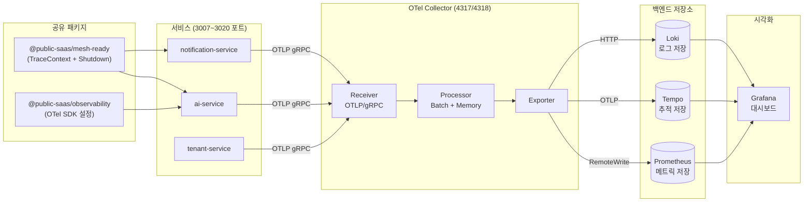
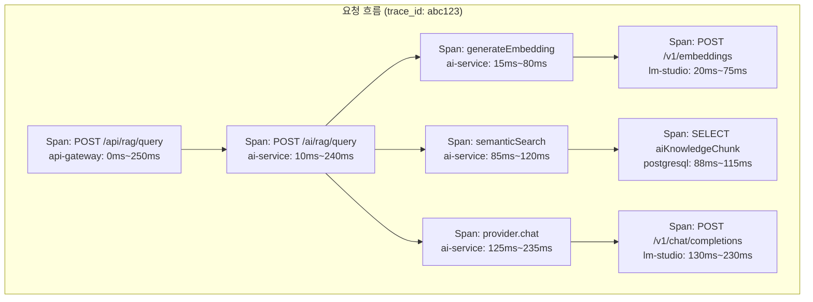

# 서비스 계측 완전 가이드 — OTel SDK 직접 구현

> **문서 ID**: ONBOARD-MON-012
> **버전**: 1.0.0 | **작성일**: 2026-04-12 | **대상**: 백엔드 개발자, SRE 엔지니어
> **선행 학습**: `05-monitoring/08-observability-deep-dive.md`, `05-monitoring/tracing/01-tempo-otel.md`
> **관련 CSAP**: D-06 침해사고 관리, D-07 가용성 관리

---

## 목차

1. [계측(Instrumentation)이란 무엇인가](#1-계측instrumentation이란-무엇인가)
2. [mesh-ready 패키지 분석](#2-mesh-ready-패키지-분석)
3. [메트릭 계측 실습](#3-메트릭-계측-실습)
4. [분산 추적 계측 실습](#4-분산-추적-계측-실습)
5. [로그 계측 실습](#5-로그-계측-실습)
6. [DORA 메트릭 계측](#6-dora-메트릭-계측)
7. [계측 품질 체크리스트](#7-계측-품질-체크리스트)

---

## 1. 계측(Instrumentation)이란 무엇인가

### 1.1 계측의 정의와 필요성

계측(Instrumentation)은 서비스가 스스로 자신의 동작을 측정하고 기록하는 코드를 심는 행위입니다. 의사가 환자의 체온, 혈압, 맥박을 측정하는 것처럼, 계측은 서비스의 건강 상태를 실시간으로 파악합니다.

**자동 계측의 한계:**

OpenTelemetry는 자동 계측(Auto Instrumentation) 기능을 제공하여 HTTP 요청/응답, DB 쿼리 등을 자동으로 추적합니다. 그러나 다음 상황에서는 직접 계측이 필수입니다.

| 자동 계측으로 불가능한 것 | 직접 계측으로 해결 |
|--------------------------|-------------------|
| 비즈니스 로직 성공/실패율 | 커스텀 Counter 추가 |
| 테넌트별 요청 분리 | label에 `tenant_id` 추가 |
| AI 토큰 사용량 추적 | 별도 Histogram 정의 |
| CSAP 감사 이벤트 | 구조화된 로그로 기록 |
| 도메인 특화 Span 속성 | Span Attribute 직접 설정 |

### 1.2 OTel의 3대 신호

OpenTelemetry(OTel)는 세 가지 신호를 통해 서비스를 관찰합니다.

```
메트릭 (Metrics)
  무엇이 일어나고 있는가?
  예: HTTP 요청 수, 응답시간, 에러율
  저장: Prometheus → Grafana

추적 (Traces)
  어떻게 요청이 처리되었는가?
  예: auth-service → ai-service → PostgreSQL 흐름
  저장: Tempo → Jaeger UI

로그 (Logs)
  무엇이 잘못되었는가?
  예: "사용자 홍길동 로그인 실패: 비밀번호 불일치"
  저장: Loki → Grafana
```

### 1.3 우리 프로젝트의 계측 레이어 구조

우리 플랫폼은 3개 레이어로 계측을 구성합니다.

**레이어 1 — 공유 패키지** (`@public-saas/mesh-ready`, `@public-saas/observability`):
- 모든 서비스에 공통 적용되는 기본 계측
- W3C TraceContext 전파, 그레이스풀 셧다운, 헬스체크

**레이어 2 — 서비스별 계측** (각 서비스의 `src/lib/metrics.ts`):
- 해당 서비스의 도메인 메트릭
- 예: auth-service → 로그인 성공/실패율

**레이어 3 — 비즈니스 계측** (핸들러 내 직접 삽입):
- 특정 비즈니스 로직의 측정값
- 예: RAG 쿼리의 컨텍스트 품질 점수

### 1.4 계측 데이터 흐름도



---

## 2. mesh-ready 패키지 분석

### 2.1 패키지 구조 및 역할

소스 디렉토리: `/data/ai-saas/platform/packages/mesh-ready/src/`

```
mesh-ready/src/
  index.ts                    ← 공개 API 내보내기
  mesh-ready-plugin.ts        ← Fastify 플러그인 (통합 진입점)
  service-metadata.ts         ← 서비스 디스커버리 메타데이터
  trace-context-propagator.ts ← W3C TraceContext + B3 헤더 전파
  graceful-shutdown.ts        ← SIGTERM 그레이스풀 셧다운
```

### 2.2 공유 OTel 설정이 어떻게 동작하는가

`meshReadyPlugin`은 Fastify 플러그인 시스템을 통해 서비스에 3가지 기능을 한 번에 주입합니다.

```typescript
// Design Ref: SVC-MESH-R13 Plan
// Plan SC: FR-MESH.1

async function meshReadyPluginImpl(
  app: FastifyInstance,
  opts: MeshReadyPluginOptions
): Promise<void> {
  // 1. 서비스 메타데이터 관리자 생성
  const metadata = new ServiceMetadata(opts.service);

  // 2. 추적 컨텍스트 전파자 생성 (W3C + B3 지원)
  const tracer = new TraceContextPropagator();

  // 3. 그레이스풀 셧다운 관리자 생성
  const shutdown = new GracefulShutdown(opts.shutdown);

  // Fastify 전체에서 app.mesh.xxx 로 접근 가능하게 등록
  app.decorate('mesh', { metadata, tracer, shutdown, ... });

  // 모든 요청에 추적 헤더 자동 추출 + 응답에 전파
  app.addHook('onRequest', async (request, reply) => {
    tracer.onRequestHook(request, reply);
  });

  // SIGTERM/SIGINT 핸들러 자동 등록
  shutdown.registerWithFastify(app);

  // /metadata 엔드포인트 (서비스 디스커버리용)
  app.get('/metadata', async () => ({
    success: true,
    data: metadata.getMetadata()
  }));
}
```

### 2.3 TraceContextPropagator 작동 원리

`TraceContextPropagator`는 서비스 간 추적 컨텍스트를 전달하는 역할을 합니다.

**W3C TraceContext 헤더 형식:**
```
traceparent: 00-{traceId}-{spanId}-{flags}
             00: 버전
             {traceId}: 128비트 (32 hex chars) — 전체 요청 추적 ID
             {spanId}: 64비트 (16 hex chars) — 현재 서비스 span ID
             01: 샘플링 플래그 (01 = 샘플링됨)
```

**실제 동작 흐름:**

```typescript
// 1. 요청 수신: 헤더 추출
const incoming = tracer.extractHeaders(request);
// incoming = { traceparent: "00-abc123...-def456...-01", "x-request-id": "xyz" }

// 2. 하위 서비스 호출 시: 헤더 전파
const outgoing = tracer.createPropagationHeaders(incoming);
// outgoing = { traceparent: "00-abc123...-new789...-01", ... }
// ↑ traceId는 유지, spanId는 새로 생성 (계층 표현)

// 3. 추적 헤더 없는 첫 요청: 새 컨텍스트 생성
const newContext = tracer.generateNewContext();
// newContext = {
//   traceparent: "00-randomHex32-randomHex16-01",
//   b3: "randomHex32-randomHex16-1",
//   "x-request-id": "randomHex32"
// }
```

### 2.4 새 서비스에 mesh-ready 적용하는 방법

**단계 1: 패키지 의존성 추가**

```json
// package.json
{
  "dependencies": {
    "@public-saas/mesh-ready": "workspace:*"
  }
}
```

**단계 2: 서비스 진입점에 플러그인 등록**

```typescript
// src/index.ts
import { meshReadyPlugin } from '@public-saas/mesh-ready';

async function main(): Promise<void> {
  const app = Fastify({
    logger: { level: process.env['LOG_LEVEL'] ?? 'info' }
  });

  // 반드시 다른 플러그인보다 먼저 등록 (의존성 순서)
  await app.register(meshReadyPlugin, {
    service: {
      name: 'my-new-service',    // 서비스 고유 이름
      version: '0.1.0',         // semver
      dependencies: [            // 의존 서비스 목록 (디스커버리용)
        'auth-service',
        'tenant-service',
      ],
    },
    shutdown: {
      timeout: 30_000,           // 30초 대기 후 강제 종료
      cleanupHandlers: [
        async () => { await prisma.$disconnect(); },  // DB 연결 해제
      ],
    },
  });

  // 이후 다른 플러그인...
  await app.register(healthPlugin, { ... });
}
```

**단계 3: 추적 컨텍스트를 하위 서비스 호출에 전파**

```typescript
// src/handlers/example.handler.ts
export async function callDownstreamService(
  request: FastifyRequest,
  tenantId: string
): Promise<unknown> {
  // 수신 요청에서 추적 헤더 추출
  const traceHeaders = request.app.mesh.tracer.extractHeaders(request);
  const propagationHeaders = request.app.mesh.tracer.createPropagationHeaders(traceHeaders);

  // 하위 서비스 호출 시 추적 헤더 포함
  const response = await fetch('http://ai-service:3007/ai/rag/query', {
    method: 'POST',
    headers: {
      'Content-Type': 'application/json',
      'x-internal-service-key': process.env['INTERNAL_SERVICE_KEY']!,
      ...propagationHeaders,  // 추적 컨텍스트 전파
    },
    body: JSON.stringify({ tenantId, question: '...', grade: 'O' }),
  });

  return response.json();
}
```

---

## 3. 메트릭 계측 실습

### 3.1 prom-client로 메트릭 정의

공공기관 SaaS 플랫폼은 Prometheus 메트릭 수집에 `prom-client` 라이브러리를 사용합니다.

**3가지 핵심 메트릭 타입:**

| 타입 | 용도 | 예시 |
|------|------|------|
| Counter | 단조 증가 (리셋 불가) | HTTP 요청 총 수, 에러 총 수 |
| Histogram | 값의 분포 측정 | 응답 시간, 토큰 사용량 |
| Gauge | 현재 상태 (증감 가능) | 활성 세션 수, 큐 크기 |

### 3.2 Counter 추가 — HTTP 요청 수

```typescript
// src/lib/metrics.ts
// Design Ref: CSAP D-07 가용성 관리

import { Counter, Histogram, Gauge, Registry } from 'prom-client';

// 서비스별 전용 레지스트리 (기본 레지스트리와 충돌 방지)
const register = new Registry();

// 1. HTTP 요청 카운터 (메서드, 경로, 상태코드별)
export const httpRequestTotal = new Counter({
  name: 'http_requests_total',
  help: 'HTTP 요청 총 수',
  labelNames: ['method', 'route', 'status_code'] as const,
  registers: [register],
});

// 사용 예시 (Fastify onResponse 훅)
app.addHook('onResponse', async (request, reply) => {
  httpRequestTotal.inc({
    method: request.method,
    route: request.routeOptions?.url ?? 'unknown',
    status_code: String(reply.statusCode),
  });
});
```

### 3.3 Histogram 추가 — 응답 시간

```typescript
// 2. 응답 시간 Histogram (버킷 설계가 핵심)
export const httpResponseDuration = new Histogram({
  name: 'http_response_duration_seconds',
  help: 'HTTP 응답 시간 (초)',
  labelNames: ['method', 'route'] as const,
  // 버킷: 공공기관 SLA에 맞게 설계
  // 5ms, 10ms, 50ms, 100ms, 200ms, 500ms, 1s, 2s, 5s, +Inf
  buckets: [0.005, 0.01, 0.05, 0.1, 0.2, 0.5, 1, 2, 5],
  registers: [register],
});

// 사용 예시
app.addHook('onRequest', async (request) => {
  (request as any)._startTime = Date.now();
});

app.addHook('onResponse', async (request, reply) => {
  const duration = (Date.now() - (request as any)._startTime) / 1000;
  httpResponseDuration.observe({
    method: request.method,
    route: request.routeOptions?.url ?? 'unknown',
  }, duration);
});
```

**버킷 설계 원칙:**
- 너무 촘촘하면: 메모리/CPU 낭비
- 너무 듬성하면: 분포를 제대로 파악 못함
- SLA 임계값 근처에 버킷 집중 (예: SLA가 200ms라면 150ms, 200ms, 250ms 버킷 추가)

### 3.4 Gauge 추가 — 활성 세션 수

```typescript
// 3. 활성 세션 Gauge
export const activeSessions = new Gauge({
  name: 'active_sessions_total',
  help: '현재 활성 세션 수',
  labelNames: ['tenant_id'] as const,
  registers: [register],
});

// 사용 예시
export async function onSessionCreate(tenantId: string): Promise<void> {
  activeSessions.inc({ tenant_id: tenantId });
}

export async function onSessionDestroy(tenantId: string): Promise<void> {
  activeSessions.dec({ tenant_id: tenantId });
}
```

### 3.5 비즈니스 메트릭 추가 — 테넌트별 API 사용량

```typescript
// 4. 테넌트별 AI API 사용량 (비즈니스 메트릭)
export const tenantAiRequestTotal = new Counter({
  name: 'tenant_ai_request_total',
  help: '테넌트별 AI API 요청 수',
  labelNames: ['tenant_id', 'api_type', 'result'] as const,
  registers: [register],
});

// 5. 토큰 사용량 Histogram (비용 분석용)
export const aiTokenUsage = new Histogram({
  name: 'ai_token_usage_per_request',
  help: '요청당 AI 토큰 사용량',
  labelNames: ['tenant_id', 'model'] as const,
  buckets: [100, 500, 1000, 2000, 4000, 8000, 16000],
  registers: [register],
});

// 사용 예시 (RAG 핸들러 내에서)
tenantAiRequestTotal.inc({
  tenant_id: body.tenantId,
  api_type: 'rag_query',
  result: 'success',
});

aiTokenUsage.observe(
  { tenant_id: body.tenantId, model: ragResponse.model },
  ragResponse.tokensUsed
);
```

### 3.6 ServiceMonitor 자동 발견 설정

Prometheus는 Kubernetes ServiceMonitor 리소스로 메트릭 스크랩 대상을 자동 발견합니다.

```yaml
# k8s/monitoring/service-monitors/my-service-monitor.yaml
apiVersion: monitoring.coreos.com/v1
kind: ServiceMonitor
metadata:
  name: my-new-service
  namespace: saas-system
  labels:
    # Prometheus Operator가 이 레이블로 ServiceMonitor를 발견
    release: kube-prometheus-stack
spec:
  selector:
    matchLabels:
      app.kubernetes.io/name: my-new-service  # Service 레이블과 일치해야 함
  endpoints:
    - port: http
      path: /metrics       # prom-client의 /metrics 엔드포인트
      interval: 15s        # 15초마다 스크랩
      scrapeTimeout: 10s
  namespaceSelector:
    matchNames:
      - saas-system
```

**메트릭 엔드포인트 노출 (Fastify):**

```typescript
import { register } from './lib/metrics.js';

app.get('/metrics', async (_request, reply) => {
  reply.header('Content-Type', register.contentType);
  return register.metrics();
});
```

---

## 4. 분산 추적 계측 실습

### 4.1 새 Span 생성 및 컨텍스트 전파

분산 추적에서 Span은 하나의 작업 단위를 나타냅니다. 예를 들어, RAG 파이프라인은 다음과 같이 중첩된 Span으로 구성됩니다.

```
[Span: POST /ai/rag/query]                         ← 루트 Span
  [Span: generateEmbedding]                         ← 자식 Span
    [Span: POST /v1/embeddings to LLM server]       ← 손자 Span
  [Span: semanticSearch]
    [Span: SELECT FROM aiKnowledgeChunk]            ← DB 쿼리 Span
  [Span: runRAG]
    [Span: provider.chat]
      [Span: POST /v1/chat/completions to LLM]
```

**OTel Tracer로 커스텀 Span 생성:**

```typescript
// src/lib/tracer.ts
import { trace, SpanStatusCode, type Tracer } from '@opentelemetry/api';

// 서비스 전용 Tracer 인스턴스
export const tracer: Tracer = trace.getTracer('my-new-service', '0.1.0');

// 헬퍼: 비동기 함수를 Span으로 래핑
export async function withSpan<T>(
  spanName: string,
  attributes: Record<string, string | number | boolean>,
  fn: () => Promise<T>
): Promise<T> {
  const span = tracer.startSpan(spanName, { attributes });

  try {
    const result = await fn();
    span.setStatus({ code: SpanStatusCode.OK });
    return result;
  } catch (error) {
    span.setStatus({
      code: SpanStatusCode.ERROR,
      message: error instanceof Error ? error.message : 'Unknown error',
    });
    span.recordException(error as Error);
    throw error;
  } finally {
    span.end();
  }
}
```

**실제 사용 예시:**

```typescript
// src/handlers/rag.handler.ts
import { withSpan } from '../lib/tracer.js';

export async function ragQueryHandler(request, reply) {
  const body = querySchema.parse(request.body);

  // Span에 테넌트 정보 포함 (디버깅 시 필터링 가능)
  return withSpan('rag.query', {
    'tenant.id': body.tenantId,
    'rag.top_k': body.topK ?? 5,
    'rag.min_score': body.minScore ?? 0.25,
  }, async () => {
    // 1. 임베딩 생성 Span
    const queryEmbedding = await withSpan('rag.generate_embedding', {
      'embedding.text_length': body.question.length,
    }, () => generateEmbedding(body.question));

    // 2. 검색 Span
    const results = await withSpan('rag.semantic_search', {
      'search.tenant_id': body.tenantId,
    }, () => semanticSearch(queryEmbedding, body.tenantId, 5, 0.25));

    // 3. LLM 생성 Span
    const answer = await withSpan('rag.llm_generate', {
      'llm.context_chunks': results.length,
    }, () => generateAnswer(results, body.question));

    return { answer, sources: results };
  });
}
```

### 4.2 서비스 간 trace_id 전달 방법

서비스 A에서 서비스 B를 호출할 때 추적 컨텍스트를 전달합니다.

```typescript
// src/lib/http-client.ts
import { context, propagation } from '@opentelemetry/api';

export async function callAiService(
  endpoint: string,
  body: unknown,
  internalKey: string
): Promise<unknown> {
  // 현재 OTel 컨텍스트에서 추적 헤더 추출
  const headers: Record<string, string> = {
    'Content-Type': 'application/json',
    'x-internal-service-key': internalKey,
  };

  // OTel이 자동으로 traceparent, b3 등 주입
  propagation.inject(context.active(), headers);

  const response = await fetch(`http://ai-service:3007${endpoint}`, {
    method: 'POST',
    headers,
    body: JSON.stringify(body),
  });

  return response.json();
}
```

### 4.3 Span Attribute 추가 시 N2SF 주의사항

Span에 디버깅 정보를 추가할 때 **절대로** 개인정보(PII)나 C/S 등급 데이터를 포함해서는 안 됩니다. Span 데이터는 Tempo에 저장되고 팀 전체가 조회 가능합니다.

```typescript
// CSAP D-12, N2SF N-05 준수

// ❌ 잘못된 예시 — 개인정보가 Span에 포함됨
span.setAttribute('user.email', user.email);       // 개인정보 노출!
span.setAttribute('request.content', userInput);   // 민감 데이터 노출!

// ✅ 올바른 예시 — 식별자만 사용, 값은 마스킹
span.setAttribute('user.id', user.id);             // UUID는 안전
span.setAttribute('tenant.id', tenantId);          // UUID는 안전
span.setAttribute('request.length', userInput.length); // 길이만 기록
span.setAttribute('request.grade', 'O');           // 등급만 기록

// ✅ 에러 정보도 민감 정보 제외
span.recordException({
  name: 'ValidationError',
  message: '입력 형식 오류',  // 구체적인 사용자 입력 내용은 제외
});
```

### 4.4 멀티 서비스 Span 계층 구조



**Grafana Tempo에서 이 흐름 조회:**

```bash
# 특정 trace_id로 전체 흐름 조회
# (브라우저에서 Grafana → Explore → Tempo → TraceQL)
{ .service.name = "ai-service" } | rate() > 0
```

### 4.5 Span 네이밍 컨벤션

```
형식: {service}.{operation}.{sub-operation}

예시:
  rag.query                 ← RAG 쿼리 전체
  rag.generate_embedding    ← 임베딩 생성 단계
  rag.semantic_search       ← 벡터 검색 단계
  rag.llm_generate          ← LLM 생성 단계
  auth.token.verify         ← 토큰 검증
  tenant.config.load        ← 테넌트 설정 로드
  db.query.user_find        ← DB 조회 (사용자 검색)
```

---

## 5. 로그 계측 실습

### 5.1 구조화된 로그 작성

공공기관 SaaS 플랫폼은 모든 로그를 JSON 형식으로 작성합니다. 이를 "구조화된 로그(Structured Logging)"라고 합니다.

**일반 로그 (잘못된 예시):**
```
2026-04-12 10:30:15 - User login failed for john@example.com
```

**구조화된 로그 (올바른 예시):**
```json
{
  "level": "warn",
  "time": "2026-04-12T10:30:15.123Z",
  "service": "auth-service",
  "version": "0.3.0",
  "traceId": "abc123def456...",
  "tenantId": "uuid-here",
  "userId": "masked-user-id",
  "action": "LOGIN_FAILED",
  "reason": "invalid_password",
  "attemptCount": 3
}
```

**구조화 로그의 장점:**
- Grafana Loki에서 `{action="LOGIN_FAILED"}` 로 필터링 가능
- 자동 집계: 테넌트별 로그인 실패율 계산 가능
- 알림 연동: 특정 액션이 임계값 초과 시 AlertManager 연동

### 5.2 trace_id를 로그에 자동 삽입

```typescript
// src/lib/logger.ts
import pino from 'pino';
import { context, trace } from '@opentelemetry/api';

// pino-opentelemetry 연동: 현재 Span의 trace_id 자동 삽입
export const logger = pino({
  level: process.env['LOG_LEVEL'] ?? 'info',
  formatters: {
    level: (label) => ({ level: label }),
  },
  // 모든 로그 항목에 trace_id 자동 추가
  mixin() {
    const currentSpan = trace.getActiveSpan();
    if (!currentSpan) return {};

    const { traceId, spanId } = currentSpan.spanContext();
    return {
      traceId,
      spanId,
    };
  },
  // 기본 필드: 서비스 식별 정보
  base: {
    service: process.env['SERVICE_NAME'] ?? 'unknown',
    version: process.env['SERVICE_VERSION'] ?? '0.0.0',
    environment: process.env['NODE_ENV'] ?? 'production',
  },
});
```

**Fastify에서 pino 로거 연동:**

```typescript
const app = Fastify({
  logger: {
    level: 'info',
    // 요청 로그에서 민감 정보 제거 (N2SF 준수)
    serializers: {
      req(request) {
        return {
          method: request.method,
          url: request.url,
          // headers는 Authorization, Cookie 제외
          remoteAddress: request.ip,
        };
      },
      res(reply) {
        return {
          statusCode: reply.statusCode,
        };
      },
    },
  },
});
```

### 5.3 로그 레벨 가이드

공공기관 서비스에서의 적절한 로그 레벨 기준:

| 레벨 | 언제 사용 | 예시 |
|------|-----------|------|
| `ERROR` | 서비스 기능 실패 (즉각 대응 필요) | DB 연결 실패, 외부 서비스 오류 |
| `WARN` | 비정상이지만 서비스는 동작 | 재시도 성공, 인증 실패 횟수 임박 |
| `INFO` | 정상적인 비즈니스 이벤트 | 사용자 로그인, 문서 수집 완료 |
| `DEBUG` | 개발/디버깅 용도 (운영에서 비활성화) | 쿼리 실행 계획, 변수 값 |
| `TRACE` | 매우 상세한 추적 (성능 영향 큼) | 루프 내부 상태 |

```typescript
// src/handlers/rag.handler.ts

// ERROR: 복구 불가능한 오류
logger.error({ err: error, tenantId, documentId }, 'RAG 인제스트 중 치명적 오류');

// WARN: 품질 저하 but 동작 가능
logger.warn({ tenantId, score: avgScore }, 'RAG 컨텍스트 품질 낮음 (0.3 미만)');

// INFO: 정상 비즈니스 이벤트
logger.info({ tenantId, chunkCount, durationMs }, '문서 수집 완료');

// DEBUG: 개발 시에만 (production에서 출력 안 됨)
logger.debug({ embedding: embedding.slice(0, 5) }, '임베딩 벡터 샘플');
```

### 5.4 CSAP 감사 로그 vs 일반 운영 로그 구분

우리 프로젝트에서는 두 종류의 로그를 명확히 분리합니다.

| 구분 | 목적 | 저장 위치 | 보존 기간 |
|------|------|-----------|-----------|
| CSAP 감사 로그 | 규정 준수, 법적 증거 | `.claude/audit.jsonl` + DB | 최소 1년 (CSAP D-06) |
| 일반 운영 로그 | 운영 모니터링, 디버깅 | Loki (Grafana) | 90일 |

**감사 로그는 `logAiEvent()` 함수만 사용:**

```typescript
// platform/services/ai-service/src/lib/audit.ts
export async function logAiEvent(
  action: string,          // 'RAG_QUERY', 'AI_GRADE_VIOLATION' 등
  actor: string,           // 행위자 (userId 또는 'system')
  resource: string,        // 대상 리소스
  tenantId: string,
  ip: string,
  userAgent: string,
  details: Record<string, unknown>  // 추가 정보 (PII 제외)
): Promise<void> {
  const entry = {
    timestamp: new Date().toISOString(),
    action,
    actor,
    resource,
    tenantId,
    ip,
    userAgent,
    details,
  };

  // append-only (수정/삭제 불가 — CSAP D-06)
  await fs.appendFile('/data/ai-saas/.claude/audit.jsonl',
    JSON.stringify(entry) + '\n'
  );
}
```

**일반 운영 로그는 Fastify 내장 logger:**

```typescript
// 운영 로그: 일반 request.log 사용
request.log.info({ tenantId, durationMs }, 'RAG 쿼리 완료');
request.log.warn({ tenantId, code: 'LOW_SCORE' }, '낮은 유사도 점수');
```

---

## 6. DORA 메트릭 계측

### 6.1 DORA 4대 지표란

DORA(DevOps Research and Assessment) 4대 지표는 DevOps 팀의 소프트웨어 제공 성과를 측정합니다.

| 지표 | 설명 | Elite 기준 |
|------|------|-----------|
| 배포 빈도 (Deployment Frequency) | 프로덕션 배포 빈도 | 하루 여러 번 |
| 리드 타임 (Lead Time for Changes) | 첫 커밋 → 프로덕션 | 1시간 미만 |
| 변경 실패율 (Change Failure Rate) | 배포 후 장애 발생률 | 5% 미만 |
| 복구 시간 (Time to Restore) | 장애 → 복구 시간 | 1시간 미만 |

### 6.2 `dora-exporter/src/index.ts` 실제 코드 분석

소스 파일: `/data/ai-saas/packages/dora-exporter/src/index.ts`

DORA 익스포터는 두 가지 소스에서 이벤트를 수집합니다.

**소스 1: Gitea Webhook (배포 이벤트)**

```typescript
// FR-DORA.1: 배포 빈도 카운터
const deploymentTotal = new Counter({
  name: 'dora_deployment_total',
  help: '배포 횟수 (DORA Deployment Frequency)',
  labelNames: ['team', 'service', 'environment'],
});

app.post('/webhook/gitea', async (req, res) => {
  const payload = giteaWebhookSchema.parse(req.body);

  if (isDeploymentEvent(payload.ref)) {
    // ref가 main/stg/태그인 경우 배포로 간주
    deploymentTotal.inc({ team, service, environment });

    // FR-DORA.2: 리드타임 = 첫 커밋 시간 → 현재 시간
    const firstCommitTime = getFirstCommitTimestamp(payload.commits);
    const leadTime = (Date.now() - firstCommitTime) / 1000;
    leadTimeSeconds.observe({ team, service }, leadTime);
  }
});
```

**소스 2: AlertManager Webhook (장애 복구 이벤트)**

```typescript
// FR-DORA.4: 복구 시간 (MTTR)
const mttrSeconds = new Histogram({
  name: 'dora_mttr_seconds',
  help: '서비스 복구 시간 (초)',
  labelNames: ['team', 'service', 'severity'],
  buckets: [60, 300, 900, 1800, 3600, 7200, 14400, 28800, 86400],
});

app.post('/webhook/alertmanager', async (req, res) => {
  for (const alert of payload.alerts) {
    if (alert.status === 'firing') {
      // 장애 시작 시간 기록
      mttrTracker.recordIncidentStart(service, team, alert.startsAt);
    } else if (alert.status === 'resolved') {
      // 복구 시간 = 종료 시간 - 시작 시간
      const recoveryTime = mttrTracker.recordIncidentEnd(service, team, alert.endsAt);
      if (recoveryTime !== null) {
        mttrSeconds.observe({ team, service, severity }, recoveryTime);
      }
    }
  }
});
```

### 6.3 DORA 수집을 위한 Gitea 웹훅 설정

```bash
# Gitea 저장소 → Settings → Webhooks → Add Webhook
URL: http://dora-exporter:9170/webhook/gitea
Content-Type: application/json
Secret: {WEBHOOK_SECRET}
Trigger: Push events, Tag push events
```

### 6.4 커스텀 DORA 대시보드 설정

**Grafana에서 새 패널 추가:**

**배포 빈도 패널 (일별):**
```promql
# 최근 30일, 팀별 일평균 배포 횟수
sum by (team) (
  increase(dora_deployment_total{environment="production"}[30d])
) / 30
```

**리드타임 P50 패널:**
```promql
# 팀별 리드타임 중앙값 (초)
histogram_quantile(0.5,
  sum by (le, team) (
    rate(dora_lead_time_seconds_bucket[7d])
  )
)
```

**변경 실패율 패널:**
```promql
# 팀별 변경 실패율 (0~1)
avg by (team) (dora_change_failure_rate)
```

**DORA 등급 패널 (텍스트 패널):**
```promql
# 0=Low, 1=Medium, 2=High, 3=Elite
dora_team_level
```

**알림 규칙 (DORA 등급 저하 감지):**

```yaml
# k8s/monitoring/alerts/dora-alerts.yaml
- alert: DORALevelDegraded
  expr: dora_team_level < 2
  for: 1d
  labels:
    severity: warning
  annotations:
    summary: "팀 {{ $labels.team }}의 DORA 등급이 Medium 미만"
    description: "현재 DORA 등급: {{ $value }} (0=Low, 1=Medium, 2=High, 3=Elite)"
    runbook: "https://docs.example.go.kr/sre/dora-improvement"
```

### 6.5 DORA 데이터로 개선 방향 도출

DORA 지표가 낮을 때 원인 분석 방법:

```
배포 빈도 낮음 (주 1회 미만)
  → 원인: 큰 배치 배포, 승인 절차 지연
  → 해결: Feature Flag 활용, 소규모 커밋

리드타임 높음 (48시간 초과)
  → 원인: 오래 걸리는 CI, 코드 리뷰 지연
  → 해결: CI 병렬화, 리뷰 SLA 정책

변경 실패율 높음 (20% 초과)
  → 원인: 테스트 부족, 릴리스 검증 미흡
  → 해결: Q-Gate 강화, Canary 배포

복구 시간 높음 (4시간 초과)
  → 원인: 알림 지연, 롤백 절차 미비
  → 해결: AlertManager 즉시 알림, 자동 롤백
```

---

## 7. 계측 품질 체크리스트

### 7.1 새 서비스 필수 메트릭 목록

새 서비스를 만들 때 반드시 구현해야 하는 메트릭:

```
필수 메트릭 (모든 서비스 공통)
━━━━━━━━━━━━━━━━━━━━━━━━━━━━━━━━━━━━━━
[ ] http_requests_total{method, route, status_code}
[ ] http_response_duration_seconds{method, route}
[ ] active_connections (현재 활성 연결 수)
[ ] process_cpu_usage_percent
[ ] process_memory_usage_bytes

비즈니스 메트릭 (서비스별)
━━━━━━━━━━━━━━━━━━━━━━━━━━━━━━━━━━━━━━
AI 서비스:
[ ] ai_token_usage_total{tenant_id, model, operation}
[ ] rag_context_score_avg{tenant_id}

인증 서비스:
[ ] auth_login_total{tenant_id, result}
[ ] auth_token_validation_duration_seconds

테넌트 서비스:
[ ] tenant_active_total
[ ] tenant_api_quota_usage{tenant_id}
```

### 7.2 Span 네이밍 컨벤션 준수 확인

```
{service_name}.{domain}.{operation}

올바른 예:
  auth.token.verify
  ai.rag.semantic_search
  tenant.config.load
  notification.email.send

잘못된 예:
  verifyToken           ← 서비스, 도메인 구분 없음
  AI_RAG_SEARCH         ← 대문자 사용 금지
  rag/query             ← 슬래시 사용 금지 (URL 혼동)
```

### 7.3 로그 레벨 기준 적용 확인

| 체크 항목 | 확인 방법 |
|-----------|-----------|
| ERROR 로그가 즉각 알림 연동됨 | AlertManager 규칙 확인 |
| DEBUG 로그가 운영 환경에서 비활성화됨 | `LOG_LEVEL=info` 환경 변수 확인 |
| 모든 로그에 `traceId`가 포함됨 | Grafana Loki에서 샘플 확인 |
| PII가 로그에 없음 | 코드 리뷰 + 정기 감사 |

### 7.4 성능 영향 최소화 — 샘플링 전략

계측 코드 자체가 서비스 성능에 영향을 미치지 않도록 다음 전략을 적용합니다.

**추적 샘플링 설정:**

```typescript
// src/lib/telemetry.ts
import { TraceIdRatioBasedSampler } from '@opentelemetry/sdk-trace-base';

const sampler = new TraceIdRatioBasedSampler(
  process.env['NODE_ENV'] === 'production'
    ? 0.1    // 운영: 10% 샘플링 (부하 감소)
    : 1.0    // 개발: 100% 샘플링 (디버깅 용이)
);
```

**메트릭 배치 처리:**

```typescript
// OTel Collector 설정 (collector-config.yaml)
processors:
  batch:
    timeout: 1s          # 1초마다 일괄 전송
    send_batch_size: 512 # 최대 512개 항목
    send_batch_max_size: 1024
```

**로그 비동기 처리:**

```typescript
// pino 비동기 모드 설정
const logger = pino({
  transport: {
    target: 'pino/file',
    options: { destination: 1 }, // stdout
  },
  // 동기 쓰기 금지: 블로킹 방지
});
```

**성능 기준치 (신규 서비스):**

| 계측 오버헤드 | 허용 기준 |
|---------------|-----------|
| 응답 시간 증가 | 5ms 미만 |
| CPU 사용량 증가 | 2% 미만 |
| 메모리 사용량 증가 | 20MB 미만 |

성능 영향 측정 방법:

```bash
# 계측 없이 기준선 측정
wrk -t4 -c100 -d30s http://localhost:3007/health

# 계측 포함 측정
OTEL_SDK_DISABLED=false wrk -t4 -c100 -d30s http://localhost:3007/health

# 차이 비교 → 5% 초과 시 최적화 필요
```

---

## 변경 이력

| 버전 | 일자 | 내용 | 작성자 |
|------|------|------|--------|
| 1.0.0 | 2026-04-12 | 최초 작성 — mesh-ready + OTel 직접 계측 + DORA 메트릭 | 공공 SaaS Dev |
