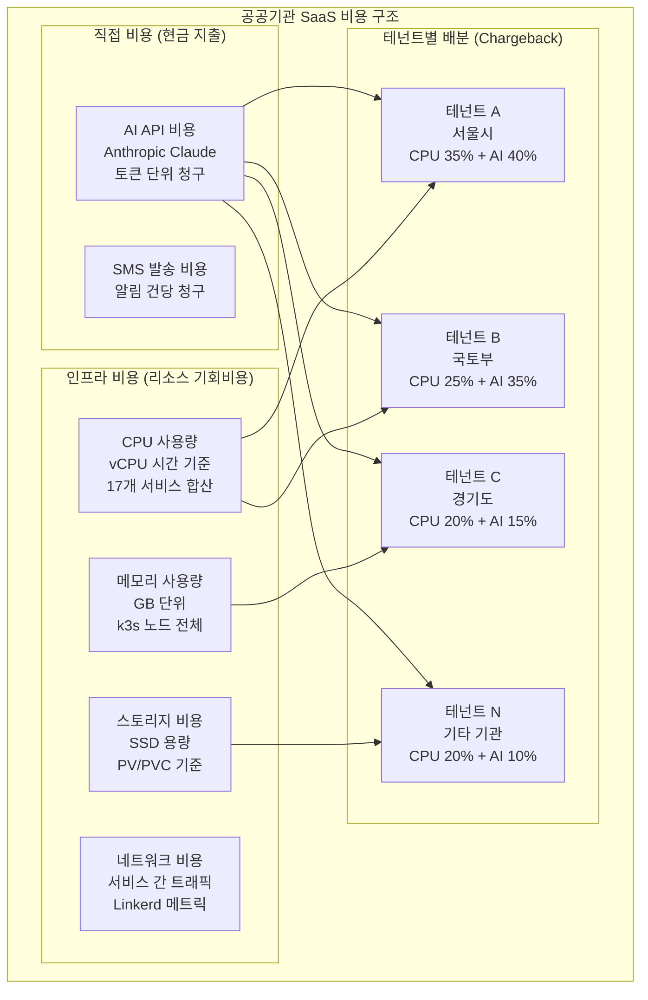
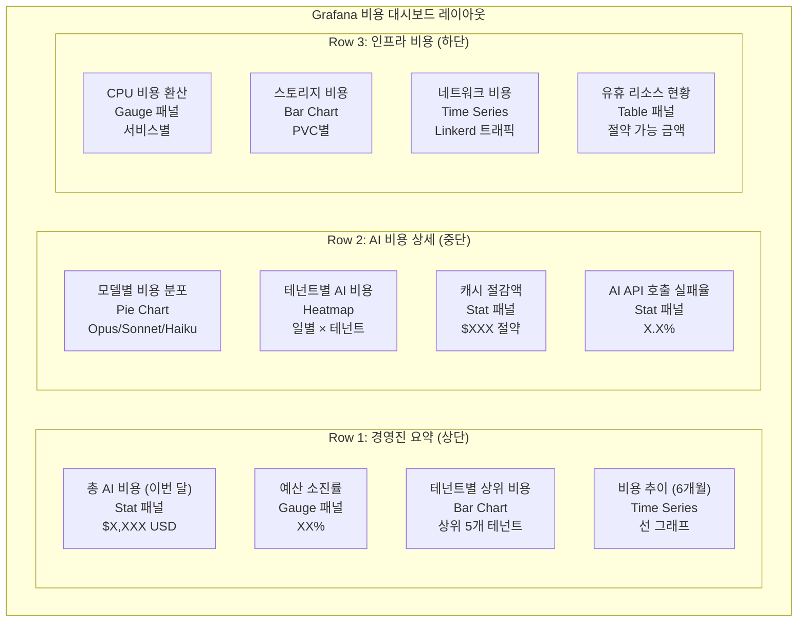

# FinOps 비용 모니터링 — AI 비용, 인프라 비용, 테넌트별 과금

> **문서 ID**: ONBOARD-05-MON-13
> **버전**: 1.0.0 | **작성일**: 2026-04-12 | **작성자**: Implementer (Sonnet)
> **대상**: 신규 개발자, DevOps 엔지니어, 운영팀, 재무 담당자
> **선행 학습**:
>   - `05-monitoring/01-prometheus-basics.md` — Prometheus 기초 및 PromQL
>   - `05-monitoring/02-grafana-guide.md` — Grafana 대시보드 구성
>   - `04-infrastructure/10-cost-optimization.md` — 인프라 비용 최적화 (중복 내용 제외)
>   - `05-monitoring/metrics/04-business-metrics-catalog.md` — 비즈니스 메트릭 카탈로그 (중복 내용 제외)
> **소요 시간**: 약 120분
> **CSAP**: D-06 (침해사고 관리 — 예산 집행 감사 로그), D-10 (서비스 가용성 — 비용 기반 리소스 관리)
> **Design Ref**: MTU-N206 §3, MTU-N251 §4, SVC-BILL-R1 DESIGN

---

## 목차

1. [FinOps란 무엇인가 (공공기관 SaaS 관점)](#1-finops란-무엇인가-공공기관-saas-관점)
2. [AI/LLM 비용 모니터링](#2-aillm-비용-모니터링)
3. [인프라 비용 모니터링](#3-인프라-비용-모니터링)
4. [테넌트별 비용 배분 (Chargeback)](#4-테넌트별-비용-배분-chargeback)
5. [비용 이상 탐지](#5-비용-이상-탐지)
6. [CSAP 예산 집행 투명성](#6-csap-예산-집행-투명성)
7. [Grafana 비용 대시보드 설정](#7-grafana-비용-대시보드-설정)
8. [학습 체크리스트](#8-학습-체크리스트)
9. [다음 단계](#9-다음-단계)

---

## 1. FinOps란 무엇인가 (공공기관 SaaS 관점)

### 1.1 FinOps의 정의

**FinOps(Financial Operations)**는 클라우드 및 인프라 비용을 기술팀, 재무팀, 경영진이 함께 관리하는 문화·관행·도구의 조합입니다. 단순히 비용을 줄이는 것이 아니라, **비용 대비 가치를 최대화**하는 것을 목표로 합니다.

```
기존 방식: 개발팀이 인프라를 사용하고, 나중에 재무팀이 청구서를 보고 놀람
FinOps 방식: 개발팀이 실시간으로 비용을 인식하고, 설계 단계부터 비용을 고려
```

### 1.2 공공기관 SaaS에서 비용 모니터링이 중요한 이유

공공기관 SaaS 플랫폼은 일반 민간 SaaS와 다른 비용 관리 요구사항을 가집니다.

| 민간 SaaS | 공공기관 SaaS |
|-----------|--------------|
| 수익 극대화가 목표 | 예산 집행의 투명성이 핵심 |
| 비용 초과 = 이익 감소 | 비용 초과 = 감사 지적 대상 |
| 사후 정산 허용 | 예산 범위 내 집행 필수 |
| 비용 보고 = 내부용 | 비용 보고 = 감리 제출 자료 |

**비용 모니터링이 필요한 세 가지 이유:**

1. **예산 집행 투명성**: 행안부 정보화사업 감리기준에 따라 예산 집행 내역을 증빙해야 합니다. 비용 모니터링 없이는 AI API 사용량이 예산을 초과해도 발견이 늦습니다.

2. **테넌트 공정 과금**: 서울시, 국토부, 경기도가 각각 다른 사용량을 가지므로, 사용량에 비례한 공정한 비용 배분이 필요합니다.

3. **보안 이상 탐지**: 갑작스러운 비용 급증은 보안 침해(비정상적 AI API 호출, 데이터 탈취)의 신호일 수 있습니다.

### 1.3 우리 프로젝트의 주요 비용 항목

이 프로젝트는 온프레미스(WSL2 + k3s) 기반이지만, AI API 호출 비용은 실제로 외부에 지불됩니다.

```
비용 항목 분류:

직접 비용 (외부 지출):
  AI API 비용 = Anthropic API 토큰 비용 (월 단위 청구)
  SMS 게이트웨이 = 알림 발송 건당 비용

간접 비용 (내부 리소스 = 기회비용):
  CPU 비용 = 과도한 CPU 사용 → 다른 서비스 성능 저하
  메모리 비용 = OOMKilled → 서비스 중단 위험
  스토리지 비용 = 로그/메트릭 과도한 보존 → 디스크 부족
  네트워크 비용 = 서비스 간 과도한 통신
```

### 1.4 비용 항목 분류 다이어그램



---

## 2. AI/LLM 비용 모니터링

### 2.1 AI 비용이 왜 다른가

AI API 비용은 일반 인프라 비용과 달리 **토큰(Token) 단위**로 측정됩니다. 토큰은 단어와 비슷한 텍스트 단위입니다.

```
토큰 비용 계산 예시:
  - "안녕하세요, 서울시 민원 처리를 도와드리겠습니다." = 약 20 토큰
  - 100페이지 문서 요약 = 약 80,000 토큰

모델별 단가 (2026년 기준, 100만 토큰당):
  - Claude Opus:   입력 $15 / 출력 $75   (가장 강력, 가장 비쌈)
  - Claude Sonnet: 입력 $3  / 출력 $15   (중간 성능, 중간 가격)
  - Claude Haiku:  입력 $0.25/ 출력 $1.25 (가장 빠름, 가장 저렴)
```

### 2.2 토큰 사용량 추적 (테넌트별)

ai-service에서 모든 AI API 호출 시 토큰 사용량을 Prometheus 메트릭으로 기록합니다.

```typescript
// platform/services/ai-service/src/lib/token-cost-tracker.ts
// Design Ref: SVC-AI-ADV-R2 §4 — AI 비용 메트릭 수집
// CSAP D-06: 모든 AI API 호출 감사 로그

import { Counter, Histogram } from 'prom-client';

// AI 토큰 사용량 카운터 (테넌트·모델별 분리)
export const aiTokensTotal = new Counter({
  name: 'ai_tokens_total',
  help: 'AI API 토큰 사용량 합계',
  labelNames: ['tenant_id', 'model', 'type'], // type: input | output
});

// AI API 호출 비용 (USD 단위)
export const aiCostUsd = new Counter({
  name: 'ai_cost_usd_total',
  help: 'AI API 누적 비용 (USD)',
  labelNames: ['tenant_id', 'model'],
});

// AI API 응답 지연 시간 (비용 대비 성능 분석)
export const aiLatencySeconds = new Histogram({
  name: 'ai_request_duration_seconds',
  help: 'AI API 요청 응답 시간 (초)',
  labelNames: ['tenant_id', 'model'],
  buckets: [0.5, 1, 2, 5, 10, 30, 60],
});

// 모델별 단가 테이블 (USD/1M 토큰)
const TOKEN_COST_PER_MILLION: Record<string, { input: number; output: number }> = {
  'claude-opus-4-6':    { input: 15.00, output: 75.00 },
  'claude-sonnet-4-6':  { input: 3.00,  output: 15.00 },
  'claude-haiku-4-5':   { input: 0.25,  output: 1.25  },
};

/**
 * AI API 호출 후 토큰 비용을 기록합니다.
 * N2SF: O등급 데이터 전송 후에만 호출 (C/S 등급 차단됨)
 */
export function recordAiUsage(params: {
  tenantId: string;
  model: string;
  inputTokens: number;
  outputTokens: number;
  latencyMs: number;
}): void {
  const { tenantId, model, inputTokens, outputTokens, latencyMs } = params;

  // 토큰 사용량 기록
  aiTokensTotal.inc({ tenant_id: tenantId, model, type: 'input' }, inputTokens);
  aiTokensTotal.inc({ tenant_id: tenantId, model, type: 'output' }, outputTokens);

  // 비용 계산 및 기록
  const costs = TOKEN_COST_PER_MILLION[model] ?? { input: 0, output: 0 };
  const inputCost  = (inputTokens  / 1_000_000) * costs.input;
  const outputCost = (outputTokens / 1_000_000) * costs.output;
  aiCostUsd.inc({ tenant_id: tenantId, model }, inputCost + outputCost);

  // 응답 시간 기록
  aiLatencySeconds.observe({ tenant_id: tenantId, model }, latencyMs / 1000);
}
```

### 2.3 비용 경보 설정 (월 예산 80% 도달 시)

```yaml
# platform/infra/monitoring/alerting/ai-cost-alerts.yaml
# CSAP D-06: 비용 이상 감지 감사

groups:
  - name: ai-cost-alerts
    rules:
      # 테넌트별 월 AI 비용이 예산의 80%를 초과할 때
      - alert: AiCostBudgetWarning
        expr: |
          sum by (tenant_id) (
            increase(ai_cost_usd_total[30d])
          ) > (
            sum by (tenant_id) (
              ai_monthly_budget_usd
            ) * 0.80
          )
        for: 5m
        labels:
          severity: warning
          category: cost
        annotations:
          summary: "테넌트 {{ $labels.tenant_id }} AI 비용 예산 80% 초과"
          description: |
            테넌트 {{ $labels.tenant_id }}의 이번 달 AI API 비용이
            월 예산의 80%를 초과했습니다.
            현재 비용: ${{ $value | humanize }} USD
            즉시 사용량 현황을 검토하십시오.
          runbook_url: "http://wiki.saas.local/runbooks/ai-cost-overrun"

      # AI 비용이 예산의 100%를 초과하면 즉시 차단
      - alert: AiCostBudgetExceeded
        expr: |
          sum by (tenant_id) (
            increase(ai_cost_usd_total[30d])
          ) > sum by (tenant_id) (ai_monthly_budget_usd)
        for: 1m
        labels:
          severity: critical
          category: cost
          action: block
        annotations:
          summary: "테넌트 {{ $labels.tenant_id }} AI 비용 예산 초과 — 차단"
          description: |
            테넌트 {{ $labels.tenant_id }}의 AI API 호출이 월 예산을 초과했습니다.
            자동 차단이 활성화됩니다.
            재활성화: 관리자 승인 후 예산 증액 또는 다음 달로 이월

      # 일별 비용 급증 탐지 (전일 대비 300% 증가)
      - alert: AiCostSpikeDetected
        expr: |
          sum by (tenant_id, model) (
            rate(ai_cost_usd_total[1h])
          ) > sum by (tenant_id, model) (
            rate(ai_cost_usd_total[24h] offset 1d)
          ) * 3
        for: 15m
        labels:
          severity: warning
          category: cost
        annotations:
          summary: "AI 비용 급증 탐지: {{ $labels.tenant_id }} ({{ $labels.model }})"
          description: |
            지난 1시간 동안의 AI 비용이 전일 동시간대 대비 300% 이상 증가했습니다.
            보안 침해 여부를 즉시 확인하십시오.
```

### 2.4 AI 모델별 비용 비교

아래 표는 실제 사용 패턴에 따른 비용 예시입니다.

| 사용 사례 | Haiku | Sonnet | Opus | 권장 모델 |
|-----------|-------|--------|------|-----------|
| 단순 분류 (카테고리 분류) | $0.003 | $0.03 | $0.15 | Haiku |
| 문서 요약 (10페이지) | $0.05 | $0.25 | $1.25 | Sonnet |
| 법령 분석 (복잡 추론) | $0.05 | $0.25 | $1.25 | Opus |
| 코드 생성 (100줄) | $0.02 | $0.15 | $0.75 | Sonnet |
| 월 1만 건 처리 기준 | $50 | $150~2,500 | $750~12,500 | 용도별 선택 |

우리 프로젝트의 모델 라우팅 전략 (`CLAUDE.md` §7 참조):
- **Haiku**: 리팩토링, 단순 탐색 → 비용 최소화
- **Sonnet**: 구현, 리뷰, 테스트 → 표준 복잡도
- **Opus**: 감리, 규제 분석 → 고복잡도 전용

### 2.5 비용 최적화 전략 — 캐싱과 모델 라우팅

```typescript
// platform/services/ai-service/src/lib/cost-optimizer.ts
// Design Ref: SVC-AI-ADV-R2 §5 — 비용 최적화

import { createHash } from 'crypto';
import { Redis } from 'ioredis';

/**
 * AI 응답 캐시 (동일 요청 중복 과금 방지)
 * 캐시 적중 시 AI API 미호출 → 비용 0원
 */
export class AiResponseCache {
  private readonly redis: Redis;
  private readonly cacheTtlSeconds = 3600; // 1시간 캐시

  constructor(redis: Redis) {
    this.redis = redis;
  }

  private buildCacheKey(model: string, prompt: string): string {
    const hash = createHash('sha256').update(`${model}:${prompt}`).digest('hex');
    return `ai:cache:${hash}`;
  }

  async get(model: string, prompt: string): Promise<string | null> {
    const key = this.buildCacheKey(model, prompt);
    return this.redis.get(key);
  }

  async set(model: string, prompt: string, response: string): Promise<void> {
    const key = this.buildCacheKey(model, prompt);
    await this.redis.setex(key, this.cacheTtlSeconds, response);
  }
}

/**
 * 요청 복잡도 기반 모델 자동 선택
 * 단순 요청 → Haiku (저비용), 복잡 요청 → Sonnet/Opus
 */
export function selectOptimalModel(request: {
  promptLength: number;   // 프롬프트 토큰 수
  requiresReasoning: boolean; // 복잡한 추론 필요 여부
  dataGrade: 'C' | 'S' | 'O'; // N2SF 데이터 등급
}): string {
  // N2SF: C/S 등급은 AI 전송 자체 불가 (보안 게이트웨이에서 차단)
  if (request.dataGrade !== 'O') {
    throw new Error(`BLOCKED: ${request.dataGrade}등급 데이터는 AI API 전송 불가 (N2SF N-05)`);
  }

  if (request.requiresReasoning) {
    return 'claude-opus-4-6';   // 복잡한 법령 분석, 감리 판단
  }
  if (request.promptLength > 10000) {
    return 'claude-sonnet-4-6'; // 긴 문서 처리 (중간 비용)
  }
  return 'claude-haiku-4-5';    // 단순 분류, 짧은 요약 (최저 비용)
}
```

### 2.6 PromQL — AI 비용 집계 쿼리

```promql
# 이번 달 테넌트별 AI 총비용 (USD)
sum by (tenant_id) (
  increase(ai_cost_usd_total[30d])
)

# 모델별 비용 비율 (비용 구성 분석)
sum by (model) (increase(ai_cost_usd_total[30d]))
/
sum(increase(ai_cost_usd_total[30d]))
* 100

# 시간당 AI 비용 추이 (비용 급증 탐지)
sum by (tenant_id) (
  rate(ai_cost_usd_total[1h])
) * 3600

# 캐시 절감 효과 (캐시 적중률)
sum(rate(ai_cache_hits_total[5m]))
/
sum(rate(ai_requests_total[5m]))
* 100

# 테넌트별 AI API 호출 건수 (일별)
sum by (tenant_id) (
  increase(ai_requests_total[1d])
)

# 평균 토큰당 비용 (모델 효율성 비교)
sum by (model) (rate(ai_cost_usd_total[1h]))
/
sum by (model) (rate(ai_tokens_total[1h]))
* 1000000  # 100만 토큰당 USD
```

---

## 3. 인프라 비용 모니터링

### 3.1 k3s 리소스 사용률 추적

이 프로젝트의 인프라 비용은 온프레미스이므로 직접 청구되지 않지만, 리소스 낭비는 다른 서비스의 성능 저하로 이어집니다.

> **참고**: 인프라 비용 최적화 심화 내용은 `04-infrastructure/10-cost-optimization.md`를 참조하십시오. 이 문서는 모니터링 관점에서 비용 지표를 추적하는 방법에 집중합니다.

```promql
# Pod별 CPU 요청 대비 실제 사용률 (낭비 탐지)
sum by (pod, namespace) (
  rate(container_cpu_usage_seconds_total{container!=""}[5m])
)
/
sum by (pod, namespace) (
  kube_pod_container_resource_requests{resource="cpu"}
)
* 100

# 메모리 요청 대비 실제 사용률
sum by (pod, namespace) (
  container_memory_working_set_bytes{container!=""}
)
/
sum by (pod, namespace) (
  kube_pod_container_resource_requests{resource="memory"}
)
* 100

# 스토리지 PVC 사용률 (비용 효율)
kubelet_volume_stats_used_bytes
/
kubelet_volume_stats_capacity_bytes
* 100
```

### 3.2 유휴 리소스 탐지 방법

유휴 리소스는 리소스를 많이 요청해두고 실제로는 거의 사용하지 않는 Pod입니다.

```promql
# CPU 유휴 Pod 탐지 (요청 대비 10% 미만 사용)
sum by (pod, namespace) (
  rate(container_cpu_usage_seconds_total[1h])
)
/
sum by (pod, namespace) (
  kube_pod_container_resource_requests{resource="cpu"}
)
< 0.10

# 메모리 유휴 Pod (요청 대비 20% 미만 사용)
sum by (pod, namespace) (
  container_memory_working_set_bytes
)
/
sum by (pod, namespace) (
  kube_pod_container_resource_requests{resource="memory"}
)
< 0.20
```

```bash
# 유휴 리소스 탐지 스크립트 (주간 실행 권장)
#!/bin/bash
# scripts/detect-idle-resources.sh

echo "=== 유휴 CPU Pod 탐지 (요청 대비 10% 미만) ==="
kubectl top pods -A --sort-by=cpu \
  | awk '$3 < "10m" && $3 != "CPU(cores)" {print $0}'

echo "=== 메모리 과다 요청 Pod 탐지 ==="
kubectl get pods -A -o json \
  | jq -r '.items[] | select(.spec.containers[].resources.requests.memory != null) |
    "\(.metadata.namespace) \(.metadata.name) \(.spec.containers[].resources.requests.memory)"'
```

### 3.3 스토리지 사용량 비용 환산

스토리지 비용을 GB당 일일 비용으로 환산하면 의사결정이 쉬워집니다.

```typescript
// scripts/storage-cost-calculator.ts
// 스토리지 비용 환산 도구

interface StorageCostConfig {
  ssdCostPerGbMonth: number;  // GB당 월 비용 (원)
  hddCostPerGbMonth: number;
}

const COST_CONFIG: StorageCostConfig = {
  ssdCostPerGbMonth: 150,  // 내부 단가 기준 (온프레미스 감가상각 포함)
  hddCostPerGbMonth: 30,
};

export function calculateStorageCost(usageGb: number, storageType: 'ssd' | 'hdd'): {
  dailyCostKrw: number;
  monthlyCostKrw: number;
  annualCostKrw: number;
} {
  const perGbMonth = storageType === 'ssd'
    ? COST_CONFIG.ssdCostPerGbMonth
    : COST_CONFIG.hddCostPerGbMonth;

  const monthlyCostKrw = usageGb * perGbMonth;
  return {
    dailyCostKrw: monthlyCostKrw / 30,
    monthlyCostKrw,
    annualCostKrw: monthlyCostKrw * 12,
  };
}

// 예시: Prometheus 데이터 200GB SSD = 월 30,000원
// console.log(calculateStorageCost(200, 'ssd'));
// → { dailyCostKrw: 1000, monthlyCostKrw: 30000, annualCostKrw: 360000 }
```

### 3.4 비용 모니터링 대시보드 레이아웃



---

## 4. 테넌트별 비용 배분 (Chargeback)

### 4.1 Chargeback이란

**Chargeback(비용 배분)**은 공유 인프라 비용을 실제 사용량에 비례해 각 테넌트에게 할당하는 방식입니다. 공공기관 예산 회계에서는 이를 **원가 배분**이라고도 합니다.

```
배분 없는 방식 (Showback만):
  총 인프라 비용 100만원 → 17개 서비스 운영 → 누가 얼마 썼는지 불명확

Chargeback 적용:
  서울시  (CPU 35%, AI 40%) → 월 청구: 42만원
  국토부  (CPU 25%, AI 35%) → 월 청구: 28만원
  경기도  (CPU 20%, AI 15%) → 월 청구: 17만원
  공통    (기반 인프라)      → 13만원 (전체 균등 배분)
```

### 4.2 CPU/메모리/스토리지 비용 배분 공식

```typescript
// platform/services/billing-service/src/lib/chargeback-calculator.ts
// Design Ref: SVC-BILL-R1 DESIGN §6 — Chargeback 알고리즘
// Plan SC: FR-P08.4

interface ResourceUsage {
  tenantId: string;
  cpuCoreHours: number;      // CPU 코어 × 시간
  memoryGbHours: number;     // GB × 시간
  storageGb: number;         // 저장소 GB (평균)
  aiCostUsd: number;         // AI API 직접 비용
  apiCallCount: number;      // API 호출 건수
}

interface CostAllocation {
  tenantId: string;
  cpuCostKrw: number;
  memoryCostKrw: number;
  storageCostKrw: number;
  aiCostKrw: number;
  apiCallCostKrw: number;
  totalCostKrw: number;
  breakdown: Record<string, number>; // 항목별 비율
}

// 단가 테이블 (내부 회계 기준)
const UNIT_COSTS = {
  cpuCoreHourKrw: 50,       // CPU 코어 시간당 50원
  memoryGbHourKrw: 10,      // 메모리 GB 시간당 10원
  storageGbMonthKrw: 150,   // 스토리지 GB 월 150원
  usdToKrw: 1350,           // 환율 (고정 적용)
  apiCallKrw: 0.5,          // API 호출 건당 0.5원
};

export function calculateChargeback(usage: ResourceUsage): CostAllocation {
  const cpuCostKrw      = usage.cpuCoreHours  * UNIT_COSTS.cpuCoreHourKrw;
  const memoryCostKrw   = usage.memoryGbHours * UNIT_COSTS.memoryGbHourKrw;
  const storageCostKrw  = usage.storageGb     * UNIT_COSTS.storageGbMonthKrw;
  const aiCostKrw       = usage.aiCostUsd     * UNIT_COSTS.usdToKrw;
  const apiCallCostKrw  = usage.apiCallCount  * UNIT_COSTS.apiCallKrw;

  const totalCostKrw = cpuCostKrw + memoryCostKrw + storageCostKrw + aiCostKrw + apiCallCostKrw;

  return {
    tenantId: usage.tenantId,
    cpuCostKrw,
    memoryCostKrw,
    storageCostKrw,
    aiCostKrw,
    apiCallCostKrw,
    totalCostKrw,
    breakdown: {
      cpu:     (cpuCostKrw     / totalCostKrw) * 100,
      memory:  (memoryCostKrw  / totalCostKrw) * 100,
      storage: (storageCostKrw / totalCostKrw) * 100,
      ai:      (aiCostKrw      / totalCostKrw) * 100,
      api:     (apiCallCostKrw / totalCostKrw) * 100,
    },
  };
}
```

### 4.3 테넌트별 리소스 사용량 측정 PromQL

```promql
# 테넌트별 CPU 사용량 (코어 시간, 1시간 누적)
sum by (tenant_id) (
  rate(container_cpu_usage_seconds_total{
    namespace=~"tenant-.*"
  }[1h])
) * 3600

# 테넌트별 메모리 사용량 (GB 시간)
sum by (tenant_id) (
  container_memory_working_set_bytes{
    namespace=~"tenant-.*"
  }
) / 1073741824  # bytes → GB

# 테넌트별 API 호출 건수 (일별)
sum by (tenant_id) (
  increase(http_requests_total{
    job="api-gateway"
  }[1d])
)

# 테넌트별 스토리지 사용량 (GB)
sum by (tenant_id) (
  kubelet_volume_stats_used_bytes{
    namespace=~"tenant-.*"
  }
) / 1073741824

# 테넌트별 AI 비용 (이번 달 누적, USD)
sum by (tenant_id) (
  increase(ai_cost_usd_total[30d])
)
```

### 4.4 청구 서비스와 연동 방법

billing-service는 이미 구현된 인보이스 생성 기능을 활용합니다. (`platform/services/billing-service/src/handlers/billing.handler.ts` 참조)

```typescript
// 월별 청구 자동화 스크립트 (scripts/monthly-billing.ts)
// Plan SC: FR-P08.1 — 인보이스 자동 생성
// CSAP D-06: 청구 이벤트 감사 로그

import type { ResourceUsage } from './chargeback-calculator';
import { calculateChargeback } from './chargeback-calculator';

async function generateMonthlyInvoices(month: string): Promise<void> {
  // 1. Prometheus에서 이번 달 사용량 수집
  const usageData = await collectMonthlyUsage(month);

  for (const usage of usageData) {
    // 2. Chargeback 계산
    const allocation = calculateChargeback(usage);

    // 3. billing-service API로 인보이스 생성
    const response = await fetch('http://billing-service:3007/billing/invoices/generate', {
      method: 'POST',
      headers: {
        'Content-Type': 'application/json',
        'X-Internal-Service-Key': process.env['INTERNAL_SERVICE_KEY'] ?? '',
        'X-User-Role': 'SUPER_ADMIN',
        'X-User-Id': 'billing-automation',
        'X-User-Tenant-Id': 'system',
      },
      body: JSON.stringify({
        subscriptionId: usage.tenantId,
        // 금액은 KRW로 환산하여 전달
        // billing-service에서 구독 Plan 가격과 대조
      }),
    });

    if (!response.ok) {
      throw new Error(`인보이스 생성 실패: ${usage.tenantId} — ${response.status}`);
    }
  }
}

// Prometheus HTTP API 호출로 사용량 수집
async function collectMonthlyUsage(month: string): Promise<ResourceUsage[]> {
  const end   = new Date(`${month}-01`);
  const start = new Date(end);
  start.setMonth(start.getMonth() - 1);

  // PromQL로 지난 달 사용량 집계
  const query = encodeURIComponent(
    `sum by (tenant_id) (increase(ai_cost_usd_total[30d]))`
  );
  const resp = await fetch(
    `http://prometheus:9090/api/v1/query?query=${query}&time=${end.toISOString()}`
  );
  const data = await resp.json() as { data: { result: Array<{ metric: { tenant_id: string }; value: [number, string] }> } };

  return data.data.result.map(r => ({
    tenantId: r.metric.tenant_id,
    cpuCoreHours: 0,    // 추가 쿼리로 채움
    memoryGbHours: 0,
    storageGb: 0,
    aiCostUsd: parseFloat(r.value[1]),
    apiCallCount: 0,
  }));
}
```

---

## 5. 비용 이상 탐지

### 5.1 갑작스러운 비용 급증 알림 설정

비용 급증은 보안 침해의 신호일 수 있습니다. 예를 들어, API 키 유출로 인한 무단 AI API 호출은 비용 급증으로 먼저 발견될 수 있습니다.

```yaml
# platform/infra/monitoring/alerting/cost-anomaly-alerts.yaml

groups:
  - name: cost-anomaly-detection
    rules:
      # 시간당 AI 비용이 지난 7일 평균의 5배를 초과
      - alert: AiCostAnomalyDetected
        expr: |
          sum by (tenant_id) (rate(ai_cost_usd_total[1h])) * 3600
          >
          sum by (tenant_id) (
            avg_over_time(
              (rate(ai_cost_usd_total[1h]) * 3600)[7d:1h]
            )
          ) * 5
        for: 10m
        labels:
          severity: critical
          category: security_cost
        annotations:
          summary: "AI 비용 이상 탐지 — 보안 침해 가능성"
          description: |
            테넌트 {{ $labels.tenant_id }}의 AI 비용이 7일 평균 대비 500% 초과.
            API 키 유출 또는 비정상 사용 여부를 즉시 확인하십시오.
            보안팀 즉시 연락: #security-incident 채널

      # 특정 시간대(업무 시간 외) AI 사용량 급증
      - alert: OffHoursAiUsageSpike
        expr: |
          (
            hour() < 7 or hour() > 21
          ) and (
            sum by (tenant_id) (rate(ai_requests_total[30m])) > 10
          )
        for: 5m
        labels:
          severity: warning
          category: security_cost
        annotations:
          summary: "업무 외 시간 AI 사용량 급증 — {{ $labels.tenant_id }}"
          description: "새벽/야간 AI API 호출이 급증했습니다. 정상 사용 여부를 확인하십시오."
```

### 5.2 예산 초과 자동 차단 메커니즘

```typescript
// platform/services/ai-service/src/middleware/budget-guard.ts
// Design Ref: SVC-AI-ADV-R2 §6 — 예산 초과 차단

import { Redis } from 'ioredis';

export class BudgetGuard {
  private readonly redis: Redis;
  private readonly monthlyBudgetUsd: number;

  constructor(redis: Redis, monthlyBudgetUsd: number) {
    this.redis = redis;
    this.monthlyBudgetUsd = monthlyBudgetUsd;
  }

  /**
   * AI 요청 전 예산 초과 여부 확인
   * 초과 시 즉시 차단 (HTTP 429 반환)
   */
  async checkBudget(tenantId: string): Promise<{ allowed: boolean; remainingBudgetUsd: number }> {
    const currentMonthKey = new Date().toISOString().slice(0, 7); // "2026-04"
    const redisKey = `budget:${tenantId}:${currentMonthKey}`;

    const currentCostStr = await this.redis.get(redisKey);
    const currentCostUsd = currentCostStr ? parseFloat(currentCostStr) : 0;

    const remainingBudgetUsd = this.monthlyBudgetUsd - currentCostUsd;

    // 예산 100% 초과 시 차단
    if (remainingBudgetUsd <= 0) {
      return { allowed: false, remainingBudgetUsd: 0 };
    }

    return { allowed: true, remainingBudgetUsd };
  }

  /**
   * AI 요청 완료 후 비용 기록
   */
  async recordUsage(tenantId: string, costUsd: number): Promise<void> {
    const currentMonthKey = new Date().toISOString().slice(0, 7);
    const redisKey = `budget:${tenantId}:${currentMonthKey}`;

    // 원자적 증가 (동시 요청 처리 시 정확성 보장)
    await this.redis.incrbyfloat(redisKey, costUsd);
    // 월말+10일까지 보존 (청구 확인용)
    await this.redis.expire(redisKey, 40 * 24 * 3600);
  }
}
```

### 5.3 비용 이상 원인 분석 방법

비용 급증 알림을 받으면 다음 순서로 원인을 분석합니다.

```bash
# 1단계: 어느 테넌트가 급증했는지 확인
kubectl exec -n monitoring deployment/prometheus -- \
  promtool query instant \
  'topk(5, sum by (tenant_id) (rate(ai_cost_usd_total[1h])))'

# 2단계: 해당 테넌트의 어떤 기능이 호출하는지 확인
kubectl logs -n ai-service -l app=ai-service \
  --since=1h \
  | grep '"tenant_id":"문제_테넌트"' \
  | jq '{model, endpoint, tokens: .input_tokens}' \
  | sort | uniq -c | sort -rn

# 3단계: AI 서비스 감사 로그에서 이상 패턴 확인
cat /data/ai-saas/.claude/audit.jsonl \
  | grep '"action":"ai_request"' \
  | grep '"tenant":"문제_테넌트"' \
  | jq -r '[.timestamp, .actor, .metadata.model, .metadata.tokens] | @tsv' \
  | tail -50

# 4단계: 특정 사용자 또는 API 키로 추적
kubectl logs -n api-gateway -l app=api-gateway \
  --since=1h \
  | grep '"tenant_id":"문제_테넌트"' \
  | jq '{user_id, path, method, timestamp}' \
  | head -20
```

---

## 6. CSAP 예산 집행 투명성

### 6.1 비용 보고서 생성 자동화

CSAP 감사 및 행안부 정보화사업 감리를 위해 비용 보고서를 자동으로 생성합니다.

```typescript
// scripts/cost-report-generator.ts
// CSAP D-06: 예산 집행 증거 자료 수집
// Design Ref: MTU-N253 §4 — CSAP 증거 자동화

interface MonthlyCostReport {
  reportMonth: string;       // "2026-04"
  generatedAt: string;       // ISO 8601
  totalAiCostUsd: number;
  totalAiCostKrw: number;
  tenantBreakdown: TenantCostSummary[];
  modelBreakdown: ModelCostSummary[];
  budgetUtilization: number; // 0~1 (예산 소진률)
  anomaliesDetected: CostAnomaly[];
  csapRef: string[];         // CSAP 근거 조항
}

interface TenantCostSummary {
  tenantId: string;
  tenantName: string;
  aiCostUsd: number;
  apiCallCount: number;
  tokenCount: number;
  percentOfTotal: number;
}

export async function generateMonthlyCostReport(month: string): Promise<MonthlyCostReport> {
  // Prometheus API에서 데이터 수집
  const [aiCosts, tokenCounts, apiCalls] = await Promise.all([
    queryPrometheus(`sum by (tenant_id) (increase(ai_cost_usd_total{month="${month}"}[30d]))`),
    queryPrometheus(`sum by (tenant_id, model) (increase(ai_tokens_total{month="${month}"}[30d]))`),
    queryPrometheus(`sum by (tenant_id) (increase(http_requests_total[30d]))`),
  ]);

  const report: MonthlyCostReport = {
    reportMonth: month,
    generatedAt: new Date().toISOString(),
    totalAiCostUsd: sumValues(aiCosts),
    totalAiCostKrw: sumValues(aiCosts) * 1350,
    tenantBreakdown: buildTenantBreakdown(aiCosts, apiCalls),
    modelBreakdown: buildModelBreakdown(tokenCounts),
    budgetUtilization: sumValues(aiCosts) / getMonthlyBudget(month),
    anomaliesDetected: [],
    csapRef: ['D-06 §2.3', 'D-10 §1.1'],
  };

  // 감사 로그 기록 (CSAP D-06)
  await appendAuditLog({
    action: 'COST_REPORT_GENERATED',
    actor: 'billing-automation',
    target: `monthly-cost-report-${month}`,
    timestamp: new Date().toISOString(),
    metadata: { month, totalCostUsd: report.totalAiCostUsd },
  });

  return report;
}

async function queryPrometheus(query: string): Promise<unknown[]> {
  const url = `http://prometheus:9090/api/v1/query?query=${encodeURIComponent(query)}`;
  const resp = await fetch(url);
  const data = await resp.json() as { data: { result: unknown[] } };
  return data.data.result;
}

function sumValues(results: unknown[]): number {
  return (results as Array<{ value: [number, string] }>)
    .reduce((sum, r) => sum + parseFloat(r.value[1]), 0);
}

function buildTenantBreakdown(aiCosts: unknown[], _apiCalls: unknown[]): TenantCostSummary[] {
  const total = sumValues(aiCosts);
  return (aiCosts as Array<{ metric: { tenant_id: string }; value: [number, string] }>).map(r => ({
    tenantId: r.metric.tenant_id,
    tenantName: r.metric.tenant_id, // 실제 구현 시 테넌트 이름 조회
    aiCostUsd: parseFloat(r.value[1]),
    apiCallCount: 0,
    tokenCount: 0,
    percentOfTotal: (parseFloat(r.value[1]) / total) * 100,
  }));
}

function buildModelBreakdown(_tokenCounts: unknown[]): ModelCostSummary[] {
  return []; // 실제 구현 시 모델별 집계
}

function getMonthlyBudget(_month: string): number {
  return parseFloat(process.env['MONTHLY_AI_BUDGET_USD'] ?? '1000');
}

async function appendAuditLog(_log: Record<string, unknown>): Promise<void> {
  // 감사 로그 기록 구현
}

interface ModelCostSummary {
  model: string;
  totalCostUsd: number;
  tokenCount: number;
}

interface CostAnomaly {
  tenantId: string;
  detectedAt: string;
  description: string;
}
```

### 6.2 감사용 비용 이력 보존

```yaml
# platform/infra/monitoring/prometheus-retention.yaml
# CSAP D-06: 감사 이력 최소 1년 보존

apiVersion: v1
kind: ConfigMap
metadata:
  name: prometheus-config
  namespace: monitoring
data:
  prometheus.yml: |
    global:
      scrape_interval: 30s
      evaluation_interval: 30s

    # 비용 메트릭 별도 장기 보존 설정
    remote_write:
      - url: http://thanos-receive:19291/api/v1/receive
        queue_config:
          max_samples_per_send: 10000
          batch_send_deadline: 5s
        # 비용 관련 메트릭만 장기 보존 (Thanos로 S3/NFS 이전)
        write_relabel_configs:
          - source_labels: [__name__]
            regex: "ai_cost_usd_total|ai_tokens_total|billing_.*"
            action: keep

---
# Thanos 장기 보존 설정 (1년 이상)
apiVersion: apps/v1
kind: Deployment
metadata:
  name: thanos-store
  namespace: monitoring
spec:
  template:
    spec:
      containers:
        - name: thanos-store
          args:
            - store
            - --data-dir=/data
            - --min-time=-365d   # 최소 1년 보존 (CSAP D-06)
            - --max-time=0d
```

### 6.3 예산 집행 증거 자료 수집

감리 시 제출해야 하는 비용 증거 자료 체크리스트:

```
CSAP 감리 비용 증거 자료 체크리스트:

[ ] 1. 월별 AI API 비용 명세 (테넌트별)
    - 파일: cost-reports/2026-04-ai-cost-breakdown.json
    - PromQL 쿼리 결과 스크린샷

[ ] 2. 예산 소진 추이 그래프 (Grafana 스크린샷)
    - 6개월 추이 그래프
    - 예산 한도선 포함

[ ] 3. 비용 이상 탐지 알림 이력
    - AlertManager 이력 (JSONL)
    - 조치 내역 (장애 보고서 링크)

[ ] 4. 테넌트별 Chargeback 계산서
    - 월별 인보이스 (PDF 또는 JSON)
    - 계산 근거 공식 명시

[ ] 5. 비용 최적화 조치 이력
    - 캐시 적용 전/후 비용 비교
    - 모델 라우팅 조정 기록
```

---

## 7. Grafana 비용 대시보드 설정

### 7.1 경영진용 비용 요약 대시보드

```json
{
  "title": "FinOps 비용 요약 — 경영진용",
  "uid": "finops-executive-summary",
  "tags": ["finops", "cost", "executive"],
  "refresh": "1h",
  "panels": [
    {
      "id": 1,
      "title": "이번 달 총 AI 비용 (USD)",
      "type": "stat",
      "gridPos": { "h": 4, "w": 6, "x": 0, "y": 0 },
      "targets": [
        {
          "expr": "sum(increase(ai_cost_usd_total[30d]))",
          "legendFormat": "이번 달 AI 비용"
        }
      ],
      "options": {
        "reduceOptions": { "calcs": ["lastNotNull"] },
        "colorMode": "background",
        "thresholds": {
          "steps": [
            { "color": "green", "value": null },
            { "color": "yellow", "value": 800 },
            { "color": "red", "value": 1000 }
          ]
        }
      },
      "fieldConfig": {
        "defaults": {
          "unit": "currencyUSD",
          "decimals": 2
        }
      }
    },
    {
      "id": 2,
      "title": "예산 소진률 (%)",
      "type": "gauge",
      "gridPos": { "h": 4, "w": 6, "x": 6, "y": 0 },
      "targets": [
        {
          "expr": "sum(increase(ai_cost_usd_total[30d])) / scalar(ai_monthly_budget_usd) * 100",
          "legendFormat": "예산 소진률"
        }
      ],
      "options": {
        "reduceOptions": { "calcs": ["lastNotNull"] },
        "minValue": 0,
        "maxValue": 100,
        "thresholds": {
          "steps": [
            { "color": "green", "value": null },
            { "color": "yellow", "value": 80 },
            { "color": "red", "value": 100 }
          ]
        }
      },
      "fieldConfig": {
        "defaults": { "unit": "percent" }
      }
    },
    {
      "id": 3,
      "title": "테넌트별 AI 비용 (이번 달)",
      "type": "barchart",
      "gridPos": { "h": 8, "w": 12, "x": 12, "y": 0 },
      "targets": [
        {
          "expr": "topk(10, sum by (tenant_id) (increase(ai_cost_usd_total[30d])))",
          "legendFormat": "{{ tenant_id }}"
        }
      ],
      "fieldConfig": {
        "defaults": { "unit": "currencyUSD" }
      }
    },
    {
      "id": 4,
      "title": "AI 비용 추이 (6개월)",
      "type": "timeseries",
      "gridPos": { "h": 8, "w": 24, "x": 0, "y": 8 },
      "targets": [
        {
          "expr": "sum by (tenant_id) (rate(ai_cost_usd_total[1d]) * 86400)",
          "legendFormat": "{{ tenant_id }} 일별 비용"
        }
      ],
      "fieldConfig": {
        "defaults": {
          "unit": "currencyUSD",
          "custom": { "fillOpacity": 10, "lineWidth": 2 }
        }
      }
    }
  ]
}
```

### 7.2 운영팀용 상세 비용 분석 패널

```json
{
  "title": "FinOps 상세 분석 — 운영팀용",
  "uid": "finops-ops-detail",
  "tags": ["finops", "cost", "operations"],
  "refresh": "15m",
  "panels": [
    {
      "id": 10,
      "title": "모델별 비용 분포",
      "type": "piechart",
      "gridPos": { "h": 8, "w": 8, "x": 0, "y": 0 },
      "targets": [
        {
          "expr": "sum by (model) (increase(ai_cost_usd_total[30d]))",
          "legendFormat": "{{ model }}"
        }
      ],
      "fieldConfig": {
        "defaults": { "unit": "currencyUSD" }
      }
    },
    {
      "id": 11,
      "title": "캐시 절감 효과",
      "type": "stat",
      "gridPos": { "h": 4, "w": 8, "x": 8, "y": 0 },
      "targets": [
        {
          "expr": "sum(rate(ai_cache_hits_total[1h])) / sum(rate(ai_requests_total[1h])) * 100",
          "legendFormat": "캐시 적중률"
        }
      ],
      "options": {
        "reduceOptions": { "calcs": ["mean"] },
        "text": { "titleSize": 16 }
      },
      "fieldConfig": {
        "defaults": { "unit": "percent", "decimals": 1 }
      }
    },
    {
      "id": 12,
      "title": "유휴 리소스 현황 (CPU 10% 미만)",
      "type": "table",
      "gridPos": { "h": 8, "w": 24, "x": 0, "y": 8 },
      "targets": [
        {
          "expr": "topk(20, sum by (pod, namespace) (rate(container_cpu_usage_seconds_total[1h])) / sum by (pod, namespace) (kube_pod_container_resource_requests{resource='cpu'}) < 0.10)",
          "legendFormat": "{{ namespace }}/{{ pod }}"
        }
      ],
      "fieldConfig": {
        "defaults": { "unit": "percentunit" },
        "overrides": [
          {
            "matcher": { "id": "byName", "options": "Value" },
            "properties": [
              { "id": "displayName", "value": "CPU 사용률" },
              {
                "id": "thresholds",
                "value": {
                  "steps": [
                    { "color": "red", "value": null },
                    { "color": "yellow", "value": 0.05 },
                    { "color": "green", "value": 0.10 }
                  ]
                }
              }
            ]
          }
        ]
      }
    }
  ]
}
```

### 7.3 Grafana 대시보드 프로비저닝 설정

```yaml
# platform/infra/monitoring/grafana/provisioning/dashboards/finops.yaml
apiVersion: 1

providers:
  - name: finops-dashboards
    orgId: 1
    type: file
    disableDeletion: false
    updateIntervalSeconds: 60
    allowUiUpdates: true
    options:
      path: /var/lib/grafana/dashboards/finops
      foldersFromFilesStructure: true
```

```bash
# Grafana 대시보드 적용 방법
kubectl create configmap finops-dashboards \
  --from-file=executive-summary.json \
  --from-file=ops-detail.json \
  -n monitoring

kubectl label configmap finops-dashboards \
  grafana_dashboard=1 \
  -n monitoring
```

---

## 8. 학습 체크리스트

이 문서를 완료한 후 아래 항목을 확인하십시오.

```
[ ] FinOps의 목적과 공공기관 SaaS에서의 중요성을 설명할 수 있다.
[ ] AI 토큰 비용 계산 방법을 이해하고, 모델별 단가 차이를 알고 있다.
[ ] PromQL로 테넌트별 AI 비용을 집계하는 쿼리를 작성할 수 있다.
[ ] Chargeback 공식을 이해하고, CPU/메모리/스토리지/AI 비용을 각각 계산할 수 있다.
[ ] 비용 급증 알림이 왜 보안 이상 탐지와 연결되는지 설명할 수 있다.
[ ] 예산 초과 자동 차단 메커니즘이 어떻게 동작하는지 이해했다.
[ ] CSAP D-06 기준으로 비용 이력을 1년 이상 보존해야 하는 이유를 설명할 수 있다.
[ ] Grafana 비용 대시보드를 직접 열어 이번 달 AI 비용을 확인했다.
```

---

## 9. 다음 단계

| 학습 주제 | 문서 경로 |
|-----------|-----------|
| 인프라 비용 최적화 심화 | `04-infrastructure/10-cost-optimization.md` |
| 비즈니스 메트릭 전체 카탈로그 | `05-monitoring/metrics/04-business-metrics-catalog.md` |
| 청구 서비스 코드 분석 | `platform/services/billing-service/src/` |
| SLO와 비용의 관계 | `05-monitoring/slo/` |
| DORA 지표와 배포 비용 | `05-monitoring/dora/` |

---

## 변경 이력

| 버전 | 일자 | 내용 | 작성자 |
|------|------|------|-------|
| 1.0.0 | 2026-04-12 | 초기 작성 — FinOps 비용 모니터링 전체 | Implementer (Sonnet) |
