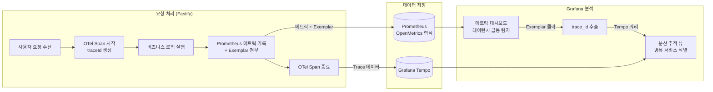
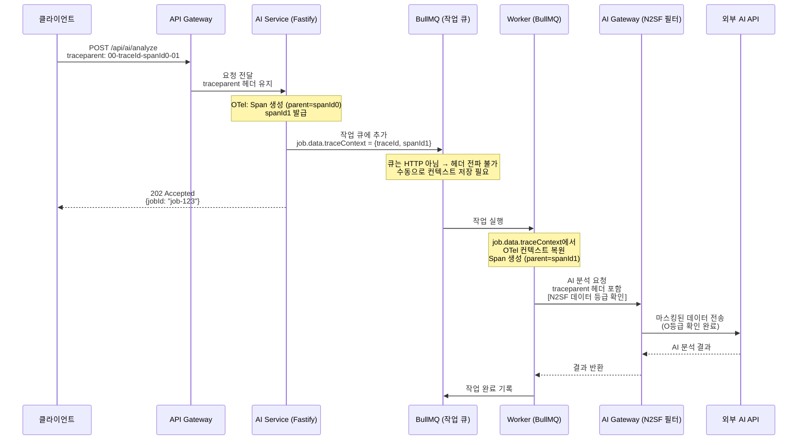
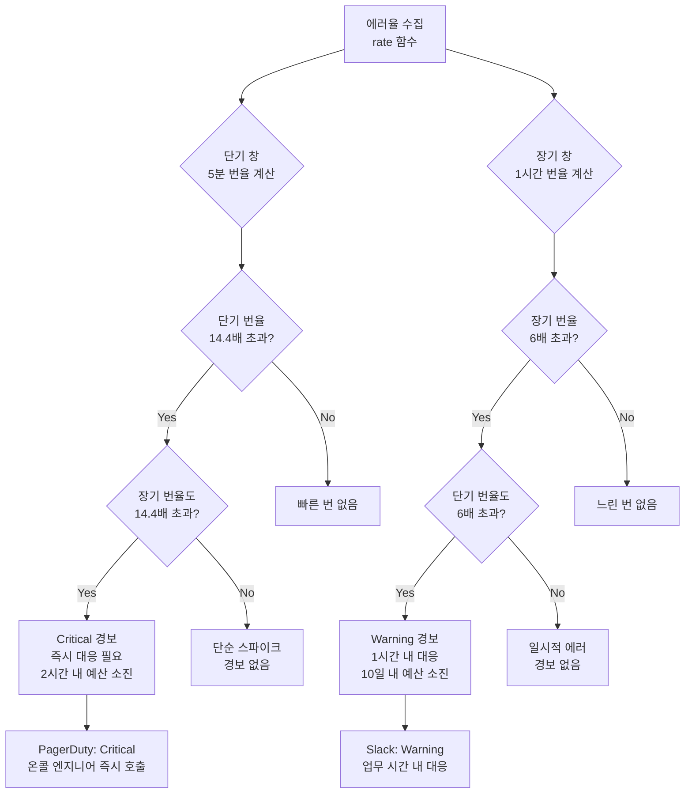
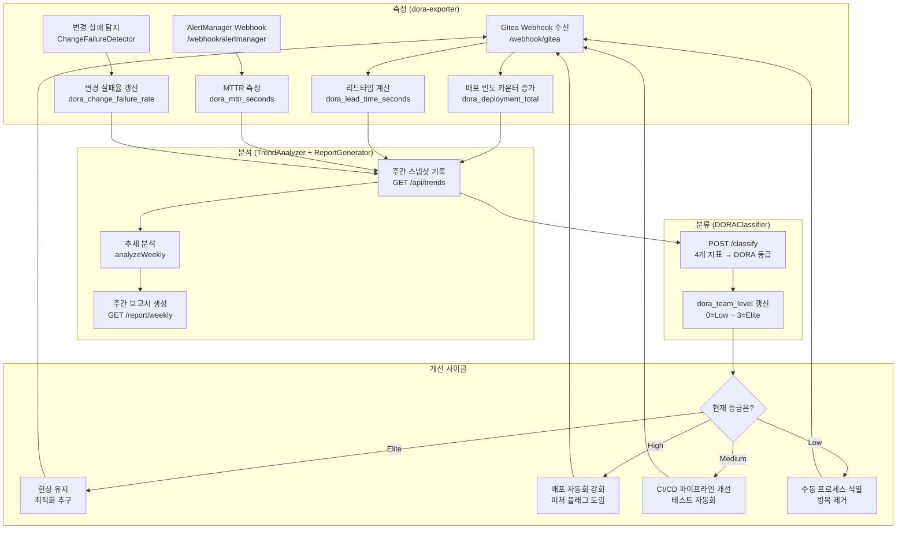

# 관측가능성 고급 패턴 — 분산 추적 심화, Exemplar, SLO 기반 경보

> **문서 ID**: MON-OBS-14
> **버전**: 1.0.0 | **작성일**: 2026-04-13 | **작성자**: Implementer (Sonnet)
> **목적**: 공공기관 SaaS 프레임워크의 고급 관측가능성 패턴을 이해하고, Exemplar 연결, 분산 추적, SLO 기반 경보, DORA 메트릭 측정을 실제 코드 기반으로 학습한다.
> **선행 학습**: [08-observability-deep-dive.md](./08-observability-deep-dive.md), [09-sre-practices.md](./09-sre-practices.md), [slo/README.md](./slo/README.md)

---

## 목차

1. [관측가능성 피라미드](#1-관측가능성-피라미드)
2. [Exemplar 연결 패턴](#2-exemplar-연결-패턴)
3. [분산 추적 심화](#3-분산-추적-심화)
4. [SLO 기반 경보 고급](#4-slo-기반-경보-고급)
5. [Loki LogQL 고급](#5-loki-logql-고급)
6. [DORA 메트릭 심화](#6-dora-메트릭-심화)
7. [이상 탐지 (Anomaly Detection)](#7-이상-탐지-anomaly-detection)
8. [변경 이력](#변경-이력)

---

## 1. 관측가능성 피라미드

### 1.1 개요

관측가능성(Observability)이란 시스템의 외부 출력 신호만을 보고 내부 상태를 추론할 수 있는 능력입니다. 단순히 "무언가 잘못됐는가"를 감지하는 모니터링과 달리, 관측가능성은 "왜 잘못됐는가"를 진단할 수 있는 능력을 제공합니다.

공공기관 SaaS 환경에서 관측가능성은 CSAP D-06 침해사고 관리, D-10 운영 관리 요건을 충족하는 핵심 기반입니다. 장애가 발생했을 때 원인을 빠르게 파악하고, 감사관에게 시스템 동작 증거를 제시할 수 있어야 합니다.

### 1.2 M.E.L.T. 4계층 아키텍처

관측가능성의 네 가지 기둥은 Metrics(메트릭), Events(이벤트), Logs(로그), Traces(추적)입니다. 이를 M.E.L.T.라 부르며, 각 계층은 서로 다른 수준의 상세도와 목적을 가집니다.


각 계층의 특성을 이해하는 것이 중요합니다.

**이벤트(Events) — 가장 하위 계층**

시스템에서 발생하는 원시 사건들입니다. HTTP 요청 하나, 데이터베이스 쿼리 하나, 사용자 로그인 시도 하나가 각각 하나의 이벤트입니다. 이벤트는 가장 세밀한 정보를 담고 있으나, 그 양이 방대하여 직접 저장하고 분석하는 데 비용이 큽니다.

**로그(Logs) — 두 번째 계층**

이벤트를 사람이 읽을 수 있는 형태로 기록한 것입니다. 공공기관 SaaS 프레임워크에서는 구조화 로그(JSON 형식)를 사용하여 기계 처리가 가능하도록 합니다. 로그는 이벤트보다는 덜 상세하지만, 개별 요청의 맥락 정보를 담고 있습니다.

```typescript
// 공공기관 SaaS 표준 구조화 로그 형식 (Fastify 기반)
// Design Ref: platform/services/compliance-service/src/index.ts
{
  "level": "info",
  "component": "compliance-service",
  "action": "readiness_check",
  "actor": "system:compliance-service",
  "tenantId": "tenant-A",
  "traceId": "4bf92f3577b34da6a3ce929d0e0e4736",
  "spanId": "00f067aa0ba902b7",
  "readinessScore": 94,
  "ts": "2026-04-13T09:00:00.000Z"
}
```

**메트릭(Metrics) — 세 번째 계층**

시간에 따른 수치 데이터의 집계입니다. 이벤트와 로그에서 집계된 숫자로, "초당 몇 건의 요청이 처리됐는가", "응답 시간의 P99는 얼마인가"와 같은 질문에 답합니다. Prometheus 메트릭이 대표적이며, 공간 효율이 높아 장기 보관에 적합합니다.

**분산 추적(Traces) — 최상위 계층**

단일 사용자 요청이 여러 서비스를 거쳐 처리되는 전체 경로를 추적합니다. 하나의 Trace는 여러 Span으로 구성되며, 각 Span은 특정 서비스에서의 작업 단위를 나타냅니다. 분산 추적은 마이크로서비스 환경에서 "어느 서비스에서 지연이 발생했는가"를 파악하는 데 필수적입니다.

### 1.3 계층 간 상호 연결

M.E.L.T. 계층들이 서로 연결될 때 진정한 관측가능성이 실현됩니다. 이 연결의 핵심 메커니즘이 바로 Trace ID의 공유입니다.

- **로그 → 추적 연결**: 로그에 `traceId` 필드를 포함하면, 특정 로그 항목에서 해당 요청의 전체 추적으로 이동할 수 있습니다.
- **메트릭 → 추적 연결**: Exemplar 패턴을 사용하면, 특정 메트릭 데이터 포인트에서 해당 요청의 추적으로 이동할 수 있습니다. (2절에서 상세 설명)
- **추적 → 로그 연결**: Grafana Tempo에서 특정 Span을 보면서, 해당 시간대의 Loki 로그로 이동할 수 있습니다.

### 1.4 공공기관 SaaS에서의 관측가능성 요건

CSAP D-06 침해사고 관리 요건에 따라, 모든 보안 관련 이벤트는 감사 로그로 기록되어야 합니다. 관측가능성 스택은 이 감사 로그를 포함하여 운영 상태를 종합적으로 파악할 수 있어야 합니다.

행안부 정보화사업 감리기준에 따라, 시스템의 가용성과 성능에 대한 증거를 제시할 수 있어야 합니다. SLO 대시보드와 DORA 메트릭이 이 증거의 핵심을 구성합니다.

N2SF AI 연동 보안 요건에 따라, AI 서비스 호출 이벤트는 데이터 등급과 마스킹 여부를 로그에 기록해야 합니다.

---

## 2. Exemplar 연결 패턴

### 2.1 Exemplar란 무엇인가

Exemplar(예시값)는 Prometheus 메트릭 데이터 포인트에 추가적인 레이블 정보를 첨부하는 기능입니다. 가장 중요한 활용은 메트릭 포인트에 `trace_id`를 첨부하는 것으로, 이를 통해 Grafana에서 특정 메트릭 값(예: P99 레이턴시 급등)에서 원인이 된 실제 요청의 분산 추적으로 단 한 번의 클릭으로 이동할 수 있습니다.

예를 들어, HTTP 응답 시간 히스토그램에서 99번째 백분위가 갑자기 3초로 급등했을 때, 그 3초짜리 요청이 어떤 요청이었는지, 어느 서비스에서 지연이 발생했는지를 즉시 파악할 수 있습니다.

### 2.2 Exemplar 기반 메트릭-추적 연결 흐름



### 2.3 Exemplar 구현: prom-client 설정

공공기관 SaaS 프레임워크에서 Exemplar를 활성화하는 방법입니다. `prom-client` 라이브러리가 OpenMetrics 형식을 지원할 때 Exemplar가 활성화됩니다.

```typescript
// platform/services/compliance-service 기반 Exemplar 구현 예시
// Design Ref: §2 Exemplar 연결 패턴

import { Registry, Histogram, collectDefaultMetrics } from 'prom-client';
import { context, trace } from '@opentelemetry/api';

const register = new Registry();

// OpenMetrics 형식 활성화 (Exemplar 지원을 위해 필수)
// prom-client 기본값은 text/plain이므로 명시적으로 설정 필요
collectDefaultMetrics({ register });

// HTTP 응답 시간 히스토그램 (Exemplar 지원)
const httpRequestDuration = new Histogram({
  name: 'http_request_duration_seconds',
  help: 'HTTP 요청 응답 시간 (초)',
  labelNames: ['method', 'route', 'status_code', 'tenant_id'] as const,
  // 공공기관 SLA에 맞춘 버킷 설정
  // 500ms, 1초, 2초, 5초, 10초 등 경계값 포함
  buckets: [0.05, 0.1, 0.25, 0.5, 1, 2, 5, 10],
  registers: [register],
});

// Fastify 플러그인: 모든 요청에 Exemplar 자동 첨부
async function instrumentRequest(
  method: string,
  route: string,
  statusCode: number,
  durationSeconds: number,
  tenantId: string,
): Promise<void> {
  // 현재 OTel 컨텍스트에서 traceId 추출
  const activeSpan = trace.getActiveSpan();
  const spanContext = activeSpan?.spanContext();

  if (spanContext?.traceId) {
    // Exemplar 첨부: 메트릭 포인트에 trace_id 연결
    httpRequestDuration.observe(
      { method, route, status_code: String(statusCode), tenant_id: tenantId },
      durationSeconds,
      // Exemplar 객체: Prometheus OpenMetrics 2.0 형식
      {
        trace_id: spanContext.traceId,
        span_id: spanContext.spanId,
        // 추가 컨텍스트 정보 (선택적)
        tenant_id: tenantId,
      },
    );
  } else {
    // Exemplar 없이 일반 관측값 기록
    httpRequestDuration.observe(
      { method, route, status_code: String(statusCode), tenant_id: tenantId },
      durationSeconds,
    );
  }
}

// 메트릭 엔드포인트: OpenMetrics 형식으로 노출 (Exemplar 포함)
async function metricsHandler(req: any, res: any): Promise<void> {
  // OpenMetrics 형식 헤더 (Exemplar 데이터 포함)
  // Prometheus가 이 헤더를 보면 Exemplar 데이터를 수집함
  const contentType = register.contentType.includes('openmetrics')
    ? register.contentType
    : 'application/openmetrics-text; version=1.0.0; charset=utf-8';

  res.set('Content-Type', contentType);
  res.end(await register.metrics());
}
```

### 2.4 Prometheus 설정: Exemplar 활성화

Prometheus 서버에서 Exemplar 기능을 활성화해야 합니다.

```yaml
# /etc/prometheus/prometheus.yml
# Exemplar 저장 활성화
global:
  scrape_interval: 15s
  # Exemplar 기능 활성화 (Prometheus 2.25+)

storage:
  exemplars:
    # 최대 Exemplar 저장 개수 (메모리 사용량과 트레이드오프)
    max_exemplars: 100000

scrape_configs:
  - job_name: 'compliance-service'
    static_configs:
      - targets: ['compliance-service:3013']
    # OpenMetrics 형식으로 스크래핑 (Exemplar 수집)
    scrape_protocols:
      - OpenMetricsText1.0.0
      - PrometheusText0.0.4
```

### 2.5 Grafana에서 Exemplar 활성화

Grafana 데이터소스 설정에서 Exemplar를 Tempo와 연결합니다.

```yaml
# Grafana 데이터소스 설정 (provisioning/datasources/prometheus.yaml)
apiVersion: 1
datasources:
  - name: Prometheus
    type: prometheus
    url: http://prometheus:9090
    jsonData:
      exemplarTraceIdDestinations:
        # trace_id Exemplar 레이블을 Tempo로 연결
        - name: trace_id
          datasourceUid: tempo-datasource
          urlDisplayLabel: "Tempo에서 트레이스 보기"
        # span_id도 연결 (선택적)
        - name: span_id
          datasourceUid: tempo-datasource
```

### 2.6 Exemplar 활용 시나리오

**시나리오**: 컴플라이언스 체크 API P99 레이턴시가 갑자기 8초로 급등

1. Grafana 대시보드에서 `http_request_duration_seconds` P99 그래프 확인
2. 급등 지점에서 점으로 표시된 Exemplar 마커 발견
3. Exemplar 점을 클릭하면 해당 요청의 `trace_id` 표시
4. "Tempo에서 트레이스 보기" 링크 클릭
5. Grafana Tempo에서 해당 요청의 전체 Span 트리 확인
6. `csap-evidence-collector` Span에서 8초 지연 발견
7. Span 속성에서 `evidence.count = 5000`으로 대용량 수집 원인 파악
8. 즉각적인 최적화 조치 (증거 수집 배치 크기 제한)

### 2.7 Exemplar 모범 사례

**첨부할 레이블 선택**: `trace_id`는 필수이며, `span_id`, `tenant_id`, `user_id` 등을 추가할 수 있습니다. 단, Exemplar는 메모리에 저장되므로 레이블 수를 최소화합니다.

**샘플링 고려**: 모든 요청에 Exemplar를 첨부하면 Prometheus 메모리 사용량이 증가합니다. 고레이턴시 요청(예: P95 초과)이나 오류 요청에만 선택적으로 첨부하는 전략을 사용합니다.

**CSAP D-06 준수**: Exemplar에는 개인식별정보(PII)를 포함하지 않습니다. `tenant_id`는 허용되나 `user_name`, `email` 등은 금지입니다.

---

## 3. 분산 추적 심화

### 3.1 W3C TraceContext 헤더 전파 이해

분산 추적은 여러 서비스에 걸친 단일 요청을 하나의 Trace로 연결합니다. 이를 위해 서비스 간 HTTP 호출 시 추적 컨텍스트 정보를 헤더로 전달해야 합니다.

W3C TraceContext는 이 헤더의 표준 형식을 정의하며, OpenTelemetry SDK가 이를 자동으로 처리합니다.

```
traceparent: 00-4bf92f3577b34da6a3ce929d0e0e4736-00f067aa0ba902b7-01
             버전  TraceID(32자 hex)              SpanID(16자 hex)  플래그

tracestate: public-saas=tenant-A,rojo=00f067aa0ba902b7
            (벤더별 추가 상태 정보)
```

**헤더 분석**:
- `00`: 버전 (현재 항상 00)
- `4bf92f3577b34da6a3ce929d0e0e4736`: 128비트 TraceID (모든 서비스에서 동일)
- `00f067aa0ba902b7`: 64비트 SpanID (호출한 서비스의 Span ID)
- `01`: 플래그 (01 = 샘플링됨)

### 3.2 Fastify → BullMQ → 외부 AI API 추적 연결

공공기관 SaaS 프레임워크에서 요청이 처리되는 전형적인 경로를 따라 추적이 어떻게 연결되는지 살펴봅니다.



### 3.3 BullMQ 컨텍스트 전파 구현

```typescript
// platform/services/ai-service 기반 BullMQ 추적 전파 패턴
// Design Ref: §3 분산 추적 심화

import { Queue, Worker } from 'bullmq';
import { context, trace, propagation, ROOT_CONTEXT } from '@opentelemetry/api';

// AI 분석 큐 작업 데이터 인터페이스
interface AIAnalysisJobData {
  tenantId: string;
  documentId: string;
  // N2SF 데이터 등급 (C/S 등급은 큐에 저장 불가)
  dataGrade: 'O';
  // OTel 컨텍스트 직렬화 (W3C TraceContext 형식)
  traceContext: Record<string, string>;
}

// 작업 추가 시: OTel 컨텍스트를 직렬화하여 job.data에 포함
async function enqueueAIAnalysis(
  queue: Queue,
  tenantId: string,
  documentId: string,
): Promise<string> {
  // 현재 OTel 컨텍스트를 W3C 헤더 맵으로 직렬화
  const traceContext: Record<string, string> = {};
  propagation.inject(context.active(), traceContext);

  const job = await queue.add('ai-analysis', {
    tenantId,
    documentId,
    dataGrade: 'O' as const,
    traceContext,
  } satisfies AIAnalysisJobData);

  return job.id ?? 'unknown';
}

// Worker에서: 직렬화된 컨텍스트를 복원하여 Span 연결
const worker = new Worker<AIAnalysisJobData>(
  'ai-analysis',
  async (job) => {
    // OTel 컨텍스트 복원
    const parentContext = propagation.extract(
      ROOT_CONTEXT,
      job.data.traceContext,
    );

    // 복원된 컨텍스트 내에서 Worker Span 생성
    return context.with(parentContext, async () => {
      const tracer = trace.getTracer('ai-worker', '1.0.0');
      return tracer.startActiveSpan(
        'ai-worker.process',
        {
          attributes: {
            'job.id': job.id ?? '',
            'job.name': job.name,
            'tenant.id': job.data.tenantId,
            'document.id': job.data.documentId,
            'n2sf.data_grade': job.data.dataGrade,
          },
        },
        async (span) => {
          try {
            // 실제 AI 분석 처리
            const result = await processAIAnalysis(job.data);
            span.setStatus({ code: 1 }); // SpanStatusCode.OK
            return result;
          } catch (error) {
            span.recordException(error as Error);
            span.setStatus({ code: 2, message: (error as Error).message }); // ERROR
            throw error;
          } finally {
            span.end();
          }
        },
      );
    });
  },
  { connection: { host: process.env['REDIS_HOST'], port: 6379 } },
);

async function processAIAnalysis(data: AIAnalysisJobData): Promise<void> {
  // 구현 로직 (N2SF AI 게이트웨이 경유)
}
```

### 3.4 Baggage 전파: tenantId, userId

W3C Baggage는 TraceContext와 함께 전파되는 키-값 데이터입니다. 멀티테넌트 환경에서 `tenantId`를 모든 Span에 자동으로 포함시키는 데 활용합니다.

```typescript
// Fastify 미들웨어: Baggage 설정
import { propagation, context, baggageEntryMetadataFromString } from '@opentelemetry/api';

async function baggagePropagationHook(request: FastifyRequest): Promise<void> {
  const tenantId = request.headers['x-tenant-id'] as string;
  const userId = request.user?.id;

  if (tenantId) {
    // Baggage에 tenantId 추가
    const bag = propagation.createBaggage({
      'tenant.id': {
        value: tenantId,
        metadata: baggageEntryMetadataFromString(''),
      },
      // userId는 N2SF PII 마스킹 고려 (해시 처리)
      ...(userId && {
        'user.hash': {
          value: hashUserId(userId),
          metadata: baggageEntryMetadataFromString(''),
        },
      }),
    });

    // 현재 컨텍스트에 Baggage 설정
    const bagCtx = propagation.setBaggage(context.active(), bag);
    // 이후 모든 Span에서 Baggage 값을 Span 속성으로 자동 설정
    context.with(bagCtx, () => {
      const activeSpan = trace.getActiveSpan();
      const tenantBaggage = propagation.getBaggage(context.active());
      const tenantEntry = tenantBaggage?.getEntry('tenant.id');
      if (tenantEntry && activeSpan) {
        activeSpan.setAttribute('tenant.id', tenantEntry.value);
      }
    });
  }
}

function hashUserId(userId: string): string {
  const { createHash } = require('crypto');
  return createHash('sha256').update(userId).digest('hex').slice(0, 16);
}
```

### 3.5 Span 속성 표준 (OTEL Semantic Conventions)

OpenTelemetry는 Span 속성 이름에 대한 표준 규약을 제공합니다. 이를 따르면 Grafana, Jaeger 등의 도구에서 속성을 자동으로 인식하여 더 풍부한 분석이 가능합니다.

```typescript
// 공공기관 SaaS Span 속성 표준
// OpenTelemetry Semantic Conventions 기반 + 공공 SaaS 확장

interface PublicSaaSSpanAttributes {
  // HTTP 요청 (semconv: http.*)
  'http.method': string;                  // GET, POST, etc.
  'http.url': string;                     // 전체 URL (쿼리 스트링 포함)
  'http.status_code': number;             // 200, 404, 500, etc.
  'http.request_content_length': number;  // 요청 바디 크기 (bytes)

  // 데이터베이스 (semconv: db.*)
  'db.system': 'postgresql' | 'redis';
  'db.operation': string;                 // SELECT, INSERT, etc.
  'db.statement': string;                 // 쿼리 (민감 데이터 마스킹 필수)

  // 공공 SaaS 확장 속성 (custom.*)
  'tenant.id': string;                    // 테넌트 식별자
  'n2sf.data_grade': 'O' | 'S' | 'C';   // N2SF 데이터 등급
  'csap.domain': string;                 // CSAP 통제 영역 (D-06, D-08 등)
  'audit.required': boolean;             // 감사 로그 필수 여부
}

// Span 생성 예시: CSAP 증거 수집
const tracer = trace.getTracer('csap-evidence-collector', '1.0.0');

tracer.startActiveSpan(
  'csap.evidence.collect',
  {
    attributes: {
      'csap.domain': 'D-06',
      'tenant.id': tenantId,
      'evidence.type': 'log',
      'audit.required': true,
      // 민감 정보 포함 금지 (CSAP D-12)
    },
  },
  async (span) => {
    try {
      const result = await collector.collect();
      span.setAttribute('evidence.count', result.items.length);
      span.setAttribute('coverage.rate', result.overallCoverageRate);
      span.end();
      return result;
    } catch (error) {
      span.recordException(error as Error);
      span.setStatus({
        code: 2,
        message: '증거 수집 실패 (에러 상세는 로그 참조)',
      });
      span.end();
      throw error;
    }
  },
);
```

### 3.6 추적 샘플링 전략

모든 요청을 추적하면 저장 비용이 과도하게 증가합니다. 공공기관 SaaS 환경에서 권장하는 샘플링 전략은 다음과 같습니다.

```typescript
// platform/services/ai-service/src 기반 샘플링 설정
// Design Ref: platform/services/compliance-service/src/index.ts (initTelemetry)

import { ParentBasedSampler, TraceIdRatioBased } from '@opentelemetry/sdk-trace-base';

// 공공기관 SaaS 권장 샘플링 설정
const sampler = new ParentBasedSampler({
  // 부모 Span이 없을 때 (새로운 요청 시작)
  root: new TraceIdRatioBased(0.1), // 10% 샘플링 (일반 트래픽)

  // 부모 Span이 샘플링됐을 때
  remoteParentSampled: new TraceIdRatioBased(1.0), // 100% 계속 추적

  // 부모 Span이 샘플링 안 됐을 때
  remoteParentNotSampled: new TraceIdRatioBased(0.0), // 0% (하지 않음)
});

// 예외: 오류 요청은 항상 100% 샘플링
// AlwaysOnSampler를 오류 시에 동적으로 활성화하는 패턴 사용
```

---

## 4. SLO 기반 경보 고급

### 4.1 Multiburn Rate 경보 개요

단순히 "에러율이 X%를 초과하면 경보"하는 방식은 두 가지 문제를 가집니다. 첫째로 일시적인 스파이크에 지나치게 민감하게 반응합니다(False Positive). 둘째로 느린 속도로 진행되는 장기 저하를 감지하지 못합니다(False Negative).

Google SRE Book에서 제시한 Multiburn Rate 알고리즘은 이 두 문제를 해결합니다. 에러 예산이 소진되는 속도(번율, burn rate)를 측정하고, 빠른 소진과 느린 소진을 모두 탐지합니다.

**에러 예산 계산 예시**:
- SLO 목표: 99.9% 가용성 (에러율 허용 0.1%)
- 30일 에러 예산: 30일 × 24시간 × 60분 × 0.001 = 43.2분
- 번율 1.0 = 에러 예산을 정확히 30일 만에 소진
- 번율 14.4 = 에러 예산을 2시간(30/14.4일) 만에 소진

### 4.2 빠른 번 vs 느린 번



### 4.3 PromQL: Multiburn Rate 구현

```yaml
# prometheus/rules/slo-multiburn.yaml
# Design Ref: §4 SLO 기반 경보 고급
# Plan SC: SLO 에러 예산 경보 (Google SRE Book Ch.5 기반)

groups:
  - name: slo_burn_rate_compliance_service
    interval: 1m
    rules:
      # SLO 목표: 가용성 99.9% (30일 에러 예산 = 43.2분)
      # ───────────────────────────────────────────────────
      # 기본 에러율 기록 규칙 (효율성을 위해 recording rule 사용)
      - record: job:http_requests:rate5m
        expr: |
          sum by (job) (
            rate(http_request_duration_seconds_count{job="compliance-service"}[5m])
          )

      - record: job:http_errors:rate5m
        expr: |
          sum by (job) (
            rate(http_request_duration_seconds_count{
              job="compliance-service",
              status_code=~"5.."
            }[5m])
          )

      - record: job:http_requests:rate1h
        expr: |
          sum by (job) (
            rate(http_request_duration_seconds_count{job="compliance-service"}[1h])
          )

      - record: job:http_errors:rate1h
        expr: |
          sum by (job) (
            rate(http_request_duration_seconds_count{
              job="compliance-service",
              status_code=~"5.."
            }[1h])
          )

      # ───────────────────────────────────────────────────
      # Critical 경보: 빠른 번 (2시간 내 에러 예산 소진)
      # 조건: 5분 + 1시간 양쪽 창에서 번율 14.4 초과
      - alert: SLOBurnRateCritical
        expr: |
          (
            job:http_errors:rate5m / job:http_requests:rate5m > (14.4 * 0.001)
          )
          AND
          (
            job:http_errors:rate1h / job:http_requests:rate1h > (14.4 * 0.001)
          )
        for: 2m
        labels:
          severity: critical
          slo_target: "99.9"
          team: sre
        annotations:
          summary: "SLO Critical: 에러 예산 2시간 내 소진 위험"
          description: |
            compliance-service의 에러율이 SLO 번율 14.4배({{$value | humanizePercentage}})를
            초과했습니다. 현재 속도라면 2시간 내 30일치 에러 예산이 소진됩니다.
            즉각적인 조치가 필요합니다.
          runbook_url: "https://wiki.internal/runbooks/slo-burn-rate-critical"

      # Warning 경보: 느린 번 (10일 내 에러 예산 소진)
      # 조건: 1시간 창에서 번율 6 초과 + 5분 창에서도 6 초과
      - alert: SLOBurnRateWarning
        expr: |
          (
            job:http_errors:rate1h / job:http_requests:rate1h > (6 * 0.001)
          )
          AND
          (
            job:http_errors:rate5m / job:http_requests:rate5m > (6 * 0.001)
          )
        for: 15m
        labels:
          severity: warning
          slo_target: "99.9"
          team: sre
        annotations:
          summary: "SLO Warning: 에러 예산 소진 속도 증가"
          description: |
            compliance-service의 에러율이 SLO 번율 6배({{$value | humanizePercentage}})를
            15분 이상 유지하고 있습니다. 현재 속도라면 10일 내 30일치 에러 예산이
            소진됩니다. 업무 시간 내 조치가 필요합니다.
          runbook_url: "https://wiki.internal/runbooks/slo-burn-rate-warning"
```

### 4.4 에러 예산 소진율에 따른 자동 에스컬레이션

```typescript
// SLO 에스컬레이션 컨트롤러 (개념적 구현)
// Design Ref: packages/slo-escalation/src/escalation-controller.ts 참조

interface BurnRateAlert {
  burnRate: number;
  window: '5m' | '1h' | '6h';
  errorBudgetRemaining: number; // 0.0 ~ 1.0
}

async function handleBurnRateAlert(alert: BurnRateAlert): Promise<void> {
  const { burnRate, errorBudgetRemaining } = alert;

  // 에스컬레이션 정책 (Google SRE Book 기반)
  if (burnRate >= 14.4 && errorBudgetRemaining < 0.1) {
    // Critical: 즉시 온콜 호출
    await escalate({
      level: 'P0',
      channel: 'pagerduty',
      message: `[P0] SLO 에러 예산 위기: 번율 ${burnRate}배, 잔여 예산 ${(errorBudgetRemaining * 100).toFixed(1)}%`,
      oncall: true,
    });
    // CSAP D-06: 침해사고에 준하는 감사 로그 기록
    await logSecurityEvent('SLO_CRITICAL_BURN_RATE', { burnRate, errorBudgetRemaining });

  } else if (burnRate >= 6 && errorBudgetRemaining < 0.5) {
    // Warning: Slack 채널 알림
    await escalate({
      level: 'P2',
      channel: 'slack',
      message: `[P2] SLO 경고: 번율 ${burnRate}배, 잔여 예산 ${(errorBudgetRemaining * 100).toFixed(1)}%`,
      oncall: false,
    });

  } else if (errorBudgetRemaining < 0.2) {
    // 에러 예산 20% 미만: 팀 장에게 보고
    await escalate({
      level: 'P3',
      channel: 'email',
      message: `[P3] 에러 예산 경고: 잔여 ${(errorBudgetRemaining * 100).toFixed(1)}%`,
      oncall: false,
    });
  }
}

interface EscalationConfig {
  level: string;
  channel: string;
  message: string;
  oncall: boolean;
}

async function escalate(config: EscalationConfig): Promise<void> {
  // 실제 알림 발송 로직 (packages/slo-escalation 참조)
  process.stdout.write(JSON.stringify({
    level: config.level === 'P0' ? 'fatal' : 'warn',
    component: 'slo-escalation',
    action: 'escalate',
    ...config,
    ts: new Date().toISOString(),
  }) + '\n');
}

async function logSecurityEvent(_action: string, _metadata: Record<string, unknown>): Promise<void> {
  // CSAP D-06 감사 로깅 (platform/services/security-service/src/lib/audit.ts 참조)
}
```

### 4.5 에러 예산 대시보드 PromQL

```promql
# 현재 에러율 (5분 기준)
sum(rate(http_request_duration_seconds_count{
  job="compliance-service",
  status_code=~"5.."
}[5m]))
/
sum(rate(http_request_duration_seconds_count{
  job="compliance-service"
}[5m]))

# 에러 예산 잔여율 (30일 기준, SLO 99.9%)
1 - (
  sum(increase(http_request_duration_seconds_count{
    job="compliance-service",
    status_code=~"5.."
  }[30d]))
  /
  (sum(increase(http_request_duration_seconds_count{
    job="compliance-service"
  }[30d])) * 0.001)
)

# P99 응답 시간
histogram_quantile(0.99,
  sum by (le) (
    rate(http_request_duration_seconds_bucket{
      job="compliance-service"
    }[5m])
  )
)
```

---

## 5. Loki LogQL 고급

### 5.1 구조화 로그 파싱

공공기관 SaaS 프레임워크의 모든 서비스는 JSON 구조화 로그를 사용합니다. Loki LogQL의 파싱 기능을 활용하면 JSON 필드를 직접 쿼리할 수 있습니다.

```logql
# 기본 JSON 파싱: 모든 JSON 필드를 레이블로 추출
{app="compliance-service"}
| json
| level = "error"

# label_format: 레이블 이름 변환 및 재조합
{app="compliance-service"}
| json
| label_format tenant=tenant_id, svc=component

# JSON 파싱 후 특정 중첩 필드 추출
{app="dora-exporter"}
| json
| line_format "팀={{.team}} 서비스={{.service}} 액션={{.action}}"

# unwrap: JSON 숫자 필드를 메트릭으로 변환
sum by (team) (
  sum_over_time(
    {app="dora-exporter"}
    | json
    | unwrap readinessScore [5m]
  )
)
```

### 5.2 멀티테넌트 로그 집계

```logql
# 테넌트별 5분간 에러 수
sum by (tenantId) (
  count_over_time(
    {app="compliance-service"}
    | json
    | level = "error"
    [5m]
  )
)

# 테넌트별 감리 준비도 점수 추이 (JSON 필드에서 숫자 추출)
avg_over_time(
  {app="compliance-service"}
  | json
  | action = "readiness_check"
  | unwrap readinessScore
  [1h]
) by (tenantId)

# 특정 테넌트의 API 호출 패턴 (상위 10개 액션)
topk(10,
  sum by (action) (
    count_over_time(
      {app="compliance-service", tenant_id="tenant-A"}
      | json
      [24h]
    )
  )
)
```

### 5.3 감사 로그 무결성 검증 쿼리

CSAP D-06 요건에 따라 감사 로그의 연속성을 Loki에서 검증합니다.

```logql
# 감사 로그 공백 탐지: 5분간 감사 이벤트가 0인 구간
# 정상이라면 모든 5분 구간에 최소 1개 감사 이벤트가 있어야 함
absent_over_time(
  {app="audit-sdk"}
  | json
  | actor != ""
  [5m]
)

# CSAP D-06 필수 이벤트 유형별 집계 (24시간)
sum by (action) (
  count_over_time(
    {app="audit-sdk"}
    | json
    | action =~ "USER_LOGIN|USER_LOGOUT|PERMISSION_CHANGE|DATA_ACCESS|CONFIG_CHANGE"
    [24h]
  )
)

# 특정 사용자의 권한 변경 이력 추적 (D-08 감사)
{app="audit-sdk"}
| json
| action = "PERMISSION_CHANGE"
| line_format "{{.ts}} | 수행자={{.actor}} | 대상={{.target}} | IP={{.ip}}"
| limit 100
```

### 5.4 실시간 보안 이벤트 탐지

```logql
# 로그인 실패 급증 탐지 (5분간 10회 초과)
sum by (ip) (
  count_over_time(
    {app="security-service"}
    | json
    | action = "LOGIN_FAILED"
    [5m]
  )
) > 10

# N2SF C/S 등급 데이터 AI 전송 시도 탐지 (즉시 경보 필요)
{app="ai-service"}
| json
| action = "AI_SEND_BLOCKED"
| line_format "[보안경보] {{.ts}} 테넌트={{.tenantId}} 등급={{.dataGrade}} IP={{.ip}}"

# 비정상 시간대 관리자 접근 탐지 (오전 9시~오후 6시 이외)
{app="compliance-service"}
| json
| actor =~ "admin:.*"
| action != "system_startup"
| __time__ < 1744509600 or __time__ > 1744552800
| line_format "[주의] 비정상 시간대 접근: {{.ts}} 수행자={{.actor}}"
```

### 5.5 LogQL 성능 최적화

```logql
# 비효율적: 전체 스캔 후 필터링
{app=~".+"}
| json
| component = "compliance-service"
| level = "error"

# 효율적: 레이블 필터 우선 적용 (인덱스 활용)
{app="compliance-service", level="error"}
| json

# 장기간 집계는 step 간격을 크게 설정
# Grafana 대시보드에서 7일 범위 조회 시 step=1h 설정
sum(
  count_over_time(
    {app="compliance-service"}
    | json
    | level = "error"
    [1h]  # step과 동일하게 설정
  )
)
```

---

## 6. DORA 메트릭 심화

### 6.1 dora-exporter 패키지 실제 코드 분석

`packages/dora-exporter/src/index.ts`는 Gitea Webhook과 AlertManager Webhook을 수신하여 DORA 4대 지표를 Prometheus 메트릭으로 변환하는 익스포터입니다.

**핵심 메트릭 정의**:

```typescript
// Design Ref: packages/dora-exporter/src/index.ts §3.5

// FR-DORA.1: 배포 빈도 카운터
// team, service, environment 레이블로 세분화
const deploymentTotal = new Counter({
  name: 'dora_deployment_total',
  help: '배포 횟수 (DORA Deployment Frequency)',
  labelNames: ['team', 'service', 'environment'],
  registers: [register],
});

// FR-DORA.2: 변경 리드타임 히스토그램
// 버킷: 1분, 5분, 15분, 30분, 1시간, 2시간, 4시간, 8시간, 1일, 7일
const leadTimeSeconds = new Histogram({
  name: 'dora_lead_time_seconds',
  help: '변경 리드타임 - 첫 커밋에서 프로덕션 배포까지 (초)',
  labelNames: ['team', 'service'],
  buckets: [60, 300, 900, 1800, 3600, 7200, 14400, 28800, 86400, 604800],
  registers: [register],
});

// FR-DORA.3: 변경 실패율 게이지 (0.0 ~ 1.0)
const changeFailureRate = new Gauge({
  name: 'dora_change_failure_rate',
  help: '변경 실패율',
  labelNames: ['team', 'service'],
  registers: [register],
});

// FR-DORA.4: MTTR 히스토그램
const mttrSeconds = new Histogram({
  name: 'dora_mttr_seconds',
  help: '서비스 복구 시간 (초)',
  labelNames: ['team', 'service', 'severity'],
  buckets: [60, 300, 900, 1800, 3600, 7200, 14400, 28800, 86400],
  registers: [register],
});

// FR-DORA.8: DORA 등급 게이지 (0=Low, 1=Medium, 2=High, 3=Elite)
const teamLevel = new Gauge({
  name: 'dora_team_level',
  help: 'DORA 등급',
  labelNames: ['team'],
  registers: [register],
});
```

### 6.2 Change Lead Time 측정 공식

리드타임은 "첫 커밋 시각"부터 "프로덕션 배포 완료 시각"까지의 시간을 측정합니다.

```
리드타임 = 프로덕션 배포 완료 시각 - 해당 배포에 포함된 첫 커밋 시각
```

실제 구현에서는 Gitea Webhook payload의 `commits` 배열에서 가장 오래된 커밋 타임스탬프를 추출합니다.

```typescript
// Design Ref: packages/dora-exporter/src/index.ts §3.1
function getFirstCommitTimestamp(
  commits: Array<{ timestamp: string }>
): number | null {
  if (commits.length === 0) return null;
  const timestamps = commits.map(c => new Date(c.timestamp).getTime());
  // Math.min: 가장 오래된 커밋 시각 추출
  return Math.min(...timestamps);
}

// Gitea Webhook 처리 시 리드타임 계산
app.post('/webhook/gitea', async (req, res) => {
  const payload = giteaWebhookSchema.parse(req.body);

  if (isDeploymentEvent(payload.ref)) {
    const firstCommitTime = getFirstCommitTimestamp(payload.commits);
    if (firstCommitTime) {
      const deployTime = Date.now();
      // 리드타임 = 배포 완료 - 첫 커밋 (밀리초 → 초 변환)
      const leadTime = leadTimeCalculator.calculate(firstCommitTime, deployTime);
      leadTimeSeconds.observe({ team, service }, leadTime);
    }
  }
});
```

**배포 이벤트 판별 로직**:
```typescript
// main, master, stg, staging, v*.*.* 태그를 배포 이벤트로 간주
function isDeploymentEvent(ref: string): boolean {
  return ref.includes('main') || ref.includes('master') ||
         ref.includes('stg') || ref.includes('staging') ||
         ref.includes('refs/tags/v');
}

// 브랜치에서 환경 자동 추출
function extractEnvironment(ref: string): string {
  if (ref.includes('main') || ref.includes('master')) return 'production';
  if (ref.includes('stg') || ref.includes('staging')) return 'staging';
  if (ref.includes('dev')) return 'development';
  return 'other';
}
```

### 6.3 DORA 등급 분류 기준

DORA 연구에서 정의한 팀 성숙도 등급과 각 지표의 임계값입니다.

| 지표 | Elite | High | Medium | Low |
|------|-------|------|--------|-----|
| 배포 빈도 | 하루 여러 번 | 하루 1번 ~ 주 1번 | 주 1번 ~ 월 1번 | 월 1번 미만 |
| 리드타임 | 1시간 미만 | 1일 미만 | 1주일 미만 | 1개월 이상 |
| 변경 실패율 | 15% 미만 | 15% 미만 | 0~30% | 16~30% |
| MTTR | 1시간 미만 | 1일 미만 | 1일 ~ 1주 | 1주 이상 |

```typescript
// DORAClassifier: 4개 지표 → DORA 등급 분류
// Design Ref: packages/dora-exporter/src/classifier.ts
export enum DORALevel {
  Low = 0,
  Medium = 1,
  High = 2,
  Elite = 3,
}

// 분류 결과를 dora_team_level 게이지에 기록
app.post('/classify', async (_req, res) => {
  const teams = changeFailureDetector.getTeams();
  for (const team of teams) {
    const level = classifier.classify({
      deploymentFrequency: await getDeploymentRate(team),  // 일평균 배포 횟수
      leadTimeSeconds: await getMedianLeadTime(team),       // 중앙값 리드타임 (초)
      changeFailureRate: changeFailureDetector.getTeamRate(team), // 0.0~1.0
      mttrSeconds: mttrTracker.getMedianMTTR(team),        // 중앙값 MTTR (초)
    });
    teamLevel.set({ team }, level);
  }
});
```

### 6.4 DORA 측정-개선 사이클



### 6.5 DORA 지표 Grafana 대시보드 PromQL

```promql
# 배포 빈도: 최근 7일간 일평균 배포 횟수
sum by (team) (
  increase(dora_deployment_total{environment="production"}[7d])
) / 7

# 리드타임 P50 (중앙값)
histogram_quantile(0.50,
  sum by (team, le) (
    rate(dora_lead_time_seconds_bucket[7d])
  )
) / 3600  # 초 → 시간 변환

# 변경 실패율 (최근 30일)
avg by (team) (
  avg_over_time(dora_change_failure_rate[30d])
)

# MTTR P50 (중앙값)
histogram_quantile(0.50,
  sum by (team, le) (
    rate(dora_mttr_seconds_bucket[30d])
  )
) / 3600  # 초 → 시간 변환

# DORA 등급 분포 (0=Low, 1=Medium, 2=High, 3=Elite)
dora_team_level
```

### 6.6 AlertManager Webhook으로 MTTR 측정

AlertManager는 장애 발생(`firing`) 시와 복구(`resolved`) 시 Webhook을 전송합니다. dora-exporter는 이를 수신하여 MTTR을 계산합니다.

```typescript
// Design Ref: packages/dora-exporter/src/index.ts §3.4
app.post('/webhook/alertmanager', async (req, res) => {
  const payload = alertManagerSchema.parse(req.body);

  for (const alert of payload.alerts) {
    const service = alert.labels.service || 'unknown';
    const team = alert.labels.team || 'unknown';
    const severity = alert.labels.severity || 'warning';

    if (alert.status === 'firing') {
      // 장애 시작: 타임스탬프 기록
      mttrTracker.recordIncidentStart(service, team, alert.startsAt);
    } else if (alert.status === 'resolved') {
      // 장애 해결: MTTR = 해결 시각 - 발생 시각
      const recoveryTime = mttrTracker.recordIncidentEnd(
        service, team, alert.endsAt || new Date().toISOString()
      );
      if (recoveryTime !== null) {
        mttrSeconds.observe({ team, service, severity }, recoveryTime);
      }
    }
  }
});
```

---

## 7. 이상 탐지 (Anomaly Detection)

### 7.1 Grafana 예측 함수 활용

Grafana는 시계열 데이터의 이상 탐지를 위한 내장 함수들을 제공합니다.

**predict_linear**: 선형 회귀를 사용하여 미래 값을 예측합니다. 현재 추세가 계속된다면 지정된 시간 후 값이 임계값을 초과할지 예측합니다.

```promql
# 4시간 후 에러 예산 소진 예측
# 현재 추세가 지속된다면 4시간 후 에러율이 1%를 초과할 것으로 예측되면 경보
predict_linear(
  job:http_errors:rate5m[1h],
  4 * 3600  # 4시간 후 예측
) > 0.01   # 에러율 1% 초과 예측 시

# 디스크 사용량 증가 예측 (24시간 후 90% 초과 예측)
predict_linear(
  node_filesystem_avail_bytes{mountpoint="/"}[6h],
  24 * 3600
) < node_filesystem_size_bytes{mountpoint="/"} * 0.1
```

**deriv**: 시계열의 초당 변화율을 계산합니다. 갑작스러운 변화를 탐지하는 데 유용합니다.

```promql
# 메모리 사용량 급증 탐지
# 1분간 메모리가 초당 10MB 이상 증가하면 이상으로 간주
deriv(process_resident_memory_bytes{job="compliance-service"}[1m]) > 10 * 1024 * 1024
```

### 7.2 계절성 패턴 인식

공공기관 SaaS에서는 업무 시간(오전 9시~오후 6시, 평일)과 비업무 시간의 트래픽이 크게 다릅니다. 계절성을 고려하지 않으면 새벽 시간대의 낮은 트래픽에서 불필요한 경보가 발생합니다.

```promql
# 과거 같은 시간대 데이터와 비교하여 이상 탐지
# 현재 값이 일주일 전 같은 시간대 값의 3배를 초과하면 이상
(
  sum(rate(http_request_duration_seconds_count{job="compliance-service"}[5m]))
)
>
(
  sum(rate(http_request_duration_seconds_count{job="compliance-service"}[5m] offset 1w)) * 3
)

# 시간대별 기준선 계산 (과거 4주 평균)
avg_over_time(
  sum(rate(http_request_duration_seconds_count{job="compliance-service"}[5m]))[4w:1h]
)
```

```yaml
# Grafana 대시보드: 계절성 이상 탐지 패널 설정
# threshold: 현재값 / 일주일전값 > 2 또는 < 0.3
# 설정 위치: Grafana > Panel > Thresholds > Relative thresholds
```

### 7.3 표준편차 기반 이상 탐지

```promql
# Z-Score 기반 이상 탐지
# (현재값 - 평균) / 표준편차 > 3 이면 이상 (3-sigma 규칙)
(
  sum(rate(http_request_duration_seconds_count[5m]))
  -
  avg_over_time(sum(rate(http_request_duration_seconds_count[5m]))[1d:5m])
)
/
stddev_over_time(sum(rate(http_request_duration_seconds_count[5m]))[1d:5m])
> 3
```

### 7.4 AI 기반 이상 탐지 연동 계획

Grafana Machine Learning 플러그인 또는 외부 이상 탐지 서비스와의 연동 계획입니다. N2SF 보안 요건에 따라 AI 기반 이상 탐지 서비스에 전송되는 데이터는 O등급이어야 하며, PII 마스킹 후 AI Gateway를 경유해야 합니다.

```typescript
// AI 기반 이상 탐지 연동 패턴 (계획)
// N2SF AI 연동 보안 요건 준수 필수
// Design Ref: .claude/rules/csap-compliance.md §N2SF AI 연동

interface AnomalyDetectionRequest {
  // O등급 데이터만 포함 (집계 메트릭, 타임스탬프)
  metrics: Array<{ timestamp: number; value: number }>;
  // 테넌트 정보는 익명화된 해시로만 포함
  tenantHash: string;
  // C/S 등급 데이터 절대 포함 금지
}

async function detectAnomaly(
  metricData: Array<{ timestamp: number; value: number }>,
  tenantId: string,
): Promise<boolean> {
  // N2SF 데이터 등급 확인 (O등급만 허용)
  const dataGrade = classifyData(metricData);
  if (dataGrade !== 'O') {
    throw new Error(`BLOCKED: ${dataGrade}등급 데이터 AI 전송 금지 (N2SF N-05)`);
  }

  // AI Gateway 경유 (직접 외부 API 호출 금지)
  const request: AnomalyDetectionRequest = {
    metrics: metricData,
    tenantHash: hashTenantId(tenantId), // PII 마스킹
  };

  // NOTE: 미사용. Phase 3 FR-AI.7 구현 시 실제 AI Gateway 호출 예정. 2026-10-01 이후 재검토.
  return false;
}

function classifyData(_data: unknown): 'O' | 'S' | 'C' {
  // 데이터 등급 분류 로직 (집계 메트릭은 O등급)
  return 'O';
}

function hashTenantId(tenantId: string): string {
  const { createHash } = require('crypto');
  return createHash('sha256').update(tenantId).digest('hex').slice(0, 16);
}
```

### 7.5 이상 탐지 경보 체계

```yaml
# prometheus/rules/anomaly-detection.yaml
groups:
  - name: anomaly_detection
    rules:
      # 배포 빈도 급락 탐지
      # 평소 대비 30분간 배포가 없으면 CI/CD 파이프라인 이상 의심
      - alert: DeploymentFrequencyDrop
        expr: |
          absent_over_time(
            dora_deployment_total{environment="production"}[30m]
          )
          AND
          hour() >= 9 AND hour() <= 18  # 업무 시간 내에만
          AND day_of_week() >= 1 AND day_of_week() <= 5  # 평일에만
        for: 5m
        labels:
          severity: warning
          team: devops
        annotations:
          summary: "배포 빈도 급락: 30분간 배포 없음"
          description: "업무 시간 내 30분간 프로덕션 배포가 없습니다. CI/CD 파이프라인을 확인하세요."

      # 컴플라이언스 준수율 급락 탐지
      - alert: ComplianceRateDrop
        expr: |
          dora_team_level < 2  # DORA 등급이 Medium(1) 이하로 떨어지면
        for: 30m
        labels:
          severity: warning
        annotations:
          summary: "DORA 등급 하락 감지"
```

### 7.6 이상 탐지 결과의 감사 로그 통합

이상 탐지 경보가 발생하면, 단순 경보 발송에 그치지 않고 CSAP D-06 감사 로그에 기록하여 추후 증거로 활용할 수 있어야 합니다.

```typescript
// 이상 탐지 이벤트 감사 로그 통합
// Design Ref: platform/services/security-service/src/lib/audit.ts

import { logSecurityEvent } from './audit.js';

interface AnomalyEvent {
  metric: string;
  currentValue: number;
  expectedValue: number;
  deviationRatio: number;  // 현재값 / 기대값
  severity: 'low' | 'medium' | 'high' | 'critical';
  detectedAt: string;
  affectedService: string;
  tenantId: string;
}

async function handleAnomalyDetected(event: AnomalyEvent): Promise<void> {
  // 이상 탐지 결과를 CSAP D-06 감사 로그에 기록
  await logSecurityEvent('ANOMALY_DETECTED', {
    metric: event.metric,
    severity: event.severity,
    deviationRatio: event.deviationRatio,
    affectedService: event.affectedService,
    // tenantId는 기록 (PII 아님), 구체적 사용자 정보는 기록 금지
    tenantId: event.tenantId,
    detectedAt: event.detectedAt,
  });

  // 심각도에 따른 에스컬레이션
  if (event.severity === 'critical') {
    await escalateToPagerDuty(event);
  } else if (event.severity === 'high') {
    await notifySlack(event);
  }
}

async function escalateToPagerDuty(_event: AnomalyEvent): Promise<void> {
  // PagerDuty 연동 (packages/slo-escalation 참조)
}

async function notifySlack(_event: AnomalyEvent): Promise<void> {
  // Slack Webhook 연동
}
```

### 7.7 관측가능성 성숙도 자기 평가

공공기관 SaaS 팀이 관측가능성 수준을 평가하는 체크리스트입니다.

| 레벨 | 항목 | 확인 |
|------|------|------|
| Level 1 (기초) | Prometheus 메트릭 수집 | |
| Level 1 (기초) | Loki 로그 수집 | |
| Level 1 (기초) | Grafana 기본 대시보드 | |
| Level 2 (중급) | OTel 분산 추적 연결 | |
| Level 2 (중급) | SLO 정의 및 에러 예산 | |
| Level 2 (중급) | Multiburn Rate 경보 | |
| Level 3 (고급) | Exemplar 메트릭-추적 연결 | |
| Level 3 (고급) | DORA 4대 지표 수집 | |
| Level 3 (고급) | Baggage 멀티테넌트 추적 | |
| Level 4 (전문) | AI 기반 이상 탐지 연동 | |
| Level 4 (전문) | 계절성 패턴 인식 경보 | |
| Level 4 (전문) | 감사 로그 완전성 자동 검증 | |

공공기관 SaaS 프레임워크는 현재 Level 3 수준을 목표로 구현되어 있으며, Level 4의 AI 기반 이상 탐지는 Phase 3(FR-AI.7)에서 구현 예정입니다.

---

## 변경 이력

| 버전 | 일자 | 내용 | 작성자 |
|------|------|------|--------|
| 1.0.0 | 2026-04-13 | 최초 작성 — 관측가능성 고급 패턴 (Exemplar, 분산 추적 심화, SLO Multiburn Rate, Loki LogQL, DORA 심화, 이상 탐지) | Implementer (Sonnet) |

---

*본 문서는 `packages/dora-exporter/src/index.ts` (FR-DORA.1~DORA.8), `platform/services/compliance-service/src/` (FR-P14.1~P14.4), `platform/services/security-service/src/lib/audit.ts` (CSAP D-06) 실제 코드를 기반으로 작성되었습니다.*
