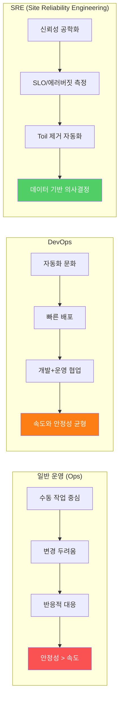
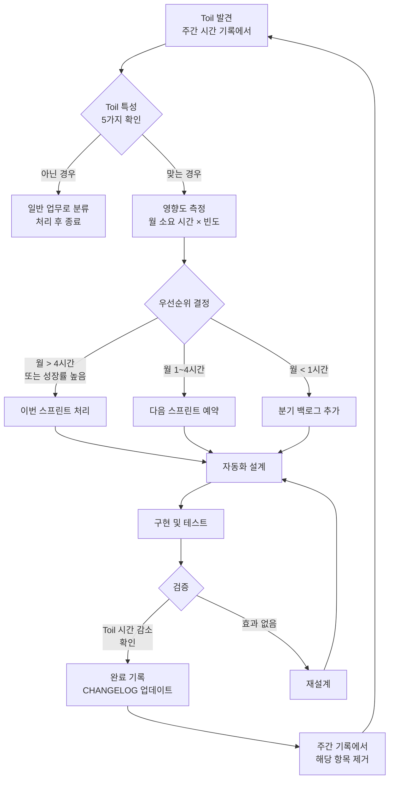
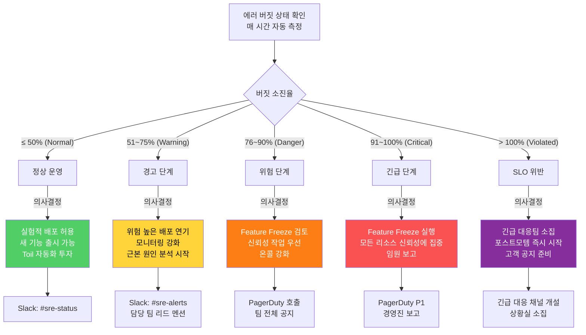
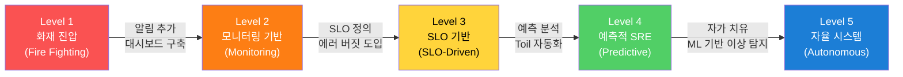

# SRE 고급 실천 — Toil 제거, 용량 계획, 신뢰성 로드맵
> **문서 ID**: MON-SRE-15
> **버전**: 1.0.0 | **작성일**: 2026-04-13 | **작성자**: Implementer (Sonnet)
> **목적**: Google SRE 원칙을 이 프로젝트에 적용하여 신뢰성을 체계적으로 향상시키는 방법을 안내합니다.
> **선행 학습**: [09-sre-practices.md](./09-sre-practices.md), [11-sre-oncall-guide.md](./11-sre-oncall-guide.md)

---

## 목차

1. [SRE vs DevOps vs 일반 운영](#1-sre-vs-devops-vs-일반-운영)
2. [Toil 식별 및 제거](#2-toil-식별-및-제거)
3. [에러 버짓 관리](#3-에러-버짓-관리)
4. [용량 계획](#4-용량-계획)
5. [신뢰성 테스트 자동화](#5-신뢰성-테스트-자동화)
6. [SRE 지표와 팀 문화](#6-sre-지표와-팀-문화)
7. [이 프로젝트 SRE 로드맵](#7-이-프로젝트-sre-로드맵)
8. [변경 이력](#변경-이력)

---

## 1. SRE vs DevOps vs 일반 운영

### 1.1 세 가지 역할이 생겨난 배경

조직의 소프트웨어 운영 방식은 크게 세 단계를 거쳐 발전했습니다.

**일반 운영(Ops/시스템 관리자)** 시대에는 개발팀과 운영팀이 완전히 분리되어 있었습니다. 개발팀은 기능을 만들고, 운영팀은 서버를 관리했습니다. "담장 너머로 소프트웨어를 던진다"는 표현이 이 관계를 잘 묘사합니다. 변경은 느리고 신중했으며, 안정성을 위해 혁신을 희생했습니다.

**DevOps**는 이 담장을 없애려는 문화 운동입니다. 개발자가 직접 배포하고 운영에 참여합니다. CI/CD, 자동화, 협업 도구가 핵심입니다. 그러나 "어떻게 자동화할 것인가"에 집중할 뿐, "얼마나 신뢰할 수 있어야 하는가"에 대한 공학적 답변은 없었습니다.

**SRE(Site Reliability Engineering)**는 Google이 2003년에 시작한 접근법입니다. 핵심 통찰은 "신뢰성은 기능이다(Reliability is a feature)"라는 것입니다. 소프트웨어 엔지니어링 기법으로 운영 문제를 해결합니다. 목표는 완전한 무결함이 아니라, **비즈니스 요구에 맞는 적정 수준의 신뢰성**입니다.

### 1.2 세 가지 역할 비교



| 특성 | 일반 운영 | DevOps | SRE |
|------|-----------|--------|-----|
| 주요 관심사 | 시스템 안정 유지 | 빠른 제품 출시 | 신뢰성 측정 및 최적화 |
| 변경에 대한 태도 | 변경 = 위험 | 변경 = 진보 | 변경 = 에러 버짓으로 관리 |
| 장애 대응 | 수동 처리, 임시방편 | 자동 알림, 빠른 수정 | 근본 원인 제거, 반복 방지 |
| 성공 지표 | 시스템 가동시간 % | 배포 빈도 | SLO 달성률 + 에러 버짓 |
| 토일(Toil) | 당연한 일 | 줄여야 할 것 | 엔지니어링으로 제거해야 할 것 |
| 공공기관 적합성 | 변화 저항으로 비효율 | 속도 강조로 감리 문제 | 신뢰성 증거 기반으로 감리 최적 |

---

## 2. Toil 식별 및 제거

### 2.1 Toil이란 무엇인가

Toil(수고)은 다음 특성을 모두 가진 운영 작업입니다.

**수동적(Manual)**: 사람이 직접 해야 합니다. 스크립트가 있어도 누군가 실행해야 합니다.

**반복적(Repetitive)**: 같은 작업을 여러 번 수행합니다. 오늘 한 번, 내일 또, 다음 주에 또.

**자동화 가능(Automatable)**: 기계가 할 수 있는 작업입니다. 판단이 필요 없고 규칙이 명확합니다.

**전술적(Tactical)**: 장기적 가치 없이 즉각적인 문제만 해결합니다. 근본 원인을 고치지 않습니다.

**성장 비례(O(n) with service growth)**: 서비스가 커질수록 작업량도 비례하여 증가합니다.

Toil이 위험한 이유는 **팀의 엔지니어링 역량을 소진**시키기 때문입니다. Google SRE는 "Toil이 50%를 초과하면 팀이 기능 개발 역량을 잃는다"고 말합니다.

### 2.2 이 프로젝트의 Toil 목록 5가지

**Toil 1 — 배포 승인 수동 처리**

현황: Gitea Actions 파이프라인이 완료된 후 운영자가 수동으로 Argo CD 배포를 승인합니다. 하루 평균 3~5회 반복됩니다.

측정값: 건당 10분 × 일 5회 = 일 50분, 월 약 17시간 소요.

자동화 방법:
```yaml
# .gitea/workflows/auto-deploy.yml
# Design Ref: MON-SRE-15 §2.2

on:
  push:
    branches: [main]

jobs:
  deploy:
    steps:
      - name: Q-Gate 품질 게이트 통과 확인
        run: |
          # G4: 테스트 커버리지 80%+
          npm run test:coverage -- --threshold 80
          # G3: 린트 오류 없음
          npm run lint

      - name: 자동 카나리 배포 트리거 (수동 승인 불필요)
        if: success()
        run: |
          argocd app sync ai-service \
            --revision ${{ github.sha }} \
            --strategy canary
```

---

**Toil 2 — 인증서 수동 갱신**

현황: Linkerd Issuer 인증서 만료 30일 전에 수동으로 갱신합니다. 분기 1회, 회당 2시간 소요.

자동화 방법: cert-manager + 자동 갱신 설정:
```yaml
# k8s/cert-manager/linkerd-issuer.yaml
apiVersion: cert-manager.io/v1
kind: Certificate
metadata:
  name: linkerd-identity-issuer
  namespace: linkerd
spec:
  secretName: linkerd-identity-issuer
  duration: 8760h    # 1년
  renewBefore: 720h  # 만료 30일 전 자동 갱신
  # cert-manager가 자동으로 갱신 — 운영자 개입 불필요
```

---

**Toil 3 — 감사 로그 수동 집계**

현황: `platform/services/security-monitor-service/src/lib/audit.ts`가 기록하는 CSAP D-06 감사 로그를 월말마다 수동으로 집계하여 보고서를 만듭니다. 월 4시간 소요.

자동화 방법:
```typescript
// packages/dora-exporter: DORA 메트릭과 함께 감사 통계 자동 집계
// 월 1회 cron job으로 보고서 자동 생성
```

---

**Toil 4 — SLO 위반 알림 수동 전달**

현황: PagerDuty 알림을 받은 온콜 담당자가 Slack으로 수동으로 관련 팀에 전파합니다. 건당 5분, 월 20건 = 월 1.7시간.

자동화 방법: `packages/slo-escalation/src/escalation-controller.ts`의 `SLOEscalationController`를 활용:
```typescript
// 이미 구현된 자동 에스컬레이션 (FR-SLO.1~6)
// escalation-controller.ts의 notify() 메서드가 Slack/Email 자동 전송
const controller = new SLOEscalationController();
controller.registerPolicy({
  name: 'ai-service-slo',
  service: 'ai-service',
  levels: [
    {
      level: EscalationLevel.Warning,
      budgetBurnRateMin: 50,
      budgetBurnRateMax: 75,
      contacts: [{ name: '온콜 담당자', channel: NotificationChannel.Slack, target: '#sre-alerts' }],
      waitMinutes: 5,
    },
  ],
});
```

---

**Toil 5 — 데이터베이스 디스크 정리**

현황: 감사 로그 테이블이 월 5GB 증가합니다. 매달 운영자가 수동으로 오래된 로그를 아카이브합니다. 월 1시간 소요.

자동화 방법:
```sql
-- 자동 파티셔닝 + 아카이브 크론잡
-- CSAP D-06: 1년 보존 요건을 만족하면서 자동 정리
CREATE OR REPLACE FUNCTION archive_old_audit_logs()
RETURNS void AS $$
BEGIN
  -- 1년 이상 된 로그를 콜드 스토리지 테이블로 이동
  INSERT INTO audit_logs_archive
  SELECT * FROM audit_logs
  WHERE created_at < NOW() - INTERVAL '1 year';

  DELETE FROM audit_logs
  WHERE created_at < NOW() - INTERVAL '1 year';
END;
$$ LANGUAGE plpgsql;

-- pg_cron으로 매월 1일 새벽 2시 자동 실행
SELECT cron.schedule('0 2 1 * *', 'SELECT archive_old_audit_logs()');
```

### 2.3 Toil 측정: 주간 시간 기록

```markdown
# Toil 측정 템플릿 (주간 기록)
# 파일: docs/sre/toil-log/2026-W15.md

| 날짜 | 작업 | 소요 시간 | Toil 여부 | 자동화 가능? |
|------|------|-----------|-----------|-------------|
| 04-13 | 배포 승인 클릭 | 10분 | Y | Y — 자동화 예정 |
| 04-14 | 느린 쿼리 조사 | 45분 | N | N — 분석 작업 |
| 04-15 | 알림 전달 | 5분 | Y | Y — 에스컬레이션 컨트롤러 |

주간 총 시간: 8시간
Toil 시간: 3시간 (37.5%) ← 50% 미만 목표 달성
엔지니어링 시간: 5시간 (62.5%)
```

### 2.4 Toil 제거 프로세스



---

## 3. 에러 버짓 관리

### 3.1 에러 버짓이란

SLO(Service Level Objective)는 서비스가 얼마나 신뢰할 수 있어야 하는지의 목표입니다. 예를 들어 "ai-service의 월간 가용성 99.9%"가 SLO입니다.

에러 버짓(Error Budget)은 **허용된 실패의 총량**입니다.
```
에러 버짓 = 100% - SLO 목표
예시: 99.9% SLO → 에러 버짓 = 0.1% = 월 43.2분
```

이 43.2분 동안은 서비스가 다운되어도 "계획된 허용 범위 내"입니다. 이 43.2분이 소진되면 에러 버짓이 고갈된 것입니다.

에러 버짓의 가장 중요한 역할은 **개발 속도와 신뢰성 사이의 협상 통화**가 된다는 점입니다. 버짓이 충분하면 빠른 배포와 실험이 허용됩니다. 버짓이 고갈되면 신뢰성 회복이 최우선입니다.

### 3.2 에스컬레이션 컨트롤러 코드 분석

`packages/slo-escalation/src/escalation-controller.ts`를 분석하면 에러 버짓 기반 의사결정이 어떻게 자동화되어 있는지 알 수 있습니다.

```typescript
// packages/slo-escalation/src/escalation-controller.ts
// Design Ref: MTU-N178 §3 / Plan SC: FR-SLO.1~6

export enum EscalationLevel {
  Normal   = 'normal',    // 버짓 소진율 ≤ 50%
  Warning  = 'warning',   // 버짓 소진율 51~75%
  Danger   = 'danger',    // 버짓 소진율 76~90%
  Critical = 'critical',  // 버짓 소진율 91~100%
  Violated = 'violated',  // 버짓 소진율 > 100% (SLO 위반)
}

// FR-SLO.1: 에러 버짓 소진율 → 에스컬레이션 단계 매핑
export function determineEscalationLevel(budgetBurnRate: number): EscalationLevel {
  if (budgetBurnRate <= 50)  return EscalationLevel.Normal;
  if (budgetBurnRate <= 75)  return EscalationLevel.Warning;
  if (budgetBurnRate <= 90)  return EscalationLevel.Danger;
  if (budgetBurnRate <= 100) return EscalationLevel.Critical;
  return EscalationLevel.Violated;
}
```

이 함수는 에러 버짓 소진율(budgetBurnRate)에 따라 5단계로 분류합니다. budgetBurnRate는 "현재 소진 속도로 가면 이번 달 버짓을 몇 % 소진하게 될 것인가"를 의미합니다.

```typescript
// FR-SLO.4: 에스컬레이션 실행
async escalate(
  service: string,
  sloName: string,
  budgetBurnRate: number,  // 예: 87 = 버짓의 87% 소진 중
  budgetRemaining: number, // 예: 23 = 이번 달 버짓 23% 남음
): Promise<EscalationEvent> {
  const level = determineEscalationLevel(budgetBurnRate);
  // level에 따라 적절한 팀에 알림 + 자동 행동 트리거
}
```

### 3.3 에러 버짓 상태별 의사결정 매트릭스



### 3.4 에러 버짓 소진 계산 방법

```typescript
// packages/slo-escalation/src/budget-calculator.ts
// Design Ref: MON-SRE-15 §3.4

interface SloConfig {
  target: number;       // 예: 0.999 (99.9%)
  windowDays: number;   // 예: 30 (30일 롤링 윈도우)
}

interface BudgetStatus {
  budgetTotalMinutes: number;    // 총 허용 다운타임 (분)
  budgetUsedMinutes: number;     // 사용한 다운타임 (분)
  budgetRemainingMinutes: number;// 남은 다운타임 (분)
  budgetBurnRate: number;        // 현재 소진율 (0~100+)
  budgetRemaining: number;       // 잔여 버짓 % (0~100)
}

export function calculateBudgetStatus(
  config: SloConfig,
  currentSuccessRate: number,  // 예: 0.9985 (현재 30일 성공률)
  elapsedDays: number,         // 예: 15 (이번 달 경과일)
): BudgetStatus {
  const totalMinutes = config.windowDays * 24 * 60;
  const budgetTotalMinutes = totalMinutes * (1 - config.target);

  // 현재 성공률로 실제 다운타임 계산
  const currentErrorRate = 1 - currentSuccessRate;
  const budgetUsedMinutes = totalMinutes * currentErrorRate;

  const budgetRemainingMinutes = Math.max(0, budgetTotalMinutes - budgetUsedMinutes);

  // 소진율: 현재 소진 속도로 월말까지 버짓의 몇 %를 쓸 것인가
  const dailyBurnRate = budgetUsedMinutes / elapsedDays;
  const projectedMonthlyBurn = dailyBurnRate * config.windowDays;
  const budgetBurnRate = (projectedMonthlyBurn / budgetTotalMinutes) * 100;

  return {
    budgetTotalMinutes,
    budgetUsedMinutes,
    budgetRemainingMinutes,
    budgetBurnRate: Math.min(budgetBurnRate, 200), // 상한 200%
    budgetRemaining: (budgetRemainingMinutes / budgetTotalMinutes) * 100,
  };
}
```

---

## 4. 용량 계획

### 4.1 현재 리소스 사용률 측정

용량 계획의 첫 단계는 현재 상태를 정확히 아는 것입니다.

```bash
# 현재 리소스 사용률 확인
kubectl top pod -n public-saas --sort-by=cpu

# 출력 예시:
# NAME                          CPU(cores)   MEMORY(bytes)
# ai-service-xxx                450m         312Mi
# security-monitor-xxx          120m          89Mi
# compliance-service-xxx         85m          67Mi

# VPA (Vertical Pod Autoscaler) 권고값 확인
kubectl describe vpa -n public-saas ai-service-vpa

# 출력 예시:
# Recommendation:
#   Container Recommendations:
#     Container Name:  ai-service
#       Lower Bound:
#         Cpu:     180m
#         Memory:  220Mi
#       Target:         ← VPA 권고값
#         Cpu:     380m
#         Memory:  290Mi
#       Upper Bound:
#         Cpu:     800m
#         Memory:  512Mi

# HPA 현재 상태
kubectl get hpa -n public-saas

# 출력 예시:
# NAME          REFERENCE          TARGETS         MINPODS   MAXPODS   REPLICAS
# ai-service    Deployment/ai      45%/70%         2         10        3
```

### 4.2 성장 예측: 월 20% 트래픽 증가 시나리오

현재 이 프로젝트의 사용량이 월 20%씩 증가한다고 가정했을 때의 용량 예측입니다.

```
현재 기준 (2026-04-13):
- ai-service: 평균 45 RPS, CPU 450m, Memory 312Mi
- 피크 배율: 3x (점심시간, 업무 마감)

월 20% 성장 예측:

  월   | RPS    | CPU 필요 | 메모리 필요 | 권고 레플리카
-------|--------|----------|-------------|-------------
  현재 |  45    | 450m     | 312Mi       | 3
  +1   |  54    | 540m     | 374Mi       | 3~4
  +2   |  65    | 650m     | 449Mi       | 4~5
  +3   |  78    | 780m     | 539Mi       | 5~6
  +6   | 134    | 1,340m   | 927Mi       | 8~10
  +12  | 408    | 4,080m   | 2.8Gi       | 25~30 (스케일업 필요)
```

### 4.3 선제 스케일링 임계값

```yaml
# k8s/hpa/ai-service-hpa.yaml
# Design Ref: MON-SRE-15 §4.3

apiVersion: autoscaling/v2
kind: HorizontalPodAutoscaler
metadata:
  name: ai-service-hpa
  namespace: public-saas
spec:
  scaleTargetRef:
    apiVersion: apps/v1
    kind: Deployment
    name: ai-service

  minReplicas: 3   # 고가용성: 최소 3개 (가용 영역 분산)
  maxReplicas: 20  # 비용 상한: 최대 20개

  metrics:
    # CPU 임계값: 70% → 스케일 아웃 시작
    # (INFRA 권고: 70%에서 스케일링하면 90%에 도달 전에 처리 가능)
    - type: Resource
      resource:
        name: cpu
        target:
          type: Utilization
          averageUtilization: 70  # 70% 초과 시 스케일 아웃

    # 메모리 임계값: 75%
    - type: Resource
      resource:
        name: memory
        target:
          type: Utilization
          averageUtilization: 75

    # 커스텀 메트릭: RPS 기반 스케일링
    - type: Pods
      pods:
        metric:
          name: http_requests_per_second
        target:
          type: AverageValue
          averageValue: "30"  # Pod당 30 RPS 초과 시 스케일 아웃

  behavior:
    scaleUp:
      stabilizationWindowSeconds: 60   # 1분 안정화 후 스케일 업
      policies:
        - type: Pods
          value: 2       # 한 번에 최대 2개씩 추가
          periodSeconds: 60
    scaleDown:
      stabilizationWindowSeconds: 300  # 5분 안정화 후 스케일 다운 (트래픽 급감 대비)
      policies:
        - type: Pods
          value: 1       # 한 번에 최대 1개씩 제거
          periodSeconds: 120
```

### 4.4 CPU/Memory 여유 마진 기준

```
용량 계획 마진 가이드라인:

일반 워크로드 (ai-service 일반 API):
  경보 임계값: CPU 70%, Memory 75%
  여유 마진: 30%/25% (예상치 못한 급증 대응)

LLM 추론 워크로드 (ai-service /ai/chat):
  경보 임계값: CPU 60%, Memory 70%
  여유 마진: 40%/30% (LLM 추론은 순간 급증 심함)

스테이트풀 워크로드 (DB, Redis):
  경보 임계값: CPU 60%, Memory 80%, Disk 70%
  여유 마진: 40%/20%/30%

피크 타임 고려:
  - 오전 9~11시: 업무 시작 (평소 2x)
  - 점심 12~13시: 민원 처리 피크 (평소 3x)
  - 오후 17~18시: 마감 처리 (평소 2.5x)
  → 피크 배율 3x를 기준으로 용량 계획
```

### 4.5 용량 부족 조기 경보

```yaml
# k8s/monitoring/capacity-alerts.yaml
# Design Ref: MON-SRE-15 §4.5

groups:
  - name: capacity-planning
    rules:
      # CPU 70% 초과 → 경고
      - alert: PodCpuUsageHigh
        expr: |
          avg(rate(container_cpu_usage_seconds_total{
            namespace="public-saas",
            container!="linkerd-proxy"
          }[5m])) by (pod, container) /
          avg(kube_pod_container_resource_limits{
            namespace="public-saas",
            resource="cpu"
          }) by (pod, container) > 0.70
        for: 10m
        labels:
          severity: warning
        annotations:
          summary: "{{ $labels.pod }}/{{ $labels.container }} CPU 70% 초과"
          description: "현재 사용률: {{ $value | humanizePercentage }}"

      # HPA 최대 레플리카 80% 도달 → 스케일업 계획 필요
      - alert: HpaReplicasNearMaximum
        expr: |
          kube_horizontalpodautoscaler_status_current_replicas /
          kube_horizontalpodautoscaler_spec_max_replicas > 0.80
        for: 30m
        labels:
          severity: warning
        annotations:
          summary: "{{ $labels.horizontalpodautoscaler }} HPA 레플리카 상한 80% 근접"
          description: "maxReplicas 증가 또는 노드 추가 검토 필요"
```

---

## 5. 신뢰성 테스트 자동화

### 5.1 게임데이(Game Day) 계획 수립

게임데이는 의도적으로 장애를 발생시켜 시스템의 복원력과 팀의 대응 능력을 검증하는 훈련입니다. "평화 시에 전쟁 훈련을 하지 않으면, 전쟁 시에 처음 경험하게 됩니다."

```markdown
# 게임데이 계획서 템플릿
# Design Ref: MON-SRE-15 §5.1

## 게임데이: ai-service 장애 시나리오
**일시**: 2026-05-15 14:00~17:00 (업무 시간 중 저트래픽 시간대)
**참여자**: SRE 팀 2명, ai-service 개발팀 1명, 관리자 1명

### 시나리오 목록

| 번호 | 시나리오 | 목표 MTTR | 영향 범위 |
|------|---------|-----------|---------|
| S-01 | ai-service Pod 1개 강제 종료 | < 30초 | 트래픽 일시 증가 |
| S-02 | ai-service 메모리 OOM 강제 유발 | < 2분 | 서비스 재시작 |
| S-03 | LLM 서버 응답 지연 주입 (5초) | < 5분 | 타임아웃 발생 |
| S-04 | 데이터베이스 연결 차단 | < 10분 | Circuit Breaker 동작 |
| S-05 | mTLS 인증서 강제 만료 시뮬레이션 | < 15분 | 서비스 간 통신 중단 |

### 측정 항목

- MTTR (Mean Time To Restore): 장애 발생 → 정상 복구 시간
- 알림 발생 시간: 장애 발생 → Prometheus 알림 발송 시간
- 온콜 응답 시간: 알림 발송 → 담당자 확인 시간
- 고객 영향: 장애 중 실패 요청 수
```

### 5.2 자동화된 부하 테스트 (k6 스케줄)

```javascript
// tests/load/ai-service-soak-test.js
// Design Ref: MON-SRE-15 §5.2

import http from 'k6/http';
import { check, sleep } from 'k6';
import { Rate, Trend } from 'k6/metrics';

// 커스텀 메트릭
const errorRate = new Rate('error_rate');
const ragLatency = new Trend('rag_query_latency_ms');

// 부하 테스트 시나리오
export const options = {
  scenarios: {
    // 일반 부하: 30분 동안 50 VU (가상 사용자)
    normal_load: {
      executor: 'constant-vus',
      vus: 50,
      duration: '30m',
    },

    // 피크 부하: 5분 동안 150 VU (점심 피크 시뮬레이션)
    peak_load: {
      executor: 'constant-vus',
      vus: 150,
      duration: '5m',
      startTime: '30m',  // 30분 후 시작
    },

    // 회복 테스트: 피크 후 정상 회복 확인
    recovery: {
      executor: 'constant-vus',
      vus: 30,
      duration: '15m',
      startTime: '35m',
    },
  },

  // 합격 기준
  thresholds: {
    'error_rate':                   ['rate<0.01'],   // 에러율 1% 미만
    'http_req_duration{p:99}':      ['p(99)<2000'],  // p99 2초 미만
    'rag_query_latency_ms{p:95}':   ['p(95)<5000'],  // RAG p95 5초 미만
  },
};

export default function () {
  // 일반 채팅 API
  const chatResponse = http.post(
    'http://ai-service.public-saas:3003/ai/chat',
    JSON.stringify({
      modelId: 'test-model',
      tenantId: '550e8400-e29b-41d4-a716-446655440000',
      message: '공공기관 SaaS 보안 요건에 대해 설명해주세요',
      grade: 'O',
    }),
    {
      headers: {
        'Content-Type': 'application/json',
        'x-internal-service-key': __ENV.INTERNAL_KEY,
      },
      timeout: '35s',
    },
  );

  check(chatResponse, {
    '상태 코드 200': (r) => r.status === 200,
    '응답 시간 30초 미만': (r) => r.timings.duration < 30000,
  });

  errorRate.add(chatResponse.status !== 200);

  // RAG 쿼리 API (10% 비율)
  if (Math.random() < 0.1) {
    const ragStart = Date.now();
    const ragResponse = http.post(
      'http://ai-service.public-saas:3003/ai/rag/query',
      JSON.stringify({
        tenantId: '550e8400-e29b-41d4-a716-446655440000',
        grade: 'O',
        question: 'CSAP 보안 인증 절차는 어떻게 됩니까?',
      }),
      { timeout: '65s' },
    );
    ragLatency.add(Date.now() - ragStart);
  }

  sleep(1);
}
```

```yaml
# .gitea/workflows/weekly-load-test.yml
# 매주 월요일 새벽 2시 자동 부하 테스트

on:
  schedule:
    - cron: '0 2 * * 1'  # 매주 월요일 02:00

jobs:
  load-test:
    runs-on: ubuntu-latest
    steps:
      - uses: actions/checkout@v4
      - name: k6 부하 테스트 실행
        uses: grafana/k6-action@v0.3.0
        with:
          filename: tests/load/ai-service-soak-test.js
        env:
          INTERNAL_KEY: ${{ secrets.INTERNAL_SERVICE_KEY }}

      - name: 결과 Slack 전송
        if: always()
        run: |
          curl -X POST "${{ secrets.SLACK_WEBHOOK_URL }}" \
            -d '{"text":"주간 부하 테스트 완료: ${{ job.status }}"}'
```

### 5.3 복구 시간 측정 자동화 (MTTR 추적)

```typescript
// packages/slo-escalation/src/mttr-tracker.ts
// Design Ref: MON-SRE-15 §5.3
// Plan SC: FR-SLO.5

interface IncidentRecord {
  id: string;
  service: string;
  startedAt: string;
  detectedAt?: string;   // 알림 발생 시각
  respondedAt?: string;  // 담당자 확인 시각
  resolvedAt?: string;   // 서비스 정상 복구 시각
}

export class MttrTracker {
  private incidents: Map<string, IncidentRecord> = new Map();

  /**
   * MTTR 자동 계산
   * Prometheus 알림 → 복구 감지 → 시간 차이 기록
   */
  calculateMttr(incidents: IncidentRecord[]): {
    meanTimeToDetect: number;    // 평균 탐지 시간 (분)
    meanTimeToRespond: number;   // 평균 응답 시간 (분)
    meanTimeToRestore: number;   // 평균 복구 시간 (분)
    sampleSize: number;
  } {
    const resolved = incidents.filter((i) => i.resolvedAt);

    const ttds = resolved
      .filter((i) => i.detectedAt)
      .map((i) => (new Date(i.detectedAt!).getTime() - new Date(i.startedAt).getTime()) / 60000);

    const ttrps = resolved
      .filter((i) => i.respondedAt && i.detectedAt)
      .map((i) => (new Date(i.respondedAt!).getTime() - new Date(i.detectedAt!).getTime()) / 60000);

    const ttrs = resolved.map(
      (i) => (new Date(i.resolvedAt!).getTime() - new Date(i.startedAt).getTime()) / 60000,
    );

    const avg = (arr: number[]) => arr.reduce((a, b) => a + b, 0) / arr.length;

    return {
      meanTimeToDetect:  avg(ttds),
      meanTimeToRespond: avg(ttrps),
      meanTimeToRestore: avg(ttrs),
      sampleSize:        resolved.length,
    };
  }
}
```

---

## 6. SRE 지표와 팀 문화

### 6.1 SRE 팀 성숙도 모델 (Level 1~5)



| 레벨 | 특성 | 핵심 활동 | 이 프로젝트 현황 |
|------|------|-----------|----------------|
| L1 — 화재 진압 | 장애 = 서프라이즈, 수동 대응 | 알림 없음, Runbook 없음 | 완료 (극복) |
| L2 — 모니터링 기반 | 알림이 있지만 너무 많음, 반응적 | Prometheus + Grafana 구축 | 완료 |
| L3 — SLO 기반 | SLO 측정, 에러 버짓으로 의사결정 | SLO 정의, 에러 버짓 추적 | 진행 중 (80%) |
| L4 — 예측적 | Toil < 20%, 장애 예측 | ML 기반 이상 탐지, 자동 Toil 제거 | 계획 (2026 Q3) |
| L5 — 자율 시스템 | 자가 치유, 사람 개입 최소화 | 자율 복구, 용량 자동 조정 | 장기 목표 |

### 6.2 온콜 부담 줄이기

```markdown
# 온콜 건강한 문화 가이드
# Design Ref: MON-SRE-15 §6.2

## 온콜 경보 품질 기준 (알림 피로 방지)

경보가 발생하면 즉시 확인해야 할 세 가지:

1. 실행 가능한가? (Actionable)
   → "조사해 보세요"가 아닌 "이 명령을 실행하세요"
   → 모든 경보에 Runbook URL 필수

2. 긴급한가? (Urgent)
   → 비즈니스에 즉각적 영향이 있는가?
   → "나중에 확인해도 되는 것"은 경보 아닌 티켓으로

3. 정확한가? (Accurate)
   → 오탐(False Positive)률 < 5%
   → 오탐이 많으면 경보 무감각 발생 → SLO 위반 놓침

## 온콜 로테이션 건강 지표

측정 목표:
- 주당 온콜 경보 < 5건 (야간 포함)
- 오탐률 < 10%
- 온콜 담당자 수면 방해 < 주 2회

측정 방법:
  PagerDuty 주간 보고서 → 자동으로 #sre-weekly 채널에 게시
```

### 6.3 Post-Mortem 문화 정착

```markdown
# Post-Mortem 템플릿
# 파일: docs/sre/postmortems/YYYY-MM-DD-incident-name.md

## 요약 (5줄 이내)
[날짜] [서비스명]에서 [증상]이 발생하여 [영향]이 있었습니다.
원인: [근본 원인 1줄].
복구까지 [X분] 소요.

## 타임라인 (시각 + 행동 + 담당자)
| 시각 | 이벤트 | 담당자 |
|------|--------|--------|
| 14:23 | ai-service 응답 시간 급증 탐지 | Prometheus 알림 |
| 14:25 | 온콜 담당자 PagerDuty 확인 | 홍길동 |
| 14:31 | LLM 서버 연결 실패 원인 파악 | 홍길동 |
| 14:45 | 페일오버 설정 → 정상 복구 | 홍길동, 이순신 |

## 근본 원인 분석 (5 Why)
1. 왜 서비스가 중단되었는가? → LLM 서버 연결 시간 초과
2. 왜 LLM 서버가 응답하지 않았는가? → 메모리 OOM으로 강제 종료
3. 왜 메모리가 부족했는가? → 대형 컨텍스트 요청 배치 처리
4. 왜 배치 처리가 급증했는가? → 새 기능 배포 후 예상치 못한 패턴
5. 왜 사전에 감지하지 못했는가? → 메모리 사용량 경보 임계값 누락

## 행동 항목 (개선 조치)
| 항목 | 담당자 | 기한 | 우선순위 |
|------|--------|------|---------|
| LLM 서버 메모리 경보 추가 | 김철수 | 04-20 | P1 |
| 대형 컨텍스트 요청 제한 추가 | 이영희 | 04-30 | P1 |
| 페일오버 Runbook 업데이트 | 홍길동 | 05-07 | P2 |

## 핵심 교훈
- 비난 없음 (Blameless): 시스템과 프로세스의 문제, 개인의 실수 아님
- 재발 방지에 집중: 이미 일어난 일보다 앞으로 막을 방법에 투자
```

---

## 7. 이 프로젝트 SRE 로드맵

### 7.1 현재 수준 평가

```
평가 기준일: 2026-04-13

SRE 성숙도 레벨: 2.8 / 5 (L2~L3 사이)

항목별 평가:
┌──────────────────────────────┬──────┬────────────────────────────┐
│ 영역                          │ 점수 │ 근거                        │
├──────────────────────────────┼──────┼────────────────────────────┤
│ 모니터링 인프라                 │  4/5 │ Prometheus+Grafana+Linkerd  │
│ SLO 정의 및 측정               │  3/5 │ 일부 서비스만 정의됨         │
│ 에러 버짓 관리                  │  3/5 │ 측정은 되나 의사결정 미적용   │
│ 에스컬레이션 자동화              │  4/5 │ SLOEscalationController 완성 │
│ Toil 제거                      │  2/5 │ 식별은 됐으나 자동화 초기     │
│ 온콜 프로세스                   │  3/5 │ Runbook 일부 완성           │
│ Post-Mortem 문화               │  2/5 │ 템플릿만 존재, 습관 미정착   │
│ 용량 계획                      │  3/5 │ HPA 설정됨, 예측 모델 없음  │
│ 신뢰성 테스트                   │  2/5 │ 부하 테스트 간헐적으로만     │
│ 자동화 (Toil < 20%)            │  2/5 │ Toil 50% 수준으로 추정      │
├──────────────────────────────┼──────┼────────────────────────────┤
│ 종합 점수                      │ 28/50│ 56% (L2~L3 경계)           │
└──────────────────────────────┴──────┴────────────────────────────┘
```

### 7.2 3개월 개선 목표 (2026-05 ~ 2026-07)

```
목표: SRE 성숙도 L3 달성 (SLO 기반 운영 완성)

Sprint 1 (4월): SLO 전면 도입
- 모든 서비스(ai, security-monitor, compliance)에 SLO 정의
- 에러 버짓 대시보드 Grafana 구축
- SLOEscalationController를 모든 서비스에 연동
  → 성공 지표: 에러 버짓 소진율 자동 측정 및 알림

Sprint 2 (5월): Toil 자동화 집중
- 배포 승인 자동화 (수동 클릭 제거)
- 인증서 갱신 자동화 (cert-manager)
- 감사 로그 집계 자동화
  → 성공 지표: Toil 시간 50% → 30% 감소

Sprint 3 (6월): 신뢰성 테스트 체계화
- 주간 자동 부하 테스트 파이프라인 구축
- 게임데이 최초 실행 (5개 시나리오)
- MTTR 자동 측정 시스템 구축
  → 성공 지표: MTTR < 30분, 자동 측정 완성
```

### 7.3 6개월 개선 목표 (2026-08 ~ 2026-10)

```
목표: SRE 성숙도 L4 진입 (예측적 SRE 시작)

분기 1 (8~9월): 예측 분석 도입
- ai-service 트래픽 예측 모델 구축 (Prometheus + Prophet)
- 선제적 스케일링 자동화 (피크 30분 전 스케일 아웃)
- 이상 탐지 ML 모델 도입
  → 성공 지표: 용량 부족 사전 탐지율 80%+

분기 2 (10월): 자율화 첫 단계
- 특정 장애 유형 자동 복구 Runbook 실행
  (예: OOM → 자동 재시작 + 알림 → 담당자 확인)
- 에러 버짓 기반 Feature Freeze 자동 제안
- Toil 시간 목표: 20% 이하 달성
  → 성공 지표: 온콜 경보 50% 감소, 자동 복구 건수 증가

핵심 CSAP 연계 목표:
- SRE 지표를 CSAP D-07 가용성 관리 증거로 자동 생성
- 에러 버짓 보고서를 월간 감리 자료로 활용
- Toil 제거 기록을 운영 효율화 증거로 제출
```

---

## 변경 이력

| 버전 | 일자 | 내용 | 작성자 |
|------|------|------|--------|
| 1.0.0 | 2026-04-13 | 최초 작성 — SRE 고급 실천 완전 가이드 | Implementer (Sonnet) |
