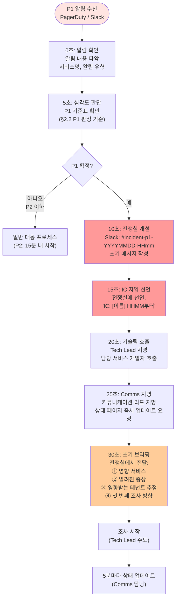
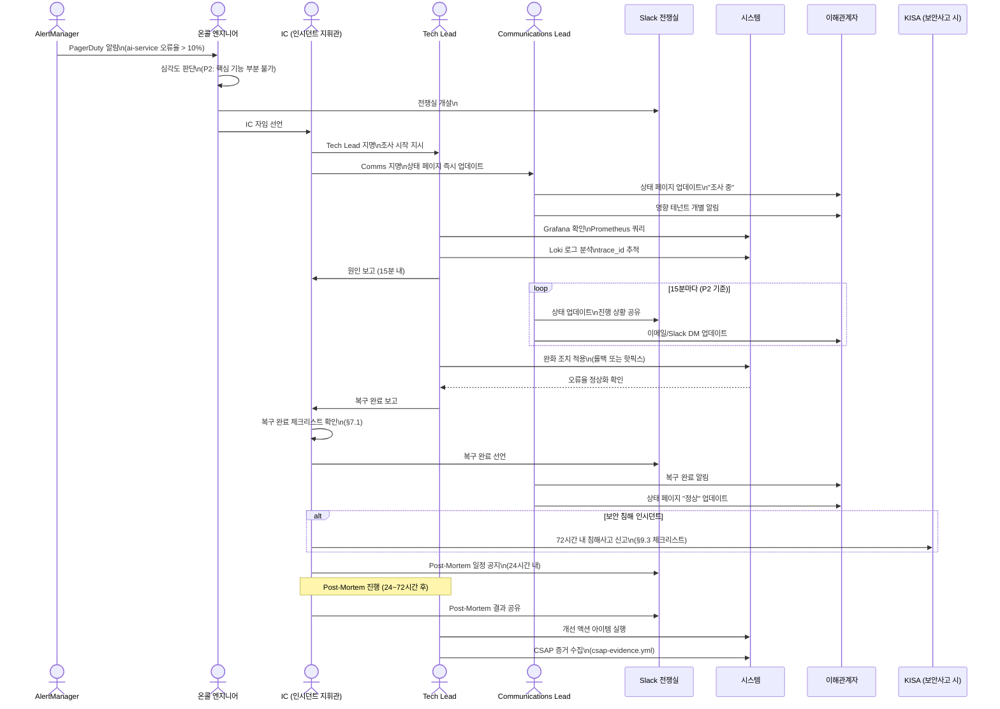

# 인시던트 커맨드 시스템 — P1 대응 체계, 전쟁실 운영, Post-Mortem

> **대상 독자**: 공공기관 SaaS 프레임워크 온콜 엔지니어, SRE, 운영 담당자
> **작성일**: 2026-04-13
> **관련 CSAP 통제항목**: D-06(침해사고 관리 — 72시간 보고 의무), D-07(가용성 관리)
> **관련 소스**: `packages/slo-escalation/src/escalation-controller.ts`
> **관련 Plan**: MTU-N178(SLO 에스컬레이션), MTU-N252(AIOps RCA)

---

## 목차

1. [인시던트 커맨드란?](#1-인시던트-커맨드란)
2. [심각도 분류 (P1~P4)](#2-심각도-분류-p1p4-상세-기준)
3. [인시던트 커맨드 체계](#3-인시던트-커맨드-체계)
4. [P1 대응 30초 프로토콜](#4-p1-대응-30초-프로토콜)
5. [전쟁실 운영](#5-전쟁실-운영)
6. [SLO 에스컬레이션 자동화](#6-slo-에스컬레이션-자동화-실제-코드-기반)
7. [복구 완료 선언 기준](#7-복구-완료-선언-기준)
8. [Post-Mortem 작성](#8-post-mortem-작성-템플릿--예시)
9. [CSAP D-06: 72시간 보고 의무](#9-csap-d-06-72시간-보고-의무)
10. [실습: P2 인시던트 시뮬레이션](#10-실습-p2-인시던트-시뮬레이션)

---

## 1. 인시던트 커맨드란?

### 1.1 인시던트의 정의 — 장애와의 차이

초급자들이 가장 많이 혼동하는 개념이 '장애'와 '인시던트'의 차이입니다.

**장애(Failure)**는 시스템의 기술적 문제 자체를 의미합니다. "서버가 다운되었다", "DB 쿼리가 느려졌다"와 같이 시스템 내부의 이상 상태입니다.

**인시던트(Incident)**는 장애가 사용자에게 영향을 미치는 상황입니다. 단일 서버가 다운되더라도 자동 페일오버로 사용자에게 영향이 없으면 인시던트가 아닙니다. 반대로 기술적 장애가 없어도 사용자 경험이 현저히 저하되면 인시던트입니다.

| 구분 | 장애 | 인시던트 |
|------|------|---------|
| 정의 | 시스템 내부 기술적 문제 | 사용자 영향이 있는 상황 |
| 예시 | Pod 재시작 (자동 복구) | 사용자 로그인 불가 |
| 대응 | 자동 복구 메커니즘 | 인간의 즉각적 개입 필요 |
| 기록 | 시스템 이벤트 로그 | 인시던트 보고서 필수 |

**인시던트 커맨드 시스템(ICS)**은 미국 소방청에서 화재 대응 체계로 개발된 표준 지휘 체계를 소프트웨어 운영에 적용한 것입니다. 핵심은 혼란한 상황에서 **명확한 역할 분담**과 **단일 지휘 체계**를 통해 효율적으로 대응하는 것입니다.

소방서 화재 대응과 비유하면:
- **소방서장 (Incident Commander)**: 전체 대응 지휘, 최종 결정
- **진화 팀장 (Tech Lead)**: 실제 화재 진압 (기술적 해결)
- **구조 팀장 (Communications Lead)**: 시민 대피, 상황 전파 (이해관계자 소통)

### 1.2 공공기관 SaaS에서 인시던트의 특수성

공공기관 SaaS는 일반 B2C 서비스와 다른 특수한 인시던트 맥락을 가집니다.

**복수의 이해관계자**
- 서비스 이용 공무원 (수백~수천 명)
- 각 기관 정보화 담당자 (즉각 보고 요구)
- CSAP 인증기관 (보안 사고 72시간 내 보고 의무)
- 행정안전부 (정보시스템 가용성 보고)
- 감사원 (감사 대비 증거 자료 보존)

**데이터 민감성**
- 공공 데이터 유출 시 개인정보보호법 위반
- N2SF C/S 등급 데이터 침해 시 형사 책임
- 감사 로그 무결성 훼손 시 감리 결함

**시간 압박**
- CSAP D-06: 보안 침해 사고 72시간 내 KISA 보고 의무
- 공무원 업무 시간(09:00~18:00) 내 복구 필수
- 언론 보도 전 선제 대응 (공공기관 이미지 관리)

**규제 대응**
- 모든 인시던트 기록 의무 (감리 대비)
- Post-Mortem 보고서 작성 및 보존 (1년+)
- 재발 방지 조치 증거 제출 의무

### 1.3 인시던트 커맨드 시스템의 목적

ICS의 목적은 단순히 "빠르게 고치기"가 아닙니다. 다음 4가지를 동시에 달성하는 것입니다.

1. **빠른 복구**: 서비스를 최대한 빨리 정상화
2. **명확한 소통**: 이해관계자에게 정확한 정보 전달
3. **증거 보존**: 감사/조사를 위한 타임라인 기록
4. **재발 방지**: 원인 분석 및 구조적 개선

---

## 2. 심각도 분류 (P1~P4) 상세 기준

### 2.1 심각도 분류 체계

심각도 분류는 인시던트 대응의 첫 번째 단계이자 가장 중요한 판단입니다. 잘못 분류하면 과소 대응(P1을 P3로 처리)하거나 과잉 대응(P4를 P1으로 처리)하여 팀을 소진시킵니다.

| 심각도 | 이름 | 사용자 영향 | 대응 시작 | 복구 목표(RTO) | 보고 주기 |
|--------|------|-------------|-----------|----------------|-----------|
| **P1** | Critical | 서비스 전체 불가 / 데이터 유출 | **즉시** (온콜 호출) | 1시간 이내 | 5분마다 |
| **P2** | High | 핵심 기능 부분 불가 (20% 이상 사용자) | 15분 이내 | 4시간 이내 | 15분마다 |
| **P3** | Medium | 비핵심 기능 저하 (일부 사용자) | 근무 시간 내 | 24시간 이내 | 1시간마다 |
| **P4** | Low | 경미한 문제 (사용자 영향 미미) | 다음 스프린트 | 1주일 이내 | 일일 요약 |

### 2.2 P1 — Critical (가장 높은 심각도)

**P1 판정 기준 (하나라도 해당 시 P1)**:

```
□ 서비스 전체 불가 (전체 사용자 로그인/접근 불가)
□ 데이터 유출 또는 침해 의심
□ 데이터 손실 또는 손상 (백업 포함)
□ 서비스 가용성 SLA 위반 (누적 다운타임이 월 SLA 한도 초과)
□ 보안 취약점 악용 (공격 진행 중)
□ N2SF C/S 등급 데이터 무단 접근 감지
□ 감사 로그 무결성 침해
□ 핵심 테넌트(정부 핵심 기관) 전체 서비스 불가
```

**P1 에러 버짓 기준**: SLO 에스컬레이션 컨트롤러에서 `budgetBurnRate > 100` (SLO 위반 상태)

**P1 자동 트리거 조건 (AlertManager)**:
```yaml
# 다음 알림 중 하나라도 발생 시 P1 자동 판정
- alert: ServiceCompletelyDown         # 전체 서비스 다운
- alert: DataExfiltrationDetected      # 데이터 유출 감지
- alert: SLOViolated                   # SLO 위반 (Violated 레벨)
- alert: AuditLogIntegrityBreach       # 감사 로그 무결성 침해
- alert: N2SFClassifiedDataExposure    # C/S 등급 데이터 노출
```

### 2.3 P2 — High

**P2 판정 기준**:
```
□ 핵심 기능의 부분적 불가 (AI 분석, 보고서 생성 등)
□ 전체 사용자 중 20% 이상에게 오류 발생
□ 응답 시간이 SLO 기준의 5배 이상 (예: 기준 2초 → 10초 이상)
□ 특정 테넌트 그룹 전체 서비스 불가
□ 배치 작업 전체 실패 (일일 보고서 미생성 등)
□ 에러 버짓 소진율 90~100% (Danger/Critical 레벨)
```

### 2.4 P3 — Medium

**P3 판정 기준**:
```
□ 비핵심 기능 저하 (통계 대시보드 느림, 엑스포트 실패 등)
□ 일부 사용자(20% 미만)에게 오류 발생
□ 단일 테넌트 기능 이상
□ 성능 저하 (SLO 이하이지만 심각하지 않은 수준)
□ 에러 버짓 소진율 75~90% (Danger 레벨)
```

### 2.5 P4 — Low

**P4 판정 기준**:
```
□ 경미한 UI 버그 (사용성 저하, 기능 불가 아님)
□ 문서/안내 오류
□ 개발/테스트 환경 이슈
□ 에러 버짓 소진율 50~75% (Warning 레벨)
□ 미래 인시던트를 예방하는 예방적 조치 필요
```

---

## 3. 인시던트 커맨드 체계

### 3.1 역할별 책임 정의

#### Incident Commander (IC) — 인시던트 지휘관

IC는 인시던트 대응의 총책임자입니다. **기술적 문제를 직접 해결하지 않습니다.** 대신 전체 대응을 조율하고 중요한 결정을 내립니다.

**IC의 책임**:
- 인시던트 심각도 최종 확정
- 대응 팀 구성 및 역할 배정
- 롤백 결정 권한 (기술팀의 권고를 듣고 최종 결정)
- 이해관계자 보고 승인
- 전쟁실 개설 및 종료 선언
- 복구 완료 선언
- Post-Mortem 작성 지시

**IC가 되는 조건**:
- 온콜 당번 (1차 IC)
- 시니어 엔지니어 이상 (P1 기준)
- 당일 온콜 팀장 (P1 30분 내 교체 없을 시)

**IC 교대 규칙**:
- P1: 2시간마다 강제 교대 (피로 누적 방지)
- P2: 4시간마다 교대 권장
- 교대 시 현재 상황, 진행 중인 작업, 다음 예상 단계를 5분 내 브리핑

#### Communications Lead (Comms) — 커뮤니케이션 리드

Comms는 기술팀과 외부 이해관계자 사이의 소통 창구입니다.

**Comms의 책임**:
- 5분마다(P1) / 15분마다(P2) 상황 업데이트 작성
- 상태 페이지(Status Page) 업데이트
- 영향받는 테넌트 담당자에게 개별 연락
- 경영진/감독기관 보고서 작성 지원
- 인시던트 타임라인 기록 (모든 발생 이벤트 시각과 함께)
- 외부 언론 문의 대응 (공식 답변만, 기술적 세부사항 공개 금지)

**Comms가 절대 하지 말아야 할 것**:
- 원인이 확인되지 않은 정보 공개 ("아마도 DB 문제인 것 같습니다"는 금지)
- RTO를 확정적으로 약속 ("30분 내 해결됩니다"는 금지)
- 비난성 발언 (외부에 "개발자 실수로 인해"는 금지)

#### Tech Lead — 기술 리드

Tech Lead는 실제 기술적 해결을 담당합니다.

**Tech Lead의 책임**:
- 근본 원인 분석 (RCA)
- 해결 방안 수립 및 실행
- 임시 완화 조치(Mitigation) 적용
- 코드/설정 변경 실행
- 롤백 실행 (IC 승인 후)
- 기술적 진행 상황을 IC에게 5분마다 보고

**Tech Lead 팀 구성 (P1 기준)**:
- 담당 서비스 개발자 (1~2명)
- 인프라/SRE 엔지니어 (1명)
- 데이터베이스 담당자 (DB 이슈 시)
- 보안 담당자 (보안 인시던트 시)

### 3.2 교대 체계

```
교대 준비 (10분 전):
  ┌─ 현재 IC가 다음 IC에게 브리핑 준비
  │  ├─ 현재 상황 요약 (2분)
  │  ├─ 진행 중인 작업 (3분)
  │  ├─ 다음 단계 계획 (2분)
  │  └─ 주요 연락처 확인 (1분)
  └─ 전쟁실에서 공개 교대 선언
     "IC 교대: [기존 IC] → [신규 IC]. 교대 시각: HH:MM"
```

---

## 4. P1 대응 30초 프로토콜

### 4.1 P1 인시던트 첫 30초 행동

P1 알림을 받은 온콜 엔지니어는 다음 순서를 정확히 따릅니다.



### 4.2 전쟁실 초기 메시지 템플릿

전쟁실 개설 즉시 다음 형식으로 첫 메시지를 작성합니다.

```
=== P1 인시던트 개시 ===
시작 시각: 2026-04-13 14:32 KST
IC: 홍길동 (@honggd)
Tech Lead: 김철수 (@kimcs)
Comms: 이영희 (@leeyh)

[현재 파악된 상황]
- 영향 서비스: ai-service (전체 오류)
- 증상: /api/v1/ai/analyze 엔드포인트 500 오류
- 영향 추정: 전체 테넌트 AI 분석 기능 불가
- 오류율: 100% (마지막 5분)
- 발견 경로: AlertManager → PagerDuty → 온콜

[다음 단계]
- Tech Lead: 즉시 Grafana 확인, 최근 배포 이력 확인
- Comms: 상태 페이지 업데이트 (5분 내)

[다음 업데이트]
- 5분 후 (14:37 KST)

#incident-p1-20260413-1432
```

---

## 5. 전쟁실 운영

### 5.1 Slack 채널 구성

공공기관 SaaS 인시던트 전쟁실은 Slack을 기반으로 운영됩니다.

**채널 명명 규칙**:
```
#incident-p1-YYYYMMDD-HHMM    (P1 전용)
#incident-p2-YYYYMMDD-HHMM    (P2 전용)
#incident-general              (P3/P4, 일반 이슈 논의)
```

**필수 채널 설정**:
1. 채널 생성 즉시 주제(Topic) 설정: `P1 인시던트 | IC: @홍길동 | 상태: 조사 중`
2. 핀메시지: 인시던트 초기 메시지 고정
3. 채널 보관: 인시던트 종료 후 **삭제 금지** (감사 증거 보존 CSAP D-06)

**채널 참여자 제한 (P1)**:
- IC, Tech Lead, Comms (필수)
- 관련 서비스 담당자 (필요 시 호출)
- 경영진 (P1 30분 이상 시 자동 알림)
- 관련 없는 사람의 채널 참여는 Comms가 관리

### 5.2 상황판 (Timeline, Owner, Status)

전쟁실 상황판은 모든 참여자가 현재 상황을 한눈에 파악할 수 있도록 유지합니다.

```
=== 상황판 (5분마다 갱신) ===
최종 갱신: 14:45 KST | 인시던트 경과: 13분

[상태] 조사 중 → 원인 파악 완료 → [완화 작업 중] → 복구 완료

[타임라인]
14:32  | 알림 수신, 전쟁실 개설, IC 지명
14:35  | Comms: 상태 페이지 업데이트 (조사 중)
14:38  | Tech Lead: ai-service Pod 전체 CrashLoopBackOff 확인
14:40  | Tech Lead: 최근 배포 이력 확인 — v2.1.0 14:25 배포
14:43  | Tech Lead: 롤백 권고 (v2.0.0으로)
14:44  | IC: 롤백 승인

[현재 작업]
Owner: 김철수(Tech Lead)
작업: kubectl rollout undo deployment/ai-service 실행 중
예상 완료: 14:48 KST

[영향 현황]
- 영향 서비스: ai-service
- 영향 테넌트: 전체 (약 150개 테넌트)
- 영향 사용자: 추정 3,000명
- 오류율: 100% → 현재 롤백 진행 중

[다음 업데이트]
14:50 KST (또는 상황 변화 시 즉시)
```

### 5.3 5분마다 상태 공유 (Comms 책임)

Comms는 5분마다(P1) 다음 형식으로 상태를 업데이트합니다.

```bash
# 타임스탬프는 정확하게 기록 (초 단위)
date +"%Y-%m-%d %H:%M:%S KST"
```

**상태 업데이트 형식**:
```
[14:50 업데이트 — P1 인시던트 18분 경과]

상태: 롤백 진행 중 (60% 완료)
최근 조치: kubectl rollout undo 실행 → 4개 Pod 중 2개 교체 완료
다음 조치: 나머지 2개 Pod 교체 완료 대기
예상 복구: 14:55 KST (5분 내)

사용자 영향: 현재도 전체 오류 (롤백 완료 후 정상화 예상)

상태 페이지: https://status.saas.go.kr (업데이트됨)
다음 업데이트: 14:55 KST
```

### 5.4 이해관계자 보고

P1 인시던트에서 Comms가 담당하는 외부 보고:

**즉시 (15분 이내)**:
- 상태 페이지 업데이트 (조사 중)
- 핵심 테넌트 담당자에게 개별 Slack DM

**30분 후 (원인 미파악 시)**:
- 팀장/매니저에게 보고
- 영향받는 기관 담당자 이메일 발송

**1시간 후**:
- 경영진 보고 (CEO, CTO)
- 필요 시 기관 감독자 보고

**보안 사고 시 (CSAP D-06)**:
- 72시간 이내 KISA(한국인터넷진흥원) 신고 의무
- 침해 사고 신고 양식 작성 (보안 담당자 주도)

---

## 6. SLO 에스컬레이션 자동화 (실제 코드 기반)

### 6.1 SLO 에스컬레이션 컨트롤러 완전 분석

`packages/slo-escalation/src/escalation-controller.ts`는 에러 버짓 소진율을 기반으로 자동 에스컬레이션을 수행합니다.

**에스컬레이션 레벨 정의**:

```typescript
// Design Ref: MTU-N178 §3
// Plan SC: FR-SLO.1~6

export enum EscalationLevel {
  Normal = 'normal',      // 정상: 소진율 0~50%
  Warning = 'warning',    // 경고: 소진율 50~75% — P4 트리거
  Danger = 'danger',      // 위험: 소진율 75~90% — P3 트리거
  Critical = 'critical',  // 긴급: 소진율 90~100% — P2 트리거
  Violated = 'violated',  // SLO 위반: 소진율 > 100% — P1 트리거
}
```

**에스컬레이션 레벨 판정 함수**:

```typescript
/**
 * FR-SLO.1: 에러 버짓 소진율 기반 에스컬레이션 단계 판정
 *
 * budgetBurnRate: 월간 에러 버짓 소진율 (%)
 *   예시: SLO 99.9% (월 43분 허용) 기준
 *         budgetBurnRate 50 = 21.5분 소진
 *         budgetBurnRate 100 = 43분 소진 (SLO 한계)
 *         budgetBurnRate 150 = 43분 초과 소진 (SLO 위반)
 */
export function determineEscalationLevel(budgetBurnRate: number): EscalationLevel {
  if (budgetBurnRate <= 50) return EscalationLevel.Normal;      // P4 이하
  if (budgetBurnRate <= 75) return EscalationLevel.Warning;     // P4
  if (budgetBurnRate <= 90) return EscalationLevel.Danger;      // P3
  if (budgetBurnRate <= 100) return EscalationLevel.Critical;   // P2
  return EscalationLevel.Violated;                               // P1
}
```

**에스컬레이션 정책 스키마**:

```typescript
// Zod 스키마: 입력 검증 필수 (CSAP D-12)
// Design Ref: MTU-N178 §4.1

const EscalationPolicySchema = z.object({
  name: z.string(),
  service: z.string(),
  levels: z.array(
    z.object({
      level: z.nativeEnum(EscalationLevel),
      // 에러 버짓 소진율 범위 (0~200%)
      budgetBurnRateMin: z.number().min(0).max(200),
      budgetBurnRateMax: z.number().min(0).max(200),
      // 연락할 담당자 목록
      contacts: z.array(
        z.object({
          name: z.string(),
          channel: z.nativeEnum(NotificationChannel),
          target: z.string(),
        }),
      ),
      // 다음 단계 에스컬레이션까지 대기 시간
      waitMinutes: z.number().min(0),
      // 자동 실행할 런북 액션
      actions: z.array(z.string()).optional(),
    }),
  ),
});
```

### 6.2 실제 에스컬레이션 정책 설정 예시

```typescript
// SLO 에스컬레이션 정책 등록 예시
// platform/services/slo-escalation/src/policies/ai-service.ts

import {
  SLOEscalationController,
  EscalationLevel,
  NotificationChannel,
} from '@saas/slo-escalation';

const controller = new SLOEscalationController();

// ai-service SLO 에스컬레이션 정책 등록
// FR-SLO.3: 정책 등록
controller.registerPolicy({
  name: 'ai-service-slo-policy',
  service: 'ai-service',
  levels: [
    {
      level: EscalationLevel.Warning,
      budgetBurnRateMin: 50,
      budgetBurnRateMax: 75,
      contacts: [
        {
          name: '온콜 엔지니어',
          channel: NotificationChannel.Slack,
          target: '#alerts-warning',
        },
      ],
      waitMinutes: 30,  // 30분 후 자동 재확인
      actions: ['check-recent-deployments'],  // 런북 액션
    },
    {
      level: EscalationLevel.Danger,
      budgetBurnRateMin: 75,
      budgetBurnRateMax: 90,
      contacts: [
        {
          name: '온콜 엔지니어',
          channel: NotificationChannel.Slack,
          target: '#alerts-danger',
        },
        {
          name: '팀 리드',
          channel: NotificationChannel.Email,
          target: 'team-lead@saas.go.kr',
        },
      ],
      waitMinutes: 15,
      actions: ['check-recent-deployments', 'scale-up-replicas'],
    },
    {
      level: EscalationLevel.Critical,
      budgetBurnRateMin: 90,
      budgetBurnRateMax: 100,
      contacts: [
        {
          name: '온콜 엔지니어',
          channel: NotificationChannel.Slack,
          target: '#incident-p2',
        },
        {
          name: 'PagerDuty',
          channel: NotificationChannel.Webhook,
          target: process.env['PAGERDUTY_P2_WEBHOOK'] ?? '',
        },
      ],
      waitMinutes: 5,
      actions: [
        'create-incident-channel',
        'check-recent-deployments',
        'prepare-rollback',
      ],
    },
    {
      level: EscalationLevel.Violated,
      budgetBurnRateMin: 100,
      budgetBurnRateMax: 200,
      contacts: [
        {
          name: 'PagerDuty P1',
          channel: NotificationChannel.Webhook,
          target: process.env['PAGERDUTY_P1_WEBHOOK'] ?? '',
        },
        {
          name: '경영진 알림',
          channel: NotificationChannel.Email,
          target: 'executive@saas.go.kr',
        },
      ],
      waitMinutes: 0,  // 즉시 에스컬레이션
      actions: [
        'create-p1-incident-channel',
        'page-ic-immediately',
        'freeze-all-deployments',    // 변경 동결
        'create-postmortem-ticket',  // Post-Mortem 티켓 자동 생성
      ],
    },
  ],
});
```

### 6.3 에스컬레이션 실행 흐름

```typescript
// FR-SLO.4: 에스컬레이션 실행 (실제 코드 기반)

async function runEscalationCheck(): Promise<void> {
  // Prometheus에서 에러 버짓 소진율 조회
  const budgetBurnRate = await fetchBudgetBurnRate('ai-service');
  const budgetRemaining = 100 - Math.min(budgetBurnRate, 100);

  // 에스컬레이션 실행
  const event = await controller.escalate(
    'ai-service',
    'availability-slo',
    budgetBurnRate,
    budgetRemaining,
  );

  // 이벤트 로그 출력 (구조화 로그 → Loki로 수집)
  process.stdout.write(JSON.stringify({
    level: event.level === EscalationLevel.Violated ? 'error' : 'warn',
    component: 'slo-escalation',
    service: event.service,
    sloName: event.sloName,
    budgetBurnRate: event.budgetBurnRate,
    budgetRemaining: event.budgetRemaining,
    escalationLevel: event.level,
    notifiedContacts: event.notifiedContacts,
    actionsTriggered: event.actionsTriggered,
    ts: event.timestamp,
  }) + '\n');
}

// 60초마다 에스컬레이션 체크 실행
setInterval(runEscalationCheck, 60_000);
```

### 6.4 에스컬레이션 이력 조회

```typescript
// FR-SLO.5: 에스컬레이션 이력 조회

// 최근 100개 이벤트 조회
const allHistory = controller.getHistory(undefined, 100);

// ai-service 서비스만 필터링
const aiServiceHistory = controller.getHistory('ai-service', 50);

// 이력 통계 분석
const violatedCount = aiServiceHistory.filter(
  e => e.level === EscalationLevel.Violated
).length;

console.log(`최근 50개 이벤트 중 SLO 위반: ${violatedCount}건`);
```

---

## 7. 복구 완료 선언 기준

### 7.1 복구 완료 선언 체크리스트

IC는 다음 모든 항목이 충족되었을 때만 복구 완료를 선언합니다. 성급한 복구 선언은 "재발 인시던트"를 만듭니다.

```
P1 복구 완료 선언 체크리스트:

필수 항목 (모두 충족 필요)
□ 오류율이 SLO 기준(0.1% 이하) 복구되어 10분 이상 유지
□ 응답 시간 p99가 SLO 기준(2초 이하) 복구되어 10분 이상 유지
□ 모든 Pod가 Ready 상태이고 재시작 없음 (10분 이상)
□ 에러 버짓 소진 추세가 개선되고 있음
□ 영향받은 테넌트 중 최소 3개 이상에서 직접 확인 완료
□ 임시 완화 조치가 없거나, 있다면 명확히 문서화됨
□ 재발 방지 액션 아이템이 최소 1개 이상 등록됨

보안 인시던트 추가 항목
□ 침해 경로 차단 완료 확인
□ 영향받은 데이터 범위 확정
□ KISA 보고 여부 검토 (72시간 내 의무 여부)
□ 증거 보존 완료 (로그, 네트워크 패킷 등)
```

### 7.2 복구 완료 선언 메시지

```
=== P1 인시던트 복구 완료 선언 ===
종료 시각: 2026-04-13 15:05 KST
총 인시던트 지속 시간: 33분
IC: 홍길동 (@honggd)

[복구 내용]
- ai-service v2.1.0 → v2.0.0 롤백 완료
- 오류율: 100% → 0% (정상)
- 응답 시간: 정상 범위 복구 (p99: 1.2초)

[검증 결과]
- 15:00~15:05 5분간 오류율 0% 확인
- 주요 테넌트 5개 기관 담당자 직접 확인 완료

[이후 조치]
- Post-Mortem: 2026-04-14 10:00 (내일 오전)
- v2.1.0 재배포 전 원인 코드 수정 필요 (FR-AI.7 확인)
- 변경 동결 해제: 오늘 17:00까지 유지 후 해제

[SLA 영향]
- 다운타임: 33분
- 월간 SLA 여유: 43분 → 10분 (23%만 남음)
- 월간 SLO 위반 여부: 미위반 (10분 여유)

이 채널은 보관됩니다 (감사 증거, CSAP D-06).
#incident-p1-20260413-1432 종료
```

---

## 8. Post-Mortem 작성 (템플릿 + 예시)

### 8.1 Post-Mortem이란?

Post-Mortem(사후 검토)은 인시던트가 종료된 후 원인을 분석하고 재발 방지 조치를 도출하는 과정입니다.

**원칙**: Post-Mortem은 **비난 없는(Blameless)** 분석이어야 합니다. 담당자를 비난하는 것이 아니라, 시스템과 프로세스의 취약점을 찾고 개선합니다. 실수는 인간이 하는 것이 아니라 시스템이 허용한 것입니다.

**작성 시기**: 인시던트 종료 후 24~72시간 이내 (기억이 생생할 때)

**작성자**: IC (작성 주도) + Tech Lead (기술 분석) + Comms (타임라인)

### 8.2 Post-Mortem 템플릿

```markdown
# Post-Mortem: [서비스명] [간단한 설명]
# 예: Post-Mortem: ai-service P1 — 잘못된 설정으로 인한 전체 서비스 중단

## 인시던트 요약
- **인시던트 ID**: INC-2026-0413-001
- **심각도**: P1
- **지속 시간**: 33분 (14:32 ~ 15:05 KST)
- **영향 서비스**: ai-service
- **영향 사용자**: 약 3,000명 (전체 테넌트)
- **SLO 영향**: 월간 에러 버짓 77% 소진 (33/43분)
- **IC**: 홍길동

## 타임라인
| 시각 | 이벤트 |
|------|--------|
| 14:25 | ai-service v2.1.0 배포 (Flagger 카나리 시작) |
| 14:32 | AlertManager 알림: ai-service 오류율 100% |
| 14:32 | 온콜 엔지니어 알림 수신, 전쟁실 개설 |
| 14:38 | Pod 전체 CrashLoopBackOff 확인 |
| 14:40 | 최근 배포 이력 확인 — v2.1.0 연관성 파악 |
| 14:43 | 롤백 권고 |
| 14:44 | IC 롤백 승인 |
| 14:45 | kubectl rollout undo 실행 |
| 14:53 | Pod 교체 완료 |
| 15:00 | 오류율 0% 확인 시작 |
| 15:05 | 복구 완료 선언 |

## 근본 원인 (5-Why 분석)

**증상**: ai-service Pod 전체 CrashLoopBackOff

### Why 1: Pod가 시작되자마자 충돌하는 이유?
`VECTOR_STORE_URL` 환경 변수가 올바르지 않아 벡터 스토어 연결 실패

### Why 2: 환경 변수가 올바르지 않은 이유?
v2.1.0 배포 시 신규 환경 변수 `VECTOR_STORE_URL`이 Helm 차트에 추가되었으나
Secret에는 추가되지 않음

### Why 3: Secret이 업데이트되지 않은 이유?
신규 환경 변수 추가 체크리스트가 배포 프로세스에 없었음

### Why 4: 체크리스트가 없는 이유?
신규 환경 변수 추가 시 자동 검증 단계가 CI/CD 파이프라인에 없었음

### Why 5: 자동 검증이 없는 이유?
환경 변수 완전성(Completeness) 검증을 개발자의 수동 확인에 의존했음

**근본 원인**: CI/CD 파이프라인에 환경 변수 완전성 자동 검증 부재

## 기여 요인
1. 카나리 배포 분석 주기(1분)보다 빠르게 전체 오류 발생 (설정 오류는 즉시 100% 오류 유발)
2. 배포 전 환경 변수 수동 검토 미수행
3. 스테이징 환경에도 동일 Secret 업데이트 누락으로 사전 발견 실패

## 잘 된 것
- PagerDuty 알림 즉시 수신 및 온콜 엔지니어 빠른 응답 (7분 내 원인 파악)
- Flagger 롤백 즉시 사용 가능 (kubectl rollout undo 35초 내 실행)
- 타임라인 상세 기록 (Comms 역할 잘 수행)
- 상태 페이지 즉시 업데이트 (사용자 혼란 최소화)

## 개선 액션 아이템
| # | 액션 | 담당자 | 기한 | 우선순위 |
|---|------|--------|------|---------|
| 1 | CI/CD: 신규 환경 변수 자동 검증 추가 (helmfile diff + Secret 매핑 확인) | 김철수 | 2026-04-20 | P0 |
| 2 | 스테이징 환경과 프로덕션 환경 변수 동기화 검증 자동화 | 이영희 | 2026-04-27 | P1 |
| 3 | 환경 변수 추가 시 체크리스트 PR 템플릿 추가 | 홍길동 | 2026-04-17 | P1 |
| 4 | Flagger 설정 오류(100% 즉시 실패) 감지 정책 추가 | 박민수 | 2026-05-04 | P2 |

## CSAP 보고 (D-06)
- 보안 침해 해당 여부: 아니오 (설정 오류로 인한 가용성 인시던트)
- 데이터 유출 여부: 아니오
- KISA 보고 의무: 해당 없음
- 내부 보고 완료: 경영진, 기관 담당자

## 메트릭
- MTTR: 33분
- MTTD: 7분 (배포 시작 후 알림까지)
- MTTR SLO (목표): 1시간 → 달성 (33분)
```

---

## 9. CSAP D-06: 72시간 보고 의무

### 9.1 CSAP D-06 침해사고 관리 요건

CSAP(클라우드 서비스 보안인증) D-06 통제항목은 다음을 요구합니다:

**보고 의무**:
- 개인정보 침해, 서비스 침해사고 발생 시 72시간 이내 KISA 신고
- 신고 대상: 개인정보보호법 제34조, 정보통신망법 제48조의4

**보고 내용**:
1. 침해사고 발생 일시 및 경위
2. 피해 규모 (영향받은 사용자 수, 데이터 범위)
3. 즉각적인 조치 내용
4. 재발 방지 대책

**로그 보존**:
- 침해사고 관련 로그: 최소 3년 보존
- 일반 운영 로그: 최소 1년 보존
- 감사 로그: 수정/삭제 불가 (append-only)

### 9.2 CSAP D-06 자동화된 증거 수집

```bash
# 인시던트 발생 시 CSAP 증거 즉시 수집
# .gitea/workflows/csap-evidence.yml 수동 트리거

# 특정 날짜의 증거 수집
gh workflow run csap-evidence.yml \
  --field date="2026-04-13" \
  --field controls="D-06,D-07,D-12"

# 수집된 증거 확인
ls evidence/2026-04-13/
# D-06/  D-07/  D-12/  manifest.sha256  evidence-index.md

# 감사 로그 무결성 검증
cd evidence/2026-04-13
sha256sum -c manifest.sha256
# D-06/audit-snapshot.jsonl: OK
# D-07/availability-metrics.json: OK
# D-12/deployment-history.txt: OK
```

### 9.3 72시간 보고 의무 체크리스트

```
침해사고 확인 즉시:
□ 1시간 내: 내부 보안팀 즉시 보고
□ 2시간 내: 경영진 보고 (CEO, CISO)
□ 4시간 내: 피해 규모 1차 파악 완료
□ 12시간 내: 침해 경로 차단 완료
□ 24시간 내: 피해 범위 최종 확정
□ 48시간 내: KISA 신고 초안 작성 완료
□ 72시간 내: KISA 공식 신고 완료 (https://www.krcert.or.kr)
□ 72시간 내: 개인정보보호위원회 신고 (개인정보 유출 시)
□ 1주일 내: 재발 방지 계획 제출
□ 1개월 내: 재발 방지 조치 완료 증거 제출
```

### 9.4 KISA 신고 양식 (초안)

```markdown
# 침해사고 신고서 초안

## 1. 신고인 정보
- 기관명: [공공기관명] SaaS 운영팀
- 담당자: [CISO 이름]
- 연락처: [이메일, 전화]

## 2. 침해사고 개요
- 발생 일시: 2026-04-13 14:32 KST
- 탐지 일시: 2026-04-13 14:32 KST
- 종료 일시: 2026-04-13 15:05 KST

## 3. 침해 내용
- 침해 유형: [가용성 침해 / 데이터 유출 / 악성코드 감염 등]
- 영향 시스템: ai-service
- 영향 사용자: [숫자]명
- 침해 데이터: [해당 없음 / N2SF 등급 및 범위]

## 4. 원인
[5-Why 분석 요약]

## 5. 조치 내용
[즉각 조치, 완화 조치, 복구 조치]

## 6. 재발 방지 계획
[개선 액션 아이템 요약]
```

---

## 10. 실습: P2 인시던트 시뮬레이션

### 10.1 인시던트 생명주기 전체 시퀀스



### 10.2 실습 시나리오

**시나리오**: ai-service가 특정 테넌트 그룹(premium 티어)에 대해 AI 분석 API가 30% 오류율을 보입니다. 전체 서비스는 동작하지만, premium 테넌트 50개 기관이 영향을 받고 있습니다.

**단계 1: 역할 배정**
```
IC: [참여자 A]
Tech Lead: [참여자 B]
Comms: [참여자 C]
```

**단계 2: 전쟁실 개설 실습**
```bash
# Slack 채널 생성 (실습용 채널명)
# #incident-p2-practice-YYYYMMDD

# 초기 메시지 작성 (§4.2 템플릿 사용)
# 타임라인 기록 시작
```

**단계 3: 조사 실습**
```bash
# Grafana에서 ai-service 대시보드 확인
open https://grafana.saas.go.kr/d/ai-service

# 오류율 확인
curl -s "http://prometheus.monitoring.svc:9090/api/v1/query?query=\
  sum(rate(http_requests_total{service='ai-service',status_code='5..'}[5m]))\
  /sum(rate(http_requests_total{service='ai-service'}[5m]))*100" | jq

# Loki에서 오류 로그 확인
# LogQL: {service="ai-service"} | json | level = "error" | line_format "{{.msg}}"

# 최근 배포 이력 확인
kubectl rollout history deployment/ai-service -n platform

# Pod 상태 확인
kubectl get pods -n platform -l app=ai-service

# 에스컬레이션 이력 확인 (SLO 컨트롤러)
kubectl logs -n platform deployment/slo-escalation --tail=20 | jq
```

**단계 4: 완화 조치 실습**
```bash
# Feature Flag으로 premium 테넌트 신기능 비활성화 (완화)
kubectl edit configmap feature-flags -n platform
# enabledTenants: [] 로 변경 (즉시 적용)

# 또는 롤백
kubectl rollout undo deployment/ai-service -n platform
kubectl rollout status deployment/ai-service -n platform
```

**단계 5: 복구 완료 선언 실습**
```
□ 체크리스트 §7.1 항목 하나씩 확인
□ 전쟁실에 복구 완료 선언 메시지 작성 (§7.2 템플릿)
□ 상태 페이지 정상 업데이트
□ Post-Mortem 일정 공지
```

**단계 6: Post-Mortem 실습**
```
□ §8.2 템플릿으로 Post-Mortem 작성
□ 5-Why 분석 수행
□ 개선 액션 아이템 최소 2개 도출
□ 담당자와 기한 배정
```

### 10.3 시뮬레이션 평가 기준

| 평가 항목 | 기준 | 점수 |
|-----------|------|------|
| 심각도 판정 속도 | 3분 이내 P2 판정 | 20점 |
| 전쟁실 운영 | 초기 메시지, 상황판 유지 | 20점 |
| 기술적 조사 | Grafana + Loki 활용, 원인 파악 | 30점 |
| 이해관계자 소통 | 15분마다 상태 업데이트 | 15점 |
| Post-Mortem | 5-Why 분석, 액션 아이템 | 15점 |

**목표 점수**: 70점 이상 (온콜 당번 자격 요건)

---

## 부록: 빠른 참조 카드

### 온콜 엔지니어 포켓 가이드

```
=== P1 수신 즉시 (30초) ===
① 전쟁실 개설: #incident-p1-YYYYMMDD-HHMM
② IC 자임: "IC: [이름] [시각]"
③ 초기 메시지 작성 (§4.2 템플릿)
④ Tech Lead, Comms 지명

=== 5분마다 ===
Comms: 상태 업데이트 작성
Tech Lead → IC: 진행 상황 브리핑

=== 2시간마다 (P1) ===
IC 교대 (피로 누적 방지)

=== 복구 완료 선언 전 ===
§7.1 체크리스트 모두 확인

=== 긴급 연락처 ===
PagerDuty: [전화번호]
KISA 침해신고: 118
개인정보위: 182
```

### 유용한 kubectl 명령어

```bash
# 서비스 상태 빠른 확인
kubectl get pods -n platform --sort-by='.status.containerStatuses[0].restartCount'

# 최근 이벤트 확인
kubectl get events -n platform --sort-by='.lastTimestamp' | tail -20

# 즉시 롤백
kubectl rollout undo deployment/${SERVICE} -n platform

# 로그 실시간 확인
kubectl logs -f deployment/${SERVICE} -n platform --tail=50

# SLO 에스컬레이션 이력
kubectl logs deployment/slo-escalation -n platform | jq 'select(.action=="escalate")'

# 감사 로그 최근 20건
tail -20 .claude/audit.jsonl | jq
```

---

## 관련 문서

- **SLO 에스컬레이션 소스**: `packages/slo-escalation/src/escalation-controller.ts`
- **SRE 온콜 가이드**: `docs/guides/onboarding/05-monitoring/11-sre-oncall-guide.md`
- **SRE 심화**: `docs/guides/onboarding/05-monitoring/15-sre-advanced.md`
- **관측가능성 심화**: `docs/guides/onboarding/05-monitoring/08-observability-deep-dive.md`
- **CSAP 준수 규칙**: `.claude/rules/csap-compliance.md`
- **CSAP 증거 수집**: `.gitea/workflows/csap-evidence.yml`

---

*이 문서는 CSAP D-06(침해사고 관리), D-07(가용성 관리) 요건을 반영하여 작성되었습니다.*
*인시던트 대응 역량은 정기 훈련으로 유지합니다. 분기별 P2 시뮬레이션 필수.*
*변경 시 SRE 리드 및 보안 담당자 검토 필수.*
