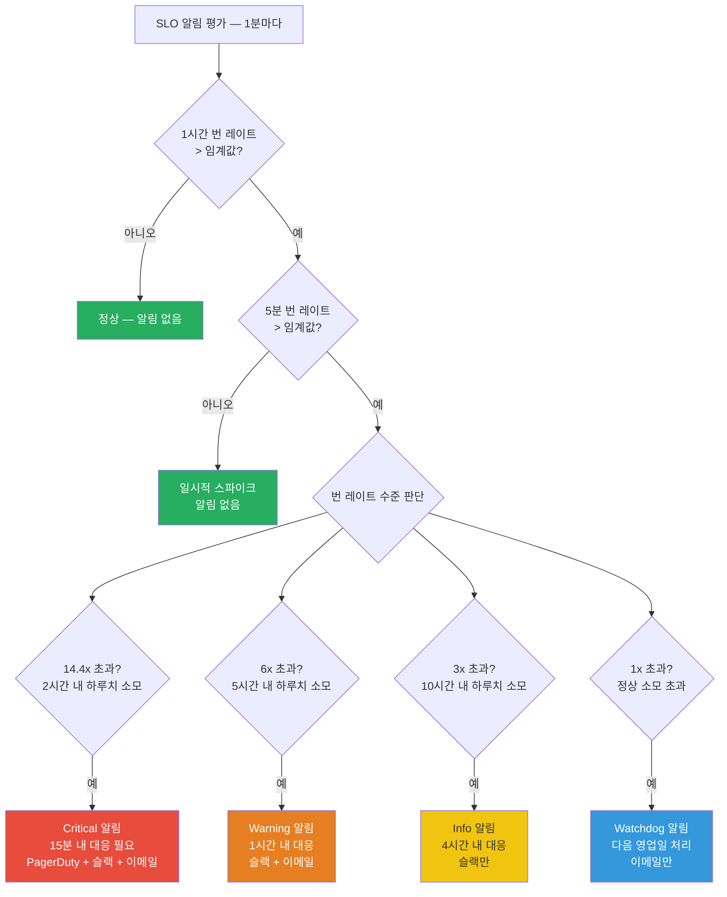
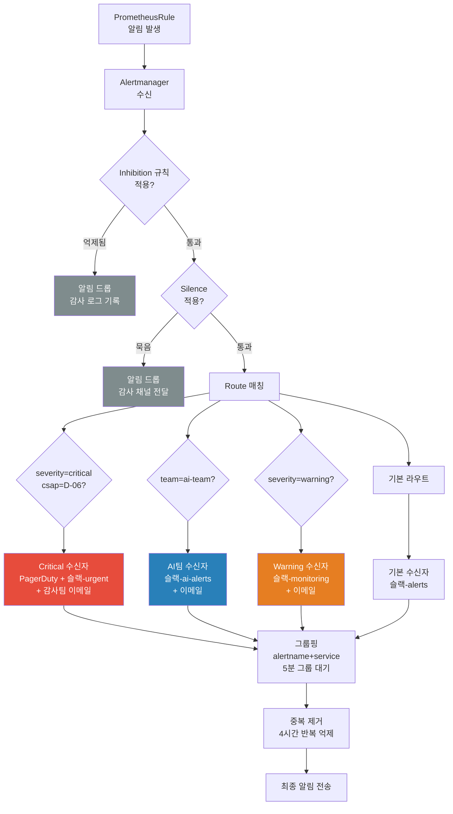

# 고급 알림 설계 — 노이즈 없는 알림, 멀티윈도우 번 레이트, 알림 라우팅 고급 설정

> 대상: 모니터링 입문자 ~ 중급자
> 관련 컴포넌트: `packages/slo-escalation/src/escalation-controller.ts`, `packages/dora-exporter/src/index.ts`
> CSAP 연관: D-06 침해사고 관리, D-07 가용성 관리
> 최종 수정: 2026-04-13

---

## 목차

1. [알림 피로(Alert Fatigue)란?](#1-알림-피로alert-fatigue란)
2. [PromQL 알림 규칙 작성 심화](#2-promql-알림-규칙-작성-심화)
3. [멀티윈도우 번 레이트 SLO 알림](#3-멀티윈도우-번-레이트-slo-알림)
4. [Inhibition — 억제 규칙](#4-inhibition--억제-규칙)
5. [Silence — 묵음 전략](#5-silence--묵음-전략)
6. [AlertManager 라우팅 고급](#6-alertmanager-라우팅-고급)
7. [알림 테스트 방법](#7-알림-테스트-방법)
8. [CSAP D-06 감사 알림 필수 설정](#8-csap-d-06-감사-알림-필수-설정)
9. [실습: SLO 번 레이트 알림 규칙 작성](#9-실습-slo-번-레이트-알림-규칙-작성)

---

## 1. 알림 피로(Alert Fatigue)란?

### 1.1 알림 피로의 정의

알림 피로(Alert Fatigue)는 너무 많은 알림이 쏟아져 담당자가 알림을 무시하게 되는 현상입니다. SRE(사이트 신뢰성 엔지니어링) 분야에서 가장 심각한 운영 문제 중 하나입니다.

**실제 사례**: 공공기관 SaaS 운영팀이 하루에 300개의 알림을 받습니다. 그 중 280개는 자동 복구되는 일시적 문제입니다. 담당자는 결국 슬랙(Slack) 채널을 음소거합니다. 이후 실제 중요한 장애가 발생해도 30분간 아무도 인지하지 못합니다.

### 1.2 왜 알림이 무시되는가

| 원인 | 설명 | 예시 |
|------|------|------|
| 낮은 임계값 | 정상 변동에도 알림 발생 | CPU 70% 초과 알림 — 정상 피크에도 발생 |
| for 없는 규칙 | 1초 이상이면 알림 발생 | 일시적 스파이크도 알림 |
| 중복 알림 | 동일 원인으로 여러 알림 | 노드 장애 시 100개 Pod 알림 동시 발생 |
| 불명확한 알림 | 무엇을, 왜, 어떻게 모름 | "Service Down" — 원인 불명 |
| 야간 저트래픽 알림 | 새벽 4시 CPU 80% | 실제로는 야간 배치 처리 중 |

### 1.3 좋은 알림의 5가지 특성

구글 SRE Book에서 정의한 알림 원칙을 공공기관 SaaS 맥락에 맞게 정리합니다.

```
1. 실행 가능(Actionable)
   → 알림을 받으면 즉시 수행해야 할 행동이 명확해야 합니다.
   → 나쁜 예: "ai-service 응답 지연"
   → 좋은 예: "ai-service p99 지연 5초 초과. 런북 참조: https://runbooks/ai-latency"

2. 긴급한 것만(Urgent)
   → 즉각 대응이 필요한 경우에만 알림을 보냅니다.
   → 일시적으로 자동 복구되면 알림 불필요

3. 명확한 원인(Clear Cause)
   → 무엇이 문제인지, 영향 범위가 어떤지 포함

4. 적절한 수신자(Right Recipient)
   → 야간에는 온콜 담당자만, 주간에는 팀 전체
   → ai-service 장애는 AI팀, 인프라 문제는 인프라팀

5. 중복 없음(Deduplicated)
   → 동일 원인의 알림은 하나로 그룹핑
   → 노드 장애 시 노드 알림 1개, Pod 알림 억제
```

---

## 2. PromQL 알림 규칙 작성 심화

### 2.1 for 지속시간 설정 전략

`for` 필드는 조건이 지속되어야 알림을 발송하는 유예 시간입니다. 이 값의 설정이 알림 품질을 결정합니다.

```yaml
# 나쁜 예: for 없음 (1초 스파이크에도 알림)
- alert: HighCPU
  expr: container_cpu_usage_seconds_total > 0.8

# 좋은 예: 5분 지속 시에만 알림
- alert: HighCPU
  expr: rate(container_cpu_usage_seconds_total[5m]) > 0.8
  for: 5m    # 5분 연속 초과 시에만 알림
```

**for 값 선택 기준**:

| 서비스 유형 | 권장 for 값 | 이유 |
|-------------|-------------|------|
| 인프라 (노드 다운) | 1m | 빠른 감지 필요 |
| API 오류율 | 5m | 일시적 오류 필터링 |
| 응답 지연 | 10m | 트래픽 피크 무시 |
| 용량 부족 | 30m | 점진적 증가 패턴 |
| 보안 이상 | 1m | 즉각 대응 필요 |

### 2.2 레이블 기반 라우팅 설계

PrometheusRule에 레이블을 추가하면 AlertManager에서 팀/채널별로 자동 라우팅됩니다.

```yaml
# 파일: platform/monitoring/alerts/ai-service-alerts.yaml
apiVersion: monitoring.coreos.com/v1
kind: PrometheusRule
metadata:
  name: ai-service-alerts
  namespace: platform
  labels:
    # Prometheus가 이 규칙을 수집하기 위한 레이블
    prometheus: kube-prometheus
    role: alert-rules
spec:
  groups:
  - name: ai-service.rules
    interval: 30s   # 평가 간격 (기본 1m)
    rules:

    # 오류율 알림 (레이블로 라우팅 경로 결정)
    - alert: AIServiceHighErrorRate
      expr: |
        (
          rate(http_requests_total{service="ai-service", status=~"5.."}[5m])
          /
          rate(http_requests_total{service="ai-service"}[5m])
        ) > 0.05
      for: 5m
      labels:
        severity: warning          # AlertManager 라우팅 기준
        team: ai-team              # 담당팀
        service: ai-service        # 영향 서비스
        tier: "1"                  # 서비스 등급 (1=Critical)
        csap: D-06                 # CSAP 연관 항목
      annotations:
        summary: "AI 서비스 오류율 5% 초과"
        description: |
          ai-service의 5분 평균 오류율이 {{ $value | humanizePercentage }} 입니다.
          현재 임계값: 5%
          영향: 사용자 AI 기능 장애
        runbook_url: "https://runbooks.internal/ai-service/high-error-rate"
        dashboard_url: "https://grafana.internal/d/ai-service?var-service=ai-service"
```

### 2.3 알림 주석(annotations) 최적화

알림을 받은 담당자가 10초 내에 상황을 파악할 수 있도록 주석을 작성해야 합니다.

```yaml
annotations:
  # 1줄 요약 (슬랙 제목으로 표시)
  summary: "{{ $labels.service }} 오류율 {{ $value | humanizePercentage }} 초과"

  # 상세 설명 (PromQL 변수 활용)
  description: |
    서비스: {{ $labels.service }}
    네임스페이스: {{ $labels.namespace }}
    현재값: {{ $value | humanizePercentage }}
    임계값: 5%
    지속시간: {{ $for }}
    발생시각: {{ $activeAt }}
    영향 범위: AI 기능을 사용하는 모든 테넌트

  # 런북 링크 (즉각 행동 지침)
  runbook_url: "https://runbooks.internal/ai-service/high-error-rate"

  # 대시보드 링크 (시각화)
  dashboard_url: "https://grafana.internal/d/ai-service"

  # 예상 원인 힌트
  possible_causes: "모델 서버 과부하, 입력 데이터 형식 오류, GPU OOM"
```

**PromQL 주석 템플릿 변수**:

| 변수 | 설명 | 출력 예시 |
|------|------|-----------|
| `$value` | 현재 메트릭 값 | `0.0523` |
| `$value | humanize` | 사람이 읽기 좋은 형식 | `52.3m` |
| `$value | humanizePercentage` | 퍼센트 형식 | `5.23%` |
| `$labels.service` | 서비스 레이블 | `ai-service` |
| `$for` | for 지속 시간 | `5m0s` |

---

## 3. 멀티윈도우 번 레이트 SLO 알림

### 3.1 SLO 번 레이트란?

SLO(서비스 수준 목표) 번 레이트는 에러 버짓(Error Budget)이 소모되는 속도를 측정합니다. 공공기관 SaaS에서 가장 중요한 알림 지표입니다.

**핵심 개념**:
```
에러 버짓(Error Budget)이란?
→ SLO를 "99.9% 가용성"으로 설정하면
→ 30일 중 0.1% = 43.2분을 다운타임으로 "허용"합니다
→ 이 허용된 다운타임이 에러 버짓입니다

번 레이트(Burn Rate)란?
→ 에러 버짓이 소모되는 속도입니다
→ 번 레이트 1 = 정확히 SLO에 맞게 소모 (30일 후 버짓 0)
→ 번 레이트 2 = 2배 속도로 소모 (15일 후 버짓 0)
→ 번 레이트 14.4 = 2시간 내 하루치 버짓 소모
```

### 3.2 왜 멀티윈도우를 사용하는가

단일 시간 창으로만 번 레이트를 측정하면 두 가지 문제가 생깁니다.

```
문제 1: 단기 창만 사용 (예: 5m)
→ 일시적 스파이크에 민감하게 반응 → 허위 알림 과다 (False Positive)

문제 2: 장기 창만 사용 (예: 1h)
→ 실제 장애를 늦게 감지 → 버짓이 이미 다 소모된 후 알림 (False Negative)

해결: 멀티윈도우 (1h + 5m 조합)
→ 1h 창: 지속적인 문제인가? (느린 번 감지)
→ 5m 창: 지금도 문제가 진행 중인가? (빠른 번 감지)
→ 둘 다 임계값 초과 시에만 알림 → 정확도 향상
```

### 3.3 멀티윈도우 번 레이트 알림 조건



### 3.4 실제 PrometheusRule 예제

공공기관 SaaS ai-service의 SLO 번 레이트 알림 규칙입니다.
이 구조는 `packages/slo-escalation/src/escalation-controller.ts`의 `EscalationLevel` 분류 체계와 연동됩니다.

```yaml
# 파일: platform/monitoring/alerts/slo-burn-rate.yaml
apiVersion: monitoring.coreos.com/v1
kind: PrometheusRule
metadata:
  name: slo-burn-rate-alerts
  namespace: platform
spec:
  groups:
  - name: slo_burn_rate.critical
    rules:

    # Critical: 번 레이트 14.4x (2시간 내 하루치 버짓 소모)
    # 멀티윈도우: 1h + 5m 창 모두 초과
    - alert: SLOBurnRateCritical
      expr: |
        (
          # 1시간 창 번 레이트 계산
          (
            rate(http_requests_total{service="ai-service",status=~"5.."}[1h])
            /
            rate(http_requests_total{service="ai-service"}[1h])
          ) > (14.4 * 0.001)  # 99.9% SLO → error_rate_threshold = 0.001
        )
        and
        (
          # 5분 창 번 레이트 (현재도 진행 중인지 확인)
          (
            rate(http_requests_total{service="ai-service",status=~"5.."}[5m])
            /
            rate(http_requests_total{service="ai-service"}[5m])
          ) > (14.4 * 0.001)
        )
      for: 2m
      labels:
        severity: critical
        team: ai-team
        service: ai-service
        slo_window: "1h_5m"
        burn_rate: "14.4"
        csap: "D-06"
      annotations:
        summary: "SLO Critical — ai-service 에러 버짓 2시간 내 소진 위험"
        description: |
          ai-service의 SLO 에러 버짓이 현재 소모 속도(14.4x)로
          2시간 내에 하루치 버짓을 모두 소진합니다.
          
          현재 오류율: {{ $value | humanizePercentage }}
          번 레이트: 14.4x (임계값)
          SLO 목표: 99.9% 가용성
          
          즉각 대응이 필요합니다.
        runbook_url: "https://runbooks.internal/slo/burn-rate-critical"

  - name: slo_burn_rate.warning
    rules:

    # Warning: 번 레이트 6x (5시간 내 하루치 버짓 소모)
    # 멀티윈도우: 6h + 30m 창 모두 초과
    - alert: SLOBurnRateWarning
      expr: |
        (
          (
            rate(http_requests_total{service="ai-service",status=~"5.."}[6h])
            /
            rate(http_requests_total{service="ai-service"}[6h])
          ) > (6 * 0.001)
        )
        and
        (
          (
            rate(http_requests_total{service="ai-service",status=~"5.."}[30m])
            /
            rate(http_requests_total{service="ai-service"}[30m])
          ) > (6 * 0.001)
        )
      for: 15m
      labels:
        severity: warning
        team: ai-team
        service: ai-service
        slo_window: "6h_30m"
        burn_rate: "6"
        csap: "D-06"
      annotations:
        summary: "SLO Warning — ai-service 에러 버짓 5시간 내 소진 위험"
        description: |
          ai-service의 SLO 에러 버짓이 현재 소모 속도(6x)로
          5시간 내에 하루치 버짓을 소진합니다.
          
          1시간 내 원인을 파악하고 대응하십시오.
        runbook_url: "https://runbooks.internal/slo/burn-rate-warning"

  - name: slo_burn_rate.slow
    rules:

    # Slow Burn: 번 레이트 3x (장시간 지속되는 낮은 오류율)
    # 멀티윈도우: 24h + 2h 창 모두 초과
    - alert: SLOBurnRateSlow
      expr: |
        (
          (
            rate(http_requests_total{service="ai-service",status=~"5.."}[24h])
            /
            rate(http_requests_total{service="ai-service"}[24h])
          ) > (3 * 0.001)
        )
        and
        (
          (
            rate(http_requests_total{service="ai-service",status=~"5.."}[2h])
            /
            rate(http_requests_total{service="ai-service"}[2h])
          ) > (3 * 0.001)
        )
      for: 1h
      labels:
        severity: warning
        team: ai-team
        service: ai-service
        slo_window: "24h_2h"
        burn_rate: "3"
        csap: "D-06"
      annotations:
        summary: "SLO Slow Burn — ai-service 에러 버짓 점진적 소진"
        description: |
          ai-service의 낮은 오류율이 24시간 이상 지속되고 있습니다.
          번 레이트 3x = 10일치 버짓을 3.3일에 소진하는 속도입니다.
          
          즉각 위험은 아니지만 근본 원인 조사가 필요합니다.
```

### 3.5 DORA 지표 연계 알림

`packages/dora-exporter/src/index.ts`에서 수집되는 DORA 지표와 SLO 알림을 연계합니다.

```yaml
# DORA 변경 실패율 기반 알림
# dora-exporter가 수집하는 dora_change_failure_rate 메트릭 활용
- alert: DORAChangeFailureRateHigh
  expr: |
    dora_change_failure_rate{service="ai-service"} > 0.15
  for: 10m
  labels:
    severity: warning
    team: ai-team
    service: ai-service
    dora_metric: change_failure_rate
  annotations:
    summary: "DORA 변경 실패율 15% 초과 — ai-service"
    description: |
      최근 배포의 변경 실패율이 {{ $value | humanizePercentage }} 입니다.
      DORA Elite 기준: 15% 미만
      현재 등급: Medium 이하
      
      배포 품질 개선이 필요합니다.
    runbook_url: "https://runbooks.internal/dora/change-failure-rate"

# DORA 서비스 복구 시간 기반 알림
- alert: DORAMTTRExceeded
  expr: |
    histogram_quantile(0.5, rate(dora_mttr_seconds_bucket{service="ai-service"}[24h])) > 3600
  for: 5m
  labels:
    severity: warning
    team: ai-team
  annotations:
    summary: "DORA MTTR 1시간 초과 — ai-service"
    description: |
      중간값 서비스 복구 시간이 {{ $value | humanizeDuration }} 입니다.
      DORA Elite 기준: 1시간 미만
```

### 3.6 SLO 에스컬레이션 컨트롤러 연동

`packages/slo-escalation/src/escalation-controller.ts`의 `EscalationLevel` 열거형과 번 레이트를 매핑합니다.

```typescript
// escalation-controller.ts 참조
export enum EscalationLevel {
  Normal = 'normal',      // budgetBurnRate <= 50%
  Warning = 'warning',    // budgetBurnRate <= 75%
  Danger = 'danger',      // budgetBurnRate <= 90%
  Critical = 'critical',  // budgetBurnRate <= 100%
  Violated = 'violated',  // budgetBurnRate > 100%
}

// determineEscalationLevel 함수 매핑
// 번 레이트 ↔ 버짓 소진율 ↔ 에스컬레이션 레벨
```

```yaml
# 에스컬레이션 컨트롤러 트리거용 알림 규칙
# AlertManager Webhook → slo-escalation 서비스 호출
- alert: SLOEscalationTrigger
  expr: |
    # 에러 버짓 소진율 계산 (30일 기준)
    1 - (
      sum_over_time(
        (1 - rate(http_requests_total{service="ai-service",status=~"5.."}[5m])
            / rate(http_requests_total{service="ai-service"}[5m]))[30d:5m]
      ) / (30 * 24 * 12)
    )
  for: 5m
  labels:
    severity: info
    team: ai-team
    trigger_escalation: "true"   # 에스컬레이션 컨트롤러 트리거 플래그
  annotations:
    budget_remaining: "{{ $value | humanizePercentage }}"
    summary: "SLO 에러 버짓 소진율 알림"
```

---

## 4. Inhibition — 억제 규칙

### 4.1 Inhibition이란?

Inhibition은 상위 알림이 발생했을 때 하위 알림을 자동으로 억제하는 기능입니다. 노드 1개가 다운되면 그 노드의 모든 Pod에서 알림이 발생하는데, 노드 알림 1개만 남기고 Pod 알림 수백 개를 억제합니다.

### 4.2 Inhibition 설정 예시

```yaml
# 파일: platform/monitoring/alertmanager/config.yaml
inhibit_rules:
  # 규칙 1: 노드 다운 시 → 해당 노드의 Pod 알림 억제
  - source_matchers:
      - alertname = NodeDown
    target_matchers:
      - alertname =~ "Pod.*"
    # source와 target의 node 레이블이 같을 때만 억제
    equal: [node]

  # 규칙 2: Critical 알림 발생 시 → 동일 서비스의 Warning 알림 억제
  - source_matchers:
      - severity = critical
    target_matchers:
      - severity = warning
    equal: [service, namespace]

  # 규칙 3: 배포 중 — 특정 서비스의 알림 억제
  # (배포 시 임시로 source 알림 발송하여 target 억제)
  - source_matchers:
      - alertname = DeploymentInProgress
    target_matchers:
      - alertname =~ ".*HighErrorRate|.*HighLatency"
    equal: [service]

  # 규칙 4: 상위 의존성 장애 시 → 의존 서비스 알림 억제
  - source_matchers:
      - alertname = DatabaseDown
    target_matchers:
      - alertname =~ "AIService.*|APIGateway.*"
    # 동일 테넌트(namespace)만 억제
    equal: [namespace]
```

### 4.3 배포 중 알림 억제 자동화

배포 파이프라인에서 자동으로 Inhibition source 알림을 발송합니다.

```yaml
# 파일: .gitea/workflows/deploy-with-silence.yml
# Gitea CI/CD에서 배포 시작 시 AlertManager에 임시 억제 신호 전송

- name: 배포 중 알림 억제 시작
  run: |
    # amtool로 Silence 생성 (배포 완료까지 30분)
    amtool --alertmanager.url=http://alertmanager:9093 silence add \
      --comment="배포 중 알림 억제 — ${{ gitea.run_id }}" \
      --duration="30m" \
      'alertname=~"AIService.*"' \
      'service=ai-service'
    
    # Silence ID 저장
    echo "SILENCE_ID=$(amtool silence query ... | tail -1 | awk '{print $1}')" >> $GITEA_ENV

- name: 배포 완료 후 억제 해제
  if: always()
  run: |
    amtool --alertmanager.url=http://alertmanager:9093 silence expire $SILENCE_ID
```

---

## 5. Silence — 묵음 전략

### 5.1 Silence란?

Silence는 특정 레이블 조건의 알림을 일정 기간 동안 묵음 처리합니다. 계획된 유지보수 시 알림 홍수를 방지하는 데 사용합니다.

```bash
# Silence 생성 (CLI 방식)
amtool --alertmanager.url=http://alertmanager:9093 silence add \
  --comment="야간 유지보수 — ai-service 재시작" \
  --start="2026-04-14T00:00:00+09:00" \
  --end="2026-04-14T04:00:00+09:00" \
  'service=ai-service' \
  'severity=~"warning|info"'

# Silence 목록 확인
amtool --alertmanager.url=http://alertmanager:9093 silence query

# 특정 Silence 만료 처리
amtool --alertmanager.url=http://alertmanager:9093 silence expire <SILENCE_ID>
```

### 5.2 Silence 남용 방지 정책

공공기관 SaaS에서 Silence는 CSAP D-06 감사 로그 요건과 충돌할 수 있으므로 관리 정책이 필요합니다.

```yaml
# Silence 거버넌스 정책
silence_policy:
  # Silence 생성 권한
  allowed_creators:
    - role: sre-team
    - role: infra-admin
  
  # 최대 지속 시간
  max_duration: "24h"
  
  # 필수 포함 필드
  required_comment:
    - 묵음 사유
    - 변경 요청 번호 (CSAP 감사)
    - 담당자명
  
  # 금지 패턴
  forbidden_matchers:
    # Critical 알림은 Silence 금지
    - 'severity=critical'
    # CSAP 감사 알림은 Silence 금지
    - 'csap=D-06'
  
  # 알림 정책
  notification:
    # Silence 생성/만료 시 감사팀에 알림
    on_create: audit-team@agency.go.kr
    on_expire: audit-team@agency.go.kr
```

### 5.3 CSAP 요건과 Silence 충돌 해결

```
CSAP D-06 요건: 모든 침해사고 관련 알림은 기록 필수
Silence 위험: 중요 알림을 묵음 처리하면 감사 증거 손실 가능

해결 방법:
1. Silence가 걸린 알림도 별도 감사 채널에는 전달
2. Silence 자체를 감사 로그에 기록
3. Critical 레벨 알림에는 Silence 적용 금지
```

```yaml
# 감사 전용 수신자 설정 — Silence 영향 없음
receivers:
- name: audit-channel
  webhook_configs:
  - url: "http://audit-service:8080/api/alerts"
    # Silence 여부와 관계없이 항상 전달
    # AlertManager의 --alerts.inhibit-rules 플래그와 별도 설정
```

---

## 6. AlertManager 라우팅 고급

### 6.1 알림 라우팅 전체 경로



### 6.2 AlertManager 설정 전체 예시

```yaml
# 파일: platform/monitoring/alertmanager/config.yaml
global:
  resolve_timeout: 5m
  smtp_from: 'noreply-alertmanager@agency.go.kr'
  smtp_smarthost: 'smtp.agency.go.kr:587'
  smtp_require_tls: true

# 라우팅 트리
route:
  # 기본 그룹핑: 같은 alertname+service+namespace는 묶어서 발송
  group_by: ['alertname', 'service', 'namespace']
  group_wait: 30s        # 그룹 첫 알림 대기 시간
  group_interval: 5m     # 같은 그룹 추가 알림 대기
  repeat_interval: 4h    # 해소 안 된 알림 재발송 간격
  receiver: default

  routes:
  # Critical — 최우선 처리
  - match:
      severity: critical
    receiver: critical-channel
    group_wait: 0s         # 즉시 발송
    repeat_interval: 30m   # 30분마다 재알림 (해소될 때까지)
    continue: true         # 다음 라우트도 적용 (감사 채널로도 전송)

  # CSAP 감사 필수 알림
  - match:
      csap: D-06
    receiver: audit-channel
    group_by: ['alertname', 'service']

  # AI팀 전용 알림
  - match:
      team: ai-team
    receiver: ai-team-channel
    routes:
    # AI팀 Critical은 즉시 PagerDuty
    - match:
        severity: critical
      receiver: ai-team-pagerduty

  # 인프라팀 알림
  - match:
      team: infra-team
    receiver: infra-team-channel

  # Warning — 팀 슬랙
  - match_re:
      severity: ^(warning|info)$
    receiver: monitoring-channel
    repeat_interval: 12h

# 수신자 정의
receivers:
- name: default
  slack_configs:
  - api_url: "{{ env \"SLACK_WEBHOOK_DEFAULT\" }}"
    channel: '#ops-alerts'
    title: '{{ template "slack.title" . }}'
    text: '{{ template "slack.body" . }}'

- name: critical-channel
  pagerduty_configs:
  - routing_key: "{{ env \"PAGERDUTY_KEY\" }}"
    severity: critical
    description: '{{ template "pagerduty.description" . }}'
  slack_configs:
  - api_url: "{{ env \"SLACK_WEBHOOK_URGENT\" }}"
    channel: '#incident-response'
    color: 'danger'
    title: ':rotating_light: CRITICAL: {{ .GroupLabels.alertname }}'

- name: ai-team-channel
  slack_configs:
  - api_url: "{{ env \"SLACK_WEBHOOK_AI_TEAM\" }}"
    channel: '#ai-team-alerts'
    title: '{{ template "slack.title" . }}'
  email_configs:
  - to: 'ai-team@agency.go.kr'
    send_resolved: true

- name: audit-channel
  webhook_configs:
  - url: 'http://audit-service.platform:8080/api/alerts/ingest'
    send_resolved: true
    http_config:
      bearer_token_file: /var/run/secrets/audit-token

- name: monitoring-channel
  slack_configs:
  - api_url: "{{ env \"SLACK_WEBHOOK_MONITORING\" }}"
    channel: '#monitoring'
    title: '{{ template "slack.title" . }}'

# 억제 규칙
inhibit_rules:
- source_matchers:
    - severity = critical
  target_matchers:
    - severity = warning
  equal: [alertname, service]
```

### 6.3 Continue 속성 활용

`continue: true`를 사용하면 한 수신자로 보낸 후 다음 라우트도 계속 평가합니다.

```yaml
routes:
# Critical 알림을 critical-channel로 보내고
- match:
    severity: critical
  receiver: critical-channel
  continue: true    # 여기서 멈추지 않고 다음 라우트도 평가

# 동시에 팀별 채널로도 전송
- match:
    team: ai-team
  receiver: ai-team-channel
# continue 없음 → 여기서 라우팅 종료
```

### 6.4 그룹핑 최적화

```yaml
# 그룹핑 전략:
# - 너무 넓은 그룹: 다른 서비스 알림이 묶여 혼란
# - 너무 좁은 그룹: Pod 하나하나 별도 알림 → 알림 폭발

# 권장: alertname + service + namespace
group_by: ['alertname', 'service', 'namespace']

# 특수 케이스: 배포 알림은 환경(environment)도 포함
# - production 알림과 staging 알림 분리
routes:
- match_re:
    alertname: ^Deploy.*
  group_by: ['alertname', 'service', 'environment']
  receiver: deploy-channel
```

---

## 7. 알림 테스트 방법

### 7.1 amtool로 알림 시뮬레이션

```bash
# amtool 설치 확인
amtool --version

# AlertManager 접속 설정
export ALERTMANAGER_URL="http://alertmanager.platform:9093"

# 테스트 알림 발송
amtool alert add \
  alertname="TestSLOBurnRate" \
  severity="critical" \
  service="ai-service" \
  team="ai-team" \
  --annotation=summary="테스트 알림: SLO 번 레이트 초과" \
  --annotation=description="이것은 알림 라우팅 테스트입니다." \
  --alertmanager.url="$ALERTMANAGER_URL"

# 알림 목록 확인
amtool alert query --alertmanager.url="$ALERTMANAGER_URL"

# 라우팅 테스트 (실제 알림은 발송하지 않고 라우팅만 확인)
amtool config routes test \
  --alertmanager.url="$ALERTMANAGER_URL" \
  severity="critical" \
  service="ai-service" \
  team="ai-team"
```

### 7.2 PrometheusRule 테스트

```bash
# PromQL 규칙 문법 검사
promtool check rules /path/to/slo-burn-rate.yaml

# 출력 예시:
# Checking /path/to/slo-burn-rate.yaml
#   SUCCESS: 12 rules found

# 실제 데이터로 알림 평가 테스트
# (Thanos Ruler 또는 Prometheus 쿼리)
curl -g 'http://prometheus:9090/api/v1/query?query=
  rate(http_requests_total{service="ai-service",status=~"5.."}[1h])
  /
  rate(http_requests_total{service="ai-service"}[1h])
  > 0.0144'
```

### 7.3 알림 E2E 테스트 스크립트

```bash
#!/bin/bash
# 파일: scripts/test-alert-routing.sh
# 알림 라우팅 E2E 테스트

set -euo pipefail

ALERTMANAGER_URL="${ALERTMANAGER_URL:-http://alertmanager.platform:9093}"
SLACK_TEST_CHANNEL="${SLACK_TEST_CHANNEL:-#alerts-test}"

echo "=== AlertManager 알림 라우팅 E2E 테스트 ==="

# 1. Critical 알림 테스트
echo "1. Critical 알림 전송..."
amtool alert add \
  alertname="E2ETestCritical" \
  severity="critical" \
  service="ai-service" \
  team="ai-team" \
  namespace="platform" \
  --annotation=summary="E2E 테스트 - Critical 알림" \
  --alertmanager.url="$ALERTMANAGER_URL"

sleep 5

# 2. Warning 알림 테스트
echo "2. Warning 알림 전송..."
amtool alert add \
  alertname="E2ETestWarning" \
  severity="warning" \
  service="api-gateway" \
  team="infra-team" \
  --annotation=summary="E2E 테스트 - Warning 알림" \
  --alertmanager.url="$ALERTMANAGER_URL"

sleep 5

# 3. Inhibition 테스트 (Critical이 Warning을 억제하는지 확인)
echo "3. 억제 규칙 확인..."
amtool alert add \
  alertname="E2ETestWarningInhibited" \
  severity="warning" \
  service="ai-service" \   # ai-service Critical이 있으므로 억제되어야 함
  team="ai-team" \
  --annotation=summary="E2E 테스트 - 억제되어야 하는 Warning" \
  --alertmanager.url="$ALERTMANAGER_URL"

# 4. 결과 확인
echo "=== 현재 알림 목록 ==="
amtool alert query --alertmanager.url="$ALERTMANAGER_URL"

# 5. 테스트 알림 정리
echo "=== 테스트 알림 만료 처리 ==="
for alertname in E2ETestCritical E2ETestWarning E2ETestWarningInhibited; do
  amtool alert query --alertmanager.url="$ALERTMANAGER_URL" \
    "alertname=$alertname" | while read -r id; do
    echo "만료: $id"
  done
done

echo "=== 테스트 완료 ==="
```

---

## 8. CSAP D-06 감사 알림 필수 설정

### 8.1 CSAP D-06 요건 분석

CSAP D-06 침해사고 관리 항목에서 요구하는 알림 설정입니다.

| 요건 코드 | 내용 | AlertManager 설정 |
|-----------|------|-------------------|
| D-06.1 | 침해사고 탐지 및 대응 | 보안 이상 알림 규칙 |
| D-06.2 | 로그 수집 및 보존 | 감사 채널로 알림 전달 |
| D-06.3 | 침해사고 통보 | 감사팀 이메일 수신자 |
| D-06.4 | 대응 이력 관리 | AlertManager 히스토리 |
| D-06.5 | 월별 현황 보고 | 월간 알림 리포트 |

### 8.2 보안 이상 감지 알림 규칙

```yaml
# 파일: platform/monitoring/alerts/security-alerts.yaml
apiVersion: monitoring.coreos.com/v1
kind: PrometheusRule
metadata:
  name: csap-d06-security-alerts
  namespace: platform
  labels:
    csap: D-06
spec:
  groups:
  - name: security.rules
    rules:

    # 비정상 API 접근 패턴
    - alert: SecurityAbnormalAPIAccess
      expr: |
        rate(http_requests_total{
          status="403",
          namespace=~"tenant-.*"
        }[5m]) > 10
      for: 2m
      labels:
        severity: critical
        team: security-team
        csap: D-06
        notification_required: "true"   # CSAP 통보 필수
      annotations:
        summary: "비정상 API 접근 감지 — {{ $labels.namespace }}"
        description: |
          5분 내 403 오류 {{ $value }} 건 발생
          테넌트: {{ $labels.namespace }}
          
          CSAP D-06 요건: 즉각 보안팀 통보 필수
        runbook_url: "https://runbooks.internal/security/abnormal-access"

    # 인증 실패 과다
    - alert: SecurityAuthFailureSpike
      expr: |
        rate(auth_login_failure_total[5m]) > 5
      for: 1m
      labels:
        severity: critical
        team: security-team
        csap: D-06
      annotations:
        summary: "인증 실패 급증 — 브루트포스 공격 의심"
        description: |
          분당 인증 실패 {{ $value }} 건
          브루트포스 공격 또는 크리덴셜 스터핑 가능성
          CSAP D-06: 즉각 차단 조치 필요

    # 민감 데이터 접근 이상
    - alert: SecuritySensitiveDataAccess
      expr: |
        rate(data_access_total{
          data_grade=~"C|S",
          result="denied"
        }[10m]) > 0
      for: 0s    # 즉시 알림 (for 없음)
      labels:
        severity: critical
        csap: D-06
        team: security-team
      annotations:
        summary: "C/S등급 데이터 무단 접근 시도"
        description: |
          N2SF 분류 C/S등급 데이터 무단 접근 시도 탐지
          접근 거부 건수: {{ $value }}
          CSAP D-06 + N2SF N-05: 즉각 조사 및 통보 필수

    # AI API N2SF 위반 감지
    - alert: SecurityN2SFViolation
      expr: |
        rate(ai_api_blocked_total{reason="data_grade_violation"}[5m]) > 0
      for: 0s
      labels:
        severity: critical
        csap: D-06
        team: security-team
      annotations:
        summary: "N2SF AI API 전송 금지 위반 시도 탐지"
        description: |
          C/S등급 데이터를 AI API로 전송하려는 시도가 탐지되었습니다.
          N2SF N-05 규정 위반입니다.
          즉각 담당자 조사 및 CSAP 증거 기록이 필요합니다.
```

### 8.3 감사 알림 수신자 설정

```yaml
# 감사팀 전용 수신자 (Silence 영향 없이 항상 전달)
receivers:
- name: csap-audit-required
  email_configs:
  - to: 'security@agency.go.kr, audit@agency.go.kr'
    from: 'alertmanager@agency.go.kr'
    subject: '[CSAP D-06] {{ .GroupLabels.alertname }} — 즉각 조치 필요'
    body: |
      CSAP D-06 침해사고 관리 알림

      발생 시각: {{ .CommonAnnotations.activeAt }}
      알림명: {{ .GroupLabels.alertname }}
      심각도: {{ .CommonLabels.severity }}
      
      {{ range .Alerts }}
      서비스: {{ .Labels.service }}
      설명: {{ .Annotations.description }}
      런북: {{ .Annotations.runbook_url }}
      {{ end }}
      
      이 알림은 CSAP D-06 요건에 따라 자동으로 발송되었습니다.
      감사 로그: https://audit.internal/alerts
    send_resolved: true
    require_tls: true
  webhook_configs:
  # 감사 서비스에 webhook으로도 전달 (append-only 감사 로그)
  - url: 'http://audit-service.platform:8080/api/alerts/csap-d06'
    send_resolved: true
```

---

## 9. 실습: SLO 번 레이트 알림 규칙 작성

### 9.1 실습 목표

이 실습에서는 ai-service의 SLO(99.9% 가용성)에 대한 멀티윈도우 번 레이트 알림을 직접 작성합니다.

- SLO: 99.9% 가용성 (월 43분 다운타임 허용)
- 알림: Critical (14.4x), Warning (6x), Slow Burn (3x)
- 연동: slo-escalation 컨트롤러

### 9.2 전제 조건 확인

```bash
# Prometheus 접근 가능 여부 확인
curl http://prometheus.platform:9090/api/v1/status/config | jq '.status'

# AlertManager 접근 확인
curl http://alertmanager.platform:9093/api/v1/status | jq '.status'

# 현재 ai-service 메트릭 확인
curl -g 'http://prometheus.platform:9090/api/v1/query?query=
  rate(http_requests_total{service="ai-service"}[5m])' | jq '.data.result'
```

### 9.3 단계별 구현

#### 단계 1: SLO 기준값 계산

```python
# SLO 기준값 계산 스크립트 (참고용)
# 파일: scripts/calculate-slo-thresholds.py

slo_target = 0.999           # 99.9% 가용성
error_rate_threshold = 1 - slo_target  # = 0.001

# 멀티윈도우 번 레이트 임계값
burn_rates = {
    'critical': {
        'rate': 14.4,
        'window_long': '1h',
        'window_short': '5m',
        'budget_exhaustion': '2h',  # 2시간 내 하루치 버짓 소모
    },
    'warning': {
        'rate': 6,
        'window_long': '6h',
        'window_short': '30m',
        'budget_exhaustion': '5h',
    },
    'slow_burn': {
        'rate': 3,
        'window_long': '24h',
        'window_short': '2h',
        'budget_exhaustion': '10h',
    },
}

for level, config in burn_rates.items():
    threshold = config['rate'] * error_rate_threshold
    print(f"{level}: {config['window_long']} 창 오류율 임계값 = {threshold:.6f} ({threshold*100:.4f}%)")

# 출력:
# critical: 1h 창 오류율 임계값 = 0.014400 (1.4400%)
# warning: 6h 창 오류율 임계값 = 0.006000 (0.6000%)
# slow_burn: 24h 창 오류율 임계값 = 0.003000 (0.3000%)
```

#### 단계 2: PrometheusRule 파일 작성

```bash
# 파일 생성
cat > /tmp/ai-service-slo-alerts.yaml << 'EOF'
apiVersion: monitoring.coreos.com/v1
kind: PrometheusRule
metadata:
  name: ai-service-slo-alerts
  namespace: platform
  labels:
    prometheus: kube-prometheus
    role: alert-rules
    csap: D-06
spec:
  groups:
  - name: ai_service_slo.critical
    rules:
    - alert: AIServiceSLOBurnRateCritical
      expr: |
        (
          rate(http_requests_total{
            service="ai-service",
            status=~"5.."
          }[1h])
          /
          rate(http_requests_total{
            service="ai-service"
          }[1h])
        ) > 0.01440
        and
        (
          rate(http_requests_total{
            service="ai-service",
            status=~"5.."
          }[5m])
          /
          rate(http_requests_total{
            service="ai-service"
          }[5m])
        ) > 0.01440
      for: 2m
      labels:
        severity: critical
        team: ai-team
        service: ai-service
        slo: availability
        burn_rate: "14.4"
        csap: D-06
      annotations:
        summary: "ai-service SLO Critical — 2시간 내 일간 에러 버짓 소진"
        description: |
          ai-service 오류율이 SLO 임계값(번 레이트 14.4x)을 초과했습니다.
          현재 오류율: {{ $value | humanizePercentage }}
          임계 오류율: 1.44% (번 레이트 14.4x)
          예상 버짓 소진: 2시간 내 하루치 버짓 전부 소진
          즉각 대응이 필요합니다.
        runbook_url: "https://runbooks.internal/ai-service/slo-critical"
        dashboard_url: "https://grafana.internal/d/ai-slo"

  - name: ai_service_slo.warning
    rules:
    - alert: AIServiceSLOBurnRateWarning
      expr: |
        (
          rate(http_requests_total{
            service="ai-service",
            status=~"5.."
          }[6h])
          /
          rate(http_requests_total{
            service="ai-service"
          }[6h])
        ) > 0.00600
        and
        (
          rate(http_requests_total{
            service="ai-service",
            status=~"5.."
          }[30m])
          /
          rate(http_requests_total{
            service="ai-service"
          }[30m])
        ) > 0.00600
      for: 15m
      labels:
        severity: warning
        team: ai-team
        service: ai-service
        slo: availability
        burn_rate: "6"
        csap: D-06
      annotations:
        summary: "ai-service SLO Warning — 5시간 내 일간 에러 버짓 소진"
        description: |
          ai-service 오류율이 번 레이트 6x 임계값을 초과했습니다.
          현재 오류율: {{ $value | humanizePercentage }}
          임계 오류율: 0.6% (번 레이트 6x)
          1시간 내 원인 파악 및 대응 필요.
        runbook_url: "https://runbooks.internal/ai-service/slo-warning"

  - name: ai_service_slo.slow_burn
    rules:
    - alert: AIServiceSLOSlowBurn
      expr: |
        (
          rate(http_requests_total{
            service="ai-service",
            status=~"5.."
          }[24h])
          /
          rate(http_requests_total{
            service="ai-service"
          }[24h])
        ) > 0.00300
        and
        (
          rate(http_requests_total{
            service="ai-service",
            status=~"5.."
          }[2h])
          /
          rate(http_requests_total{
            service="ai-service"
          }[2h])
        ) > 0.00300
      for: 1h
      labels:
        severity: warning
        team: ai-team
        service: ai-service
        slo: availability
        burn_rate: "3"
        csap: D-06
      annotations:
        summary: "ai-service SLO Slow Burn — 낮은 오류율 장기 지속"
        description: |
          ai-service의 낮은 오류율이 24시간 이상 지속되고 있습니다.
          번 레이트 3x = 10일치 버짓을 3.3일에 소진.
          즉각 위험은 아니지만 근본 원인 조사 권장.
        runbook_url: "https://runbooks.internal/ai-service/slo-slow-burn"
EOF

# 적용
kubectl apply -f /tmp/ai-service-slo-alerts.yaml

# 적용 확인
kubectl get prometheusrule ai-service-slo-alerts -n platform
```

#### 단계 3: 알림 규칙 검증

```bash
# PromQL 문법 검사
promtool check rules /tmp/ai-service-slo-alerts.yaml

# Prometheus에서 쿼리 직접 테스트
# 현재 오류율 확인 (실제 값 없으면 0 반환 — 정상)
curl -sg 'http://prometheus.platform:9090/api/v1/query' \
  --data-urlencode 'query=rate(http_requests_total{service="ai-service",status=~"5.."}[1h])
  / rate(http_requests_total{service="ai-service"}[1h])' \
  | jq '.data.result'

# 알림 규칙이 Prometheus에서 인식되었는지 확인
curl -s http://prometheus.platform:9090/api/v1/rules | \
  jq '.data.groups[] | select(.name | contains("ai_service_slo"))'
```

#### 단계 4: slo-escalation 컨트롤러 정책 등록

```typescript
// escalation-controller.ts의 registerPolicy 메서드 활용
// 파일: platform/services/ai-service/src/setup-slo-policy.ts

import { SLOEscalationController, EscalationLevel, NotificationChannel } from '@ai-saas/slo-escalation';

const controller = new SLOEscalationController();

// ai-service SLO 에스컬레이션 정책 등록
controller.registerPolicy({
  name: 'ai-service-slo-policy',
  service: 'ai-service',
  levels: [
    {
      level: EscalationLevel.Warning,
      budgetBurnRateMin: 50,
      budgetBurnRateMax: 75,
      contacts: [
        { name: 'AI팀 슬랙', channel: NotificationChannel.Slack, target: '#ai-team-alerts' },
      ],
      waitMinutes: 30,
      actions: [],
    },
    {
      level: EscalationLevel.Danger,
      budgetBurnRateMin: 75,
      budgetBurnRateMax: 90,
      contacts: [
        { name: 'AI팀 슬랙', channel: NotificationChannel.Slack, target: '#ai-team-alerts' },
        { name: 'AI팀 이메일', channel: NotificationChannel.Email, target: 'ai-team@agency.go.kr' },
      ],
      waitMinutes: 15,
      actions: ['notify-product-owner'],
    },
    {
      level: EscalationLevel.Critical,
      budgetBurnRateMin: 90,
      budgetBurnRateMax: 100,
      contacts: [
        { name: '긴급 슬랙', channel: NotificationChannel.Slack, target: '#incident-response' },
        { name: '온콜 PagerDuty', channel: NotificationChannel.Webhook, target: 'https://pagerduty.../ai-team' },
      ],
      waitMinutes: 0,
      actions: ['freeze-deployments', 'create-incident-ticket'],
    },
    {
      level: EscalationLevel.Violated,
      budgetBurnRateMin: 100,
      budgetBurnRateMax: 200,
      contacts: [
        { name: '경영진 이메일', channel: NotificationChannel.Email, target: 'cto@agency.go.kr' },
        { name: '긴급 슬랙', channel: NotificationChannel.Slack, target: '#incident-response' },
      ],
      waitMinutes: 0,
      actions: ['freeze-deployments', 'create-postmortem', 'notify-csap-team'],
    },
  ],
});
```

#### 단계 5: 결과 확인

```bash
# Prometheus Alert 목록에서 신규 규칙 확인
curl -s http://prometheus.platform:9090/api/v1/alerts | \
  jq '.data.alerts[] | select(.labels.service == "ai-service" and (.labels.slo // "" | length > 0))'

# AlertManager 현재 수신 알림 확인
amtool alert query \
  --alertmanager.url=http://alertmanager.platform:9093 \
  'service=ai-service'

# 정상 상태면 알림 없음
# 알림이 있다면 즉각 대응 필요
```

---

## 참고 자료

- [Google SRE Book: Alerting on SLOs](https://sre.google/workbook/alerting-on-slos/)
- [AlertManager 공식 문서](https://prometheus.io/docs/alerting/latest/alertmanager/)
- [PromQL 멀티윈도우 번 레이트 레퍼런스](https://prometheus.io/docs/practices/alerting/)
- [CSAP 가이드라인: D-06 침해사고 관리](https://www.kisa.or.kr/csap)
- 관련 소스: `/data/ai-saas/packages/slo-escalation/src/escalation-controller.ts`
- 관련 소스: `/data/ai-saas/packages/dora-exporter/src/index.ts`
- 관련 가이드: `05-monitoring/alerting/01-alertmanager-guide.md` (기본 설정)
- 관련 가이드: `05-monitoring/slo/01-slo-guide.md` (SLO 기초)

---

*문서 버전: 1.0.0 | 작성일: 2026-04-13 | 담당: SRE팀*
*Design Ref: MTU-N178 | CSAP: D-06, D-07*
